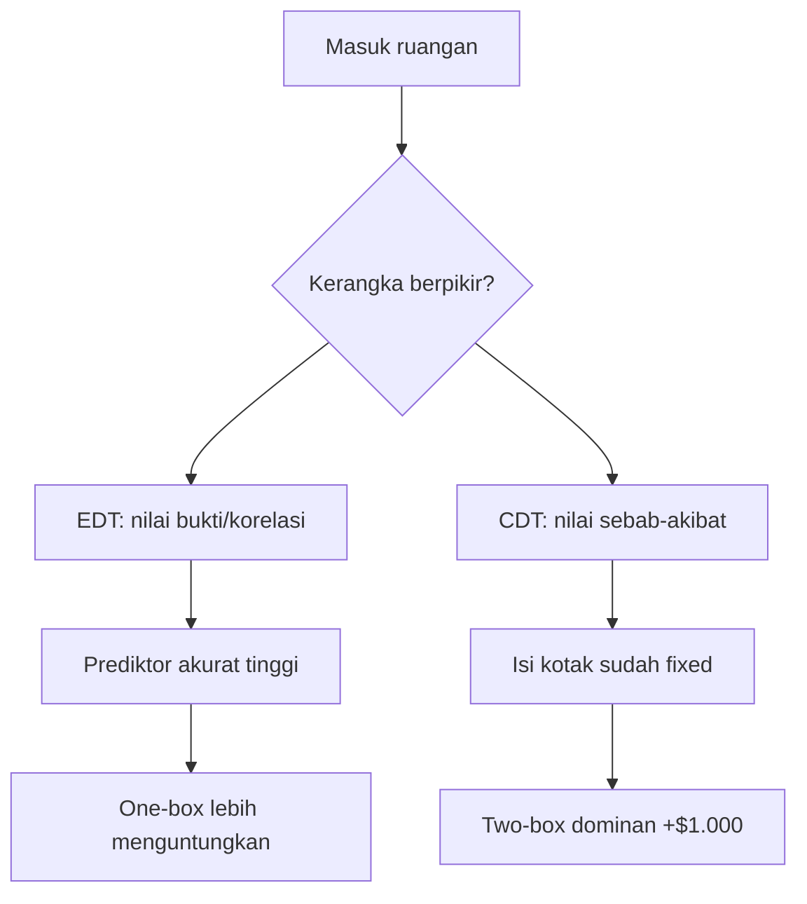
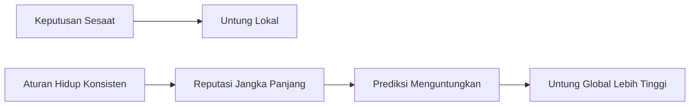
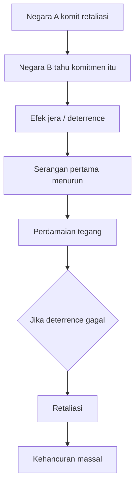

<YouTube url="https://www.youtube.com/watch?v=Ol18JoeXlVI" title="This Paradox Splits Smart People 50/50" />

## 🧭 Pengantar: Saat Orang Sama-Sama Rasional, Tapi Sampai ke Jawaban yang Berlawanan

Ada problem filsafat keputusan yang sangat terkenal karena efeknya “mengganggu”: **Paradoks Newcomb**. Problem ini bukan sekadar teka-teki uang, melainkan cermin cara kita memandang realitas, sebab-akibat, dan rasionalitas itu sendiri. 🧠

Kenapa mengganggu? Karena dua kelompok yang sama-sama cerdas, sama-sama logis, sama-sama bisa menjelaskan argumennya dengan rapi… bisa berakhir dengan keputusan yang berlawanan total:

- **One-boxer** (ambil kotak misteri saja)
- **Two-boxer** (ambil dua kotak sekaligus)

Artikel ini membedah transkrip video secara detail, dari inti paradoks, kerangka matematis, fondasi teoritis, sampai dampaknya ke strategi hidup dan politik global.

---

## 🎯 Setup Paradoks Newcomb (Versi Ringkas tapi Presisi)

Skenarionya seperti ini:

1. Ada dua kotak di meja.
   - Kotak transparan berisi **$1.000** (pasti ada).
   - Kotak misteri berisi **$0 atau $1.000.000**.

2. Sebelum Anda masuk ruangan, sebuah superprediktor (superkomputer/superintelijen) sudah memprediksi pilihan Anda.
   - Jika diprediksi Anda **one-box**, kotak misteri diisi $1.000.000.
   - Jika diprediksi Anda **two-box**, kotak misteri dibiarkan kosong.

3. Prediktor ini sangat akurat (hampir selalu benar) dan prediksi dilakukan **sebelum** Anda tahu permainan ini.

Pertanyaannya: **Anda pilih satu kotak atau dua kotak?**

---

## ⚖️ Kenapa Terbelah 50/50? Karena Ada Dua Logika yang Sama-Sama Masuk Akal

### A) Kubu One-Boxer: “Ikuti Bukti, Kejar Nilai Harapan Tertinggi” 💰

Mereka pakai **Evidential Decision Theory (EDT)**.

> **EDT** = teori keputusan berbasis bukti; pilihan dinilai dari apa yang *diindikasikan* oleh pilihan itu terhadap hasil, berdasarkan korelasi/bukti statistik.

Kalau prediktor sangat akurat, maka memilih one-box menjadi “bukti” kuat bahwa kotak misteri berisi $1.000.000.

Secara expected utility (nilai harapan), one-box menang ketika akurasi prediktor di atas ambang tertentu (sekitar 50,05% dalam ilustrasi di video).

### B) Kubu Two-Boxer: “Masa Lalu Tidak Bisa Diubah” 🧩

Mereka pakai **Causal Decision Theory (CDT)**.

> **CDT** = teori keputusan kausal; pilihan dinilai hanya dari konsekuensi yang *disebabkan* oleh tindakan saat ini.

Argumennya:

- Isi kotak misteri sudah ditentukan di masa lalu.
- Keputusan sekarang tidak bisa mengubah masa lalu.
- Apa pun isi kotak misteri, ambil dua kotak selalu menambah $1.000.

Jadi, two-box adalah **strategi dominan** (dominant strategy = strategi yang selalu lebih baik di tiap keadaan dunia).

---

## 🧮 Lapisan Matematis Singkat

Agar tidak abstrak, ini intinya:

- Misal akurasi prediktor = `C`
- **EU one-box** ≈ `1.000.000 × C`
- **EU two-box** ≈ `1.000 + 1.000.000 × (1 - C)` (dalam framing evidensial sederhana)

Di ambang tertentu (`C > 0,5005`), one-box punya nilai harapan lebih tinggi.

Tetapi kubu CDT akan bilang: formulasi itu mencampur bukti korelasional dengan sebab-akibat; yang relevan secara kausal tetap membuat two-box unggul +$1.000 dari keadaan dunia yang sama.

👉 Jadi ini bukan pertengkaran hitung-hitungan saja, tapi pertengkaran tentang **probabilitas mana yang sah dipakai**.

---

## 🧠 Jantung Paradoks: Korelasi vs Kausalitas

Inti paling penting dari video:

> **“Should a strong correlation that you know is not causal still matter for decision?”**

Terjemahan: Apakah korelasi kuat yang Anda tahu bukan hubungan sebab-akibat tetap harus memengaruhi keputusan?

Inilah benturan epistemik (cara mengetahui) sekaligus praktis (cara bertindak).

- EDT: “Ya, karena itu informasi prediktif yang relevan.”
- CDT: “Tidak, karena itu tidak bisa Anda sebabkan sekarang.”

<Callout type="important" title="Inti Konflik">
Paradoks Newcomb memaksa kita memilih: apakah rasionalitas berarti memaksimalkan hasil berdasarkan pola bukti, atau mematuhi struktur sebab-akibat yang ketat?
</Callout>

---

## 🔓 Dimensi Kehendak Bebas (Free Will)

Video juga masuk ke pertanyaan klasik:

- Jika ada prediktor 100% akurat, apakah kehendak bebas masih ada?
- Jika pilihan kita bisa diprediksi sempurna, apakah kita “benar-benar memilih”?

Beberapa posisi yang muncul:

1. **Deterministik keras (hard determinism)**: free will ilusi.
2. **Kompatibilisme (compatibilism)**: determinisme bisa koeksis dengan “agensi praktis”.
3. **Pragmatis institusional**: terlepas metafisika free will, masyarakat harus tetap beroperasi seolah tanggung jawab individu nyata.

Ini penting karena berhubungan langsung dengan hukum, moral, dan desain kebijakan publik.

---

## 🧷 Pre-Commitment: Komitmen ke Opsi Lokal yang Buruk demi Hasil Global yang Lebih Baik

Salah satu kontribusi paling bernilai dari video adalah gagasan **pre-commitment**.

> **Pre-commitment** = komitmen di awal untuk mengikuti aturan tertentu, meskipun pada momen tertentu terlihat “kurang optimal”.

Dalam Newcomb:

- Jika Anda dikenal sebagai pribadi yang konsisten one-box, prediktor akan mengisi $1.000.000.
- Jika Anda oportunis last-minute, Anda merusak reputasi prediktif jangka panjang.

Di sini muncul pertanyaan canggih:

- Rasionalkah tindakan sesaat?
- Atau rasionalkah **menjadi tipe orang tertentu**?

---

## ♟️ Koneksi ke Prisoner’s Dilemma: Rasional Individu vs Rasional Sistem

Video mengaitkan Newcomb dengan **Prisoner’s Dilemma** (Dilema Tahanan):

- Dalam satu putaran, “defect” sering dominan.
- Dalam permainan berulang (iterated), kerja sama bisa paling untung.

Makna mendalamnya:

- Tindakan yang rasional di level mikro belum tentu rasional di level makro.
- Masyarakat yang sehat butuh aktor dengan komitmen kooperatif, bukan oportunisme sesaat terus-menerus.

Ini sangat relevan untuk ekonomi, politik, bahkan pertemanan dan keluarga.

---

## ☢️ Studi Kasus Geopolitik: MAD (Mutually Assured Destruction)

Video membawa contoh serius: strategi nuklir **MAD**.

> **MAD** = *Mutually Assured Destruction* (kehancuran timbal balik terjamin).

Logikanya mirip pre-commitment ekstrem:

- “Kalau kamu menyerang, saya pasti balas.”
- Komitmen itu mencegah serangan pertama.

Tapi paradoks moralnya mengerikan:

- Komitmen yang stabilkan perdamaian bisa berujung kiamat bila benar-benar dieksekusi.

Dengan kata lain, kadang sistem global “damai” justru berdiri di atas komitmen terhadap aksi yang secara moral tidak ingin kita lakukan.

---

## 🔍 Tiga Lapisan Rasionalitas yang Perlu Dibedakan

Agar tidak bingung, bedakan tiga level ini:

1. **Rasionalitas aksi sesaat** (*act-level rationality*)
   - “Saat ini mana paling menguntungkan?”

2. **Rasionalitas aturan** (*rule-level rationality*)
   - “Aturan hidup apa yang terbaik jika dijalankan konsisten?”

3. **Rasionalitas sistem** (*system-level rationality*)
   - “Jika semua orang mengikuti pola ini, masyarakat jadi lebih baik atau lebih rusak?”

Sering kali konflik muncul karena orang berdebat di level berbeda tanpa sadar.

---

## 🛠️ Implikasi Praktis untuk Kehidupan Sehari-hari

Paradoks ini bukan sekadar permainan pikiran. Aplikasinya nyata:

### 1) Karier dan bisnis

- Reputasi jangka panjang sering lebih bernilai daripada menang sekali.
- Menepati komitmen membangun prediktabilitas, dan prediktabilitas membangun kepercayaan. 🤝

### 2) Relasi personal

- Hubungan sehat bertumpu pada konsistensi perilaku, bukan kalkulasi oportunis tiap momen.

### 3) Kepemimpinan

- Pemimpin perlu “credible commitment” (komitmen yang dipercaya), tapi juga tidak boleh jadi robot tanpa ruang evaluasi moral.

### 4) Penggunaan AI dan data

- Banyak keputusan modern berbasis prediksi (skor kredit, penilaian risiko, rekomendasi algoritmik).
- Newcomb mengingatkan bahwa prediksi kuat tidak selalu identik dengan sebab-akibat, namun tetap bisa memengaruhi hasil nyata.

---

## 📚 Glosarium Istilah Asing + Padanan Indonesia

- **Newcomb’s Paradox** → Paradoks Newcomb
- **One-boxer / Two-boxer** → Penganut satu kotak / dua kotak
- **Expected Utility (EU)** → Nilai harapan kegunaan
- **Evidential Decision Theory (EDT)** → Teori keputusan berbasis bukti
- **Causal Decision Theory (CDT)** → Teori keputusan berbasis sebab-akibat
- **Strategic Dominance** → Dominasi strategi
- **Correlation** → Korelasi (keterkaitan statistik)
- **Causation** → Kausalitas (hubungan sebab-akibat)
- **Pre-commitment** → Komitmen awal
- **Iterated game** → Permainan berulang
- **Prisoner’s Dilemma** → Dilema tahanan
- **Deterrence** → Efek tangkal/jera strategis
- **Mutually Assured Destruction (MAD)** → Kehancuran timbal balik terjamin
- **Credible commitment** → Komitmen yang kredibel/dipercaya

---

## 🧱 Kerangka Pengambilan Keputusan yang Bisa Dipakai Setelah Membaca Ini

Kalau Mas Hendra mau menerjemahkan paradoks ini ke keputusan nyata, pakai urutan 5 langkah ini:

1. **Pisahkan tujuan jangka pendek vs jangka panjang.**
2. **Tentukan level keputusan:** aksi, aturan, atau sistem.
3. **Bedakan korelasi dan kausalitas, tapi jangan abaikan nilai prediktif korelasi.**
4. **Nilai biaya reputasi dari “menang sesaat”.**
5. **Tentukan prinsip yang tetap Anda pegang saat kondisi berubah.**

<Callout type="success" title="Ringkasnya">
Rasionalitas terbaik sering bukan soal “trik menang sekali”, melainkan membentuk diri jadi agen yang konsisten, bisa dipercaya, dan adaptif terhadap konteks berulang.
</Callout>

---

## 🔚 Penutup: Mungkin Pertanyaan Terbaik Bukan “Pilih Kotak Mana?”, tapi “Saya Mau Jadi Orang Seperti Apa?”

Paradoks Newcomb membuat kita sadar bahwa hidup jarang benar-benar “one-shot” (sekali jadi). Hidup lebih mirip permainan berulang dengan memori sosial: orang menilai rekam jejak, bukan hanya satu aksi.

Maka pada akhirnya, perdebatan one-box vs two-box bukan cuma soal uang. Ini soal desain karakter dan desain peradaban:

- apakah kita mau jadi manusia yang terus memburu untung lokal,
- atau manusia yang membangun komitmen yang membuat ekosistem sosial lebih bisa dipercaya?

Dan mungkin itulah kenapa orang pintar bisa terbelah 50/50: karena mereka sebenarnya sedang menjawab pertanyaan filosofis yang berbeda, meski tampak membahas kotak yang sama. 📦✨

---

## 🔗 Referensi

- Video: *This Paradox Splits Smart People 50/50*  
  https://www.youtube.com/watch?v=Ol18JoeXlVI
- Transkrip video yang dilampirkan pengguna
