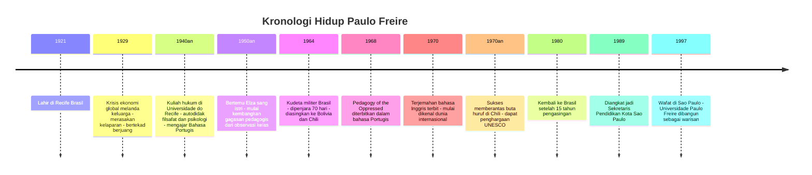
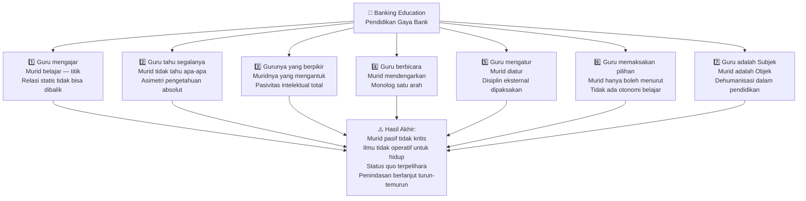
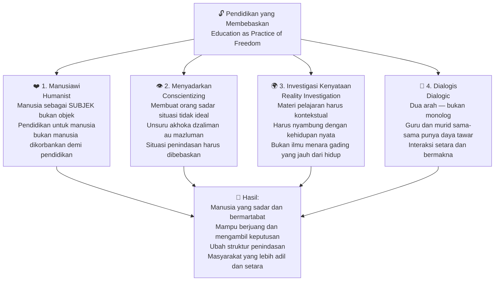
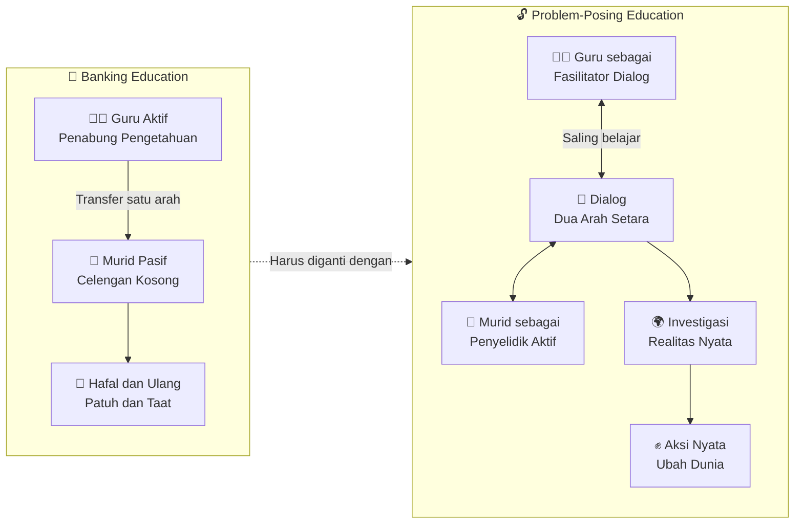
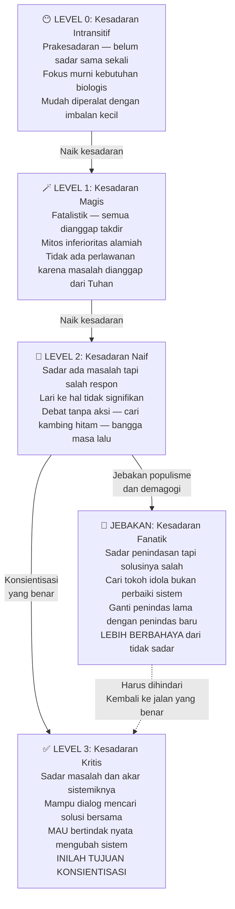
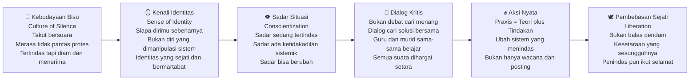

Pendidikan sering kali dianggap sebagai instrumen yang paling netral di dunia. Orang tua menyekolahkan anak-anaknya dengan harapan agar kehidupan mereka menjadi lebih baik. Pemerintah menganggarkan triliunan rupiah untuk pembangunan sekolah dan universitas. Namun, ada satu pertanyaan mendasar yang jarang kita ajukan: **untuk siapa pendidikan itu sebenarnya bekerja?** 📚🔥

Bagi **Paulo Freire** (1921–1997), seorang filsuf dan pedagog revolusioner asal Brasil *(Brazil)*, pendidikan tidak pernah netral. Ia tidak pernah berdiri di atas pagar antara kebebasan dan penindasan. Pendidikan selalu memihak — dan pertanyaan yang harus kita jawab adalah: apakah pendidikan kita memihak manusia, atau memihak sistem yang menindas manusia?

Artikel ini akan membedah secara tuntas pemikiran Freire yang menggetarkan dunia: dari kritik tajamnya terhadap **Banking Education** *(Pendidikan Gaya Bank)*, visinya tentang **Problem-Posing Education** *(Pendidikan Hadap Masalah)*, anatomi **Culture of Silence** *(Kebudayaan Bisu)*, hingga peta jalan transformasi kesadaran yang ia sebut **Conscientization** *(Konsientisasi)*. Semuanya diurai dari sudut pandang yang paling relevan dengan kondisi Indonesia hari ini.

---

## 🇧🇷 Bagian 1: Siapa Paulo Freire? — Dari Kelaparan ke Revolusi Pedagogi

### Masa Kecil yang Mengubah Segalanya

Paulo Reglus Neves Freire lahir pada 19 September 1921 di Recife, ibu kota negara bagian Pernambuco di timur laut Brasil. Ia tumbuh dalam keluarga kelas menengah yang cukup mapan — ayahnya, Joaquim Temistocles Freire, adalah seorang perwira polisi militer, dan ibunya adalah seorang wanita Katolik yang taat. 🏠

Namun, ketenangan itu hancur ketika krisis ekonomi global tahun 1929 (*The Great Depression*) menghantam Brasil. Keluarga Freire jatuh miskin secara drastis. Freire kecil, yang saat itu baru berumur delapan tahun, terpaksa merasakan pengalaman paling brutal yang bisa dirasakan manusia: **kelaparan**. Bukan sekadar lapar sementara, tapi kelaparan yang menggerogoti tubuh dan pikiran hari demi hari.

Alih-alih membuat Freire patah semangat, kelaparan itu justru menyalakan api tekad yang tidak pernah padam dalam dirinya. Ia bertekad: *"Saya harus berjuang agar tidak ada lagi orang yang harus lapar seperti saya."* Tekad inilah yang kelak mendorongnya menjadi salah satu pemikir pendidikan paling berpengaruh sepanjang abad ke-20. ✊

<Callout type="info" title="Biografi Singkat Paulo Freire">
**Nama lengkap:** Paulo Reglus Neves Freire

**Lahir:** 19 September 1921, Recife, Brasil

**Wafat:** 2 Mei 1997, São Paulo, Brasil

**Bidang:** Filsafat pendidikan, pedagogi kritis, teologi pembebasan

**Karya utama:** *Pedagogy of the Oppressed* (1968), *Pedagogy of Hope* (1992), *Education for Critical Consciousness* (1973)

**Penghargaan:** UNESCO Prize for Education for Peace, 16 gelar honoris causa dari universitas-universitas di seluruh dunia 🎓
</Callout>

### Perjalanan Akademis dan Inspirasi Pedagogis

Freire menempuh studi hukum di Universidade do Recife, sambil secara autodidak mempelajari filsafat dan psikologi. Untuk membiayai studinya, ia mengajar Bahasa Portugis di sekolah menengah. Di sinilah ia bertemu **Elza Maia Costa de Oliveira**, seorang guru sekolah dasar yang kemudian menjadi istrinya.

Pengamatan Freire terhadap kehidupan sehari-hari istrinya sebagai guru inilah yang menjadi bahan bakar pertama bagi gagasan-gagasan pedagogisnya. Ia melihat secara langsung bagaimana sistem pendidikan konvensional bekerja: guru bicara, murid diam; guru tahu, murid tidak tahu; guru aktif, murid pasif. 👩‍🏫

Karirnya terus menanjak. Ia menjabat sebagai direktur departemen pendidikan dan kebudayaan di Recife, dan program pemberantasan buta hurufnya di Brasil mendapat perhatian internasional — bahkan ia diundang sebagai dosen tamu di **Harvard University**. 🏛️

### Pengasingan dan Mahakarya

Namun, perjalanan Freire tidak mulus. Pada tahun 1964, Brasil mengalami kudeta militer. Pemerintah baru menganggap Freire sebagai ancaman berbahaya karena program-programnya dinilai membangkitkan kesadaran politik rakyat kecil.

Freire ditangkap dan dipenjara selama **70 hari**. Setelah bebas, ia diasingkan — pertama ke Bolivia, lalu ke Chili *(Chile)*. Di pengasingan inilah, dengan segala keterbatasannya, Freire menyelesaikan **Pedagogy of the Oppressed** (Pedagogik Kaum Tertindas), yang diterbitkan dalam bahasa Portugis pada 1968 dan diterjemahkan ke bahasa Inggris pada 1970. 📖

Di Chili, Freire tidak diam. Ia berhasil merancang dan menjalankan program pemberantasan buta huruf yang sukses besar, menjadikan Chili sebagai salah satu negara yang paling berhasil meningkatkan taraf pendidikan masyarakat kala itu.

Setelah **15 tahun** berada di pengasingan, Freire akhirnya kembali ke Brasil. Ia kemudian dipercaya menjabat sebagai Sekretaris Pendidikan Kota São Paulo. Warisan hidupnya diabadikan dengan pendirian **Universidade Paulo Freire** di São Paulo. Ia meninggal dunia pada 2 Mei 1997 akibat gagal jantung. 🕊️

---

## 🗓️ Kronologi Hidup Paulo Freire

---

## 🏛️ Bagian 2: Konteks Historis — Warisan Kolonialisme dalam Pendidikan Indonesia

### Sekolah sebagai Alat Penjajah

Freire hidup dan berpikir di dalam konteks Amerika Latin yang pernah dijajah bangsa Eropa. Namun, kritiknya sama tajamnya bagi Indonesia. Ia melihat satu pola yang universal: **penjajah mendirikan sekolah bukan untuk memerdekakan yang dijajah, melainkan untuk memperpanjang kekuasaan penjajah itu sendiri**. 🛡️

Di Indonesia, Belanda mendirikan berbagai sekolah selama masa kolonial. Namun tujuannya bukan mulia: mereka membutuhkan tenaga kerja terdidik yang bisa membaca, menulis, dan berhitung untuk menjalankan mesin birokrasi kolonial — dengan upah yang jauh lebih murah dibandingkan mendatangkan tenaga dari Belanda. 🇳🇱🇮🇩

Sistem ini secara sistematis mengajarkan kepada murid-muridnya dua hal:
1. **Mereka adalah objek** yang diatur oleh penguasa, bukan subjek yang menentukan nasib sendiri.
2. **Struktur sosial yang ada adalah wajar** dan mereka harus menyesuaikan diri dengannya.

<Callout type="warning" title="Penyakit Mentalitas PNS sebagai Warisan Kolonial">
Warisan paling nyata dari pendidikan kolonial di Indonesia adalah **mentalitas PNS** (Pegawai Negeri Sipil). Sekolah dianggap sebagai pabrik untuk mencetak "pegawai" — persis seperti zaman Belanda, hanya saja yang dilayani kini adalah pemerintah sendiri, bukan penjajah. Ketika satu lowongan PNS dilamar oleh 4.000 orang, itu bukan fenomena ekonomi biasa. Itu adalah gejala bahwa mentalitas pendidikan kolonial masih hidup dan sehat di benak jutaan orang Indonesia. 💼
</Callout>

### "Colonized People Are Directed" — Orang yang Dijajah Selalu Menunggu Arahan

Salah satu ungkapan paling menggetarkan Freire adalah: *"Colonized people are directed; they do not direct themselves."* (Orang yang dijajah itu diarahkan; mereka tidak mengarahkan diri mereka sendiri).

Generasi yang tumbuh dalam sistem pendidikan semacam ini kehilangan kapasitas untuk berpikir mandiri dan mengambil inisiatif. Mereka terbiasa menunggu petunjuk teknis sebelum bertindak. Terbiasa bertanya "berapa halaman?" dan "berapa spasi?" bahkan ketika dosen sudah berkata: "Bebas."

Fenomena pasca-Reformasi 1998 di Indonesia adalah bukti konkret dari ini: setelah Orde Baru yang sangat mengontrol itu tumbang dan kebebasan datang, banyak orang justru bingung — *"sekarang kita mau apa?"* Karena mereka terbiasa diarahkan, bukan mengarahkan. 🔄

---

## 🚫 Bagian 3: Dua Kritik Utama Freire terhadap Sistem Pendidikan

### Kritik Pertama: Sekolah Mencetak Pekerja, Bukan Manusia 🏭

Pendidikan modern, menurut Freire, telah tereduksi menjadi sekadar **pelatihan vokasional** *(vocational training)* — sebuah proses memasukkan keterampilan ke kepala seseorang agar ia bisa terserap oleh pasar kerja.

Pertanyaan klise yang menghantui anak-anak sejak kecil: *"Besok besar mau jadi apa?"* selalu dijawab dengan nama profesi: dokter, polisi, guru, insinyur. Bukan dengan jawaban yang lebih dalam seperti "jadi manusia yang bermartabat" atau "jadi orang yang berguna bagi masyarakat."

Dalam budaya Jawa, ada istilah yang seharusnya menjadi orientasi pendidikan: *"dadi wong"* — secara harfiah berarti "menjadi manusia", namun maknanya lebih dalam: menjadi manusia yang matang, bijaksana, dan bertanggung jawab. Pendidikan yang hanya mencetak pekerja gagal menjalankan fungsi yang paling esensial ini.

### Kritik Kedua: Pendidikan Melanggengkan Struktur Penindasan ⛓️

Di sekolah-sekolah yang Freire kritik, murid tidak hanya belajar matematika atau bahasa. Mereka juga, secara implisit, belajar **posisi sosial mereka** dan **apa yang boleh dan tidak boleh mereka lakukan**. Murid dari kelas bawah belajar bahwa mereka adalah "rakyat" — dan rakyat memiliki batas-batas tertentu yang tidak boleh dilampaui.

Jika struktur sosial masyarakat tidak adil (ada yang menindas dan yang ditindas), maka pendidikan yang tidak kritis hanya akan memperkuat ketidakadilan itu. Yang lemah tetap lemah, yang kuat tetap kuat — karena masing-masing sudah diberi "pelajaran" tentang posisi mereka. ⚖️

---

## 🏦 Bagian 4: Banking Education (Pendidikan Gaya Bank) — Bedah Tuntas

### Definisi dan Metafora Sentral

Inilah konsep Freire yang paling dikenal dan paling sering dikutip. Ia menyebut model pendidikan konvensional sebagai **Banking Education** (Pendidikan Gaya Bank). Metafora ini sederhana namun mematikan: 💰

> *"Education thus becomes an act of depositing, in which the students are the depositories and the teacher is the depositor. Instead of communicating, the teacher issues communiqués and makes deposits which the students patiently receive, memorize, and repeat."*
>
> (Pendidikan pun menjadi sebuah tindakan menabung, di mana murid-murid adalah tempat penyimpanan dan guru adalah penabungnya. Alih-alih berkomunikasi, guru menyampaikan pengumuman-pengumuman dan melakukan setoran yang dengan sabar diterima, dihafal, dan diulang oleh murid-muridnya.)

<Callout type="important" title="Analogi Celengan yang Menohok">
Bayangkan ijazah sarjana sebagai sebuah celengan yang dipecah setelah empat tahun kuliah. Setiap hari, dosen datang ke kelas dan memasukkan "koin" pengetahuan ke dalam celengan mahasiswanya. Saat wisuda, celengan itu dipecah — dan hasilnya adalah transkrip nilai yang membuktikan berapa banyak koin yang berhasil dikumpulkan. Tapi pertanyaannya: apakah koin-koin itu benar-benar milikmu? Apakah kamu tahu cara menggunakannya? Apakah kamu pernah memilih koin mana yang kamu inginkan? 🎓💸
</Callout>

### 7 Ciri Banking Education: Diagnosa Lengkap 🔍

Freire mengidentifikasi tujuh ciri utama dari pendidikan gaya bank. Setiap ciri adalah sebuah simptom dari penyakit yang sama: **dehumanisasi dalam pendidikan**.

**Ciri 1: Guru mengajar — murid belajar. Titik.**
Hubungan yang statis dan tidak dapat dibalik. Tidak ada ruang bagi murid untuk mengajar, dan tidak ada kewajiban bagi guru untuk belajar dari muridnya. Hubungan ini seolah sudah dikodratkan dan tidak bisa diubah.

**Ciri 2: Guru tahu segalanya — murid tidak tahu apa-apa.**
Guru diposisikan sebagai sumber kebenaran absolut. Murid datang ke kelas dengan membawa "kepala kosong" yang siap diisi. Pengalaman hidup murid, pengetahuan yang dibawa dari rumah, intuisi yang dimiliki — semua dianggap tidak valid sampai disahkan oleh guru.

**Ciri 3: Gurunya yang berpikir — muridnya yang mengantuk.**
Kegiatan intelektual hanyalah monopoli guru. Murid tidak diundang untuk berpikir, hanya untuk menerima hasil pikiran orang lain. Tidak heran kalau mengantuk di kelas menjadi hal yang lumrah.

**Ciri 4: Guru berbicara — murid mendengarkan.**
Kelas menjadi pertunjukan monolog. Suara yang sah hanyalah suara guru. Murid yang berbicara tanpa izin dianggap mengganggu, bukan berkontribusi.

**Ciri 5: Guru mengatur — murid diatur.**
Semua aspek proses belajar ditentukan oleh guru: kapan mulai, kapan selesai, apa yang dipelajari, bagaimana caranya. Murid hanya perlu patuh. Kemandirian dan inisiatif adalah ancaman terhadap ketertiban kelas.

**Ciri 6: Guru memaksakan pilihan — murid menurut.**
Kurikulum, metode, topik — semuanya adalah keputusan sepihak. Murid tidak pernah ditanya: "Apa yang ingin kamu pelajari? Masalah apa yang ingin kamu selesaikan?" Mereka hanya diberitahu: "Ini yang harus kamu pelajari."

**Ciri 7: Guru adalah Subjek — murid adalah Objek.**
Ini adalah ciri yang paling fundamental dan paling merusak. Ketika manusia (murid) direduksi menjadi objek — sesuatu yang diisi, dibentuk, dimanipulasi oleh pihak lain — itulah yang Freire sebut sebagai **dehumanisasi**. Pendidikan yang seharusnya memanusiakan manusia justru mendehumanisasi mereka. 👤🚫

---

## 🔓 Bagian 5: Pendidikan sebagai Praksis Pembebasan

Freire tidak hanya mengkritik — ia juga menawarkan visi alternatif. Ia menyebutnya **Education as Practice of Freedom** (Pendidikan sebagai Praktik Pembebasan). Ada empat ciri utama pendidikan yang membebaskan:

**Ciri 1 — Manusiawi (Humanist):** Pendidikan harus menempatkan manusia sebagai pusat dan tujuan. Sama seperti prinsip teologis bahwa agama ada untuk manusia (agar manusia bahagia dan tertib), bukan manusia yang dikorbankan demi agama — pendidikan pun demikian. Manusia adalah subjek, bukan objek pendidikan. ❤️

**Ciri 2 — Menyadarkan (Conscientizing):** Pendidikan harus membuat orang sadar akan situasinya — termasuk jika situasi itu tidak adil dan menindas. Ini sejalan dengan ajaran Islam: *"Unsuru akhoka dzaliman au mazluman"* (tolonglah saudaramu yang zalim maupun yang dizalimi). Kondisi penindasan adalah kondisi yang tidak normal dan harus diubah. 🤝

**Ciri 3 — Investigasi Kenyataan (Reality Investigation):** Materi yang dipelajari harus relevan dan terhubung dengan kehidupan nyata murid. Jika ilmu yang dipelajari di kelas sama sekali tidak nyambung dengan masalah yang dihadapi murid di luar kelas, maka pendidikan itu gagal. Freire mengecam keras **ilmu menara gading** *(ivory tower)* yang terlihat indah tapi tidak berguna. 🌍

**Ciri 4 — Dialogis (Dialogic):** Proses belajar harus menjadi dialog dua arah yang setara. Ini bukan berarti guru tidak punya otoritas atau ilmu — tentu guru punya lebih banyak pengetahuan. Tapi perbedaan pengetahuan tidak boleh menjadi alasan untuk menghilangkan hak murid untuk berbicara, bertanya, dan bahkan berbeda pendapat. 🗣️

---

## 🛠️ Bagian 6: Problem-Posing Education (Pendidikan Hadap Masalah)

### Definisi dan Prinsip Dasar

Sebagai solusi konkret, Freire menawarkan **Problem-Posing Education** (Pendidikan Hadap Masalah) — sebuah model yang menghadapkan murid pada masalah-masalah nyata yang mereka hadapi dalam kehidupan sehari-hari.

> *"In problem-posing education, people develop the power to perceive critically the way they exist in the world with which and in which they find themselves; they come to see the world not as a static reality, but as a reality in the process of transformation."*

<Callout type="tip" title="Contoh Kontekstual: Petani dan Globalisasi">
Jika Anda mengajar di komunitas petani, jangan mengajarkan "globalisasi" sebagai konsep abstrak yang jauh dari kehidupan mereka. Sebaliknya, tanyakan: "Mengapa harga pupuk terus naik? Siapa yang menentukan harga itu? Bagaimana perdagangan bebas internasional memengaruhi penghasilan kita?" Itulah pendidikan yang **operatif** (berfungsi nyata), bukan **mubadir** (sia-sia). 🚜🌾
</Callout>

Freire juga menyindir keras fenomena yang sangat akrab di Indonesia: ribuan skripsi, tesis, dan disertasi yang hanya menumpuk di rak perpustakaan tanpa pernah memberikan kontribusi nyata bagi masyarakat. Bayangkan jika setiap penelitian akademis di Indonesia benar-benar berangkat dari masalah nyata masyarakat dan benar-benar menghasilkan solusi yang diterapkan — Indonesia bisa jauh lebih maju dari sekarang. 🇮🇩🚀

### Debat vs Dialog: Perbedaan yang Krusial

Dalam konteks Indonesia, ada satu gejala yang sangat relevan dengan pemikiran Freire: **budaya debat**. Di media sosial, di warung kopi, di forum-forum online — semua orang berdebat. Tapi apa yang dihasilkan?

Freire membedakan dengan tajam antara **debat** dan **dialog**:
- **Debat:** Tujuannya adalah menang vs kalah. Ego yang dipertaruhkan. Tidak ada kebenaran baru yang ditemukan — hanya pembuktian siapa yang lebih pandai berargumen.
- **Dialog:** Tujuannya adalah menemukan kebenaran bersama. Semua pihak datang sebagai pelajar. Hasilnya adalah pemahaman baru yang tidak mungkin ditemukan jika masing-masing pihak berpikir sendirian.

Pendidikan yang membebaskan harus mendorong dialog, bukan debat. Karena banyak debat tanpa aksi adalah salah satu ciri dari **Kesadaran Naif** *(Naive Consciousness)* — yang akan kita bahas lebih detail di bagian berikutnya.

---

## 🔕 Bagian 7: Kebudayaan Bisu (Culture of Silence)

### Anatomi Kebisuan yang Dipaksakan

**Culture of Silence** (Kebudayaan Bisu) adalah konsep Freire yang menggambarkan kondisi di mana kelompok yang tertindas kehilangan kemampuan — atau lebih tepatnya **keberanian** — untuk bersuara. 🤐

Kata kunci di sini bukan "tidak bisa bicara" tapi "takut bicara" atau "merasa tidak layak bicara." Ini adalah hasil dari sistem yang secara sistematis menanamkan rasa inferior (rendah diri) pada kelompok yang ditindas, sambil melegitimasi superioritas kelompok penindas.

Ada tiga bentuk kebudayaan bisu yang paling sering kita temui:

**Bentuk 1: Rakyat vs Penguasa** 🏛️
"Kita ini orang kecil, ngerti apa? Itu urusan orang-orang besar." Kalimat semacam ini mengandung racun yang halus: ia membuat rakyat merasa bahwa partisipasi dalam kehidupan publik bukan hak mereka, melainkan hak eksklusif "orang-orang besar" — yang kebetulan adalah para penindas itu sendiri.

**Bentuk 2: Mahasiswa vs Dosen** 👨‍🏫
Mahasiswa takut komplain tentang nilai yang tidak adil, tentang materi yang tidak relevan, tentang metode mengajar yang membosankan. Mengapa? Karena takut "dimusuhi dosen" dan nilai jatuh. Sistem ini mengajari mahasiswa untuk patuh, bukan untuk berpikir kritis.

**Bentuk 3: Perempuan vs Tekanan Sosial** 🏠
Perempuan yang merasa tertindas dalam rumah tangganya, namun takut bersuara karena "nanti dianggap istri yang tidak shalihah" atau "poligami kan ada dalam Al-Quran." Ini adalah contoh bagaimana sistem norma sosial bisa digunakan untuk mengunci suara mereka yang paling rentan.

<Callout type="important" title="Roda yang Tidak Akan Berputar Sendiri">
Para penindas sering menghibur yang tertindas dengan jargon: "Tenang saja, roda dunia berputar — kadang di atas, kadang di bawah." Kata Freire: perhatikan siapa yang memegang rem! Yang di atas tidak akan membiarkan roda berputar ke bawah begitu saja. Mereka akan melakukan segala strategi agar tetap di atas. Maka yang di bawah tidak bisa hanya menunggu "giliran" — mereka harus berjuang naik. ⛓️⬆️
</Callout>

### Solusi: Membebaskan Diri untuk Membebaskan Penindas

Freire mengajukan paradoks yang indah: *"It's only the oppressed who, by freeing themselves, can free their oppressor."* (Hanya kaum tertindas yang, dengan membebaskan diri mereka sendiri, dapat membebaskan penindas mereka).

Ini bukan sekadar retorika. Logikanya mendalam: ketika yang tertindas berhasil membebaskan diri, struktur penindasan itu runtuh. Dan ketika struktur itu runtuh, penindas pun selamat dari dosa penindasannya. Pembebasan adalah satu paket — atau tidak ada sama sekali. 🕊️

Ini sangat sejalan dengan ajaran Islam: *"Unsuru akhoka dzaliman au mazluman"* — tolonglah saudaramu yang zalim maupun yang dizalimi. Menolong yang zalim berarti menghentikan kezalimannya — agar ia tidak terus-menerus menanggung dosa. Membiarkan yang zalim terus berlaku zalim adalah pengkhianatan, bukan kebijaksanaan.

---

## 📊 Bagian 8: Lima Level Kesadaran Freire — Peta Jalan Transformasi

Ini adalah bagian paling penting dari pemikiran Freire. Ia memetakan **evolusi kesadaran manusia** dari yang paling rendah hingga yang paling ideal. Setiap level menggambarkan cara seseorang memahami dunia dan merespons kondisi penindasan.

### Level 0: Kesadaran Intransitif (Prakesadaran) 😶

Ini adalah tingkat kesadaran yang paling dasar. Orang di level ini hidup sepenuhnya dalam lingkaran kebutuhan biologis dan fisik. Mereka belum memiliki kesadaran tentang dirinya sebagai makhluk sosial yang memiliki potensi untuk mengubah dunia.

**Ciri-ciri:**
- Orientasi hidup semata-mata pada pemenuhan kebutuhan fisik: makan, tempat tinggal, keamanan.
- Tidak memikirkan makna hidup yang lebih dalam, identitas sosial, atau ketidakadilan struktural.
- Mudah diperalat oleh penindas dengan iming-iming materi kecil.

**Contoh konkret:** Seseorang yang ketika ditanya tentang masa depannya menjawab, "Yang penting setelah lulus bisa kerja, bisa makan, bisa kawin, punya anak — sudah." Tidak ada visi yang lebih besar dari itu. Tidak ada pertanyaan tentang keadilan, tentang makna, tentang kontribusi sosial.

**Bahaya:** Orang di level ini sangat mudah diperalat oleh penindas. Cukup berikan sembako sebelum pemilu, cukup naikkan gaji sedikit, cukup beri sedikit kenyamanan — dan mereka akan diam dan patuh. Mereka tidak akan memprotes ketidakadilan sistemik karena mereka tidak menyadarinya. 🍖

### Level 1: Kesadaran Magis (Magical Consciousness) 🪄

Sudah ada penaikan dari level 0. Orang di level ini sudah mulai sadar bahwa ada masalah dalam hidupnya. Namun, cara mereka menjelaskan masalah itu bersifat **fatalistik** (pasrah pada nasib) dan **mistis** (mengacu pada kekuatan supranatural).

**Mitos Inferioritas Alamiah:** Freire menyebut ini sebagai "natural inferior myth" — kepercayaan bahwa kondisi tertindas adalah hal yang alami dan sudah "dikodratkan." Kemiskinan bukan hasil dari struktur ekonomi yang tidak adil, tapi takdir dari Tuhan. Kebodohan bukan akibat kurangnya akses pendidikan yang berkualitas, tapi memang bawaan lahir.

**Ciri-ciri:**
- Fatalistik: merespons masalah dengan kepasrahan dan penerimaan.
- Menggunakan argumen alamiah atau teologis untuk membenarkan situasi yang sebenarnya bisa diubah.
- Tidak bisa membayangkan bahwa kondisi yang ada bisa berbeda.

**Contoh konkret:**
- "Ya sudah, memang takdirnya Allah saya miskin sebagai ujian bagi yang kaya."
- "Memang dari sono-nya saya ini bodoh, dari dulu keluarga saya juga begini."
- "Kalau saya jadi petani ya memang sudah nasib saya, mau bagaimana lagi."
- "Rezeki sudah diatur, kalau memang rejekinya sedikit ya sudah."

**Analisis Teologis — Jabariah vs Ikhtiar:**
Ada bahaya teologis yang harus kita waspadai di sini. Freire tidak menolak konsep takdir — namun ia membedakan antara memahami takdir dari **sudut pandang Allah** (di mana segala sesuatu memang sudah dalam pengetahuan-Nya) dan dari **sudut pandang manusia** (di mana kita diperintahkan untuk berusaha dan berikhtiar).

Dari sudut pandang manusia, ada **sunatullah** (hukum alam yang Allah tetapkan): kalau malas, gagal; kalau berusaha, ada kemungkinan berhasil. Kita bergerak berdasarkan sunatullah ini. Hasil akhirnya — barulah itu **qudratullah**, ranah kekuasaan Allah yang kita pasrahkan. Orang dengan kesadaran magis membalik urutan ini: mereka menyerahkan kepada qudratullah sebelum menjalankan sunatullah.

**Bahaya:** Inilah yang paling dimanfaatkan oleh penindas. Ketika yang tertindas percaya bahwa kondisi mereka adalah "kehendak Tuhan", mereka tidak akan pernah memprotes, tidak akan pernah berjuang, tidak akan pernah mengubah situasi. Para penindas tinggal duduk manis di atas sementara yang tertindas terus menderita sambil mengaminkan nasib mereka. 🤲

### Level 2: Kesadaran Naif (Naive Consciousness) 🤡

Ini adalah level yang satu tingkat di atas kesadaran magis. Orang di level ini **sudah sadar** bahwa ada masalah struktural, bahwa ada ketidakadilan, bahwa situasinya tidak harus begini. Namun, mereka tidak mampu atau tidak mau menemukan solusi yang tepat.

Yang terjadi adalah: mereka menggeser fokus. Alih-alih menghadapi masalah secara langsung, mereka lari ke hal-hal yang lebih mudah, lebih "aman", dan lebih memuaskan secara emosional — tapi tidak produktif sama sekali.

**Pola Perilaku 1: Romantisasi Masa Lalu** 🏛️📜
Daripada menghadapi kelemahan di masa kini, lebih mudah bercerita tentang kejayaan di masa lalu. "Dulu, peradaban Islam itu sangat maju di abad pertengahan!" adalah kalimat yang sering kita dengar. Itu mungkin benar — tapi yang menjadi pertanyaan Freire adalah: *apa yang kamu lakukan hari ini untuk kembali ke kemuliaan itu?* Kalau jawabannya hanya "bangga dan mengulang cerita itu," itulah kesadaran naif.

**Pola Perilaku 2: Debat Tanpa Aksi** 🗣️💨
Saat waktunya rapat atau diskusi, semangat luar biasa. Argumen panjang-lebar, analisis mendalam, kritik tajam. Tapi saat waktunya eksekusi dan bekerja nyata — semua menghilang entah ke mana. Isu baru datang, isu lama terlupakan tanpa solusi. Ini adalah penyakit kronis yang sangat akrab di Indonesia: kita adalah bangsa yang sangat gemar berdebat, tapi sangat lemah dalam bertindak.

**Pola Perilaku 3: Mencari Kambing Hitam** 🐐
Ketika masalah muncul, orang di level kesadaran naif tidak mencari akar sistemik masalah tersebut. Mereka mencari individu yang bisa disalahkan. "Ini semua gara-gara Si A ngomong apa apa, makanya bencana datang!" Atau: "Semua salah Si B, dia yang merusak semuanya." Dengan menyalahkan individu tertentu, mereka merasa sudah "menyelesaikan" masalah — padahal mereka justru menambah masalah baru dengan menciptakan permusuhan tanpa solusi. 

<Callout type="warning" title="Gejala Kesadaran Naif di Indonesia">
Sangat mudah menemukan kesadaran naif di ruang publik Indonesia: isu viral hari ini dibahas seharian dengan penuh semangat dan emosi, tapi besok sudah terlupakan karena ada isu baru yang lebih "menarik." Debat di Twitter/X berlangsung berhari-hari tanpa satu pun pihak yang mengubah pandangan, apalagi menghasilkan aksi nyata. Inilah tanda paling jelas dari kesadaran naif: **banyak bicara, sedikit kerja, tidak ada perubahan.** 📱💬
</Callout>

**Contoh personal:** Mahasiswa yang sudah semester 14 belum lulus. Ia tahu ada masalah dengan studinya. Tapi alih-alih fokus menyelesaikan skripsi, ia malah sibuk mengurus pacar, main game, dan nongkrong. Ia tahu ada masalah — tapi ia tidak menghadapinya. Ia menggeser fokus ke hal-hal yang terasa lebih mudah dan menyenangkan.

### Level 3: Kesadaran Fanatik (Fanatic Consciousness) 🚩

Di sinilah Freire memberikan peringatan paling keras. Kesadaran fanatik adalah level yang berada di antara naif dan kritis — dan **lebih berbahaya dari ketidaksadaran sama sekali**. Mengapa? Karena orang di level ini sudah cukup sadar untuk menggerakkan massa, tapi tidak cukup bijaksana untuk menggerakkan mereka ke arah yang benar.

**Karakteristik Utama:**
Orang dengan kesadaran fanatik sudah menyadari adanya struktur penindasan. Mereka marah. Mereka ingin perubahan. Tapi solusi yang mereka tawarkan bukan mengubah sistem — melainkan **mengganti orang yang ada di puncak sistem** dengan tokoh yang mereka idolakan.

Tujuannya adalah **masifikasi** *(massification)* — mengumpulkan sebanyak mungkin pengikut, menciptakan gerakan massa yang berpusat pada seorang tokoh karismatik yang mereka percaya akan "menyelamatkan" segalanya.

**Hasilnya:** Penindas lama diganti dengan penindas baru. Strukturnya tidak berubah — hanya wajahnya yang berganti. Dan karena strukturnya tidak berubah, penindasan pun tidak berakhir. Ia hanya berganti pelaku.

**Analogi Indonesia yang Menyedihkan:**
Freire sudah memberikan analisis ini pada tahun 1960-an, tapi betapa relevannya untuk Indonesia hari ini. Kita punya ungkapan semi-bercanda tapi sangat dalam: *"Meskipun yang memimpin Indonesia itu malaikat, malaikat bisa ketangkap KPK."* Artinya: masalahnya bukan di orangnya, tapi di **sistemnya**. Selama sistem koruptif itu tidak diubah, siapapun yang masuk ke dalamnya akan terkontaminasi. 👼⛓️

<Callout type="danger" title="Pembebasan vs Balas Dendam — Perbedaan yang Menentukan Nasib Bangsa">
Ada perbedaan mendasar antara perjuangan untuk **pembebasan** dan perjuangan untuk **balas dendam**. Jika tujuanmu adalah membebaskan diri dari sistem penindasan — mengubah strukturnya agar tidak ada lagi yang tertindas — itu adalah kesadaran kritis yang sejati. Tapi jika tujuanmu adalah menggulingkan penindas agar giliran kamu yang menindas — itu bukan pembebasan. Itu hanya pengulangan siklus yang sama dalam wajah yang berbeda. Dan inilah yang paling sering terjadi dalam sejarah revolusi di berbagai negara: revolusi yang seharusnya membebaskan justru melahirkan tirani baru. 🔄🚩
</Callout>

### Level 4: Kesadaran Kritis (Critical Consciousness) ✅

Inilah puncak dari perjalanan konsientisasi yang Freire impikan. Kesadaran kritis adalah kondisi di mana seseorang:

1. **Sadar ada masalah** — dan memahami akar sistemiknya, bukan hanya gejalanya.
2. **Mampu mencari solusi** — melalui dialog yang setara dan jujur, bukan debat yang mencari menang.
3. **Berani bertindak nyata** — mewujudkan solusi itu dalam aksi nyata di dunia.

Yang membedakan kesadaran kritis dari kesadaran naif adalah **aksi**. Dan yang membedakannya dari kesadaran fanatik adalah **fokus pada sistem**, bukan pada individu atau tokoh.

**Syarat Kesadaran Kritis:**
- Menolak untuk "ditelan" oleh sistem yang menindas — tidak patuh secara buta.
- Berjuang untuk **mengganti** sistem yang menindas dengan sistem yang lebih adil — bukan sekadar mengganti orang di dalamnya.
- Memahami bahwa perjuangan ini bukan soal balas dendam, tapi soal pembebasan yang sesungguhnya.

**Proses Mencapai Kesadaran Kritis:**
Seseorang di level naif atau fanatik tidak akan tiba-tiba melompat ke kesadaran kritis. Prosesnya adalah **konsientisasi** *(conscientization)* — sebuah proses pendidikan yang sadar dan terarah, yang membantu seseorang melihat dunia sebagaimana adanya, dan memahami perannya dalam mengubahnya.

---

## 🔑 Bagian 9: Konsientisasi (Conscientization) — Proses Naik Level

### Definisi dan Proses

**Conscientization** (atau *conscientização* dalam bahasa Portugis) adalah jantung dari proyek pedagogis Freire. Ini bukan sekadar "menyadarkan" dalam arti memberitahu seseorang tentang fakta-fakta yang tidak mereka ketahui. Ini adalah proses yang jauh lebih dalam: membantu seseorang **melihat dirinya sendiri** sebagai subjek yang mampu mengubah dunia.

### "Without a Sense of Identity, There Can Be No Real Struggle"

Freire menekankan bahwa titik awal dari semua perjuangan sejati adalah **pengenalan diri**. Tanpa memahami siapa dirinya sebenarnya — posisi sosialnya, potensinya, hak-haknya — seseorang tidak bisa berjuang untuk apa pun yang bermakna.

Ini adalah sambungan yang indah antara filsafat Freire dan tradisi intelektual Islam. Rasulullah SAW bersabda: *"Man arafa nafsahu faqad arafa rabbahu"* — Barangsiapa mengenal dirinya, ia mengenal Tuhannya. Pengenalan diri adalah awal dari segala kebijaksanaan.

### "Education Does Not Make Us Educable"

Freire juga memberikan paradoks yang indah tentang hakikat pendidikan:

> *"Education does not make us educable. It is our awareness of being unfinished that makes us educable."*
>
> (Pendidikan tidak membuat kita menjadi orang yang terdidik. Yang membuat kita menjadi orang yang terdidik adalah kesadaran kita bahwa kita ini masih belum selesai.)

Orang yang merasa dirinya sudah "selesai" — sudah cukup pintar, sudah cukup berilmu, sudah tidak perlu belajar lagi — justru itulah orang yang paling tidak terdidik. Karena mereka seperti **gelas yang sudah penuh**: tidak bisa menerima pengetahuan baru lagi.

Sebaliknya, orang yang merasa dirinya terus *unfinished* (belum selesai, masih banyak yang perlu dipelajari) — itulah orang yang sejati terdidik. Karena mereka datang pada setiap proses belajar dengan pikiran yang terbuka dan kerendahan hati yang tulus.

---

## 🎨 Bagian 10: Guru sebagai Seniman — Bukan Pemahat

### Metafora yang Mengubah Cara Pandang

Freire memberikan satu kalimat yang sangat indah tentang guru: *"The teacher is, of course, an artist."* (Guru adalah, tentu saja, seorang seniman). 🎨

Namun ia segera menjelaskan bahwa guru bukan seniman seperti **pemahat** yang mengambil batu dan membentuknya sesuka hati menjadi patung sesuai visi sang seniman. Cara pandang semacam ini justru adalah kesalahan fundamental yang membuat pendidikan menjadi alat penindasan.

Guru yang sejati adalah seniman yang memungkinkan muridnya **menjadi dirinya sendiri**:

> *"What the educator does in teaching is to make it possible for the students to become themselves."*

Tugas guru bukan membentuk murid sesuai keinginan guru atau keinginan pasar. Tugas guru adalah menciptakan kondisi di mana benih-benih potensi yang sudah ada dalam diri murid bisa tumbuh dan berkembang secara optimal.

<Callout type="danger" title="Tragedi Ujian Nasional dan Sistem Seragam">
Freire sering menggunakan sebuah gambar ilustrasi yang terkenal: seekor gajah, monyet, penguin, ikan, dan burung berdiri di depan seorang guru yang berkata: "Untuk ujian yang adil, semua harus memanjat pohon itu!" Yang lulus dengan nilai sempurna hanya si monyet. Gajah, penguin, ikan, dan burung dianggap "bodoh" dan "tidak kompeten."

Itulah tragedi sistem pendidikan yang memaksakan standar yang sama pada anak-anak yang memiliki potensi dan bakat yang berbeda-beda. Tidak ada anak yang bodoh — yang ada hanyalah sistem yang belum mampu menemukan dan mengembangkan keunikan setiap anak. 🐘🐒🐟🐦
</Callout>

---

## 🔄 Bagian 11: Dialektika Guru-Murid

Freire mengusulkan untuk "mendialektikakan" (*resolving the contradiction*) hubungan guru-murid yang kaku. Ia berkata:

> *"...resolving the teacher-student contradiction so that both are simultaneously teachers and students."*

Artinya:
- Ketika seseorang **mengajar**, pada saat yang sama ia juga **belajar** — karena proses mengajar memaksanya menggali lebih dalam, memformulasikan ulang pemahamannya, dan menghadapi pertanyaan-pertanyaan yang tidak pernah ia pikirkan sebelumnya.
- Ketika seseorang **belajar**, pada saat yang sama ia juga **mengajar** — karena pengalaman hidupnya, perspektifnya, pertanyaannya, bisa menjadi sumber pembelajaran yang sangat berharga bagi orang-orang di sekelilingnya.

**Saran Praktis:** Jika ingin benar-benar menguasai suatu materi, ajarkan materi itu kepada orang lain. Buatlah kelompok belajar kecil di mana setiap anggota bergantian menjadi "guru" untuk topik yang berbeda. Ini bukan hanya metode belajar yang lebih efektif — ini juga adalah praktek pembebasan yang nyata dalam skala kecil. 🧠💡

---

## ❤️ Bagian 12: Education is Love — Pendidikan adalah Cinta

Freire menutup filsafat pendidikannya dengan pernyataan yang paling puitis:

> *"Education is love, and love is courage."*

Pendidikan adalah cinta. Dan karena cinta adalah keberanian, maka pendidikan pun harus berani. 🌍❤️✊

Ini bukan sekadar kata-kata indah. Ini adalah tesis yang dalam:

**Mengapa pendidikan = cinta?**
Karena pendidikan yang sejati didasari oleh kepedulian yang mendalam terhadap manusia lain. Guru yang benar-benar mengajar dengan penuh cinta adalah guru yang peduli pada perkembangan muridnya sebagai manusia utuh — bukan sekadar sebagai "produk" yang harus memenuhi standar tertentu.

**Mengapa cinta = keberanian?**
Karena cinta yang sejati selalu membutuhkan keberanian. Cinta tidak membiarkan yang dicintai tertindas. Cinta tidak berdiam diri ketika melihat ketidakadilan. Cinta itu berani bersuara, berani mengambil risiko, berani mengubah dunia demi kebaikan yang dicintai.

**Implikasinya bagi pendidikan:**
Pendidikan yang benar-benar didasari cinta tidak akan puas dengan hanya menjelaskan dunia kepada muridnya. Ia akan mendorong muridnya untuk **mengubah dunia**. Ini yang disebut Freire sebagai **praxis** (praksis) — kesatuan antara refleksi (teori) dan tindakan nyata.

---

## 📊 Tabel Perbandingan: Banking Education vs Problem-Posing Education

| Aspek | Banking Education (Gaya Bank) | Problem-Posing Education (Hadap Masalah) |
| :--- | :--- | :--- |
| **Peran Guru** | Penabung aktif, subjek tunggal | Fasilitator dialog, rekan belajar |
| **Peran Murid** | Celengan pasif, objek yang diisi | Penyelidik aktif, subjek yang berpikir |
| **Metode Utama** | Monolog, hafalan, repetisi | Dialog, refleksi kritis, investigasi |
| **Isi Materi** | Statis, abstrak, jauh dari kehidupan | Kontekstual, terhubung dengan realitas nyata |
| **Orientasi Tujuan** | Adaptasi dan penerimaan terhadap sistem | Transformasi dan perubahan terhadap sistem |
| **Relasi Pengetahuan** | Transfer dari yang tahu ke yang tidak tahu | Ko-kreasi bersama dalam proses dialog |
| **Dampak Sosial** | Melanggengkan status quo dan penindasan | Mendorong emansipasi dan kesetaraan |
| **Contoh Indonesia** | Ujian nasional seragam, hafalan untuk UNBK | Proyek berbasis masalah komunitas lokal |

---

## 📋 Tabel Lima Level Kesadaran

| Level | Nama | Cara Melihat Masalah | Respons Terhadap Penindasan | Contoh Nyata |
| :--- | :--- | :--- | :--- | :--- |
| **0** | Intransitif (Prakesadaran) | Tidak melihat masalah | Tidak bereaksi — fokus fisik saja | "Yang penting makan, kerja, kawin, anak." |
| **1** | Magis | Masalah = takdir atau kekuatan supranatural | Pasrah dan menerima | "Sudah takdir Allah saya miskin." |
| **2** | Naif | Masalah ada tapi salah diagnosis | Debat, cari kambing hitam, romantisasi masa lalu | "Dulu Islam jaya di abad pertengahan!" (tanpa aksi). |
| **⚠️** | Fanatik | Masalahnya orangnya bukan sistemnya | Ganti orang, bukan ganti sistem | "Asal Si X jadi presiden, semua beres!" |
| **3** | Kritis | Masalahnya sistemik dan struktural | Dialog → solusi → aksi nyata → ubah sistem | Mengorganisir komunitas untuk advokasi kebijakan. |

---

## 🌏 Bagian 13: Relevansi untuk Indonesia — Dari Freire ke Hari Ini

### Mentalitas PNS sebagai Epidemi Kesadaran Naif

Fenomena jutaan sarjana yang berbondong-bondong mendaftar PNS adalah manifestasi paling nyata dari warisan pendidikan kolonial yang Freire kritik. Sekolah dan universitas telah berhasil menanamkan satu keyakinan mendalam: **keberhasilan = mendapat pekerjaan tetap yang aman.** 

Ini bukan sekadar pilihan karir. Ini adalah cermin dari sistem pendidikan yang telah selama berabad-abad mengajarkan orang untuk menjadi objek yang diatur, bukan subjek yang berkreasi. 💼

### Media Sosial dan Kesadaran Naif Massal

Indonesia adalah salah satu pengguna media sosial terbesar di dunia. Dan apa yang kita lihat setiap hari? Perdebatan yang tidak ada habisnya. Isu berganti isu. Emosi membara tapi aksi nihil. Ini adalah potret kesadaran naif dalam skala massal: semua orang tahu ada masalah, tapi tidak ada yang benar-benar bergerak untuk menyelesaikannya. 📱💬

### Sistem Pendidikan yang Perlu Direformasi

Jika kita serius dengan cita-cita Freire, kita perlu menanyakan hal-hal yang tidak nyaman tentang sistem pendidikan kita:
- Apakah kurikulum sekolah kita kontekstual dengan kehidupan nyata siswa?
- Apakah ujian nasional yang seragam benar-benar mengukur kualitas pendidikan, atau sekadar mengukur kemampuan menghafal?
- Apakah skripsi mahasiswa benar-benar berkontribusi pada solusi masalah masyarakat?
- Apakah guru-guru kita diberdayakan untuk menjadi fasilitator dialog, atau hanya dilatih sebagai "mesin kurikulum"?

---

## 📚 Bagian 14: Karya-Karya Utama Paulo Freire

| Judul | Tahun Terbit | Tema Utama |
| :--- | :--- | :--- |
| *Pedagogy of the Oppressed* (Pedagogik Kaum Tertindas) | 1968/1970 | Banking education, culture of silence, conscientization, problem-posing education |
| *Education for Critical Consciousness* (Pendidikan untuk Kesadaran Kritis) | 1973 | Transisi kesadaran, literasi sebagai alat pembebasan |
| *Pedagogy in Process* | 1978 | Penerapan pedagoginya di Guinea-Bissau pasca-kemerdekaan |
| *The Politics of Education* | 1985 | Hubungan politik dan pendidikan |
| *Pedagogy of Hope* (Pedagogik Harapan) | 1992 | Refleksi dan pengembangan gagasan dari *Pedagogy of the Oppressed* |
| *Pedagogy of Freedom* (Pedagogik Kebebasan) | 1998 | Etika, demokrasi, dan pendidikan yang otonom |

---

## 📑 Glosarium Lengkap Istilah Freirean

- **Alienasi *(Alienation)*:** Kondisi terasing dari diri sendiri dan masyarakat akibat sistem yang menindas.
- **Banking Education *(Pendidikan Gaya Bank)*:** Model pendidikan di mana pengetahuan "ditabung" ke otak murid secara pasif tanpa proses berpikir kritis.
- **Colonized Mentality *(Mentalitas Terjajah)*:** Kondisi psikologis di mana seseorang telah menginternalisasi nilai-nilai penindas sebagai norma yang dianggap wajar.
- **Conscientização *(Konsientisasi)*:** Proses pengembangan kesadaran kritis terhadap realitas sosial melalui pendidikan dialogis.
- **Critical Consciousness *(Kesadaran Kritis)*:** Kemampuan untuk melihat dunia secara kritis, memahami akar masalah sistemik, dan bergerak untuk mengubahnya.
- **Culture of Silence *(Kebudayaan Bisu)*:** Kondisi di mana kelompok yang tertindas tidak berani atau tidak mau bersuara karena menginternalisasi rasa inferioritas.
- **Dadi Wong *(Jadi Manusia Sejati)*:** Ungkapan Jawa yang merujuk pada tujuan tertinggi pendidikan — membentuk manusia yang matang dan bermartabat.
- **Dehumanisasi *(Dehumanization)*:** Proses penghilangan nilai-nilai kemanusiaan dari seseorang melalui sistem yang memperlakukannya sebagai objek.
- **Dialogis *(Dialogic)*:** Sifat komunikasi dua arah yang setara, di mana semua pihak belajar dari satu sama lain.
- **Egaliter *(Egalitarian)*:** Prinsip yang mengakui kesetaraan martabat semua manusia tanpa hierarki.
- **Fanatic Consciousness *(Kesadaran Fanatik)*:** Level kesadaran berbahaya di mana seseorang mengganti penindas lama dengan penindas baru yang diidolakan, tanpa mengubah sistem penindasan itu sendiri.
- **Fatalistik *(Fatalistic)*:** Sikap menerima nasib tanpa berusaha mengubahnya, sering digunakan sebagai mekanisme pertahanan psikologis oleh yang tertindas.
- **Humanisme *(Humanism)*:** Paham yang menjunjung tinggi martabat dan nilai intrinsik setiap manusia sebagai pusat dari segala pertimbangan.
- **Ilmu Mubadir *(Wasted Knowledge)*:** Pengetahuan yang tidak memberikan manfaat praktis bagi kehidupan atau masyarakat.
- **Inferioritas *(Inferiority)*:** Perasaan rendah diri atau keyakinan bahwa diri sendiri lebih rendah dari orang lain — sering kali hasil dari indoktrinasi sistematis.
- **Ivory Tower *(Menara Gading)*:** Metafora untuk dunia akademis yang terisolasi dari realitas kehidupan sehari-hari masyarakat.
- **Magical Consciousness *(Kesadaran Magis)*:** Level kesadaran di mana masalah sosial dijelaskan melalui kekuatan supranatural atau takdir, bukan analisis struktural.
- **Masifikasi *(Massification)*:** Proses mengumpulkan massa secara pasif di bawah kepemimpinan seorang tokoh karismatik tanpa mendorong kesadaran kritis individu.
- **Naive Consciousness *(Kesadaran Naif)*:** Level kesadaran di mana seseorang sadar ada masalah tapi merespons dengan cara yang tidak produktif seperti debat, cari kambing hitam, atau romantisasi masa lalu.
- **Pedagogi *(Pedagogy)*:** Ilmu atau seni dalam mendidik dan mengajar, mencakup teori dan praktek pendidikan.
- **Praxis *(Praksis)*:** Kesatuan antara teori (refleksi) dan tindakan nyata — bukan sekadar berpikir tentang perubahan, tapi mewujudkannya.
- **Problem-Posing Education *(Pendidikan Hadap Masalah)*:** Model pendidikan yang menghadapkan murid pada masalah-masalah nyata kehidupannya dan mendorong pemikiran kritis untuk menyelesaikannya.
- **Qudratullah *(Allah's Power)*:** Kekuasaan dan pengetahuan Allah yang meliputi segalanya — ranah yang kita pasrahkan setelah berusaha sepenuhnya.
- **Sense of Identity *(Rasa Identitas)*:** Pemahaman yang jelas tentang siapa diri seseorang, posisi sosialnya, potensinya, dan hak-haknya — prasyarat bagi perjuangan yang bermakna.
- **Status Quo *(Status Quo)*:** Kondisi yang ada saat ini, yang cenderung dipertahankan oleh mereka yang diuntungkan oleh kondisi tersebut.
- **Sunatullah *(Law of Nature)*:** Hukum-hukum Allah yang berlaku di alam semesta — termasuk prinsip sebab-akibat yang menjadi pedoman bagi tindakan manusia.
- **Teologi Pembebasan *(Liberation Theology)*:** Gerakan teologis di Amerika Latin yang memihak kaum miskin dan tertindas, sangat memengaruhi pemikiran Freire.
- **Transisi Kesadaran *(Consciousness Transition)*:** Proses bergerak dari satu level kesadaran ke level yang lebih tinggi melalui konsientisasi.
- **Unfinished Being *(Manusia yang Belum Selesai)*:** Konsep Freire bahwa manusia selalu dalam proses menjadi — tidak pernah final dan selalu bisa berkembang.

---

<Callout type="cite" title="Referensi Utama">
- Freire, P. (1970). *Pedagogy of the Oppressed*. Herder and Herder. New York.
- Freire, P. (1992). *Pedagogy of Hope: Reliving Pedagogy of the Oppressed*. Continuum. New York.
- Freire, P. (1973). *Education for Critical Consciousness*. Seabury Press. New York.
- Freire, P. (1998). *Pedagogy of Freedom: Ethics, Democracy, and Civic Courage*. Rowman & Littlefield.
- Materi Ngaji Filsafat 206 oleh Dr. Fahruddin Faiz: *Paulo Freire — Filsafat Pendidikan*. Universitas Islam Negeri Sunan Kalijaga, Yogyakarta.
- Roberts, P. (2000). *Education, Literacy, and Humanization: Exploring the Work of Paulo Freire*. Bergin & Garvey.
</Callout>

---

Pendidikan yang membebaskan tidak menjanjikan perjalanan yang mudah. Ia menuntut keberanian untuk mempertanyakan hal-hal yang sudah lama kita anggap normal. Ia meminta kita untuk menghadapi ketidaknyamanan, untuk berdialog ketika insting kita ingin berdebat, untuk bertindak ketika lebih mudah untuk diam.

Namun di situlah kekuatannya: **pendidikan yang membebaskan adalah tindakan cinta yang paling nyata**. Cinta kepada murid, cinta kepada masyarakat, cinta kepada kemanusiaan itu sendiri. Dan seperti kata Freire — cinta selalu membutuhkan keberanian.

---

*Apakah pendidikan yang kita terima dan kita berikan hari ini membebaskan atau mengikat? Apakah ia mengajarkan kita untuk berpikir kritis dan bertindak, atau hanya mengajarkan kita untuk menghafal dan patuh? Pertanyaan-pertanyaan ini bukan hanya untuk para pendidik dan pembuat kebijakan — ini adalah pertanyaan untuk setiap orang yang pernah belajar dan pernah mengajar. Yaitu, semua kita. 💭🌍*
