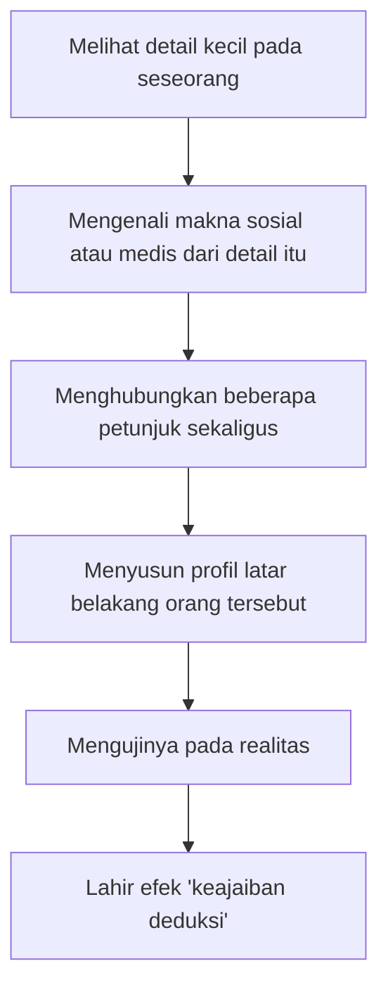
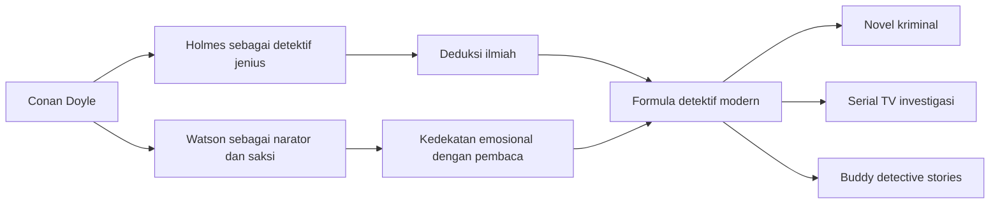

## 🕵️ Pendahuluan: Sherlock Holmes Adalah Tokoh Fiksi yang Menolak Tetap Menjadi Fiksi

Ada banyak tokoh sastra yang dikenang. Ada beberapa yang dicintai. Tetapi hanya sedikit yang benar-benar keluar dari halaman buku, menembus budaya populer, lalu hidup seolah-olah menjadi bagian dari sejarah nyata. **Sherlock Holmes** adalah salah satu dari segelintir tokoh itu. 🔎

Ia bukan hanya detektif ciptaan **Arthur Conan Doyle**. Ia sudah berubah menjadi semacam *kehadiran budaya* — figur yang begitu kuat sampai-sampai banyak orang lebih mudah mengingat Holmes daripada pengarangnya sendiri. Orang datang ke Baker Street. Orang menulis surat kepadanya. Orang memperdebatkan sifat-sifatnya seperti sedang membicarakan tokoh historis. Bahkan setelah lebih dari satu abad, Holmes tetap terus dihidupkan oleh film, serial, teater, komik, video esai, kajian akademik, dan budaya fandom global. 🌍

Di titik inilah kisah Sherlock Holmes menjadi jauh lebih besar daripada sekadar kisah detektif. Ia adalah pintu masuk untuk membahas banyak hal sekaligus:
- bagaimana sebuah karakter sastra bisa terasa “lebih nyata” daripada manusia biasa,
- bagaimana luka psikologis pengarang bisa merembes ke dalam tokoh ciptaannya,
- bagaimana masyarakat modern butuh sosok yang bisa membuat dunia yang kacau terasa terbaca,
- dan bagaimana seorang pengarang bisa sekaligus mencintai dan membenci ciptaannya sendiri. 🧠

Dokumenter *The Sherlock Holmes Influence* sangat menarik karena tidak puas dengan jawaban sederhana seperti “Holmes hebat karena ia cerdas.” Dokumenter ini justru menelusuri jaringan pengaruh yang jauh lebih kompleks: masa kecil Conan Doyle, ayah yang alkoholik, ibu yang gemar bercerita, pendidikan Jesuit, latihan kedokteran, sosok **Dr. Joseph Bell**, figur lain yang lebih gelap seperti **Brian Charles Waller**, suasana London Victoria, kepanikan sosial, sensasi kejahatan urban, dan ambisi sastra Conan Doyle yang ternyata tidak selalu sejalan dengan popularitas Holmes. 🌫️

Artikel ini akan mengembangkan semua itu secara lebih lengkap, lebih runtut, dan lebih dalam. Kita tidak hanya akan bertanya **siapa Sherlock Holmes**, tetapi juga:

- **mengapa ia lahir dari bahan-bahan kehidupan Conan Doyle seperti itu,**
- **mengapa publik Victoria begitu lapar terhadap figur seperti dia,**
- **mengapa Conan Doyle sempat ingin membunuhnya,**
- dan **mengapa Holmes tetap hidup sampai sekarang, bahkan setelah pengarangnya lama tiada.** ✨

---

## 🧭 Tesis Utama: Sherlock Holmes Adalah Persilangan antara Trauma, Ilmu, Imajinasi, dan Kebutuhan Sosial

Kalau artikel ini harus diringkas ke dalam satu tesis besar, maka tesisnya adalah ini:

> **Sherlock Holmes menjadi tokoh yang abadi karena ia lahir dari pertemuan empat kekuatan sekaligus: pengalaman pribadi Conan Doyle, metode observasi medis, kegelisahan masyarakat Victoria, dan kebutuhan pembaca akan figur yang mampu mengembalikan keteraturan di tengah dunia yang terasa makin kacau.**

Holmes bukan sekadar orang pintar. Itu terlalu dangkal. Holmes adalah simbol. Ia mewakili harapan bahwa:
- detail kecil masih berarti,
- akal sehat masih bisa bekerja,
- kejahatan masih bisa dipahami,
- kekacauan sosial belum sepenuhnya menelan dunia,
- dan manusia belum kehilangan kemampuan membaca realitas. 🕯️

Tetapi justru yang membuat Holmes hidup bukan hanya terang ini. Holmes juga menyimpan bayangan gelap: kecanduan, kegelisahan, kesombongan, keterasingan, dan relasi yang tidak selalu mudah. Jadi ia bukan pahlawan kardus. Ia adalah figur yang terasa benar-benar mempunyai denyut batin. Dan denyut itu, sangat mungkin, datang dari kedalaman hidup Conan Doyle sendiri. 🌗

---

## 🧬 Bagian 1: Asal-Usul Holmes — Tokoh Komposit, Bukan Salinan Tunggal

Salah satu kesalahan paling umum ketika membahas karakter besar adalah mengira ia pasti “berdasarkan satu orang nyata.” Dokumenter ini menunjukkan bahwa itu terlalu sederhana. Sherlock Holmes lebih tepat dipahami sebagai **tokoh komposit** — gabungan dari banyak pengaruh yang kemudian dibentuk Conan Doyle menjadi satu struktur kepribadian yang utuh. 🧩

Ia memiliki:
- ketajaman klinis seorang dokter,
- naluri panggung seorang demonstrator intelektual,
- kesombongan sosial tertentu,
- kecenderungan murung,
- sisi bohemian *(jiwa bebas, agak menyimpang dari norma sosial)*,
- dan aura ksatria modern yang membela ketertiban dengan akal.

Tidak ada satu manusia yang memuat semuanya persis seperti Holmes. Tetapi Conan Doyle menemukan bahan-bahannya dari orang-orang yang ia lihat, situasi yang ia alami, dan struktur sosial yang ia tempati. Karena itulah Holmes terasa hidup: ia tidak lahir dari ide abstrak, melainkan dari **observasi terhadap manusia dan dunia nyata**. 👣

---

## 🌫️ Bagian 2: Masa Kecil yang Retak — Ayah, Alkohol, dan Rumah yang Tidak Stabil

Untuk memahami Sherlock Holmes secara sungguh-sungguh, kita tidak cukup hanya melihat Baker Street. Kita harus kembali ke rumah masa kecil Arthur Conan Doyle. Dan rumah itu, jika mengikuti dokumenter ini, jauh dari citra rapi kelas menengah yang sering diasosiasikan dengan dunia Holmes. 🏚️

Ayah Conan Doyle, **Charles Altamont Doyle**, adalah seniman berbakat. Tetapi ia juga seorang pecandu alkohol kronis yang mengalami depresi dan epilepsi. Kombinasi ini penting sekali. Karena seorang ayah yang artistik tetapi rapuh, penuh bakat tetapi tidak mampu mengendalikan hidup, adalah figur yang sekaligus menginspirasi dan menghancurkan. 

Bagi seorang anak, suasana rumah seperti ini menciptakan banyak lapisan pengalaman:
- rasa takut yang tidak selalu bisa dijelaskan,
- ketidakpastian ekonomi,
- reputasi keluarga yang rentan,
- pengalaman menyaksikan figur ayah runtuh,
- dan kemungkinan munculnya kekerasan, impulsivitas, atau ketegangan domestik yang menetap. ⚠️

Dokumenter ini menunjukkan bahwa tema-tema seperti:
- alkoholisme,
- suami brutal,
- kekerasan rumah tangga,
- lelaki yang merusak hidup orang-orang terdekat,

sering muncul dalam kisah-kisah Holmes. Ini bukan bukti matematis, tetapi sangat kuat sebagai jejak psikologis. Conan Doyle tampaknya tidak hanya menulis kejahatan dari surat kabar. Ia menulis dari sesuatu yang lebih dekat: **ingatan terhadap kehancuran domestik**. 🩸

Di sini kita mulai melihat bahwa Holmes tidak lahir hanya sebagai pemecah misteri. Ia juga bisa dibaca sebagai respons terhadap dunia batin yang pernah diguncang. Jika rumah masa kecil penuh ketidakpastian, maka tidak aneh bila anak yang tumbuh dari sana menciptakan tokoh yang obsesif terhadap pola, bukti, dan keteraturan. Holmes mungkin adalah bentuk ekstrem dari kerinduan pada dunia yang bisa dibaca. 📐

<Callout type="important" title="Holmes sebagai Antitesis dari Kekacauan Rumah Tangga">
Jika kehidupan awal Conan Doyle dipenuhi oleh ayah yang tidak stabil, maka Sherlock Holmes dapat dibaca sebagai kebalikan simbolik dari pengalaman itu: figur yang tidak mabuk, tidak kacau, tidak tak terkendali, tetapi justru membaca dunia dengan disiplin, bukti, dan urutan logis. 🔍
</Callout>

---

## 👩 Bagian 3: Mary Doyle — Ibu yang Menyelamatkan Dunia lewat Cerita

Kalau ayah Conan Doyle menghadirkan retak, maka ibunya, **Mary Doyle**, tampaknya menghadirkan bentuk. Dokumenter ini menekankan betapa pentingnya peran sang ibu dalam membesarkan imajinasi Conan Doyle. Ia gemar menceritakan kisah-kisah tentang:
- ksatria,
- petualangan,
- kehormatan,
- keberanian,
- dan dunia kesatriaan. 📖

Ini bukan pengaruh kecil. Banyak pengarang besar dibentuk bukan pertama-tama oleh sekolah, tetapi oleh **suara orang yang bercerita kepada mereka saat kecil**. Cerita dari ibu sering bekerja bukan hanya sebagai hiburan, melainkan sebagai cara menata rasa takut, mengubah hidup menjadi narasi, dan memberi kerangka makna pada dunia yang berantakan.

Di sini saya kira ada kunci yang sangat penting: Holmes bukan sekadar ilmuwan dingin. Ia juga memiliki aura **heroik**. Ia hadir saat masyarakat bingung. Ia membela orang yang terjepit. Ia memasuki ruang-ruang gelap, lalu keluar sambil membawa bentuk penjelasan. Dalam arti itu, Holmes adalah **ksatria modern tanpa zirah**. ⚔️

Kalau pada abad pertengahan ksatria membawa pedang, maka pada akhir abad ke-19 Sherlock Holmes membawa:
- kaca pembesar,
- logika,
- observasi,
- dan keberanian intelektual.

Ini penting. Karena tanpa lapisan heroik itu, Holmes mungkin hanya akan menjadi mesin analisis. Tetapi dengan lapisan yang diwarisi dari dunia cerita sang ibu, ia berubah menjadi figur yang secara emosional juga bisa dicintai. 💫

---

## 🎓 Bagian 4: Disiplin Jesuit dan Keinginan untuk Menata Dunia

Conan Doyle dibesarkan dalam lingkungan Katolik yang kuat dan dididik di sekolah Jesuit. Pendidikan Jesuit dikenal keras, terstruktur, dan sangat menuntut disiplin intelektual. Di sana seseorang didorong untuk:
- berpikir sistematis,
- mengolah argumen,
- menata pengetahuan,
- menghormati struktur,
- dan bertahan dalam lingkungan yang menuntut daya tahan mental. 📏

Sekali lagi, ini menarik bila dipertemukan dengan kekacauan rumah. Anak-anak yang tumbuh dalam lingkungan tak stabil sering mengembangkan kecintaan besar pada struktur. Struktur terasa seperti keselamatan. Keteraturan terasa seperti perlindungan. Dan Sherlock Holmes adalah tokoh yang dibangun hampir sepenuhnya dari hasrat semacam itu:

- segala sesuatu harus punya pola,
- anomali harus dijelaskan,
- fakta yang tampak acak harus diletakkan dalam urutan,
- dan dunia yang kabur harus dibersihkan oleh analisis. 🧼

Bisa jadi, inilah salah satu alasan mengapa Holmes begitu menenangkan. Ia adalah representasi ekstrem dari keyakinan bahwa dunia tidak boleh dibiarkan tetap gelap dan absurd. Ada sesuatu yang hampir religius dalam komitmennya pada penjelasan. 

---

## 🩺 Bagian 5: Kedokteran sebagai Fondasi Epistemologis Holmes

Sebelum menjadi novelis terkenal, Conan Doyle adalah mahasiswa kedokteran di Edinburgh. Dokumenter ini benar ketika menekankan bahwa pengalaman medisnya bukan sekadar latar belakang karier, tetapi fondasi dari cara Holmes berpikir. 🩺

Seorang dokter yang baik harus mampu:
- membaca gejala kecil,
- membedakan tanda penting dari yang remeh,
- menghubungkan detail tubuh dengan sebab yang tersembunyi,
- dan menyusun diagnosis berdasarkan jejak yang tidak selalu jelas.

Holmes melakukan hal yang hampir sama, hanya saja pada tubuh sosial dan tubuh kriminal. Ia memperlakukan kasus layaknya penyakit:
- gejala = petunjuk,
- penyebab = pelaku atau motif,
- diagnosis = penjelasan deduktif,
- terapi = penyelesaian kasus. 🔬

Ini memberi Holmes keunggulan besar dibanding detektif yang hanya mengandalkan kebetulan atau intuisi liar. Ia tampak ilmiah. Ia membuat kecerdasan terlihat seperti kerja profesional, bukan sihir. Dan justru itu yang sangat memikat pembaca modern. 

---

## 🦅 Bagian 6: Dr. Joseph Bell — Sumber Utama Metode Deduksi Holmes

Nama **Dr. Joseph Bell** hampir tidak mungkin dipisahkan dari asal-usul Holmes, dan dokumenter ini menjelaskan alasannya dengan sangat baik. Bell adalah dosen bedah klinis Conan Doyle di Edinburgh, terkenal bukan hanya karena keterampilan medisnya, tetapi karena kemampuannya mengamati pasien dan membuat kesimpulan yang tampak ajaib. 🦅

Bell digambarkan sebagai sosok:
- kurus,
- berhidung tajam,
- berwajah elang,
- bergerak cepat,
- bersuara tinggi dan tegas,
- dan sangat piawai membaca orang.

Secara visual saja, kita sudah bisa melihat benih Holmes. Tetapi yang lebih penting adalah **pertunjukan intelektualnya**. Di depan para mahasiswa, Bell sering menunjukkan bagaimana dari tanda kecil seseorang bisa ditarik kesimpulan besar. Ini adalah teater pengetahuan. Dan Holmes mewarisi teater itu. 🎭

### Mengapa Joseph Bell begitu penting?
Karena Bell mengajarkan bahwa kecerdasan bukan terutama soal tahu banyak, melainkan soal **melihat dengan benar**. 

Kisah terkenal tentang Bell yang menebak seorang pasien sebagai:
- bekas tentara,
- baru keluar dari dinas,
- bintara,
- dari resimen Highland,
- dan pernah ditempatkan di Barbados,

menjadi contoh sempurna. Ia sampai pada kesimpulan itu lewat serangkaian inferensi kecil. Bagi mahasiswa muda seperti Conan Doyle, pengalaman ini pasti mengguncang. Ia melihat bagaimana observasi bisa terasa seperti sihir tanpa pernah berhenti menjadi rasional. ⚡

Namun penting juga untuk tidak melebih-lebihkan. Dokumenter ini cukup adil: **Joseph Bell adalah sumber besar bagi metode Holmes, tetapi bukan keseluruhan kepribadian Holmes**. Kalau hanya mengambil Bell, Holmes mungkin akan menjadi dokter demonstrator yang brilian, tetapi belum tentu menjadi tokoh sastra yang rumit.

---

## 🌑 Bagian 7: Brian Charles Waller — Sisi Holmes yang Tidak Selalu Menyenangkan

Kalau Joseph Bell mewakili inspirasi terang, maka dokumenter ini mengangkat nama lain yang jauh lebih ambigu: **Brian Charles Waller**. Ia adalah dokter patologi yang pernah menjadi penyewa atau figur dekat keluarga Doyle ketika kondisi finansial keluarga memburuk. 🌑

Waller digambarkan sebagai pribadi yang:
- dominan,
- penuh percaya diri,
- cepat memutuskan,
- merasa tahu segalanya,
- sangat kritis pada orang lain,
- dan dalam beberapa hal, tidak mudah disukai.

Nah, di titik inilah kita mulai memahami satu aspek penting Holmes yang sering terlupakan: Holmes itu **mengagumkan, tetapi tidak selalu menyenangkan**. Ia bisa dingin, bisa arogan, bisa meremehkan orang lain, bisa berbicara dengan ketajaman yang hampir melukai. Watson sendiri pada awal relasi mereka tidak langsung jatuh hati. Ia lebih dulu menghadapi keanehan, kekakuan, dan egosentrisme Holmes. 🤨

Dokumenter ini mengusulkan bahwa sifat-sifat Holmes yang lebih sulit dicintai mungkin justru mengambil bahan dari figur seperti Waller. Ini sangat masuk akal. Tokoh yang hidup biasanya tidak dibuat hanya dari orang yang dikagumi pengarang, tetapi juga dari orang yang mengganggu, membuat resah, atau menimbulkan ketegangan batin.

Dengan kata lain, Bell memberi Holmes **metode**, sementara Waller mungkin ikut memberi Holmes **temperamen problematis**. 

---

## 🪞 Bagian 8: Holmes sebagai Wadah Psikologis Conan Doyle

Ada bagian dokumenter yang lebih spekulatif, tetapi justru sangat menarik: apakah Sherlock Holmes juga menjadi tempat Conan Doyle menampung bagian-bagian hidupnya yang sulit dihadapi? 🪞

Kita perlu hati-hati agar tidak jatuh ke psikologi ngawur. Tetapi pertanyaan ini tetap sah. Karena terlalu banyak unsur kehidupan Conan Doyle yang tampak memantul kembali dalam dunia Holmes:
- ayah yang alkoholik ↔ tema kecanduan dan kehancuran domestik,
- ketidakstabilan rumah ↔ obsesi pada keteraturan,
- figur-figur dominan di masa muda ↔ Holmes yang superior dan menguasai ruang,
- pengalaman kehilangan dan kegelisahan ↔ Holmes yang murung, gelisah, dan ekstrem.

Kalau kita membaca Holmes dari sudut ini, maka ia bukan cuma tokoh detektif. Ia adalah **alat psikis**. Melalui Holmes, Conan Doyle mungkin bisa:
- mengendalikan dunia yang dulu tak bisa ia kendalikan,
- menata kekacauan dalam bentuk narasi,
- memberi wajah pada figur-figur yang pernah memengaruhinya,
- dan mungkin juga berbicara tentang dirinya sendiri tanpa harus mengakuinya secara langsung.

Ini membuat hubungan Conan Doyle dengan Holmes menjadi jauh lebih rumit daripada hubungan pengarang-biasa dengan tokoh-biasa. Di sini Holmes terasa seperti **perpanjangan diri** yang sekaligus berguna, menguntungkan, menghibur, dan melelahkan. 😵‍💫

---

## 💉 Bagian 9: Kokain, Mood Swing, dan Holmes yang Tidak Steril

Salah satu hal yang membuat Holmes terasa modern adalah bahwa ia bukan pahlawan moral yang bersih. Ia memakai kokain. Ia mengalami kebosanan yang ekstrem. Ia bisa bekerja berhari-hari tanpa ritme sehat. Lalu ia bisa jatuh dalam keadaan hampir seperti kebekuan. 💉

Dokumenter ini menghubungkan sisi ini dengan pengalaman Conan Doyle terhadap kecanduan ayahnya. Ini bukan hubungan harfiah satu banding satu, tetapi sebagai pembacaan simbolik ia sangat kuat. Holmes membawa ke dalam tubuhnya jejak dunia yang telah dilihat pengarangnya: dunia di mana kecanduan, kerusakan, dan kompulsi adalah bagian dari kenyataan manusia. 

Ini sangat penting bagi kualitas sastra Holmes. Kalau ia hanya jenius tanpa luka, ia akan membosankan. Tetapi karena ia memiliki:
- kecenderungan destruktif,
- kesepian,
- ketergantungan pada stimulasi,
- dan kegelisahan eksistensial,

maka ia berubah dari sekadar mesin deduksi menjadi sosok yang punya dimensi batin. ⚡

Justru karena Holmes tidak steril, pembaca percaya padanya.

---

## 🏙️ Bagian 10: Edinburgh dan London — Dua Kota yang Bersatu dalam Imajinasi Holmes

Masyarakat sering menganggap Holmes murni tokoh London. Memang kisah-kisahnya berakar kuat di London, khususnya Baker Street. Tetapi dokumenter ini mengingatkan bahwa **jiwa awal Holmes juga sangat Edinburgh**. 🏙️

Edinburgh memberi Conan Doyle:
- masa kecilnya,
- lanskap sosial pembentuk imajinasinya,
- universitas medis,
- dan dunia yang lebih tua, berlapis, muram, penuh sejarah, serta punya jejak kriminalitas dan legenda sendiri.

London, sebaliknya, memberi:
- panggung metropolitan,
- anonimnya kota modern,
- kesibukan massa,
- surat kabar,
- kriminalitas urban,
- dan perasaan bahwa masyarakat semakin kompleks serta sulit dibaca.

Jadi Holmes sebenarnya lahir dari percampuran dua ruang:
- **Edinburgh** sebagai laboratorium pembentukan karakter dan metode,
- **London** sebagai teater besar tempat karakter itu diuji. 🎭

---

## 🌁 Bagian 11: Zaman Victoria — Kemajuan yang Diiringi Kecemasan

Satu hal yang sangat tajam dari dokumenter ini adalah pembacaannya terhadap **masyarakat Victoria akhir**. Ini adalah masa ketika Kekaisaran Britania sedang sangat kuat, tetapi justru di dalam kekuatan itu ada kecemasan yang besar. 🌁

Dunia berubah cepat:
- kereta api berkembang,
- bawah tanah London mulai hadir,
- motor dan teknologi baru mulai muncul,
- kota membesar sangat cepat,
- relasi antar manusia makin anonim,
- dan ritme modernitas mulai menggerus rasa aman lama.

Dalam situasi seperti ini, masyarakat membutuhkan figur yang bisa melakukan dua hal sekaligus:
1. mengakui adanya kekacauan,
2. tetapi tidak menyerah pada kekacauan itu.

Sherlock Holmes melakukan keduanya. Ia tidak menawarkan pelarian naif. Ia tidak berkata bahwa dunia baik-baik saja. Justru sebaliknya: ia membawa pembaca masuk ke pembunuhan, penipuan, intrik, kekerasan, rahasia keluarga, dan ancaman yang lahir dari dalam masyarakat kelas menengah itu sendiri. Tetapi ia juga memberi satu jaminan penting: **masih ada akal yang cukup kuat untuk memahami semua ini.** 🕯️

Itulah sebabnya Holmes sangat cocok dengan modernitas awal. Ia adalah figur penenteram bagi masyarakat yang mulai sadar bahwa dunia mereka tidak lagi sederhana.

<Callout type="quote" title="Holmes sebagai Terapis Budaya Zaman Victoria">
Masyarakat Victoria tidak membutuhkan tokoh yang menutupi kegelapan. Mereka membutuhkan tokoh yang berani masuk ke dalam kegelapan, lalu keluar sambil membawa penjelasan. Itulah fungsi budaya Sherlock Holmes. 🌫️
</Callout>

---

## 🔪 Bagian 12: Jack the Ripper dan Munculnya Imajinasi Kejahatan Modern

Dokumenter ini dengan tepat menyebut bahwa pembaca Holmes hidup di zaman yang juga mengenal figur seperti **Jack the Ripper**. Pers memberitakan pembunuhan brutal. Masyarakat sadar bahwa kota modern bisa menyimpan kejahatan yang tidak masuk akal dan menakutkan. 🔪

Dampaknya besar sekali pada imajinasi publik. Kejahatan tidak lagi terasa sebagai gangguan kecil di pinggiran. Ia terasa sebagai ancaman yang bisa menyelinap ke pusat peradaban. Dalam situasi itu, Holmes memenuhi kebutuhan psikologis yang sangat kuat:
- ia memberi sensasi menghadapi kejahatan,
- tetapi sekaligus memberi jaminan bahwa kejahatan itu bisa dipetakan.

Dengan kata lain, Holmes adalah jawaban terhadap lahirnya **ketakutan urban modern**. 

---

## 📚 Bagian 13: Holmes dan Watson — Formula yang Mengubah Sastra Populer Selamanya

Salah satu kontribusi terbesar Conan Doyle bukan cuma menciptakan tokoh, tetapi menciptakan **formula naratif** yang luar biasa tahan lama. Pasangan **Holmes dan Watson** menjadi model dasar bagi hampir semua pasangan detektif modern. 📚

Mengapa formula ini begitu kuat?

### Holmes memberi keajaiban intelektual
Ia yang melihat pola yang tak terlihat.

### Watson memberi jembatan emosional
Ia lebih dekat dengan pembaca biasa. Ia heran ketika kita heran. Ia kagum ketika kita kagum. Ia memanusiakan Holmes.

Tanpa Watson, Holmes bisa terasa terlalu dingin atau terlalu abstrak. Tanpa Holmes, Watson akan kehilangan pusat magnetik. Bersama-sama, mereka membentuk struktur cerita yang hampir sempurna. 🤝

Dari sini lahirlah warisan besar:
- detektif jenius + pendamping pembumi,
- kecerdasan tinggi + reaksi manusia biasa,
- observasi ekstrem + narasi yang ramah pembaca.

Tidak berlebihan jika dokumenter ini menyebut bahwa tanpa Conan Doyle, kita mungkin tidak punya banyak bentuk fiksi detektif modern sebagaimana kita kenal sekarang — dari novel, drama radio, film noir, serial polisi, sampai format serial investigasi di televisi. 📺

---

## 🏛️ Bagian 14: Conan Doyle Tidak Hanya Menciptakan Tokoh, tetapi Juga Menciptakan Institusi Budaya Serial

Dokumenter ini juga sangat menarik ketika menyinggung bahwa serialisasi Holmes di majalah menciptakan bentuk keterikatan pembaca yang sangat modern. Orang menunggu episode berikutnya. Mereka merasa hidup bersama tokoh-tokoh itu. Mereka membicarakannya. Mereka penasaran. Mereka marah kalau alurnya diputus. 📰

Ini penting sekali. Karena berarti Conan Doyle bukan hanya pelopor fiksi detektif, tetapi juga salah satu arsitek awal dari **budaya serial populer**. Dalam banyak hal, ia mendahului logika yang sekarang kita lihat pada:
- serial TV mingguan,
- cliffhanger,
- fandom episodik,
- bahkan cara orang menunggu musim berikutnya dari sebuah serial besar. 🎬

Holmes bukan cuma dibaca. Ia **diikuti**. Dan ketika sebuah tokoh mulai diikuti seperti itu, ia bergerak dari sastra menuju budaya massa.

---

## ⚔️ Bagian 15: Mengapa Conan Doyle Ingin Membunuh Holmes?

Ini pertanyaan paling ironis dan paling manusiawi dari semuanya. Mengapa seorang pengarang ingin menyingkirkan tokoh yang telah memberinya uang, nama, dan keabadian? ⚔️

Dokumenter ini mengisyaratkan setidaknya empat jawaban besar.

### 1. Ia merasa Holmes menghambat karya “serius”-nya
Conan Doyle tampaknya ingin dikenang juga — atau bahkan terutama — karena novel sejarah, kisah kesatriaan, dan karya yang menurutnya lebih berbobot. Holmes menghasilkan uang, tetapi mungkin tidak selalu memberinya martabat sastra yang ia idamkan. 🎭

### 2. Holmes menelan identitas pengarang
Ini luka narsistik yang sangat nyata. Bayangkan Anda menciptakan sesuatu, lalu dunia jatuh cinta pada ciptaan itu sedemikian rupa sampai nama Anda sendiri menjadi sekunder. Bagi banyak pengarang, ini mungkin terdengar seperti mimpi. Tetapi bagi pengarang dengan ambisi artistik besar, itu juga bisa terasa seperti penjara.

### 3. Holmes mungkin terlalu dekat dengan dirinya sendiri
Semakin cepat dan spontan Conan Doyle menulis, semakin besar kemungkinan unsur-unsur hidupnya sendiri merembes ke dalam teks. Jika benar Holmes memuat terlalu banyak jejak diri, trauma, kegelisahan, dan bayangan pengarangnya, maka membunuh Holmes bisa dibaca sebagai upaya memutus hubungan dengan cermin yang terlalu jujur. 🪞

### 4. Ia lelah dijajah oleh kesuksesannya sendiri
Kesuksesan tidak selalu membebaskan. Kadang ia juga mengikat. Holmes menuntut terus ditulis, terus dihidupkan, terus diulang. Mungkin di titik tertentu Conan Doyle merasa bukan lagi ia yang mengendalikan Holmes, tetapi Holmes yang mengendalikan ritme hidup dan kariernya. ⛓️

---

## 🌊 Bagian 16: Reichenbach Falls — Kematian sebagai Drama, Perlawanan, dan Simbol Pemutusan

Conan Doyle tidak membunuh Holmes dengan cara biasa. Ia memilih **Reichenbach Falls** dan mempertemukan Holmes dengan **Professor Moriarty** dalam benturan final. Ini penting. Karena kematian Holmes harus terasa setara dengan kebesaran tokohnya. Ia tidak bisa mati karena sakit, atau karena kesalahan kecil. Ia harus jatuh bersama lawan yang setara. 🌊

Secara simbolik, ini juga sangat kuat:
- Holmes bertarung dengan bayangan intelektualnya sendiri,
- ketertiban bertemu antiketeraturan cerdas,
- dan keduanya lenyap dalam jurang.

Namun yang paling luar biasa bukan kematiannya, melainkan reaksi publik. Pembaca marah. Ada yang berkabung. Ada yang menulis surat penuh amarah. Ada yang membatalkan langganan majalah. Ini menunjukkan satu hal penting: **Holmes telah berhenti menjadi milik pengarangnya.** Ia kini milik publik. 🖤

Begitu sebuah tokoh mencapai titik ini, pengarang tak lagi bebas memperlakukannya hanya sebagai alat pribadi. Sejarah sastra mulai digerakkan oleh cinta kolektif pembaca.

---

## 🐕 Bagian 17: The Hound of the Baskervilles — Ketika Holmes “Kembali” Sebelum Benar-Benar Kembali

Setelah sempat disingkirkan, Holmes muncul lagi dalam *The Hound of the Baskervilles*. Menariknya, Conan Doyle belum langsung membangkitkan Holmes dari kematian. Ia menyiasatinya dengan menempatkan kisah ini sebelum Reichenbach. 🐕

Saya kira ini sangat penting secara psikologis. Langkah ini menunjukkan ambivalensi Conan Doyle:
- ia masih membutuhkan Holmes,
- ia tahu publik masih menginginkannya,
- tetapi ia belum sepenuhnya siap mengakui bahwa ia menyerah.

Jadi *The Hound of the Baskervilles* bukan hanya karya besar secara sastra. Ia juga merupakan dokumen dari relasi tarik-ulur antara pengarang dan ciptaan.

---

## ♻️ Bagian 18: Kebangkitan Holmes dan Kemenangan Publik atas Keinginan Pengarang

Ketika Conan Doyle akhirnya benar-benar menghidupkan Holmes kembali dalam *The Empty House*, itu adalah salah satu momen paling penting dalam sejarah karakter fiksi. Holmes kembali, dan publik menang. ♻️

Tetapi bukan hanya publik yang menang. Conan Doyle juga menang dalam arti lain: ia menerima bahwa Holmes adalah kendaraan paling kuat yang ia miliki untuk terus hadir di dunia sastra dan budaya populer. Kadang-kadang, kedewasaan seorang seniman bukan berarti memaksakan idealismenya semata, tetapi memahami bentuk mana dari dirinya yang benar-benar mampu hidup di luar dirinya.

Holmes, pada akhirnya, adalah bentuk itu.

---

## 🎭 Bagian 19: William Gillette dan Lepasnya Holmes dari Tangan Pencipta

Dokumenter ini juga menyebut **William Gillette**, aktor Amerika yang ingin mengadaptasi dan memainkan Holmes di panggung. Conan Doyle tampak semakin tidak terlalu posesif: lakukan saja apa yang perlu dilakukan. 🎭

Di sini kita melihat fase baru dalam kehidupan Holmes. Tokoh ini mulai benar-benar lepas dari tangan pengarang. Ia pindah ke panggung, ke performa, ke tubuh aktor, ke interpretasi publik. Dan begitu itu terjadi, Holmes berubah dari tokoh sastra menjadi **entitas budaya yang bisa dihidupkan ulang berkali-kali**.

Ini bukan hal kecil. Banyak tokoh mati bersama teksnya. Holmes tidak. Ia justru tumbuh setiap kali diadaptasi.

---

## 🔮 Bagian 20: Spiritualitas, Duka Besar, dan Jarak Holmes dari Jiwa Conan Doyle yang Terdalam

Kehidupan Conan Doyle di kemudian hari dipenuhi tragedi: sakit istri, kematian ayah, kematian anak, kehilangan akibat perang, dan duka yang sangat besar. Dokumenter ini memperlihatkan bagaimana pengalaman-pengalaman itu mendorong Conan Doyle semakin jauh ke **spiritualisme** — keyakinan bahwa orang mati masih dapat berkomunikasi dengan yang hidup. 🔮

Ini menarik sekali bila dibandingkan dengan Holmes. Holmes berdiri di sisi rasional, observasional, bukti empiris, dan skeptisisme. Conan Doyle, dalam fase akhir hidupnya, justru semakin tertarik pada dunia tak kasatmata, penghiburan metafisik, dan komunikasi lintas kematian. 

Mungkin di sinilah paradoks terdalam hubungan mereka: tokoh paling rasional yang pernah ia ciptakan ternyata tidak sepenuhnya mewakili seluruh kebutuhannya sebagai manusia. Holmes mewakili satu bagian Conan Doyle — bagian yang ingin memahami. Tetapi ia tidak cukup mewakili bagian yang ingin dihibur, dipulihkan, dan diberi harapan metafisik setelah dihantam duka. 🌒

---

## 🧠 Bagian 21: Mengapa Holmes Terasa Nyata?

Salah satu pertanyaan dokumenter yang paling bagus adalah: mengapa begitu banyak orang merasa Holmes nyata? Jawabannya, menurut saya, ada beberapa lapis. 🧠

### Pertama, karena detailnya sangat konkret
Alamat, kebiasaan, cara duduk, suara, chemistry dengan Watson, rutinitas, bahkan kekurangan-kekurangannya membuat Holmes terasa seperti manusia, bukan simbol kosong.

### Kedua, karena Watson menuliskannya seperti orang nyata
Watson adalah perangkat naratif jenius. Ia tidak menulis Holmes sebagai ikon, tetapi sebagai teman serumah yang kadang brilian, kadang menjengkelkan, kadang mengkhawatirkan.

### Ketiga, karena Holmes konsisten tetapi tidak datar
Ia punya ciri kuat, tetapi tidak satu dimensi. Ia bisa dingin dan peduli, sombong dan adil, eksentrik dan sangat fungsional.

### Keempat, karena ia menjawab kebutuhan psikis pembaca
Pembaca *ingin* ada orang seperti Holmes. Orang yang bisa datang saat semuanya ruwet, lalu berkata: “tenang, saya tahu apa yang terjadi.” 🕯️

---

## 🌍 Bagian 22: Mengapa Holmes Masih Relevan untuk Abad ke-21?

Sherlock Holmes diciptakan lebih dari seabad lalu, tetapi tetap hidup di abad ke-21. Mengapa? Karena masalah yang ia jawab ternyata tidak pernah benar-benar hilang. 🌍

Kita juga hidup di zaman yang penuh:
- banjir informasi,
- kebingungan moral,
- ketidakpastian sosial,
- kesulitan membedakan fakta dan ilusi,
- dan rasa letih menghadapi dunia yang terlalu cepat.

Dalam kondisi seperti ini, Holmes kembali terasa relevan karena ia merayakan kemampuan yang makin langka:
- perhatian yang fokus,
- observasi yang teliti,
- logika yang sabar,
- dan keberanian menunda kesimpulan sampai bukti cukup. 🧠

Di era media sosial, impuls tercepat sering menang. Holmes adalah antitesis dari impuls itu. Ia adalah kultus terhadap pikiran yang sabar.

<Callout type="tip" title="Mengapa Holmes Selalu Kembali di Era Digital?">
Karena semakin dunia terasa berisik, semakin kita merindukan figur yang mampu membedakan sinyal dari kebisingan. Holmes adalah patron saint bagi perhatian mendalam. 📌
</Callout>

---

## 🤝 Bagian 23: Holmes dan Watson — Bukan Hanya Mesin Plot, tetapi Juga Model Persahabatan

Ada satu dimensi yang sering diremehkan: keberhasilan Holmes juga bertumpu pada **kehangatan relasinya dengan Watson**. 🤝

Holmes mungkin jenius, tetapi tanpa Watson ia bisa menjadi dingin, sulit didekati, bahkan menakutkan. Watson memberi:
- kepercayaan,
- kesetiaan,
- humor,
- rasa takjub,
- dan saksi manusiawi terhadap keajaiban Holmes.

Mungkin inilah salah satu alasan Holmes bertahan. Karena di balik seluruh kabut, kejahatan, dan intelektualitas, kita sebenarnya juga sedang membaca kisah tentang dua orang yang belajar hidup berdampingan dan saling membutuhkan. Itu membuat dunia Holmes tidak hanya mengagumkan, tetapi juga hangat. 🫶

---

## 📊 Ringkasan Faktor yang Membuat Sherlock Holmes Menjadi Fenomena Abadi

| Faktor | Isi | Dampak |
| :--- | :--- | :--- |
| **Masa kecil Conan Doyle** | Rumah tidak stabil, ayah alkoholik, tekanan emosional | Melahirkan kebutuhan kuat pada keteraturan dan figur pengendali |
| **Pengaruh ibu** | Kisah ksatria, petualangan, dan kehormatan | Memberi Holmes aura heroik dan romantik |
| **Pendidikan Jesuit** | Disiplin, struktur, dan latihan intelektual | Menguatkan kecenderungan berpikir sistematis |
| **Pendidikan medis** | Observasi gejala, diagnosis, inferensi | Membentuk metode deduksi Holmes |
| **Joseph Bell** | Model pengamatan tajam dan demonstrasi deduktif | Menjadi inspirasi terbesar sisi analitis Holmes |
| **Brian Charles Waller** | Sosok dominan, arogan, dan sulit disukai | Mungkin menyumbang sisi Holmes yang lebih problematis |
| **London Victoria** | Kota modern yang cemas dan membesar cepat | Menyediakan panggung ideal bagi detektif penata kekacauan |
| **Kejahatan urban** | Jack the Ripper, ketakutan sosial, sensasi kriminal | Membuat publik lapar pada figur pemulih ketertiban |
| **Watson** | Narator yang membumi dan manusiawi | Membuat Holmes terasa nyata dan dapat dicintai |
| **Serialisasi** | Cerita episodik yang ditunggu publik | Membangun fandom dan budaya keterikatan massal |
| **Ambisi Conan Doyle** | Ingin diakui lebih dari sekadar penulis Holmes | Memicu konflik batin dan keinginan membunuh Holmes |
| **Adaptasi lintas media** | Panggung, film, TV, budaya populer | Mengabadikan Holmes jauh melampaui buku aslinya |

---

## 🧾 Glosarium Istilah Penting

- **Alter ego:** Sisi lain dari diri seseorang yang tampil melalui tokoh atau persona tertentu.
- **Bohemian:** Gaya hidup atau watak yang bebas, eksentrik, tidak terlalu tunduk pada norma sosial formal.
- **Chivalry:** Kesatriaan; nilai keberanian, kehormatan, kesopanan, dan perlindungan terhadap yang lemah.
- **Consulting detective:** Detektif konsultatif; pemecah kasus yang tidak bekerja sebagai polisi resmi tetapi dimintai bantuan oleh pihak lain.
- **Deduction / Deduksi:** Penarikan kesimpulan melalui penggabungan petunjuk atau premis ke arah simpulan yang logis.
- **Detective fiction:** Fiksi detektif; cerita yang berpusat pada misteri, penyelidikan, dan pengungkapan pelaku atau sebab peristiwa.
- **Hackwork:** Karya yang dibuat terutama untuk memenuhi kebutuhan pasar atau pemasukan, bukan karya yang dianggap paling tinggi secara artistik oleh penciptanya.
- **Hiatus:** Jeda, masa berhenti sementara, atau kekosongan dalam kelanjutan suatu seri.
- **Spiritualism / Spiritualisme:** Keyakinan bahwa arwah orang mati dapat berkomunikasi dengan orang yang masih hidup.
- **Victorian:** Berkaitan dengan era Ratu Victoria di Inggris; sering diasosiasikan dengan modernitas awal, moral sosial ketat, ekspansi imperium, dan kecemasan perubahan.

---

## 🔗 Bacaan Terkait di BangunAI Blog

Kalau Mas Hendra ingin membaca pengembangan lain tentang semesta Sherlock Holmes, bisa lihat juga:
- <WikiLink to="seni-berpikir-sherlock-holmes-maria-konnikova" label="Seni Berpikir ala Sherlock Holmes: Mindfulness dan Observasi Mendalam bersama Maria Konnikova" />
- <WikiLink to="holmes-vs-moriarty-analisis-mendalam-psikologi-sejarah-evolusi" label="Holmes vs Moriarty: Analisis Mendalam Psikologi, Sejarah, dan Evolusi Rivalitas" />
- <WikiLink to="the-final-problem-analisis-mendalam-kematian-sherlock-holmes-reichenbach" label="The Final Problem: Analisis Mendalam Kematian Sherlock Holmes di Reichenbach" />

---

## 🌟 Kesimpulan: Conan Doyle Menciptakan Holmes, tetapi Holmes yang Memilih Tetap Hidup

Ada ironi yang sangat indah dalam kisah ini. Arthur Conan Doyle ingin menjadi lebih dari sekadar pengarang Sherlock Holmes. Ia ingin dikenang sebagai penulis yang lebih besar, lebih serius, lebih luas dari satu tokoh detektif. Tetapi sejarah punya selera sendiri. 🌟

Yang akhirnya bertahan dengan kekuatan paling besar justru Holmes.

Namun saya kira ini tidak seharusnya dibaca sebagai kekalahan Conan Doyle semata. Justru melalui Holmes, Conan Doyle melakukan sesuatu yang jauh lebih langka daripada menulis “karya serius” yang hanya dihormati di ruang akademik. Ia menciptakan figur yang:
- hidup di banyak medium,
- menembus banyak generasi,
- menyerap terang dan gelap kemanusiaan,
- dan terus berbicara kepada zaman yang berbeda-beda. 🌍

Sherlock Holmes bertahan bukan hanya karena ia pintar. Ia bertahan karena ia adalah simpul dari banyak hal yang sangat manusiawi:
- ketakutan pada kekacauan,
- kerinduan pada keteraturan,
- pesona kecerdasan,
- daya tarik eksentrisitas,
- luka yang tak pernah sepenuhnya sembuh,
- dan harapan bahwa pikiran manusia masih sanggup memahami dunia. 🧠

Maka ketika Conan Doyle menjatuhkan Holmes ke jurang Reichenbach, ia sebenarnya hanya membuktikan satu hal: tokoh tertentu bisa dibunuh di atas kertas, tetapi tidak mudah dibunuh di dalam imajinasi publik. Holmes terlalu besar untuk mati karena keputusan pengarangnya saja. 🕯️

Pada akhirnya, mungkin benar bahwa tanpa Conan Doyle tidak akan ada Sherlock Holmes. Tetapi juga benar bahwa setelah Holmes lahir, ia tidak lagi sepenuhnya milik Conan Doyle. Ia menjadi milik pembaca, milik budaya, dan milik sejarah sastra itu sendiri.

Dan mungkin itulah alasan mengapa kita masih kembali kepadanya hari ini: 

bukan semata-mata karena ia memecahkan misteri, tetapi karena ia membuat kita percaya bahwa di balik kabut, kebisingan, dan kekacauan hidup, **akal yang jernih masih mungkin menyelamatkan makna**. 🔎

---

<Callout type="cite" title="Referensi Sumber">
- Dokumenter: *The Sherlock Holmes Influence | Absolute History*
- Sumber transkrip: [YouTube — The Sherlock Holmes Influence](https://www.youtube.com/watch?v=A7kb2kn9fZs)
- Tokoh kunci: Arthur Conan Doyle, Dr. Joseph Bell, Brian Charles Waller, Sherlock Holmes, Dr. Watson, Professor Moriarty, serta konteks masyarakat Victoria akhir.
</Callout>
