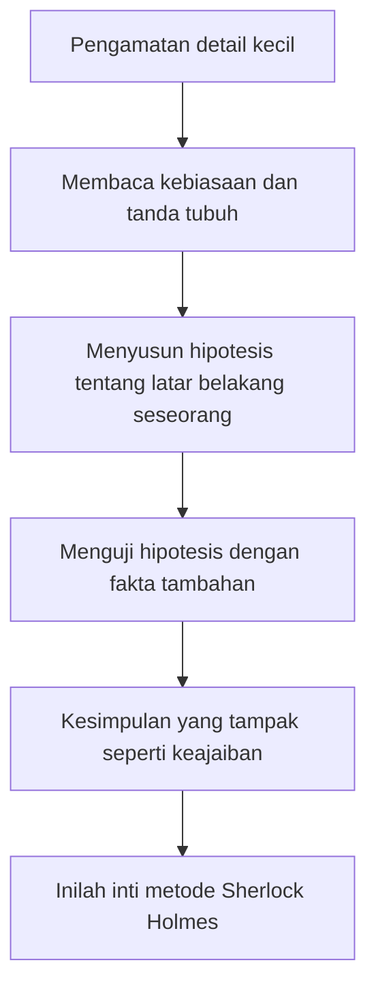
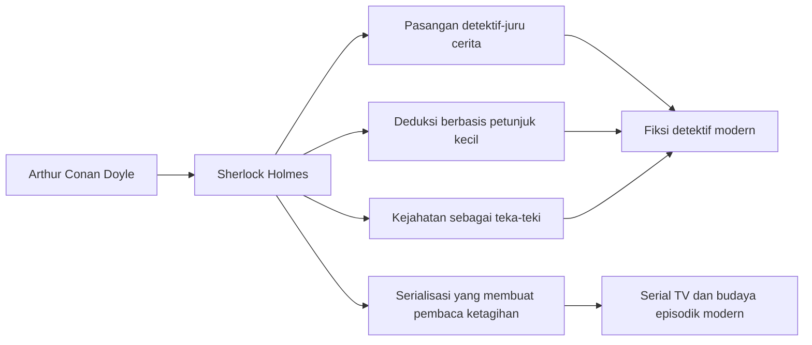

## 🕵️ Pendahuluan: Sherlock Holmes Bukan Sekadar Tokoh Fiksi

Ada tokoh-tokoh sastra yang terkenal. Ada tokoh-tokoh sastra yang dicintai. Lalu ada **Sherlock Holmes** — tokoh yang melampaui batas sastra, melampaui genre, bahkan melampaui penciptanya sendiri. Ia bukan hanya karakter dalam cerita detektif. Ia telah berubah menjadi semacam **mitos modern**: figur yang terasa lebih hidup daripada banyak manusia nyata. 🧠

Sampai hari ini, orang masih berziarah ke Baker Street. Masih ada pembaca yang berbicara tentang Holmes seolah ia pernah benar-benar hidup. Masih ada film, serial, adaptasi, kajian akademik, komunitas penggemar, dan warisan budaya yang terus menghidupkan namanya. Dalam arti tertentu, Sherlock Holmes berhasil mencapai sesuatu yang jarang dicapai tokoh fiksi: **ia menjadi institusi budaya**. 🏛️

Tetapi justru karena itulah pertanyaan paling menarik muncul: **bagaimana tokoh sebesar ini bisa lahir?** Dan lebih aneh lagi, **mengapa Arthur Conan Doyle — penciptanya sendiri — pernah begitu ingin menyingkirkannya?**

Di titik inilah kisah Sherlock Holmes menjadi jauh lebih menarik daripada sekadar cerita kriminal. Ia berubah menjadi kisah tentang:
- hubungan rumit antara pencipta dan ciptaannya,
- luka psikologis yang merembes ke karya sastra,
- perubahan sosial di zaman Victoria,
- dan lahirnya bentuk baru hiburan modern yang kemudian mendefinisikan fiksi detektif dunia. 📚

Dokumenter *The Sherlock Holmes Influence* memperlihatkan bahwa Holmes tidak lahir dari ruang hampa. Ia terbentuk dari campuran yang kompleks: pengalaman hidup Arthur Conan Doyle, pendidikan medis, figur nyata seperti **Dr. Joseph Bell**, kemungkinan pengaruh sosok-sosok yang lebih gelap dalam kehidupan keluarganya, serta kebutuhan masyarakat Victoria akan figur yang bisa mengembalikan keteraturan di tengah dunia yang mulai terasa kacau. 🌫️

Artikel ini akan membedah semua itu secara **detail dan mendalam**. Kita akan melihat bukan hanya siapa Sherlock Holmes, tetapi **mengapa ia bisa begitu kuat**, mengapa ia menjadi cermin zaman, dan mengapa hubungannya dengan Conan Doyle adalah salah satu relasi paling ironis dalam sejarah sastra modern. ✨

---

## 🧬 Bagian 1: Arthur Conan Doyle dan Pertanyaan Asal-Usul — Dari Mana Sherlock Holmes Datang?

Kalau kita membaca Holmes sekilas, kita mungkin mengira ia lahir murni dari kecerdasan imajinatif seorang pengarang. Itu benar, tetapi tidak cukup. Tokoh sebesar Sherlock Holmes biasanya tidak lahir dari satu sumber tunggal. Ia lahir dari **percampuran biografi, observasi sosial, ingatan masa kecil, latihan intelektual, dan kebutuhan budaya**. 🔍

Dokumenter ini menunjukkan bahwa Holmes kemungkinan besar bukan salinan satu orang. Ia lebih tepat dipahami sebagai **komposit** — gabungan dari berbagai pengaruh yang kemudian disatukan Conan Doyle menjadi satu figur yang tampak utuh.

Di satu sisi, Holmes memiliki ciri ilmiah, tajam, klinis, hampir seperti mesin inferensi. Di sisi lain, ia juga memiliki sisi murung, eksentrik, tidak selalu mudah disukai, kadang dingin, kadang gelisah, bahkan kadang cenderung destruktif terhadap dirinya sendiri. Kombinasi ini penting, karena justru di situlah Holmes menjadi manusiawi. Ia bukan malaikat rasional. Ia adalah **figur genius yang dibangun dari terang dan gelap**. 🌗

Dan jika kita mengikuti dokumenter ini, terang dan gelap itu bukan kebetulan. Ia berasal dari kehidupan Arthur Conan Doyle sendiri.

---

## 🌫️ Bagian 2: Masa Kecil Conan Doyle — Bukan Dunia Rapi, Melainkan Dunia yang Guncang

Salah satu kekuatan dokumenter ini adalah ia menolak membayangkan Conan Doyle sebagai pengarang mapan yang tumbuh dalam rumah tenang dan teratur. Justru sebaliknya. Masa kecilnya cukup keras dan tidak stabil. Ia lahir dalam keluarga keturunan Anglo-Irish Catholic, tidak terlalu berada, dan dibayangi masalah besar pada figur ayah. 🏚️

Ayahnya, **Charles Altamont Doyle**, adalah seorang seniman berbakat, tetapi juga seorang pecandu alkohol kronis yang mengalami depresi dan epilepsi. Ini bukan detail kecil. Ini detail yang sangat menentukan. Karena rumah tangga yang dibentuk oleh alkoholisme bukan hanya rumah yang miskin, melainkan rumah yang penuh ketidakpastian.

Alkoholisme menciptakan ritme hidup yang pecah:
- ekonomi keluarga goyah,
- suasana emosional rumah tidak stabil,
- otoritas ayah menjadi tidak dapat diprediksi,
- dan anak tumbuh dengan pengalaman bahwa figur pelindung bisa sekaligus menjadi sumber ancaman. ⚠️

Dokumenter ini bahkan menyoroti bahwa tema **suami alkoholik, kekerasan domestik, brutalitas, dan laki-laki yang membawa kehancuran ke dalam rumah** muncul berulang dalam cerita-cerita Holmes. Ini menarik sekali. Karena artinya, Conan Doyle mungkin tidak sekadar menulis kejahatan sebagai hiburan. Ia mungkin sedang menulis ulang, mengolah, atau mengusir sesuatu dari pengalaman batinnya sendiri. 🩸

Dengan kata lain, dunia Sherlock Holmes tidak hanya dibentuk oleh misteri jalanan London. Ia juga dibentuk oleh **trauma domestik**.

<Callout type="important" title="Mengapa Masa Kecil Pengarang Penting?">
Karena karya besar sering lahir bukan hanya dari imajinasi, tetapi dari pengalaman yang belum sepenuhnya selesai di dalam diri pengarang. Dalam kasus Conan Doyle, sisi gelap Holmes dan para penjahatnya mungkin tidak bisa dilepaskan dari pengalaman keluarga yang rapuh, ayah yang tenggelam dalam alkohol, dan rasa tidak aman yang tertanam sejak dini. 🧠
</Callout>

---

## 👩 Bagian 3: Ibu yang Bercerita, Imajinasi yang Diselamatkan

Namun hidup Conan Doyle tidak hanya berisi kehancuran. Dokumenter ini juga menunjukkan figur penyeimbang yang sangat penting: **ibunya, Mary Doyle**. Kalau ayah menghadirkan kekacauan, maka ibu menghadirkan narasi. Kalau rumah menghadirkan ketidakpastian, maka cerita menghadirkan bentuk. 📖

Mary Doyle dikenal gemar menceritakan kisah-kisah tentang:
- ksatria,
- keberanian,
- kehormatan,
- petualangan,
- dan dunia kesatria (*chivalry* — nilai kesatriaan, keberanian, kehormatan, dan pembelaan terhadap yang lemah).

Ini sangat penting. Karena mungkin justru dari ibunya Conan Doyle belajar bahwa dunia yang kacau masih bisa ditata ulang menjadi cerita. Dan cerita itu bukan sekadar pelarian, tetapi juga cara membentuk makna. 🌟

Kalau kita melihat Holmes dari sudut ini, ia bukan cuma detektif. Ia juga semacam **ksatria modern**. Bedanya, ia tidak menunggang kuda; ia menunggang logika. Ia tidak membawa pedang; ia membawa inferensi. Ia tidak menyelamatkan putri di menara; ia menyelamatkan masyarakat dari kabut kebingungan. ⚔️➡️🧠

Di sini terlihat lapisan yang sangat menarik: Holmes adalah gabungan antara:
- ketelitian medis,
- kecerdasan analitis,
- dan mitologi kepahlawanan yang di-modernisasi.

---

## 🎓 Bagian 4: Pendidikan Jesuit, Disiplin, dan Latihan Keras Menjadi Profesional

Conan Doyle kemudian dikirim ke sekolah asrama Jesuit. Ini juga sangat berpengaruh. Pendidikan Jesuit terkenal keras, terstruktur, dan menuntut disiplin intelektual. Di sana seseorang dibiasakan untuk:
- berpikir sistematis,
- berdebat,
- menata argumen,
- dan hidup di bawah rezim disiplin yang ketat. 📏

Kombinasi ini menarik bila dipertemukan dengan masa kecil yang kacau. Seorang anak yang datang dari rumah yang tidak stabil sering kali tertarik pada struktur yang kuat. Struktur memberi rasa aman. Ketertiban memberi bentuk. Dan Holmes, kalau dilihat dari sini, adalah sosok yang hidup dari **obsesi pada pola, urutan, dan keterbacaan dunia**.

Ia hadir untuk mengatakan: dunia memang kacau, tetapi tidak sepenuhnya tak bisa dipahami. Selalu ada jejak. Selalu ada pola. Selalu ada benang halus yang bisa ditarik. 🧵

Dan justru itulah yang begitu menenangkan bagi pembaca.

---

## 🚢 Bagian 5: Conan Doyle Sang Mahasiswa Kedokteran — Ilmu, Tubuh, dan Tatapan Diagnostik

Sebelum menjadi pengarang besar, Conan Doyle adalah mahasiswa kedokteran di Edinburgh. Ini bukan detail administratif. Ini adalah **fondasi epistemologis** dari Sherlock Holmes. 🩺

Dunia kedokteran mengajarkan kebiasaan yang sangat khas:
- memperhatikan gejala kecil,
- membaca tubuh sebagai kumpulan tanda,
- menarik kesimpulan dari detail yang tampak sepele,
- dan membedakan antara dugaan liar dan diagnosis berbasis bukti.

Holmes pada dasarnya bekerja seperti dokter yang diterjunkan ke ranah kriminal. Ia mengamati, mengumpulkan tanda, menolak sentimentalitas berlebihan, lalu menyusun penjelasan terbaik. Ini adalah cara berpikir diagnostik. 🔬

Dokumenter ini tepat ketika menunjukkan bahwa kemampuan deduksi Holmes tidak bisa dilepaskan dari latihan medis Conan Doyle. Bahkan jika Holmes kemudian tumbuh melampaui semua sumber awalnya, fondasi logikanya tetap sangat medis: **lihat gejala, bangun hipotesis, uji terhadap fakta**.

---

## 🦅 Bagian 6: Dr. Joseph Bell — Inspirasi Paling Terang di Balik Holmes

Kalau ada satu nama nyata yang hampir selalu muncul dalam diskusi tentang asal-usul Holmes, itu adalah **Dr. Joseph Bell**. Dokumenter ini memperlakukan Bell bukan sekadar catatan kaki, melainkan sumber inspirasi utama bagi sisi paling terkenal dari Sherlock Holmes: **kemampuan deduksinya**. 🦅

Bell adalah dosen bedah klinis di University of Edinburgh dan dikenal karena kebiasaannya mengamati pasien dengan sangat teliti. Sebelum pasien banyak bicara, ia bisa memperkirakan:
- latar belakang sosialnya,
- pekerjaannya,
- tempat tinggalnya,
- bahkan pengalaman hidup tertentu,
hanya dari tanda-tanda kecil.

Ini nyaris langsung terdengar seperti Holmes.

Deskripsi Conan Doyle sendiri tentang Bell sangat menarik: kurus, berhidung tajam, berwajah elang, cara berjalan cepat dan tersentak, suara tinggi dan tajam. Bahkan secara fisik, beberapa elemen ini terasa seperti prototipe Holmes. Tetapi yang paling penting tentu bukan fisiknya — melainkan **metodenya**. 📚

Bell mengajarkan bukan hanya pengetahuan medis, tetapi seni **melihat yang tidak dilihat orang lain**.

### Contoh klasik Joseph Bell
Dokumenter menyebut satu kisah terkenal: Bell melihat seorang pasien dan dengan cepat menyimpulkan bahwa ia adalah:
- bekas tentara,
- baru keluar dari dinas,
- pernah menjadi non-commissioned officer *(bintara / perwira tanpa komisi)*,
- berasal dari resimen Highland,
- dan baru pulang dari Barbados.

Cara Bell menjelaskannya hampir sepenuhnya Holmesian:
- orang itu hormat tetapi tidak membuka topi → kebiasaan militer,
- masih membawa aura otoritas → kemungkinan bekas bintara,
- jelas orang Skotlandia → petunjuk asal,
- penyakitnya gajah kaki / *elephantiasis* → lazim di Hindia Barat, bukan di Britania.

Ini luar biasa. Dan bisa dipahami mengapa seorang mahasiswa muda seperti Conan Doyle akan menyimpan pengalaman itu selama bertahun-tahun, lalu suatu hari menyalakannya kembali sebagai fondasi Sherlock Holmes. ⚡

Namun dokumenter ini juga cukup jujur: **Joseph Bell bukan seluruh Sherlock Holmes**. Ia adalah sumber utama untuk metodenya, tetapi bukan sumber tunggal untuk keseluruhan kepribadiannya.

---

## 🌑 Bagian 7: Brian Charles Waller — Pengaruh yang Lebih Gelap dan Kurang Menyenangkan

Kalau Joseph Bell mewakili inspirasi terang, maka **Brian Charles Waller** tampaknya mewakili sisi yang lebih gelap dan problematis. Dokumenter ini mengangkat kemungkinan bahwa beberapa aspek Holmes yang kurang menyenangkan justru lebih dekat ke Waller daripada ke Bell. 🌑

Waller adalah dokter patologi yang pernah menjadi penyewa / penghuni dekat keluarga Doyle saat kondisi ekonomi mereka memburuk. Dalam beberapa tafsir, ia mungkin ikut menyelamatkan keluarga dari kehancuran finansial. Tetapi pengaruhnya tampaknya kompleks.

Waller digambarkan sebagai sosok yang:
- sangat percaya diri,
- bossy *(suka mengatur, dominan)*,
- cepat membuat keputusan,
- merasa tahu segalanya,
- dan bisa sangat menyebalkan.

Nah, ini menarik sekali. Karena salah satu hal yang membuat Holmes hidup adalah justru bahwa ia **tidak selalu mudah disukai**. Watson sendiri pada awalnya tidak serta-merta jatuh cinta pada Holmes. Ia melihat Holmes sebagai sosok aneh, dingin, bahkan kadang menjengkelkan. Hanya setelah menyaksikan bahwa Holmes memang bukan penipu, Watson mulai mengaguminya. 🤨➡️🤝

Dokumenter ini mengusulkan bahwa sisi Holmes yang:
- sombong,
- tajam pada orang lain,
- tidak selalu halus dalam relasi sosial,
- dan terasa superior,
mungkin sebagian mengambil bahan dari figur seperti Waller.

Ini sangat masuk akal. Tokoh yang kuat sering lahir bukan dari satu figur ideal, tetapi dari **percampuran figur yang dikagumi dan figur yang mengganggu**.

---

## 🧠 Bagian 8: Apakah Holmes Juga Menyimpan Trauma Conan Doyle?

Di sinilah dokumenter menjadi lebih spekulatif, tetapi juga lebih psikologis. Ia mengisyaratkan bahwa hubungan keluarga Doyle dengan Waller, posisi ibu, kematian ayah, dan ketegangan emosional masa muda Conan Doyle mungkin meninggalkan jejak psikologis yang kemudian tersublimasi dalam Holmes. 🧠

Kita tentu harus hati-hati. Tidak semua teori psikobiografis pasti benar. Tetapi sebagai hipotesis pembacaan, ini sangat menarik: jangan-jangan Holmes bukan hanya tokoh yang dibuat Conan Doyle, melainkan juga **wadah tempat Conan Doyle membuang, menata, dan mengendalikan bagian-bagian hidupnya yang sulit dihadapi secara langsung**.

Kalau ini benar, maka keinginan Conan Doyle untuk “membunuh” Holmes menjadi lebih bermakna. Itu bukan semata keputusan bisnis atau kejenuhan kreatif. Bisa jadi ada lapisan lain: ia ingin mematikan figur yang terlalu dekat dengan dirinya sendiri. Figur yang bukan hanya sukses, tetapi juga terlalu banyak mengandung dirinya — termasuk bagian dirinya yang gelap. 🪞

---

## 💉 Bagian 9: Kokain, Perubahan Mood, dan Holmes sebagai Figur yang Tidak Sempurna

Salah satu hal yang membuat Holmes modern adalah bahwa ia tidak ditulis sebagai pahlawan tanpa cela. Ia punya sisi adiktif, cenderung mengalami perubahan suasana hati, bekerja ekstrem, lalu jatuh ke kebekuan. Ini membuat banyak pembaca modern melihat Holmes sebagai figur yang mungkin mengalami:
- depresi,
- mania ringan,
- kegelisahan tinggi,
- atau setidaknya pola psikologis yang sangat tidak stabil. 💉

Dokumenter ini dengan tajam menghubungkan sisi ini dengan latar belakang keluarga Conan Doyle — khususnya ayah yang tenggelam dalam alkoholisme. Dalam pembacaan simbolik, kokain Holmes bisa dibaca sebagai transformasi sastra dari problem kecanduan yang lebih dulu hadir dalam dunia keluarga pengarang. 

Yang penting di sini bukan soal diagnosis medis fiksi, tetapi pemahaman bahwa Holmes menjadi kuat justru karena ia **bukan dewa rasional yang steril**. Ia adalah figur dengan luka, ketegangan, dan kebutuhan akan stimulasi. Itulah sebabnya ia terasa hidup. ⚡

---

## 🏙️ Bagian 10: London Victoria — Mengapa Masyarakat Siap Menerima Sherlock Holmes?

Tokoh besar tidak hanya membutuhkan pengarang hebat. Ia juga membutuhkan **zaman yang siap menerimanya**. Dan Sherlock Holmes lahir tepat pada momen sejarah yang sangat subur. 🌫️

Akhir abad ke-19 adalah masa ketika London tumbuh sangat cepat. Kekaisaran Britania sedang berada di puncak, tetapi di bawah permukaan ada kecemasan besar:
- kota membesar dengan liar,
- teknologi baru muncul,
- ritme hidup berubah,
- masyarakat makin anonim,
- dan rasa aman lama mulai retak.

Di satu sisi, ini era kemajuan. Di sisi lain, ini era kegelisahan. Orang mulai hidup dalam dunia yang terasa lebih kompleks daripada sebelumnya. Dan ketika dunia terasa makin sulit dipahami, masyarakat sangat membutuhkan figur yang bisa berkata: **tenang, kekacauan ini masih bisa dibaca**. 🚇

Itulah Sherlock Holmes.

Ia adalah jawaban psikologis dan budaya terhadap dunia metropolitan yang membingungkan. Ia memberi pembaca rasa nyaman bahwa di balik kabut, kereta api, lorong kota, kriminalitas, dan modernitas yang menakutkan, tetap ada pikiran manusia yang cukup tajam untuk menata semuanya. 🔍

<Callout type="quote" title="Holmes sebagai Obat bagi Kecemasan Modern">
Sherlock Holmes bukan sekadar pemecah kasus. Ia adalah figur penghibur zaman modern: seseorang yang meyakinkan pembacanya bahwa dunia, seberapa pun kacau dan gelap, masih tunduk pada akal, pola, dan penjelasan. 🌍
</Callout>

---

## 🔪 Bagian 11: Jack the Ripper, Kejahatan Urban, dan Selera Publik terhadap Kegelapan

Dokumenter ini juga menegaskan bahwa masyarakat Victoria sudah akrab dengan imajinasi kejahatan. Pers dipenuhi kasus pembunuhan, dan figur seperti **Jack the Ripper** membuat publik sadar bahwa kejahatan bisa benar-benar hadir di jantung kota modern. 🔪

Dalam konteks seperti itu, Holmes punya fungsi ganda:
- ia memberi sensasi misteri,
- tetapi juga memberi penutupan dan pemulihan ketertiban.

Pembaca boleh menyentuh horor, tetapi mereka tidak dibiarkan tenggelam di dalamnya. Holmes datang untuk memetakan kembali batas-batas dunia moral. Dalam bahasa sederhana: publik bisa menikmati rasa takut, karena mereka percaya ada seseorang yang akan mengatasi rasa takut itu. 😮‍💨

Itulah salah satu alasan Holmes begitu cocok untuk zamannya — dan tetap cocok untuk zaman kita.

---

## 📚 Bagian 12: Conan Doyle Tidak Hanya Menciptakan Tokoh, Ia Juga Menciptakan Genre

Salah satu poin paling penting dari dokumenter ini adalah bahwa Conan Doyle tidak cuma menciptakan Sherlock Holmes. Ia juga membantu membentuk **formula fiksi detektif modern**. 📚

Banyak unsur yang sekarang terasa biasa justru menjadi mapan karena Holmes:
- detektif eksentrik yang jenius,
- sahabat / narator pendamping yang lebih membumi,
- metode deduksi,
- pembacaan petunjuk kecil,
- kejahatan sebagai teka-teki,
- dan struktur cerita yang membuat pembaca terus ingin mengikuti episode berikutnya.

Pasangan **Holmes-Watson** menjadi template yang luar biasa kuat. Setelah itu, dunia fiksi terus mengulang pola serupa:
- satu lebih jenius,
- satu lebih manusiawi,
- satu pembaca pola,
- satu jembatan bagi pembaca biasa.

Dari Hercule Poirot dan Hastings sampai banyak pasangan detektif dalam serial TV modern, jejak itu jelas sekali. 📺

Dokumenter ini bahkan menyebut bahwa Conan Doyle dalam beberapa hal mendahului logika *soap opera* atau serial modern: pembaca dibuat ketagihan menunggu episode berikutnya. Artinya, Holmes bukan cuma tonggak sastra, tetapi juga tonggak budaya serial populer. 🎬

---

## ⚔️ Bagian 13: Mengapa Conan Doyle Ingin Membunuh Holmes?

Inilah pertanyaan yang paling dramatis dan paling manusiawi. Mengapa seorang pengarang ingin mematikan karakter yang memberinya ketenaran, uang, dan keabadian? ⚔️

Dokumenter ini menawarkan beberapa jawaban yang saling melengkapi.

### 1. Ia ingin menulis karya yang lebih “serius”
Conan Doyle tampaknya punya ambisi besar di luar Holmes. Ia ingin dikenang lewat novel sejarah, kisah kesatriaan, dan karya yang menurutnya lebih luhur secara sastra. Bagi dia, kisah Holmes kadang terasa seperti *hackwork* — kerja yang menghasilkan uang, tetapi bukan puncak cita-cita artistiknya. 🎭

### 2. Holmes menelan identitas pengarangnya
Ini ironi klasik. Conan Doyle menciptakan Holmes, lalu Holmes tumbuh begitu besar hingga menelan nama Conan Doyle sendiri. Orang mencintai ciptaannya, tetapi tidak selalu menghormati yang ia anggap karya utamanya. Lama-lama ini bisa terasa seperti penghinaan halus: dunia memuja bagian dari dirimu yang justru tidak paling kau banggakan. 🫠

### 3. Holmes mungkin terlalu dekat dengan dirinya sendiri
Ini lapisan paling psikologis. Karena cerita-cerita Holmes ditulis cepat, intens, dan dekat ke permukaan hidup Conan Doyle, bisa jadi pengarangnya merasa bahwa ia telah “membocorkan” terlalu banyak hal dari dirinya sendiri. Trauma, obsesi, gelap-terang batin, semua itu mungkin terlalu telanjang di dalam Holmes. Membunuh Holmes, dalam tafsir ini, adalah upaya memutus hubungan dengan bagian diri yang terlalu dominan. 🪓

### 4. Ia lelah dijajah oleh ciptaannya sendiri
Tidak semua kejenuhan bersifat estetis. Ada juga kejenuhan eksistensial. Holmes menjadi semacam bayangan raksasa yang selalu menuntut diberi makan: cerita baru, kasus baru, kecerdikan baru. Conan Doyle mungkin merasa ia tidak lagi mengontrol tokoh itu; justru tokoh itulah yang mengontrol hidupnya.

---

## 🌊 Bagian 14: Reichenbach Falls — Pembunuhan Simbolik yang Mengguncang Publik

Pada *The Final Problem*, Conan Doyle mempertemukan Holmes dengan Professor Moriarty di Reichenbach Falls, Swiss. Ini bukan sekadar akhir cerita. Ini adalah **eksekusi simbolik**. 🌊

Moriarty adalah musuh besar yang pantas mengakhiri Holmes. Dan dengan menempatkan keduanya jatuh bersama, Conan Doyle seperti ingin memastikan bahwa kematian Holmes terasa final, dramatis, dan tidak remeh.

Namun yang terjadi setelah itu justru membuktikan seberapa besar Holmes telah melampaui pengarangnya. Publik marah besar. Ada yang memakai lengan hitam berkabung. Surat protes membanjiri penerbit dan pengarang. Langganan majalah turun. Orang bertindak seolah seorang manusia sungguhan benar-benar telah mati. 🖤

Ini luar biasa. Karena ia memperlihatkan bahwa Holmes bukan lagi sekadar properti naratif. Ia telah menjadi **milik imajinasi publik**.

---

## 🐕 Bagian 15: The Hound of the Baskervilles dan Kembalinya Holmes dari Kematian

Conan Doyle sempat menyingkirkan Holmes, tetapi tidak lama. Pada 1901 ia menulis *The Hound of the Baskervilles*, salah satu karya paling legendaris dalam seluruh kanon Holmes. Menariknya, ia tidak langsung membangkitkan Holmes dari kematian. Ia menempatkan kisah itu sebelum peristiwa Reichenbach. 🐕

Ini menunjukkan ambivalensi yang sangat khas:
- ia masih ingin memakai Holmes,
- tetapi belum sepenuhnya mau mengakui bahwa ia menyerah pada tuntutan publik.

Akhirnya pada 1903, Conan Doyle benar-benar menghidupkan kembali Holmes dalam *The Empty House*. Secara teknis, kebangkitan ini mungkin terasa seperti solusi naratif yang dipaksakan. Tetapi secara budaya, ini adalah kemenangan publik atas kehendak pengarang. 📣

Dan mungkin juga kemenangan pengarang atas dirinya sendiri. Karena sekeras apa pun ia menolak, Holmes telah menjadi instrumen paling kuat untuk berhubungan dengan dunia.

---

## 🎭 Bagian 16: William Gillette, Adaptasi, dan Ketika Tokoh Lepas dari Tangan Pengarang

Dokumenter ini juga menyebut peran aktor Amerika **William Gillette**, yang ingin memainkan Holmes di panggung dan bahkan membuat perubahan terhadap tokoh itu. Respon Conan Doyle terkenal hampir acuh: lakukan saja apa yang kau mau. 🎭

Sikap ini menarik. Di satu sisi menunjukkan jarak emosional atau kelelahan. Di sisi lain, ada ironi besar: tokoh yang semula ingin dibunuh kini justru terus hidup dalam bentuk-bentuk baru di luar kontrol pengarangnya.

Ini adalah tahap penting dalam kehidupan karakter fiksi. Ketika sebuah tokoh sudah cukup kuat, ia tidak lagi hanya “punya” pengarang. Ia menjadi milik adaptasi, penonton, aktor, industri budaya, dan imajinasi lintas generasi. 🎥

Sherlock Holmes mencapai tahap itu jauh lebih cepat dan jauh lebih total dibanding hampir semua karakter lain.

---

## 🔮 Bagian 17: Spiritualitas, Kehilangan, dan Pergeseran Minat Conan Doyle

Di kemudian hari, kehidupan Conan Doyle diguncang berbagai tragedi pribadi: sakit istri, kematian ayah, kematian anak, dan duka setelah perang. Dokumenter ini menunjukkan bahwa semua itu mendorongnya semakin jauh ke **spiritualisme** — keyakinan bahwa arwah orang mati dapat berkomunikasi dengan yang hidup. 🔮

Ini sangat menarik bila dibandingkan dengan Holmes. Holmes mewakili akal, observasi, deduksi, materialitas jejak. Spiritualisme mewakili kebutuhan pada penghiburan, makna, dan dunia tak kasatmata. Conan Doyle tampaknya hidup di antara dua kutub itu:
- rasionalisme diagnostik,
- dan kerinduan metafisik.

Mungkin inilah alasan mengapa hubungan Conan Doyle dengan Holmes selalu terasa tidak pernah sepenuhnya damai. Holmes terlalu rasional untuk menampung seluruh kebutuhan jiwa penciptanya. Tetapi Holmes juga terlalu berhasil untuk benar-benar dibuang. 🌘

---

## 🧩 Bagian 18: Mengapa Sherlock Holmes Tetap Relevan Sampai Sekarang?

Pada akhir dokumenter, pertanyaan paling penting bukan lagi soal masa lalu, tetapi soal masa kini: **mengapa Holmes masih relevan?** 🧩

Jawabannya, menurut saya, ada beberapa lapis.

### Pertama, Holmes adalah perayaan atas pikiran manusia
Ia mengingatkan kita bahwa akal, observasi, dan fokus masih penting. Di dunia yang bising, impulsif, dan serba cepat, Holmes terasa seperti pembela kedalaman berpikir. 🧠

### Kedua, Holmes adalah figur “aman tapi berbahaya”
Ia membawa kita ke dunia gelap: pembunuhan, misteri, pengkhianatan, kabut kota, dan sisi buruk masyarakat. Tetapi kita tidak sepenuhnya takut, karena Holmes ada di sana. Ia menjadi pemandu dalam gelap. 🌫️

### Ketiga, Holmes adalah nostalgia atas keteraturan
Dunia modern membuat banyak orang merasa kehilangan kepastian. Holmes hadir sebagai simbol bahwa dunia masih bisa dipahami. Bahwa tidak semua hal harus tenggelam dalam relativisme dan kebingungan. 📐

### Keempat, Holmes adalah kombinasi antara kejeniusan dan keanehan
Ia tidak normal, dan justru itu yang membuatnya menarik. Ia memberi ruang bagi pembaca modern untuk mengagumi seseorang yang tidak sepenuhnya cocok dengan masyarakat, tetapi tetap berguna baginya. 🧥

### Kelima, Holmes dan Watson adalah formula persahabatan yang hampir sempurna
Di balik seluruh deduksi dan kejahatan, ada inti yang sangat hangat: dua sahabat, satu eksentrik, satu lebih membumi, bersama-sama menghadapi dunia. Dan formula ini abadi. 🤝

---

## 📊 Ringkasan Unsur Pembentuk Sherlock Holmes

| Unsur | Penjelasan | Dampak pada Holmes |
| :--- | :--- | :--- |
| **Joseph Bell** | Dokter dan dosen bedah dengan kemampuan observasi tajam | Melahirkan metode deduksi Holmes |
| **Pendidikan medis** | Kebiasaan membaca gejala, bukti, dan diagnosis | Membuat Holmes bekerja seperti detektif-klinisi |
| **Ibu Conan Doyle** | Kisah kepahlawanan dan kesatriaan | Memberi lapisan heroik pada Holmes |
| **Ayah yang alkoholik** | Kekacauan rumah tangga, ketidakstabilan, sisi gelap domestik | Merembes ke tema kriminalitas dan figur rusak dalam cerita |
| **Brian Charles Waller** | Sosok dominan, arogan, dan tidak sepenuhnya menyenangkan | Mungkin membentuk sisi Holmes yang dingin dan menjengkelkan |
| **London Victoria** | Kota besar, cemas, modern, penuh misteri | Menjadikan Holmes figur penata kekacauan sosial |
| **Selera publik akan misteri** | Pembaca ingin sensasi sekaligus ketertiban | Mendorong popularitas Holmes secara masif |
| **Ambisi sastra Conan Doyle** | Ingin diakui lebih dari sekadar penulis detektif | Memicu keinginan untuk “membunuh” Holmes |

---

## 🧾 Glosarium Istilah Penting

- **Alter ego:** Sisi diri lain atau representasi diri yang muncul melalui tokoh ciptaan.
- **Chivalry:** Kesatriaan; nilai-nilai kehormatan, keberanian, perlindungan, dan keluhuran sikap.
- **Consulting detective:** Detektif konsultatif; orang yang dimintai bantuan untuk memecahkan kasus tanpa menjadi polisi resmi.
- **Deduction / Deduksi:** Penarikan kesimpulan dari petunjuk-petunjuk yang tersedia melalui logika.
- **Detective fiction:** Fiksi detektif; karya sastra yang berpusat pada penyelidikan kejahatan atau misteri.
- **Hackwork:** Karya yang dibuat terutama untuk memenuhi kebutuhan pasar atau penghasilan, bukan karena dianggap puncak pencapaian artistik.
- **Hiatus:** Jeda atau masa terputus sementara.
- **Spiritualism / Spiritualisme:** Keyakinan bahwa arwah orang mati dapat berkomunikasi dengan orang hidup.
- **Victorian:** Berkaitan dengan era pemerintahan Ratu Victoria di Britania, identik dengan moral sosial ketat, ekspansi imperium, dan perubahan modernitas.

---

## 🌟 Kesimpulan: Holmes Mengalahkan Kematian, dan Mungkin Juga Mengalahkan Penciptanya

Ada ironi yang sangat indah sekaligus sedikit kejam dalam kisah ini. Arthur Conan Doyle ingin menjadi lebih dari “ayah Sherlock Holmes”. Ia ingin dikenang lewat karya-karya yang menurutnya lebih agung, lebih serius, lebih bermartabat secara sastra. Tetapi sejarah memilih jalan lain. 🌟

Yang diingat dunia justru Holmes.

Bukan berarti Conan Doyle kalah sepenuhnya. Justru melalui Holmes, ia mencapai sesuatu yang bahkan banyak penulis “serius” tidak pernah capai: ia menciptakan tokoh yang menembus zaman. Tokoh yang hidup di antara sastra, teater, televisi, film, psikologi, budaya populer, dan imajinasi publik global. 🌍

Dan mungkin di situlah pelajaran terdalam dari hubungan keduanya. Kadang seorang pengarang tidak sepenuhnya berhak menentukan warisan mana dari dirinya yang akan dipilih sejarah. Kita bisa menulis dengan niat tertentu, tetapi karya yang bertahan sering justru karya yang menyerap paling banyak darah, luka, kecerdasan, obsesi, dan kontradiksi kita. 🩸🧠

Sherlock Holmes bertahan karena ia bukan sekadar puzzle intelektual. Ia adalah:
- hasil pertemuan trauma dan keteraturan,
- gabungan sains dan mitos kepahlawanan,
- cermin masyarakat yang cemas,
- dan perayaan atas kekuatan pikiran manusia.

Maka ketika orang berkata bahwa Conan Doyle “membunuh” Holmes, itu hanya setengah benar. Ia memang menjatuhkan Holmes ke jurang. Tetapi dunia menolak membiarkannya mati. Dan sejak saat itu, bukan Conan Doyle yang sepenuhnya memiliki Holmes — melainkan **Holmes yang memiliki tempat permanen dalam imajinasi manusia**. 🕯️

Pada akhirnya, mungkin pertanyaan dokumenter ini bisa dibalik:

bukan hanya **mengapa Conan Doyle tidak tahan lagi hidup bersama Holmes**, tetapi juga **mengapa kita, lebih dari seabad kemudian, masih belum ingin berpisah darinya**. 🔎

---

<Callout type="cite" title="Referensi Sumber">
- Dokumenter: *The Sherlock Holmes Influence | Absolute History*
- Sumber transkrip: [YouTube — The Sherlock Holmes Influence](https://www.youtube.com/watch?v=A7kb2kn9fZs)
- Tokoh kunci: Arthur Conan Doyle, Joseph Bell, Brian Charles Waller, Sherlock Holmes, Dr. Watson, dan Professor Moriarty.
</Callout>
