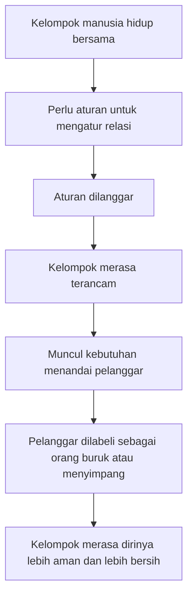
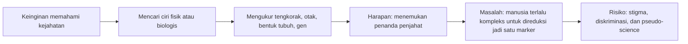
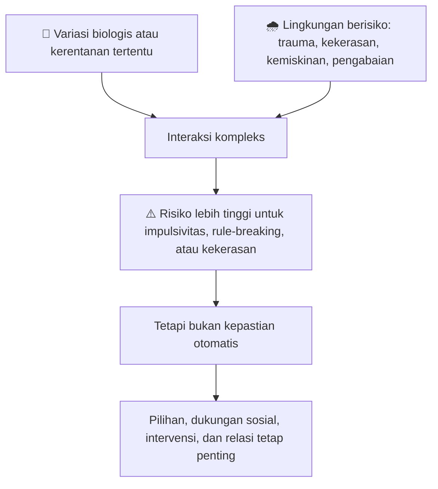
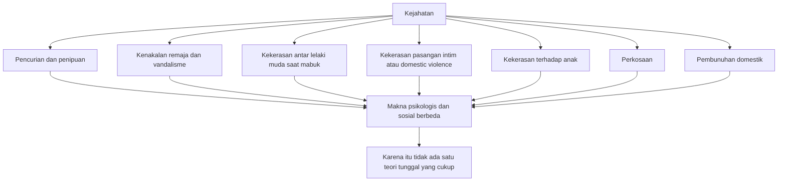
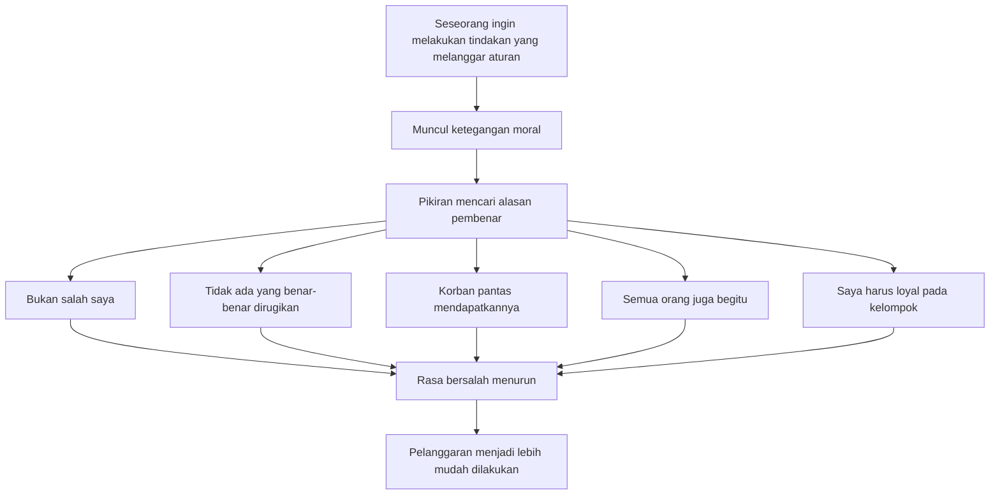

## 🧠 Pengantar: Apakah Orang Melakukan Kejahatan Karena Mereka “Kriminal”, atau Mereka Menjadi “Kriminal” Karena Melakukan Kejahatan?

Pertanyaan ini terdengar sederhana, tetapi sesungguhnya sangat mengguncang fondasi cara kita memahami manusia, hukum, moralitas, dan masyarakat. Prof. **Gwen Adshead** membuka kuliahnya dengan pertanyaan yang sangat tua sekaligus sangat modern: **apakah seseorang melakukan kejahatan karena ia memang seorang kriminal, ataukah ia menjadi kriminal karena ia melakukan suatu kejahatan?** ❓

Di balik pertanyaan itu tersembunyi konflik besar antara dua cara berpikir. Cara pertama adalah cara berpikir yang suka mengotakkan manusia: ada orang baik di sini 😇, ada orang jahat di sana 😈. Cara kedua jauh lebih tidak nyaman: bahwa perilaku kriminal mungkin tidak lahir dari satu "jenis manusia" yang berbeda secara mutlak, melainkan dari kombinasi rumit antara **lingkungan**, **riwayat hidup**, **cara berpikir**, **emosi**, **trauma**, **hubungan sosial**, **hukum**, dan bahkan **narasi yang seseorang ceritakan kepada dirinya sendiri**. 🧩

Kuliah Gwen Adshead sangat menarik karena ia tidak terjebak dalam simplifikasi murahan. Ia tidak berkata bahwa semua kriminal hanyalah korban. Ia juga tidak berkata bahwa semua pelaku kejahatan adalah monster biologis yang terpisah dari umat manusia. Yang ia lakukan justru lebih sulit: **membongkar satu per satu teori tentang pikiran kriminal, menunjukkan apa yang berguna dari masing-masing teori, lalu menunjukkan juga di mana semuanya gagal jika kita terlalu menyederhanakan manusia.** 🔍

Artikel ini akan mengurai kuliah tersebut secara **detail dan mendalam**, dengan fokus pada hubungan antara **kriminologi** *(ilmu tentang kejahatan, pelaku, dan respons sosial terhadap kejahatan)* dan **psikologi** *(ilmu tentang pikiran, emosi, perilaku, dan proses mental)*. Kita akan melihat bagaimana hukum mengatur kelompok, bagaimana masyarakat menciptakan kategori “orang jahat”, bagaimana teori “kepribadian kriminal” muncul, mengapa teori itu sebagian benar tetapi juga berbahaya, dan mengapa untuk memahami kekerasan kita perlu lebih dari sekadar tes kepribadian atau pengukuran tengkorak. 🧠⚖️

---

## 🏛️ Bagian 1: Kriminologi Tidak Hanya Soal Pelaku — Tapi Juga Soal Siapa yang Menentukan Sesuatu Itu “Kriminal”

Salah satu hal paling penting yang Adshead tekankan sejak awal adalah bahwa ada **dua pertanyaan yang berbeda**:

1. **Apa yang membuat seseorang berperilaku dengan cara tertentu?**
2. **Apa yang membuat perilaku itu dianggap kriminal?**

Pertanyaan pertama lebih dekat dengan psikologi. Pertanyaan kedua lebih dekat dengan sejarah, politik, sosiologi, dan hukum. ⚖️

Ini pembedaan yang sangat penting. Karena sering kali kita tergoda berpikir bahwa “kriminal” adalah kategori alamiah, seperti warna mata atau tinggi badan. Padahal tidak. Sesuatu menjadi kriminal karena **ada sistem hukum dan kekuasaan** yang mendefinisikannya demikian. Artinya, pembicaraan tentang kejahatan tidak pernah murni soal individu. Ia juga soal **masyarakat**, **aturan**, **sejarah nilai**, dan **siapa yang punya kuasa memberi label**. 🏷️

Adshead lalu menghubungkan ini dengan gagasan bahwa hukum pada dasarnya adalah alat untuk **mengatur relasi antarindividu dan antarkelompok**. Kita hidup bersama, maka kita butuh aturan. Aturan itu bukan sekadar teks dingin. Ia adalah bentuk formal dari kesepakatan sosial tentang apa yang boleh dan tidak boleh dilakukan supaya kelompok tetap utuh. Jadi, hukum bukan hanya menghukum, tetapi juga **mengikat**. 🔗

Kalau begitu, pelanggaran hukum bisa dilihat sebagai pelanggaran terhadap hubungan sosial. Itulah mengapa dalam banyak masyarakat lama, siapa pun yang melanggar aturan dianggap bukan sekadar salah secara teknis, tetapi **berbahaya bagi kelompok**. Dari sana lahir dorongan untuk mengidentifikasi, menandai, mempermalukan, dan menyingkirkan “orang yang menyimpang”. 🚪

<Callout type="info" title="Inti Pembedaan yang Sangat Penting">
Psikologi bertanya: **mengapa seseorang memilih tindakan itu?**

Kriminologi dan hukum juga harus bertanya: **mengapa masyarakat menyebut tindakan itu kejahatan?**

Dua pertanyaan ini saling terkait, tetapi tidak sama. Kalau dicampur, kita mudah jatuh ke kesimpulan palsu. 📌
</Callout>

---

## 🕰️ Bagian 2: Dari Dosa ke Deviasi — Awal Mula Cara Barat Memikirkan Penjahat

Adshead menjelaskan bahwa pada masa awal, khususnya dalam tradisi klasik dan abad pertengahan, pelanggaran hukum sangat erat dikaitkan dengan **dosa**. Orang melanggar aturan karena ia adalah orang buruk. Dan kita tahu ia buruk karena ia melanggar aturan. Ini adalah argumen yang **sirkular** *(berputar pada dirinya sendiri)*, tetapi sangat kuat secara sosial. 🔁

Mengapa kuat? Karena ia menciptakan rasa aman palsu bagi kelompok. Kalau pelaku kejahatan dianggap kategori manusia yang berbeda, maka kita yang tidak melanggar aturan bisa merasa: *“mereka bukan kita.”* Rasa aman psikologis seperti ini sangat menggoda. Ia menyederhanakan dunia yang sebenarnya rumit. 🛡️

Di sini Adshead menyentuh sesuatu yang amat penting dalam psikologi sosial: manusia suka berpikir dalam kategori. Kita suka membayangkan ada “orang baik” dan “orang jahat”, “orang waras” dan “orang gila”, “warga baik” dan “penyimpang”. Padahal realitas manusia jauh lebih kabur. Tetapi pengkotakan itu tetap dipelihara karena ia membuat masyarakat merasa lebih stabil. 📦

Yang menarik, bahkan pada masa lalu, **due process** *(proses hukum yang semestinya)* tetap mendapat perhatian. Ada obsesi untuk memastikan bahwa jika suatu pelanggaran terjadi, maka harus ada proses formal untuk menetapkan siapa atau apa yang salah — bahkan sampai absurd: hewan, benda, atau batang kayu yang menyebabkan kematian pun bisa “diadili”. Ini menunjukkan bahwa jauh sebelum ilmu psikologi berkembang, manusia sudah sadar bahwa pelanggaran aturan perlu **ritual pembuktian**, bukan sekadar ledakan amarah. 🏛️

Dari sini kita bisa melihat bahwa sejak awal, pemikiran tentang kriminalitas tidak pernah netral. Ia selalu bercampur dengan **emosi kelompok**, **moralitas**, dan **kebutuhan untuk menjaga identitas kolektif**. 👥

---

## 🌍 Bagian 3: Penjelasan Sosiologis — Masyarakat Turut Membentuk Kejahatan

Salah satu jalur besar dalam kriminologi modern adalah jalur **sosiologis**. Jalur ini mengatakan bahwa orang tidak bisa dipahami terpisah dari masyarakatnya. Orang menjadi seperti dirinya karena hidup di dalam kultur tertentu, berada dalam kelas sosial tertentu, menerima label tertentu, dan belajar memainkan peran tertentu. 🏙️

Adshead menekankan bahwa pemahaman sosiologis sangat penting karena ia memperlihatkan bahwa kejahatan bukan hanya masalah “apa yang salah di dalam kepala seseorang”, tetapi juga masalah **struktur sosial**, **lingkungan**, dan **nilai yang dominan**. 

Ia memberi contoh yang sangat kuat: dalam rezim **apartheid** di Afrika Selatan, toleransi rasial pernah dianggap tidak hanya salah secara politik, tetapi juga ilegal. Hubungan sesama jenis juga pernah lama dianggap sekaligus berdosa dan melanggar hukum. Ini menunjukkan bahwa sesuatu bisa dianggap “menyimpang” bukan karena secara alami jahat, tetapi karena **masyarakat pada masa tertentu memutuskan memberi nilai negatif padanya**. ⛓️

Ini poin yang sangat penting karena mengingatkan kita: hukum dan moral tidak selalu identik. Sesuatu bisa legal tetapi tidak bermoral. Sesuatu juga bisa dianggap tidak bermoral oleh mayoritas, lalu dijadikan ilegal. Jadi, kalau kita bicara “kejahatan”, kita harus hati-hati agar tidak diam-diam mengira bahwa semua kategori hukum adalah refleksi moral yang abadi. 📚

<Callout type="warning" title="Bahaya Menyatukan Moral dan Hukum Secara Total">
Kalau kita menyamakan begitu saja antara yang **ilegal** dan yang **jahat**, kita berisiko membenarkan banyak ketidakadilan sejarah. Banyak hal dulu pernah ilegal padahal bukan kejahatan moral. Karena itu, studi kriminalitas perlu selalu sadar bahwa hukum adalah produk sejarah dan kekuasaan. ⚠️
</Callout>

---

## 🧬 Bagian 4: Positivist School — Ketika Orang Mencari “Ciri Bawaan” Penjahat

Lalu muncullah apa yang oleh Adshead sebut sebagai pendekatan **positivist** *(positivistik)*, yaitu pendekatan yang ingin menemukan sesuatu yang **positif-terukur** di dalam individu pelaku. Dalam semangat abad ke-19, ketika ilmu pengetahuan modern sedang sangat percaya diri, para peneliti mulai bertanya: **adakah sesuatu dalam tubuh atau pikiran pelaku yang membuatnya lebih kriminal daripada orang lain?** 🔬

Inilah era pengukuran tengkorak, volume otak, bentuk tubuh, hingga pencarian “tanda lahir biologis” kejahatan. Tokoh seperti **Cesare Lombroso** menjadi sangat terkenal karena mencoba membaca kriminalitas dari anatomi. Hari ini pendekatan itu terdengar absurd, dan memang banyak bagian dari itu yang secara ilmiah sudah runtuh. Tetapi penting dipahami bahwa dorongan di baliknya masih hidup sampai sekarang: keinginan untuk menemukan **marker** *(penanda)* yang bisa membedakan “mereka” dari “kita”. 🧠

Mengapa pendekatan seperti ini begitu menggoda? Karena ia menjanjikan kesederhanaan. Kalau kriminalitas bisa diukur dari tengkorak, gen, atau struktur otak, maka dunia terasa lebih teratur. Kita bisa bilang: *“lihat, di sinilah sumber kejahatannya.”* 

Masalahnya, manusia tidak sesederhana itu. Dan sejarah menunjukkan bahwa pencarian ciri biologis “orang jahat” sangat mudah berubah menjadi alat stigmatisasi, diskriminasi, bahkan pembenaran bagi rasisme dan eugenika. 😬

Adshead tidak sekadar menertawakan pendekatan ini. Ia menunjukkan bahwa meski bentuk kasarnya sudah usang, **hasrat untuk mengkategorikan kriminal sebagai “jenis manusia lain” belum benar-benar mati**. Ia hanya berganti bahasa: dari tengkorak ke scan otak, dari wajah ke gen, dari bentuk tubuh ke biomarker. 🧪

---

## 🛋️ Bagian 5: Freud, Psikoanalisis, dan Upaya Mencari Konflik Dalam Diri Pelaku

Setelah fase pengukuran tubuh, perhatian berpindah ke **dunia batin**. Kalau sumber kejahatan tidak terlihat jelas di tengkorak, mungkin ia tersembunyi di **konflik psikologis**. Di sini Adshead membahas warisan **Sigmund Freud** dan tradisi psikoanalitik. 🛋️

Freud memandang perilaku menyimpang sebagai gejala dari sesuatu yang lebih dalam: konflik tak sadar, rasa bersalah laten, dorongan yang tidak terselesaikan, dan sebagainya. Dalam salah satu gagasannya, kriminalitas bahkan bisa dipahami sebagai bentuk ekspresi dari **unconscious guilt** *(rasa bersalah tak sadar)*. Artinya, seseorang melakukan perbuatan salah bukan hanya karena ia ingin mendapatkan sesuatu, tetapi mungkin juga karena secara tidak sadar ia terdorong menuju hukuman. 

Ini menarik, tetapi juga problematis. Karena teori seperti ini sangat kaya secara interpretatif, namun sering sulit diuji secara ketat. Adshead mencatat bahwa Freud sendiri tidak terlalu tertarik dengan dunia kriminal dan bahkan menyarankan agar psikoanalisis tidak terlalu masuk ke pengadilan. Itu poin yang bijak. Karena begitu teori batin dipakai di pengadilan, ia bisa berubah menjadi alat spekulasi yang kelihatannya canggih, tetapi sulit diverifikasi. 🧾

Namun warisan psikoanalitik tetap penting karena ia mengubah fokus: dari pertanyaan **“apa ciri tubuh penjahat?”** menjadi **“apa konflik batin yang mungkin hidup di dalam dirinya?”**

---

## 👶 Bagian 6: Bowlby, Kehilangan, dan Gagasan Bahwa Deprivasi Relasional Bisa Mendorong Kenakalan

Salah satu bagian yang sangat penting dalam kuliah ini adalah pembahasan tentang **John Bowlby**. Ia meneliti **44 juvenile thieves** *(44 remaja pencuri)* dan membandingkannya dengan 44 anak yang tidak mencuri. Yang ia temukan adalah petunjuk bahwa banyak dari anak-anak itu mengalami **maternal deprivation** *(deprivasi kelekatan/kehadiran ibu atau figur pengasuh utama)*. 👩‍👦

Gagasan Bowlby bukan sekadar “anak yang kurang kasih sayang jadi jahat”. Itu terlalu sederhana. Yang lebih penting adalah ide bahwa **kehilangan hubungan yang aman** bisa menciptakan pola emosi dan regulasi diri yang terganggu, dan itu bisa mendorong tindakan mengambil atau merampas sebagai respons terhadap rasa kehilangan. 

Dengan kata lain, mencuri bisa dibaca bukan hanya sebagai perilaku mencari keuntungan material, tetapi juga sebagai ekspresi dari **kerusakan relasional**. Tentu tidak semua pencurian berarti begitu. Tetapi Bowlby membantu membuka mata bahwa perilaku kriminal kadang merupakan **bahasa tindakan** dari luka yang tidak terucapkan. 💔

Adshead juga dengan jujur mencatat bahwa kemiskinan memainkan peran besar dalam pencurian. Ini penting. Jangan sampai kita terlalu cepat mempsikologisasi semua hal sampai lupa bahwa **kondisi material hidup manusia sangat menentukan**. Orang lapar, miskin, terpinggirkan, dan hidup tanpa rasa aman memang berada pada tekanan yang berbeda dari orang yang hidup stabil. 🍞

---

## ⚔️ Bagian 7: Nuremberg Trials dan Ledakan Minat pada Pikiran Pelaku Kejahatan Berat

Perang Dunia II, khususnya **Nuremberg Trials** *(pengadilan Nuremberg)*, memberi dorongan besar pada studi psikologi kriminal. Mengapa? Karena para pelaku Holocaust tidak melihat diri mereka sebagai kriminal. Mereka menganggap diri mereka **taat pada mandat politik dan hukum rezim saat itu**. 🪖

Ini menciptakan masalah besar. Kalau seseorang dapat melakukan kekejaman massal sambil percaya bahwa dirinya sedang menjalankan tugas sah, maka kejahatan tidak lagi bisa dipahami hanya sebagai tindakan orang-orang buas, liar, atau impulsif. Ia juga bisa dilakukan oleh orang yang **tertib, patuh, administratif, dan merasa benar**. 🧊

Dari sinilah psikologi kriminal mendapat dorongan untuk meneliti bukan hanya kenakalan biasa, tetapi juga bagaimana manusia bisa melakukan kekerasan sistemik tanpa merasa dirinya jahat. Ini sangat penting karena memperluas studi kriminalitas dari pencuri jalanan ke arsitek genosida. 

Artinya, pertanyaan psikologis berubah: bukan hanya “mengapa seseorang berbohong atau mencuri?”, tetapi juga “bagaimana seseorang bisa melakukan kekejaman ekstrem sambil tetap merasa dirinya bermoral?”

Itu adalah salah satu pertanyaan paling gelap dalam seluruh ilmu tentang manusia. 🌑

---

## 😶 Bagian 8: Hervey Cleckley dan Lahirnya Gagasan Psikopati Modern

Adshead lalu masuk ke tokoh yang sangat penting: **Hervey Cleckley**, penulis *The Mask of Sanity* (1941). Di sinilah kita mendapat salah satu fondasi konsep **psychopathy** *(psikopati)* modern. 😶

Cleckley menggambarkan sekelompok orang yang tampak normal, kadang bahkan menawan, sopan, dan cerdas, tetapi memiliki **kedangkalan emosi** dan **ketidakterhubungan moral** yang sangat dalam. Mereka bisa berbohong tanpa rasa bersalah, merugikan orang tanpa penyesalan, dan membuat orang lain sengsara tanpa terlihat terganggu sama sekali. 

Adshead menyukai satu ringkasan indah dari ide ini: orang semacam itu **“tahu kata-katanya, tapi tidak tahu musiknya”** dalam hubungan manusia. Artinya mereka bisa meniru bahasa kedekatan, moralitas, atau empati, tetapi tidak benar-benar mengalami kedalaman emosinya. 🎼

Ini penting, karena konsep psikopati membantu menjelaskan bahwa ada sebagian kecil orang yang memang tampak **sangat terputus dari resonansi moral biasa**. Tetapi Adshead juga hati-hati: tidak semua kriminal adalah psikopat, dan tidak semua psikopat pasti terdeteksi dalam sistem hukum. Sebagian justru bisa sangat efektif, licin, dan tak tertangkap. 🐍

<Callout type="important" title="Psikopati Bukan Sama dengan Semua Kejahatan">
Ini poin yang sangat penting. Psikopati menjelaskan **sebagian kecil pola antisociality** *(keantisosialan)*, terutama pada individu yang sangat manipulatif, dangkal secara emosi, dan tidak peduli pada akibat moral. Tetapi itu bukan kunci universal untuk memahami semua pelaku kejahatan. 🔑
</Callout>

---

## 🧪 Bagian 9: Robert Hare, Kepribadian Kriminal, dan Upaya Menghubungkan Psikopati dengan Pelaku Kekerasan

Dari Cleckley, ide itu berkembang lewat **Robert Hare**, yang mengambil ciri-ciri psikopati dan menerapkannya pada **pelaku kekerasan**. Di sinilah konsep psikopati kriminal menjadi lebih tajam: bukan sekadar orang dingin dan manipulatif, tetapi orang yang juga punya **kesiapan menggunakan kekerasan**, **keberanian mengambil risiko**, dan **kesediaan melanggar hukum** tanpa beban berarti. 🔪

Titik penting dari sini adalah bahwa kombinasi tertentu menjadi sangat berbahaya:

- kedangkalan emosi,
- pesona dangkal,
- manipulasi,
- kurang empati,
- impulsivitas atau agresi,
- serta orientasi instrumental terhadap orang lain.

Jika semua itu berkumpul, maka lahirlah individu yang secara sosial sangat berisiko. Tetapi sekali lagi, Adshead tidak menyuruh kita berhenti di sini. Ia justru mengajak kita terus bertanya: **apakah ini cukup untuk menjelaskan keseluruhan dunia kriminal?** Jawabannya: tidak. 🚫

---

## 🧭 Bagian 10: Eysenck, Kepribadian, dan Cikal Bakal Cara Berpikir yang Lebih Nuansa

Di Inggris, **Hans dan Sybil Eysenck** memperkenalkan pendekatan yang lebih kompleks terhadap kepribadian kriminal. Mereka bicara tentang beberapa dimensi seperti:

- **sensation seeking** *(mencari sensasi / stimulasi)*,
- **negative emotionality** *(emosi negatif tinggi seperti mudah marah, gelisah, murung)*,
- **conscientiousness** *(ketelitian / disiplin diri)*,
- dan dimensi lain yang dulu mereka sebut dengan istilah tertentu seperti *psychoticism*.

Yang penting dari Eysenck bukan sekadar kategorinya, tetapi keberaniannya untuk berkata bahwa kepribadian tidak berdiri sendirian. Ia adalah hasil dari **integrasi fisiologi, genetik, dan lingkungan**. 🌱

Ini menarik karena pendekatan ini sebenarnya sudah mengarah ke apa yang hari ini disebut **epigenetics** *(epigenetika)*: lingkungan dapat memengaruhi bagaimana kecenderungan biologis tertentu muncul dalam perilaku nyata. Jadi bukan “gen jahat” murni, melainkan **kerentanan biologis yang bertemu tekanan lingkungan tertentu**. 🧬

---

## 🧬 Bagian 11: Gen, Lingkungan, dan Epigenetika — Mengapa Debat Ini Selalu Menarik Tapi Selalu Berbahaya Jika Disederhanakan

Adshead menyinggung penelitian tentang variasi gen tertentu, seperti **monoamine oxidase** *(monoamine oxidase / enzim yang terlibat dalam regulasi neurotransmitter)*, yang dalam kondisi tertentu dan bersama pengalaman buruk seperti kekerasan fisik masa kecil dapat meningkatkan risiko perilaku melanggar aturan di masa remaja. 

Tetapi di sini Adshead sangat hati-hati. Ia tidak berkata “gen membuat orang jadi kriminal.” Ia berkata bahwa bukti menunjukkan **interaksi antara gen dan lingkungan**. Ini penting sekali. 

Artinya:
- gen bukan vonis,
- lingkungan bukan satu-satunya penjelasan,
- dan perilaku adalah hasil dari **kombinasi risiko** yang saling memperkuat. ⚙️

Inilah kenapa setiap teori genetik tentang kriminalitas harus diperlakukan dengan sangat hati-hati. Ia bisa berguna untuk memahami **kerentanan**, tetapi sangat berbahaya kalau dipakai untuk melabeli manusia sebagai “terlahir jahat”. 🚫

---

## 🧱 Bagian 12: Yochelson & Samenow — Distorsi Kognitif dan “Criminal Thinking”

Berikutnya Adshead membahas **Samuel Yochelson** dan **Stanton Samenow**, dua tokoh yang sangat berpengaruh dalam pengembangan gagasan tentang **criminal thinking** *(cara berpikir kriminal)*. Mereka bekerja dengan pelaku kejahatan di rumah sakit psikiatri dan menyimpulkan bahwa banyak dari mereka bukan sekadar punya konflik batin yang dalam, tetapi punya **pola pikir sadar yang keliru dan berulang**. 🧠

Contohnya:
- “ini bukan salah saya,”
- “mereka memang pantas mendapatkannya,”
- “apa yang saya lakukan tidak terlalu berarti,”
- “saya terpaksa,”
- “aturan itu tidak relevan untuk saya.”

Dari sini lahir pendekatan yang kemudian sangat memengaruhi program rehabilitasi di penjara: **mengubah pola pikir sekarang**, bukan hanya menggali luka masa lalu. Itu sebabnya terapi kognitif untuk pelaku kejahatan berkembang sangat kuat. 💬

Pendekatan ini kuat karena ia menyoroti bahwa banyak orang melakukan tindakan jahat sambil memakai **logika pembenaran** yang terlihat masuk akal bagi dirinya sendiri. Dengan kata lain, kejahatan sering kali bukan lahir dari ketiadaan moral, melainkan dari **moral reasoning yang bengkok**. 📐

---

## 🧭 Bagian 13: “Criminal Personality” — Gagasan yang Sebagian Benar, Sebagian Menyesatkan

Pada titik tertentu, banyak teori abad ke-20 tampak bergerak menuju kesimpulan: mungkin memang ada sesuatu seperti **criminal personality** *(kepribadian kriminal)*. Yakni kombinasi dari impulsivitas, distorsi pikir, pencarian sensasi, emosi negatif tinggi, kurang empati, dan sebagainya. 🧱

Adshead lalu memberi serangan kritik yang sangat penting: hampir semua studi tentang ini dibangun dari **pelaku yang terdeteksi, tertangkap, dihukum, dan tersedia untuk diteliti**. Artinya, mungkin yang sedang kita pelajari bukan “kepribadian kriminal” secara umum, tetapi justru **kepribadian kriminal yang buruk dalam lolos dari sistem**. 😅

Ini kritik metodologis yang sangat tajam. Bisa saja ada orang-orang yang sangat licin, sangat cerdas, sangat terstruktur, dan sangat jahat — tetapi tidak pernah ikut dalam penelitian karena tidak pernah tertangkap atau tidak mau berpartisipasi. 

Di sinilah Adshead menghancurkan salah satu ilusi paling nyaman dalam psikologi kriminal: bahwa dari sampel pelaku yang tertangkap, kita bisa menggambar seluruh peta jiwa kriminal manusia. Ternyata tidak sesederhana itu. 📉

---

## 🏠 Bagian 14: Tidak Semua Kejahatan Sama — Maka Tidak Mungkin Semua Dijelaskan oleh Satu “Mindset Kriminal”

Ini mungkin salah satu poin paling penting dalam seluruh kuliah. Adshead berkata dengan tegas bahwa **crime is not one thing** — kejahatan bukan satu hal tunggal. 

Membakar pagar tetangga, mengutil, menipu pajak, membunuh pasangan demi asuransi, memukuli anak sampai mati, memukul orang saat mabuk, memperkosa, atau memukul pasangan dalam rumah tangga — semua ini sama-sama pelanggaran hukum, tetapi **tidak lahir dari struktur psikologis yang identik**. 🧨

Inilah kegagalan besar teori tunggal tentang “criminal mind”. Kalau kita memaksa semua bentuk kejahatan masuk ke satu model, kita akan kehilangan hal yang paling penting: **makna tindakan bagi pelaku**. Dan justru di situlah psikologi menjadi penting — ia harus bertanya, *apa arti tindakan ini bagi orang yang melakukannya?* 🪞

Adshead memberi contoh penting tentang **domestic homicide perpetrators** *(pelaku pembunuhan domestik)*. Banyak dari mereka tidak punya riwayat kriminal panjang, tidak tampak seperti “penjahat klasik”, bisa saja bekerja, berkeluarga, dikenal baik, dan tampak prososial. Tetapi dalam kondisi tertentu mereka melakukan tindakan ekstrem. Itu berarti kejahatan berat tidak selalu berasal dari orang yang sejak awal tampak seperti “kriminal jenis murni”. 🏠

---

## 🥊 Bagian 15: Kekerasan — Inilah Jenis Kejahatan yang Paling Meresahkan Kita

Adshead kemudian memfokuskan kuliah pada **violence** *(kekerasan)*. Alasannya sederhana: pencurian, penipuan, atau perusakan properti memang merugikan, tetapi yang benar-benar menakutkan masyarakat adalah kekerasan. 😰

Kekerasan memunculkan pertanyaan yang sangat praktis sekaligus eksistensial:
- apakah kita aman bila pelaku kembali ke masyarakat?
- apa yang membuat seseorang memilih melukai tubuh orang lain?
- mengapa sebagian orang bisa menyeberang batas itu sementara sebagian besar tidak?

Adshead menunjukkan bahwa kekerasan paling umum justru sering berupa:
- serangan pemuda terhadap pemuda lain, biasanya dalam keadaan mabuk,
- kekerasan terhadap pasangan domestik,
- kekerasan terhadap anak,
- dan bentuk-bentuk kekerasan yang terjadi **di dalam relasi**, bukan oleh orang asing. 🏚️

Ini penting. Kita sering membayangkan kekerasan sebagai serangan orang asing di lorong gelap. Padahal banyak kekerasan justru terjadi di rumah, di relasi intim, di ruang yang mestinya paling aman. Itu sebabnya psikologi kekerasan tidak bisa dilepaskan dari psikologi **hubungan manusia**. 💔

---

## 🌩️ Bagian 16: Faktor Risiko Kekerasan — Tidak Tunggal, Tapi Bertumpuk

Adshead merangkum sejumlah **risk factors** *(faktor risiko)* untuk kekerasan, di antaranya:

- usia muda dan laki-laki,
- norma budaya yang membenarkan kekerasan,
- isolasi sosial,
- keadaan paranoid,
- penyalahgunaan zat,
- trauma masa kecil yang belum selesai,
- insecure attachment *(kelekatan tidak aman)*,
- gangguan regulasi emosi,
- dan relasi yang pecah atau penuh ancaman. 🌩️

Hal yang sangat penting di sini adalah bahwa faktor-faktor ini **jarang bekerja sendirian**. Biasanya mereka bertumpuk. Seseorang yang mengalami trauma masa kecil, hidup terisolasi, mabuk berat, sedang paranoid, dan mengalami putus relasi yang memicu rasa terhina jelas berada dalam risiko jauh lebih tinggi dibanding seseorang yang hanya punya satu faktor saja. 📚

Adshead juga menekankan bahwa **substance misuse** *(penyalahgunaan alkohol atau narkoba)* adalah salah satu penguat paling besar. Alkohol, kokain, dan zat lain bisa memperburuk persepsi ancaman, menurunkan kontrol diri, dan membuat orang merasa sedang membela diri padahal tidak ada ancaman nyata. 🍺

---

## 👁️ Bagian 17: Mentalizing — Salah Satu Kunci Paling Modern untuk Memahami Kekerasan

Salah satu bagian paling kaya dari kuliah ini adalah pembahasan tentang **mentalizing** *(kemampuan membayangkan dan memahami bahwa diri sendiri dan orang lain sama-sama memiliki pikiran, niat, perasaan, dan motivasi)*. 👁️

Menurut Adshead, banyak perilaku antisosial dan kekerasan berkaitan dengan **defisit dalam mentalizing**. Orang yang lemah dalam kemampuan ini cenderung:

- melihat pikirannya sendiri sebagai satu-satunya realitas yang sah,
- sulit membayangkan niat orang lain secara kompleks,
- cepat merasa terancam,
- membaca situasi secara terlalu literal atau terlalu fisik,
- dan gagal menangkap bahwa perilaku orang lain bisa ambivalen, tidak sengaja, atau tidak bermaksud menyerang. 

Misalnya, kalau seseorang menabrak bahu mereka secara tidak sengaja, mereka bisa langsung mengartikannya sebagai penghinaan atau serangan. Mereka tidak punya ruang mental yang cukup untuk berkata: *“mungkin itu tidak disengaja.”* 🚶

Ini luar biasa penting, karena di sini kekerasan terlihat bukan hanya sebagai ledakan emosi, tetapi juga sebagai **kegagalan membaca pikiran dan niat manusia lain secara akurat**. 🧠

<Callout type="important" title="Mengapa Mentalizing Sangat Penting?">
Karena hidup sosial manusia bergantung pada asumsi bahwa orang lain punya pikiran, maksud, rasa takut, dan batas seperti kita. Kalau kemampuan itu rusak, orang lain mudah berubah menjadi ancaman, objek, atau mangsa. Dan di situlah kekerasan jadi lebih mungkin. 🔥
</Callout>

---

## 🗣️ Bagian 18: Sykes & Matza — Neutralization Techniques atau Cara Manusia Membujuk Diri Sendiri Agar Pelanggaran Terasa Wajar

Adshead kemudian masuk ke salah satu teori favorit saya dalam kuliah ini: **neutralization techniques** *(teknik netralisasi / cara membatalkan rasa bersalah secara naratif)* dari **Sykes dan Matza**. 🗣️

Mereka menemukan bahwa banyak remaja delinkuen sebenarnya **tidak bodoh secara moral**. Mereka tahu aturan, mereka bisa kagum pada orang yang taat hukum, mereka bisa merasa bersalah. Tetapi sebelum atau sesudah melakukan pelanggaran, mereka menggunakan kalimat-kalimat tertentu untuk membuat tindakan itu terasa lebih bisa diterima. 

Contohnya:
- “ini bukan salah saya,”
- “sebenarnya tidak ada yang benar-benar dirugikan,”
- “korban memang pantas menerimanya,”
- “semua orang juga begitu,”
- “saya harus loyal pada teman.”

Adshead sangat cerdas ketika mengingatkan bahwa teknik seperti ini bukan milik penjahat saja. Hampir semua manusia memakainya ketika melakukan sesuatu yang tidak kita banggakan. Bedanya hanya pada **skala** dan **akibatnya**. 😶

Ini sangat penting karena menunjukkan bahwa kejahatan sering tidak membutuhkan hilangnya moral sepenuhnya. Cukup dengan **membengkokkan moral sedikit demi sedikit melalui bahasa**, seseorang bisa membuat pelanggaran terasa dapat dibenarkan. ✍️

---

## 🍬 Bagian 19: Self-Control — Mengapa Sebagian Orang Menahan Diri, dan Sebagian Lain Tidak?

Adshead lalu menyinggung tradisi lain yang bertanya: kalau kebanyakan orang **tidak** melakukan kejahatan, maka mungkin pertanyaan yang lebih penting justru adalah **apa yang membuat orang bisa menahan diri?** 🧘

Di sinilah muncul gagasan tentang **self-control** *(kontrol diri)*. Salah satu ilustrasi populernya adalah **marshmallow test**: anak yang sanggup menunggu untuk imbalan lebih besar di masa depan sering kali dalam studi tertentu menunjukkan hasil hidup yang lebih baik. Intinya bukan soal marshmallow, tetapi soal kemampuan menunda dorongan impulsif. 🍬

Dalam konteks kriminalitas, kemampuan ini penting karena banyak pelanggaran lahir dari kombinasi:
- dorongan instan,
- kesempatan,
- lemahnya pertimbangan konsekuensi,
- dan ketidakmampuan menahan impuls. 

Tetapi sekali lagi Adshead tidak menyederhanakan. Self-control penting, ya. Tapi itu bukan penjelasan tunggal. Karena seseorang bisa punya kontrol diri tinggi di satu bidang, lalu runtuh total di bidang lain ketika relasinya hancur, ketika mabuk, atau ketika trauma lama tersentuh. ⚠️

---

## 📖 Bagian 20: Narasi Diri, Desistance, dan Mengapa Sebagian Orang Berhenti Berbuat Jahat

Salah satu bagian paling indah dari kuliah ini adalah pembahasan tentang **Shadd Maruna** dan penelitian tentang **desistance** *(proses berhenti dari kehidupan kriminal)*. 🌱

Maruna menemukan bahwa banyak pelaku muda akhirnya berhenti berbuat jahat bukan semata karena takut hukuman, tetapi karena mereka mulai melihat diri mereka secara berbeda. Mereka punya **sense of agency** *(rasa memiliki kapasitas memilih dan mengubah hidup)*. Mereka bisa berkata:

- “dulu saya berpikir seperti itu, sekarang tidak lagi,”
- “saya bisa berubah,”
- “saya tidak harus terus menjadi versi lama dari diri saya,”
- “hidup saya bisa diarahkan ke tempat lain.”

Sebaliknya, mereka yang terus mengulang pelanggaran sering berbicara tentang hidup mereka seolah semua ditentukan oleh orang lain, situasi, nasib, atau tekanan eksternal. Mereka tidak melihat diri sebagai agen perubahan, melainkan sebagai objek yang terus didorong arus. 🌊

Ini sangat penting. Karena artinya rehabilitasi bukan hanya soal mengurangi gejala buruk, tetapi juga soal membantu seseorang menulis ulang **cerita tentang dirinya sendiri**. Kalau seseorang yakin bahwa dirinya memang hanya bisa menjadi pelaku, maka sistem hukuman bisa justru mengunci identitas itu. Tetapi kalau seseorang bisa membayangkan identitas baru, peluang berhenti menjadi lebih besar. ✨

---

## 🔥 Bagian 21: Kekerasan Bukan Satu Jenis — Affect-Rich, Affect-Poor, Reactive, Proactive

Adshead mengingatkan bahwa ketika kita bicara kekerasan, kita juga harus bertanya:

- apakah kekerasan itu penuh emosi atau justru dingin?
- apakah ia impulsif atau terkontrol?
- apakah ia reaktif atau proaktif?
- apakah pelaku merasa terancam atau justru sedang mengejar sesuatu?

Kekerasan **reactive** *(reaktif)* biasanya muncul sebagai reaksi terhadap ancaman yang dirasakan. Kekerasan **proactive** *(proaktif / instrumental)* lebih mirip alat untuk mencapai tujuan, seperti merampas, menguasai, atau mempermalukan. 🔥

Orang yang memukul saat merasa dihina dalam keadaan mabuk memiliki psikologi berbeda dari orang yang memperkosa untuk merendahkan korban, atau orang yang membunuh pasangan dalam relasi penuh kontrol, atau orang yang menyiksa anak sebagai ekspresi dominasi dan disfungsi relasional. 

Jadi lagi-lagi, **tidak ada satu model kekerasan**. Yang ada adalah keluarga besar perilaku yang saling mirip di permukaan, tetapi berbeda makna, motif, emosi, dan risiko ulangnya. 📚

---

## 🧍 Bagian 22: Mengapa Relasi Sangat Penting dalam Memahami Kekerasan?

Salah satu poin yang sangat kuat dalam kuliah Adshead adalah bahwa kebanyakan kekerasan terjadi **dalam konteks hubungan**. Relasi korban-pelaku sangat penting. Kekerasan oleh orang asing berbeda dari kekerasan terhadap pasangan, anak, atau anggota keluarga. 👨‍👩‍👧

Ini berarti kita tidak bisa memahami kekerasan hanya dari kepala pelaku sebagai individu terisolasi. Kita harus melihat:

- bagaimana ia membangun keterikatan,
- bagaimana ia membaca penolakan,
- bagaimana ia memaknai kehilangan,
- bagaimana ia merespons rasa malu,
- bagaimana ia menghadapi ketergantungan emosional,
- dan bagaimana ia memandang orang lain: sebagai subjek, ancaman, atau properti. 

Banyak pelaku **domestic violence** *(kekerasan dalam rumah tangga)* misalnya, tidak tampak brutal di semua ruang sosial. Mereka bisa fungsional di pekerjaan, santun di depan umum, dan tetap sangat berbahaya di ruang intim. Itu membuat teori “kepribadian kriminal umum” jadi runtuh. Karena perilaku mereka sangat **context-dependent** *(bergantung konteks)*. 🏠

---

## 🧠 Bagian 23: Apakah Ada “Pikiran Kriminal”? Jawaban Adshead: Ada Pola, Tapi Bukan Satu Esensi Tunggal

Kalau seluruh kuliah ini diringkas, saya kira posisi Adshead adalah begini: 

- Ya, ada pola-pola psikologis yang sering muncul pada pelaku kejahatan tertentu.
- Ya, ada risk factors yang bisa diidentifikasi.
- Ya, ada distorsi kognitif, kekurangan mentalizing, trauma, impulsivitas, dan cara membaca relasi yang keliru.
- Tetapi tidak, semua itu **tidak menyatu menjadi satu esensi tunggal yang bernama “pikiran kriminal.”** 🚫

Ada terlalu banyak jenis kejahatan, terlalu banyak jenis relasi, terlalu banyak jalur hidup, dan terlalu banyak kombinasi faktor untuk menyederhanakan semuanya ke satu label. 

Dengan kata lain, yang kita miliki bukan “the criminal mind” sebagai satu entitas padat, melainkan **banyak bentuk pikiran yang dapat bergerak menuju pelanggaran hukum dalam kondisi tertentu**. Dan justru karena itu, pemahaman kita harus halus, tidak malas, dan tidak suka mengotakkan manusia terlalu cepat. 🧩

---

## 📊 Tabel Ringkasan Gagasan Utama Gwen Adshead

| Tema | Gagasan Utama | Implikasi |
| :--- | :--- | :--- |
| **Hukum dan kriminalitas** | Hukum mengatur relasi sosial, bukan hanya menghukum individu | Kejahatan selalu punya dimensi sosial dan politik |
| **Pendekatan biologis awal** | Pengukuran tengkorak, otak, tubuh mencoba mencari penanda kriminal | Berguna secara historis, tapi berbahaya jika disederhanakan |
| **Psikoanalisis** | Kejahatan bisa dibaca sebagai gejala konflik batin | Kaya secara interpretasi, tapi terbatas bila dipakai terlalu bebas |
| **Attachment dan deprivasi** | Kehilangan relasional bisa memengaruhi perilaku menyimpang | Trauma dan relasi awal penting |
| **Psychopathy** | Ada kelompok kecil yang dangkal emosi, manipulatif, dan tidak peduli | Penting, tapi bukan penjelasan universal |
| **Criminal thinking** | Distorsi kognitif mempermudah orang membenarkan pelanggaran | Bahasa dan narasi diri sangat penting |
| **Neutralization techniques** | Orang sering menormalkan pelanggaran lewat alasan moral semu | Tidak hanya berlaku pada kriminal, tapi pada manusia umumnya |
| **Self-control** | Kontrol diri membantu orang menahan impuls saat ada kesempatan | Penting, namun bukan satu-satunya faktor |
| **Violence** | Kekerasan adalah kategori yang sangat beragam | Tiap jenis kekerasan butuh pembacaan psikologis berbeda |
| **Desistance** | Orang berhenti berbuat jahat saat punya sense of agency dan narasi baru | Rehabilitasi perlu menyentuh identitas dan makna hidup |

---

## 🧾 Glosarium Istilah Penting

- **Attachment:** Kelekatan emosional, terutama hubungan awal dengan pengasuh utama.
- **Affect-rich violence:** Kekerasan yang penuh emosi, panas, meledak, atau sangat dipengaruhi afek.
- **Affect-poor violence:** Kekerasan yang lebih dingin, datar, atau instrumental.
- **Criminal thinking:** Cara berpikir yang memudahkan seseorang membenarkan pelanggaran hukum.
- **Criminology / Kriminologi:** Ilmu yang mempelajari kejahatan, pelaku, korban, hukum, dan respons sosial terhadap kejahatan.
- **Desistance:** Proses berhenti dari perilaku kriminal secara berkelanjutan.
- **Domestic violence:** Kekerasan dalam relasi intim atau rumah tangga.
- **Due process:** Proses hukum yang sah dan adil.
- **Epigenetics / Epigenetika:** Studi tentang bagaimana lingkungan memengaruhi ekspresi gen.
- **Mentalizing:** Kemampuan memahami bahwa diri sendiri dan orang lain punya pikiran, niat, dan perasaan.
- **Neutralization techniques:** Teknik naratif untuk menurunkan rasa bersalah sebelum atau sesudah pelanggaran.
- **Negative emotionality:** Kecenderungan mudah mengalami emosi negatif seperti marah, takut, murung, dan iritabel.
- **Predatory violence:** Kekerasan yang melihat korban sebagai mangsa atau objek.
- **Psychopathy / Psikopati:** Pola kepribadian yang ditandai kedangkalan emosi, manipulasi, kurang empati, dan antisociality tinggi.
- **Reactive violence:** Kekerasan sebagai reaksi terhadap ancaman atau penghinaan yang dirasakan.
- **Rule-breaking:** Perilaku melanggar aturan sosial atau hukum.
- **Sensation seeking:** Kecenderungan mencari sensasi, stimulasi, dan pengalaman intens.
- **Self-control:** Kemampuan menahan dorongan instan demi tujuan yang lebih baik atau lebih aman.

---

## 🌿 Kesimpulan: Memahami Pelaku Bukan Berarti Membenarkan Kejahatan

Bagi saya, kekuatan terbesar dari kuliah Gwen Adshead adalah keberaniannya menolak dua godaan sekaligus. Pertama, godaan untuk berkata bahwa penjahat adalah makhluk asing yang sepenuhnya berbeda dari kita. Kedua, godaan untuk berkata bahwa semua kejahatan hanyalah akibat struktur sosial dan karena itu individu tak lagi penting. 🌿

Adshead berdiri di tengah, tetapi bukan di tengah yang lemah. Ia berdiri di tengah yang sulit. Ia berkata bahwa:

- manusia adalah makhluk sosial,
- hukum adalah produk sejarah dan relasi kekuasaan,
- trauma, attachment, impulsivitas, zat, dan kekerasan relasional sangat penting,
- tetapi individu tetap membuat pilihan,
- dan untuk memahami pilihan itu kita harus benar-benar mendengar cara pelaku berbicara, berpikir, membenarkan, dan menceritakan dirinya. 👂

Ini pelajaran yang sangat besar. Karena selama ini kita sering terlalu cepat memilih satu bahasa: bahasa otak, bahasa moral, bahasa hukum, bahasa trauma, bahasa biologi, atau bahasa sosial. Padahal manusia yang melakukan kejahatan hidup di persimpangan semua bahasa itu sekaligus. 🛣️

Kalau ada satu kebijaksanaan besar dari kuliah ini, mungkin ini: 

> **kita tidak bisa mencegah kekerasan dan kejahatan berat hanya dengan menghukum, hanya dengan mendiagnosis, atau hanya dengan mengasihani. Kita harus memahami bagaimana seseorang sampai pada titik memilih tindakan itu — dan bagaimana ia bisa diarahkan keluar dari jalur itu.**

Dan untuk melakukan itu, kita harus cukup berani untuk menatap dua kenyataan sekaligus: bahwa sebagian perilaku manusia memang mengerikan, tetapi pelaku tetap manusia; dan karena pelaku tetap manusia, maka penjelasan terbaik tidak pernah akan sesederhana satu kata, satu gen, satu label, atau satu tes kepribadian. 🕯️

Itulah mengapa studi tentang **pikiran kriminal** bukan sekadar studi tentang “orang jahat”, melainkan studi tentang **rapuhnya penalaran manusia, mudahnya hubungan rusak, dan betapa pentingnya kemampuan untuk memahami pikiran diri sendiri dan orang lain sebelum semuanya berubah menjadi luka.**

---

<Callout type="cite" title="Referensi Sumber">
- Kuliah: *The Criminal Mind: The relationships between criminology and psychology*
- Pembicara: **Professor Gwen Adshead**
- Sumber transkrip: [YouTube — The Criminal Mind: The relationships between criminology and psychology - Professor Gwen Adshead](https://www.youtube.com/watch?v=DZlviqZ4iN0)
- Tokoh dan teori yang dibahas: Émile Durkheim, Cesare Lombroso, Sigmund Freud, John Bowlby, Hervey Cleckley, Robert Hare, Hans & Sybil Eysenck, Sykes & Matza, Shadd Maruna
</Callout>
