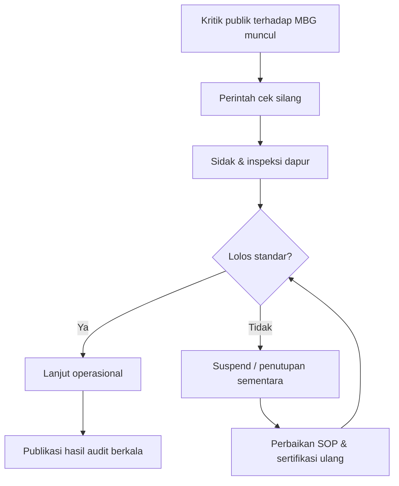
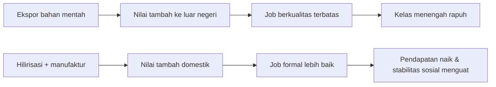
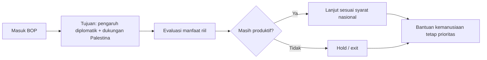

## 🎯 Pendahuluan: Ini Bukan Sekadar Wawancara Politik, tetapi Potret Cara Negara Membaca Krisis

Dialog **Presiden Prabowo Menjawab (Part 1)** di *Mata Najwa* bukan percakapan ringan yang bisa dibaca hanya sebagai adu argumentasi antar narasumber. Ia memperlihatkan sesuatu yang jauh lebih penting: **bagaimana kepala negara membingkai ancaman, mengelola kritik, membaca data, dan menetapkan prioritas ketika dunia sedang tidak stabil**.

Di satu sisi, kita melihat narasi besar tentang kedaulatan pangan-energi, industrialisasi, dan kesiapan menghadapi turbulensi global. Di sisi lain, ada pertanyaan yang sangat konkret dan sensitif: serangan terhadap aktivis, budaya laporan palsu birokrasi, efektivitas MBG di lapangan, sampai risiko fiskal jika harga minyak melonjak berkepanjangan.

Jadi, tulisan ini tidak hanya merangkum ucapan. Tulisan ini membedah:

- apa tesis utama Presiden,
- apa asumsi yang menopangnya,
- apa konsekuensi kebijakan jika dijalankan penuh,
- dan di titik mana publik perlu tetap kritis agar janji tidak berhenti sebagai retorika.

Kalau harus dipadatkan ke satu kalimat:

> **Part 1 ini memperlihatkan benturan antara visi strategis negara dan realitas eksekusi; narasinya kuat, tetapi nilainya akan ditentukan oleh disiplin data, transparansi, dan konsistensi penegakan hukum.**

---

<Callout type="important" title="Tesis utama artikel ini">
Presiden Prabowo membangun satu kerangka besar: *ketahanan pangan + ketahanan energi + efisiensi negara + keberanian menghadapi kritik*. Kerangka ini masuk akal secara strategi, tetapi baru sah secara politik jika ditopang pembuktian lapangan yang terbuka, terukur, dan konsisten.
</Callout>

---

## 🧠 1. Filsafat Dasar yang Diusung: “Akal Sehat”, Kebutuhan Dasar, dan Realitas Konflik Manusia

Pada pembuka dialog, Presiden menegaskan bahwa orientasinya pada pangan dan energi bukan semata ideologi, melainkan *common sense* (**akal sehat**) dan *reality* (**realitas**). Ia memulai dari fondasi paling bawah: manusia butuh makan, air, dan rasa aman.

Dari sisi teori kebijakan publik, ini tidak keliru. Negara yang tidak mampu menjamin kebutuhan dasar akan rentan, walaupun indikator makro tertentu tampak bagus di atas kertas.

Presiden juga membawa argumen historis-geopolitik:

- konflik antar manusia sering bermula dari perebutan sumber daya,
- perang adalah pola berulang dalam sejarah panjang peradaban,
- negara yang ingin damai tetap harus siap menjaga diri.

Ia menyinggung logika klasik seperti:

- **Thucydides Trap** (*jebakan Tukidides*): ketegangan antara kekuatan lama dan kekuatan baru,
- **Si vis pacem, para bellum**: jika ingin damai, bersiaplah untuk perang.

Secara framing, ini menunjukkan bahwa pemerintah ingin memindahkan diskusi dari “optimisme normatif” ke “kesiapsiagaan realistis”.

Tetapi ada catatan penting: ketika negara menekankan logika ancaman, ia harus ekstra hati-hati agar tidak melahirkan budaya politik yang terlalu securitized (*terlalu didominasi logika keamanan*), sehingga kritik sipil dianggap ancaman otomatis.

---

## 🌾 2. Ketahanan Pangan sebagai Kedaulatan, Bukan Sekadar Program Sektor Pertanian

Salah satu garis paling konsisten dari jawaban Presiden adalah: **negara merdeka harus bisa menjamin pangannya sendiri**.

Argumen ini disusun dalam beberapa lapis:

1. Globalisasi tidak selalu memberi jaminan pasokan saat krisis.
2. Perang di satu kawasan kini cepat berdampak ke harga pangan dunia.
3. Negara yang terlalu bergantung impor berada pada posisi tawar lemah.

Dalam konteks ini, pangan diposisikan bukan sekadar urusan kementerian teknis, tetapi bagian dari strategi keamanan nasional.

Secara prinsip, ini kuat. Namun implementasinya selalu kompleks:

- bagaimana menyeimbangkan produksi domestik dengan efisiensi pasar,
- bagaimana mencegah “swasembada semu” yang mahal tapi tidak kompetitif,
- bagaimana memastikan petani benar-benar menikmati manfaat, bukan hanya aktor distribusi.

Jadi, kerangka ketahanan pangan ini tepat sebagai arah. Ujian sebenarnya ada di arsitektur eksekusi: input pertanian, distribusi, kualitas data panen, stabilisasi harga, dan daya beli rumah tangga.

---

## 🔍 3. MBG, Serangan Kritik, dan Respons Pemerintah: dari Narasi ke Mekanisme Kontrol Mutu

Pada isu MBG, Presiden mengakui adanya serangan kritik dan menyatakan ia melakukan *cross-check* (**cek silang**) langsung: memanggil otoritas terkait, inspeksi lapangan, suspend dapur bermasalah, sertifikasi higienitas, dan membuka kanal pengaduan.

Ini secara politik menunjukkan dua hal:

- pemerintah tidak menutup diri dari kritik,
- pemerintah mencoba menggeser perdebatan dari opini ke verifikasi operasional.

Namun dari sudut tata kelola, publik tetap butuh bukti terstruktur:

- berapa unit yang benar-benar disuspend,
- apa indikator mutunya,
- bagaimana tindak lanjut pasca-suspend,
- berapa lama pemulihan,
- dan bagaimana transparansi dashboard publiknya.

Karena program berskala nasional seperti MBG tidak bisa dinilai dari satu-dua kasus viral saja. Ia harus dinilai lewat sistem mutu yang konsisten, terdokumentasi, dan terbuka.

---

## 🏛️ 4. Penyakit Lama Birokrasi: ABS, Laporan Palsu, dan Keputusan yang Menyesatkan

Saat ditanya soal “laporan palsu”, jawaban Presiden sangat tegas: budaya **ABS (asal bapak/ibu senang)** masih membudaya. Ia memberi contoh historis dari pengalaman militer: informasi krusial tidak segera naik ke atasan karena bawahan takut memberi kabar buruk.

Di sinilah masalah struktural Indonesia sering terjadi:

- pimpinan ingin data bagus,
- bawahan memberi data menyenangkan,
- keputusan diambil dari gambaran semu,
- masalah riil meledak terlambat.

Dalam bahasa manajemen risiko, ini disebut *information distortion* (**distorsi informasi**).

Solusi yang disampaikan Presiden: pemimpin harus siap menerima laporan pahit, dan organisasi harus mengutamakan realitas, bukan kenyamanan psikologis atasan.

Ini benar secara prinsip. Tetapi reformasi budaya birokrasi tidak cukup dengan pidato. Ia butuh:

- perlindungan bagi pelapor internal,
- sistem audit independen,
- insentif karier berbasis akurasi data,
- sanksi tegas untuk rekayasa laporan.

---

## 👥 5. Kritik, Niat Baik, Niat Jahat: Garis Tipis yang Harus Ditangani Hati-Hati

Presiden membedakan kritik menjadi dua:

- kritik berbasis fakta yang membantu perbaikan,
- kritik yang dimaksudkan untuk memicu kebencian atau destabilisasi.

Secara teori politik, pembedaan ini bisa dipahami. Masalahnya, dalam praktik demokrasi, garisnya sering sangat tipis dan rawan disalahgunakan.

Kalau negara terlalu longgar menempelkan label “niat jahat”, ruang kritik sehat bisa menyempit. Sebaliknya, jika negara terlalu pasif, provokasi terorganisir juga bisa merusak stabilitas.

Maka kunci paling aman adalah ini:

> **Bukan menilai niat di kepala orang, tapi menilai bukti di lapangan dan dampak konkret tindakannya.**

Ini penting agar negara tetap tegas tanpa jatuh ke pola defensif yang anti-kritik.

---

## 📉 6. Kelas Menengah Menyusut dan Lapangan Kerja Informal: Mengapa Ini Alarm Politik yang Serius

Ketika narasumber ekonomi menyinggung menyusutnya kelas menengah dan dominasi kerja informal, Presiden tidak menolak premisnya. Ia mengakui adanya anomali: pertumbuhan ada, tapi kualitas kesejahteraan belum cukup naik.

Ini titik krusial karena:

- kelas menengah adalah penyangga konsumsi domestik,
- kelas menengah juga penyangga stabilitas sosial-politik,
- jika mereka turun kelas, rasa frustrasi kolektif naik.

Dalam dialog, solusi yang ditawarkan adalah **industrialisasi-hilirisasi** agar tercipta *good jobs* (**pekerjaan berkualitas/layak**) bagi lulusan terdidik sekaligus pekerjaan massal bagi masyarakat luas.

Secara desain makro, ini memang satu-satunya jalan jangka panjang yang masuk akal: naikkan nilai tambah di dalam negeri, bangun rantai pasok, dan tarik tenaga kerja ke sektor formal berproduktivitas lebih tinggi.

Tetapi industralisasi gagal jika tiga prasyarat ini tidak dipenuhi:

1. deregulasi nyata,
2. energi kompetitif,
3. kepastian hukum-investasi.

---

## 🏭 7. Hilirisasi dan Industrialisasi: Visi Besar yang Benar, Tantangan Pelaksanaan yang Lebih Besar

Presiden menekankan bahwa Indonesia tidak boleh terus mengekspor mentah. Ia memberi contoh komoditas seperti bauksit, kelapa, kopi, dan kakao yang seharusnya diolah lebih dalam di dalam negeri.

Secara ekonomi politik, ini sangat relevan:

- ekspor mentah = nilai tambah bocor,
- industri hilir = peluang kerja dan teknologi naik,
- basis manufaktur kuat = ketahanan ekonomi lebih stabil.

Namun pengalaman banyak negara menunjukkan: *industrial policy* (**kebijakan industrial**) mudah gagal jika terlalu bergantung pada slogan, tanpa disiplin produktivitas.

Keberhasilan perlu kombinasi:

- rantai logistik efisien,
- beban izin rendah,
- pembiayaan industri jangka panjang,
- transfer teknologi,
- dan ekosistem SDM teknik (STEM).

---

## 💰 8. Defisit, Subsidi Energi, dan Efisiensi APBN: Debat yang Menentukan Arah 2–3 Tahun ke Depan

Pertanyaan ekonomi paling tajam dalam dialog adalah soal skenario buruk: harga minyak tinggi, rupiah tertekan, subsidi membengkak, defisit berisiko menembus batas psikologis.

Jawaban Presiden menekankan ruang efisiensi besar dari belanja non-prioritas: seremoni, ATK berlebih, rapat-rapat mewah, dan pola birokrasi yang dianggap boros.

Secara niat fiskal, ini tepat. Namun dalam ekonomi publik, kita harus bedakan:

- **efisiensi produktif**: memotong pemborosan,
- **efisiensi kontraktif**: justru menekan aktivitas ekonomi penting.

Karena itu, keberhasilan kebijakan efisiensi harus diukur lewat dampak:

- layanan publik tetap jalan atau tidak,
- belanja produktif terjaga atau terpotong,
- transfer efektif ke daerah membaik atau tersendat,
- kepercayaan pelaku usaha naik atau turun.

Jika metrik ini bagus, efisiensi adalah reformasi. Jika tidak, efisiensi hanya jadi kata lain untuk penundaan masalah.

---

## ⚖️ 9. Serangan terhadap Aktivis: Janji Negara Hukum dan Beban Pembuktian Pemerintah

Pada isu penyiraman air keras terhadap aktivis, Presiden menyatakan tegas: ini tindakan teror, harus diusut sampai aktor intelektual, tidak boleh ada impunitas, termasuk jika melibatkan aparat.

Secara normatif, ini pernyataan kuat dan benar. Tetapi dalam demokrasi, nilai pernyataan pejabat tinggi diukur bukan dari ketegasannya di forum, melainkan dari progres penanganannya:

- apakah proses penyidikan transparan,
- apakah pelaku lapangan dan aktor pengendali sama-sama disentuh,
- apakah perlindungan kebebasan sipil benar-benar dirasakan publik.

Di titik ini, negara memikul beban pembuktian.

<Callout type="warning" title="Ujian demokrasi yang sesungguhnya">
Pemerintah dinilai bukan saat menghadapi kritik yang nyaman, tetapi saat melindungi warga yang kritis dan tetap menegakkan hukum tanpa tebang pilih.
</Callout>

---

## 🌍 10. Board of Peace (BOP): Strategi “Masuk untuk Memengaruhi” dan Opsi Menahan Keterlibatan

Penjelasan Presiden soal BOP memberi gambaran kalkulasi diplomasi yang pragmatis:

- Indonesia masuk karena ingin punya pengaruh dari dalam proses,
- tujuan utamanya tetap bantuan dan keberpihakan pada Palestina,
- jika proses tidak lagi produktif, keterlibatan bisa ditangguhkan.

Dalam dialog, ditegaskan bahwa komponen pasukan perdamaian di-*hold* (**ditangguhkan**) sementara dukungan kemanusiaan tetap berjalan.

Secara diplomatik, ini tidak kontradiktif. Tetapi agar tidak memicu kebingungan publik, pemerintah idealnya menjelaskan parameter resmi:

- indikator manfaat keterlibatan,
- batas merah partisipasi,
- syarat lanjut versus syarat keluar.

---

## ⚡ 11. Transisi Energi: Ambisi Besar Kendaraan Listrik dan Tenaga Surya sebagai “Game Changer”

Presiden menyebut strategi percepatan elektrifikasi: kurangi ketergantungan diesel dan BBM impor, dorong tenaga surya, dan konversi kendaraan secara luas.

Secara arah, ini sangat relevan terhadap gejolak geopolitik energi. Jika berhasil, efeknya bisa besar:

- menekan kerentanan fiskal saat harga minyak global naik,
- menurunkan biaya energi rumah tangga jangka panjang,
- memperbaiki neraca energi nasional.

Tetapi transisi energi bukan sekadar mengganti mesin. Ia membutuhkan:

- kesiapan jaringan listrik,
- infrastruktur pengisian,
- skema pembiayaan adopsi masyarakat,
- transisi adil bagi pekerja sektor lama.

Ambisi besar itu positif. Uji nyatanya tetap: apakah desain transisinya inklusif, bertahap, dan tidak menambah ketimpangan baru.

---

## 🧭 12. Peta Kekuatan dan Titik Rapuh Narasi Presiden di Part 1

### Kekuatan narasi

- Konsisten menempatkan pangan-energi sebagai isu kedaulatan.
- Mengakui masalah data dan budaya birokrasi secara terbuka.
- Tidak menolak kritik ekonomi soal kelas menengah dan pekerjaan informal.
- Menyajikan orientasi strategis jangka menengah-panjang.

### Titik rapuh

- Banyak klaim operasional butuh data terbuka yang lebih sistematis.
- Batas antara “kritik sehat” dan “destabilisasi” perlu standar objektif.
- Janji penegakan hukum pada kasus aktivis harus dibuktikan progres konkret.
- Ambisi industrialisasi-transisi energi berisiko mentok jika reformasi birokrasi lambat.

Jadi, evaluasi paling adil adalah: **visi ada, tapi legitimasi berkelanjutan hanya datang dari eksekusi yang bisa diaudit publik.**

---

## 📝 13. Glosarium Istilah Asing + Padanan Indonesia

| Istilah | Padanan / Penjelasan |
|---|---|
| common sense | akal sehat |
| reality | realitas |
| basic needs | kebutuhan dasar |
| cross-check | cek silang |
| devil’s advocate | penguji argumen tanding |
| social unrest | gejolak sosial |
| good jobs | pekerjaan layak/berkualitas |
| deregulation | penyederhanaan regulasi |
| false flag operation | operasi bendera palsu |
| peacekeeping force | pasukan penjaga perdamaian |
| on hold | ditangguhkan sementara |
| national caveats | syarat/batas nasional dalam keterlibatan operasi |
| game changer | pengubah permainan / pengubah situasi secara signifikan |
| industrial policy | kebijakan industrial |
| information distortion | distorsi informasi |

---

## 🌒 14. Kesimpulan Akhir: Visi Strategis Sudah Terlihat, Kini Giliran Pembuktian Institusional

Part 1 ini memperlihatkan gaya kepemimpinan yang ingin berdiri di tiga kaki sekaligus:

1. **ketahanan nasional** (pangan, energi, keamanan),
2. **reformasi tata kelola** (efisiensi, anti-ABS, audit),
3. **stabilitas demokrasi** (menerima kritik, menindak kekerasan).

Secara konseptual, bangunannya kuat. Secara politik, publik bisa memahami arah besarnya. Tetapi secara kenegaraan, satu hal tidak boleh dilupakan:

> **Dalam demokrasi modern, narasi menang di forum; kebijakan menang di data.**

Jika data terbuka, proses hukum konsisten, dan reformasi birokrasi benar-benar menyentuh akar, maka narasi besar ini bisa berubah menjadi capaian historis. Kalau tidak, ia akan tinggal sebagai pidato yang bagus tetapi rapuh saat diuji realitas.

Dan justru karena taruhannya sangat besar—ekonomi, demokrasi, dan kepercayaan publik—maka evaluasi kritis terhadap dialog seperti ini bukan tindakan anti-negara, melainkan bagian dari perawatan negara itu sendiri. 🇮🇩✨

---

<Callout type="quote" title="Satu kalimat untuk mengingat isi artikel ini">
Kerangka strategi Presiden di Part 1 terlihat komprehensif, tetapi kualitas akhirnya akan ditentukan oleh keberanian membuka data, ketegasan menegakkan hukum, dan konsistensi mengubah birokrasi dari budaya “asal senang” menjadi budaya “apa adanya”.
</Callout>

---

<YouTube url="https://www.youtube.com/watch?v=9ibLmF4EQ6E" title="Presiden Prabowo Menjawab (PART 1): Serangan Aktivis, BOP, MBG, dan Dampak Perang | Mata Najwa" />

---

<Callout type="cite" title="Referensi">
Sumber utama: transkrip video YouTube *Presiden Prabowo Menjawab (PART 1)* dari kanal Mata Najwa. Artikel ini merupakan olahan analitis-redaksional dalam bahasa Indonesia, bukan transkrip verbatim.
</Callout>
