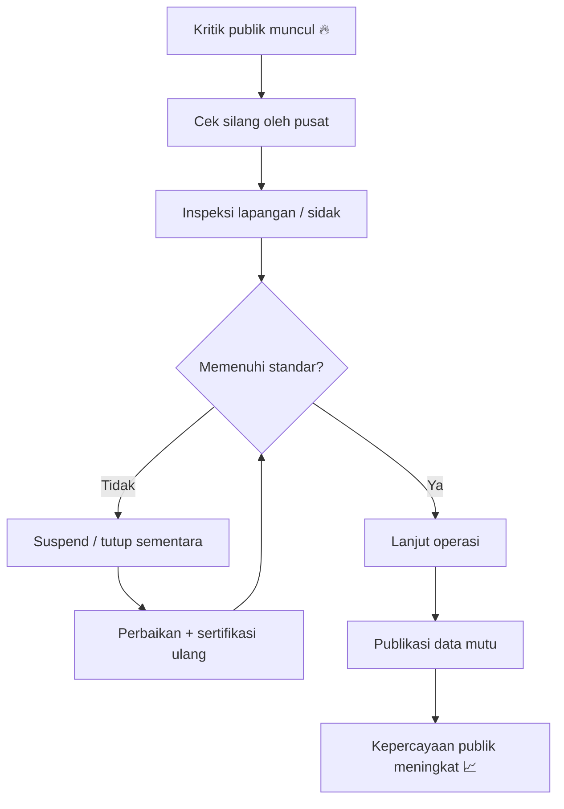
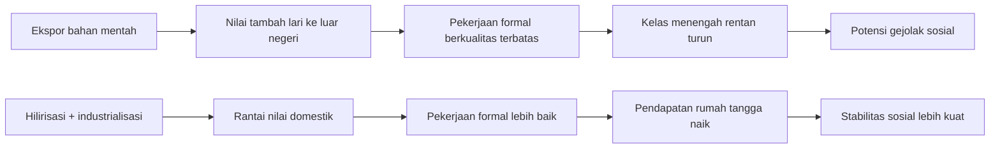
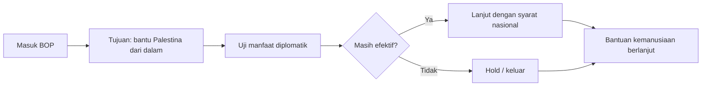

# Presiden Prabowo Menjawab (Part 1): Analisis Mendalam Serangan Aktivis, BOP, MBG, dan Dampak Perang bagi Indonesia

> *Catatan penting:* tulisan ini adalah analisis atas **Part 1** dialog publik Presiden Prabowo di program *Mata Najwa*. Fokusnya bukan sekadar merangkum, tetapi memetakan argumen inti, asumsi kebijakan, potensi dampak, dan titik kritis yang masih membutuhkan pembuktian. 🧭

Di percakapan ini, ada empat poros besar yang saling terkait:

1. **Filsafat dasar negara dalam situasi tidak pasti**: ketahanan pangan dan energi sebagai fondasi kedaulatan.
2. **Kualitas tata kelola**: budaya laporan “asal pimpinan senang” versus kebijakan berbasis data riil.
3. **Demokrasi dan keamanan sipil**: kasus kekerasan terhadap aktivis serta jaminan kebebasan kritik.
4. **Tekanan ekonomi perang**: defisit, subsidi energi, efisiensi birokrasi, industrialisasi, dan transisi energi.

Kalau dibaca sekilas, dialog ini tampak seperti kumpulan jawaban spontan. Tapi kalau dibedah, terlihat ada kerangka besar: **Prabowo berusaha memadukan logika keamanan nasional, logika fiskal, dan logika legitimasi politik dalam satu napas**. Tantangannya: kerangka besar selalu mudah diucapkan, tetapi sulit dibuktikan dalam implementasi harian.

---

## 1) Akar argumen: “akal sehat”, kebutuhan dasar, dan perang sebagai realitas sejarah

Di pembuka, Prabowo menegaskan bahwa obsesinya pada pangan-energi bukan karena romantisme ideologi, melainkan karena *common sense* (**akal sehat**) dan *reality* (**realitas**). Ia mengembalikan diskusi ke tingkat paling dasar: manusia butuh makan, air, dan rasa aman.

Secara teoritis, ini konsisten dengan kerangka **kebutuhan dasar** (*basic needs* = kebutuhan fundamental) ala Maslow. Dalam bahasa kebijakan publik: negara yang gagal menjamin pangan-energi akan rapuh, bahkan jika statistik makronya tampak baik.

<Callout type="info" title="Padanan istilah asing (bagian 1)">
- *Common sense* = akal sehat  
- *Basic needs* = kebutuhan dasar  
- *Civilization* = peradaban  
- *Interconnected* = saling terhubung
</Callout>

Yang menarik, ia tidak berhenti di prinsip moral, tetapi masuk ke asumsi geopolitik yang keras:

- manusia punya kecenderungan dominasi;
- perang adalah pola berulang dalam sejarah;
- negara yang tidak siap perang justru lebih mudah diperangi.

Ia menyinggung dua rujukan klasik:

- **Thucydides Trap** (*jebakan Tukidides*): ketika kekuatan lama dan kekuatan naik berhadapan, konflik meningkat.
- **Si vis pacem, para bellum**: “jika ingin damai, bersiaplah untuk perang.”

Dalam level strategi, ini menjelaskan mengapa narasi damai dan narasi pertahanan tidak ia anggap bertentangan. Damai dipahami sebagai hasil dari posisi tawar, bukan sekadar niat baik. ⚔️

---

## 2) Dari kritik publik ke mekanisme kontrol: MBG, dapur, dan budaya cek silang

Salah satu bagian paling konkret adalah soal serangan kritik ke MBG. Respons yang disampaikan: ia mengklaim melakukan *cross-check* (cek silang) berlapis, termasuk inspeksi, suspend dapur bermasalah, standar sertifikasi kebersihan, dan kanal pengaduan publik.

Poin yang dapat dibaca dari sini:

- pemerintah sadar bahwa skala program sosial besar pasti menghasilkan deviasi kualitas;
- legitimasi program tidak bisa diselamatkan dengan propaganda, hanya dengan audit operasional;
- kritik—bahkan yang menyakitkan—diperlukan sebagai sistem alarm dini.

Tetapi ada syarat penting: semua klaim operasional (jumlah dapur disuspend, standar sertifikasi, efektivitas hotline) harus bisa diverifikasi melalui data yang terbuka. Jika tidak, kritik akan kembali ke titik awal: narasi lawan narasi.

---

## 3) Masalah kronis birokrasi: ABS, data palsu, dan risiko keputusan fatal

Ketika ditanya soal “laporan palsu”, jawaban Prabowo cukup frontal: budaya ABS (*asal bapak/ibu senang*) dianggap masalah lintas institusi. Ia memberi contoh di militer: informasi insiden tidak dilaporkan tepat waktu karena bawahan takut “mengganggu atasan”.

Secara manajemen kebijakan, ini isu sangat serius. Kenapa?

- **Data buruk = keputusan buruk**.
- **Keputusan buruk di sektor publik = biaya sosial besar**.
- Dalam konteks pertahanan atau pangan, kesalahan bisa berujung nyawa.

Ia menekankan perlunya *new culture* (budaya baru): pemimpin harus siap menerima kabar buruk, dan organisasi harus memberi insentif kejujuran data.

<Callout type="important" title="Inti reformasi data pemerintahan 🧠">
Bukan sekadar “lebih digital”, tapi **lebih jujur secara institusional**. Digitalisasi tanpa kejujuran hanya memindahkan kebohongan dari kertas ke dashboard.
</Callout>

---

## 4) Kelas menengah menyusut, lapangan kerja informal, dan jawaban industrialisasi

Ketika isu social unrest (*gejolak sosial*) dikaitkan dengan menyusutnya kelas menengah, Prabowo tidak menolak premisnya. Ia malah mengafirmasi ada “sesuatu yang salah” jika pertumbuhan berjalan, tetapi kualitas kesejahteraan tidak ikut naik.

Jawaban utamanya: **transformasi melalui industrialisasi dan hilirisasi**.

Argumen yang dibangun:

- Indonesia terlalu lama mengekspor bahan mentah;
- nilai tambah dinikmati negara lain;
- pekerjaan bermutu lahir jika rantai nilai industri dibangun di dalam negeri;
- perlu pohon industri lintas komoditas (nikel, bauksit, kelapa, kopi, kakao, dll).

Secara konsep, ini tepat sasaran. Namun kunci keberhasilan ada di tiga titik rawan:

1. **Deregulasi nyata**, bukan hanya slogan.
2. **Kepastian investasi dan energi murah** untuk manufaktur.
3. **Penguatan SDM teknis** agar industri tidak bergantung pada impor talenta.

Ia memberi contoh dramatis regulasi pupuk yang berlapis-lapis, lalu mengklaim dipangkas. Ini penting karena industrialisasi tanpa reformasi birokrasi hanya akan memindahkan kemacetan dari hulu ke hilir.

---

## 5) Efisiensi APBN: penghematan versus dampak lapangan

Di sesi ekonomi makro, diskusi masuk ke skenario sulit: jika harga minyak tinggi berkepanjangan, subsidi energi membengkak, dan defisit tertekan.

Posisi Prabowo:

- efisiensi besar masih tersedia;
- banyak belanja seremonial/non-prioritas bisa dipotong;
- penghematan tidak harus mengorbankan layanan esensial.

Ini masuk akal sebagai prinsip fiskal. Tetapi debat kritisnya tetap sah: **efisiensi itu dilakukan di pos mana, dengan desain apa, dan dampaknya ke daerah seperti apa?**

Karena dalam praktik, “efisiensi” bisa punya dua wajah:

- ✅ efisiensi sehat: memotong pemborosan, mempercepat layanan;
- ❌ efisiensi semu: memotong belanja produktif, memindahkan beban ke pemerintah daerah/rakyat.

Maka ukuran keberhasilannya harus empiris, bukan retoris:

- belanja modal prioritas naik atau turun?
- layanan publik membaik atau memburuk?
- transfer efektif ke daerah tetap terjaga atau tersendat?

---

## 6) Demokrasi, kritik, dan kasus kekerasan terhadap aktivis

Bagian ini paling sensitif secara politik. Saat ditanya kasus penyiraman air keras terhadap aktivis, jawaban Prabowo tegas secara verbal: ini tindakan biadab, harus diusut sampai aktor intelektual, tidak boleh ada impunitas (*kekebalan hukum*).

Di saat yang sama, ia menambahkan kemungkinan adanya *false flag operation* (operasi bendera palsu = aksi sengaja direkayasa untuk menuduh pihak lain). Ini menambah kompleksitas narasi keamanan.

Dari sudut demokrasi, ada dua hal yang harus dijaga bersamaan:

1. **Kebebasan kritik tetap aman** 🗣️
2. **Penegakan hukum tetap berbasis bukti** ⚖️

Ketika pejabat tinggi sudah memberi janji publik, konsekuensinya jelas: harus ada progres penanganan yang terukur, transparan, dan bisa diaudit publik.

<Callout type="warning" title="Ujian terbesar negara hukum">
Bukan saat pemerintah berbicara soal kebebasan, tetapi saat pemerintah **melindungi suara yang tidak menyenangkan** dan tetap menindak pelaku kekerasan tanpa tebang pilih.
</Callout>

---

## 7) Board of Peace (BOP): kalkulasi diplomasi “masuk untuk memengaruhi”

Soal BOP, Prabowo menjelaskan alasan Indonesia ikut: bukan legitimasi politik kosong, melainkan upaya masuk ke ruang negosiasi agar bisa membantu Palestina dari dalam proses.

Kerangka yang ia jelaskan kurang lebih begini:

- Indonesia punya konsistensi historis membela Palestina;
- jika berada “di dalam”, ada peluang memengaruhi agenda kemanusiaan;
- jika situasi berubah kontra-produktif, Indonesia bisa menangguhkan/keluar.

Dalam dialog ini, ia juga menyampaikan status terkini: keterlibatan pasukan perdamaian di-*hold* (ditangguhkan), sementara dukungan kemanusiaan tetap berjalan.

Ini pendekatan pragmatis, tetapi tetap memerlukan parameter publik yang jelas:

- indikator manfaat diplomasi;
- batas merah (red lines) moral-politik;
- kondisi kapan bertahan, kapan keluar.

---

## 8) Transisi energi: listrik, surya, dan konversi transportasi

Salah satu gagasan paling ambisius adalah mendorong transisi cepat dari ketergantungan BBM impor ke listrik, terutama melalui energi surya. Logikanya:

- gejolak minyak global membuat ekonomi rentan;
- kendaraan listrik bisa memangkas biaya energi rumah tangga;
- energi domestik memperkuat kedaulatan strategis.

Secara arah, ini sejalan dengan tren global. Tantangan implementasinya sangat teknis:

- infrastruktur charging merata;
- kesiapan jaringan listrik;
- skema pembiayaan konversi kendaraan;
- dampak sosial-ekonomi ke sektor otomotif konvensional.

Kalau desain transisinya rapi, ini bisa jadi *game changer* (pengubah permainan). Kalau tidak, berisiko jadi proyek besar yang tidak inklusif.

---

## 9) Peta kontradiksi: optimisme strategis vs disiplin eksekusi

Dialog ini memperlihatkan satu kekuatan dan satu risiko sekaligus.

**Kekuatan:** ada narasi strategis menyeluruh, dari pangan-energi sampai diplomasi dan fiskal.  
**Risiko:** narasi menyeluruh sering kalah oleh kapasitas eksekusi di lapangan.

Karena itu, kualitas kepemimpinan ke depan akan ditentukan oleh pertanyaan sederhana:

- apakah data dibuka?
- apakah target diukur berkala?
- apakah kritik direspons lewat kebijakan, bukan emosi?
- apakah reformasi birokrasi menyentuh akar insentif, bukan kosmetik?

Jika empat ini terjaga, agenda besar punya peluang. Jika tidak, ruang publik akan kembali diisi siklus lama: janji besar, implementasi tersendat, lalu polarisasi baru.

---

## 10) Glosarium singkat istilah asing (dengan padanan Indonesia) 📘

- *Common sense* → akal sehat  
- *Reality* → realitas  
- *Basic needs* → kebutuhan dasar  
- *Cross-check* → cek silang  
- *Devil’s advocate* → penguji argumen tanding  
- *False flag operation* → operasi bendera palsu  
- *Social unrest* → gejolak sosial  
- *Good jobs* → pekerjaan layak/berkualitas  
- *Deregulation* → penyederhanaan regulasi  
- *On hold* → ditangguhkan sementara  
- *Peacekeeping force* → pasukan penjaga perdamaian  
- *National caveats* → batas/syarat nasional dalam keterlibatan operasi

---

## Kesimpulan: arah sudah terlihat, pembuktian belum selesai

Part 1 ini menunjukkan bahwa Prabowo ingin memimpin dengan kerangka **statecraft** (kepemimpinan kenegaraan) yang luas: keamanan, pangan, fiskal, energi, dan diplomasi digabung jadi satu narasi ketahanan nasional.

Namun, publik tidak hanya butuh narasi. Publik butuh pembuktian berkala, transparan, dan bisa diuji. Dalam konteks ini, kritik bukan musuh negara; kritik adalah *stress test* (uji ketahanan) kebijakan. 🇮🇩

Jadi, pembacaan paling adil atas dialog ini adalah: **visi strategisnya tegas, tetapi nilai akhirnya akan ditentukan oleh mutu eksekusi dan keberanian membuka data.**

<YouTube url="https://www.youtube.com/watch?v=9ibLmF4EQ6E" title="Presiden Prabowo Menjawab (PART 1): Serangan Aktivis, BOP, MBG, dan Dampak Perang | Mata Najwa" />

<Callout type="cite" title="Sumber">
Transkrip utama: *Presiden Prabowo Menjawab (PART 1)* dari kanal YouTube Mata Najwa. Artikel ini merupakan olahan analitis-redaksional atas materi dialog publik dan bukan transkrip verbatim.
</Callout>
