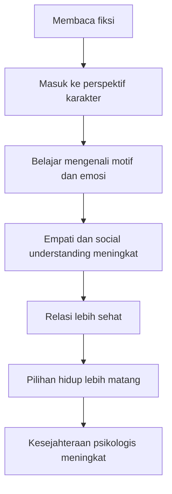
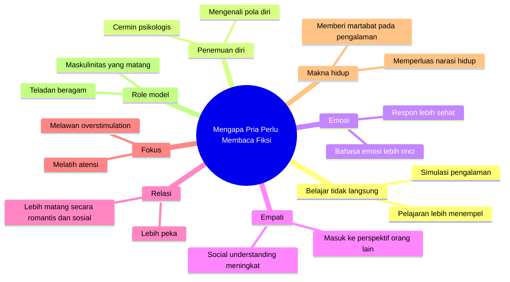

## 📚 Pendahuluan: Mengapa Banyak Pria Menganggap Fiksi Itu Tidak Penting?

Ada satu pertanyaan yang sangat umum, sangat masuk akal, dan sering diam-diam hidup di kepala banyak pria—terutama pria muda:

> **“Ngapain baca sesuatu yang tidak nyata?”**

Pertanyaan ini tidak bodoh. Justru sebaliknya, ia sangat wajar. Kalau seseorang tumbuh dalam budaya yang menekankan efisiensi, kegunaan langsung, hasil konkret, optimasi hidup, dan *self-improvement* *(pengembangan diri)* yang praktis, maka fiksi memang bisa tampak mencurigakan. Novel terlihat seperti:

- hiburan semata,
- pelarian dari dunia nyata,
- cerita bohong yang “indah tapi tidak berguna”,
- atau bahkan aktivitas yang terasa kurang maskulin dibanding olahraga, bisnis, skill teknis, atau buku nonfiksi. 📚

Karena itu, banyak argumen yang biasa dipakai untuk mendorong orang membaca fiksi sering gagal menyentuh pria muda. Kalimat seperti “novel itu indah”, “sastra memperhalus jiwa”, atau “fiksi membuat hidup lebih kaya” mungkin benar, tetapi tidak selalu terdengar meyakinkan bagi orang yang berpikir dalam kategori manfaat langsung.

Masalahnya bukan pria tidak bisa menikmati fiksi. Sering kali masalahnya justru **mereka belum melihat alasan praktis, psikologis, dan eksistensial mengapa fiksi layak dibaca.**

Dan di sinilah letak inti artikel ini.

Saya ingin membela pembacaan fiksi bukan dengan argumen sentimental, tetapi dengan argumen yang **keras, praktis, psikologis, dan sangat relevan untuk hidup nyata**. Saya akan membahas mengapa membaca novel dapat membantu pria dalam hal-hal yang sangat konkret:

- memahami dirinya sendiri,
- mengenali emosi,
- memahami orang lain,
- membangun relasi lebih baik,
- menemukan role model *(teladan)* maskulinitas yang lebih matang,
- memperkuat perhatian dan fokus,
- dan bahkan membangun makna hidup yang lebih tahan banting.

Singkatnya, jika Mas Hendra atau siapa pun bertanya, **“Apa gunanya fiksi?”**, jawaban pendeknya adalah ini:

> **fiksi bukan lawan dari kenyataan; fiksi adalah alat latihan untuk memahami kenyataan manusia yang paling sulit ditangkap oleh data mentah.**

---

<Callout type="important" title="Tesis utama artikel ini">
Pria muda tidak kekurangan alasan untuk membaca fiksi. Yang kurang biasanya adalah cara menjelaskan manfaat fiksi dalam bahasa yang praktis: sebagai alat belajar tak langsung, penemuan diri, latihan empati, pembentukan karakter, dan pembangunan makna hidup.
</Callout>

---

## 🧠 1. Masalah Besar Kita Hari Ini: Banyak Tahu Secara Kognitif, Sedikit Berubah Secara Nyata

Salah satu masalah terbesar manusia modern adalah ini: **kita sering tahu sesuatu itu benar, tetapi gagal menghidupinya.** 🧠

Kita membaca riset psikologi. Kita nonton video *self-help*. Kita mendengar nasihat bagus. Kita setuju secara intelektual. Tetapi ketika hidup benar-benar menekan—ketika kita lelah, marah, cemburu, malu, atau frustrasi—semua pengetahuan itu sering menguap.

Misalnya kita tahu:
- bersikap baik pada orang lain itu penting,
- mengendalikan ego itu sehat,
- mendengar sebelum bicara itu bijak,
- tidak semua konflik perlu dimenangkan,
- dan hubungan manusia jauh lebih penting daripada kemenangan kecil sesaat.

Tetapi berapa banyak dari kita yang benar-benar konsisten hidup dari prinsip-prinsip itu?

Masalahnya bukan sekadar pengetahuan kurang. Sering kali pengetahuan itu sudah ada. Yang kurang adalah **jangkar emosional**. Ide itu belum menembus bagian diri kita yang benar-benar mempengaruhi tindakan sehari-hari.

Di sinilah fiksi menjadi sangat penting. Novel bukan hanya memberi kita informasi. Ia memberi kita **pengalaman tak langsung** *(vicarious experience / pengalaman perantara)*. Ia membuat sebuah prinsip tidak berhenti sebagai kalimat, tetapi hidup sebagai:
- konflik,
- rasa sakit,
- pilihan,
- penyesalan,
- kegagalan,
- pengorbanan,
- dan kemenangan batin.

Karena itu, pelajaran dari novel sering lebih “nempel” daripada daftar tips.

---

## 🔁 2. Pembelajaran Tak Langsung: Mengapa Novel Bisa Mengubah Perilaku Lebih Dalam daripada Nasihat Biasa?

Video sumber menyebut konsep yang sangat penting: **vicarious learning** *(belajar secara tak langsung / melalui pengalaman orang lain)*. Ini mungkin salah satu alasan paling kuat mengapa pria perlu membaca fiksi. 🔁

Kalau pengalaman langsung adalah guru terbaik, maka novel adalah semacam **simulator pengalaman**. Kita tidak benar-benar menjalani hidup tokoh itu, tetapi kita dibawa mendekati:
- cara ia melihat dunia,
- beban yang ia tanggung,
- rasa malu yang ia alami,
- ketakutan yang ia tekan,
- dan konsekuensi moral dari tindakannya.

Ini berbeda dari membaca teori.

Teori mengatakan:
- “kebaikan itu penting.”

Tetapi novel memperlihatkan:
- bagaimana kebaikan bisa tampak bodoh di mata dunia,
- bagaimana upaya berbuat baik bisa meledak di wajah pelakunya,
- dan mengapa seseorang tetap layak dihormati meski gagal secara sosial.

Perbedaan ini sangat besar. Karena banyak pria—terutama yang terbiasa berpikir utilitarian *(berbasis kegunaan langsung)*—baru benar-benar percaya pada suatu prinsip ketika mereka bisa **merasakan bentuk manusianya**.

Misalnya, kita bisa membaca riset bahwa memberi pujian atau menunjukkan kebaikan kecil meningkatkan kesejahteraan. Itu baik. Tetapi ketika kita membaca karakter seperti **Pangeran Myshkin** dalam *The Idiot* karya **Dostoevsky**, kita tidak hanya “mengerti” pentingnya kebaikan. Kita melihat bagaimana kebaikan bisa menjadi sesuatu yang tragis, agung, rapuh, dan tetap layak dipertahankan bahkan ketika dunia salah paham.

Dengan begitu, prinsip moral menjadi bukan cuma ide, tetapi pengalaman batin.

---

## 🧪 3. Identification Effect: Ketika Otak Kita Mulai Memproses Tokoh Fiksi Seperti Diri Sendiri

Salah satu temuan psikologi yang sangat menarik adalah konsep **identification** *(identifikasi)*. Ini adalah keadaan ketika pembaca melekat pada satu atau lebih karakter dan mulai melihat dunia melalui mata mereka. 🧪

Ini bukan sekadar bahasa puitis. Penelitian menunjukkan bahwa ketika seseorang kuat mengidentifikasi diri dengan karakter tertentu, aktivitas mental saat memikirkan karakter itu bisa menjadi lebih mirip dengan aktivitas saat memikirkan dirinya sendiri.

Artinya, ketika kita membaca fiksi dengan sungguh-sungguh, otak kita tidak sekadar memproses informasi. Otak kita sedang menjalankan **simulasi hidup**.

Dan dampaknya bisa besar:
- keyakinan berubah,
- sikap berubah,
- perilaku berubah,
- bahkan cita-cita hidup bisa berubah.

Itulah mengapa ada orang yang:
- masuk dunia hukum karena terpengaruh tokoh atau novel tertentu,
- menjadi lebih lembut setelah membaca karya sastra tertentu,
- atau melihat hidupnya secara berbeda setelah bertemu karakter yang terasa seperti cermin batin.

Bagi pria muda, ini penting sekali. Banyak pria tumbuh dengan role model yang sangat sempit. Mereka mendapat gambaran maskulinitas dari:
- media sosial,
- budaya kompetitif,
- komedi sinis,
- influencer hiper-maskulin,
- atau lingkungan yang menganggap kerentanan sebagai kelemahan.

Novel membuka kemungkinan lain. Ia memberi banyak model manusia laki-laki yang:
- kuat tapi lembut,
- bijak tanpa sok kuasa,
- berani tanpa brutal,
- rapuh tanpa kehilangan martabat.

---

## 🪞 4. Novel sebagai Cermin: Salah Satu Alat Terbaik untuk Penemuan Diri

Ada hal yang agak menyakitkan tetapi penting untuk diakui: **kita sering tidak benar-benar mengenal diri sendiri.** 🪞

Kita menyangka diri kita terbuka, logis, sadar motif, dan cukup jujur pada diri sendiri. Padahal sering tidak. Manusia punya:
- area tak sadar *(unconscious)*,
- pembenaran diri,
- kebiasaan emosional yang tidak disadari,
- dan pola perilaku yang baru tampak kalau dipantulkan dari luar.

Salah satu fungsi besar novel psikologis adalah menjadi **cermin beresolusi tinggi**. Ia memperlihatkan seseorang dari dekat sekali—pikiran, rasa malu, hasrat, delusi, pembelaan diri, obsesi, kecemasan, kebiasaan menghancurkan diri sendiri.

Kalau pembaca kebetulan sedang berada di medan batin yang mirip, efeknya bisa luar biasa. Tiba-tiba ia berkata:

- “Wah, ini gue banget.”
- “Ternyata selama ini gue ngidealkan orang sampai jadi bodoh sendiri.”
- “Ternyata kemarahan gue itu sebenarnya kesedihan.”
- “Ternyata gue bukan kuat, tapi cuma defensif.”

Ini tidak selalu nyaman, tetapi justru sangat berguna.

Novel seperti karya **Stendhal**, **Dostoevsky**, **Tolstoy**, **Virginia Woolf**, atau **Proust** sering bekerja seperti alat diagnostik batin—bukan karena memberi teori universal, tetapi karena mereka mengamati struktur pengalaman manusia dengan detail yang jarang bisa diberikan oleh buku nonfiksi populer.

---

## ❤️ 5. Cinta, Harga Diri, dan Delusi: Mengapa Fiksi Membantu Kita Mengenali Pola yang Sulit Kita Akui?

Salah satu wilayah di mana novel sangat kuat adalah soal cinta. Banyak orang—terutama pria muda—mengira bahwa kesulitan romantis mereka unik, memalukan, atau aneh. Padahal banyak pola emosional itu sudah diamati sastra ratusan tahun lalu. ❤️

Misalnya, Stendhal berkali-kali menunjukkan bagaimana orang jatuh cinta tidak selalu karena alasan mulia, tetapi karena:
- merasa ada kekurangan dalam dirinya,
- mengidealkan pasangan secara tak realistis,
- lalu merasa tak layak di hadapan idealisasi itu,
- sehingga akhirnya bersikap canggung, berlebihan, posesif, atau justru merusak hubungan.

Ini sangat penting untuk pria, karena pria sering diajari untuk fokus pada strategi dan performa dalam relasi, bukan pada **struktur psikologis** yang mereka bawa ke dalam relasi.

Padahal sering masalahnya bukan kurang teknik, tapi:
- rasa tidak layak dicintai,
- kecenderungan mengidealkan pasangan,
- takut ditolak sampai jadi versi diri yang paling palsu,
- atau kebutuhan pengakuan yang terlalu lapar.

Ketika kita membaca tokoh-tokoh seperti itu, kita dapat melihat diri sendiri dari sudut pandang orang ketiga. Dan itu sangat menolong. Sebab hal yang dalam hidup terasa seperti kabut, di novel bisa tampil sebagai pola yang jelas.

---

## 🧍 6. Fiksi dan Rasa Tidak Sendirian: Kadang yang Kita Butuhkan Bukan Solusi, Tapi Pengakuan bahwa Orang Lain Pernah Merasakan Ini Juga

Ada manfaat lain yang sering diremehkan: novel bisa membuat kita merasa **tidak sendirian**. 🧍

Bukan sekadar karena kita “terhibur”, tetapi karena kita melihat bahwa:
- bentuk kecemasan kita bukan hal baru,
- rasa malu kita bukan kegagalan personal yang unik,
- konflik batin kita pernah dialami orang lain di tempat dan zaman yang jauh,
- dan manusia sebelum kita juga pernah gamang, bingung, marah, takut, cinta, dan gagal.

Ini penting sekali untuk kesehatan jiwa. Karena banyak penderitaan emosional memburuk bukan cuma oleh rasa sakit itu sendiri, tetapi oleh keyakinan:

> “Cuma gue yang kayak gini.”

Novel membongkar ilusi itu.

Ketika seseorang membaca *Notes from Underground* dan sadar bahwa sebagian kecenderungan sabotase dirinya ternyata telah digambarkan dengan sangat telanjang oleh Dostoevsky, itu bisa memalukan—tetapi juga melegakan. Ketika seseorang membaca *Anna Karenina* atau *The Red and the Black* dan melihat kecanggungan, delusi, atau idealisasi sosial yang mirip dengan dirinya, itu memberi dua hal sekaligus:

1. pengenalan diri,
2. dan pembebasan dari rasa kesepian psikologis.

---

## 😶 7. Emosi: Salah Satu Kelebihan Besar Novel adalah Memberi Kita Bahasa yang Lebih Tajam untuk Merasa

Banyak pria dibesarkan dengan kosa kata emosi yang sangat miskin. Tidak selalu karena mereka dingin, tetapi karena mereka tidak diajari mengenali spektrum halus dari apa yang mereka rasakan. 😶

Akibatnya, banyak pengalaman batin diringkas jadi beberapa kata saja:
- marah,
- capek,
- bete,
- stres,
- baik-baik saja.

Padahal di balik “marah” bisa ada:
- malu,
- terhina,
- takut kehilangan kontrol,
- merasa tidak dihargai,
- sedih yang tidak diakui,
- atau kecewa pada diri sendiri.

Di sinilah novel sangat berharga. Banyak karya sastra menggambarkan keadaan emosi dengan **resolusi tinggi**. Ia mengajari kita membedakan:
- cemburu dari rasa tidak aman,
- sedih dari hampa,
- cinta dari kebutuhan dipuja,
- keberanian dari putus asa,
- ketenangan dari mati rasa.

Kemampuan mengenali emosi secara lebih rinci sering disebut sebagai **emotional granularity** *(granularitas emosi / ketelitian dalam membedakan keadaan emosional)*. Dan ini terkait dengan kesejahteraan psikologis yang lebih baik.

Mengapa? Karena orang yang tahu persis apa yang ia rasakan biasanya lebih mampu merespons dengan tepat.

Kalau seseorang salah mengira kesedihan sebagai kemarahan, ia mungkin akan melukai orang lain. Kalau seseorang mengira rasa sepinya adalah kebosanan, ia mungkin akan menenggelamkan diri dalam stimulasi tanpa menyentuh akar masalah.

Novel bisa membantu mencegah itu, karena ia melatih kita untuk **merasakan dengan nama yang lebih jelas**.

---

## 🤝 8. Empati: Bukan Sekadar “Baik Hati”, tetapi Keterampilan Memasuki Perspektif Orang Lain

Salah satu manfaat fiksi yang paling sering dibahas adalah **empati**. Tetapi empati sering dipahami terlalu dangkal seolah cuma berarti “jadi lebih baik hati”. Padahal maknanya lebih kaya. 🤝

Empati dalam konteks ini mencakup kemampuan untuk:
- membayangkan dunia dari sudut pandang orang lain,
- memahami mengapa seseorang bereaksi seperti itu,
- melihat bahwa perilaku luar sering berasal dari luka atau struktur batin tertentu,
- dan menunda penilaian cepat karena kita mengerti ada konteks.

Membaca novel—terutama **literary fiction** *(fiksi sastra)*—melatih kemampuan ini karena kita dipaksa tinggal cukup lama di dalam kepala orang lain.

Dan yang lebih penting: bukan hanya orang yang mirip kita. Kita bisa masuk ke perspektif orang yang sangat berbeda:
- berbeda gender,
- berbeda zaman,
- berbeda kelas sosial,
- berbeda budaya,
- berbeda iman,
- bahkan berbeda struktur kepribadian.

Ini sangat penting untuk pria. Banyak pria muda ingin memperbaiki hidupnya lewat kebugaran, karier, produktivitas, dan disiplin. Semua itu bagus. Tetapi sedikit yang sadar bahwa **peningkatan terbesar dalam kualitas hidup sering datang dari peningkatan kualitas relasi.**

Dan kualitas relasi naik ketika kemampuan memahami orang lain ikut naik.

---

---

## 🗣️ 9. Fiksi dan Kecakapan Sosial: Mengapa Membaca Bisa Membuat Interaksi Sosial Tidak Lagi Sekacau Itu?

Ada pria yang secara alami mudah memahami orang. Ada juga yang tidak. Ada yang sejak kecil peka membaca suasana. Ada yang harus belajar keras. Dan kabar baiknya: **kemampuan memahami orang lain bisa diasah.** 🗣️

Novel adalah salah satu cara mengasahnya.

Kenapa? Karena interaksi sosial yang baik pada dasarnya menuntut dua hal:

1. menangkap sinyal emosional,
2. memahami kerangka batin yang mungkin melahirkan sinyal itu.

Kalau kita hanya punya teori kasar tentang manusia, kita akan sering salah baca. Tapi kalau kita sudah banyak “berlatih” melalui karakter-karakter fiksi dengan temperamen yang beragam, kita menjadi lebih lentur dalam memahami:
- kenapa seseorang defensif,
- kenapa seseorang diam bukan karena dingin tetapi malu,
- kenapa seseorang keras bukan karena kuat melainkan rapuh,
- kenapa seseorang tampak menolak padahal sebenarnya takut.

Itulah mengapa membaca penulis dengan perspektif yang berbeda-beda sangat berharga. Membaca **Jane Austen**, **Emily Brontë**, atau **Virginia Woolf** misalnya, bisa membantu pria memahami bentuk-bentuk pengalaman perempuan yang tidak otomatis terbaca dari luar. Membaca **Steinbeck** membantu kita merasakan beban ekonomi dan martabat manusia dalam penderitaan kolektif. Membaca **Solzhenitsyn** memberi gambaran bukan sekadar fakta politik, tapi rasa hidup di bawah sistem yang menghancurkan.

Semua itu membuat kita lebih luwes secara sosial, bukan karena kita jadi manipulatif, tapi karena kita lebih mampu **melihat manusia sebagai manusia**.

---

## 🧘 10. Fiksi sebagai Latihan Atensi di Era Overstimulation

Ada manfaat yang lebih sederhana tetapi sangat penting: membaca novel adalah bentuk hiburan yang relatif **tidak terlalu menstimulasi secara brutal** dibanding banyak media digital hari ini. 🧘

Kita hidup di dunia yang:
- cepat,
- pecah-pecah,
- penuh notifikasi,
- penuh potongan video singkat,
- penuh dopamin kecil dari hal-hal yang terus berganti.

Akibatnya, perhatian kita mudah rusak. Banyak orang merasa tidak lagi bisa:
- duduk tenang,
- membaca panjang,
- memikirkan satu ide cukup lama,
- atau tinggal cukup lama dalam satu suasana batin.

Novel melawan kecenderungan itu. Ia meminta kita untuk:
- tinggal lebih lama,
- menunggu payoff *(buah naratif)*,
- membangun imajinasi,
- memegang konteks,
- dan tidak terus-menerus pindah stimulasi.

Bagi pria muda yang ingin membangun fokus, disiplin, dan kedalaman berpikir, ini sangat relevan. Membaca fiksi bukan hanya konsumsi isi. Ia juga latihan bentuk perhatian.

Dalam bahasa sederhana: membaca novel melatih kita **tidak selalu hidup dalam mode reaktif**.

---

## 🛠️ 11. Bagi Pria yang Suka Self-Improvement, Fiksi Sebenarnya Sangat Praktis

Ada ironi yang menarik. Banyak pria muda suka *self-improvement*—dan itu bagus. Mereka suka:
- membangun tubuh,
- memperbaiki jadwal,
- belajar finansial,
- mengatur fokus,
- dan menjadi versi diri yang lebih kuat.

Tetapi justru karena fokusnya sering terlalu teknis, mereka kadang melewatkan satu wilayah yang menentukan hampir semua kualitas hidup: **dunia batin dan dunia relasional**. 🛠️

Tanpa kemampuan memahami:
- emosi,
- rasa malu,
- cinta,
- luka batin,
- relasi sosial,
- dan makna personal,

semua perbaikan teknis bisa terasa kosong, rapuh, atau malah dipakai untuk menutupi kekosongan.

Fiksi masuk tepat di titik ini. Ia tidak menggantikan kerja nyata. Ia tidak menggantikan gym, kerja keras, atau disiplin. Tetapi ia mengisi sesuatu yang sering hilang dari self-improvement modern: **pendalaman kemanusiaan**.

Jadi, kalau ada pria berkata, “Saya cuma mau hal yang berguna,” saya justru akan bilang:

> **membaca fiksi itu berguna sekali—justru karena hidup manusia tidak cuma soal efisiensi, tetapi juga soal memahami diri, orang lain, dan makna dari semua yang kita kejar.**

---

## 👑 12. Krisis Role Model Laki-Laki? Sebenarnya Novel Penuh Teladan Maskulinitas yang Jauh Lebih Kaya

Sering ada keluhan bahwa pria muda kekurangan role model maskulinitas positif. Ada benarnya, tetapi saya juga setuju dengan inti video: **novel sebenarnya penuh dengan teladan laki-laki yang sangat kaya dan beragam.** 👑

Masalahnya, kita berhenti mencari teladan di sastra.

Padahal dalam novel, kita bisa menemukan model-maskulinitas yang jauh lebih matang daripada stereotip media sosial. Misalnya:

### A. Kebijaksanaan tanpa dominasi
**Gandalf** atau **Elder Zosima** adalah figur pria tua yang kuat bukan karena agresif, tetapi karena wibawa, kebijaksanaan, dan keluasan jiwa.

### B. Keberanian yang lembut
Banyak tokoh besar bukan keras karena ingin menang, tetapi karena memikul tugas yang perlu dilakukan tanpa kehilangan belas kasih.

### C. Kerentanan yang tidak memalukan
Tokoh-tokoh seperti **Pierre** dalam *War and Peace* memperlihatkan bahwa pria bisa bingung, goyah, mencari arah, dan tetap layak dihormati.

### D. Kebaikan yang tidak bodoh
Tokoh seperti **Dr. Rieux** dalam *The Plague* menunjukkan maskulinitas yang kompeten, bertanggung jawab, dan tenang—bukan pamer, bukan narsistik, bukan haus pengakuan.

Ini penting sekali. Karena banyak pria muda hari ini terjebak pada pilihan sempit:
- jadi keras atau jadi lemah,
- dominan atau dikalahkan,
- dingin atau dipermalukan.

Novel menunjukkan ada jalan ketiga, keempat, kelima. Ada banyak cara menjadi laki-laki yang baik.

---

## 🎭 13. Makna, Narasi, dan Mengapa Fiksi Membantu Kita Menata Hidup

Bagian paling dalam dari video ini menurut saya adalah soal **meaning making** *(pembentukan makna)*. Ini sangat penting. 🎭

Manusia memahami hidup melalui **narasi**. Kita jarang hidup dalam kumpulan fakta mentah. Kita menyusun kejadian menjadi cerita:
- saya gagal lalu bangkit,
- saya disakiti lalu belajar,
- saya sedang tersesat tapi sedang tumbuh,
- atau sebaliknya, saya korban nasib dan semua sia-sia.

Masalahnya, kalau kita tidak sadar sedang menarasikan hidup, kita tetap akan punya narasi—hanya saja narasinya bisa buruk, sempit, atau destruktif.

Misalnya:
- “Karena gue pernah baik lalu disakiti, berarti kebaikan itu bodoh.”
- “Karena gue ditolak, berarti gue memang tidak layak dicintai.”
- “Karena hidup terasa berulang, berarti semua tidak bermakna.”

Novel memberi kita akses ke banyak **struktur naratif** yang lebih kaya. Ia menunjukkan bahwa:
- kebaikan yang gagal tetap bisa mulia,
- penderitaan tidak selalu membatalkan martabat,
- cinta yang berakhir buruk tetap bisa bermakna,
- kegagalan bisa menjadi bagian dari pembentukan karakter,
- dan hidup tidak harus dibaca dengan narasi sinis yang miskin.

Ini sangat penting bagi pria, karena pria sering dilatih menafsirkan pengalaman lewat narasi sempit: menang-kalah, kuat-lemah, dihormati-dihina. Fiksi memperluas kamus naratif itu.

---

## 🌄 14. Keindahan dan Martabat: Mengapa Novel Bisa “Memuliakan” Pengalaman yang Sulit Ditanggung?

Ada hal yang sulit dibuktikan dengan data, tetapi sangat nyata dalam pengalaman pembaca: novel besar sering memberi **martabat** pada pengalaman manusia. 🌄

Apa maksudnya?

Ketika sesuatu ditulis dengan indah, jernih, dan tajam, pengalaman yang sebelumnya terasa:
- memalukan,
- remeh,
- absurd,
- atau sia-sia,

bisa tiba-tiba terlihat sebagai sesuatu yang memiliki bentuk, bobot, dan bahkan keindahan tragis.

Misalnya, pengalaman berbuat baik lalu disalahpahami bisa menjadi sumber sinisme. Tetapi ketika kita melihatnya dalam kerangka naratif yang agung, pengalaman itu tidak lagi sekadar “gue rugi karena baik.” Ia menjadi bagian dari sesuatu yang lebih besar: perjuangan menjaga martabat dalam dunia yang sering salah membaca niat baik.

Ini bukan ilusi murahan. Ini cara manusia memberi bentuk pada pengalaman. Dan memberi bentuk pada pengalaman adalah bagian penting dari bertahan hidup secara batin.

---

---

## ⚠️ 15. Tapi Bukankah Fiksi Juga Bisa Menyesatkan?

Ya. Dan ini perlu diakui dengan jujur. Fiksi bisa mengajarkan hal buruk juga. ⚠️

Kalau novel punya kekuatan membentuk emosi, nilai, dan narasi hidup, maka itu berarti ia juga bisa:
- meromantisasi penderitaan secara salah,
- menormalisasi hubungan toksik,
- memuliakan kekerasan tanpa refleksi,
- atau menanamkan gambaran hidup yang destruktif.

Karena itu, membaca fiksi tidak berarti menelan semuanya mentah-mentah. Kita tetap butuh:
- nalar kritis,
- refleksi,
- dan kemampuan memilah.

Tetapi justru karena novel punya daya besar, ia layak diperlakukan serius. Sama seperti statistik bisa dipakai menipu, kita tidak lalu membuang statistik. Kita belajar membaca statistik dengan lebih cermat. Sama juga dengan fiksi.

Membaca banyak karya dari banyak penulis juga membantu. Karena dengan begitu kita tidak terjebak dalam satu narasi tunggal. Kita punya lebih banyak pembanding, lebih banyak struktur makna, lebih banyak gaya menjadi manusia.

---

## 🌱 16. Jadi, Apa yang Sebenarnya Didapat Pria dari Membaca Fiksi?

Kalau diringkas secara praktis, pria—terutama pria muda—bisa mendapat banyak hal dari membaca fiksi: 🌱

### A. Pelajaran hidup yang lebih menempel
Karena dipelajari lewat pengalaman naratif, bukan slogan.

### B. Pengetahuan diri yang lebih tajam
Karena tokoh-tokoh fiksi sering menjadi cermin dari pola kita sendiri.

### C. Bahasa emosi yang lebih kaya
Sehingga kita tidak hidup dalam kosa kata batin yang miskin.

### D. Empati dan pemahaman sosial yang meningkat
Yang berdampak besar pada persahabatan, keluarga, dan hubungan romantis.

### E. Role model maskulinitas yang lebih dewasa
Tidak sempit, tidak karikatural, tidak sekadar kuat secara lahiriah.

### F. Fokus dan kedalaman perhatian
Sangat penting di era digital yang hiper-stimulatif.

### G. Narasi hidup yang lebih sehat
Kita menjadi lebih mampu membaca pengalaman bukan hanya sebagai kekalahan atau kemenangan dangkal.

Dengan kata lain, fiksi membantu pria bukan dengan membuat mereka “kurang realistis”, tetapi justru dengan membuat mereka **lebih matang menghadapi realitas manusia**.

---

## 🧭 17. Bagaimana Cara Mulai Kalau Sudah Lama Tidak Membaca Fiksi?

Banyak orang sebenarnya setuju bahwa fiksi mungkin bermanfaat, tetapi bingung harus mulai dari mana. Kalau Mas Hendra atau pembaca lain sudah lama tidak membaca novel, saya sarankan pendekatannya begini: 🧭

### 1. Jangan mulai dari buku yang “harusnya” Anda suka karena dianggap klasik
Mulailah dari tema yang terasa relevan dengan hidup Anda sekarang.

### 2. Pilih tokoh dan konflik yang dekat dengan problem nyata
Misalnya:
- pencarian jati diri,
- persahabatan,
- cinta yang rumit,
- rasa bersalah,
- kehampaan eksistensial,
- atau kepahlawanan yang tenang.

### 3. Baca perlahan, bukan seperti mengejar checklist
Novel bukan lomba kecepatan. Yang penting adalah tinggal cukup lama di dalam dunianya.

### 4. Setelah selesai, refleksikan
Tanyakan:
- tokoh mana yang paling mirip saya?
- bagian mana yang bikin tidak nyaman?
- pelajaran apa yang terasa mengganggu atau membebaskan?

### 5. Jangan takut tidak “mengerti semuanya”
Kadang novel terbaik justru bekerja pelan. Efeknya baru terasa beberapa hari atau beberapa bulan kemudian.

---

## 🕯️ 18. Kesimpulan: Fiksi Bukan Kemewahan, Tapi Salah Satu Alat Terbaik untuk Menjadi Manusia yang Lebih Matang

Pada akhirnya, argumen bahwa pria perlu membaca fiksi bukanlah argumen romantik kosong. Ini argumen yang sangat praktis. 🕯️

Fiksi membantu kita:
- hidup lebih sadar,
- memilih lebih baik,
- memahami diri lebih jujur,
- memahami orang lain lebih halus,
- merespons emosi dengan lebih tepat,
- dan menata hidup dalam narasi yang tidak miskin makna.

Bagi pria muda, manfaat ini bahkan bisa sangat besar, karena banyak problem yang diam-diam mereka tanggung bukan problem kurang informasi, tetapi problem:
- kurang bahasa batin,
- kurang teladan manusia yang matang,
- kurang kemampuan melihat perspektif lain,
- dan terlalu sempitnya narasi tentang apa itu hidup yang “berhasil”.

Novel memperluas semuanya itu.

Jadi kalau ada yang masih bertanya, **“Kenapa saya harus baca fiksi padahal itu tidak nyata?”**, saya akan menjawab begini:

> **karena banyak hal terpenting dalam hidup manusia tidak bisa dipelajari cukup lewat fakta mentah. Kita butuh cerita untuk masuk ke kedalaman emosi, moralitas, relasi, dan makna. Dan di situlah fiksi bekerja.**

Bukan sebagai pelarian dari dunia nyata, tetapi sebagai latihan untuk menghidupi dunia nyata dengan lebih utuh. ✨

---

<Callout type="quote" title="Kalimat inti artikel ini">
Pria tidak membaca fiksi untuk melarikan diri dari kenyataan, melainkan untuk berlatih menghadapi kenyataan manusia yang paling sulit: emosi, cinta, martabat, kelemahan, pilihan moral, dan cara memberi makna pada hidup.
</Callout>

<Callout type="cite" title="Sumber dan fokus pembahasan">
Artikel ini dikembangkan dari transcript video *Men, you NEED to read fiction* dan diperluas menjadi esai reflektif-psikologis tentang pembelajaran tak langsung, penemuan diri, empati, emosi, maskulinitas, perhatian, dan pembentukan makna hidup melalui pembacaan novel.
</Callout>
