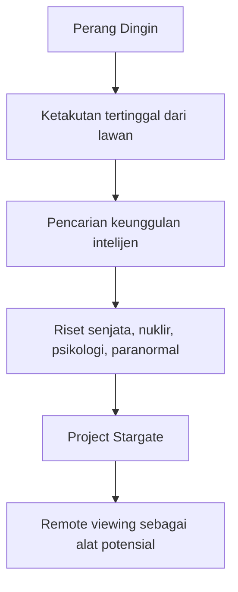
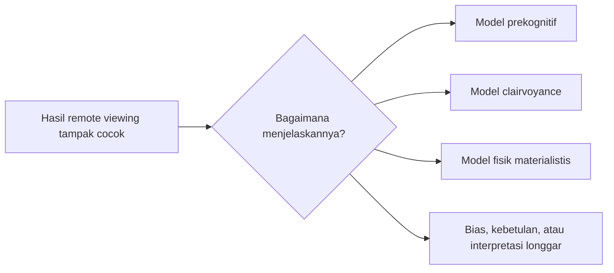

## 🕵️ Pendahuluan: Ketika Intelijen Modern Bertemu Dunia Paranormal

Ada topik-topik tertentu yang langsung memicu dua reaksi ekstrem sekaligus. Reaksi pertama adalah rasa penasaran yang besar 😮. Reaksi kedua adalah penolakan spontan: *“Ah, ini pasti omong kosong.”* Salah satu topik yang hampir selalu memunculkan dua respons itu adalah **Project Stargate**, program intelijen Amerika Serikat yang selama puluhan tahun dikaitkan dengan **remote viewing** (*penglihatan jarak jauh*), yaitu klaim bahwa seseorang dapat memperoleh informasi tentang lokasi, objek, atau peristiwa yang jauh tanpa menggunakan indera biasa.

Kalau seseorang pertama kali mendengar frasa seperti **psychic spies** (*mata-mata psikis*) atau **remote viewer** (*pengamat jarak jauh secara psikis*), wajar kalau kesannya terdengar seperti campuran antara film fiksi ilmiah, okultisme, propaganda perang, dan teori konspirasi. Masalahnya, Project Stargate bukan sekadar urban legend. Program ini memang pernah ada, pernah didanai, pernah berjalan selama lebih dari dua dekade, dan dokumen-dokumen tertentu memang telah dideklasifikasi. Itu membuat persoalannya jauh lebih menarik daripada sekadar ejekan atau sensasi 📂.

Namun justru di sinilah jebakan besarnya. Banyak orang terlalu cepat melompat ke salah satu dari dua kutub:

- **Kutub pertama:** “Karena CIA pernah menelitinya, berarti remote viewing pasti nyata.”
- **Kutub kedua:** “Karena kedengarannya absurd, berarti semuanya pasti penipuan total.”

Kedua posisi ini terlalu cepat. Yang lebih penting justru adalah membedakan dengan teliti antara:

1. **fakta arsip** — apa yang benar-benar terdokumentasi,
2. **klaim hasil** — apa yang dikatakan berhasil,
3. **interpretasi** — bagaimana hasil itu dibaca,
4. **spekulasi metafisis** — teori besar tentang kesadaran, waktu, atau realitas yang dibangun di atasnya.

Video yang Mas Hendra kirim menarik karena bukan hanya membahas klaim-klaim mengejutkan dari arsip Stargate, tetapi juga bergerak ke level filsafat: kalau remote viewing itu mungkin, maka dunia ini harus seperti apa? Apakah kesadaran itu non-lokal? Apakah waktu tidak linear? Apakah penjelasannya materialistis? Atau justru semua itu melampaui sains biasa? Pertanyaan-pertanyaan ini menarik, tetapi juga harus diperlakukan dengan kehati-hatian intelektual 🧠.

Dalam artikel ini, saya akan membedah topik tersebut secara lengkap, runtut, dan mendalam. Kita akan bahas konteks sejarah Perang Dingin, bagaimana sesi remote viewing dilakukan, contoh-contoh *hit* yang sering dipamerkan, mengapa proyek semacam ini bisa terus didanai, apa argumen pendukung dan argumen skeptisnya, lalu akhirnya kita akan masuk ke dimensi filosofis: apa yang sebenarnya bisa—dan tidak bisa—kita simpulkan dari keberadaan arsip Stargate.

<Callout type="important" title="Tesis utama artikel ini">
Project Stargate penting bukan karena ia otomatis membuktikan fenomena paranormal itu nyata, melainkan karena ia memperlihatkan sesuatu yang jauh lebih menarik: dalam situasi geopolitik ekstrem seperti Perang Dingin, negara modern bisa mengeksplorasi bahkan klaim paling tidak biasa sekalipun jika ada kemungkinan kecil bahwa itu memberi keunggulan intelijen.
</Callout>

---

## 🧭 1. Apa Itu Project Stargate?

**Project Stargate** adalah nama yang paling sering dipakai untuk merujuk pada rangkaian program intelijen Amerika Serikat yang meneliti kemungkinan penggunaan kemampuan psikis untuk kepentingan militer dan spionase. Dalam video, program ini dijelaskan sebagai operasi intelijen militer yang berlangsung lebih dari dua dekade, mulai dari era 1970-an hingga dihentikan pada 1995. Fokus utamanya adalah **remote viewing**, yaitu usaha mendapatkan informasi tentang target yang jauh, tersembunyi, atau tidak diketahui dengan cara yang dianggap non-indrawi.

Secara sederhana, gagasan dasarnya begini:

- seorang subjek duduk dalam ruangan,
- ia diberi **nomor referensi anonim** untuk sebuah target,
- target itu bisa berupa pangkalan militer, fasilitas nuklir, bangunan, atau lokasi tertentu,
- subjek lalu diminta melaporkan kesan sensorik, bentuk, struktur, medan, atau objek yang “tertangkap” dalam kesadarannya,
- hasilnya direkam dalam catatan dan gambar.

Kalau dijelaskan seperti ini, terdengar sangat aneh. Tetapi justru keanehan itulah yang membuat orang terus membahas Stargate sampai sekarang. Sebab yang kita bicarakan di sini bukan sekadar kelompok spiritual pinggiran, melainkan proyek yang terkait dengan lembaga negara, ilmuwan, dan konteks perang global 🌍.

Poin pentingnya: keberadaan proyek itu sebagai proyek riset memang fakta sejarah arsip. Tetapi **keberadaan proyek tidak otomatis sama dengan pembuktian keberhasilan fenomenanya**. Ini perbedaan metodologis yang sangat penting.

---

## 🥶 2. Mengapa Program Seperti Ini Muncul? Jawabannya: Perang Dingin

Untuk memahami Stargate, kita harus menaruhnya di panggung sejarah yang tepat: **Perang Dingin** (*Cold War* = konflik geopolitik berkepanjangan antara blok Barat dan blok Soviet tanpa perang langsung total antara dua kekuatan utama). Pada era itu, kompetisi tidak hanya terjadi di medan senjata konvensional, tetapi juga dalam teknologi, ruang angkasa, propaganda, intelijen, nuklir, psikologi massa, dan riset-riset yang hari ini terdengar eksentrik.

Dalam situasi seperti itu, cara berpikir negara adidaya menjadi sangat pragmatis. Mereka tidak bertanya pertama-tama, *“Apakah ini terdengar konyol?”* Mereka bertanya, *“Kalau ini benar walau cuma sedikit, apakah lawan kita bisa unggul duluan?”* ⚔️

Itulah sebabnya program seperti Stargate tidak bisa dipahami hanya dengan logika akademik biasa. Dari perspektif birokrasi damai, menghabiskan puluhan juta dolar untuk riset penglihatan psikis terdengar absurd. Tapi dari perspektif Perang Dingin, logikanya bisa menjadi seperti ini:

- jika Uni Soviet atau China meneliti hal serupa,
- jika ada kemungkinan kecil fenomena ini nyata,
- jika efeknya bisa dipakai untuk intelijen strategis,
- maka lebih aman ikut meneliti daripada mengabaikannya sepenuhnya.

Dengan kata lain, **Stargate bisa dipahami sebagai bentuk “asuransi epistemik”**. Negara mungkin tidak yakin penuh, tetapi mereka juga tidak mau mengambil risiko bahwa lawan memiliki sesuatu yang mereka abaikan.

---

## 🗂️ 3. Apa yang Sebenarnya Ada di Arsip Stargate?

Video menekankan satu hal penting: dokumen-dokumen yang dibahas bukan hasil “membobol CIA”, melainkan arsip yang telah tersedia untuk publik melalui koleksi seperti **Archives of the Impossible** di Rice University. Jadi klaim dasarnya bukan, *“Lihat, ada rahasia besar yang diam-diam saya curi.”* Klaim dasarnya adalah, *“Lihat, ada arsip resmi dan historis yang dapat diperiksa.”*

Dari sisi metodologi, ini penting sekali. Arsip publik memungkinkan orang untuk menelaah struktur kerja proyek tersebut, bentuk lembar kerja, cara target diberikan, dan bagaimana sesi-sesi itu direkam. Ini memberi bobot historis yang jauh lebih serius dibanding cerita lisan tanpa dokumen 📄.

Beberapa unsur yang disebut dalam video antara lain:

- lembar kerja sesi remote viewing,
- nomor target anonim,
- sketsa yang dibuat subjek,
- perbandingan antara sketsa dan target aktual,
- laporan untuk lembaga militer atau staf tinggi,
- dokumen yang menyinggung minat China terhadap *extrasensory perception* (*persepsi ekstra-indrawi*).

Nah, dari sini kita perlu sangat hati-hati. Adanya arsip semacam itu membuktikan bahwa:

1. program itu benar-benar berlangsung,
2. prosedur tertentu benar-benar dijalankan,
3. lembaga negara memang cukup serius untuk mencatat dan menilai hasilnya.

Tetapi itu **belum** membuktikan bahwa semua interpretasi atas hasil tersebut benar. Dokumen adalah bukti bahwa sesuatu diteliti, bukan otomatis bukti bahwa teori di baliknya benar.

---

## ✍️ 4. Bagaimana Sesi Remote Viewing Dilakukan?

Salah satu kekuatan video ini adalah ia menjelaskan prosedur kerja remote viewing secara cukup konkret. Menurut penjelasan tersebut, sesi remote viewing biasanya berjalan seperti ini:

1. **target dipilih** — bisa lokasi, fasilitas, struktur, atau objek tertentu,
2. **target diberi nomor referensi anonim** — agar subjek tidak tahu identitas target,
3. **viewer duduk dalam kondisi terkontrol**,
4. **viewer melaporkan kesan sensorik** — bentuk, tekstur, suhu, ruang, struktur, arah, atau sensasi yang “muncul”,
5. **viewer membuat sketsa**, kadang juga peta,
6. **hasil dibandingkan** dengan target aktual.

Secara teori, penggunaan nomor anonim ini dimaksudkan untuk mencegah bias sadar biasa. Dengan kata lain, kalau viewer tidak tahu target apa yang sedang dicari, maka “kecocokan” yang muncul dianggap lebih menarik.

Tetapi justru di sini muncul beberapa problem metodologis yang harus kita sadari:

- **Seberapa longgar deskripsi yang dianggap cocok?**
- **Apakah penilaian kecocokan dilakukan sebelum atau sesudah mengetahui target?**
- **Apakah hanya hit yang disimpan, atau juga miss?**
- **Apakah ada efek interpretasi mundur (*retrofitting*)?**
- **Apakah struktur target cukup unik, atau sebenarnya banyak lokasi bisa terasa mirip bila digambar sangat umum?**

Ini sangat penting. Sebab manusia punya kecenderungan kuat untuk melihat pola setelah tahu jawabannya. Sebuah sketsa yang tampak “luar biasa cocok” setelah dibandingkan dengan target bisa jadi terasa jauh kurang meyakinkan bila dinilai secara buta tanpa informasi target sebelumnya 🔍.

---

## 🎯 5. Contoh-contoh Hit yang Membuat Orang Terkesan

Video menampilkan sejumlah contoh yang digambarkan sebagai *hits* luar biasa, yaitu sketsa yang tampak punya kemiripan mencolok dengan target aktual. Di antaranya:

- bentuk bangunan atau kompleks lokasi,
- pusat perbelanjaan Stanford Shopping Center,
- lokasi pengujian material nuklir,
- sistem terowongan,
- objek tersembunyi seperti truk atau kapal selam,
- uji mesin roket dengan awan putih pada momen tertentu.

Daya tarik contoh-contoh seperti ini sangat mudah dipahami. Kalau seseorang duduk di ruangan gelap, tidak diberi deskripsi apa pun, lalu menghasilkan gambar yang tampak mirip dengan lokasi nyata, kesannya tentu luar biasa 🤯.

Masalahnya, contoh terbaik selalu punya efek demonstratif yang sangat kuat tetapi belum tentu representatif. Dalam evaluasi ilmiah, kita tidak cukup bertanya, *“Adakah contoh yang terlihat mengagumkan?”* Kita juga harus bertanya:

- dari berapa total sesi contoh ini diambil?
- berapa banyak hasil biasa-biasa saja atau gagal total?
- bagaimana tingkat kecocokannya dinilai secara statistik?
- apakah target dipilih karena memang sangat unik atau karena mudah dikenali setelah dibandingkan?

Ini bukan berarti contoh itu tidak menarik. Ia tetap menarik. Tetapi ketertarikan itu harus dibarengi disiplin metodologis. Kalau tidak, kita mudah tertarik bukan pada kekuatan bukti, melainkan pada kekuatan presentasi 🎬.

<Callout type="warning" title="Perbedaan penting">
Satu contoh yang tampak sangat akurat tidak sama dengan bukti bahwa metode tersebut konsisten, dapat direplikasi, dan terbukti efektif secara operasional. Dalam ilmu dan intelijen, konsistensi jauh lebih penting daripada kisah anekdot yang paling dramatis.
</Callout>

---

## 🧨 6. Mengapa Target Nuklir dan Militer Sering Muncul dalam Narasi Stargate?

Video menyinggung hal menarik: remote viewing disebut punya performa yang tampak lebih menonjol pada target-target yang berkaitan dengan **nuklir**, **militer**, atau peristiwa dengan energi tinggi. Salah satu teori yang disebut dalam wawancara berasal dari Ed May, yang dikatakan menghubungkan peluang *hit* dengan **entropi** (*entropy* = ukuran ketidakteraturan atau penyebaran energi dalam sistem).

Menurut penjelasan ini, kejadian yang penuh energi, ledakan, aktivitas intens, atau situs nuklir mungkin meninggalkan “jejak” yang lebih mudah ditangkap oleh remote viewer. Dalam bahasa teori itu, target dengan entropi tinggi lebih “terlihat” dibanding target yang pasif atau biasa saja.

Sebagai hipotesis internal, ini menarik. Tetapi kita harus jernih: **ini tetap hipotesis**. Ia belum otomatis menjadi penjelasan fisika yang mapan. Ada perbedaan besar antara:

- *“kami melihat pola tertentu dalam data”* dan
- *“kami sudah menemukan mekanisme fisik yang menjelaskannya.”*

Banyak teori alternatif terlihat cerdas karena mampu memberi narasi setelah fakta. Tetapi yang jauh lebih sulit adalah membuat teori yang:

1. bisa diuji sebelumnya,
2. menghasilkan prediksi yang jelas,
3. lolos dari uji replikasi independen.

Jadi, klaim bahwa situs nuklir lebih mudah di-*remote view* adalah sesuatu yang patut dicatat, tetapi tidak boleh langsung dibakukan sebagai hukum alam baru ⚛️.

---

## 🧠 7. Mengapa Program Ini Bisa Bertahan Puluhan Tahun? Apakah Itu Bukti Ia Bekerja?

Ini adalah salah satu argumen paling populer dari pendukung Stargate: *“Kalau program ini tidak bekerja, kenapa pemerintah AS mendanainya selama sekitar 20–22 tahun?”*

Argumen ini kuat secara retoris, tetapi secara logika ia tidak sesederhana kelihatannya.

### Argumen pendukung
Para pendukung berkata:

- birokrasi militer sangat pragmatis,
- mereka tidak akan mempertahankan program selama dua dekade tanpa ada sesuatu yang menjanjikan,
- jadi minimal ada efek nyata yang membuat program terus hidup.

### Argumen skeptis
Sementara skeptis bisa membalas:

- anggaran sekitar 20 juta dolar selama puluhan tahun relatif kecil dalam skala militer,
- selama Perang Dingin, banyak proyek aneh tetap dibiayai sebagai langkah antisipatif,
- program bisa bertahan bukan karena terbukti kuat, tetapi karena belum sepenuhnya terbantahkan, karena ada tekanan geopolitik, atau karena birokrasi lembaga cenderung mempertahankan dirinya sendiri.

Jadi fakta bahwa program bertahan lama **tidak otomatis membuktikan** remote viewing bekerja secara konsisten. Tapi di sisi lain, fakta itu juga membuat kita tidak bisa begitu saja menertawakannya sebagai proyek iseng satu-dua bulan. Posisi paling jujur adalah: **durasi panjang program menunjukkan adanya minat institusional yang serius, tetapi bukan bukti final keberhasilan fenomena.**

---

## 🧪 8. Sains, Fisika, dan Keanehan Besar: Mengapa Kehadiran Ilmuwan Sekuler Dianggap Penting?

Video dan wawancara menekankan bahwa proyek ini dipimpin atau melibatkan **fisikawan** dan orang-orang dengan latar ilmiah sekuler, bukan semata tokoh mistik. Ini dipakai sebagai argumen bahwa Stargate punya bobot epistemik lebih besar daripada sekadar testimoni paranormal biasa.

Mengapa poin ini dianggap penting? Karena bagi sebagian orang, kalau fenomena semacam remote viewing diselidiki oleh:

- institusi negara,
- ilmuwan sekuler,
- pihak yang tidak memulai dari keyakinan spiritual,

maka hasilnya tampak lebih “bersih” dari prasangka religius atau okultis.

Ada benarnya. Tetapi sekali lagi, kita harus hati-hati. Keterlibatan ilmuwan dan fisikawan menunjukkan bahwa metode tertentu sedang diuji dengan niat serius. Namun sains tidak menjadi sahih semata karena pelakunya ilmuwan. Yang menentukan tetap:

- kualitas desain eksperimen,
- kontrol bias,
- replikasi,
- penilaian statistik,
- dan kemampuan memisahkan sinyal dari noise.

Dengan kata lain, *“fisikawan ikut meneliti”* membuat topiknya makin layak diperiksa, tetapi **bukan lisensi otomatis untuk menerima semua kesimpulan besar yang dibangun di atasnya** 🧬.

---

## 🧱 9. Dari Arsip ke Metafisika: Lompatan Besar yang Harus Diwaspadai

Bagian paling filosofis dari video adalah ketika pembicaraan bergerak dari Stargate sebagai arsip historis menuju pertanyaan tentang **ontologi** (*ontology* = studi tentang apa yang sungguh ada) dan **metafisika** (*metaphysics* = refleksi tentang struktur terdalam realitas).

Pertanyaan yang diajukan kurang lebih begini:

- jika remote viewing mungkin,
- maka seperti apa dunia ini sesungguhnya?
- apakah kesadaran tidak terikat tubuh?
- apakah waktu dapat diakses dari masa depan?
- apakah materialisme runtuh?

Secara intelektual, pertanyaan-pertanyaan ini sah dan menarik. Namun di sini kita harus membedakan antara:

1. **fenomena**,
2. **model penjelasan**, dan
3. **metafisika total**.

Misalnya, andaikan ada data yang cukup kuat bahwa beberapa hasil remote viewing melampaui kebetulan statistik. Itu masih **belum otomatis** berarti:

- kesadaran itu non-lokal,
- waktu itu blok semesta penuh yang bisa diakses bebas,
- atau bahwa semua bentuk spiritualitas tertentu otomatis benar.

Kenapa? Karena satu fenomena bisa sering dijelaskan oleh banyak model yang saling bersaing. Bahkan dalam sains biasa pun begitu. Data yang sama bisa dibaca dengan teori berbeda sebelum akhirnya ada teori yang paling kuat.

Jadi, salah satu pelajaran penting dari Stargate justru ini: **jangan terlalu cepat mengubah data aneh menjadi kesimpulan kosmologis total.**

---

## ⏳ 10. Model Prekognitif vs Model Clairvoyance: Dua Cara Membaca Remote Viewing

Wawancara dalam video membahas dua model non-biasa untuk menjelaskan remote viewing.

### A. Model prekognitif (*precognitive model* = model pra-kognisi)
Dalam model ini, viewer tidak benar-benar “melihat target dari jauh” secara langsung. Sebaliknya, ia mungkin sedang menangkap **pengalaman masa depan** ketika target itu kelak diperlihatkan kepadanya. Jadi yang ditangkap bukan objek nun jauh di sana, melainkan pengalaman melihat verifikasinya di masa depan.

Ini ide yang sangat aneh, tetapi secara logika justru punya daya tarik tertentu. Ia mencoba menjelaskan kenapa seorang viewer bisa menghasilkan gambar akurat: mungkin karena ia sedang “membocorkan” pada dirinya sendiri pengalaman yang belum terjadi.

### B. Model clairvoyance / kesadaran non-lokal
Dalam model ini, kesadaran tidak sepenuhnya terkunci di dalam tubuh. Ia bisa mengakses tempat jauh, masa lalu, bahkan masa depan. Jadi viewer benar-benar “melihat” target karena kesadaran melampaui batas ruang dan waktu.

Kedua model ini sama-sama menarik, tetapi juga sama-sama berat konsekuensinya. Yang perlu dicatat: keduanya adalah **model interpretatif**, bukan fakta langsung dari arsip. Arsip hanya merekam sesi, gambar, target, dan penilaian. Arsip tidak bisa dengan sendirinya membuktikan apakah mekanismenya prekognisi, non-lokalitas kesadaran, atau sesuatu yang sama sekali lain ⏰.

---

## 🧲 11. Materialisme, Fisikalisme, dan Mengapa Sebagian Peneliti Tetap Ingin Penjelasan Fisika

Salah satu hal paling menarik dalam wawancara adalah bahwa sebagian orang yang diyakini menerima realitas *psi* (*psi phenomena* = istilah payung untuk fenomena psikis seperti telepati, prekognisi, remote viewing, dan sejenisnya) tetap ingin mempertahankan penjelasan **materialistis** atau **fiskalistis**.

Artinya, mereka tidak berkata, *“Karena ini aneh, maka ia pasti spiritual.”* Sebaliknya, mereka berkata, *“Kalau ini terjadi, pasti ada penjelasan dalam struktur ruang, waktu, energi, atau hukum fisika yang belum kita pahami.”*

Ini sebenarnya posisi yang cukup menarik secara filsafat sains. Sebab ia menunjukkan bahwa menerima keanehan fenomena tidak otomatis membuat seseorang meninggalkan naturalisme. Orang masih bisa berkata:

- fenomenanya mungkin nyata,
- penjelasannya belum ada,
- tetapi tetap harus dicari dalam kerangka hukum alam.

Di satu sisi, ini menjaga disiplin ilmiah. Di sisi lain, ia juga menunjukkan betapa fleksibelnya “materialisme” modern ketika berhadapan dengan fenomena yang belum bisa dijelaskan. Jadi perdebatan di sini bukan sekadar *percaya atau tidak percaya*, melainkan **kerangka penjelasan mana yang paling masuk akal**.

---

## 🧨 12. Klaim tentang Penutupan Program: Gagal, Disembunyikan, atau Dipolitisasi?

Program Stargate secara resmi dihentikan pada 1995, dan salah satu narasi umumnya adalah bahwa evaluasi resmi menyimpulkan hasilnya tidak cukup berguna secara operasional. Tetapi wawancara dalam video mengangkat sejumlah narasi alternatif, misalnya:

- program mungkin bekerja lebih sering daripada yang diakui,
- penutupan bisa dipengaruhi faktor ideologis atau religius,
- sebagian informasi mungkin tetap disembunyikan,
- deklasifikasi bisa menjadi bagian dari permainan informasi.

Sekarang kita harus benar-benar disiplin di sini. Semua penjelasan alternatif itu **mungkin menarik**, tetapi tingkat buktinya tidak sama.

Yang relatif kokoh:

- program pernah ada,
- dokumen tertentu dideklasifikasi,
- ada evaluasi dan penutupan formal.

Yang jauh lebih spekulatif:

- program masih diam-diam berlanjut,
- hasil besar disembunyikan sistematis,
- penutupan utamanya karena ketakutan religius terhadap setan atau sihir,
- deklasifikasi dilakukan sebagai operasi psikologis.

Bukan berarti spekulasi seperti itu mustahil. Tetapi ia harus ditempatkan di rak yang benar: **hipotesis**, bukan fakta mapan. Dan ini penting sekali agar pembaca tidak mencampuradukkan semua level klaim menjadi satu.

---

## 🧍 13. Apakah Remote Viewing Bisa Dilatih, atau Hanya Bakat Orang Tertentu?

Wawancara juga mengangkat perdebatan penting: apakah remote viewing bisa dibuat menjadi **protokol yang dapat dilatih hampir pada siapa saja**, ataukah keberhasilannya sangat bergantung pada individu tertentu yang punya bakat khusus?

Ini pertanyaan fundamental. Kalau fenomena seperti ini benar-benar ingin dijadikan alat intelijen yang andal, maka lembaga militer tentu lebih menyukai model **terlatih dan terstandar**, bukan model **bergantung pada sedikit individu berbakat yang tak stabil hasilnya**.

Itulah sebabnya program seperti Stargate tampak berusaha menyusun protokol. Tetapi di sisi lain, bahkan dalam wawancara, muncul pandangan bahwa mungkin justru pendekatan itu keliru. Mungkin fenomena semacam ini, andaikan nyata, tidak tunduk pada mekanisme laboratorium biasa dan lebih bergantung pada:

- kepekaan individu,
- kondisi psikologis,
- situasi tertentu,
- atau karakter orang yang sangat spesifik.

Dari sudut pandang ilmiah, ini problem besar. Semakin suatu fenomena bergantung pada kondisi yang sangat individual dan sulit distandarkan, semakin sulit ia dijadikan pengetahuan operasional yang kuat.

---

## 🧠 14. Mengapa Topik seperti Ini Sangat Menggoda Secara Filosofis?

Karena Stargate tidak hanya menggoda rasa ingin tahu tentang intelijen; ia juga menyentuh pertanyaan terdalam tentang manusia dan realitas. Misalnya:

- apakah kesadaran lebih luas daripada otak?
- apakah waktu benar-benar linear?
- apakah manusia bisa mengakses informasi non-lokal?
- apakah sains modern terlalu sempit?

Topik-topik seperti ini punya daya tarik besar karena memberi kesan bahwa di balik permukaan dunia biasa, ada lapisan realitas yang lebih luas 🌌. Dan bagi banyak orang, itu bukan hanya soal data, tetapi juga soal makna eksistensial.

Namun justru karena daya tarik filosofisnya besar, kita harus lebih disiplin. Jangan sampai kita menerima klaim lemah hanya karena ia cocok dengan kerinduan metafisik kita. Salah satu bentuk kedewasaan intelektual adalah mampu berkata:

- *“Ini menarik sekali,”*
- sambil tetap berkata,
- *“tetapi bukti untuk kesimpulan besar itu belum cukup.”*

Itu bukan skeptisisme dingin. Itu justru bentuk hormat pada misteri dan pada kebenaran sekaligus.

---

## 🧾 15. Apa yang Bisa Kita Simpulkan Secara Jujur?

Kalau kita ingin jujur dan seimbang, maka ada beberapa kesimpulan yang menurut saya cukup kuat.

### Kesimpulan pertama
**Project Stargate memang nyata sebagai proyek historis.** Ini bukan sekadar rumor internet. Ada arsip, prosedur, nama, laporan, dan jejak birokratis.

### Kesimpulan kedua
**Amerika Serikat dan kekuatan besar lain memang cukup tertarik untuk meneliti klaim psikis dalam konteks Perang Dingin.** Ini menunjukkan betapa pragmatis dan cemasnya negara-negara besar ketika menghadapi kemungkinan keunggulan lawan.

### Kesimpulan ketiga
**Adanya contoh-contoh hit yang menarik tidak otomatis menyelesaikan persoalan metodologis.** Kita tetap perlu bertanya tentang statistik, bias seleksi, miss rate, dan replikasi.

### Kesimpulan keempat
**Keberadaan riset pemerintah tidak otomatis membuktikan teori metafisik tertentu.** Dari dokumen ke kesadaran non-lokal, dari sketsa ke teori blok semesta, jaraknya masih jauh sekali.

### Kesimpulan kelima
**Stargate penting justru karena ia memaksa kita memikirkan batas sains, batas skeptisisme, dan batas pragmatisme negara.** Ia berdiri di persimpangan antara arsip, perang, psikologi, epistemologi, dan filsafat.

---

## 🧠 16. Pembacaan Kritis: Mengapa Kita Tidak Boleh Naif, tetapi Juga Tidak Boleh Malas Berpikir

Ada dua kesalahan besar saat menanggapi topik seperti ini.

### Kesalahan pertama: naif percaya
Karena ada dokumen CIA, lalu semua hal yang terkait otomatis dianggap benar: remote viewing, psychokinesis, UFO, masa depan, manusia masa depan, dan segala teori yang menempel di sekitarnya. Ini terlalu longgar.

### Kesalahan kedua: sinis malas
Karena kedengarannya aneh, lalu seluruh topik dibuang tanpa dibaca, tanpa membedakan dokumen dari interpretasi, tanpa memeriksa konteks sejarah, dan tanpa mau memahami mengapa lembaga serius pernah menelitinya. Ini juga terlalu malas.

Pendekatan yang lebih dewasa adalah: **baca arsipnya, pahami konteksnya, analisis klaimnya, uji logikanya, dan jangan mencampuradukkan semua lapisan pembahasan** 📚.

Dengan pendekatan seperti ini, Stargate menjadi jauh lebih menarik. Ia tidak lagi sekadar cerita “CIA pakai cenayang”, tetapi menjadi studi kasus tentang bagaimana:

- negara bereaksi di bawah ancaman,
- sains kadang bersentuhan dengan wilayah pinggiran,
- birokrasi bisa meneliti hal yang absurd kalau taruhannya besar,
- dan manusia selalu terdorong untuk menguji batas pengetahuan.

---

## 🌌 17. Pelajaran Besarnya: Realitas Mungkin Lebih Aneh dari yang Kita Kira, Tapi Keanehan Bukan Lisensi untuk Percaya Apa Saja

Mungkin inilah kebijaksanaan paling penting dari seluruh topik ini. Dunia memang sering lebih aneh daripada intuisi awal kita. Sejarah sains penuh dengan hal-hal yang dulunya terasa mustahil lalu ternyata nyata. Tetapi dari fakta itu tidak berarti setiap klaim aneh otomatis harus diterima.

Kita perlu dua kualitas sekaligus:

- **keterbukaan**, agar tidak menolak sesuatu hanya karena terasa asing,
- **ketelitian**, agar tidak menerima sesuatu hanya karena terasa memukau.

Stargate hidup tepat di tegangan itu. Ia mengundang keterbukaan karena arsipnya nyata dan konteksnya serius. Tetapi ia juga menuntut ketelitian karena klaim-klaim yang dibangun di atasnya sangat mudah meluncur dari sejarah ke sensasi, dari dokumen ke dogma, dari kasus khusus ke kosmologi total.

Jadi sikap terbaik mungkin bukan percaya penuh atau menolak total, melainkan sikap yang lebih sulit tetapi lebih matang: **memandang Stargate sebagai tanda bahwa batas antara yang dianggap mustahil dan yang dianggap layak diteliti ternyata tidak sesederhana yang sering kita kira.**

---

## 🧾 Kesimpulan: Stargate sebagai Cermin Ketegangan antara Kekuasaan, Pengetahuan, dan Misteri

Pada akhirnya, Project Stargate menarik bukan semata karena ia bicara tentang mata-mata psikis. Ia menarik karena ia memperlihatkan sesuatu yang sangat manusiawi sekaligus sangat politis: ketika rasa takut, ambisi strategis, dan rasa ingin tahu bertemu, bahkan negara modern yang rasional dan birokratis bisa membuka pintu pada hal-hal yang biasanya mereka anggap pinggiran.

Project Stargate menunjukkan bahwa Perang Dingin bukan hanya perang nuklir, teknologi, dan propaganda, tetapi juga perang atas kemungkinan-kemungkinan yang belum dipahami. Di dalam dunia seperti itu, remote viewing menjadi semacam eksperimen ekstrem: bagaimana jika kesadaran ternyata bisa memberi akses pada informasi dengan cara yang belum bisa dijelaskan?

Jawaban jujurnya sampai hari ini masih belum final. Arsip membuktikan proyeknya. Arsip menunjukkan prosedurnya. Arsip memberi contoh-contoh yang menggugah rasa takjub. Tetapi arsip saja belum menutup debat tentang validitas fenomena, kualitas metodologi, dan makna filosofis dari semua itu.

Yang jelas, Stargate telah menjadi titik temu yang langka antara:

- sejarah intelijen,
- paranoia geopolitik,
- eksperimen pinggiran,
- filsafat kesadaran,
- dan pertanyaan tua tentang apakah manusia sungguh hanya makhluk yang terkurung dalam lima inderanya.

Kalau Mas Hendra bertanya apa inti terdalam dari seluruh kisah ini, menurut saya jawabannya begini:

**Stargate bukan bukti final bahwa dunia paranormal itu nyata sebagaimana diklaim para pendukungnya, tetapi ia adalah bukti yang sangat kuat bahwa bahkan lembaga negara paling keras sekalipun pernah menganggap kemungkinan itu cukup serius untuk diuji selama puluhan tahun.** 🕵️‍♂️📁🌌

---

## 🔖 Glosarium Singkat

- **Remote viewing** = penglihatan jarak jauh; klaim memperoleh informasi tanpa indera biasa.
- **Psychic spy** = mata-mata psikis.
- **Extrasensory perception (ESP)** = persepsi ekstra-indrawi.
- **Psychokinesis** = psikokinesis; klaim memengaruhi materi dengan pikiran.
- **Ontology** = ontologi; studi tentang apa yang sungguh ada.
- **Metaphysics** = metafisika; studi tentang struktur terdalam realitas.
- **Materialism / physicalism** = pandangan bahwa semua peristiwa pada akhirnya punya penjelasan fisik.
- **Precognition** = pra-kognisi; pengetahuan tentang sesuatu sebelum kejadian itu terjadi.
- **Clairvoyance** = kejernihan penglihatan psikis; melihat sesuatu di luar jangkauan normal.
- **Entropy** = entropi; ukuran ketidakteraturan atau penyebaran energi dalam sistem.

---

## 📚 Referensi

- Transkrip video: **Exposing the CIA’s Secret Weapon: Psychic Spies**  
  Source: https://www.youtube.com/watch?v=cNJwV3Ksxa8
- Arsip publik terkait Project Stargate / CIA declassified materials
- Diskusi filsafat tentang remote viewing, kesadaran non-lokal, dan model prekognitif
