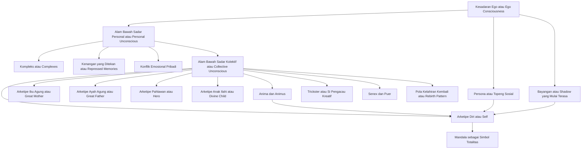
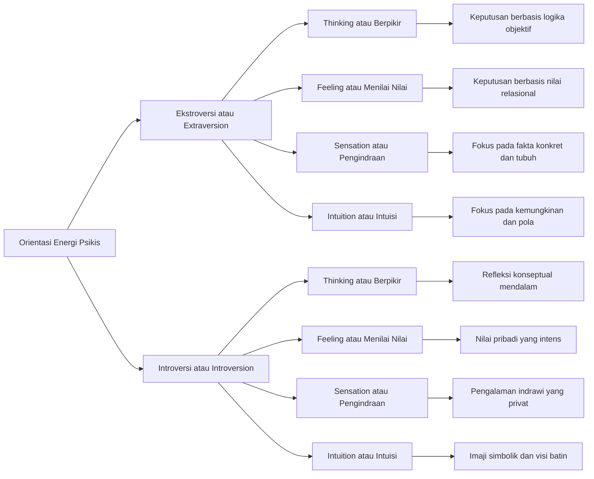
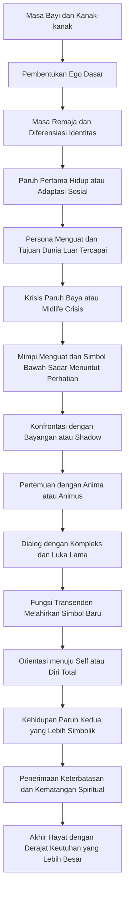
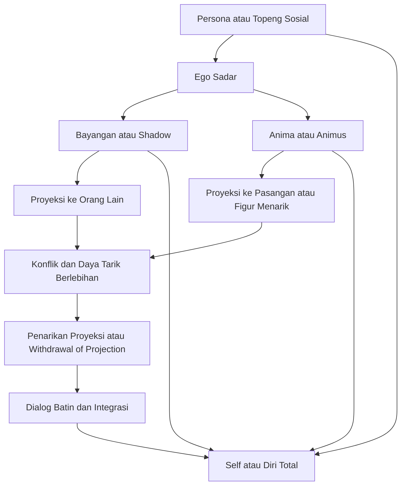
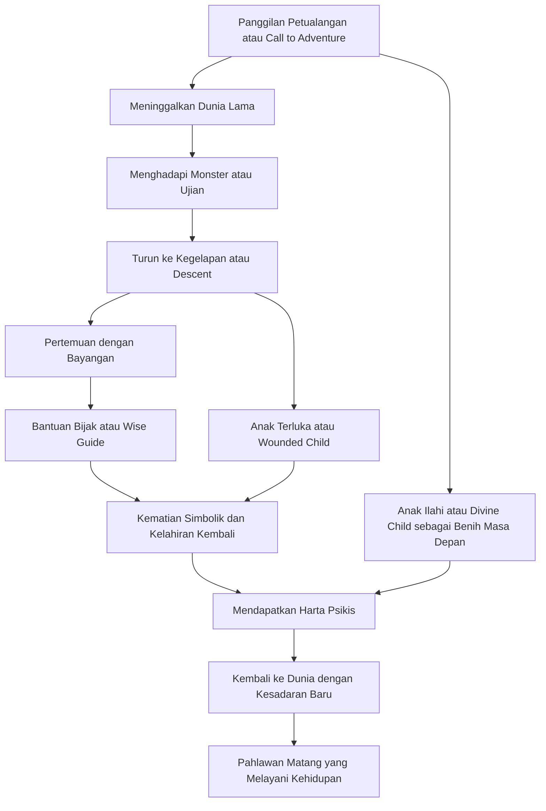
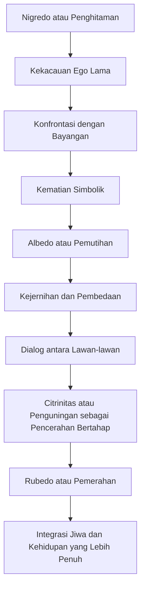

## Pendahuluan — Mengapa Carl Jung Masih Relevan Hari Ini 🧭

Carl Gustav Jung lahir pada tahun 1875 di Kesswil, Swiss, dalam lingkungan keluarga religius dan intelektual. Ayahnya adalah seorang pastor Protestan, sementara atmosfer rumahnya penuh dengan pertanyaan tentang iman, simbol, dan makna hidup. Sejak kecil, Jung tidak hanya tertarik pada dunia luar, tetapi juga pada mimpi, fantasi, dan pengalaman batin yang terasa lebih besar daripada sekadar kehidupan sehari-hari 😊. Dari sinilah benih seluruh pemikirannya mulai tumbuh.

Dalam sejarah psikologi modern, nama Jung hampir selalu muncul berdampingan dengan Sigmund Freud. Itu wajar. Pada awal abad ke-20, Jung sempat menjadi tokoh muda paling menjanjikan dalam gerakan psikoanalisis (*psychoanalysis* = analisis jiwa melalui konflik bawah sadar) yang dipimpin Freud. Freud melihat Jung sebagai penerus intelektualnya; Jung melihat Freud sebagai mentor yang brilian. Namun hubungan itu tidak bertahan lama.

Perpisahan besar mereka memuncak pada tahun 1913. Penyebabnya bukan sekadar konflik pribadi, melainkan perbedaan mendasar tentang hakikat jiwa manusia. Freud cenderung menafsirkan libido (*libido* = energi dorongan psikis) terutama sebagai energi seksual. Jung merasa itu terlalu sempit. Bagi Jung, jiwa manusia tidak bisa direduksi menjadi dorongan seksual dan trauma masa kecil saja. Ada lapisan makna simbolik, dimensi religius, dan struktur universal yang jauh lebih luas 🌌.

Dari krisis intelektual dan eksistensial setelah perpisahan itu, lahirlah apa yang kemudian dikenal sebagai **Psikologi Analitik** (*Analytical Psychology* = aliran psikologi Jung yang menekankan simbol, arketipe, dan proses menjadi utuh). Jung bukan hanya dokter jiwa; ia juga penjelajah simbol, mitos, agama, alkimia, mimpi, budaya, dan misteri batin manusia. Jika Freud menggali konflik personal, Jung menggali peta kosmik jiwa manusia 😌.

<Callout type="info" title="Mengapa Jung Menarik untuk Pembaca Modern?">
Jung relevan karena ia berbicara tentang hal-hal yang terasa sangat kontemporer: identitas, krisis paruh baya, relasi romantis, topeng sosial, trauma keluarga, makna hidup, dan rasa hampa modern. Bahasa Jung kadang puitis dan rumit, tetapi intuisi dasarnya sangat kuat: **manusia tidak sehat hanya karena ia produktif; manusia sehat ketika ia makin utuh** 🌱.
</Callout>

## Model Bawah Sadar Dua Lapis — Personal dan Kolektif 🧠

Salah satu kontribusi terbesar Jung adalah model alam bawah sadar dua lapis. Ia tidak puas dengan anggapan bahwa bawah sadar hanya berisi hal-hal pribadi yang ditekan. Menurut Jung, ada dua wilayah besar yang perlu dibedakan dengan jelas.

Lapisan pertama adalah **alam bawah sadar personal** (*personal unconscious* = bawah sadar pribadi). Di sinilah tersimpan pengalaman yang terlupakan, emosi yang ditekan, kenangan yang memalukan, keinginan yang tidak diakui, dan pola reaksi yang terbentuk dari sejarah hidup individu. Jika seseorang punya rasa takut berlebihan terhadap kritik karena masa kecilnya penuh celaan, jejak itu hidup di wilayah personal ini.

Lapisan kedua jauh lebih radikal: **alam bawah sadar kolektif** (*collective unconscious* = lapisan bawah sadar universal yang diwarisi seluruh umat manusia). Menurut Jung, ada pola-pola dasar dalam jiwa yang tidak dipelajari secara langsung dari lingkungan. Pola itu muncul berulang dalam mimpi, mitologi, agama, dongeng, seni, dan fantasi lintas budaya. Dengan kata lain, manusia modern dan manusia kuno berbagi struktur simbolik tertentu 🌍.

Jung tidak mengatakan bahwa kita mewarisi isi pikiran tertentu seperti file siap pakai. Yang diwarisi adalah **bentuk dasar** atau kecenderungan pola. Mirip seperti tubuh punya cetak biru biologis, jiwa juga punya kecenderungan organisasional. Itulah sebabnya simbol ibu agung, pahlawan, bayangan, perjalanan, kelahiran kembali, dan pusat lingkaran suci muncul lagi dan lagi di tempat yang berjauhan secara budaya.

Diagram di atas membantu melihat arsitektur jiwa versi Jung. Ego berada di permukaan kesadaran. Di bawahnya ada lapisan personal yang memuat pengalaman hidup. Lebih dalam lagi ada lautan kolektif yang memuat arketipe. Dalam kerangka ini, gangguan psikologis tidak selalu berarti “rusak”, melainkan kadang berarti **hubungan antara lapisan-lapisan itu sedang tidak selaras** 😮.

## Arketipe — Pola Universal Manusia Lintas Budaya 🌍

Istilah paling terkenal dari Jung adalah **arketipe** (*archetype* = pola dasar universal dalam jiwa manusia). Arketipe bukan gambar tetap seperti poster, melainkan kecenderungan bentuk yang bisa mengambil banyak rupa. Misalnya, arketipe ibu bisa muncul sebagai ibu kandung, bumi, laut, gua, rumah, Maria, Dewi Durga, atau figur pelindung dalam mimpi. Bentuk luarnya berubah, pola emosional dasarnya tetap.

Jung sampai pada gagasan ini karena ia melihat kemiripan aneh antara mimpi pasien, simbol agama, kisah mitologis, dan dongeng rakyat dari budaya yang berbeda-beda. Bagi Jung, kemiripan itu terlalu konsisten untuk dianggap kebetulan. Arketipe adalah semacam tata bahasa terdalam jiwa manusia. Kita “berbicara” dengannya bahkan ketika tidak sadar.

Ada banyak arketipe, tetapi beberapa yang paling penting adalah Self (*Diri Total*), Shadow (*Bayangan*), Persona (*Topeng Sosial*), Anima, Animus, Great Mother (*Ibu Agung*), Great Father (*Ayah Agung*), Hero (*Pahlawan*), Child (*Anak*), Trickster, Senex, dan Puer. Arketipe-arketipe ini bukan sekadar konsep akademik. Mereka terasa hidup dalam relasi, pilihan, konflik, seni, politik, dan spiritualitas manusia 😌.

<Callout type="important" title="Arketipe Bukan Stereotip">
Arketipe tidak boleh dipahami sebagai label kaku seperti “semua laki-laki begini” atau “semua perempuan begitu”. Arketipe adalah **pola simbolik dinamis**, bukan kotak statis. Kesalahan terbesar dalam membaca Jung adalah mengubah bahasa simbol menjadi dogma sosial yang sempit ⚠️.
</Callout>

## Energi Psikis — Libido Jung sebagai Energi Kehidupan Umum ⚡

Bagi Freud, libido terutama berkaitan dengan energi seksual. Jung memperluasnya. Dalam kerangka Jung, **libido** adalah energi kehidupan umum — daya psikis yang mengalir ke hasrat, keyakinan, kreativitas, ambisi, cinta, religi, dan pencarian makna. Energi ini dapat berpindah fokus. Jika seseorang kehilangan minat pada dunia luar, energi itu mungkin berbalik ke dunia dalam. Jika represi terlalu besar, energi itu bisa muncul sebagai gejala, mimpi, ledakan emosi, atau obsesi.

Jung juga mengembangkan **prinsip kompensasi** (*compensation* = kecenderungan jiwa menyeimbangkan sikap sadar yang terlalu sepihak). Jika kesadaran seseorang terlalu rasional dan kering, mimpi-mimpinya bisa menjadi sangat emosional dan simbolik. Jika persona seseorang terlalu kuat dan sempurna, bayangan yang muncul bisa makin liar. Jiwa, menurut Jung, selalu berusaha memulihkan keseimbangan 😊.

Dari sini lahir konsep **kompleks** (*complex* = gugus emosi, ingatan, dan asosiasi yang mengelilingi tema tertentu). Kompleks seperti pusat gravitasi kecil di dalam psikis. Ia “mencuri” energi dari ego. Misalnya, seseorang dengan kompleks ibu yang belum selesai dapat bereaksi berlebihan pada figur perempuan yang mengasuh, menolak, atau mengontrol.

Ada juga bahaya yang disebut **inflasi psikologis** (*psychological inflation* = kondisi ketika ego mengidentifikasi diri dengan isi bawah sadar yang besar dan merasa diri luar biasa agung). Ini sering terjadi ketika seseorang menyentuh simbol besar tanpa cukup kerendahan hati. Ia merasa dirinya nabi, penyelamat, atau manusia istimewa yang berada di atas orang lain. Dalam bahasa Jung, itu bukan pencerahan matang, melainkan ego yang “kembung” 😵.

## Tipe Psikologis — Ekstroversi dan Introversi 🔄

Jung adalah salah satu pemikir pertama yang merumuskan pembeda besar antara **ekstroversi** (*extraversion* = orientasi energi ke objek, dunia luar, aktivitas, relasi) dan **introversi** (*introversion* = orientasi energi ke subjek, dunia dalam, refleksi, makna pribadi). Penting sekali dicatat: introvert menurut Jung tidak sama dengan pemalu, dan ekstrovert tidak otomatis dangkal. Ini adalah arah dasar energi psikis, bukan penilaian moral.

Tipe ekstrovert cenderung menilai dunia berdasarkan objek, fakta luar, peluang, interaksi, dan kondisi sosial. Tipe introvert cenderung lebih dipandu oleh makna subjektif, refleksi, simbol, dan resonansi batin. Dua orientasi ini bisa sama-sama sehat atau sama-sama problematik. Ekstrovert yang ekstrem bisa kehilangan hubungan dengan jiwa sendiri. Introvert yang ekstrem bisa terputus dari realitas bersama 😌.

Pemahaman ini penting bukan hanya untuk mengenali diri, tetapi juga untuk menghindari konflik relasional yang tidak perlu. Banyak pasangan, tim kerja, bahkan keluarga bertengkar bukan karena niat buruk, melainkan karena **arah energi psikis mereka berbeda**. Satu orang memulihkan energi dengan bicara; yang lain memulihkannya dengan diam.

## Empat Fungsi — Thinking, Feeling, Sensation, Intuition, dan Fungsi Transenden 🔢

Selain orientasi ekstroversi dan introversi, Jung menjelaskan empat fungsi psikologis utama. **Thinking** (*berpikir*), **Feeling** (*menilai nilai*), **Sensation** (*pengindraan*), dan **Intuition** (*intuisi*). Thinking bertanya: apakah ini logis? Feeling bertanya: apakah ini bernilai atau tidak? Sensation bertanya: apa yang sungguh hadir secara konkret? Intuition bertanya: kemungkinan apa yang sedang tumbuh di balik fakta ini?

Jung menolak pandangan bahwa feeling hanyalah emosi liar. Dalam sistemnya, feeling adalah fungsi penilaian yang sah, sama seriusnya dengan thinking. Jika thinking menimbang berdasarkan konsep dan konsistensi logis, feeling menimbang berdasarkan nilai, keharmonisan, dan arti manusiawi. Sering kali masyarakat modern terlalu memuliakan thinking dan meremehkan feeling, padahal banyak keputusan hidup justru hancur ketika feeling ditekan terlalu keras 😔.

Biasanya satu fungsi menjadi dominan, satu menjadi inferior (*inferior function* = fungsi paling lemah dan paling tidak sadar), dan dua lainnya relatif penunjang. Ketidakseimbangan ini menciptakan banyak konflik batin. Seorang pemikir rasional bisa tiba-tiba “dirasuki” ledakan emosi ketika fungsi feeling yang inferior muncul secara mentah.

Jung kemudian berbicara tentang **fungsi transenden** (*transcendent function* = kemampuan psikis untuk melahirkan bentuk baru dari ketegangan dua lawan). Ini bukan fungsi kelima yang terpisah, tetapi proses integratif. Ketika ego tidak buru-buru memilih salah satu kutub, tegangan antara sadar dan tak sadar dapat menghasilkan simbol baru, pemahaman baru, atau jalan hidup baru. Tegangan tidak selalu harus segera dihapus; kadang ia perlu dihidupi agar transformasi lahir ⚖️.

## Kompleks Psikologis — Ketika Tema Emosional Menguasai Jiwa 🧩

Jung meneliti kompleks melalui **eksperimen asosiasi kata** (*word association experiment* = metode memberikan kata rangsang lalu mengukur respons spontan, jeda, dan gangguan). Ketika seseorang mendengar kata tertentu lalu tiba-tiba lambat merespons, salah menyebut, tertawa gugup, atau bereaksi berlebihan, itu mengisyaratkan adanya muatan emosional tersembunyi. Jung melihat bahwa jiwa bukan sekadar sistem rasional yang tenang. Ada “pulau-pulau” emosi yang hidup sendiri.

Kompleks tidak selalu buruk. Ia baru menjadi problem ketika terlalu otonom. Jung bahkan terkenal dengan kalimat bahwa bukan kita yang memiliki kompleks, tetapi sering kali **komplekslah yang memiliki kita** 😅. Saat kompleks aktif, seseorang bisa merasa seperti dirinya berubah. Ia jadi terlalu sensitif, terlalu defensif, terlalu patuh, atau terlalu agresif.

Contoh klasik adalah **mother complex** (*kompleks ibu*). Pada laki-laki, ini bisa muncul sebagai ketergantungan pada figur pengasuh, pencarian pasangan yang mirip ibu, atau penolakan ekstrem terhadap kedekatan. Pada perempuan, kompleks ibu bisa mempengaruhi identitas feminin, relasi, dan sikap terhadap tubuh serta pengasuhan. Ada juga **father complex** (*kompleks ayah*) yang memengaruhi otoritas, prestasi, ketakutan gagal, dan relasi pada aturan.

<Callout type="warning" title="Kompleks Tidak Sama dengan Kelemahan Moral">
Memiliki kompleks bukan berarti seseorang lemah atau rusak. Kompleks adalah bagian dari kehidupan psikis. Yang berbahaya adalah ketika kompleks tidak dikenali, lalu menyamar sebagai “kepribadian normal”. Saat itulah seseorang merasa semua reaksinya wajar, padahal ia sedang digerakkan luka lama 🧩.
</Callout>

## Proses Individuasi — Menjadi Utuh, Bukan Menjadi Sempurna 🌱

Konsep pusat Jung adalah **individuasi** (*individuation* = proses menjadi diri yang utuh melalui integrasi unsur sadar dan tak sadar). Banyak orang salah paham: individuasi bukan individualisme egois, bukan “jadi diri sendiri” dalam arti sesuka hati. Individuasi adalah proses panjang, sering menyakitkan, untuk mengakui bagian-bagian diri yang terpecah lalu mengintegrasikannya dalam totalitas yang lebih matang.

Menurut Jung, proses ini sering menjadi lebih mendesak pada paruh kedua kehidupan. Di masa muda, energi kita biasanya diarahkan untuk membangun ego: sekolah, pekerjaan, status, pasangan, peran sosial. Itu penting. Tetapi pada titik tertentu, strategi yang dulu berhasil mulai terasa kosong. Seseorang bisa sukses secara sosial, tetapi jiwanya merasa gersang. Di situlah panggilan individuasi mulai terdengar 🌿.

Individuasi menuntut keberanian untuk menghadapi bayangan, menarik proyeksi, berdamai dengan luka, mengolah anima atau animus, mengendurkan persona, dan akhirnya bergerak menuju Self. Ini bukan garis lurus. Kadang seseorang maju, lalu mundur, lalu jatuh ke kekacauan, lalu menemukan simbol yang membimbing. Jung tidak menawarkan optimisme murahan. Ia menawarkan peta yang jujur.

## Arketipe Diri — Self sebagai Totalitas Jiwa ☯️

Dalam psikologi Jung, **Self** (*Diri* dengan huruf besar = pusat sekaligus totalitas seluruh jiwa) adalah arketipe tertinggi. Self bukan ego. Ego adalah pusat kesadaran; Self adalah pusat seluruh psikis, termasuk yang tidak sadar. Jika ego berkata “aku”, Self adalah totalitas yang jauh lebih luas yang mengandung ego, tetapi tidak terbatas padanya.

Banyak simbol Self berbentuk pusat yang menyatukan lawan: lingkaran, kuadrat, salib, batu filsuf, anak ilahi, dan terutama **mandala** (*mandala* = gambar melingkar simetris yang melambangkan pusat dan keutuhan). Jung sangat tertarik pada mandala karena ia melihat pola itu muncul spontan dalam mimpi dan gambar pasien saat jiwa sedang berusaha menata diri ulang 😌.

Ketegangan paling penting dalam hidup batin adalah hubungan antara ego dan Self. Ego perlu cukup kuat agar tidak tenggelam dalam kekacauan bawah sadar. Tetapi ego juga perlu cukup rendah hati agar tidak merasa dirinya pusat seluruh semesta. Penderitaan psikologis sering muncul ketika ego terlalu lemah atau terlalu dominan.

<Callout type="success" title="Tujuan Analisis Jungian">
Tujuan akhirnya bukan membunuh ego, melainkan **menempatkan ego pada posisi yang benar**. Ego tetap penting sebagai pengelola hidup sadar, tetapi ia bukan raja mutlak. Saat ego belajar berelasi dengan Self, hidup sering terasa lebih berakar, lebih bermakna, dan tidak terlalu terobsesi pada citra 😌.
</Callout>

## Bayangan — Sisi yang Ditekan, Ditolak, dan Diproyeksikan 🌑

**Shadow** (*bayangan* = aspek kepribadian yang ditolak, ditekan, atau tidak diakui oleh ego) adalah salah satu gagasan Jung yang paling kuat dan paling membebaskan. Bayangan tidak identik dengan kejahatan, walau sering memuat agresi, iri, nafsu, kebencian, atau impuls yang tidak ingin kita akui. Bayangan juga bisa memuat potensi baik yang ditekan: keberanian, kreativitas, sensualitas, ketegasan, bahkan bakat.

Seseorang yang tumbuh dengan citra “harus selalu baik” mungkin menekan kemarahan sehatnya. Ia tampak sopan, tetapi diam-diam pasif-agresif. Seseorang yang mengidentifikasi diri sebagai rasional mungkin menolak kelembutan, puisi, atau kerentanan. Semua yang tidak muat dalam citra sadar cenderung turun ke bayangan 😶.

Masalah paling besar muncul melalui **proyeksi** (*projection* = menempelkan isi psikis diri sendiri kepada orang lain). Apa yang sangat kita benci, kagumi secara obsesif, atau tuduhkan berlebihan kepada orang lain sering kali berkaitan dengan bayangan kita sendiri. Karena itu, Jung menganggap pengenalan bayangan sebagai kerja moral yang sungguh-sungguh. Sulit sekali, tetapi sangat penting.

## Anima dan Animus — Jiwa Kontraseksual dalam Relasi 💑

Jung menggunakan istilah **anima** untuk sisi feminin dalam jiwa laki-laki, dan **animus** untuk sisi maskulin dalam jiwa perempuan. Dalam bahasanya, ini adalah aspek kontraseksual (*contraseuxal aspect* = aspek psikis yang berlawanan dengan identitas gender sadar tradisional). Kerangka ini lahir dari konteks budaya Jung sendiri dan hari ini tentu perlu dibaca secara kritis, tetapi secara simbolik ia tetap berguna.

Anima sering muncul dalam mimpi laki-laki sebagai figur perempuan misterius, inspiratif, erotis, penggoda, penuntun, atau perusak. Animus sering muncul dalam mimpi perempuan sebagai suara pendapat, hakim internal, figur guru, ksatria, atau otoritas batin. Inti gagasan Jung adalah bahwa jiwa punya unsur “yang lain” di dalam dirinya sendiri 🌹.

Dalam hubungan romantis, anima dan animus sangat mudah diproyeksikan. Itulah sebabnya jatuh cinta sering terasa seperti sihir. Kita tidak hanya melihat orang itu apa adanya, tetapi juga menempelkan citra jiwa kita padanya. Pasangan tampak seperti penyelamat, dewi, guru, rumah, atau musuh takdir. Seiring waktu, proyeksi memudar, lalu hubungan diuji: apakah kita bisa mencintai manusia nyata, bukan fantasi kita sendiri? 💞

## Persona — Topeng Sosial yang Perlu, tetapi Berbahaya jika Dianggap Diri Sejati 🎭

**Persona** (*persona* = topeng sosial yang kita gunakan untuk beradaptasi dengan dunia) adalah fungsi yang sangat penting. Tanpa persona, kehidupan sosial akan kacau. Kita butuh peran: guru, dokter, pemimpin, orang tua, teman, profesional. Masalahnya bukan pada adanya persona, melainkan pada **identifikasi berlebihan** dengannya.

Jika seseorang sepenuhnya percaya bahwa topeng sosialnya adalah dirinya yang sejati, jiwanya menjadi kaku. Ia tidak lagi hidup, ia hanya memainkan peran. Dokter yang hanya tahu menjadi “dokter”, ustadz yang hanya tahu menjadi “ustadz”, aktivis yang hanya tahu menjadi “aktivis” bisa kehilangan kontak dengan luka, keraguan, humor, dan kemanusiaannya sendiri 😔.

Di sini muncul pentingnya **ego strength** (*kekuatan ego* = kemampuan ego untuk cukup stabil menanggung konflik tanpa runtuh). Ego yang kuat tidak sama dengan ego besar. Ego yang kuat justru mampu berkata, “Ini peranku, tetapi aku lebih besar dari peran ini.” Persona sehat bersifat fleksibel. Persona tidak sehat menjadi baju zirah yang menyesakkan.

## Arketipe Orang Tua — Great Mother, Great Father, dan Inner Parent 👨‍👩‍👧

Jung dan para penerusnya melihat figur orang tua sebagai inti simbolik yang sangat kuat. **Great Mother** (*Ibu Agung*) dapat muncul dalam bentuk yang memberi kehidupan: mengasuh, memeluk, melindungi, menyuburkan, menyembuhkan. Namun ia juga punya sisi gelap: menelan, mengontrol, melumpuhkan, membuat ketergantungan, atau mencegah pemisahan. Simbolnya bisa berupa bumi, lautan, rahim, rumah, malam, hutan, atau dewi keibuan.

**Great Father** (*Ayah Agung*) melambangkan hukum, struktur, arah, semangat, logos (*logos* = prinsip makna, kata, rasio, keteraturan), perlindungan, dan aspirasi. Tetapi sisi negatifnya dapat menjadi tiranik, dogmatis, menghukum, dingin, dan mematahkan spontanitas. Dalam mitos, figur ayah bisa muncul sebagai raja bijak, dewa langit, patriark, atau hakim.

Dalam bahasa psikologi modern, kita juga bisa berbicara tentang **inner parent** (*orang tua batin* = suara dan pola pengasuhan yang hidup di dalam jiwa). Ketika seseorang terus-menerus mengkritik dirinya seperti orang tua yang kejam, atau menenangkan dirinya seperti orang tua yang hangat, kita sedang melihat dinamika orang tua batin bekerja 🙂.

## Perjalanan Pahlawan dan Arketipe Anak — Pola Universal Pertumbuhan 🦸

Arketipe **Hero** (*Pahlawan*) sangat sentral dalam kisah manusia. Pahlawan muncul ketika ego muda harus melepaskan rumah lama, menghadapi monster, menyeberangi ambang, mengalami luka, lalu kembali membawa sesuatu yang menyelamatkan komunitas. Dalam bahasa Jungian, perjalanan pahlawan adalah drama ego yang berjuang memisahkan diri dari ketidaksadaran awal demi menjadi pribadi yang lebih sadar.

Tetapi Jung juga tertarik pada arketipe **Child** (*Anak*). Ada **Divine Child** (*Anak Ilahi*) yang melambangkan potensi baru, masa depan, keutuhan yang belum lahir, dan benih transformasi. Ada juga **Wounded Child** (*Anak yang Terluka*) yang membawa pengalaman ditolak, diabaikan, dimalukan, atau disakiti. Banyak orang dewasa yang tampak kuat sesungguhnya masih hidup dari luka anak yang tidak pernah diakui 😢.

## Trickster, Penyihir, dan Arketipe Budaya — Kekacauan yang Mengajar 🃏

Tidak semua arketipe rapi dan mulia. Ada figur **Trickster** (*si penipu atau pengacau kreatif*) yang suka melanggar aturan, mengacaukan tatanan, memalukan ego, tetapi justru membuka kemungkinan baru. Dalam mitologi, ia muncul sebagai Loki di tradisi Nordik, Coyote di kisah penduduk asli Amerika, atau Anansi dalam kisah Afrika Barat. Trickster adalah energi ambang: absurd, nakal, erotik, subversif, dan penuh kejutan 😄.

Secara psikologis, trickster muncul ketika sistem yang terlalu kaku perlu diguncang. Ia bisa muncul dalam humor, slip lidah, kekacauan kecil, atau karakter orang yang mengganggu kemapanan. Namun jika tidak diolah, trickster juga bisa jatuh menjadi manipulatif dan destruktif.

Ada pula arketipe **Magician** (*penyihir atau ahli transformasi*). Ia tidak sekadar tahu banyak, tetapi mampu mengubah keadaan melalui pengetahuan simbolik. Dalam bentuk sehat, ia adalah mentor, tabib, alkemis, psikoterapis, atau ilmuwan visioner. Dalam bentuk gelap, ia menjadi manipulator, guru palsu, atau orang yang memakai pengetahuan untuk mengendalikan orang lain.

## Tahapan Kehidupan — Dari Pembangunan Ego ke Kehidupan Simbolik 🕐

Jung memandang kehidupan manusia dalam ritme besar. **Paruh pertama hidup** biasanya ditandai oleh tugas membangun ego: mandiri, bekerja, berpasangan, menemukan tempat dalam masyarakat. Semua ini penting dan sehat. Masalah muncul ketika strategi paruh pertama dipertahankan terus seolah itu satu-satunya tujuan hidup.

**Transisi paruh baya** adalah masa ketika banyak topeng mulai retak. Hal-hal yang dulu memotivasi menjadi hambar. Prestasi tidak lagi memberi rasa cukup. Tubuh berubah. Kematian terasa lebih nyata. Orang mulai bertanya, “Lalu untuk apa semua ini?” Pertanyaan semacam ini bukan tanda gagal. Sering kali ia justru gerbang menuju hidup yang lebih dalam 🙂.

**Paruh kedua hidup** menuntut orientasi baru: bukan hanya ekspansi ke luar, tetapi pendalaman ke dalam. Bukan hanya sukses, tetapi makna. Bukan hanya citra, tetapi jiwa. Dalam bahasa Jung, tugasnya bergeser dari *achievement* (pencapaian) menuju *integration* (integrasi).

## Krisis Paruh Baya — Ketika Bawah Sadar Menagih Perhatian 🌀

Krisis paruh baya sering dipahami secara dangkal: beli mobil mahal, ganti gaya, impulsif, romantisme mendadak. Padahal di akar terdalamnya, **midlife crisis** (*krisis paruh baya*) adalah guncangan arsitektur makna. Jiwa yang selama ini diatur oleh tujuan eksternal mulai menuntut ruang untuk simbol, luka, kerinduan, spiritualitas, dan kematian.

Jika panggilan ini diabaikan, orang bisa menjadi sinis, kaku, atau depresif. Ia tampak masih berfungsi, tetapi di dalamnya ada kekosongan yang meluas. Jika panggilan ini direspons secara matang, krisis bisa menjadi inisiasi. Bukan semua orang harus berubah profesi atau meninggalkan hidup lamanya. Kadang yang berubah adalah kualitas kesadaran dalam menjalani hidup yang sama 😌.

<Callout type="quote" title="Intuisi Dasar Jung tentang Paruh Baya">
Apa yang indah di pagi hari hidup, tidak selalu indah di sore hari hidup. Jiwa memerlukan bentuk baru ketika musim batinnya berubah 🍂.
</Callout>

## Integrasi Lawan-lawan — Tegangan Kreatif sebagai Jalan Transformasi ⚖️

Jung berkali-kali menekankan bahwa pertumbuhan sejati lahir dari perjumpaan dengan **lawan-lawan batin**: sadar dan tak sadar, maskulin dan feminin, pikiran dan perasaan, keteraturan dan spontanitas, tubuh dan roh, individu dan komunitas. Modernitas sering mendidik kita untuk cepat memilih satu sisi dan membuang sisi lainnya. Jung melihat ini sebagai kesalahan besar.

Tegangan antara lawan tidak harus segera diselesaikan secara prematur. Jika ego cukup kuat untuk menahannya, ketegangan itu bisa melahirkan simbol, wawasan, dan keputusan baru melalui fungsi transenden. Inilah mengapa analisis Jungian tidak selalu memberi jawaban cepat. Kadang tugas terapi justru membantu seseorang **bertahan cukup lama di wilayah ambiguitas** sampai sesuatu yang lebih dalam lahir 😊.

Integrasi bukan kompromi murahan, melainkan kelahiran tingkat kesadaran baru. Seorang yang matang tidak lagi sepenuhnya didikte oleh kutub lama. Ia bisa tegas tanpa kejam, lembut tanpa lemah, spiritual tanpa lari dari realitas, rasional tanpa mati rasa.

## Analisis Mimpi — Jalan Kerajaan Menuju Jiwa Menurut Jung 🌙

Freud menyebut mimpi sebagai jalan kerajaan menuju bawah sadar. Jung setuju bahwa mimpi sangat penting, tetapi ia berbeda dalam cara menafsirkannya. Bagi Jung, mimpi bukan hanya penyamaran hasrat terlarang. Mimpi juga bersifat **kompensatoris** (*compensatory* = mengimbangi sikap sadar yang terlalu sepihak), prospektif (*prospective* = mengarah pada kemungkinan masa depan), dan simbolik.

Misalnya, orang yang di siang hari tampak sangat percaya diri bisa bermimpi tersesat, telanjang, atau gagal bicara. Mimpi semacam itu mungkin mengompensasi inflasi ego. Sebaliknya, orang yang terlalu putus asa bisa bermimpi menemukan cahaya, anak kecil, atau rumah baru — simbol bahwa jiwa masih menyimpan potensi masa depan 🌙.

Jung menggunakan metode **amplifikasi** (*amplification* = memperluas makna simbol dengan membandingkannya dengan mitologi, agama, seni, dan asosiasi personal). Jika seseorang bermimpi ular, pertanyaannya bukan cuma “ular berarti hasrat seksual atau tidak?”, tetapi juga: ular dalam hidupmu berarti apa? Dalam budaya apa ia hidup? Apakah ia penyembuh, racun, kebijaksanaan, kelahiran kembali?

Salah satu praktik yang sangat disarankan adalah **jurnal mimpi**. Menuliskan mimpi begitu bangun membantu menjaga relasi dengan bawah sadar. Lama-lama, pola, tokoh, tempat, dan simbol tertentu mulai tampak. Jiwa seolah sedang berbicara dalam bahasanya sendiri ✍️.

## Imajinasi Aktif — Berdialog dengan Figur Bawah Sadar 🎨

**Imajinasi aktif** (*active imagination* = metode Jung untuk berinteraksi secara sadar dengan citra bawah sadar) adalah teknik yang sangat khas. Alih-alih hanya menafsirkan simbol dari jauh, seseorang diajak masuk ke dialog imajinatif dengan figur, tempat, atau peristiwa batin yang muncul. Misalnya, seseorang membayangkan kembali mimpi tentang tokoh tua misterius, lalu menanyakan siapa dia, apa yang ia bawa, dan mengapa ia muncul.

Teknik ini tidak sama dengan lamunan liar. Ia menuntut kesadaran reflektif, pencatatan, dan kemampuan membedakan simbol dari fakta literal. Imajinasi aktif menjadi salah satu jalan utama Jung selama masa krisisnya setelah putus dari Freud. Banyak bahan dari pengalaman ini kemudian tercermin dalam *The Red Book* (*Buku Merah*) 🎨.

Teknik ini bisa diwujudkan melalui menulis dialog, menggambar, melukis, membuat gerak tubuh, atau membangun citra simbolik. Intinya adalah memberi ruang kepada jiwa untuk menampakkan bentuk-bentuknya tanpa langsung disensor oleh rasionalitas sempit.

## Asosiasi Kata dan Teknik Terapeutik — Dari Laboratorium ke Ruang Simbolik 🔬

Jung memulai kariernya dengan sangat ilmiah melalui eksperimen asosiasi kata. Namun terapi Jungian berkembang menjadi pendekatan yang juga sangat simbolik dan kreatif. Selain asosiasi kata dan analisis mimpi, pendekatan Jungian memanfaatkan **sand play** (*permainan pasir* = membangun adegan simbolik di kotak pasir dengan miniatur), **art therapy** (*terapi seni*), gambar mandala, kerja mitologis, dan amplifikasi simbol.

Pendekatan ini berangkat dari keyakinan bahwa jiwa tidak hanya berbicara melalui kalimat logis. Kadang ia berbicara lewat bentuk, warna, ritme, gerak, dan simbol. Bagi klien yang sulit menarasikan trauma atau konflik, media simbolik bisa menjadi jalan yang lebih aman dan lebih jujur 🙂.

## Sinkronisitas — Kebetulan Bermakna yang Tidak Bisa Direduksi Jadi Sebab-Akibat 🌐

Salah satu gagasan Jung yang paling memikat sekaligus paling kontroversial adalah **sinkronisitas** (*synchronicity* = kebetulan bermakna yang tidak berhubungan secara kausal, tetapi terasa berhubungan secara makna). Contoh klasiknya: seseorang bermimpi tentang kumbang emas, lalu di sesi terapi seekor serangga mirip kumbang mengetuk jendela. Secara ilmiah kausal mungkin tak ada hubungan khusus, tetapi secara psikologis momen itu terasa sangat bermakna.

Jung mengembangkan ide ini dalam dialog dengan fisikawan Wolfgang Pauli. Ia menduga bahwa realitas mungkin tidak hanya tersusun oleh hubungan sebab-akibat, tetapi juga oleh pola keterkaitan makna. Ini tentu bukan lisensi untuk menganggap semua kebetulan sebagai pesan kosmik. Namun Jung ingin membuka ruang bahwa **psikis dan dunia kadang tampak bertemu dalam pola yang aneh** 🌌.

Sinkronisitas terutama penting pada masa krisis, perubahan, duka, atau pertumbuhan spiritual. Ketika seseorang sedang sensitif terhadap makna, ia lebih mudah menangkap resonansi antara peristiwa luar dan proses batin. Di tangan yang matang, sinkronisitas memperdalam rasa kagum. Di tangan yang tidak matang, ia bisa berubah menjadi takhayul atau inflasi ego.

## Alkimia dan Psikologi — Nigredo, Albedo, Rubedo sebagai Tahap Transformasi ⚗️

Pada fase akhir kariernya, Jung banyak meneliti **alkimia** (*alchemy* = tradisi transformasi materi yang juga kaya simbol spiritual dan psikologis). Banyak orang menganggap alkimia cuma upaya kuno mengubah timah menjadi emas. Jung melihat lebih dari itu. Baginya, teks alkimia adalah proyeksi simbolik dari proses transformasi jiwa.

Tahap **Nigredo** (*penghitaman*) melambangkan kekacauan, depresi, kebingungan, pembusukan ego lama, dan turunnya seseorang ke kegelapan. Ini fase yang tidak nyaman, tetapi sering tak terhindarkan. Lalu datang **Albedo** (*pemutihan*), ketika kejernihan mulai muncul, perbedaan mulai dikenali, dan kesadaran baru mulai terbentuk. Akhirnya **Rubedo** (*pemerahan*) melambangkan integrasi hidup, kehangatan, vitalitas, dan kesatuan yang lebih matang 🔥.

Jung tidak berkata bahwa semua orang harus membaca kitab alkimia kuno 😄. Ia sedang menunjukkan bahwa manusia sejak lama berusaha memetakan transformasi batin melalui simbol material. Dalam bahasa modern, alkimia adalah puisi psikologi kedalaman.

## Pengalaman Religius dan Spiritualitas — Numinous, Self, dan Imago Dei 🙏

Jung sangat hati-hati terhadap agama sebagai institusi, tetapi sangat serius terhadap **pengalaman religius**. Ia memakai istilah **numinous** (*numinous* = pengalaman yang terasa kudus, menggetarkan, lebih besar daripada ego) untuk menandai momen ketika seseorang tersentuh sesuatu yang melampaui penjelasan biasa. Dalam pengalaman seperti itu, manusia merasa kecil, tetapi sekaligus dipanggil.

Bagi Jung, banyak gejala psikologis modern muncul karena manusia kehilangan relasi dengan dimensi simbolik dan religius hidupnya. Ia tidak otomatis menyuruh semua orang kembali ke dogma lama. Yang ia tekankan adalah bahwa jiwa butuh orientasi pada makna yang lebih tinggi. Jika kebutuhan ini ditekan, ia bisa muncul secara terdistorsi dalam ideologi, fanatisme, obsesi, atau kultus pribadi.

Dalam beberapa konteks, Jung berbicara tentang Self sebagai **imago Dei** (*gambar Tuhan* dalam jiwa). Ini bukan klaim teologis sederhana, melainkan pengamatan bahwa pusat totalitas batin sering dialami dalam simbol religius. Karena itu, batas antara psikologi dan spiritualitas pada Jung memang sengaja dibuat lebih permeabel 🌿.

## Mitologi, Dongeng, dan Simbol Kolektif — Bukti Bawah Sadar Kolektif 📖

Jung membaca mitologi, legenda, dan dongeng bukan sekadar hiburan masa lalu, melainkan arsip psikis umat manusia. Dalam kisah-kisah itu, arketipe beroperasi secara telanjang. Pahlawan, raja tua, ibu agung, naga, hutan gelap, anak ajaib, perjalanan malam, pernikahan sakral, dan kelahiran kembali bukan kebetulan naratif. Mereka adalah pola simbolik yang terus hidup.

Dongeng penting karena ia lebih sederhana daripada teologi atau filsafat, sehingga struktur arketipal tampak lebih jelas. Anak-anak menyukai dongeng bukan hanya karena imajinatif, tetapi karena jiwa mengenali sesuatu yang sangat tua di dalamnya 🙂.

Jung khawatir manusia modern mengalami **symbol poverty** (*kemiskinan simbolik* = kondisi ketika hidup kehilangan bahasa makna yang dalam). Kita dikelilingi informasi, tetapi miskin simbol. Akibatnya, banyak konflik batin kehilangan wadah ekspresi yang menyehatkan. Yang sakral direduksi jadi yang fungsional.

## Kreativitas dan Simbolisme Mandala — Seni sebagai Bahasa Jiwa 🎪

Jung membedakan seni yang terutama psikologis dan seni yang visioner (*visionary art* = seni yang terasa datang dari lapisan lebih dalam dan lebih impersonal). Dalam seni visioner, arketipe berbicara lebih langsung. Itulah sebabnya karya-karya tertentu terasa “lebih besar” daripada biografi penciptanya sendiri.

**Mandala** menjadi simbol yang sangat penting. Bagi Jung, kemunculan spontan pola lingkaran berpusat dalam gambar pasien menandakan proses penataan ulang psikis. Mandala tidak harus religius secara formal. Ia bisa muncul sebagai dorongan menggambar pola simetris, menata ruang, menciptakan ritme, atau mencari pusat di tengah kekacauan 🎨.

<Callout type="tip" title="Latihan Jungian yang Sederhana">
Ketika hidup terasa tercerai-berai, cobalah menggambar mandala sederhana tanpa mengejar hasil artistik. Bukan untuk pamer, tetapi untuk mendengar bagaimana jiwa ingin menata dirinya. Kadang proses kecil seperti ini lebih jujur daripada seribu nasihat motivasi 😊.
</Callout>

## Neurosis, Psikosis, dan Kesehatan Mental — Gejala sebagai Pesan 🏥

Jung memandang **neurosis** (*neurosis* = konflik batin yang menghasilkan gejala seperti kecemasan, obsesi, depresi ringan, atau fobia) bukan sekadar gangguan yang harus disingkirkan secepat mungkin. Gejala sering kali adalah upaya jiwa untuk menyampaikan sesuatu yang diabaikan kesadaran. Jika pesan itu tidak didengar, gejala berulang.

Ini tidak berarti gejala romantis atau tidak perlu ditangani secara medis. Bukan begitu. Jung tetap seorang psikiater. Tetapi ia menolak pandangan yang hanya ingin membungkam gejala tanpa mendengarkan maknanya. Dalam banyak kasus, neurosis muncul ketika seseorang hidup terlalu jauh dari struktur terdalam dirinya.

Untuk **psikosis** (*psychosis* = kondisi ketika hubungan ego dengan realitas terganggu berat), Jung lebih berhati-hati. Ia melihat bahwa simbol dan arketipe bisa membanjiri ego sampai orang sulit membedakan dunia batin dan dunia luar. Di sini pekerjaan terapi dan dukungan medis menjadi jauh lebih kompleks. Tidak semua orang siap menanggung kedalaman simbolik yang terlalu intens.

## Proyeksi, Transferensi, dan Dinamika Hubungan — Relasi sebagai Cermin 🔗

Dalam terapi maupun kehidupan biasa, orang tidak pernah berhubungan murni dengan orang lain sebagaimana adanya. Kita selalu membawa proyeksi, harapan, luka, dan citra. Dalam ruang terapi, ini disebut **transferensi** (*transference* = pemindahan pola emosional lama kepada terapis). Terapis juga bisa bereaksi dari wilayah tak sadarnya sendiri, yang disebut **countertransference** (*kontratransferensi*).

Jung melihat dinamika ini bukan sekadar gangguan teknis, tetapi bagian penting dari proses. Relasi terapeutik menjadi wadah tempat arketipe, kompleks, dan luka lama termanifestasi dengan aman. Namun tujuan akhirnya bukan membuat klien bergantung pada terapis, melainkan membantu ia melakukan **penarikan proyeksi** dan memiliki kembali bagian-bagian dirinya 🙂.

Pelajaran ini berlaku luas: dalam cinta, pertemanan, pekerjaan, bahkan konflik politik. Kita sering bertengkar bukan hanya dengan orang itu, tetapi dengan proyeksi yang menempel padanya.

## Pengaruh Filsafat Timur — Hindu, Buddha, dan Taoisme 🔮

Jung tertarik pada tradisi Timur karena ia melihat ada bahasa psikologis yang kaya di sana, walaupun kadang ia membacanya dari sudut pandang Barat. Ia mempelajari simbol-simbol Hindu, Buddha, dan Taoisme, terutama gagasan tentang kesatuan lawan, meditasi, pusat batin, dan transformasi kesadaran.

Simbol **Yin-Yang** dalam Taoisme menarik bagi Jung karena mencerminkan pandangannya tentang polaritas. Kehidupan tidak bergerak melalui pemusnahan lawan, tetapi melalui ritme lawan yang saling mengandung. Konsep **wu wei** (*bertindak tanpa memaksa*) juga beresonansi dengan gagasan bahwa pertumbuhan psikis tidak selalu terjadi melalui kontrol ego yang keras 😊.

Meski demikian, Jung mengingatkan bahwa orang Barat tidak bisa sekadar mengimpor praktik Timur tanpa konteks. Struktur jiwa, sejarah budaya, dan simbol batin tiap masyarakat berbeda. Karena itu, perjumpaan Timur-Barat harus dilakukan dengan rendah hati, bukan sekadar konsumsi spiritual yang dangkal.

## Psikologi Budaya dan Perilaku Kolektif — Collective Shadow dan Nazisme 🌐

Jung tidak hanya memikirkan individu. Ia juga berbicara tentang **collective shadow** (*bayangan kolektif* = aspek gelap yang ditolak oleh kelompok, bangsa, atau peradaban). Ketika bayangan kolektif diproyeksikan ke kelompok lain, lahirlah demonisasi, kebencian massal, fanatisme, dan kekerasan sistemik.

Pengalamannya hidup di Eropa pada masa perang membuat Jung sadar bahwa bangsa modern yang merasa beradab pun bisa dirasuki arketipe gelap. Analisisnya tentang Nazisme sering dibaca melalui lensa ini: bukan sekadar ideologi rasional, tetapi juga letusan energi arketipal, proyeksi bayangan, inflasi kolektif, dan pemujaan figur penyelamat 😔.

Pandangan ini tetap relevan hari ini. Masyarakat modern suka membayangkan bahwa barbarisme hanya milik masa lalu. Jung akan berkata: jangan terlalu yakin. Jika bayangan kolektif tidak dikenali, ia bisa kembali memakai baju baru.

## The Red Book — Catatan Turun ke Dunia Dalam 📕

Setelah perpisahan dengan Freud pada 1913, Jung mengalami periode krisis yang sangat intens. Ia melihat penglihatan, mimpi, figur batin, dan adegan imajinal yang begitu kuat hingga ia sendiri khawatir tentang kewarasannya. Namun ia memilih tidak lari. Ia mencatat, menggambar, dan berdialog dengan pengalaman-pengalaman itu selama kira-kira 1913 sampai 1930.

Hasilnya adalah **The Red Book** (*Liber Novus* = Buku Baru), karya monumental yang baru diterbitkan luas pada 2009. Buku ini bukan teks ilmiah biasa. Ia adalah perpaduan antara jurnal visioner, dialog batin, kaligrafi, lukisan, dan eksplorasi spiritual-psikologis. Di dalamnya muncul figur penting seperti **Philemon**, sosok bijak batin yang sangat mempengaruhi pemikiran Jung 🕯️.

The Red Book penting karena memperlihatkan bahwa teori Jung tidak lahir hanya dari spekulasi akademik. Ia lahir dari konfrontasi hidup dengan kedalaman jiwa sendiri. Itu membuat pemikirannya terasa punya bobot eksistensial.

## UFO sebagai Fenomena Psikologis — Langit sebagai Layar Proyeksi 🛸

Pada masa modern, Jung tertarik pada fenomena **UFO** (*unidentified flying object* = objek terbang tak dikenal), bukan terutama sebagai persoalan teknologi luar angkasa, melainkan sebagai fenomena psikologis. Mengapa begitu banyak orang modern melihat atau membayangkan bentuk lingkaran bercahaya dari langit pada masa kecemasan global? Jung menduga ada unsur proyeksi arketipal di sana.

Bentuk UFO yang melingkar sangat mudah diasosiasikan dengan simbol mandala dan Self. Dalam dunia yang makin terpecah, dingin, dan teratomisasi, manusia mungkin merindukan tanda totalitas dari langit. Jadi, bagi Jung, pertanyaan tentang UFO tidak berhenti pada “benar ada atau tidak”, tetapi juga “mengapa simbol ini begitu memikat kesadaran modern?” 🌌.

## Senex dan Puer — Tua yang Kaku, Muda yang Tak Mau Turun ke Bumi 👴👦

Dua arketipe penting dalam perkembangan kepribadian adalah **Senex** (*orang tua tua, prinsip struktur, batas, disiplin, waktu*) dan **Puer Aeternus** (*anak muda abadi, prinsip kemungkinan, spontanitas, mimpi, dan kebebasan). Senex yang sehat memberi bentuk, komitmen, ketahanan, dan tanggung jawab. Senex yang sakit menjadi sinis, kaku, dingin, dan pesimis.

Puer yang sehat membawa kreativitas, harapan, permainan, visi, dan rasa petualangan. Tetapi puer yang tidak matang sulit berkomitmen, takut rutinitas, takut turun ke realitas, dan selalu mengejar kemungkinan baru tanpa menubuhkannya. Banyak orang dewasa modern hidup dalam tegangan ini 😅.

Integrasi keduanya sangat penting. Kita butuh cukup puer untuk hidup tetap segar, dan cukup senex untuk mewujudkan mimpi menjadi bentuk nyata.

## Arketipe Psychoid dan Kesatuan Pikiran-Materi — Bersama Wolfgang Pauli 🔭

Jung kemudian mengembangkan gagasan tentang lapisan **psychoid** (*psychoid* = tingkat realitas yang berada di ambang antara psikis dan material, belum sepenuhnya bisa dibedakan secara tegas). Di wilayah ini, simbol, sinkronisitas, dan struktur realitas tampak saling bersentuhan. Ide ini berkembang dalam dialognya dengan fisikawan Wolfgang Pauli.

Tentu Jung bukan fisikawan kuantum, dan banyak orang menyalahgunakan namanya untuk pseudo-sains. Namun intuisi dasarnya menarik: mungkin pembelahan tajam antara “pikiran” dan “materi” tidak sepenuhnya memadai. Mungkin ada dasar pola yang lebih dalam, tempat keduanya berakar. Gagasan ini belum menjadi sains mapan, tetapi secara filosofis sangat subur 🤔.

## Kehidupan Simbolik — Tanda, Simbol, dan Kemiskinan Makna 💎

Jung membedakan **tanda** (*sign* = sesuatu yang menunjuk secara jelas pada arti tertentu yang sudah diketahui) dan **simbol** (*symbol* = sesuatu yang menunjuk pada makna yang belum habis dipahami, lebih besar dari definisi tunggal). Lampu merah adalah tanda. Mandala, salib, naga, pohon kehidupan, atau laut dalam mimpi adalah simbol.

Masalah modernitas, menurut Jung, adalah kita sangat kaya tanda, tetapi miskin simbol. Hidup menjadi efisien, tetapi tidak bermakna. Kita tahu cara mengoperasikan alat, tetapi tidak tahu bagaimana menanggung penderitaan, merayakan transisi hidup, atau memaknai kematian. Inilah yang ia sebut sebagai krisis kehidupan simbolik 😔.

Kehidupan simbolik bukan berarti hidup mistik tanpa nalar. Artinya, kita memberi ruang bagi mimpi, ritual, seni, doa, refleksi, mitos, dan pengalaman makna agar jiwa tidak mengering.

## Tipe dalam Hubungan dan Tim — Dari MBTI sampai Psychological Generosity 🤝

Pemikiran Jung tentang tipe psikologis kemudian menginspirasi berbagai alat populer, terutama **MBTI** (*Myers-Briggs Type Indicator* = instrumen tipologi kepribadian yang diturunkan dari gagasan Jung). Walau MBTI sering disederhanakan secara berlebihan di internet, akar intuisinya tetap berguna: manusia memang berbeda dalam cara memproses informasi, mengambil keputusan, dan memulihkan energi.

Dalam hubungan dan tim, manfaat terbesar tipologi bukanlah memberi label keren, melainkan menumbuhkan **psychological generosity** (*kelapangan psikologis* = kesediaan memahami bahwa cara orang lain berbeda tanpa langsung menganggapnya salah). Orang sensing mungkin merasa orang intuition terlalu mengawang. Orang intuition merasa orang sensing terlalu sempit. Orang thinking merasa feeling terlalu subjektif. Orang feeling merasa thinking terlalu dingin. Semua konflik ini bisa melunak ketika orang sadar: perbedaan fungsi bukan cacat, melainkan variasi struktur 🙂.

Tim yang efektif sering bukan tim yang anggotanya seragam, tetapi tim yang mampu mengolah perbedaan tipe tanpa saling merendahkan.

## Warisan dan Aplikasi Modern — Dari Jungian Analysis ke Trauma Therapy dan Organisasi 🏆

Warisan Jung sangat luas. Di klinik, **Jungian Analysis** (*analisis Jungian* = terapi kedalaman yang menggunakan mimpi, simbol, transferensi, dan proses individuasi) masih dipraktikkan di banyak negara. Dalam dunia trauma, meski pendekatan Jung klasik perlu dipadukan dengan ilmu saraf modern, gagasannya tentang tubuh simbolik, kompleks, dan fragmentasi jiwa tetap berpengaruh.

Di bidang organisasi dan kepemimpinan, ide tentang persona, bayangan, proyeksi, dan tipe psikologis membantu membaca dinamika kekuasaan, budaya kerja, dan burnout. Dalam seni, sastra, film, dan desain naratif, arketipe Jung hampir mustahil diabaikan. Dalam spiritualitas modern, gagasannya tentang Self, numinous, dan simbol menjadi jembatan antara psikologi dan pencarian makna 🌿.

Namun warisan Jung juga perlu dibaca kritis. Beberapa formulasi gendernya lahir dari konteks zamannya. Sebagian penafsir modern menyederhanakan Jung menjadi astrologi psikologis atau kutipan motivasi yang kabur. Karena itu, membaca Jung dengan serius berarti memegang dua hal sekaligus: kekaguman dan ketelitian.

<Callout type="important" title="Kesimpulan Besar tentang Jung">
Jung mengingatkan bahwa menjadi manusia bukan hanya soal berfungsi, tetapi soal **menjadi utuh**. Kita bukan mesin produktivitas. Kita adalah makhluk simbolik yang punya mimpi, luka, bayangan, panggilan, dan kemungkinan untuk bertumbuh menuju pusat yang lebih dalam 🌌.
</Callout>

## Glosarium Jungian — 40+ Istilah Penting yang Perlu Dipahami 📚

1. **Psikologi Analitik** — Aliran psikologi Jung yang menekankan simbol, arketipe, mimpi, dan proses individuasi.
2. **Ego** — Pusat kesadaran, bagian diri yang berkata “aku” dalam kehidupan sehari-hari.
3. **Self** — Totalitas jiwa sekaligus pusat terdalam psikis yang melampaui ego.
4. **Personal Unconscious** — Alam bawah sadar pribadi yang berisi kenangan, represi, dan pengalaman individual.
5. **Collective Unconscious** — Lapisan bawah sadar universal yang diwarisi bersama umat manusia.
6. **Arketipe** — Pola dasar universal yang muncul dalam mimpi, mitos, agama, dan budaya.
7. **Persona** — Topeng sosial yang dipakai untuk beradaptasi dengan dunia.
8. **Shadow** — Bagian diri yang ditekan, ditolak, atau tidak diakui oleh kesadaran.
9. **Anima** — Sisi feminin dalam jiwa laki-laki menurut model simbolik Jung.
10. **Animus** — Sisi maskulin dalam jiwa perempuan menurut model simbolik Jung.
11. **Libido** — Energi psikis umum, bukan hanya dorongan seksual.
12. **Complex** — Gugus emosi, ingatan, dan asosiasi yang mengelilingi tema tertentu.
13. **Mother Complex** — Pola psikis yang berpusat pada relasi dan citra ibu.
14. **Father Complex** — Pola psikis yang berpusat pada relasi dan citra ayah.
15. **Compensation** — Mekanisme psikis yang menyeimbangkan sikap sadar yang terlalu sepihak.
16. **Inflation** — Kondisi ketika ego merasa dirinya besar karena mengidentifikasi diri dengan isi bawah sadar yang agung.
17. **Projection** — Menempelkan isi psikis sendiri kepada orang lain.
18. **Withdrawal of Projection** — Menarik kembali proyeksi agar seseorang melihat orang lain lebih realistis.
19. **Individuation** — Proses menjadi utuh melalui integrasi unsur sadar dan tak sadar.
20. **Numinous** — Pengalaman yang terasa kudus, menggetarkan, dan melampaui ego.
21. **Mandala** — Simbol melingkar berpusat yang melambangkan totalitas dan keteraturan jiwa.
22. **Transcendent Function** — Proses yang melahirkan bentuk baru dari tegangan dua lawan psikis.
23. **Extraversion** — Orientasi energi ke dunia luar, objek, dan interaksi.
24. **Introversion** — Orientasi energi ke dunia dalam, refleksi, dan makna subjektif.
25. **Thinking** — Fungsi untuk menilai berdasarkan logika dan konsep.
26. **Feeling** — Fungsi untuk menilai berdasarkan nilai, relasi, dan arti manusiawi.
27. **Sensation** — Fungsi yang berhubungan dengan fakta konkret dan pengindraan.
28. **Intuition** — Fungsi yang menangkap kemungkinan, pola, dan makna implisit.
29. **Inferior Function** — Fungsi psikologis paling lemah dan paling tidak sadar.
30. **Word Association Test** — Tes asosiasi kata untuk mendeteksi kompleks emosional.
31. **Amplification** — Metode memperluas makna simbol melalui mitologi, budaya, dan asosiasi personal.
32. **Active Imagination** — Teknik berdialog sadar dengan citra bawah sadar.
33. **Synchronicity** — Kebetulan bermakna tanpa hubungan sebab-akibat langsung.
34. **Nigredo** — Tahap penghitaman dalam alkimia yang melambangkan kekacauan dan kematian simbolik.
35. **Albedo** — Tahap pemutihan yang melambangkan kejernihan dan pembedaan.
36. **Rubedo** — Tahap pemerahan yang melambangkan integrasi dan vitalitas baru.
37. **Citrinitas** — Tahap penguningan yang menandai pencerahan bertahap dalam simbolisme alkimia.
38. **Great Mother** — Arketipe ibu agung yang bisa mengasuh atau menelan.
39. **Great Father** — Arketipe ayah agung yang memberi hukum atau menjadi tiranik.
40. **Hero** — Arketipe pahlawan yang menempuh ujian demi pertumbuhan kesadaran.
41. **Divine Child** — Arketipe anak ilahi yang melambangkan potensi masa depan dan harapan.
42. **Wounded Child** — Aspek anak yang terluka dan mempengaruhi hidup dewasa.
43. **Trickster** — Arketipe pengacau kreatif yang meruntuhkan kemapanan.
44. **Magician** — Arketipe transformator yang memahami perubahan simbolik.
45. **Senex** — Prinsip tua yang membawa struktur, waktu, dan tanggung jawab.
46. **Puer Aeternus** — Prinsip anak muda abadi yang membawa kemungkinan dan kebebasan.
47. **Collective Shadow** — Aspek gelap yang ditolak oleh kelompok atau budaya.
48. **Transferensi** — Pemindahan pola emosi lama kepada figur masa kini, terutama terapis.
49. **Countertransference** — Respons emosional terapis terhadap proyeksi klien.
50. **Symbol Poverty** — Kemiskinan simbolik, keadaan ketika hidup kehilangan bahasa makna mendalam.
51. **Imago Dei** — Gambar Tuhan dalam jiwa, istilah yang kadang dipakai Jung untuk menyinggung pengalaman Self.
52. **Psychoid** — Wilayah ambang antara psikis dan material dalam teori akhir Jung.
53. **Visionary Art** — Seni visioner yang terasa muncul dari lapisan arketipal yang lebih dalam.
54. **Life Symbolic** — Kehidupan simbolik, hidup yang memberi ruang bagi makna, ritus, dan pengalaman batin.

## Penutup — Jung dan Tugas Menjadi Manusia 🌌

Jika ada satu kalimat yang merangkum seluruh visi Jung, mungkin ini: **masalah terbesar manusia modern bukan hanya stres, tetapi keterputusan dari jiwa**. Kita tahu cara bekerja, tetapi tidak tahu cara bermimpi. Kita tahu cara tampil, tetapi tidak tahu cara menjadi. Kita tahu cara mengukur, tetapi lupa cara memaknai.

Jung tidak memberi resep instan. Ia tidak menjanjikan hidup tanpa konflik. Justru sebaliknya, ia mengajak kita mengakui bahwa konflik, mimpi, luka, cinta, simbol, dan krisis adalah bahan mentah dari transformasi. Yang diminta dari kita bukan kesempurnaan, melainkan keberanian untuk jujur pada kedalaman diri sendiri 😊.

Pada akhirnya, membaca Jung bukan hanya membaca teori psikologi. Ia seperti diajak menatap cermin yang lebih tua dan lebih dalam dari biografi pribadi kita. Cermin itu memantulkan bahwa di balik topeng, kecemasan, ambisi, dan drama hidup sehari-hari, ada gerak perlahan menuju keutuhan. Dan mungkin, justru di sanalah martabat manusia yang paling indah berada 🌱.
