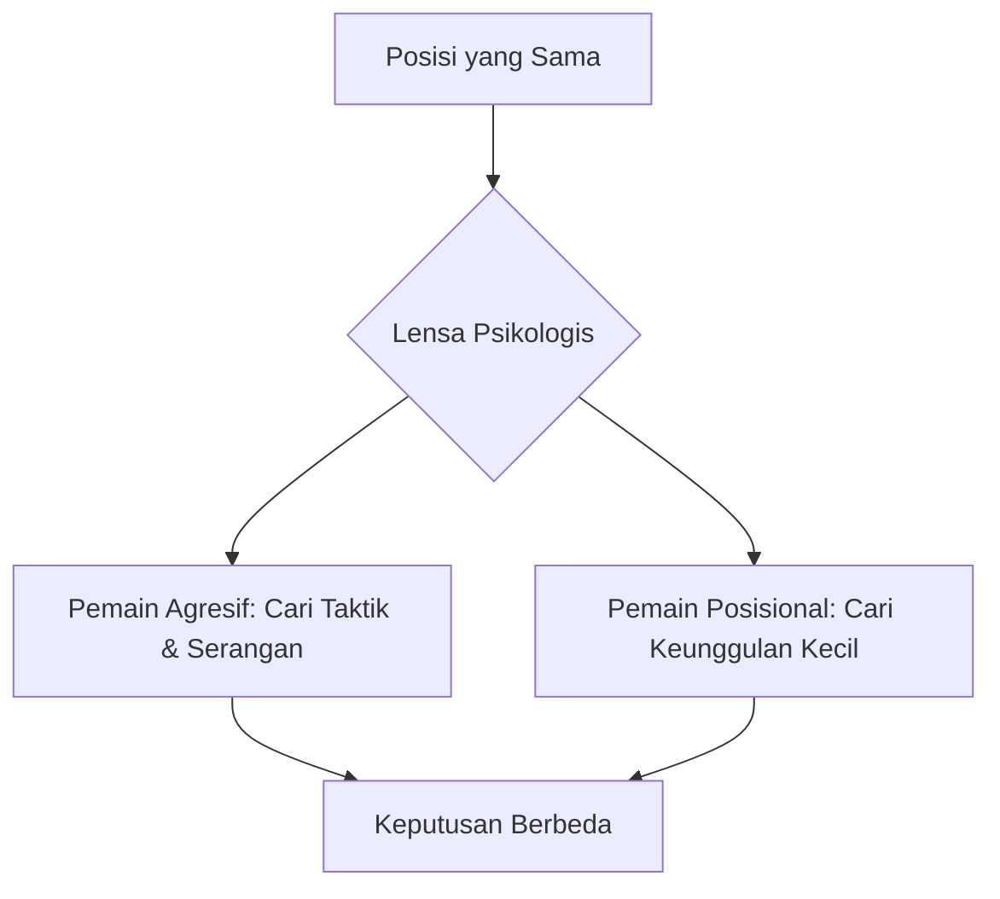
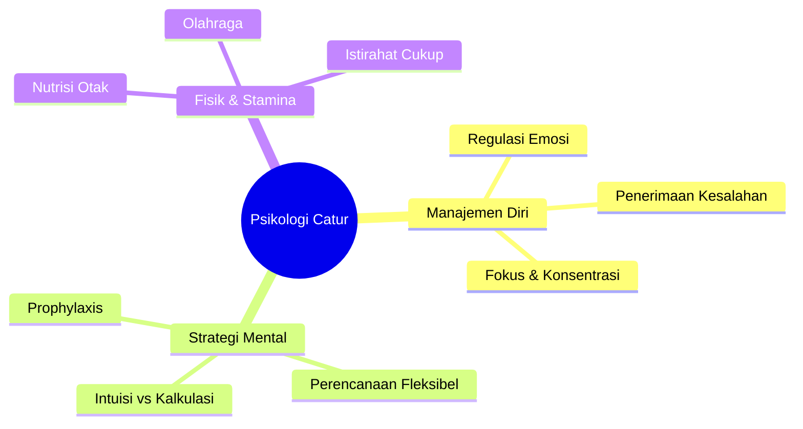

Catur sering kali dianggap sebagai permainan logika murni. Namun, jika kita melihat lebih dekat, catur adalah potret pengalaman manusia yang dikompresi ke dalam 64 kotak. Di balik setiap langkah, terdapat jalinan emosi, kalkulasi, harapan, dan ketakutan.

<Callout type="abstract" title="Ringkasan Eksekutif">
Artikel ini mengeksplorasi dimensi psikologis dalam catur, menjelaskan mengapa ketenangan mental (*psychological steadiness*) sering kali lebih menentukan daripada kemampuan taktis mentah. Kita akan membedah bagaimana para legenda seperti Magnus Carlsen dan Garry Kasparov mengelola tekanan, serta bagaimana kita bisa menerapkan prinsip-prinsip ini dalam kehidupan sehari-hari.
</Callout>

## 1. Papan Catur sebagai Metafora Kehidupan ♟️

Catur bukan sekadar memindahkan bidak; ia adalah simulasi pengambilan keputusan di bawah tekanan. Setiap bidak memiliki peran yang mencerminkan elemen dalam hidup kita:

- **Pion (Pawns):** Mewakili langkah-langkah kecil sehari-hari yang kita ambil.
- **Kuda (Knights):** Simbol lompatan kreatif dalam pemecahan masalah.
- **Menteri (Queen):** Melambangkan ambisi, intuisi, dan kapabilitas yang luas.

Ketika elemen-elemen ini bekerja dalam harmoni, kesuksesan menjadi mungkin. Strategi catur mengajarkan kita untuk menganalisis risiko, mengantisipasi oposisi, dan memupuk kesabaran (*patience*).

## 2. Antara Keteraturan (Order) dan Kekacauan (Chaos) 🌀

Meskipun papan catur memiliki geometri yang bersih (8 baris, 8 kolom), kompleksitas muncul segera setelah bidak bergerak. Dalam catur, terdapat **Pengetahuan Sempurna** (*Perfect Knowledge*)—tidak ada kartu tersembunyi, tidak ada *fog of war*. Namun, kejelasan ini justru mempertegas kerumitan pengambilan keputusan manusia.

<Callout type="info">
Dua pemain dapat melihat posisi yang sama tetapi mengambil keputusan yang drastis berbeda. Satu orang mungkin melihat pengorbanan yang berani (*bold sacrifice*), sementara yang lain melihat perbaikan posisi yang lambat (*positional improvement*).
</Callout>

## 3. Seni Perencanaan (Planning) 🗺️

Miskonsepsi umum adalah bahwa pemain elit langsung melihat langkah terbaik. Kenyataannya, catur tingkat atas adalah tentang menciptakan beberapa tujuan strategis (*strategic objectives*), tetap fleksibel, dan siap untuk berputar (*pivot*) jika keadaan berubah.

### Gaya Magnus Carlsen: Akumulasi Keunggulan Kecil
Magnus Carlsen dikenal karena kemampuannya dalam fase akhir permainan (*endgame prowess*). Ia menetapkan masalah kecil dan halus bagi lawannya, mengumpulkan keunggulan sedikit demi sedikit—mungkin struktur pion yang lebih baik atau keunggulan dalam pengembangan (*lead in development*).

**Pelajaran untuk Hidup:**
Adopsi perencanaan ini berarti menetapkan tujuan inkremental (*incremental goals*), mencari peningkatan dalam langkah-langkah kecil, dan tetap gigih ketika kemajuan tampak tidak terlihat.

## 4. Perjuangan Melawan Kesalahan (Struggle Against Error) ⚠️

Filsuf Jerman dan penggemar catur, **Emanuel Lasker**, menyatakan bahwa catur adalah perjuangan melawan kesalahan. Setiap langkah bertujuan untuk memperbaiki atau mencegah kesalahan sambil mencoba memicu kesalahan pada lawan.

### Menghadapi Blunder (Handling Blunders)
Kesalahan besar (*blunders*) pasti terjadi. Secara psikologis, ada kecenderungan untuk spiral: Anda membuat satu kesalahan, lalu panik, dan membuat blunder lainnya.

| Langkah Penanganan | Penjelasan (Indo - English) |
| :--- | :--- |
| **Acceptance** | **Penerimaan:** Mengakui kesalahan segera untuk membebaskan pikiran. |
| **Damage Control** | **Kontrol Kerusakan:** Fokus pada cara mempersulit lawan mengonversi keunggulan. |
| **Rebound** | **Bangkit Kembali:** Mengalihkan kritik diri menjadi pemecahan masalah konstruktif. |

## 5. Intuisi vs Kalkulasi: Keseimbangan Agung ⚖️

Pemain berpengalaman menggunakan kombinasi antara:
1. **Intuisi:** Perasaan dari "perut" (*gut feeling*) bahwa sebuah langkah itu benar berdasarkan pengenalan pola (*pattern recognition*).
2. **Kalkulasi:** Proses metodis memeriksa variasi langkah demi langkah untuk memverifikasi intuisi tersebut.

Terlalu bergantung pada intuisi bisa membuat kita melewatkan detail defensif lawan. Sebaliknya, terlalu banyak kalkulasi bisa menyebabkan kehabisan waktu (*time trouble*) dan kelelahan mental.

<Callout type="tip" title="Titik Temu (The Sweet Spot)">
Gunakan intuisi untuk mengarahkan kita pada beberapa kandidat langkah, lalu gunakan kalkulasi untuk memurnikan pilihan tersebut.
</Callout>

## 6. Regulasi Emosi di Papan Catur 🌡️

Kemampuan mengelola emosi adalah seni tersembunyi dari penguasaan catur. Emosi bisa melonjak setelah kesalahan taktis atau manuver brilian lawan.

- **Confidence (Kepercayaan Diri):** Penting untuk menemukan langkah yang merebut inisiatif.
- **Overconfidence (Terlalu Percaya Diri):** Bisa membutakan kita terhadap reputasi sederhana dari lawan.
- **Resilience (Resiliensi):** Kemampuan untuk terus bertarung meski dalam posisi kalah, berharap tekanan atau kepuasan diri lawan membuatnya tersandung.

## 7. Prophylaxis: Mencegah Sebelum Terjadi 🛡️

Konsep strategis **Prophylaxis** adalah langkah yang bertujuan mencegah rencana lawan sebelum dimulai. Legenda **Tigran Petrosian** dikenal karena kemampuan "psikis"-nya dalam menetralisir ancaman secara preemptif.

Dalam hidup, ini berarti **Berpikir Antisipatif**:
- Mengupdate *skill set* sebelum melamar peran baru.
- Membangun dana darurat (*emergency fund*) sebelum krisis finansial datang.

## 8. Dimensi Holistik: Tubuh dan Pikiran 🏃‍♂️

Catur tingkat tinggi adalah maraton pikiran. Seorang pemain bisa membakar ratusan kalori per pertandingan karena proses mental yang intens dan detak jantung yang meningkat.

1. **Stamina:** Menjaga intensitas berpikir selama 4-5 jam.
2. **Nutrisi:** Makanan dengan indeks glikemik rendah untuk menjaga gula darah tetap stabil.
3. **Olahraga:** Aliran darah yang lebih baik berarti lebih banyak oksigen ke otak.

## Kesimpulan: Penguasaan atas Kompleksitas 🌟

Catur mengajarkan kita bahwa penguasaan atas kompleksitas melibatkan perspektif holistik dan perhatian pada detail. Kita butuh gambaran besar (*big picture*)—ke mana hidup kita menuju—dan kesadaran mikro akan setiap ancaman dan peluang.

Papan catur adalah laboratorium yang aman untuk menguji dan memurnikan strategi yang akan kita andalkan di dunia yang lebih luas. Ingatlah, kekalahan sementara dapat dibalik menjadi keuntungan jika kita cukup jeli melihat peluang.

---

> [!quote] Kutipan Penutup
> "I don't believe in psychology, I believe in good moves." — **Bobby Fischer**. 
> Namun, ironisnya, kepercayaan diri Fischer yang tak tergoyahkan adalah senjata psikologis terbesarnya yang membuat lawan-lawannya gentar.
