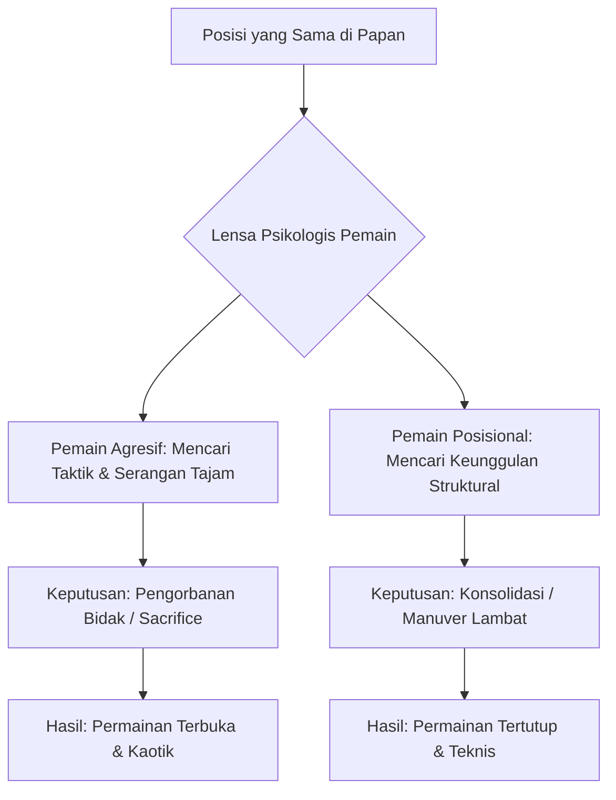
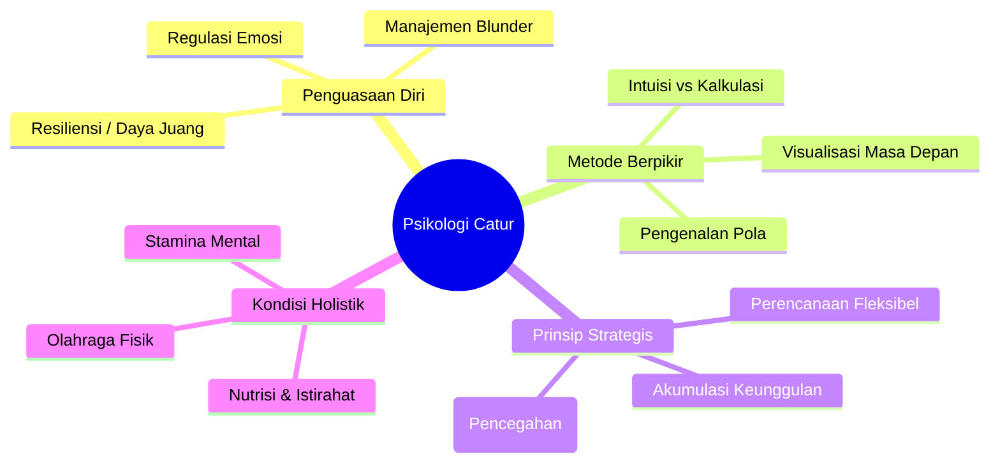

Catur sering kali dianggap sebagai permainan logika murni. Namun, jika kita melihat lebih dekat, catur adalah potret pengalaman manusia yang dikompresi ke dalam 64 kotak. Di balik setiap langkah, terdapat jalinan emosi, kalkulasi, harapan, dan ketakutan.

<Callout type="abstract" title="Ringkasan Eksekutif">
Artikel ini mengeksplorasi dimensi psikologis dalam catur secara mendalam. Kita akan membahas mengapa ketenangan mental (*psychological steadiness*) sering kali lebih menentukan daripada kemampuan taktis mentah. Kita akan membedah bagaimana para legenda seperti Magnus Carlsen, Garry Kasparov, hingga Bobby Fischer mengelola tekanan, serta bagaimana kita bisa menerapkan prinsip-prinsip ini dalam kehidupan sehari-hari.
</Callout>

## 1. Papan Catur sebagai Metafora Kehidupan ♟️

Catur bukan sekadar memindahkan bidak; ia adalah simulasi pengambilan keputusan di bawah tekanan. Setiap bidak memiliki peran simbolis yang mencerminkan elemen dalam hidup kita:

- **Pion (Pawns):** Mewakili langkah-langkah kecil, rutinitas, dan pondasi dasar yang kita bangun setiap hari. Mereka adalah "jiwa" dari catur yang menentukan struktur masa depan.
- **Kuda (Knights):** Simbol lompatan kreatif (*creative leaps*) dan kemampuan melihat solusi di luar jalur linear. Kuda mengajarkan kita untuk melompati rintangan yang tidak bisa dilewati secara langsung.
- **Gajah (Bishops):** Melambangkan visi jarak jauh dan kekuatan pengaruh pada diagonal tertentu dalam hidup. Mereka efektif jika jalurnya bersih dari hambatan.
- **Benteng (Rooks):** Simbol kekuatan logistik, dukungan, dan ketegasan dalam mengeksekusi rencana. Benteng adalah fondasi kekuatan yang stabil di fase akhir.
- **Menteri (Queen):** Melambangkan ambisi, intuisi, dan kapabilitas yang luas—bidak paling kuat namun juga paling berisiko jika hilang. Ia adalah personifikasi dari potensi maksimal.
- **Raja (King):** Mewakili inti diri kita, nilai fundamental yang harus dijaga dengan segala cara. Kehilangan Raja berarti berakhirnya segalanya.

Strategi catur mengajarkan kita untuk menganalisis risiko (*risk analysis*), mengantisipasi oposisi (*anticipating opposition*), dan memupuk kesabaran (*cultivating patience*).

## 2. Antara Keteraturan (Order) dan Kekacauan (Chaos) 🌀

Meskipun papan catur memiliki geometri yang bersih (8 baris, 8 kolom), kompleksitas muncul segera setelah bidak bergerak. Dalam catur, terdapat **Pengetahuan Sempurna** (*Perfect Knowledge*)—tidak ada kartu tersembunyi, tidak ada elemen keberuntungan (*luck*), tidak ada *fog of war*. Namun, kejelasan ini justru mempertegas kerumitan pengambilan keputusan manusia.

<Callout type="info">
Dua pemain dapat melihat posisi yang sama tetapi mengambil keputusan yang drastis berbeda berdasarkan interpretasi unik mereka. Satu orang mungkin melihat peluang pengorbanan yang berani (*bold sacrifice*), sementara yang lain melihat celah untuk perbaikan posisi yang lambat (*positional improvement*).
</Callout>

## 3. Seni Perencanaan (Planning): Peta Jalan Menuju Masa Depan 🗺️

Miskonsepsi umum adalah bahwa pemain elit langsung melihat "langkah terbaik". Kenyataannya, catur tingkat atas adalah tentang menciptakan beberapa tujuan strategis (*strategic objectives*), tetap fleksibel, dan siap untuk berputar (*pivot*) jika keadaan berubah.

### Gaya Magnus Carlsen: Akumulasi Keunggulan Kecil
Magnus Carlsen dikenal karena kemampuannya dalam fase akhir permainan (*endgame prowess*). Ia tidak selalu mencari serangan kilat, melainkan menetapkan masalah kecil dan halus bagi lawannya secara konsisten.

- **Accumulation of Advantages:** Mengumpulkan keunggulan sedikit demi sedikit—struktur pion yang lebih baik, kontrol ruang (*space control*), atau keunggulan pengembangan (*lead in development*).
- **Keeping Tension:** Carlsen sangat mahir menjaga ketegangan di papan, menunggu lawan melakukan ketidakakuratan kecil (*inaccuracies*) untuk kemudian dieksploitasi.

**Pelajaran untuk Hidup:**
Adopsi perencanaan ini berarti menetapkan tujuan inkremental (*incremental goals*), mencari peningkatan 1% setiap hari, dan tetap gigih (*persisting*) bahkan ketika kemajuan tampak tidak terlihat secara kasat mata.

## 4. Perjuangan Melawan Kesalahan (Struggle Against Error) ⚠️

Emanuel Lasker, Juara Dunia Catur selama 27 tahun, menyatakan bahwa catur adalah perjuangan melawan kesalahan. Setiap keputusan adalah upaya untuk menghindari lubang (*pitfalls*) sambil mencari peluang.

### Menghadapi Blunder (Handling Blunders)
Kesalahan besar (*blunders*) pasti terjadi, bahkan pada tingkat Grandmaster. Secara psikologis, ada fenomena "compounding effect": Anda membuat satu kesalahan, lalu panik (*panic*), dan membuat blunder kedua karena gangguan emosi.

| Tahap Penanganan | Penjelasan Mendalam (Indo - English) |
| :--- | :--- |
| **Acceptance** | **Penerimaan:** Mengakui kesalahan segera tanpa menyalahkan diri berlebihan agar pikiran kembali jernih. |
| **Damage Control** | **Kontrol Kerusakan:** Berhenti memikirkan apa yang "seharusnya" terjadi, dan fokus pada posisi baru untuk mempersulit lawan. |
| **Rebound** | **Bangkit Kembali:** Mengalihkan energi negatif menjadi fokus pada solusi praktis untuk menyelamatkan permainan (*salvaging the draw*). |

## 5. Intuisi vs Kalkulasi: Keseimbangan Antara Hati dan Logika ⚖️

Pemain catur hebat menyeimbangkan dua proses mental utama:
1. **Intuisi (Subconscious Synthesis):** Perasaan bawah sadar (*gut feeling*) bahwa sebuah langkah "terasa benar". Ini berasal dari pengenalan pola (*pattern recognition*) dari ribuan jam latihan.
2. **Kalkulasi (Conscious Systematic Checking):** Proses sadar memeriksa variasi langkah demi langkah ("Jika saya ke sini, dia ke sana, lalu saya ke situ").

Terlalu bergantung pada intuisi bisa membuat kita ceroboh (*gloss over details*). Terlalu banyak kalkulasi bisa menyebabkan kelelahan mental (*mental exhaustion*) dan kehabisan waktu (*time trouble*).

<Callout type="tip" title="Strategi Grandmaster">
Gunakan intuisi untuk menyaring ribuan kemungkinan menjadi 2-3 "kandidat langkah", lalu gunakan kalkulasi tajam untuk memilih satu yang paling aman dan efektif.
</Callout>

## 6. Regulasi Emosi: Mempertahankan Wajah Poker 🌡️

Kemampuan mengelola emosi adalah senjata rahasia. Emosi yang tidak terkendali sering kali menyebabkan hilangnya fokus (*loss of focus*).

- **Confidence (Kepercayaan Diri):** Memungkinkan Anda mempercayai kalkulasi Anda sendiri dan menekan lawan secara psikologis.
- **Resilience (Resiliensi):** Kemampuan untuk bertarung di "ujung tanduk" (*fighting on a knife's edge*). Pemain hebat tidak menyerah saat posisi sulit; mereka membuat langkah yang paling "menyebalkan" bagi lawan.
- **Handling Pressure:** Tekanan waktu (*time pressure*) adalah ujian karakter. Di sini, ketenangan mental (*psychological steadiness*) adalah segalanya.

## 7. Prophylaxis: Seni Mencegah Masalah Sebelum Muncul 🛡️

**Prophylaxis** adalah langkah yang bertujuan menetralisir rencana lawan sebelum lawan sempat memulainya. Legenda Tigran Petrosian adalah masternya. Ia tidak menunggu serangan datang, ia menutup lubangnya bahkan sebelum lawan sadar ada lubang di sana.

Dalam hidup, ini adalah **Berpikir Antisipatif**:
- **Karier:** Mengasah keterampilan baru sebelum industri berubah.
- **Kesehatan:** Menjaga pola makan sebelum penyakit muncul.
- **Finansial:** Menabung dana darurat sebelum krisis terjadi.

## 8. Membedah Karakter Legenda Catur 🏛️

Memahami psikologi catur tidak lengkap tanpa melihat bagaimana para "raksasa" melakukannya:

### Bobby Fischer: Kepercayaan Diri yang Menghancurkan
Fischer memiliki keyakinan mutlak pada kebenaran langkahnya. Ia tidak bermain melawan orang, ia bermain melawan "kebenaran" di atas papan. Kepercayaan diri ini sering kali membuat lawannya merasa inferior bahkan sebelum pertandingan dimulai.

### Garry Kasparov: Energi dan Intensitas
Kasparov membawa intensitas emosional yang luar biasa ke papan. Ia menggunakan agresi sebagai alat untuk menekan mental lawan, memaksa mereka masuk ke dalam komplikasi yang sangat sulit dihitung oleh manusia biasa.

### Mikhail Tal: Sang Penyihir dari Riga
Tal adalah personifikasi dari keberanian. Ia sering melakukan pengorbanan yang secara matematis (menurut komputer) mungkin tidak akurat, tetapi secara psikologis menciptakan kekacauan yang membuat lawan panik dan melakukan kesalahan.

## 9. Dimensi Holistik: Mens Sana in Corpore Sano 🏃‍♂️

Catur bukan olahraga fisik statis. Saat bermain secara kompetitif, otak mengonsumsi energi dalam jumlah masif.

- **Cognitive Load:** Setiap langkah adalah latihan pemecahan masalah yang berat.
- **Stamina:** Pertandingan bisa berlangsung 5-7 jam. Tanpa kondisi fisik yang prima, otak akan melakukan kesalahan di jam ke-4 karena kelelahan (*fatigue*).
- **Flow State:** Kondisi di mana pemain merasa "menyatu" dengan papan, gerakan mengalir tanpa hambatan, dan distraksi luar menghilang.

## 10. Catur dalam Pandangan Publik: Beban Ekspektasi 🌍

Pemain besar tidak hanya melawan orang di depannya, tapi juga melawan **Beban Ekspektasi** (*Weight of Expectations*).
- **Nasionalisme:** Bagaimana kekalahan dirasakan sebagai kegagalan bangsa.
- **Citra Diri:** Bagaimana seorang jenius mempertahankan reputasinya di bawah sorotan media.

Pelajaran pentingnya adalah **Pemisahan Diri** (*Compartmentalization*): Belajar untuk hanya fokus pada 64 kotak di depan mata, mengabaikan kebisingan dari luar (*external noise*).

## Kesimpulan: Catur sebagai Gym Mental untuk Hidup 🌟

Catur mengajarkan kita bahwa kesuksesan bukan hanya tentang kecerdasan mentah, melainkan kombinasi antara persiapan, ketenangan, keberanian, dan kemampuan untuk bangkit dari kegagalan.

Papan catur adalah laboratorium di mana kita belajar menguasai kompleksitas. Dengan memahami psikologi catur, kita tidak hanya menjadi pemain yang lebih baik, tetapi juga manusia yang lebih tangguh, strategis, dan penuh kesadaran dalam menghadapi papan catur raksasa yang kita sebut kehidupan.

---

> [!quote] Kutipan Penutup
> "Catur adalah perjuangan melawan kesalahan, dan kesalahan terbesar adalah ketakutan untuk berbuat salah." 
> Jadilah berani, kalkulasi dengan teliti, dan percayalah pada langkah yang Anda ambil. Kehidupan, seperti catur, tidak memberikan tombol 'undo', namun selalu memberikan peluang untuk 'rebound'.
