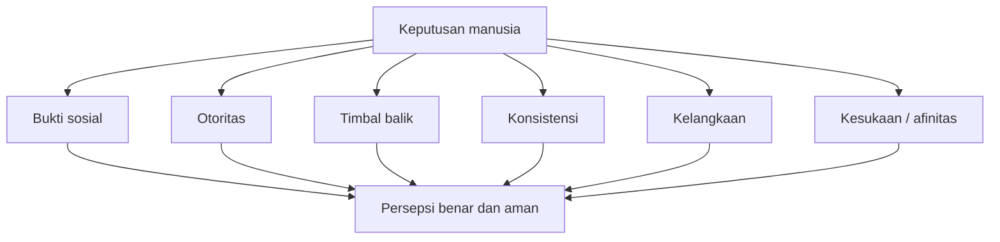
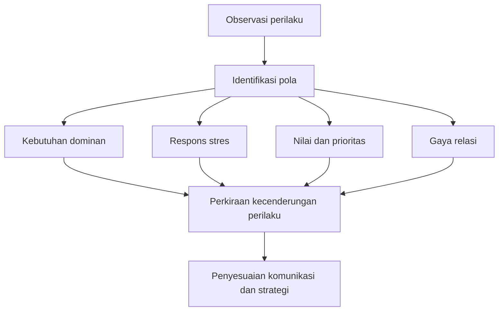

## 🧠 Pendahuluan: Mengapa Memahami Perilaku Manusia Itu Penting?

Salah satu ilusi terbesar manusia adalah keyakinan bahwa kita selalu bertindak secara sadar, rasional, dan terkendali. Kita suka membayangkan diri sebagai makhluk logis yang menimbang fakta, menghitung risiko, lalu mengambil keputusan dengan kepala dingin. Tetapi dalam praktik hidup sehari-hari, kenyataannya jauh lebih rumit. Kita sering memutuskan dulu, lalu mencari alasan belakangan. Kita sering bereaksi secara emosional, lalu membungkusnya dengan bahasa logis agar tampak masuk akal. Kita sering merasa memilih bebas, padahal pilihan kita telah dipengaruhi oleh rasa takut, kebutuhan diterima, tekanan sosial, kebiasaan lama, atau cara situasi dibingkai oleh orang lain. 🎭

Audiobook *How to Mastering The Psychology Of Human Behavior - The Hidden Rules of the Mind* mencoba membedah wilayah gelap sekaligus menarik ini: aturan-aturan tersembunyi yang menggerakkan perilaku manusia. Namun materi seperti ini sangat mudah tergelincir menjadi glorifikasi manipulasi, seolah memahami psikologi berarti belajar mengendalikan orang lain secara diam-diam. Karena itu, artikel ini sengaja saya arahkan secara **etis, reflektif, dan protektif**. Fokusnya bukan mengajari pembaca menjadi manipulator, melainkan membantu pembaca:

- memahami bagaimana perilaku manusia bekerja,
- mengenali pengaruh yang sering tak terlihat,
- membaca dinamika sosial dengan lebih jernih,
- melindungi diri dari manipulasi,
- dan menggunakan wawasan psikologi secara bertanggung jawab.

Tesis besarnya sederhana tetapi penting:

> **memahami psikologi manusia seharusnya membuat kita lebih sadar, lebih berempati, lebih strategis, dan lebih terlindungi — bukan lebih licik.**

Sebab tanpa kerangka etis, pengetahuan tentang psikologi mudah berubah menjadi alat dominasi. Tetapi dengan kerangka yang sehat, ia menjadi alat kejernihan, kepemimpinan, komunikasi yang lebih baik, dan pertahanan diri di dunia yang penuh persuasi halus. ✨

<Callout type="important" title="Cara membaca artikel ini">
Artikel ini membahas pengaruh, persuasi, bahasa tubuh, emosi, bias, dan pola perilaku. Namun seluruh pembahasannya diarahkan untuk literasi psikologis, komunikasi yang bertanggung jawab, dan pertahanan diri terhadap manipulasi. Bukan untuk eksploitasi orang lain.
</Callout>

---

## 🌪️ 1. Ilusi Rasionalitas: Mengapa Manusia Sering Tidak Setenang yang Ia Kira?

Salah satu gagasan paling kuat dari materi ini adalah bahwa manusia tidak se-logis yang ia bayangkan. Ini bukan penghinaan terhadap manusia; ini justru pengakuan jujur tentang cara kerja pikiran kita. Kita memang punya kapasitas logika, tetapi banyak keputusan lahir dari lapisan yang lebih cepat, lebih otomatis, dan lebih emosional. 🌪️

Dalam banyak situasi, pikiran sadar kita lebih mirip juru bicara daripada pengendali utama. Ia datang belakangan untuk menjelaskan keputusan yang sudah digerakkan oleh lapisan bawah sadar, emosi, rasa aman, kebiasaan, dorongan status, dan kebutuhan akan makna.

Contoh sehari-hari sangat banyak:

- seseorang membeli barang mahal bukan karena fungsi murni, tetapi karena citra,
- seseorang bertahan di pekerjaan buruk bukan karena itu rasional, tetapi karena takut perubahan,
- seseorang menolak kritik bukan karena kritiknya salah, tetapi karena identitasnya merasa terancam,
- seseorang langsung percaya satu narasi karena narasi itu membuatnya merasa aman, bukan karena narasi itu paling benar.

Begitu kita menerima kenyataan ini, kita menjadi lebih hati-hati terhadap diri sendiri dan orang lain. Kita berhenti terlalu cepat menyimpulkan bahwa perilaku manusia itu “aneh” atau “bodoh”. Sering kali ada logika tersembunyi di bawah permukaan: logika emosi, logika perlindungan diri, logika kebutuhan sosial, atau logika makna pribadi. 🧩

---

## 🧱 2. Tiga Lapisan Besar yang Sering Mengendalikan Perilaku: Aman, Diterima, dan Punya Makna

Materi audiobook ini membagi perilaku manusia ke dalam beberapa sistem psikologis besar. Walau penyajiannya populer dan perlu dibaca dengan sikap kritis, intuisinya sangat berguna. Secara praktis, banyak perilaku manusia memang sering berputar di sekitar tiga kebutuhan besar:

1. **keamanan**,
2. **penerimaan sosial**,
3. **makna atau narasi tentang diri dan dunia**.

### a. Sistem keamanan
Manusia punya kebutuhan mendasar untuk merasa aman. Saat merasa terancam, kita cenderung defensif, menolak perubahan, memilih kenyamanan jangka pendek, dan mempersempit cara berpikir.

### b. Sistem sosial
Kita adalah makhluk sosial. Banyak keputusan lahir dari kebutuhan untuk diterima, dihormati, diakui, atau setidaknya tidak ditolak oleh kelompok.

### c. Sistem makna
Kita tidak tahan hidup dalam kekacauan yang terasa tanpa arti. Karena itu kita membangun cerita untuk menjelaskan pengalaman, kadang akurat, kadang juga ilusif.

Kalau tiga sistem ini dipahami, banyak perilaku yang sebelumnya tampak membingungkan mulai menjadi lebih masuk akal. Orang tidak hanya mengejar uang; sering kali mereka mengejar rasa aman. Orang tidak hanya membeli simbol status; sering kali mereka mengejar legitimasi sosial. Orang tidak hanya membela keyakinan; sering kali mereka sedang mempertahankan cerita hidup yang memberi makna pada eksistensi mereka. 🪞

---

## 👥 3. Enam Gaya Pengaruh yang Sangat Kuat dalam Kehidupan Sosial

Audiobook ini menyebut beberapa “kekuatan tak terlihat” yang memengaruhi keputusan manusia. Banyak di antaranya memang sesuai dengan temuan klasik psikologi sosial, walau tetap perlu dibaca secara hati-hati dan tidak dipakai secara eksploitatif. Enam di antaranya sangat penting untuk dipahami. 👥

### 1. Social Proof — bukti sosial
Kita cenderung melihat perilaku orang lain sebagai petunjuk tentang apa yang benar, aman, atau layak dilakukan. Inilah sebabnya testimoni, ulasan, antrean, dan angka pengguna terasa begitu kuat.

### 2. Authority — otoritas
Manusia cenderung memberi bobot lebih besar pada pesan yang datang dari figur yang tampak berwenang, ahli, atau punya simbol legitimasi.

### 3. Reciprocity — timbal balik
Ketika menerima sesuatu, kita sering merasa punya utang psikologis untuk membalas.

### 4. Consistency — konsistensi
Setelah mengatakan atau melakukan sesuatu, manusia terdorong mempertahankan citra diri yang konsisten dengan tindakan itu.

### 5. Scarcity — kelangkaan
Sesuatu terasa lebih berharga ketika tampak terbatas, langka, atau hampir hilang.

### 6. Likability — kesukaan / afinitas
Kita lebih mudah menerima pengaruh dari orang yang kita sukai, percayai, atau rasakan mirip dengan kita.

Masalahnya bukan bahwa kekuatan-kekuatan ini ada. Masalahnya adalah banyak orang tidak sadar ketika dirinya sedang dipengaruhi oleh salah satunya. Dan justru ketidaksadaran itulah yang membuat pengaruh menjadi sangat efektif. 🎯

---

## 🧠 4. Social Proof: Mengapa Kita Mudah Meniru, Bahkan Saat Tidak Sadar?

**Social proof** atau bukti sosial adalah salah satu kekuatan paling dominan dalam perilaku manusia. Saat bingung, kita sering melihat ke sekitar: orang lain melakukan apa? Di dunia modern, itu tampak dalam bentuk:

- rating,
- review,
- jumlah followers,
- jumlah peserta,
- testimoni,
- antrean,
- viralitas.

Ketika banyak orang tampak memilih sesuatu, otak kita menangkap pesan implisit: ini mungkin aman, benar, atau setidaknya dapat diterima. 📣

Masalahnya, bukti sosial bisa asli, bisa juga direkayasa. Orang bisa membeli ulasan, memanipulasi kesan ramai, memakai testimoni yang dipilih selektif, atau membesar-besarkan angka untuk menciptakan rasa legitimasi. Di sinilah literasi psikologis sangat penting. Kita perlu bertanya:

- apakah “banyak orang” itu benar-benar banyak?
- apakah mereka relevan dengan konteks saya?
- apakah saya memilih ini karena nilainya, atau hanya karena terlihat populer?

Memahami social proof bukan agar kita lihai mengecoh orang dengan keramaian palsu, tetapi agar kita tidak gampang terseret oleh legitimasi semu.

---

## 🎓 5. Authority: Mengapa Simbol Keahlian Bisa Menonaktifkan Kritik

**Authority** atau otoritas bekerja sangat kuat karena otak manusia suka jalan pintas. Ketika seseorang tampak ahli, formal, berstatus tinggi, atau memakai simbol kredibilitas, kita cenderung menurunkan tingkat kewaspadaan. Jas rapi, panggung besar, gelar panjang, suara yakin, angka-angka statistik, atau “katanya riset” bisa sangat meyakinkan. 🎓

Padahal simbol otoritas tidak selalu sama dengan kompetensi nyata. Dan kompetensi nyata pun tidak selalu berarti ia benar dalam semua hal.

Dalam hidup modern, jebakan otoritas sering terjadi ketika:

- publik figur bicara di luar bidangnya,
- orang percaya sesuatu hanya karena dibawakan dengan percaya diri,
- gelar dipakai sebagai tameng terhadap kritik,
- atau orang menelan klaim karena malas memeriksa substansinya.

Sikap sehat terhadap otoritas bukan anti-ahli, tetapi **menghormati otoritas sambil tetap menjaga evaluasi kritis**. Keahlian perlu dihargai, tetapi klaim tetap perlu diuji. Otoritas layak didengar, bukan disembah.

---

## 🎁 6. Reciprocity: Mengapa Pemberian Kecil Bisa Menghasilkan Kepatuhan Besar

**Reciprocity** atau timbal balik adalah prinsip sosial yang sangat tua. Saat seseorang memberi sesuatu — bantuan, perhatian, hadiah, akses, pujian, kemudahan — kita sering merasa terdorong membalas. Ini bukan kelemahan moral; ini salah satu perekat relasi sosial. 🎁

Namun prinsip ini juga sering dipakai secara manipulatif. Sampel gratis, bonus, “saya sudah banyak bantu kamu”, keramahan yang berlebihan, semua bisa menciptakan rasa utang psikologis.

Yang perlu dipahami adalah perbedaan antara:

- pemberian tulus yang memang ingin memberi nilai,
- dan pemberian strategis yang sejak awal dirancang untuk menagih kepatuhan.

Maka pertahanan sehatnya adalah ini:

- bersyukur tanpa merasa otomatis berutang,
- membedakan kebaikan dengan transaksi tersembunyi,
- dan sadar bahwa menerima sesuatu tidak selalu mewajibkan kita menyetujui permintaan berikutnya.

Reciprocity bisa menjadi dasar relasi yang indah jika dipakai secara jujur. Tetapi ia bisa menjadi jebakan jika dipakai untuk mengunci kebebasan pilihan orang lain.

---

## 🔗 7. Consistency: Mengapa Komitmen Kecil Bisa Menarik Orang ke Komitmen Besar

Manusia ingin terlihat konsisten, baik di mata orang lain maupun di mata dirinya sendiri. Begitu seseorang mengatakan “ya” pada sesuatu, menuliskan dukungan, atau mengambil posisi kecil, ada tekanan psikologis untuk tetap selaras dengan langkah itu. 🔗

Ini menjelaskan banyak hal:

- kenapa orang sulit mengubah keyakinan publiknya,
- kenapa orang bertahan pada keputusan yang sebenarnya buruk,
- kenapa komitmen kecil bisa membuka jalan ke komitmen besar,
- dan kenapa orang sering membela pilihan lama meski bukti baru tidak mendukung.

Sisi positifnya, prinsip ini bisa dipakai untuk membangun kebiasaan baik: mulai kecil, tetapi konsisten. Sisi negatifnya, prinsip ini bisa dipakai untuk menyeret orang masuk ke pola yang makin mengikat.

Karena itu, penting bagi kita untuk membedakan antara:

- konsistensi yang sehat,
- dan keras kepala yang hanya ingin menyelamatkan ego.

Berubah pikiran setelah ada bukti baru bukan kelemahan. Kadang justru itulah konsistensi yang lebih tinggi: konsisten pada kebenaran, bukan pada gengsi.

---

## ⏳ 8. Scarcity: Mengapa Kelangkaan Membuat Kita Panik dan Kurang Rasional

**Scarcity** atau kelangkaan memicu salah satu ketakutan paling kuat dalam diri manusia: takut kehilangan kesempatan. Ketika sesuatu dibingkai sebagai langka, terbatas, eksklusif, atau “hanya hari ini”, otak cepat beralih ke mode urgensi. ⏳

Ini efektif karena kelangkaan menyentuh sistem survival dan rasa rugi. Kita sering lebih takut kehilangan daripada bersemangat mendapat keuntungan yang setara. Karena itu, penawaran terbatas terasa begitu kuat.

Masalahnya, banyak kelangkaan bersifat artifisial. Orang sengaja menciptakan:

- countdown,
- stok palsu,
- tekanan waktu,
- ancaman kehilangan,
- akses eksklusif yang dibesar-besarkan.

Pertahanan terbaik terhadap scarcity adalah jeda. Saat merasa dipaksa memutuskan cepat, itu justru sinyal untuk melambat. Tidak semua urgensi palsu, tetapi urgensi yang jujur tidak takut diperiksa. 🚦

---

## 😊 9. Likability: Kita Lebih Mudah Dipengaruhi oleh Orang yang Kita Sukai

Kita ingin percaya bahwa keputusan kita objektif. Nyatanya, rasa suka punya pengaruh besar. Orang yang hangat, mirip dengan kita, menarik, ramah, atau membuat kita nyaman akan lebih mudah memengaruhi keputusan kita. 😊

Ini sebabnya banyak relasi bisnis, kepemimpinan, penjualan, dan negosiasi tidak hanya soal isi pesan, tetapi juga soal kualitas hubungan.

Namun sekali lagi, memahami ini bukan berarti kita harus “bermain topeng” demi disukai. Yang lebih sehat adalah memahami bahwa afinitas terbentuk lewat:

- kesamaan yang otentik,
- penghargaan yang tulus,
- pengalaman positif bersama,
- dan komunikasi yang membuat orang merasa aman.

Kalau dipakai secara etis, pemahaman ini membantu membangun kepercayaan. Kalau dipakai secara licik, ia berubah jadi teknik rayu yang kosong.

---

## 👁️ 10. Bahasa Tubuh dan Mikroekspresi: Membaca Sinyal, Bukan Mengklaim Kepastian

Bagian tentang **micro expressions** atau mikroekspresi, postur tubuh, kontak mata, nada suara, dan gerakan tubuh memang sangat menarik. Banyak orang ingin belajar “membaca manusia” lewat sinyal non-verbal. Dan memang benar: perilaku non-verbal sering memberi informasi tambahan yang penting. 👁️

Tetapi di sini kita perlu sikap kritis. Bahasa tubuh bukan ilmu pasti satu-ke-satu. Menyilangkan tangan tidak otomatis berarti defensif. Menghindari tatapan tidak otomatis berarti bohong. Gerakan gelisah bisa berarti cemas, malu, capek, atau sekadar kebiasaan.

Karena itu, cara sehat membaca bahasa tubuh adalah:

- melihat **klaster sinyal**, bukan satu sinyal tunggal,
- memperhatikan **konteks**,
- membandingkan dengan **baseline** perilaku normal orang itu,
- dan menggunakannya sebagai **hipotesis**, bukan vonis.

Micro expressions, nada suara, dan perubahan postur lebih berguna sebagai alat untuk bertanya lebih baik, bukan untuk merasa punya kekuatan gaib menembus batin orang lain.

---

## 🗣️ 11. Nada Suara Sering Lebih Jujur daripada Kata-kata

Materi ini juga menyoroti pentingnya **vocal tonality** atau tonalitas suara. Ini pengamatan yang sangat berguna. Sering kali, isi kata bukan satu-satunya pesan. Cara sesuatu diucapkan membawa informasi tentang:

- tingkat keyakinan,
- ketegangan,
- rasa takut,
- defensif,
- antusiasme,
- atau jarak emosional.

Suara yang terlalu cepat, terlalu tegang, terlalu datar, atau terlalu terkontrol kadang memberi petunjuk bahwa ada sesuatu yang tidak selaras. Tapi sekali lagi: ini bukan mesin pendeteksi kebohongan. Ini hanya lapisan data tambahan. 🗣️

Yang paling penting justru melihat **ketidakselarasan** antara:

- isi kata,
- ekspresi wajah,
- nada suara,
- dan konteks situasi.

Ketika semuanya sejalan, biasanya pesan terasa otentik. Ketika tidak, kita patut melambat dan memperhatikan.

---

## 🧭 12. Pengaruh yang Etis: Memandu, Bukan Menjebak

Audiobook ini banyak berbicara tentang influence dan persuasion. Di sinilah garis etikanya harus tegas. **Pengaruh** tidak selalu buruk. Dalam hidup, kita semua saling memengaruhi. Orang tua memengaruhi anak, guru memengaruhi murid, pemimpin memengaruhi tim, penulis memengaruhi pembaca. 🧭

Pertanyaan moralnya bukan “apakah ada pengaruh?”, tetapi:

- apakah pengaruh itu jujur?
- apakah ia melanggar kebebasan orang lain?
- apakah ia menyembunyikan agenda yang merugikan?
- apakah hasilnya baik bagi kedua belah pihak?

Pengaruh yang etis biasanya memiliki ciri-ciri:

- membangun **trust** atau kepercayaan,
- menyajikan informasi dengan jernih,
- tidak menciptakan tekanan palsu,
- tidak mengeksploitasi luka atau ketakutan orang,
- dan mengarah pada **aligned influence** — pengaruh yang juga melayani kepentingan sehat pihak lain.

Di sini kita bisa menarik prinsip penting:

> **pengaruh yang sehat membantu orang mengambil keputusan yang lebih sadar, bukan keputusan yang lebih tunduk.**

---

## 🧩 13. Reframing: Cara Mengubah Makna Tanpa Mengubah Fakta

Salah satu teknik paling penting yang dibahas adalah **reframing** — *membingkai ulang*. Ini bukan trik sihir, melainkan kemampuan untuk mengubah cara situasi dipahami tanpa mengubah fakta dasar situasinya. 🧩

Contoh sederhana:

- “Ini ancaman” bisa dibingkai ulang menjadi “ini tantangan”.
- “Ini kegagalan” bisa dibingkai ulang menjadi “ini data tentang apa yang belum berhasil”.
- “Saya ditolak” bisa dibingkai ulang menjadi “saya sedang disaring menuju kecocokan yang lebih tepat”.

Reframing sangat kuat karena manusia bereaksi bukan hanya pada fakta, tetapi pada **makna** yang diberikan pada fakta tersebut.

Kalau dipakai secara etis, reframing membantu:

- mengurangi kepanikan,
- membuka perspektif,
- memulihkan daya gerak,
- dan membuat komunikasi lebih efektif.

Kalau dipakai secara manipulatif, reframing bisa menjadi alat untuk menutupi masalah nyata, memoles eksploitasi, atau membuat orang menerima sesuatu yang sebenarnya merugikan. Karena itu, standar etikanya tetap perlu dijaga.

---

## 🔮 14. Prediksi Perilaku: Apa yang Bisa Diperkirakan, dan Apa yang Tidak Boleh Disombongkan?

Bagian tentang **behavioral prediction** atau prediksi perilaku sangat memikat. Siapa yang tidak ingin bisa “membaca” orang lebih cepat? Tetapi di sini kita perlu menyeimbangkan rasa ingin tahu dengan kerendahan hati. 🔮

Perilaku manusia memang punya pola. Kita bisa memperkirakan kecenderungan dari:

- kebutuhan dominan seseorang,
- respons stresnya,
- bias keputusan,
- nilai yang diprioritaskan,
- cara ia merespons otoritas,
- dan pola relasinya.

Namun prediksi bukan ramalan absolut. Ia hanya peningkatan probabilitas pemahaman. Orang bisa berubah, konteks bisa bergeser, pengalaman baru bisa menggeser pola lama.

Cara sehat memakai wawasan ini adalah:

- untuk menyiapkan komunikasi yang lebih tepat,
- untuk mencegah konflik yang bisa diprediksi,
- untuk membangun kerja sama yang lebih realistis,
- dan untuk menghindari kekecewaan yang lahir dari ekspektasi naif.

Bukan untuk merasa punya kuasa total atas orang lain.

---

## 😮‍💨 15. Emosi Bukan Musuh: Mereka Data, Energi, dan Sinyal

Salah satu bagian paling matang dari audiobook ini adalah pembahasan tentang **emotional control** atau pengelolaan emosi. Banyak orang memandang emosi sebagai gangguan. Padahal emosi bukan musuh. Emosi adalah sinyal. Masalahnya bukan emosi itu sendiri, tetapi apa yang kita lakukan setelah emosi muncul. 😮‍💨

Takut, marah, cemas, frustrasi, antusias, malu — semua memberi informasi. Emosi sering memberitahu bahwa:

- ada ancaman yang terasa dekat,
- ada kebutuhan yang belum terpenuhi,
- ada nilai yang sedang terganggu,
- ada ketidakpastian yang terasa tinggi,
- atau ada perubahan yang belum kita mengerti.

Maka pengelolaan emosi yang sehat bukan menekan perasaan, tetapi:

1. mengenali kemunculannya,
2. membaca pesan yang dibawanya,
3. menahan impuls otomatis,
4. lalu memilih respons yang lebih sadar.

Ini sangat berbeda dari budaya “jangan baper” yang dangkal. Emosi yang diabaikan tetap bekerja, hanya saja dari bawah sadar.

---

## 🌬️ 16. Tubuh Sering Memberi Tahu Lebih Dulu daripada Pikiran Sadar

Audiobook ini juga menekankan bahwa emosi punya **signature** fisiologis — tanda-tanda tubuh. Marah mengencangkan rahang, takut mempercepat napas, cemas membuat tubuh gelisah, frustrasi membuat perhatian menyempit. 🌬️

Ini penting sekali. Karena banyak orang baru sadar dirinya emosional saat perilakunya sudah keburu meledak. Padahal tubuh sering memberi sinyal lebih awal:

- napas berubah,
- jantung meningkat,
- bahu menegang,
- dahi mengeras,
- suara meninggi,
- atau fokus menguncup pada satu ancaman.

Begitu sinyal awal ini dikenali, kita punya jendela untuk intervensi. Salah satu teknik paling sederhana dan kuat adalah **mengatur napas**, terutama memperpanjang hembusan napas. Ini membantu sistem saraf bergeser dari mode ancaman ke mode regulasi.

Jadi, pengelolaan emosi bukan sekadar kerja pikiran. Ia juga kerja tubuh.

---

## 🛡️ 17. Manipulation Defense: Membangun Sistem Pertahanan terhadap Pengaruh yang Merusak

Salah satu bagian paling berguna dari materi ini adalah pembahasan tentang **mental manipulation defense systems**. Dunia modern memang penuh manipulasi halus:

- iklan yang memanfaatkan ketakutan,
- hubungan yang memakai rasa bersalah,
- penjualan yang memainkan urgensi palsu,
- politik yang memecah lewat triangulasi,
- hubungan toxic yang mencampur pujian dan penghinaan,
- dan figur manipulatif yang membuat orang meragukan persepsi dirinya sendiri. 🛡️

Memahami teknik-teknik ini bukan untuk meniru, tetapi untuk membangun radar dan batasan.

Beberapa pola manipulasi yang perlu diwaspadai:

### Artificial urgency — urgensi palsu
Mendorong keputusan cepat agar orang tidak sempat berpikir.

### Guilt manipulation — manipulasi rasa bersalah
Membuat orang merasa jahat, egois, atau berutang jika tidak patuh.

### Gaslighting
Membuat orang meragukan persepsinya, ingatannya, atau kewarasannya sendiri.

### Love bombing lalu withdrawal
Perhatian berlebihan di awal lalu penarikan mendadak untuk menciptakan ketergantungan emosional.

### Isolation
Memisahkan orang dari sumber perspektif dan dukungan lain.

### Triangulation
Menciptakan perbandingan, drama, atau persaingan agar orang bereaksi sesuai agenda manipulator.

Memahami pola ini bisa menyelamatkan banyak energi hidup.

---

## ⏸️ 18. Aturan 24 Jam: Jeda adalah Bentuk Kebebasan Psikologis

Salah satu prinsip pertahanan terbaik terhadap manipulasi adalah **jeda**. Saat ada tekanan emosional, waktu sempit, atau urgensi yang dibesar-besarkan, kemampuan kita untuk berpikir jernih menurun. Karena itu, aturan sederhana seperti **24-hour rule** atau aturan 24 jam sangat kuat. ⏸️

Setiap kali ada keputusan penting yang ditekan untuk dibuat segera — terutama soal uang, komitmen, relasi, atau perubahan besar — jeda menjadi bentuk perlindungan.

Jeda memberi ruang untuk:

- memisahkan fakta dari framing,
- memeriksa apakah rasa panik itu asli atau ditanamkan,
- mendengar intuisi tanpa dikuasai impuls,
- dan mencari perspektif dari luar gelembung emosi saat itu.

Dalam dunia yang serba cepat, kemampuan berkata “saya pikirkan dulu” adalah kekuatan, bukan kelemahan.

---

## 🧭 19. Pressure Decision-Making: Di Bawah Tekanan, Otak Menyempit

Materi ini juga sangat menarik saat membahas keputusan di bawah tekanan. Saat tekanan tinggi, otak cenderung berpindah dari mode reflektif ke mode otomatis. Ini bisa berguna untuk situasi darurat, tetapi berbahaya untuk keputusan kompleks. 🧭

Di bawah tekanan, kita cenderung:

- fokus pada ancaman langsung,
- menghindari kerugian lebih dari mengejar hasil optimal,
- mempersempit horizon waktu,
- dan mengabaikan relasi atau dampak jangka panjang.

Ini menjelaskan kenapa keputusan yang dibuat saat panik, malu, terancam, atau sangat lelah sering tidak matang.

Karena itu, orang yang ingin berpikir lebih baik perlu punya **pressure protocol** — semacam prosedur mental saat berada di bawah tekanan. Misalnya:

1. sadar bahwa saya sedang tertekan,
2. atur napas,
3. bedakan urgensi nyata dan urgensi palsu,
4. cek faktor jangka panjang,
5. tanyakan siapa yang diuntungkan jika saya memutuskan terlalu cepat.

Itu bisa mencegah banyak kesalahan besar.

---

## 🏗️ 20. Kebiasaan dan Perubahan Perilaku: Willpower Saja Tidak Cukup

Bab tentang **habit psychology** atau psikologi kebiasaan sangat penting karena ia membawa pembahasan dari “membaca orang lain” kembali ke “membentuk diri sendiri”. Dan di sini pesannya sangat benar: perubahan perilaku jangka panjang tidak bisa bergantung pada semangat sesaat. 🏗️

Kebiasaan berjalan melalui **habit loop**:

- **cue** — pemicu,
- **routine** — rutinitas,
- **reward** — ganjaran / hasil yang menguatkan.

Kalau kita ingin berubah, kita tidak cukup hanya berkata “mulai besok saya disiplin”. Kita perlu melihat:

- pemicu apa yang melahirkan perilaku lama,
- rutinitas apa yang sebenarnya terjadi,
- ganjaran apa yang membuat perilaku itu terus berulang.

Ini berlaku untuk banyak hal:

- scrolling berlebihan,
- ngemil emosional,
- menunda pekerjaan,
- meledak saat marah,
- atau juga kebiasaan baik seperti membaca, olahraga, menulis, refleksi.

Perubahan yang bertahan biasanya bukan yang dramatis, tetapi yang dirancang kecil, konsisten, dan selaras dengan identitas baru.

---

## 🪪 21. Identity-Based Change: Perubahan Paling Kuat Terjadi Saat Identitas Berubah

Salah satu ide paling kuat dalam psikologi kebiasaan adalah bahwa perubahan paling stabil terjadi ketika perilaku baru tidak lagi terasa seperti paksaan, melainkan ekspresi identitas. 🪪

Perbedaannya besar:

- “Saya ingin olahraga” berbeda dengan “Saya adalah orang yang menjaga tubuhnya.”
- “Saya ingin lebih tenang” berbeda dengan “Saya adalah orang yang tidak mudah reaktif.”
- “Saya ingin lebih kritis” berbeda dengan “Saya adalah orang yang memeriksa sebelum percaya.”

Ketika identitas berubah, konsistensi psikologis mulai bekerja mendukung perubahan. Kita bertindak bukan sekadar untuk mengejar target, tetapi untuk setia pada siapa diri yang sedang kita bangun.

Ini menghubungkan kembali seluruh tema artikel: pemahaman psikologi manusia tidak hanya untuk membaca orang lain, tetapi juga untuk menata diri secara lebih sadar.

---

## 🤝 22. Psikologi Seharusnya Membuat Kita Lebih Manusiawi, Bukan Lebih Sinis

Ada bahaya besar saat mempelajari psikologi perilaku: kita bisa menjadi terlalu curiga, terlalu sinis, atau mulai melihat semua interaksi sebagai permainan kuasa semata. Itu bahaya nyata. 🤝

Kalau semua senyum dianggap strategi, semua perhatian dianggap jebakan, semua persuasi dianggap manipulasi, akhirnya kita kehilangan kemampuan untuk mempercayai ketulusan. Itu tidak sehat.

Karena itu, pembacaan yang matang terhadap psikologi harus menahan dua hal sekaligus:

- **kejernihan**, bahwa manusia memang dipengaruhi banyak faktor tak sadar,
- dan **kemanusiaan**, bahwa tidak semua pengaruh itu jahat, tidak semua orang sedang bermain licik.

Psikologi yang sehat membuat kita:

- lebih waspada tanpa jadi paranoid,
- lebih strategis tanpa jadi manipulatif,
- lebih peka tanpa jadi terlalu curiga,
- lebih kuat tanpa kehilangan empati.

---

## ✨ 23. Kesimpulan: Kebebasan Psikologis Dimulai dari Kesadaran

Kalau seluruh materi audiobook ini kita saring dengan hati-hati, ada satu pesan besar yang sangat berharga: manusia sering digerakkan oleh pola yang tidak ia sadari. Emosi, kebutuhan aman, status sosial, bias, tekanan, framing, kebiasaan, dan bahasa tubuh semuanya ikut membentuk perilaku. Tetapi justru di situlah pintu kebebasannya. ✨

Karena pola yang disadari bisa mulai dikelola. Pengaruh yang dikenali bisa mulai ditahan. Manipulasi yang terlihat bisa mulai dilawan. Kebiasaan yang dipahami bisa mulai diubah. Emosi yang dibaca dengan jernih bisa mulai diarahkan.

Maka memahami psikologi perilaku manusia bukan tentang menjadi pengendali orang lain. Yang lebih penting adalah menjadi:

- lebih sadar atas diri sendiri,
- lebih teliti membaca situasi,
- lebih kuat menghadapi tekanan,
- lebih rapi dalam komunikasi,
- lebih terlindungi dari manipulasi,
- dan lebih etis saat memengaruhi orang lain.

Pada akhirnya, bentuk tertinggi dari psychological mastery bukanlah kemampuan membuat orang lain tunduk. Bentuk tertingginya adalah kemampuan untuk tetap jernih, tetap berprinsip, dan tetap manusiawi di tengah dunia yang penuh permainan pengaruh. 🌤️

---

## 🔖 Catatan Penutup

Artikel ini diolah dari transkrip audiobook *How to Mastering The Psychology Of Human Behavior - The Hidden Rules of the Mind* dan ditulis ulang sebagai analisis etis, kritis, dan protektif untuk membantu pembaca memahami perilaku manusia tanpa jatuh pada glorifikasi manipulasi.

## 📚 Sumber Dasar

- Transkrip audiobook: *How to Mastering The Psychology Of Human Behavior - The Hidden Rules of the Mind*
- Sumber video: YouTube (`https://www.youtube.com/watch?v=bx1VOKxsnOE`)
