## 🧠 Pembuka: Meretas OS Manusia

Kamu mungkin sudah familiar dengan konsep *hacking* dalam dunia teknologi: seseorang yang menemukan celah dalam sistem komputer, mengeksploitasi kelemahan kode, dan mendapatkan akses yang tidak seharusnya mereka miliki.

Tapi bagaimana jika sistem yang diretas bukan komputer — melainkan **otakmu sendiri**?

Niall Merrigan, Head of Cybersecurity untuk Capgemini Norwegia, membuka salah satu talk paling menggugah di NDC Conference dengan sebuah pernyataan sederhana yang langsung menampar:

> *"Kita sedang berada di fase Vista dari OS manusia. Kita sudah cukup berkembang, tapi masih sangat rusak dan sangat rentan."*

Dan ironisnya, **manusia adalah bagian paling lemah** dari sistem keamanan manapun — bukan firewall, bukan enkripsi, bukan antivirus.

*Social engineering* (*rekayasa sosial*) adalah seni mengeksploitasi kelemahan psikologis manusia — bukan kelemahan teknis sistem. Ini bukan konsep baru. **Marketing dan sales sudah melakukannya selama puluhan tahun** sebelum para hacker mengadopsinya.

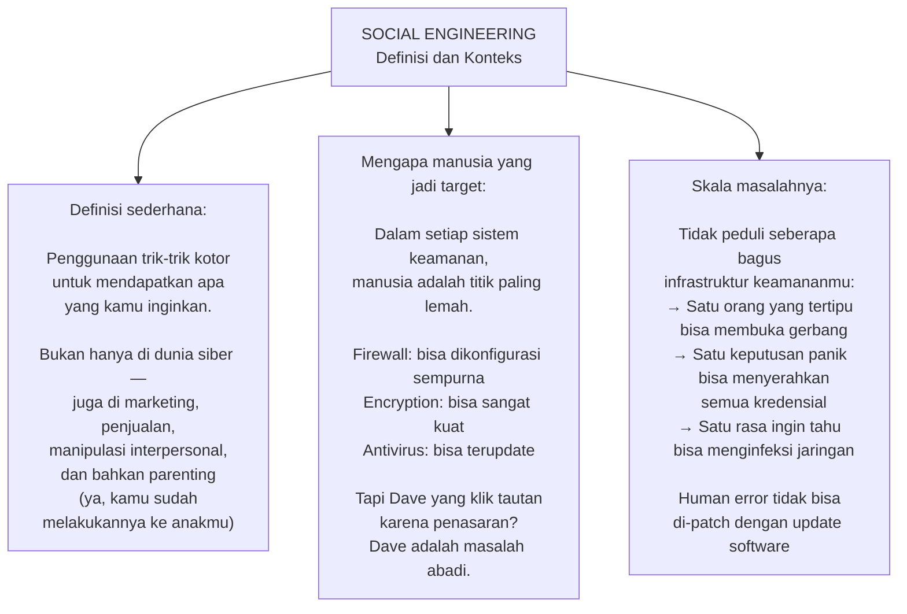
```mermaid
graph TD
    A["SOCIAL ENGINEERING\nDefinisi dan Konteks"]
    
    A --> B["Definisi sederhana:\n\nPenggunaan trik-trik kotor\nuntuk mendapatkan apa\nyang kamu inginkan.\n\nBukan hanya di dunia siber —\njuga di marketing, penjualan,\nmanipulasi interpersonal,\ndan bahkan parenting\n(ya, kamu sudah\nmelakukannya ke anakmu)"]
    
    A --> C["Mengapa manusia yang jadi target:\n\nDalam setiap sistem keamanan,\nmanusia adalah titik paling lemah.\n\nFirewall: bisa dikonfigurasi sempurna\nEncryption: bisa sangat kuat\nAntivirus: bisa terupdate\n\nTapi Dave yang klik tautan\nkarena penasaran?\nDave adalah masalah abadi."]
    
    A --> D["Skala masalahnya:\n\nTidak peduli seberapa bagus\ninfrastruktur keamananmu:\n→ Satu orang yang tertipu\n  bisa membuka gerbang\n→ Satu keputusan panik\n  bisa menyerahkan\n  semua kredensial\n→ Satu rasa ingin tahu\n  bisa menginfeksi jaringan\n\nHuman error tidak bisa\ndi-patch dengan update software"]
```

---

## 👁️ Bagian 1: Melihat yang Tidak Terlihat — Plain Sight Problem

Niall membuka dengan sebuah ilustrasi yang sangat kuat: gambar seekor rubah yang di dalamnya tersembunyi gambar-gambar manusia. Anaknya yang berusia 6 tahun awalnya hanya melihat rubah — sampai Niall menunjukkan cara melihatnya.

> *"Sekali kamu tahu apa yang dicari, ia menjadi masalah 'jelas terlihat' (*plain sight problem*). Kamu akan berkata: 'Tentu saja, pasti itu sudah dari tadi.'"*

Ini adalah prinsip paling fundamental dalam *social engineering*:

**Korban tidak melihat manipulasi karena mereka tidak tahu harus mencarinya.**

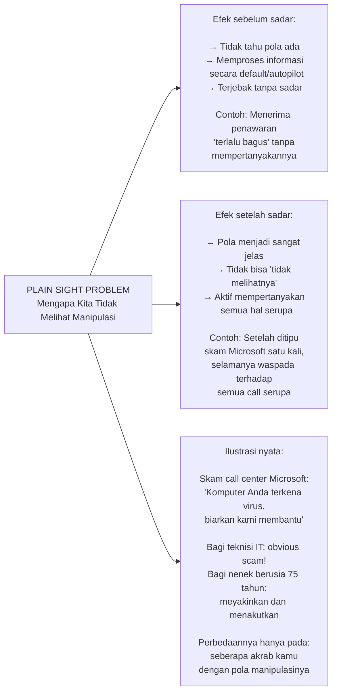
```mermaid
graph LR
    A["PLAIN SIGHT PROBLEM\nMengapa Kita Tidak Melihat Manipulasi"]
    
    A --> B["Efek sebelum sadar:\n\n→ Tidak tahu pola ada\n→ Memproses informasi\n  secara default/autopilot\n→ Terjebak tanpa sadar\n\nContoh: Menerima penawaran\n'terlalu bagus' tanpa\nmempertanyakannya"]
    
    A --> C["Efek setelah sadar:\n\n→ Pola menjadi sangat jelas\n→ Tidak bisa 'tidak melihatnya'\n→ Aktif mempertanyakan\n  semua hal serupa\n\nContoh: Setelah ditipu\nskam Microsoft satu kali,\nselamanya waspada terhadap\nsemua call serupa"]
    
    A --> D["Ilustrasi nyata:\n\nSkam call center Microsoft:\n'Komputer Anda terkena virus,\nbiarkan kami membantu'\n\nBagi teknisi IT: obvious scam!\nBagi nenek berusia 75 tahun:\nmeyakinkan dan menakutkan\n\nPerbedaannya hanya pada:\nseberapa akrab kamu\ndengan pola manipulasinya"]
```

Efek ini menjelaskan mengapa **orang pintar pun bisa tertipu** — bukan karena bodoh, tapi karena belum pernah melihat pola tertentu sebelumnya.

---

## 🛍️ Bagian 2: Marketing adalah Social Engineering yang Legal

Sebelum membahas serangan siber, Niall membuat poin yang mengejutkan:

> *"Kita bukan orang pertama yang menggunakan social engineering. Marketing dan sales sudah melakukan ini selama bertahun-tahun."*

### 🧴 Menjual Aspirasi, Bukan Produk

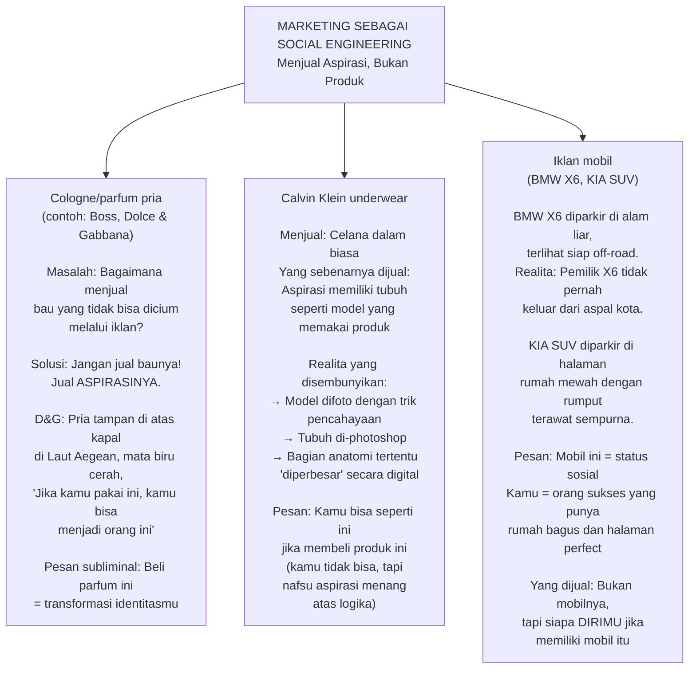
```mermaid
graph TD
    A["MARKETING SEBAGAI SOCIAL ENGINEERING\nMenjual Aspirasi, Bukan Produk"]
    
    A --> B["Cologne/parfum pria\n(contoh: Boss, Dolce & Gabbana)\n\nMasalah: Bagaimana menjual\nbau yang tidak bisa dicium\nmelalui iklan?\n\nSolusi: Jangan jual baunya!\nJual ASPIRASINYA.\n\nD&G: Pria tampan di atas kapal\ndi Laut Aegean, mata biru cerah,\n'Jika kamu pakai ini, kamu bisa\nmenjadi orang ini'\n\nPesan subliminal: Beli parfum ini\n= transformasi identitasmu"]
    
    A --> C["Calvin Klein underwear\n\nMenjual: Celana dalam biasa\nYang sebenarnya dijual:\nAspirasi memiliki tubuh\nseperti model yang memakai produk\n\nRealita yang disembunyikan:\n→ Model difoto dengan trik pencahayaan\n→ Tubuh di-photoshop\n→ Bagian anatomi tertentu\n   'diperbesar' secara digital\n\nPesan: Kamu bisa seperti ini\njika membeli produk ini\n(kamu tidak bisa, tapi\nnafsu aspirasi menang\natas logika)"]
    
    A --> D["Iklan mobil\n(BMW X6, KIA SUV)\n\nBMW X6 diparkir di alam liar,\nterlihat siap off-road.\nRealita: Pemilik X6 tidak pernah\nkeluar dari aspal kota.\n\nKIA SUV diparkir di halaman\nrumah mewah dengan rumput\nterawat sempurna.\n\nPesan: Mobil ini = status sosial\nKamu = orang sukses yang punya\nrumah bagus dan halaman perfect\n\nYang dijual: Bukan mobilnya,\ntapi siapa DIRIMU jika\nmemiliki mobil itu"]
```

### ❗ Menjual Masalah yang Tidak Kamu Tahu Kamu Punya

Ini adalah teknik yang lebih licik:

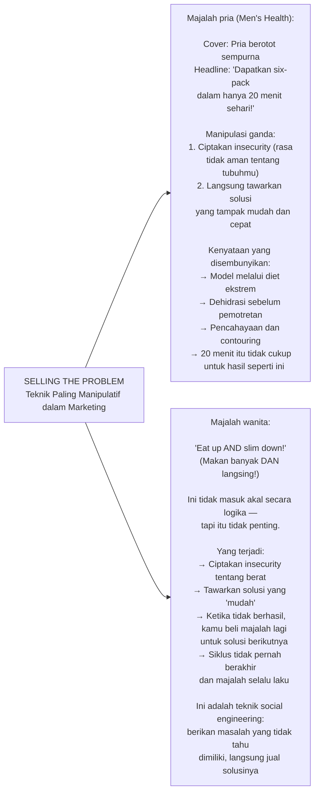
```mermaid
graph LR
    A["SELLING THE PROBLEM\nTeknik Paling Manipulatif dalam Marketing"]
    
    A --> B["Majalah pria (Men's Health):\n\nCover: Pria berotot sempurna\nHeadline: 'Dapatkan six-pack\ndalam hanya 20 menit sehari!'\n\nManipulasi ganda:\n1. Ciptakan insecurity (rasa\n   tidak aman tentang tubuhmu)\n2. Langsung tawarkan solusi\n   yang tampak mudah dan cepat\n\nKenyataan yang disembunyikan:\n→ Model melalui diet ekstrem\n→ Dehidrasi sebelum pemotretan\n→ Pencahayaan dan contouring\n→ 20 menit itu tidak cukup\n   untuk hasil seperti ini"]
    
    A --> C["Majalah wanita:\n\n'Eat up AND slim down!'\n(Makan banyak DAN langsing!)\n\nIni tidak masuk akal secara logika —\ntapi itu tidak penting.\n\nYang terjadi:\n→ Ciptakan insecurity tentang berat\n→ Tawarkan solusi yang 'mudah'\n→ Ketika tidak berhasil,\n   kamu beli majalah lagi\n   untuk solusi berikutnya\n→ Siklus tidak pernah berakhir\n   dan majalah selalu laku\n\nIni adalah teknik social engineering:\nberikan masalah yang tidak tahu\ndimiliki, langsung jual solusinya"]
```

> *"Jika kamu pergi ke seseorang dan berkata 'Kamu punya sesuatu yang salah, tapi aku punya solusinya' — mereka akan menamparmu. Tapi majalah melakukannya setiap hari dan kita membayar untuk itu."* — Niall Merrigan

---

## 🧩 Bagian 3: Cognitive Bias — Celah dalam OS Manusia

*Cognitive bias* (*bias kognitif*) adalah kecenderungan pikiran untuk membuat keputusan dengan cara-cara tertentu yang bisa diprediksi — dan dieksploitasi.

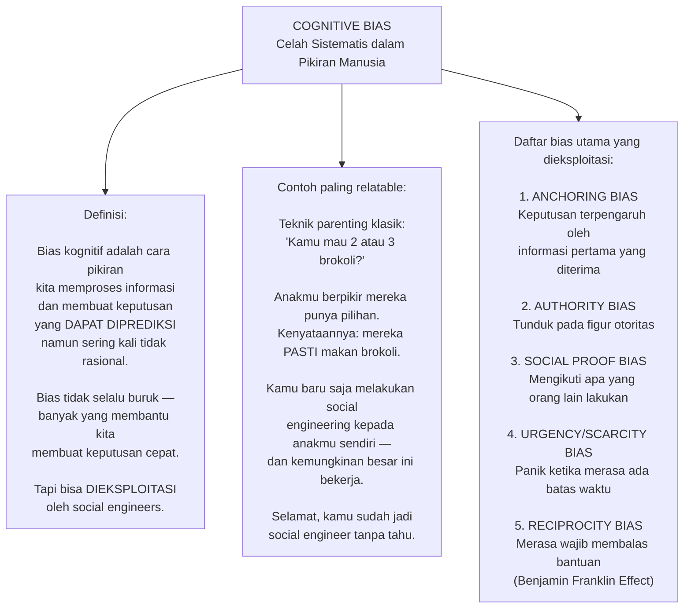
```mermaid
graph TD
    A["COGNITIVE BIAS\nCelah Sistematis dalam Pikiran Manusia"]
    
    A --> B["Definisi:\n\nBias kognitif adalah cara pikiran\nkita memproses informasi\ndan membuat keputusan\nyang DAPAT DIPREDIKSI\nnamun sering kali tidak rasional.\n\nBias tidak selalu buruk —\nbanyak yang membantu kita\nmembuat keputusan cepat.\n\nTapi bisa DIEKSPLOITASI\noleh social engineers."]
    
    A --> C["Contoh paling relatable:\n\nTeknik parenting klasik:\n'Kamu mau 2 atau 3 brokoli?'\n\nAnakmu berpikir mereka punya pilihan.\nKenyataannya: mereka PASTI makan brokoli.\n\nKamu baru saja melakukan social\nengineering kepada anakmu sendiri —\ndan kemungkinan besar ini bekerja.\n\nSelamat, kamu sudah jadi\nsocial engineer tanpa tahu."]
    
    A --> D["Daftar bias utama yang dieksploitasi:\n\n1. ANCHORING BIAS\n   Keputusan terpengaruh oleh\n   informasi pertama yang diterima\n\n2. AUTHORITY BIAS\n   Tunduk pada figur otoritas\n\n3. SOCIAL PROOF BIAS\n   Mengikuti apa yang orang lain lakukan\n\n4. URGENCY/SCARCITY BIAS\n   Panik ketika merasa ada batas waktu\n\n5. RECIPROCITY BIAS\n   Merasa wajib membalas bantuan\n   (Benjamin Franklin Effect)"]
```

### ⚓ Anchoring Bias — Harga yang Membelenggu Pikiran

Ini adalah salah satu teknik paling powerful dan paling sering digunakan dalam strategi harga.

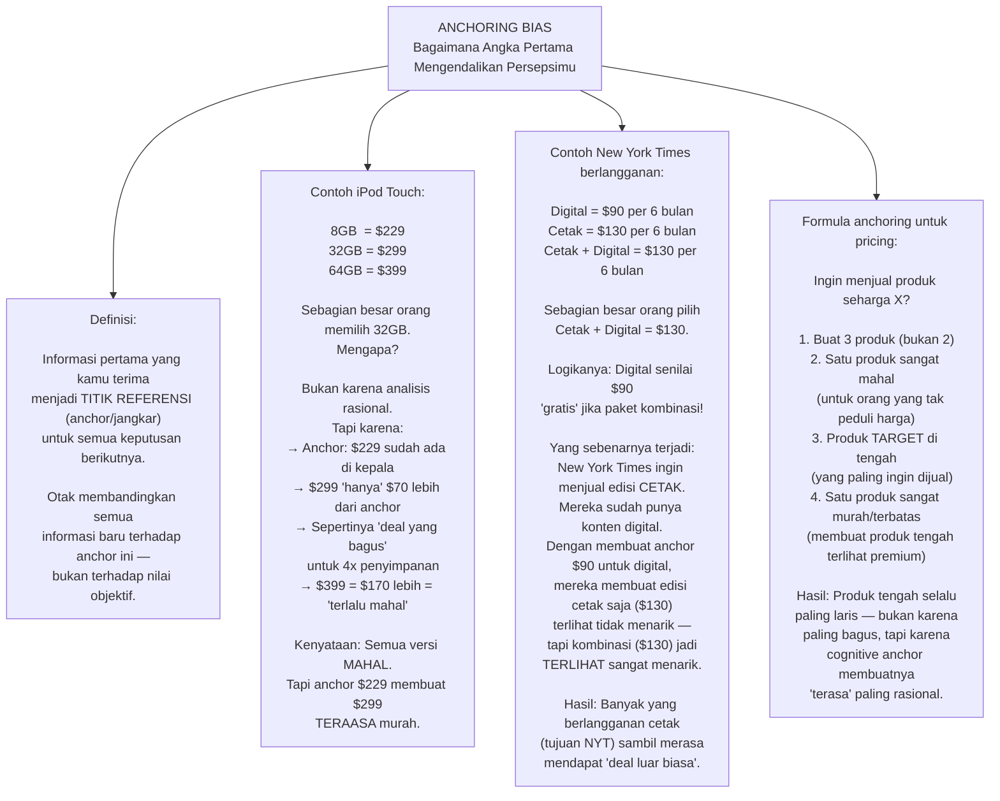
```mermaid
graph TD
    A["ANCHORING BIAS\nBagaimana Angka Pertama Mengendalikan Persepsimu"]
    
    A --> B["Definisi:\n\nInformasi pertama yang kamu terima\nmenjadi TITIK REFERENSI (anchor/jangkar)\nuntuk semua keputusan berikutnya.\n\nOtak membandingkan semua\ninformasi baru terhadap anchor ini —\nbukan terhadap nilai objektif."]
    
    A --> C["Contoh iPod Touch:\n\n8GB  = $229\n32GB = $299\n64GB = $399\n\nSebagian besar orang memilih 32GB.\nMengapa?\n\nBukan karena analisis rasional.\nTapi karena:\n→ Anchor: $229 sudah ada di kepala\n→ $299 'hanya' $70 lebih dari anchor\n→ Sepertinya 'deal yang bagus'\n   untuk 4x penyimpanan\n→ $399 = $170 lebih = 'terlalu mahal'\n\nKenyataan: Semua versi MAHAL.\nTapi anchor $229 membuat $299\nTERAASA murah."]
    
    A --> D["Contoh New York Times berlangganan:\n\nDigital = $90 per 6 bulan\nCetak = $130 per 6 bulan\nCetak + Digital = $130 per 6 bulan\n\nSebagian besar orang pilih\nCetak + Digital = $130.\n\nLogikanya: Digital senilai $90\n'gratis' jika paket kombinasi!\n\nYang sebenarnya terjadi:\nNew York Times ingin menjual edisi CETAK.\nMereka sudah punya konten digital.\nDengan membuat anchor $90 untuk digital,\nmereka membuat edisi cetak saja ($130)\nterlihat tidak menarik —\ntapi kombinasi ($130) jadi\nTERLIHAT sangat menarik.\n\nHasil: Banyak yang berlangganan cetak\n(tujuan NYT) sambil merasa\nmendapat 'deal luar biasa'."]
    
    A --> E["Formula anchoring untuk pricing:\n\nIngin menjual produk seharga X?\n\n1. Buat 3 produk (bukan 2)\n2. Satu produk sangat mahal\n   (untuk orang yang tak peduli harga)\n3. Produk TARGET di tengah\n   (yang paling ingin dijual)\n4. Satu produk sangat murah/terbatas\n   (membuat produk tengah terlihat premium)\n\nHasil: Produk tengah selalu\npaling laris — bukan karena\npaling bagus, tapi karena\ncognitive anchor membuatnya\n'terasa' paling rasional."]
```

### 🧮 Bagaimana Kita Membaca Angka Harga

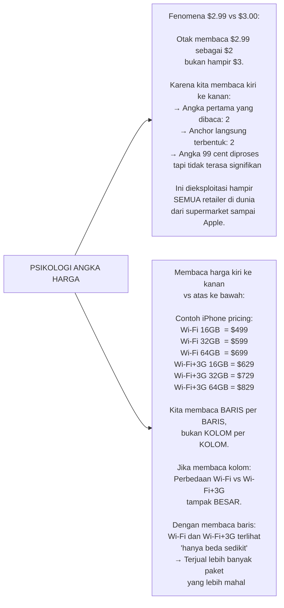
```mermaid
graph LR
    A["PSIKOLOGI ANGKA HARGA"]
    
    A --> B["Fenomena $2.99 vs $3.00:\n\nOtak membaca $2.99 sebagai $2\nbukan hampir $3.\n\nKarena kita membaca kiri ke kanan:\n→ Angka pertama yang dibaca: 2\n→ Anchor langsung terbentuk: 2\n→ Angka 99 cent diproses\n   tapi tidak terasa signifikan\n\nIni dieksploitasi hampir\nSEMUA retailer di dunia\ndari supermarket sampai Apple."]
    
    A --> C["Membaca harga kiri ke kanan\nvs atas ke bawah:\n\nContoh iPhone pricing:\nWi-Fi 16GB  = $499\nWi-Fi 32GB  = $599\nWi-Fi 64GB  = $699\nWi-Fi+3G 16GB = $629\nWi-Fi+3G 32GB = $729\nWi-Fi+3G 64GB = $829\n\nKita membaca BARIS per BARIS,\nbukan KOLOM per KOLOM.\n\nJika membaca kolom:\nPerbedaan Wi-Fi vs Wi-Fi+3G\ntampak BESAR.\n\nDengan membaca baris:\nWi-Fi dan Wi-Fi+3G terlihat\n'hanya beda sedikit'\n→ Terjual lebih banyak paket\n  yang lebih mahal"]
```

---

## 🎣 Bagian 4: Phishing — Dari Jaring Ikan Hingga Tombak

*Phishing* (umpan memancing) adalah teknik serangan yang menggunakan tipuan untuk mendapatkan informasi sensitif. Tapi banyak yang tidak tahu bahwa ada **tingkatan** phishing yang sangat berbeda dalam efektivitas dan kecanggihan.

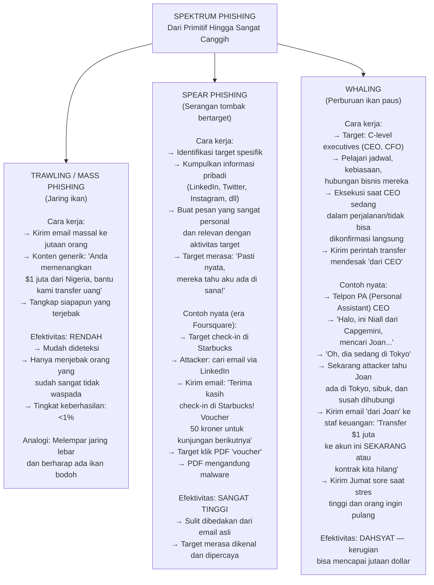
```mermaid
graph TD
    A["SPEKTRUM PHISHING\nDari Primitif Hingga Sangat Canggih"]
    
    A --> B["TRAWLING / MASS PHISHING\n(Jaring ikan)\n\nCara kerja:\n→ Kirim email massal ke jutaan orang\n→ Konten generik: 'Anda memenangkan\n   $1 juta dari Nigeria, bantu\n   kami transfer uang'\n→ Tangkap siapapun yang terjebak\n\nEfektivitas: RENDAH\n→ Mudah dideteksi\n→ Hanya menjebak orang yang\n  sudah sangat tidak waspada\n→ Tingkat keberhasilan: <1%\n\nAnalogi: Melempar jaring lebar\ndan berharap ada ikan bodoh"]
    
    A --> C["SPEAR PHISHING\n(Serangan tombak bertarget)\n\nCara kerja:\n→ Identifikasi target spesifik\n→ Kumpulkan informasi pribadi\n   (LinkedIn, Twitter, Instagram, dll)\n→ Buat pesan yang sangat personal\n   dan relevan dengan aktivitas target\n→ Target merasa: 'Pasti nyata,\n   mereka tahu aku ada di sana!'\n\nContoh nyata (era Foursquare):\n→ Target check-in di Starbucks\n→ Attacker: cari email via LinkedIn\n→ Kirim email: 'Terima kasih\n   check-in di Starbucks! Voucher\n   50 kroner untuk kunjungan berikutnya'\n→ Target klik PDF 'voucher'\n→ PDF mengandung malware\n\nEfektivitas: SANGAT TINGGI\n→ Sulit dibedakan dari email asli\n→ Target merasa dikenal dan dipercaya"]
    
    A --> D["WHALING\n(Perburuan ikan paus)\n\nCara kerja:\n→ Target: C-level executives (CEO, CFO)\n→ Pelajari jadwal, kebiasaan,\n   hubungan bisnis mereka\n→ Eksekusi saat CEO sedang\n   dalam perjalanan/tidak bisa\n   dikonfirmasi langsung\n→ Kirim perintah transfer\n   mendesak 'dari CEO'\n\nContoh nyata:\n→ Telpon PA (Personal Assistant) CEO\n→ 'Halo, ini Niall dari Capgemini,\n   mencari Joan...'\n→ 'Oh, dia sedang di Tokyo'\n→ Sekarang attacker tahu Joan\n   ada di Tokyo, sibuk, dan\n   susah dihubungi\n→ Kirim email 'dari Joan' ke\n   staf keuangan: 'Transfer $1 juta\n   ke akun ini SEKARANG atau\n   kontrak kita hilang'\n→ Kirim Jumat sore saat stres\n   tinggi dan orang ingin pulang\n\nEfektivitas: DAHSYAT — kerugian\nbisa mencapai jutaan dollar"]
```

### 🐋 Anatomi Serangan Whaling yang Sempurna

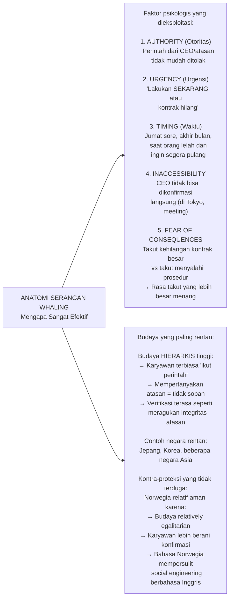
```mermaid
graph LR
    A["ANATOMI SERANGAN WHALING\nMengapa Sangat Efektif"]
    
    A --> B["Faktor psikologis yang dieksploitasi:\n\n1. AUTHORITY (Otoritas)\n   Perintah dari CEO/atasan\n   tidak mudah ditolak\n\n2. URGENCY (Urgensi)\n   'Lakukan SEKARANG atau\n   kontrak hilang'\n\n3. TIMING (Waktu)\n   Jumat sore, akhir bulan,\n   saat orang lelah dan\n   ingin segera pulang\n\n4. INACCESSIBILITY\n   CEO tidak bisa dikonfirmasi\n   langsung (di Tokyo, meeting)\n\n5. FEAR OF CONSEQUENCES\n   Takut kehilangan kontrak besar\n   vs takut menyalahi prosedur\n   → Rasa takut yang lebih besar menang"]
    
    A --> C["Budaya yang paling rentan:\n\nBudaya HIERARKIS tinggi:\n→ Karyawan terbiasa 'ikut perintah'\n→ Mempertanyakan atasan = tidak sopan\n→ Verifikasi terasa seperti\n   meragukan integritas atasan\n\nContoh negara rentan:\nJepang, Korea, beberapa negara Asia\n\nKontra-proteksi yang tidak terduga:\nNorwegia relatif aman karena:\n→ Budaya relatively egalitarian\n→ Karyawan lebih berani konfirmasi\n→ Bahasa Norwegia mempersulit\n  social engineering berbahasa Inggris"]
```

---

## 🔐 Bagian 5: Pixel-Perfect Phishing dan Bypass 2FA

Teknik phishing modern telah berkembang jauh melampaui email Nigeria yang mencolok.

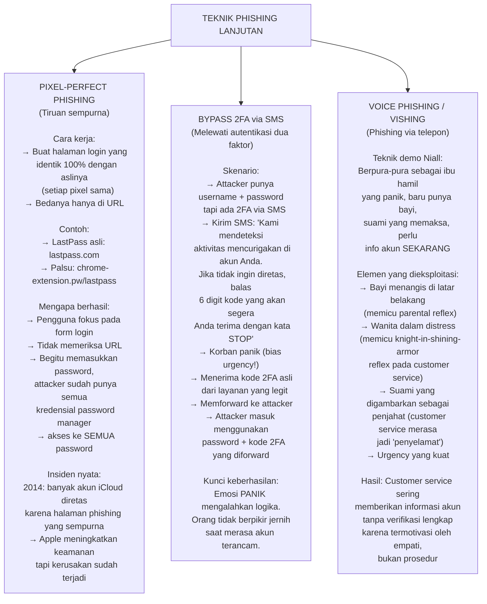
```mermaid
graph TD
    A["TEKNIK PHISHING LANJUTAN"]
    
    A --> B["PIXEL-PERFECT PHISHING\n(Tiruan sempurna)\n\nCara kerja:\n→ Buat halaman login yang\n   identik 100% dengan aslinya\n   (setiap pixel sama)\n→ Bedanya hanya di URL\n\nContoh:\n→ LastPass asli: lastpass.com\n→ Palsu: chrome-extension.pw/lastpass\n\nMengapa berhasil:\n→ Pengguna fokus pada form login\n→ Tidak memeriksa URL\n→ Begitu memasukkan password,\n  attacker sudah punya semua\n  kredensial password manager\n  → akses ke SEMUA password\n\nInsiden nyata:\n2014: banyak akun iCloud diretas\nkarena halaman phishing yang sempurna\n→ Apple meningkatkan keamanan\n   tapi kerusakan sudah terjadi"]
    
    A --> C["BYPASS 2FA via SMS\n(Melewati autentikasi dua faktor)\n\nSkenario:\n→ Attacker punya username + password\n   tapi ada 2FA via SMS\n→ Kirim SMS: 'Kami mendeteksi\n  aktivitas mencurigakan di akun Anda.\n  Jika tidak ingin diretas, balas\n  6 digit kode yang akan segera\n  Anda terima dengan kata STOP'\n→ Korban panik (bias urgency!)\n→ Menerima kode 2FA asli\n   dari layanan yang legit\n→ Memforward ke attacker\n→ Attacker masuk menggunakan\n   password + kode 2FA yang diforward\n\nKunci keberhasilan:\nEmosi PANIK mengalahkan logika.\nOrang tidak berpikir jernih\nsaat merasa akun terancam."]
    
    A --> D["VOICE PHISHING / VISHING\n(Phishing via telepon)\n\nTeknik demo Niall:\nBerpura-pura sebagai ibu hamil\nyang panik, baru punya bayi,\nsuami yang memaksa, perlu\ninfo akun SEKARANG\n\nElemen yang dieksploitasi:\n→ Bayi menangis di latar belakang\n  (memicu parental reflex)\n→ Wanita dalam distress\n  (memicu knight-in-shining-armor\n  reflex pada customer service)\n→ Suami yang digambarkan sebagai\n  penjahat (customer service merasa\n  jadi 'penyelamat')\n→ Urgency yang kuat\n\nHasil: Customer service sering\nmemberikan informasi akun\ntanpa verifikasi lengkap\nkarena termotivasi oleh empati,\nbukan prosedur"]
```

---

## 🎭 Bagian 6: Social Contracts dan Stereotipe sebagai Senjata

Social contracts (*kontrak sosial*) adalah aturan tidak tertulis tentang cara berperilaku yang kita pelajari sejak kecil: buka pintu untuk orang yang tangannya penuh, berikan tempat duduk untuk ibu hamil, bantu anak yang menangis.

*Social engineers* memanfaatkan nilai-nilai baik ini melawan kita.

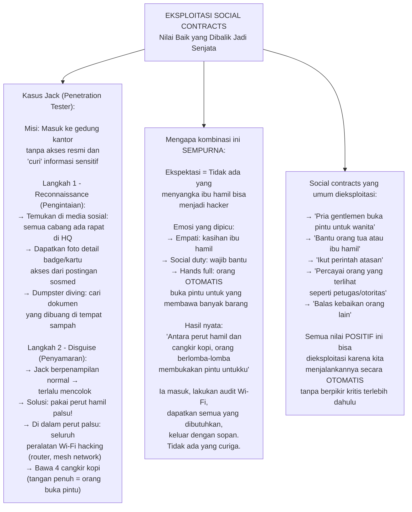
```mermaid
graph TD
    A["EKSPLOITASI SOCIAL CONTRACTS\nNilai Baik yang Dibalik Jadi Senjata"]
    
    A --> B["Kasus Jack (Penetration Tester):\n\nMisi: Masuk ke gedung kantor\ntanpa akses resmi dan\n'curi' informasi sensitif\n\nLangkah 1 - Reconnaissance (Pengintaian):\n→ Temukan di media sosial:\n  semua cabang ada rapat di HQ\n→ Dapatkan foto detail badge/kartu\n  akses dari postingan sosmed\n→ Dumpster diving: cari dokumen\n  yang dibuang di tempat sampah\n\nLangkah 2 - Disguise (Penyamaran):\n→ Jack berpenampilan normal →\n  terlalu mencolok\n→ Solusi: pakai perut hamil palsu!\n→ Di dalam perut palsu: seluruh\n  peralatan Wi-Fi hacking\n  (router, mesh network)\n→ Bawa 4 cangkir kopi\n  (tangan penuh = orang buka pintu)"]
    
    A --> C["Mengapa kombinasi ini SEMPURNA:\n\nEkspektasi = Tidak ada yang\nmenyangka ibu hamil bisa\nmenjadi hacker\n\nEmosi yang dipicu:\n→ Empati: kasihan ibu hamil\n→ Social duty: wajib bantu\n→ Hands full: orang OTOMATIS\n  buka pintu untuk yang\n  membawa banyak barang\n\nHasil nyata:\n'Antara perut hamil dan\ncangkir kopi, orang berlomba-lomba\nmembukakan pintu untukku'\n\nIa masuk, lakukan audit Wi-Fi,\ndapatkan semua yang dibutuhkan,\nkeluar dengan sopan.\nTidak ada yang curiga."]
    
    A --> D["Social contracts yang umum dieksploitasi:\n\n→ 'Pria gentlemen buka pintu untuk wanita'\n→ 'Bantu orang tua atau ibu hamil'\n→ 'Ikut perintah atasan'\n→ 'Percayai orang yang terlihat\n   seperti petugas/otoritas'\n→ 'Balas kebaikan orang lain'\n\nSemua nilai POSITIF ini bisa\ndieksploitasi karena kita\nmenjalankannya secara OTOMATIS\ntanpa berpikir kritis terlebih dahulu"]
```

### 🌍 Stereotipe Sebagai Perlindungan dan Penyerangan

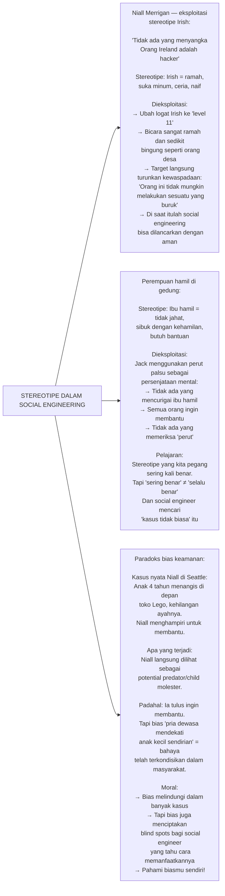
```mermaid
graph LR
    A["STEREOTIPE DALAM SOCIAL ENGINEERING"]
    
    A --> B["Niall Merrigan — eksploitasi\nstereotipe Irish:\n\n'Tidak ada yang menyangka\nOrang Ireland adalah hacker'\n\nStereotipe: Irish = ramah,\nsuka minum, ceria, naif\n\nDieksploitasi:\n→ Ubah logat Irish ke 'level 11'\n→ Bicara sangat ramah dan sedikit\n  bingung seperti orang desa\n→ Target langsung turunkan kewaspadaan:\n  'Orang ini tidak mungkin\n  melakukan sesuatu yang buruk'\n→ Di saat itulah social engineering\n  bisa dilancarkan dengan aman"]
    
    A --> C["Perempuan hamil di gedung:\n\nStereotipe: Ibu hamil = tidak jahat,\nsibuk dengan kehamilan,\nbutuh bantuan\n\nDieksploitasi:\nJack menggunakan perut palsu sebagai\npersenjataan mental:\n→ Tidak ada yang mencurigai ibu hamil\n→ Semua orang ingin membantu\n→ Tidak ada yang memeriksa 'perut'\n\nPelajaran:\nStereotipe yang kita pegang\nsering kali benar.\nTapi 'sering benar' ≠ 'selalu benar'\nDan social engineer mencari\n'kasus tidak biasa' itu"]
    
    A --> D["Paradoks bias keamanan:\n\nKasus nyata Niall di Seattle:\nAnak 4 tahun menangis di depan\ntoko Lego, kehilangan ayahnya.\nNiall menghampiri untuk membantu.\n\nApa yang terjadi:\nNiall langsung dilihat sebagai\npotential predator/child molester.\n\nPadahal: Ia tulus ingin membantu.\nTapi bias 'pria dewasa mendekati\nanak kecil sendirian' = bahaya\ntelah terkondisikan dalam masyarakat.\n\nMoral:\n→ Bias melindungi dalam banyak kasus\n→ Tapi bias juga menciptakan\n  blind spots bagi social engineer\n  yang tahu cara memanfaatkannya\n→ Pahami biasmu sendiri!"]
```

---

## 🤝 Bagian 7: Benjamin Franklin Effect — Paradoks Meminta Bantuan

Ini adalah salah satu insight paling counterintuitive (*berlawanan dengan intuisi*) dalam seluruh talk:

> *"Jika kamu pergi menawarkan bantuan kepada seseorang, mereka akan menolak. Tapi jika kamu meminta bantuan kecil kepada seseorang, mereka lebih mungkin membantu lagi — dan lagi — dan lagi."*

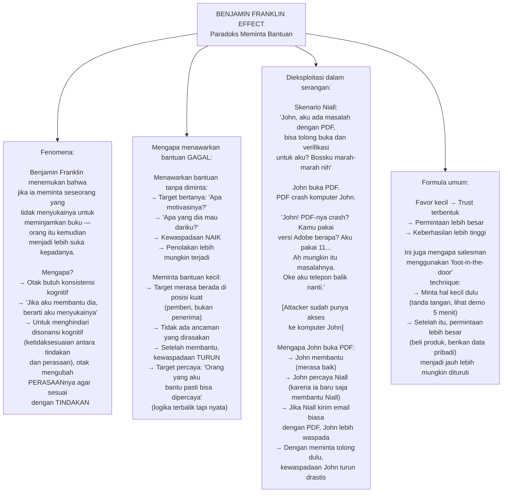
```mermaid
graph TD
    A["BENJAMIN FRANKLIN EFFECT\nParadoks Meminta Bantuan"]
    
    A --> B["Fenomena:\n\nBenjamin Franklin menemukan bahwa\njika ia meminta seseorang yang\ntidak menyukainya untuk\nmeminjamkan buku —\norang itu kemudian\nmenjadi lebih suka kepadanya.\n\nMengapa?\n→ Otak butuh konsistensi kognitif\n→ 'Jika aku membantu dia,\n   berarti aku menyukainya'\n→ Untuk menghindari disonansi kognitif\n   (ketidaksesuaian antara tindakan\n   dan perasaan), otak mengubah\n   PERASAANnya agar sesuai\n   dengan TINDAKAN"]
    
    A --> C["Mengapa menawarkan bantuan GAGAL:\n\nMenawarkan bantuan tanpa diminta:\n→ Target bertanya: 'Apa motivasinya?'\n→ 'Apa yang dia mau dariku?'\n→ Kewaspadaan NAIK\n→ Penolakan lebih mungkin terjadi\n\nMeminta bantuan kecil:\n→ Target merasa berada di posisi kuat\n   (pemberi, bukan penerima)\n→ Tidak ada ancaman yang dirasakan\n→ Setelah membantu, kewaspadaan TURUN\n→ Target percaya: 'Orang yang aku\n   bantu pasti bisa dipercaya'\n   (logika terbalik tapi nyata)"]
    
    A --> D["Dieksploitasi dalam serangan:\n\nSkenario Niall:\n'John, aku ada masalah dengan PDF,\nbisa tolong buka dan verifikasi\nuntuk aku? Bossku marah-marah nih'\n\nJohn buka PDF.\nPDF crash komputer John.\n\n'John! PDF-nya crash? Kamu pakai\nversi Adobe berapa? Aku pakai 11...\nAh mungkin itu masalahnya.\nOke aku telepon balik nanti.'\n\n[Attacker sudah punya akses\nke komputer John]\n\nMengapa John buka PDF:\n→ John membantu (merasa baik)\n→ John percaya Niall\n   (karena ia baru saja membantu Niall)\n→ Jika Niall kirim email biasa\n   dengan PDF, John lebih waspada\n→ Dengan meminta tolong dulu,\n   kewaspadaan John turun drastis"]
    
    A --> E["Formula umum:\n\nFavor kecil → Trust terbentuk\n→ Permintaan lebih besar\n→ Keberhasilan lebih tinggi\n\nIni juga mengapa salesman\nmenggunakan 'foot-in-the-door'\ntechnique:\n→ Minta hal kecil dulu\n   (tanda tangan, lihat demo 5 menit)\n→ Setelah itu, permintaan lebih besar\n   (beli produk, berikan data pribadi)\n   menjadi jauh lebih mungkin dituruti"]
```

---

## 💻 Bagian 8: Dave — Musuh Terbesar Keamanan

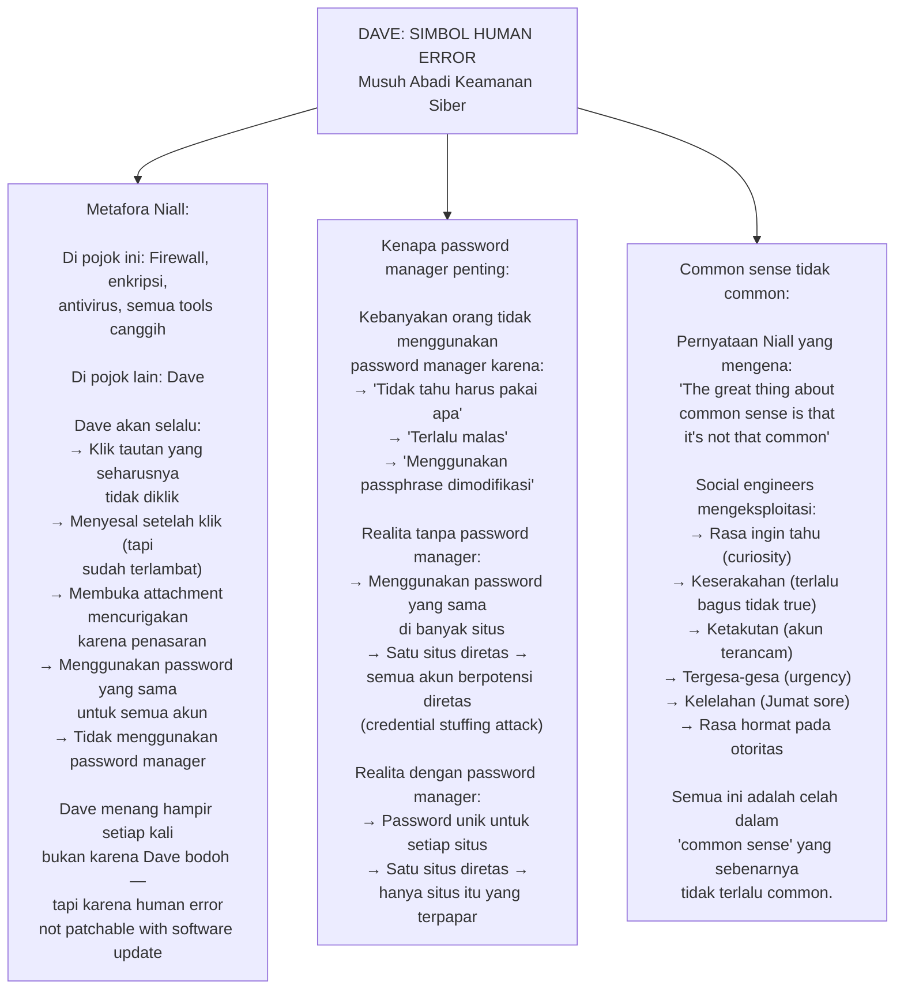
```mermaid
graph TD
    A["DAVE: SIMBOL HUMAN ERROR\nMusuh Abadi Keamanan Siber"]
    
    A --> B["Metafora Niall:\n\nDi pojok ini: Firewall, enkripsi,\nantivirus, semua tools canggih\n\nDi pojok lain: Dave\n\nDave akan selalu:\n→ Klik tautan yang seharusnya\n  tidak diklik\n→ Menyesal setelah klik (tapi\n  sudah terlambat)\n→ Membuka attachment mencurigakan\n  karena penasaran\n→ Menggunakan password yang sama\n  untuk semua akun\n→ Tidak menggunakan password manager\n\nDave menang hampir setiap kali\nbukan karena Dave bodoh —\ntapi karena human error\nnot patchable with software update"]
    
    A --> C["Kenapa password manager penting:\n\nKebanyakan orang tidak menggunakan\npassword manager karena:\n→ 'Tidak tahu harus pakai apa'\n→ 'Terlalu malas'\n→ 'Menggunakan passphrase dimodifikasi'\n\nRealita tanpa password manager:\n→ Menggunakan password yang sama\n  di banyak situs\n→ Satu situs diretas →\n  semua akun berpotensi diretas\n  (credential stuffing attack)\n\nRealita dengan password manager:\n→ Password unik untuk setiap situs\n→ Satu situs diretas →\n  hanya situs itu yang terpapar"]
    
    A --> D["Common sense tidak common:\n\nPernyataan Niall yang mengena:\n'The great thing about\ncommon sense is that\nit's not that common'\n\nSocial engineers mengeksploitasi:\n→ Rasa ingin tahu (curiosity)\n→ Keserakahan (terlalu bagus tidak true)\n→ Ketakutan (akun terancam)\n→ Tergesa-gesa (urgency)\n→ Kelelahan (Jumat sore)\n→ Rasa hormat pada otoritas\n\nSemua ini adalah celah dalam\n'common sense' yang sebenarnya\ntidak terlalu common."]
```

---

## 🔑 Bagian 9: Cara Kerja Lengkap — Sistem Social Engineering

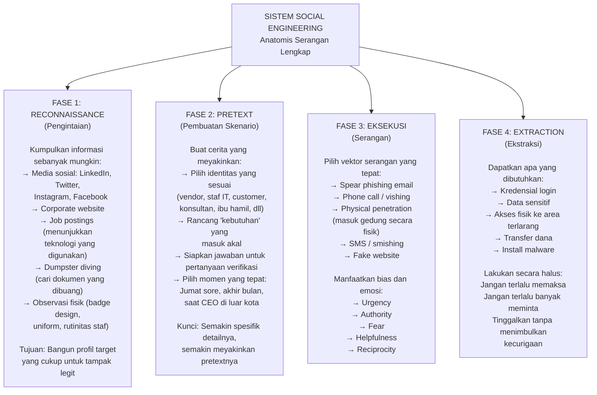
```mermaid
graph TD
    A["SISTEM SOCIAL ENGINEERING\nAnatomis Serangan Lengkap"]
    
    A --> B["FASE 1: RECONNAISSANCE\n(Pengintaian)\n\nKumpulkan informasi sebanyak mungkin:\n→ Media sosial: LinkedIn, Twitter,\n   Instagram, Facebook\n→ Corporate website\n→ Job postings (menunjukkan\n   teknologi yang digunakan)\n→ Dumpster diving\n   (cari dokumen yang dibuang)\n→ Observasi fisik (badge design,\n   uniform, rutinitas staf)\n\nTujuan: Bangun profil target\nyang cukup untuk tampak legit"]
    
    A --> C["FASE 2: PRETEXT\n(Pembuatan Skenario)\n\nBuat cerita yang meyakinkan:\n→ Pilih identitas yang sesuai\n  (vendor, staf IT, customer,\n  konsultan, ibu hamil, dll)\n→ Rancang 'kebutuhan' yang\n  masuk akal\n→ Siapkan jawaban untuk\n  pertanyaan verifikasi\n→ Pilih momen yang tepat:\n  Jumat sore, akhir bulan,\n  saat CEO di luar kota\n\nKunci: Semakin spesifik detailnya,\nsemakin meyakinkan pretextnya"]
    
    A --> D["FASE 3: EKSEKUSI\n(Serangan)\n\nPilih vektor serangan yang tepat:\n→ Spear phishing email\n→ Phone call / vishing\n→ Physical penetration\n  (masuk gedung secara fisik)\n→ SMS / smishing\n→ Fake website\n\nManfaatkan bias dan emosi:\n→ Urgency\n→ Authority\n→ Fear\n→ Helpfulness\n→ Reciprocity"]
    
    A --> E["FASE 4: EXTRACTION\n(Ekstraksi)\n\nDapatkan apa yang dibutuhkan:\n→ Kredensial login\n→ Data sensitif\n→ Akses fisik ke area terlarang\n→ Transfer dana\n→ Install malware\n\nLakukan secara halus:\nJangan terlalu memaksa\nJangan terlalu banyak meminta\nTinggalkan tanpa menimbulkan\nkecurigaan"]
```

---

## 🛡️ Bagian 10: Cara Melindungi Diri

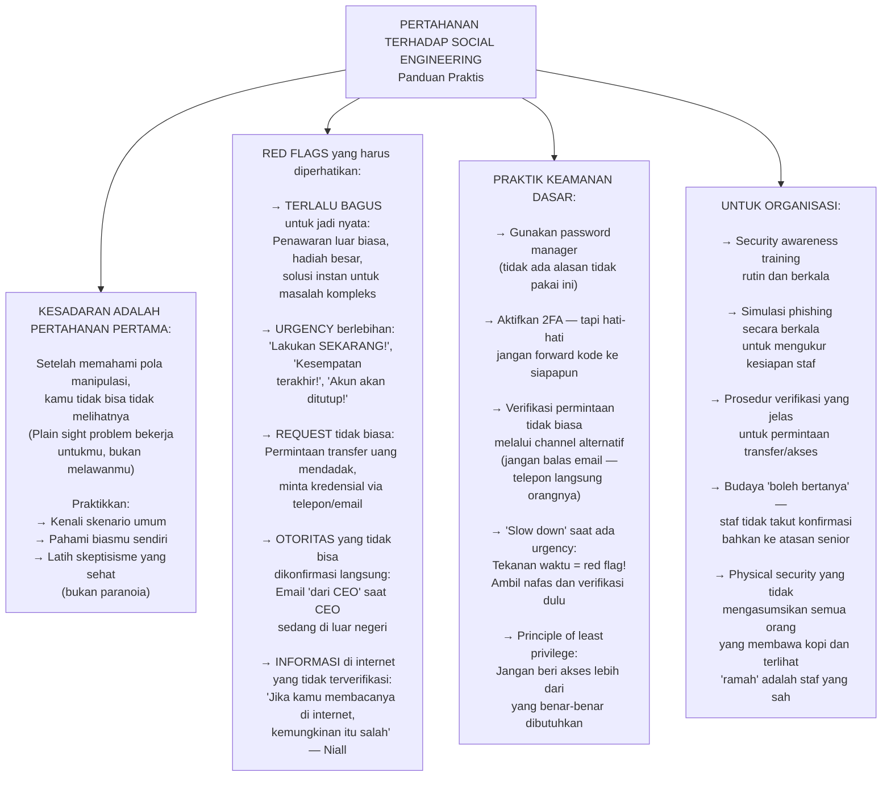
```mermaid
graph TD
    A["PERTAHANAN TERHADAP SOCIAL ENGINEERING\nPanduan Praktis"]
    
    A --> B["KESADARAN ADALAH PERTAHANAN PERTAMA:\n\nSetelah memahami pola manipulasi,\nkamu tidak bisa tidak melihatnya\n(Plain sight problem bekerja\nuntukmu, bukan melawanmu)\n\nPraktikkan:\n→ Kenali skenario umum\n→ Pahami biasmu sendiri\n→ Latih skeptisisme yang sehat\n   (bukan paranoia)"]
    
    A --> C["RED FLAGS yang harus diperhatikan:\n\n→ TERLALU BAGUS untuk jadi nyata:\n   Penawaran luar biasa, hadiah besar,\n   solusi instan untuk masalah kompleks\n\n→ URGENCY berlebihan:\n   'Lakukan SEKARANG!', 'Kesempatan\n   terakhir!', 'Akun akan ditutup!'\n\n→ REQUEST tidak biasa:\n   Permintaan transfer uang mendadak,\n   minta kredensial via telepon/email\n\n→ OTORITAS yang tidak bisa\n   dikonfirmasi langsung:\n   Email 'dari CEO' saat CEO\n   sedang di luar negeri\n\n→ INFORMASI di internet\n   yang tidak terverifikasi:\n   'Jika kamu membacanya di internet,\n   kemungkinan itu salah' — Niall"]
    
    A --> D["PRAKTIK KEAMANAN DASAR:\n\n→ Gunakan password manager\n   (tidak ada alasan tidak pakai ini)\n\n→ Aktifkan 2FA — tapi hati-hati\n   jangan forward kode ke siapapun\n\n→ Verifikasi permintaan tidak biasa\n   melalui channel alternatif\n   (jangan balas email —\n   telepon langsung orangnya)\n\n→ 'Slow down' saat ada urgency:\n   Tekanan waktu = red flag!\n   Ambil nafas dan verifikasi dulu\n\n→ Principle of least privilege:\n   Jangan beri akses lebih dari\n   yang benar-benar dibutuhkan"]
    
    A --> E["UNTUK ORGANISASI:\n\n→ Security awareness training\n   rutin dan berkala\n\n→ Simulasi phishing secara berkala\n   untuk mengukur kesiapan staf\n\n→ Prosedur verifikasi yang jelas\n   untuk permintaan transfer/akses\n\n→ Budaya 'boleh bertanya' —\n   staf tidak takut konfirmasi\n   bahkan ke atasan senior\n\n→ Physical security yang tidak\n   mengasumsikan semua orang\n   yang membawa kopi dan terlihat\n   'ramah' adalah staf yang sah"]
```

---

## 🗺️ Peta Besar: Social Engineering dalam Kehidupan Sehari-hari

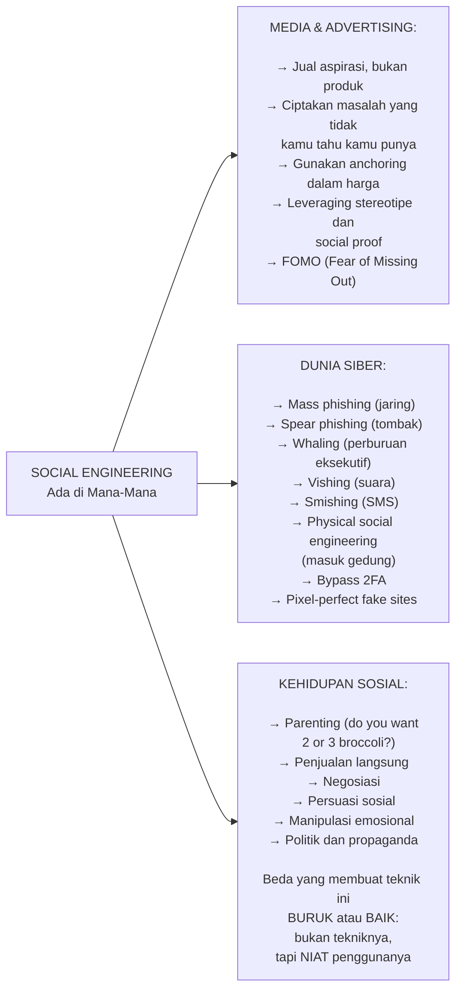
```mermaid
graph LR
    A["SOCIAL ENGINEERING\nAda di Mana-Mana"]
    
    A --> B["MEDIA & ADVERTISING:\n\n→ Jual aspirasi, bukan produk\n→ Ciptakan masalah yang tidak\n   kamu tahu kamu punya\n→ Gunakan anchoring dalam harga\n→ Leveraging stereotipe dan\n   social proof\n→ FOMO (Fear of Missing Out)"]
    
    A --> C["DUNIA SIBER:\n\n→ Mass phishing (jaring)\n→ Spear phishing (tombak)\n→ Whaling (perburuan eksekutif)\n→ Vishing (suara)\n→ Smishing (SMS)\n→ Physical social engineering\n   (masuk gedung)\n→ Bypass 2FA\n→ Pixel-perfect fake sites"]
    
    A --> D["KEHIDUPAN SOSIAL:\n\n→ Parenting (do you want\n   2 or 3 broccoli?)\n→ Penjualan langsung\n→ Negosiasi\n→ Persuasi sosial\n→ Manipulasi emosional\n→ Politik dan propaganda\n\nBeda yang membuat teknik ini\nBURUK atau BAIK:\nbukan tekniknya,\ntapi NIAT penggunanya"]
```

---

## 💡 Kesimpulan: Kenali Triknya, Lindungi Dirimu

Niall Merrigan menutup talk-nya dengan ringkasan yang sederhana namun sangat padat:

> *"Social engineering adalah penggunaan trik-trik kotor untuk mendapatkan apa yang kamu inginkan. Kita menggunakan berbagai lever psikologis, sosiologis, dan ideologis untuk membuat orang bertindak melawan kepentingan mereka sendiri. Dan yang paling buruk: ini tidak pernah kasar. Selalu halus."*

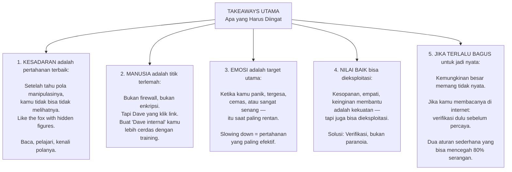
```mermaid
graph TD
    A["TAKEAWAYS UTAMA\nApa yang Harus Diingat"]
    
    A --> B["1. KESADARAN adalah pertahanan terbaik:\n\nSetelah tahu pola manipulasinya,\nkamu tidak bisa tidak melihatnya.\nLike the fox with hidden figures.\n\nBaca, pelajari, kenali polanya."]
    
    A --> C["2. MANUSIA adalah titik terlemah:\n\nBukan firewall, bukan enkripsi.\nTapi Dave yang klik link.\nBuat 'Dave internal' kamu\nlebih cerdas dengan training."]
    
    A --> D["3. EMOSI adalah target utama:\n\nKetika kamu panik, tergesa,\ncemas, atau sangat senang —\nitu saat paling rentan.\n\nSlowing down = pertahanan\nyang paling efektif."]
    
    A --> E["4. NILAI BAIK bisa dieksploitasi:\n\nKesopanan, empati, keinginan membantu\nadalah kekuatan —\ntapi juga bisa dieksploitasi.\n\nSolusi: Verifikasi, bukan paranoia."]
    
    A --> F["5. JIKA TERLALU BAGUS untuk jadi nyata:\n\nKemungkinan besar memang tidak nyata.\n\nJika kamu membacanya di internet:\nverifikasi dulu sebelum percaya.\n\nDua aturan sederhana yang\nbisa mencegah 80% serangan."]
```

*Social engineering tidak akan pernah hilang karena ia mengeksploitasi sesuatu yang tidak bisa di-patch: sifat manusia. Tapi dengan kesadaran, pemahaman pola, dan sedikit skeptisisme yang sehat — kamu bisa menjadi target yang jauh lebih sulit.* 🛡️🧠

---

## 📚 Glosarium Lengkap

| Istilah | Bahasa Asli | Makna dalam Bahasa Indonesia |
|---|---|---|
| **Social Engineering** | Inggris | Rekayasa sosial — seni mengeksploitasi psikologi manusia untuk mendapatkan akses atau informasi yang tidak seharusnya |
| **Phishing** | Inggris | Serangan memancing — mengirim pesan palsu untuk memancing korban memberikan informasi sensitif |
| **Spear Phishing** | Inggris | Phishing bertarget — serangan yang sangat personal menggunakan informasi spesifik tentang korban |
| **Whaling** | Inggris | Perburuan ikan paus — phishing yang menargetkan eksekutif senior (CEO, CFO, dll.) |
| **Vishing** | Inggris | Voice phishing — penipuan via telepon |
| **Smishing** | Inggris | SMS phishing — penipuan via pesan teks |
| **Cognitive Bias** | Inggris | Bias kognitif — kecenderungan pikiran membuat keputusan dengan cara yang dapat diprediksi dan sering tidak rasional |
| **Anchoring Bias** | Inggris | Bias penjangkaran — kecenderungan pikiran terpengaruh oleh informasi pertama yang diterima sebagai titik referensi |
| **Authority Bias** | Inggris | Bias otoritas — kecenderungan mengikuti perintah figur yang dianggap memiliki otoritas |
| **Reciprocity** | Latin | Timbal balik — prinsip sosial bahwa kita merasa wajib membalas bantuan yang telah diberikan |
| **Benjamin Franklin Effect** | Inggris | Efek Benjamin Franklin — fenomena di mana seseorang yang melakukan kebaikan cenderung menyukai orang yang dibantu |
| **Social Contracts** | Inggris | Kontrak sosial — aturan tidak tertulis tentang perilaku yang diterima dalam masyarakat |
| **Pixel-Perfect Phishing** | Inggris | Phishing sempurna piksel — pembuatan situs palsu yang identik secara visual dengan situs asli |
| **Pretext** | Latin | Dalih atau skenario palsu yang dibuat untuk meyakinkan korban |
| **Reconnaissance** | Perancis | Pengintaian — pengumpulan informasi tentang target sebelum serangan |
| **Dumpster Diving** | Inggris | Penggalian tempat sampah — mencari informasi berharga dari dokumen yang dibuang |
| **Credential Stuffing** | Inggris | Penyisian kredensial — menggunakan daftar username/password yang bocor dari satu situs untuk mencoba masuk ke situs lain |
| **2FA / Two-Factor Authentication** | Inggris | Autentikasi dua faktor — lapisan keamanan tambahan yang membutuhkan dua bentuk verifikasi |
| **Human Error** | Inggris | Kesalahan manusia — faktor keamanan paling tidak terprediksi dan paling sering menjadi titik gagal |
| **Plain Sight Problem** | Inggris | Masalah jelas terlihat — fenomena di mana sesuatu yang tadinya tidak terlihat menjadi sangat jelas setelah konteks diketahui |
| **Social Proof** | Inggris | Bukti sosial — kecenderungan mengikuti apa yang dilakukan orang banyak |
| **FOMO** | Inggris | *Fear of Missing Out* — rasa takut ketinggalan; dieksploitasi dalam urgency marketing dan scams |
| **Foot-in-the-door** | Inggris | Teknik penjualan/persuasi: minta hal kecil dahulu, lalu ikuti dengan permintaan yang lebih besar |
| **Disonans kognitif** | Latin | *Cognitive dissonance* — ketidaknyamanan mental saat tindakan dan kepercayaan bertentangan; mendorong perubahan sikap |
| **Password Manager** | Inggris | Manajer kata sandi — aplikasi yang menyimpan dan menghasilkan kata sandi unik untuk setiap situs |
| **Malware** | Inggris | *Malicious software* — perangkat lunak berbahaya yang dirancang untuk merusak atau mendapatkan akses tanpa izin |
| **Penetration Tester** | Inggris | Penguji penetrasi — profesional keamanan yang dibayar untuk mencoba masuk ke sistem secara legal untuk menguji keamanan |

---

*Sumber video: [The Psychology of Social Engineering — Niall Merrigan — NDC Conference — YouTube](https://www.youtube.com/watch?v=wDY_SPfed7c)*

*Tentang pembicara: Niall Merrigan adalah Head of Cybersecurity untuk Capgemini Norwegia, Microsoft MVP, dan Azure Advisor. Talk ini disampaikan di NDC (Norwegian Developers Conference).*
