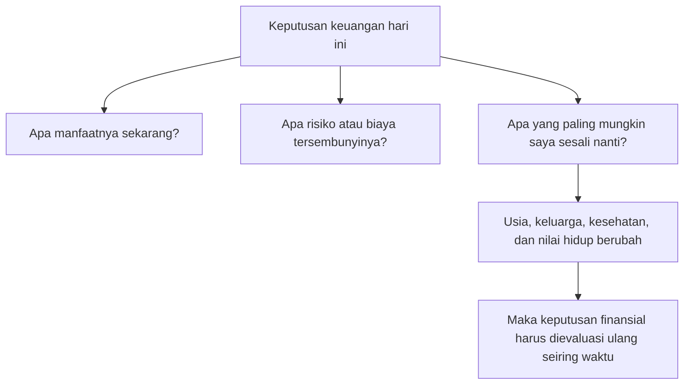
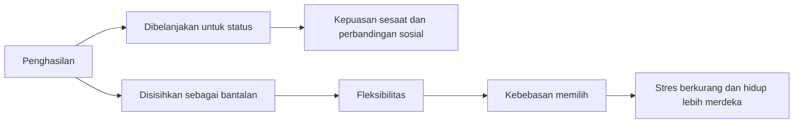
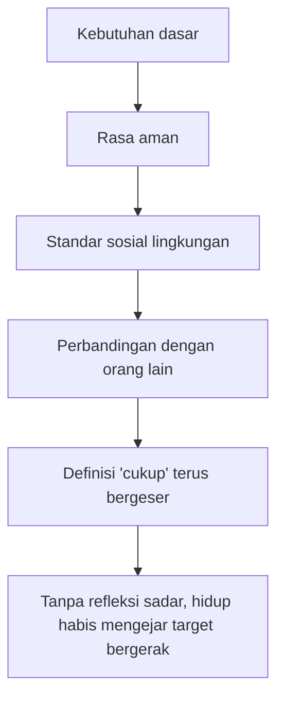

## 💰 Pendahuluan: Masalah Uang Ternyata Jarang Murni Soal Uang

Banyak orang mengira persoalan uang adalah persoalan matematika. Hitung pemasukan, kurangi pengeluaran, sisihkan tabungan, investasikan sisanya, selesai. Secara teori, memang terdengar rapi. Tetapi dalam hidup nyata, uang hampir tidak pernah berperilaku sebersih rumus. Uang selalu menyentuh wilayah yang jauh lebih rumit: **rasa aman, harga diri, masa kecil, rasa takut, status sosial, hubungan keluarga, identitas, dan bayangan tentang masa depan**. 🧠

Itulah sebabnya pembahasan Morgan Housel terasa sangat penting. Ia tidak memulai dari angka, melainkan dari manusia. Ia tidak bertanya pertama-tama, “berapa return investasi terbaik?” tetapi “**mengapa manusia bertindak seperti itu terhadap uang?**” Dan begitu pertanyaan ini dibuka, kita segera sadar bahwa kebanyakan keputusan finansial tidak dibuat oleh kalkulator, melainkan oleh campuran emosi, pengalaman hidup, tekanan sosial, dan kebiasaan psikologis yang sudah sangat tua. 📉📈

Dalam percakapan panjang bersama Andrew Huberman, Morgan Housel membongkar satu per satu asumsi populer tentang uang. Ia menunjukkan bahwa:
- orang jarang “gila” dalam mengelola uang; mereka biasanya hanya punya cerita hidup yang orang lain tidak lihat,
- uang memang tidak otomatis membeli kebahagiaan, tetapi jelas bisa mengurangi stres dan membuka ruang hidup yang lebih manusiawi,
- terlalu hemat maupun terlalu boros sama-sama bisa menjadi bentuk ekstrem yang berbahaya,
- dan tujuan tertinggi uang seharusnya bukan pameran status, melainkan **kebebasan**. 🕊️

Artikel ini akan mengembangkan gagasan-gagasan itu secara **detail, mendalam, dan runtut**. Bukan hanya untuk membantu kita mengerti uang, tetapi untuk membantu kita mengerti **diri kita sendiri ketika berhadapan dengan uang**. Karena sering kali, yang sebenarnya kita kejar bukan uang itu sendiri, melainkan:
- rasa aman,
- rasa cukup,
- rasa dihormati,
- rasa tidak tertinggal,
- atau harapan bahwa hidup suatu hari akan terasa lebih ringan. ✨

---

## 🧭 Tesis Utama: Uang Adalah Alat Psikologis, Bukan Sekadar Alat Ekonomi

Kalau artikel ini harus dipadatkan ke dalam satu tesis besar, maka tesisnya adalah:

> **uang paling tepat dipahami bukan hanya sebagai alat tukar atau alat akumulasi, tetapi sebagai alat psikologis yang membentuk rasa aman, kebebasan, identitas, dan kualitas relasi kita dengan hidup.**

Masalahnya, banyak orang memperlakukan uang seolah ia adalah penentu nilai diri. Uang berubah dari alat menjadi cermin. Kita mulai menatap saldo rekening seperti menatap harga diri. Kita mulai melihat rumah, mobil, jumlah followers, atau net worth sebagai indikator apakah kita “menang” atau “kalah” dalam hidup. Dan saat itu terjadi, uang berhenti melayani kita — **kitalah yang mulai melayani uang**. ⛓️

Morgan Housel berkali-kali mengingatkan bahwa kesalahan paling berbahaya dalam kehidupan finansial bukan sekadar salah investasi. Kesalahan paling berbahaya adalah ketika kita salah mendefinisikan **untuk apa uang itu sebenarnya ada**.

---

## 🧠 Bagian 1: “No One Is Crazy” — Orang Tidak Gila, Mereka Hanya Membawa Riwayat Hidup yang Berbeda

Salah satu gagasan pembuka Morgan Housel yang paling kuat adalah kalimat: **“No one is crazy.”** Ini bukan berarti semua keputusan keuangan orang masuk akal secara objektif. Bukan. Maksudnya adalah bahwa perilaku finansial seseorang hampir selalu punya latar belakang yang, kalau kita tahu seluruh ceritanya, akan terasa jauh lebih bisa dimengerti. 🧠

Orang yang terlalu boros mungkin tidak sekadar “tidak disiplin.” Bisa jadi ia tumbuh dalam kekurangan dan sekarang ingin memastikan dirinya tidak pernah lagi merasa tertinggal. Orang yang menimbun uang berlebihan mungkin tidak sekadar “pelit.” Bisa jadi ia pernah hidup dalam ketidakpastian besar dan kini menjadikan tabungan sebagai benteng psikologis. Orang yang mengambil risiko besar mungkin tidak sekadar nekat. Bisa jadi seluruh identitasnya dibangun dari keyakinan bahwa hidup hanya berarti kalau ia berani mempertaruhkan sesuatu. 🎲

Di sini Morgan memakai satu prinsip yang sangat penting, mirip dengan dunia pekerjaan sosial: **“all behavior makes sense with enough information”** — semua perilaku akan tampak masuk akal jika kita punya cukup informasi. 

Ini sangat relevan untuk uang. Karena uang bukan cuma angka; ia menyimpan sejarah. Cara orang:
- membelanjakan uang,
- menabung uang,
- takut kehilangan uang,
- atau justru sembrono terhadap uang,
sering kali sangat dipengaruhi oleh:
- keluarga tempat ia tumbuh,
- generasi ekonomi yang ia alami,
- trauma masa kecil,
- cara orang tuanya bicara tentang uang,
- pengalaman jatuh miskin atau melihat orang lain jatuh miskin,
- dan kelas sosial tempat ia dibesarkan. 🏠

Maka pelajaran pertama yang sangat penting adalah: **dalam urusan uang, memahami perilaku lebih penting daripada cepat-cepat menghakimi.**

<Callout type="important" title="Mengapa Ini Penting?">
Karena begitu kita sadar bahwa perilaku keuangan banyak dipengaruhi oleh pengalaman hidup, kita jadi lebih rendah hati. Kita tidak lagi gegabah menyebut orang lain bodoh, pelit, atau konsumtif tanpa memahami narasi yang membentuk mereka. Dan yang lebih penting: kita juga mulai memeriksa narasi yang diam-diam membentuk diri kita sendiri. 🪞
</Callout>

---

## 🧾 Bagian 2: Uang Bukan Matematika Murni, Melainkan Campuran Matematika dan Emosi

Dalam buku-buku keuangan klasik, orang sering diberi kesan bahwa keputusan finansial terbaik akan muncul otomatis kalau kita cukup rasional. Masalahnya, manusia tidak hidup sebagai spreadsheet. Kita hidup sebagai makhluk yang:
- lelah,
- cemas,
- membandingkan diri,
- takut ditolak,
- ingin dicintai,
- ingin dianggap berhasil,
- dan sering mengambil keputusan dari campuran naluri serta emosi. 📊❤️

Morgan Housel menegaskan bahwa perilaku finansial jauh lebih dekat dengan **psikologi** daripada dengan **matematika murni**. Karena yang menentukan apakah orang benar-benar menabung, berinvestasi, atau hidup sederhana bukan cuma apakah mereka paham angka, tetapi apakah mereka sanggup menoleransi:
- ketidakpastian,
- penundaan kepuasan,
- rasa tertinggal dari orang lain,
- dan perubahan diri di masa depan yang belum bisa mereka prediksi. 

Di titik ini, uang sebenarnya mirip dengan kesehatan. Kita semua tahu bahwa tidur cukup, makan baik, olahraga, dan tidak merokok adalah resep masuk akal. Tetapi pengetahuan itu tidak otomatis berubah menjadi perilaku. Kenapa? Karena perilaku lebih rumit daripada teori. Uang juga begitu. 🛌🥗

---

## ⏳ Bagian 3: Future Regret — Keputusan Finansial Terbaik Sering Datang dari Pertanyaan yang Tidak Nyaman

Salah satu ide yang paling bernilai dari percakapan ini datang dari Daniel Kahneman, yang dikutip Morgan Housel: **hal terpenting dalam mengelola uang adalah punya sense yang cukup baik tentang future regret** *(penyesalan masa depan)*. 

Artinya, keputusan keuangan yang sehat tidak semata bertanya:
- “apa yang paling menguntungkan sekarang?”
- “apa yang paling logis di atas kertas?”

Tetapi juga bertanya:
- **“apa yang kemungkinan besar akan saya sesali nanti?”**

Ini pertanyaan yang sangat kuat. Karena uang selalu berhubungan dengan waktu. Dan waktu mengubah kita. Hal yang terasa benar ketika kita umur 25 belum tentu terasa benar ketika umur 45. Yang terasa aman saat belum punya anak belum tentu sama ketika sudah harus membayar sekolah, menjaga kesehatan orang tua, atau menyiapkan hari tua. ⏰

Morgan memberi contoh tentang dirinya sendiri sebagai orang yang cenderung hemat. Kalau ia mati besok, ia mungkin tidak akan menyesal tidak membeli mobil mewah atau tidak mengambil liburan mahal, karena ia justru akan lega mengetahui keluarganya aman. Tetapi apakah perasaan itu akan sama saat ia berusia 80 tahun? Belum tentu. Mungkin pada usia itu ia justru akan berkata: saya seharusnya hidup sedikit lebih longgar. 🧓

Ini menunjukkan sesuatu yang penting: **future regret itu dinamis**. Ia berubah bersama umur, tanggung jawab, kesehatan, dan perspektif.

Maka pengelolaan uang yang dewasa bukanlah mencari formula final sekali jadi. Ia lebih mirip proses mengkalibrasi diri berkali-kali sepanjang hidup. 🔧

---

## 🔮 Bagian 4: End of History Illusion — Kita Semua Merasa Sudah Final, Padahal Belum

Ada konsep psikologi yang sangat penting dalam percakapan ini, yaitu **end of history illusion**. Artinya, kita sadar bahwa diri kita telah banyak berubah dibanding 10–20 tahun lalu, tetapi kita cenderung percaya bahwa diri kita yang sekarang adalah versi yang relatif final. Padahal kemungkinan besar kita masih akan berubah banyak di masa depan. 🔮

Ini punya implikasi besar terhadap uang. Karena banyak orang membuat keputusan finansial seolah-olah:
- selera mereka akan tetap sama,
- kebutuhan mereka akan tetap sama,
- toleransi risikonya akan tetap sama,
- dan definisi “cukup” mereka tidak akan berubah.

Padahal semua itu bisa bergeser.

Orang muda sering merasa: nanti saya akan baik-baik saja hidup super hemat, yang penting cepat pensiun. Orang di fase lain merasa: yang penting sekarang nikmati hidup, nanti urusan belakangan. Kedua ekstrem ini bisa berbahaya kalau tidak mempertimbangkan bahwa **diri masa depan kita bukan salinan lurus dari diri sekarang**. 🪞

Inilah mengapa Morgan menyarankan agar kita menghindari ujung ekstrem. Karena ekstrem sering lahir dari keyakinan terlalu penuh bahwa kita tahu persis siapa diri kita di masa depan. Dan itu hampir selalu keliru.

---

## ⚖️ Bagian 5: Dua Ekstrem Berbahaya — Terlalu Hemat dan Terlalu Boros Sama-sama Bisa Salah

Banyak diskusi keuangan menganggap orang yang boros adalah masalah, sementara orang yang sangat hemat hampir otomatis dipuji. Morgan Housel menolak simplifikasi ini. Menurutnya, dua-duanya bisa salah kalau dibawa ke ujung ekstrem. ⚖️

### Ekstrem pertama: terlalu boros
Ini mudah dipahami. Orang yang hidup melebihi kemampuannya, mengejar gaya hidup, kredit konsumtif, dan simbol status berisiko besar menukar masa depan demi kepuasan sesaat. 

### Ekstrem kedua: terlalu hemat
Ini lebih jarang dibicarakan. Orang bisa begitu terobsesi menimbun uang sampai lupa hidup. Mereka menunda kegembiraan, menahan semua pengeluaran, tidak pernah menikmati hasil kerja, dan terus memindahkan kehidupan ke masa depan yang tak kunjung tiba. 

Di sini, uang juga bisa berubah menjadi penjara. Bedanya bukan penjara konsumsi, tetapi **penjara penundaan hidup**. ⛓️

Morgan mencontohkan gerakan *FIRE* *(Financial Independence, Retire Early — mandiri secara finansial dan pensiun dini)* di satu ujung, dan para spekulan “YOLO” di ujung lain. Keduanya berisiko sama-sama menyesal kelak. Yang satu mungkin menyesal karena mengorbankan terlalu banyak hidup demi tabungan. Yang lain menyesal karena membakar masa depan demi sensasi sesaat. 🔥

Pelajaran pentingnya: **kesehatan finansial bukan berada di sisi tertentu, tetapi dalam kemampuan menolak ekstrem yang menghapus fleksibilitas hidup.**

---

## 💳 Bagian 6: Kredit, Konsumsi, dan Lubang Psikologis yang Tidak Bisa Ditutup dengan Benda

Salah satu bagian paling tajam dari percakapan ini adalah pembahasan tentang **kredit**. Banyak orang mengira kredit hanya mempercepat konsumsi. Itu benar, tetapi Morgan menunjukkan sesuatu yang lebih dalam: kredit juga memberi orang **harapan palsu** bahwa lubang emosional dalam hidup bisa ditutup dengan pembelian. 💳

Urutannya sering seperti ini:
- seseorang merasa hidupnya kurang,
- ia berpikir kalau punya barang tertentu, hidup akan terasa lebih baik,
- ia membeli barang itu,
- ternyata rasa kurangnya tetap ada,
- lalu ia menyimpulkan bahwa yang kurang bukan barang itu saja, melainkan barang berikutnya. 

Akhirnya terbentuk spiral:
- mobil baru,
- lalu jam tangan,
- lalu rumah lebih besar,
- lalu liburan lebih mahal,
- lalu status lebih tinggi.

Karena kredit memungkinkan semua itu diakses lebih cepat, orang jadi lebih mudah menambal luka psikologis dengan barang yang dibiayai utang. Tetapi barang tidak menyelesaikan rasa hampa. Ia hanya menundanya. 🕳️

Ini yang membuat kredit berbahaya secara psikologis, bukan cuma secara finansial. Ia memperpanjang ilusi bahwa **“kalau saya punya ini, hidup saya akan baik-baik saja.”**

Padahal, sering kali yang hilang bukan mobil, bukan jam, bukan rumah. Yang hilang mungkin:
- makna,
- relasi,
- rasa dihargai,
- kesehatan,
- atau kesempatan hidup lebih jujur pada diri sendiri. 🌿

---

## 😊 Bagian 7: Money Can Buy Happiness? Ya, Tapi Hampir Selalu Tidak Langsung

Morgan Housel mengambil posisi yang lebih jujur daripada slogan populer “money can’t buy happiness.” Menurutnya, kalimat itu terlalu dangkal. Uang memang bisa meningkatkan kebahagiaan, tetapi **jalurnya biasanya tidak langsung**. 😊

Contohnya:
- rumah yang nyaman bisa membuat orang lebih bahagia, tetapi bukan semata karena bangunannya, melainkan karena rumah itu memungkinkan hubungan keluarga yang lebih hangat,
- liburan mahal bisa membuat orang bahagia, tetapi bukan semata karena hotelnya, melainkan karena memori dan kebersamaan yang terbentuk,
- memiliki cukup uang bisa membuat orang tenang, bukan karena angka itu sendiri sakral, tetapi karena angka itu **mengurangi stres**, **mengurangi ketakutan**, dan membuka ruang untuk hidup lebih manusiawi. 🏡🌴

Jadi kalau mau jujur, uang memang bisa membeli kebahagiaan — **asal kita tahu kebahagiaan macam apa yang sebenarnya sedang kita beli**.

Bukan gengsinya.
Bukan simbolnya.
Tetapi ruang bagi pengalaman, relasi, dan kebebasan. 

Morgan juga menekankan bahwa uang bisa menjadi **buffer stress** *(peredam stres)*. Ini sangat penting. Banyak penderitaan hidup bukan karena manusia butuh yacht atau rumah 20 kamar, tetapi karena mereka hidup terlalu dekat dengan jurang:
- gaji ke gaji,
- tidak punya bantalan darurat,
- takut kena PHK,
- takut tagihan medis,
- takut pendidikan anak tidak tertangani.

Dalam konteks ini, uang bukan soal kemewahan. Uang adalah **peredam kecemasan eksistensial**. 🛟

---

## 🕊️ Bagian 8: Tujuan Tertinggi Uang adalah Kebebasan, Bukan Pameran

Kalau ada satu konsep yang mungkin paling sentral dalam seluruh pembicaraan ini, itu adalah gagasan bahwa **tujuan tertinggi uang adalah kebebasan**. 🕊️

Bukan rumah lebih besar.
Bukan mobil lebih mahal.
Bukan terlihat unggul.
Bukan menang dari tetangga.

Tetapi **kebebasan**.

Kebebasan dalam arti:
- bisa berkata tidak pada pekerjaan yang menghancurkan,
- bisa pindah jalur saat perlu,
- bisa beristirahat saat tubuh menuntut,
- bisa hadir untuk keluarga,
- bisa mengambil keputusan tanpa sepenuhnya menjadi budak ketakutan finansial.

Morgan membuat poin yang sangat kuat: **setiap uang yang tidak kita habiskan bukan sekadar uang menganggur; ia adalah cadangan kebebasan**. Ini perspektif yang sangat membebaskan. Karena biasanya orang melihat tabungan sebagai “uang yang tidak dipakai.” Padahal tabungan bisa dilihat sebagai **uang yang sedang diubah menjadi opsi hidup**. 

Dengan tabungan, kita membeli kemungkinan:
- keluar dari pekerjaan toksik,
- menolak proyek yang merusak,
- menolong keluarga saat darurat,
- memperlambat ritme hidup,
- dan menjaga martabat saat keadaan sulit. 

Ini salah satu redefinisi uang yang paling sehat: **uang terbaik bukan yang paling mencolok, tetapi yang paling banyak memberi pilihan.**

---

## 🪞 Bagian 9: Independence + Purpose — Formula Hidup yang Baik Menurut Morgan Housel

Morgan menyederhanakan hidup yang baik ke dalam dua elemen besar:

1. **Independence** *(kemandirian / kebebasan mengambil keputusan sendiri)*
2. **Purpose** *(tujuan / rasa bermakna)*

Ini formula yang sangat kuat. Karena banyak orang punya salah satu, tetapi tidak keduanya. 🪞

### Punya purpose tanpa independence
Contohnya, seseorang punya profesi yang bermakna, tetapi sepenuhnya hidup di bawah tekanan bos, target, atau struktur yang membuatnya tidak merdeka. Ia mencintai pekerjaannya, tetapi tidak bebas dalam menjalankannya.

### Punya independence tanpa purpose
Sebaliknya, ada orang yang cukup uang untuk hidup, tetapi kehilangan makna. Ia tidak perlu bekerja, tetapi juga tidak tahu lagi untuk apa bangun pagi.

Morgan mengatakan bahwa uang bisa membantu kedua hal ini, tetapi uang **bukan** salah satunya. Uang hanyalah alat. Ia bisa membuka ruang untuk hidup lebih merdeka dan lebih bermakna, tetapi ia tidak otomatis memberikannya.

Ini menjelaskan mengapa ada orang superkaya yang tetap gelisah. Mereka punya uang, tetapi tidak punya independence yang sesungguhnya, karena masih dikendalikan oleh:
- tuntutan identitas,
- obsesi mengejar lebih banyak,
- ekspektasi lingkungan,
- atau sistem kerja yang telah menyatu dengan harga diri mereka. 💼

---

## 🧱 Bagian 10: Social Comparison — Kita Jarang Ingin Kaya Mutlak, Kita Sering Hanya Ingin Lebih Kaya dari Orang Lain

Salah satu racun terbesar dalam psikologi uang adalah **perbandingan sosial**. Ini bukan hal baru. Tetapi di era digital, skalanya menjadi brutal. 📱

Dulu, pembanding kita relatif terbatas:
- tetangga,
- teman sekolah,
- rekan kantor,
- keluarga besar.

Sekarang pembanding kita adalah:
- influencer global,
- miliarder teknologi,
- selebriti dengan highlight reel mewah,
- kenalan lama yang tampak selalu liburan,
- orang asing yang kurasinya lebih rapi daripada hidup nyata kita.

Dalam kondisi seperti itu, uang tidak lagi berfungsi sebagai alat. Ia berubah menjadi **alat ukur posisi sosial**. Dan begitu ini terjadi, permainan menjadi tidak mungkin dimenangkan. Karena selalu akan ada orang:
- lebih kaya,
- lebih terlihat sukses,
- lebih mewah,
- lebih viral,
- lebih “wah”.

Morgan sangat tepat saat mengatakan bahwa ini adalah permainan yang tidak bisa dimenangkan. Bahkan miliarder pun masih membandingkan diri dengan miliarder lain. Orang yang punya mansion 15.000 kaki persegi bisa tetap merasa kurang karena ada orang lain dengan rumah 17.000 kaki persegi. 😵‍💫

Ini kelihatan konyol dari luar, tetapi secara psikologis sangat nyata. Dan di situlah letak bahayanya: **perasaan kurang tidak otomatis hilang saat angka bertambah, kalau yang sebenarnya kita kejar adalah posisi relatif, bukan kecukupan nyata.**

---

## 📣 Bagian 11: Uang sebagai Yardstick vs Uang sebagai Tool

Morgan membuat perbedaan yang sangat penting antara dua cara memperlakukan uang:

### Uang sebagai tool *(alat)*
Artinya, uang dipakai untuk membangun hidup yang lebih tenang, lebih bebas, lebih sehat, lebih penuh makna.

### Uang sebagai yardstick *(penggaris pembanding)*
Artinya, uang dipakai untuk mengukur apakah saya lebih baik daripada orang lain.

Inilah titik balik yang menentukan apakah uang akan membantu hidup atau merusaknya. 📏

Kalau uang adalah alat, kita bertanya:
- apakah ini membuat hidup saya lebih damai?
- apakah ini memberi fleksibilitas?
- apakah ini memperbaiki kualitas relasi saya?
- apakah ini membuat saya tidur lebih nyenyak?

Kalau uang adalah penggaris, kita bertanya:
- apakah saya terlihat lebih sukses?
- apakah orang lain iri?
- apakah saya kalah dari teman saya?
- apakah rumah saya cukup besar dibanding rumah mereka?

Pertanyaan kedua tidak ada ujungnya. Dan karena tidak ada ujungnya, ia menghasilkan bentuk penderitaan yang terus memperbarui dirinya sendiri.

---

## 🧬 Bagian 12: Addiction to More — Ketika Uang Berubah dari Aset Menjadi Liabilitas Psikologis

Morgan menyatakan sesuatu yang sangat tajam: bagi sebagian orang, uang bisa menjadi **financial asset but psychological liability** — aset secara finansial, tetapi beban secara psikologis. 🧬

Ini terjadi ketika seseorang tidak lagi memakai uang untuk sesuatu, melainkan terus mengejarnya sebagai bagian dari identitas. Ia tidak lagi bertanya, “untuk apa tambahan uang ini?” Yang ada hanya impuls: **lebih banyak**.

Di titik ini, uang mulai menyerupai kecanduan. Karena yang dicari bukan lagi fungsi, melainkan sensasi bergerak ke atas. Dan seperti banyak bentuk kecanduan lain, rasa puas selalu mundur. Begitu satu target tercapai, target berikutnya muncul. 

Maka yang paling dikejar bukan uang itu sendiri, melainkan perasaan bahwa:
- saya masih menang,
- saya masih berkembang,
- saya belum tertinggal,
- saya belum mati secara sosial.

Ini sangat berbahaya. Karena artinya uang tidak lagi memberi kebebasan; ia justru memperdalam ketergantungan. 🪤

---

## 🩺 Bagian 13: Uang, Kesehatan, dan Ilusi bahwa Semua Bisa Dibeli

Percakapan ini juga masuk ke wilayah yang sangat menarik: hubungan antara uang dan kesehatan. Di satu sisi, uang jelas membantu:
- akses layanan kesehatan lebih baik,
- lingkungan hidup lebih sehat,
- nutrisi lebih bagus,
- waktu istirahat lebih longgar,
- stres finansial lebih rendah.

Tetapi di sisi lain, uang juga punya batas. Ia tidak bisa membeli keabadian. Dan justru ketika orang sangat kaya mulai menyadari batas itu, obsesi baru sering muncul: **mengejar umur panjang, vitalitas, dan semacam ilusi kontrol atas kematian**. 🩺

Morgan menarik garis penting di sini. Banyak orang superkaya bekerja sangat keras demi uang, sampai kesehatan mereka rusak. Lalu uang yang sudah mereka kumpulkan dipakai untuk mencoba memperbaiki kerusakan yang sebagian disebabkan oleh cara mereka mengejar uang. Ini lingkaran yang ironis sekali. ♻️

Pelajaran pentingnya adalah: jangan sampai uang yang seharusnya menjadi penyangga hidup justru didapat dengan mengorbankan fondasi hidup itu sendiri.

---

## 👥 Bagian 14: Social Debt — Semakin Banyak yang Kita Miliki, Semakin Banyak Pula Ekspektasi Sosial yang Mengikutinya

Gagasan lain yang sangat menarik adalah **social debt** *(utang sosial)*. Ini bukan utang ke bank, melainkan beban psikologis dan sosial yang muncul karena posisi finansial kita mengubah cara orang lain melihat kita. 👥

Misalnya:
- dianggap selalu harus mentraktir,
- dianggap selalu mampu membantu,
- dianggap selalu punya solusi,
- atau bagi orang terkenal, dianggap selalu tersedia bagi perhatian publik.

Morgan menyebut bahwa fame *(ketenaran)* adalah salah satu bentuk social debt paling besar. Orang ingin terkenal karena mengira ketenaran memberi kebebasan, padahal sering kali justru kebalikannya. Ketenaran bisa menghapus privasi, mengikat perilaku, dan membuat identitas membeku dalam ekspektasi publik. 🎭

Hal yang sama, dalam skala lebih kecil, juga terjadi pada uang. Semakin kaya seseorang terlihat, semakin besar pula kemungkinan lingkungan memproyeksikan harapan, asumsi, bahkan tuntutan. Jadi lagi-lagi, uang tidak netral. Ia mengubah struktur relasi sosial.

---

## 👶 Bagian 15: Apa yang Anak Pelajari dari Uang? Sering Kali Bukan dari Ceramah, tetapi dari Atmosfer Rumah

Morgan sangat menarik ketika bicara soal mengajar anak tentang uang. Menurutnya, kita sering berpikir perlu duduk lalu “mengajari” anak tentang finansial. Padahal anak hampir selalu sudah belajar — dari atmosfer rumah. 👶

Anak belajar dari:
- cara orang tuanya bicara tentang harga,
- apakah mereka sering panik soal uang,
- bagaimana mereka memandang kerja,
- bagaimana mereka membandingkan diri dengan orang lain,
- apakah pengeluaran selalu dibungkus rasa bersalah,
- apakah tabungan dibingkai sebagai rasa aman atau rasa takut.

Artinya, pendidikan finansial anak sangat sering terjadi secara diam-diam. Bukan dari ceramah formal, tetapi dari pengulangan emosi yang mereka saksikan. 

Ini pelajaran penting juga untuk orang dewasa: **cara kita hidup bersama uang sering lebih mengajar daripada teori yang kita ucapkan tentang uang.**

---

## 🌱 Bagian 16: Mengapa Orang Tua Sering Ingin Anaknya Bahagia, tetapi Justru Memberi Contoh Kebalikan?

Morgan membuat observasi yang sangat jujur: kalau ditanya, hampir semua orang tua akan berkata mereka hanya ingin anaknya bahagia. Tetapi dalam praktik, banyak dari mereka justru hidup dengan mengejar uang, status, dan pengakuan secara terus-menerus. 🌱

Ada ironi besar di sini. Bisa jadi orang tua menginginkan kebahagiaan untuk anaknya justru karena mereka sendiri merasa belum berhasil hidup dengan orientasi itu. Mereka sudah merasakan bahwa uang, karier, dan pencapaian formal saja ternyata tidak cukup. Tetapi karena sistem sosial begitu kuat, mereka tetap hidup di dalam perlombaan yang sama.

Ini membuat kita sadar bahwa pembicaraan tentang uang pada akhirnya selalu juga pembicaraan tentang **kejujuran terhadap diri sendiri**. Apakah kita benar-benar menggunakan uang untuk hidup lebih baik? Atau kita hanya mengikuti arus pembuktian sosial yang diwariskan dari generasi ke generasi?

---

## 🧘 Bagian 17: How Much Is Enough? — Pertanyaan yang Tidak Pernah Murni Angka

Pertanyaan “berapa cukup?” tampaknya sederhana. Tetapi dalam kenyataan, ia hampir tidak pernah murni angka. Ia juga soal:
- siapa yang jadi pembanding,
- definisi hidup layak versi siapa,
- standar sosial kelas kita,
- ketakutan yang ingin kita redam,
- dan masa depan seperti apa yang kita bayangkan. 🧘

Morgan menunjukkan bahwa standar “cukup” terus bergeser. Keluarga kelas menengah tahun 1950-an hidup dengan rumah kecil, satu kamar mandi, dan liburan yang sangat sederhana. Banyak orang modern akan menganggap itu kurang. Artinya, definisi cukup selalu bergerak mengikuti norma sosial. 

Maka kalau kita tidak hati-hati, “cukup” akan menjadi target yang selalu menjauh. Dan hidup pun habis untuk mengejarnya. 

Karena itu, salah satu latihan paling penting dalam psikologi uang adalah **secara sadar mendefinisikan kecukupan kita sendiri, sebelum dunia mendefinisikannya untuk kita**. 📌

---

## 📈 Bagian 18: Mengapa Orang Tahu Compounding Penting, tapi Tetap Sulit Melakukannya?

Salah satu ironi finansial terbesar adalah ini: banyak orang tahu bahwa **compound interest** *(bunga berbunga / pertumbuhan majemuk)* sangat kuat, tetapi tetap tidak bertindak sesuai pengetahuan itu. 📈

Mengapa? Morgan memberi dua alasan besar:

### 1. Otak manusia lemah dalam berpikir eksponensial
Kita lebih mudah memahami penjumlahan linear daripada pertumbuhan eksponensial. Maka hasil compounding sering terasa tidak intuitif, bahkan seperti terlalu bagus untuk benar.

### 2. Masa depan terasa terlalu jauh
Bicara 40–50 tahun ke depan bagi orang muda bisa terasa hampir abstrak. Mereka masih memikirkan makan malam, cicilan, atau langkah karier berikutnya. Tahun pensiun terasa seperti dunia lain.

Karena itu, banyak orang gagal bukan karena tidak paham rumus, tetapi karena **jarak psikologis ke masa depan terlalu jauh**. 

Ini lagi-lagi menunjukkan bahwa keuangan bukan soal IQ semata, melainkan soal desain perilaku. Orang akan lebih mungkin berhasil kalau sistemnya memudahkan mereka untuk berbuat benar secara otomatis. ✅

---

## 🛠️ Bagian 19: Praktik Paling Realistis — Hindari Ekstrem, Bangun Bantalan, Kurangi Perbandingan, Kenali Diri

Kalau seluruh percakapan ini diterjemahkan menjadi prinsip yang paling praktis, maka kira-kira empat hal ini sangat penting: 🛠️

### 1. Hindari ekstrem
Jangan hidup terlalu liar. Jangan juga hidup terlalu menahan diri sampai lupa bernapas.

### 2. Bangun bantalan kebebasan
Tabungan dan cadangan bukan sekadar angka. Mereka adalah ruang bernapas dalam hidup.

### 3. Kurangi permainan perbandingan
Semakin uang dipakai untuk mengukur diri dengan orang lain, semakin sulit ia memberi kedamaian.

### 4. Kenali diri sendiri
Rencana keuangan terbaik bukan yang paling mewah di atas kertas, tetapi yang paling cocok dengan psikologi, nilai, dan tujuan hidup kita. 

Ini mungkin terdengar sederhana. Tetapi justru kesederhanaan inilah yang sering hilang saat orang terlalu mabuk pada jargon keuangan. 🌿

---

## 📊 Ringkasan Gagasan Kunci Morgan Housel

| Tema | Gagasan Utama | Implikasi |
| :--- | :--- | :--- |
| **No one is crazy** | Perilaku keuangan orang masuk akal jika kita tahu latar hidupnya | Lebih penting memahami daripada menghakimi |
| **Future regret** | Keputusan finansial sebaiknya mempertimbangkan penyesalan masa depan | Rencana uang harus fleksibel seiring hidup berubah |
| **End of history illusion** | Kita mengira diri saat ini sudah final | Jangan terlalu ekstrem dalam membuat keputusan jangka panjang |
| **Kredit** | Bisa menjadi tambalan palsu untuk lubang psikologis | Tidak semua masalah hidup bisa dibeli penyelesaiannya |
| **Money buys happiness indirectly** | Uang bisa meningkatkan kebahagiaan lewat relasi, pengalaman, dan stres yang lebih rendah | Yang penting adalah jalur penggunaannya |
| **Freedom** | Tujuan tertinggi uang adalah kebebasan memilih | Tabungan = cadangan opsi hidup |
| **Comparison trap** | Kita sering mengejar posisi relatif, bukan kecukupan nyata | Permainan ini tidak bisa dimenangkan |
| **Money as tool vs yardstick** | Uang bisa jadi alat hidup atau penggaris status | Kedamaian datang saat uang kembali menjadi alat |
| **Social debt** | Uang dan ketenaran membawa ekspektasi sosial | Kekayaan tidak selalu sama dengan kemerdekaan |
| **Enough** | Kecukupan adalah konstruksi psikologis dan sosial, bukan murni angka | Perlu mendefinisikan “cukup” secara sadar |

---

## 🧾 Glosarium Istilah Penting

- **Buffer stress:** Peredam stres; sesuatu yang tidak menghapus masalah hidup, tetapi mengurangi tekanan dan kerentanannya.
- **Compound interest:** Bunga berbunga atau pertumbuhan majemuk; hasil investasi yang tumbuh dari pokok plus hasil sebelumnya.
- **End of history illusion:** Kecenderungan psikologis untuk merasa bahwa diri kita saat ini hampir final, padahal kita masih akan banyak berubah.
- **FIRE:** *Financial Independence, Retire Early*; gerakan menuju kemandirian finansial dan pensiun dini.
- **Future regret:** Penyesalan masa depan; cara memikirkan keputusan hari ini berdasarkan apa yang mungkin akan kita sesali nanti.
- **Social debt:** Beban sosial dan psikologis yang muncul karena uang, status, atau ketenaran memengaruhi ekspektasi orang lain pada kita.
- **Tool:** Alat; sesuatu yang dipakai untuk mencapai hidup yang lebih baik.
- **Yardstick:** Penggaris pembanding; standar yang dipakai untuk mengukur diri terhadap orang lain.

---

## 🌟 Kesimpulan: Uang yang Sehat Bukan Uang yang Paling Besar, tetapi Uang yang Paling Membebaskan

Setelah menelusuri semua gagasan ini, saya kira kesimpulan paling pentingnya sangat sederhana, tetapi juga sangat dalam:

> **uang yang paling sehat bukanlah uang yang paling besar, melainkan uang yang paling berhasil mengurangi rasa takut, memperluas pilihan, dan memungkinkan kita hidup lebih jujur terhadap apa yang benar-benar penting.**

Ini berarti ukuran keberhasilan finansial tidak bisa hanya dilihat dari angka. Ukurannya juga harus mencakup pertanyaan seperti:
- apakah saya tidur lebih tenang?
- apakah saya lebih bebas mengambil keputusan?
- apakah saya lebih hadir untuk orang-orang yang saya cintai?
- apakah saya memakai uang untuk hidup, atau justru mengorbankan hidup untuk uang?

Morgan Housel tidak mengajak kita memusuhi uang. Justru sebaliknya. Ia mengajak kita **menghormati uang dengan cara yang benar**. Bukan menyembahnya, bukan membencinya, bukan menolaknya, tetapi meletakkannya kembali pada tempat yang sehat: sebagai alat untuk membangun hidup yang lebih merdeka, lebih waras, dan lebih bermakna. 🕊️

Dan mungkin di situlah wisdom terbesar dari psychology of money:

bahwa pada akhirnya, yang benar-benar kita cari bukan saldo semata, melainkan **ruang bernapas**.

Ruang untuk memilih.
Ruang untuk hadir.
Ruang untuk tidak terus-menerus takut.
Ruang untuk mencintai tanpa selalu dihantui angka.
Ruang untuk berkata, dengan tenang:

**saya tidak punya semua yang ada di dunia, tetapi saya punya cukup untuk hidup dengan martabat dan kebebasan.** ✨

---

<Callout type="cite" title="Referensi Sumber">
- Percakapan: *Understand & Apply the Psychology of Money to Gain Greater Happiness | Morgan Housel*
- Sumber transkrip: [YouTube — Morgan Housel on the Psychology of Money](https://www.youtube.com/watch?v=z5W74QC3v2I)
- Tokoh utama: Morgan Housel dan Andrew Huberman.
</Callout>
