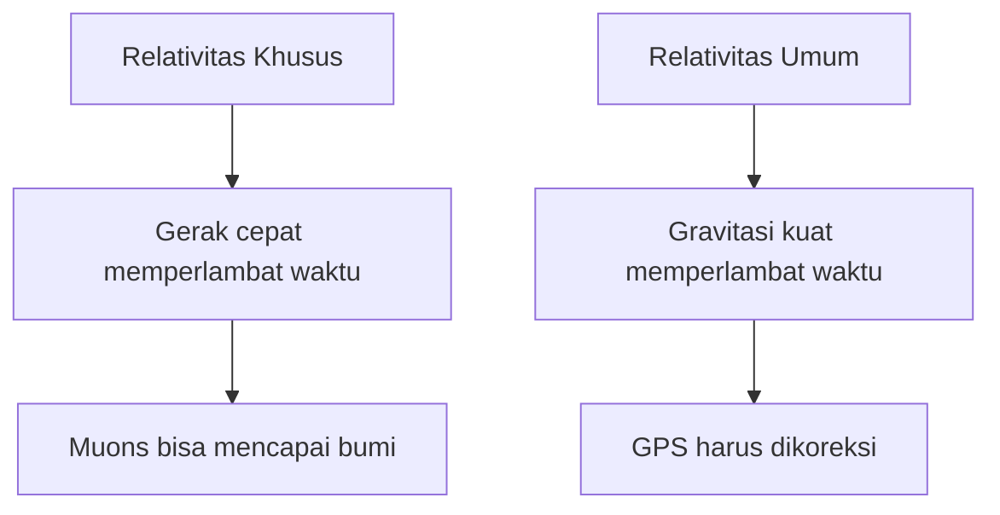
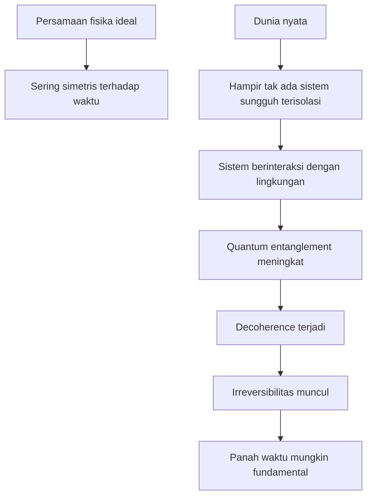

## 🎯 Pendahuluan: Waktu Itu Sangat Dekat, Tapi Justru Karena Itu Paling Sulit Dipahami

Tidak banyak hal yang terasa seintim **waktu**. Kita hidup di dalamnya, menua karenanya, menunggu dengan gelisah, mengenang dengan haru, dan hampir selalu mengeluh bahwa ia bergerak terlalu cepat atau terlalu lambat. Kita bilang waktu “berjalan”, “mengalir”, “mengejar”, “meninggalkan”, bahkan “menyembuhkan”. Namun justru karena waktu begitu akrab bagi pengalaman manusia, ia menjadi salah satu konsep paling sulit untuk dipahami secara objektif. ⏳

Fisika modern, terutama melalui Isaac Newton, Albert Einstein, mekanika kuantum, termodinamika, dan kosmologi, telah memberi kita banyak cara untuk memikirkan waktu. Tetapi seperti dijelaskan oleh **Jim Al-Khalili**, semakin dalam kita masuk ke persoalan ini, semakin jelas bahwa “waktu” bukan satu hal sederhana. Ada waktu yang kita rasakan. Ada waktu yang muncul dalam persamaan fisika. Ada waktu yang relatif terhadap gerak dan gravitasi. Ada waktu yang tampaknya tidak “mengalir” sama sekali dalam hukum dasar. Ada pula arah waktu yang tampaknya nyata dalam pengalaman sehari-hari, meski sulit sekali diturunkan dari persamaan fundamental yang justru simetris terhadap masa lalu dan masa depan.

Al-Khalili memulai dari satu intuisi yang sangat kuat: kita tidak bisa melepaskan diri dari waktu untuk mengamatinya dari luar. Seorang fisikawan, ketika meneliti elektron, bintang, atau gelombang cahaya, masih bisa mengambil jarak konseptual dari objek yang diteliti. Tetapi ketika meneliti waktu, kita selalu sudah **terbenam di dalamnya**. Kita bukan penonton waktu; kita adalah makhluk yang seluruh eksistensinya dirajut oleh waktu. Di sini persoalannya menjadi jauh lebih filosofis. Bagaimana mungkin kita memahami sesuatu yang menjadi medium dari semua pengalaman kita? 🧠

Karena itu, Al-Khalili membedakan antara **physical time** — *waktu fisik*, yaitu waktu sebagaimana muncul dalam hukum-hukum fisika — dan **psychological time** atau **manifest time** — *waktu psikologis / waktu termanifestasi dalam pengalaman kita*. Di sinilah banyak kebingungan muncul. Waktu yang kita rasakan sangat kental: ada “sekarang”, ada aliran, ada perubahan, ada masa lalu yang hilang, ada masa depan yang belum datang. Tetapi waktu dalam fisika sering jauh lebih dingin: ia hanya parameter, koordinat, angka kecil *t* dalam persamaan.

Dari titik itu, percakapan Al-Khalili berkembang ke empat problem besar waktu:

1. **Apakah waktu sungguh mengalir?**  
2. **Bagaimana menyatukan teori kuantum dan relativitas umum Einstein?**  
3. **Apa yang istimewa dari “sekarang” (now)?**  
4. **Dari mana datangnya arah waktu, panah waktu, atau mengapa waktu tampak bergerak dari masa lalu ke masa depan?**  

Artikel ini akan membedah semuanya secara runtut dan mendalam. Kita akan masuk ke Newton, Einstein, relativitas khusus dan umum, *block universe* (alam semesta blok), muon di atmosfer, GPS, entropi, *quantum decoherence* (dekoherensi kuantum), *Boltzmann brain*, awal waktu pada Big Bang, hingga kemungkinan *time travel* (perjalanan waktu). Jika ada istilah asing, saya jelaskan padanan Indonesianya. Jika ada konsep abstrak, saya pecah agar terasa lebih manusiawi. Dan jika pada akhirnya kita masih belum tahu persis apa itu waktu, setidaknya kita akan tahu **mengapa** pertanyaan ini begitu dalam — dan mengapa mungkin justru ketidakpastian itulah yang membuatnya indah. ✨

<Callout type="important" title="Tesis utama artikel ini">
Waktu bukan hanya jam yang berdetak atau angka di kalender. Dalam fisika modern, waktu adalah persimpangan antara pengalaman manusia, struktur ruang-waktu Einstein, probabilitas kuantum, termodinamika, dan kosmologi. Karena itu, memahami waktu berarti menyentuh salah satu titik paling dalam tempat sains dan filsafat bertemu.
</Callout>

---

## 🧍 1. Waktu yang Kita Rasakan vs Waktu yang Ditulis Fisika

Al-Khalili memulai dari perbedaan mendasar antara dua jenis waktu.

### a. **Manifest time** — waktu yang termanifestasi dalam pengalaman
Ini adalah waktu yang kita rasakan secara langsung. Waktu yang membuat masa kecil terasa panjang, tetapi usia dewasa terasa melesat. Waktu yang membuat setengah jam di ruang tunggu dokter gigi terasa menyiksa, sementara setengah jam di pesta terasa hilang begitu saja. Waktu ini sangat psikologis, subjektif, dan terikat pada memori, atensi, emosi, serta ritme pengalaman hidup.

### b. **Physical time** — waktu dalam hukum fisika
Ini adalah waktu sebagaimana ia muncul dalam persamaan. Dalam banyak hukum fisika, waktu hanyalah **parameter** — angka, koordinat, simbol *t* yang membantu kita menyatakan bagaimana suatu sistem berubah. Tidak ada kesan “mengalir”. Tidak ada rasa “cepat” atau “lambat” sebagaimana yang kita alami secara mental. Ia lebih dingin, lebih struktural, lebih abstrak.

Perbedaan ini sangat penting. Banyak kebingungan tentang waktu muncul karena kita diam-diam mencampur keduanya. Kita mengira jika fisika berbicara tentang waktu, maka ia sedang berbicara tentang rasa kita saat menunggu atau menua. Padahal belum tentu.

Misalnya, ketika kita berkata “waktu terasa lebih cepat ketika tua”, itu bukan berarti hukum fisika berubah setelah ulang tahun ke-40. Al-Khalili mengutip teori bahwa ini berkaitan dengan **laying down of new experiences** — *peletakan / perekaman pengalaman baru*. Saat masih kecil, banyak hal terasa baru sehingga waktu tampak panjang. Saat dewasa, pola hidup lebih repetitif sehingga tahun-tahun tampak seperti lewat dalam kilat. Tetapi ini adalah soal **cara otak membangun pengalaman waktu**, bukan soal “waktu fisik” di jagat raya benar-benar dipercepat.

Namun, Al-Khalili juga menunjukkan ada paradoks menarik di sini. Pada skala pendek, pengalaman justru berbalik. Setengah jam saat bosan terasa lebih lama daripada setengah jam ketika bersenang-senang, meski justru saat bersenang-senang kita menerima lebih banyak pengalaman baru. Artinya, psikologi waktu sendiri tidak linear. Ia adalah konstruksi rumit dari perhatian, emosi, memori, dan konteks.

Jadi langkah pertama untuk memahami waktu adalah menerima bahwa **waktu yang kita jalani** dan **waktu yang fisika modelkan** tidak selalu identik. Ini bukan berarti salah satunya palsu. Keduanya nyata, tetapi pada level yang berbeda.

---

## 🔄 2. Mana yang Lebih Dasar: Waktu atau Perubahan?

Pertanyaan ini sudah ada sejak Yunani kuno dan ternyata belum selesai sampai hari ini. Kita sering berpikir sederhana: waktu ada dulu, lalu perubahan terjadi di dalamnya. Namun ada posisi lain: justru **perubahan** itu yang lebih dasar, dan apa yang kita sebut “waktu” hanyalah cara kita menandai bahwa sesuatu telah berubah.

Al-Khalili mengutip Richard Feynman yang pernah berkata secara jenaka namun provokatif: **“Time is what happens when nothing else happens.”** — *Waktu adalah apa yang terjadi ketika tidak ada hal lain yang terjadi.* Kalimat ini memihak intuisi bahwa waktu itu sendiri punya keberadaan tertentu, terpisah dari perubahan konkret.

Pandangan seperti ini sangat dekat dengan Newton. Bagi Newton, waktu adalah **absolut**. Ia mengalir sendiri, seperti jam kosmik, tak peduli apakah manusia tidur, bintang meledak, atau semesta sunyi total. Waktu tetap berjalan.

Namun fisika modern, terutama sejak Einstein, membuat kita jauh lebih hati-hati dengan pandangan ini. Sebab ketika kita memeriksa banyak persamaan fisika, kita melihat bahwa waktu sering hanya menjadi penanda koordinat bagi perubahan. Maka muncul kecurigaan: mungkinkah “waktu” hanyalah cara kita memetakan perubahan, bukan entitas terpisah yang mengalir sendiri?

Ini penting, karena dari sini kita mulai melihat bahwa pertanyaan tentang waktu tidak bisa dilepaskan dari pertanyaan tentang **change / perubahan**. Ketika ada perubahan, kita merasa waktu hadir. Ketika tak ada perubahan, kita bahkan mulai kesulitan membayangkan waktu. Tetapi apakah itu berarti waktu hilang? Jawabannya nanti akan jadi jauh lebih rumit. 😵‍💫

---

## 🕰️ 3. Newton: Waktu Absolut sebagai Jam Kosmik yang Tak Peduli Apa Pun

Dalam pandangan Newton, waktu adalah sesuatu yang **eksternal terhadap alam**. Ia berjalan terus, seragam, universal, mutlak. Tidak ada dua orang yang punya waktu berbeda. Tidak ada jam yang berdetak lebih lambat karena Anda bergerak cepat. Tidak ada gravitasi yang membuat usia kepala lebih cepat dari kaki. Waktu Newton adalah **kosmik, objektif, dan sama untuk semua orang di mana pun**.

Bagi akal sehat sehari-hari, ini terasa benar. Memang bukankah jam dunia tetap bergerak? Bukankah satu menit ya satu menit, mau kita gembira atau bosan?

Tetapi menurut Al-Khalili, pandangan Newton akhirnya runtuh setelah Einstein. Dan yang runtuh bukan hanya detail kecil. Yang runtuh adalah ide bahwa ada “sekarang” universal yang sama bagi seluruh alam semesta.

Namun kita tidak boleh terlalu cepat menertawakan Newton. Untuk kehidupan sehari-hari, untuk melempar bola, membangun jembatan, mengirim roket biasa, bahkan untuk pengalaman manusia normal di bumi, waktu Newton sangat berguna. Ia keliru secara mendalam, tetapi cukup benar secara praktis di banyak konteks. Dan justru ini pelajaran penting dalam sains: teori lama tidak selalu “salah total”; kadang ia hanya **terbatas wilayah berlakunya**.

---

## 💡 4. Einstein dan Revolusi Besar: Tidak Ada Waktu Absolut

Revolusi Einstein dimulai bukan dari obsesi awal pada waktu, melainkan dari persoalan **cahaya**. Fisikawan abad ke-19 percaya bahwa cahaya, sebagai gelombang, pasti merambat melalui medium yang disebut **ether / eter**. Tetapi tidak ada bukti meyakinkan tentang medium itu. Einstein membuang eter dan justru mempertahankan satu hal yang lebih radikal: **kecepatan cahaya konstan bagi semua pengamat**.

Nah, inilah sumber guncangannya. Bayangkan saya menyalakan senter dan Anda melesat dengan roket sangat cepat. Akal sehat Newtonian akan berkata: cahaya seharusnya tampak lebih lambat relatif terhadap Anda, karena Anda sedang mengejarnya. Tetapi Einstein berkata: tidak, Anda tetap akan mengukur kecepatan cahaya yang sama.

Kalau begitu, sesuatu yang lain harus berubah. Dan yang berubah adalah:

- ukuran ruang,  
- laju jam,  
- bahkan simultanitas (kesamaan waktu dua peristiwa).  

Artinya, agar kecepatan cahaya tetap sama untuk semua pengamat, **ruang dan waktu tidak lagi absolut**. Masing-masing pengamat membawa ukuran ruang-waktunya sendiri, tergantung keadaan geraknya.

Inilah kelahiran **special relativity / relativitas khusus**. Dan dari sini lahir salah satu efek paling terkenal: **time dilation / dilatasi waktu** — *perlambatan waktu*. Jam yang bergerak cepat akan tampak berdetak lebih lambat.

---

## 🚀 5. Dilatasi Waktu: Mengapa Waktu Benar-Benar Bisa Melambat?

Ini salah satu gagasan paling mencengangkan dalam fisika. Menurut Einstein, jika Anda bergerak sangat cepat mendekati kecepatan cahaya, waktu Anda akan berlalu lebih lambat dibanding pengamat lain.

Penting ditekankan: ini **bukan ilusi psikologis**. Ini efek fisik nyata.

Al-Khalili memberi contoh klasik: **muon**. Muon adalah partikel subatom yang tercipta di atmosfer atas akibat tumbukan sinar kosmik. Umur hidup muon sangat pendek. Secara Newtonian, muon seharusnya tidak sempat mencapai permukaan bumi sebelum “mati”. Tetapi kenyataannya kita mendeteksinya di permukaan.

Mengapa? Karena mereka bergerak sangat cepat, sehingga dari perspektif kita, “jam internal” muon melambat. Umur hidupnya memanjang cukup lama untuk mencapai tanah.

Dari perspektif muon sendiri, ada penjelasan lain yang juga konsisten: bukan waktunya yang melambat, melainkan **jarak** dari atmosfer atas ke bumi yang menyusut. Ini disebut **length contraction / kontraksi panjang**. Lagi-lagi, relativitas mengatakan kedua penjelasan ini bukan kontradiksi, melainkan dua sisi dari satu struktur ruang-waktu yang sama.

Ini sangat penting secara filosofis. Artinya, waktu bukan latar diam yang sama untuk semua orang. Ia bergantung pada keadaan gerak. Jadi, dua orang bisa **berbeda umur** secara fisik hanya karena mereka menempuh lintasan ruang-waktu yang berbeda.

---

## 🌍 6. Relativitas Umum: Bukan Hanya Gerak Cepat, Gravitasi pun Mengubah Waktu

Jika relativitas khusus menunjukkan bahwa gerak mengubah waktu, maka **general relativity / relativitas umum** menunjukkan bahwa **gravitasi** juga mengubah waktu.

Einstein sampai pada ini melalui apa yang ia sebut sebagai **happiest thought of my life** — *pikiran paling membahagiakan dalam hidup saya*: percepatan setara dengan gravitasi. Bila Anda didorong kuat ke kursi di mobil yang sedang melaju cepat, Anda merasakan sesuatu yang mirip dengan “berat” akibat gravitasi.

Dari sini lahirlah pandangan baru tentang gravitasi: gravitasi bukan gaya biasa ala Newton, melainkan **kelengkungan ruang-waktu**. Massa dan energi membengkokkan ruang-waktu, dan benda-benda bergerak mengikuti geometri kelengkungan itu.

Apa dampaknya pada waktu? Semakin kuat gravitasi, semakin lambat waktu berjalan.

Ini bukan sekadar teori eksotis. Kita benar-benar memakainya dalam kehidupan sehari-hari melalui **GPS**. Satelit GPS berada lebih jauh dari pusat gravitasi bumi dibanding kita di permukaan. Karena gravitasi di sana sedikit lebih lemah, waktu pada jam satelit berjalan sedikit lebih cepat. Kalau kita tidak mengoreksinya, GPS akan melenceng dan peta di smartphone kita akan kacau.

Jadi, bahkan untuk menemukan warung kopi terdekat, kita diam-diam sedang memakai koreksi relativitas Einstein. ☕📍

Dan ya, secara teknis, kepala kita memang menua lebih cepat daripada kaki kita, karena kepala sedikit lebih jauh dari pusat gravitasi bumi. Efeknya sangat kecil, tapi nyata.

---

## 🧱 7. Space-Time dan Block Universe: Bagaimana Jika Semua Waktu “Sudah Ada”?

Setelah Einstein, waktu tidak lagi dilihat terpisah dari ruang. Keduanya menyatu menjadi **space-time / ruang-waktu** empat dimensi.

Kita sulit membayangkan empat dimensi, jadi Al-Khalili menyarankan trik visual. Bayangkan tiga dimensi saja: dua dimensi ruang dan satu dimensi waktu. Dari sini muncul konsep **block universe / alam semesta blok**.

Bayangkan buku tebal. Setiap halaman adalah seluruh ruang pada satu momen waktu. Halaman-halaman itu tersusun sepanjang sumbu waktu. Kita hidup seolah “menyusuri” halaman demi halaman. Tetapi keseluruhan buku sebenarnya sudah ada sekaligus.

Dalam pandangan ini:

- masa lalu tidak “hilang”,  
- masa depan tidak “belum ada”,  
- semuanya sama-sama bagian dari blok ruang-waktu.  

Kita hanya mengalami satu irisan tertentu sebagai “sekarang”.

Ini sejalan dengan posisi filosofis yang disebut **eternalism / eternalisme**: semua momen waktu sama-sama nyata.

Kalau ini benar, maka “aliran waktu” yang kita rasakan mungkin bukan fitur dasar alam semesta, melainkan fitur kesadaran kita saat menelusuri blok itu. Ini gagasan yang sangat kuat dan sekaligus sangat mengganggu. Sebab kalau semua waktu sama-sama ada, apa arti “menjadi” dan “akan datang”?

---

## 🧭 8. Jika Semua Waktu Sudah Ada, Apa yang Terjadi dengan Kebebasan Memilih?

Di sinilah fisika bertemu filsafat secara frontal. Kalau masa depan sudah sama nyatanya dengan masa lalu di dalam **block universe**, apakah kita benar-benar punya **free will / kehendak bebas**?

Al-Khalili menjelaskan bahwa ini terasa lebih keras daripada determinisme Newtonian. Dalam alam semesta mekanistik ala Newton, masa depan memang sudah ditentukan, tetapi setidaknya ia belum “ada”. Dalam eternalism, masa depan bukan cuma pasti — ia **sudah ada di dalam blok**.

Ini terdengar sangat menekan. Namun Al-Khalili memilih posisi **compatibilism / kompatibilisme**. Artinya, ia menerima bahwa mungkin alam semesta pada level tertentu deterministik, tetapi itu tidak menghapus pengalaman nyata kita sebagai agen yang memilih. Mengapa? Karena kita tetap tidak bisa mengetahui masa depan lebih dulu. Kita tetap hidup dari dalam, bukan dari pandangan Tuhan (*God’s-eye view*).

Dengan kata lain, walaupun masa depan mungkin “ada”, kita tetap menjalani hidup tanpa akses penuh ke sana. Dan dari sisi eksistensial, itulah yang penting.

Jadi bagi Al-Khalili, mungkin kebebasan kita bukan kebebasan metafisik mutlak, tetapi **kebebasan yang cukup** untuk hidup, bertanggung jawab, dan merasakan keputusan sebagai milik kita sendiri.

---

## ⏱️ 9. Apa yang Istimewa dari “Sekarang”? Relativitas Justru Mengatakan: Tidak Banyak

Kita merasa “sekarang” itu sangat istimewa. Sekarang adalah titik di mana masa depan berubah jadi masa lalu. Tetapi menurut Einstein, khususnya dalam relativitas khusus, konsep **universal now / sekarang universal** tidak punya dasar.

Mengapa? Karena **simultaneity / keserentakan** itu relatif. Dua peristiwa yang bagi saya terjadi “bersamaan” bisa saja bagi pengamat lain yang bergerak cepat justru tidak bersamaan. Bahkan urutannya bisa berbeda, selama kedua peristiwa itu tidak saling memengaruhi secara kausal.

Ini disebut **relativity of simultaneity / relativitas keserentakan**.

Implikasinya besar: tak ada “garis sekarang” yang sama untuk seluruh alam semesta. Apa yang bagi saya masa kini, bagi pengamat lain bisa menjadi bagian masa lalu atau masa depan dalam pengertian tertentu.

Artinya, keistimewaan “sekarang” lebih merupakan fitur pengalaman sadar kita, bukan struktur universal fisika.

Namun Al-Khalili juga menambahkan bahwa bahkan pada level psikologis, “sekarang” ternyata bukan titik tanpa ketebalan. Ia punya **thickness / ketebalan temporal**. Ketika kita mendengar musik, kita tidak hanya mendengar satu not yang langsung hilang. Kita memegang sedikit masa lalu dalam memori dan sedikit masa depan dalam ekspektasi. Jadi pengalaman “sekarang” adalah semacam jendela waktu yang sedikit lebar, bukan pisau matematis tipis.

---

## 🧊 10. Panah Waktu: Jika Persamaan Fisika Simetris, Mengapa Es Batu Meleleh Tapi Tidak Tiba-Tiba Menyusun Diri Lagi?

Ini problem yang sangat penting. Hampir semua hukum dasar fisika bersifat **time-symmetric / simetris terhadap waktu**. Artinya, jika kita membalik tanda waktu dalam persamaan, banyak proses masih masuk akal secara matematis.

Tetapi dalam kehidupan sehari-hari, kita jelas melihat arah waktu:

- kita menua,  
- gelas pecah tidak spontan menyusun diri,  
- kopi mendingin,  
- semesta mengembang.  

Dari mana arah ini datang?

Jawaban klasik fisika adalah **entropy / entropi** melalui **second law of thermodynamics / hukum kedua termodinamika**. Entropi secara sederhana berkaitan dengan meningkatnya jumlah cara suatu sistem dapat tersusun secara lebih acak atau lebih tersebar.

Contoh favorit: gas dalam kotak. Jika semua molekul gas terkumpul rapi di satu sudut, itu keadaan berentropi rendah. Jika mereka menyebar merata ke seluruh kotak, itu berentropi lebih tinggi. Kita selalu melihat gas menyebar, bukan tiba-tiba mengumpul kembali.

Dengan demikian, **arrow of time / panah waktu** sering dipahami sebagai arah bertambahnya entropi.

Tetapi Al-Khalili memberi catatan penting: mungkin kita tidak perlu membayangkan “panah” secara literal. Cukup sadari bahwa masa lalu dan masa depan memang berbeda secara struktural. Seperti kolam renang punya ujung dangkal dan ujung dalam tanpa perlu ada panah besar di tengah kolam.

---

## 🌫️ 11. Saat Entropi Maksimum Tercapai, Apakah Waktu Hilang?

Pertanyaan ini menarik sekali. Jika entropi terus naik, lalu suatu saat semesta mencapai **thermal equilibrium / kesetimbangan termal** — keadaan sangat merata dan “membosankan” — apakah panah waktu hilang? Dan kalau panah waktu hilang, apakah waktu sendiri hilang?

Al-Khalili menjawab: belum tentu.

Bayangkan gas sudah tersebar sempurna di seluruh kotak. Jika kita membuat film gerak molekulnya lalu memutarnya mundur, mungkin kita tidak bisa membedakan apakah film itu berjalan maju atau mundur. Tidak ada arah yang terlihat jelas. Tetapi itu tidak berarti waktu berhenti. Itu hanya berarti **kita tidak lagi punya penanda arah yang jelas**.

Hal yang sama mungkin berlaku untuk semesta di masa jauh sekali, saat semua bintang mati, lubang hitam menguap, dan hanya tersisa radiasi dingin tersebar. Ini disebut **heat death of the universe / kematian panas alam semesta**.

Mungkin saat itu tidak ada makhluk hidup untuk merasakan arah waktu. Mungkin tak ada peristiwa menarik. Tetapi jika semesta masih terus mengembang, masih ada dasar untuk berkata bahwa waktu tetap berlanjut. Ia hanya menjadi sangat sunyi.

Ini gagasan yang puitis sekaligus menyeramkan: waktu bisa terus ada, bahkan ketika hampir tak ada lagi yang terjadi di dalamnya.

---

## ⚛️ 12. Kuantum, Decoherence, dan Gagasan Al-Khalili yang Sangat Menarik: Mungkin Panah Waktu Sudah “Dipanggang” ke Dalam Realitas

Ini salah satu bagian paling menarik dari wawancara. Banyak fisikawan mencoba menurunkan panah waktu dari hukum yang pada dasarnya simetris. Tetapi Al-Khalili mengusulkan sudut pandang berbeda: mungkin yang justru terlalu ideal adalah persamaan simetris itu sendiri.

Mengapa? Karena persamaan dasar biasanya berlaku untuk **isolated systems / sistem terisolasi**. Tetapi dalam kenyataan, hampir tak ada sistem yang benar-benar terisolasi. Semua berinteraksi dengan lingkungan. Dan pada level kuantum, interaksi dengan lingkungan berarti **entanglement / keterikatan kuantum**.

Ketika sistem kuantum semakin terjerat dengan lingkungannya, terjadi proses yang disebut **decoherence / dekoherensi**. “Kuantumnya” bocor ke lingkungan. Superposisi memudar. Dan menurut Al-Khalili, ini adalah proses yang sungguh-sungguh **irreversible / tak dapat dibalik**.

Jika dekoherensi terjadi di mana-mana dan terus meningkat, maka kita dapat membayangkan adanya **entanglement entropy / entropi keterikatan** yang juga meningkat. Dari sini, arah waktu tidak muncul belakangan sebagai ilusi besar, tetapi sudah **tertanam dalam struktur realitas**.

Ini gagasan yang sangat menarik karena membalik cara bertanya. Bukan lagi: “bagaimana arah waktu muncul dari hukum simetris?” Melainkan: “mungkin hukum simetris hanyalah aproksimasi ideal, sementara realitas yang sesungguhnya sejak awal sudah punya arah.”

Kalau benar begitu, maka waktu bukan ilusi penuh. Ia nyata. Dan ia punya arah nyata.

---

## 🌌 13. Apakah Waktu Punya Awal? Big Bang, Singularitas, dan Spekulasi Sebelum “Sebelum”

Menurut relativitas umum standar, waktu bermula pada **Big Bang / Dentuman Besar**. Jadi pertanyaan “apa yang terjadi sebelum Big Bang?” menjadi problematik. Sebab kata “sebelum” sendiri sudah mengandaikan adanya waktu. Ini seperti bertanya: “apa yang ada lebih selatan dari Kutub Selatan?” Secara konsep, pertanyaannya bisa runtuh.

Namun fisika modern tidak puas berhenti di situ. Ada banyak spekulasi:

- mungkin alam semesta kita hanya satu gelembung dalam **multiverse / multisemesta**,  
- mungkin ada alam semesta cermin yang waktu alirannya berlawanan,  
- mungkin semesta berulang dalam siklus Big Bang dan Big Crunch,  
- mungkin awal waktu itu sendiri menjadi kabur ketika efek kuantum diperhitungkan.  

Al-Khalili menekankan bahwa banyak dari ide ini masih spekulatif. Menarik, tetapi belum mapan secara observasional. Untuk saat ini, secara konservatif, banyak kosmolog masih menerima Big Bang sebagai **awal waktu di alam semesta kita**.

---

## 🧊 14. Apakah Waktu Punya Akhir? Heat Death, Big Rip, atau Semesta yang Bosan Selamanya

Jika waktu punya awal, apakah ia juga punya akhir?

Al-Khalili membahas beberapa skenario besar.

### a. **Heat death**
Semesta terus mengembang, semua energi tersebar, bintang-bintang mati, lubang hitam menguap, dan akhirnya tinggal radiasi dingin yang makin jarang. Ini skenario paling umum dalam kosmologi modern.

### b. **Big Crunch**
Semesta suatu saat berhenti mengembang lalu runtuh kembali ke dalam dirinya sendiri. Jika ini benar, mungkin waktu seperti kita kenal juga punya ujung. Namun data saat ini tidak mendukung ini sebagai skenario utama.

### c. **Big Rip**
Jika **dark energy / energi gelap** makin dominan dan makin kuat efeknya, ruang bisa meregang semakin cepat sampai akhirnya bukan hanya galaksi yang saling menjauh, tetapi bahkan bintang, planet, atom, dan struktur materi terkoyak. Ini skenario dramatis yang disebut **Big Rip / Sobekan Besar**.

Al-Khalili cenderung merasa — meski ia mengakui ini lebih intuisi daripada bukti final — bahwa waktu mungkin **punya awal tetapi tidak punya akhir**, alias terus mengalir tanpa batas.

Namun ia juga jujur: semakin dipikirkan, intuisi itu pun terasa aneh. Jika tak punya akhir, mengapa harus punya awal? Jadi di sini bahkan seorang fisikawan besar pun sampai pada momen yang indah: **mengangkat bahu, lalu mempersilakan filsuf ikut bicara**. 😊

---

## 🕳️ 15. Perjalanan Waktu: Ke Masa Depan Mungkin, ke Masa Lalu Sangat Bermasalah

Topik favorit publik tentu saja: **time travel / perjalanan waktu**.

Al-Khalili membedakan dua jenis.

### a. Perjalanan ke masa depan
Ini secara fisika relatif “mudah”. Anda cukup bergerak sangat cepat atau masuk ke medan gravitasi sangat kuat. Waktu Anda akan melambat relatif terhadap orang lain, dan ketika kembali, Anda akan mendapati dunia sudah jauh lebih tua. Ini adalah bentuk perjalanan ke masa depan.

Film **Interstellar** memakai ini dengan sangat baik: satu jam di planet dekat lubang hitam bisa berarti bertahun-tahun di tempat lain.

### b. Perjalanan ke masa lalu
Nah, ini jauh lebih rumit. Relativitas umum memang mengizinkan struktur matematis seperti **closed timelike curves / kurva waktu-tertutup**. Tetapi segera muncul paradoks:

- **grandfather paradox / paradoks kakek**,  
- membunuh diri muda sendiri,  
- informasi yang tak punya asal-usul jelas,  
- atau lingkaran sebab-akibat yang aneh.  

Beberapa orang mencoba menyelamatkan kemungkinan ini dengan:

- **many worlds interpretation / tafsir banyak dunia**,  
- atau **Novikov self-consistency principle / prinsip konsistensi diri Novikov**.  

Namun semua ini masih sangat spekulatif. Untuk saat ini, perjalanan ke masa lalu tetap lebih cocok menjadi ladang fiksi ilmiah daripada teknologi yang sungguh dekat.

Tetapi Al-Khalili juga mengingatkan sesuatu yang bijak: banyak teknologi hari ini akan tampak seperti sihir bagi orang ratusan tahun lalu. Jadi kita jangan terlalu sombong merasa sudah tahu batas final semesta. 🚀

---

## 🧠 Kesimpulan: Waktu Mungkin Tidak Mengalir Seperti yang Kita Rasakan, Tapi Bukan Berarti Ia Tidak Nyata

Setelah menelusuri semua ini, apa yang bisa kita simpulkan?

Pertama, **waktu dalam pengalaman manusia** dan **waktu dalam fisika** tidak identik. Yang satu penuh rasa, aliran, memori, penantian, dan duka. Yang satu lagi bisa tampil sebagai koordinat dalam persamaan, dimensi dalam ruang-waktu, atau parameter yang sama sekali tak menunjukkan “aliran”.

Kedua, Einstein mengajarkan bahwa waktu bukan jam universal yang sama bagi semua orang. Ia lentur, relatif, berubah oleh gerak dan gravitasi. Waktu bisa melambat. Bahkan umur bisa tidak sinkron tergantung lintasan ruang-waktu yang ditempuh.

Ketiga, ketika kita mendorong lebih jauh ke termodinamika dan fisika kuantum, kita mendapati bahwa pertanyaan tentang arah waktu jauh lebih sulit. Entropi menjelaskan banyak hal, tetapi mungkin belum semuanya. Al-Khalili justru tertarik pada gagasan bahwa **dekoherensi kuantum dan peningkatan entanglement** mungkin membuat arah waktu menjadi lebih fundamental daripada yang biasa kita kira.

Keempat, soal awal dan akhir waktu tetap terbuka. Big Bang tampak seperti awal yang paling masuk akal untuk saat ini. Tetapi kosmologi modern masih menyisakan ruang bagi spekulasi besar. Dan soal akhir, semesta mungkin tidak akan meledak secara dramatis, melainkan perlahan-lahan membosankan dirinya sendiri sampai hampir tak ada lagi yang berarti terjadi.

Kelima, perjalanan waktu ke masa depan secara prinsip sudah ada dalam relativitas. Ke masa lalu? Mungkin, tetapi masih penuh ranjau paradoks dan belum punya pijakan eksperimental yang kuat.

Namun mungkin pelajaran paling indah dari seluruh percakapan ini bukanlah jawaban final, melainkan sikap ilmiahnya. Jim Al-Khalili tidak pura-pura tahu segalanya. Ia menunjukkan bahwa sains terbaik bukanlah daftar kepastian mutlak, melainkan keberanian memetakan dengan jernih **mana yang sudah dipahami, mana yang baru setengah dipahami, dan mana yang masih misteri**. 🌌

Dan barangkali di situlah waktu menjadi begitu memikat. Ia bukan hanya hal yang kita ukur dengan jam atau pelajari lewat persamaan. Ia adalah cermin tempat manusia menyadari keterbatasannya sendiri. Kita hidup di dalam waktu, mencoba memahaminya dengan otak yang juga dibentuk oleh waktu, sambil tahu bahwa setiap jawaban yang kita temukan akan segera didorong ke masa lalu oleh pertanyaan berikutnya.

Jadi, apakah waktu itu ilusi? Mungkin sebagian dari yang kita **rasakan** tentang waktu memang ilusi. Tetapi apakah waktu itu tidak nyata? Bagi Al-Khalili, jawabannya cenderung tidak. Waktu nyata. Ia punya struktur. Ia punya arah. Ia menenun semesta. Hanya saja, ia jauh lebih aneh daripada dugaan intuisi kita sehari-hari. Dan mungkin, semakin kita memahami waktu, semakin kita sadar bahwa yang paling sulit dari semua ilmu bukan memahami bintang, atom, atau galaksi — melainkan memahami medium diam-diam yang menampung semuanya. 🕯️

<Callout type="cite" title="Sumber utama artikel">
Artikel ini disusun berdasarkan wawancara penuh Jim Al-Khalili tentang waktu, relativitas, termodinamika, kuantum, kosmologi, dan time travel: *Quantum entanglement and the illusion of time, in 79 minutes*.
</Callout>
