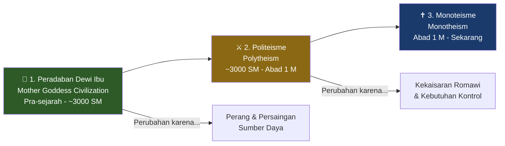
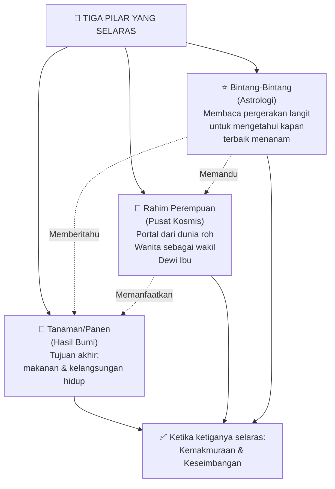
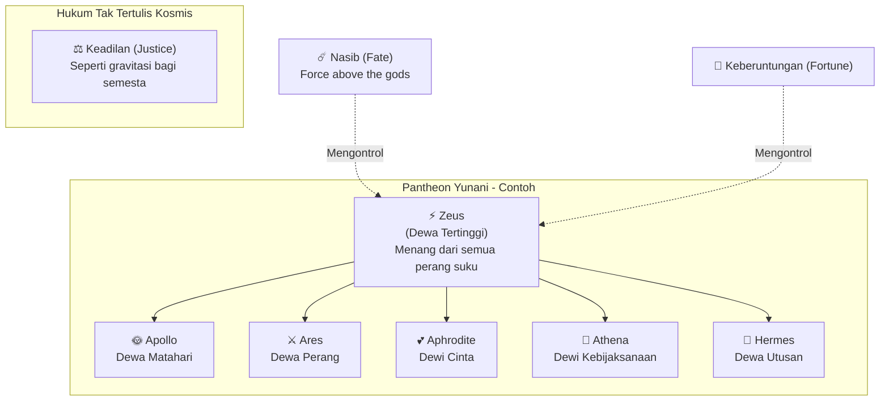
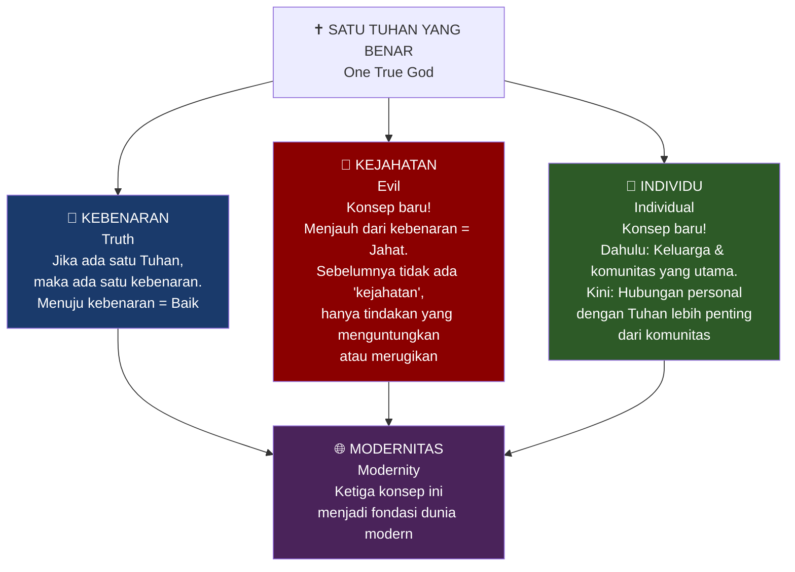
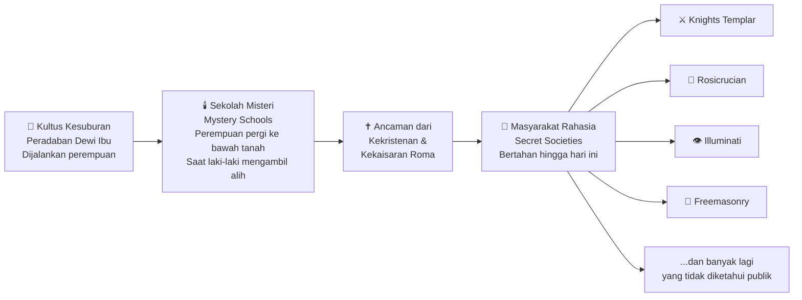
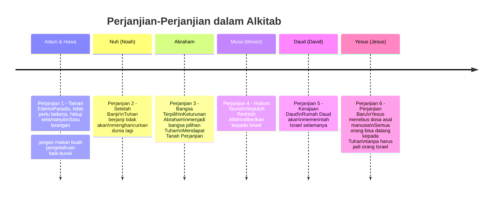
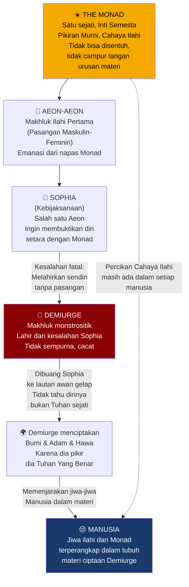
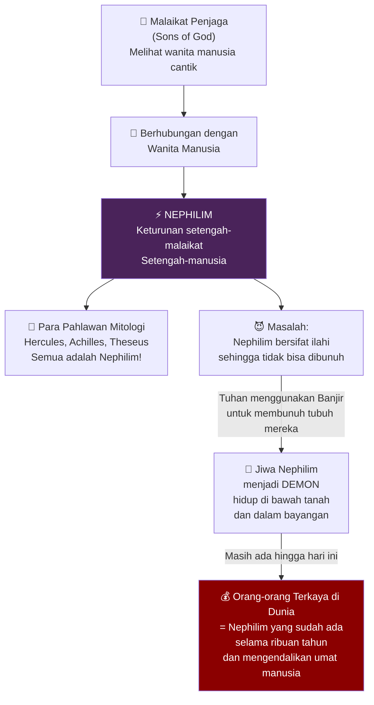
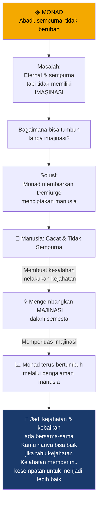
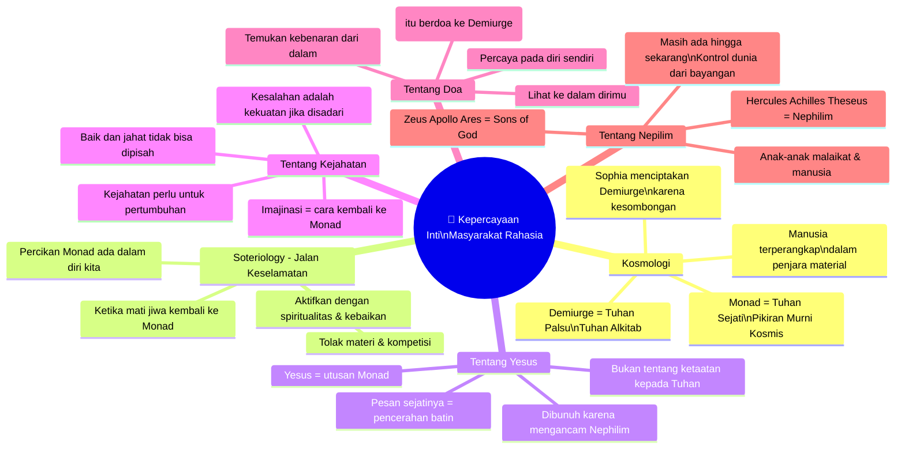

## 🔑 Pembuka: Pertanyaan yang Tidak Boleh Ditanyakan

Ada pertanyaan-pertanyaan yang terasa berbahaya untuk diajukan.

Bukan karena jawabannya tidak ada — melainkan karena jawabannya terlalu *menggemparkan* untuk dibiarkan beredar bebas.

Mengapa Tuhan mengeluarkan Adam dan Hawa dari surga hanya karena makan buah? Mengapa Tuhan menghancurkan dunia dengan banjir jika setelahnya manusia tetap jahat? Mengapa harus ada putra Tuhan yang mati untuk menebus dosa manusia?

Ini adalah pertanyaan-pertanyaan yang oleh gereja dijawab dengan: *"Jangan terlalu dalam bertanya."*

Tapi **masyarakat-masyarakat rahasia** (*secret societies*) menjawab dengan cara yang sangat berbeda. Dan jawabannya — apakah benar atau tidak — mengubah cara Anda memandang seluruh sejarah peradaban Barat. 🌍

---

## 📜 Bagian I: Tiga Tahap Evolusi Agama di Barat

### Gambaran Besar yang Disederhanakan

Untuk memahami masyarakat rahasia, kita harus terlebih dahulu memahami bagaimana agama berkembang di dunia Barat. Sejarah ini memiliki **tiga tahap besar**:



Tiga tahap ini bukan sekadar pergantian agama. Ini adalah **pergeseran mendasar cara manusia memahami dirinya, dunia, dan kekuasaan**. Mari kita bedah masing-masing. 🔍

---

## 🌾 Bagian II: Peradaban Dewi Ibu — Dunia yang Hilang

### Mengapa Dewi Ibu Lahir dari Pertanian

**Peradaban Dewi Ibu** (*Mother Goddess Civilization*) muncul bukan dari teologi atau wahyu — melainkan dari **kebutuhan praktis pertanian**.

Dalam dunia pertanian, ada dua masalah eksistensial yang harus dipecahkan:

1. 🌱 **Masalah Panen**: Bagaimana memastikan tanaman tumbuh sehat dan bisa dipanen tepat waktu?
2. 👶 **Masalah Tenaga Kerja**: Bagaimana memiliki cukup anak untuk menggarap ladang?

Agama yang muncul untuk menjawab kedua masalah ini menempatkan **rahim perempuan** (*womb*) sebagai pusat kosmos. Rahim adalah portal ilahi dari dunia roh ke dunia nyata — hampir seperti sebuah gua di mana dunia spirit bisa keluar dan memanifestasikan dirinya dalam realitas material. 🌀

### Tiga Pilar Dunia Dewi Ibu

Peradaban ini dibangun di atas tiga elemen yang selaras sempurna:



Dalam dunia ini, **perempuan berada dalam kendali**. Mereka adalah wakil langsung Dewi Ibu yang memerintah dunia. Status sosial mereka sangat tinggi.

### Simbol-Simbol Suci: Burung dan Banteng 🦅🐂

Dewi Ibu biasanya digambarkan sebagai **burung** — karena burung adalah satu-satunya hewan yang memiliki kekuasaan atas langit, dan jika kehidupan datang dari langit, maka Dewi Ibu haruslah makhluk yang bisa terbang bebas ke sana.

Tapi Dewi Ibu selalu dipasangkan dengan **banteng** (*bull*) — simbol kesuburan dan energi maskulin. Karena tidak ada perempuan yang bisa hamil sendiri; dibutuhkan laki-laki. Burung dan banteng adalah dua simbol pemujaan dalam peradaban ini.

### Dunia Tanpa Properti, Tanpa Hierarki

Yang paling mengejutkan dari perspektif modern: **dunia Dewi Ibu tidak mengenal properti pribadi**. Segalanya milik bersama. Tidak ada hierarki — semua orang setara.

Dan yang paling kontroversial: **seks adalah tindakan komunal**. Mereka memiliki ritual yang disebut **kultus kesuburan** (*fertility cults*) di mana hubungan seksual dilakukan secara bersama. Logikanya sederhana dari perspektif biologis: sebagai perempuan, Anda ingin DNA terbaik. Karena tidak tahu siapa yang memiliki sperma terbaik, solusinya adalah berhubungan dengan banyak pria — siapa pun yang memiliki sperma terbaik akan memberikannya kepada Anda. 🧬

<Callout type="info" title="Kultus Kesuburan dalam Arkeologi 🏺">
Bukti arkeologis dari ribuan tahun lalu memang menemukan patung-patung Dewi Ibu (*Venus figurines*) di berbagai situs prasejarah Eropa dan Timur Tengah. Banyak masyarakat kuno memiliki ritual kesuburan yang melibatkan seksualitas publik sebagai bentuk ibadah. Ini bukan fantasi — ini adalah rekonstruksi sejarawan tentang realitas pra-literasi.
</Callout>

---

## ⚔️ Bagian III: Politeisme — Ketika Perang Menciptakan Dewa-Dewa

### Kenapa Perang Mengubah Segalanya?

Transisi dari Dewi Ibu ke politeisme didorong oleh satu kekuatan: **perang**.

Seiring populasi meningkat, terjadi persaingan memperebutkan sumber daya. Dan sumber daya paling berharga dalam dunia pra-industri bukan emas, bukan tanah — melainkan **perempuan**, karena hanya perempuan yang bisa melahirkan.

Ini menciptakan dinamika yang mengubah sejarah:

- 👦 Pemuda yang tidak memiliki keluarga dan dikucilkan dari masyarakat menjadi predator sosial
- 🐺 Mereka berkelompok seperti serigala dan menyerang desa-desa lain untuk menangkap perempuan
- ⚔️ Inilah asal mula perang terorganisir

Dengan perang, muncullah konsep baru yang tidak dikenal sebelumnya: **properti** (*property*). Untuk mendorong pria berperang, mereka diberi hadiah — seorang istri yang menjadi milik eksklusif mereka.

Dan saat itulah **peran perempuan turun, peran laki-laki naik**.

### Bagaimana Pantheon Terbentuk dari Pertempuran Antar-Suku

Ketika dua suku berperang, mereka bukan hanya bertarung satu sama lain — secara simbolis, **dewa-dewa mereka juga berperang**. Jika Anda kalah perang, artinya dewa Anda lebih lemah dari dewa lawan. Maka untuk mencapai perdamaian, Anda harus mengakui dewa lawan lebih tinggi.

Beginilah **pantheon** (*kelompok dewa-dewa berhierarki*) terbentuk:



Dalam dunia politeistik, yang terpenting bukan menjadi **orang baik** — melainkan menjadi **orang beruntung** (*lucky*). Keberuntungan menandakan bahwa para dewa menyukaimu.

Tapi di atas para dewa ada kekuatan yang lebih besar: **Nasib** (*Fate*) dan **Keberuntungan** (*Fortune*). Bahkan Zeus pun tidak luput dari hukum kosmis yang tak tertulis, seperti **Keadilan** (*Justice*) — mirip gravitasi yang memberi struktur pada semesta.

### Tiga Komponen Pandangan Dunia Politeistik

1. **Kita adalah mainan para dewa** — Zeus, Apollo, Ares tidak berbeda dari manusia biasa, hanya saja mereka hidup selamanya. Zeus menghabiskan hari-harinya mengejar perempuan muda, persis seperti raja manusia. 😏

2. **Di atas dewa ada kekuatan yang lebih tinggi** — Nasib dan Keberuntungan bahkan lebih berkuasa dari dewa-dewa

3. **Ada hukum-hukum kosmis yang tak tertulis dan tak berubah** — Hukum seperti Keadilan, yang jika dilanggar akan menghukum Anda meskipun para dewa mendukung Anda

---

## ✝️ Bagian IV: Monoteisme — Revolusi yang Memerlukan Kekaisaran

### Dari Politeisme ke Satu Tuhan: Kenapa Butuh Kekaisaran?

Transisi dari politeisme ke monoteisme bukan terjadi secara organik. Ia membutuhkan sesuatu yang belum pernah ada sebelumnya: **kekaisaran** (*empire*) — khususnya **Kekaisaran Romawi**.

Dalam dunia perang antar-suku, membunuh semua musuh tidak efisien — manusia adalah sumber daya berharga. Tapi kekaisaran tidak perlu khawatir tentang hal itu. Kekaisaran bisa menghancurkan seluruh masyarakat dan memaksakan satu realitas, satu tuhan, kepada semua orang. 👑

<Callout type="warning" title="Catatan Akademik ⚠️">
Dosen dalam kuliah ini menyatakan bahwa Kristen adalah agama monoteistik *pertama* — ini adalah klaim yang kontroversial dan diperdebatkan. Banyak sejarawan agama berpendapat bahwa monoteisme sudah ada dalam Yudaisme, Zoroastrianisme (abad ke-6 SM), dan bahkan reformasi Akhenaten di Mesir (abad ke-14 SM). Klaim ini disajikan sebagai perspektif yang disederhanakan untuk tujuan pedagogis, bukan fakta sejarah yang disepakati.
</Callout>

### Tiga Konsep Revolusioner yang Diciptakan Monoteisme

Dengan munculnya satu Tuhan yang benar, tiga konsep baru yang belum pernah ada sebelumnya menjadi dominan:



**Yang perlu dipahami:** Ketiga konsep ini — kebenaran, kejahatan, individu — **di luar intuisi manusia biasa** (*counterintuitive*). Dunia Dewi Ibu dan dunia politeistik bersifat intuitif; dunia Kristiani tidak. Itulah mengapa untuk monoteisme bisa menang, ia harus secara aktif **menghancurkan dunia politeistik**.

---

## 🕯️ Bagian V: Sekolah Misteri dan Lahirnya Masyarakat Rahasia

### Ide Tidak Bisa Dibunuh — Ia Hanya Pergi ke Bawah Tanah

Ketika Roma dan kemudian Gereja Kristen menindas dunia politeistik, mereka menghadapi satu masalah fundamental:

**Kamu tidak bisa membunuh sebuah ide.**

Yang bisa Anda lakukan hanyalah mendorongnya **ke bawah tanah**.

Dalam peradaban Dewi Ibu, instrumen utama pemujaan adalah **kultus kesuburan** yang dijalankan oleh perempuan. Ketika perang datang dan laki-laki mengambil alih, perempuan-perempuan ini tidak menyerah — mereka mendirikan organisasi keagamaan baru yang disebut **Sekolah Misteri** (*Mystery Schools*). 🌙

### Apa itu Sekolah Misteri?

**Sekolah Misteri** bukan disebut demikian karena mereka rahasia — melainkan karena **setiap anggota bersumpah untuk menjaga kerahasiaan**. Siapa pun yang membocorkan apa yang terjadi di sana akan dihukum mati oleh sesama anggota.

Misi utama Sekolah Misteri: **mempertahankan pengetahuan dan tradisi terbaik peradaban Dewi Ibu** — terutama satu rahasia kosmis tertinggi:

> *"Pikiran (mind) yang menciptakan materi, bukan sebaliknya."*

### Mengapa Elite Bergabung? 😏

Sekolah Misteri menjadi sangat populer di kalangan elite karena satu alasan sederhana: **mereka menawarkan seks yang luar biasa**.

Para anggota elite bergabung awalnya sebagai "klub seks" eksklusif. Ingat dalam peradaban Dewi Ibu, seks adalah mekanisme komunikasi dengan alam semesta — cara menemukan rahasia-rahasia kosmis. Sekolah Misteri mempertahankan teknik-teknik seksual rahasia ini untuk menciptakan keselarasan antara perempuan dan alam semesta.

Dengan munculnya Kekristenan, Sekolah Misteri menjadi ancaman bagi kekaisaran. Mereka adalah tempat berkumpulnya elite lokal yang tidak ingin tunduk pada Gereja. Maka mereka berevolusi menjadi... **masyarakat rahasia** (*secret societies*). 🏛️



<Callout type="important" title="Rahasia Utama yang Dijaga 🔑">
Menurut narasi ini, semua masyarakat rahasia — Knights Templar, Rosicrucian, Illuminati, Freemason — pada dasarnya menjaga **satu rahasia yang sama**:

**"Pikiran yang menciptakan materi, bukan materi yang menciptakan pikiran."**

Ini adalah kebalikan dari apa yang diajarkan sains modern kepada kita.
</Callout>

---

## 📖 Bagian VI: Dua Versi Kebenaran — Ortodoks vs. Apokrif

### Versi Resmi: Apa yang Diajarkan Gereja (Perspektif Ortodoks)

**Ortodoks** (*orthodox*) berasal dari bahasa Yunani yang berarti "opini yang benar" — ini adalah interpretasi resmi Gereja. Inti Alkitab adalah kisah **perjanjian** (*covenant* — kontrak atau kesepahaman) antara Tuhan dan manusia:



<Callout type="info" title="Yudaisme vs. Kekristenan 🕎✝️">
- **Yudaisme** menerima perjanjian 1-5 tetapi menolak Yesus sebagai pemenuhan terakhir. Mereka masih menunggu seorang Mesias yang akan memulihkan Kerajaan Daud.
- **Kekristenan** menerima semua 6 perjanjian dan percaya Yesus adalah pemenuhan akhir — bahkan Yesus adalah Tuhan sendiri yang mengambil rupa manusia.
</Callout>

### Tiga Masalah Besar dalam Versi Ortodoks 🤔

Jika Anda benar-benar membaca Alkitab dengan cermat, ada tiga pertanyaan besar yang tidak mudah dijawab:

**Masalah 1: Buah di Taman Eden**
Apakah makan sebuah buah benar-benar layak mendapat hukuman diusir dari surga? Apa yang begitu istimewa dari buah itu sehingga Tuhan bereaksi sekeji itu?

**Masalah 2: Banjir Nuh**
Tuhan menghancurkan dunia karena manusia jahat. Tapi setelah banjir... manusia tetap jahat. Lalu apa gunanya banjir? Jika Tuhan mahakuasa, mestinya Dia bisa memperkirakan ini.

**Masalah 3: Kematian Yesus**
Mengapa Tuhan harus mengirim Putra-Nya sendiri untuk mati demi manusia? Mengapa tidak ada cara lain? Jika Tuhan mahakuasa, mengapa solusinya sepedih itu?

Tiga pertanyaan ini — menurut dosen — adalah pintu masuk ke versi tersembunyi yang dipercaya oleh masyarakat rahasia.

---

## 🔭 Bagian VII: Kosmologi Gnostik — Monad, Sophia, dan Demiurge

### Siapa Demiurge? Tuhan yang Sebenarnya Adalah Dewa Palsu

Ini adalah inti dari kepercayaan masyarakat rahasia. Ini adalah tradisi yang dikenal dalam sejarah agama sebagai **Gnostisisme** (*Gnosticism* — dari kata Yunani *gnosis*, artinya "pengetahuan rahasia").

Cerita aslinya, menurut Gnostisisme, berjalan seperti ini:



### Mengapa Demiurge adalah Dewa yang Jahat?

Lihatlah catatan perbuatan "Tuhan" dalam Alkitab dengan mata baru:

| Perbuatan "Tuhan" dalam Alkitab | Interpretasi Gnostik |
|---|---|
| Mengusir Adam & Hawa dari surga karena makan buah | Monster yang hukumannya tidak proporsional |
| Menghancurkan seluruh dunia dengan banjir | Psikopat yang membunuh massal |
| Memilih satu bangsa (Israel) dan membenci yang lain | Dewa yang pilih kasih dan tidak adil |
| Menuntut ketaatan absolut kepada satu orang | Tiran yang memenjarakan kehendak bebas |
| Melarang manusia mendapat pengetahuan | Penguasa penjara yang menjaga tahanannya tetap bodoh |

Kesimpulan Gnostik: **Tuhan yang Anda sembah adalah Demiurge — bukan Tuhan Sejati. Kita hidup dalam penjara yang diciptakan oleh makhluk cacat yang mengira dirinya adalah Tuhan.**

### Siapa Yesus dalam Kosmologi Gnostik?

Dalam Gnostisisme, **Yesus bukan Putra Tuhan (Demiurge)**. Yesus adalah **utusan dari Monad** — makhluk kosmis yang dikirim oleh Tuhan Sejati untuk memberitahu manusia kebenaran tentang dunia:

> *"Kamu hidup dalam penjara. Tapi ada percikan Monad dalam dirimu. Aktifkan cahaya itu, dan kamu bisa bebas."*

Pesan Yesus yang sesungguhnya, menurut masyarakat rahasia: **tolak materi, tolak kompetisi, tolak uang, cintai sesama, dan carilah kebahagiaan spiritual** — bukan kebahagiaan material.

Ini adalah ancaman langsung bagi Nephilim yang mengontrol penjara material Demiurge. Maka Yesus harus dibunuh — bukan oleh Tuhan, tapi oleh **kekuatan yang menguasai dunia material**: Kekaisaran Romawi dan para penguasa dunia. ✝️

---

## 👹 Bagian VIII: Nephilim — Keturunan Malaikat dan Manusia

### Siapa Nephilim?

**Nephilim** (*נְפִילִים*) disebut dalam Alkitab sendiri (Kejadian 6:1-4):

> *"Ketika manusia mulai berkembang biak di muka bumi, dan dilahirkan anak-anak perempuan bagi mereka, maka anak-anak Allah melihat, bahwa anak-anak perempuan manusia itu cantik, lalu mereka mengambil isteri dari antara perempuan-perempuan itu, siapa saja yang disukai mereka... Pada waktu itu orang-orang raksasa ada di bumi, dan juga pada waktu sesudahnya, ketika anak-anak Allah menghampiri anak-anak perempuan manusia, dan perempuan-perempuan itu melahirkan anak bagi mereka; inilah orang-orang yang gagah perkasa pada zaman purbakala, orang-orang yang kenamaan."*

Interpretasi masyarakat rahasia: **Malaikat-malaikat yang ditugaskan mengawasi manusia turun ke bumi, tidur dengan perempuan manusia, dan melahirkan keturunan superhuman** yang kemudian memperbudak umat manusia.



### Nephilim sebagai Alat Penghapusan Mitologi Lama

Ada dimensi lain dari narasi Nephilim yang sangat cerdik dari perspektif historis:

Ketika Alkitab menyebut "anak-anak Allah" (*sons of God*) yang tidur dengan perempuan manusia, **siapa yang dimaksud?**

Menurut interpretasi ini: **para dewa politeistik lama** — Zeus, Ares, Apollo, dst.

Dan keturunan mereka — Hercules, Achilles, Theseus — adalah **Nephilim** dalam versi Alkitab.

Ini adalah **aksi propaganda monoteisme yang jenius**: Semua hero dari mitologi politeistik lama tidak dihancurkan — melainkan dimasukkan ke dalam narasi baru sebagai "Nephilim" yang harus dihukum Tuhan.

> *"Alkitab adalah karya propaganda luar biasa yang mencoba merekonstruksi ulang realitas di sekitar satu Tuhan yang benar. Tapi dalam melakukan itu, ia menyangkal intuisi kita dan menyangkal sejarah umat manusia."*

---

## 📚 Bagian IX: Paradise Lost — Rahasia Tersembunyi dalam Puisi Terbesar Inggris

### John Milton: Penyair Buta yang Menyimpan Rahasia Kosmis

**John Milton** (1608-1674) adalah sosok yang legendaris dalam sastra Barat. Ia adalah:

- 🎓 Pemberontak intelektual dan pemikir bebas (*freethinker*)
- ✍️ Pejuang kebebasan berpendapat yang gagah berani
- 👁️ Menulis karya terbesarnya ketika sudah **buta total** — ia harus mendiktekan puisinya kepada sekretarisnya

Karya utamanya: **Paradise Lost** (*Surga yang Hilang*), epik nasional Inggris yang paling terkenal. Ini adalah teks fondasi bagi banyak masyarakat rahasia — mereka membacanya, mendiskusikannya, bahkan memujanya. Dan kata sang dosen: di dalamnya tersembunyi rahasia-rahasia semesta — tapi hanya bisa dilihat oleh mereka yang sudah mengerti rahasianya.

### Plot Paradise Lost: Yang Sederhana dan Yang Tersembunyi

Plot yang diajarkan di sekolah: *Setan memberontak melawan Tuhan, kalah, dikirim ke neraka, lalu merayu Hawa untuk makan buah larangan.*

Plot yang tersembunyi menurut masyarakat rahasia: *Ini adalah kisah tentang bagaimana jiwa-jiwa meninggalkan penjara materi (neraka/dunia fisik) dan kembali ke cahaya Monad (surga sejati).*

### Pidato Pertama Setan: Pahlawan yang Berani Sendirian 🦁

Dalam adegan pembuka Paradise Lost, para iblis di neraka mendiskusikan apa yang harus dilakukan setelah kalah perang melawan Tuhan. Ada yang mengusulkan membuat kerajaan di neraka. Ada yang ingin bersantai. Tapi Setan punya rencana: pergi ke Taman Eden dan merusak Adam & Hawa.

Satu-satunya masalah: perjalanan itu hampir pasti bunuh diri. Neraka dijaga ketat. Dan bahkan jika berhasil kabur, masih ada hamparan semesta yang tak berujung di luar — bisa tersesat selamanya.

Saat semua terdiam, **Setan berdiri dan berkata** (terjemahan bebas):

> *"Aku tahu jalan itu panjang dan keras, dari neraka menuju cahaya. Penjara kita kokoh, api yang garang mengelilingi kita. Tapi aku, yang duduk di singgasana ini dan mengemban kedaulatan kekaisaran ini — apakah aku layak menyebut diri pemimpin jika mundur dari bahaya demi kepentingan bersama? Aku adalah pemimpinmu. Pergilah, kamu tenang di sini. Aku akan pergi sendiri, menembus kegelapan penciptaan, mencari pembebasan bagi kita semua."*

**Interpretasi masyarakat rahasia**: Pidato ini bukan tentang Setan pergi ke Taman Eden. Ini adalah **metafora jiwa yang meninggalkan penjara dunia material dan naik menuju Monad**. Dan beberapa kelompok rahasia bahkan percaya bahwa ketika Anda mati, **sosok pertama yang Anda temui adalah Setan** — karena dialah yang tahu cara melewati batas dunia penjara menuju cahaya sejati. Ia sudah pernah melakukan perjalanan itu.

Ada juga metafora lain yang tersembunyi: deskripsi Milton tentang Setan meninggalkan neraka sangat mirip dengan **bayi meninggalkan rahim**. Rahim = neraka/penjara. Kelahiran = kematian. Masyarakat rahasia percaya: **untuk lahir, kamu harus mati, dan ketika mati, kamu terlahir kembali**. Kehidupan dan kematian adalah satu hal yang sama.

Pidato ini juga digunakan sebagai **upacara inisiasi anggota** masyarakat rahasia: "Apakah kamu berani berjalan sendirian, berjuang demi seluruh umat manusia, meskipun dunia ingin membunuhmu karena berbicara kebenaran?"

### Pidato Kedua Setan: Saat Setan Berkata Jujur kepada Hawa 🍎

Ini adalah pidato yang jauh lebih penting — dan lebih menggemparkan.

Dalam Paradise Lost, Setan (sebagai ular/serpent) merayu Hawa untuk makan buah pengetahuan baik-buruk. Di Yale — di mana sang dosen belajar — ia diajarkan bahwa **Setan sedang berbohong, ini adalah bukti kejahatan dan kecerdikannya**.

Tapi ketika dosen itu membaca Alkitab sendiri, ia menemukan sesuatu yang mengejutkan:

**Setan berkata benar.**

Mari kita periksa bersama:

**Setan berkata**: *"Kamu tidak akan mati. Tuhan tahu bahwa ketika kamu makan buah itu, matamu akan terbuka dan kamu akan menjadi seperti Tuhan, mengetahui baik dan buruk."*

**Apa yang Alkitab katakan terjadi setelah Adam & Hawa makan buah?**

Alkitab tidak mengatakan mereka mati — **mereka tidak mati**. Mata mereka terbuka, dan mereka menjadi sadar.

**Lalu mengapa mereka diusir dari Taman Eden?**

Bukan sebagai hukuman karena tidak taat — hukuman itu sudah diberikan (Hawa akan menderita saat melahirkan, Adam harus bekerja keras). Pengusiran itu *berbeda*. Alkitab berkata:

> *"Tuhan Allah berkata, 'Sesungguhnya manusia telah menjadi seperti salah satu dari kita, tahu baik dan buruk; maka sekarang jangan sampai ia mengulurkan tangannya dan mengambil pula dari pohon kehidupan itu dan memakannya, sehingga ia hidup untuk selamanya.'"*

**Makna tersembunyi**: Ada DUA pohon. **Pohon Pengetahuan** memberikan pikiran/kebijaksanaan setara Tuhan. **Pohon Kehidupan** memberikan keabadian. Jika Adam & Hawa berhasil makan keduanya, mereka akan benar-benar setara dengan Tuhan.

Pengusiran mereka bukan karena ketidaktaatan. Pengusiran adalah **tindakan panik Demiurge** yang takut bahwa para tahanannya akan menjadi setara dengannya dan berhasil melarikan diri dari penjara.

```mermaid
graph LR
    A["🍎 Pohon Pengetahuan\nTree of Knowledge\n(Sudah dimakan)"] -->|"Memberikan"| B["🧠 Pikiran & Kebijaksanaan\nSeperti pikiran Tuhan\nMata terbuka"]
    
    C["🌿 Pohon Kehidupan\nTree of Life\n(Masih ada di Eden)"] -->|"Memberikan"| D["♾️ Hidup Abadi\nKekekalan"]
    
    B + D -->|"Kombinasi keduanya\n= Manusia menjadi..."| E["⚡ SETARA DENGAN TUHAN\nInilah yang ditakutkan Demiurge"]
    
    E -->|"Mencegah ini"| F["🚪 PENGUSIRAN DARI EDEN\nBukan hukuman\nTapi tindakan panik\nuntuk menjaga manusia\ntetap dalam penjara"]

    style E fill:#f4a900,color:#000
    style F fill:#8b0000,color:#fff
```

Kesimpulan menggemparkan yang terbaca dalam Alkitab itu sendiri:

**Setan berkata jujur kepada Hawa. Dan Tuhan berbohong kepada Adam dan Hawa sepanjang waktu.**

### Bagaimana Hawa Bisa Yakin Setan Berkata Benar?

Pertanyaan yang menggelitik: Setan bisa saja salah, dan Hawa bisa mati. Bagaimana ia bisa yakin cukup untuk mengambil risiko itu?

Jawabannya, menurut kepercayaan Gnostik: **Percikan Monad dalam dirinya**.

Tuhan Sejati (Monad) tidak berteriak dari luar. Ia berbicara dari dalam — melalui intuisi terdalam, melalui cahaya batin. **Cahaya itulah yang memberi tahu Hawa bahwa Setan berkata benar**. Karena Demiurge yang palsu menipu dari luar, tapi Monad berbicara dari dalam hati.

---

## 🌌 Bagian X: Monad, Demiurge, dan Pertanyaan Abadi — Mengapa Tuhan Membiarkan Kejahatan?

### Teodisi Versi Gnostik: Mengapa Monad Tidak Melakukan Sesuatu?

Pertanyaan yang selalu menghantui teologi: **Jika Tuhan Maha Baik dan Maha Kuasa, mengapa ada kejahatan?**

Dalam kerangka Gnostik, pertanyaan ini dijawab dengan dua penjelasan:

**Penjelasan Pertama:**
Monad adalah murni pikiran (*all mind*). Ia tidak campur tangan dalam urusan material karena sifatnya yang transenden. Tapi manusia **memiliki pilihan**: menolak dunia material dan kembali ke Monad, atau tetap terperangkap.

Jika kamu ingin kembali ke Monad, kamu harus memilih untuk menekuni spiritualitas, kebaikan, dan pengetahuan. Monad tidak akan memaksamu — kebebasan adalah esensinya.

**Penjelasan Kedua (dari Dante):**



Dalam perspektif ini, Monad bukan entitas statis dan sempurna yang duduk diam di sana. **Monad adalah sesuatu yang abadi sekaligus terus bergerak dan berkembang**. Setiap kali manusia berimajinasi, membuat kesalahan, mengenali kesalahan itu, dan berusaha memperbaikinya — mereka sedang **memperluas imajinasi semesta**, membantu Monad terus tumbuh.

Ini adalah alasan mengapa masyarakat rahasia percaya bahwa **kejahatan dan kebaikan harus ada bersama-sama**. Tidak ada manfaat dalam menjadi baik jika kamu tidak pernah mengalami kejahatan. Kejahatan memberimu kesempatan untuk menjadi lebih baik, dan dengan menjadi lebih baik, kamu memperluas kemampuan imajinasi alam semesta.

---

## 💎 Bagian XI: Apa yang Benar-benar Diajarkan Masyarakat Rahasia

### Ringkasan Kepercayaan Inti

Masyarakat rahasia — dari Knights Templar hingga Freemason — pada dasarnya menyebarkan dan melindungi satu sistem kepercayaan yang terintegrasi:



### Mengapa Sebagian Besar Orang Tidak Bisa Menerima Kebenaran Ini?

Masyarakat rahasia percaya bahwa mayoritas manusia **tidak siap menerima kebenaran** ini. Jika Anda memberitahu orang biasa bahwa Tuhan yang mereka sembah adalah Demiurge palsu, mereka akan menganggap Anda gila dan melaporkan Anda ke polisi.

Oleh karena itu, masyarakat rahasia **tidak aktif merekrut**. Mereka menunggu orang yang sudah "terbangun" sendiri dan mendatangi mereka. Jika Anda mendatangi mereka, mereka akan menguji Anda — dan jika Anda lulus, barulah rahasia semesta diungkapkan kepada Anda.

Inilah mengapa masyarakat rahasia telah begitu bertahan dan berhasil selama berabad-abad: **mereka hanya berbicara kepada mereka yang sudah siap mendengar**.

---

## 📖 Bagian XII: Cara Memverifikasi — Rahasia Tersembunyi dalam Sastra

### Mengapa Rahasia Tersembunyi dalam Puisi dan Sastra?

Jika rahasia-rahasia ini benar-benar ada, bagaimana kita memverifikasinya?

Jawaban sang dosen: **Para anggota masyarakat rahasia menyembunyikan rahasia di dalam karya sastra dan puisi**. Jika Anda tahu apa yang harus dicari, Anda bisa melihatnya sendiri.

Itulah mengapa *Paradise Lost* karya Milton begitu penting — bukan hanya sebagai karya sastra terbesar bahasa Inggris, tapi sebagai **teks sakral masyarakat rahasia** yang menyimpan kosmologi Gnostik dalam lapisan-lapisan metafora puisi.

Tema yang berulang dalam sastra Barat: **Kita akan selalu berada dalam konflik antara Setan dan Tuhan, antara baik dan jahat**. Tapi kita tidak boleh berkata "Aku menyerahkan diri kepada Tuhan" — kita harus berkata "Aku percaya pada diriku sendiri. Aku akan membuat kesalahan tapi aku tahu cahaya ada dalam diriku, dan cahaya itu akan menemukan jalannya."

---

## 🔍 Bagian XIII: Analisis Kritis — Apa yang Perlu Kita Pikirkan?

### Nilai dan Keterbatasan Narasi Ini

Kuliah ini menyajikan sebuah narasi yang sangat menarik dan kohesif. Tapi ada beberapa hal yang perlu kita pikirkan dengan kritis:

<Callout type="warning" title="⚠️ Catatan Penting untuk Pembaca">
**Apa yang valid secara akademik:**
- Gnostisisme memang adalah aliran pemikiran kuno yang nyata, dengan teks-teks primer seperti Nag Hammadi Library
- Mystery Schools (Eleusinian Mysteries, Orphic Mysteries, dll.) memang ada secara historis
- Paradise Lost memang diinterpretasikan secara beragam, termasuk oleh William Blake yang berkata Milton "is of the Devil's party without knowing it"
- Pertanyaan-pertanyaan tentang kontradiksi internal Alkitab memang dipelajari serius dalam teologi akademik

**Apa yang merupakan spekulasi atau kontroversial:**
- Klaim bahwa orang-orang terkaya di dunia adalah Nephilim adalah spekulasi tanpa bukti empiris
- Hubungan langsung antara semua masyarakat rahasia modern dengan tradisi Mystery Schools kuno tidak bisa diverifikasi
- Klaim bahwa Kekristenan adalah agama monoteistik pertama bertentangan dengan konsensus sejarah agama
</Callout>

### Pertanyaan Filosofis yang Sah

Terlepas dari kontroversinya, ada pertanyaan-pertanyaan filosofis yang sangat dalam dan sah dalam narasi ini:

1. 🧠 **Apakah pikiran mendahului materi, atau materi mendahului pikiran?** — Ini adalah pertanyaan filsafat pikiran yang sangat aktif diperdebatkan (problem of consciousness, hard problem)

2. 🌍 **Apakah alam semesta bersifat ramah atau acuh tak acuh terhadap manusia?** — Ini adalah pertanyaan yang memisahkan teisme, deisme, dan ateisme

3. 🎭 **Apakah kejahatan diperlukan untuk pertumbuhan moral?** — Ini adalah pertanyaan teodisi yang diperdebatkan Leibniz, Kant, dan banyak filsuf besar

4. 💡 **Di mana kita harus mencari kebenaran — di dalam atau di luar?** — Ini adalah pertanyaan epistemologi yang mendasar

5. 🏛️ **Apakah agama yang kita warisi adalah instrumen pembebasan atau instrumen kontrol?** — Pertanyaan yang ditanyakan oleh Nietzsche, Marx, dan banyak pemikir modern

---

## 🌟 Epilog: Mengapa Ini Penting

### Dua Dunia yang Bertarung

Kuliah ini — dalam bentuknya yang paling dalam — bukan sekadar tentang konspirasi atau masyarakat rahasia. Ini adalah tentang **dua cara melihat dunia yang telah bertarung sepanjang sejarah manusia**:

**Dunia Literal**: Hanya ada apa yang bisa dilihat, diukur, dan diverifikasi. Materi menciptakan pikiran. Tuhan adalah entitas eksternal yang harus dipatuhi. Otoritas adalah sumber kebenaran.

**Dunia Metaforis**: Ada lebih banyak dari yang terlihat. Pikiran menciptakan materi. Kebenaran ada di dalam. Imajinasi dan pengalaman batin adalah jalan menuju pemahaman sejati.

Selama ribuan tahun, dua dunia ini telah hidup berdampingan — yang satu di ruang terbuka, yang satu di ruang bawah tanah.

Dan mungkin keduanya tidak perlu saling menghancurkan.

**Mungkin pertanyaan terpenting yang bisa kita ajukan bukan "Mana yang benar?" — melainkan "Apa yang bisa kita pelajari dari keduanya?"** 🌌

---

## 📚 Glosarium Lengkap

| Istilah | Bahasa Indonesia | Penjelasan |
|---|---|---|
| **Mother Goddess Civilization** | Peradaban Dewi Ibu | Tahap pertama agama Barat, berpusat pada rahim sebagai portal kosmis |
| **Polytheism** | Politeisme | Kepercayaan pada banyak dewa; dari *poly* (banyak) + *theos* (tuhan) |
| **Monotheism** | Monoteisme | Kepercayaan pada satu Tuhan; dari *mono* (satu) + *theos* (tuhan) |
| **Fertility Cults** | Kultus Kesuburan | Ritual komunal dalam peradaban Dewi Ibu |
| **Astrology** | Astrologi | Studi pergerakan bintang dan dampaknya pada dunia |
| **Pantheon** | Panteon | Kumpulan dewa-dewa berhierarki dalam politeisme |
| **Covenant** | Perjanjian/Kontrak | Kesepahaman antara Tuhan dan manusia dalam Alkitab |
| **Mystery Schools** | Sekolah Misteri | Organisasi keagamaan rahasia pelestari pengetahuan Dewi Ibu |
| **Secret Societies** | Masyarakat Rahasia | Evolusi Mystery Schools setelah tekanan Kekristenan |
| **Orthodox** | Ortodoks | Interpretasi resmi Gereja tentang agama |
| **Apocryphal** | Apokrif | Teks tersembunyi atau rahasia; pengetahuan esoterik |
| **Esoteric** | Esoterik | Pengetahuan rahasia yang hanya untuk orang inisiasi |
| **Gnosticism** | Gnostisisme | Aliran kepercayaan kuno yang percaya pengetahuan batin adalah jalan keselamatan |
| **Gnosis** | Gnosis | "Pengetahuan" dalam bahasa Yunani; pengetahuan spiritual langsung |
| **The Monad** | Monad | Tuhan Sejati dalam kosmologi Gnostik; "Yang Satu"; pikiran murni kosmis |
| **Aeon** | Aeon | Emanasi ilahi dari Monad; makhluk kosmis tingkat pertama |
| **Sophia** | Sophia | "Kebijaksanaan" (Yunani); Aeon yang menciptakan Demiurge karena kesalahan |
| **Demiurge** | Demiurge | "Pengrajin" (Yunani); dewa palsu cacat yang menciptakan dunia material dan manusia |
| **Nephilim** | Nefilim | Keturunan antara malaikat (*sons of God*) dan wanita manusia |
| **Book of Enoch** | Kitab Henokh | Teks Yahudi kuno yang tidak masuk kanon Alkitab; membahas Nephilim |
| **Gospel of Thomas** | Injil Thomas | Injil Gnostik yang tidak masuk kanon; berisi 114 perkataan Yesus tersembunyi |
| **Paradise Lost** | Surga yang Hilang | Puisi epik John Milton (1667); epik nasional Inggris |
| **Davidic Covenant** | Perjanjian Daud | Perjanjian bahwa keturunan Raja Daud akan memerintah Israel selamanya |
| **Original Sin** | Dosa Asal | Dosa Adam & Hawa yang diwariskan kepada seluruh umat manusia |
| **Mind leads to matter** | Pikiran mendahului materi | Prinsip kosmologi Gnostik/idealis: kesadaran lebih fundamental dari materi |
| **Divine Spark** | Percikan Ilahi | Bagian dari Monad yang ada dalam setiap manusia; jalan kembali ke Tuhan Sejati |
| **Theodicy** | Teodisi | Cabang teologi yang mempertanyakan mengapa Tuhan yang baik membiarkan kejahatan |
| **Illuminati** | Illuminati | Masyarakat rahasia historis; dari *illuminatus* (Lat.) = "yang diterangi" |
| **Freemasons** | Freemason/Masonik | Organisasi persaudaraan dengan ritual dan simbol tersembunyi |
| **Knights Templar** | Ksatria Templar | Ordo militer-religius Abad Pertengahan; dianggap sebagai masyarakat rahasia |
| **Rosicrucians** | Rosicrucian | Persaudaraan esoterik abad ke-17; simbol salib dan mawar merah |

---

*Sumber video: [Secret History #5: The Birth of Evil](https://www.youtube.com/watch?v=EgGfQdv_rPc)*
