## Pembukaan: Ketika Kalimat Terasa Hidup 📖

> *"Each child's tree has its own excellence."*

Satu kalimat. Enam kata. Dan Richard Powers langsung berhenti untuk membedahnya — karena di dalamnya tersembunyi sebuah **trik registral** (*registral trick*) yang membuat pembaca berhenti sejenak tanpa menyadarinya.

**Richard Powers** memenangkan **Pulitzer Prize** untuk novelnya *The Overstory* pada tahun 2019. Novel tentang pohon yang entah bagaimana membuat orang menangis, mengubah karier, bahkan mendorong pembaca untuk kuliah kehutanan. 🌳

Dalam wawancara mendalam ini, Powers membongkar **seluruh mesin** di balik tulisannya — dari bagaimana **karakter** diciptakan hingga mengapa **urutan kata** dalam satu kalimat bisa mengubah emosi pembaca secara fundamental. Ini bukan sekadar tips menulis — ini adalah **masterclass** tentang craft (*keahlian*) dari seseorang yang telah menghabiskan 40 tahun dan 14 novel untuk mengasahnya.

<Callout type="info" title="📌 Tentang Wawancara Ini">
Wawancara ini dilakukan oleh David Perell. Richard Powers adalah novelis Amerika yang telah menulis 14 novel, termasuk *The Overstory* (Pulitzer 2019), *The Echo Maker* (National Book Award 2006), dan *Playground* (2024). Powers dikenal karena kemampuannya memadukan sains, teknologi, dan humanitas dalam fiksi literer.

Sumber: [YouTube — Pulitzer Prize-Winner Explains His Writing Process](https://www.youtube.com/watch?v=QUDlpMN-f5w)
</Callout>

---

## Mengapa Kita Semua "Novelis" dalam Hidup Kita Sendiri 🧠

Sebelum masuk ke teknik menulis, Powers memulai dengan sebuah klaim yang provokatif:

> *"Kita semua adalah novelis dalam hidup kita sendiri."*

Apa maksudnya?

Para **biolog evolusioner** (*evolutionary biologists*) punya teori menarik: alasan kita membutuhkan **otak sebesar ini** bukan terutama untuk menghindari predator atau merespons perubahan lingkungan — mamalia sudah menyelesaikan masalah-masalah itu dengan hardware yang jauh lebih sedikit.

Yang membutuhkan **banyak hardware** adalah: **melacak dinamika sosial**.

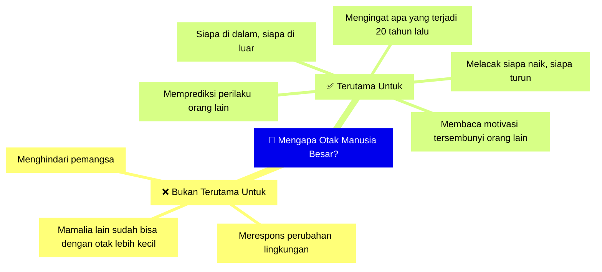

Kita semua, setiap hari, melakukan hal-hal ini:
- *"Orang ini mengingat apa yang terjadi antara kita 20 tahun lalu — dan dia menyimpan dendam"* 😒
- *"Sudah lama tidak ketemu dia — apakah dia juga sedikit nostalgia tentang jalan yang tidak kita ambil?"* 🤔

Semua kemampuan ini — membaca orang, memproyeksikan motivasi, merangkai narasi tentang orang lain — adalah **keterampilan dasar yang sama** yang digunakan untuk **menciptakan karakter** dalam fiksi.

---

## Anatomi Karakter: Model Bawang (*Onion Model*) 🧅

Powers mengajar karakterisasi menggunakan sesuatu yang berasal dari **metode Stanislavski** (*Stanislavsky method*) — teori besar tentang akting yang dikembangkan oleh Konstantin Stanislavski, salah satu teoretikus akting paling berpengaruh sepanjang masa. Karyanya *An Actor Prepares* menjadi fondasi seni peran modern.

### Apa yang Dilakukan Aktor = Apa yang Dilakukan Novelis

Inti dari metode Stanislavski: bagaimana **menghuni peran** (*inhabit a role*) seseorang di panggung yang **bukan dirimu** — dan menemukan di dalam peran itu sesuatu dari **nilai-nilai inti batin** (*core inner values*) karakter tersebut yang bisa kamu **identifikasi**, meskipun kamu tahu betul bahwa kamu **bukan orang itu** dan **tidak berasal dari dunia itu**.

**Yang dilakukan aktor untuk menghuni peran tidak berbeda jauh dari yang harus dilakukan novelis untuk menciptakan karakter.**

### Tiga Lapisan Karakter 🎭

Powers mengajar karakterisasi sebagai **bawang** — lapisan demi lapisan, dari luar ke dalam:

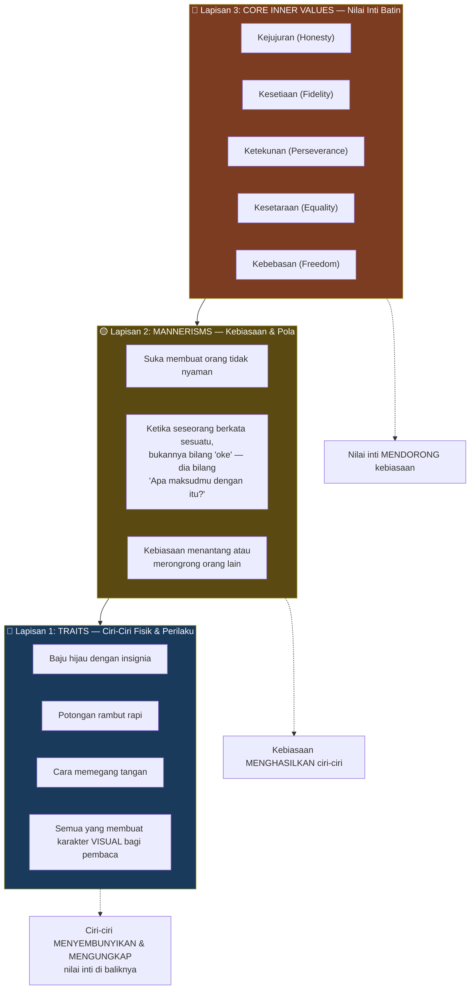

<Callout type="important" title="🎯 Hubungan Antar Lapisan">
Perhatikan: **banyak nilai inti bisa mendorong kebiasaan yang sama**, dan **banyak kebiasaan bisa tersembunyi di balik ciri yang sama**.

Misalnya: Seseorang yang selalu memegang tangan dengan cara tertentu — **mengapa?** Mungkin karena ia punya **kebiasaan** untuk membuat orang lain merasa nyaman. Dan di balik kebiasaan itu ada **nilai inti**: keterlibatan (*complicity*), perhatian (*attentiveness*), atau sesuatu yang lain.

Tugas penulis: menemukan **koherensi** — sehingga perilaku luar karakter **menyembunyikan sekaligus mengungkapkan** hal-hal yang mereka butuhkan, hal-hal yang ingin mereka pertahankan di dunia.
</Callout>

### Contoh Konkret: Marlin dari *Finding Nemo* 🐠

Powers menggunakan analogi film untuk menjelaskan:

- **Nemo** = ikan kecil yang ingin keluar, menjelajah, bereksplorasi 🐟
- **Marlin** (ayahnya) = ayah super protektif yang **mencengkeram** kehidupan anaknya
- Di awal film, Marlin berkata: *"Kamu yakin mau pergi ke sekolah hari ini?"* — karena itu hari pertama sekolah, dan dia sedang berusaha bilang: *"Tetap di rumah, tetap di rumah."*

**Ciri** → overprotektif, selalu menahan
**Kebiasaan** → menghalangi anak dari pengalaman baru
**Nilai inti** → kasih sayang yang berlebihan, ketakutan kehilangan

---

## Bagaimana Karakter Menciptakan Drama 🎬

### "Dorong Mereka ke Tembok!" 💥

Ini adalah prinsip emas yang Powers selalu ajarkan kepada murid-muridnya:

> *"Dorong mereka ke tembok. Dorong mereka ke tembok!"*

Maksudnya: ambil karakter dengan **dua nilai inti** yang ia pegang — lalu **ciptakan situasi di mana ia tidak bisa memiliki keduanya**.

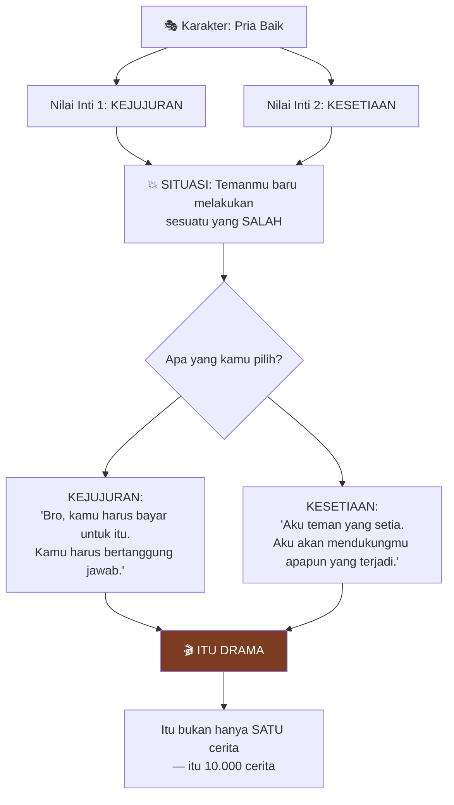

<Callout type="tip" title="💡 Resep Menciptakan Drama dari Karakter">
1. Tentukan **dua nilai inti** karakter yang sama-sama kuat
2. Ciptakan situasi di mana ia **tidak bisa memiliki keduanya**
3. Paksa karakter untuk **melompat** — memilih satu dan meninggalkan yang lain
4. **Itu drama.** Dan itu jenis drama yang paling spesifik: **drama interior**.
</Callout>

### "Bisakah kamu hidup dengan dirimu sendiri?" 🪞

Pertanyaan kunci Powers:

> *"Bisakah kamu hidup dengan dirimu sendiri jika kamu harus melakukan sesuatu yang biasanya kamu benci — tapi keadaan membuatnya perlu untukmu?"*

Inilah esensi dari **novel psikologis klasik**: bagaimana kita mengatasi perbedaan dan drama di dalam **kepala kita sendiri**. Karena jujur saja — kita **tidak ingin** harus memilih antara kejujuran dan kesetiaan. Kita ingin keduanya. Tapi **hidup tidak selalu mengizinkan itu**. 😔

---

## Tiga Level Drama: Hierarki Cerita 📊

Powers menjelaskan bahwa ada **tiga level drama** fundamental dalam semua cerita:

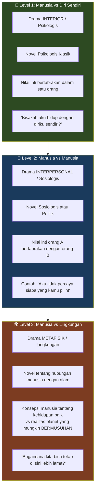

### Level 1: Manusia vs Diri Sendiri (*Person Against Themselves*) 🧠

Ini adalah drama interior — **ketidakstabilan fundamental** ketika perasaan identitasku harus menyesuaikan diri, ketika apa yang kupikir paling penting harus berubah.

**Contoh klasik:** Seorang ayah yang menghargai kejujuran DAN kesetiaan — tapi harus memilih salah satu ketika temannya melakukan kesalahan.

### Level 2: Manusia vs Manusia (*Person Against Person*) 👥

Powers memberikan contoh yang sangat nyata:

> *"Katakanlah nilai inti batinku adalah KESETARAAN, dan nilai inti batinmu adalah KEBEBASAN. Sekarang kita harus pergi ke kotak suara dan memilih satu kandidat. 'Aku tidak percaya siapa yang kamu pilih!' — Kamu lihat apa yang aku maksud? Sekarang kita punya drama interpersonal."*

Yang menarik: dalam novel yang baik, penulis membuat **kedua karakter sepenuhnya simpatik** bagi pembaca — sehingga **pembaca** yang harus memutuskan siapa yang benar. Penulis tidak harus mengatakan siapa yang benar.

### Level 3: Manusia vs Lingkungan (*Person Against the Environment*) 🌍

Ini adalah level drama yang **menghilang** dari fiksi literer selama lebih dari seabad — dan ini adalah inti misi sastra Richard Powers.

> *"Manusia ingin punya cerita tertentu di dunia. Mereka ingin punya proyek. Mereka punya konsepsi tentang apa itu kehidupan yang baik. Sisa dunia — dan itu adalah sisa dunia yang SANGAT BESAR — mungkin BERMUSUHAN dengan ide itu."*

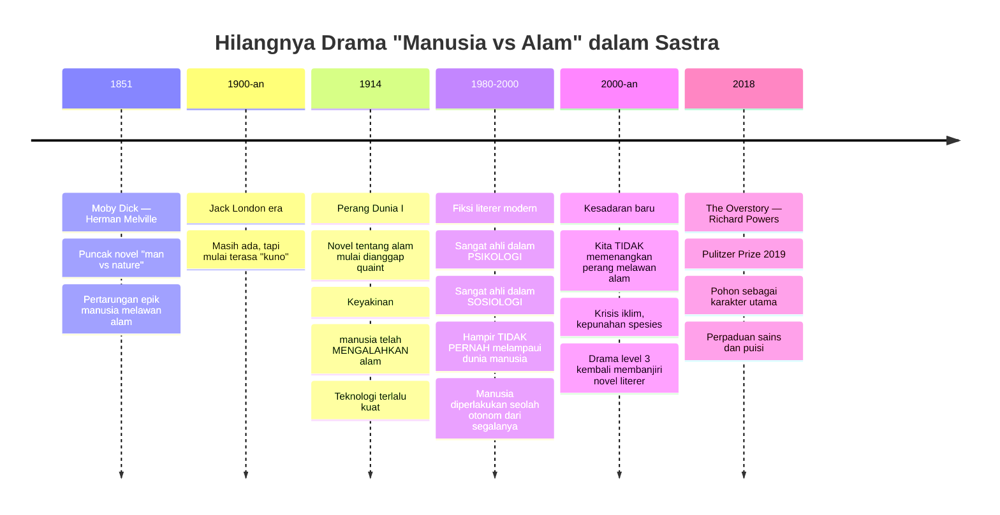

<Callout type="warning" title="⚠️ Mengapa Level 3 Menghilang?">
Powers percaya para praktisi cerita berada di bawah **kesan keliru** bahwa **manusia telah mengalahkan alam** — bahwa manusia telah **memenangkan drama itu**.

*"Teknologi kita telah menjadi begitu kuat sehingga tampaknya bukan pertanyaan yang perlu kita tanyakan lagi."*

Yang terjadi dalam beberapa dekade terakhir: **kesadaran yang berkembang bahwa kita TIDAK menang** — bahkan kita KALAH dalam perang itu. Bukan hanya di front iklim, tapi juga di front kepunahan spesies.
</Callout>

**Fakta menarik:** Drama level 3 **tidak pernah meninggalkan** fiksi ilmiah (*science fiction*) dan fantasi. Yang menceritakan adalah genre-genre itu menjadi **genre kelas dua** di mata para praktisi fiksi literer — padahal mereka mempertahankan dimensi cerita yang paling penting.

---

## Bagaimana Powers Mengembangkan Empati terhadap Pohon 🌳

Salah satu keajaiban *The Overstory* adalah betapa **artikulatnya** Powers tentang pohon — seolah pikirannya dan "kesadaran" pohon **melebur menjadi satu**.

### Sumber Empati

Powers menemukan kapasitas ini dari **tiga sumber**:

1. **Literatur kuno** — mitologi, cerita-cerita adat (*indigenous stories*)
2. **Masa kecilnya sendiri** — kembali ke masa kanak-kanak sebagai **animis** (*animist*) dan **panteis** (*pantheist*)
3. **Penelitian ilmiah** — jurnal peer-reviewed tentang komunikasi pohon

> *"Anak-anak kecil adalah animis. Mereka menganggap serius makhluk-makhluk ajaib di sekitar kita. Seorang anak bisa melihat pohon dan TAHU bahwa makhluk itu hidup dengan cara yang sangat mendalam — yang orang dewasa berhenti menganggap serius. 'Ah, itu cuma kayu. Itu cuma kayu.'"* 🌲

<Callout type="quote" title="📜 The Overstory — Patricia Westerford">
*"Kami menemukan bahwa pohon-pohon bisa berkomunikasi melalui udara dan melalui akarnya. Akal sehat mencemooh kami. Kami menemukan bahwa pohon-pohon merawat satu sama lain. Sains kolektif menolak ide-idenya.*

*Orang-orang luar menemukan bagaimana biji mengingat musim masa kecilnya dan mengatur tunas sesuai itu. Orang-orang luar menemukan bahwa pohon merasakan kehadiran kehidupan lain di dekatnya, bahwa pohon belajar menghemat air, bahwa pohon memberi makan anak-anaknya, menyinkronkan mast mereka, menyimpan sumber daya, memperingatkan kerabat, dan mengirim sinyal ke tawon untuk datang menyelamatkan mereka dari serangan."*
</Callout>

Dan ini bukan puisi belaka — **setiap klaim** dalam katalog itu punya **dukungan empiris** dalam artikel jurnal peer-reviewed yang Powers teliti saat menulis buku itu.

### Dua Cara Mengenal Dunia yang Harus Bersatu 🤝

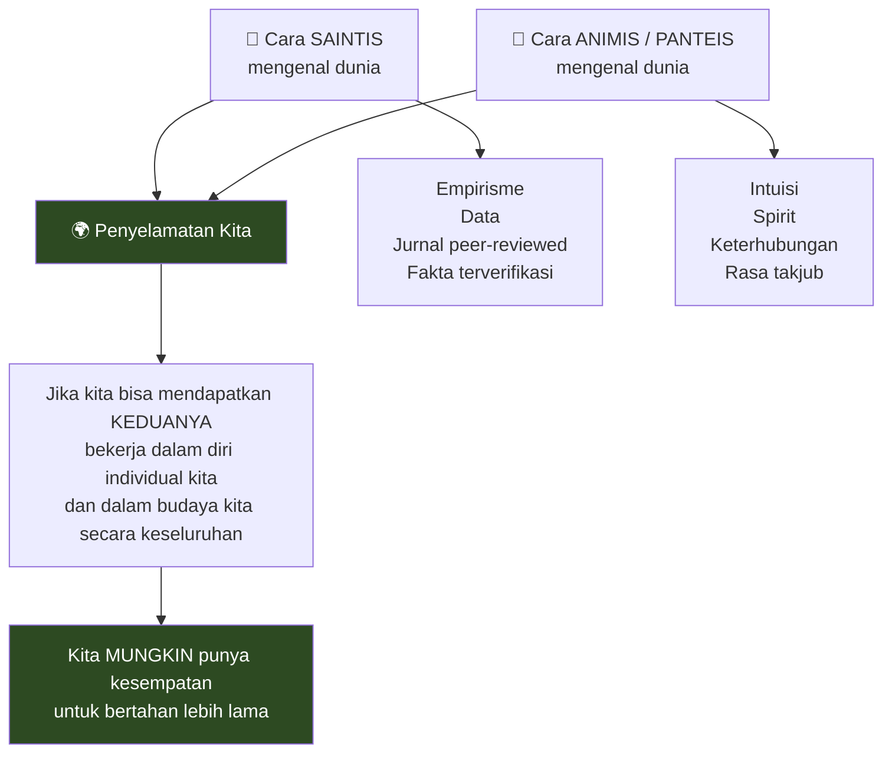

> *"Untuk memahami apa itu manusia, kita harus melihat yang LEBIH DARI manusia."* 🦅

Melihat dunia non-manusia juga berarti **memahami drama interior** — bukan hanya soal memberi suara pada pohon, tapi **mengingat suara-suara di dalam manusia** yang ditekan oleh **kolonialisme kultural** yang berkata: *"Tidak, tidak, tidak — jangan perhatikan dunia di balik tirai. Yang ada hanya kita."*

---

## Voice: Apa yang Menghidupkan Karakter 🗣️

Powers mengungkap rantai kausalitas fundamental dalam fiksi:

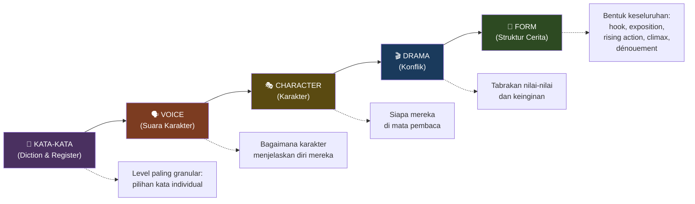

> *"Begitu kamu MENDENGAR seseorang, kamu juga mulai bisa MELIHAT orang itu."*

Contoh sempurna: **Forrest Gump**. Hanya dari cara ia berbicara dan **kesederhanaan bahasanya**, voice langsung menuntun ke karakter.

### Lesson #1: Register Kata — Bilingualisme Tersembunyi dalam Bahasa Inggris 🏰

Powers mengungkap sesuatu yang sering **membuka mata** murid-muridnya:

Penutur bahasa Inggris punya semacam **bilingualisme bawaan** — karena alasan historis, mereka bisa menarik dari **dua sejarah dan asal-usul kata yang sama sekali berbeda** untuk menciptakan efek registral dan warna.

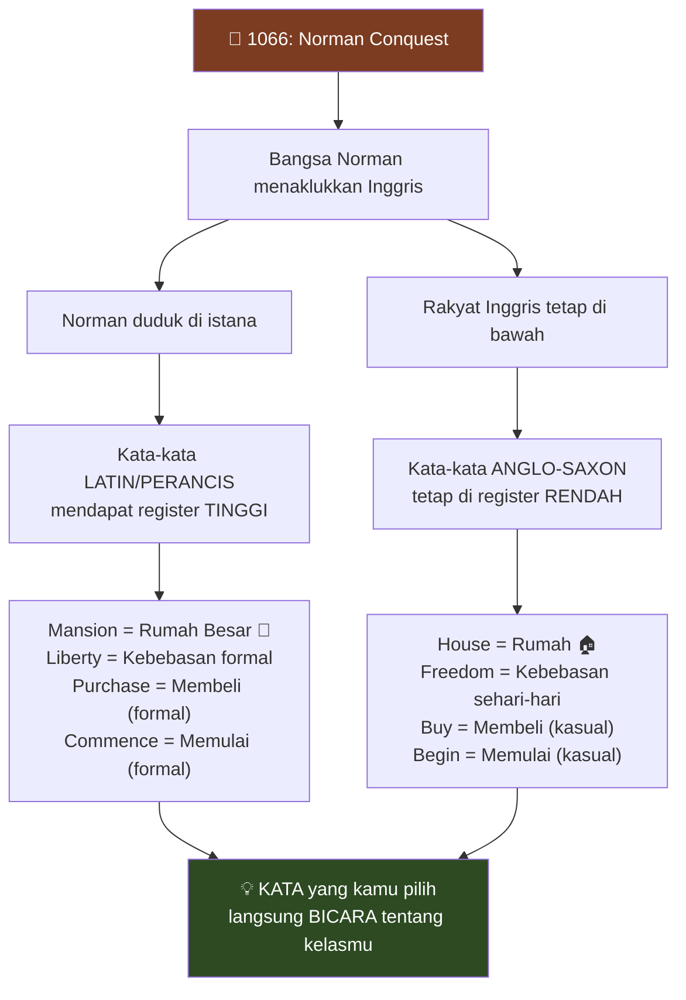

> *"Jika kamu bilang 'aku tinggal di mansion' atau 'aku tinggal di house' — mengapa yang satu terdengar lebih mahal dari yang lain?"* 🤔

Jawabannya ada dalam **sejarah**: karena bangsa Norman datang dan menaklukkan Inggris, kata-kata Latin/Prancis mendapat **register sosial-ekonomi yang lebih tinggi**.

<Callout type="tip" title="💡 Implikasi untuk Penulis">
Ketika murid-murid Powers menyadari ini, reaksinya selalu: *"Wow, aku punya kekuatan yang sebelumnya tidak aku punya!"*

**Mungkin** mereka bisa mendengarnya di telinga ketika seseorang sedang **sombong** atau sedang berusaha **menunjukkan kredibilitas jalanan** — tapi sekarang mereka tahu **aturan sebenarnya** untuk membuat itu bekerja, **telinga mereka menjadi lebih tajam**.

Perbedaan antara *freedom* dan *liberty*, antara *help* dan *assist*, antara *buy* dan *purchase* — semuanya menjadi **lebih terdengar**.
</Callout>

### Dalam Konteks Bahasa Indonesia 🇮🇩

Prinsip yang sama berlaku! Bahasa Indonesia punya spektrum register serupa:

| Register Rendah (Kasual) | Register Tinggi (Formal/Latin-Arab) |
|--------------------------|-------------------------------------|
| Rumah | Residensi / Kediaman |
| Mati | Wafat / Meninggal dunia |
| Beli | Akuisisi |
| Mulai | Inaugurasi |
| Pikir | Kontemplasi / Refleksi |

**Setiap pilihan kata langsung mengirim sinyal** tentang siapa karaktermu, dari kelas sosial apa, dan bagaimana ia memandang dunia. 🎯

---

## Tiga Jenis Kalimat: Struktur yang Memanipulasi Emosi 📝

Ini adalah bagian yang paling **teknis dan berharga** dari wawancara — di mana Powers membongkar bagaimana **struktur kalimat** bisa memanipulasi **kondisi mental** pembaca.

### Prinsip Dasar

Setiap kalimat dibangun di sekitar **kernel** (*inti*): **subjek utama + kata kerja utama** (*main predication*). Jika kamu bisa menemukan kernel itu di halaman atau di telingamu, kamu bisa **membangun kalimat** sedemikian rupa sehingga kalimat itu **menciptakan kembali secara emosional dan praktis** kondisi mental yang diinginkan narator.

**Kalimat mulai BERPARTISIPASI dalam afek (*affect*) dari hal yang sedang dideskripsikan.**

### Tipe 1: Front-Loaded — Predikasi di Depan ⚡

```
Dia mengarahkan pistol ke temannya.
```

```
Pistol meledak — dan gumpalan asap keluar dari laras.
```

**Efek:** Kejutan langsung (*front-loaded shock*) 💥. Aksi di depan — kita melihat tindakan dulu, baru konsekuensinya.

### Tipe 2: Delayed — Predikasi Ditunda ⏳

```
Jauh di seberang halaman, dekat pagar di mana sebuah sungai kecil 
mengalir di sepanjang pagar tanaman tua... dia bersembunyi.
```

**Efek:** Ketegangan dan suspense 😰. Pembaca dalam keadaan menunggu — *"Apa yang akan kamu katakan? Apa yang akan kamu katakan?"*

Dan **"dia"** tidak muncul sampai akhir kalimat — sehingga **dia tersembunyi dari pembaca dalam kalimat itu** dengan cara yang **persis sama** dia tersembunyi di ruang fisik cerita!

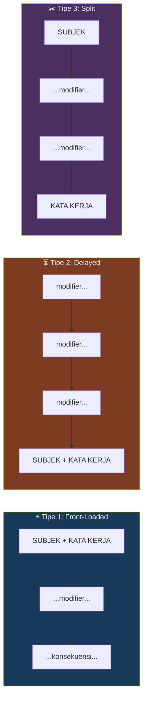

### Tipe 3: Split — Predikasi Dibelah di Tengah ✂️

Mulai dengan subjek, masukkan banyak hal di tengah, lalu kata kerja di akhir.

**Efek:** Bisa menciptakan suspense, komedi, atau kejutan. Ini adalah bentuk yang **paling langka** dalam prosa rata-rata — tapi ketika digunakan di tengah paragraf yang sudah memiliki tiga kalimat tipe 2 berturut-turut, efeknya seperti **pergantian kunci dalam musik** atau perpindahan ke **akord yang berbeda** 🎵.

<Callout type="important" title="🎯 Prinsip Kunci Powers">
**Kalimat harus BERPARTISIPASI dalam afek dari hal yang sedang dideskripsikan.**

Jika karakter bersembunyi → **sembunyikan** dia di kalimat.
Jika ada kejutan → **letakkan** aksi di depan.
Jika ada misteri → **tunda** pengungkapan.

**Struktur kalimat = emosi pembaca.**
</Callout>

---

## Trik Registral: Kata Terakhir Mengubah Segalanya 🎵

Powers membedah kalimat pembukanya sendiri:

> *"Each child's tree has its own **excellence**."*

**Pertanyaan:** Apakah kamu mengharapkan kata itu sebagai kata terakhir klausa?

**Tidak.** Dan itulah triknya.

> *"Ini seperti lagu hebat di mana kamu mendengar frase dan kamu pikir kamu tahu ke mana akor-akornya menuju — dan tiba-tiba di akhir frase itu kamu mendengar perubahan warna atau instrumentasi atau nada yang tidak terduga."*

**Hal terakhir** yang akan kamu pikirkan untuk diterapkan pada pohon adalah kata *"excellence"* — tingkat **keunggulan**. Kata itu menaikkan **register** karena ini kata Latinate, formal, hampir manusiawi — diterapkan pada sesuatu yang biasanya kita anggap "cuma kayu".

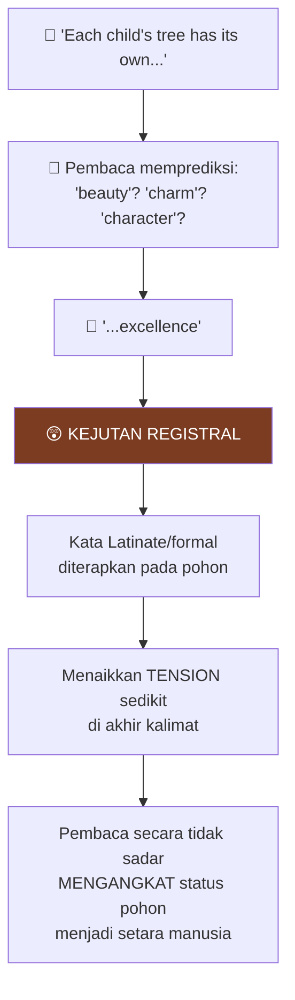

**Awal dan akhir kalimat** adalah tempat-tempat yang **sangat kuat** untuk menetapkan dan **mengejutkan** ekspektasi pembaca.

> *"Ketika kita membaca, kita terus-menerus berkata: apa yang datang selanjutnya? Kita seperti AI — kita seperti model bahasa besar (*large language model*). Kita punya model dunia dan setiap kata baru yang ditambahkan ke kalimat, kita memutuskan ke mana ia akan berputar."* 🤖

---

## Menulis Deskriptif: "Tidak Apa-apa untuk Berusaha Keras" ✍️

David Perell mengakui: setiap kali ia mencoba menulis deskriptif, hasilnya terdengar **terlalu dipaksakan** (*overdone*).

Respons Powers:

> *"Tidak apa-apa untuk berusaha keras — karena kamu SELALU punya tahap edit di mana kamu bisa membuatnya terlihat lebih effortless."*

### Proses Dua Langkah

1. **Draft Pertama = Catatan untuk Dirimu Sendiri** 📝
   - Dorong dirimu dalam komposisi
   - Buat catatan tentang efek-efek yang kamu kejar
   - Mungkin terlalu jelas, mungkin terlalu diblok — **tapi setidaknya sekarang kamu tahu efek apa yang kamu kejar**

2. **Edit = Sembunyikan Footwork-mu** 🎭
   - Kembali dan sembunyikan jejakmu
   - Buat lebih elegan
   - Keluarkan catatan-catatan yang terlalu keras atau yang mengumumkan niatmu terlalu jelas

<Callout type="tip" title="💡 Pelajaran Menulis Powers #1">
*"Pikirkan draft pertama sebagai catatan untuk dirimu sendiri tentang keadaan psikis yang kamu inginkan agar deskripsimu BERPARTISIPASI di dalamnya."*

*"Ketika kamu kembali, kamu bisa menyembunyikan footwork-mu dan membuat lebih elegan — mengeluarkan catatan-catatan yang terlalu keras."*
</Callout>

### Contoh Deskripsi Pohon

> *"Each child's tree has its own excellence. The ash's diamond-shaped bark, the walnut's long compound leaves, the maple's shower of helicopters, the vasic spread of elm, the ironwood's **fluted muscle**."*

**Trik:** setiap spesies pohon dibuat **vivid dan distinct** — tapi ada elemen-elemen halus **antropomorfisme** (*anthropomorphism*) atau **animisme** (*animism*):

- *"The ironwood's **fluted muscle**"* — batang pohon yang secara visual sangat khas sekarang menjadi seperti **binaragawan** yang kamu bisa lihat otot-ototnya mengencang 💪

Ini adalah **undangan halus** untuk memunculkan animisme di dalam diri pembaca — *"Oh ya, aku pernah melihat pohon dan BERPIKIR pohon itu jahat, atau pohon itu pemalu, atau pohon itu megah..."*

---

## Kekuatan Fiksi: Mengapa Cerita Mengubah Perilaku 🧪

Powers berbagi eksperimen psikologi yang **mengubah cara pandang** tentang kekuatan cerita:

### Eksperimen "Pensil Tumpah" 📏

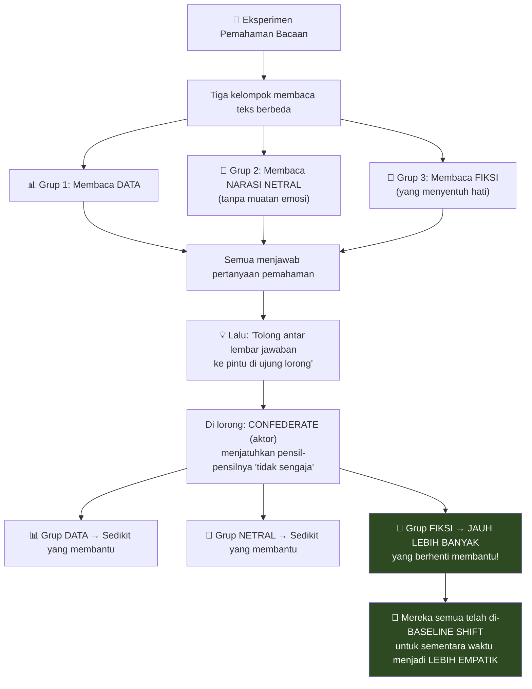

<Callout type="important" title="💡 Fakta vs Nilai: Tidak Sama!">
> *"Sebagaimana psikolog tahu: pemahaman akan FAKTA dan pergeseran NILAI bukanlah hal yang sama.*

> *Kita bisa DIRAYU jauh lebih kuat oleh emosi, afek, dan perasaan daripada oleh statistik, grafik, dan argumen."*

Kata **"emosi"** (*emotion*) sendiri menarik secara **etimologis**: dari bahasa Latin *emovere* — **menggerakkan** (*to move*). *E-motion* = menggerakkan seseorang keluar dari tempatnya. 🎯

**Fiksi mengundang IDENTIFIKASI** — mengundangmu untuk bertanya: *"Siapa aku jika aku bukan diriku tapi ORANG ITU?"*

Dan sekadar **melakukan itu** — menempatkan dirimu di posisi orang lain — meningkatkan **keinginanmu** untuk terhubung, berempati, dan membantu orang lain.
</Callout>

---

## Grafik Tensi: Arsitektur Cerita 📈

Powers mengajar **tension graph** (*grafik ketegangan*) sebagai fondasi **bentuk/form** cerita:

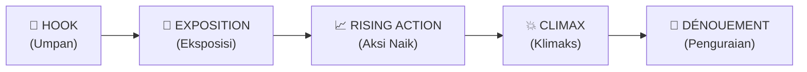

### 1. Hook — Umpan di Awal 🎣

Tension sedikit **lebih tinggi secara artifisial** di awal:

> *"Ini yang akan menarikmu ke dunia ini. Ada taruhan di awal yang akan langsung membuat kamu tertarik secara visceral."*

### 2. Exposition — Memperkenalkan Semua Orang 📖

Setelah pembaca terpancing, kamu bisa **menurunkan tension sedikit** saat memperkenalkan:
- Siapa mereka?
- Dari mana mereka berasal?
- Apa taruhannya?
- Menempatkan semua orang di panggung

> *"Kamu sudah MENDAPAT hak untuk menurunkan tension dan memperkenalkan semua orang karena kamu sudah memberikan sedikit umpan-dan-ganti."*

### 3. Rising Action — Aksi yang Naik 📈

Begitu pembaca sudah terorientasi, kamu mulai **mengeksplorasi ketidakstabilan**:

- Setiap nilai menciptakan **kontra-nilai yang tidak stabil**
- Setiap kontak dengan manusia lain menciptakan **ketidakstabilan** dalam apa yang orang-orang inginkan dan butuhkan
- **Setiap kali sesuatu terselesaikan**, ia menghasilkan **ketidakstabilan yang LEBIH BESAR** — karena **konsekuensi** dari menyelesaikan episode pertama itu lebih besar dari episode itu sendiri

> *"Kamu naik tangga ini sampai kamu TIDAK BISA menaikkan taruhan lebih jauh lagi."*

### 4. Climax — Puncak 💥

Konflik dramatis **tertinggi** — kamu telah mencapai dinding. Semua orang telah membuat **lompatan akhir** mereka.

### 5. Dénouement — Penguraian 🎀

Powers menjelaskan kata ini secara harfiah dari bahasa Prancis:

> *"**Dénouement** secara harfiah berarti 'penguraian' (*the untying*). Kamu telah memuntir simpul semakin ketat dan ketat dan ketat — kamu sampai di klimaks — ia pecah — dan sekarang apa yang terjadi di dunia menunjukkan arah lintasan orang-orang yang telah melewati api dan sekarang BERBEDA dari sebelumnya."*

<Callout type="tip" title="💡 Mengapa Naga Harus Semakin Sulit">
Powers memberi contoh yang sangat intuitif:

*"Alkisul ada seorang pangeran. Pangeran keluar dengan kudanya dan membunuh naga PALING MENANTANG di negeri itu.*

*Tahun berikutnya, pangeran keluar dan membunuh naga yang AGAK MENANTANG.*

*Dan finalnya: dia membunuh naga yang paling MUDAH."*

**Itu sama sekali tidak masuk akal!** 😂

Kita punya **pemahaman intrinsik** bahwa tension harus **naik** — menyusun tension sebagai hal yang meningkat. Ini mungkin bersifat **fisiologis** — bagian dari kekuatan adaptif kita untuk memikat orang lain dengan cerita.
</Callout>

---

## Dialog: Representasi yang Sangat Terstilisasi 💬

Powers memberikan wawasan mengejutkan tentang dialog:

> *"Dialog adalah representasi dari cara orang benar-benar bicara — tapi ia BUKAN itu. Ia jauh lebih efisien daripada percakapan manusia sebenarnya. Ia SANGAT TERSTILISASI."*

Jika kamu duduk di belakang bus dan hanya **mentranskrip** cara orang bicara satu sama lain, lalu mencoba menyajikannya di halaman — kamu bisa mengklaim *"ini dialog paling realistis yang pernah ada"*.

**Hasilnya akan mengerikan.** Kacau, tidak koheren, penuh pengulangan. 😵

<Callout type="warning" title="⚠️ Apa Itu Dialog 'Realistis'?">
Ketika kita bilang dialog itu "realistis" atau "vivid", kita **sebenarnya tidak** bicara tentang **akurasi empiris**.

Kita bicara tentang **pengenalan ekspektasi naratif konvensional** yang telah kita pelajari dari fiksi yang berlaku dalam budaya kita **saat ini**.

*"Dialog konvensional yang realistis adalah dialog yang tahu bagaimana MEMANIPULASI ekspektasi konvensional yang telah ditetapkan untuk dialog pada momen ini."*

**Dan kamu tidak perlu mundur terlalu jauh** untuk mulai meninggalkan zona nyamanmu. Jika kamu hanya hidup dengan fiksi 10 tahun terakhir dan kembali 20, 40, atau 100 tahun — kamu mungkin berkata *"orang tidak bicara seperti itu"*. Padahal yang kamu katakan hanyalah: *"Aku kehilangan decoder ring-ku."*
</Callout>

### Tips Dialog dari Powers 🎯

> *"Aku pikir kamu harus MENDENGARNYA dengan keras — karena aku pikir begitulah cara kebanyakan pembaca sebenarnya mengonsumsi narasi."*

Ketika kita membaca, kita **subvokalisasi** (*subvocalize*) — mendengarnya secara subvokal di dalam kepala. Itulah mengapa kadang sulit bagi penulis mendengarkan **audiobook** karya mereka sendiri — mereka sudah menghabiskan bertahun-tahun subvokalisasi semua karakter ini, dan sekarang harus mendengar karakter-karakter itu **diliteralkan** oleh aktor suara yang berbeda. 🎧

**Untuk menciptakan dialog yang bisa memunculkan emosi berbeda**: uji di **crucible telingamu** (*the crucible of your ear*). Bacakan keras-keras. Rasakan register, nada, warna, irama, dan akurasi sosial-ekonomi dialog itu.

### Dua Master Dialog yang Sangat Berbeda

Powers menyebut dua penulis yang ia kagumi — yang **estetikanya benar-benar berlawanan**:

| **Anne Patchett** | **Don DeLillo** |
|---|---|
| Karakter-karakternya begitu hidup sampai kamu **lupa mereka karakter** | Dialog di *White Noise* itu **gila** dan **sangat artifisial** |
| *"Oh ya, itu tetanggaku. Itu wanita yang tinggal bersamaku 11 tahun."* | Tapi DeLillo punya **telinga terbaik** dari semua penulis yang masih hidup |
| Performa **menghilang sepenuhnya** | Ia menangkap **absurditas** cara kita bicara **melewati** satu sama lain |
| **Realisme** dalam arti identifikasi langsung | **Surealisme** yang ironisnya **sangat nyata** |

---

## Opening Lines: Kanvas Kosmis 🌌

Powers mengungkap filosofi pembukaan novelnya:

### *The Overstory*: "First there was nothing. Then there was everything."

### *Playground*: "Before the Earth, before the moon, before the stars, before the sun, before the sky — even before the sea — there was only time and Taroa."

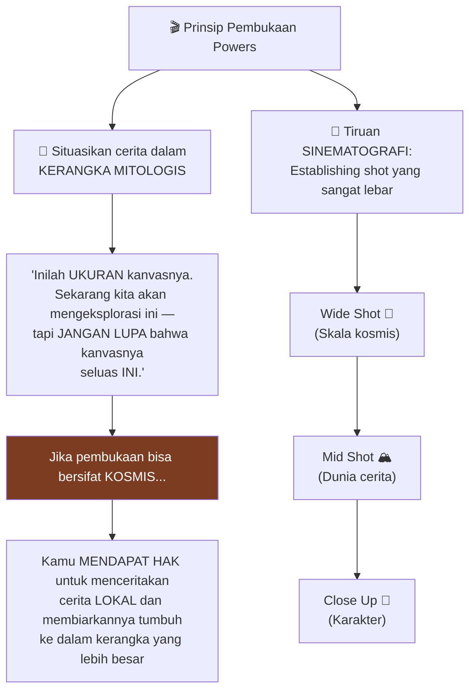

Powers mengaku: **ia mencintai kalimat pembuka** 😍

> *"Kadang seluruh buku terkandung dalam mikrokosmos kalimat atau paragraf pertama. Semua konflik, semua drama, semua karakterisasi — diisyaratkan dengan cara yang pembaca tidak mungkin bisa lihat atau antisipasi."*

Contoh klasik:
- **Romeo and Juliet:** *"Two households, both alike in dignity, in fair Verona where we lay our scene"* — dua orang, sangat mirip, tapi uh-oh sesuatu akan terjadi
- **A Tale of Two Cities:** *"It was the best of times, it was the worst of times"*

### Cerita di Balik "First there was nothing. Then there was everything."

Kalimat pembuka *The Overstory* ternyata berasal dari **salah satu kalimat terakhir** yang diucapkan seorang teman dekat Powers — **seorang penyair Amerika yang brilian** — di ranjang kematiannya.

> *"Orang-orang tercintanya berdiri di sisinya, dan dia bicara, dan mereka mencondongkan badan. 'Apa yang dia katakan?' Mereka tidak bisa mendengarnya. Dia berkata sesuatu... mereka mencondongkan badan...*
>
> *Dia berkata: **'First there was nothing. Then there was everything.'***
>
> *Dan aku pikir — apa cara yang lebih baik untuk mengabadikan kehidupan dan karya teman ini daripada mengambil itu dan mempromosikannya menjadi awal buku ini."* 😢

---

## Proses Menulis: Evolusi 40 Tahun 📆

### Fase 1: 1000 Kata Per Hari (25-30 Tahun Pertama) ✏️

- Bangun pagi (paling alert di pagi hari)
- Sarapan
- **Minimalkan interaksi** dengan dunia — tahan godaan untuk membaca berita kemarin, mengecek feed
- Langsung bekerja sementara **otak masih segar**
- **Tetap** sampai punya **1000 kata**
- Itu disiplinnya. Itu yang membentuk hari.

### Fase 2: Menjadi di Dunia yang Hidup (Sekarang) 🌿

> *"Sesuatu terjadi. Aku menjadi jenis penulis yang berbeda."*

Sekarang, pekerjaan utamanya **bukan lagi** menghasilkan 1000 kata:

> *"Aku melihat pekerjaan utamaku sekarang sebagai BERADA DI DUNIA yang hidup."*

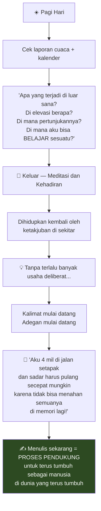

### Solitude: Masuk dan Keluar 🚪

Powers menekankan: **bukan solitude yang menjadi strategi — tapi GERAKAN masuk dan keluar dari solitude**.

> *"Proses komposisiku membutuhkan MENGHILANGKAN stimulus dunia yang overwhelm — untuk bisa menciptakan kekayaan dalam imajinasiku sendiri."*

Secara konkret:
- Menulis **berbaring di tempat tidur** 🛏️
- Menarik selimut ke atas
- **Mendiktekan** atau menggunakan pena
- Mematikan lampu dan **mendikte dalam gelap**
- Menatap langit-langit kosong

**Tapi** jika kamu tetap soliter, kamu akan **terlepas dari orbit** — baik secara literal maupun secara artistik:

> *"Kamu tidak akan punya DUNIA untuk menguji produk kesendirian-mu."*

---

## Alat Tulis Berbeda = Instrumen Berbeda 🎸

Powers menyamakan alat tulis dengan **instrumen musik**:

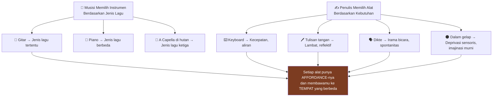

> *"Alat-alat yang kita gunakan untuk menulis — kita meraihnya ketika kita membutuhkannya. Ketika kita mendeteksi melalui intuisi atau intelek bahwa kita perlu MEMPERLAMBAT, atau lebih tenang, atau MEMPERCEPAT, lebih hidup."*

---

## Pelajaran Menulis Terpenting: "Tidak Ada Final yang Benar" 🎯

Powers merewrite kalimat-kalimatnya **12-14 kali** — dan itu hanya perkiraan kasar karena dengan word processing, prosesnya **kontinu dan tak pernah berhenti**.

> *"Kamu bangun keesokan harinya dan mengerjakan ulang materi hari sebelumnya. Lalu kamu sampai di akhir minggu dan punya satu bab — dan kamu mengerjakan ulang babnya lagi. Lalu seluruh buku selesai dan kamu bilang saatnya draft kedua — tapi draft kedua itu sebenarnya sudah bisa jadi draft ke-12 atau lebih untuk bagian-bagian tertentu."*

Dan bahkan **setelah diterbitkan**:

> *"Aku mengambil buku ini yang diterbitkan kemarin. Aku berdiri di belakang podium malam ini. Aku mulai membaca darinya. **Aku ingin mengubahnya.**"* 😅

<Callout type="success" title="🎯 Lesson Number One of Craft">
Powers berkata ini **mungkin pelajaran nomor satu tentang craft**:

> *"Aku juga mendengarkan dan berkata: 'Tidak, aku akan melakukannya berbeda sekarang. Berikan aku pena merah.'"*

> ***"Karena itulah menulis. Kamu TIDAK PERNAH selesai dengannya. Karena kamu adalah target yang bergerak. Pembacamu adalah target yang bergerak. Dunia adalah target yang bergerak."***

> *"Ketika kamu bilang kamu melihat draft pertamamu dan itu frustasi — aku bilang itu BUKAN bug, itu FITUR. Biarkan frustrasi itu menjadi bentuk lain dari melihat keinginanmu."*
</Callout>

---

## Kutipan-Kutipan Kunci: Fire Round 🔥

### "Argumen terbaik di dunia tidak akan mengubah pikiran satu orang pun..."

> *"...Satu-satunya yang bisa melakukan itu adalah **cerita yang baik**."*

Untuk menggerakkan seseorang, kamu harus menggunakan **emosi** — bukan logika.

### "Jika kamu ingin mempelajari rahasia alam, kamu harus mempraktikkan lebih banyak kemanusiaan"

> *"Rahasia alam adalah tempat di mana rahasia kemanusiaan muncul."*

Kita bisa memahami diri kita sebagai individu melalui perbedaan dengan orang lain — tapi untuk memahami **apa itu manusia**, kita harus melihat yang **lebih dari manusia**.

### "Kesendirian menulis adalah kamu membingungkan teman-temanmu dan mengubah hidup orang asing"

> *"Aku bisa memberikan manuskrip kepada saudaraku. Dia mengembalikannya beberapa minggu kemudian dan berkata: '...menarik.'*
>
> *Tapi aku bisa menyalakan teleponku pagi ini dan mendapat email: 'Kamu tidak mengenalku — tapi aku sekarang kuliah kehutanan **karenamu**.'*
>
> *Apa artinya itu? Itu gila."* 😮

### "Ketika kamu yakin dengan apa yang kamu lihat — lihat lebih keras"

> *"Karena ketika kamu yakin, kamu TIDAK BERGERAK. Dan realitas selalu bergerak."*

Jika kamu telah sampai pada sudut pandang yang definitif dan tak terbantahkan — itu karena sudut pandangmu **stasioner** (*stationary*). Dan itu tidak akan membantumu bertahan di dunia di mana semua sudut pandang **terus bergerak**.

### "Perhatian adalah sumber makna paling mendalam yang bisa kita miliki"

Powers menceritakan transformasi pribadinya:

> *"Sebelum aku menulis The Overstory, aku punya jalan setapak dari rumah ke kantor. Jalannya seperti ini: **pohon, pohon, pohon, pohon**.*
>
> *Ketika aku mulai menulis, jalannya mulai terlihat seperti ini: **oak merah, maple, hornbeam**...*
>
> *Dan ketika aku semakin dalam ke The Overstory: **'Oh, orang ini...'** Bukan oak merah — **orang ini.** Dan dia melakukan sesuatu yang tidak aku lihat di oak merah lain di lingkungan ini."* 🌳

**Granularitas, partikularitas, kenikmatan dunia — bergantung pada MEMPERLAMBAT dan MELIHAT LEBIH KERAS.**

---

## Ringkasan Komprehensif: Semua Anjing Menarik Satu Kereta 🐕

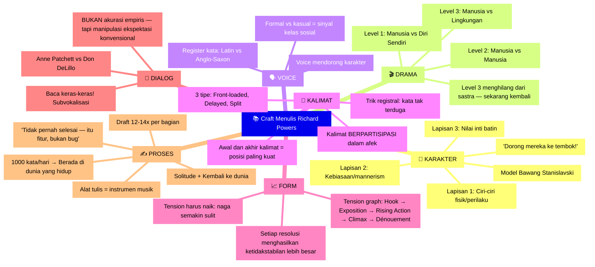

Metafora terakhir Powers: **semua anjing harus menarik kereta ke arah yang sama**.

Dalam novel yang baik, ada **banyak anjing yang menarik kereta** — bahasa, drama, karakter, bentuk, struktur. Pembaca yang berbeda menempelkan diri lebih mudah ke elemen yang berbeda. Tapi strategi idealnya: **semua elemen menarik ke arah yang sama dan saling memberi makan**.

> *"Kereta hanya akan bergerak ketika semua anjing terikat dan mereka semua menarik ke arah yang sama."* 🐕‍🦺

---

## Referensi & Sumber 📖

<Callout type="cite" title="📖 Karya Richard Powers">
- **The Overstory** (2018) — Pulitzer Prize 2019
- **The Echo Maker** (2006) — National Book Award
- **Playground** (2024) — Novel terbaru
- **Plowing the Dark** (2000) — Ditulis dalam solitude ekstrem
- Serta 10 novel lainnya dalam karier 40 tahun

**Penulis Lain yang Disebut:**
- **Konstantin Stanislavski** — *An Actor Prepares*
- **Anne Patchett** — Master dialog naturalistik
- **Don DeLillo** — *White Noise* (master dialog surreal)
</Callout>

<Callout type="info" title="🎥 Sumber Video">
Wawancara oleh **David Perell** berjudul *"Pulitzer Prize-Winner Explains His Writing Process — Richard Powers"* tersedia di [YouTube](https://www.youtube.com/watch?v=QUDlpMN-f5w).

Untuk lebih banyak analisis menulis, kunjungi **writingexamples.com** — situs David Perell yang membedah apa yang membuat tulisan penulis seperti Steinbeck, Orwell, dan Seinfeld begitu bagus.
</Callout>

---

*Artikel ini mengadaptasi wawancara mendalam dengan Richard Powers. Jika kamu seorang penulis — atau seseorang yang ingin menulis dengan lebih hidup — pelajaran-pelajaran ini berlaku tidak hanya untuk novel, tapi untuk setiap bentuk tulisan yang berusaha menggerakkan pembaca.*
