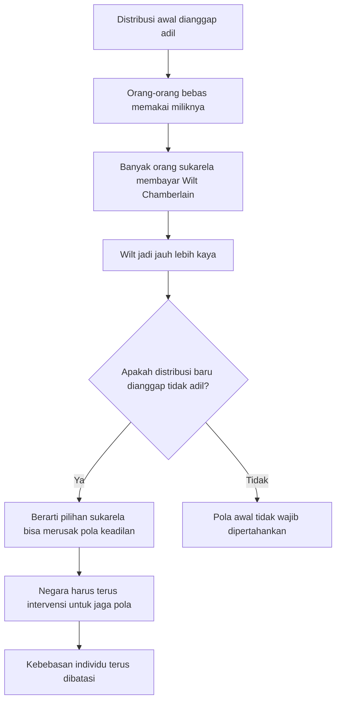
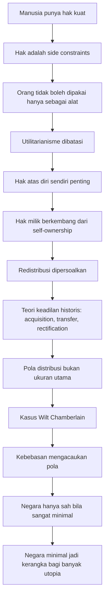

## 🏛️ Pendahuluan: Mengapa Robert Nozick Masih Penting?

Di antara buku-buku filsafat politik abad ke-20, ada beberapa karya yang benar-benar menggeser medan perdebatan. Salah satunya adalah **Anarchy, State, and Utopia** karya **Robert Nozick**, terbit tahun 1974. Buku ini sering dianggap sebagai salah satu teks klasik paling penting dalam tradisi **libertarianisme** *(filsafat politik yang menekankan kebebasan individu, hak milik, dan pembatasan kekuasaan negara)*. 🏛️

Namun pentingnya Nozick bukan hanya karena ia membela libertarianisme. Ia penting karena ia mengajukan pertanyaan yang sangat tajam dan tidak nyaman:

> **Kalau manusia memang punya hak-hak yang sangat kuat, sejauh mana negara boleh bertindak atas nama kebaikan bersama?**

Pertanyaan ini kelihatannya sederhana, tetapi konsekuensinya sangat besar. Sebab hampir seluruh politik modern beroperasi dengan asumsi bahwa negara boleh:
- memungut pajak,
- mengatur perilaku,
- mendistribusikan ulang kekayaan,
- melarang pilihan-pilihan tertentu,
- dan memaksa sebagian orang demi keuntungan yang dianggap lebih besar bagi masyarakat.

Nozick datang dengan semacam rem moral yang sangat keras. Ia mengatakan bahwa manusia bukan sekadar titik dalam kalkulasi sosial. Manusia adalah pribadi yang punya **rights** *(hak-hak moral)*, dan hak-hak itu berfungsi sebagai **side constraints** *(batas samping / pagar moral yang tidak boleh ditembus begitu saja demi tujuan baik apa pun)*. 

Jadi perdebatan yang dibawa Nozick bukan sekadar: “Negara sebaiknya kecil atau besar?”

Perdebatan yang lebih dalam adalah:

> **Apakah ada hal-hal yang secara moral memang tidak boleh dilakukan negara, bahkan jika hasil akhirnya tampak bermanfaat?**

Dalam artikel ini saya akan membedah pemikiran Nozick secara **detail, mendalam, runtut, dan lengkap** berdasarkan isi podcast/transkrip yang Mas Hendra kirim, sambil menempatkannya dalam konteks lebih luas. Kita akan membahas:

- mengapa buku ini berpengaruh,
- hubungan Nozick dengan John Rawls,
- konsep hak dan Kant,
- kritik terhadap utilitarianisme,
- **experience machine**,
- hak milik dan pajak,
- kasus **Wilt Chamberlain**,
- teori negara minimal,
- utopia sebagai kerangka sosial,
- dan pertanyaan penting: apakah Nozick kemudian “meninggalkan” libertarianisme?

---

<Callout type="important" title="Catatan penting">
Artikel ini bukan sekadar ringkasan podcast. Saya kembangkan menjadi esai filsafat politik agar argumen Nozick bisa dipahami utuh: konteksnya, struktur logikanya, titik kuatnya, dan juga titik yang sering dikritik.
</Callout>

---

## 📚 1. Mengapa *Anarchy, State, and Utopia* Begitu Berpengaruh?

Salah satu alasan besar buku ini meledak adalah momen historisnya. Buku ini terbit tidak lama setelah **A Theory of Justice** karya **John Rawls**, yang sangat berpengaruh dalam filsafat politik modern. Dalam banyak kelas pengantar filsafat politik, kedua buku ini lalu dipasangkan sebagai dua kutub besar:

- **Rawls** mewakili pembelaan canggih atas keadilan distributif *(distributive justice / keadilan dalam pembagian manfaat dan beban sosial)*,
- **Nozick** hadir sebagai sang penantang kuat dari arah libertarian. 📚

Tetapi pengaruh Nozick bukan sekadar karena ia “membalas Rawls.” Ia berpengaruh karena bukunya sangat inventif. Nozick bukan tipe filsuf yang membangun satu sistem total dan menutup semua celah. Gaya berpikirnya lebih seperti penjelajah intelektual:
- ia bergerak cepat dari satu ide ke ide lain,
- penuh eksperimen pikiran *(thought experiments / percobaan mental)*,
- banyak argumen yang berdiri sendiri,
- dan tidak terlalu obsesif memaksa pembaca untuk menerima satu sistem final yang rapi.

Ini justru membuat bukunya tahan lama. Mengapa? Karena walaupun orang menolak sebagian sistem Nozick, mereka sering tetap menemukan bagian-bagian tertentu sangat berguna dan menggugah. Contohnya:
- **experience machine**,
- argumen tentang hak sebagai batas moral,
- kasus **Wilt Chamberlain**,
- dan gagasan libertarianisme sebagai **framework for utopia** *(kerangka bagi banyak utopia)*.

Jadi, kekuatan Nozick bukan hanya pada sistem yang tertutup, tetapi pada **serpihan-serpihan argumennya yang tetap hidup bahkan ketika keseluruhan sistem diperdebatkan.**

---

## 🧭 2. Cara Nozick Berfilsafat: Bukan Memaksa, Tapi Menjelajah Kemungkinan

Salah satu hal paling menarik dari Nozick adalah gaya intelektualnya. Ia tidak berfilsafat dengan cara “Saya punya benteng sistematis sempurna, dan kalau satu premis diterima maka semua kesimpulan harus ikut.” Sebaliknya, ia sering berfilsafat secara eksploratif.

Ia tertarik pada pertanyaan seperti:
- kalau proposisi ini benar, apa akibatnya?
- kalau manusia sungguh punya hak sekuat ini, apa yang harus kita ubah dalam politik?
- kalau utilitarianisme benar-benar kita jalankan, apa yang akan terasa aneh secara moral?

Dalam pengantar *Anarchy, State, and Utopia* dan karya sesudahnya, Nozick cenderung membela semacam **non-coercive philosophy** *(filsafat non-koersif / filsafat yang tidak berusaha “memaksa” pembaca dengan satu sistem besar, melainkan mengajak mengeksplorasi lanskap kemungkinan)*. 🧭

Ini penting karena menjelaskan mengapa bukunya terasa kadang sketsatik, tidak selalu menutup semua lubang, tetapi tetap sangat subur. Nozick seolah berkata:

> “Saya tidak harus membuktikan segalanya secara mutlak untuk menunjukkan bahwa ada sesuatu yang sangat penting di sini.”

Dan memang, banyak bagian bukunya hidup justru karena sifatnya yang seperti undangan berpikir, bukan diktat final.

---

## ⚖️ 3. Titik Awal Nozick: Hak sebagai *Side Constraints*

Untuk memahami seluruh bangunan pemikiran Nozick, kita harus mulai dari satu ide dasar:

> **manusia memiliki hak-hak moral yang sangat kuat.**

Hak-hak ini bukan sekadar rekomendasi samar. Nozick memahaminya sebagai **side constraints**—yakni batas moral yang menghalangi kita melakukan hal tertentu terhadap orang lain, bahkan bila hasil akhirnya dianggap baik. ⚖️

Contoh sederhananya begini:

Dalam cara berpikir yang murni **konsekuensialis** *(consequentialist / menilai tindakan dari akibat akhirnya)*, kita mungkin tergoda berkata:
- kalau menyakiti satu orang bisa membuat sepuluh orang jauh lebih bahagia, mungkin itu dibenarkan.

Nozick menolak logika semacam itu. Menurutnya, ada sesuatu yang salah secara mendasar ketika satu orang diperlakukan hanya sebagai alat untuk memperbaiki keadaan orang lain.

Artinya, hak bukan hanya “nilai yang harus dipertimbangkan.”
Hak adalah **larangan moral tertentu**.

Jadi kalau kita sungguh menghormati manusia sebagai pribadi, maka ada hal-hal yang tidak boleh kita lakukan pada mereka, meski targetnya terdengar mulia:
- efisiensi sosial,
- kesejahteraan total,
- ketertiban umum,
- atau keadilan versi mayoritas.

---

## 🧠 4. Kant dan Akar Moral Nozick: Manusia Tidak Boleh Dipakai Sekadar sebagai Alat

Pada titik ini Nozick banyak berutang pada **Immanuel Kant**. Secara khusus, ia dekat dengan gagasan Kant bahwa manusia harus diperlakukan sebagai **ends in themselves** *(tujuan pada dirinya sendiri)*, bukan semata-mata sebagai **means** *(alat)*. 🧠

Dalam formula kemanusiaan Kant, manusia tidak boleh diperlakukan hanya sebagai sarana untuk tujuan lain. Ini bukan berarti kita tidak pernah saling memakai bantuan satu sama lain dalam hidup sosial. Tentu kita saling bekerjasama. Tetapi perbedaannya adalah:

- dalam kerjasama yang sah, orang lain tetap diakui sebagai subjek otonom yang setuju,
- dalam pemaksaan, orang lain direduksi menjadi instrumen untuk proyek yang bukan pilihannya.

Bagi Nozick, dari sinilah muncul gambaran tentang hak sebagai pagar moral. Kalau kita sungguh menghormati otonomi dan kesetaraan moral orang lain, maka kita tidak boleh begitu saja mengorbankan mereka demi manfaat kolektif.

Ini juga menjelaskan mengapa Nozick sangat sensitif terhadap kebijakan negara yang tampaknya “baik,” tetapi bekerja dengan mengambil tenaga, waktu, dan hasil kerja seseorang tanpa persetujuan penuh mereka.

Dengan kata lain:

> **Nozick melihat banyak proyek politik modern sebagai upaya mulia yang terlalu mudah menjadikan manusia bahan bakar.**

---

## 🔍 5. Kritik pada Utilitarianisme: Mengapa “Manfaat Total” Tidak Cukup?

Musuh intelektual besar Nozick di sini adalah keluarga teori moral yang melihat tugas utama politik sebagai memaksimalkan sesuatu:
- kebahagiaan,
- kepuasan preferensi,
- utility *(kemanfaatan / kegunaan total)*,
- atau kesejahteraan rata-rata.

Sekilas, teori seperti ini tampak rasional. Bukankah tujuan moral adalah membuat keadaan dunia sebaik mungkin?

Nozick mengatakan: masalahnya adalah teori seperti itu terlalu mudah **menghapus batas antarpribadi**. 🔍

Kalau kita hanya menghitung total manfaat, maka penderitaan satu orang bisa “tertutup” oleh keuntungan banyak orang lain. Padahal secara moral, itu sangat mengganggu. Menyakiti satu orang lalu berkata “tenang, totalnya tetap positif” terasa seperti cara berpikir yang gagal memahami bahwa masyarakat bukan satu wadah tunggal. Ia terdiri dari **separate persons** *(pribadi-pribadi yang terpisah)*.

Ini poin yang sangat penting:

> Anda tidak bisa begitu saja memperlakukan kerugian nyata yang diderita satu orang sebagai angka negatif yang diimbangi angka positif milik orang lain, seolah mereka semua bagian dari satu tubuh moral yang sama.

Bagi Nozick, masyarakat bukan satu organisme raksasa yang boleh mengorbankan bagian tertentu demi kebaikan total. Masyarakat adalah kumpulan pribadi-pribadi yang masing-masing punya kehidupan sendiri.

Inilah alasan mengapa konsep hak sebagai side constraints menjadi begitu penting: ia menjaga agar individu tidak larut menjadi angka dalam kalkulasi sosial.

---

## 🧪 6. *Experience Machine*: Mengapa Manusia Tidak Cuma Ingin “Merasa Bahagia”

Salah satu eksperimen pikiran paling terkenal dari Nozick adalah **experience machine** *(mesin pengalaman)*. Ini sangat penting bukan hanya dalam filsafat politik, tetapi juga dalam filsafat hidup. 🧪

Bayangkan ada mesin supercanggih yang dapat memberi Mas Hendra pengalaman hidup terbaik sesuai keinginan terdalam Mas Hendra:
- menjadi penulis hebat,
- dicintai secara tulus,
- sukses besar,
- dihormati,
- bahagia,
- petualangan tak habis-habis,
- semua terasa nyata dari dalam.

Tetapi semua itu hanya simulasi. Dari luar, Mas Hendra hanya sedang terhubung ke mesin.

Nozick bertanya: **maukah kita masuk?**

Banyak orang akan menjawab: tidak.

Mengapa? Kalau yang penting hanya perasaan bahagia, mestinya mesin itu sempurna. Tetapi ternyata manusia menginginkan lebih dari sekadar pengalaman subjektif. Kita ingin:

1. **benar-benar melakukan sesuatu**, bukan cuma merasa seolah melakukannya;
2. **benar-benar menjadi seseorang**, bukan hanya menerima sensasi palsu tentang diri itu;
3. **benar-benar berhubungan dengan dunia dan orang lain**, bukan sekadar simulasi mereka.

Dari sini Nozick menarik kesimpulan penting:

> manusia tidak hanya peduli pada keadaan mentalnya, tetapi pada kenyataan bahwa hidupnya sungguh ia jalani sendiri di dunia nyata.

Ini berkaitan erat dengan hak dan kebebasan. Kalau yang paling penting adalah hidup nyata yang dijalani sendiri, maka sistem moral dan politik tidak boleh sekadar “membuat orang merasa baik.” Ia harus memberi ruang agar orang sungguh membentuk hidupnya sendiri.

Ini juga menjelaskan mengapa paternalistik negara—meski kadang mengklaim “kami tahu apa yang terbaik bagimu”—tetap problematis. Sebab hidup yang baik bukan sekadar hidup yang secara eksternal diatur menuju hasil optimal. Hidup yang baik juga mencakup **menjadi pengarah hidup sendiri**.

---

## 👤 7. Otonomi dan Bahaya Paternalisme: Bolehkah Orang Dipaksa Demi Kebaikannya Sendiri?

Di sini muncullah perdebatan klasik. Apa jadinya kalau seseorang membuat pilihan buruk? Misalnya:
- menyalahgunakan narkoba,
- memilih kebiasaan yang merusak diri,
- atau terus membuat keputusan yang nantinya ia sesali.

Bukankah negara boleh turun tangan demi kebaikan orang itu sendiri?

Nozick akan sangat curiga pada argumen semacam ini. Bukan karena ia menganggap semua pilihan individu selalu baik. Ia sadar manusia sering salah. Tetapi baginya, inti moral manusia justru terletak pada statusnya sebagai **choosing being** *(makhluk yang memilih)*. 👤

Kalau kita membenarkan pemaksaan hanya karena orang mungkin salah memilih, maka kita secara perlahan menggeser manusia dari subjek otonom menjadi objek manajemen.

Nozick kira-kira akan berkata:

> ya, manusia bisa memilih buruk. Tetapi jika nilai utama manusia adalah bahwa ia menjalani hidupnya sendiri, maka kemungkinan salah itu bagian dari harga otonomi.

Tentu ini tidak berarti semua bentuk intervensi salah. Anak-anak, misalnya, tidak dipahami punya kapasitas penuh seperti orang dewasa. Dan Nozick sendiri memang tidak terlalu banyak membahas anak-anak—satu titik yang sering dikritik. Tetapi untuk orang dewasa, prinsip umumnya keras:

- hidup seseorang adalah miliknya untuk dibentuk,
- termasuk kemungkinan dibentuk secara buruk.

Ini salah satu bagian paling radikal sekaligus paling menggugah dalam libertarianisme Nozick.

---

## 🏠 8. Dari Hak atas Diri ke Hak Milik: Langkah yang Paling Kontroversial

Setelah membela hak atas diri sendiri *(self-ownership / kepemilikan atas diri)*, Nozick bergerak ke hak milik atas dunia luar. Di sinilah ia menggabungkan inspirasi Kant dengan tradisi **John Locke**. 🏠

Gagasannya secara garis besar begini:
- kalau saya pemilik diri saya,
- dan saya bekerja atas dunia luar,
- maka hasil kerja saya atas dunia luar itu dalam kondisi tertentu menjadi milik saya.

Inilah dasar **property rights** *(hak milik)* dalam versi Nozick.

Tetapi langkah ini sangat kontroversial. Banyak pengkritik menerima self-ownership, tetapi tidak otomatis menerima bahwa hak itu langsung meluas menjadi hak kepemilikan kuat atas sumber daya eksternal. Mengapa?

Karena dunia luar bukan dibuat oleh individu tertentu. Maka muncul pertanyaan:
- bagaimana bisa penguasaan atas benda-benda luar menjadi sah?
- apakah orang lain tidak punya klaim juga?
- kapan “mencampur kerja” benar-benar cukup untuk menjadikan sesuatu milik pribadi?

Nozick tentu sadar ada kesulitan di sini, dan memang bagian ini sering dianggap tidak sesolid bagian lain bukunya. Namun untuk struktur argumennya, langkah ini krusial. Sebab tanpa hak milik, pembelaannya terhadap negara minimal dan kritik terhadap redistribusi akan jauh melemah.

---

## 💰 9. Pajak, Redistribusi, dan Mengapa Nozick Melihatnya Sebagai Masalah Moral Serius

Setelah hak milik diakui, Nozick menyoroti redistribusi dan pajak. Baginya, jika seseorang memang punya hak atas hasil kerjanya, maka mengambil sebagian hasil itu tanpa persetujuan bukan sekadar soal administrasi fiskal. Ia memiliki dimensi moral yang sangat berat. 💰

Mengapa? Karena hasil kerja bukan benda netral yang turun dari langit lalu dibagi-bagi. Nilai ekonomi diciptakan lewat:
- waktu,
- tenaga,
- pikiran,
- kreativitas,
- risiko,
- dan pilihan hidup seseorang.

Kalau negara memaksa saya bekerja sebagian waktu untuk tujuan yang tidak saya pilih, Nozick melihat ada kemiripan moral dengan menjadikan saya alat bagi tujuan orang lain.

Ia memang terkenal dengan ungkapan provokatif yang sering diringkas menjadi “taxation is on a par with forced labor” *(pajak, dalam dimensi tertentu, mirip kerja paksa)*. Ini tentu bukan berarti semua pajak identik secara literal dengan perbudakan. Tetapi ia ingin menekankan bahwa pemaksaan atas hasil kerja seseorang bukan masalah kecil; ia menyangkut kepemilikan seseorang atas hidupnya sendiri.

Bagi Nozick, redistribusi bukan hanya “mengoreksi angka sosial.” Ia adalah tindakan yang menyentuh inti hubungan moral antarpribadi.

---

## 🧾 10. Teori Keadilan dalam *Holdings*: Acquisition, Transfer, Rectification

Nozick tidak membangun teori keadilan distributif berbasis pola ideal. Sebaliknya, ia mengajukan apa yang sering disebut **historical entitlement theory** *(teori hak berdasarkan sejarah perolehan)*. Artinya, apakah suatu kepemilikan itu adil tidak ditentukan dari pola hasil akhirnya, tetapi dari bagaimana ia diperoleh. 🧾

Ada tiga prinsip besar:

### 1. Justice in acquisition
Bagaimana sesuatu pertama kali diperoleh secara sah dari keadaan semula.

### 2. Justice in transfer
Bagaimana kepemilikan berpindah tangan secara sah—misalnya lewat pertukaran sukarela, hadiah, kontrak, dan sebagainya.

### 3. Justice in rectification
Bagaimana memperbaiki keadaan jika pada masa lalu terjadi ketidakadilan: pencurian, penipuan, perampasan, atau kekerasan.

Jadi menurut Nozick, kalau seseorang memiliki sesuatu sekarang, pertanyaan moral utamanya bukan:
- “apakah pola distribusi saat ini tampak setara?”

melainkan:
- “apakah riwayat perolehannya sah?”

Ini pergeseran besar. Nozick menolak cara berpikir yang melihat keadilan sebagai pola statis yang harus selalu dijaga. Baginya, keadilan itu historis dan prosedural.

---

## 🏀 11. Kasus Wilt Chamberlain: Kritik Paling Terkenal terhadap Keadilan Berbasis Pola

Eksperimen pikiran paling terkenal kedua setelah *experience machine* adalah kasus **Wilt Chamberlain**. Ini adalah salah satu argumen paling kuat Nozick melawan teori keadilan distributif yang berbasis pola. 🏀

Strukturnya begini:

1. Bayangkan kita mulai dari distribusi kekayaan yang semua orang anggap adil—apa pun teorinya.
2. Lalu Wilt Chamberlain, bintang basket besar, membuat kesepakatan bahwa setiap penonton yang datang akan memasukkan sebagian kecil uang ke kotaknya.
3. Jutaan orang sukarela membayar karena mereka ingin menonton Wilt.
4. Setelah beberapa waktu, Wilt punya jauh lebih banyak uang daripada orang lain.

Pertanyaannya: **apakah keadaan baru ini tidak adil?**

Kalau kita menjawab “ya,” kata Nozick, maka kita harus menerima hal yang aneh:

> distribusi yang adil bisa berubah menjadi tidak adil hanya karena orang-orang secara sukarela menggunakan milik mereka sesuai pilihan mereka sendiri.

Itu terasa sangat problematik. Sebab apa gunanya berkata orang punya bagian yang adil kalau mereka tidak boleh menggunakan bagian itu dengan bebas?

Maka argumen Nozick adalah:

- teori keadilan berbasis pola selalu akan terganggu oleh pilihan bebas,
- sehingga untuk mempertahankan pola itu, negara harus terus-menerus campur tangan,
- dan itu berarti terus-menerus menghalangi kebebasan orang menggunakan miliknya.

Nozick menyimpulkan bahwa kebebasan akan **mengacaukan pola**. Jadi kalau kita benar-benar menghargai kebebasan, kita harus curiga terhadap teori keadilan yang sangat bergantung pada pola distribusi ideal tetap.

---

---

## 🏗️ 12. Kritik terhadap Teori Distributif: Nozick vs Rawls dan Tradisi Egalitarian

Di titik ini kita bisa melihat kontras besar dengan Rawls dan banyak egalitarian. Teori egalitarian sering bertanya:
- distribusi seperti apa yang adil?
- seberapa besar ketimpangan yang dapat diterima?
- apakah yang paling buruk posisinya sudah cukup terlindungi?

Nozick memindahkan pertanyaan itu menjadi:
- bagaimana kepemilikan ini muncul?
- apakah transfernya sukarela?
- apakah ada pelanggaran hak di sepanjang jalan?

Dengan demikian, Nozick menolak gagasan bahwa kita bisa cukup “membekukan” dunia pada satu titik dan menilai keadilan hanya dari polanya. Baginya, foto diam distribusi sekarang tidak cukup. Yang penting adalah film sejarahnya. 🏗️

Namun tentu saja muncul masalah besar: sejarah nyata kita penuh ketidakadilan. Kolonialisme, perbudakan, perampasan tanah, privilese hukum, korporatisme, perang, dan seterusnya. Di sinilah bahkan simpatisan libertarian pun sering mengakui bahwa teori Nozick menghadapi tantangan besar. Karena kalau sejarah kepemilikan nyata memang tercemar sangat dalam, maka prinsip **rectification** menjadi luar biasa sulit diterapkan.

Nozick sendiri sempat mengakui bahwa mungkin dibutuhkan semacam reallocation *(pengaturan ulang sementara)* untuk memperbaiki dunia yang sudah terlalu lama penuh pelanggaran. Tetapi ia tidak mengembangkan ini sedetail mungkin. Dan inilah salah satu area kritik paling kuat terhadapnya.

---

## 🏛️ 13. Dari Anarki ke Negara Minimal: Mengapa Nozick Bukan Anarkis?

Meski membela hak yang sangat kuat, Nozick justru bukan anarkis. Ia menulis bagian awal bukunya justru untuk menunjukkan bahwa bahkan jika kita menerima titik tolak libertarian yang keras, **negara minimal tetap bisa muncul secara sah**. 🏛️

Logika besarnya begini:

Di keadaan tanpa negara, orang tidak mungkin selalu menegakkan haknya sendiri secara efektif. Maka akan muncul **protective associations** *(asosiasi perlindungan / lembaga swasta yang melindungi hak, seperti campuran perusahaan keamanan, arbitrase, dan asuransi)*.

Orang akan bergabung dengan asosiasi ini karena:
- menegakkan hak sendiri itu berat,
- kita butuh perlindungan,
- kita butuh arbitrase sengketa,
- dan kita ingin prosedur yang dapat diandalkan.

Lalu, karena konflik antar-asosiasi mahal dan berbahaya, akan ada dorongan kuat menuju:
- dominasi satu asosiasi besar,
- atau federasi asosiasi yang setara dengan monopoli geografis penggunaan kekuatan.

Di sini Nozick berargumen bahwa lembaga dominan itu akhirnya akan melarang individu independen menegakkan hak mereka sendiri secara semena-mena, karena ada risiko prosedur yang tidak andal. Tetapi karena pelarangan itu merugikan si independen, lembaga dominan harus memberi **kompensasi**—misalnya dalam bentuk perlindungan minimal.

Dari sinilah lahir **minimal state** *(negara minimal / negara penjaga malam)*.

Negara ini sangat sempit fungsinya:
- melindungi dari kekerasan,
- pencurian,
- penipuan,
- dan menegakkan kontrak.

Tidak lebih.

---

## 🛡️ 14. Negara Minimal: Apa yang Boleh Dilakukan, dan Apa yang Tidak?

Negara minimal versi Nozick sering disebut **night-watchman state** *(negara penjaga malam)*. Tugasnya hanya satu keluarga fungsi besar: **perlindungan hak**. 🛡️

Jadi negara boleh:
- melindungi orang dari serangan,
- melindungi milik dari pencurian,
- menghukum penipuan,
- menegakkan kontrak,
- dan menyediakan mekanisme penyelesaian sengketa yang adil.

Tetapi negara **tidak boleh**:
- mendistribusikan ulang kekayaan demi kesetaraan pola,
- memaksa orang menjalani hidup tertentu demi moralitas publik,
- mematernaliskan orang dewasa “untuk kebaikan mereka sendiri,”
- menjadi mesin proyek sosial besar.

Ini benar-benar negara yang sangat kecil. Dan karena itu banyak orang melihatnya sangat miskin secara moral atau terlalu kering. Nozick justru membalik tuduhan itu dalam bagian akhir bukunya.

---

## 🌸 15. Libertarianisme sebagai *Framework for Utopia*

Bagian terakhir *Anarchy, State, and Utopia* menurut saya adalah bagian paling indah sekaligus paling sering kurang dihargai. Di sini Nozick tidak sekadar berkata “negara harus kecil.” Ia berkata sesuatu yang jauh lebih positif:

> **negara minimal adalah kerangka yang memungkinkan banyak cara hidup baik tumbuh berdampingan.** 🌸

Nozick sadar manusia sangat beragam. Tidak ada satu visi hidup baik yang cocok untuk semua. Ada orang yang ingin hidup komunal. Ada yang religius. Ada yang hedonistik. Ada yang disiplin asketik. Ada yang ingin komunitas sangat erat. Ada yang ingin hidup lebih individual. Ada yang ingin sekolah model tertentu. Ada yang ingin ekonomi gotong royong sukarela. Ada yang lebih pasar.

Kalau begitu, masalah politik bukan menemukan satu utopia final untuk semua orang. Masalahnya adalah menciptakan **kerangka damai** di mana banyak komunitas dan eksperimen sosial dapat hidup berdampingan selama tidak saling memaksa.

Inilah makna **utopia sebagai kerangka**, bukan sebagai desain tunggal.

Nozick pada dasarnya berkata:
- biarkan banyak bunga mekar,
- biarkan banyak bentuk kehidupan sosial tumbuh,
- biarkan orang memilih komunitas sesuai nilai mereka,
- jangan paksa satu model hidup baik kepada semua orang lewat negara.

Ini bagian yang sangat humanis dari Nozick, dan sering tenggelam oleh reputasinya sebagai pembela negara kecil yang “dingin.” Padahal di sini justru ada semangat pluralisme yang kuat.

---

## 🏘️ 16. Komunitas Sukarela, Mutual Aid, dan Kehidupan Bersama Tanpa Pemaksaan Seragam

Nozick bukan mengatakan bahwa masyarakat harus atomistik, dingin, atau “setiap orang untuk dirinya sendiri.” Itu salah baca yang sangat umum. Ia justru membuka ruang bagi banyak komunitas yang sangat tebal secara moral dan sosial, selama mereka dibangun secara sukarela. 🏘️

Dalam kerangka libertarian Nozick, orang bisa memilih masuk ke komunitas yang:
- melarang narkoba,
- menuntut hidup religius,
- berbagi sumber daya secara komunal,
- menyelenggarakan pendidikan bersama,
- membentuk jaringan **mutual aid** *(tolong-menolong timbal balik secara sukarela)*,
- bahkan hidup seperti utopian communes *(komune utopis)*.

Yang ditolak Nozick bukan komunitas, melainkan **pemaksaan satu visi komunitas lewat negara kepada semua orang**.

Ini penting sekali. Banyak orang mengira libertarianisme pasti anti-komunitas. Padahal bagi Nozick, kebebasan justru memungkinkan komunitas yang lebih otentik, karena orang masuk ke dalamnya lewat pilihan, bukan karena dipaksa oleh struktur seragam nasional.

---

## 🤔 17. Kritik terhadap Nozick: Di Mana Titik Lemahnya?

Agar pembahasan jujur, kita juga harus melihat kritik utama pada Nozick. 🤔

### 1. Teori haknya dianggap terlalu sketsatik
Ia mulai dengan hak yang sangat kuat, tetapi tidak sepenuhnya menurunkannya secara rinci. Banyak orang merasa fondasinya lebih diasumsikan daripada dibuktikan.

### 2. Lompatan dari self-ownership ke property rights problematik
Bahwa saya pemilik diri saya tidak otomatis menjawab bagaimana saya dapat hak kuat atas dunia luar.

### 3. Rectification sangat sulit
Kalau sejarah nyata penuh pencurian dan ketidakadilan sistemik, bagaimana kita benar-benar memperbaikinya? Nozick tidak memberi jawaban praktis yang lengkap.

### 4. Argumen negara minimal tidak memuaskan semua pihak
Banyak anarkis menganggap proses dari protective agency ke negara minimal tetap menyelundupkan dominasi yang belum benar-benar terjustifikasi.

### 5. Ketimpangan kekayaan bisa menghasilkan ketimpangan kekuasaan politik
Ini kritik yang sangat serius: walaupun ketimpangan mungkin lahir dari proses yang tampak sukarela, apakah akumulasi besar kekayaan akhirnya memberi kemampuan mendominasi politik dan hidup orang lain?

Ini mungkin kritik modern paling kuat terhadap libertarianisme Nozick. Sebab bila kekayaan sangat terkonsentrasi, maka kebebasan formal bisa runtuh di bawah ketergantungan nyata.

---

## 🧭 18. Apakah Nozick Kemudian Menolak Libertarianisme?

Ada satu klaim yang sering beredar: “Nozick sendiri kemudian meninggalkan libertarianisme.” Klaim ini terlalu disederhanakan. 🧭

Benar bahwa di karya-karya kemudian, terutama dalam esai seperti *The Zigzag of Politics*, Nozick terdengar lebih lunak dan tidak sekeras posisi awalnya. Ia tampak lebih terbuka pada gagasan bahwa masyarakat politik nyata adalah arena di mana berbagai visi saling bersaing, dan kita hidup “dari dalam” tatanan itu, bukan seolah berdiri di luar dan menyebut semuanya sekadar kriminalitas.

Tetapi itu tidak berarti ia tiba-tiba memeluk statisme penuh. Dari kesaksian dan penjelasan yang muncul, lebih tepat mengatakan bahwa:

- Nozick menjadi **kurang hardcore**,
- lebih rendah hati secara politik,
- lebih sadar bahwa kehidupan politik nyata adalah proses persuasi dan zig-zag,
- tetapi semangat libertariannya tidak serta-merta lenyap.

Jadi, membaca perkembangan Nozick secara adil berarti melihat bahwa ia bergerak ke posisi yang lebih kompleks, bukan sekadar “bertobat dari libertarianisme.”

---

---

## 🌿 19. Mengapa Nozick Tetap Relevan Hari Ini?

Meski banyak argumennya diperdebatkan, Nozick tetap sangat relevan hari ini karena ia memaksa kita menanyakan hal-hal yang sering terlupakan dalam politik modern. 🌿

### Saat negara ingin “mengatur demi kebaikan kita”
Nozick bertanya: apakah kebaikan itu tetap bermakna kalau hidup kita bukan lagi sungguh milik kita sendiri?

### Saat orang bicara tentang redistribusi seolah kekayaan hanya angka statis
Nozick bertanya: bagaimana dengan hubungan moral orang terhadap hasil kerjanya?

### Saat kita tergoda menilai kebijakan hanya dari manfaat agregat
Nozick mengingatkan: jangan hapus fakta bahwa yang menderita dan yang diuntungkan adalah pribadi-pribadi berbeda.

### Saat masyarakat terpecah soal cara hidup yang baik
Nozick menawarkan ide menarik: mungkin politik terbaik bukan memaksakan satu visi hidup baik, tetapi membuat kerangka tempat banyak visi hidup baik bisa hidup berdampingan damai.

Di tengah dunia yang semakin paternalistik, semakin teknokratis, dan semakin gemar mengelola manusia sebagai populasi, Nozick tetap berguna sebagai pengingat bahwa **individu bukan bahan baku kebijakan.**

---

## 🕯️ 20. Kesimpulan: Apa Warisan Terbesar Robert Nozick?

Kalau harus diringkas, warisan terbesar Nozick bukan sekadar slogan “negara minimal.” Warisan terbesarnya adalah dorongan moral berikut:

> **seriuslah terhadap fakta bahwa setiap manusia memiliki hidupnya sendiri.** 🕯️

Kalimat itu terdengar sederhana, tetapi konsekuensinya radikal.

Kalau hidup seseorang sungguh miliknya sendiri, maka:
- kita tidak boleh gampang mengorbankannya demi angka sosial,
- kita tidak boleh terlalu cepat mematernaliskannya demi “kebaikannya,”
- kita tidak boleh memperlakukan hasil kerjanya sebagai bahan baku proyek kolektif tanpa pertanyaan moral serius,
- dan kita harus curiga pada negara yang terlalu percaya diri merasa tahu bentuk hidup baik untuk semua orang.

Tentu Nozick tidak memberi semua jawaban. Ada titik-titik yang lemah. Ada lompatan yang problematis. Ada kritik-kritik egalitarian dan anarkis yang sangat kuat terhadapnya.

Tetapi justru karena itu Nozick tetap hidup. Ia bukan pemikir yang membuat semua perdebatan berhenti. Ia adalah pemikir yang membuat perdebatan menjadi lebih tajam dan lebih jujur.

Kalau Rawls mengajarkan kita untuk berpikir serius tentang keadilan sosial, Nozick memaksa kita berpikir serius tentang batas moral dari segala upaya mewujudkan keadilan itu.

Dan mungkin di situlah kekuatannya yang paling abadi:

> **Nozick mengingatkan bahwa politik yang paling mulia pun bisa berubah berbahaya ketika ia lupa bahwa manusia bukan sarana, melainkan tujuan pada dirinya sendiri.** ✨

---

<Callout type="quote" title="Inti pemikiran Nozick">
Hak bukan sekadar pertimbangan di antara pertimbangan lain. Hak adalah pagar moral yang memaksa kita mengakui bahwa bahkan proyek sosial yang tampak indah pun tidak boleh dibangun dengan menjadikan sebagian orang alat bagi tujuan orang lain.
</Callout>

<Callout type="cite" title="Sumber">
- Podcast/transkrip: *Ep. 3: Robert Nozick's "Anarchy, State and Utopia" (with Julian Sanchez)*
- Tokoh utama yang dibahas: Robert Nozick, John Rawls, Immanuel Kant
- Tema utama: hak, utilitarianisme, experience machine, hak milik, distributive justice, Wilt Chamberlain, negara minimal, dan utopia libertarian.
</Callout>
