## Pengantar: Seorang Anak di Tepi Sungai Tigris 🌅

Bayangkan sebuah dunia di mana karavan sutra bergerak seperti sungai lambat melintasi padang pasir tanpa ujung. Di mana para juru tulis membungkuk di atas perkamen di bawah cahaya lilin, menyalin kebijaksanaan zaman. Di mana pertemuan budaya melahirkan sesuatu yang indah, aneh, dan baru.

Tahun 1137 Masehi — atau tahun 532 dalam kalender Islam — Sungai Tigris mengalir melewati kota kuno **Tikrit** (*Tirīt*), membawa kenangan kerajaan-kerajaan tua dalam airnya yang keruh. Di sinilah seorang bayi lahir, yang kelak akan dikenal dengan banyak nama. Orang-orang Kristen menyebutnya **Saladin**. Bangsanya sendiri mengenalnya sebagai **Yusuf ibn Ayyub** — Yusuf, putra Ayyub. Namun sejarah akan mengingatnya sebagai **Salahuddin al-Ayyubi** (*Ṣalāḥ ad-Dīn Yūsuf ibn Ayyūb*) — *kebenaran iman*.

Di pagi yang sunyi itu di Tikrit, ia hanyalah seorang bayi yang menangis di pelukan ibunya.

<Callout type="info" title="📍 Konteks Kelahiran Saladin">
Saladin lahir pada tahun 1137 M (532 H) di **Tikrit**, sebuah kota di tepi Sungai Tigris yang kini termasuk wilayah Irak modern. Ayahnya, **Najm ad-Din Ayyub** (*Naǧm ad-Dīn Ayyūb*) — artinya "Bintang Agama, Ayyub" — adalah seorang Kurdi yang bertugas sebagai gubernur Tikrit di bawah otoritas Kesultanan Seljuk.
</Callout>

---

## Peta Besar: Perjalanan Hidup Saladin 🗺️

Sebelum menyelami kisah lengkapnya, mari kita lihat perjalanan hidup Saladin secara keseluruhan dalam sebuah garis waktu:

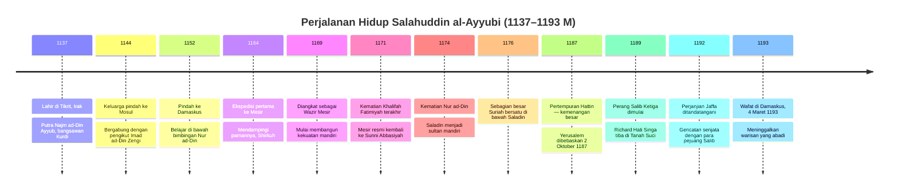

---

## Dunia yang Melahirkan Seorang Pahlawan 🌍

Dunia tempat Saladin dilahirkan adalah tempat dengan **kompleksitas dan keindahan luar biasa** — di mana pencapaian intelektual Zaman Keemasan Islam (*al-'Asr adh-Dhahabi lil-Islam*) mulai berbunga dengan cara yang akan menakjubkan generasi mendatang.

Di **Baghdad** 🏛️, Rumah Kebijaksanaan (*Bait al-Hikmah*) melanjutkan pekerjaannya menerjemahkan dan menemukan ilmu — mengubah filsafat Yunani dan matematika India menjadi teks Arab yang kelak sampai ke perpustakaan Eropa.

Di **Kairo** 🕌, para Khalifah Fatimiyah (*Fāṭimiyyūn*) mempertahankan istana mereka yang misterius, mengklaim keturunan dari putri Nabi dan mempraktikkan bentuk Islam yang tampak eksotis bahkan bagi Muslim lainnya.

Di **Damaskus** 🌹, Atabeg Zengi (*'Imād ad-Dīn Zangī*) mulai menemppa apa yang kelak menjadi perlawanan besar melawan tentara Salib (*as-Salibiyyūn*), meski sedikit yang bisa melihatnya saat itu.

<Callout type="example" title="🔬 Ilmuwan-Ilmuwan Besar di Era Kelahiran Saladin">
Ketika Saladin lahir, dunia Islam sedang dalam puncak kejayaan ilmiahnya:

- **Ibnu Sina** (*Ibn Sīnā* / Avicenna) — telah menulis teks kedokteran besar, *al-Qanun fi at-Tibb* (Kanon Kedokteran)
- **Al-Ghazali** (*al-Ghazālī*) — menyelesaikan sintesis teologi Islam dan logika Aristotelian dalam *Ihya' Ulumuddin* (Kebangkitan Ilmu Agama)
- **Al-Khawarizmi** (*al-Khawārazmī*) — meletakkan dasar aljabar (*al-jabr*)
- Para astronom di **Cordoba** dan **Samarkand** — memetakan pergerakan bintang dengan akurasi yang tidak akan tertandingi Eropa selama berabad-abad
</Callout>

Ini adalah peradaban tempat seorang putra kepala suku Kurdi bisa naik untuk memerintah dari pesisir Atlantik hingga tepi Sungai Eufrat. Sebuah dunia di mana impian bisa menjadi kenyataan — tetapi hanya bagi mereka yang punya keberanian mengejarnya.

---

## Akar Identitas: Sang Kurdi di Antara Berbagai Dunia 🏔️

Ayah Saladin, **Najm ad-Din Ayyub**, adalah seorang pria yang terjepit di antara berbagai dunia — seperti banyak orang di zaman itu. Berdarah **Kurdi** (*Kurd*) dari pegunungan, ia telah naik dalam pelayanan dinasti Turki yang memerintah sebagian besar dunia Islam.

Orang-orang Kurdi adalah **bangsa pegunungan** — tangguh dan mandiri, dikenal karena kehebatan mereka dalam perang dan kesetiaan mereka kepada pemimpin yang layak mendapatkan kepercayaan itu. Mereka tidak memiliki kota-kota besar, tidak ada monumen yang bisa menandingi Baghdad atau Kairo — tetapi mereka memiliki sesuatu yang lain: **pemahaman mendalam tentang alam itu sendiri**, tentang angin yang berhembus di celah-celah pegunungan tinggi, dan lembah-lembah di mana bunga liar mekar di musim semi.

<Callout type="quote" title="💭 Warisan Kurdi dalam Diri Saladin">
"Orang-orang Kurdi adalah bangsa pegunungan yang tangguh — mereka membawa kesetiaan mutlak kepada pemimpin mereka dan ketahanan di medan yang paling berat sekalipun. Inilah warisan yang dibawa Saladin dalam darahnya."
</Callout>

Ayyub mengabdi sebagai gubernur Tikrit di bawah otoritas jauh Kesultanan Seljuk (*as-Salājiqah*) — para pejuang Turki yang telah menyapu dari stepa beberapa generasi sebelumnya dan mengukir sebuah kekaisaran dari sisa-sisa penaklukan sebelumnya.

---

## Kepergian dari Tikrit: Pengalaman Pertama Diaspora 🐪

Ketika Yusuf (Saladin muda) berusia sekitar 7 tahun — masih cukup muda untuk duduk di bahu ayahnya, tetapi sudah cukup besar untuk memahami bahwa dunia membentang melampaui dinding Tikrit — sebuah peristiwa terjadi yang akan mengubah nasib keluarganya dan akhirnya seluruh Timur Tengah.

Perselisihan muncul antara ayahnya Ayyub dan pamannya **Shirkuh** (*Asad ad-Din Shīrkūh* — "Singa Gunung") di satu sisi, dan seorang komandan lokal di sisi lain. Detail perselisihan itu telah hilang dari catatan sejarah — mungkin soal perpajakan berlebih, atau pembagian rampasan militer, atau sekadar masalah kehormatan yang tidak bisa diabaikan tanpa kehilangan muka.

Yang penting: perselisihan itu meningkat melampaui apa yang dimaksudkan siapapun, dan pada akhirnya komandan lokal itu terbunuh.

**Ayyub dan Shirkuh harus pergi** — cepat, membawa keluarga dan pengikut mereka.

Inilah perjalanan besar pertama Yusuf — naik karavan yang membelok ke barat laut melintasi dataran Mesopotamia menuju kota kuno **Mosul** (*al-Mawṣil*). Ia akan mengingat kemudian bagaimana lanskap berubah saat mereka bepergian: pohon kurma yang memberi jalan ke perbukitan bergelombang, saluran irigasi yang membawa kehidupan ke pinggiran padang pasir, reruntuhan di tanda-tanda kota yang namanya sudah terlupakan bahkan saat itu.

<Callout type="tip" title="🌟 Pelajaran dari Pengungsian Pertama">
Pengalaman kepergian paksa dari Tikrit mengajarkan Saladin muda sesuatu yang penting: bahwa dunia bisa berubah dengan cepat, bahwa seseorang harus siap beradaptasi, dan bahwa **keberhasilan sejati** terletak pada kemampuan membangun kembali, bukan pada mempertahankan status quo yang goyah.
</Callout>

---

## Mosul dan Damaskus: Pendidikan Seorang Pemimpin 📚

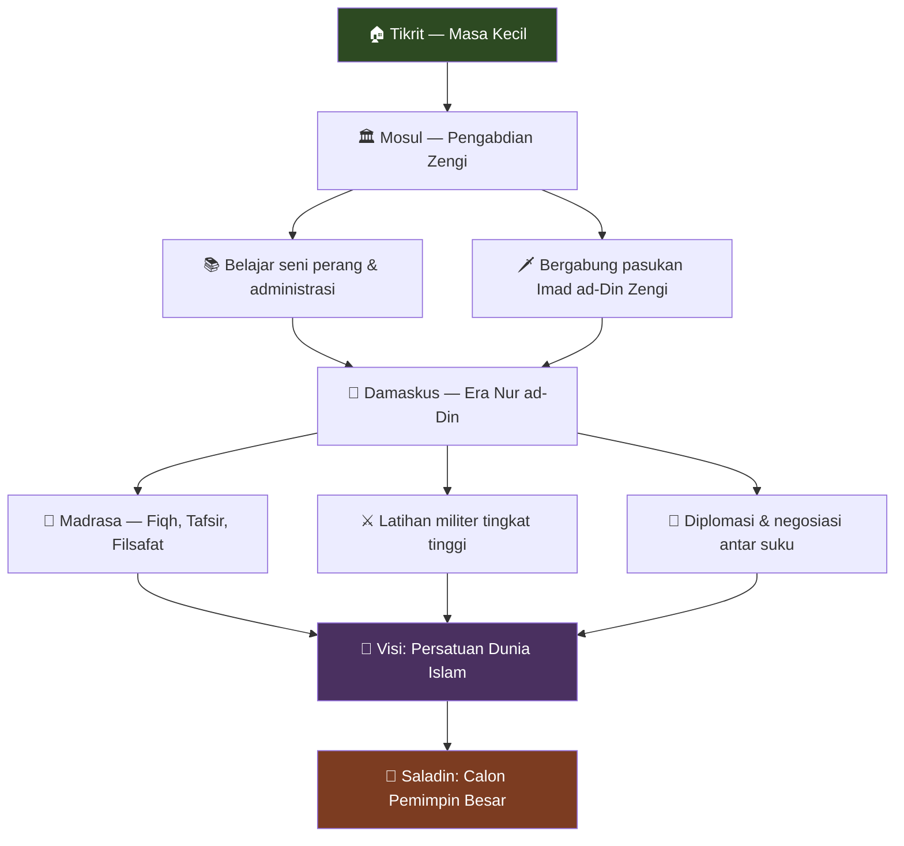

**Mosul** adalah wahyu bagi anak laki-laki yang belum pernah melihat sesuatu yang lebih besar dari Tikrit. Di sini ada kota nyata dengan dinding yang tampak membentang selamanya — pasar di mana orang bisa membeli sutra dari Tiongkok dan gading dari Afrika, rempah-rempah dari India dan bulu dari utara jauh. Masjid agung berdiri seperti gunung di jantung kota, menara (*minaret*) yang terlihat dari jarak mil, memanggil kaum beriman untuk shalat lima kali sehari.

Yang lebih penting bagi masa depan keluarga: Mosul adalah kedudukan **Imad ad-Din Zengi** (*'Imād ad-Dīn Zangī*) — komandan Muslim paling tangguh yang mulai mengorganisir perlawanan terhadap negara-negara Salib. Zengi adalah seseorang yang memahami bahwa kunci untuk mengalahkan kerajaan Frank tidak terletak pada isyarat dramatis atau heroisme individual, tetapi pada **pekerjaan sabar membangun aliansi**, melatih tentara, dan yang paling penting, menyatukan dunia Muslim yang terpecah di bawah satu panji.

Ayyub dan Shirkuh masuk ke dalam pelayanan Zengi, membawa pengikut Kurdi mereka dan pengetahuan perang di perbatasan padang pasir.

Bagi Yusuf muda, ini berarti kehidupan baru di pengadilan seorang pemimpin besar — tempat ia bisa mengamati tarian rumit politik dan diplomasi yang menyatukan dunia Islam. Ia belajar membaca bukan hanya aksara Arab, tetapi **tanda-tanda halus kekuasaan** 👁️ — siapa yang berdiri di mana selama audiensi, siapa yang berbicara pertama kali dalam dewan, nasihat siapa yang dicari dalam urusan militer, dan nasihat siapa yang diabaikan dengan sopan.

### Warisan Zengi dan Era Nur ad-Din 🌟

Ketika Yusuf berusia 11 tahun, **Zengi dibunuh oleh salah satu pelayannya sendiri** — rupanya sebagai pembalasan atas penghinaan yang dirasakannya. Putra Zengi, **Nur ad-Din** (*Nūr ad-Dīn Mahmūd*, artinya "Cahaya Agama"), mewarisi wilayah dan misi ayahnya.

Nur ad-Din adalah segala yang dimiliki ayahnya dan lebih lagi — **seorang pejuang sekaligus orang suci** yang menggabungkan kejeniusan militer dengan pengabdian religius yang tulus. Di bawah patronasenya, pendidikan Yusuf muda berlanjut, tetapi kini mengambil dimensi baru: ia tidak hanya belajar menjadi komandan atau administrator, tetapi menjadi **pemimpin dalam jihad besar** (*al-jihād al-kabīr*) yang akan, izin Allah, mengusir para pejuang Salib dari tanah Muslim.

<Callout type="important" title="🎓 Kurikulum Pendidikan Saladin di Damaskus">
Di bawah bimbingan Nur ad-Din, Saladin menerima pendidikan yang luar biasa komprehensif:

**Ilmu Keagamaan:**
- Hafalan dan tafsir Al-Qur'an dengan pelafalan sempurna
- Fiqh (*Fiqh*) — hukum Islam yang terperinci
- Teologi (*'Ilm al-Kalām*) — perdebatan tentang prinsip-prinsip iman

**Ilmu Duniawi:**
- Matematika dan astronomi (*Falak*)
- Geografi dan sejarah
- Puisi Arab (*Shi'r*) dan syair Persia (*She'r-e Farsi*)

**Seni Perang & Pemerintahan:**
- Membaca medan perang (*Taktik*)
- Menilai moral pasukan
- Koordinasi kavaleri dan infanteri
- Negosiasi dengan suku-suku Badui (*al-Badū*)
- Manajemen sistem irigasi
</Callout>

---

## Ekspedisi ke Mesir: Baptis Api 🔥

Panggilan yang akan mengubah segalanya datang dalam bentuk pesan dari Mesir — dibawa oleh seorang utusan berdebu yang telah berkuda keras melintasi padang pasir Sinai. Kekhalifahan Fatimiyah (*al-Fāṭimiyyūn*) — dinasti Syiah yang telah memerintah Mesir selama dua abad — sedang sekarat dari dalam. Kudeta dan kontra-kudeta telah melumpuhkan pemerintahan sementara khalifah muda tetap menjadi tawanan virtual di istananya sendiri.

Dua wazir rival bersaing untuk kekuasaan — dan keduanya mencari bantuan luar. Salah satu dari mereka, **Shawar** (*Shāwar*), telah melarikan diri ke Damaskus dan kini memohon kepada Nur ad-Din untuk bantuan militer memulihkan kekuasaannya.

Bagi Nur ad-Din, ini adalah **kesempatan yang telah ia tunggu** — peluang untuk menyatukan Suriah dan Mesir di bawah satu panji, menciptakan kekuatan yang cukup kuat untuk menantang tidak hanya kerajaan Frank, tetapi berpotensi Kekhalifahan Abbasiyah di Baghdad juga.

Keputusan untuk memasukkan Yusuf muda dalam ekspedisi itu lebih kontroversial. Pada usia 26 tahun, ia masih relatif tidak berpengalaman dalam komando mandiri. Tetapi **Shirkuh ngotot membawa keponakannya** — mungkin mengenali kualitas dalam diri pemuda itu yang belum dilihat orang lain, atau mungkin hanya ingin seseorang yang bisa ia percaya sepenuhnya.

```mermaid
flowchart LR
    A["🏰 Damaskus\n(Nur ad-Din)"] -->|"Perintah ekspedisi"| B["⚔️ Pasukan Gabungan\nShirkuh & Yusuf"]
    B -->|"Maret melewati Sinai"| C["🌍 Mesir\n(Fatimiyah)"]
    C --> D{Situasi Politik}
    D -->|"Shawar minta bantuan"| E["✅ Aliansi awal"]
    D -->|"Shawar berkhianat"| F["⚠️ Konflik internal"]
    E --> G["⚔️ Menghadapi Tentara Salib\n(Raja Amaury/Amalric)"]
    F --> G
    G -->|"Kemenangan Muslim"| H["🏆 Suriah kontrol Mesir"]
    H --> I["👑 Shirkuh: Wazir Mesir"]
    I -->|"Shirkuh wafat 1169"| J["🌟 Yusuf: Wazir Mesir"]
    J -->|"Reformasi bertahap"| K["🕌 Mesir: Kembali ke Sunni"]

    style A fill:#1a3a5c,color:#fff
    style J fill:#7c3c21,color:#fff
    style K fill:#2d4a22,color:#fff
```

### Pertama Kali Berhadapan dengan Tentara Salib ⚔️

Ekspedisi ke Mesir memberikan Yusuf pengalaman langsung pertamanya dengan **musuh Salib** (*as-Salibiyyūn*). Kerajaan Frank Yerusalem, yang khawatir dengan prospek Mesir Muslim jatuh ke bawah kendali Nur ad-Din, telah membentuk aliansi dan bersiap untuk campur tangan secara militer.

Untuk pertama kalinya dalam hidupnya, Yusuf menghadapi kavaleri berat dari **Ordo Militer** (*al-Fursan al-Masihiyyun*) — para Templar dan Hospitaller — yang kehebatannya telah menjadi legenda di seluruh dunia Islam. Ini adalah pria yang telah mendedikasikan hidup mereka untuk perang melawan Muslim, biksu-prajurit yang kombinasi pengabdian religius dan keahlian militernya menjadikan mereka lawan paling berbahaya yang bisa dihadapi komandan Muslim manapun.

<Callout type="warning" title="⚔️ Kekuatan dan Kelemahan Tentara Salib">
Dari pengalaman di Mesir, Saladin mempelajari pelajaran penting tentang musuhnya:

**Kekuatan Tentara Salib:**
- Kavaleri berat (*Chevaliers*) yang secara individual luar biasa
- Peralatan yang sangat baik — baju besi baja, kuda perang besar (*Destrier*)
- Disiplin yang mengagumkan dalam formasi
- Semangat keagamaan yang kuat

**Kelemahan Tentara Salib:**
- **Kaku dalam taktik** — sulit beradaptasi dengan situasi yang berubah
- **Lambat bergerak** — bergantung pada jalur pasokan yang bisa dipotong
- **Rentan terhadap panas dan haus** — baju besi menjadi tungku di bawah terik matahari Timur Tengah
- Perpecahan internal di antara berbagai komandan dan faksi
</Callout>

---

## Wazir Mesir: Pelajaran Kepemimpinan Sejati 👑

Kematian Shirkuh pada 1169 menciptakan krisis yang akan menentukan arah hidup Yusuf dan akhirnya sejarah Timur Tengah. Nur ad-Din menghadapi pilihan sulit: siapa yang akan menggantikan Shirkuh sebagai komandan di Mesir?

Pilihannya mengejutkan banyak penasihat: **Yusuf ibn Ayyub**, keponakan muda komandan yang telah meninggal. Pada usia 31 tahun, ia lebih muda dari kebanyakan perwira di bawah komandonya, dan pengalamannya dalam kepemimpinan mandiri terbatas.

Tetapi ia memiliki beberapa keunggulan yang tidak dimiliki rivalnya:
- **Latar belakang Kurdi** → memberikannya kesetiaan pasukan bekas Shirkuh
- **Bertahun-tahun di Mesir** → pemahaman mendalam tentang kondisi lokal
- **Kemudaan dan tampak tidak ambisius** → terlihat sebagai pilihan "aman" bagi Nur ad-Din

### Seni Memerintah yang Halus: Reformasi Tanpa Revolusi 🎭

Penunjukan Yusuf sebagai Wazir (*Wazīr*) menandai awal babak baru dalam hidupnya — di mana ia harus menyeimbangkan tuntutan yang bersaing: kesetiaan kepada Nur ad-Din, tanggung jawab atas kesejahteraan Mesir, dan visinya sendiri yang terus berkembang tentang apa yang bisa menjadi dunia Islam.

Tantangan terbesar Yusuf adalah mengelola **transisi keagamaan** dari Mesir Syiah ke Sunni tanpa memicu perang saudara. Ia tidak bisa memaksakan ortodoksi Sunni terlalu cepat — itu akan mengasingkan sebagian besar elit Mesir yang tetap berkomitmen pada keyakinan Ismaili. Tetapi ia juga bertanggung jawab kepada Nur ad-Din yang melihat konversi Mesir sebagai salah satu kewajiban religius utamanya.

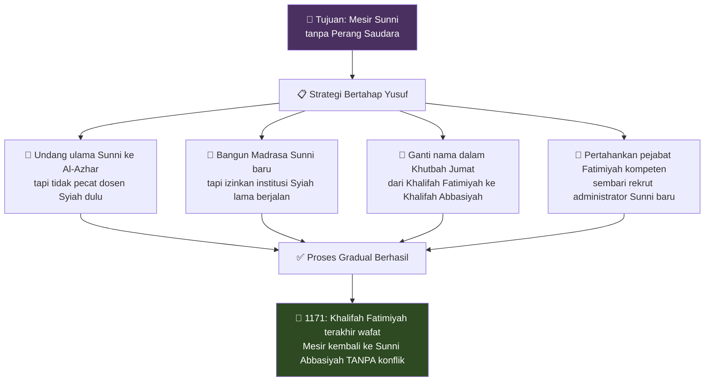

<Callout type="success" title="✨ Keberhasilan Transisi 1171">
Pada tahun 1171, Khalifah Fatimiyah terakhir, **al-'Adid**, wafat — mengakhiri dua abad kekuasaan Ismaili di Mesir. Transisi ke ortodoksi Sunni penuh terjadi **tanpa perang saudara** yang banyak diprediksi — karena Yusuf telah membangun cukup dukungan di kalangan elit Mesir untuk membuat perlawanan tampak sia-sia sekaligus tidak perlu.

Ini bukan sekadar kemenangan militer — ini adalah **mahakarya rekayasa sosial** yang halus.
</Callout>

---

## Menyatukan Dunia Islam: Dari Nil hingga Eufrat 🌙

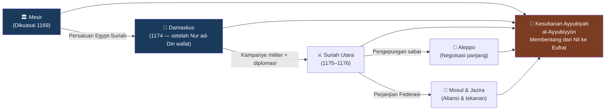

Kematian Nur ad-Din pada 1174 menciptakan krisis besar yang bisa menghancurkan segalanya yang telah dibangun — atau memberikan kesempatan bagi sesuatu yang lebih besar untuk muncul.

Pemimpin besar itu meninggal mendadak — mungkin karena racun — meninggalkan putra muda yang belum siap memerintah, dan koalisi sekutu serta bawahan yang segera mulai bermanuver untuk posisi.

Bagi Yusuf di Mesir, ini menciptakan **peluang sekaligus bahaya** dalam skala yang akan menguji semua yang telah ia pelajari tentang kepemimpinan dan kenegaraan.

### Pendekatan yang Membedakan Pemimpin Sejati 🌟

Ketika pasukan Suriah menyerbu Mesir pada 1175 — memaksa Yusuf memilih antara tunduk atau melawan — ia memilih **perlawanan**, tetapi melakukannya dengan cara yang meminimalkan biaya religius dan politik dari konflik antara sesama Muslim.

Daripada mengecam musuh sebagai tidak sah, ia **mempresentasikan dirinya sebagai pembela otonomi Mesir** dalam persemakmuran Islam yang lebih luas. Daripada mencoba menghancurkan kekuatan Suriah, ia bertujuan menetapkan keseimbangan baru yang pada akhirnya bisa mengarah pada reunifikasi sukarela dalam keadaan yang lebih menguntungkan.

<Callout type="tip" title="🧩 Strategi Persatuan Saladin — Bukan Penakluk, tapi Pemersatu">
Cara Saladin menyatukan dunia Islam sangat unik untuk zamannya:

1. **Framing ideologis**: Bukan ekspansi kekuasaan pribadi, tapi jihad bersama melawan Salib
2. **Bela martabat musuh**: Ketika kota-kota membuka gerbang, mereka "bergabung dengan gerakan", bukan "menyerah"
3. **Pertahankan elit lokal**: Mantan musuh diberi posisi tanggung jawab dalam administrasi baru
4. **Hormati kekhususan lokal**: Adat dan hak istimewa lokal secara eksplisit dilindungi
5. **Patronase keilmuan**: Pusat-pusat pembelajaran Islam diperkuat untuk legitimasi budaya
</Callout>

---

## Pertempuran Hattin: Kemenangan yang Mengubah Sejarah ⚔️🏆

Kesempatan untuk menguji realitas baru ini datang lebih cepat dari yang diperkirakan siapapun. **Reginald dari Chatillon** (*Arnat* dalam sumber Arab), tuan Kerak yang impulsif, menyerang karavan Muslim dalam pelanggaran gencatan senjata yang berlaku — membunuh pedagang dan peziarah yang keselamatannya telah dijamin oleh perjanjian formal.

Yusuf — kini resmi menyandang gelar **Salahuddin al-Ayyubi** sebagai Sultan — memahami bahwa pelanggaran tertentu ini menawarkan kesempatan untuk mentransformasi seluruh situasi strategis di Levant (*bilad ash-Sham*).

### Angkatan Perang yang Belum Pernah Ada Sebelumnya 🗡️

Pasukan yang berkumpul untuk kampanye 1187 tidak seperti apapun yang pernah terlihat di Timur Tengah selama beberapa generasi:

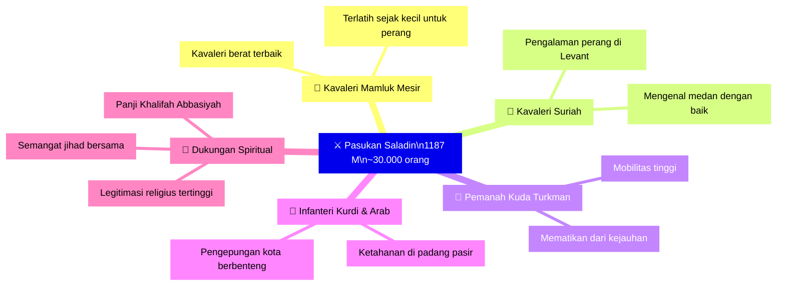

Ukuran pasukan ini mengesankan — mungkin 30.000 orang — menjadikannya pasukan Muslim terbesar yang berkumpul sejak hari-hari awal Perang Salib. Tetapi yang lebih mengesankan adalah **moral dan rasa tujuannya**: prajurit yang mungkin pernah saling berperang kini bersiap menghadapi musuh bersama dengan persatuan semangat yang tidak bisa ditandingi lawan-lawan mereka.

### Taktik Genius di Tanduk Hittin 🗺️

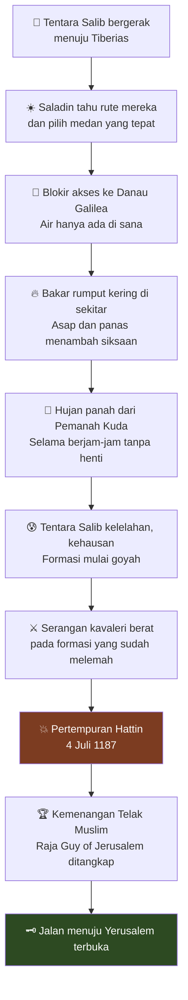

Pertempuran itu berlangsung dengan logika tak terhindarkan dari pembuktian matematis, karena setiap fase mengungkapkan konsekuensi dari pilihan strategis yang telah dibuat kedua pihak selama berbulan-bulan dan bertahun-tahun.

**Panas menjadi sekutu** pasukan Muslim 🌡️. Kesatria Kristen mendapati baju besi baja mereka berubah menjadi tungku yang menguras kekuatan mereka setiap jam. Pasokan air yang dikelola dengan hati-hati yang Saladin atur untuk pasukannya menjadi keunggulan yang menentukan.

Kemenangan itu **lengkap tetapi juga penuh belas kasih** — dengan cara yang mengejutkan pengamat Kristen dan meningkatkan reputasi Saladin di seluruh dunia Islam maupun Kristen. Para prajurit biasa yang menyerah diperlakukan dengan pertimbangan yang sangat berbeda dari kebiasaan perang abad pertengahan. Para bangsawan yang ditangkap ditahan dalam kondisi yang menyerupai tahanan terhormat daripada penjara.

<Callout type="info" title="⚖️ Perlakuan Saladin terhadap Tawanan di Hattin">
Respons Saladin setelah kemenangan mengilustrasikan kode moralnya:

- **Prajurit biasa**: Dibebaskan atau dijual sebagai budak dengan perlakuan manusiawi (sesuai hukum perang Islam)
- **Bangsawan**: Ditahan untuk tebusan, diperlakukan sebagai "tawanan terhormat"
- **Raja Guy of Jerusalem**: Diperlakukan dengan sopan, diberi air dan makanan meski sebelumnya meminta kepalanya
- **Reginald dari Chatillon** (yang memulai pelanggaran): Dieksekusi secara personal oleh Saladin — karena pelanggaran kepercayaan yang berulang
- **Ksatria Ordo Militer** (Templar & Hospitaller): Dieksekusi — karena sumpah mereka mencegah akomodasi politik yang mungkin membuat pembebasan mereka memungkinkan
</Callout>

---

## Pembebasan Yerusalem: Mahakarya Kemanusiaan 🕌✨

Runtuhnya kekuatan militer Salib setelah Hattin menyebabkan benteng demi benteng membuka gerbangnya untuk pasukan Saladin yang maju — daripada menghadapi pengepungan yang bisa mengakibatkan kehancuran seluruh populasi.

Pendekatan ke **Yerusalem** (*al-Quds*) dilakukan dengan kehati-hatian metodis yang sama yang telah menjadi ciri khas seluruh kampanye. Saladin memahami bahwa pentingnya simbolis kota itu mengharuskan penaklukannya dicapai dengan cara yang akan meningkatkan, bukan mengurangi, reputasinya atas keadilan.

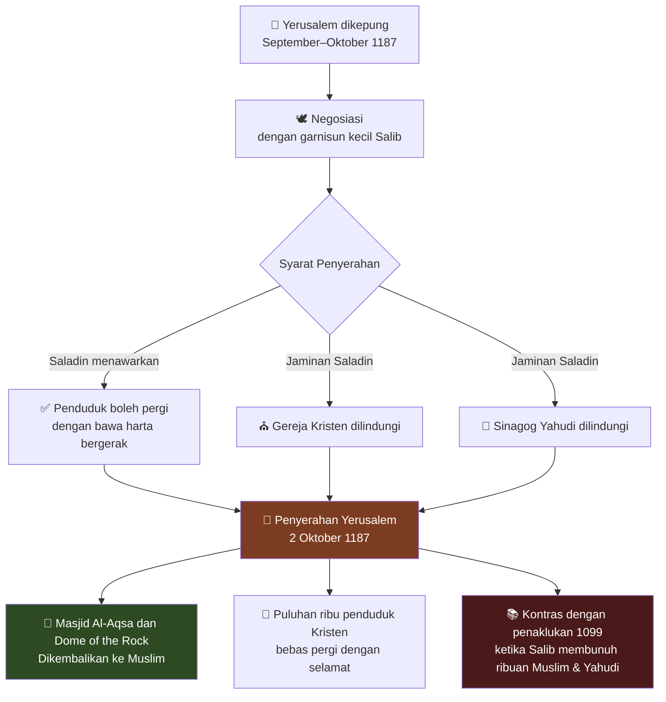

### 2 Oktober 1187: Hari yang Mengubah Dunia 🌟

Masuknya Yerusalem pada **2 Oktober 1187** diorkestrasikan sebagai kontrapoin yang disadari terhadap penaklukan brutal yang telah menandai pengambilalihan Kristen atas kota itu 88 tahun sebelumnya — ketika tentara Salib telah membantai ribuan penduduk Muslim dan Yahudi.

Pendudukan Saladin ditandai dengan **pengendalian diri dan kemurahan hati** yang meningkatkan reputasinya di seluruh dunia Islam maupun Kristen: gereja-gereja dilindungi, populasi sipil dibiarkan tak terganggu, bahkan ordo militer yang telah berjuang melawannya diizinkan melakukan evakuasi tertib.

<Callout type="quote" title="💎 Dari Ibn Shaddad — Sumber Kontemporer tentang Masuknya Yerusalem">
"Sultan bertindak dengan murah hati terhadap orang-orang Kristen dan memberikan mereka pilihan antara menebus diri atau pergi dengan aman. Sebagian besar memilih pergi, dan ia mengizinkan mereka pergi dengan harta mereka... Para biarawan dan pendeta tinggal di gereja-gereja mereka sesuai kebiasaan mereka."

— *Bahā' ad-Dīn ibn Shaddad, biografi kontemporer Saladin*
</Callout>

Restorasi kendali Islam atas **Kubah Batu** (*Qubbat as-Sakhrah*) dan **Masjid Al-Aqsa** (*al-Masjid al-Aqṣā*) — permata arsitektur yang menandai situs Isra Mi'raj Nabi Muhammad ﷺ — dirayakan di seluruh dunia Muslim sebagai tanda bahwa era kelemahan dan perpecahan akhirnya berakhir.

---

## Perang Salib Ketiga: Duel Agung dengan Richard Hati Singa ⚔️🦁

Jatuhnya Yerusalem mengirimkan gelombang kejut ke seluruh Eropa Kristen yang pada akhirnya menyebabkan **Perang Salib Ketiga** (*ath-Thāliath*) — upaya militer terbesar yang pernah dilancarkan kristendom abad pertengahan untuk merebut kembali tempat-tempat suci.

Tiga raja besar Eropa menyingkirkan persaingan tradisional mereka untuk mengorganisir ekspedisi terbesar ini:
- 🦁 **Richard I dari Inggris** (*Richard Coeur de Lion* — Richard Hati Singa)
- ⚜️ **Philip Augustus dari Prancis**
- 🦅 **Frederick Barbarossa dari Jerman** (meninggal dalam perjalanan, tenggelam di sungai)

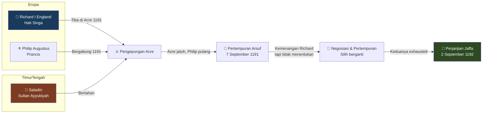

### Dua Jenius Militer: Kontras yang Mengagumkan 🎭

Pertemuan antara Saladin dan Richard Hati Singa adalah salah satu kisah paling menarik dalam sejarah abad pertengahan. Dua pemimpin militer terbesar zaman mereka — yang taktik dan karakter pribadinya bertolak belakang secara dramatis — bertemu dalam duel yang menentukan nasib Tanah Suci.

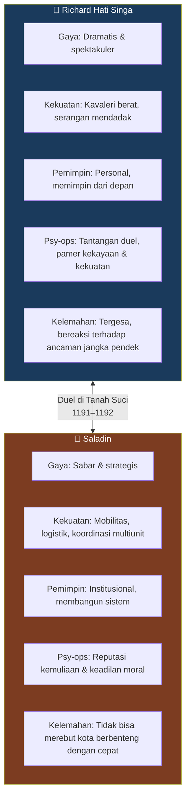

<Callout type="example" title="🤝 Rasa Hormat Timbal Balik yang Legendaris">
Salah satu kisah paling terkenal dari Perang Salib Ketiga adalah **rasa hormat yang tulus** antara Saladin dan Richard:

- Ketika Richard sakit, **Saladin mengirimkan buah-buahan dingin** (pir, peach) ke kamp musuh
- Saladin menawarkan **kuda segar** ketika kuda Richard jatuh dalam pertempuran
- Richard **memuji Saladin** di depan pasukannya sendiri sebagai pemimpin yang paling terhormat
- Para utusan bolak-balik bebas dengan **hadiah dan pesan** di antara kedua pemimpin
- Saladin dan Richard bertukar pesan yang mengakui **kualitas militer satu sama lain**

Paradoks yang indah: dua pemimpin yang saling membunuh prajurit masing-masing, tetapi saling menghormati dengan tulus.
</Callout>

### Perjanjian Jaffa (1192): Kemenangan Melalui Kebijaksanaan 📜

Klimaks Perang Salib Ketiga bukan datang dari kemenangan militer dramatis salah satu pihak, melainkan dari **negosiasi yang mencerminkan keseimbangan kekuatan fundamental** yang telah muncul selama tiga tahun perang yang terputus-putus.

**Perjanjian Jaffa** (*Sulh al-Ramla*) yang ditandatangani pada September 1192 adalah mahakarya kompromi diplomatik:

| Aspek | Ketentuan |
|-------|-----------|
| **Wilayah Salib** | Jalur pantai sempit dari Tyre ke Jaffa |
| **Wilayah Muslim** | Yerusalem + sebagian besar wilayah yang dibebaskan Saladin |
| **Akses Peziarah** | Semua peziarah Kristen bebas mengunjungi Yerusalem |
| **Status Pedagang** | Pedagang dari kedua agama bebas bergerak |
| **Durasi Gencatan** | 3 tahun, 3 bulan, 3 hari, 3 jam |

Bagi Saladin, perjanjian ini merepresentasikan pencapaian objektif yang tampak mustahil ketika ia pertama kali memasuki politik Mesir sebagai pemuda yang mengikuti pamannya Shirkuh. Ia tidak hanya bertahan dari tantangan militer terbesar yang bisa dilancarkan Eropa Kristen, tetapi juga **membangun dirinya sebagai mitra setara** dalam penyelesaian diplomatik yang mengakui kedaulatan Islam atas sebagian besar wilayah yang pernah dikontrol Salib.

---

## Tahun-tahun Damai: Membangun Peradaban 🌸

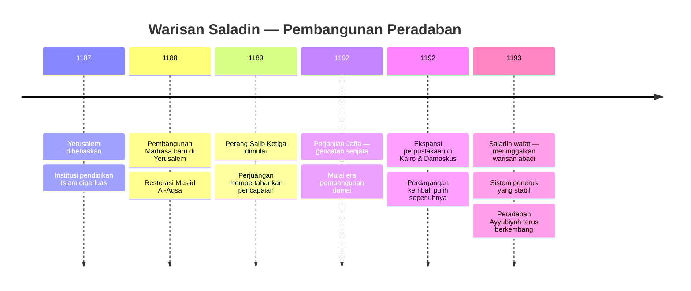

Tahun-tahun setelah Perang Salib Ketiga ditandai oleh **kedamaian yang lelah** — sementara kedua pihak bekerja untuk mengkonsolidasikan keuntungan mereka sambil pulih dari biaya besar konflik berkepanjangan.

Bagi Saladin, periode ini memberikan kesempatan untuk fokus pada aspek konstruktif negarawan yang selalu sepenting keberhasilan militer baginya.

### Kebangkitan Budaya dan Intelektual 📖

Kebijakan toleransi beragama yang dikombinasikan dengan ortodoksi Sunni menciptakan atmosfer di mana beasiswa dan pengabdian Islam bisa berkembang tanpa ketegangan sektarian yang telah melemahkan rezim-rezim sebelumnya.

<Callout type="info" title="🏛️ Kontribusi Peradaban Saladin">
Warisan peradaban Saladin mencakup:

**Pendidikan & Keilmuan:**
- Madrasa-madrasa di Kairo, Damaskus, Yerusalem menarik siswa dari seluruh dunia Islam
- Gerakan penerjemahan filsafat Yunani dan matematika India ke Arab kembali bersemangat
- Perpustakaan Fatimiyah di Kairo — yang menyimpan manuskrip langka — dilindungi dan diperluas

**Kesehatan & Sosial:**
- Rumah sakit (*Bimaristan*) dengan teknologi medis terkini
- Sekolah-sekolah agama Islam (*Madrasa*)
- Dapur umum untuk orang miskin
- Penginapan bagi pelancong

**Arsitektur:**
- Benteng-benteng yang menggabungkan efisiensi fungsional dengan keindahan estetika
- Masjid-masjid yang merefleksikan pemahaman matang prinsip arsitektur Islam
- Renovasi dan perluasan Masjid Al-Aqsa dan Dome of the Rock

**Diplomasi:**
- Perjanjian perdagangan dengan kota-kota Italia (Genoa, Pisa, Venesia)
- Hubungan yang dikelola dengan cermat dengan Kekaisaran Byzantium
- Jaringan aliansi dengan suku-suku Badui dan pemimpin lokal
</Callout>

Saladin sendiri mengambil peran aktif dalam kebangkitan intelektual ini — bukan sekadar sebagai pelindung, tetapi sebagai peserta yang memahami bahwa keberhasilan militer dan politik tidak berarti apa-apa jika tidak disertai pencapaian dalam ilmu dan budaya yang bisa menginspirasi generasi mendatang.

---

## Warisan Moral: Keadilan sebagai Fondasi Kepemimpinan ⚖️

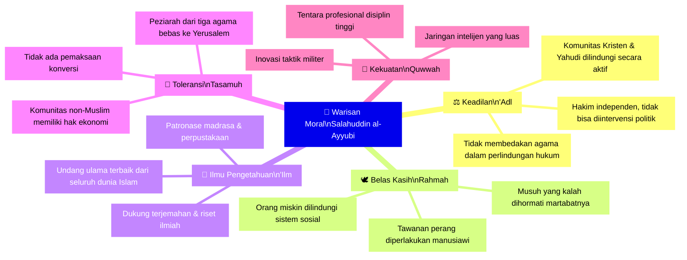

Mungkin aspek paling abadi dari warisan Saladin adalah **transformasi yang ia bawa dalam cara Muslim memandang diri mereka sendiri dan tempat mereka di dunia** 🌍.

Abad-abad perpecahan dan kelemahan yang mendahului kebangkitannya telah menciptakan semacam **demoralisasi psikologis** yang membuat kekalahan Muslim tampak tak terhindarkan dan kemenangan Muslim tampak sebagai kecelakaan sementara.

Karirnya menunjukkan bahwa peradaban Islam masih bisa menghasilkan pemimpin yang mampu menyatukan populasi yang beragam di sekitar tujuan bersama, menciptakan pasukan militer yang bisa mengalahkan yang terbaik dari musuh-musuh mereka, dan membangun institusi politik yang bisa memberikan keamanan dan kemakmuran bagi semua rakyatnya — terlepas dari agama atau etnis.

<Callout type="important" title="💡 Mengapa Saladin Dihormati oleh Musuh Sekalipun?">
Saladin adalah satu dari sedikit pemimpin abad pertengahan yang dihormati secara setara oleh teman dan musuh. Berikut pernyataan-pernyataan kontemporer dari sumber Kristen:

**Uskup Acre tentang Saladin:**
*"Ia adalah pangeran yang paling terhormat dari semua Muslim, dan yang paling ditakuti oleh tentara Kristen."*

**Penulis Kristen Ambroise dalam 'Estoire de la Guerre Sainte':**
*"Saladin adalah orang yang besar dan bijaksana — jika saja ia memeluk iman yang benar, maka tidak akan ada pangeran yang lebih layak di masanya."*

**Richard Hati Singa sendiri**, kepada sekutunya, dilaporkan berkata:
*"Saladin adalah seorang pemimpin yang hebat dan murah hati."*
</Callout>

---

## Senja Sultan: Kontemplasi dan Kematian 🌅

Saat tahun ke-60-nya mendekat, Saladin mulai menghabiskan lebih banyak waktu dalam kontemplasi dan doa 🤲 — mencoba memahami makna hidupnya yang luar biasa dan mempersiapkan diri untuk perjalanan terakhir yang menunggu setiap jiwa.

Masjid yang dibangun berdampingan dengan istananya di Damaskus menjadi tempat favoritnya — sebuah tempat di mana ia bisa melarikan diri dari tuntutan pemerintahan dan diplomasi yang mendesak untuk fokus pada dimensi spiritual keberadaan yang selalu sepenting keberhasilan duniawi baginya.

### Pesan Terakhir untuk Penerusnya 📜

Instruksi terakhir Saladin kepada para penerusnya secara khas bijaksana dan berwawasan jauh — berfokus bukan pada pelestarian warisan pribadinya, tetapi pada **kelanjutan pekerjaan** yang telah mendefinisikan hidupnya:

1. **Persatuan wilayah**: Tetap bersatu jika memungkinkan, tetapi bukan dengan biaya perang saudara yang destruktif
2. **Perlindungan minoritas**: Berbagai komunitas agama dan etnis yang telah menemukan keamanan di bawah kekuasaannya harus terus menikmati perlindungan dan toleransi
3. **Perjuangan keadilan**: Perjuangan untuk keadilan dan kebenaran yang memotivasi kebangkitan Islam harus berlanjut, bahkan jika mengambil bentuk yang berbeda dari yang ia rintis
4. **Humilitas**: Kekuasaan adalah amanah dari Allah yang harus dijalankan demi komunitas manusia yang lebih luas — bukan untuk kemegahan pribadi

<Callout type="warning" title="😔 Paradoks Saladin di Akhir Hidupnya">
Ada paradoks menyentuh dalam warisan Saladin: meskipun ia memimpin pasukan yang memenangkan harta rampasan yang sangat besar, ia meninggal dalam keadaan hampir **tidak memiliki aset pribadi**.

Ketika inventaris dilakukan setelah kematiannya, bendahara menemukan bahwa:
- Ia hanya memiliki **1 koin emas** dan **36–47 koin perak**
- Tidak cukup untuk membayar biaya pemakamannya sendiri
- Semua kekayaan negara yang mengalir melalui tangannya telah **didistribusikan kepada rakyat** atau digunakan untuk tujuan militer dan sosial

Ini bukan legenda — ini didokumentasikan oleh biograf kontemporer Ibn Shaddad yang menyaksikannya sendiri.
</Callout>

### Wafat di Damaskus, 4 Maret 1193 🌙

Penyakit yang akan terbukti fatal dimulai pada bulan-bulan awal 1193 — tampak seperti demam ringan, jenis penyakit yang telah mengganggunya secara berkala selama bertahun-tahun tanpa menimbulkan kekhawatiran serius. Tetapi kali ini demam bertahan, disertai kelemahan dan rasa sakit yang secara bertahap membuatnya tidak mungkin mempertahankan rutinitas biasanya.

Hari-hari terakhirnya dihabiskan di kamarnya yang menghadap taman kuno Damaskus, di mana wangi melati dan bunga jeruk mengalir melalui jendela yang membingkai pemandangan menara dan kubah yang menandai cakrawala kota.

Ruangan itu sendiri sederhana furnishingnya — sesuai dengan seorang pria yang tidak pernah mencari kemewahan demi dirinya sendiri — hanya berisi barang-barang penting untuk shalat, belajar, dan menerima para tamu yang datang memberi hormat kepada sultan yang sekarat.

**Kematian datang pada 4 Maret 1193**, di jam-jam awal pagi ketika azan shalat subuh bergema di seluruh kota yang sedang tidur. Mereka yang hadir melaporkan bahwa kepergiannya damai — ditandai tanpa perjuangan atau penderitaan yang nyata, seolah ia hanya jatuh ke dalam tidur terdalam dan paling menyegarkan dalam hidupnya.

Tangan yang pernah mengayunkan pedang yang membebaskan Yerusalem akhirnya tenang — sementara di luar jendela kamarnya, irama abadi kota yang ia cintai terus berlangsung tanpa perubahan.

---

## Relevansi Saladin untuk Zaman Kita 🌐

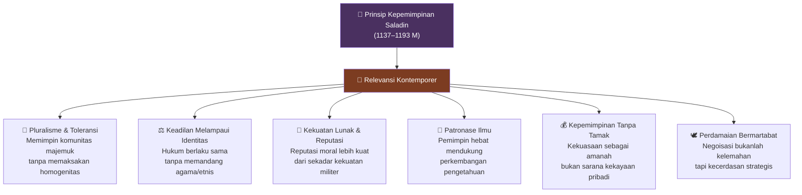

Kisah Saladin bukan sekadar catatan sejarah dari abad pertengahan. Ia adalah **cermin yang menantang kita** untuk melihat apa yang mungkin dilakukan seorang pemimpin ketika prinsip moral dan efektivitas praktis berjalan beriringan, bukan bertentangan.

Saladin hidup di era yang tidak kurang brutalne dari abad ke-21 — di mana kekuatan militer, ambisi politik, dan konflik agama menciptakan vortex kekerasan yang tampaknya tak berujung. Namun di tengah semua itu, ia berhasil mengukir jalan kepemimpinan yang:

- **Menggabungkan kekuatan dengan belas kasih** — membuktikan bahwa keduanya bukan kontradiksi
- **Membangun sambil berjuang** — tidak menunggu kondisi sempurna untuk memulai peradaban
- **Menghormati musuh tanpa melunakkan prinsip** — membedakan antara orang dan ideologi yang dilawannya
- **Meninggalkan institusi, bukan hanya kemenangan** — membangun sistem yang bertahan setelah dirinya pergi

<Callout type="success" title="🌟 Pelajaran Abadi dari Saladin">
Apa yang bisa kita pelajari dari Sultan Fajar?

1. **Identitas adalah kekuatan, bukan hambatan** — Saladin tidak menyembunyikan akar Kurdinya; ia menjadikannya jembatan antara berbagai komunitas
2. **Pendidikan adalah investasi terbaik pemimpin** — ia menghabiskan bertahun-tahun belajar sebelum memimpin
3. **Kesabaran strategis lebih kuat dari agresi taktis** — ia memilih menunggu momen yang tepat daripada bertindak gegabah
4. **Reputasi moral adalah senjata paling ampuh** — bahkan musuh enggan melawan seseorang yang dikenal jujur dan terhormat
5. **Kekuasaan tanpa integritas adalah rapuh** — Yerusalem jatuh kembali ke tangan Salib generasi kemudian, tetapi warisan moral Saladin masih bertahan hingga hari ini
</Callout>

---

## Epilog: Cahaya yang Terus Bersinar ☀️

Matahari mulai terbit di atas dinding kuno Damaskus — mengecat langit timur dengan nuansa emas dan merah tua yang telah menyaksikan naik-turunnya kerajaan selama ribuan tahun.

Di taman-taman bawah benteng tempat Saladin menghabiskan hari-hari terakhirnya, air mancur masih menyanyikan lagu abadinya, sementara wangi melati dan bunga jeruk memenuhi udara pagi dengan aroma yang menghubungkan momen sekarang dengan semua pagi yang pernah ada.

Di situlah, jika kamu mendengarkan dengan cermat, kamu mungkin masih bisa mendengar gema langkah kaki yang pernah berjalan di jalan-jalan ini dalam kontemplasi dan doa — mencari makna kekuasaan dan tanggung jawab, kesuksesan dan kematian, prinsip abadi yang melampaui pencapaian sementara siapapun dalam hidup.

Pria yang dikenal sejarah sebagai **Saladin** — yang disebut *kebenaran iman* oleh bangsanya sendiri, dan *yang terbesar dari musuh-musuh kami* oleh mereka yang berjuang melawannya — telah menemukan di ruang-ruang sunyi ini kedamaian yang datang dari mengetahui bahwa seseorang telah hidup sesuai cita-cita tertinggi tradisinya sambil melayani kebutuhan seluruh umat manusia.

Cahaya itu terus menyebar — menyentuh dinding Yerusalem, di mana Kubah Batu menangkap sinar pertama matahari seperti perhiasan di mahkota dunia — menerangi jalan-jalan yang peziarah dari tiga kepercayaan besar masih berjalan dalam pencarian makna dan keberkahan.

Dan saat cahaya emas itu terus menyebar melintasi Timur Tengah dan seterusnya — menyentuh tanah dan rakyat yang tidak pernah mengenal kehadiran fisik pria yang tampaknya dirayakannya — ia membawa janji bahwa kebesaran masih mungkin bagi mereka yang menggabungkan kekuatan dengan belas kasih, ambisi dengan kerendahan hati, kesuksesan dengan pengabdian kepada sesuatu yang lebih besar dari diri mereka sendiri.

🌟 **Warisan Yusuf ibn Ayyub — Salahuddin al-Ayyubi — Sultan Fajar** — hidup dalam janji itu, dalam harapan abadi bahwa manusia bisa bangkit melampaui keterbatasan mereka untuk mencapai sesuatu yang layak dari percikan ilahi yang menggerakkan kehidupan singkat mereka di bumi yang kuno dan indah ini.

---

## Referensi & Sumber Utama 📚

<Callout type="cite" title="📖 Sumber Primer dan Sekunder">
**Sumber Kontemporer (Abad ke-12 M):**
- **Bahā' ad-Dīn ibn Shaddad** — *al-Nawādir as-Sulṭāniyya wa'l-Maḥāsin al-Yūsufiyya* (Biografi Saladin oleh sekretaris pribadinya)
- **'Imād ad-Dīn al-Kātib al-Iṣfahānī** — *Sanā al-Barq ash-Shāmī* dan *al-Fatḥ al-Qussī fī al-Fatḥ al-Qudsī* (Kronik pembebasan Yerusalem)
- **Ibn al-Athīr** — *al-Kāmil fī at-Tārīkh* (Sejarah lengkap dunia Islam)

**Sumber Salib Kontemporer:**
- **Ambroise** — *L'Estoire de la Guerre Sainte* (Kronik Perang Salib Ketiga dari sudut pandang Kristen)
- **Itinerarium Peregrinorum et Gesta Regis Ricardi** (Kronik perjalanan Perang Salib)

**Studi Modern:**
- **Anne-Marie Eddé** — *Saladin* (2011) — biografi akademis paling komprehensif
- **P.H. Newby** — *Saladin in His Time* (1983)
- **Andrew Ehrenkreutz** — *Saladin* (1972)
- **Jonathan Phillips** — *Holy Warriors: A Modern History of the Crusades* (2009)
</Callout>

---

*Artikel ini ditulis berdasarkan transkrip narasi sejarah dari The Sleepy Historian (YouTube) yang berjudul "Saladin – A Calm Historical Sleep Story", dengan pendalaman dari berbagai sumber akademis dan biografi kontemporer.*
