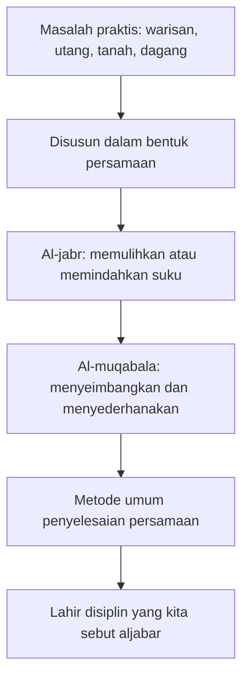
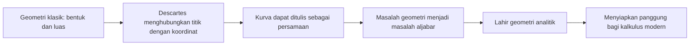
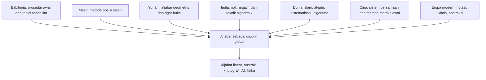

## 🧮 Pendahuluan: Aljabar Bukan Cuma “Cari X”

Bagi banyak orang, kata **aljabar** langsung memunculkan kenangan yang kurang menyenangkan: persamaan, huruf `x` dan `y`, rumus kuadrat, faktorisasi, dan papan tulis yang membuat dahi mengernyit. Di sekolah, aljabar sering diajarkan sebagai kumpulan teknik untuk menyelesaikan soal. Kita diminta hafal rumus, memindahkan ruas, menyederhanakan bentuk, lalu selesai. 

Padahal, kalau dilihat lebih dalam, aljabar adalah salah satu kisah paling liar dan paling indah dalam seluruh sejarah matematika. Ia bukan lahir dari satu ruang kelas, satu bangsa, atau satu buku teks. Ia lahir dari ribuan tahun usaha manusia untuk memahami **hal yang belum diketahui**. 🌍

Aljabar tumbuh dari pertanyaan-pertanyaan yang sangat praktis:
- bagaimana membagi tanah secara adil,
- bagaimana menghitung utang dan bunga,
- bagaimana membagi warisan,
- bagaimana membaca pola dalam langit,
- bagaimana menyelesaikan masalah yang tampak rumit dengan aturan yang bisa diulang.

Tetapi kemudian, aljabar berkembang jauh melampaui kebutuhan sehari-hari. Ia berubah menjadi bahasa untuk memahami **struktur**, **pola**, **simetri**, dan **hubungan mendalam** di balik banyak hal. Dari urusan dagang di Babilonia sampai kriptografi internet modern, dari pembagian roti sampai komputasi kuantum, aljabar terus berubah bentuk sambil mempertahankan jantungnya: **mencari pola umum di balik masalah yang tampak berbeda**. ✨

Artikel ini akan menjelaskan sejarah aljabar secara **sangat detail, mendalam, dan runtut**, mulai dari:
- Babilonia dan Mesir kuno,
- Yunani dan aljabar geometris,
- Diophantus,
- India klasik dengan nol dan bilangan negatif,
- dunia Islam dan Al-Khawarizmi,
- Eropa Renaissance dengan drama persamaan kubik,
- revolusi notasi simbolik,
- Galois dan lahirnya aljabar abstrak,
- sampai aljabar modern yang menopang fisika, komputasi, kriptografi, dan ilmu data. 🧠

Jadi kalau selama ini aljabar terasa seperti tugas sekolah yang dingin, saya ingin mengusulkan cara pandang baru: **aljabar adalah sejarah panjang manusia belajar bernegosiasi dengan yang tidak diketahui.**

---

## 🧭 Tesis Utama: Aljabar Adalah Seni Menangkap Struktur di Balik Masalah

Kalau seluruh sejarah aljabar diringkas menjadi satu tesis, maka tesis itu adalah ini:

> **aljabar adalah upaya manusia untuk mengubah masalah konkret menjadi struktur yang bisa dimanipulasi, digeneralisasi, dan dipahami lebih dalam daripada kasus tunggalnya.**

Di awal sejarahnya, aljabar belum punya simbol yang ringkas. Orang menyebut semuanya dengan kata-kata. Lalu ia berkembang menjadi bentuk yang lebih padat, memakai singkatan, lalu simbol, lalu huruf, lalu teori abstrak tentang grup, gelanggang, medan, modul, ruang vektor, kategori, dan seterusnya.

Artinya, aljabar bukan sekadar teknik hitung. Ia adalah **cara berpikir**. Cara berpikir yang selalu bertanya:
- apa pola umum di balik masalah ini?
- apa struktur yang sebenarnya sedang bekerja?
- bisakah satu metode menyelesaikan banyak kasus sekaligus?
- kapan sebuah masalah memang bisa diselesaikan, dan kapan justru mustahil? 🔍

---

## 🏺 Bagian 1: Babilonia — Aljabar Lahir dari Tanah, Gandum, dan Utang

Kalau kita ingin memulai dari asal yang benar-benar tua, kita harus kembali ke **Babilonia kuno**, kira-kira sekitar 1900–1600 sebelum Masehi. Di wilayah yang sekarang kira-kira masuk Irak, masyarakat Babilonia hidup dalam dunia administrasi, pertanian, perdagangan, pinjaman, dan pembagian lahan. Mereka tidak sedang “belajar aljabar” dalam arti modern. Mereka sedang berusaha bertahan dan mengatur hidup. 🌾

Masalah yang mereka hadapi sangat nyata:
- bagaimana membagi tanah dengan ukuran tertentu,
- bagaimana menghitung hasil panen,
- bagaimana memperkirakan bunga pinjaman,
- bagaimana membagi warisan atau harta,
- bagaimana menghitung kebutuhan penyimpanan gandum.

Masalah-masalah seperti ini sering kali ternyata punya bentuk yang kini kita sebut **persamaan**. Dan bangsa Babilonia mulai menemukan bahwa banyak persoalan praktis bisa diselesaikan dengan pola manipulasi tertentu. Mereka menuliskannya di tablet tanah liat, yang kemudian bertahan ribuan tahun dan menjadi salah satu sumber terpenting sejarah matematika. 🪵

Salah satu hal paling mengejutkan adalah bahwa orang Babilonia sudah mampu menangani persoalan yang setara dengan:
- persamaan linear *(persamaan derajat satu)*,
- persamaan kuadrat *(persamaan derajat dua)*,
- bahkan beberapa bentuk persoalan kubik *(derajat tiga)*.

Yang menarik, mereka belum memakai simbol seperti `x`, `+`, atau `=`. Semua ditulis dalam bentuk narasi atau resep prosedural. Jadi aljabar mula-mula tidak tampak seperti aljabar yang kita kenal. Ia tampak seperti instruksi verbal yang sangat teliti. 📜

### Tablet Plimpton 322
Salah satu artefak terkenal adalah **Plimpton 322**, yang diduga dibuat antara 1900–1600 SM. Tablet ini memuat daftar bilangan yang sekarang kita hubungkan dengan **triple Pythagoras** *(misalnya 3, 4, 5 yang memenuhi hubungan segitiga siku-siku)*. Ini sangat menarik karena menunjukkan bahwa masyarakat Babilonia sudah bekerja dengan pola matematis yang sangat maju jauh sebelum Pythagoras lahir. 🤯

Hal lain yang penting: orang Babilonia tidak terlalu terobsesi pada “bentuk paling murni” dari jawaban. Mereka sering puas dengan pendekatan yang cukup akurat untuk kebutuhan praktis. Ini menunjukkan watak awal aljabar: **bukan pertama-tama teori murni, melainkan alat kerja untuk menyelesaikan masalah nyata.**

<Callout type="important" title="Pelajaran dari Babilonia">
Aljabar lahir bukan dari keinginan membuat rumus indah, tetapi dari kebutuhan mengelola kehidupan yang kompleks. Sejak awal, aljabar adalah teknologi intelektual untuk menghadapi ketidakpastian. 🏺
</Callout>

---

## 📜 Bagian 2: Mesir Kuno — Metode Posisi Salah dan Aljabar Praktis

Sementara itu di Mesir kuno, matematika juga berkembang, meski dengan gaya yang sedikit berbeda. Salah satu sumber paling terkenal adalah **Papirus Rhind**, ditulis sekitar 1650 SM oleh seorang juru tulis bernama **Ahmes**, yang kemungkinan menyalin dari teks yang bahkan lebih tua. 📜

Mesir kuno tidak mengembangkan aljabar sekompleks Babilonia dalam banyak aspek, tetapi mereka sangat kuat dalam problem-problem praktis, terutama yang berkaitan dengan distribusi, pengukuran, dan pembagian. Mereka punya cara yang hari ini dikenal sebagai **method of false position** *(metode posisi salah / tebakan awal yang lalu dikoreksi)*.

Intinya begini:
1. ambil tebakan terhadap nilai yang tidak diketahui,
2. hitung hasil dari tebakan itu,
3. lihat seberapa jauh hasilnya dari target,
4. sesuaikan proporsional untuk menemukan jawaban yang benar.

Secara modern, metode ini mungkin terasa kurang elegan. Tetapi sebenarnya ini luar biasa cerdas. Ia menunjukkan intuisi yang kuat bahwa persoalan dapat didekati secara prosedural meski simbolisme formal belum berkembang. 🎯

Orang Mesir menyebut kuantitas tak diketahui dengan istilah yang bisa diterjemahkan sebagai **“heap”** atau “tumpukan”. Lagi-lagi, belum ada `x`, tetapi sudah ada gagasan bahwa kita bisa memperlakukan sesuatu yang belum diketahui sebagai objek operasi. Dan itu adalah inti aljabar. 

---

## 📐 Bagian 3: Yunani Kuno — Ketika Aljabar Menyamar sebagai Geometri

Kalau Babilonia dan Mesir sangat praktis, Yunani kuno datang dengan semangat yang agak berbeda. Orang Yunani sangat mencintai **geometri**. Mereka menganggap bentuk, garis, luas, dan bukti geometris sebagai jalan paling luhur dalam matematika. Akibatnya, aljabar dalam tradisi Yunani sering tampil dalam bentuk **geometric algebra** *(aljabar geometris)*. 📐

Apa artinya? 
Artinya, banyak hubungan yang sekarang kita tulis sebagai identitas aljabar, dulu mereka ekspresikan sebagai hubungan antar-luas atau antar-bentuk geometris.

Misalnya, hubungan yang sekarang kita tulis sebagai:

$$
(a+b)^2 = a^2 + 2ab + b^2
$$

bisa dipahami sebagai pembagian sebuah persegi besar menjadi persegi-persegi dan persegi panjang yang lebih kecil. Jadi yang kita lihat sebagai rumus, orang Yunani melihatnya sebagai **susunan bentuk**. 

Pendekatan ini sangat kuat dalam hal rigor *(ketelitian pembuktian)*, tetapi juga membatasi. Karena begitu matematika bergerak ke persoalan yang lebih rumit dan abstrak, representasi geometris saja tidak cukup fleksibel. 

Namun jangan salah: warisan Yunani tetap sangat besar. Mereka menunjukkan bahwa relasi matematis tidak sekadar resep hitung, tetapi bisa dibuktikan secara konseptual. Itu fondasi penting untuk perkembangan selanjutnya. 🏛️

---

## 🔢 Bagian 4: Diophantus — Jembatan dari Kata-kata ke Simbol

Di antara tokoh Yunani akhir yang sangat penting, nama **Diophantus** hampir selalu muncul. Ia hidup kira-kira abad ke-3 M di Alexandria dan menulis karya terkenal bernama **Arithmetica**. 🔢

Mengapa Diophantus penting? Karena ia sering dianggap sebagai salah satu tokoh yang membawa aljabar keluar dari penulisan verbal murni menuju bentuk yang lebih padat dan lebih dekat ke simbolisme.

Ia belum memakai notasi modern sepenuhnya, tetapi ia sudah memakai tanda-tanda singkat untuk:
- kuantitas tak diketahui,
- pangkat-pangkat tertentu,
- dan beberapa operasi.

Karena itu, gaya aljabarnya sering disebut **syncopated algebra** *(aljabar sinkopasi / setengah simbolik)*. Bukan verbal penuh, belum simbolik penuh, tetapi berada di antara keduanya.

Yang sangat menarik dari *Arithmetica* adalah fokus Diophantus pada persoalan-persoalan yang sekarang disebut **persamaan Diophantine** *(persamaan yang solusi yang dicari biasanya bilangan bulat atau rasional)*. Ia sangat suka persoalan yang tidak hanya punya satu jawaban, tetapi banyak kemungkinan, dan perlu kecerdikan khusus untuk menemukan solusi yang “pas”. 🧩

Diophantus juga punya pengaruh panjang, sampai ke **Pierre de Fermat**, yang menulis catatan terkenal di pinggir salah satu salinan *Arithmetica* dan dari situlah lahir legenda **Teorema Terakhir Fermat**. Artinya, jejak Diophantus bukan cuma lokal. Ia menembus berabad-abad kemudian. 

---

## 🪔 Bagian 5: India Klasik — Nol, Bilangan Negatif, dan Lompatan Konseptual Besar

Kalau ada satu peradaban yang kontribusinya terhadap aljabar modern benar-benar revolusioner, itu adalah **India klasik**. Di sinilah banyak ide yang sekarang tampak “alami” justru mendapat bentuk yang jauh lebih matang. 🪔

### Brahmagupta
Tokoh penting pertama adalah **Brahmagupta** (598–668 M). Ia bukan hanya ahli matematika, tetapi juga astronom. Dalam karyanya *Brahmasphutasiddhanta*, ia memberikan aturan eksplisit untuk bekerja dengan:
- **nol**,
- **bilangan negatif**,
- operasi aritmetika yang lebih umum,
- dan berbagai bentuk persamaan.

Ini sangat besar artinya. 

Hari ini kita menganggap `0` dan bilangan negatif sebagai hal biasa. Tetapi secara historis, ini bukan lompatan kecil. Banyak peradaban lama kesulitan menerima ide bilangan negatif karena “bagaimana mungkin ada -5 apel?” Brahmagupta memberi analogi yang cerdas: bilangan positif adalah **harta**, bilangan negatif adalah **utang**. 💸

Dengan cara ini, operasi yang sebelumnya terasa aneh menjadi masuk akal:
- harta ditambah harta = lebih banyak harta,
- utang ditambah utang = lebih banyak utang,
- harta dan utang saling mengurangi,
- utang dikalikan utang menghasilkan sesuatu yang positif.

Ini bukan sekadar trik bahasa. Ini adalah langkah konseptual besar yang memperluas dunia matematika.

### Bhaskara
Beberapa abad kemudian, **Bhaskara II** (1114–1185) mengembangkan tradisi ini lebih jauh, terutama dalam karya **Bijaganita**. Kata ini sendiri berkaitan dengan aljabar sebagai semacam “perhitungan akar/benih”, dan memperlihatkan bahwa aljabar dipahami sebagai seni menemukan inti dari sesuatu yang belum diketahui. 🌱

Bhaskara bekerja dengan:
- persamaan linear,
- kuadrat,
- persamaan tak tentu *(indeterminate equations)*,
- triple Pythagoras,
- dan metode siklik untuk problem yang sangat sulit.

Yang menarik dari tradisi India adalah bentuk penulisannya sering bersifat puitis, ringkas, dan membutuhkan guru untuk menjelaskannya. Jadi matematika di sana tidak selalu tampil sebagai teks kaku, tetapi sering hidup dalam bentuk **sutra** *(rumus singkat padat)* dan penjelasan lisan. 🎓

---

## 🕌 Bagian 6: Dunia Islam dan Al-Khawarizmi — Titik Lahir Nama “Aljabar” Itu Sendiri

Sekarang kita sampai pada salah satu momen paling penting dalam sejarah aljabar: karya **Muhammad ibn Musa al-Khawarizmi** di Baghdad pada abad ke-9. 🕌

Kalau Brahmagupta memberi banyak lompatan konsep penting, maka **Al-Khawarizmi** memberi sesuatu yang sangat menentukan: **sistematisasi**. Ia membuat aljabar menjadi disiplin yang lebih jelas bentuknya, lebih metodis, dan lebih mudah diajarkan. 

Bukunya yang sangat terkenal memiliki judul Arab panjang, tetapi bagian pentingnya mengandung istilah:
- **al-jabr**
- **al-muqabala**

Dari sinilah kata **algebra / aljabar** berasal. 

### Apa arti al-jabr dan al-muqabala?
- **Al-jabr** kira-kira berarti *restorasi* atau *penyempurnaan*, yakni memindahkan suku negatif ke sisi lain agar bentuk persamaan menjadi lebih “rapi”.
- **Al-muqabala** berarti *penyeimbangan*, yakni menyederhanakan dua sisi persamaan dengan membatalkan suku yang sama. ⚖️

Al-Khawarizmi tidak “menciptakan” manipulasi persamaan dari nol. Tetapi ia mengemasnya menjadi metode umum yang dapat dipelajari dan diterapkan oleh banyak orang. Ini sangat besar dampaknya. 

Selain itu, karyanya lahir dalam konteks yang sangat praktis:
- pembagian warisan menurut hukum Islam,
- transaksi dagang,
- utang-piutang,
- pengukuran tanah,
- dan persoalan administrasi lainnya.

Artinya, aljabar dalam tradisi Islam tetap menyambung ke akarnya sebagai alat menyelesaikan persoalan kehidupan, tetapi kini dengan metodologi yang jauh lebih sistematik. 📚

Dan ada satu detail lain yang sering membuat orang tersenyum: dari nama Al-Khawarizmi yang dilatinkan, lahirlah kata **algorithm / algoritma**. Jadi dua kata yang sangat besar hari ini — *aljabar* dan *algoritma* — sama-sama terhubung ke tradisi ilmiah dunia Islam. 🤍

---

## 🧠 Bagian 7: Mengapa Baghdad Sangat Penting?

Al-Khawarizmi tidak lahir di ruang kosong. Ia bekerja dalam ekosistem intelektual Baghdad pada masa **Bait al-Hikmah** *(House of Wisdom / Rumah Kebijaksanaan)*, tempat teks-teks Yunani, Persia, India, dan tradisi lain diterjemahkan, dipelajari, dan dikembangkan. 🏛️

Ini penting karena menunjukkan bahwa sejarah aljabar bukan kisah garis tunggal, melainkan kisah **pertukaran peradaban**. Gagasan Yunani, India, Persia, dan Arab bertemu, saling menerjemahkan, saling memperbaiki. Jadi aljabar modern sejak awal adalah produk **lintas budaya**. 

Pelajaran yang sangat relevan sampai sekarang: kemajuan ilmu hampir selalu muncul ketika peradaban saling belajar, bukan saling menutup diri. 🌍

---

## 🧮 Bagian 8: Cina — Sistem Persamaan dan Cikal Bakal Eliminasi Matriks

Tradisi matematika Cina juga punya kontribusi yang sangat penting, meski sering kurang disorot dalam narasi populer Barat. Dalam teks **The Nine Chapters on the Mathematical Art**, terlihat bahwa matematikawan Cina sudah mengembangkan cara menyelesaikan **sistem persamaan linear** dengan metode yang sangat mirip dengan apa yang sekarang kita sebut **eliminasi Gaussian**. 🧮

Mereka menggunakan susunan angka yang sangat dekat dengan ide **matriks**, meskipun belum diberi teori abstrak seperti sekarang. Ini menunjukkan bahwa kebutuhan menyelesaikan banyak persamaan sekaligus sudah lama disadari sebagai persoalan penting. 

Sekali lagi, ini memperlihatkan bahwa aljabar berkembang di banyak pusat peradaban secara paralel maupun saling mempengaruhi. Ia bukan monopoli satu tradisi. 

---

## 🇮🇹 Bagian 9: Eropa Renaissance — Ketika Aljabar Menjadi Duel Prestise

Masuk ke Eropa Renaissance, suasananya berubah drastis. Matematika bukan lagi semata alat praktis dan kajian tenang di ruang belajar. Ia juga menjadi bagian dari **kompetisi intelektual yang sangat sengit**. 🇮🇹

Di Italia abad ke-16, para matematikawan bisa saling menantang dalam semacam **duel matematika publik**. Reputasi, murid, posisi akademik, dan pemasukan bisa bergantung pada kemenangan dalam adu soal seperti ini. 

Dalam konteks itulah drama besar **persamaan kubik** terjadi. 

### Scipione del Ferro
Sekitar awal abad ke-16, **Scipione del Ferro** menemukan solusi untuk satu bentuk persamaan kubik tertentu. Tetapi ia menyimpannya sebagai rahasia. Mengapa? Karena rahasia matematika pada masa itu bisa menjadi senjata kompetitif. ⚔️

### Tartaglia vs Fior
Setelah Del Ferro meninggal, rahasia itu sampai ke **Antonio Fior**, yang kemudian menantang **Niccolò Tartaglia**. Fior mengira ia punya keunggulan absolut. Tetapi Tartaglia berhasil menemukan metode serupa secara independen tepat menjelang duel, lalu menghancurkan Fior dalam kompetisi. 🔥

### Cardano masuk ke panggung
Lalu muncul **Gerolamo Cardano**, dokter, matematikawan, penjudi, astrolog, dan intelektual eksentrik khas Renaissance. Ia ingin memasukkan metode kubik ke dalam karya besarnya. Ia merayu Tartaglia agar mau membuka rahasia itu dengan janji tidak akan mempublikasikannya sebelum Tartaglia sendiri melakukannya. Tartaglia setuju. 

Tetapi kemudian Cardano dan murid briliannya **Lodovico Ferrari** menemukan bahwa Del Ferro sudah lebih dulu menemukan metode itu. Cardano merasa ini membebaskannya dari sumpah, lalu menerbitkannya dalam **Ars Magna** (1545). Buku ini menjadi salah satu karya paling penting dalam sejarah matematika Renaissance. 📘

Tartaglia marah besar. Terjadi serangkaian pamflet saling serang, debat publik, dan akhirnya duel intelektual lain dengan Ferrari. Tartaglia kalah telak secara reputasi. 

Kisah ini penting bukan cuma karena dramatis, tetapi karena menunjukkan bahwa aljabar pada masa itu telah menjadi medan persaingan serius. Ia bukan lagi sekadar teknik bantu hitung, melainkan pusat kehormatan intelektual. 

<Callout type="quote" title="Mengapa Drama Kubik Penting?">
Drama Tartaglia, Cardano, dan Ferrari memperlihatkan bahwa perkembangan aljabar tidak selalu terjadi di ruang hening ilmiah. Kadang ia tumbuh lewat ambisi, rivalitas, kecemburuan, dan perebutan nama dalam sejarah. 🎭
</Callout>

---

## 🌀 Bagian 10: Persamaan Kubik dan Kelahiran Bilangan Kompleks

Saat Cardano dan Ferrari mengembangkan solusi persamaan kubik dan kuartik *(derajat empat)*, mereka bertemu fenomena aneh: dalam beberapa kasus, solusi seolah menuntut kita mengambil **akar kuadrat dari bilangan negatif**. 

Bagi matematikawan saat itu, ini terdengar absurd. Bagaimana mungkin ada “akar” dari sesuatu yang lebih kecil dari nol? Bukankah kuadrat selalu non-negatif? 😵

Tetapi anehnya, kalau ekspresi aneh itu dimanipulasi terus, jawaban akhir kadang tetap berupa bilangan nyata yang benar. 

Inilah awal jalan menuju **bilangan kompleks**. 

Tokoh seperti **Rafael Bombelli** kemudian mulai menerima bahwa kita bisa memperlakukan akar dari -1 sebagai objek matematis yang sah untuk dimanipulasi. Kelak, objek ini diberi simbol:

$$
i = \sqrt{-1}
$$

Lalu lahirlah **bilangan kompleks** berbentuk:

$$
a + bi
$$

Awalnya tampak aneh, bahkan “imajiner”. Tetapi kemudian bilangan kompleks menjadi salah satu alat paling penting dalam matematika, fisika, sinyal, listrik, dan mekanika kuantum. Jadi lagi-lagi sejarah aljabar mengajarkan sesuatu yang besar: **sesuatu yang awalnya terasa mustahil atau absurd kadang justru membuka dunia baru.** 🌌

---

## ✍️ Bagian 11: François Viète — Awal Revolusi Notasi Simbolik

Salah satu revolusi terbesar dalam aljabar bukan datang dari penemuan solusi baru, melainkan dari cara **menulis** matematika. Di sinilah **François Viète** sangat penting. ✍️

Viète mulai menggunakan huruf bukan hanya untuk kuantitas tak diketahui, tetapi juga untuk kuantitas yang diketahui. Ini terdengar sederhana, tetapi sesungguhnya revolusioner. Karena begitu kita bisa mewakili bilangan secara umum dengan simbol, kita tidak lagi terbatas pada satu soal spesifik. Kita bisa berbicara tentang **kelas masalah secara umum**. 

Inilah inti kekuatan aljabar simbolik: ia memungkinkan generalisasi. 

Sebelum ini, banyak matematika masih berupa resep untuk kasus tertentu. Setelah notasi simbolik berkembang, matematika menjadi jauh lebih ringkas, fleksibel, dan bisa dipindahkan ke level abstraksi yang lebih tinggi. 🧩

---

## 📍 Bagian 12: Descartes — Aljabar Bertemu Geometri, Lahir Analytic Geometry

Lalu datang **René Descartes**, yang dalam banyak hal membantu menyempurnakan bahasa simbolik dan menyatukan aljabar dengan geometri. 📍

Descartes memperkenalkan dan mempopulerkan banyak notasi yang terasa sangat akrab bagi kita:
- `x, y, z` untuk yang belum diketahui,
- `a, b, c` untuk yang diketahui,
- pangkat seperti `x²`, `x³`, dan seterusnya.

Tetapi kontribusinya yang lebih besar adalah menunjukkan bahwa kurva geometri dapat direpresentasikan oleh persamaan aljabar. Inilah kelahiran **analytic geometry** *(geometri analitik / geometri koordinat)*. 

Misalnya:
- lingkaran bisa direpresentasikan dengan persamaan,
- parabola juga,
- dan persoalan geometri dapat diterjemahkan menjadi persoalan aljabar.

Ini sangat besar dampaknya. Karena setelah itu, geometri dan aljabar tidak lagi dua dunia terpisah. Mereka saling memperkaya. Dan dari sinilah jalan menuju **kalkulus** menjadi jauh lebih terbuka. 📈

---

## 🚫 Bagian 13: Quintic dan Bukti Ketidakmungkinan

Setelah linear, kuadrat, kubik, dan kuartik berhasil ditangani, para matematikawan naturally berpikir: langkah berikutnya pasti **quintic** *(persamaan derajat lima)*. 

Tetapi di sini sejarah mengambil belokan penting. Setelah upaya panjang, **Niels Henrik Abel** membuktikan bahwa **persamaan quintic umum tidak dapat diselesaikan dengan radikal** *(artinya tidak ada formula umum seperti formula kuadrat yang hanya memakai operasi biasa dan akar)*. 🚫

Ini momen bersejarah. Untuk pertama kalinya matematika tidak hanya menemukan cara menyelesaikan sesuatu, tetapi membuktikan bahwa **sesuatu memang mustahil diselesaikan dengan cara tertentu**. 

Ini sangat penting secara filosofis. Matematika tidak lagi hanya menjadi seni menemukan jawaban, tetapi juga seni memahami batas kemungkinan. 

---

## 🩸 Bagian 14: Évariste Galois — Mati Muda, Mengubah Aljabar Selamanya

Kalau ada satu tokoh yang kisah hidupnya hampir terasa seperti novel tragis, itu adalah **Évariste Galois**. Ia lahir pada 1811, hidup sangat singkat, terlibat dalam politik radikal, gagal diakui semasa hidupnya, lalu mati dalam duel pada usia 20 tahun. Tetapi sebelum mati, ia meletakkan salah satu fondasi terbesar dalam sejarah aljabar. 🩸

Galois mengubah pertanyaan dari:
- “bagaimana menyelesaikan persamaan ini?”

menjadi:
- “struktur simetri apa yang tersembunyi di balik akar-akar persamaan ini?”

Ini revolusi. Ia memperlihatkan bahwa kemampuan suatu persamaan untuk diselesaikan dengan radikal bergantung pada sifat grup simetri yang terkait dengannya. Dari sini lahirlah **Galois theory** *(teori Galois)*, yang menghubungkan:
- persamaan polinomial,
- teori grup,
- dan teori medan *(field theory)*.

Dengan kata lain, Galois menunjukkan bahwa di balik soal persamaan, ada dunia abstrak yang lebih dalam: dunia struktur dan simetri. 

Mengapa ini luar biasa? Karena sejak titik itu, aljabar tidak lagi terutama tentang menemukan angka solusi. Ia menjadi studi tentang **objek abstrak dan hubungan internal di antara objek itu**. 🧠

### Malam sebelum duel
Salah satu bagian paling menyentuh dari kisah Galois adalah bahwa malam sebelum duel yang diperkirakan akan membunuhnya, ia menulis dengan panik kepada sahabatnya, mencoba menumpahkan ide-ide matematisnya secepat mungkin. Di pinggir naskah ia menulis kira-kira: *“Aku tidak punya waktu.”*

Sulit membayangkan adegan yang lebih tragis dan lebih indah dalam sejarah matematika. Ia tahu hidupnya mungkin berhenti besok, tetapi yang ia pikirkan bukan warisan harta, melainkan warisan gagasan. ✍️

---

## 🔺 Bagian 15: Dari Persamaan ke Struktur — Lahirnya Aljabar Abstrak

Setelah Galois, arah aljabar berubah semakin jelas. Fokus tidak lagi semata pada solusi persamaan tertentu, tetapi pada **struktur abstrak** yang dapat didefinisikan dan dipelajari secara umum. Dari sinilah lahir berbagai objek yang sekarang menjadi fondasi aljabar modern: 🔺

- **Group / grup** → himpunan dengan operasi yang memenuhi aturan tertentu, sangat penting untuk memahami simetri.
- **Ring / gelanggang** → himpunan dengan dua operasi seperti penjumlahan dan perkalian.
- **Field / medan** → gelanggang yang juga memungkinkan pembagian (kecuali oleh nol).
- **Vector space / ruang vektor** → objek inti dalam aljabar linear.
- **Module, algebra, category**, dan banyak lagi.

Ini mungkin terdengar sangat abstrak, tetapi justru di situlah kekuatannya. Begitu kita memahami struktur umum, kita bisa menerapkannya ke banyak konteks yang secara permukaan tampak berbeda. 

Misalnya:
- grup bisa muncul pada simetri kristal,
- grup juga muncul pada fisika partikel,
- grup juga muncul pada teori persamaan,
- bahkan pada musik dan pola transformasi tertentu. 🎼

Artinya, abstraksi bukan menjauh dari kenyataan. Sering kali abstraksi justru membuat kita melihat **kesatuan tersembunyi** di balik banyak fenomena. 

---

## 👩‍🏫 Bagian 16: Emmy Noether — Arsitek Besar Aljabar Abstrak Modern

Kalau Galois adalah revolusioner muda yang meledak seperti kilat, maka **Emmy Noether** adalah salah satu arsitek besar yang menata aljabar modern menjadi bentuk yang jauh lebih kuat dan umum. 👩‍🏫

Ia hidup pada awal abad ke-20, menghadapi diskriminasi serius sebagai perempuan dalam dunia akademik, bahkan sempat harus mengajar di bawah nama orang lain. Tetapi kontribusinya luar biasa besar. 

Noether mendorong matematika agar tidak terpaku pada objek-objek konkret, melainkan fokus pada sifat-sifat struktural yang esensial. Pendekatannya sangat mempengaruhi:
- teori gelanggang,
- teori ideal,
- struktur abstrak modern,
- bahkan fisika teoretis. 

Dalam fisika, **Teorema Noether** menunjukkan bahwa setiap simetri kontinu dari sistem fisik berhubungan dengan hukum kekekalan tertentu. Ini bukan hanya elegan; ini fundamental untuk fisika modern. ⚛️

Dengan Noether, kita melihat jelas bahwa aljabar bukan pinggiran matematika. Ia adalah tulang belakang banyak cabang ilmu yang sangat berbeda. 

---

## 🧱 Bagian 17: Aljabar Linear — Wajah Aljabar yang Paling Berguna di Dunia Modern

Di antara semua cabang aljabar, mungkin yang paling banyak menyentuh teknologi modern secara langsung adalah **linear algebra / aljabar linear**. 🧱

Di sini kita bekerja dengan:
- vektor,
- matriks,
- transformasi linear,
- nilai eigen *(eigenvalues)*,
- vektor eigen *(eigenvectors)*,
- ruang vektor,
- dan berbagai struktur terkait.

Awalnya ini mungkin terlihat teknis dan membosankan. Tetapi sebenarnya, tanpa aljabar linear, sangat banyak teknologi modern tidak akan berfungsi. 

Contohnya:
- grafik komputer,
- machine learning,
- analisis data,
- rekomendasi film/music,
- pemrosesan sinyal,
- fisika kuantum,
- optimisasi,
- bahkan ranking halaman web. 📊

Ketika Google menilai hubungan antarhalaman, ketika Netflix memberi rekomendasi, ketika model AI mengolah representasi vektor, semua itu sangat bergantung pada struktur linear algebra. Jadi kalau orang bertanya, “buat apa sih matriks?” jawabannya adalah: **untuk sebagian besar dunia digital modern.** 💻

---

## 🔐 Bagian 18: Kriptografi — Aljabar Menjaga Internet Tetap Aman

Salah satu aplikasi paling nyata dari aljabar modern adalah **kriptografi** *(ilmu penyandian dan keamanan komunikasi)*. 🔐

Setiap kali kita:
- mengirim pesan terenkripsi,
- login ke akun bank,
- memakai aplikasi pesan aman,
- bertransaksi di internet,

kita sedang bergantung pada hasil kerja panjang aljabar dan teori bilangan. 

Sistem seperti **RSA** menggunakan sifat bilangan prima dan aritmetika modular. Sistem lain seperti **elliptic curve cryptography** bergantung pada struktur grup titik-titik pada kurva eliptik. Semuanya sangat aljabar. 

Jadi aljabar bukan cuma sejarah papan tulis sekolah. Ia adalah penjaga tak terlihat dari komunikasi digital dunia modern. 🌐

---

## 🤖 Bagian 19: Aljabar, Komputasi, dan Masa Depan

Seiring masuk ke abad ke-20 dan ke-21, aljabar semakin merambah:
- ilmu komputer,
- teori kode koreksi kesalahan,
- komputasi kuantum,
- teori representasi,
- geometri aljabar,
- topologi aljabar,
- kategori,
- dan banyak cabang abstrak lain yang terus tumbuh. 🤖

Misalnya:
- **Boolean algebra** menjadi fondasi logika digital dan komputer,
- **coding theory** memakai aljabar untuk memastikan data tetap bisa dibaca meski ada gangguan,
- **quantum computing** menggunakan struktur linear dan kompleks yang sangat bergantung pada aljabar,
- **machine learning** banyak bertumpu pada aljabar linear dan optimisasi.

Dengan kata lain, setiap generasi aljabar bergerak semakin abstrak, tetapi anehnya justru semakin berguna. Ini salah satu paradoks paling indah dalam matematika: **abstraksi yang kelihatan jauh dari dunia nyata sering kali justru menjadi alat paling kuat untuk menjelaskan dan membangun dunia nyata.** 🌌

---

## 🌍 Bagian 20: Aljabar sebagai Kisah Kolaborasi Peradaban

Kalau kita mundur sejenak dan melihat keseluruhan perjalanan ini, ada satu hal yang sangat indah: aljabar adalah kisah **kolaborasi antarperadaban**. 🌍

- Babilonia memberi fondasi prosedural awal.
- Mesir memberi teknik praktis seperti posisi salah.
- Yunani memberi ketelitian geometris dan pembuktian.
- Diophantus memberi langkah menuju simbol.
- India memberi nol, bilangan negatif, dan algoritme yang lebih luas.
- Dunia Islam memberi sistematisasi dan nama “aljabar” itu sendiri.
- Cina memberi teknik sistem persamaan dan intuisi matriks.
- Renaissance Eropa memberi drama persamaan tingkat tinggi dan terobosan notasi simbolik.
- Abad modern memberi abstraksi, teori struktur, dan aplikasi lintas ilmu.

Tidak ada satu peradaban yang bisa mengklaim semua. Aljabar adalah warisan bersama umat manusia. 🤝

---

## 📚 Ringkasan Tahap Besar Evolusi Aljabar

| Periode | Tokoh / Tradisi | Ciri Utama | Kontribusi Besar |
| :--- | :--- | :--- | :--- |
| **Babilonia Kuno** | Tablet tanah liat, Plimpton 322 | Aljabar verbal-prosedural | Teknik penyelesaian masalah praktis, triple Pythagoras awal |
| **Mesir Kuno** | Papirus Rhind, Ahmes | Metode praktis dan linear | Metode posisi salah, persoalan pembagian dan pengukuran |
| **Yunani Kuno** | Euclid, tradisi geometris | Aljabar sebagai geometri | Bukti rigor, identitas aljabar dalam bentuk geometri |
| **Alexandria** | Diophantus | Aljabar sinkopasi | Langkah menuju notasi simbolik, persamaan Diophantine |
| **India Klasik** | Aryabhata, Brahmagupta, Bhaskara | Algoritmik, puitis, konseptual | Nol, bilangan negatif, persamaan, metode siklik |
| **Dunia Islam** | Al-Khawarizmi, Omar Khayyam, lainnya | Sistematis dan aplikatif | Nama aljabar, al-jabr, algoritma, persamaan kubik secara geometris |
| **Renaissance Italia** | Del Ferro, Tartaglia, Cardano, Ferrari | Kompetitif dan eksplosif | Solusi kubik dan kuartik, jalan ke bilangan kompleks |
| **Awal Modern** | Viète, Descartes | Simbolik dan analitik | Notasi huruf, geometri analitik |
| **Abad ke-19** | Abel, Galois, Dedekind | Struktur dan batas kemungkinan | Bukti ketidakmungkinan quintic umum, teori grup dan medan |
| **Abad ke-20 hingga kini** | Noether, Hilbert, Bourbaki, dll | Aljabar abstrak dan aplikasi luas | Grup, ring, field, linear algebra, kriptografi, AI, fisika |

---

## 🧾 Glosarium Istilah Penting

- **Al-jabr:** Istilah Arab yang berarti restorasi/penyempurnaan dalam manipulasi persamaan; asal kata “aljabar”.
- **Al-muqabala:** Penyeimbangan atau pembatalan suku-suku yang sejenis pada kedua sisi persamaan.
- **Analytic geometry / Geometri analitik:** Penggabungan geometri dan aljabar lewat sistem koordinat.
- **Boolean algebra:** Aljabar logika dengan nilai benar/salah, fondasi komputer digital.
- **Complex numbers / Bilangan kompleks:** Bilangan berbentuk `a + bi`, dengan `i = √-1`.
- **Diophantine equation / Persamaan Diophantine:** Persamaan yang umumnya mencari solusi bilangan bulat atau rasional.
- **Field / Medan:** Struktur aljabar yang memungkinkan penjumlahan, pengurangan, perkalian, dan pembagian (selain oleh nol).
- **Galois theory / Teori Galois:** Teori yang menghubungkan solvabilitas persamaan dengan struktur grup simetrinya.
- **Group / Grup:** Struktur aljabar yang menangkap gagasan operasi dan simetri.
- **Linear algebra / Aljabar linear:** Cabang aljabar tentang vektor, matriks, ruang vektor, dan transformasi linear.
- **Method of false position / Metode posisi salah:** Teknik menebak solusi awal lalu mengoreksinya proporsional.
- **Polynomial / Polinomial:** Bentuk aljabar yang terdiri dari suku-suku berpangkat seperti `x²`, `x³`, dan seterusnya.
- **Quadratic / Kuadrat:** Persamaan atau bentuk derajat dua.
- **Quintic / Kuintik:** Persamaan derajat lima.
- **Ring / Gelanggang:** Struktur aljabar dengan dua operasi utama, umumnya penjumlahan dan perkalian.
- **Syncopated algebra / Aljabar sinkopasi:** Bentuk antara aljabar verbal penuh dan simbolik penuh.

---

## 🌟 Kesimpulan: Aljabar Adalah Bahasa untuk Bernegosiasi dengan yang Belum Kita Tahu

Kalau kita melihat aljabar hanya sebagai tugas sekolah, kita akan kehilangan hampir seluruh keindahannya. Karena aljabar sesungguhnya adalah kisah panjang tentang bagaimana manusia belajar menghadapi ketidaktahuan tanpa menyerah pada kekacauan. 🌟

Bangsa Babilonia melakukannya lewat tablet tanah liat.
Mesir melakukannya lewat tebakan yang dikoreksi.
Yunani melakukannya lewat geometri.
India melakukannya lewat nol dan bilangan negatif.
Dunia Islam melakukannya lewat sistematisasi dan bahasa metode.
Renaissance Eropa melakukannya lewat duel dan terobosan notasi.
Galois melakukannya lewat simetri.
Noether melakukannya lewat struktur abstrak.
Dunia modern melakukannya lewat komputer, kriptografi, dan teori fisika. 

Semua itu sebenarnya adalah versi dari dorongan yang sama: 

**ada sesuatu yang belum diketahui — bisakah kita membuat kerangka agar ia bisa dipahami?**

Itulah aljabar.

Ia bukan hanya teknik memindahkan ruas.
Ia bukan hanya “x” yang harus ditemukan.
Ia adalah bahasa struktur.
Bahasa pola.
Bahasa generalisasi.
Bahasa yang memungkinkan manusia mengatakan:

“Masalah ini kelihatan rumit, tetapi mungkin ada bentuk yang lebih dalam yang membuatnya bisa dimengerti.” 🔎

Dan mungkin di situlah aljabar terasa begitu penting, bahkan di luar matematika. Karena hidup kita sendiri sering tampak seperti kumpulan persoalan acak. Tetapi aljabar mengajarkan kebiasaan intelektual yang sangat berharga: **jangan berhenti di permukaan; cari struktur di baliknya.**

Jika kebiasaan itu dibawa ke sains, teknologi, ekonomi, bahkan kehidupan sehari-hari, maka aljabar bukan lagi sekadar mata pelajaran. Ia menjadi latihan berpikir yang sangat mendasar bagi peradaban. 🧠

Jadi lain kali saat melihat persamaan, mungkin kita bisa berhenti sejenak dan ingat:

huruf kecil itu membawa warisan ribuan tahun,
warisan para juru tulis, astronom, pedagang, filsuf, penyair, penantang duel, revolusioner, dan ilmuwan,
yang semuanya sedang mencoba melakukan hal yang sama:

**mengubah yang belum diketahui menjadi sesuatu yang dapat dipahami.** ✨

---

<Callout type="cite" title="Referensi Sumber">
- Video: *Literally Everything About Algebra Explained Slowly (For Sleep)*
- Sumber transkrip: [YouTube — Literally Everything About Algebra Explained Slowly](https://www.youtube.com/watch?v=Xw7c1RpXY8Y)
- Tema utama: sejarah aljabar dari Babilonia, Mesir, Yunani, India, dunia Islam, Eropa Renaissance, hingga aljabar abstrak modern.
</Callout>
