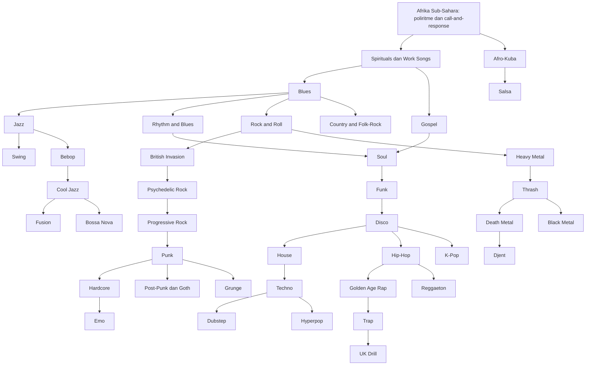
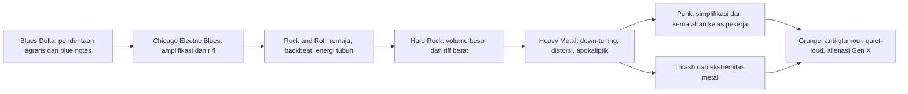
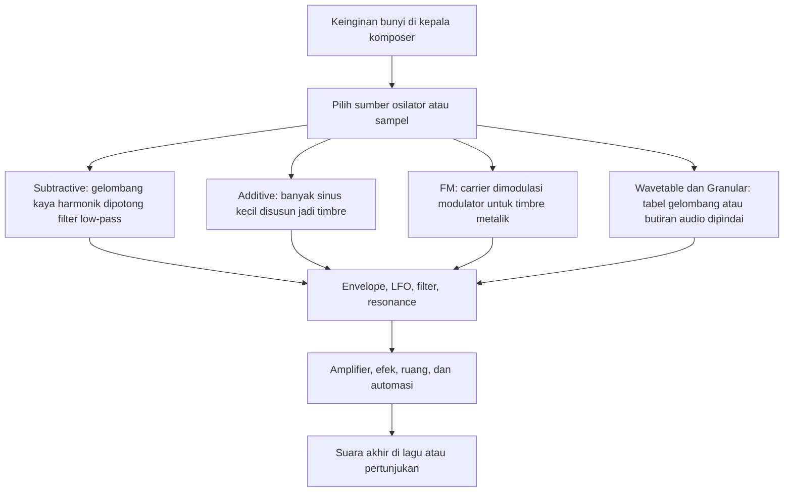
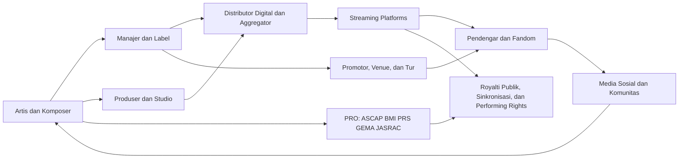

<Callout type="important" title="🎼 Cara Membaca Artikel Ini">
Artikel ini sengaja ditulis sebagai ensiklopedi panjang, bukan rangkuman cepat. Bacalah pelan-pelan, lompat ke bagian yang paling Mas Hendra sukai, lalu kembali lagi ke bagian lain sebagai peta besar sejarah musik dunia 🙂.
</Callout>

# Ensiklopedi Musik Dunia: Sejarah Lengkap dari Prasejarah hingga Era AI

## 1. Pengantar — Musik Sebagai Cermin Peradaban

Musik tidak pernah sekadar bunyi yang enak didengar 😊. Dalam **musikologi** (ilmu yang menelaah struktur, sejarah, teori, dan bentuk musik), musik dipahami sebagai organisasi bunyi di dalam waktu. Dalam **etnomusikologi** (kajian musik sebagai praktik budaya), musik adalah tindakan sosial: ia hidup dalam upacara, kerja kolektif, ritual, tarian, perlawanan, asmara, dan identitas komunitas. Dalam **psikoakustik** (ilmu yang meneliti bagaimana telinga dan otak memersepsikan suara), musik adalah permainan frekuensi, amplitudo, spektrum, resonansi, ekspektasi, dan ilusi persepsi. Dalam **neurosains** (ilmu saraf), musik bahkan lebih radikal lagi: ia adalah peristiwa biologis yang mengaktifkan memori, emosi, prediksi, gerak, bahasa, dan sistem imbalan otak secara simultan 🧠.

Karena itu, ketika kita berbicara tentang sejarah musik, kita sesungguhnya sedang berbicara tentang sejarah manusia itu sendiri. Setiap perubahan dalam musik hampir selalu mengisyaratkan perubahan yang lebih besar di baliknya: lahirnya kota, masuknya agama, berkembangnya mesin cetak, munculnya radio, perang dunia, migrasi massal, segregasi rasial, deindustrialisasi, internet, algoritma, hingga kecerdasan buatan. Musik adalah semacam seismograf budaya. Ia menangkap getaran yang kadang belum sempat dipahami oleh pidato politik, jurnal akademik, atau arsip negara.

Mengapa musik terus berevolusi? Jawabannya tidak tunggal. Ada faktor **teknologi**: notasi, instrumen, penguat suara (*amplifier* — penguat sinyal), piringan hitam, pita magnetik, *synthesizer* (penyintesis suara), *sampler* (alat pengambil cuplikan audio), DAW (*Digital Audio Workstation* — studio rekaman berbasis perangkat lunak), dan kini model AI generatif. Ada faktor **sosial-politik**: kolonialisme, perdagangan budak, urbanisasi, kemiskinan, sensor, propaganda, kebangkitan kelas menengah, dan globalisasi. Ada juga faktor **reaksi artistik**: generasi baru hampir selalu memberontak terhadap bunyi generasi sebelumnya. Ketika musik menjadi terlalu rumit, lahirlah gerakan yang menyederhanakan. Ketika musik menjadi terlalu steril, muncul arus yang mengotorkan. Ketika musik menjadi terlalu komersial, lahir gelombang bawah tanah. Ketika musik terlalu elitis, lahir musik jalanan.

Tesis utama artikel ini sederhana tetapi kuat: **setiap perubahan besar musik adalah respons terhadap krisis atau inovasi zamannya**. Gregorian (nyanyian Gregorian) lahir dari kebutuhan standarisasi liturgi. Opera lahir dari kebutuhan teater emosi aristokrat. Blues lahir dari trauma dan ketahanan Afrika-Amerika. Bebop lahir dari pemberontakan terhadap komersialisasi Swing. Punk lahir dari muak pada kemewahan *progressive rock* (rock progresif). Grunge lahir dari penolakan terhadap glamor MTV. Hip-Hop lahir dari puing kota Bronx dan kreativitas komunitas miskin. K-Pop modern lahir dari industrialisasi budaya dan rekayasa *fandom* (komunitas penggemar) lintas negara. AI music (musik berbasis AI) lahir dari pertemuan komputasi murah, data raksasa, dan ekonomi perhatian 😶.

<Callout type="quote" title="🎙️ Kutipan Kunci dari Dokumen Sumber">
"Evolusi musik tidak pernah terjadi dalam ruang hampa. Setiap pergeseran besar didorong oleh inovasi teknologi, gejolak sosial-politik, dan yang paling penting: reaksi artistik terhadap era sebelumnya."
</Callout>

Kalau tesis itu benar, maka sejarah musik bukanlah daftar tokoh besar semata. Ia adalah jaringan sebab-akibat yang rumit. Kita harus melihat bukan hanya **siapa** yang menciptakan bunyi, tetapi juga **mengapa** bunyi itu dibutuhkan oleh zamannya. Itulah semangat ensiklopedi ini 🌍.

## 2. Garis Waktu Besar — Tabel Lengkap Transisi Era Musik

### Tabel 1 — Garis Waktu Lengkap 14 Era Evolusi Musik Dunia

| Era / Periode | Rentang Waktu | Pemicu Transisi | Mengapa Berubah? | Tokoh / Inovasi Kunci |
|---|---:|---|---|---|
| Kuno / Prasejarah | 60.000 SM – 500 M | Kebutuhan ritual, kohesi kelompok, bertahan hidup | Musik dipakai untuk memori, ritual, koordinasi, dan kosmologi | *Divje Babe Flute* (seruling Divje Babe), *Hohle Fels* (seruling Hohle Fels), nyanyian ritual |
| Peradaban Awal | 3500 SM – 500 M | Pertanian, kota, tulisan, kuil | Musik mulai direkam, distandardisasi, dan diinstitusikan | *Hurrian Hymn No. 6* (Himne Hurrian No. 6), notasi *cuneiform* (huruf paku), *yayue* (musik istana Tiongkok) |
| Abad Pertengahan | 500 – 1400 | Sentralisasi Gereja, biara, liturgi | Ibadah perlu bunyi seragam; notasi berkembang untuk transmisi | Guido d'Arezzo, Gregorian, Léonin, Pérotin |
| Renaisans | 1400 – 1600 | Mesin cetak, humanisme | Monopoli musik gereja retak; musik sekuler dan polifoni meluas | Petrucci, Josquin des Prez, Palestrina, *madrigal* (lagu sekuler polifonik) |
| Barok | 1600 – 1750 | Patronase istana, teater, *Doctrine of Affections* (doktrin afeksi) | Musik dipakai untuk menggerakkan emosi secara terukur | Monteverdi, Bach, Vivaldi, *basso continuo* (iringan bass kontinu), opera |
| Klasik | 1750 – 1820 | Pencerahan, konser publik, kelas menengah | Publik muak dengan ornamen Barok; menuntut kejernihan | Haydn, Mozart, *fortepiano* (piano awal), *sonata form* (bentuk sonata) |
| Romantik | 1820 – 1900 | Revolusi Industri, nasionalisme, individualisme | Musik menjadi wadah ekspresi diri, emosi, dan identitas bangsa | Beethoven, Chopin, Liszt, Wagner, *leitmotif* (tema penanda tokoh) |
| Modernisme Klasik | 1900 – 1950 | Perang Dunia, krisis makna, sains modern | Tonalitas lama terasa tidak cukup mewakili dunia yang retak | Schoenberg, Stravinsky, Debussy, Cage |
| Blues Awal | 1890 – 1930 | Emansipasi formal, Jim Crow, kerja agraris | Komunitas Afrika-Amerika butuh katarsis dan bahasa emosi baru | Robert Johnson, Son House, *blue notes* (nada biru) |
| Jazz & Swing | 1900 – 1945 | New Orleans, migrasi, dansa sosial, radio | Improvisasi dan sinkopasi menjadi bahasa modern urban | Louis Armstrong, Duke Ellington, Count Basie |
| Rock & Roll | 1950 – 1965 | Remaja pasca-perang, radio, elektrifikasi | Generasi muda mencari identitas yang terpisah dari orang tua | Chuck Berry, Little Richard, Elvis Presley |
| Psychedelic / Prog / Punk | 1965 – 1979 | Vietnam, halusinogen, resesi, anti-elitisme | Rock pecah antara ambisi besar dan gerakan penghancur kesombongan | Beatles, Hendrix, King Crimson, Ramones, Sex Pistols |
| Hip-Hop / Elektronik / Metal / Grunge | 1970 – 2000 | Kota rusak, *sampler* murah, MTV, deindustrialisasi | Teknologi murah dan frustrasi sosial melahirkan genre baru | DJ Kool Herc, Kraftwerk, Metallica, Nirvana |
| Era Digital / Global / AI | 2000 – 2026 | Internet, streaming, media sosial, AI | Distribusi demokratis tetapi juga sangat terpusat algoritma | BTS, Bad Bunny, SOPHIE, Dolby Atmos, MIDI 2.0, AI generatif |

### Diagram 1 — Timeline Utama Evolusi Musik Dunia

Era prasejarah dan peradaban awal adalah fase ketika musik terutama hidup sebagai tindakan, bukan komoditas. Ia melekat pada ritual berburu, pemanggilan hujan, pelantunan kosmologi, dan koordinasi sosial. Begitu kota, kuil, dan tulisan lahir, musik perlahan berpindah dari memori kolektif murni menuju sistem yang bisa dicatat, diajarkan, dan diwariskan secara formal. Di titik inilah musik mulai memiliki sejarah tertulis, bukan sekadar sejarah arkeologis.

Abad Pertengahan, Renaisans, Barok, Klasik, dan Romantik menunjukkan bagaimana Barat membangun mesin formalnya. Notasi menjadi semakin presisi. Bentuk menjadi semakin canggih. Lembaga-lembaga—gereja, istana, penerbit, konser publik—membentuk siapa yang boleh didengar dan bagaimana bunyi dianggap “sah”. Namun, setiap kemajuan formal membawa kejenuhannya sendiri. Kerumitan polifoni memicu pencarian kejelasan. Kejelasan Klasik memicu ledakan emosi Romantik. Tonalitas Romantik kemudian meledak lagi dalam Modernisme karena dunia telah berubah terlalu keras untuk tetap dinyanyikan dengan harmoni lama.

Sementara itu, abad ke-20 menggeser pusat gravitasi musik dunia dari ruang konser menuju studio, radio, klub, jalanan, dan akhirnya ponsel. Blues, Jazz, Rock, Soul, Hip-Hop, Elektronik, dan Pop global bukan hanya “genre hiburan”, tetapi bahasa baru dari modernitas urban, segregasi, migrasi, kapitalisme media, dan resistensi identitas. Masuknya internet, *streaming* (layanan musik berbasis internet), dan AI membuat musik kini berada di titik paradoks: paling mudah diciptakan, paling mudah diedarkan, tetapi juga paling rentan menjadi data yang dipanen, diotomasi, dan didorong algoritma 🤖.

Transisi antarrera selalu punya sebab. Abad Pertengahan berubah ke Renaisans karena mesin cetak dan humanisme memecahkan monopoli liturgi. Renaisans berubah ke Barok karena patronase istana dan teater menuntut musik yang lebih dramatis. Barok berubah ke Klasik karena publik baru menginginkan kesederhanaan yang terang. Klasik menjadi Romantik karena seniman menolak disiplin formal demi emosi individual. Romantik hancur ke Modernisme karena perang meretakkan optimisme tonal. Modernisme hidup berdampingan dengan Blues dan Jazz karena pusat kreativitas modern justru muncul dari komunitas tertindas yang memecahkan bahasa lama dengan tubuh, ritme, dan improvisasi. Itulah pola besar sejarah musik: **krisis melahirkan bentuk baru; teknologi memberi alat; komunitas memberi jiwa**.

## 3. Akar Kuno — Prasejarah hingga Peradaban Awal

### 3.1 Prasejarah — Dari Napas, Tulang, dan Kohesi Kelompok

Sejarah musik yang paling awal tidak dimulai dari konser, tetapi dari napas manusia dan ruang gua 🌒. *Divje Babe Flute* (seruling Divje Babe) dari Slovenia sering dibahas sebagai salah satu artefak musik tertua, diperkirakan berusia 50.000–60.000 tahun. Meski ada perdebatan apakah lubang pada tulang itu benar-benar hasil tangan manusia atau bekas gigitan hewan, artefak ini tetap penting karena membuka pertanyaan besar: kapan tepatnya manusia atau kerabat dekatnya mulai memperlakukan bunyi sebagai sesuatu yang bisa diatur? Penemuan lain yang lebih kuat secara arkeologis datang dari *Hohle Fels* di Jerman, tempat *Homo sapiens* awal membuat seruling presisi dari gading mamut dan tulang burung. Ini menandakan bukan hanya kemampuan teknis, tetapi juga niat artistik dan simbolik yang sangat matang.

Fungsi musik pada masa prasejarah kemungkinan bersifat total. Ia bukan seni yang dipisahkan dari hidup sehari-hari, melainkan perangkat bertahan hidup dan pemersatu sosial. Irama bisa membantu sinkronisasi gerak saat bekerja atau berjalan. Nyanyian bisa memperkuat identitas kelompok dan mengikat memori bersama. Dalam konteks ritual, bunyi berulang mungkin digunakan untuk trance (*kesadaran terubah*), penyembuhan, perdukunan, atau pemetaan hubungan manusia dengan dunia hewan, langit, dan leluhur. Dengan kata lain, musik prasejarah mungkin lebih dekat ke “teknologi sosial-spiritual” daripada hiburan murni.

<Callout type="info" title="🦴 Mengapa Seruling Tulang Penting?">
Karena ia menunjukkan tiga hal sekaligus: kecerdasan material, penguasaan lubang resonansi, dan kemampuan membayangkan nada sebelum bunyi itu muncul. Itu tanda lompatan kognitif besar 🙂.
</Callout>

### 3.2 Mesopotamia — Hurrian Hymn, Cuneiform, dan Kelahiran Notasi

Di Mesopotamia, musik bergerak dari wilayah suara yang lenyap menuju suara yang bisa diingat secara tertulis. Tablet *cuneiform* (huruf paku) dari Ugarit menyimpan *Hurrian Hymn No. 6* (Himne Hurrian No. 6), yang kerap dianggap sebagai komposisi tertulis tertua yang secara substansial masih terbaca. Teks ini bukan sekadar lirik pujian kepada dewi Nikkal, tetapi juga memuat petunjuk penyetelan interval diatonis untuk *sammu* (kecapi atau *lyre* bersenar sembilan). Penemuan ini amat penting karena mengguncang anggapan lama bahwa pemikiran harmoni yang relatif kompleks baru lahir di Yunani.

Musik Mesopotamia juga menunjukkan bahwa sejak sangat awal, bunyi sudah terhubung erat dengan negara, kuil, dan pengetahuan teknis. Notasi tidak lahir hanya demi keindahan, tetapi demi stabilitas transmisi. Begitu lagu dikaitkan dengan ritual dan institusi, muncul kebutuhan untuk menjaga bentuknya melintasi generasi. Di sini kita melihat salah satu pola abadi sejarah musik: ketika musik menjadi penting secara sosial, muncul dorongan untuk mengarsipkan dan menstandarkannya.

### 3.3 Mesir Kuno — Sistrum, Harpa Melengkung, dan Musik Kematian

Di Mesir Kuno, musik tidak bisa dipisahkan dari agama, kerajaan, dan imajinasi tentang akhirat. *Sistrum* (alat musik kocok logam) terkait kuat dengan pemujaan dewi Hathor. Harpa melengkung, seruling ganda, dan nyanyian ritual hadir dalam prosesi, perayaan kuil, serta konteks pemakaman. Musik bukan tambahan dekoratif, tetapi sarana untuk mengatur hubungan antara manusia dan yang ilahi.

Yang menarik, musik Mesir juga berhubungan dengan kematian bukan sebagai kesunyian, melainkan sebagai kelanjutan eksistensi. Dalam banyak budaya kuno, bunyi berfungsi menandai peralihan: lahir, menikah, panen, perang, dan meninggal. Mesir mengembangkan ini secara sangat visual dan teologis. Relief, lukisan makam, dan ikonografi memperlihatkan bahwa musik berfungsi sebagai pengantar jiwa, penghormatan terhadap dewa, dan simbol keteraturan kosmik. Ini menegaskan bahwa salah satu akar terdalam musik adalah usaha manusia menolak kefanaan melalui ritus bunyi.

### 3.4 Yunani dan Romawi — Rasio, Ethos, dan Organ Air

Yunani memberi dunia warisan besar berupa teori. Pythagoras menghubungkan interval musikal dengan rasio matematis, lalu lahirlah gagasan *Music of the Spheres* (musik bola-bola langit): keyakinan bahwa kosmos sendiri memiliki keteraturan harmonik. Plato dan Aristoteles mengembangkan **Doktrin Ethos**—gagasan bahwa *modes* (modus atau tangga nada) tertentu membentuk karakter moral pendengarnya. Mode Dorian dianggap menumbuhkan keberanian terkendali, sedangkan Phrygian diasosiasikan dengan gairah dan luapan emosi.

Romawi mewarisi dan memodifikasi gagasan Yunani dengan orientasi yang lebih pragmatis dan spektakuler. Mereka mengadopsi musik untuk militer, arena, dan perayaan kekaisaran. *Hydraulis* (organ air) karya Ctesibius, yang menggunakan tekanan air untuk mengatur suplai udara ke pipa, adalah salah satu bukti bahwa teknologi suara telah lama berkelindan dengan pertunjukan publik dan kekuasaan. Kalau Yunani memberi musik fondasi filsafat, Romawi menunjukkan bagaimana bunyi dapat diperbesar demi dampak massa.

### 3.5 Asia — Tiongkok, India, Jepang, Korea, Asia Tenggara

Di Tiongkok kuno, musik bukan sekadar seni, tetapi bagian dari tata negara. Dalam filsafat Konfusianisme, *yue* (musik) dipahami sebagai manifestasi harmoni moral dan kosmik. Sistem pentatonik tidak berdiri sendiri sebagai abstraksi bunyi, melainkan dikaitkan dengan unsur alam, tatanan sosial, dan etika kepemimpinan. *Yayue* (musik istana) menjadi bentuk bunyi yang melambangkan keteraturan kerajaan, sementara instrumen seperti *guqin* (zither cendekiawan), *pipa* (kecapi petik), *erhu* (rebab dua senar), *dizi* (suling), dan *sheng* (organ mulut) membentuk kosmologi instrumen yang sangat kaya.

India kuno menempuh jalur yang berbeda tetapi sama agungnya. Tradisi *Sama Veda* menunjukkan betapa dalamnya relasi antara nyanyian religius dan pembentukan teori musik. *Natya Shastra* (teks kuno estetika dan seni pertunjukan) menyusun dasar untuk konsep *raga* (kerangka melodi), *shruti* (mikrointerval), dan *tala* (siklus ritme). Di sini, musik bukan sekadar komposisi, tetapi juga keadaan rasa, waktu, dan asosiasi spiritual. Raga tertentu terkait waktu siang atau musim tertentu, menandakan bahwa musik dipahami sebagai bentuk penyesuaian antara bunyi dan alam.

Jepang, Korea, dan Asia Tenggara menambah bukti bahwa sejarah musik dunia tidak bisa diceritakan dari Eropa saja. Jepang mengembangkan *gagaku* (musik istana) dan *shomyo* (pelantunan Buddha), dengan instrumen seperti *koto*, *shamisen*, dan *shakuhachi*. Korea melestarikan *gugak*, *aak*, dan *pansori*, tempat narasi lisan dan ekspresi vokal menjadi pusat dramatik. Asia Tenggara, terutama Indonesia, menghadirkan sistem bunyi yang sangat berbeda dari harmoni Barat: gamelan Jawa dan Bali dengan struktur *colotomic* (siklus gong), laras *slendro* dan *pelog*, serta hubungan erat antara ritme, resonansi logam, dan waktu ritual. Kulintang Filipina, *piphat* Thailand, dan *pinpeat* Kamboja menunjukkan bahwa ansambel gong-chime (gong kecil bernada) dan metalofon adalah salah satu poros besar sejarah musik dunia 🔔.

### 3.6 Afrika Sub-Sahara — Poliritme, Griot, Kora, Balafon

Afrika Sub-Sahara memberi dunia salah satu fondasi paling vital dari musik modern: **poliritme** (banyak ritme berjalan serentak), *cross-rhythm* (silang ritme), dan struktur panggilan-dan-respons. Dalam banyak masyarakat Afrika, musik bersifat partisipatif dan komunal. Tidak ada pemisahan mutlak antara pemain dan penonton; tubuh, tari, suara, dan alat musik berada dalam satu ekologi yang sama.

Peran **griot** (sejarawan lisan, penyair, penjaga silsilah) sangat penting. Di wilayah seperti Kekaisaran Mali, griot menjaga hukum, sejarah, dan ingatan kolektif melalui nyanyian dan instrumen seperti *kora* (harpa-lute) dan *balafon* (gambang kayu). Ini menunjukkan bahwa musik di Afrika bukan sekadar seni bunyi, tetapi arsip hidup. Ketika kemudian diaspora Afrika dipaksa menyeberang Atlantik sebagai budak, sebagian besar struktur ritmis, respons vokal, dan energi komunal itu ikut berpindah—dan kelak menjadi jantung Blues, Gospel, Jazz, Funk, Soul, Samba, Reggae, hingga Hip-Hop.

### 3.7 Amerika Pra-Columbus — Aztec, Maya, Inca, Ocarina, Quena, Zampoña

Peradaban Aztec, Maya, dan Inca mengembangkan dunia bunyi yang sangat terkait dengan ritual, kosmologi, dan lingkungan. Instrumen perkusi seperti *teponaztli* dan *huehuetl* hadir dalam upacara, perang, dan pemanggilan yang sakral. Di Andes, alat tiup seperti *ocarina*, *quena*, dan *zampoña* mencerminkan hubungan kuat antara bunyi, pegunungan, angin, dan lanskap spiritual.

Yang sering dilupakan dalam sejarah populer adalah bahwa musik pribumi Amerika bukan "primitif" dalam arti sederhana, melainkan terikat pada sistem simbolik yang kompleks. Bunyi bisa menandai hubungan dengan dewa, musim tanam, atau hierarki komunitas. Ketika kolonialisme datang, banyak sistem bunyi ini didorong ke pinggiran, tetapi tidak punah. Jejaknya tetap hidup dalam tradisi rakyat, instrumen lokal, dan kebangkitan identitas pribumi kontemporer.

### 3.8 Aborigin Australia — Songlines dan Didgeridoo

Tradisi Aborigin Australia sering disebut sebagai salah satu tradisi musikal berkelanjutan tertua di dunia. Intinya adalah **Songlines** (jalur lagu): peta geografis sekaligus spiritual yang dihafal dan dinyanyikan. Dengan melantunkan rangkaian lagu tertentu, komunitas dapat menavigasi gurun, mengingat sumber air, situs suci, dan rute perjalanan leluhur. Ini luar biasa karena menunjukkan musik sebagai sistem pengetahuan spasial.

*Didgeridoo* dengan getaran drone (dengung kontinu) yang dalam bukan sekadar instrumen eksotik. Ia bekerja bersama *clapsticks* (tongkat ritmis) dan nyanyian untuk membangun lanskap bunyi yang bersifat topografis sekaligus spiritual. Dalam Songlines, musik tidak mewakili dunia—musik **adalah** cara dunia diingat. Itu salah satu definisi paling indah tentang fungsi musik 😌.

## 4. Evolusi Musik Klasik Barat — Abad Pertengahan hingga Postmodernisme

### 4.1 Abad Pertengahan — Gregorian, Guido d'Arezzo, dan Troubadours

Abad Pertengahan sering dibayangkan kelabu, tetapi secara musik justru sangat menentukan. Gereja Katolik membutuhkan liturgi yang seragam di wilayah luas Eropa. Dari kebutuhan administratif sekaligus spiritual itulah berkembang nyanyian Gregorian yang monofonik: satu garis melodi tanpa harmoni kompleks. Sifat monofonik ini penting karena memungkinkan kejelasan teks suci dan keseragaman ibadah.

Transformasi terbesar datang dari Guido d'Arezzo yang menyempurnakan sistem staf garis dan solmisasi. Dengan demikian, musik tidak lagi sepenuhnya bergantung pada hafalan. Ia dapat dituliskan, diajarkan, diperbanyak, dan dibandingkan. Langkah ini sebanding dengan revolusi alfabet dalam bahasa. Dari sini, lahir kemungkinan polifoni yang makin canggih, seperti yang dikembangkan Léonin dan Pérotin di Notre-Dame.

Di luar gereja, *troubadours* dan *trouvères* membawa musik sekuler ke ruang cinta, satire, dan puisi istana. Di titik ini kita melihat dua arus yang akan terus berulang dalam sejarah musik Barat: arus institusional yang tertib, dan arus sekuler yang lebih personal.

### 4.2 Renaisans — Petrucci, Josquin, dan Manisnya Polifoni

Renaisans adalah masa ketika musik mendapatkan dunia publik yang lebih luas berkat mesin cetak. Ottaviano Petrucci memungkinkan notasi musik dicetak dan beredar lebih luas. Ini memecahkan monopoli manuskrip biara dan istana. Musik sekuler tumbuh, dan kelas terdidik baru bisa mengakses repertoar yang sebelumnya lebih terbatas.

Secara estetik, Renaisans menyukai kejernihan tekstur yang tetap kaya. Interval ketiga dan keenam terdengar semakin "manis" bagi telinga Barat. Tokoh seperti Josquin des Prez dan Palestrina mencapai puncak polifoni vokal, ketika beberapa garis melodi independen dapat terdengar seperti jalinan arsitektur bunyi yang sangat anggun. *Madrigal* menjadi format penting untuk ekspresi sekuler, permainan kata, dan lukisan bunyi (*word painting* — teknik ketika musik meniru makna kata).

### 4.3 Barok — Monteverdi, Bach, Opera, dan Basso Continuo

Barok memperbesar semuanya 🎭. Jika Renaisans condong ke keseimbangan, Barok mengejar kontras, drama, ornamen, dan afek yang terarah. *Doctrine of Affections* meyakini bahwa musik dapat dirancang secara sistematis untuk membangkitkan emosi tertentu. Dari sini, lahirlah opera modern melalui eksperimen para komponis dan lingkaran intelektual yang ingin menghidupkan kembali drama Yunani kuno.

Monteverdi menjadi tokoh transisional yang sangat penting, terutama lewat *L'Orfeo*. Sementara itu, *basso continuo*—iringan bass dan akor berkelanjutan—menjadi tulang punggung harmoni. J.S. Bach membawa kontrapung (teknik menggabungkan garis melodi independen) ke puncak intelektual dan spiritual, sedangkan Vivaldi dan Handel memperluas idiom instrumental dan teatrikal. Barok adalah masa ketika musik Barat benar-benar menjadi mesin retorika emosi.

### 4.4 Klasik — Mozart, Haydn, Pencerahan, Fortepiano, Sonata Form

Era Klasik lahir sebagai reaksi terhadap kepadatan Barok. Semangat Pencerahan mengutamakan kejelasan, proporsi, nalar, dan struktur yang bisa diikuti publik yang makin luas. Muncul konser publik dan kelas menengah urban yang menjadi pasar baru musik. Musik tidak lagi hanya milik gereja dan bangsawan.

Haydn menyusun dasar simfoni dan kuartet gesek sebagai bentuk percakapan formal. Mozart memadukan kejernihan dengan kecerdasan dramatis dan melodi yang tampak effortless (mengalir tanpa beban), padahal sebenarnya sangat rumit. *Fortepiano* menggantikan *harpsichord* karena mampu merespons sentuhan dinamis: lembut dan keras. Bentuk sonata memberi arsitektur bagi tegangan, pengembangan, dan resolusi—sebuah bentuk logika musik yang sejalan dengan rasa rasional zaman itu.

### 4.5 Romantik — Beethoven hingga Wagner, Orkestra Besar, Leitmotif

Romantik tidak membuang Klasik; ia meledakkannya dari dalam. Beethoven adalah jembatan besar. Ia mengambil bentuk Klasik lalu mengisinya dengan intensitas subjektif, konflik, dan skala yang belum pernah ada. Sesudahnya, musik Barat memasuki era ketika seniman dipandang sebagai genius visioner, bukan sekadar pelayan istana.

Chopin, Schumann, Liszt, Berlioz, Brahms, Tchaikovsky, hingga Wagner memperluas bahasa harmoni, warna orkestra, dan virtuositas. *Program music* (musik dengan narasi atau ide non-musikal) berkembang pesat. Wagner memperkenalkan penggunaan *leitmotif* secara sistematis—tema melodi yang menandai tokoh, objek, atau ide—yang kelak sangat memengaruhi musik film. Orkestra membesar, alat musik bertambah, dan musik menjadi kendaraan emosi, nasionalisme, bahkan filsafat.

### 4.6 Modernisme 1900–1950 — Schoenberg, Stravinsky, Debussy, Cage

Abad ke-20 dimulai dengan retaknya rumah tonal lama. Trauma perang, urbanisasi brutal, psikoanalisis, dan sains baru membuat dunia terasa asing. Arnold Schoenberg mendorong atonalitas dan serialisme 12 nada sebagai upaya merombak bahasa lama dari akar. Igor Stravinsky meradikalkan ritme, aksen, dan energi primitif dalam *The Rite of Spring*.

Claude Debussy membuka jalan berbeda: bukan penghancuran keras, melainkan pelunakan batas tonal melalui skala *whole-tone* (seluruh nada), pentatonik, dan warna harmonik yang banyak terinspirasi dari gamelan Jawa. John Cage kemudian menantang definisi musik itu sendiri lewat kebetulan (*aleatoric*), objek non-musikal, dan karya *4'33"*, yang memaksa kita mendengar keheningan sebagai peristiwa bunyi.

### 4.7 Postmodernisme — Minimalisme, New Complexity, Film, dan Gim

Postmodernisme muncul antara kejenuhan terhadap akademisme modernis dan kebutuhan dunia kontemporer akan bahasa yang lebih plural. *Minimalism* (minimalisme) karya Philip Glass, Steve Reich, dan Terry Riley menggunakan repetisi, pergeseran fase, dan pulsa meditatif sebagai antitesis terhadap serialisme yang kaku. Musik menjadi hipnotik, prosesual, dan sering lebih mudah diakses.

Di sisi lain, *New Complexity* (kompleksitas baru) ala Brian Ferneyhough mendorong notasi ke tingkat yang hampir melewati fisiologi manusia. Bersamaan dengan itu, idiom simfonik keluar dari ruang konser dan merajai *film scoring* (musik film) serta video game. Hans Zimmer, John Williams, Nobuo Uematsu, dan Austin Wintory menunjukkan bahwa warisan orkestral tetap hidup, tetapi kini berada dalam ekosistem media massa dan interaktivitas digital.

## 5. Anatomi Transisi Genre Modern — Bagian Terpanjang

### Diagram 2 — Pohon Genealogi Genre Musik Modern

### 5.1 Blues — Delta ke Chicago Electric

Blues lahir dari kondisi sosial yang sangat konkret: dunia pasca-perbudakan di Amerika Selatan, terutama Mississippi Delta. Orang-orang Afrika-Amerika hidup dalam kemiskinan struktural, kekerasan rasial, kerja berat, dan sistem Jim Crow yang secara brutal membatasi mobilitas sosial. Dalam kondisi ini, *field hollers* (teriakan ladang), *work songs* (lagu kerja), dan spiritual gereja bertemu dengan gitar Eropa dan menciptakan bahasa baru untuk penderitaan, ironi, humor pahit, dan ketahanan.

Mengapa Blues lahir? Karena komunitas yang tertindas memerlukan bentuk ekspresi yang cukup lentur untuk memuat luka tanpa menghapus martabat. *12-bar blues* memberi kerangka harmonik sederhana namun kuat. *Blue notes*—nada yang dibengkokkan atau diturunkan sedikit dari sistem Barat—memberi rasa getir yang sulit ditulis dalam kata. Secara musikal, Blues menekankan frasa vokal yang fleksibel, respons antara suara dan instrumen, serta lirik yang sering memakai struktur pengulangan AAB.

Tokoh seperti Charley Patton, Son House, dan Robert Johnson membangun mitologi Delta Blues akustik. Namun transisi besar terjadi saat migrasi besar Afrika-Amerika ke kota-kota industri utara seperti Chicago. Di bar yang bising, gitar akustik tidak lagi cukup. Muddy Waters, Howlin' Wolf, dan Willie Dixon mengubah Blues menjadi *Chicago Electric Blues* dengan gitar elektrik, amplifikasi, harmonika yang diperkeras, dan ritme yang lebih padat. Inilah cetak biru langsung bagi Rock and Roll dan Hard Rock.

<Callout type="tip" title="🎧 Cara Mendengar Blues dengan Lebih Dalam">
Jangan hanya dengarkan liriknya. Dengarkan bagaimana vokal "menggeser" nada dari mayor ke minor, bagaimana gitar menjawab kalimat penyanyi, dan bagaimana ruang kosong justru terasa seperti luka yang belum selesai.
</Callout>

### 5.2 Jazz — New Orleans ke Swing, Bebop, Cool, dan Fusion

Jazz lahir di New Orleans—kota pelabuhan campur-aduk tempat *brass band* militer, ragtime, blues, mars, musik Karibia, dan improvisasi Afrika-Amerika saling bertubrukan. Jazz sejak awal bukan hanya genre, tetapi metode berpikir: bagaimana materi bersama diubah melalui improvisasi, sinkopasi, dan interaksi spontan antar pemain.

Era Swing pada 1930-an menjadikan Jazz sebagai musik populer arus utama. Big Band milik Duke Ellington, Count Basie, dan Benny Goodman mengisi ballroom. Irama 4/4 yang stabil mendorong dansa. Aransemen menjadi penting, tetapi masih memberi ruang improvisasi. Swing menandai momen ketika Jazz menjadi industri hiburan besar.

Namun, justru karena sukses komersial itulah lahir pemberontakan Bebop pada 1940-an. Charlie Parker, Dizzy Gillespie, dan Thelonious Monk muak melihat Jazz direduksi menjadi musik dansa untuk pasar putih. Mereka memindahkan pusat dari lantai dansa ke klub kecil. Tempo dipercepat, akor dipadatkan, substitusi harmoni diperumit, dan melodinya menjadi bergerigi. Bebop sengaja sulit ditarikan. Ia mengembalikan Jazz sebagai seni dengar, bukan sekadar hiburan latar.

Miles Davis kemudian memimpin transisi ke *Cool Jazz* (Jazz dingin) dan *Modal Jazz* (Jazz modal) yang lebih lapang, meditatif, dan hemat not. *Kind of Blue* menjadi titik penting karena menunjukkan bahwa kompleksitas tidak harus selalu diwujudkan lewat kepadatan. Coltrane mendorong eksplorasi spiritual dan harmonik ke wilayah sangat intens. Pada 1970-an, *Fusion* menggabungkan Jazz dengan Rock, Funk, dan elektronik melalui tokoh seperti Miles Davis fase akhir, Herbie Hancock, dan Weather Report.

#### Tabel 2 — Perbandingan Swing vs Bebop vs Cool Jazz

| Aspek | Swing | Bebop | Cool Jazz |
|---|---|---|---|
| Fungsi utama | Musik dansa dan hiburan massa | Musik dengar untuk musisi dan penikmat serius | Musik dengar yang lebih sejuk dan kontemplatif |
| Format | Big Band besar | Combo kecil | Combo kecil sampai sedang |
| Tempo | Stabil, mengayun, dansabel | Sering sangat cepat dan rumit | Sedang sampai lambat, mengambang |
| Harmoni | Kaya tetapi relatif jelas | Sangat padat, disonan, banyak substitusi | Lebih lapang, halus, modal |
| Tokoh kunci | Duke Ellington, Count Basie | Charlie Parker, Dizzy Gillespie, Monk | Miles Davis, Chet Baker, Gerry Mulligan |
| Kesan emosional | Enerjik, elegan, sosial | Tegang, cerdas, virtuosik | Dingin, melankolis, reflektif |

### 5.3 Country dan Folk — Appalachian ke Newport 1965

Country berakar pada percampuran balada *fiddle* dari imigran Skotlandia-Irlandia dengan banjo yang datang melalui tradisi Afrika. Artinya, bahkan genre yang kerap dipahami sebagai "sangat putih" ini sesungguhnya memiliki fondasi lintas budaya yang dalam. Pada tahap awal, Country adalah musik pedesaan, perjalanan, keluarga, kerja keras, agama, dan kesepian jarak jauh.

Ketika Nashville menjadi pusat industri, muncullah *Nashville Sound*—pendekatan yang memoles Country dengan orkestra gesek, vokal latar halus, dan produksi lebih rapi agar dapat diterima radio pop. Chet Atkins, Patsy Cline, dan banyak produser lain membantu menjadikan Country lebih elegan bagi pasar nasional. Tetapi, seperti biasa, pemolesan industri memunculkan pemberontakan.

*Outlaw Country* muncul ketika Willie Nelson, Waylon Jennings, dan Johnny Cash menolak kontrol penuh produser Nashville. Mereka ingin suara yang lebih kasar, jujur, dan dekat dengan realitas kelas pekerja. Sementara itu, ranah Folk berkembang sebagai musik protes. Woody Guthrie, Pete Seeger, dan Joan Baez memakai gitar akustik sebagai senjata politik. Puncak transisi datang di Newport Folk Festival 1965 saat Bob Dylan naik dengan gitar elektrik. Kejadian itu memecah kubu Folk puritan dan melahirkan *Folk-Rock*—bukti bahwa puisi politik bisa berkawin dengan energi rock.

### 5.4 Soul dan R&B — Dari Mimbar Gereja ke Neo-Soul

Soul dan R&B lahir dari sekularisasi energi Gospel. Vokal gereja Afrika-Amerika yang melismatik, penuh seruan, dan intens emosinya dipindahkan ke lagu-lagu cinta, kerinduan, dan kehidupan urban. Ray Charles, Sam Cooke, dan Aretha Franklin menunjukkan bahwa teknik panggilan-dan-respons gerejawi dapat diubah menjadi bahasa sekuler yang sangat kuat.

Pada 1960-an, Soul terbagi ke dalam dua model produksi legendaris: Motown dan Stax. Motown di Detroit memoles suaranya dengan disiplin pabrik. Lagu-lagunya ditulis, diaransemen, dan diuji untuk menembus pasar pop lintas ras. Stax di Memphis justru terdengar lebih raw (mentah), panas, dan terkait langsung dengan jiwa Selatan serta gerakan hak sipil.

#### Tabel 3 — Motown vs Stax Records

| Aspek | Motown | Stax |
|---|---|---|
| Kota | Detroit | Memphis |
| Citra | Elegan, rapi, crossover | Mentah, panas, Southern Soul |
| Pendekatan produksi | Mirip lini perakitan, sangat terkontrol | Lebih organik, terasa live |
| Musisi kunci | The Funk Brothers, Marvin Gaye, Stevie Wonder, The Supremes | Booker T. & the M.G.'s, Otis Redding, Isaac Hayes |
| Target pasar | Nasional, lintas ras, radio pop | Jiwa lokal yang kuat, intens secara emosional |
| Kesan sonik | Halus, hook kuat, polished | Kotor, groove tebal, penuh keringat |

Pada akhir 1980-an dan awal 1990-an, R&B arus utama cenderung terlalu terkomputerisasi. Maka lahirlah *Neo-Soul* sebagai reaksi. D'Angelo, Erykah Badu, Lauryn Hill, Maxwell, dan kawan-kawan membawa kembali Rhodes, drum live, bass organik, dan spiritualitas kulit hitam ke pusat musik populer. Neo-Soul bukan nostalgia, tetapi upaya menyelamatkan “jiwa” dari kilap plastik industri.

### 5.5 Rock and Roll — Ledakan 1950-an

Rock and Roll lahir dari pertemuan Blues, Country, Gospel, dan budaya remaja pasca-Perang Dunia II. Remaja kini memiliki uang saku, radio, dan kebutuhan psikologis untuk memiliki musik sendiri. *Backbeat* (aksen kuat di ketukan 2 dan 4) menjadi pusat energi tubuh. Gitar elektrik, drum kit, dan vokal liar mengubah musik menjadi bahasa pemberontakan generasional.

Chuck Berry memberikan logika *riff* gitar dan lirik remaja modern. Little Richard membawa piano dan vokal eksplosif. Elvis Presley menjadi kendaraan komersial raksasa yang menerjemahkan energi hitam ke pasar putih Amerika—fakta yang sekaligus membuka pasar dan menyingkap ketegangan rasial di balik industri musik. Rock and Roll sejak awal adalah musik tubuh, seksualitas, mobilitas, dan kegelisahan modern.

### 5.6 Invasi Inggris dan Psychedelic — Revolusi Studio

Pada 1960-an, band-band Inggris menyerap Blues dan Rock Amerika lalu mengembalikannya dalam bentuk baru. The Beatles bukan hanya fenomena pop; mereka merevolusi cara studio dipahami. *Revolver* dan *Sgt. Pepper's* menunjukkan bahwa rekaman tidak lagi sekadar dokumentasi penampilan, tetapi tempat penciptaan realitas sonik baru. Tape reversal (pembalikan pita), overdub, orkestrasi, dan efek studio menjadi bahasa artistik.

The Rolling Stones menegaskan sisi bandit, sensual, dan akar blues dari rock. Sementara itu, budaya halusinogen, Perang Vietnam, dan pencarian kesadaran alternatif mendorong kelahiran *Psychedelic Rock*. Jimi Hendrix memperlakukan gitar, *feedback* (umpan balik), *fuzz* (distorsi berbulu), dan *wah-wah* seperti bahan cair untuk membentuk pengalaman kosmis. The Doors, Jefferson Airplane, Pink Floyd awal, dan banyak lainnya membuat rock menjadi ruang perjalanan mental.

### 5.7 Progressive Rock ke Punk — Katalis Penghancuran

*Progressive Rock* pada akhir 1960-an dan 1970-an mewakili ambisi tertinggi rock untuk menjadi “seni tinggi”. King Crimson, Yes, Genesis, Emerson Lake & Palmer, dan Pink Floyd menciptakan album konsep, birama ganjil, struktur panjang, dan penggunaan Mellotron atau orkestra. Secara teknis menakjubkan, tetapi bagi banyak orang ia juga terdengar elit, jauh dari jalanan, dan terlalu serius.

Lalu datang resesi, pengangguran, dan kemarahan kelas pekerja. Punk muncul bukan hanya sebagai genre, tetapi sebagai koreksi historis. Ramones menyederhanakan semuanya menjadi kecepatan, lagu pendek, dan energi tanpa basa-basi. Sex Pistols mengubah kemarahan itu menjadi ancaman budaya terhadap monarki dan kemapanan. The Clash menambahkan kesadaran politik, reggae, dan kecerdasan lirik. Punk memulihkan keyakinan bahwa siapa pun bisa membentuk band tanpa harus menjadi virtuoso.

### 5.8 Hardcore, Post-Punk, dan Goth

Begitu Punk lahir, ia pecah menjadi banyak anak. *Hardcore* mempercepat tempo, memadatkan agresi, dan mengeras secara etos. Minor Threat, Black Flag, dan Bad Brains menciptakan suara yang seperti ledakan ruang latihan sempit. Hardcore menekankan DIY, komunitas, zine, dan tur mandiri.

Di sisi lain, *Post-Punk* mengambil energi Punk lalu membelokkannya ke arah eksperimental, gelap, intelektual, atau atmosferik. Joy Division, Gang of Four, Siouxsie and the Banshees, dan Talking Heads menunjukkan bahwa setelah bangunan lama dihancurkan, puingnya bisa dipakai untuk membangun bentuk baru. Dari jalur ini lahir *Goth* melalui Bauhaus, The Cure, dan Sisters of Mercy—musik yang memadukan melankoli, bass berdengung, gitar bergaung, dan estetika malam yang pekat 🕯️.

### 5.9 Heavy Metal — Birmingham ke Thrash, Death, Black, Djent

Heavy Metal lahir di Birmingham, kota industri yang penuh asap dan baja. Black Sabbath menangkap suasana pasca-industri itu melalui riff lambat, berat, dan muram. Tony Iommi yang kehilangan ujung jari lalu menurunkan tegangan senar menghasilkan suara yang justru membuka horizon baru metal. Dari kecelakaan kerja, lahirlah salah satu arsitektur bunyi paling berpengaruh dalam sejarah musik keras.

Judas Priest dan Iron Maiden mempercepat, menajamkan, dan mempertegas identitas metal pada gelombang *NWOBHM* (New Wave of British Heavy Metal). Di Amerika, anak-anak yang tumbuh dengan Punk dan NWOBHM menciptakan *Thrash Metal*: Metallica, Slayer, Megadeth, Anthrax. Thrash menggabungkan presisi riff, tempo kilat, dan agresi politis.

Lalu pencarian ekstremitas terus berjalan. *Death Metal* memperdalam teknik, *blast beat* (pukulan sangat cepat), dan vokal *guttural* (geraman). *Black Metal* Norwegia menambahkan ideologi anti-agama, produksi *lo-fi*, dan aura dingin nihilistik. Kemudian Meshuggah dan penerusnya mendorong poliritme, sinkopasi rendah, dan presisi digital menjadi *Djent*. Metal terus membuktikan bahwa ekstremitas sonik selalu menemukan generasi barunya 😈.

### Diagram 3 — Anatomi Transisi Blues → Rock → Metal → Grunge

### 5.10 Grunge — Seattle dan Kejujuran yang Kotor

Grunge lahir karena 1980-an terasa terlalu mengkilap. *Hair Metal* dan glam rock MTV memuja rambut besar, spandeks, solo virtuoso, dan hedonisme. Bagi banyak anak Generasi X, semua itu terasa palsu. Seattle—kota hujan, relatif terisolasi, dan tidak terlalu tersedot mesin industri hiburan Los Angeles—menjadi tanah subur untuk bunyi yang lebih jujur, lebih muram, dan lebih tidak peduli pada gaya.

Nirvana, Pearl Jam, Soundgarden, dan Alice in Chains menggabungkan distorsi metal, etos punk, dan melodi melankolis. Teknik *quiet-loud* (bait tenang, reff meledak) menjadi tanda penting. *Nevermind* karya Nirvana tidak hanya sukses; ia menata ulang pasar musik global. Dalam semalam, flanel, depresi, dan ketidaksopanan emosional mengalahkan kemewahan semu. Grunge menunjukkan bahwa keaslian—atau setidaknya penampilan keaslian—punya daya ledak komersialnya sendiri.

### 5.11 Emo — Midwest ke My Chemical Romance

Emo bermula sebagai cabang dari hardcore Washington D.C., tetapi bentuk yang paling khas berkembang di Midwest. Band seperti Cap'n Jazz, American Football, Braid, dan Sunny Day Real Estate menambahkan gitar berarpeggio, ritme lebih kompleks, lirik yang introspektif, dan kerentanan emosional yang tidak macho. Ini penting secara sosiologis: Emo memberi ruang bagi laki-laki muda untuk terdengar rapuh tanpa harus berhenti terdengar intens.

Pada 2000-an, unsur-unsur Emo masuk arus utama melalui My Chemical Romance, Fall Out Boy, dan Taking Back Sunday. Banyak orang mengejek fase ini sebagai melodrama, tetapi justru di situlah signifikansinya: Emo memperluas bahasa afek anak muda dalam pop-rock, dari sekadar pemberontakan ke pengakuan luka batin.

### 5.12 Elektronik — Musique Concrète ke Kraftwerk, House, Techno, Dubstep, Hyperpop

Musik elektronik berawal dari laboratorium dan studio eksperimental. *Musique concrète* di Prancis memanipulasi rekaman nyata menjadi komposisi. Tetapi yang mengubah elektronik menjadi arsitektur pop modern adalah Kraftwerk. Mereka menghapus kesan bahwa musik harus berpusat pada gitar, drum akustik, dan ekspresi tubuh rock. Suara mesin, ketepatan ritmis, dan estetika robot menjadi indah.

Di Chicago, Frankie Knuckles dan kawan-kawan mengubah sisa-sisa disko menjadi *House Music*. Di Detroit, Belleville Three menciptakan Techno yang lebih dingin, futuristik, dan mekanis—refleksi kota industri yang runtuh. Mesin Roland TR-808, TR-909, dan TB-303 yang semula dianggap gagal justru menjadi jantung revolusi bunyi. Di Inggris, *UK Garage*, *Grime*, dan *Dubstep* menunjukkan bagaimana skena kota, bass, dan budaya klub terus bercabang.

Pada 2010-an, internet melahirkan genre dengan logika memetik referensi secepat meme. *Vaporwave* mengubah nostalgia mal dan musik lift menjadi kritik kapitalisme akhir. *Hyperpop* yang diasosiasikan dengan SOPHIE, A.G. Cook, dan Charli XCX merayakan kepalsuan digital, vokal autotune berlebihan, kompresi brutal, dan keindahan yang sengaja terlalu plastik. Musik elektronik menunjukkan bahwa teknologi bukan cuma alat, tetapi juga estetika.

### 5.13 Hip-Hop — Bronx ke Golden Age, Trap, dan UK Drill

Hip-Hop lahir dari kondisi kota yang remuk. Bronx Selatan rusak oleh proyek *Cross Bronx Expressway*, kemiskinan, kebakaran, dan penarikan investasi publik. Dalam keterbatasan itu, komunitas Afrika-Amerika dan Latino mengubah *turntable* menjadi instrumen. DJ Kool Herc memperpanjang *breakbeat* karena di sanalah tubuh penari paling hidup. Grandmaster Flash menyempurnakan teknik *cutting* dan *scratching*. MC lalu mengisi ruang ritmis itu dengan rap.

Empat pilar Hip-Hop—DJing, MCing, B-boying, Graffiti—menunjukkan bahwa ini sejak awal adalah budaya, bukan sekadar genre musik. Pada *Golden Age*, rap berkembang menjadi bentuk liris yang sangat kompleks dan politis: Public Enemy, Rakim, KRS-One, A Tribe Called Quest, N.W.A. *Gangsta Rap* bukan sekadar glorifikasi kriminalitas, tetapi juga laporan mentah tentang kepolisian, ras, kekerasan, dan ekonomi jalanan.

Di Selatan AS, mesin 808 dan produksi DAW murah membantu lahirnya Trap: bass sub-bawah, hi-hat triplet, tempo lamban namun tegang. Future, Gucci Mane, T.I., Young Jeezy, Migos, dan banyak lainnya mengubah arsitektur ritmis pop global. UK Drill kemudian menambahkan atmosfer lebih gelap, *sliding 808* (nada bass meluncur), dan narasi jalanan Inggris. Hari ini, Hip-Hop bukan pinggiran. Ia adalah bahasa dominan produksi pop global.

### 5.14 K-Pop — Generasi 1 sampai 5

K-Pop modern dimulai ketika Seo Taiji and Boys pada 1992 menyuntikkan Hip-Hop, New Jack Swing, dan tarian Barat ke dalam bahasa Korea, memecah dominasi *trot* dan balada lama. Ini adalah momen ketika Korea Selatan menyadari bahwa pop bukan hanya hiburan, tetapi industri strategis dan ekspor budaya.

SM Entertainment dan agensi lain menciptakan *trainee system* (sistem pemagangan idola): pelatihan bertahun-tahun untuk vokal, tari, bahasa, kepribadian publik, dan sinkronisasi grup. Generasi 1 meletakkan format, Generasi 2 memperluas pasar Asia, Generasi 3 dengan BTS dan BLACKPINK menembus hegemoni Barat via YouTube, fandom digital, dan narasi komunitas global. Generasi 4 dan 5 seperti Stray Kids, NewJeans, IVE, dan lainnya lahir sudah dalam ekosistem internet lintas negara, di mana musik, mode, koreografi, meme, dan *short video* tidak bisa dipisahkan.

K-Pop penting karena ia menunjukkan bentuk paling industrial dari musik pop modern: standar produksi sangat tinggi, narasi grup direncanakan, *fandom* diorganisasi, dan distribusi sangat digital. Tetapi di balik rekayasa industri itu, tetap ada kecerdasan musikal: percampuran genre yang gesit, hook global, dan presisi performatif yang menakjubkan ✨.

### 5.15 Latin — Salsa, Bossa Nova, Reggaeton

Musik Latin modern adalah bukti bahwa diaspora kota bisa mencipta genre yang kemudian dianggap “alamiah”. Salsa lahir bukan semata di Kuba, tetapi di New York dari pertemuan imigran Puerto Rico, Kuba, dan energi Big Band. Fania Records memberi label komersial yang menyatukan berbagai ritme Afro-Kuba ke dalam identitas Pan-Latino.

Bossa Nova muncul ketika kelas menengah intelektual Brasil menganggap Samba karnaval terlalu riuh. João Gilberto dan Antônio Carlos Jobim memperhalus ritme, menambahkan akor *Cool Jazz*, dan menciptakan intimasi berbisik yang elegan. Reggaeton, sebaliknya, lahir dari bawah tanah Puerto Rico lewat campuran *dancehall* Jamaika, rap AS, dan *Dem Bow* rhythm (pola ritme khas). Dari yang pernah dicibir, Reggaeton kini mendominasi pop global melalui Daddy Yankee, J Balvin, Rosalía lintas pengaruh, dan terutama Bad Bunny.

## 6. Anatomi Instrumen Musik — Fisika dan Evolusi

### 6.1 Biola dan Helmholtz Motion

Bunyi biola terdengar ajaib, tetapi fisikanya sangat konkret. Ketika busur yang diberi *rosin* (getah gesek) menyentuh senar, terjadi **Helmholtz motion**—siklus lengket-lepas yang sangat cepat. Senar menempel sesaat pada busur, tertarik, lalu lepas, lalu menempel lagi. Siklus ini menghasilkan gelombang periodik yang kaya harmonik. Energi dari senar diteruskan ke *bridge* (jembatan), lalu ke papan atas, rongga resonansi, *f-hole*, dan *soundpost* (tiang bunyi internal) di dalam bodi.

Kualitas biola tidak hanya berasal dari kayu atau usia, tetapi dari interaksi seluruh sistem: tegangan senar, sudut jembatan, lengkung badan, kepadatan kayu, dan teknik pemain. Itulah sebabnya keluarga biola yang disempurnakan luthier Cremona seperti Stradivari dan Guarneri tetap menjadi ikon. Fisika dan kerajinan bertemu dalam objek yang sangat sensitif terhadap sentuhan manusia 🎻.

### 6.2 Gitar Elektrik — Single-Coil vs Humbucker

Gitar elektrik mengubah sejarah musik karena ia memisahkan sumber getaran dari proyeksi akustiknya. Pickup magnetik bekerja dengan prinsip induksi elektromagnetik: senar logam yang bergetar mengubah medan magnet di sekitar kumparan, menghasilkan sinyal listrik kecil. Sinyal ini diperkuat dan dibentuk lagi oleh ampli serta speaker.

**Single-coil** (kumparan tunggal), seperti pada banyak Fender Stratocaster dan Telecaster, menghasilkan suara tajam, jernih, renyah, dengan respons transien yang cepat. Namun ia rentan menangkap dengung listrik 50/60 Hz dan interferensi radio. **Humbucker** karya Seth Lover untuk Gibson menyatukan dua kumparan dengan polaritas dan fase tertentu sehingga kebisingan dibatalkan, sementara sinyal senar justru diperkuat. Hasilnya: output lebih panas, midrange lebih tebal, sustain lebih panjang, dan noise lebih rendah.

Secara historis, single-coil cocok untuk surf, funk, country, dan blues yang ingin artikulasi tajam. Humbucker lebih dekat dengan jazz elektrik, hard rock, dan metal karena mendorong preamp lebih cepat ke saturasi. Tetapi tentu realitasnya campur—gitaris besar sering menyeberang pakem. Yang penting dipahami adalah bahwa pilihan pickup bukan detail kecil; ia mengubah seluruh interaksi dengan ampli dan efek.

<Callout type="info" title="⚡ Inti Teknis Humbucker">
Dua kumparan pada humbucker dirancang untuk "membatalkan hum" sambil tetap menangkap gerak senar. Karena itu suaranya lebih padat dan lebih tenang dibanding single-coil.
</Callout>

### 6.3 Pedal Efek — Fuzz, Distortion, Tube Screamer, Klon Centaur

Pedal efek adalah laboratorium mini di kaki gitaris 😄. *Fuzz* seperti Maestro FZ-1 atau Big Muff menciptakan gelombang yang hampir "tercabik", menghasilkan sustain liar dan tekstur seperti kain wol terbakar. Distorsi keras ala Boss DS-1 atau Rat lebih terkait dengan *clipping* (pemotongan puncak gelombang) yang memberi agresi terkontrol.

Ibanez Tube Screamer terkenal karena *mid-hump* (peninggian frekuensi menengah) dan overdrive yang mendorong amplifier tabung, bukan menghancurkannya. Ia seperti memberi ampli dorongan tambahan agar bernyanyi. *Klon Centaur* menjadi legenda karena transparansinya: menambah gain dan harmonik sambil mempertahankan identitas dasar gitar-ampli. Pedal-pedal ini bukan aksesori. Mereka mengubah cara genre terbentuk—dari Blues Rock sampai Shoegaze dan Doom.

### 6.4 Piano — Cristofori, Rangka Besi Cor, dan Tiga Pedal

Piano modern berutang besar kepada Bartolomeo Cristofori, yang merancang mekanisme palu sehingga tuts dapat menghasilkan dinamika berbeda—*piano e forte* (lembut dan keras). Inovasi ini besar sekali dibanding harpsichord yang volume dan artikulasinya lebih terbatas. Pada abad ke-19, rangka besi cor memungkinkan piano menahan tegangan puluhan ton, memperbesar volume, sustain, dan kestabilan nada untuk ruang konser besar.

Tiga pedal utama punya fungsi spesifik. Pedal kanan, **damper/sustain**, mengangkat peredam dari semua senar sehingga nada terus beresonansi. Pedal kiri, **una corda/soft**, pada grand piano menggeser mekanisme sehingga palu memukul lebih sedikit senar atau bagian felt yang berbeda, menghasilkan warna lebih lembut. Pedal tengah, **sostenuto**, menahan hanya nada yang sedang ditekan saat pedal diinjak, sehingga pemain bisa mempertahankan harmoni tertentu sambil memainkan tekstur lain di atasnya. Piano adalah mesin mekanis-akustik yang luar biasa kompleks namun terasa intim di ujung jari 🎹.

### 6.5 Synthesizer — Empat Metode Sintesis

Penyintesis modern membuktikan bahwa suara dapat dibangun, bukan hanya direkam. Metode **subtractive synthesis** (sintesis subtraktif) memulai dari gelombang kaya harmonik seperti sawtooth, lalu memotong frekuensi dengan filter. Ini logika Moog klasik. **Additive synthesis** (sintesis aditif) justru menyusun timbre dari banyak gelombang sinus kecil. Secara teoritis sangat kuat, meski historisnya lebih sulit secara komputasi.

**FM synthesis** (modulasi frekuensi) membuat satu osilator menggetarkan frekuensi osilator lain, menghasilkan timbre metalik, lonceng, dan elektrik khas Yamaha DX7. **Wavetable** memindai tabel gelombang yang berbeda-beda, memberi gerakan spektral. **Granular synthesis** memecah audio menjadi butiran sangat pendek lalu menyusunnya ulang menjadi awan sonik. Karena prompt meminta empat metode dan menggabungkan wavetable + granular, kita bisa memahami keduanya sebagai keluarga manipulasi spektrum berbasis material digital.

#### Tabel 4 — Metode Sintesis Synthesizer

| Metode | Prinsip | Karakter Suara | Contoh Historis | Kegunaan |
|---|---|---|---|---|
| Subtractive | Mulai dari gelombang kaya harmonik lalu dipotong filter | Hangat, klasik, analog | Moog, Prophet | Bass, lead, pad klasik |
| Additive | Menyusun suara dari banyak sinus | Presisi, organik, kompleks | Organ digital, software modern | Rekonstruksi timbre halus |
| FM | Satu osilator memodulasi osilator lain | Metalik, kaca, elektrik | Yamaha DX7 | Bell, EP, bass tajam |
| Wavetable + Granular | Memindai tabel gelombang atau butiran audio | Bergerak, futuristik, atmosferik | PPG, Serum, granular engines | Sound design, ambient, hyperpop |

### Diagram 4 — Proses Sintesis Suara 4 Metode

### 6.6 Pola Chladni — Fisika Vibrasi pada Drum dan Plat Logam

Ketika plat logam atau membran drum digetarkan pada frekuensi tertentu, bagian-bagian tertentu bergetar kuat (*antinodes*), sementara bagian lain tetap diam (*nodal lines*). Ernst Chladni menunjukkan bahwa jika pasir halus ditaburkan di atas plat yang beresonansi, pasir akan berpindah ke garis diam, membentuk pola geometri yang memesona. Pola ini bukan sulap; ia adalah visualisasi langsung dari mode resonansi.

Bagi musik, ini penting karena mengingatkan bahwa bunyi bukan benda abstrak. Ia punya bentuk spasial, distribusi energi, dan arsitektur fisik. Ketika kita mendengar snare, gong, atau simbal, kita sedang mendengar sistem dua dimensi yang bergetar dalam pola sangat kompleks. Ilmu ini membantu desain instrumen, speaker, bahkan pemahaman akustik ruang.

## 7. Sosiologi Musik — Trauma, Perlawanan, dan Sensor

### 7.1 Perdagangan Budak Transatlantik — Cetak Biru 90% Musik Populer Modern

Salah satu fakta paling pahit dalam sejarah musik adalah bahwa fondasi besar musik populer modern dibangun di atas trauma diaspora Afrika. Perdagangan budak Transatlantik memaksa jutaan orang membawa tubuh mereka melintasi laut, tetapi mereka juga membawa ritme, pola respons, memori lagu, dan cara memperlakukan waktu musikal. Di Amerika, unsur-unsur itu dipaksa bertemu dengan harmoni gereja Eropa, instrumen Barat, dan struktur sosial kolonial.

Dari percampuran pahit itu lahir Spirituals, Work Songs, Blues, Gospel, Jazz, R&B, Soul, Funk, Hip-Hop, Samba, Reggae, dan banyak bentuk lain. Ketika dokumen sumber menyebut "cetak biru 90% musik populer global", itu memang hiperbolik secara retoris, tetapi arah substansinya benar: pengaruh diaspora Afrika terhadap musik modern hampir mustahil dilebih-lebihkan.

### 7.2 Kekaisaran Moor, Flamenco, dan Fado

Penaklukan Al-Andalus oleh bangsa Moor membawa *oud* (leluhur lute dan gitar), sistem *maqam* (modus Timur Tengah), dan sensibilitas melismatik ke Eropa Iberia. Saat unsur-unsur ini bertemu komunitas Romani, tradisi lokal, dan sejarah pengusiran, lahirlah Flamenco—seni yang terdengar seperti luka, kebanggaan, dan api sekaligus. Fado di Portugal membawa sisi lain: ratapan maritim, nasib, dan kerinduan yang disebut *saudade*.

Pelajaran pentingnya ialah musik sering lahir dari wilayah perbatasan—tempat budaya bertemu bukan dalam damai yang rapi, tetapi dalam dominasi, migrasi, dan adaptasi. Bunyi-bunyi yang paling “otentik” sering justru merupakan hasil hibridisasi panjang.

### 7.3 Griot Afrika — Sejarah yang Dinyanyikan

Griot adalah bukti bahwa musik dapat menggantikan arsip tertulis. Dalam masyarakat tempat tulisan tidak menjadi medium utama sejarah, nyanyian, puisi, dan instrumen mengambil peran sebagai penyimpan hukum, silsilah, dan reputasi. Griot tidak sekadar menghibur; ia mengawal memori politik.

Dalam dunia modern yang terlalu percaya pada dokumen, kita kadang lupa bahwa sejarah juga bisa tinggal di tubuh dan suara. Tradisi griot memperlihatkan bahwa musik bukan hanya ekspresi perasaan, tetapi infrastruktur pengetahuan komunitas.

### 7.4 Musik Protes — We Shall Overcome sampai Miriam Makeba

Musik protes bekerja karena ia menyederhanakan pesan tanpa menyederhanakan emosi. *We Shall Overcome* menjadi semacam mantra gerakan hak sipil AS. Lagu ini tidak rumit secara harmonik, tetapi justru karena itu mudah diingat, dinyanyikan bersama, dan membawa kekuatan moral dalam aksi massa.

Di Afrika Selatan, Miriam Makeba, Hugh Masekela, dan banyak seniman lain memakai musik untuk menantang Apartheid. Lagu protes bukan sekadar dokumentasi penderitaan; ia juga mengatur keberanian kolektif. Dalam demonstrasi, nyanyian memberi ritme langkah, menyatukan napas, dan mengurangi rasa takut. Musik di sini adalah teknologi keberanian ✊.

### 7.5 Sidang PMRC 1985 — Frank Zappa, Dee Snider, John Denver vs Senat AS

Pada 1985, Parents Music Resource Center (PMRC), dipimpin Tipper Gore dan istri politisi Washington lainnya, mendorong kampanye moral panik terhadap lagu-lagu yang dianggap cabul, satanik, atau berbahaya bagi anak muda. Mereka menyusun daftar *Filthy Fifteen* (lima belas lagu "kotor") dan mendorong pelabelan serta sensor. Secara sosiologis, ini penting karena menunjukkan pola klasik: ketika generasi tua gagal memahami bahasa budaya anak muda, respons yang sering muncul adalah patologisasi.

Frank Zappa menyerang gagasan itu secara konstitusional dan logis, menyebutnya bentuk sensor terselubung. Dee Snider dari Twisted Sister mengejutkan senator karena tampil sangat artikulatif, membantah bahwa lirik mereka otomatis mempromosikan penyimpangan. John Denver, sosok yang dianggap "bersih", justru memberi pukulan moral paling telak ketika membandingkan semangat PMRC dengan tradisi pembakaran buku. Hasil kompromi politiknya adalah label *Parental Advisory*.

<Callout type="warning" title="⚠️ Pelajaran dari PMRC dan Era AI">
Setiap kali masyarakat panik terhadap media baru—rock, metal, rap, game, internet, atau AI—argumen moral sering datang lebih cepat daripada pemahaman. Sensor hampir selalu tampak mulia di awal, lalu menimbulkan masalah besar di belakang.
</Callout>

## 8. Tokoh-Tokoh Legendaris — Vokalis, Instrumentalis, Band Ikonik

### 8.1 Vokalis

**Luciano Pavarotti** membawa teknik *bel canto* (nyanyian indah) ke panggung publik global. Ia membuktikan bahwa opera tidak harus tinggal di aula elit. **Aretha Franklin** menjadikan Soul sebagai deklarasi martabat, iman, dan kekuatan perempuan kulit hitam. **Freddie Mercury** adalah contoh sempurna penyanyi rock yang menyatukan teatrikal, rentang vokal, dan karisma stadion. **Michael Jackson** memecah batas antara vokal, ritme tubuh, video musik, dan koreografi. Bahkan tarikan napas dan celetukannya berfungsi seperti instrumen perkusi.

### 8.2 Gitaris

**Jimi Hendrix** mengubah feedback, wah-wah, vibrato bar, dan distorsi menjadi bahasa ekspresif, bukan kesalahan teknis. **Eric Clapton** membawa frase Blues ke pusat gitar rock arus utama. **Jimmy Page** memperlakukan studio seperti laboratorium lapis ganda, menghasilkan tekstur Zeppelin yang masif dan misterius.

### 8.3 Bassist

**Jaco Pastorius** menjadikan bass fretless sebagai instrumen solois dengan artikulasi mirip saksofon. **Paul McCartney** menunjukkan bahwa bass bisa menjadi jalur melodi, bukan sekadar fondasi. **Flea** menggabungkan teknik *slap* (tampar bass) dengan energi punk dan funk, menciptakan bahasa tubuh yang eksplosif.

### 8.4 Drummer

**John Bonham** memberi definisi baru pada groove rock berat: besar, luas, dan tetap mengayun. **Buddy Rich** adalah ikon teknik dan kecepatan jazz drum. **Ringo Starr**, sering diremehkan, justru menunjukkan kualitas paling langka: bermain untuk lagu, bukan untuk ego. Pilihan fill dan feel-nya sangat musikal.

### 8.5 Band Legendaris

**The Beatles** merevolusi format band pop menjadi mesin inovasi studio. **Rolling Stones** menjaga akar Blues dan persona pemberontak. **Led Zeppelin** menyatukan Blues, Folk, Hard Rock, dan mitologi. **Pink Floyd** menjadikan album sebagai perjalanan psikologis. **Nirvana** menutup satu era glamor dan membuka bahasa alienasi baru. **Kraftwerk** membuktikan bahwa manusia-mesin bisa terdengar indah dan menentukan masa depan.

## 9. Neurosains dan Psikoakustik Musik

### 9.1 Frisson dan Dopamin

*Frisson* (rasa merinding, chills) terjadi ketika musik menegangkan sistem prediksi otak lalu memberi pelepasan yang kuat. Ketika harmoni, dinamika, atau masuknya suara tertentu melampaui ekspektasi secara tepat, area seperti VTA (*ventral tegmental area*) dan *nucleus accumbens* ikut terlibat dalam pelepasan dopamin. Kita merasakan sensasi di kulit, dada, atau tulang belakang karena otak memperlakukan momen musikal sebagai kejutan yang bermakna.

Bukan semua orang mengalami frisson dengan intensitas sama. Faktor memori, keterbiasaan genre, kepekaan emosional, dan konteks sangat berpengaruh. Orang yang paham bahasa musik tertentu sering mengalami frisson lebih kuat karena sistem prediksinya lebih rinci. Ini menarik: pengetahuan tidak membunuh keajaiban; sering justru memperdalamnya.

### Diagram 5 — Mekanisme Frisson di Otak

### 9.2 Cocktail Party Effect dan Binaural Attention

*Cocktail Party Effect* (efek pesta koktail) menunjukkan kemampuan perhatian binaural otak untuk memilih satu sumber suara di tengah banyak sumber lain. Ini adalah bukti bahwa mendengar bukan proses pasif. Otak secara aktif menyaring, mengelompokkan, dan memprioritaskan informasi. Dalam konteks musik, fenomena ini menjelaskan mengapa kita bisa mengikuti garis vokal di tengah orkestra padat, atau mendengar bass tertentu di dalam campuran klub yang tebal.

### 9.3 Auditory Masking dan Critical Bands — Dasar MP3

Telinga tidak memproses semua frekuensi secara setara. Ada *critical bands* (pita kritis), rentang frekuensi tempat bunyi saling memengaruhi persepsi. Jika suara yang kuat dan lemah berada dalam pita yang sama, suara lemah dapat tertutup—itulah *auditory masking* (pemaskingan auditori). Teknologi kompresi seperti MP3 memanfaatkan fakta ini: data yang "mungkin tak terdengar" dibuang untuk menghemat ukuran file.

Ini juga sangat penting dalam *mixing* (pencampuran audio). Banyak masalah campuran bukan karena instrumen salah dimainkan, tetapi karena frekuensi mereka saling menabrak. Insinyur audio bekerja seperti pematung ruang frekuensi.

### 9.4 Terapi Klinis — Stroke, Alzheimer, PTSD, Autisme

Musik terbukti berguna dalam rehabilitasi neurologis. Pada penyintas stroke, ritme dapat membantu pembentukan ulang pola gerak dan berjalan. Pada Alzheimer, lagu-lagu lama kadang memicu memori autobiografis ketika bahasa lain melemah. Pada PTSD, musik bisa membantu regulasi emosi dan integrasi pengalaman traumatik. Pada spektrum autisme, interaksi musikal kadang membuka jalur komunikasi nonverbal yang lebih aman daripada percakapan langsung.

<Callout type="success" title="🧠 Pencapaian Revolusioner Musik dalam Klinik">
Di sinilah musik menunjukkan wajah paling mulia: bukan hanya menghibur, tetapi membantu otak menyusun ulang jalan hidupnya sendiri.
</Callout>

## 10. Teknologi Audio dan Masa Depan Musik

### 10.1 Evolusi Rekaman — Edison ke DAW

Thomas Edison memperkenalkan fonograf silinder pada 1877. Untuk pertama kalinya, suara bisa diawetkan. Ini mengubah relasi musik dengan waktu: bunyi tak lagi musnah setelah pertunjukan selesai. Piringan hitam, mikrofon, radio, dan studio kemudian memperluas pasar musik sampai tingkat industri massal.

Les Paul dan rekaman multi-track memungkinkan *overdub*—instrumen direkam terpisah lalu ditumpuk. Ini revolusi besar karena musik kini dapat dibangun lapis demi lapis, bukan harus dimainkan serentak. Masuk era digital, DAW seperti Pro Tools, Logic, Ableton, dan FL Studio memindahkan studio ke komputer. Produksi musik jadi jauh lebih demokratis, tetapi juga membuat persaingan jauh lebih padat.

#### Tabel 5 — Evolusi Format Rekaman

| Era | Medium | Kelebihan | Keterbatasan |
|---|---|---|---|
| 1877 | Silinder lilin Edison | Perekaman pertama | Rapuh, fidelitas rendah |
| Awal abad ke-20 | Piringan 78 rpm | Distribusi lebih luas | Durasi pendek |
| 1940–1960 | Vinyl LP dan pita magnetik | Hi-fi lebih baik, album, multi-track | Rentan aus, butuh perangkat khusus |
| 1980-an | Kaset dan CD | Portabel, massal, digital lebih bersih | Kaset mudah rusak, CD tetap objek fisik |
| 1990–2000-an | MP3 dan file digital | Ringan, mudah dibagikan | Kompresi lossy, pembajakan masif |
| 2010–2026 | Streaming | Akses instan, katalog global | Royalti kecil, ketergantungan algoritma |

### 10.2 Loudness War dan LUFS

Pada era CD dan radio kompetitif, produser berlomba membuat lagu terdengar paling keras. Teknik kompresi dan *limiting* (pembatasan puncak) digunakan berlebihan sampai dinamika musik hancur. Inilah *Loudness War* (perang keras-keras-an). Musik memang tampak menonjol sesaat, tetapi cepat melelahkan telinga.

Standar **LUFS** (*Loudness Units relative to Full Scale*) membantu mengukur kekerasan rata-rata secara lebih realistis. Platform streaming melakukan normalisasi, sehingga lagu yang terlalu keras tidak lagi otomatis unggul. Ini secara perlahan memulihkan penghargaan terhadap dinamika.

### 10.3 Spatial Audio — Dolby Atmos dan Ruang 3D

Stereo menempatkan musik pada bidang kiri-kanan. *Spatial Audio* (audio spasial) seperti Dolby Atmos memperlakukan elemen musik sebagai objek yang bisa ditempatkan di ruang tiga dimensi. Vokal bisa terasa melayang di depan, paduan suara dari atas, perkusi dari samping. Ini mengubah *mixing* dari lukisan datar menjadi arsitektur ruang.

Tentu ada risiko: efek bisa menjadi gimmick jika digunakan tanpa alasan musikal. Tetapi jika dipakai cerdas, audio spasial memberi dimensi imersif baru bagi musik, film, dan gim.

### 10.4 MIDI 2.0 — Revolusi 32-bit Bidirectional

MIDI versi lama luar biasa berpengaruh, tetapi arsitekturnya lahir tahun 1983 dan penuh keterbatasan 7-bit. **MIDI 2.0** menghadirkan resolusi lebih tinggi, komunikasi dua arah, dan ekspresi per-nota yang jauh lebih rinci. Bagi instrumen digital, ini seperti naik dari bahasa isyarat kasar menjadi kalimat yang jauh lebih peka.

Dengan dukungan MPE (*MIDI Polyphonic Expression*), tiap nada bisa memiliki data ekspresinya sendiri—pitch, tekanan, gesekan, vibrato—secara independen. Ini penting karena instrumen digital lama sering terasa kaku. MIDI 2.0 membuka jalan bagi performa digital yang lebih manusiawi.

### 10.5 AI Generatif — Hak Cipta, Krisis, dan Prediksi 2030

AI generatif dapat membuat musik dalam hitungan detik, meniru gaya, membangun aransemen, bahkan menyanyikan suara mirip artis. Ini revolusioner sekaligus mengganggu. Siapa pemilik gaya? Apakah model boleh dilatih dari jutaan karya manusia tanpa izin? Apakah musik akan dipenuhi konten generik yang cukup “layak” untuk iklan, latar video, dan *mood playlists*?

Prediksi menuju 2030 menunjukkan AI akan mengambil porsi besar dalam musik fungsional: musik latar, konten cepat, prototipe iklan, scoring murah, bahkan kolaborasi kreatif. Tetapi nilai manusia kemungkinan justru makin terkonsentrasi pada tiga hal: otentisitas naratif, performa langsung, dan identitas yang tidak mudah disimulasikan.

<Callout type="danger" title="🤖 Kontroversi Besar AI Musik">
Kalau mesin dilatih dari sejarah artistik manusia tanpa persetujuan yang adil, maka efisiensi teknis bisa berubah menjadi ekstraksi budaya. Pertanyaannya bukan hanya "bisa atau tidak", tetapi "adil atau tidak".
</Callout>

### 10.6 Brain-Computer Interface — Musik dari Pikiran Murni

*Brain-Computer Interface* (BCI) dalam konteks musik mengarah pada sistem yang membaca sinyal otak—misalnya EEG—untuk menerjemahkan niat, emosi, atau pola tertentu menjadi peristiwa musikal. Untuk terapi, ini sangat menjanjikan bagi orang yang mobilitasnya terbatas. Untuk seni, BCI mengusulkan masa depan yang liar: komposer mungkin suatu hari “memainkan” sketsa musik langsung dari aktivitas neural.

Tentu, realisasinya masih jauh dari fantasi film. Pikiran manusia tidak datang sebagai file MIDI yang rapi 😄. Tetapi arah perkembangan ini tetap penting karena memperluas definisi antarmuka musikal: dari jari, paru-paru, dan pita suara menuju sistem saraf itu sendiri.

## 11. Institusi dan Ekosistem Musik Global

Konservatorium, jurnal, dan lembaga royalti membentuk siapa yang didengar, diajarkan, dilindungi, dan dibayar. **Juilliard** menjadi simbol pelatihan tingkat tinggi untuk performa klasik dan kontemporer. **Curtis Institute** terkenal selektif dan hampir sepenuhnya berbasis beasiswa. **Berklee College of Music** menjadi pusat penting untuk jazz, produksi musik, *songwriting* (penulisan lagu), dan teknologi audio.

Di ranah akademik, *Journal of the American Musicological Society* (JAMS) dan jurnal *Ethnomusicology* penting karena menjaga percakapan ilmiah tentang sejarah, metode, budaya, dan kritik terhadap bias-bias lama. Dalam banyak hal, perdebatan tentang apa itu musik yang “serius” atau “layak diteliti” dibentuk di ruang-ruang seperti ini.

Sementara itu, **Performance Rights Organizations** seperti ASCAP, BMI, PRS, GEMA, dan JASRAC menjaga sirkulasi royalti. Di era streaming, peran mereka tetap vital karena ekonomi musik semakin tak kasat mata. Jika dulu orang membeli objek fisik, kini musik beredar sebagai data. Tanpa sistem pelacakan dan distribusi hak, pencipta akan semakin mudah hilang di balik platform.

### Diagram 6 — Ekosistem Industri Musik Modern

## 12. Glosarium Musik Dunia — 90 Istilah Penting

1. **Aak** — musik ritual Konfusianisme di Korea.
2. **Additive Synthesis** — sintesis yang membangun suara dari banyak gelombang sinus.
3. **Affective BCI** — antarmuka otak-komputer yang menafsir keadaan afektif.
4. **Aleatoric** — musik yang melibatkan unsur kebetulan.
5. **Arpeggio** — nada akor dimainkan berurutan, bukan bersamaan.
6. **Auditory Masking** — bunyi kuat menutupi persepsi bunyi lemah.
7. **Backbeat** — aksen kuat pada ketukan 2 dan 4.
8. **Balafon** — gambang kayu Afrika Barat.
9. **Basso Continuo** — fondasi iringan berkelanjutan di musik Barok.
10. **Bebop** — jazz cepat, padat, dan sangat virtuosik.
11. **Bel Canto** — tradisi nyanyian opera yang menekankan keindahan garis vokal.
12. **Blue Notes** — nada yang dibengkokkan atau diturunkan untuk rasa getir Blues.
13. **Breakbeat** — bagian drum pendek yang diulang dalam Hip-Hop dan musik klub.
14. **Call-and-Response** — pola panggilan dan jawaban musikal.
15. **Cantometrics** — metode Alan Lomax menganalisis gaya vokal lintas budaya.
16. **Cast Iron Frame** — rangka besi cor pada piano modern.
17. **Chicago Electric Blues** — blues kota yang diperkuat amplifier.
18. **Chladni Patterns** — pola resonansi visual pada plat bergetar.
19. **Clipping** — pemotongan puncak gelombang yang memicu distorsi.
20. **Colotomic** — struktur siklus gong dalam gamelan.
21. **Cool Jazz** — jazz yang lebih tenang dan lapang.
22. **Counterpoint** — teknik menggabungkan garis melodi independen.
23. **Cross-rhythm** — pertemuan pola ritmis yang saling silang.
24. **Cuneiform** — sistem tulisan paku Mesopotamia.
25. **DAW** — studio rekaman berbasis perangkat lunak.
26. **Dem Bow** — pola ritme inti Reggaeton.
27. **Diatonic** — sistem nada yang mengikuti tangga nada mayor/minor umum.
28. **Didgeridoo** — instrumen tiup drone Aborigin Australia.
29. **Djent** — subgenre metal dengan ritme sinkopasi rendah dan presisi tinggi.
30. **Doctrine of Affections** — teori Barok bahwa musik memicu afek tertentu.
31. **Doctrine of Ethos** — keyakinan Yunani bahwa modus memengaruhi moral.
32. **Dolby Atmos** — format audio spasial berbasis objek.
33. **Down-tuning** — menurunkan setelan nada senar gitar.
34. **Drone** — nada panjang berkelanjutan.
35. **Dubstep** — musik bass Inggris dengan nuansa half-time dan sub-bass berat.
36. **EQ** — pengaturan frekuensi dalam audio.
37. **Ethnomusicology** — studi musik sebagai praktik budaya.
38. **Field Hollers** — teriakan ladang Afrika-Amerika.
39. **FM Synthesis** — sintesis modulasi frekuensi.
40. **Fortepiano** — piano awal era Klasik.
41. **Frisson** — sensasi merinding akibat momen musikal.
42. **Fuzz** — distorsi sangat tebal dan berbulu.
43. **Gagaku** — musik istana Jepang.
44. **Gamelan** — ansambel metalofon dan gong Asia Tenggara.
45. **Gangsta Rap** — rap yang menarasikan kerasnya realitas jalanan.
46. **Gospel** — musik religius Kristen Afrika-Amerika.
47. **Granular Synthesis** — sintesis berbasis butiran audio sangat kecil.
48. **Gregorian Chant** — nyanyian liturgis monofonik Gereja Barat.
49. **Griot** — sejarawan lisan dan musisi Afrika Barat.
50. **Groove** — rasa ayunan ritmis yang membuat musik bergerak.
51. **Guidonian Hand** — sistem bantu solmisasi dari Guido d'Arezzo.
52. **Guttural** — teknik vokal geraman rendah pada metal ekstrem.
53. **Helmholtz Motion** — siklus lengket-lepas senar biola saat digesek.
54. **Honky-tonk** — gaya country kasar berbasis piano dan bar.
55. **House Music** — musik klub 4/4 dari Chicago.
56. **Humbucker** — pickup dua kumparan pembatal dengung.
57. **Hurrian Hymn** — himne tertulis kuno dari Ugarit.
58. **Hydraulis** — organ air Romawi/Yunani.
59. **Hyperpop** — pop digital ekstrem, plastik, dan maksimalis.
60. **Improvisation** — penciptaan musik spontan saat dimainkan.
61. **Leitmotif** — tema musikal untuk tokoh, ide, atau situasi.
62. **Limiter** — prosesor audio pembatas puncak sinyal.
63. **Lo-fi** — kualitas rekaman sengaja kasar atau tidak bersih.
64. **LUFS** — satuan pengukuran loudness modern.
65. **Madrigal** — lagu sekuler polifonik Renaisans.
66. **Maqam** — sistem modus musik Timur Tengah.
67. **Melismatic** — satu suku kata dinyanyikan dengan banyak nada.
68. **Mellotron** — keyboard pita yang meniru suara orkestra.
69. **MIDI 2.0** — standar komunikasi musik digital generasi baru.
70. **Modal Jazz** — jazz yang berfokus pada modus, bukan pergantian akor cepat.
71. **Monophony** — satu garis melodi tanpa harmoni.
72. **Motown** — label Soul Detroit yang sangat dipoles.
73. **Musique Concrète** — komposisi dari manipulasi rekaman nyata.
74. **Neo-Soul** — kebangkitan Soul organik 1990-an.
75. **Node Lines** — garis diam pada pola resonansi.
76. **Overdub** — merekam lapisan baru di atas rekaman yang sudah ada.
77. **Pansori** — tradisi narasi bernyanyi Korea.
78. **Parental Advisory** — label peringatan konten eksplisit.
79. **Pelog** — sistem laras gamelan tujuh nada tak rata.
80. **Pentatonic** — tangga nada lima nada.
81. **Phrygian** — modus dengan warna gelap dan tegang.
82. **Polyrhythm** — beberapa ritme berjalan bersamaan.
83. **Polyphony** — beberapa garis melodi independen bersamaan.
84. **Program Music** — musik instrumental yang menyiratkan cerita.
85. **Raga** — kerangka melodi musik klasik India.
86. **Resonance** — penonjolan frekuensi tertentu oleh sistem bunyi.
87. **Serialism** — pengorganisasian musik berdasar deret nada.
88. **Slap Bass** — teknik menampar dan menarik senar bass.
89. **Slendro** — sistem laras gamelan lima nada relatif berjarak rata.
90. **Songlines** — peta geografis-spiritual Aborigin yang dinyanyikan.
91. **Sonata Form** — bentuk musik dengan eksposisi, pengembangan, rekapitulasi.
92. **Spatial Audio** — audio tiga dimensi berbasis objek.
93. **Stax** — label Southern Soul dari Memphis.
94. **Swing** — rasa ayunan ritmis khas jazz.
95. **Synthesizer** — alat pencipta atau pembentuk suara elektronik.
96. **Tala** — siklus ritmis musik India.
97. **Turntablism** — seni memainkan pemutar rekaman sebagai instrumen.
98. **Una Corda** — pedal lembut pada piano grand.
99. **Wavetable** — tabel gelombang digital yang dipindai untuk timbre bergerak.
100. **Word Painting** — teknik musik meniru arti kata dalam teks.

## 13. Penutup — Musik sebagai Arsip Emosi Umat Manusia

Kalau seluruh artikel ini diringkas menjadi satu kalimat, mungkin kalimatnya begini: **musik adalah arsip emosi umat manusia yang paling lentur, paling portabel, dan paling susah dibunuh** ❤️. Ia bisa dipahat di tulang, diukir dalam huruf paku, didendangkan di biara, diteriakkan di ladang, dipukul di klub, diprogram di laptop, atau digenerasikan oleh mesin. Tetapi pada intinya, musik selalu kembali ke kebutuhan yang sama: manusia ingin merasakan sesuatu bersama, mengingat sesuatu bersama, atau melawan sesuatu bersama.

Setiap era menambahkan lapisan baru. Prasejarah memberi kita musik sebagai kohesi dan ritual. Peradaban awal memberi notasi dan lembaga. Barat klasik memberi arsitektur formal luar biasa. Diaspora Afrika memberi inti ritmis dan ekspresif yang menopang modernitas. Studio memberi kemungkinan bunyi tak terbatas. Internet memberi distribusi instan. AI memberi tantangan ontologis baru: apa arti kreativitas, keaslian, dan hak cipta di zaman mesin yang bisa meniru gaya?

Jawaban finalnya mungkin belum ada. Tetapi satu hal tampak jelas: selama manusia masih punya tubuh, memori, konflik, cinta, kehilangan, dan harapan, musik akan terus berubah tanpa pernah benar-benar selesai 🎶.

<Callout type="quote" title="🌌 Kalimat Penutup">
Peradaban boleh berganti medium, tetapi manusia akan terus menyanyi—dengan tulang, dengan kawat, dengan silikon, atau mungkin suatu hari langsung dengan pikirannya sendiri.
</Callout>
