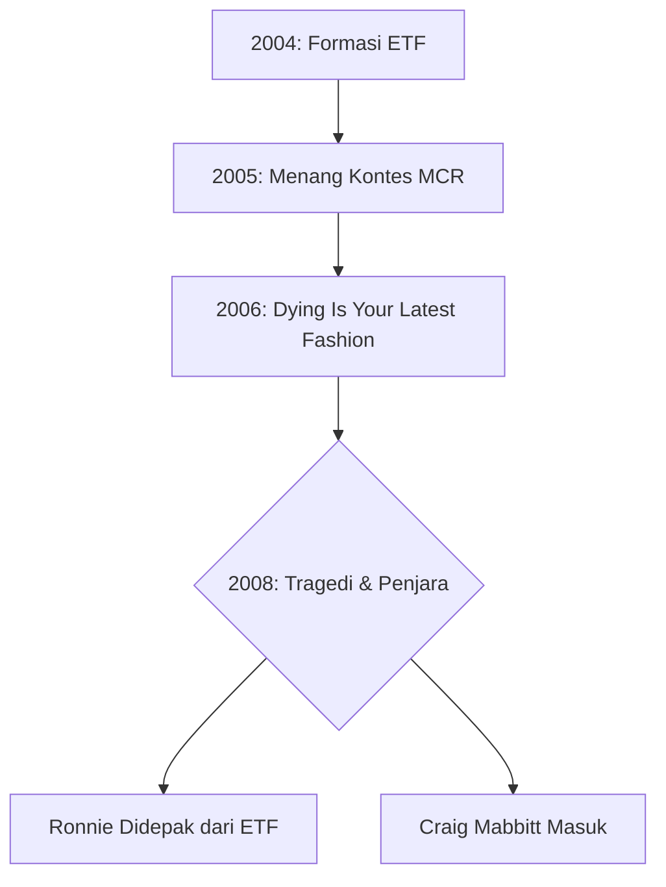
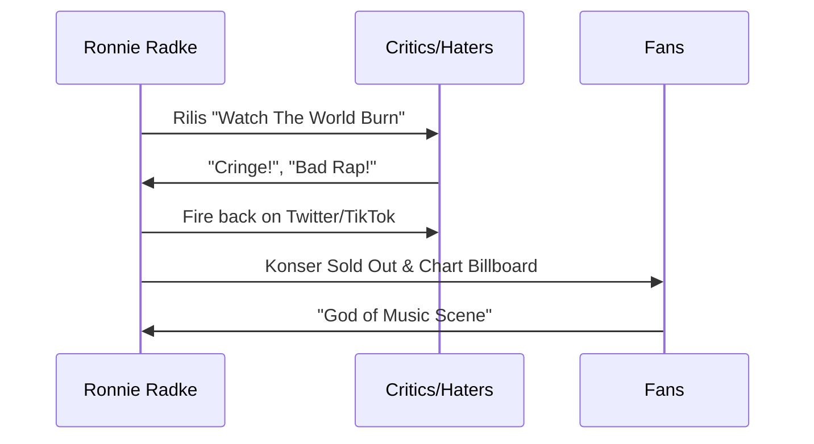

## 🧭 Pendahuluan: Sang Arsitek Kontroversi

Ronnie Radke bukan sekadar vokalis; ia adalah sebuah fenomena. Lahir pada 15 Desember 1983, Ronnie tumbuh dalam bayang-bayang absennya sosok ibu yang meninggalkan luka emosional mendalam. Luka inilah yang menjadi bahan bakar utama bagi lirik-liriknya yang brutal, jujur, dan seringkali tragis. 🎸

Artikel ini akan membedah lini masa perjalanan Ronnie Radke, dari masa-masa awal di Las Vegas hingga dominasi globalnya saat ini.

---

## ⛓️ Era Escape The Fate: Awal dan Kejatuhan

Escape The Fate dibentuk di Las Vegas pada tahun 2004 oleh Ronnie dan sahabat SMA-nya, Max Green. Mereka adalah dua rival band sekolah yang akhirnya bersatu karena kesamaan visi.

### Perjanjian dengan 'Lucifer' 😈
Ada cerita unik (dan menyeramkan) di mana Ronnie dan Max mengaku membuat kontrak dengan darah untuk menjadi terkenal saat berusia 17 tahun. Ironisnya, sesaat setelah menandatangani kontrak tersebut, sebuah pusaran angin (*dust devil*) menghantam apartemen mereka, mengubah lampu jalan menjadi merah. Apakah ini kebetulan atau kekuatan supranatural? Yang pasti, karir mereka meledak tak lama setelah itu.

### Puncak Karir Awal
- **2005:** Memenangkan kontes radio yang dinilai oleh My Chemical Romance.
- **2006:** Merilis album klasik *Dying Is Your Latest Fashion*.
- **Hits:** "Not Good Enough for Truth in Cliché" dan "Situations".

### Tragedi yang Mengubah Segalanya
Pada tahun 2006, Ronnie terlibat dalam perkelahian kelompok yang menewaskan seorang pemuda berusia 18 tahun. Meski bukan Ronnie yang menarik pelatuknya, ia dijatuhi hukuman masa percobaan karena membawa *brass knuckles* (keling/roti kalung). Pelanggaran masa percobaan akibat narkoba akhirnya menjebloskan Ronnie ke penjara selama 2,5 tahun pada 2008. 🏛️

---

## 🦅 Kebangkitan: Falling In Reverse (FIR)

Di dalam sel penjara yang dingin, Ronnie tidak berhenti berkarya. Tanpa alat musik, ia mengetuk ritme di meja atau pangkuannya, membayangkan melodi pop-metal di kepalanya.

<Callout type="important" title="Makna Nama Band">
**Falling In Reverse** secara harfiah berarti "rising" (bangkit kembali). Ini adalah simbol reset karir Ronnie setelah keluar dari penjara pada 2010.
</Callout>

### Album Debut: *The Drug In Me Is You* (2011)
Album ini adalah *Magnum Opus* (karya terbesar) pertama FIR. Lirik-liriknya sangat personal, penuh amarah, dan ditujukan kepada mantan rekan bandnya di ETF.

- **"Raised by Wolves":** Serangan langsung ke ETF dengan lirik *"One day, they'll see, it was always me."*
- **"Tragic Magic":** Mengejek Craig Mabbitt sebagai *impostor* (penyamar).

### Kontroversi Stand Mikrofon 🎤
Pada 2012 di FestEVIL, Ronnie melemparkan tiga tiang mikrofon ke penonton, melukai dua fans. Akibatnya, ia dituntut dan genre metal dilarang di seluruh taman bermain Six Flags selama bertahun-tahun.

---

## 🎭 Era Eksperimentasi & "Cringe"

### *Fashionably Late* (2013)
Ronnie mulai mencampur metal dengan rap dan dubstep. Banyak fans yang menganggap era ini *cringe* (memalukan), terutama lagu "Game Over" yang menggunakan sampel suara Super Mario. Namun, album ini tetap sukses secara komersial.

### *Just Like You* (2015) & *Coming Home* (2017)
- **Just Like You:** Kembali ke akar metalcore namun dengan produksi lebih matang.
- **Coming Home:** Perubahan haluan total menuju suara yang lebih atmosferik dan *space-rock* (terinspirasi 30 Seconds to Mars).

---

## 🌪️ Era Single: Dominasi Digital & "Popular Monster"

Setelah penjualan album *Coming Home* yang kurang memuaskan, Ronnie beralih ke strategi **Singles-Only**. Ia mencurahkan seluruh kreativitasnya ke dalam satu lagu dan satu video klip sinematik berkualitas film Hollywood.

### "The Trilogy" (2018-2019)
Tiga lagu yang saling terhubung secara naratif:
1. **Losing My Mind:** Perjuangan melawan adiksi.
2. **Losing My Life:** Ketakutan akan kehilangan keluarga (anak perempuannya, Willow).
3. **Drugs (feat. Corey Taylor):** Upaya untuk menjadi bersih/waras.

### "Popular Monster" 🐺
Lagu ini adalah titik balik FIR menjadi raksasa industri. Dengan hampir 300 juta *stream* di Spotify, lagu ini memadukan rap yang *slick* dengan *breakdown* metal yang berat.

---

## 🚜 Tren Terbaru: "Y'allternative" & Eksplorasi Genre

Pada tahun 2024, FIR merilis album *Popular Monster* yang merangkum single-single hit mereka.
- **"Ronald":** Kolaborasi brutal dengan Tech N9ne dan Alex Terrible.
- **"All My Life":** Kolaborasi dengan Jelly Roll yang menggabungkan musik *Country* dengan *Metal* (sering disebut *Y'allternative*).

---

## 🧐 Glosarium Istilah (Indo-English)

| Istilah Asing | Penjelasan dalam Bahasa Indonesia |
| :--- | :--- |
| **Bangers** | Lagu-lagu yang sangat enak didengar dan energik. |
| **Brass Knuckles** | Keling atau roti kalung (alat pukul dari logam). |
| **Breakdown** | Bagian dalam lagu metal yang temponya melambat dan sangat berat untuk *moshing*. |
| **Cringe** | Perasaan malu atau risih melihat sesuatu yang dianggap norak. |
| **Doppelganger** | Kembaran atau orang yang wajahnya sangat mirip. |
| **Heckle** | Mengganggu atau mengejek orang yang sedang tampil di panggung. |
| **Magnum Opus** | Karya paling besar, terbaik, atau paling populer dari seorang seniman. |
| **Impostor** | Penipu atau orang yang berpura-pura menjadi orang lain. |
| **Vengeful** | Penuh dendam atau keinginan untuk membalas perbuatan buruk. |

---

## 📝 Kesimpulan: Sang Penyintas yang Tak Terhentikan

Ronnie Radke adalah bukti nyata bahwa talenta yang dipadukan dengan keteguhan hati bisa mengalahkan kontroversi terburuk sekalipun. Meski dicintai sekaligus dibenci, ia tetap menjadi salah satu sosok paling berpengaruh dalam kancah musik modern.

<Callout type="quote" title="Filosofi Ronnie">
*"You can't be loved all the time. That's a red flag to me."* (Kamu tidak bisa dicintai semua orang sepanjang waktu. Bagiku, itu adalah tanda bahaya.)
</Callout>

---
*Ditulis untuk BangunAI Blog. Tetap pantau untuk update seputar teknologi, musik, dan kultur pop lainnya!* 🛠️
