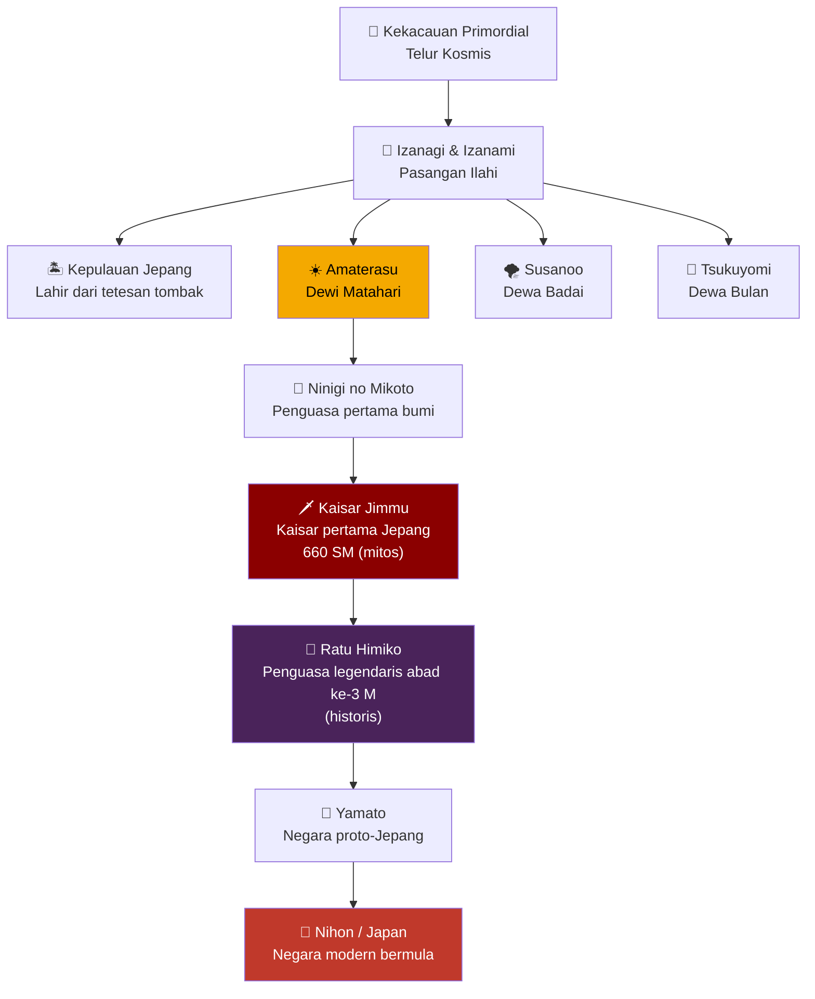
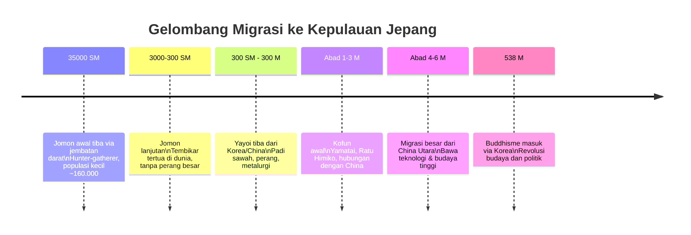
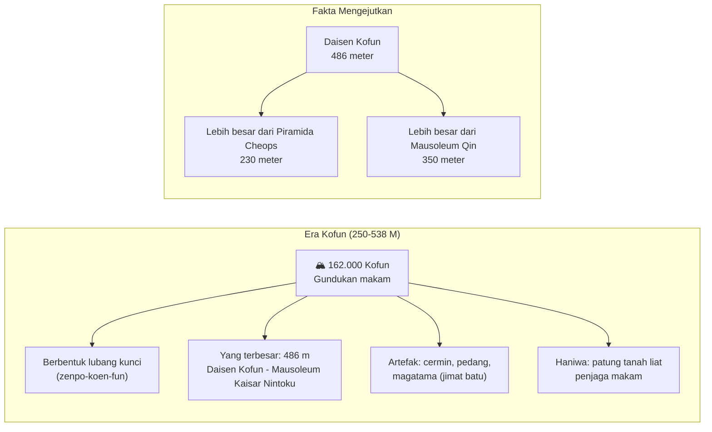
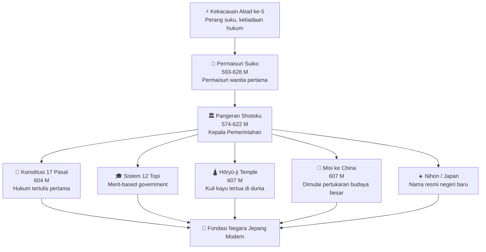
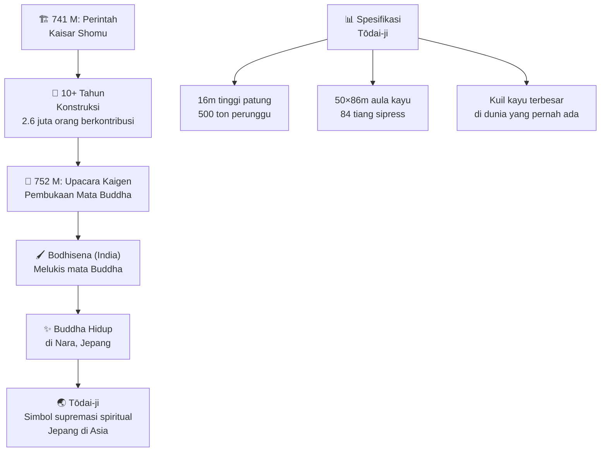
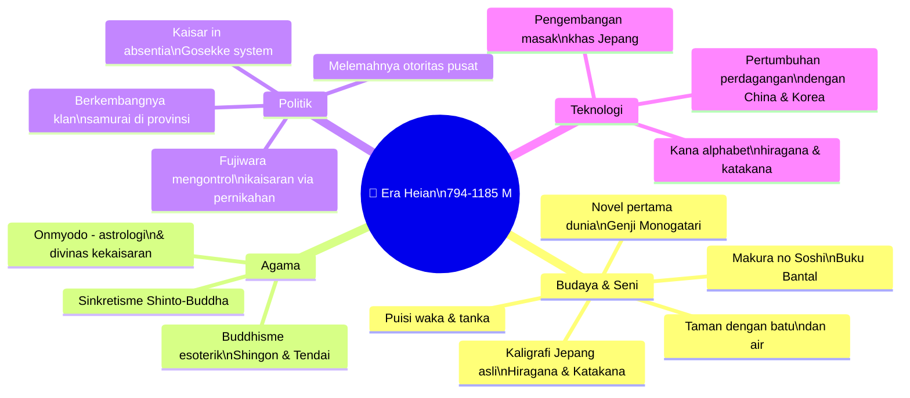
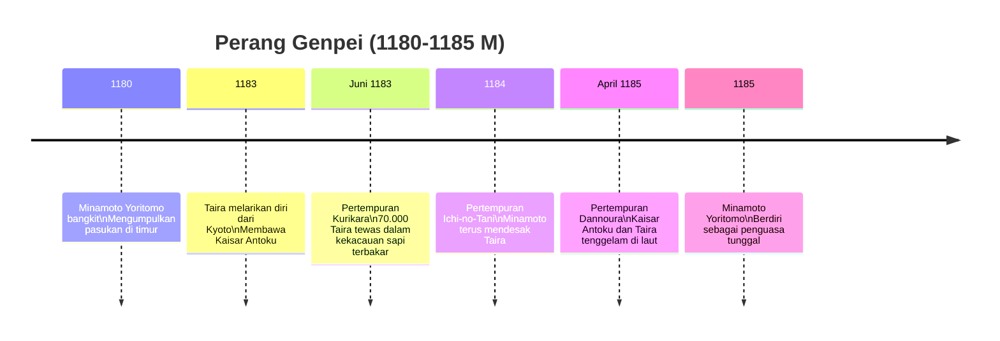
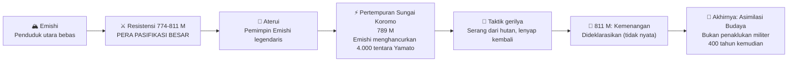
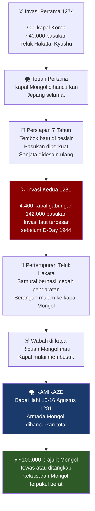

## 🌊 Prolog: Lima Kepala di Tepi Pantai Kamakura

*November 1274. Pantai Kamakura, Jepang.*

Lima utusan Mongol berlutut di tepi pantai, merentangkan leher mereka. Waktu mereka telah tiba. Target yang jelas bagi pedang algojo setidaknya akan memastikan kematian tanpa rasa sakit.

Mereka memandangi biru tua Samudra Pasifik — ombak menepuk perlahan. Betapa mereka berharap pandangan terakhir mereka bisa berupa lautan rumput yang berayun lembut dalam angin padang rumput stepa.

Hati mereka tenang saat bilah-bilah pedang turun memotong leher telanjang mereka.

**Mereka akan dibalas.** ⚔️

Eksekusi para duta besar inilah cara **Hojo Tokimune** — *Shiken* (kepala pemerintahan Shogun) dan penguasa Jepang — memberikan jawaban definitifnya kepada **Kubilai Khan**, Kaisar China, Putra Surga, Great Khan bangsa Mongol.

Ia tidak akan tunduk. Tidak sekarang. Tidak pernah.

Dan di atas segalanya, satu pertanyaan menghantui pikiran Tokimune saat ia berbaring di pangkuan selirnya: **Bagaimana Jepang bisa sampai di sini?**

Untuk menjawabnya, kita harus pergi jauh — sangat jauh — ke dalam kabut waktu yang terlupakan. 🌫️

---

## 📜 Bagian I: Mitos, Legenda, dan Asal-Usul Bangsa

### Yasumaro dan Proyek Propaganda Terbesar Sejarah Jepang

Pada tanggal 3 November tahun 711 Masehi, **Futo no Yasumaro** — seorang bangsawan istana berpangkat tinggi — berlutut di lantai, mencelupkan kuas halusnya ke dalam tinta pekat, dan memulai karya agungnya.

Atas perintah **Permaisuri Genmei**, ia diberi tugas mulia: mengumpulkan semua kisah lama, meluruskan semua kesalahan dalam kronik sebelumnya, dan merekam kembali "kata-kata kuno" yang berserakan dalam ingatan kolektif bangsa Yamato.

Hasilnya adalah **Kojiki** (*古事記* — "Catatan Hal-Hal Kuno") — teks tertua yang masih ada dalam bahasa Jepang, selesai tahun 712 Masehi. 📖

Tapi kejujurannya: ini bukan sekadar sejarah. Ini adalah **propaganda tercanggih sepanjang sejarah Asia Timur**.

Yasumaro menenun mitos, legenda, dan dongeng yang masih samar-samar dipahami menjadi narasi yang solid dan meyakinkan — menciptakan silsilah kerajaan yang terhubung langsung ke para dewa, bahkan ke Dewi Matahari sendiri.

<Callout type="info" title="Kojiki dan Nihon Shoki 📚">
**Kojiki** (712 M) dan **Nihon Shoki** (720 M) adalah dua teks sejarah paling awal Jepang. Keduanya ditulis atas perintah kekaisaran dan mencampur sejarah nyata dengan mitologi untuk melegitimasi kekuasaan dinasti Yamato. Mirip dengan *Aeneid* Virgil yang melegitimasi Augustus Caesar di Roma, atau *Sejarah Rahasia Mongol* yang mendewakan Jenghis Khan.
</Callout>

### Kosmogoni Jepang: Ketika Dewa-Dewi Menciptakan Kepulauan

Menurut Yasumaro, di awal segala sesuatu, tidak ada apa-apa selain kekacauan primordial yang menyerupai telur raksasa. Kemudian muncullah tiga dewa pertama secara spontan (*musubi* — kekuatan kreatif).

Lama kemudian, muncullah pasangan ilahi **Izanagi** (*伊邪那岐* — Ia Yang Mengundang, Laki-laki) dan **Izanami** (*伊邪那美* — Ia Yang Diundang, Perempuan). Mereka berdiri di jembatan surgawi (*Ame-no-ukihashi*) dan mengaduk lautan kekacauan dengan tombak berbatu karang yang dihiasi perhiasan.

Ketika mereka mengangkat tombak itu, tetesan air garam jatuh dan mengental membentuk **Pulau Onogoro** — cikal bakal kepulauan Jepang. Dari sana, mereka melanjutkan menciptakan delapan pulau besar Jepang, gunung-gunung, sungai-sungai, tumbuhan dan pohon.

Kemudian mereka melahirkan dewa-dewi besar:

- ☀️ **Amaterasu Ōmikami** (*天照大神*) — Dewi Matahari, penguasa surga dan semesta, yang paling agung
- 🌙 **Tsukuyomi-no-Mikoto** (*月読命*) — Dewa Bulan
- 🌪️ **Susanoo-no-Mikoto** (*須佐之男命*) — Dewa Badai, liar dan tak terkendali

Amaterasu mengirim cucunya, **Ninigi no Mikoto**, turun ke bumi sebagai penguasa pertama daratan. Ninigi membawa bersamanya tiga harta suci yang hingga kini menjadi simbol kekuasaan kekaisaran Jepang:

| Harta Suci | Nama Jepang | Makna |
|---|---|---|
| 🪞 Cermin Suci | *Yata no Kagami* | Kebijaksanaan dan kejujuran |
| ⚔️ Pedang Suci | *Kusanagi no Tsurugi* | Keberanian dan kekuatan |
| 💎 Permata Suci | *Yasakani no Magatama* | Kemurahan hati dan kebaikan |

Dari Ninigi inilah, menurut Yasumaro, seluruh garis kekaisaran Jepang turun — melewati **Kaisar Jimmu** (*神武天皇*), kaisar pertama yang katanya memerintah mulai tahun 660 SM, hingga ke penguasa modern.

<Callout type="warning" title="⚠️ Mitos vs Sejarah">
Kronik awal Jepang menempatkan Kaisar Jimmu bertahta pada 660 SM — namun bukti arkeologis dan analisis genetika modern menunjukkan ini adalah tanggal yang jauh lebih awal dari realitas historis yang bisa diverifikasi. Para sejarawan modern memandang kisah-kisah ini sebagai mitologi yang bermakna budaya, bukan akurasi historis yang harfiah.
</Callout>

---

## 🏺 Bagian II: Manusia Nyata — Jomon, Yayoi, dan Gelombang Migrasi

### Jomon: Penghuni Pertama yang Damai

Jauh sebelum mitologi Yasumaro, manusia sungguhan telah menghuni kepulauan Jepang.

**Orang Jomon** (*縄文人* — dinamai dari pola tali yang mereka tinggalkan pada tembikar mereka) adalah penduduk pertama kepulauan Jepang. Mereka tiba menyeberangi jembatan darat dari daratan Asia puluhan ribu tahun lalu, dan terus berdatangan dalam kelompok-kelompok kecil dari berbagai arah selama berabad-abad.

Populasi mereka kecil — mungkin sekitar **160.000 jiwa** pada puncaknya. Mereka hidup dari berburu dan mengumpulkan sumber daya yang melimpah di sekitar mereka. Tembikar mereka adalah yang tertua di dunia — tertanggal sekitar 16.500 tahun yang lalu — jauh lebih tua dari tembikar Mesopotamia.

Yang penting: **mereka tidak mengenal perang** — setidaknya tidak dalam skala yang terorganisir — sampai gelombang pendatang baru mulai tiba. 🌊

### Yayoi: Mereka yang Membawa Padi dan Perang

Sekitar abad ke-3 SM, kelompok baru mulai mendarat di kepulauan Jepang. Inilah **orang Yayoi** (*弥生人*) — dan Jepang tidak pernah sama lagi setelahnya.

Orang Yayoi membawa revolusi besar:
- 🌾 **Pertanian padi sawah** yang direkayasa dengan cermat
- ⚔️ **Perang terorganisir** untuk memperebutkan lahan pertanian
- 🏘️ **Pemukiman permanen** yang dibentengi
- 🔧 **Teknologi logam** (perunggu dan besi)

Dari mana mereka berasal? Bukti arkeologis dan DNA menunjukkan beberapa arah:

- Orang Jepang kuno percaya nenek moyang mereka berasal dari **Kerajaan Wu** di China kuno (di mana Shanghai sekarang berdiri) — kerajaan yang dihancurkan sekitar waktu yang sama ketika Yayoi bermigrasi ke Jepang
- Bukti DNA menunjukkan migrasi besar dari **utara** — Siberia, melalui Mongolia dan Manchuria, turun ke Semenanjung Korea dan menyeberangi lautan
- Beberapa penelitian modern juga menunjukkan kemiripan material dan budaya dengan peradaban di **Jawa dan Asia Tenggara**

Orang Yayoi tidak menjadi gelombang migrasi terakhir. Dalam beberapa abad pertama Masehi — masa kekacauan dan perang di daratan — gelombang besar orang berdatangan dari **China Utara**, membawa kekayaan material dan pengetahuan yang meningkatkan hampir setiap aspek kehidupan di kepulauan.

### Siapakah Orang Jepang Sejati?

Pertanyaan ini lebih kompleks dari yang terlihat. 🤔

Penelitian genetika modern menunjukkan bahwa orang Jepang modern adalah **percampuran tiga leluhur utama**:

1. **Jomon** — komponen paling kuno, dari populasi pemburu-pengumpul pra-pertanian
2. **Yayoi/Asia Timur** — komponen pertanian dari Korea/China
3. **Kofun** — komponen migrasi terbaru dari era kekaisaran awal

Proporsinya bervariasi secara geografis — orang Okinawa dan Ainu memiliki lebih banyak warisan Jomon, sementara penduduk Honshu pusat memiliki lebih banyak warisan Yayoi/Korea-Cina.

---

## 👸 Bagian III: Ratu Penyihir Himiko dan Misteri Yamatai

### Catatan China: Ratu yang Tak Bisa Dilihat

Sumber paling rinci tentang Jepang kuno yang kita miliki bukan dari Jepang sendiri — melainkan dari China. **Sanguo Zhi** (*三国志* — "Catatan Tiga Kerajaan"), kronik resmi Dinasti Wei China, memberikan catatan luar biasa tentang negeri yang mereka sebut *Wa* (*倭*):

> *"Negeri itu sebelumnya memiliki pria sebagai penguasa. Selama tujuh atau delapan puluh tahun setelah itu ada gangguan dan peperangan. Kemudian rakyat setuju memilih seorang wanita sebagai penguasa mereka. Namanya Himiko. Ia sibuk dengan sihir dan mantra, memikat rakyatnya. Meskipun sudah dewasa, ia tetap tidak menikah. Ia memiliki satu saudara laki-laki yang membantunya memerintah..."*

**Himiko** (*卑弥呼* — harfiah "Perempuan Matahari" atau "Himemiko" — Putri Muda) adalah ratu semi-legendaris yang memerintah negeri **Yamatai** (*邪馬台国*) sekitar abad ke-3 Masehi. 👑

Apa yang kita ketahui tentangnya sangat luar biasa:

- Ia adalah **penguasa-penyihir** (*kido* — seni sihir perdukunan) yang menenun mantra damai dari perang
- **Tidak ada yang pernah melihat wajahnya** — bahkan 1.000 pelayan perempuannya sekalipun
- Hanya satu orang yang diizinkan menghadap: saudara laki-lakinya, yang menyampaikan hukum dan keputusannya
- Ia mengirim **empat misi diplomatik** ke Dinasti Wei China — hadiah budak dan kain halus — dan menerima kembali manik-manik, cermin perunggu, pedang, dan yang paling berharga: **Segel Resmi sebagai "Kawan dan Sekutu Dinasti Wei"**
- Dengan pengakuan China ini, semua kepulauan Jepang tunduk pada Yamatai

Ketika Himiko wafat, rakyat Yamatai membangun gundukan besar (*kofun*) atas ruang kuburnya. Lebih dari seratus laki-laki dan perempuan dikuburkan bersamanya sebagai pelayan abadi.

<Callout type="info" title="Di Mana Yamatai? 🗺️">
Lokasi tepat Yamatai adalah salah satu misteri arkeologi terbesar Jepang. Dua teori utama bersaing:
- **Teori Kinai**: Yamatai berada di wilayah Yamato, dekat Nara saat ini (mendukung identifikasi Himiko dengan *kofun* Hashihaka di Prefektur Nara)
- **Teori Kyushu**: Yamatai berada di Kyushu utara, berdasarkan jarak dan arah dalam catatan China

Perdebatan ini belum terselesaikan hingga hari ini.
</Callout>

### Kofun: 162.000 Makam Raksasa

**Kofun** (*古墳* — gundukan makam kuno) adalah warisan fisik paling menakjubkan dari era ini. 162.000 gundukan pemakaman telah diidentifikasi di seluruh Jepang — mulai dari berukuran kecil hingga raksasa. 🏔️

- **Kofun klasik** berbentuk seperti lubang kunci atau lonceng
- **Yang terpanjang** lebih dari 400 meter — lebih besar dari Piramida Giza!
- Ruang pemakaman terbuat dari batu
- Yang belum dijarah ditemukan dihiasi lukisan kehidupan istana dan diisi dengan aksesori berguna untuk kehidupan setelah mati

Era Kofun (sekitar 250-538 Masehi) menetapkan pola yang akan bertahan lama dalam sejarah Jepang: **status wanita yang tinggi**. Sepanjang zaman kuno, penguasa perempuan berulang kali muncul dalam kronik. Beberapa seperti **Permaisuri Jingū** menabuh genderang perang; yang lain seperti Himiko dan penggantinya **Iyo** memelihara tanah yang damai.

---

## 🙏 Bagian IV: Kedatangan Buddha dan Revolusi Soga

### Permainan Kekuasaan di Balik Kedatangan Agama

Di pertengahan abad ke-6, satu peristiwa mengubah Jepang untuk selamanya. Bukan invasi, bukan bencana — melainkan **sebuah surat**.

**Raja Seong dari Baekje** (kerajaan di bagian barat Semenanjung Korea) mengirim surat kepada Kaisar Kinmei menyampaikan ajaran Buddha. Di sinilah seorang tokoh kunci muncul: **Soga no Iname**, kepala penasihat kaisar.

Soga tersenyum di balik kipasnya — sebuah kebiasaan baru yang diimpor dari Korea.

Ini bukan kebetulan. Soga dan keluarganya telah **merencanakan ini selama bertahun-tahun, mungkin bahkan berpuluh-puluh tahun**. Mereka sudah sejak lama menyadari hubungan rahasia dengan ajaran Buddha — dan tahu bahwa ini adalah kesempatan emas:

1. **Untuk keselamatan**: Buddha menawarkan jalan spiritual baru yang mendalam
2. **Untuk kekuasaan**: Siapa yang memegang agama baru, memegang kunci politik

Tapi "alam" — atau mungkin dewa-dewa Shinto lama — tampaknya tidak setuju. **Wabah penyakit melanda**, dan musuh-musuh Soga di istana memanfaatkan ini sebagai bukti bahwa dewa-dewa sejati tanah itu tersinggung. Kaisar Kinmei memerintahkan kuil-kuil Buddha dihancurkan. 🔥

Namun keturunan Soga tidak menyerah. Mereka menunggu waktu mereka.

### Pangeran Shotoku: Bapak Bangsa Jepang 🏛️

Generasi berikutnya membawa tokoh yang mungkin paling penting dalam sejarah Jepang kuno: **Pangeran Shotoku** (*聖徳太子*, 574-622 M).

Terlahir sebagai **Umayado no Ōji** (Pangeran Kandang Kuda — menurut legenda ibunya melahirkannya saat berjalan melewati kandang kuda), ia adalah orang yang tepat di waktu yang tepat.

Ketika diangkat sebagai kepala pemerintahan di bawah bibinya, **Permaisuri Suiko** — permaisuri wanita pertama dan paling lama memerintah dalam sejarah Jepang — Shotoku meluncurkan agenda reformasi ambisius yang mengubah kumpulan suku-suku yang bertikai menjadi negara yang sesungguhnya:

📜 **Konstitusi Tujuh Belas Pasal** (*Jūshichijō Kenpō*, 604 M) — dokumen hukum pertama Jepang, berdasarkan prinsip Buddhis dan Konfusian:
- *"Keharmonisan harus dijunjung tinggi"*
- *"Tiga Permata (Buddha, Dharma, Sangha) harus dihormati dengan tulus"*
- *"Raja harus menjadi Langit, para menteri adalah Bumi"*

📚 **Sistem Dua Belas Peringkat Topi** (*Kan'i Jūni-kai*) — sistem merit-based pertama, di mana peringkat ditentukan oleh kemampuan, bukan semata-mata keturunan

🕌 **Pendirian kuil-kuil besar**: Hōryū-ji (607 M) — kuil kayu tertua di dunia yang masih berdiri

🚢 **Misi diplomatik ke China** — dimulai 607 M, dengan surat kontroversial yang hampir memicu perang

☀️ **Penamaan negeri**: Konon Shotoku-lah yang menciptakan nama *Nihon* (日本 — "Asal Mula Matahari") dan istilah "Tanah Matahari Terbit"

Shotoku meninggal tahun 622 M, meninggalkan warisan yang tak tertandingi. Generasi-generasi pemimpin agama dan sekuler kemudian mengklaim bahwa ia muncul dalam mimpi dan visi mereka, menginspirasi perbuatan besar dan pemahaman spiritual mendalam.

**Dalam visinya, pencapaiannya, dan pengakuan yang diberikan kepadanya sepanjang zaman, Pangeran Shotoku berhak menyandang gelar Bapak Bangsa yang kita kenal sebagai Jepang.** 🌟

---

## ⚔️ Bagian V: Pertempuran Baekgang — Jepang di Korea

### Invasi yang Mengubah Segalanya

Tahun 660 Masehi. **Baekje** — kerajaan Korea kuno dari mana ajaran Buddha datang ke Jepang, sekutu Jepang selama berabad-abad — jatuh ke tangan aliansi Dinasti Tang China dan kerajaan Korea **Silla**.

Ini bukan sekadar berita diplomatik. Ini adalah bencana strategis dan emosional bagi Jepang.

Para pengungsi Baekje yang bisa melarikan diri berlayar ke Jepang dengan membawa rencana kebangkitan — dan mendapat dukungan penuh. Hasilnya adalah armada perang terbesar yang pernah dikirim Jepang: **800 kapal, puluhan ribu tentara**, berlayar ke Semenanjung Korea.

**4 Oktober 663 Masehi.** Pertempuran di **Sungai Baengma** (*Hakusukinoe* dalam bahasa Jepang). 💧

Bayangkan pemandangannya: Sungai benar-benar tak terlihat karena begitu banyaknya kapal Jepang dan Baekje yang mendesak masuk ke muara sungai. Mereka begitu padat sehingga gerakan hampir berhenti sepenuhnya.

Inilah saat yang ditunggu-tunggu oleh **170 kapal Tang China** yang tersembunyi di pelabuhan pedalaman. Mereka muncul dari hulu sungai seperti kilat — menghujani kapal-kapal Jepang dan Baekje yang tidak siap dengan anak panah api.

Bersamaan, dari bukit-bukit di belakang: suara conch shell (kerang perang) bergema — kavaleri **Hwarang** Silla, para pejuang biarawan yang dilatih sejak masa kanak-kanak untuk tidak kenal mundur, turun dari perbukitan.

**Bencana total.** Impian kebangkitan Baekje hancur selamanya. 💔

<Callout type="important" title="Dampak Jangka Panjang Pertempuran Baekgang 🌐">
Kekalahan di Baekgang adalah titik balik dalam sejarah Jepang:

1. **Isolasi dari daratan**: Jepang berbalik ke dalam, berkonsentrasi pada urusannya sendiri
2. **Berakhirnya hubungan hangat dengan Korea**: Silla tidak pernah lupa Jepang mendukung musuh mereka Baekje
3. **Integrasi pengungsi Baekje**: Ribuan pengungsi diterima dan diintegrasikan ke masyarakat Jepang — jejak mereka masih ada dalam nama tempat, budaya, dan marga keluarga hingga hari ini
4. **Kebangkitan nasionalisme**: Ancaman luar mendorong pembangunan negara yang lebih kohesif
</Callout>

---

## 🏙️ Bagian VI: Heijo-kyo — Lahirnya Ibu Kota Abadi

### Kota Seratus Ribu Jiwa

Reformasi Shotoku telah menganyam logika menuju satu titik: Jepang membutuhkan ibu kota permanen yang layak.

Selama berabad-abad sebelumnya, istana kerajaan dipindahkan setiap kali kaisar baru naik takhta — sebuah tradisi Shinto yang percaya bahwa kematian "mencemari" tempat tinggal. Tapi China sudah lama memiliki ibu kota yang mapan. Waktunya Jepang bergabung dengan dunia beradab.

Tahun **710 Masehi**, **Heijo-kyo** (*平城京* — "Ibukota Benteng Datar") diresmikan di lokasi yang akan menjadi **Nara** modern. 🏯

Kota ini dibangun berdasarkan model ibu kota Tang China Chang-an — grid jalan yang sempurna, dengan **Jalan Suzaku** (Jalan Merah) membelah kota dari selatan ke utara menuju Istana Kekaisaran.

Yang paling menakjubkan tentang Heijo-kyo bukan arsitekturnya, melainkan **penghuninya yang luar biasa beragam**:
- **100.000 jiwa** dalam berbagai distrik — bangsawan, rakyat biasa, dan budak
- Konselor istana dan pegawai sipil dari sejauh **Persia**
- Pedagang, insinyur, dan arsitek dari Tang China yang berjalan-jalan di jalan-jalan dengan jubah mengalir
- Biksu yang mengklaim datang dari tanah kelahiran Buddha di India

Di sinilah seorang tokoh unik muncul: **Bodhisena**, seorang pria Tamil dari India selatan, yang melakukan perjalanan keliling dunia untuk mencari kebenaran Buddhis dan menemukan akhir perjalanannya di Jepang saat baru berusia dua puluhan. 🌍

### Todaiji dan Patung Buddha Raksasa

Tahun **741 Masehi**, Kaisar Shomu — ingin menunjukkan keagungan negaranya dan perlindungan Buddha Lochana — memerintahkan pembangunan **Patung Buddha Raksasa** di Heijo-kyo.

Angka-angkanya mengagumkan: 🏛️

| Spesifikasi | Detail |
|---|---|
| Tinggi patung | 16 meter |
| Berat | 500 ton |
| Material | Perunggu cor sepenuhnya |
| Aula kayu (Daibutsuden) | 50 × 86 meter |
| Jumlah tiang sipress besar | 84 buah |
| Nama kuil | **Tōdai-ji** (*東大寺*) |

Separuh populasi Jepang — sekitar **2.600.000 orang** — menyumbang makanan, uang, atau tenaga kerja. Pengrajin spesialis dipekerjakan dari seluruh dunia, bekerja selama lebih dari satu dekade.

Tahun **752 Masehi**: Upacara pembukaan mata (*Kaigen Kuyo*) — momen mendedikaasikan patung, "membangunkan" Buddha yang hidup di dalamnya. Di hadapan tamu dari Tang China, semua kerajaan Korea, 10.000 undangan, dan 4.000 penari yang bergerak mengikuti bunyi seruling *hichiriki*, suling *fue*, kecapi *koto* dan *biwa*, serta berbagai gendang — **Bodhisena sendiri melukis mata Buddha**.

Dengan melukisnya, Buddha hidup. Di Nara. Di Jepang. ✨

Kuas yang digunakan Bodhisena **masih tersimpan di gudang harta Shosoin hingga hari ini**.

---

## 🌸 Bagian VII: Heian-kyo — Ibu Kota Keindahan dan Puisi

### Melarikan Diri dari Kekuatan Buddhis

Tahun **781 Masehi**, **Kaisar Kammu** naik takhta dengan tekad membara: memutus cengkeraman monster kekuasaan religius yang diciptakan pendahulunya. Pusat-pusat pembelajaran Buddhist di Nara telah menjadi pusat kekuasaan yang mengancam otoritas kekaisaran.

Solusinya sederhana: **pindah ibu kota**.

Biarlah para biksu memutar jempol dan mengucapkan sutra mereka jauh dari kekuasaan sekuler.

Setelah satu kali percobaan yang gagal di Nagaoka (784 M), tahun **794 Masehi** lahirlah **Heian-kyo** (*平安京* — "Ibu Kota Perdamaian Kekal"). Kota ini kemudian dikenal sebagai **Kyoto** — dan akan tetap menjadi ibu kota kekaisaran selama lebih dari **1.000 tahun** hingga 1869. 🌺

### Dunia Sei Shōnagon: Kemewahan yang Terputus dari Realitas

Sementara di perbatasan konflik terus berkecamuk, di dalam istana Heian-kyo sedang terjadi sesuatu yang indah dan aneh sekaligus: **mekarnya budaya paling unik dalam sejarah manusia**.

Kaum bangsawan Heian hidup dalam dunia yang hampir tidak menyentuh realitas luar. Mereka menghabiskan waktu mereka untuk:

- 📝 Menulis dan bertukar **puisi** (*waka* — puisi 31 suku kata, dan *haiku* awal)
- 👗 Memilih lapisan kimono dengan warna yang tepat sesuai musim
- 🎵 Memainkan musik dan tari dengan kecanggihan luar biasa
- 💌 Menjalin romansa melalui **surat-surat puitis yang diperfum**

Yang paling fenomenal adalah munculnya **tradisi sastra perempuan** yang tak tertandingi:

**Sei Shōnagon** (*清少納言*, c. 966-1017 M) — pelayan istana, penulis buku harian, dan komentator sosial — menulis *Makura no Sōshi* ("Buku Bantal"), kumpulan pengamatan cerdas, ironis, dan kadang kejam tentang kehidupan istana. Ia adalah influencer literasi abad ke-10 yang setara dengan selebritas media sosial modern.

Pandangannya tentang rakyat jelata? Menggelikan sekaligus mengungkapkan ketidakterhubungan total kelas bangsawan dengan realitas:

> *"Orang biasa tidak lebih baik dari cacing... Sekali-sekali seseorang menlihat mereka saat melewati desa — pakaian mereka lusuh, tidak diperfum, dan tak berwarna... Paling mengherankan, para perempuan menyusui bayinya sendiri dengan susu dari payudara mereka sendiri, bahkan tidak memiliki kemampuan untuk menyewa sekelompok perawat basah untuk menyusui anak-anak mereka."*

**Murasaki Shikibu** (*紫式部*, c. 973-1014/1025 M) menulis karya yang bahkan lebih monumental: **Genji Monogatari** ("Kisah Genji") — **novel pertama di dunia**, ditulis dalam bentuk berseri pada awal abad ke-11. Kisah tentang kehidupan, cinta, dan kerinduan putra kaisar yang karismatik adalah karya sastra yang masih dibaca dan dipelajari setelah seribu tahun. 📚

---

## 🗡️ Bagian VIII: Bangkitnya Samurai dan Perang Genpei

### Ketika Para Pejuang Mengambil Alih

Di luar dinding istana Heian-kyo yang harum, dunia nyata sedang berubah.

Klan-klan yang dihubungkan oleh pengabdian turun-temurun kepada seorang komandan militer sedang bangkit. Karena mereka hanya melayani satu tuan, mereka dikenal dengan kata yang berarti "melayani":

**Samurai** (*侍*). ⚔️

Dalam 100 tahun, pada abad ke-11 — kira-kira bersamaan dengan fajar abad kesatriaan (*chivalry*) di Eropa — klan samurai yang kuat sedang mengerahkan kontrol besar atas istana kekaisaran.

Dua klan mendominasi — **Taira** (*平氏*) dan **Minamoto** (*源氏*) — dan persaingan mereka akan mengguncang Jepang hingga ke akarnya.

### Ketika Taira Menguasai Langit

Pemimpin klan Taira, **Kiyomori** (*清盛*, 1118-1181 M), berhasil menempatkan cucu berusia tiga tahunnya di atas takhta Chrysanthemum sebagai **Kaisar Antoku**. Kiyomori secara efektif menjadi penguasa sesungguhnya Jepang.

Semua tampaknya berjalan sangat baik.

Sampai di timur, musuh kuno Taira yang dianggap sudah dikalahkan — klan **Minamoto** dipimpin **Yoritomo** (*頼朝*) — mengumpulkan pasukan dan bergerak ke barat.

### Pertempuran Kurikara: Malam yang Mengubah Segalanya

**2 Juni 1184.** Pertempuran bergabung di **Kurikara** (*倶利伽羅峠*).

Awalnya, pertempuran berlangsung dalam cara samurai lama yang terhormat: pertarungan antar juara pilihan, prajurit menyerukan silsilah mereka sebelum berperang, semua protokol dipatuhi.

Sampai malam tiba. 🌑

Minamoto yang jauh lebih sedikit jumlahnya — dalam gerak berani yang belum pernah terpikirkan sebelumnya — **mengirim sapi-sapi yang dibakar, panik dan berlari dalam kondisi sekarat** menerjang ke dalam pasukan Taira.

Dalam kekacauan yang terjadi, kata kronik:

> *"Demikianlah tujuh puluh ribu penunggang kuda Taira binasa, terkubur di lembah yang dalam ini; sungai-sungai gunung mengalir dengan darah mereka dan tumpukan mayat-mayat mereka seperti bukit kecil."*

Taira melarikan diri dari Kyoto, membawa Kaisar Antoku berusia enam tahun, harta kerajaan, dan tanda-tanda kekuasaan imperial (*Imperial Regalia*).

### Dannoura: Akhir yang Tragis di Laut

Mereka terus mundur ke barat hingga tidak bisa mundur lagi. Pertempuran terakhir terjadi di **Dannoura** (*壇ノ浦*, April 1185) — di atas kapal-kapal yang bergoyang di laut sebagai medan pertempuran yang berbahaya. 🌊

Kaisar Antoku yang berusia enam tahun ditempatkan di kapal yang tidak mencolok agar sementara Minamoto berkonsentrasi melepaskan hujan anak panah ke kapal bendera, ia tetap aman.

Tapi seorang pengkhianat **Taguchi Shigeyoshi** membelot dan mengungkap tipuan itu.

Saat nenek Kaisar menyadari tidak ada tempat lagi untuk melarikan diri, ia memeluk cucunya yang kecil.

Akhirnya, ia melompat ke laut.

> *"Di kedalaman Samudra, kami memiliki ibu kota."*

Taira musnah selamanya. 🌊

### Lahirnya Shogunat

**Minamoto Yoritomo** dianugerahi gelar **Sei-i Taishōgun** (*征夷大将軍* — "Jenderal Besar Penakluk Barbar Timur"), biasa disingkat **Shogun** (*将軍*).

Administrasi samurai yang dipimpinnya dengan cepat memindahkan kekuasaan politik dari tangan Kyoto.

Dorénavant, kekuasaan sejati akan dijalankan dari **Kamakura** di timur. 

**Kekuasaan samurai, yang berbasis di Kamakura dan kemudian di Edo, akan bertahan 700 tahun hingga 1868** — ketika Shogun terakhir mengundurkan diri dan Kaisar juga pindah ke timur ke ibu kota barunya: **Tokyo**. 🏯

---

## 🗾 Bagian IX: Emishi — Mereka yang Menolak Tunduk

### Perlawanan Pejuang Utara

Sementara drama istana dan perang antar klan berlangsung di selatan, di ujung utara pulau Honshu ada orang-orang yang menolak untuk tunduk kepada siapapun.

**Emishi** (*蝦夷*) — nama yang diberikan oleh "penjajah dari selatan" kepada penduduk pegunungan dan hutan utara yang bebas. Mereka bukan satu etnis tunggal, tapi modern research menunjukkan mereka adalah campuran petani dan pemburu dari berbagai etnis — mungkin dengan komponen kuat dari orang yang kini kita kenal sebagai **Ainu** di Jepang utara modern.

Kehidupan mereka keras tapi kuat: berburu, menjebak, mengumpulkan, dan memetik hasil ladang setengah liar. Mereka mengontrol nasib mereka sendiri, tidak membayar upeti kepada siapapun, tidak mengakui tuan selain kepala suku mereka sendiri.

**Kronik Yamato tentang mereka, tentu saja, bias:**
> *"Di antara barbar timur, Emishi adalah yang paling kuat, pria dan wanitanya hidup bersama tanpa sopan santun, tidak ada perbedaan antara ayah dan anak. Di musim dingin mereka tinggal di lubang, di musim panas mereka hidup di sarang. Pakaian mereka dari bulu, dan mereka minum darah..."*

### Aterui: Pahlawan yang Akhirnya Kalah

Dari sekian banyak pertempuran perlawanan Emishi, yang paling epis adalah **Pertempuran Sungai Koromo** (789 M), di bawah komando pemimpin Emishi **Aterui** (*阿弖流為*). 🏹

Aterui menerapkan strategi yang brilian:

1. Bakar rumah-rumah Emishi sendiri — pengorbanan untuk rencana besar
2. Tampilkan pasukan kecil yang bisa dikalahkan untuk memancing 4.000 tentara Yamato menyeberangi Sungai Koromo
3. Biarkan mereka berpikir itu pasukan utama Emishi
4. Saat tentara Yamato terjebak di tepi sungai yang jauh, ribuan kavaleri Emishi bergemuruh turun dari bukit

Pasukan wajib militer Yamato dari petani-petani yang dipaksakan bertugas — panik. Mereka melarikan diri, menginjak-injak panji-panji perang mereka sendiri. Lebih dari **1.000 orang tenggelam** mencoba menyeberangi sungai yang deras. 1.250 lainnya selamat hanya dengan membuang senjata mereka.

Laporan komandan Yamato kepada kaisar:

> *"Staf saya dan saya telah mendiskusikan ini dan menyimpulkan bahwa tindakan terbaik kami adalah membubarkan tentara, mengembalikan perbekalan, dan bersiap untuk keadaan darurat... Demikianlah kami telah memerintahkan pasukan berbagai angkatan untuk membubarkan diri dan mundur."*

Tapi Emishi tidak bisa melawan waktu dan angka selamanya. Setelah pertarungan selama berabad-abad, **integrasi utara** akhirnya terjadi — bukan melalui penaklukan militer, melainkan melalui **asimilasi budaya** yang bertahap. 🌿

---

## 🌏 Bagian X: Diplomat-Diplomat Pemberani ke Tang China

### Misi yang Hampir Memicu Perang

Antara **607 dan 839 Masehi**, Jepang mengirimkan **21 misi diplomatik** ke China — perjalanan maut menyeberangi laut yang bergelora.

Misi pertama (607 M) hampir memicu perang. Surat Pangeran Shotoku kepada Kaisar Sui China yang terkenal:

> **"Kaisar di negeri matahari terbit mengirim salam hormat kepada kaisar di negeri matahari terbenam."**
> *東天皇敬白西皇帝*

Ini mengklaim **kesetaraan** antara dua negara — sesuatu yang hampir tidak terpikirkan. Kaisar China murka — tapi pasukan Sui sedang sibuk di Goguryo Korea, jadi ia hanya membalas dengan surat yang sombong:

> *"Kaisar menyapa penguasa Yamato... Kami telah menerima mandat surgawi untuk memerintah alam semesta... Anda datang dari jauh untuk membawa upeti. Kami senang dengan demonstrasi ketulusan Anda yang megah ini."*

Pesan tersembunyinya jelas: Jepang adalah negara barbar pembawa upeti, bukan mitra setara. 😤

Meskipun Jepang harus menggeretakkan gigi menerima status "barbar" ini, misi-misi ini berhasil membawa kembali pengetahuan tentang agama, hukum, teknologi, masakan, pertanian, industri, budaya, dan manufaktur China halus.

### Abe no Nakamaro: Yang Tak Pernah Kembali

Salah satu anggota misi diplomatik yang paling menarik adalah **Abe no Nakamaro** (*阿倍仲麻呂*, 698-770 M), yang tiba di Chang-an pada tahun 717 Masehi. 🌟

Nakamaro begitu terpesona oleh kota sejuta jiwa — pusat dunia saat itu — sehingga ia memutuskan untuk tinggal. Ia belajar, mengambil ujian dinas sipil China, dan bahkan mencapai posisi tinggi di istana Tang China.

Ia bersahabat dengan penyair-penyair terbesar China, termasuk **Li Bai** (*李白*). Ketika akhirnya ia mencoba kembali ke Jepang, kapalnya kandas di Annam (Vietnam Utara modern), dan ia tidak pernah kembali ke tanah airnya.

Ia meninggal di Chang-an pada usia 72 tahun tahun 770 M.

Puisi yang ia tulis saat menatap bulan di atas lautan adalah salah satu yang paling terkenal dalam sastra Jepang klasik:

> *"Ketika aku menatap langit luas malam ini,*  
> *Apakah itu bulan yang sama yang kulihat*  
> *Terbit di balik Gunung Mikasa*  
> *Di Kuil Kasuga, dulu?"*

Hingga hari ini, Nakamaro dihormati sebagai simbol perdamaian dan persahabatan bersama di Cina dan Jepang. 🌙

---

## 🌪️ Bagian XI: Nichiren, Nubuat, dan Datangnya Mongol

### Sang Biksu yang Benar

Pertengahan abad ke-13. Era ketidakstabilan. Bencana lingkungan, malapetaka alam, dan melemahnya pemerintahan mengarah ke kehancuran sosial dan kelaparan.

Di tengah kekacauan ini, biksu **Nichiren** (*日蓮*, 1222-1282 M) mengangkat penanya dan menulis ramalan yang mengerikan sekaligus dengan tegas:

> *"Wabah akan merajalela, komet akan muncul berulang kali, dua matahari akan bersinar berdampingan... bintang-bintang akan jatuh, bumi akan bergetar... Perampok dari banyak daerah lain akan menyerang dan menjarah bangsa, rakyat akan menderita segala macam rasa sakit dan penderitaan..."*

Nichiren tidak takut menyalahkan penguasa secara langsung. Penguasa tidak menyukai diingatkan bahwa mereka jahat dan keliru — terutama yang muda dan gegabah yang hidup dalam ketakutan akan invasi yang diprediksi oleh biksu-biksu pemberang ini.

**Nichiren dihukum mati.** Ia diseret ke tempat eksekusi di Katase pada malam hari. Saat pedang algojo melayang di atas lehernya —

Langit terbelah oleh cahaya terang. Pedang jatuh dari tangan algojo. Rombongan eksekusi melarikan diri.

Nichiren selamat. Dan **ia benar** — Mongol akan segera datang. ⚡

---

## 🏹 Bagian XII: Invasi Mongol — Ujian Terbesar Jepang

### Surat Kubilai Khan

**1266 Masehi.** Surat pertama tiba dari **Kubilai Khan** (*忽必烈*), cucu Jenghis Khan, Kaisar Dinasti Yuan China, yang kekaisarannya membentang dari Manchuria hingga Polandia:

> *"Kami oleh Anugerah dan Dekret Surga, Kaisar Mongolia Raya, mempersembahkan surat kepada Raja Jepang... Apakah tidak masuk akal untuk menolak persekutuan satu sama lain? Hal itu akan mengarah pada perang, dan siapa yang menyukai keadaan seperti itu! Pikirkanlah ini, Wahai Raja!"*

Jepang mengabaikan surat ini — dan semua surat berikutnya. Kesalahpahaman fatal tentang seberapa besar dan kuatnya Kekaisaran Mongol menyebabkan kecerobohan ini.

### Invasi Pertama (1274): Senjata Petir dari Langit 💥

**November 1274.** Armada Korea yang dipenuhi panji-panji pertempuran Mongol mendarat di **Teluk Hakata**, Kyushu utara. Yang mengerikan: para penduduk pulau terpencil Jepang dari Tsushima dan Iki yang masih hidup dipakukan, menjerit-jerit, ke haluan kapal-kapal.

Samurai Jepang — terbiasa dengan aturan perang kesatria di mana seseorang menyerukan tantangannya dan bertempur satu lawan satu — kebingungan menghadapi **taktik perang formasi phalanx** yang asing.

Saat samurai mencoba melakukan pertarungan satu lawan satu yang terhormat, Mongol meresponnya dengan:
- **Hujan anak panah massal** dari busur pendek yang kuat
- **Bom seperti granat** — petir meledak di tanah, menebarkan darah dan daging ke segala arah

Para samurai lari. Siapa yang mau berduel dengan dewa-dewa?

Tapi di malam hari — **topan surga** menyapu armada Mongol. Ratusan kapal tenggelam. Sisa armada berlayar tergesa-gesa kembali ke pelabuhan Korea.

Jepang selamat — untuk sementara.

**Hojo Tokimune** memerintahkan serangkaian tindakan pertahanan:
- Membangun tembok batu di sepanjang pantai timur Kyushu
- Menempatkan penjaga permanen
- Melipatgandakan jumlah pasukan
- Mendesain ulang senjata untuk menghadapi ancaman baru

### Eksekusi Para Utusan Kublai Khan

Saat Tokimune memerintahkan **eksekusi lima utusan Mongol** di pantai Kamakura — sebuah pelanggaran terang-terangan terhadap hukum internasional yang dihormati bahkan oleh musuh Mongol — ia membakar jembatan. 🗡️

Tidak ada jalan kembali.

Kublai Khan sangat marah:

> *"Ular-ular itu, cacing-cacing itu, Barbar Cebol dari Timur. Mereka tampil cukup baik melawan satu misi pengintaian kecil tahun lalu, dan sekarang mereka pikir mereka bisa memenggal utusan perdamaianku dengan impunitas!"*

### Invasi Kedua (1281): Armada Terbesar dalam Sejarah

**Juni 1281.** Kublai Khan mengirimkan armada **dua armada gabungan**:
- Armada Korea: 900 kapal
- Armada China Selatan: 3.500 kapal
- Total pasukan: **142.000 pria**

Ini adalah **invasi armada laut terbesar dalam sejarah** — tidak akan terlampaui hingga invasi Sekutu di Normandia tahun 1944, hampir 700 tahun kemudian.

### Momen Spiritual Tokimune

Sebelum invasi kedua, **Tokimune** diliputi ketakutan. Ia tahu nasibnya jika Mongol mencapai Kamakura — keluarganya telah merampas baik Kaisar maupun Shogun. Ia bukan darah kerajaan. Mongol tidak akan mengeksekusinya dengan cepat.

Penasihat spiritualnya, **Zen Master Mugaku Sogen** — pengungsi dari China selatan yang selamat dari kehancuran Mongol sendiri — menceritakan pengalamannya:

> *"Aku mencari semesta, dan menemukan jawabannya.*  
> *Manusia kosong, bahkan ajaran Buddha pun kekosongan.*  
> *Pedang besar-Mu, akan seperti kilat memotong angin musim semi."*

Sang pejuang Mongol terpana, membungkuk rendah, dan meninggalkan biksu itu hidup.

Dengan ketenangan baru itu, Tokimune berteriak: **"Katsu!" ("KEMENANGAN!")** 

Mugaku tersenyum: *"Memang benar bahwa anak singa mengaum seperti singa!"*

### Kamikaze: Badai Ilahi yang Menyelamatkan Jepang

Pertempuran di Teluk Hakata berlangsung ketat. Samurai berhasil mencegah pendaratan. Di malam hari, perahu-perahu kecil menyelinap ke kapal Mongol, membantai awak, dan membakar kapal.

Wabah penyakit meledak. Ribuan penyerbu tewas. Kapal-kapal mulai membusuk.

Kemudian armada China Selatan yang besar — berbulan-bulan terlambat — tiba. Tidak ada harapan bagi para pembela.

**Kaisar Kameyama yang sudah pensiun** mengirim persembahan ke kuil leluhur ilahinya, Amaterasu, di **Ise Jingū**, memohon intervensi untuk menyelamatkan anak-anaknya.

**Malam itu, badai meledak dari langit biru Agustus.** 🌪️⛈️

Angin melolong. Ombak naik lebih tinggi dari tiang puncak kapal musuh. **Susanoo, Dewa Badai**, akhirnya melakukan perintah saudara perempuannya Amaterasu.

Ketika badai reda, armada besar Kubilai Khan yang fenomenal tidak lain dari gerombolan jenazah yang berserakan, dan melimpahnya kayu apung yang perlahan-lahan menepuk tepi pantai Kyushu yang tenang dalam cahaya lembut musim panas Amaterasu.

Orang Jepang memberi nama peristiwa ini: **Kamikaze** (*神風*) — "Angin Ilahi". 🌸

> *"Ketika penyerang jahat datang lagi pada tahun 1281 dan semua orang, percaya bahwa pengusiran musuh hanya bisa dilakukan oleh kehendak ilahi dan tidak pernah oleh kekuatan manusia... dengan hormat memandang ke surga, dan badai ilahi bangkit dengan kekuatan dahsyat dan menyebarkan kapal-kapal musuh, dan musuh binasa sekaligus."*

---

## 🌟 Epilog: Satu Bangsa Lahir dari Api Mongol

Di China, Mongol tidak pernah sepenuhnya pulih dari kekalahan material dan moral yang menghancurkan ini. Meskipun dominasi mereka atas China berjuang hingga 1368, pukulan mematikan sudah diberikan.

Melawan segala kemungkinan, **Ibu Purba Mitologis Jepang — Amaterasu, dibantu saudaranya yang badung dewa badai** — telah memenangkan hari itu.

Sebuah persatuan nasional baru ditempa dalam kobaran api Mongol. 🔥

Pulau negara klan-klan yang bersaing, pusat-pusat kekuasaan yang bersaing, dan faksi-faksi yang terpecah — yang hancur menjadi banditri dan perpecahan empat ratus tahun sebelumnya, dan hanya dalam abad terakhir menemukan keseimbangan yang tidak nyaman melalui perang saudara — telah, di bawah ancaman invasi asing, menetapkan perasaan yang belum pernah dinikmati sepenuhnya sebelumnya:

**Satu Bangsa yang bersatu melawan musuh bersama.**

**Jepang akan tetap menjadi Jepang.** 🌸

---

## 🕰️ Garis Waktu Komprehensif

```mermaid
timeline
    title Sejarah Lengkap Jepang Kuno
    35000 SM : Manusia Jomon pertama\nJembatan darat dari Asia
    300 SM : Kedatangan Yayoi\nPadi, perang, metalurgi
    Abad 3 M : Ratu Himiko dan Yamatai\nKofun pertama dibangun
    250-538 M : Era Kofun\n162.000 gundukan makam dibangun
    538 M : Buddhisme masuk via Baekje Korea\nRevolusi spiritual-politik
    593 M : Permaisuri Suiko naik takhta\nPangeran Shotoku sebagai regent
    604 M : Konstitusi 17 Pasal\nSistem pemerintahan pertama
    607 M : Misi pertama ke Sui China\nPertukaran budaya dimulai
    660 M : Baekje jatuh ke Tang & Silla\nJepang kehilangan sekutu Korea
    663 M : Pertempuran Baekgang\nJepang kalah, menarik diri dari Korea
    710 M : Heijo-kyo didirikan\nNara jadi ibu kota pertama
    712 M : Kojiki selesai ditulis\nCatatan sejarah tertua Jepang
    752 M : Upacara pembukaan mata Tōdai-ji\nBodhisena melukis mata Buddha
    781 M : Kaisar Kammu naik takhta\nMenantang kekuasaan Buddhist
    794 M : Heian-kyo (Kyoto) didirikan\nIbu kota selama 1000 tahun
    Abad 10-11 M : Era Heian keemasan\nGenji Monogatari - novel pertama dunia
    1185 M : Pertempuran Dannoura\nTaira musnah, Minamoto menang
    1192 M : Minamoto Yoritomo\njadi Shogun pertama
    1266 M : Surat pertama Kubilai Khan\nJepang mengabaikannya
    1274 M : Invasi Mongol pertama\nTopan pertama menghancurkan armada
    1281 M : Invasi Mongol kedua 142.000 pasukan\nKamikaze - Angin Ilahi menghancurkan Mongol
```

---

## 📚 Glosarium Lengkap

| Istilah | Aksara | Arti/Penjelasan |
|---|---|---|
| **Kojiki** | 古事記 | Catatan Hal-Hal Kuno (712 M), teks tertua berbahasa Jepang |
| **Nihon Shoki** | 日本書紀 | Kronik Jepang (720 M), teks sejarah tertua kedua |
| **Amaterasu** | 天照大神 | Dewi Matahari, leluhur mitologis garis kekaisaran |
| **Izanagi/Izanami** | 伊邪那岐/美 | Pasangan ilahi pencipta kepulauan Jepang |
| **Susanoo** | 須佐之男命 | Dewa Badai, saudara Amaterasu |
| **Jomon** | 縄文 | Budaya pra-pertanian Jepang, ~16.500 - 300 SM |
| **Yayoi** | 弥生 | Pendatang baru pembawa pertanian padi, ~300 SM - 250 M |
| **Kofun** | 古墳 | Gundukan makam raksasa berbentuk lubang kunci |
| **Yamato** | 大和 | Nama kuno Jepang, negara proto-Jepang |
| **Yamatai** | 邪馬台国 | Kerajaan yang diperintah Ratu Himiko |
| **Himiko** | 卑弥呼 | Ratu-penyihir legendaris abad ke-3 M |
| **Kido** | 鬼道 | "Jalan Setan/Sihir" — seni perdukunan Himiko |
| **Magatama** | 勾玉 | Jimat batu berbentuk koma, simbol kebesaran kekaisaran |
| **Sanguo Zhi** | 三国志 | Catatan Tiga Kerajaan (China), sumber sejarah Jepang kuno |
| **Baekje** | 百済 | Kerajaan Korea kuno, sekutu Jepang |
| **Silla** | 新羅 | Kerajaan Korea yang menyatukan semenanjung dengan Tang |
| **Hwarang** | 花郎 | Pejuang ksatria Silla yang terlatih sejak kecil |
| **Shinto** | 神道 | "Jalan Dewa" — agama asli Jepang |
| **Kaigen Kuyo** | 開眼供養 | Upacara pembukaan mata untuk mendedikasikan patung Buddha |
| **Nihon** | 日本 | "Asal Mula Matahari" — nama resmi Jepang |
| **Emishi** | 蝦夷 | Penduduk utara Jepang yang melawan asimilasi |
| **Aterui** | 阿弖流為 | Pemimpin Emishi yang mengalahkan tentara Yamato |
| **Waka** | 和歌 | Puisi Jepang klasik, 31 suku kata |
| **Genji Monogatari** | 源氏物語 | Novel pertama di dunia (Murasaki Shikibu, abad ke-11) |
| **Makura no Sōshi** | 枕草子 | "Buku Bantal" oleh Sei Shōnagon |
| **Samurai** | 侍 | Kelas pejuang yang "melayani" tuan mereka |
| **Shogun** | 将軍 | "Jenderal Besar" — pemimpin militer tertinggi |
| **Genpei** | 源平 | Perang antara klan Minamoto dan Taira (1180-1185 M) |
| **Taira** | 平氏 | Klan samurai yang dikalahkan dalam Perang Genpei |
| **Minamoto** | 源氏 | Klan samurai pemenang Perang Genpei |
| **Dannoura** | 壇ノ浦 | Pertempuran laut terakhir Taira vs Minamoto |
| **Kamakura** | 鎌倉 | Ibu kota Shogunat pertama |
| **Yuan** | 元 | Dinasti Mongol yang memerintah China |
| **Kamikaze** | 神風 | "Angin Ilahi" — topan yang menghancurkan armada Mongol |
| **Hōjō Tokimune** | 北条時宗 | *Shiken* (kepala pemerintahan) yang menolak Mongol |
| **Nichiren** | 日蓮 | Biksu Buddha yang meramalkan invasi Mongol |
| **Mushin** | 無心 | "Pikiran tanpa-pikiran" — konsep Zen tentang ketenangan total |

---

*Sumber video: [The Entire History of Ancient Japan](https://www.youtube.com/watch?v=_m9_ZiqLg5I)*
