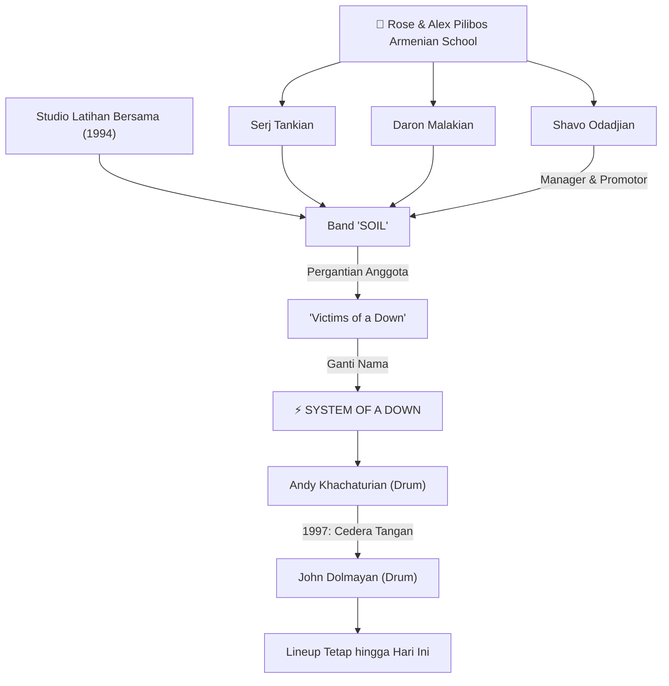
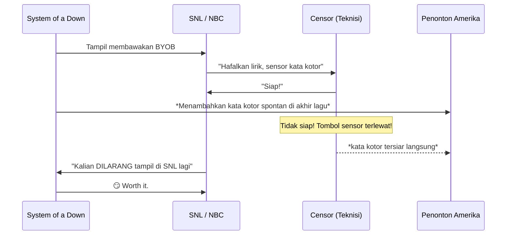
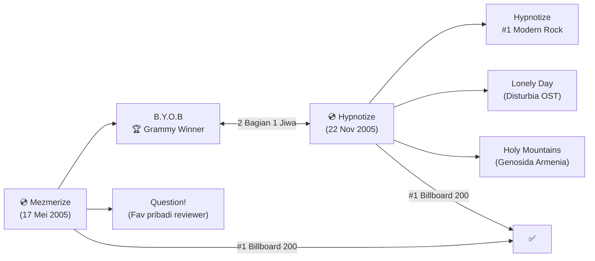
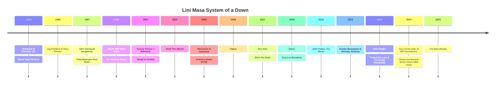

## 🧭 Pendahuluan: Suara dari Diaspora Armenia

Ada band metal, dan ada **System of a Down (SOAD)**. Keduanya adalah hal yang berbeda.

Terbentuk di Glendale, California pada tahun **1994**, System of a Down bukan sekadar sekumpulan musisi berbakat yang kebetulan bertemu. Mereka adalah produk dari sebuah komunitas — komunitas diaspora (*diaspora* = orang-orang yang tersebar jauh dari tanah kelahiran nenek moyang mereka) Armenia yang membawa serta kenangan, trauma, dan warisan budaya yang kaya ke dalam setiap nada dan lirik yang mereka ciptakan.

Empat pria yang membentuk band ini — **Serj Tankian** (vokal/kibor), **Daron Malakian** (gitar/vokal), **Shavo Odadjian** (bass), dan **John Dolmayan** (drum) — adalah alumni dari Rose and Alex Pilibos Armenian School di Los Angeles. Meski hanya Shavo yang lahir di Armenia, semuanya berakar kuat pada identitas dan budaya Armenia, dan inilah yang menjadikan musik mereka bukan hanya kencang dan brutal, tetapi juga penuh makna yang mendalam.

<Callout type="important" title="Misi yang Lebih Besar dari Musik">
System of a Down selalu menaruh misi di atas popularitas: mendorong dunia untuk mengakui **Genosida Armenia** (*Armenian Genocide*) — pembantaian lebih dari 1,5 juta orang Armenia oleh pemerintah Turki pada tahun 1915. Musik adalah senjata mereka. 🎸
</Callout>

---

## 🌱 Akar: Dari "Soil" hingga "System of a Down"

### Pertemuan Awal di Studio Latihan

Sebelum ada SOAD, ada sebuah band bernama **Soil**. Bukan *SOiL* yang terkenal dari tahun 1997, tapi sebuah proyek awal yang terdiri dari Serj Tankian, Daron Malakian, drummer Domingo Laranio, dan bassist Dave Hakopyan.

Shavo Odadjian, yang saat itu sudah berteman dengan Daron dari masa sekolah, melatih bandnya sendiri di studio yang sama. Karena belum ada tempat untuknya di band tersebut, Shavo diminta menjadi **manajer dan promotor** (*manajer* = pengelola urusan bisnis band; *promotor* = orang yang mengurus promosi dan penjadwalan acara) band.

Situasi berubah ketika Dave memutuskan untuk keluar, dan menyarankan agar Shavo mengisi posisi bassnya. Tak lama kemudian, drummer Domingo pun ikut hengkang. Alih-alih panik, ketiga orang yang tersisa — Serj, Daron, dan Shavo — melihat ini sebagai kesempatan untuk **memulai sesuatu yang baru**.

### Lahirnya Nama yang Legenda

Bersama drummer baru bernama **Ontronik "Andy" Khachaturian**, mereka awalnya sepakat untuk menggunakan nama **"Victims of a Down"** — diambil dari sebuah puisi karya Daron. Tapi Shavo melihat peluang yang lebih menarik.

> *"Saya mengusulkan 'System of a Down' karena namanya akan lebih mudah diingat, dan secara alfabetis akan diletakkan di rak CD lebih dekat dengan salah satu band favorit kami: **Slayer**."*
> — Shavo Odadjian

Ya, Anda tidak salah baca. Salah satu pertimbangan pemilihan nama band terbesar di dunia adalah agar CD mereka ditaruh berdekatan dengan Slayer di rak toko. Ini bukan lelucon.

---

## 🎸 Era Demo dan Konser Pertama (1995–1997)

Sebelum rekaman album pertama, SOAD merekam tidak kurang dari **lima demo tape** (*demo tape* = rekaman tidak resmi untuk memperkenalkan musik band kepada label rekaman dan fans).

| Demo | Tahun | Keterangan |
|------|-------|------------|
| Untitled 1995 Demo | 1995 | Tidak pernah dirilis resmi |
| Demo Tape 1 | Akhir 1995 | Versi awal lagu-lagu yang belakangan muncul di album |
| Demo Tape 2 | Mei 1996 | |
| Demo Tape 3 (versi 1) | Akhir 1996 | Dengan Andy Khachaturian |
| Demo Tape 3 (versi 2) | Awal 1997 | Dengan John Dolmayan (versi ini sangat mirip album debut) |

### Gig Pertama yang Menciptakan Kekacauan 🔥

Pada **28 Mei 1995**, SOAD tampil perdana di Roxy Theater, West Hollywood. Tanpa demo tape, mereka tetap berhasil menjual **150 tiket** kepada teman-teman mereka, membuat pemilik venue terkejut karena malam itu secara teknis adalah malam *ska* (genre musik asal Jamaika yang lebih ceria).

Begitu SOAD naik panggung, suasana berubah total: orang-orang bergelantungan di langit-langit, *mosh pit* (*mosh pit* = area di depan panggung tempat fans menari dengan cara saling bertumbukan) terbentuk spontan. Ayah Shavo yang hadir merekamnya dengan kamera.

> *"Setelah itu, sangat mudah bagi kami untuk mendapatkan jadwal pertunjukan. Tidak ada yang meminta demo, tidak ada yang meminta kami menjual tiket terlebih dahulu — mereka langsung memesan kami."*
> — Shavo Odadjian

---

## 💿 Debut Self-Titled (1998): Dunia Pertama Kali Mendengar

### Penandatanganan Kontrak dengan Rick Rubin

Setelah satu-satunya pergantian anggota — Andy digantikan **John Dolmayan** pada 1997 akibat cedera tangan — nasib baik mengetuk pintu. **Rick Rubin**, kepala American Recordings dan pendiri Def Jam Records, kebetulan menonton salah satu konser mereka di Viper Room dan terkejut melihat band sekaliber ini belum ditandatangani label rekaman manapun.

Rick menawarkan deal yang lebih baik dari Universal, dan SOAD menandatanganinya. Rekaman album debut dimulai pada awal 1998.

### Proses Rekaman yang Unik 🎙️

Album direkam di dua tempat: **Sound City Studios** (studio legendaris tempat Nirvana merekam *Nevermind*) dan mansion pribadi Rick Rubin. Karena ruang vokal di mansion tidak dirancang sebagai studio, mereka mendirikan tenda di tengah ruangan dan mengisi interiornya dengan furnitur antik.

Hasilnya? Suara yang raw (*raw* = mentah, belum terlalu banyak diproses secara digital), autentik, dan hidup.

### Lagu-Lagu Ikonik

Album yang dirilis **30 Juni 1998** ini terdiri dari 13 lagu dalam waktu 40 menit. Beberapa highlight:

- 🎵 **"Sugar":** Single pertama, sebuah komentar sosial tentang ketergantungan manusia pada hal-hal yang tidak baik untuknya (gula, narkoba, sistem).
- 🎵 **"Spiders":** Masuk soundtrack *Scream 3* dan game *Rock Band 4*.
- 🎵 **"P.L.U.C.K.":** Singkatan dari "Politically Lying, Unholy, Cowardly Killers" — dedikasi langsung untuk 1,5 juta korban Genosida Armenia. 🕯️

Album debut ini mungkin tidak langsung meledak di chart (*chart* = daftar peringkat penjualan album/lagu), hanya mencapai nomor 124 di Billboard 200. Tapi ini adalah fondasi yang kuat.

---

## 🏆 Toxicity (2001): Puncak Popularitas di Tengah Tragedi Dunia

### Proses yang Intens

Pada Maret 2001, SOAD masuk studio Cello Studios. Mereka merekam lebih dari **30 lagu**, lalu memangkasnya menjadi 14 lagu pilihan untuk album kedua mereka: **Toxicity**.

Salah satu fakta yang paling menakjubkan tentang sesi rekaman ini: Serj pernah direkam saat tubuhnya **tergantung terbalik** di alat olahraga milik Rick Rubin! Ini adalah upayanya untuk mendapatkan kualitas vokal yang unik dan berbeda.

Ada juga konflik yang hampir membubarkan band — hanya karena **satu baris lirik**. Serj ingin lirik di lagu "Needles" berbunyi *"Pull the tapeworm out of my ass"* sebagai metafora filosofis, sementara Daron dan Shavo merasa lirik itu tidak terdengar keren. Perdebatan ini hampir membuat band bubar.

<Callout type="quote" title="Serj tentang Kerentanan dalam Musik">
*"Saya suka menunjukkan kerentanan (*vulnerability* = sisi lemah, sisi manusiawi) dalam musik kami. Saya tidak keberatan menunjukkannya, karena sebagai seniman, Anda rentan bagaimanapun juga — baik Anda menunjukkannya atau tidak."*
</Callout>

### Rilis di Tanggal yang Tidak Terlupakan

Album dirilis **4 September 2001** dan langsung mengguncang dunia rock dan metal. Tapi satu minggu kemudian, dunia diguncang oleh tragedi yang jauh lebih besar.

Ketika kabar bahwa *Toxicity* mencapai **Nomor 1** di Billboard tiba, Shavo justru sedang menyaksikan siaran langsung bencana besar di Amerika di televisi. Mendengar kabar bahagia itu di tengah kesedihan nasional menciptakan perasaan yang sangat campur aduk.

> *"Sampai sekarang, kalau orang bertanya soal nomor satu itu — rasanya manis dan pahit sekaligus."*
> — Shavo Odadjian

### Insiden SNL: Meledakkan Sensor di TV Nasional 📺

Pada **7 Mei 2005**, SOAD tampil di Saturday Night Live (SNL) membawakan "B.Y.O.B." Sang teknisi siaran sudah hafal seluruh lirik lagu untuk keperluan sensor, tapi kemudian Daron secara spontan menambahkan sebuah kata kotor di akhir lagu yang tidak ada dalam naskah.

Kameraman menangkap wajah Daron tepat saat kata itu meluncur, dan disiarkan langsung ke jutaan penonton di separuh Amerika. SOAD langsung dilarang tampil di SNL sejak saat itu. Hingga artikel ini ditulis, mereka belum pernah kembali.

---

## 💿 Steal This Album! (2002): Melawan Pembajak dengan Cara Paling Keren

Sebelum *Toxicity* selesai dirilis, banyak lagu yang tidak masuk album tersebut **bocor ke internet** dan menyebar luas. Fans menyebutnya *"Toxicity II"*. Bahkan majalah *Alternative Press* yang sudah terbit selama 17 tahun sempat mereview lagu-lagu yang belum resmi ini.

Respons SOAD? Mereka **merilis sendiri** lagu-lagu tersebut dalam bentuk resmi — dan menamai album itu **"Steal This Album!"** (Curi Album Ini!) sebagai bentuk satir (*satir* = sindiran halus namun tajam) terhadap para pembajak dan sistem distribusi musik yang tidak sempurna.

<Callout type="tip" title="Fakta Unik Steal This Album!">
Album ini dikemas dalam plastik bening polos tanpa kredit apapun, menyerupai CD bajakan yang dibakar sendiri oleh fans. Lirik dan kredit lengkap bisa diakses via website resmi band atau dengan memasukkan CD ke drive komputer. 💿
</Callout>

---

## 🌟 Mezmerize & Hypnotize (2005): Dua Album Satu Jiwa

Setelah tiga tahun hening, SOAD kembali dengan bukan satu, tapi **dua album** yang dirilis dalam satu tahun: **Mezmerize** (17 Mei 2005) dan **Hypnotize** (22 November 2005). Keduanya dianggap sebagai dua bagian dari satu album ganda (*double album*).

### Dinamika Vokal yang Revolusioner

Jika sebelumnya Serj mendominasi vokal, di era ini Daron mengambil porsi jauh lebih besar. Suara Serj yang kuat dan operatik (*operatik* = bernada tinggi dan dramatis seperti penyanyi opera) berpadu dengan suara Daron yang lebih western dan kadang-kadang penuh teriakan. Harmoni keduanya menjadi **identitas utama** kedua album ini.

### B.Y.O.B. dan Grammy 🏆

Single pertama *Mezmerize*, **"B.Y.O.B." (Bring Your Own Bombs)**, menjadi lagu SOAD dengan chart tertinggi sepanjang masa, mencapai nomor 27 di Billboard. Lagu ini juga memenangkan **Grammy Award untuk Best Hard Rock Performance** — penghargaan yang sama sekali tidak pernah mereka bayangkan akan mereka raih.

Lagu ini adalah protes keras terhadap Perang Irak, dengan lirik yang tidak menyisakan ruang untuk interpretasi berbeda.

### Hypnotize: Magnum Opus Sejati

Album kedua dari duet ini, **Hypnotize**, debuted (*debuted* = pertama kali muncul) di **nomor 1 Billboard 200**. Single pertamanya, **"Hypnotize"**, mencapai nomor 1 di Billboard's Modern Rock Tracks — lagu internasional terbesar mereka.

*"Lonely Day"* bahkan masuk dalam soundtrack film thriller *Disturbia* (2007), sebuah reimajinasi modern dari film klasik Alfred Hitchcock.

---

## 😔 Hiatus (2006–2010): Ketika Kreativitas Bertabrakan

Setelah tur Ozzfest 2006, SOAD memasuki masa hiatus (*hiatus* = istirahat panjang, tidak aktif sebagai band). Akar masalahnya adalah **perbedaan kreatif** yang sudah lama membara.

Serj ingin kolaborasi yang lebih setara, tapi Daron — yang menganggap dirinya sebagai *primary songwriter* (penulis lagu utama) — cenderung mendominasi arah musik. Ketegangan yang sudah bertahun-tahun diredam akhirnya meledak.

### Proyek Solo Selama Hiatus

Alih-alih berdiam diri, masing-masing anggota aktif berkarya:

- 🎵 **Serj Tankian** → Album solo *Elect the Dead* (2007), debuted di nomor 4 Billboard 200!
- 🎸 **Daron Malakian** → **Scars on Broadway** — proyek yang terinspirasi dari David Bowie hingga Roxy Music.
- 🥁 **John Dolmayan** → Berencana membuat *These Grey Men*, proyek cover album.
- 🎸 **Shavo Odadjian** → **AcHoZen** bersama RZA dari Wu-Tang Clan.

---

## 🔥 Reunion dan Konser Bersejarah di Armenia (2011–2015)

### Kembali ke Panggung

Pada **29 November 2010**, SOAD mengumumkan akhir hiatus mereka. Mereka tidak akan merekam dulu, tapi mereka akan **bermain live** lagi. Tur reuni dimulai **10 Mei 2011** di Alberta, Kanada.

### Konser Paling Emosional: Yerevan, Armenia 🇦🇲

Tanggal **23 April 2015** akan selalu menjadi hari yang paling bersejarah dalam karir SOAD. Di **Republic Square, Yerevan, Armenia** — tanah leluhur mereka — band ini tampil **gratis** di hadapan **40.000 orang**, tepat pada tanggal peringatan ke-100 Genosida Armenia.

Konser berlangsung hampir **dua setengah jam** dengan hampir **40 lagu**. Di tengah hujan deras, fans tetap bertahan. Serj, Daron, Shavo, dan John sesekali berbicara dalam bahasa Armenia kepada penonton. Ada air mata. Ada teriakan haru.

> Seluruh konser ini tersedia di YouTube. Jika Anda penggemar SOAD, ini adalah tontonan wajib. 🎥

<Callout type="success" title="Konser Terbesar dalam Sejarah Band">
Konser Yerevan 2015 bukan sekadar pertunjukan musik — ini adalah **pernyataan politik dan budaya** yang paling kuat yang pernah dibuat SOAD: "Kami ada. Nenek moyang kami ada. Genosida itu nyata."
</Callout>

---

## 🆕 Kembali Merekam: "Protect the Land" & "Genocidal Humanoidz" (2020)

Selama 15 tahun, tidak ada album baru dari SOAD. Kemudian pada 2020, sesuatu yang besar memaksa keempat anggota untuk kembali ke studio.

Ketika **serangan terhadap Artsakh** (wilayah yang dihuni oleh orang-orang Armenia di Azerbaijan) terjadi di tengah pandemi COVID-19, John Dolmayan mengirim pesan singkat kepada anggota band lainnya: *"Kita harus melakukan sesuatu."*

Dua single dirilis sebagai **double A-side** (*double A-side* = dua lagu yang keduanya dianggap sebagai single utama, bukan hanya sisi A dan sisi B):

1. **"Protect the Land"** — Penghormatan kepada para pejuang yang mempertahankan tanah mereka.
2. **"Genocidal Humanoidz"** — Lagu paling agresif SOAD sejak lama: gabungan thrash metal, speed metal, dan bahkan *blastbeat* (*blastbeat* = teknik drum ekstrem di mana bass drum, snare, dan simbal dimainkan sangat cepat secara bersamaan, khas di black metal dan death metal). 🥁

Semua pendapatan digital dari kedua lagu ini disumbangkan ke **Armenia Fund**. Total donasi melebihi **$600.000**.

---

## 🤔 Konflik Internal: Mengapa Album Baru Tak Kunjung Tiba?

Meski keempat anggota masih saling menghormati, ada dua jenis konflik yang terus menghantui band ini:

### 1. Konflik Kreatif 🎵
Daron menganggap dirinya sebagai *primary songwriter* SOAD. Serj ingin peran yang lebih setara. Ketika mereka sempat bertemu pada 2015 untuk mencoba merekam album baru, Rick Rubin bahkan meragukan apakah lagu-lagu baru itu cukup kuat untuk menjadi comeback pertama setelah bertahun-tahun absen.

### 2. Konflik Politik 🗳️
Serj dan John berada di ujung yang berlawanan dalam spektrum politik Amerika. Pada 2019, pertengkaran mereka meletus secara terbuka di media sosial — sebuah ironi untuk sebuah band yang selama bertahun-tahun dikenal sebagai *"political metal band"*.

<Callout type="warning" title="Masa Depan yang Tidak Pasti">
Daron dalam sebuah wawancara Februari 2025 mengaku tidak yakin apakah ia masih ingin membuat album SOAD baru, mengingat sudah terlalu lama berlalu sejak *Mezmerize* dan *Hypnotize*. Tapi ia juga tidak pernah mengatakan "tidak" secara tegas. 🙏
</Callout>

---

## 🧩 Glosarium Istilah

| Istilah Asing | Arti dalam Bahasa Indonesia |
|:---|:---|
| **Demo Tape** | Rekaman tidak resmi untuk memperkenalkan musik kepada label rekaman |
| **Diaspora** | Orang-orang yang tinggal jauh dari tanah asal nenek moyang mereka |
| **Mosh Pit** | Area di depan panggung untuk menari dengan cara saling bertumbukan |
| **Double A-Side** | Dua lagu yang keduanya dianggap sebagai single utama |
| **Blastbeat** | Teknik drum super cepat: bass, snare, dan simbal dimainkan bersamaan |
| **Primary Songwriter** | Penulis lagu utama dalam sebuah band |
| **Hiatus** | Periode istirahat panjang band dari aktivitas rekaman/tur |
| **Raw** | Suara yang mentah, autentik, tidak terlalu diproses digital |
| **Operatik** | Gaya bernyanyi yang dramatis dan bernada tinggi seperti penyanyi opera |
| **Satir** | Sindiran tajam namun cerdas |
| **Chart** | Daftar peringkat penjualan lagu/album |

---

## ✨ Kesimpulan: Musik sebagai Perlawanan

System of a Down tidak pernah hanya tentang musik. Mereka adalah **suara dari sejarah yang terlupakan**, **kemarahan yang sah**, dan **cinta yang mendalam** terhadap sebuah bangsa yang hampir dihapus dari bumi.

Dari demo tape pertama di Los Angeles hingga konser bersejarah di tanah air nenek moyang mereka, SOAD telah membuktikan bahwa musik bisa sekaligus menjadi seni tertinggi *dan* alat perubahan sosial.

Apakah album baru akan hadir? Tidak ada yang tahu. Tapi satu hal yang pasti: selama ada ketidakadilan di dunia, akan selalu ada alasan bagi SOAD untuk bangkit kembali. 🏔️

<Callout type="quote" title="Serj Tankian tentang Identitas">
*"Saya adalah orang Amerika, saya adalah orang Armenia, dan saya adalah jiwa di planet ini yang tidak ingin mengidentifikasi diri dengan perbatasan atau bendera manapun."*
</Callout>

---
*Ditulis untuk BangunAI Blog. Tonton konser Yerevan 2015 di YouTube — ini adalah pengalaman yang wajib bagi siapapun yang peduli dengan sejarah dan musik.* 🛠️
