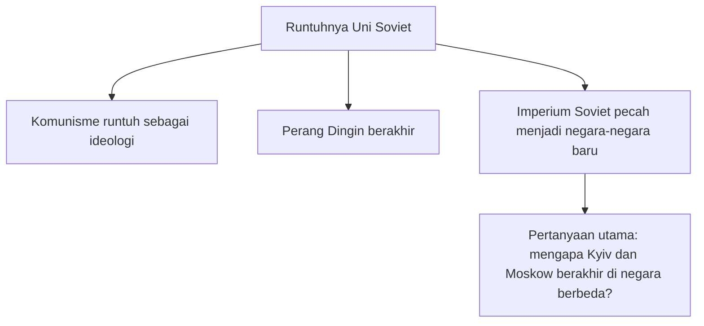
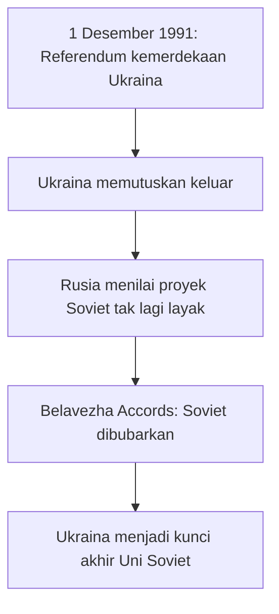
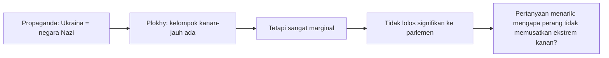
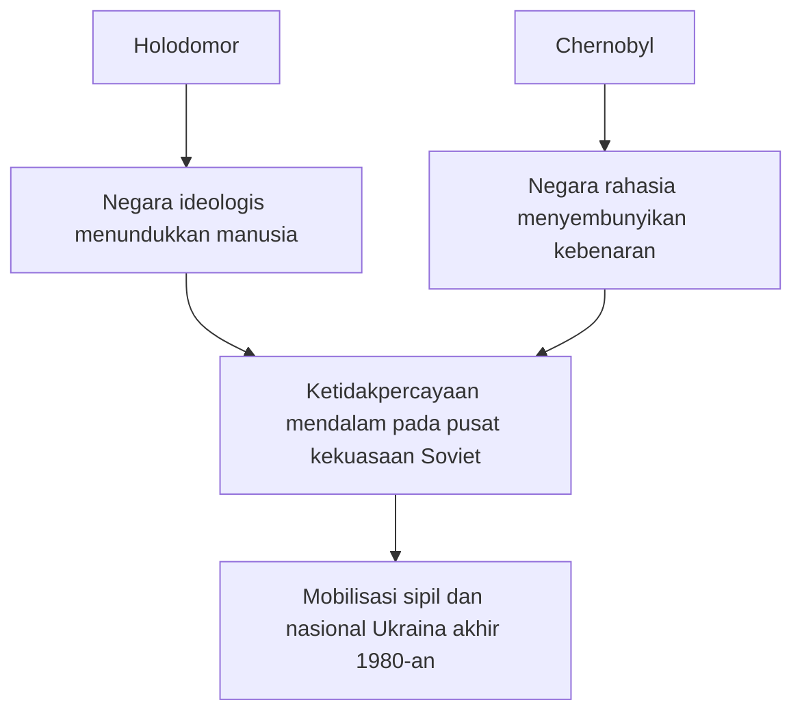

## 🎯 Pendahuluan: Untuk Memahami Perang Rusia-Ukraina, Kita Harus Berhenti Mengira Ini Cuma Soal Tahun 2022

Salah satu kesalahan terbesar dalam membaca perang Rusia-Ukraina adalah menganggap perang ini mulai pada Februari 2022, seolah dunia terbangun pada pagi itu lalu mendapati tank-tank Rusia mendadak bergerak ke Kyiv tanpa akar sejarah yang panjang. Padahal, seperti ditunjukkan oleh sejarawan **Serhii Plokhy**, perang ini bukan sekadar konflik dua negara bertetangga, melainkan bab terbaru dari kisah yang jauh lebih tua: **runtuhnya kekaisaran Rusia, lahirnya negara-negara baru, benturan antara identitas nasional dan proyek imperium, serta kembalinya sejarah yang selama beberapa dekade dikira telah selesai**. 🌍

Plokhy sangat berguna justru karena ia tidak membaca Ukraina dan Rusia hanya lewat lensa propaganda hari ini. Ia membaca keduanya melalui lapisan-lapisan waktu: dari **Kyivan Rus / Kievan Rus** — *Rus Kyiv*, formasi politik awal di abad pertengahan; dari naiknya Moskow setelah masa Mongol; dari proyek kekaisaran Rusia; dari revolusi 1917; dari Uni Soviet; dari Holodomor; dari Perang Dunia II; dari KGB; dari Chernobyl; dari runtuhnya Soviet tahun 1991; hingga jalur yang membawa kita ke 2014 dan 2022.

Di tangan Plokhy, satu hal menjadi sangat jelas: kalau kita hanya bertanya “siapa menyerang siapa?” kita hanya memahami permukaannya. Pertanyaan yang lebih dalam adalah:

- bagaimana Ukraina menjadi negara terpisah dari Rusia?
- mengapa Rusia terus sulit menerima kedaulatan Ukraina sebagai sesuatu yang final?
- mengapa Ukraina, meskipun dekat secara bahasa dan budaya dengan Rusia di banyak wilayahnya, justru berkembang menjadi masyarakat politik yang berbeda?
- mengapa narasi seperti *denazification* — **denazifikasi** — bisa terdengar absurd di luar Rusia, tetapi terasa efektif secara emosional di dalam Rusia?
- dan mengapa perang ini tampak begitu eksistensial bagi kedua pihak?

Plokhy juga mengingatkan bahwa keruntuhan Uni Soviet tidak boleh direduksi hanya menjadi kegagalan ideologi komunis. Itu terlalu sempit. Menurutnya, ada **tiga proses berbeda** yang sering dicampuradukkan orang:

1. **runtuhnya komunisme sebagai ideologi**,  
2. **berakhirnya Perang Dingin**,  
3. **pecahnya Uni Soviet sebagai negara / imperium**.  

Tiga proses ini memang saling terkait, tetapi tidak identik. Dan justru pada perbedaan itulah kita mulai memahami mengapa pertanyaan Ukraina menjadi begitu sentral. Karena kalau komunisme runtuh, Perang Dingin berakhir, dan Uni Soviet bubar, maka persoalan besarnya bukan cuma siapa menang secara ideologis — tetapi **mengapa Kyiv berakhir di negara yang berbeda dari Moskow**.

Itu bukan pertanyaan teknis. Itu pertanyaan yang menyentuh peta dunia, identitas bangsa, sejarah kekaisaran, dan mimpi-mimpi yang belum mati di kepala para elite Rusia. Maka artikel ini akan membedah gagasan-gagasan utama Plokhy secara runtut dan sangat mendalam: keruntuhan Soviet, sifat imperium Rusia, posisi Ukraina, Kievan Rus, nasionalisme Cossack, Bandera, propaganda Nazi, KGB, Holodomor, Chernobyl, NATO, Putin, Zelensky, hingga masa depan perang. Jika ada istilah asing, saya jelaskan padanan Indonesianya. Jika ada simpul sejarah yang rumit, saya uraikan konteksnya. Dan jika ada mitos yang terlalu sering dipakai untuk membenarkan kekerasan hari ini, kita akan mencoba membedahnya pelan-pelan. 🧠

<Callout type="important" title="Tesis utama artikel ini">
Perang Rusia-Ukraina bukanlah gangguan sementara dalam tatanan Eropa, melainkan salah satu episode kunci dari proses yang jauh lebih panjang: disintegrasi kekaisaran Rusia, lahirnya Ukraina sebagai negara politik modern, dan penolakan sebagian elite Rusia untuk menerima bahwa Ukraina dapat eksis secara berdaulat di luar orbit Moskow.
</Callout>

---

## 🧱 1. Runtuhnya Uni Soviet: Bukan Satu Peristiwa, tetapi Tiga Keruntuhan Sekaligus

Plokhy memulai dengan kritik yang sangat penting terhadap cara umum orang menjelaskan keruntuhan Uni Soviet. Menurutnya, terlalu banyak orang menggabungkan tiga proses berbeda ke dalam satu cerita tunggal. Mereka bicara seolah “komunisme gagal” lalu semuanya otomatis selesai. Bagi Plokhy, itu tidak cukup.

Mari kita uraikan satu per satu.

### a. Runtuhnya komunisme sebagai ideologi
Ini adalah kebangkrutan keyakinan bahwa komunisme Soviet mampu memberi arah masa depan yang meyakinkan. Di akhir 1980-an, ideologinya implosif — *meledak ke dalam*, kehilangan daya hidup dari pusatnya sendiri. Orang tidak lagi sungguh percaya pada retorika resmi partai sebagaimana dulu.

### b. Berakhirnya Perang Dingin
Ini adalah level geopolitik global. Uni Soviet kalah dalam kompetisi sistemik melawan Amerika Serikat dan blok Barat. Dari sisi ini, keruntuhan Soviet bisa dibaca sebagai kemenangan Barat dalam konflik bipolar abad ke-20.

### c. Bubarnya Uni Soviet sebagai negara / imperium
Nah, inilah yang menurut Plokhy paling sering disalahpahami. Bubarnya Soviet bukan sekadar kemenangan kapitalisme atas komunisme. Ini juga adalah **pecahnya sebuah imperium raksasa** yang selama beberapa generasi memayungi beragam bangsa, wilayah, bahasa, dan republik. Ketika negara itu pecah, pertanyaan utamanya berubah: bukan lagi “ideologi mana menang”, tetapi “mengapa sebagian wilayah tetap bersama Rusia, sementara sebagian lain menjadi negara terpisah?”

Bagi Plokhy, justru pertanyaan ketiga inilah yang paling penting untuk memahami Ukraina. Karena sejarah 1991 pada akhirnya adalah sejarah peta. Vasyl, St. Petersburg, Kyiv, Minsk, Tbilisi, Tallinn — semua tempat ini berada dalam konfigurasi baru. Jadi, kalau kita ingin jujur, keruntuhan Soviet bukan hanya kisah ideologi kalah. Ia juga kisah **geografi yang pecah**. 🗺️

---

## 🏛️ 2. Uni Soviet sebagai Imperium Terakhir: Mengapa Ukurannya Sendiri Mengungkap Hakikatnya?

Plokhy menyebut Uni Soviet sebagai kelanjutan dari disintegrasi **Imperium Rusia**. Ini argumen yang sangat penting. Menurutnya, Rusia / Soviet menguasai sekitar **seperenam permukaan bumi**. Anda tidak mencapai ukuran seperti itu sebagai negara-bangsa biasa. Ukuran seperti itu biasanya hanya bisa dicapai lewat **imperium** — kerajaan besar yang memperluas diri melalui penaklukan, integrasi paksa, asimilasi, dan struktur multi-etnis yang tidak setara.

Dengan demikian, 1991 bukan kejadian tiba-tiba, melainkan kelanjutan proses yang sebenarnya sudah dimulai sejak **1917**. Bolshevik memang sempat “menahan” atau “membekukan” disintegrasi imperium lama lewat ideologi internasionalis komunisme. Tetapi energi perpecahan itu tidak pernah sepenuhnya hilang. Ia kembali menguat pada akhir 1980-an dan awal 1990-an.

Di sini Plokhy mengaitkan Soviet dengan pola global yang lebih besar. Abad ke-20, menurutnya, pada level paling luas adalah abad **runtuhnya imperium-imperium besar**. Lihat saja:

- Austria-Hungaria pecah,  
- Kesultanan Utsmani runtuh,  
- Imperium kolonial Inggris menyusut,  
- Yugoslavia pecah,  
- Cekoslowakia bercerai secara damai,  
- dan Uni Soviet menjadi babak besar terakhir dari drama itu.  

Jadi ketika kita bicara tentang Ukraina hari ini, kita sebenarnya sedang melihat salah satu garis patah yang paling menentukan dari **imperial afterlife** — *kehidupan setelah kekaisaran*. Sisa-sisa imperium belum selesai beradaptasi dengan kenyataan bahwa wilayah-wilayah yang dulu dianggap “bagian organik” kini memilih jalan sendiri.

---

## 🇺🇸 3. Apakah Amerika Menjatuhkan Uni Soviet? Plokhy Menjawab: Tidak Sesederhana Itu

Salah satu narasi populer adalah bahwa Amerika Serikat, melalui Perang Dingin, tekanan ekonomi, perlombaan senjata, dan permainan intelijen, “menjatuhkan” Uni Soviet. Plokhy sangat hati-hati terhadap narasi ini. Ia tidak menyangkal bahwa tekanan Amerika adalah bagian penting dari konteks **Cold War** — *Perang Dingin*. Tetapi ia menolak menjadikannya penjelasan utama untuk **pecahnya Soviet sebagai negara**.

Mengapa? Karena menurutnya, Amerika sendiri **tidak menginginkan** Uni Soviet pecah begitu saja, setidaknya sampai sangat terlambat. Ini terdengar paradoks, tetapi masuk akal. Dari sudut pandang Washington, Soviet yang tetap utuh tetapi bisa dinegosiasikan oleh Gorbachev lebih mudah ditangani daripada ruang pasca-Soviet yang kacau, nuklir, dan penuh ketidakpastian.

Plokhy mengingatkan pidato George H. W. Bush di Kyiv pada 1991 — yang sering diejek sebagai **Chicken Kyiv speech** — di mana Bush justru memperingatkan Ukraina agar tidak tergesa menuju kemerdekaan. Amerika takut pada:

- kekacauan geopolitik,  
- pecahnya kontrol atas senjata nuklir,  
- hilangnya mitra seperti Gorbachev,  
- dan biaya strategis dari runtuhnya satu superpower secara tidak terkendali.  

Jadi, kalau ada mitologi politik Amerika yang mengklaim bahwa Washington secara sadar merancang disintegrasi Soviet, Plokhy menyuruh kita hati-hati. Tekanan Amerika membantu menciptakan konteks, tetapi **pecahnya Soviet menjadi negara-negara baru** lebih banyak ditentukan oleh dinamika internal imperium dan kebangkitan nasionalisme di republik-republiknya — termasuk di Rusia sendiri.

---

## 🇺🇦 4. Mengapa Ukraina Menjadi Kunci Runtuhnya Uni Soviet?

Di antara semua republik Soviet, Plokhy menempatkan **Ukraina** pada posisi yang sangat istimewa. Bukan sekadar salah satu faktor, tetapi **faktor penentu** dalam fase final runtuhnya Uni Soviet.

Argumennya sangat tajam dan sekaligus sederhana. Pada **1 Desember 1991**, Ukraina menggelar referendum. Pertanyaan formalnya bukan “apakah Anda ingin membubarkan Uni Soviet?”, melainkan apakah rakyat mendukung deklarasi kemerdekaan yang sudah dibuat parlemen Ukraina. Jawabannya: ya.

Seminggu kemudian, para pemimpin Rusia, Ukraina, dan Belarus secara resmi mengubur Uni Soviet.

Mengapa referendum Ukraina begitu menentukan? Karena, seperti dijelaskan Plokhy, bagi Boris Yeltsin dan elite Rusia saat itu, tanpa Ukraina proyek Soviet tidak lagi masuk akal. Ada beberapa alasan:

1. **Ukraina adalah republik terbesar kedua** dalam hal populasi dan ekonomi.  
2. **Secara budaya dan linguistik**, ia paling dekat dengan Rusia dibanding banyak republik lain.  
3. Tanpa Ukraina, Rusia akan merasa dirinya terlalu sendiri dan bisa “diimbangi” oleh republik-republik Muslim jika proyek persatuan diteruskan.  
4. Rusia juga sedang bangkrut dan tidak lagi sanggup secara ekonomi menopang imperium yang tersisa.  

Jadi, ketika Ukraina keluar, Rusia tidak lagi melihat nilai strategis mempertahankan proyek Soviet. Inilah mengapa bagi Plokhy, kalau kita ingin memahami 1991, kita harus melihat **referendum Ukraina sebagai titik patah utama**.

Dan implikasinya untuk hari ini juga sangat besar. Jika Ukraina begitu penting dalam membubarkan Uni Soviet, maka sangat masuk akal bila Ukraina juga menjadi sangat penting bagi siapa pun di Moskow yang ingin **membangun kembali suatu bentuk pengaruh pasca-Soviet**.

---

## 🧨 5. Bagi Putin, Mengapa Runtuhnya Soviet adalah “Bencana Geopolitik Terbesar”?

Plokhy membedah ucapan terkenal Vladimir Putin bahwa runtuhnya Uni Soviet adalah **“bencana geopolitik terbesar abad ke-20.”** Menurutnya, frasa ini sangat revealing — *membuka sesuatu yang tersembunyi* — tentang cara Putin memandang sejarah.

Yang paling penting: bagi Putin, tragedi terbesar itu **bukan hilangnya nyawa**, melainkan **hilangnya negara besar dan terpecahnya apa yang ia anggap sebagai “bangsa Rusia besar”**. Jadi ini bukan pembacaan humanis terhadap sejarah. Ini pembacaan **statist-imperial** — *berpusat pada negara dan kekuasaan imperium*.

Plokhy membaca di sini dua hal besar:

1. **kehilangan status superpower**,  
2. **pecahnya orang-orang yang dianggap satu bangsa ke dalam beberapa negara**.  

Dengan kata lain, bagi Putin, 1991 bukan terutama soal akhir totalitarianisme. Itu soal **kehilangan pusat**. Dan karena itu, banyak kebijakan Rusia kontemporer tidak bisa dibaca hanya sebagai kebijakan keamanan biasa. Mereka sering dibentuk oleh dorongan untuk **membalik atau setidaknya mengoreksi sebagian hasil 1991**.

---

## 🐎 6. Dari Kievan Rus ke Moskow: Mengapa Sejarah Abad Pertengahan Masih Diperebutkan di Medan Perang Modern?

Salah satu bagian paling penting dari percakapan Plokhy adalah penjelasannya tentang **asal-usul bangsa-bangsa Slavia Timur**: Rusia, Ukraina, dan Belarus. Ini penting karena Putin sering memakai sejarah sangat awal untuk membenarkan klaim modernnya.

Menurut Plokhy, wilayah asal etnis Slavia kemungkinan besar berada di sekitar **Pripyat marshes** — rawa-rawa Pripyat, di kawasan yang hari ini mencakup bagian Ukraina barat laut, Belarus selatan, dan Polandia timur. Dari sana, berbagai kelompok Slavia menyebar luas.

Tetapi untuk politik modern, yang paling penting adalah **Kievan Rus / Kyivan Rus**. Ini adalah formasi politik awal yang berbasis di Kyiv, berkembang melalui jaringan perdagangan Viking menuju Byzantium / Konstantinopel. Dalam dunia abad pertengahan, Kyiv adalah salah satu pusat politik besar, jauh sebelum Moskow menjadi penting.

Plokhy menekankan bahwa istilah **Rus** bukan berarti “Rusia” dalam arti modern. Rus adalah nama dunia politik dan budaya lebih awal yang kemudian diwarisi dan diperebutkan oleh beberapa tradisi nasional. Karena itu, ketika Rusia modern mengklaim dirinya sebagai pewaris tunggal Rus, Plokhy menganggapnya problematik. Ukraina juga punya klaim historis yang sangat kuat, justru karena **Kyiv adalah pusat asal simbolik itu sendiri**.

Inilah mengapa perdebatan soal Rus, Kyiv, dan Moskow bukan sekadar nostalgia akademik. Ia menyentuh inti persoalan: **siapa yang berhak mengklaim asal-usul politik Slavia Timur?** Dan ketika perang sedang berlangsung, perdebatan semacam ini berhenti menjadi perdebatan seminar. Ia berubah menjadi **senjata legitimasi**.

---

## 🏇 7. Cossack, “History of the Rus,” dan Kelahiran Imajinasi Kebangsaan Ukraina Modern

Plokhy lalu membahas teks anonim awal abad ke-19 bernama **History of the Rus**. Ini salah satu teks yang ia anggap sangat berpengaruh bagi lahirnya kesadaran kebangsaan Ukraina modern.

Apa isinya? Pada permukaan, teks ini tampak seperti pembelaan terhadap elite **Cossack** — *Kazaki*, kelompok militer-politik penting dalam sejarah Ukraina. Para penulisnya ingin menunjukkan bahwa elite Cossack berhak atas status setara dengan bangsawan Rusia di dalam kekaisaran.

Tetapi karena ditulis pada zaman **Romanticism / Romantisisme**, ketika ide-ide bangsa sedang menguat, argumen itu berubah bentuk. Dari klaim status elite, ia bergeser menjadi klaim bahwa Cossack — dan kemudian Ukraina — adalah **bangsa tersendiri**, bukan sekadar cabang lokal dari Rusia.

Inilah momen penting. Dalam kekaisaran, loyalitas biasanya dibangun dengan cara mengintegrasikan elite tanpa terlalu peduli bahasa atau budaya mereka. Tetapi ketika bahasa, sejarah, dan bangsa mulai menjadi dasar legitimasi, model integrasi imperium mulai goyah. Itulah yang terjadi di seluruh Eropa abad ke-19, dan menurut Plokhy, Ukraina masuk ke arus itu juga.

Jadi, **History of the Rus** penting bukan hanya sebagai buku, tetapi sebagai **jembatan antara mitologi Cossack dan nasionalisme modern Ukraina**. Ia mengubah kisah elite menjadi kisah bangsa. 📚

---

## 🔥 8. Stepan Bandera: Manusia Sejarah, Mitos Politik, dan Medan Tempur Propaganda

Tak ada topik Ukraina modern yang lebih penuh muatan emosional daripada **Stepan Bandera**. Plokhy sangat bijak ketika mengatakan bahwa ada **setidaknya dua Bandera**:

1. Bandera sebagai **orang nyata**,  
2. Bandera sebagai **mitologi politik**.  

Bandera yang nyata adalah aktivis nasionalis radikal dari wilayah Ukraina yang saat itu berada di bawah Polandia. Ia terlibat dalam pembunuhan politik dan menjadi tokoh pemuda yang sangat militan. Ia dipenjara oleh Polandia, lalu muncul kembali pada masa Perang Dunia II, bekerja sama dengan Jerman Nazi dalam harapan bahwa Jerman akan mengizinkan lahirnya negara Ukraina merdeka.

Tetapi Jerman tidak punya niat demikian. Ketika kelompok Bandera memproklamasikan kemerdekaan Ukraina di Lviv tanpa restu Berlin, Bandera justru ditangkap Jerman dan dipenjara di Sachsenhausen. Dua saudaranya tewas di Auschwitz. Ini membuat narasi propaganda yang terlalu sederhana — “Bandera = Nazi murni” — tidak cukup menjelaskan keseluruhan kenyataan historisnya.

Apakah ada kolaborasi dengan Nazi? **Ya**, jelas ada.  
Apakah ada pengaruh fasisme pada organisasinya? **Ya**, Plokhy menyatakan itu cukup jelas.  
Apakah itu membuat seluruh cerita Bandera identik satu banding satu dengan Nazisme? **Tidak sesederhana itu.**

Bandera kemudian menjadi simbol karena namanya menempel pada gerakan perlawanan anti-Soviet sesudah perang. Ia sendiri sering tidak ada secara fisik di Ukraina, tetapi mitos tentang dirinya hidup. Dan setelah 2022, popularitas mitologinya naik lagi, bukan terutama karena orang mendalami detail hidupnya, melainkan karena ia dipakai sebagai simbol **perlawanan terhadap Rusia**.

Di sini penting sekali membedakan antara:

- **mengkaji tokoh sejarah secara kritis**,  
- dengan **memakai tokoh itu sebagai simbol politik dalam kondisi perang**.  

Keduanya tidak sama. Dan propaganda Rusia memanfaatkan kekacauan ini dengan sangat efektif.

---

## 🪖 9. Apakah Ukraina Punya Masalah Neo-Nazi? Jawaban Plokhy: Ada, tetapi Marginal — dan Justru Itulah Pertanyaan Menariknya

Ini salah satu bagian paling penting secara politik kontemporer. Plokhy tidak berkata bahwa Ukraina steril total dari kelompok kanan radikal. Ia mengakui ada unsur seperti itu, seperti di banyak negara lain. Tetapi menurutnya, kekuatan mereka **sangat marginal**, bahkan lebih marginal dibanding beberapa negara Eropa Barat.

Ia menunjuk beberapa fakta penting:

- partai kanan-jauh Ukraina gagal menembus parlemen,  
- dalam pemilu 2019 suara mereka sangat kecil,  
- dan Ukraina justru memiliki presiden Yahudi, Volodymyr Zelensky, yang sangat populer.  

Bagi Plokhy, pertanyaan yang lebih menarik justru: **mengapa dalam kondisi perang, ketika nasionalisme ekstrem biasanya menguat, Ukraina justru tetap menjaga kanan radikal tetap kecil?**

Ini pertanyaan yang sangat tajam. Secara historis, perang memang sering mendorong kelompok ekstrem dari pinggiran ke pusat. Bandera dan OUN pada era Perang Dunia II adalah contohnya. Tetapi Ukraina kontemporer justru menunjukkan pola berbeda: perang malah memperkuat **political nation** — *bangsa politik*, yakni identitas kebangsaan berbasis kewargaan dan pengalaman bersama, bukan semata etnis murni.

Maka, menurut Plokhy, kalau mau membahas neo-Nazi di Ukraina, kita tidak boleh berhenti pada satu-dua simbol atau kasus propaganda. Kita harus melihat data komparatif, representasi parlementer, dan konteks sosial yang lebih luas.

---

## 🧠 10. “Denazification”: Mengapa Propaganda Ini Efektif di Rusia Meski Rapuh Secara Analitis?

Plokhy memberi penjelasan yang sangat tajam tentang istilah **denazification / denazifikasi** yang dipakai Putin. Menurutnya, ini efektif bukan karena kuat secara argumen, tetapi karena sangat kuat secara **mitologis dan emosional** di ruang pasca-Soviet, terutama Rusia.

Mengapa? Karena perang melawan Nazi dalam **Great Patriotic War** — *Perang Patriotik Raya* — adalah inti dari mitologi negara Rusia kontemporer. Begitu kata “Nazi”, “fasis”, atau “denazifikasi” dipakai, analisis rasional sering berhenti. Orang tidak lagi bertanya dengan tenang, “apa buktinya?” Mereka segera berpindah ke mode emosional: “kalau ini melawan Nazi, tentu kita benar.”

Plokhy menegaskan bahwa propaganda tidak harus berupa kebohongan total. Kadang ia hanya mengambil **satu fragmen nyata**, mengeluarkannya dari konteks, membesarkannya luar biasa, lalu menjadikannya keseluruhan cerita. Itulah yang terjadi pada figur Bandera, pada kasus veteran SS di parlemen Kanada, dan pada berbagai simbol sayap kanan lain.

Cara melawan propaganda seperti ini, menurut Plokhy, bukan dengan tenggelam ke dalam premis sempit yang disodorkannya, melainkan dengan **memperluas konteks**:

- bandingkan dengan negara lain,  
- lihat data pemilu,  
- lihat struktur parlemen,  
- lihat komposisi kepemimpinan,  
- lihat fakta lapangan di Ukraina.  

Jadi, respons terbaik terhadap propaganda bukan sekadar membantah satu slogan dengan slogan lain, tetapi **mengembalikan skala dan proporsi sejarah**.

---

## 🧥 11. Bohdan Stashynsky, KGB, dan Budaya Pembunuhan Politik Soviet

Plokhy juga menulis tentang **Bohdan Stashynsky**, agen KGB yang membunuh tokoh nasionalis Ukraina di pengasingan, termasuk Bandera. Kisah ini sangat dramatis dan juga sangat penting untuk memahami budaya KGB.

Stashynsky adalah pemuda desa yang direkrut secara koersif. Keluarganya terkait dengan gerakan bawah tanah anti-Soviet. Ia ditekan, dipaksa memilih antara kehancuran keluarganya atau menjadi informan. Setelah satu pengkhianatan, hidup lamanya praktis selesai. Maka **secret police / polisi rahasia** menjadi “keluarga” barunya.

Ia dilatih, dikirim ke Jerman Timur, lalu menjadi pembunuh profesional yang memakai **spray gun** — senjata semprot racun, inspirasi untuk novel James Bond *The Man with the Golden Gun*. Kisahnya luar biasa karena akhirnya ia membelot ke Barat. Dan pengakuannya di pengadilan membuktikan bahwa KGB memang berada di balik pembunuhan Bandera.

Mengapa kisah ini penting? Karena ia menunjukkan dua hal:

1. bagaimana negara totaliter mengubah orang biasa menjadi alat pembunuhan,  
2. bagaimana pembunuhan politik kemudian justru ikut memperbesar mitologi targetnya.  

Bandera mungkin mati di pengasingan, tetapi setelah KGB membunuhnya, ia justru memperoleh status martir yang lebih besar dalam memori politik tertentu.

---

## 🕶️ 12. KGB: Seberapa Besar Kekuatannya, dan Mengapa Penting untuk Memahami Putin?

Menurut Plokhy, untuk memahami Putin, kita harus memahami **budaya KGB**. KGB bukan sekadar CIA versi Soviet. Ia jauh lebih luas. Ia menggabungkan:

- pengawasan internal atas masyarakat,  
- kontra-intelijen,  
- operasi luar negeri,  
- bahkan pasukan penjaga perbatasan.  

Pada beberapa periode, terutama di bawah Yuri Andropov, KGB menjadi sangat kuat secara politik. Kepala KGB bisa masuk lingkaran pengambil keputusan tertinggi negara. Ini beda dengan CIA dalam sistem Amerika, yang fungsi utamanya memberi intelijen kepada pembuat kebijakan, bukan menjadi salah satu inti kekuasaan politik seperti di Soviet.

Plokhy menyebut bahwa budaya KGB dibentuk oleh:

- rasa bahwa mereka lebih tahu realitas daripada elite partai,  
- kebencian pada birokrat partai yang dianggap korup dan lemah,  
- frustrasi karena kadang dibatasi dalam tindakan,  
- dan keyakinan bahwa operasi, kerahasiaan, serta manipulasi adalah cara alami membaca dunia.  

Nah, ketika orang-orang seperti Putin naik ke Kremlin, mereka membawa budaya ini ke jantung negara. Artinya, kebijakan luar negeri, operasi rahasia, bahkan politik dalam negeri cenderung dibaca sebagai **operational planning** — *perencanaan operasi* — bukan deliberasi demokratis biasa.

Jadi bagi Plokhy, ada benang lurus antara KGB Soviet dan gaya negara Rusia modern: **negara yang melihat realitas sebagai operasi, lawan sebagai target, dan informasi sebagai alat kendali**.

---

## 🟧 13. 2004 dan 2013–2014: Mengapa Ukraina Berkali-kali Bergerak Melawan Otoritarianisme?

Untuk menjelaskan akar konflik modern, Plokhy menyoroti dua momen besar:

### a. Revolusi Oranye 2004
Ini adalah pemberontakan terhadap pemilu yang dianggap curang. Kandidat yang didukung Rusia ditolak oleh mobilisasi jalanan. Di sinilah muncul satu pernyataan sangat penting dalam sejarah politik Ukraina: **“Ukraine is not Russia”** — *Ukraina bukan Rusia*.

### b. Revolusi Dignity / Revolusi Martabat 2013–2014
Ini dimulai dari penolakan pemerintah Yanukovych menandatangani perjanjian asosiasi dengan Uni Eropa setelah sebelumnya menjanjikan itu selama setahun. Tetapi ledakannya terjadi ketika polisi memukuli mahasiswa di Kyiv. Saat itulah persoalan berubah dari soal geopolitik menjadi soal **martabat, hak warga, dan ketidakmauan tunduk pada kekuasaan sewenang-wenang**.

Plokhy menekankan bahwa dua revolusi ini memperlihatkan sesuatu yang sangat dalam tentang Ukraina: masyarakatnya berkali-kali menunjukkan resistensi terhadap bentuk-bentuk otoritarianisme yang di Rusia cenderung lebih mudah dipaksakan menjadi normal.

Dengan kata lain, beda Rusia-Ukraina bukan hanya bahasa atau etnis. Bedanya ada pada **political DNA** — *DNA politik*, pola historis kebiasaan masyarakat dalam berhubungan dengan negara. Ukraina berkali-kali membangun dirinya **melawan** negara yang menindas; Rusia lebih sering membayangkan identitasnya **melalui** negara yang kuat.

---

## ⚓ 14. Donbas dan Crimea: Mengapa Wilayah Ini Begitu Penting Secara Politik, Identitas, dan Ekonomi?

Plokhy menjelaskan Donbas bukan hanya dari segi etnis, tetapi juga dari segi ekonomi. Donbas adalah **rust belt** — *sabuk karat*, wilayah industri tua yang menua, penuh tambang dan metalurgi, yang dulu makmur tetapi kemudian mengalami stagnasi dan dislokasi sosial. Kawasan seperti ini secara historis sering lebih rentan terhadap manipulasi politik, nostalgia, dan permainan aktor eksternal.

Secara etno-linguistik, Donbas memang lebih banyak penutur Rusia dibanding banyak wilayah lain di Ukraina. Tetapi penting dicatat: itu **tidak otomatis** berarti wilayah itu sedang memberontak atau ditindas. Sebelum 2014, tidak ada gelombang besar mobilisasi separatis massal yang berdiri sendiri tanpa intervensi Rusia.

Crimea lebih kompleks lagi. Bagi Rusia, ia punya nilai:

- historis,  
- simbolik,  
- strategis militer,  
- dan emosional dalam imajinasi imperium.  

Tetapi bagi Plokhy, fakta dasarnya tetap ini: baik di Crimea maupun Donbas, faktor Rusia sebagai aktor eksternal sangat menentukan. Tanpa kehadiran militer dan intelijen Rusia, dinamika lokal itu tidak akan meledak dalam bentuk yang sama.

Jadi, bukan berarti tidak ada kerumitan lokal. Ada. Tetapi narasi bahwa Rusia sekadar “datang melindungi orang Rusia yang tertindas” tidak sesuai dengan bukti lapangan yang lebih luas.

---

## 🧾 15. NATO: Sebab Utama Perang, atau Dalih yang Kuat tapi Tidak Menjelaskan Inti Masalah?

Plokhy berbicara sangat jelas soal NATO. Ia tidak menyangkal bahwa NATO adalah bagian dari persepsi ancaman Rusia. Ia juga tidak menyangkal bahwa Rusia sejak lama sangat tidak suka ekspansi NATO. Tetapi menurutnya, menjadikan NATO sebagai **penjelasan utama** perang adalah keliru.

Ada beberapa alasan.

1. **Putin tahu Ukraina tidak akan segera masuk NATO.**  
   Bahkan setelah Bucharest Summit 2008, keanggotaan Ukraina praktis dibekukan oleh negara-negara Eropa seperti Jerman dan Prancis.  

2. **Jika NATO benar-benar ancaman utama, reaksi Rusia terhadap Finlandia seharusnya jauh lebih besar.**  
   Ketika Finlandia masuk NATO, panjang perbatasan Rusia-NATO justru melonjak drastis. Tetapi Rusia tidak memindahkan seluruh fokus militer ke sana.  

3. **Tulisan dan pidato Putin sendiri lebih banyak bicara tentang Rusia dan Ukraina, bukan NATO.**  
   Esai 2021 tentang “kesatuan historis Rusia dan Ukraina” berpusat pada identitas, sejarah, dan wilayah pasca-imperium.  

Karena itu, bagi Plokhy, NATO lebih tepat dipahami sebagai **pretext / dalih** dan faktor konteks, bukan inti terdalam penyebab perang. Akar terdalamnya tetap ada pada soal **imperium, identitas, dan penolakan menerima Ukraina sebagai negara berdaulat di luar sphere of influence / lingkup pengaruh Rusia**.

---

## 📜 16. Esai Putin 2021: Mengapa Teks Ini Sangat Penting untuk Membaca Perang?

Plokhy menganggap esai Putin tahun 2021 tentang “kesatuan historis Rusia dan Ukraina” sangat penting karena ia seperti manifesto. Argumen dasarnya sederhana tetapi sangat berbahaya: **Rusia dan Ukraina adalah satu bangsa**.

Plokhy menjelaskan bahwa ide ini bukan ciptaan baru Putin. Ia berasal dari tradisi kekaisaran Rusia abad ke-19, yang melihat:

- Great Russians — Rusia Besar,  
- Little Russians — Rusia Kecil / Ukraina,  
- White Russians — Rusia Putih / Belarus,  

sebagai cabang-cabang satu bangsa besar.

Menurut Plokhy, Bolshevik sebenarnya sebagian telah mematahkan narasi ini dengan mengakui republik nasional berbeda di dalam Soviet. Tetapi satu institusi yang tetap membawa warisan pra-Bolshevik adalah **Gereja Ortodoks Rusia**, yang terus mempertahankan imajinasi satu bangsa besar Ortodoks Rusia.

Ketika Putin menarik lagi ide ini di abad ke-21, ia pada dasarnya sedang menghidupkan kembali **bahasa imperium pra-1917**. Dan kalau Ukraina dianggap bukan bangsa sungguhan, melainkan cabang Rusia yang “tersesat”, maka invasi pun bisa dibayangkan bukan sebagai agresi ke negara lain, tetapi sebagai **“pengembalian” wilayah historis**. Di sinilah bahayanya.

---

## 🟦 17. Mengapa Ukraina dan Rusia, meski Dekat Secara Bahasa dan Budaya, Tetap Berbeda Secara Politik?

Plokhy memberi salah satu penjelasan paling indah dan paling penting di seluruh percakapan ini. Ya, Ukraina dan Rusia memang punya kedekatan:

- bahasa saling bersinggungan,  
- sejarah panjang bersama,  
- pertukaran budaya yang besar,  
- banyak warga Ukraina berbicara Rusia,  
- banyak kota Ukraina timur dan selatan sangat bilingual.  

Tetapi, katanya, kedekatan itu justru menutupi perbedaan yang sangat dalam. Dan perbedaan itu ada pada **hubungan masing-masing masyarakat dengan negara**.

### Rusia
Rusia membangun identitas nasionalnya melalui negara. Negara adalah pusat. Dan selama sebagian besar sejarahnya, negara itu berwajah imperium. Sulit membayangkan “Rusia” tanpa negara besar yang kuat.

### Ukraina
Ukraina justru lahir melawan negara-negara yang menguasainya. Ia dibentuk dari pengalaman hidup di bawah beberapa imperium berbeda. Karena itu, masyarakat Ukraina cenderung mengembangkan tradisi plural, negosiasi, dan pemberontakan terhadap otoritas yang dianggap terlalu menekan.

Jadi, menurut Plokhy, Rusia dan Ukraina mungkin dekat secara budaya, tetapi **berbeda dalam political habitus** — *kebiasaan historis politik*. Ini membantu menjelaskan mengapa respons terhadap kekuasaan represif di Kyiv bisa berbeda total dengan di Moskow.

---

## 🎭 18. Zelensky: Mengapa Komedian Ini Memilih Tetap Tinggal di Kyiv?

Salah satu bagian paling kuat dari wawancara ini adalah ketika Plokhy bicara tentang awal invasi 2022. Hampir semua orang mengira Kyiv akan jatuh cepat. Banyak yang menyarankan Zelensky membentuk pemerintahan pengasingan. Itu masuk akal. Tetapi Zelensky memilih tinggal.

Mengapa? Plokhy memberi dua dugaan yang sangat menarik.

### a. Ia sungguh percaya pada perannya
Bukan dalam arti teatrikal murahan, melainkan dalam arti bahwa jika ia presiden, maka tugasnya adalah **tetap di tempatnya sampai akhir**. Ada unsur kehormatan peran di sini.

### b. Ia sangat peka terhadap “audience”
Sebagai mantan entertainer, Zelensky punya kemampuan membaca suasana publik. Ia merasakan bahwa masyarakat Ukraina justru akan bersatu dalam momen itu, dan bahwa keberaniannya tinggal di Kyiv akan memantulkan dan memperkuat keberanian kolektif itu.

Plokhy menyebut para pembela Ukraina di saat-saat awal itu sebagai orang-orang “tidak masuk akal” dalam arti positif: mereka melakukan sesuatu yang secara kalkulasi realistis tampak mustahil, tetapi justru itulah yang mengubah sejarah.

---

## 🗳️ 19. Apakah Ukraina Bisa Tergelincir Menjadi Otoriter karena Perang? Plokhy: Mungkin, Tapi Itu Melawan Arus Besar Sejarah Ukraina

Plokhy sangat jujur: perang panjang selalu mengandung risiko sentralisasi kekuasaan, normalisasi keadaan darurat, dan penguatan logika otoriter. Ini berlaku di mana-mana. Ukraina tidak kebal.

Tetapi menurutnya, jika Ukraina bergeser total ke otoritarianisme atau kanan-jauh dominan, itu akan bertentangan dengan arus besar 30 tahun sejarah modernnya. Ukraina adalah negara yang justru bertahan sebagai demokrasi lebih lama dibanding banyak bekas republik Soviet lain. Nasionalisme radikal juga tetap minoritas.

Yang lebih menarik, menurut Plokhy, Ukraina modern sedang menjalani transformasi historis sangat penting: dari bangsa yang dulu sering jago memberontak tetapi gagal mempertahankan negara, menjadi bangsa yang mulai **mengidentifikasi diri dengan negara miliknya sendiri** dan berusaha menjadi **state builders** — *pembangun negara*, bukan hanya pemberontak sukses.

Ini poin yang sangat dalam. Dalam sejarah Ukraina, kebebasan sering direbut tetapi sulit dikelola. Sekarang, katanya, Ukraina sedang belajar mengelola kebebasan itu sebagai negara sungguhan.

---

## ☢️ 20. Holodomor, Chernobyl, dan Pelajaran Gelap tentang Ideologi, Negara, dan Kehidupan Manusia

Plokhy juga berbicara tentang dua tragedi besar Ukraina abad ke-20: **Holodomor** dan **Chernobyl**.

### Holodomor
Holodomor adalah kelaparan massal 1932–1934, hasil kombinasi collectivization / kolektivisasi paksa, pengambilan gandum secara brutal, dan kebijakan Stalin yang juga menekan budaya serta elite Ukraina. Plokhy melihatnya bukan sekadar bencana ekonomi, tetapi bagian dari usaha membungkam potensi nasional Ukraina di dalam Soviet.

Yang paling penting dalam refleksi Plokhy adalah ini: tragedi seperti Holodomor dan Holocaust menunjukkan bagaimana ideologi abad ke-20 bisa **mendevaluasi nilai kehidupan manusia**. Dalam nama utopia atau bangsa, jutaan nyawa bisa dianggap harga yang layak dibayar.

### Chernobyl
Chernobyl bagi Plokhy bukan sekadar kecelakaan reaktor. Ia adalah hasil dari:

- budaya rahasia Soviet,  
- sentralisasi berlebihan,  
- ketidakmampuan pejabat lokal mengambil keputusan independen,  
- dan kebiasaan sistem untuk menyembunyikan kebenaran dari warga.  

Menariknya, Plokhy melihat Chernobyl juga sebagai katalis politik. Mobilisasi publik Ukraina pada akhir Soviet tidak mula-mula dimulai dari slogan nasionalisme, tetapi dari seruan: **“katakan kebenaran tentang Chernobyl.”** Dari ekologisme, lahirlah nasionalisme sipil baru. 🌫️

---

## 🌐 21. Dunia Setelah Invasi 2022: Kembalinya Sejarah, Kembalinya Blok, dan Dunia yang Makin Mirip Perang Dingin

Di bagian penutup, Plokhy memberi pandangan luas tentang tatanan dunia. Menurutnya, kita sedang melihat **return of history** — *kembalinya sejarah*. Setelah 1991, banyak orang berpikir dunia akan makin datar, liberal, dan pasca-imperial. Tetapi perang ini menunjukkan bahwa sejarah kekaisaran, identitas, blok, dan zona pengaruh belum mati.

Ia melihat ada semacam kemiripan baru dengan Perang Dingin:

- Barat bangkit lagi sebagai blok,  
- Rusia berusaha membangun poros dengan China,  
- dunia bergerak menuju struktur lebih bipolar / multipolar yang tegang,  
- dan perang di Ukraina menjadi salah satu teater penentu susunan abad ke-21.  

Namun ada perbedaan besar juga: Rusia hari ini bukan Soviet lama. Ia lebih lemah secara ekonomi dan ideologis. Karena itu, menurut Plokhy, kisah jangka panjangnya mungkin tetap akan berakhir seperti kisah-kisah imperium lain: **disintegrasi, penataan ulang, dan kemunculan bentuk-bentuk politik baru**.

Tetapi seperti semua sejarawan yang jujur, ia membedakan antara jangka panjang dan besok pagi. Dalam jangka panjang, arah sejarah mungkin terlihat. Dalam jangka pendek, segala sesuatu tetap mahal, berdarah, dan tak pasti.

---

## 🧩 Kesimpulan: Ukraina Bukan Gangguan dalam Sejarah Rusia — Ukraina adalah Ujian Bagi Apakah Rusia Bisa Berhenti Menjadi Imperium

Kalau seluruh percakapan Serhii Plokhy ini kita ringkas ke dalam satu inti, maka intinya kira-kira begini: **pertanyaan Ukraina pada akhirnya adalah pertanyaan Rusia juga**. Apakah Rusia bisa menerima dunia di mana Kyiv tidak berada di bawah orbitnya? Apakah Rusia bisa hidup sebagai negara pasca-imperial biasa, bukan pusat dari “bangsa besar” yang harus disatukan kembali? Apakah ia bisa menerima bahwa kedekatan budaya tidak otomatis berarti subordinasi politik? 🧭

Bagi Ukraina, pertanyaannya juga sangat besar: apakah ia bisa mempertahankan dirinya sebagai negara demokratis, plural, dan berdaulat di tengah perang total, tekanan ekonomi, dan trauma kolektif? Plokhy tampaknya percaya itu mungkin, justru karena sejarah Ukraina modern telah berulang kali dibentuk oleh perjuangan melawan dominasi luar dan oleh kemampuan masyarakatnya untuk bangkit ketika dipaksa tunduk.

Yang sangat berharga dari Plokhy adalah ia tidak memberi kita dongeng sederhana. Ia tidak meromantisasi Ukraina secara naif, dan ia juga tidak menerima narasi Rusia apa adanya. Ia mengajak kita berpikir dalam skala besar: imperium, bahasa, bangsa, mitos, propaganda, ideologi, dan negara. Dengan kerangka seperti itu, kita mulai melihat bahwa perang ini bukan hanya soal tank, misil, dan garis depan. Ia adalah soal **peta mental**: siapa menganggap siapa satu bangsa, siapa menganggap siapa negara sah, dan siapa bersedia membunuh demi memaksakan jawaban atas pertanyaan itu.

Mungkin itulah sebabnya perang ini begitu brutal. Karena yang dipertaruhkan bukan hanya wilayah, tetapi **versi sejarah mana yang akan menang**. Apakah Ukraina adalah bangsa merdeka dengan sejarahnya sendiri? Ataukah ia hanya cabang Rusia yang “keliru” berbelok? Selama pertanyaan itu dijawab dengan misil, bukan politik, maka perang akan terus terasa eksistensial.

Tetapi jika benar Plokhy bahwa kita sedang menyaksikan babak akhir panjang dari runtuhnya satu imperium besar, maka sejarah punya arah yang keras namun jelas: **imperium mungkin bisa menunda, menghukum, dan merusak, tetapi pada akhirnya ia sulit menghapus bangsa yang sudah menemukan negara politiknya sendiri**. Dan justru karena itu, Ukraina hari ini bukan cuma sedang bertahan hidup. Ia sedang menentukan apakah pecahnya Uni Soviet pada 1991 benar-benar final — atau baru jeda sebelum imperium mencoba datang kembali. 🕯️

<Callout type="cite" title="Sumber utama artikel">
Artikel ini disusun berdasarkan percakapan Lex Fridman Podcast #415 bersama Serhii Plokhy, sejarawan Harvard dan direktur Harvard Ukrainian Research Institute, dengan fokus pada runtuhnya Uni Soviet, sejarah Ukraina-Rusia, Bandera, KGB, Holodomor, Chernobyl, NATO, Putin, dan perang Rusia-Ukraina kontemporer.
</Callout>
