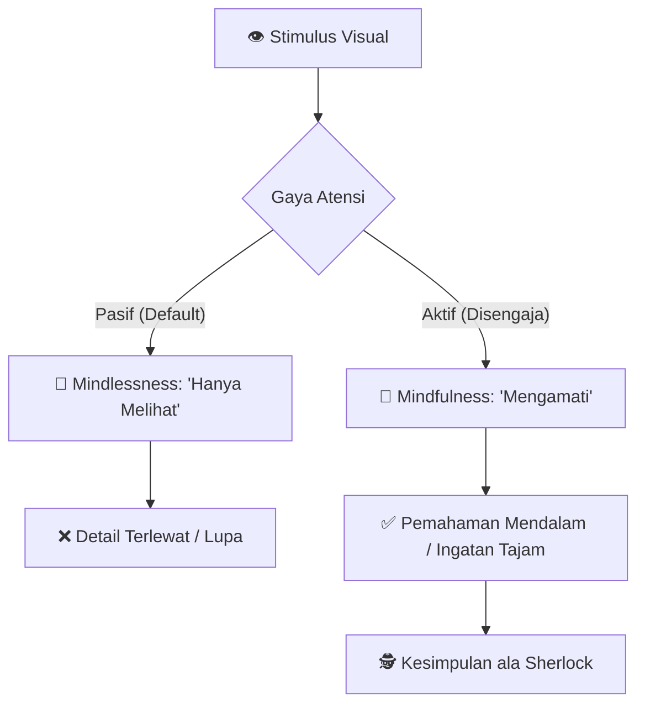
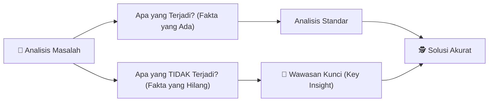

## 🧭 Pendahuluan: Apakah Anda Benar-Benar Melihat?

Pernahkah Anda bertanya-tanya mengapa **Sherlock Holmes** bisa mengetahui seluruh riwayat hidup seseorang hanya dengan sekali lirik? Apakah itu sihir? Ataukah dia memang seorang pembaca pikiran (*mind reader*)? 🧠

Dalam sebuah ceramah yang memukau, **Maria Konnikova**, penulis buku *Mastermind: How to Think Like Sherlock Holmes*, menjelaskan bahwa rahasia Holmes bukanlah kekuatan supranatural. Rahasianya terletak pada dua hal yang sering kita abaikan di dunia modern yang serba cepat ini: **Mindfulness** (*kesadaran penuh*) dan **Observasi Mendalam**.

Maria memulai dengan sebuah trik matematika sederhana yang membuat audiens terpana. Dengan meminta audiens memilih angka, melakukan operasi matematika, dan membayangkan negara serta hewan, ia berhasil menebak bahwa mayoritas audiens memikirkan **Gajah Abu-abu dari Denmark**. 🐘🇩🇰

Trik ini bukan sihir, melainkan pemahaman tentang bagaimana otak manusia cenderung mengambil jalur yang paling mudah tersedia (*availability heuristic*). Dan itulah langkah pertama untuk mulai berpikir seperti sang detektif dari Baker Street.

---

## 🪜 Misteri Angka 17: Melihat vs Mengamati

Salah satu kutipan paling terkenal dari Sir Arthur Conan Doyle ada dalam cerita *A Scandal in Bohemia*. Holmes bertanya pada Watson, "Berapa banyak anak tangga yang menuju ke pintu depan kita?" Watson, meski melewatinya setiap hari, tidak tahu. Holmes menjawab, "Ada tepat **17**."

> *"You see, but you do not observe. The distinction is clear."*
> — Sherlock Holmes 🔍

### Apa Perbedaannya?

Maria menjelaskan perbedaan ini melalui kacamata psikologi kognitif:

1.  **Seeing (Melihat):** Keadaan *mindlessness* (tanpa sadar). Kita memproses visual secara pasif tanpa benar-benar mencerna detailnya. Otak berada dalam mode *default* yang malas.
2.  **Observing (Mengamati):** Keadaan **Mindfulness** (kesadaran penuh). Ini adalah atensi aktif. Kita secara sengaja mengarahkan fokus untuk menangkap detail, pola, dan anomali.

---

## 🏚️ Loteng Pikiran (The Mind Attic)

Maria menggunakan metafora "Loteng Pikiran" (*Mind Attic*) untuk menjelaskan bagaimana kita menyimpan informasi. Bayangkan otak Anda adalah sebuah loteng kosong saat Anda lahir.

-   **Loteng Si Bodoh:** Orang yang memasukkan apa saja ke dalam lotengnya tanpa disaring. Saat dia butuh mencari sesuatu, lotengnya berantakan, bau, dan dia tidak bisa menemukan apa pun. 📦🗑️
-   **Loteng Si Pintar:** Orang yang sangat selektif. Dia hanya memasukkan "perabotan" (informasi) yang berguna, menatanya dengan rapi, dan menghubungkannya dengan perabotan yang sudah ada.

### Cara Menata Loteng Pikiran agar Efektif:

-   **Encoding (Pengodean):** Saat memasukkan informasi baru, hubungkan dengan memori yang sudah ada. Gunakan seluruh indra (bau, perasaan, penglihatan). 👃👂
-   **Motivation to Remember:** Kita cenderung lebih ingat jika kita *ingin* atau *butuh* mengingatnya sejak awal.
-   **Outsourcing ke Google:** Maria menyebutkan **Google Effect**. Otak kita sekarang cenderung tidak mengingat "apa" informasinya, tapi "di mana" mencari informasi tersebut. Ini bisa membebaskan ruang di loteng kita, asalkan kita sadar mana yang perlu disimpan di dalam otak dan mana yang cukup di-bookmark. 🌐

---

## 🚫 Mitos Multitasking

Satu pesan keras dari Maria: **Multitasking itu mitos!** 🙅‍♂️

Otak manusia secara biologis tidak bisa melakukan dua tugas kognitif berat sekaligus. Yang terjadi sebenarnya adalah **Task Switching** (beralih tugas) secara sangat cepat.

### Bahaya Task Switching:
-   **Inattentional Blindness:** Ketidaksadaran akan hal yang ada di depan mata karena fokus terbagi. Contoh: Pengendara sepeda yang menelepon mungkin tidak melihat mobil di depannya meskipun matanya terbuka. 🚲🚗
-   **Penurunan Kebahagiaan:** Penelitian Dan Gilbert (Harvard) menunjukkan bahwa pikiran yang mengembara (*mind-wandering*) membuat orang tidak bahagia. Kita paling bahagia saat kita *present* (hadir sepenuhnya) di momen sekarang, seberapa pun membosankannya tugas tersebut.

---

## 🧠 Latihan 10 Menit: Menjadi Lebih Cerdas dan Bahagia

Kabar baiknya, Anda bisa melatih otak Anda menjadi seperti Holmes hanya dengan **10 menit sehari**.

**Caranya? Meditasi Mindfulness.** 🧘‍♂️

1.  Duduk diam dan tutup mata.
2.  Fokuskan seluruh perhatian pada napas (masuk dan keluar).
3.  Jika pikiran mengembara, sadari, lalu tarik kembali dengan lembut ke napas.

### Manfaat yang Terbukti Secara Sains (dalam 2 minggu):
-   **Kreativitas Meningkat:** Mampu memecahkan masalah yang sebelumnya macet.
-   **Fokus Tajam:** Menyelesaikan tugas lebih cepat (studi menunjukkan pekerja kantor bisa menyelesaikan tugas 2 jam dalam 40 menit setelah latihan ini). ⚡
-   **Visi Lebih Luas:** Saat bahagia dan tenang, field of vision (*bidang pandang*) mata kita secara fisik melebar.

---

## 🎻 Masalah "Tiga Pipa" dan Kekuatan Imajinasi

Dalam cerita *The Red-Headed League*, Holmes tidak langsung berlari ke TKP. Dia duduk di kursinya dan merokok tiga pipa (*three-pipe problem*) untuk berpikir.

Artinya: **Ambil jarak.** 🛑

Seringkali kita terlalu terburu-buru bertindak. Holmes mengajarkan kita untuk mundur sejenak, membiarkan imajinasi memproses semua kemungkinan. Maria menunjukkan berbagai **Ilusi Optik** (seperti gambar Gadis Muda/Wanita Tua atau Kelinci/Bebek) untuk membuktikan bahwa mata kita sering berbohong jika kita hanya melihat sekilas.

### Cara Mendorong Imajinasi ala Modern:
-   **Jalan-jalan di Alam:** Berada di lingkungan hijau/biru terbukti meningkatkan kemampuan problem-solving. 🌳🌊
-   **Screensaver Alam:** Jika tidak bisa keluar, melihat gambar alam di layar pun memberikan sedikit dorongan kreatif.
-   **Efek Jas Putih (Enclothed Cognition):** Memakai pakaian tertentu (seperti jas dokter) bisa memicu otak untuk berpikir lebih teliti karena asosiasi psikologisnya. 🥼

---

## 🐕 Anjing yang Tidak Menggonggong

Dalam kasus *Silver Blaze*, kunci misterinya adalah "anjing yang tidak menggonggong di malam hari". Mengapa? Karena itu berarti si pencuri adalah orang yang dikenal anjing tersebut.

Kebanyakan orang hanya melihat **Positive Space** (apa yang ada). Detektif hebat melihat **Negative Space** (apa yang *seharusnya* ada tapi tidak ada). Ini disebut menghindari **Omission Neglect** (pengabaian hal yang terlewat). 🐾🚫

---

## ✨ Kesimpulan: Belajar Adalah Permainan

Sherlock Holmes tidak pernah berhenti belajar. Baginya, berpikir adalah sebuah permainan (*The game is afoot!*). 🕵️‍♂️

Otak kita memiliki **Neuroplastisitas** — kemampuan untuk terus berubah dan membentuk koneksi baru sepanjang hayat. Orang dewasa yang belajar juggling atau bahasa baru akan melihat perubahan nyata pada struktur otaknya.

**Pesan Maria Konnikova sederhana:**
Jangan hanya lewat di hidup ini. Berhentilah sejenak, perhatikan anak tangga itu, rasakan napas Anda, dan bersihkan loteng pikiran Anda. Dunia ini jauh lebih menarik jika Anda benar-benar mengamatinya.

---

## 🧩 Glosarium Istilah

| Istilah Asing | Arti / Penjelasan dalam Bahasa Indonesia |
|:---|:---|
| **Mindfulness** | Kesadaran penuh; hadir sepenuhnya di momen saat ini. |
| **Availability Heuristic** | Kecenderungan otak mengambil info yang paling mudah diingat/tersedia. |
| **Mind Attic** | Loteng Pikiran; metafora cara otak menyimpan informasi. |
| **Inattentional Blindness** | Kebutaan karena kurangnya perhatian terhadap objek di depan mata. |
| **Task Switching** | Proses beralih dari satu tugas ke tugas lain (bukan multitasking). |
| **Encoding** | Proses memasukkan dan memberi kode pada informasi di memori. |
| **Omission Neglect** | Kegagalan menyadari informasi atau detail yang hilang/tidak ada. |
| **Neuroplasticity** | Kemampuan otak untuk berubah dan beradaptasi secara fisik. |

---
*Ditulis untuk BangunAI Blog berdasarkan pemikiran Maria Konnikova. Mari mulai menata loteng pikiran kita hari ini!* 🛠️
