## 🔍 Pendahuluan: Ketika Adaptasi Terbaik Menjadi yang Terburuk

Sherlock Holmes adalah salah satu karakter paling ikonik dalam kanon sastra Barat (*Western Canon* — koleksi karya-karya besar peradaban Barat). Ia lahir dari pena **Sir Arthur Conan Doyle** antara tahun 1891 hingga 1927, tampil dalam puluhan dan puluhan cerita, dan hingga hari ini terus hidup sebagai ikon budaya pop yang tak tergoyahkan.

Faktanya, karakter Sherlock Holmes adalah **karakter fiksi yang paling banyak diadaptasi di seluruh sejarah**, hanya kalah dari Yesus Kristus. Ia telah difilmkan, dianimasikan, dirangkum ulang, dan direferensikan lebih dari karakter fiksi manapun yang pernah ada. Jika kamu menaruh topi, mantel, dan pipa pada boneka beruang dan memajangnya di etalase toko — orang-orang akan langsung mengenalinya sebagai Sherlock.

Di era modern, ada dua adaptasi televisi aktif yang paling banyak dibicarakan:
- **Elementary** (CBS, Amerika) — diceritakan seperti *police procedural* (*drama investigasi polisi*), dengan Dr. Joan Watson yang diperankan oleh Lucy Liu. Sebuah serial yang solid dan nyaman ditonton.
- **Sherlock** (BBC, Inggris) — sebuah serial yang diproduksi secara berlebihan (*over-produced*), ditulis secara berlebihan (*over-written*), dan pada akhirnya... **adalah tumpukan sampah paling mahal dalam sejarah televisi Inggris**.

Pertanyaannya: *mengapa?* Mengapa serial yang begitu populer — yang membuat jutaan orang jatuh cinta pada musim pertama dan kedua — bisa berakhir begitu mengerikan sehingga fansnya sendiri berteori bahwa musim keempat yang buruk itu pasti adalah *fake-out* yang disengaja?

Inilah analisis mendalamnya. 🧐

---

## 📺 Mengenal Stephen Moffat — Penulis di Balik Kehancuran

### Bukan Penulis Buruk... Tapi Showrunner yang Mengerikan

Untuk memahami mengapa Sherlock gagal, kita harus memahami terlebih dahulu siapa **Stephen Moffat** — *showrunner* (*kepala penulis sekaligus produser eksekutif*) sekaligus penulis utamanya.

Moffat lahir tahun 1961 di Paisley, Skotlandia. Dan adil untuk dikatakan bahwa ia bukanlah penulis yang buruk. Sebaliknya — ia **pernah** menjadi penulis yang sangat baik:

- Ia menulis **Coupling** — sebuah sitkom romantis yang eksperimental, kreatif, dan genuinly (*benar-benar*) lucu. Secara longgar berdasarkan kisah bagaimana ia bertemu istrinya.
- Ia menulis beberapa episode **Doctor Who** terbaik yang dicintai oleh basis penggemarnya, memenangkan penghargaan Hugo dan BAFTA. Termasuk **"Blink"** — secara luas dianggap sebagai salah satu episode Doctor Who terbaik sepanjang masa, di mana ia hanya punya anggaran kecil namun menciptakan momen paling menegangkan dalam sejarah serial tersebut.
- Ia menulis **"The Empty Child"** — sebuah dua episode yang brilian tentang London di masa Perang Dunia II, dengan resolusi yang memuaskan dan penulisan karakter yang kuat.

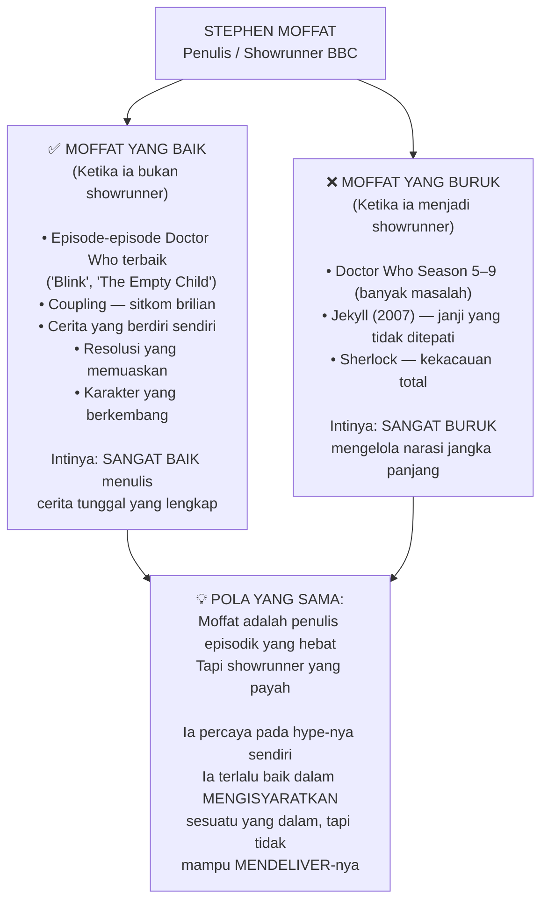

### Kasus Jekyll (2007) — Blueprint Kegagalannya

Sebelum Sherlock, Moffat sudah membuktikan polanya dengan **Jekyll** (2007) — adaptasi/sekuel dari *The Strange Case of Dr. Jekyll and Mr. Hyde*.

Jekyll memiliki **pilot yang sangat kuat**: *in media res* (*langsung masuk ke tengah cerita tanpa penjelasan awal*), tidak membuang waktu menjelaskan backstory yang tidak perlu, dan berhasil membuat penonton penasaran dengan karakter Jackman dan Hyde-nya.

Tapi setelah episode pertama, semuanya runtuh:

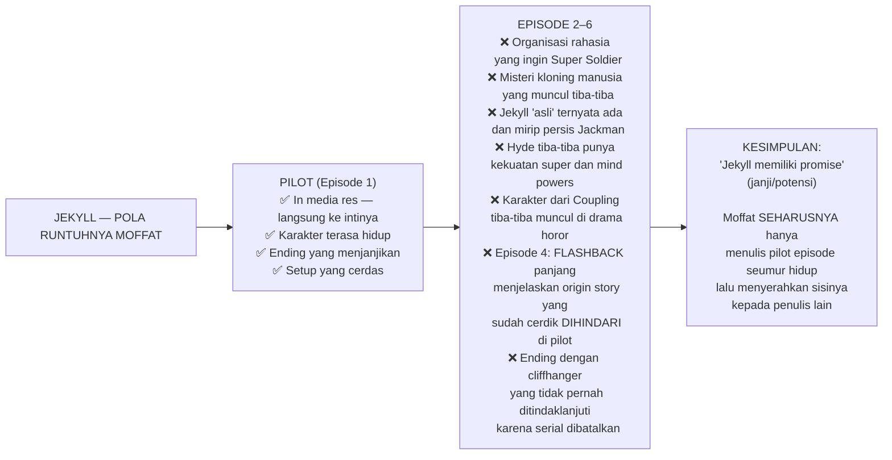

Inilah pola yang akan berulang secara sempurna — dan jauh lebih besar — di Sherlock.

---

## 📚 Apa yang Membuat Cerita Sherlock Holmes Asli Begitu Hebat

Sebelum membedah kegagalan BBC Sherlock, kita perlu memahami **mengapa cerita asli Conan Doyle begitu populer** dan apa esensi yang membuatnya abadi.

### Kunci Pertama: Format Episodik yang Mandiri

Cerita-cerita asli Sherlock Holmes berdiri sendiri (*self-contained*). Terlepas dari beberapa referensi kecil tentang kejadian lain atau tahun berlakunya cerita, **tidak ada yang menghubungkan cerita-cerita Holmes satu sama lain sebagai narasi tunggal**.

Holmes dan Watson juga tidak banyak berubah sebagai karakter dari satu cerita ke cerita lainnya.

Ini sangat menguntungkan karena:

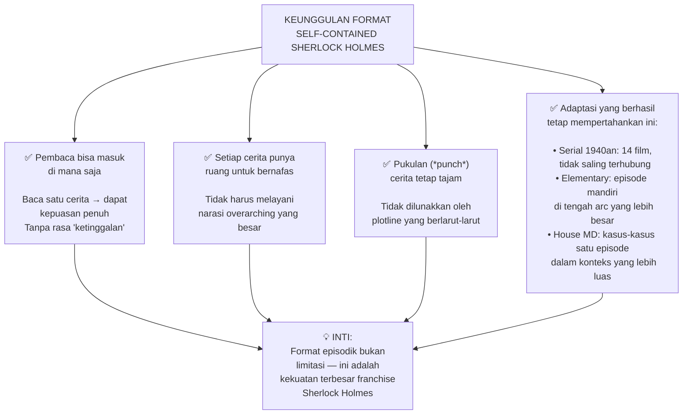

### Kunci Kedua: Deduksi yang Bisa Diikuti Pembaca

Yang membuat cerita Holmes *menyenangkan* bukan hanya bahwa Holmes cerdas — tapi bahwa **pembaca diberikan cukup informasi untuk mencoba menyimpulkan sendiri** sebelum Holmes menjelaskan jawabannya.

Contoh klasik dari cerita asli *A Study in Scarlet* (Kajian dalam Warna Merah):

Di TKP, Holmes memperhatikan tulisan darah "RACHE" di dinding. Sementara Lestrade berasumsi itu berarti "Rachel", Holmes mengamati **dari posisi tulisan di dinding** bahwa tinggi badan penulisnya sekitar sekian sentimeter. Ini adalah informasi **nyata** yang bisa diterapkan di kehidupan nyata — cara mengetahui tinggi badan seseorang berdasarkan cara natural mereka menulis di dinding.

> *"Ketika kamu membaca cerita Holmes, kamu merasa sedikit lebih pintar. Seperti kamu secara pribadi merasakan manfaat dari cara memandang dunia tertentu."*

---

## 🔥 Bagaimana BBC Sherlock Menghancurkan Semua Itu

### Masalah Utama #1: Obsesi terhadap Moriarty

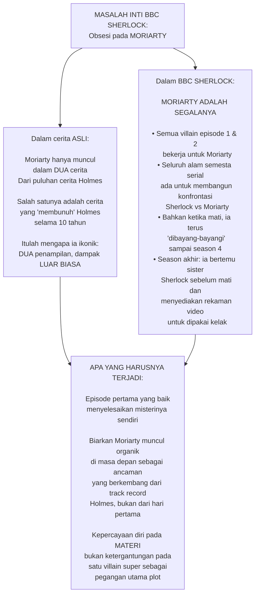

**Mengapa ini masalah besar?** Karena dua hal:

1. **Kurangnya pemahaman** tentang apa yang membuat materi asli bekerja
2. **Kurangnya kepercayaan diri** pada materi sendiri

Para kreator mengambil serial yang terkenal justru karena pembaca bisa membacanya dalam urutan apapun, dan mengubahnya menjadi **slog yang terus-menerus** (*perjalanan melelahkan yang tidak berujung*) yang menggambarkan pertempuran besar di mana sebagian besar karakter yang kita lihat tidak memiliki pengaruh nyata.

*"A Scandal in Bohemia tidak akan menjadi lebih baik dengan menjadi bagian dari pertempuran intelektual panjang antara Sherlock dan supervillain gay. Jadi Arthur Conan Doyle tidak melakukan itu — dan sebaliknya fokus menulis salah satu kisah misteri paling populer dan memikat dalam seluruh kanon Barat."*

### Masalah Utama #2: Sherlock Terlalu Spesial

Satu hal yang selalu dilakukan Moffat — baik di Doctor Who maupun di Sherlock — adalah membuat karakter utamanya **terlalu penting, terlalu spesial, terlalu kuat**.

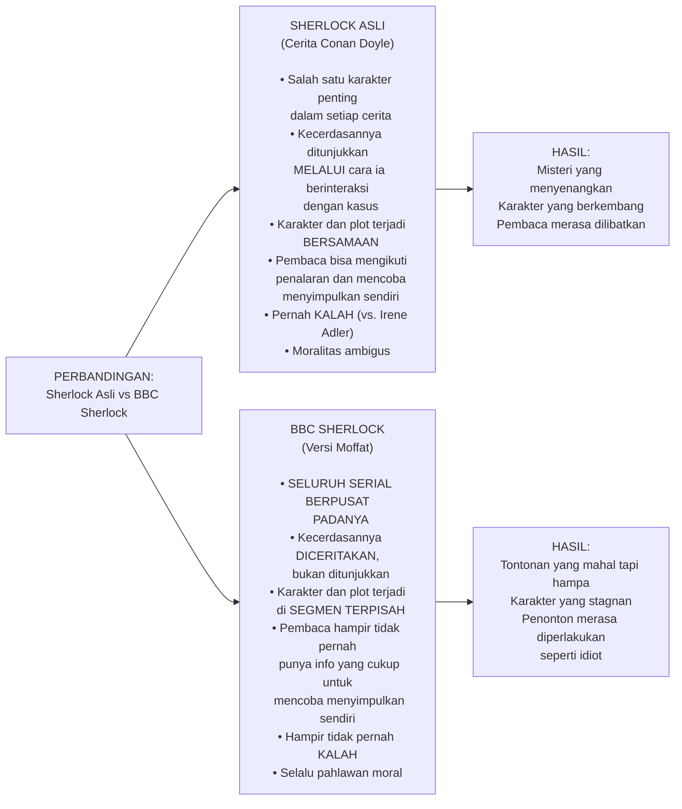

Contoh konkret: Dalam episode 3, serial ini menghabiskan beberapa menit dan anggaran yang cukup besar hanya untuk lelucon tentang betapa aneh dan tidak berperasaannya Sherlock — sementara Lestrade sedang bersiap menangkap seseorang yang jelas sudah lama menjadi masalah baginya.

*"Mereka seharusnya cukup membuat Sherlock kasar dan tidak berperasaan dalam ALUR CERITA episode itu sendiri. Tidak perlu segmen tersendiri."*

### Masalah Utama #3: Deduksi yang Bukan Deduksi

Ini adalah inti dari kegagalan BBC Sherlock sebagai **cerita misteri**.

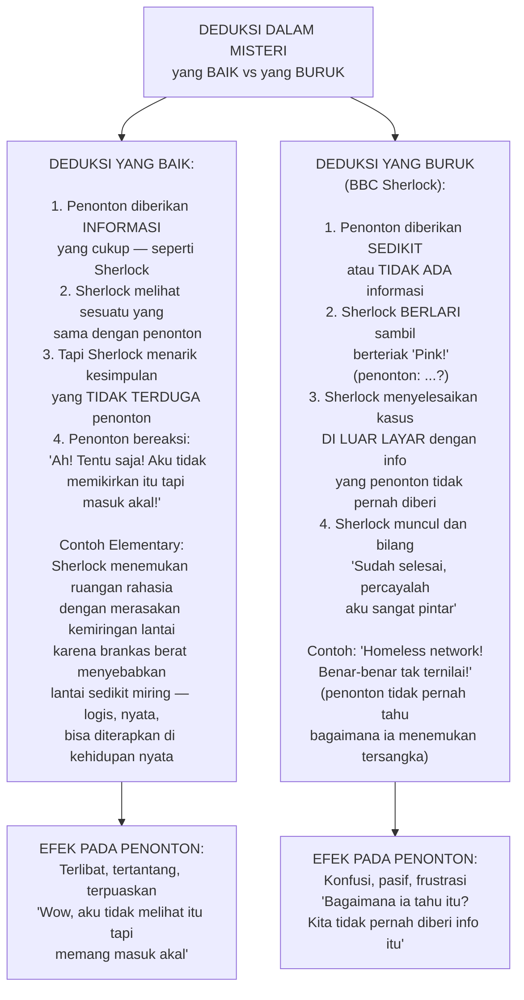

**Kasus The Scene™ — Adegan Terburuk dalam Sejarah Serial Misteri:**

Dalam episode *A Scandal in Belgravia*, ada sebuah adegan di mana Sherlock dan Irene Adler *membayangkan ulang* tempat kejadian perkara yang keduanya tidak pernah kunjungi... dan sampai pada kesimpulan bahwa:

> *"Boomerang yang melakukannya."*

Berdasarkan **nol informasi** yang pernah diberikan kepada penonton. Soundtrack menggelegar. Irene Adler membelalakkan matanya kagum pada Sherlock. Dan penonton duduk tertegun — bukan karena terkesima, tapi karena bingung.

*"Inti dari cerita misteri — inti membara dari genre yang membuatnya apa adanya — adalah diberikan informasi. Cukup sehingga kamu mungkin bisa mencari tahu apa yang terjadi. Dan kemudian memiliki karakter yang menunjukkan sesuatu tentang informasi itu yang berhasil kamu lewatkan, atau menyatukan potongan-potongan dengan cara yang tidak kamu duga."*

### Masalah Utama #4: Moriarty yang Tidak Koheren

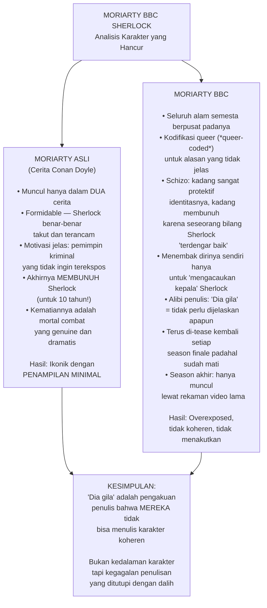

Satu pertanyaan yang tidak pernah dijawab serial ini: **Jika Moriarty memang masterplan untuk menghancurkan Sherlock dan melindungi identitasnya dengan sangat keras — termasuk membunuh orang tua yang dengan tulus bilang Sherlock "terdengar baik" — mengapa ia tidak langsung membunuh Sherlock dan selesai?**

Jawabannya: *"Karena dia gila."* Dan ini adalah cara paling malas untuk menulis villain.

---

## 👩 Kehancuran Irene Adler — Pengkhianatan Terbesar

Irene Adler adalah salah satu karakter paling ikonik dalam kanon Sherlock Holmes. Ia hanya muncul dalam satu cerita — *A Scandal in Bohemia* (Skandal di Bohemia) — tapi kenangannya bertahan sepanjang masa karena satu alasan sederhana:

**Ia adalah satu-satunya karakter yang pernah mengalahkan Sherlock Holmes.**

### Versi Asli: Proto-Feminis yang Cemerlang

Dalam cerita asli, Raja Bohemia menyewa Sherlock untuk mengambil kembali foto komprometasi dari Irene Adler — seorang penyanyi opera kontroversial yang memiliki hubungan romantis dengannya di masa lalu. Raja takut foto itu akan merusak pernikahannya yang dijadwalkan.

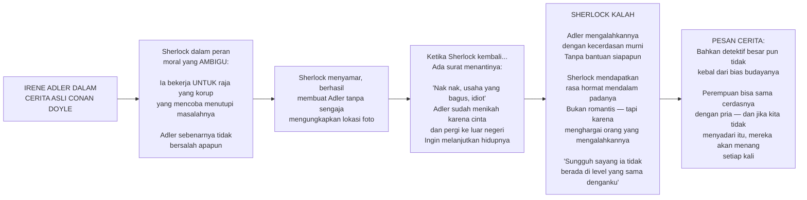

### Versi BBC: Pengkhianatan Total

Dalam episode *A Scandal in Belgravia* (versi BBC), Irene Adler muncul sebagai:
- Dominatrix biseksual (*dominatrix biseksual* — seseorang yang menguasai orang lain secara seksual)
- Yang terpikat secara romantis pada Sherlock
- Yang ternyata bekerja untuk Moriarty
- Yang akhirnya **kalah** pada Sherlock
- Yang kemudian **diselamatkan oleh Sherlock** ketika tertangkap dan hampir dieksekusi

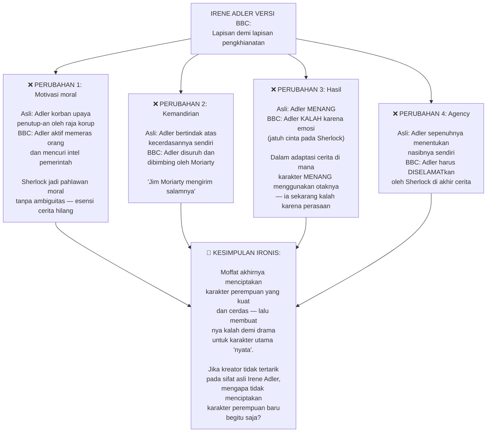

---

## 👋 Watson yang Tidak Berguna

Dr. John Watson adalah **karakter sudut pandang** (*point-of-view character*) dalam hampir semua cerita Holmes asli. Ia adalah narator, orang yang kita identifikasi, jembatan antara pembaca biasa dan dunia jenius Holmes.

Tapi dalam BBC Sherlock, Watson hampir tidak memiliki peran yang berarti:

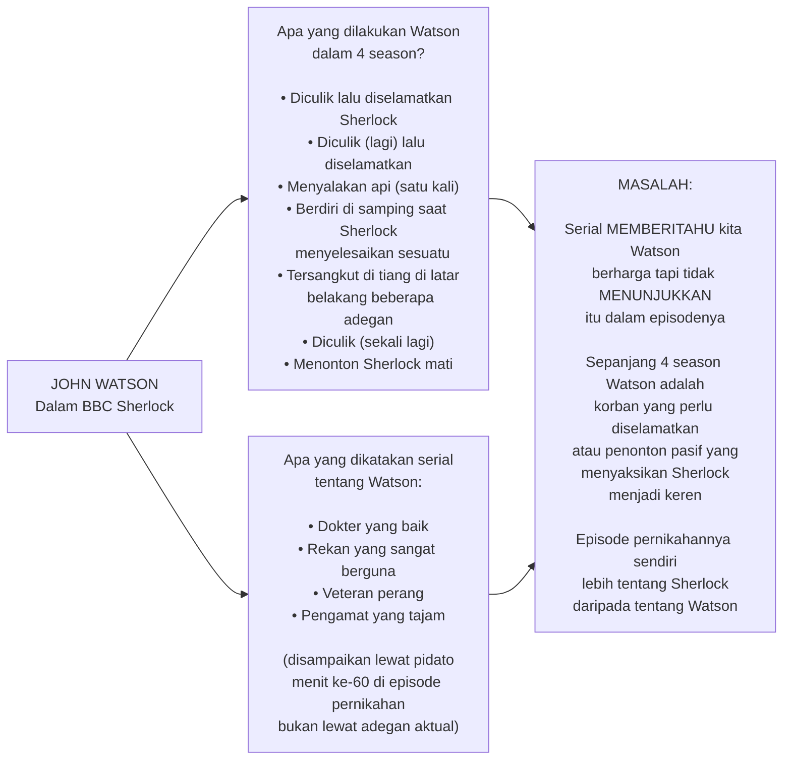

*"Pria itu dokter, veteran perang, dan karakter POV untuk sebagian besar buku — dan ia hampir tidak hadir di pernikahannya sendiri, yang didedikasikan untuk pidato panjang Sherlock yang seharusnya tentangnya tapi sebenarnya tentang betapa cerdasnya Sherlock dalam memecahkan kejahatan selama pidato."*

---

## 🎬 Masalah Produksi: Ketika Uang Menjadi Musuh Kreativitas

BBC berinvestasi besar-besaran pada Sherlock — dan ini terlihat. Produksi serial ini sangat mahal, sangat stylish (*bergaya*), dengan *cinematography* (*sinematografi*) yang canggih dan efek visual yang mengesankan.

Tapi justru ini menjadi bagian dari masalah.

### Paradoks Blink vs. Sherlock

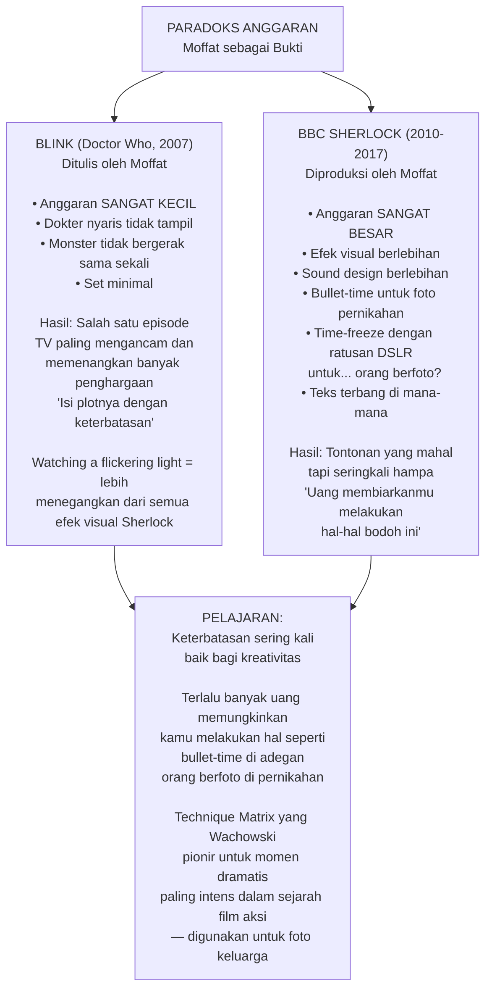

### Teks Terbang dan Sound Effect Palsu

Ketika Sherlock menggunakan "kekuatan pikiran super"-nya, serial ini menghadirkan teks melayang, gambar bergerak, dan efek suara yang berlebihan. Ini dimaksudkan untuk **menempatkan kita dalam pikiran Sherlock**.

Tapi sering kali efeknya **kontraproduktif**:
- Di momen terbaik: menciptakan adegan intens yang menempatkan kita ke dalam cara pandang Sherlock
- Di momen terburuk: menjadi kekacauan visual dengan teks acak dan efek suara yang tidak relevan

*"Penggunaan gambar dan efek suara ini sangat efektif — membantu mengelabui penonton untuk berpikir bahwa mereka melakukan lebih dari sekadar menonton Benedict Cumberbatch duduk di kursi dan memberitahu kamu tentang hal-hal yang ia perhatikan."*

---

## 💥 Musim 4: Di Mana Semuanya Hancur Sepenuhnya

Musim keempat adalah puncak dari semua masalah yang sudah ada sejak awal, diperbesar hingga skala yang tidak bisa lagi dimaafkan bahkan oleh fans paling setia.

### Fenomena "Lost Special" Theory

Sebelum kita membedah musim keempat, ada fenomena menarik yang perlu dipahami:

Setelah musim keempat tayang dan terasa begitu buruk, sebagian fans **menolak menerima bahwa ini adalah produk final**. Mereka mengembangkan teori bahwa ada episode keempat tersembunyi (*lost special*) yang akan menjelaskan segalanya:

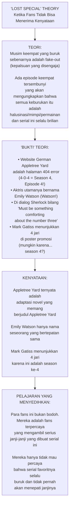

### Masalah Fundamental Musim 4

**Eurus Holmes** — saudari rahasia Sherlock yang entah bagaimana ia lupakan — adalah karakter baru yang seharusnya menjadi pengganti Moriarty sebagai antagonis utama.

Tapi seperti semua villain dalam serial ini, ia hanya berfungsi sebagai alasan untuk **menempatkan Sherlock dalam situasi yang terlihat keren** tanpa benar-benar menantangnya secara bermakna.

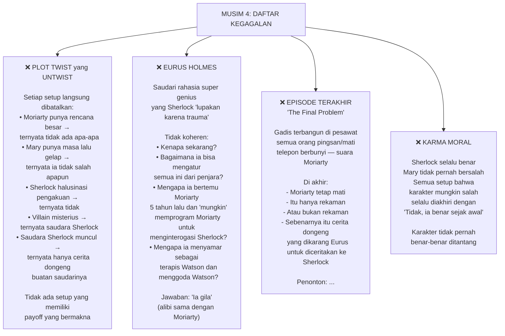

---

## 😡 Moffat Membenci Penggemarnya

Ini adalah salah satu kritik paling tajam dan paling tepat dalam video essay ini:

Moffat tidak hanya menulis cerita misteri yang buruk — **ia secara aktif mengejek penonton yang mencoba memecahkan misteri tersebut**.

```mermaid
graph TD
    A["SHERLOCK VS FANSNYA SENDIRI\nBukti dalam Serial"]
    
    A --> B["SETUP DI SEASON 2:\n\nSherlock 'terjun' dari gedung\ndan semua orang menyaksikannya mati\n\nSerial sengaja tidak menjelaskan\nbagaimana ia selamat — agar\nfans bisa berteori selama 2 tahun\nsambil menunggu season 3\n\nItu berhasil — fans sangat antusias\nberdebat tentang berbagai teori"]
    
    B --> C["RESPONS SEASON 3:\n\nMuncul episode yang menampilkan:\n• Berbagai karakter sebagai\n  peniru fans berteori\n• Mereka DIPERMALUKAN dan\n  DISEBUT GILA karena berteori\n• Bahkan salah satu teori\n  yang di-mock adalah teori\n  bahwa Holmes dan Moriarty\n  adalah kekasih gay —\n  dan orang lain menertawakannya\n  PADAHAL penulis yang sama\n  yang sengaja queer-bait\n  hubungan itu dari awal!\n• Episode berakhir dengan\n  tokoh paling serius pun\n  tertawa gila di depan\n  conspiracy wall-nya"]
    
    C --> D["PESAN TERSIRAT YANG TERANG:\n\n'Kamu adalah Watson:\nJangan tanya BAGAIMANA ia selamat\nTanya MENGAPA'\n\nYaitu: dalam SERIAL MISTERI\ntentang MEMECAHKAN MASALAH —\nkamu TIDAK SEHARUSNYA PEDULI\nbagaimana sesuatu terjadi"]
    
    D --> E["TERJEMAHAN BEBAS:\n\n'Kami memancing kalian untuk\nberteori selama 2 tahun.\n\nSekarang kami tidak akan\nmenjelaskan apa-apa.\n\nDan kalian bodoh karena\nmenganggap kami akan melakukannya.\n\nFuck you.'"]
```

*"Ini adalah penghinaan yang sangat jelas terhadap inti daya tarik cerita kriminal misteri. Heck, terhadap cerita itu sendiri. Serangkaian buku yang secara harfiah tentang mengetahui bagaimana sesuatu terjadi."*

---

## 🎭 Gaya Penulisan Episodik vs. Penulisan Serial — Di Mana Batas Kemampuan Moffat

Setelah semua analisis ini, pola yang jelas muncul:

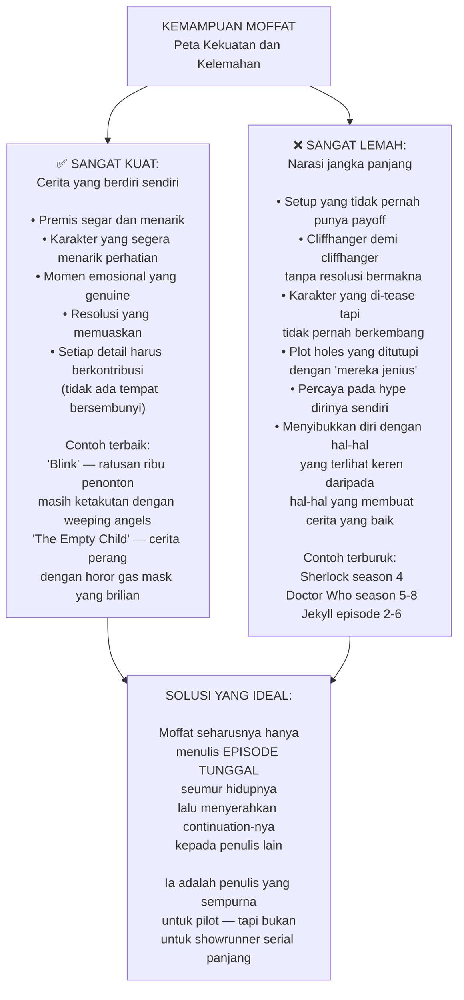

---

## 📊 Analisis: Mengapa Musim 1 Lebih Baik dari Sisanya

Menariknya, musim pertama BBC Sherlock secara luas dianggap yang terbaik — dan ini bukan kebetulan:

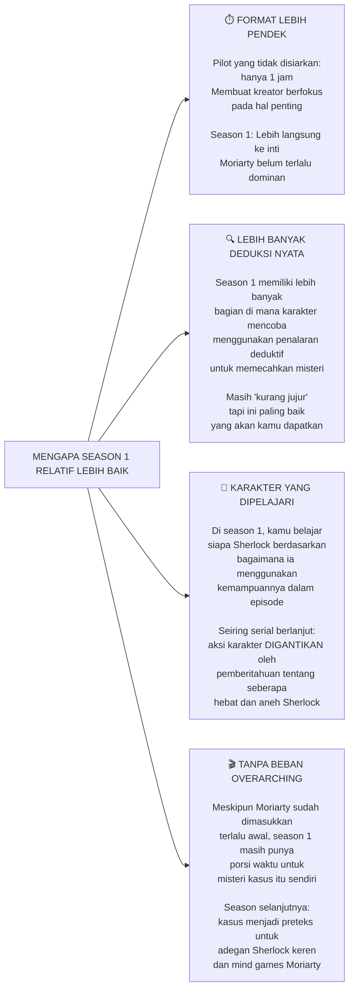

---

## 🏆 Apa yang Seharusnya Dilakukan BBC Sherlock

Untuk menutup analisis ini secara konstruktif, mari kita bayangkan BBC Sherlock yang seharusnya ada:

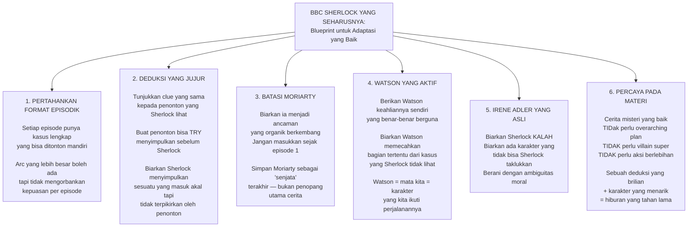

---

## 🔚 Kesimpulan: Apa yang BBC Sherlock Curi dari Kita

BBC Sherlock adalah studi kasus yang menarik tentang bagaimana sebuah properti yang paling dicintai dalam budaya pop Inggris bisa dihancurkan dengan niat terbaik sekalipun.

Moffat bukan penipu. Ia bukan orang jahat. Ia adalah **penulis episodik berbakat yang dipaksa (dan membiarkan dirinya dipaksa) ke peran showrunner jangka panjang yang tidak cocok untuknya**.

Hasilnya adalah serial yang selama bertahun-tahun berhasil membuat penonton percaya bahwa sesuatu yang dalam dan brilian sedang terjadi di balik layar — sampai musim keempat datang dan merobek ilusi itu sepenuhnya.

```mermaid
graph TD
    A["LEGACY BBC SHERLOCK\nApa yang Tersisa"]
    
    A --> B["💔 YANG HILANG:\n\n• Kepercayaan bahwa\n  misteri akan diselesaikan\n• Irene Adler sebagai proto-feminist\n  yang menang lewat kecerdasannya\n• Watson sebagai mitra setara\n• Format episodik yang membuat\n  Holmes abadi\n• Respek pada penonton yang\n  mencoba berpikir bersama serial"]
    
    A --> C["✅ YANG BERTAHAN:\n\nBenedict Cumberbatch dan\nMartin Freeman tetap menjadi\naktor yang baik dalam peran ini\n\nEpisode 1 dan 2 season 1\nmasih cukup menghibur\n\nSerial ini membuktikan bahwa\nSherlock Holmes masih relevan\ndan bisa menarik penonton\nbesar di era modern"]
    
    A --> D["📚 PELAJARAN UNTUK KREATOR:\n\n1. Percayalah pada materi asli —\n   jika kamu berpikir terlalu pintar\n   untuk sumbernya, mungkin\n   kamu tidak seharusnya\n   mengadaptasinya\n\n2. Format yang tepat untuk\n   penulis yang tepat — bukan\n   semua penulis hebat bisa\n   menjadi showrunner hebat\n\n3. Penonton yang berpikir\n   adalah ASET, bukan musuh —\n   mereka membuat karya seni\n   menjadi lebih kaya\n\n4. Hype-ing tanpa delivering\n   adalah penipuan —\n   dan penonton akhirnya sadar"]
    
    B --> E["PENUTUP PALING JUJUR:\n\n'Serial Sherlock lama\nmungkin terlihat membosankan\ndibandingkan versi BBC —\ncamera tidak berputar,\ntidak ada efek keren.\nTapi aku lebih suka menonton\nSherlock memecahkan teka-teki\nberdasarkan informasi yang kita\ndua lihat kapan saja,\ndari pada satu detik lagi dari\n\"lihat betapa cerdasku\"\n spinning camera nonsense yang\npada akhirnya terungkap sebagai\nbungkusan untuk sesuatu yang\nbodoh seperti boomerang.'"]
    C --> E
    D --> E
```

Dan mungkin itu adalah pelajaran paling besar: **cerita misteri yang baik tidak membutuhkan anggaran besar, efek visual memukau, atau villain super yang mengendalikan segalanya dari balik tirai.** Yang dibutuhkan hanyalah satu karakter yang cerdas, satu masalah yang menarik, dan kepercayaan bahwa penonton cukup cerdas untuk menikmati perjalanan menemukannya bersama.

Itulah yang membuat Sherlock Holmes abadi selama lebih dari 130 tahun. Dan itulah yang pertama kali dibuang oleh BBC Sherlock. 🎩🔍

---

## 📚 Glosarium Lengkap

| Istilah | Bahasa Asli | Makna |
|---|---|---|
| **Western Canon** | Inggris | Koleksi karya-karya besar peradaban Barat yang dianggap paling berpengaruh |
| **Showrunner** | Inggris | Kepala penulis sekaligus produser eksekutif — orang yang paling bertanggung jawab atas arah kreatif serial |
| **Self-contained** | Inggris | Cerita yang berdiri sendiri dan tidak bergantung pada episode/karya lain untuk dipahami |
| **Overarching plot** | Inggris | Alur cerita besar yang merentang sepanjang musim atau serial |
| **Police procedural** | Inggris | Genre drama yang mengikuti investigasi polisi secara realistis dan detail |
| **In media res** | Latin | Langsung masuk ke tengah cerita tanpa penjelasan latar belakang |
| **Queer-coded** | Inggris | Karakter yang digambarkan dengan isyarat-isyarat LGBTQ meskipun tidak pernah dinyatakan secara eksplisit |
| **Queer baiting** | Inggris | Praktek mengisyaratkan hubungan LGBTQ dalam fiksi untuk menarik penonton tanpa pernah benar-benar mengeksekusinya |
| **Payload / Payoff** | Inggris | Hasil atau imbalan yang diterima penonton setelah investasi emosional dalam sebuah cerita |
| **Setup** | Inggris | Persiapan/fondasi yang diletakkan dalam cerita untuk peristiwa mendatang |
| **Point-of-view character** | Inggris | Karakter yang menjadi sudut pandang utama; mata penonton dalam cerita |
| **Proto-feminist** | Inggris | Karya atau karakter yang menampilkan ide-ide feminis sebelum gerakan feminisme modern |
| **Cinematography** | Inggris | Sinematografi — seni pengambilan gambar dalam film/video |
| **Bullet-time** | Inggris | Teknik kamera yang membekukan waktu dengan efek tiga dimensi, dipopulerkan The Matrix |
| **Over-produced** | Inggris | Diproduksi secara berlebihan hingga kelebihan produksi mengganggu konten |
| **Cliffhanger** | Inggris | Akhir episode yang menggantung dengan situasi tegang untuk memancing penonton menonton episode berikutnya |
| **Fake-out** | Inggris | Tipuan atau pemalsuan yang disengaja untuk mengejutkan penonton |
| **Sound design** | Inggris | Desain suara — seni menciptakan dan mengatur efek suara dalam produksi |
| **Fan theory** | Inggris | Teori yang dikembangkan fans untuk menjelaskan plot holes atau misteri dalam karya fiksi |
| **Lost special** | Inggris | Dalam konteks ini: teori fans bahwa ada episode tersembunyi yang belum tayang |
| **Deductive reasoning** | Inggris | Penalaran deduktif — menarik kesimpulan dari premis-premis yang sudah diketahui |
| **Deadpan** | Inggris | Gaya humor dengan ekspresi datar tanpa menunjukkan emosi |
| **Arc** | Inggris | Perjalanan atau perkembangan sebuah karakter atau plot sepanjang cerita |
| **Slog** | Inggris | Perjalanan yang panjang, melelahkan, dan tidak menyenangkan |
| **Off-screen** | Inggris | Di luar layar — kejadian yang tidak ditampilkan secara visual kepada penonton |
| **Agency** | Inggris | Kemampuan atau kebebasan karakter untuk mengambil tindakan yang menentukan nasibnya sendiri |
| **Overexposed** | Inggris | Terlalu banyak ditampilkan hingga kehilangan daya tariknya |
| **Blueprint** | Inggris | Cetak biru — rencana atau pola dasar |
| **Hype** | Inggris | Publisitas atau ekspektasi yang berlebihan |

---

*Sumber video: [Sherlock Is Garbage, And Here's Why — Hbomberguy](https://www.youtube.com/watch?v=LkoGBOs5ecM)*

*Hbomberguy (Harry Brewis) adalah video essayist Inggris yang dikenal dengan analisis mendalam tentang film, serial, dan budaya pop.*
