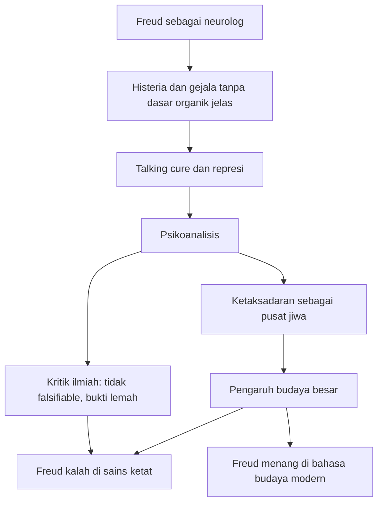

## 🕳️ Pendahuluan: Freud Menang Secara Budaya, Kalah Secara Ilmiah, tetapi Tidak Pernah Benar-Benar Pergi

Ada sedikit tokoh dalam sejarah modern yang hidupnya mengandung paradoks sedalam Sigmund Freud. Ia adalah orang yang memberi dunia modern banyak kata untuk memahami dirinya sendiri: **unconscious** — *alam tak sadar / proses mental yang bekerja di luar kesadaran*, **repression** — *represi / penekanan dorongan atau ingatan ke wilayah tak sadar*, **ego**, **id**, **superego**, *Freudian slip*, masa kecil yang membentuk dewasa, keinginan tersembunyi, konflik batin, dorongan yang tidak kita akui, dan gagasan bahwa manusia tidak pernah sepenuhnya jujur kepada dirinya sendiri. Bahkan orang yang sama sekali tidak pernah membaca Freud tetap memakai bahasanya. Ia telah menyusup ke percakapan sehari-hari, sastra, film, terapi, politik, kritik budaya, dan cara kita menilai diri.

Namun di saat yang sama, Freud juga adalah salah satu tokoh yang paling keras digugat oleh sains modern. Banyak metodenya telah ditinggalkan. Banyak studi kasusnya dianggap bermasalah. Banyak klaim-klaim utamanya—tentang seksualitas infantil, simbol mimpi, penis envy, Edipus kompleks, struktur psikoseksual perkembangan—dinilai **unfalsifiable** — *tak dapat dibantah / tak dapat diuji salah dengan standar sains modern*. Psikologi eksperimental bergerak melampauinya. Neurosains bergerak melampauinya. Psikiatri biologis bergerak melampauinya. Tetapi bahasa Freud tidak ikut mati. Justru di situlah letak keanehannya. 🌑

Bagaimana mungkin seseorang bisa begitu dikikis secara ilmiah, namun tetap menang secara budaya? Bagaimana mungkin seorang neurolog Yahudi dari Wina abad ke-19, yang hidup di kekaisaran yang sedang membusuk, bisa menjadi arsitek diam-diam dari cara kita memahami motif, masa kecil, rasa malu, trauma, dan keinginan? Mengapa seseorang yang sangat ingin diakui sebagai ilmuwan justru berakhir lebih mirip pembuat mitos modern—seorang pengungkap sisi irasional manusia yang pengaruhnya lebih terasa dalam sastra dan filsafat ketimbang laboratorium?

Materi yang Mas Hendra kirim membahas Freud bukan cuma sebagai bapak psikoanalisis, tetapi sebagai **biografi intelektual** yang tumbuh dari sebuah zaman, sebuah kota, sebuah budaya represi, dan serangkaian ambisi pribadi yang besar sekali. Ini penting, karena Freud tidak lahir dari ruang netral. Ia lahir dari Wina yang sangat terobsesi pada penampilan, sopan santun, pengendalian diri, ritual sosial, dan kesopanan publik—sementara di bawah permukaan, hasrat, frustrasi, ketidakjujuran, kelas sosial, anti-semitisme, dan ketegangan seksual bekerja tanpa nama. Freud mungkin tidak menemukan represi di ruang hampa; ia justru seperti menamai penyakit sebuah peradaban. 🏛️

Artikel ini akan menguraikan semuanya secara detail dan mendalam dalam bahasa Indonesia. Kita akan bahas: latar Austria-Hongaria yang membentuk Freud, masa kecilnya, ambisi ilmiahnya, episode kokain, pertemuannya dengan histeria, kelahiran psikoanalisis, seduction theory dan pembatalannya, self-analysis, tafsir mimpi, Oedipus complex, konflik dengan Adler dan Jung, kemunculan death drive, hubungan kompleks dengan Anna Freud, pelariannya dari Nazi, kejayaan budaya Freud di Amerika, keruntuhan otoritas ilmiahnya, dan mengapa pada akhirnya ia tetap hidup dalam struktur tak terlihat dari budaya modern.

Kalau harus diringkas dalam satu kalimat, mungkin begini: **Freud bukan ilmuwan yang semua teorinya bertahan, tetapi ia adalah orang yang mengajari peradaban modern satu kebiasaan baru yang tidak bisa dibatalkan lagi—kebiasaan untuk curiga bahwa di balik alasan sadar, ada sesuatu yang lebih gelap, lebih jujur, dan lebih tua sedang bekerja.**

<Callout type="important" title="Tesis utama artikel ini">
Freud menjadi tokoh yang sangat berpengaruh bukan karena semua teori ilmiahnya benar, melainkan karena ia berhasil menciptakan sebuah bahasa baru untuk membaca diri manusia: bahasa tentang represi, ketaksadaran, konflik batin, masa kecil, dan motif tersembunyi. Detail teorinya banyak runtuh, tetapi kerangka kecurigaan yang ia wariskan terhadap kesadaran manusia justru tetap menjadi bagian inti dari modernitas.
</Callout>

---

## 🏰 1. Freud Mustahil Dipahami Tanpa Wina: Kota yang Halus di Permukaan, Tapi Penuh Tekanan di Bawahnya

Untuk memahami Freud, kita harus memulai bukan dari teori, tetapi dari tempat. Austria-Hungaria abad ke-19, terutama Wina, adalah dunia yang ditahan oleh upacara, tata krama, dan penampilan. Secara resmi, Kekaisaran Habsburg adalah salah satu kekuatan besar Eropa. Secara budaya, Wina adalah pusat musik, sastra, filsafat, dan seni. Ia memproduksi konsentrasi jenius yang luar biasa: Gustav Mahler, Gustav Klimt, Wittgenstein, Schnitzler, Hofmannsthal, dan banyak lagi. Kota itu tampak anggun, kompleks, dan tinggi budaya.

Tetapi justru karena begitu terobsesi pada bentuk, Wina juga menjadi tempat yang sangat cocok untuk tumbuhnya teori tentang apa yang tersembunyi. Norma seksual dijaga ketat di permukaan, tetapi pelanggarannya berlangsung sistematis di balik pintu tertutup. Keluarga borjuis tampak terhormat, tetapi sering menjadi wadah tekanan emosi yang tidak bisa diucapkan. Pernikahan berfungsi sebagai pengaturan sosial-ekonomi. Perselingkuhan dikelola dengan diam-diam. Homoseksualitas dikriminalisasi tetapi tetap hidup. Keinginan tidak dihapus; ia hanya dipaksa bersembunyi.

Dan di atas semua itu ada satu lapisan lain: untuk keluarga Yahudi seperti Freud, kesetaraan hukum yang mulai terbuka tidak otomatis berarti penerimaan sosial. Mereka bisa maju di pendidikan, hukum, kedokteran, jurnalisme, dan akademia, tetapi tetap merasakan dirinya sebagai outsider. Dengan kata lain, Wina mengajari dua hal sekaligus:

- penampilan publik bisa sangat berbeda dari realitas pribadi,  
- dan seseorang bisa sangat berhasil sambil tetap merasa tidak pernah sepenuhnya diterima.  

Bukankah ini nyaris formula awal bagi psikoanalisis? Kota itu hidup dalam **double life** — *kehidupan ganda* — dan Freud hanya mengangkat logika yang sama ke tingkat teori jiwa. 🏰

---

## 👶 2. Masa Kecil Freud: “Anak Emas” yang Sejak Dini Dipersiapkan untuk Besar dan Sulit Membayangkan Dirinya Tidak Pusat

Freud lahir tahun 1856 di Freiberg, Moravia, lalu pindah ke Wina pada usia sangat muda ketika bisnis ayahnya runtuh. Sejak awal, struktur keluarganya sudah rumit: ayahnya jauh lebih tua dari ibunya, ada saudara tiri yang nyaris seangkatan dengan ibunya, ada keponakan yang justru lebih tua darinya. Dari sudut pandang psikoanalitik, ini sendiri sudah seperti laboratorium kecil dinamika keluarga yang tumpang tindih.

Yang paling penting, Freud tumbuh sebagai **the golden child** — *anak emas*. Ibunya, Amalia, menaruh harapan besar padanya dan menandainya sejak dini sebagai seseorang yang istimewa. Dalam keluarga yang sumber dayanya terbatas, Freud diberi prioritas. Ia mendapatkan lampu terbaik untuk belajar. Ketika permainan musik saudarinya mengganggu konsentrasinya, pianonya dikeluarkan dari rumah. Seluruh rumah tangga menyesuaikan diri dengan premis tunggal: perkembangan intelektual Sigmund adalah hal terpenting yang sedang terjadi di bawah atap itu. 👶

Ini bukan detail kecil. Pengalaman seperti ini menanamkan sesuatu yang sangat dalam: keyakinan bahwa dirinya memang pusat, bahwa dukungan lingkungan untuk kerja intelektualnya adalah sesuatu yang wajar, dan bahwa perempuan-perempuan di sekitar dapat diharapkan mengatur hidup mereka di sekeliling proyeknya. Pola ini akan muncul lagi dalam relasinya dengan Martha Bernays, keluarganya, dan terutama Anna Freud.

Di sisi lain, ia juga tumbuh dengan pengalaman anti-semitisme dan keterbatasan sosial. Jadi sejak dini Freud menyerap dua pesan yang bertolak belakang:
- saya luar biasa,  
- tetapi dunia tidak selalu mau menerima saya.  

Kombinasi ini berbahaya sekaligus produktif. Ia bisa melahirkan daya juang, ambisi intelektual, sensitivitas terhadap penghinaan, dan kecenderungan melihat kritik bukan sekadar beda pendapat, tetapi sebagai bentuk penolakan atau permusuhan. Freud akan membawa struktur emosi ini sepanjang hidupnya. 👀

---

## 🔬 3. Freud Mula-Mula Bukan “Penyair Ketidaksadaran,” tetapi Produk dari Materialisme Ilmiah Paling Keras pada Zamannya

Ada satu kesalahpahaman populer seolah Freud sejak awal adalah figur setengah sastra, setengah mistik, yang langsung bicara soal mimpi dan hasrat tersembunyi. Padahal, Freud justru dibentuk oleh tradisi materialis yang sangat keras. Di Universitas Wina, ia masuk ke dunia ilmiah yang yakin bahwa semua fenomena hidup pada akhirnya dapat dijelaskan melalui fisika, kimia, dan biologi. Tidak ada vitalisme, tidak ada jiwa sebagai entitas misterius, tidak ada campur tangan mistik. Hanya materi, energi, dan hukum-hukum alam.

Di laboratorium Ernst Brcke, Freud bekerja dengan sangat teliti pada histologi sistem saraf. Ia meneliti jaringan saraf ikan dan makhluk lain, dan karyanya bahkan dianggap mengantisipasi hal-hal yang kelak sejalan dengan neuron doctrine. Ini penting sekali: Freud tidak bermula sebagai anti-ilmuwan. Ia justru ingin menjadi ilmuwan keras. Ia ingin masuk ke jajaran orang-orang seperti Darwin dan Copernicus. 🔬

Kalau kemudian Freud tampak seperti pembuat mitos, itu bukan karena ia sejak awal menolak sains. Justru lebih tragis: ia berangkat dari sains keras, lalu bertemu wilayah-wilayah pengalaman manusia yang tidak mudah diperas menjadi model laboratorium. Dan di situlah ia mulai membangun sistem sendiri—setengah klinis, setengah interpretatif, setengah ilmiah, setengah hermeneutik.

Dengan kata lain, Freud adalah orang yang bermaksud masuk lewat pintu sains ketat, tetapi akhirnya keluar sebagai penafsir jiwa modern.

---

## 🧪 4. Episode Kokain: Saat Ambisi Ilmiah Freud Bertemu Kecerobohan, Narcissism, dan Hasrat Menjadi Penemu Besar

Salah satu episode paling membuka tabir dalam hidup Freud adalah kisah kokain. Pada 1884, Freud membaca laporan tentang efek kokain, lalu mulai mengujinya pada dirinya sendiri dan orang lain. Ia merasakan energi meningkat, fokus tajam, suasana hati membaik. Dengan cepat ia menjadi promotor besar zat itu, menulis *ber Coca* seperti orang yang yakin ia telah menemukan terobosan medis.

Masalahnya: Freud bergerak terlalu cepat. Ia mengekstrapolasi dari pengalaman subjektif dan bukti awal menjadi klaim besar. Ia merekomendasikannya untuk depresi, kelelahan, keluhan saraf, bahkan ketergantungan morfin. Ini berakhir buruk, paling tragis pada temannya Ernst von Fleischl-Marxow, yang justru jatuh ke kecanduan kokain parah dan mengalami keruntuhan psikis. Freud juga nyaris kehilangan prioritas ilmiah atas manfaat anestetik lokal kokain karena ia gagal menindaklanjuti petunjuk penting yang sudah ada di tangannya. 🧪

Episode ini penting bukan sekadar sebagai skandal kecil. Ia menunjukkan pola yang akan muncul berulang:
- Freud sangat haus pada penemuan besar,  
- ia mudah meloncat dari data awal ke teori menyeluruh,  
- ia cenderung sulit menahan diri dari pengumuman besar,  
- dan bila salah, ia tidak selalu belajar menjadi lebih hati-hati—kadang justru menjadi lebih strategis dalam membangun narasi.  

Di sini kita melihat Freud bukan sebagai monster atau pahlawan, melainkan sebagai tipe intelektual yang sangat modern: brilian, ambisius, berani, tetapi juga rentan menipu dirinya sendiri atas nama visi besar.

---

## 🏥 5. Histeria dan Charcot: Titik Balik Besar Freud dari Saraf ke Jiwa

Perubahan terbesar Freud datang bukan dari laboratorium, tetapi dari klinik. Di Paris, di bawah Jean-Martin Charcot di Salpêtrière, Freud melihat sesuatu yang mengubah arahnya: pasien-pasien histeria yang gejalanya sangat nyata—kelumpuhan, kebutaan, batuk, gangguan sensorik, kejang—tetapi tanpa kerusakan neurologis yang dapat ditemukan.

Inilah kejutan besar. Kalau tubuh bisa lumpuh tanpa lesi saraf yang jelas, maka ada kemungkinan bahwa **pikiran bisa membuat tubuh sakit**. Bukan dalam arti “sakit pura-pura,” tetapi sungguh-sungguh menghasilkan gejala fisik nyata. Itu revolusioner. Freud melihat bahwa materialisme saraf yang ia pelajari belum punya jawaban cukup untuk ini. 🏥

Charcot penting karena ia memberi Freud dua hal:
1. legitimasi bahwa histeria adalah gangguan nyata, bukan akting perempuan,  
2. petunjuk bahwa psikologi bisa menghasilkan efek fisik.  

Namun Charcot lebih tertarik pada klasifikasi dan demonstrasi. Freud melihat kemungkinan yang lebih jauh: kalau gejala fisik berasal dari konflik mental, mungkin terapi harus memasuki wilayah pengalaman, memori, dan simbol. Dari sinilah jalan menuju psikoanalisis benar-benar mulai terbuka.

---

## 🗣️ 6. Breuer, Anna O, dan “Talking Cure”: Saat Penyembuhan Lewat Bicara Terdengar Seperti Sesuatu yang Mustahil tapi Masuk Akal

Kisah Breuer dan Anna O nyaris mitologis dalam sejarah psikoanalisis, dan memang begitu pengaruhnya. Bertha Pappenheim—yang kemudian dikenal dengan nama samaran Anna O—mengalami gejala histeris berat. Breuer menemukan sesuatu yang mengejutkan: ketika dalam keadaan tertentu ia dibiarkan bicara bebas dan melacak gejala ke memori atau emosi tertentu yang tertahan, gejalanya bisa mereda. Bertha sendiri menyebut ini **the talking cure** — *penyembuhan lewat bicara*, juga **chimney sweeping** — *menyapu cerobong*, seolah membersihkan jelaga batin.

Gagasan ini sangat besar. Ia mengusulkan bahwa gejala fisik atau mental tertentu bukan sekadar gangguan biologis, tetapi **ekspresi simbolik** dari pengalaman emosional yang tidak dapat diolah secara sadar. Kalau pengalaman itu bisa ditemukan, dihidupkan kembali, dan diungkapkan, gejala bisa kehilangan energinya. 🗣️

Buat Freud, ini seperti menemukan pintu tersembunyi. Bukan lagi tubuh sebagai mesin yang salah satu komponennya rusak, tetapi tubuh dan pikiran sebagai teks yang bisa dibaca. Gejala menjadi bukan sekadar masalah, tetapi **pesan**. Dan jika gejala adalah pesan, maka dokter tak lagi cukup seperti montir; ia harus menjadi pembaca makna.

Ini salah satu momen ketika Freud benar-benar mulai bergerak dari neurologi ke hermeneutika jiwa.

---

## 🧨 7. Seduction Theory: Saat Freud Nyaris Menuduh Seluruh Keluarga Borjuis Menyimpan Kekerasan Seksual terhadap Anak

Tahun 1896 Freud mengajukan sesuatu yang sangat meledak: **seduction theory**. Berdasarkan analisis pasien-pasien histeria, ia sampai pada kesimpulan bahwa di balik neurosis mereka terdapat pengalaman seksual masa kecil yang dipaksakan oleh orang dewasa—ayah, paman, saudara yang lebih tua, pelayan rumah, dan figur lain. Dalam bahasa sekarang, Freud sedang mengarah pada pengakuan bahwa kekerasan seksual terhadap anak mungkin jauh lebih luas daripada yang mau diakui masyarakat.

Kalau dilihat dari konteks Wina, ini mengerikan. Freud bukan hanya bilang pasien punya gejala. Ia seperti berkata kepada kelas menengah terhormat Wina: di balik rumah-rumah rapi kalian, ada kebusukan seksual yang sistematis. Tidak heran reaksinya dingin, bahkan menolak. Richard von Krafft-Ebing menyebutnya seperti dongeng ilmiah. 🧨

Yang lebih penting: episode ini menunjukkan bahwa Freud sempat berada di tepi sesuatu yang secara moral sangat besar. Ia melihat bahwa gejala psikis bisa berasal dari kekerasan nyata. Namun tak lama kemudian, ia mundur.

Dan di sinilah salah satu perdebatan paling panas tentang Freud muncul.

---

## 🔥 8. Pembatalan Seduction Theory: Koreksi Intelektual yang Jujur, atau Pengkhianatan terhadap Korban?

Pada 1897 Freud meninggalkan seduction theory. Ia mulai meragukan bahwa seluruh materi seksual yang muncul dalam analisis adalah ingatan faktual. Ia sampai pada gagasan lain: mungkin yang muncul bukan memori kejadian nyata, melainkan **fantasi**—keinginan, hasrat, konflik internal anak sendiri.

Dari sini jalan menuju Edipus kompleks terbuka. Anak bukan lagi semata korban pengalaman seksual eksternal, melainkan subjek dengan kehidupan seksual dan fantasi internalnya sendiri. Dunia psikoanalisis pun bergeser dari “apa yang terjadi padamu” ke “apa yang kau inginkan tapi tak sanggup kau akui.” 🔥

Tapi langkah ini terus diperdebatkan hingga sekarang. Ada dua cara membacanya:

### Bacaan pertama: koreksi intelektual
Freud sadar bahwa ia terlalu jauh, terlalu literal, dan terlalu sulit membedakan memori dari fantasi. Ia memperbaiki teorinya.

### Bacaan kedua: pengkhianatan
Freud tidak tahan menghadapi kenyataan bahwa banyak keluarga “terhormat” mungkin memang menyimpan kekerasan seksual. Ia mundur, dan dengan itu membelokkan penderitaan korban menjadi fantasi internal.

Perdebatan ini tak pernah benar-benar selesai. Dan justru di situ tragedinya: salah satu momen paling penting dalam sejarah psikologi juga menjadi salah satu momen paling samar secara moral.

---

## 🪞 9. Self-Analysis Freud: Saat Freud Menggali Dirinya Sendiri dan Menemukan Hasrat yang Tak Bisa Ia Telan Mentah-mentah

Setelah jatuh secara profesional dan semakin terisolasi, Freud melakukan sesuatu yang luar biasa: ia menjadikan dirinya sendiri bahan analisis. Ia meneliti mimpi-mimpinya, asosiasinya, ingatan masa kecilnya, hubungannya dengan ayah dan ibu, nursemaid yang hilang dari masa kecil, rasa kehilangan, rasa bersalah, ambisi, dan dorongan yang mengganggunya.

Dari sini lahir salah satu klaim paling terkenal dalam sejarah psikoanalisis: bahwa ia menemukan pada dirinya sendiri dorongan cinta terhadap ibunya dan kecemburuan / permusuhan terhadap ayahnya. Dari sanalah lahir **Oedipus complex** sebagai struktur universal. 🪞

Yang menarik, ini menunjukkan sesuatu yang penting tentang Freud. Ia memang dogmatis dalam banyak hal, tetapi ia juga memiliki keberanian yang jarang: ia bersedia membiarkan teori lahir dari kecurigaan paling menyakitkan terhadap dirinya sendiri. Tentu saja hasilnya bisa salah. Tentu saja universalitasnya bisa dipersoalkan. Tapi secara eksistensial, langkah ini radikal. Freud tidak sekadar menganalisis pasien; ia juga membedah dirinya sebagai lokasi konflik.

Inilah momen ketika Freud benar-benar berubah dari dokter menjadi arsitek mitologi modern jiwa.

---

## 🌙 10. *The Interpretation of Dreams*: Freud Menjadikan Mimpi sebagai Jalan Raya Menuju Ketaksadaran

Ketika *The Interpretation of Dreams* terbit, ia tidak langsung meledak. Penjualannya lambat, ulasannya minim, dan sebagian orang mengabaikannya. Tapi secara intelektual, buku ini adalah salah satu pilar modernitas.

Freud mengajukan bahwa mimpi punya dua lapisan:
- **manifest content** — *isi permukaan mimpi yang kita alami*,  
- **latent content** — *makna laten / hasrat tersembunyi di balik mimpi itu*.  

Mimpi baginya adalah **wish fulfillment** — *pemenuhan keinginan*, meskipun keinginan itu sering terlarang, memalukan, atau tak dapat diterima. Karena itu ia harus menyamar lewat simbol, pemadatan, pengalihan, dan distorsi. 🌙

Di sinilah Freud memperluas logika besar psikoanalisis: bahkan ketika kita tidur, pikiran tidak berhenti menyusun kompromi antara dorongan, larangan, dan penyamaran. Mimpi bukan kebisingan acak. Ia adalah teks yang harus ditafsirkan.

Secara ilmiah modern, klaim kuat ini tidak didukung penuh. Tapi secara budaya, tak bisa dibantah, Freud menang total. Setelah Freud, mimpi tak pernah lagi bisa dianggap sekadar bunga tidur. Kita semua jadi terbiasa bertanya: “apa artinya?”

Itulah kemenangan kultural Freud: bukan membuktikan semua tafsirnya benar, tetapi membuat generasi-generasi sesudahnya tidak lagi puas pada permukaan.

---

## 🧬 11. Repression, Free Association, dan Dynamic Unconscious: Freud Menciptakan Sistem di Mana Pikiran Bekerja seperti Drama, Bukan Mesin Netral

Salah satu kontribusi paling penting Freud adalah menjadikan ketaksadaran bukan sekadar gudang hal-hal yang tidak kita pikirkan, tetapi **dynamic unconscious** — *alam tak sadar yang dinamis*, penuh dorongan, konflik, pertahanan, dan energi yang aktif bekerja.

Ini penting. Sebelum Freud, orang bisa saja mengakui bahwa tak semua proses mental disadari. Tapi Freud memberi bentuk yang lebih dramatis: yang tak sadar bukan sekadar “tidak terlihat,” melainkan **secara aktif ditekan, dihalangi, disamarkan, dan terus berusaha kembali**. Itulah represi.

Metode **free association** — *asosiasi bebas* — lahir dari keyakinan ini. Kalau pasien diminta bicara apa pun yang muncul tanpa sensor, pikiran lambat laun akan mendekati retakan tempat materi yang ditekan bersembunyi. Bagi Freud, ucapan yang tampak acak bukan acak. Ia adalah jejak. 🧬

Secara sains ketat, tentu metode ini bermasalah. Tapi secara intelektual, ia mengubah cara mendengar manusia. Ia mengajari kita bahwa celoteh, kebetulan, slip lidah, pengulangan, penghindaran, dan detail kecil mungkin lebih bermakna daripada yang tampak.

---

## 👑 12. Oedipus Complex, Seksualitas Infantil, dan Mengapa Freud Sekaligus Brilian serta Sulit Dipertahankan

Tak bisa dipungkiri, sebagian warisan Freud justru berasal dari bagian yang paling kontroversial: seksualitas infantil dan Edipus kompleks. Freud berkata bahwa anak bukan makhluk polos tanpa kehidupan erotik. Sejak dini, tubuh sudah menjadi sumber kenikmatan, kelekatan, konflik, dan orientasi hasrat. Baginya, masa kanak-kanak bukan taman steril, tetapi medan pembentukan dorongan yang kelak menentukan neurotik atau tidaknya orang dewasa.

Di satu sisi, ini radikal dan jujur. Freud menolak sentimentalitas tentang masa kecil. Ia mengingatkan bahwa manusia tidak tiba-tiba “punya jiwa rumit” saat dewasa. Dari awal, tubuh dan relasi sudah bekerja.

Di sisi lain, Freud terlalu banyak mengunci teori pada skema tertentu: oral, anal, falik, Edipus, penis envy, dan sebagainya. Di sinilah banyak orang modern tersandung. Bagian ini terasa sempit, bias budaya, bias gender, dan terlalu yakin atas struktur yang sangat spekulatif. 👑

Jadi, mungkin cara paling adil membaca Freud adalah ini: ia benar bahwa masa kecil sangat menentukan dan bahwa dorongan anak jauh lebih kompleks daripada dongeng kepolosan. Tetapi ia sering salah atau terlalu sistematis dalam menjelaskan **bagaimana** tepatnya semua itu bekerja.

---

## ⚔️ 13. Adler dan Jung: Mengapa Semua Murid Besar Freud Akhirnya Pergi?

Salah satu hal yang sangat mengungkap karakter Freud adalah fakta bahwa hubungan dengan tokoh-tokoh besar di sekelilingnya hampir selalu berakhir dengan pecah. Alfred Adler datang dengan teori tentang **inferiority complex** — *kompleks inferioritas* dan usaha kompensasi. Jung datang dengan gagasan tentang simbol, arketipe, libido sebagai energi psikis yang lebih luas, dan ketaksadaran kolektif.

Masalahnya, Freud bukan sekadar pemikir besar. Ia juga pendiri sebuah gerakan. Dan gerakan ini semakin lama semakin mirip komunitas yang menuntut kesetiaan doktrinal. Saat teori murid menyimpang terlalu jauh, Freud cenderung membacanya bukan sekadar sebagai beda analisis, tetapi sebagai **betrayal** — *pengkhianatan*. ⚔️

Ini sangat penting untuk dipahami. Psikoanalisis bukan hanya sistem gagasan. Ia juga organisasi dengan struktur afeksi dan kekuasaan. Ada ayah simbolik, ada murid, ada perebutan warisan, ada ortodoksi, ada heresi. Dan bukankah ironis bahwa sebuah teori tentang konflik keluarga dan otoritas reproduksi dirinya sendiri justru bergerak sangat “Freudian” di level organisasi?

Kasus Jung terutama tragis. Freud melihatnya sebagai putra mahkota dan solusi strategis untuk membuat psikoanalisis tak tampak cuma proyek Yahudi-Wina. Jung melihat Freud sebagai guru sekaligus figur ayah yang terlalu ingin mengontrol. Pecahnya mereka bukan sekadar debat teori; itu juga drama psikis dan politik yang hampir sempurna menggambarkan teori yang mereka perdebatkan.

---

## 💀 14. Perang Dunia I dan Death Drive: Ketika Freud Tidak Lagi Bisa Percaya bahwa Manusia Hanya Mengejar Nikmat

Setelah Perang Dunia I, Freud berhadapan dengan sesuatu yang merusak teori awalnya sendiri. Kalau manusia terutama digerakkan oleh prinsip kenikmatan, mengapa begitu banyak orang berulang kali kembali ke trauma, mimpi buruk, kehancuran, pengulangan penderitaan, dan dorongan merusak? Mengapa perang menunjukkan bahwa manusia bukan cuma makhluk pencari kesenangan, tetapi juga punya kapasitas aneh untuk tertarik pada pengulangan sakit, agresi, dan pemusnahan?

Dari sinilah lahir **death drive** — *dorongan kematian / Thanatos*. Ini salah satu konsep Freud paling gelap dan paling spekulatif. Gagasannya: selain Eros, dorongan hidup, ada kecenderungan menuju pembubaran, pengulangan, pengurangan tegangan sampai nol, bahkan kehancuran. 💀

Banyak pengikut Freud sendiri merasa ini terlalu jauh. Tapi secara historis, konsep ini memperlihatkan satu hal penting: Freud tidak berhenti menyesuaikan sistemnya terhadap kekerasan dunia. Ia sedang berusaha menjawab pengalaman abad ke-20 yang brutal dengan teori yang sama brutalnya.

Dan di sini Freud terasa bukan hanya sebagai psikolog, tetapi diagnostician of civilization — *diagnostikus peradaban*. Ia melihat bahwa agresi bukan penyimpangan kecil, tetapi mungkin struktur dasar manusia.

---

## 🧱 15. *Civilization and Its Discontents*: Freud Menyimpulkan Bahwa Peradaban pada Dasarnya Menuntut Penindasan Diri, dan Karena Itu Manusia Tak Akan Pernah Benar-Benar Bahagia

Dalam karya-karya akhir seperti *Civilization and Its Discontents*, Freud mengembangkan pesimisme yang nyaris total. Menurutnya, manusia mau bahagia: kenikmatan, cinta, kepuasan, kebebasan. Tapi peradaban hanya bisa berdiri kalau manusia menahan dorongan-dorongan itu. Kita harus menahan agresi, menunda hasrat, mematuhi norma, dan menginternalisasi larangan. Hasilnya adalah **guilt** — *rasa bersalah* dan **discontent** — *ketidakpuasan kronis*.

Freud tidak menjual utopia. Ia tidak berkata bahwa terapi atau kemajuan budaya akan membuat manusia damai. Sebaliknya, ia berkata bahwa peradaban itu sendiri adalah mesin yang memproduksi neurosis dalam kadar tertentu. Kita perlu peradaban untuk hidup bersama, tetapi harga yang dibayar adalah frustrasi batin. 🧱

Pandangan ini sangat gelap, tetapi justru karena itu berpengaruh. Ia terasa jujur bagi zaman yang telah melihat perang, represi, anti-semitisme, dan ledakan kekerasan massa. Freud seperti berkata: jangan terlalu cepat percaya pada kesopanan manusia. Di baliknya, agresi tetap berdenyut.

---

## 🩸 16. Nazi, Eksil, dan Ironi Sejarah: Freud yang Menulis tentang Kebiadaban Akhirnya Dihantam Kebiadaban Secara Langsung

Ada lapisan tragis yang hampir tak tertahankan dalam hidup Freud. Ia menulis tentang agresi, penyangkalan, kebiadaban, dan ilusi peradaban. Lalu sejarah membuktikan semuanya dengan cara yang paling mengerikan. Ketika Nazi bangkit, buku-bukunya dibakar. Psikoanalisis dilabeli ilmu Yahudi. Wina—kota yang membentuknya—jatuh ke tangan rezim yang membenci segala yang diwakilinya.

Freud sempat meremehkan ancaman itu. Ia terlalu percaya bahwa Austria tidak akan jatuh sepenuhnya ke gaya brutal Jerman. Itu keliru. Setelah Anschluss, Gestapo datang. Anna Freud diinterogasi. Keluarga mereka terancam. Freud akhirnya pergi ke London dengan bantuan jaringan internasional dan kekayaan Marie Bonaparte. Tapi empat saudara perempuannya tertinggal dan akhirnya tewas di kamp konsentrasi. 🩸

Sulit membayangkan ironi yang lebih kejam: Freud, analis agresi dan irasionalitas kolektif, tidak sanggup menyelamatkan keluarganya sendiri dari kebiadaban yang ia pahami begitu baik secara teoritis.

Ini menunjukkan batas pahit dari pengetahuan. Memahami sesuatu tidak otomatis memberi kuasa untuk menahannya.

---

## 👧 17. Anna Freud: Putri, Murid, Perawat, Penjaga Ortodoksi—dan Pertanyaan Etis yang Tak Pernah Selesai

Hubungan Freud dengan Anna Freud adalah salah satu bagian paling rumit dan mengganggu dari seluruh kisahnya. Anna menjadi putri yang tetap tinggal, yang masuk ke dunia ayahnya, dianalisis langsung oleh ayahnya, menjadi sekretaris, perawat, penerus intelektual, sekaligus penjaga keras warisannya.

Dari perspektif etika modern, Freud menganalisis anaknya sendiri jelas sangat problematik. Dalam analisis, pasien harus membawa fantasi, rasa malu, ketergantungan, dan dorongan terdalam ke hadapan analis. Ketika analis itu adalah ayah, struktur kuasa dan ketergantungan menjadi nyaris mustahil dipisahkan. 👧

Dan tetap saja, Anna juga berkembang menjadi tokoh penting dengan kontribusi nyata, terutama soal **defense mechanisms**. Ia bukan sekadar satelit. Tetapi sulit membaca hubungan itu tanpa rasa tak nyaman. Apakah ia bebas memilih? Atau apakah seluruh struktur hidupnya telah dibentuk oleh gravitasi Freud sedemikian rupa sehingga pilihan dan pengabdian sulit dibedakan?

Yang menyedihkan, pertanyaan seperti ini justru adalah jenis pertanyaan yang akan Freud ajarkan kepada kita untuk tanyakan pada orang lain—tetapi terhadap dirinya sendiri, ia tidak pernah benar-benar menyelesaikannya.

---

## 🇺🇸 18. Kemenangan Freud yang Sebenarnya Terjadi di Amerika, Bukan di Wina

Ada ironi lain: Freud tidak suka Amerika, tapi justru di Amerikalah Freud menang paling besar. Setelah banyak analis Eropa pindah ke AS karena fasisme, psikoanalisis menjadi arus utama dalam psikiatri Amerika pertengahan abad ke-20. Universitas besar, klinik, film Hollywood, majalah, manual parenting, budaya populer—semuanya dipenuhi bahasa Freud.

Yang menarik, kemenangan ini tidak hanya terjadi di level klinik, tetapi di level **common sense**. Orang biasa mulai berpikir dengan skema Freud tanpa harus membaca Freud. Mereka bicara tentang represi, denial, trauma masa kecil, transferensi, slip lidah, dan hubungan dengan orang tua sebagai kunci hidup dewasa. Bahkan ketika mereka tak tahu istilah teknisnya, mereka sudah masuk ke dunia Freud. 🇺🇸

Ini kemenangan paling besar dari semua pemikir: saat orang tak lagi sadar bahwa mereka sedang memakai bahasamu.

---

## 📉 19. Lalu Mengapa Freud Runtuh di Mata Sains? Karena Sistemnya Terlalu Elastis untuk Benar-Benar Kalah

Di sinilah masalah ilmiah Freud jadi sangat nyata. Kritik Karl Popper sangat tajam: teori yang ilmiah harus bisa dibuktikan salah. Tapi psikoanalisis sering terlalu lentur.

Kalau pasien setuju dengan interpretasi, Freud benar. Kalau pasien marah dan menolak, itu dianggap resistensi—dan Freud tetap benar. Kalau mimpi tampak cocok, benar. Kalau tampak tidak cocok, masih bisa diinterpretasikan lagi sampai cocok. Kalau gejala berubah, itu konfirmasi. Kalau tidak berubah, bisa dibilang konfliknya lebih dalam. 📉

Masalahnya bukan sekadar bahwa Freud “salah.” Masalahnya adalah banyak bagiannya tidak membuat prediksi tajam yang benar-benar berisiko tumbang. Ia seperti sistem yang bisa menyerap hampir semua hasil. Ini membuatnya sangat kuat sebagai alat tafsir, tetapi lemah sebagai teori ilmiah ketat.

Ketika psikologi berkembang ke arah eksperimen, statistik, ilmu perilaku, terapi perilaku, terapi kognitif, dan neurosains, Freud mulai kehilangan pijakan. Bukan karena dunia tiba-tiba membenci kompleksitas, tetapi karena metode baru menuntut standar pembuktian yang lebih tegas daripada yang bisa ia penuhi.

---

## 🧭 20. Apakah Itu Berarti Freud Tak Berguna? Tidak. Itu Berarti Ia Lebih Dekat ke Pembuat Bahasa Budaya daripada Penyedia Hukum Ilmiah Final

Mungkin kesalahan terbesar dalam menilai Freud adalah memaksanya hanya ke satu kotak: saintis murni atau penipu total. Ia bukan keduanya secara utuh.

Freud gagal bila dibaca sebagai pembuat sistem ilmiah final tentang jiwa. Tetapi Freud berhasil luar biasa bila dibaca sebagai pencipta **vocabulary of suspicion** — *kosakata kecurigaan* terhadap diri manusia. Ia memberi peradaban modern alat untuk berkata:
- saya mungkin tidak sungguh tahu motif saya,  
- masa kecil mungkin masih bekerja dalam saya,  
- gejala mungkin punya makna,  
- rasa malu, hasrat, dan agresi bukan pinggiran hidup,  
- dan kesadaran saya mungkin hanya satu permukaan tipis di atas sesuatu yang jauh lebih tua.  

Dengan kata lain, Freud mungkin tidak selalu memberi peta yang akurat, tetapi ia berhasil **menamai wilayah** yang sebelumnya sulit dibicarakan. Dan setelah wilayah itu diberi nama, dunia tak bisa kembali ke keadaan sebelum nama itu ada. 🧭

---

## 🧠 21. Warisan Freud yang Tetap Hidup: Bukan Skema Lengkapnya, tetapi Kebiasaan Modern untuk Mencurigai Alasan Sadar

Pada titik ini kita bisa melihat dengan lebih jernih apa warisan Freud yang paling bertahan. Bukan terutama oral stage, anal stage, penis envy, atau tafsir simbolik literal atas mimpi. Yang paling bertahan justru adalah kebiasaan epistemik: **jangan langsung percaya pada penjelasan sadar manusia tentang dirinya sendiri.**

Kebiasaan ini hidup dalam:
- psikologi sosial yang menunjukkan bias tak sadar,  
- terapi modern yang melihat pola relasi awal,  
- teori attachment,  
- kritik ideologi,  
- sastra modern dengan narator tak dapat dipercaya,  
- film dan novel yang membangun karakter lewat trauma, represi, dan motif ambigu,  
- bahkan kehidupan sehari-hari saat kita berkata, “kayaknya dia sendiri nggak sadar kenapa dia begitu.”  

Semua itu tidak identik dengan Freud, tetapi sangat sulit dibayangkan lahir dalam bentuk yang sama tanpa ia lebih dulu membelah jalan. 🧠

---

---

## 🌌 Kesimpulan: Freud Mungkin Bukan Ilmuwan Besar dalam Arti yang Ia Inginkan, tetapi Ia Tetap Arsitek Gelap dari Cara Modern Mengerti Diri

Pada akhirnya, kisah Freud bukan kisah kemenangan sains murni, juga bukan kisah penipuan sederhana. Ia adalah kisah yang jauh lebih menarik: kisah seorang intelektual yang ingin menjadi Darwin bagi jiwa manusia, tetapi justru berakhir menjadi sesuatu yang lebih aneh dan lebih sulit diklasifikasikan. Ia menjadi semacam pendeta sekuler dari kegelapan batin modern. Ia bukan memberi dunia hukum-hukum final yang stabil, melainkan sebuah bahasa, sebuah struktur kecurigaan, sebuah cara baru mendengar apa yang tidak terucap.

Freud memang salah dalam banyak hal. Ia salah soal banyak spesifik teori. Ia salah, dan bahkan merusak, dalam pembacaan tertentu terhadap perempuan. Ia salah ketika terlalu yakin atas universalitas beberapa konstruksi yang sangat lahir dari konteks Wina borjuis abad ke-19. Ia salah ketika metode klinisnya dituntut menjawab standar ilmiah yang lebih keras. Ia mungkin juga salah secara moral di beberapa belokan penting, terutama dalam cara ia bergeser dari kemungkinan trauma nyata ke fantasi internal.

Tetapi ada sesuatu yang tidak ikut runtuh bersamanya. Freud benar—atau setidaknya sangat kuat—dalam intuisi besar bahwa manusia tidak transparan bagi dirinya sendiri. Bahwa kita hidup dengan alasan-alasan permukaan yang sering hanya topeng. Bahwa masa kecil tidak pernah selesai begitu saja. Bahwa rasa malu, hasrat, agresi, kehilangan, dan fantasi bekerja terus bahkan saat kita berkata kita “baik-baik saja.” Bahwa yang paling menentukan dalam diri kita sering justru yang tidak sempat atau tidak sanggup kita akui. 🌌

Dan mungkin inilah sebabnya Freud tetap hidup, bahkan setelah banyak teori spesifiknya dipreteli. Kita tidak lagi harus menjadi Freudian untuk hidup dalam dunia yang telah dibuat Freudian. Kita tidak perlu percaya pada semua skemanya untuk tetap memakai intuisi dasarnya. Setiap kali kita bertanya apakah orang sungguh tahu motifnya sendiri, setiap kali kita melihat pola lama berulang dalam relasi, setiap kali kita curiga bahwa luka masa kecil belum selesai, setiap kali kita merasakan bahwa kata-kata sadar tidak cukup menjelaskan hidup batin, di situ Freud masih bekerja—diam-diam, seperti fondasi yang tak lagi terlihat karena terlalu lama menopang bangunan.

Kalau Mas Hendra ingin satu kalimat penutup yang paling tajam, saya akan meletakkannya begini: **Freud mungkin gagal memberi kita sains final tentang jiwa, tetapi ia berhasil melakukan sesuatu yang hampir lebih besar—ia mengajari peradaban modern untuk tidak pernah lagi sepenuhnya percaya pada permukaan kesadaran manusia.**

Dan begitu pelajaran itu tertanam, dunia memang tidak bisa kembali seperti semula.

<Callout type="cite" title="Sumber utama artikel">
Artikel ini disusun berdasarkan materi *Sigmund Freud: The Dark Truth Behind the Unconscious Mind*, yang membahas latar sejarah Wina dan Kekaisaran Austria-Hungaria, masa kecil Freud, pembentukan intelektualnya, episode kokain, histeria, Breuer dan Anna O, kelahiran psikoanalisis, seduction theory, self-analysis, tafsir mimpi, konflik dengan Adler dan Jung, death drive, relasi dengan Anna Freud, pelarian dari Nazi, kejayaan budaya Freud di Amerika, serta kritik ilmiah terhadap warisannya.
</Callout>
