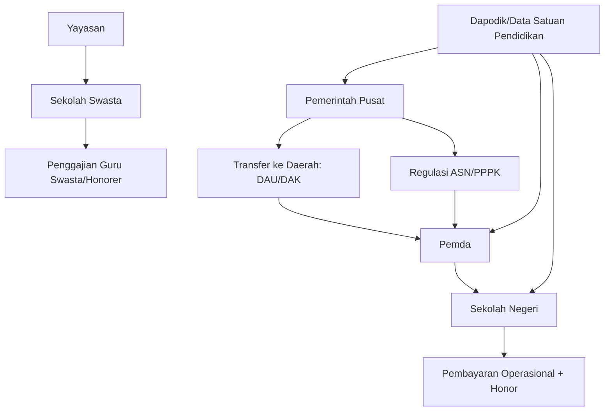
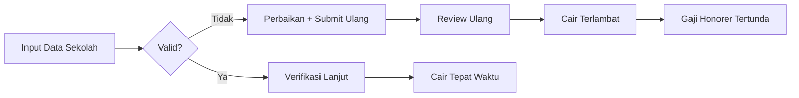
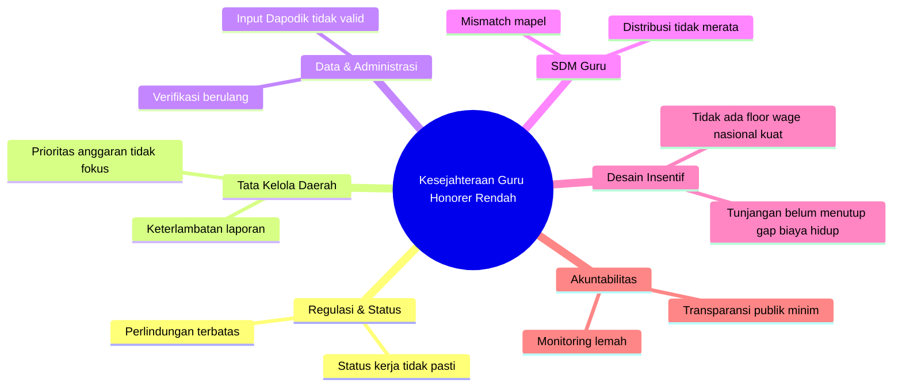
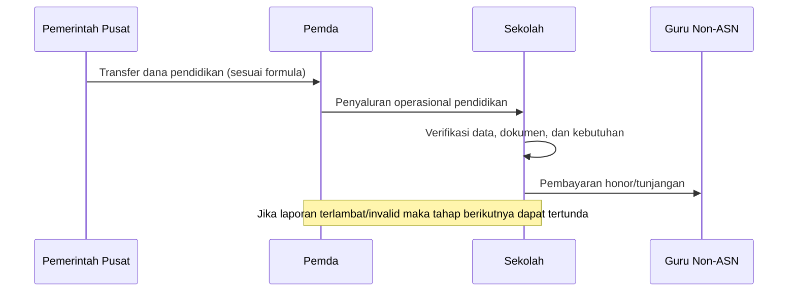
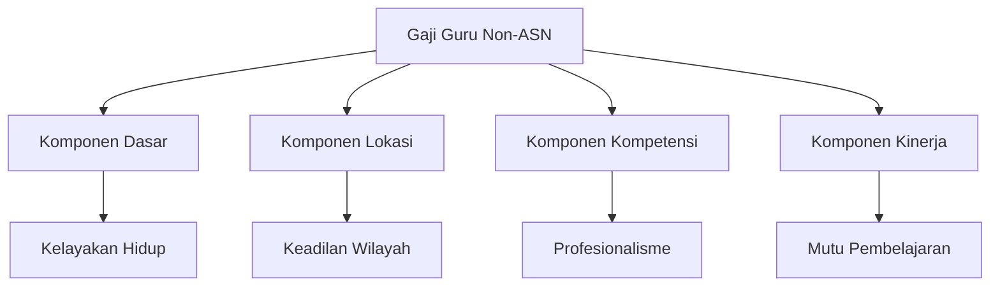
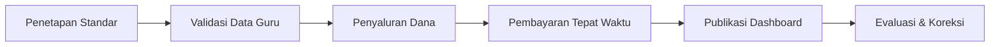

<YouTube url="https://www.youtube.com/watch?v=d1BEeFwlVQ0" title="Membongkar Masalah Gaji Guru Honorer" />

## 🎯 Pengantar: Kita Sering Marah ke Isu yang Benar, Tapi ke Target yang Salah

Kalau bicara pendidikan Indonesia, ada satu kalimat yang hampir semua orang setuju: **guru harus sejahtera**. 🙏

Masalahnya, di lapangan masih ada guru honorer dengan pendapatan jauh di bawah UMR (Upah Minimum Regional), bahkan pernah viral nominal yang sangat tidak manusiawi. Di titik ini, emosi publik wajar. Tetapi, kalau ingin menyelesaikan masalah, kita tidak bisa hanya marah—kita harus **membongkar arsitektur masalahnya**: siapa berwenang, uang mengalir dari mana, data diverifikasi bagaimana, bottleneck (titik sumbatan) terjadi di mana, dan kenapa solusi sering berhenti di slogan.

Artikel ini merapikan persoalan itu secara runtut: dari akar, cabang, sampai desain solusi yang realistis.

---

## 🧱 Tesis Utama

Masalah kesejahteraan guru honorer **bukan semata kekurangan anggaran nasional**. Ini adalah kombinasi dari:

1. **Desain kewenangan yang terfragmentasi** (terpecah antara pusat-daerah-sekolah),
2. **Kualitas tata kelola daerah yang timpang**,
3. **Sistem data dan verifikasi yang belum matang merata**,
4. **Distribusi guru yang tidak presisi**,
5. **Rekrutmen dan pengangkatan yang tidak sinkron dengan kebutuhan riil kelas**,
6. **Minimnya standar nasional untuk batas bawah kesejahteraan guru non-ASN**.

Kalau enam simpul ini tidak dibenahi bersamaan, kenaikan tunjangan apa pun hanya akan menjadi “painkiller” (obat pereda nyeri), bukan “cure” (penyembuhan).

---

## 🧭 Peta Aktor: Siapa Melakukan Apa?

<Callout type="important" title="Intinya">
Dalam banyak kasus historis, **gaji honorer bukan transaksi langsung pusat ke individu guru**. Karena itu, kritik publik perlu presisi: bedakan mana masalah regulasi nasional, mana masalah tata kelola pemda, dan mana masalah manajemen sekolah.
</Callout>

---

## 📌 Akar Masalah #1 — Status Kepegawaian Abu-abu (Grey Zone)

Istilah “honorer” selama bertahun-tahun dipakai sebagai solusi cepat untuk menutup kebutuhan guru. Namun “solusi cepat” ini menciptakan **status kerja tanpa perlindungan penuh**.

- Tidak semua punya jalur karier jelas.
- Tidak semua punya standar upah layak yang tegas.
- Tidak semua punya kepastian pembayaran tepat waktu.

Dalam istilah kebijakan publik, ini disebut **institutional ambiguity** (ketidakjelasan kelembagaan): orang bekerja di fungsi vital negara, tetapi basis legal dan fiskalnya tidak setara dengan bobot tugasnya.

---

## 📌 Akar Masalah #2 — Fragmentasi Kewenangan: Pusat, Daerah, Sekolah Tidak Sinkron

Secara praktik, pendidikan kita berjalan dalam model desentralisasi. Itu bagus untuk konteks lokal, tetapi berisiko tinggi jika kapasitas eksekusi tiap daerah berbeda jauh.

### Dampaknya:
- Daerah A bisa disiplin laporan dan lancar bayar.
- Daerah B lambat administratif, dampaknya gaji tersendat.
- Daerah C mampu menambah insentif lokal.
- Daerah D tidak mampu, guru terpaksa menerima nominal minim.

Akhirnya, kualitas hidup guru bisa ditentukan “kode pos”, bukan kualitas kerja. Ini jelas tidak adil. ⚖️

---

## 📌 Akar Masalah #3 — Dana Ada, Tapi Alirannya Tersendat

Salah satu isu paling sering muncul adalah keterlambatan pencairan yang berdampak ke gaji. Pada level teknis, banyak tersangkut pada kualitas data dan ketepatan laporan.

### Titik rawan yang sering terjadi:
- Input data Dapodik tidak valid,
- Dokumen pendukung tidak sinkron,
- Rekonsiliasi data lambat,
- Laporan pemda terlambat, sehingga tahap penyaluran berikutnya tertahan.

<Callout type="warning" title="Masalah Verifikasi Bukan Musuh">
Banyak orang ingin verifikasi dipangkas. Padahal verifikasi itu pagar anti-fiktif (anti data palsu, anti sekolah fiktif, anti kebocoran). Solusinya bukan menghapus verifikasi, melainkan **menaikkan kualitas data hulu**.
</Callout>

---

## 📌 Akar Masalah #4 — Distribusi Guru Tidak Seimbang (Mismatch)

Indonesia bukan hanya soal “kurang guru”, tetapi **salah sebar guru**.

- Ada wilayah/jenjang/mapel (mata pelajaran) kekurangan akut.
- Ada wilayah/mapel justru kelebihan.

Secara konsep, ini disebut **allocative inefficiency** (ketidakefisienan alokasi): sumber daya ada, tapi tidak berada di titik kebutuhan.

### Konsekuensi langsung:
1. Sekolah kekurangan guru merekrut honorer darurat.
2. Beban BOS dan anggaran sekolah menipis.
3. Upah tertekan karena perekrutan bukan berbasis desain jangka panjang.

---

## 📌 Akar Masalah #5 — Formasi PPPK Belum Terserap Optimal

PPPK (Pegawai Pemerintah dengan Perjanjian Kerja) adalah jembatan penting dari status rawan menuju status lebih terlindungi. Namun di lapangan, banyak daerah belum mengusulkan/menyerap formasi secara optimal.

Alasan yang sering muncul:
- kehati-hatian fiskal daerah,
- perencanaan SDM yang belum presisi,
- kapasitas administrasi seleksi yang belum merata,
- ketidakselarasan data kebutuhan riil sekolah.

Akibatnya, ruang formal tersedia, tapi transisi dari honorer ke skema lebih aman berjalan lambat.

---

## 📌 Akar Masalah #6 — Standar Kelayakan Upah Non-ASN Belum Kokoh Nasional

Selama standar minimum nasional belum tegas, kesejahteraan guru honorer akan sangat tergantung kemampuan dan niat pemangku kebijakan lokal.

Padahal, pendidikan adalah layanan dasar. Maka setidaknya perlu ada:
- **floor wage policy** (batas bawah upah nasional) untuk peran guru non-ASN,
- skema top-up (penambah) berbasis daerah tertinggal,
- formula transparan yang bisa diaudit publik.

---

## 🧠 Akar Masalah #7 — Kita Terlalu Fokus Input, Kurang Fokus Sistem

Diskusi publik sering berhenti di “tambah anggaran”. Padahal isu pendidikan itu sistemik:
- rekrutmen,
- penempatan,
- pelatihan,
- evaluasi performa,
- insentif,
- perlindungan sosial,
- kepemimpinan sekolah,
- kualitas pembelajaran kelas.

Kalau hanya satu variabel disentuh, hasilnya tambal sulam.

---

## 🧩 Problem Tree (Pohon Masalah) Pendidikan Guru Honorer

---

## ✅ Peta Solusi Berlapis: Dari Darurat ke Reformasi Struktural

## 1) Solusi 0–12 Bulan (Quick Wins / Menang Cepat)

### a. Tetapkan Ambang Minimum Kesejahteraan Guru Non-ASN
Buat batas bawah nasional berbasis indeks biaya hidup daerah (cost of living / biaya hidup). Jadi tidak ada lagi kasus upah ekstrem di bawah kelayakan dasar.

### b. Dashboard Keterlambatan Gaji Real-Time
Publik bisa melihat sekolah/daerah mana yang menunggak pembayaran. Transparansi menciptakan tekanan perbaikan. 📊

### c. Klinik Dapodik di Tiap Kabupaten/Kota
Bukan sekadar sosialisasi, tapi tim pendamping input-validasi sampai lolos verifikasi.

### d. Kanal Aduan Terintegrasi
Satu pintu aduan keterlambatan gaji, dengan SLA (service level agreement / batas waktu layanan) jelas.

---

## 2) Solusi 1–3 Tahun (Reform Menengah)

### a. National Teacher Distribution Engine
Mesin pemetaan nasional kebutuhan guru per wilayah-mapel-jenjang secara dinamis.

### b. Reformasi Formasi PPPK Berbasis Data Kelas
Formasi tidak lagi administratif semata, tapi benar-benar mengikuti kebutuhan jam mengajar riil.

### c. Kontrak Kinerja Pemda untuk Dana Pendidikan
Sebagian transfer dikaitkan dengan kinerja tata kelola: ketepatan salur, transparansi, kualitas data, dan outcome pembelajaran.

### d. Standarisasi Kompetensi Manajemen Sekolah
Kepala sekolah dan operator harus diberi sertifikasi tata kelola data-anggaran agar kesalahan administratif tidak terus berulang.

---

## 3) Solusi 3–10 Tahun (Reformasi Struktur)

### a. Redesign Arsitektur Kepegawaian Guru
Arahkan semua posisi pengajar inti menuju jalur formal terlindungi (PNS/PPPK atau skema ekuivalen kuat).

### b. Single Education Fiscal Map
Peta tunggal aliran dana pendidikan dari pusat hingga sekolah, bisa dilihat publik (open budget / anggaran terbuka).

### c. Insentif Berbasis Kompetensi + Konteks
Skema kompensasi mempertimbangkan:
- kompetensi,
- performa,
- lokasi khusus (terpencil/3T),
- beban kerja nyata.

### d. Bangun Ekosistem Profesi Guru
Kesejahteraan bukan cuma gaji: perlindungan kesehatan mental, pelatihan berkelanjutan, komunitas belajar, dan mobilitas karier.

---

## 📐 Kerangka Eksekusi: Siapa Mengerjakan Apa?

| Aktor | Tanggung Jawab Kunci | KPI (Indikator Kinerja) |
|---|---|---|
| Pemerintah Pusat | Regulasi minimum upah, dashboard nasional, desain transfer berbasis kinerja | Penurunan kasus gaji ekstrem, peningkatan ketepatan salur |
| Pemda | Ketepatan laporan, disiplin penggajian, usulan formasi berbasis kebutuhan | Persentase bayar tepat waktu, serapan formasi PPPK |
| Sekolah | Kualitas data, perencanaan kebutuhan guru, akuntabilitas penggunaan BOS | Validitas data Dapodik, nol tunggakan internal |
| Komunitas/Publik | Pengawasan partisipatif dan aduan berbasis bukti | Jumlah aduan terselesaikan tepat waktu |

---

## 🧪 Bedah Teknis Alur Anggaran: Kenapa Dana "Terasa Ada" Tapi Guru Tetap Menunggu?

Agar lebih objektif, kita perlu melihat alurnya secara teknokratis (bersifat teknis kebijakan), bukan sekadar narasi politis.

### Alur Kasar Dana Pendidikan ke Penggajian Guru Non-ASN

1. Pusat menetapkan pagu (plafon anggaran) dan skema transfer.
2. Daerah menerima dan mengelola dalam kerangka APBD.
3. Satuan pendidikan mengeksekusi sesuai juknis (petunjuk teknis).
4. Pembayaran bergantung validitas data, ketepatan waktu laporan, serta kepatuhan administrasi.

<Callout type="info" title="Kenapa Ini Penting?">
Masalah gaji guru honorer sering terlihat sebagai masalah "tidak ada uang". Padahal, dalam banyak kasus, ini adalah masalah **timing (ketepatan waktu)**, **governance (tata kelola)**, dan **data integrity (integritas data)**.
</Callout>

---

## 📊 Matriks Prioritas Reformasi (Dampak vs Kesulitan Implementasi)

| Program Reform | Dampak ke Guru | Kesulitan Implementasi | Waktu Hasil Terlihat | Catatan |
|---|---:|---:|---|---|
| Floor wage nasional non-ASN | Sangat Tinggi | Sedang-Tinggi | 6–12 bulan | Butuh payung regulasi dan formula fiskal |
| Dashboard tunggakan gaji | Tinggi | Rendah-Sedang | 3–6 bulan | Cepat memberi tekanan akuntabilitas |
| Klinik Dapodik kab/kota | Tinggi | Sedang | 3–9 bulan | Menurunkan error verifikasi |
| Mesin distribusi guru nasional | Sangat Tinggi | Tinggi | 12–24 bulan | Butuh integrasi data lintas sistem |
| Reform formasi PPPK presisi kelas | Sangat Tinggi | Tinggi | 12–36 bulan | Menentukan kualitas jangka panjang |
| Kontrak kinerja transfer pendidikan | Tinggi | Sedang-Tinggi | 12–24 bulan | Efektif mendorong disiplin pemda |

---

## 🧱 Blueprint Implementasi 100 Hari (Agar Tidak Berhenti di Wacana)

### Hari 1–30: Konsolidasi Data & Komando Eksekusi
- Bentuk *task force* nasional-daerah (satuan tugas lintas level).
- Tetapkan definisi tunggal: siapa yang disebut guru non-ASN aktif, bagaimana jam mengajar dihitung, bagaimana satuan bayar ditetapkan.
- Audit cepat 20 daerah dengan anomali keterlambatan tertinggi.

### Hari 31–60: Intervensi Operasional
- Luncurkan dashboard tunggakan gaji publik versi beta.
- Buka kanal aduan nasional terintegrasi (nomor tiket, SLA 14 hari kerja).
- Aktifkan klinik Dapodik prioritas tinggi di daerah merah.

### Hari 61–100: Kepastian Kebijakan Minimum
- Tetapkan formula batas minimum kesejahteraan berbasis indeks biaya hidup daerah.
- Publikasikan daftar daerah patuh vs tidak patuh.
- Mulai pilot kontrak kinerja transfer pendidikan di 10 provinsi.

<Callout type="success" title="Kunci 100 Hari">
Target 100 hari bukan menyelesaikan semua problem, tetapi **menciptakan irreversible momentum** (momentum yang sulit dibalik) melalui transparansi, data bersih, dan kepastian minimum kesejahteraan.
</Callout>

---

## ⚖️ Skenario Risiko & Mitigasi (Jika Reform Dijalankan)

### Risiko 1: Daerah keberatan karena kapasitas fiskal berbeda
**Mitigasi:** gunakan formula *equalization grant* (dana penyeimbang) untuk daerah fiskal lemah.

### Risiko 2: Manipulasi data untuk mengejar transfer
**Mitigasi:** audit silang (cross-audit), sampling acak, dan publikasi anomaly flag.

### Risiko 3: Penyerapan lambat karena SDM admin terbatas
**Mitigasi:** pendampingan teknis regional + modul pelatihan standar nasional.

### Risiko 4: Politik lokal mengubah prioritas
**Mitigasi:** ikat program pada indikator kinerja terbuka yang dipantau warga.

---

## 🧑‍🏫 Perspektif Kelas: Apa Dampaknya ke Murid Jika Isu Guru Tidak Tuntas?

Masalah gaji guru bukan hanya isu kesejahteraan tenaga kerja. Ini langsung memukul kualitas belajar murid.

### Efek domino di ruang kelas:
1. Guru harus mencari pekerjaan sampingan → energi pedagogis menurun.
2. Turnover tinggi (pergantian guru sering) → kontinuitas belajar rusak.
3. Fokus sekolah bergeser ke urusan administratif bertahan hidup → inovasi pembelajaran mandek.
4. Murid di daerah rentan semakin tertinggal → ketimpangan antarwilayah melebar.

Dalam istilah ekonomi pendidikan, ini menciptakan **learning inequality trap** (jebakan ketimpangan pembelajaran): daerah yang tertinggal makin sulit mengejar karena kualitas guru tidak stabil.

---

## 🏛️ Desain Insentif yang Lebih Adil: Bukan Sekadar Besaran, Tapi Struktur

Agar adil dan berkelanjutan, kompensasi guru non-ASN sebaiknya terdiri dari:

1. **Komponen dasar (fixed)**: minimum kelayakan hidup.
2. **Komponen lokasi (contextual)**: tambahan untuk 3T/akses sulit.
3. **Komponen kompetensi (professional)**: sertifikasi dan peningkatan keahlian.
4. **Komponen kinerja (performance)**: berbasis indikator yang wajar, bukan administratif berlebihan.

---

## 📚 Reformasi Rekrutmen: Dari "Isi Kekosongan" ke "Desain SDM"

Selama ini, rekrutmen honorer sering terjadi karena kebutuhan mendadak. Ke depan, harus diubah menjadi perencanaan SDM berbasis proyeksi.

### Checklist desain rekrutmen yang sehat:
- Proyeksi pensiun 3–5 tahun.
- Proyeksi rombongan belajar (rombel) per jenjang.
- Proyeksi kebutuhan mapel prioritas (matematika, sains, literasi, vokasi).
- Peta mobilitas antar sekolah dalam satu kabupaten/kota.
- Integrasi rekrutmen dengan jalur PPPK/PNS bertahap.

<Callout type="tip" title="Prinsip Emas">
Jangan rekrut orang untuk menutup lubang tahun ini saja. Rekrut untuk memastikan kualitas belajar 5 tahun ke depan.
</Callout>

---

## 🔎 Bagaimana Warga Bisa Ikut Mengawasi Secara Cerdas?

Agar partisipasi publik tidak berhenti di kemarahan media sosial, warga bisa memakai kerangka berikut:

1. **Tanya data**: berapa guru non-ASN aktif, berapa yang tertunggak, sudah berapa bulan.
2. **Tanya proses**: hambatan di sekolah, pemda, atau verifikasi pusat?
3. **Tanya solusi lokal**: apa rencana 30-60-90 hari di daerah?
4. **Pantau tindak lanjut**: aduan ditutup dengan bukti atau sekadar formalitas?

Dengan pola ini, kritik menjadi **evidence-based** (berbasis bukti), bukan sekadar viral.

---

## 🧮 Prinsip Keadilan: Jangan Lagi Menormalisasi "Pengabdian = Kemiskinan"

Ada kekeliruan moral yang sering terjadi: seolah karena profesi guru adalah pengabdian, maka wajar jika kesejahteraan rendah. Ini salah total.

**Pengabdian tanpa sistem yang adil akan berakhir jadi eksploitasi.**

Kalau kita sungguh ingin kualitas SDM naik, maka guru tidak boleh bertahan hidup dari ketidakpastian. Mereka harus punya energi utuh untuk mengajar, bukan habis untuk bertahan hidup.

---

## 🧠 Terjemahan Istilah Penting (Kosakata Asing → Indonesia)

- *Bottleneck* → titik sumbatan proses
- *Grey zone* → wilayah abu-abu/ketidakjelasan status
- *Mismatch* → ketidaksesuaian
- *Allocative inefficiency* → ketidakefisienan alokasi
- *Floor wage policy* → kebijakan batas upah minimum
- *Quick wins* → hasil cepat tahap awal
- *Outcome* → hasil akhir yang terukur
- *Open budget* → anggaran terbuka
- *Service Level Agreement (SLA)* → standar batas waktu layanan

---

## 🧾 Simulasi Anggaran Praktis: Kebutuhan untuk 100 Guru Non-ASN

Agar diskusi tidak abstrak, kita buat simulasi sederhana. Ini **bukan angka resmi nasional**, tetapi kerangka bantu agar pembaca paham skala kebijakan.

### Asumsi Dasar Simulasi
- Jumlah guru non-ASN: **100 orang**
- Komponen dasar kelayakan: **Rp3.000.000/bulan**
- Komponen lokasi (rata-rata): **Rp500.000/bulan**
- Komponen kompetensi (rata-rata): **Rp300.000/bulan**
- Komponen kinerja (rata-rata): **Rp200.000/bulan**

Total rata-rata kompensasi per guru per bulan = **Rp4.000.000**

### Hitung Cepat
- Kebutuhan bulanan = 100 × Rp4.000.000 = **Rp400.000.000**
- Kebutuhan tahunan = Rp400.000.000 × 12 = **Rp4.800.000.000**

| Komponen | Per Guru/Bulan | Total 100 Guru/Bulan | Total/Tahun |
|---|---:|---:|---:|
| Dasar Kelayakan | Rp3.000.000 | Rp300.000.000 | Rp3.600.000.000 |
| Tunjangan Lokasi | Rp500.000 | Rp50.000.000 | Rp600.000.000 |
| Tunjangan Kompetensi | Rp300.000 | Rp30.000.000 | Rp360.000.000 |
| Tunjangan Kinerja | Rp200.000 | Rp20.000.000 | Rp240.000.000 |
| **Total** | **Rp4.000.000** | **Rp400.000.000** | **Rp4.800.000.000** |

<Callout type="important" title="Makna Simulasi">
Dengan kerangka ini, diskusi di daerah bisa lebih rasional: bukan lagi "kira-kira", tetapi berbasis hitungan. Daerah tinggal menyesuaikan indeks biaya hidup, jumlah guru aktif, dan prioritas wilayah.
</Callout>

---

## 📄 Template Kebijakan Ringkas (Siap Adaptasi Pemda)

Berikut format draft kebijakan yang bisa dijadikan kerangka surat keputusan/peraturan kepala daerah.

### 1) Tujuan
Menjamin pembayaran tepat waktu dan standar minimum kesejahteraan guru non-ASN di seluruh satuan pendidikan.

### 2) Ruang Lingkup
- Guru non-ASN pada sekolah negeri daerah.
- Mekanisme top-up bagi wilayah khusus.
- Integrasi data Dapodik dan sistem penganggaran daerah.

### 3) Prinsip
1. Tepat sasaran
2. Tepat waktu
3. Transparan
4. Akuntabel
5. Berkeadilan wilayah

### 4) Standar Minimum
- Menetapkan batas minimum kompensasi bulanan berbasis indeks biaya hidup daerah.
- Menetapkan tenggat pembayaran (mis. paling lambat tanggal 5 setiap bulan).

### 5) Mekanisme Pembayaran
- Validasi data guru dilakukan berkala (bulanan/kuartalan).
- Jika ada kekurangan dokumen, sekolah wajib diberi pendampingan, bukan dibiarkan macet.
- Status pembayaran ditampilkan dalam dashboard publik.

### 6) Pengawasan & Sanksi
- Keterlambatan tanpa alasan sah dikenakan sanksi administratif bertahap.
- Laporan kinerja penggajian dipublikasikan triwulanan.
- Kanal aduan terbuka dengan SLA jelas.

### 7) Evaluasi
- Evaluasi semesteran untuk menyesuaikan formula dengan realitas lapangan.
- Kaji ulang komponen lokasi/kompetensi/kinerja tiap tahun anggaran.

---

## ❓FAQ Penting: Guru Honorer, PPPK, dan Tata Kelola Pendidikan

### 1. Apakah semua masalah gaji honorer murni salah pemerintah pusat?
Tidak. Banyak kasus berada pada simpul daerah/sekolah: data, laporan, prioritas anggaran, dan kapasitas eksekusi.

### 2. Kalau anggaran pendidikan 20% APBN, kenapa guru masih rendah gajinya?
Karena alokasi besar tidak otomatis berarti komposisi belanja tepat sasaran ke kesejahteraan guru non-ASN.

### 3. Apakah verifikasi memperlambat pembayaran?
Bisa memperlambat jika data buruk, tetapi verifikasi tetap penting untuk mencegah kebocoran/fiktif.

### 4. Solusi tercepat apa?
Tetapkan minimum kelayakan + dashboard tunggakan + klinik pendampingan data.

### 5. PPPK itu solusi total?
Belum total, tapi jalur penting. Efektivitasnya bergantung pada serapan formasi dan disiplin pembayaran daerah.

### 6. Kenapa distribusi guru penting?
Karena masalah kita bukan sekadar kurang guru, tetapi salah sebar guru antar wilayah dan mapel.

### 7. Apakah sekolah swasta masuk skema yang sama?
Tidak selalu. Ada perbedaan struktur pendanaan karena peran yayasan.

### 8. Bagaimana menghindari politisasi bantuan pendidikan?
Gunakan indikator terbuka, audit berkala, dan dashboard publik berbasis data.

### 9. Apa indikator keberhasilan reformasi?
Turunnya tunggakan gaji, naiknya serapan PPPK tepat sasaran, dan meningkatnya stabilitas guru di kelas.

### 10. Apa dampak langsung ke murid jika gaji guru terlambat?
Kualitas pembelajaran menurun karena fokus guru terpecah dan turnover meningkat.

### 11. Apakah tunjangan saja cukup?
Tidak. Harus ada reformasi status, distribusi, data, dan sistem akuntabilitas.

### 12. Mengapa banyak kritik publik sering tidak efektif?
Karena tidak memetakan locus masalah: pusat, pemda, atau sekolah.

### 13. Apakah daerah fiskal lemah harus dibiarkan?
Tidak. Perlu skema penyeimbang dari level nasional.

### 14. Bagaimana cara warga ikut membantu secara konkret?
Pantau data, gunakan kanal aduan resmi, dan dorong transparansi APBD pendidikan.

### 15. Kenapa perlu standar nasional minimum untuk non-ASN?
Agar tidak ada jurang ekstrem antar daerah untuk profesi yang sama.

### 16. Apakah evaluasi kinerja guru perlu?
Perlu, tetapi indikatornya harus adil dan tidak membebani administratif secara berlebihan.

### 17. Bagaimana mengurangi error Dapodik?
Pendampingan operator sekolah, SOP validasi berjenjang, dan umpan balik cepat.

### 18. Kenapa reformasi sering gagal di tahun pertama?
Karena eksekusi administratif tidak dipersiapkan sebaik desain kebijakan.

### 19. Apa kesalahan paling umum pemda?
Lambat laporan, prioritas belanja yang tidak fokus, dan minim monitoring real-time.

### 20. Bagaimana mendorong pemda lebih disiplin?
Kaitkan transfer insentif dengan kinerja tata kelola pendidikan.

### 21. Apa posisi kepala sekolah dalam reformasi?
Sangat sentral: kualitas data, perencanaan kebutuhan, dan disiplin pembayaran.

### 22. Apakah semua daerah harus memakai formula yang sama persis?
Tidak. Kerangka nasional sama, parameter lokal menyesuaikan biaya hidup dan karakter wilayah.

### 23. Kenapa masalah ini disebut sistemik?
Karena melibatkan regulasi, fiskal, SDM, data, dan akuntabilitas sekaligus.

### 24. Kapan reformasi bisa terasa nyata?
Quick wins bisa terlihat 3–12 bulan; dampak struktural umumnya 3–5 tahun.

### 25. Apa kalimat paling penting dari seluruh pembahasan ini?
**Guru harus diposisikan sebagai fondasi peradaban, bukan variabel residu anggaran.**

---

## 🚀 Penutup: Reformasi Pendidikan Butuh Keberanian Sistemik

Kita sering mencari kambing hitam tunggal: menteri, pemda, atau sekolah. Padahal masalah ini adalah **masalah sistem**, jadi jawabannya juga harus **sistemik**.

Urutannya jelas:
1. Pastikan tidak ada guru hidup di bawah batas kelayakan.
2. Rapikan data dan aliran anggaran agar gaji tidak terlambat.
3. Benahi distribusi guru dan percepat jalur formalisasi status.
4. Kunci dengan transparansi publik dan kontrak kinerja.

Kalau ini dikerjakan serius, kita bukan hanya menyelamatkan guru honorer—kita sedang memperbaiki fondasi peradaban Indonesia. 🇮🇩📚

<Callout type="success" title="Kalimat Kunci">
**Kurikulum terbaik pun akan gagal jika gurunya dipaksa hidup dalam ketidakpastian.**
</Callout>

<Callout type="cite" title="Sumber Utama">
- Video: "Membongkar Masalah Gaji Guru Honorer" (YouTube)
- URL: https://www.youtube.com/watch?v=d1BEeFwlVQ0
- Ditambah sintesis kebijakan publik, tata kelola anggaran, dan desain reformasi sistem pendidikan.
</Callout>
