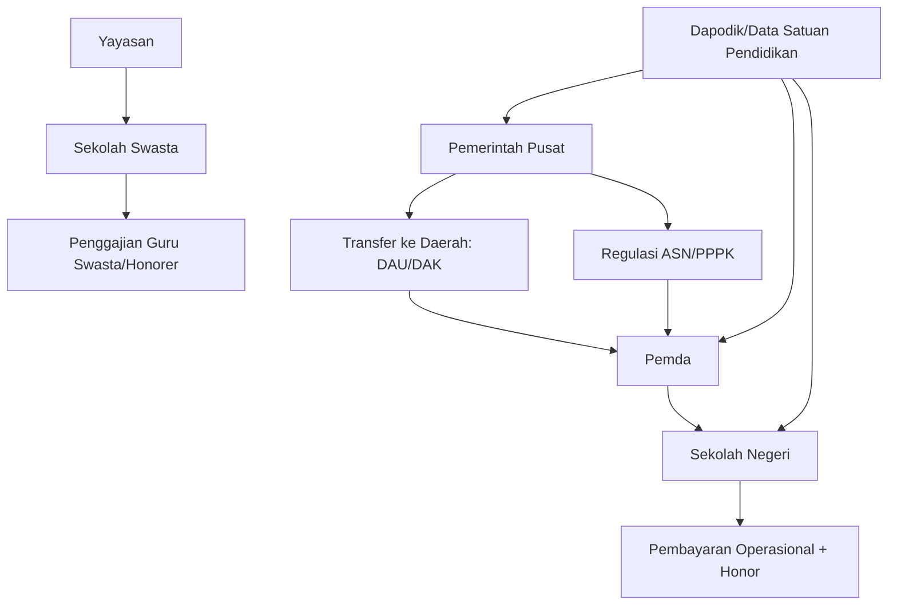
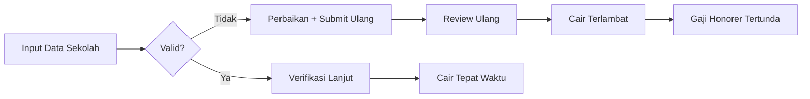
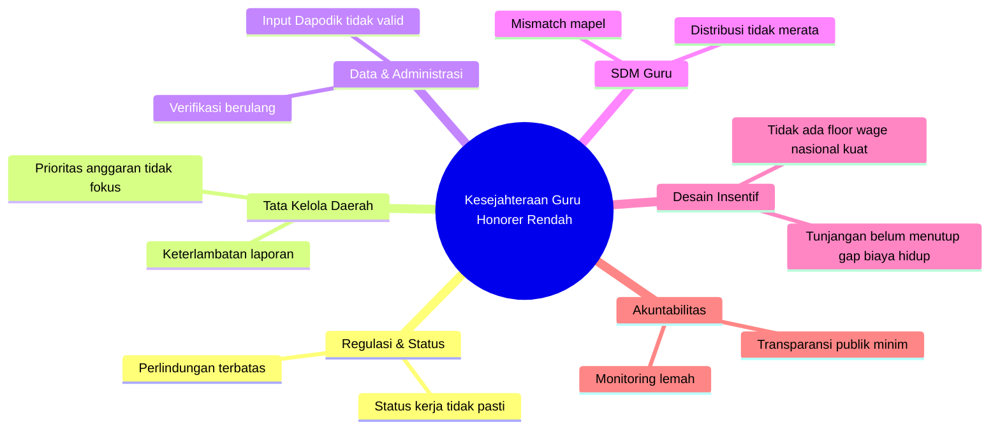

<YouTube url="https://www.youtube.com/watch?v=d1BEeFwlVQ0" title="Membongkar Masalah Gaji Guru Honorer" />

## 🎯 Pengantar: Kita Sering Marah ke Isu yang Benar, Tapi ke Target yang Salah

Kalau bicara pendidikan Indonesia, ada satu kalimat yang hampir semua orang setuju: **guru harus sejahtera**. 🙏

Masalahnya, di lapangan masih ada guru honorer dengan pendapatan jauh di bawah UMR (Upah Minimum Regional), bahkan pernah viral nominal yang sangat tidak manusiawi. Di titik ini, emosi publik wajar. Tetapi, kalau ingin menyelesaikan masalah, kita tidak bisa hanya marah—kita harus **membongkar arsitektur masalahnya**: siapa berwenang, uang mengalir dari mana, data diverifikasi bagaimana, bottleneck (titik sumbatan) terjadi di mana, dan kenapa solusi sering berhenti di slogan.

Artikel ini merapikan persoalan itu secara runtut: dari akar, cabang, sampai desain solusi yang realistis.

---

## 🧱 Tesis Utama

Masalah kesejahteraan guru honorer **bukan semata kekurangan anggaran nasional**. Ini adalah kombinasi dari:

1. **Desain kewenangan yang terfragmentasi** (terpecah antara pusat-daerah-sekolah),
2. **Kualitas tata kelola daerah yang timpang**,
3. **Sistem data dan verifikasi yang belum matang merata**,
4. **Distribusi guru yang tidak presisi**,
5. **Rekrutmen dan pengangkatan yang tidak sinkron dengan kebutuhan riil kelas**,
6. **Minimnya standar nasional untuk batas bawah kesejahteraan guru non-ASN**.

Kalau enam simpul ini tidak dibenahi bersamaan, kenaikan tunjangan apa pun hanya akan menjadi “painkiller” (obat pereda nyeri), bukan “cure” (penyembuhan).

---

## 🧭 Peta Aktor: Siapa Melakukan Apa?

<Callout type="important" title="Intinya">
Dalam banyak kasus historis, **gaji honorer bukan transaksi langsung pusat ke individu guru**. Karena itu, kritik publik perlu presisi: bedakan mana masalah regulasi nasional, mana masalah tata kelola pemda, dan mana masalah manajemen sekolah.
</Callout>

---

## 📌 Akar Masalah #1 — Status Kepegawaian Abu-abu (Grey Zone)

Istilah “honorer” selama bertahun-tahun dipakai sebagai solusi cepat untuk menutup kebutuhan guru. Namun “solusi cepat” ini menciptakan **status kerja tanpa perlindungan penuh**.

- Tidak semua punya jalur karier jelas.
- Tidak semua punya standar upah layak yang tegas.
- Tidak semua punya kepastian pembayaran tepat waktu.

Dalam istilah kebijakan publik, ini disebut **institutional ambiguity** (ketidakjelasan kelembagaan): orang bekerja di fungsi vital negara, tetapi basis legal dan fiskalnya tidak setara dengan bobot tugasnya.

---

## 📌 Akar Masalah #2 — Fragmentasi Kewenangan: Pusat, Daerah, Sekolah Tidak Sinkron

Secara praktik, pendidikan kita berjalan dalam model desentralisasi. Itu bagus untuk konteks lokal, tetapi berisiko tinggi jika kapasitas eksekusi tiap daerah berbeda jauh.

### Dampaknya:
- Daerah A bisa disiplin laporan dan lancar bayar.
- Daerah B lambat administratif, dampaknya gaji tersendat.
- Daerah C mampu menambah insentif lokal.
- Daerah D tidak mampu, guru terpaksa menerima nominal minim.

Akhirnya, kualitas hidup guru bisa ditentukan “kode pos”, bukan kualitas kerja. Ini jelas tidak adil. ⚖️

---

## 📌 Akar Masalah #3 — Dana Ada, Tapi Alirannya Tersendat

Salah satu isu paling sering muncul adalah keterlambatan pencairan yang berdampak ke gaji. Pada level teknis, banyak tersangkut pada kualitas data dan ketepatan laporan.

### Titik rawan yang sering terjadi:
- Input data Dapodik tidak valid,
- Dokumen pendukung tidak sinkron,
- Rekonsiliasi data lambat,
- Laporan pemda terlambat, sehingga tahap penyaluran berikutnya tertahan.

<Callout type="warning" title="Masalah Verifikasi Bukan Musuh">
Banyak orang ingin verifikasi dipangkas. Padahal verifikasi itu pagar anti-fiktif (anti data palsu, anti sekolah fiktif, anti kebocoran). Solusinya bukan menghapus verifikasi, melainkan **menaikkan kualitas data hulu**.
</Callout>

---

## 📌 Akar Masalah #4 — Distribusi Guru Tidak Seimbang (Mismatch)

Indonesia bukan hanya soal “kurang guru”, tetapi **salah sebar guru**.

- Ada wilayah/jenjang/mapel (mata pelajaran) kekurangan akut.
- Ada wilayah/mapel justru kelebihan.

Secara konsep, ini disebut **allocative inefficiency** (ketidakefisienan alokasi): sumber daya ada, tapi tidak berada di titik kebutuhan.

### Konsekuensi langsung:
1. Sekolah kekurangan guru merekrut honorer darurat.
2. Beban BOS dan anggaran sekolah menipis.
3. Upah tertekan karena perekrutan bukan berbasis desain jangka panjang.

---

## 📌 Akar Masalah #5 — Formasi PPPK Belum Terserap Optimal

PPPK (Pegawai Pemerintah dengan Perjanjian Kerja) adalah jembatan penting dari status rawan menuju status lebih terlindungi. Namun di lapangan, banyak daerah belum mengusulkan/menyerap formasi secara optimal.

Alasan yang sering muncul:
- kehati-hatian fiskal daerah,
- perencanaan SDM yang belum presisi,
- kapasitas administrasi seleksi yang belum merata,
- ketidakselarasan data kebutuhan riil sekolah.

Akibatnya, ruang formal tersedia, tapi transisi dari honorer ke skema lebih aman berjalan lambat.

---

## 📌 Akar Masalah #6 — Standar Kelayakan Upah Non-ASN Belum Kokoh Nasional

Selama standar minimum nasional belum tegas, kesejahteraan guru honorer akan sangat tergantung kemampuan dan niat pemangku kebijakan lokal.

Padahal, pendidikan adalah layanan dasar. Maka setidaknya perlu ada:
- **floor wage policy** (batas bawah upah nasional) untuk peran guru non-ASN,
- skema top-up (penambah) berbasis daerah tertinggal,
- formula transparan yang bisa diaudit publik.

---

## 🧠 Akar Masalah #7 — Kita Terlalu Fokus Input, Kurang Fokus Sistem

Diskusi publik sering berhenti di “tambah anggaran”. Padahal isu pendidikan itu sistemik:
- rekrutmen,
- penempatan,
- pelatihan,
- evaluasi performa,
- insentif,
- perlindungan sosial,
- kepemimpinan sekolah,
- kualitas pembelajaran kelas.

Kalau hanya satu variabel disentuh, hasilnya tambal sulam.

---

## 🧩 Problem Tree (Pohon Masalah) Pendidikan Guru Honorer

---

## ✅ Peta Solusi Berlapis: Dari Darurat ke Reformasi Struktural

## 1) Solusi 0–12 Bulan (Quick Wins / Menang Cepat)

### a. Tetapkan Ambang Minimum Kesejahteraan Guru Non-ASN
Buat batas bawah nasional berbasis indeks biaya hidup daerah (cost of living / biaya hidup). Jadi tidak ada lagi kasus upah ekstrem di bawah kelayakan dasar.

### b. Dashboard Keterlambatan Gaji Real-Time
Publik bisa melihat sekolah/daerah mana yang menunggak pembayaran. Transparansi menciptakan tekanan perbaikan. 📊

### c. Klinik Dapodik di Tiap Kabupaten/Kota
Bukan sekadar sosialisasi, tapi tim pendamping input-validasi sampai lolos verifikasi.

### d. Kanal Aduan Terintegrasi
Satu pintu aduan keterlambatan gaji, dengan SLA (service level agreement / batas waktu layanan) jelas.

---

## 2) Solusi 1–3 Tahun (Reform Menengah)

### a. National Teacher Distribution Engine
Mesin pemetaan nasional kebutuhan guru per wilayah-mapel-jenjang secara dinamis.

### b. Reformasi Formasi PPPK Berbasis Data Kelas
Formasi tidak lagi administratif semata, tapi benar-benar mengikuti kebutuhan jam mengajar riil.

### c. Kontrak Kinerja Pemda untuk Dana Pendidikan
Sebagian transfer dikaitkan dengan kinerja tata kelola: ketepatan salur, transparansi, kualitas data, dan outcome pembelajaran.

### d. Standarisasi Kompetensi Manajemen Sekolah
Kepala sekolah dan operator harus diberi sertifikasi tata kelola data-anggaran agar kesalahan administratif tidak terus berulang.

---

## 3) Solusi 3–10 Tahun (Reformasi Struktur)

### a. Redesign Arsitektur Kepegawaian Guru
Arahkan semua posisi pengajar inti menuju jalur formal terlindungi (PNS/PPPK atau skema ekuivalen kuat).

### b. Single Education Fiscal Map
Peta tunggal aliran dana pendidikan dari pusat hingga sekolah, bisa dilihat publik (open budget / anggaran terbuka).

### c. Insentif Berbasis Kompetensi + Konteks
Skema kompensasi mempertimbangkan:
- kompetensi,
- performa,
- lokasi khusus (terpencil/3T),
- beban kerja nyata.

### d. Bangun Ekosistem Profesi Guru
Kesejahteraan bukan cuma gaji: perlindungan kesehatan mental, pelatihan berkelanjutan, komunitas belajar, dan mobilitas karier.

---

## 📐 Kerangka Eksekusi: Siapa Mengerjakan Apa?

| Aktor | Tanggung Jawab Kunci | KPI (Indikator Kinerja) |
|---|---|---|
| Pemerintah Pusat | Regulasi minimum upah, dashboard nasional, desain transfer berbasis kinerja | Penurunan kasus gaji ekstrem, peningkatan ketepatan salur |
| Pemda | Ketepatan laporan, disiplin penggajian, usulan formasi berbasis kebutuhan | Persentase bayar tepat waktu, serapan formasi PPPK |
| Sekolah | Kualitas data, perencanaan kebutuhan guru, akuntabilitas penggunaan BOS | Validitas data Dapodik, nol tunggakan internal |
| Komunitas/Publik | Pengawasan partisipatif dan aduan berbasis bukti | Jumlah aduan terselesaikan tepat waktu |

---

## 🧮 Prinsip Keadilan: Jangan Lagi Menormalisasi "Pengabdian = Kemiskinan"

Ada kekeliruan moral yang sering terjadi: seolah karena profesi guru adalah pengabdian, maka wajar jika kesejahteraan rendah. Ini salah total.

**Pengabdian tanpa sistem yang adil akan berakhir jadi eksploitasi.**

Kalau kita sungguh ingin kualitas SDM naik, maka guru tidak boleh bertahan hidup dari ketidakpastian. Mereka harus punya energi utuh untuk mengajar, bukan habis untuk bertahan hidup.

---

## 🧠 Terjemahan Istilah Penting (Kosakata Asing → Indonesia)

- *Bottleneck* → titik sumbatan proses
- *Grey zone* → wilayah abu-abu/ketidakjelasan status
- *Mismatch* → ketidaksesuaian
- *Allocative inefficiency* → ketidakefisienan alokasi
- *Floor wage policy* → kebijakan batas upah minimum
- *Quick wins* → hasil cepat tahap awal
- *Outcome* → hasil akhir yang terukur
- *Open budget* → anggaran terbuka
- *Service Level Agreement (SLA)* → standar batas waktu layanan

---

## 🚀 Penutup: Reformasi Pendidikan Butuh Keberanian Sistemik

Kita sering mencari kambing hitam tunggal: menteri, pemda, atau sekolah. Padahal masalah ini adalah **masalah sistem**, jadi jawabannya juga harus **sistemik**.

Urutannya jelas:
1. Pastikan tidak ada guru hidup di bawah batas kelayakan.
2. Rapikan data dan aliran anggaran agar gaji tidak terlambat.
3. Benahi distribusi guru dan percepat jalur formalisasi status.
4. Kunci dengan transparansi publik dan kontrak kinerja.

Kalau ini dikerjakan serius, kita bukan hanya menyelamatkan guru honorer—kita sedang memperbaiki fondasi peradaban Indonesia. 🇮🇩📚

<Callout type="success" title="Kalimat Kunci">
**Kurikulum terbaik pun akan gagal jika gurunya dipaksa hidup dalam ketidakpastian.**
</Callout>

<Callout type="cite" title="Sumber Utama">
- Video: "Membongkar Masalah Gaji Guru Honorer" (YouTube)
- URL: https://www.youtube.com/watch?v=d1BEeFwlVQ0
- Ditambah sintesis kebijakan publik, tata kelola anggaran, dan desain reformasi sistem pendidikan.
</Callout>
