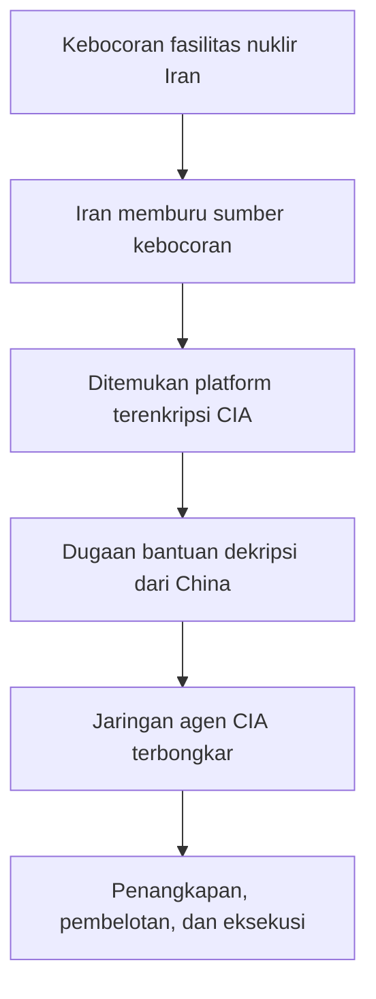
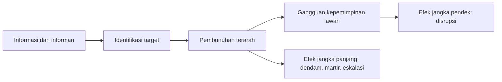
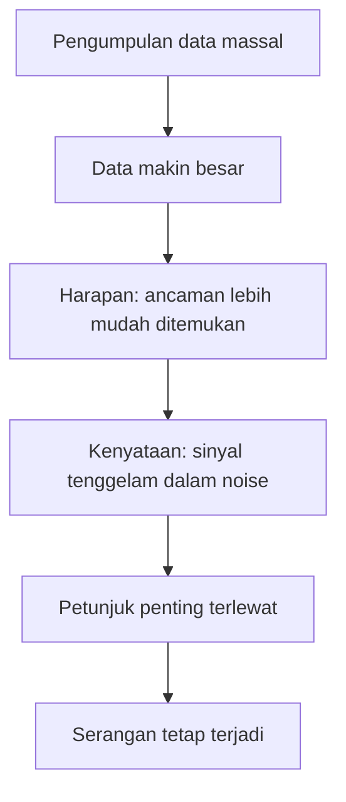

## 🎯 Pendahuluan: Dunia Intelijen Modern Tidak Lagi Hanya Soal Mata-Mata Berkacamata Hitam

Kalau kita membayangkan dunia intelijen, imajinasi populer biasanya langsung berlari ke satu paket gambar yang sudah sangat klasik: agen rahasia, sandi terenkripsi, koper hitam, pistol bersilencer, pengkhianat, dan pembunuhan misterius di hotel asing. Gambaran itu tidak sepenuhnya salah, tetapi hari ini ia sudah **tidak cukup**. Dunia intelijen modern jauh lebih besar, lebih kabur, dan lebih berbahaya daripada sekadar kisah mata-mata tradisional. Ia melibatkan perang siber, penyiksaan sistematis, *black sites* — **penjara rahasia**, pengawasan massal, kerja sama antara negara dan perusahaan teknologi, manipulasi hukum, hingga pembunuhan jarak jauh dengan drone. 🛰️

Dokumenter DW *Spies, informants and new enemies – Today’s intelligence agencies* sangat penting karena tidak membahas intelijen sebagai tema romantik, melainkan sebagai **mesin kekuasaan global**. Ia memperlihatkan bagaimana badan-badan intelijen seperti CIA, NSA, Mossad, dinas Rusia, China, Iran, hingga badan intelijen Jerman bukan hanya mengumpulkan informasi, tetapi juga membentuk perang, mengaburkan hukum, dan kadang-kadang tumbuh menjadi struktur yang nyaris kebal dari pengawasan demokratis.

Yang membuat dokumenter ini kuat adalah perspektifnya yang tidak naif. Ia tidak bilang bahwa badan intelijen tidak dibutuhkan. Ancaman nyata memang ada: terorisme, sabotase, infiltrasi asing, perang pengaruh, radikalisasi, dan konflik geopolitik. Tetapi dokumenter ini juga menunjukkan sisi yang lebih gelap: ketika badan intelijen diberi kekuasaan terlalu besar, dengan dalih keamanan, mereka bisa berubah dari pelindung publik menjadi aktor yang justru **mengancam kebebasan publik**. ⚠️

Kita melihat pola yang berulang: sebuah ancaman muncul, negara panik, lalu aparat intelijen diberi ruang ekstra. Sedikit demi sedikit, aturan dilonggarkan. Pengawasan meluas. Penyiksaan dibenarkan dengan nama interogasi. Pembunuhan terarah disebut efisiensi. Pengumpulan data massal disebut pencegahan. Kerja sama dengan rezim lain disebut kebutuhan strategis. Dan lama-kelamaan, publik hidup di bawah sistem yang bahkan para legislatornya sendiri tidak sepenuhnya pahami.

Artikel ini akan membedah isi dokumenter tersebut secara runtut, mendalam, dan lengkap. Kita akan melihat bagaimana Iran membongkar jaringan CIA, bagaimana Rusia memburu musuh di luar negeri, bagaimana Amerika Serikat mengubah perang melawan teror menjadi sistem global penyiksaan dan pengawasan, bagaimana Israel menjadikan pembunuhan terarah sebagai alat strategis, dan bagaimana ledakan data digital justru menciptakan paradoks: semakin banyak data dikumpulkan, semakin mudah ancaman nyata tenggelam di dalam kebisingan. 🧠

<Callout type="important" title="Tesis utama artikel ini">
Badan intelijen modern tidak lagi sekadar bertugas mengetahui apa yang disembunyikan musuh. Mereka kini beroperasi sebagai instrumen kekuasaan yang bisa memata-matai, menyiksa, menculik, membunuh, memanipulasi hukum, dan mengumpulkan data dalam skala yang melampaui kemampuan pengawasan demokratis. Itulah mengapa pertanyaan terbesar hari ini bukan hanya “bagaimana mereka melindungi kita?”, tetapi juga “siapa yang melindungi kita dari mereka?”
</Callout>

---

## 🧨 1. Iran, CIA, dan Runtuhnya Kerahasiaan: Ketika Pesan Rahasia Menjadi Jalan Menuju Bencana

Dokumenter dibuka dengan sebuah konteks yang sangat penting: **Pittsburgh, 2009**, ketika Amerika Serikat, Inggris, dan Prancis membeberkan bukti bahwa Iran membangun fasilitas pengayaan uranium secara rahasia. Dari sudut pandang publik, ini tampak seperti keberhasilan intelijen Barat. Tetapi dari sudut pandang Iran, pengumuman itu adalah tanda bahwa ada kebocoran serius dari dalam.

Seperti yang sering terjadi dalam dunia intelijen, begitu sebuah rahasia strategis terbongkar, rezim yang merasa dibocorkan langsung memburu sumber kebocoran. Iran mulai mengejar siapa yang telah membuka rahasia program nuklirnya. Dalam proses itu, mereka menemukan sebuah platform terenkripsi yang dipakai agen CIA untuk bertukar informasi.

Ini titik yang sangat fatal. Dalam dunia spionase, saluran komunikasi adalah urat nadi. Begitu saluran itu ditembus, bukan hanya satu agen yang terancam, melainkan seluruh jaringan. Dokumenter lalu menyebut dugaan yang sangat menarik: Iran kemungkinan tidak membongkar sistem itu sendirian. Ada spekulasi bahwa pesan terenkripsi tersebut mungkin diteruskan ke China, yang memiliki **supercomputer** — **superkomputer**, komputer dengan kemampuan komputasi sangat tinggi — dan relasi baik dengan Iran. Dengan bantuan kekuatan komputasi besar, pesan-pesan itu diduga berhasil dipecahkan.

Akibatnya sangat menghancurkan. Jaringan agen CIA terbongkar. Beberapa agen dibui, sebagian dieksekusi, dan lebih buruk lagi, ada petugas CIA yang membelot atau “diputar” oleh musuh. Dokumenter menyinggung nama **Jerry Lee**, mantan CIA yang membantu intelijen China mengidentifikasi setidaknya 20 informan CIA di negara itu. Banyak dari mereka lalu dipenjara atau dibunuh.

Yang paling mengerikan adalah deskripsi bahwa dalam satu kasus, bukan hanya agen yang dieksekusi, tetapi juga istrinya yang sedang hamil, dan eksekusi itu ditampilkan ke staf kementerian melalui televisi sirkuit tertutup. Ini bukan hanya hukuman. Ini adalah **teater teror negara** — pertunjukan kekejaman untuk mengirim pesan kepada siapa pun yang berpikir untuk berkhianat.

Dari sini kita belajar satu hal mendasar: dunia intelijen modern bukan hanya perang teknologi, tetapi juga perang ketahanan jaringan manusia. Dan ketika satu sistem komunikasi runtuh, dampaknya bisa menyapu bersih kerja bertahun-tahun dalam hitungan minggu. 😶

---

## 🐉 2. China dan Rusia: Dua Model Ancaman Intelijen yang Berbeda

Salah satu kutipan paling tajam dalam dokumenter datang dari mantan pejabat senior NSA yang mengatakan: **Rusia seperti badai, China seperti perubahan iklim**. Analogi ini sangat cerdas. Rusia terlihat kasar, dramatis, dan menghantam langsung. China lebih sunyi, bertahap, sistemik, dan jangka panjang.

### Rusia: model operasi yang demonstratif

Rusia dalam dokumenter ini tampil sebagai negara yang tidak segan memakai pembunuhan untuk mengirim pesan. Contoh paling jelas adalah pembunuhan **Zelimkhan Khangoshvili** di Berlin pada 2019. Seorang pria Chechnya yang memiliki sejarah perlawanan terhadap Rusia ditembak di taman Tiergarten oleh pengendara sepeda yang membawa pistol bersilencer.

Kasus ini tidak berdiri sendiri. Dokumenter menunjukkan bahwa Khangoshvili dianggap musuh Rusia berkali-kali lipat: ia pernah melawan Rusia sebagai milisi, punya koneksi dengan intelijen Georgia, dan berpindah-pindah wilayah. Dalam logika dinas rahasia Rusia, orang seperti itu bukan sekadar target lama, tetapi simbol pengkhianatan dan perlawanan yang belum selesai.

Yang penting di sini adalah pesan politiknya. Pembunuhan seperti ini tidak hanya bertujuan menghilangkan individu. Ia juga mengatakan kepada semua lawan Rusia: *kami bisa menjangkau kalian di mana pun*. Dalam bahasa intelijen, pembunuhan semacam ini adalah **signaling** — **pengiriman sinyal strategis**.

### China: model penetrasi yang sunyi

China tampil berbeda. Ia tidak terlalu menonjol dalam bentuk operasi pembunuhan spektakuler, tetapi lebih menakutkan dalam skala infiltrasi yang tenang. Dokumenter menggambarkannya sebagai negara yang mengintai dalam jangka panjang, memanfaatkan teknologi, kapasitas komputasi, dan kedalaman birokrasi. Jika Rusia menakutkan karena ledakannya, China menakutkan karena ia bisa menembus sistem tanpa selalu menimbulkan suara keras.

Maka, bila Rusia adalah intelijen yang sering mengandalkan pukulan demonstratif, China lebih tampak sebagai intelijen yang ingin **meresap ke dalam struktur lawan**. Satu bersifat teatrikal, satu lagi bersifat klimatologis: pelan, luas, dan mengubah lingkungan tanpa terasa sampai semuanya terlambat. 🌫️

---

## 🔫 3. Membunuh di Luar Negeri: Dari Tiergarten sampai Skripal

Dokumenter lalu memperluas pembahasan tentang pembunuhan lintas batas sebagai praktik intelijen. Kasus Khangoshvili di Berlin diletakkan berdampingan dengan peracunan **Sergei Skripal** di Inggris. Pesan yang ingin disampaikan jelas: bagi sebagian dinas rahasia, pengkhianat dan musuh tidak pernah benar-benar aman hanya karena mereka telah pindah negara.

Ini penting karena menunjukkan perubahan norma. Pada masa Perang Dingin, memang ada pembunuhan rahasia, tetapi ada juga tradisi **pertukaran mata-mata**. Tokoh seperti Rudolf Abel bisa ditukar dengan tahanan Amerika. Ada semacam aturan tak tertulis di antara dua blok besar. Tetapi kini, dokumenter menunjukkan bahwa pengendalian diri semacam itu makin menipis. Yang tersisa bukan lagi etika perang dingin yang sinis tetapi terukur, melainkan logika: jika target berguna untuk dibunuh, maka bunuhlah.

Dokumenter juga mengingatkan bahwa bahkan di masa lalu sudah ada contoh-contoh ikonik seperti:

- rencana racun KGB melalui peluru beracun dari kotak rokok,
- pembunuhan **Georgi Markov** di London dengan peluru beracun yang ditembakkan dari payung,
- dan alat pembunuh beracun CIA yang diungkap ke Kongres Amerika pada 1975.

Semua ini memperlihatkan satu hal: pembunuhan oleh dinas rahasia bukan anomali baru. Yang baru adalah **menurunnya rasa malu internasional**. Dokumenter secara eksplisit menyebut bahwa pengekangan makin hilang karena komunitas internasional tidak cukup kuat untuk mengoreksi perilaku ini. Karena terbukti efektif, metode itu terus dipakai dengan semakin sedikit hambatan.

---

## 🧊 4. Dari Perang Dingin ke War on Terror: Ketika Sarung Tangan Dilepas

Salah satu poros utama dokumenter ini adalah pergeseran besar setelah **11 September 2001**. Banyak saksi dalam film menekankan bahwa bagi CIA, ada dunia **sebelum** 9/11 dan dunia **sesudah** 9/11. Salah satu tokoh paling terkenal dari era itu, Cofer Black, merumuskannya dengan kalimat yang kini nyaris legendaris: *after 9/11, the gloves came off* — **setelah 9/11, sarung tangan dilepas**, artinya segala pembatas lama dibuang.

Kalimat ini penting karena ia menjelaskan seluruh arsitektur kebijakan pasca-9/11. Amerika Serikat merasa telah diserang secara eksistensial. Dalam kepanikan itu, negara memberi aparatus intelijen ruang yang sangat luas untuk melakukan apa yang sebelumnya akan sulit dibenarkan. Hasilnya adalah transformasi besar:

- penjara rahasia dibangun,
- penyiksaan dilegalkan dengan istilah baru,
- negara asing direkrut menjadi mitra operasi kotor,
- penculikan lintas negara dinormalisasi,
- pengawasan massal diperluas,
- dan pada fase berikutnya pembunuhan dengan drone dibuat rutin.

Di atas kertas, semuanya dibenarkan sebagai bagian dari **war on terror** — **perang melawan teror**. Tetapi dokumenter ini terus bertanya: apakah perang itu benar-benar membuat dunia lebih aman, atau justru memperbesar kekuasaan lembaga intelijen sambil merusak demokrasi yang katanya sedang dibela?

<Callout type="warning" title="Paradoks pasca-9/11">
Pemerintah Amerika mengatakan para ekstremis menyerang kebebasan dan cara hidup demokratis Barat. Tetapi menurut banyak narasumber dokumenter, respons pertama negara justru adalah mengorbankan kebebasan, hak, dan prinsip negara hukum itu sendiri. Jika demikian, bukankah para ekstremis justru menang sebagian?
</Callout>

---

## ⛓️ 5. Black Sites: Ketika Penyiksaan Diberi Nama Baru agar Terdengar Legal

Bagian paling kelam dari dokumenter ini adalah pembahasan tentang **black sites** — penjara rahasia CIA di Polandia, Rumania, Thailand, Afghanistan, dan lokasi-lokasi lain. Di tempat-tempat inilah orang-orang yang dituduh terkait Al-Qaeda atau jaringan teror lain ditahan, diinterogasi, dan disiksa di luar pengawasan hukum biasa.

Dokumenter sangat detail dalam memperlihatkan bahwa praktik ini bukan penyimpangan liar oleh petugas rendahan, melainkan program yang mendapat dukungan dari pucuk pimpinan. Bahkan ada psikolog bernama **James E. Mitchell** yang dibayar jutaan dolar untuk mengembangkan apa yang disebut **enhanced interrogation methods** — *metode interogasi yang ditingkatkan*. Ungkapan ini terdengar teknokratis, padahal isinya brutal.

Teknik yang disebut antara lain:

- **attention grasp** — menarik tubuh tahanan secara kasar,
- **walling** — membanting tahanan ke dinding,
- **facial slap** — menampar wajah,
- **cramped confinement** — kurungan sempit,
- **stress positions** — posisi tubuh yang menyakitkan dalam waktu lama,
- **sleep deprivation** — penghilangan tidur,
- **waterboarding** — simulasi tenggelam,
- penggunaan serangga,
- hingga **mock burial** — simulasi penguburan hidup-hidup.

Masalah utamanya bukan hanya bahwa semua ini kejam. Masalahnya adalah negara berusaha mengubah bahasa agar kekejaman itu tampak administratif. Kata “torture” — **penyiksaan** — dihindari. Yang dipakai adalah istilah prosedural, seolah-olah jika namanya cukup klinis, maka realitasnya ikut berubah.

Dokumenter juga menghadirkan korban dan pengacara yang menunjukkan akibatnya: kehilangan mata, pelecehan seksual, ancaman terhadap keluarga, dipaksa buang air di pakaian sendiri karena dirantai, dan penghancuran total terhadap martabat manusia. Ini bukan sekadar interogasi keras. Ini adalah sistem penghancuran manusia dengan alasan negara. 😞

---

## 🧠 6. Mengapa Penyiksaan Tetap Dipakai, Padahal Sering Menghasilkan Kebohongan?

Salah satu bagian paling penting dari dokumenter adalah kritik terhadap efektivitas penyiksaan itu sendiri. Narasumber yang menelaah jutaan halaman dokumen CIA menyimpulkan bahwa ketika tahanan disiksa, mereka sering **mengarang informasi** untuk memberi penyiksa apa yang ingin didengar.

Ini poin yang sangat besar. Penyiksaan sering dibenarkan dengan logika utilitarian: kejam memang, tetapi diperlukan untuk menyelamatkan nyawa. Namun dokumenter ini memperlihatkan bahwa dalam banyak kasus, penyiksaan tidak hanya tidak bermoral, tetapi juga **tidak andal secara epistemik** — artinya, tidak dapat diandalkan untuk menghasilkan kebenaran.

Orang yang kesakitan dan putus asa akan mengatakan apa saja agar siksaan berhenti. Maka penyiksaan melahirkan dua kerusakan sekaligus:

1. **kerusakan moral** — negara merusak martabat manusia dan hukumnya sendiri,
2. **kerusakan intelijen** — negara justru mengotori datanya dengan kebohongan, fantasi, dan pengakuan palsu.

Dengan kata lain, penyiksaan bukan cuma jahat. Ia juga sering **bodoh** sebagai metode pencarian kebenaran. Tetapi karena ia memberi ilusi kendali dan memberi kepuasan psikologis kepada aparat yang panik, ia terus digunakan. Ini adalah salah satu bentuk paling berbahaya dari kekuasaan: tindakan kejam yang tetap bertahan bukan karena efektif, tetapi karena terasa tegas.

---

## 🛬 7. Extraordinary Rendition: Ketika Negara Menculik Orang di Jalan dan Menyebutnya Operasi

Dokumenter menyinggung kasus **Abu Omar** di Milan pada 2003, yang diculik di siang bolong oleh puluhan agen CIA. Ini adalah contoh dari praktik yang dikenal sebagai **extraordinary rendition** — **pemindahan paksa rahasia lintas negara**, biasanya untuk membawa seseorang ke lokasi di mana ia bisa diinterogasi atau disiksa tanpa perlindungan hukum yang layak.

Di sini terlihat terang bahwa CIA tidak terlalu peduli melanggar hukum negara sekutu, termasuk hukum Italia. Ini penting karena menunjukkan watak dasar dari banyak operasi intelijen besar: ketika tujuan dianggap cukup penting, kedaulatan negara lain diperlakukan sebagai hambatan administratif, bukan prinsip.

Dan yang lebih memprihatinkan, semua ini tidak mungkin berjalan tanpa kerja sama negara-negara lain. Dokumenter menekankan bahwa program penahanan dan interogasi CIA **mustahil** dijalankan di tanah Amerika sendiri, sehingga dibutuhkan kolaborasi pejabat asing yang bersedia membantu — dan sering kali dibayar untuk itu.

Jadi di sini kita melihat bahwa kekuasaan intelijen global bukan hanya soal satu negara besar yang bertindak semaunya. Ia juga soal **jaringan kolaborator negara-negara lain** yang bersedia menyediakan wilayah, fasilitas, perlindungan, dan kerahasiaan.

---

## 🇮🇱 8. Israel, Shin Bet, Mossad, dan Logika Pembunuhan Terarah

Dokumenter lalu masuk ke Israel, negara yang sudah puluhan tahun hidup dalam konflik dan karena itu sering menjadi laboratorium ekstrem untuk operasi intelijen. Salah satu kisah yang diangkat adalah pembunuhan **Yahya Ayyash** pada 1996, sosok penting dalam pembuatan bom bagi kelompok militan Palestina.

Dalam operasi itu, seorang informan yang bekerja untuk **Shin Bet** — badan intelijen domestik Israel — menyelipkan telepon seluler yang berisi bahan peledak. Ketika alat itu meledak, Ayyash tewas. Di sini kita melihat kecanggihan klasik intelijen: bukan kekuatan besar, tetapi **akses dekat melalui informan**.

Dokumenter lalu memperluas ke Mossad, yang juga dikenal melakukan pembunuhan terarah. Argumen yang diberikan mantan kepala Mossad sederhana dan dingin: jika seorang pemimpin teror tahu dirinya sedang diburu, maka ia akan menghabiskan banyak waktu untuk melindungi diri. Waktu itu adalah waktu yang tidak bisa dipakai untuk mengorganisasi teror. Ini adalah logika **attrition by pressure** — **pelemahan dengan tekanan konstan**.

Ada juga contoh pembunuhan **Mahmud al-Mabhouh** di Dubai tahun 2010. Para agen Mossad menyamar sebagai turis, mengikuti target di hotel, dan kemudian membunuhnya di kamar. Dokumenter mencatat bahwa operasi itu sebenarnya menyisakan kesalahan serius: penggunaan identitas yang berulang membuat para agen akhirnya terungkap.

Ada pula contoh pembunuhan pemimpin Islamic Jihad di Malta pada 1995, yang menurut narasi dokumenter sempat melemahkan organisasi tersebut selama berbulan-bulan.

Jadi dari sudut pandang operasional, pembunuhan terarah memang bisa menghasilkan efek jangka pendek yang nyata:

- kepemimpinan musuh terguncang,
- sumber daya musuh terserap untuk perlindungan,
- struktur organisasi terganggu,
- dan simbol ketidakamanan ditanamkan ke tubuh lawan.

Tetapi pertanyaan besarnya tetap menggantung: apakah efek jangka pendek itu setara dengan biaya moral dan politik jangka panjangnya? 🤔

---

## ☢️ 9. Iran Lagi: Ilmuwan Nuklir, Senjata Jarak Jauh, dan Operasi yang Tidak Pernah Diakui Penuh

Israel melihat Iran sebagai ancaman strategis terbesar, terutama karena ambisi nuklirnya. Dokumenter menegaskan bahwa selain operasi media dan diplomasi, Mossad juga diduga membunuh beberapa ilmuwan nuklir Iran. Di Iran, para ilmuwan yang terbunuh itu diperingati sebagai martir.

Puncaknya adalah kasus **Mohsen Fakhrizadeh** pada 2020, tokoh kunci program nuklir Iran. Menurut dokumenter, ia diserang saat berkendara bersama istrinya, dan senjata mesin yang disamarkan dipicu dari jarak jauh. Ini memperlihatkan satu evolusi penting: pembunuhan intelijen tidak lagi selalu memerlukan agen yang berada beberapa meter dari target. Teknologi memungkinkan jarak, otomatisasi, dan pengurangan risiko bagi pelaksana.

Tetapi dokumenter juga menyinggung satu fakta menarik: meski begitu banyak warga Iran dibunuh di berbagai tempat dalam beberapa tahun terakhir, hal itu tidak otomatis meledakkan perang terbuka. Ini menunjukkan bahwa dunia intelijen sering bekerja di zona yang berada di bawah ambang perang resmi. Ada kekerasan nyata, korban nyata, dan pesan nyata, tetapi semuanya dikemas sedemikian rupa agar tidak memicu eskalasi total.

Inilah salah satu wajah paling khas intelijen modern: **perang tanpa deklarasi**, pembunuhan tanpa pengakuan penuh, dan eskalasi yang dijaga tetap berada di bawah titik ledak resmi.

---

## 👤 10. Michael German dan Pelajaran Penting dari Penyamaran di Kelompok Ekstrem Kanan

Dokumenter ini tidak hanya berbicara tentang ancaman asing. Ia juga menunjukkan bagaimana agen FBI seperti **Michael German** menyusup ke kelompok teror kanan-jauh di Amerika Serikat. Bagian ini penting karena memberi lapisan analisis yang lebih halus tentang terorisme.

German mengatakan bahwa **terrorism is a tactic** — *terorisme adalah taktik*. Ini kalimat yang sangat penting. Artinya, terorisme bukan identitas esensial suatu kelompok, melainkan metode yang biasanya dipilih oleh aktor yang relatif lemah. Dengan kata lain, ketika sebuah kelompok memilih teror, itu sering merupakan gejala keterbatasan kekuatan mereka.

Lebih jauh lagi, pengalaman German menunjukkan bahwa kelompok-kelompok ekstrem ini tidak hidup di ruang hampa. Mereka bereaksi terhadap tindakan pemerintah: Ruby Ridge, Waco, penyiksaan, penculikan, penahanan tanpa pengadilan. Jika negara melanggar hukum dan bertindak brutal, itu bisa menjadi bahan bakar narasi bagi kelompok ekstrem untuk merekrut anggota baru.

Ini adalah kritik sangat tajam terhadap war on terror. Negara mengira bahwa semakin keras responsnya, semakin aman ia. Tetapi dalam banyak kasus, justru kekerasan negara menjadi **bahan propaganda gratis** bagi para ekstremis.

---

## 📊 11. Ledakan Data: Mengapa Mengumpulkan Segalanya Tidak Sama dengan Memahami Segalanya?

Salah satu tema paling penting dalam dokumenter ini adalah kritik terhadap **surveillance capitalism + intelligence fusion** — perpaduan kapitalisme pengawasan dan penyedotan data oleh badan intelijen. Sejak revolusi digital, badan-badan intelijen di seluruh dunia memasuki semacam *gold rush* — **demam emas** — untuk mengumpulkan data sebanyak mungkin.

Logikanya tampak meyakinkan: jika kita punya semua data, kita bisa mencegah semua ancaman. Maka lahirlah:

- pusat kontra-terorisme raksasa,
- anggaran intelijen puluhan miliar dolar,
- 17 badan intelijen Amerika yang bertumpuk,
- izin keamanan (*clearance*) yang bahkan pemerintah sendiri tidak bisa hitung jumlah totalnya,
- taman server raksasa NSA di Utah,
- dan kemitraan diam-diam dengan perusahaan teknologi yang menangkap hampir semua jejak perilaku digital kita.

Tetapi dokumenter memutar logika itu. Masalahnya justru: **banjir data bisa menenggelamkan petunjuk penting**. Konspirasi 9/11, kata salah satu narasumber, hilang di tengah arus data yang sudah besar — dan sesudah itu, arus tersebut justru berubah menjadi sungai deras yang makin sulit diurai.

Kasus **Fort Hood** menjadi contoh yang bagus. Ada petunjuk yang seharusnya menyalakan alarm, tetapi ledakan data dalam FBI membuat sinyal itu tenggelam. Ini pelajaran yang sangat penting dalam epistemologi intelijen modern: lebih banyak data tidak otomatis berarti lebih banyak pengetahuan. Kadang yang terjadi justru kebalikannya — **noise** atau kebisingan meledak, dan sinyal tenggelam.

---

## 🏢 12. Negara, Perusahaan Teknologi, dan Pasar sebagai Lumbung Pengawasan

Dokumenter juga menyoroti perubahan struktural yang sangat penting: pemerintah modern menyadari bahwa untuk mengawasi publik dalam skala besar, mereka membutuhkan data yang jauh melampaui apa yang bisa mereka kumpulkan sendiri. Maka negara membiarkan pasar membangun infrastrukturnya.

Perusahaan teknologi diberi ruang untuk mencatat:

- pencarian,
- klik,
- lokasi,
- pola konsumsi,
- relasi sosial,
- perilaku daring,
- preferensi,
- dan sinyal prediktif lain.

Setelah pasar mengumpulkan semua itu, negara tinggal “menyedot dengan sedotan” ketika perlu. Ini analogi yang sangat kuat dalam dokumenter. Publik merasa mereka sedang sekadar mencari sesuatu di Google, berinteraksi di platform, atau memakai aplikasi sehari-hari. Padahal setiap tindakan digital menjadi bahan mentah untuk prediksi perilaku.

Jadi pengawasan modern tidak lagi hanya berbentuk polisi rahasia yang menguntit secara fisik. Ia berbentuk **ekosistem data** di mana negara dan pasar saling menyokong. Dan di sinilah demokrasi menghadapi tantangan baru: ancamannya tidak lagi selalu kasar dan terlihat, tetapi sistemik, nyaman, dan terintegrasi ke dalam kehidupan sehari-hari. 📱

---

## 🧾 13. Snowden, NSA, BND, dan Krisis Akuntabilitas dalam Kerja Sama Antar-Dinas

Ketika **Edward Snowden** membocorkan dokumen NSA, dunia mulai melihat skala pengawasan global yang sebelumnya hanya diduga samar-samar. Dokumenter lalu menunjukkan bahwa implikasinya tidak berhenti pada Amerika. Jerman pun terseret, terutama melalui peran **BND** — badan intelijen luar negeri Jerman.

Ada tuduhan bahwa NSA mengirim **search terms** — kata kunci pencarian atau parameter target — dan BND menyediakan data yang relevan, termasuk untuk keperluan seperti perang drone. Jika ini benar, maka badan intelijen suatu negara secara sistematis membantu negara lain menembus hak-hak konstitusional warga melalui mekanisme kerja sama teknis.

Masalahnya sangat besar. Ketika satu badan intelijen tidak boleh secara hukum melakukan sesuatu terhadap warga negaranya sendiri, ia bisa memanfaatkan badan intelijen negara lain untuk melakukannya secara tidak langsung. Ini menghasilkan sistem yang sangat berbahaya: **outsourcing pelanggaran hak** melalui kemitraan intelijen.

Di sini kita melihat bahwa tantangan modern bukan lagi hanya penyalahgunaan oleh satu lembaga tunggal, tetapi **jaringan lembaga** yang saling memberi perlindungan, data, dan jarak tanggung jawab.

---

## 🇩🇪 14. Jerman sebagai Medan Pertempuran Intelijen: Informan, Kerahasiaan, dan Kegagalan Mencegah Serangan

Di bagian akhir, dokumenter memberi perhatian besar pada Jerman. Negara ini digambarkan sebagai **medan tempur intelijen** tempat agen Rusia, China, Iran, Turki, Amerika, dan aktor lain saling bergerak. Tetapi problem Jerman bukan hanya disusupi pihak luar. Problemnya juga ada pada struktur dalam negeri yang terlalu tertutup.

Kasus **Anis Amri**, pelaku serangan truk di Berlin tahun 2016, menjadi contoh yang sangat menyakitkan. Ada informan di lingkaran pergaulannya. Ada informasi yang berpotensi penting. Tetapi informasi itu tidak diungkap tepat waktu, dan bahkan sesudah serangan pun banyak hal tetap ditutupi. Legislator yang mencoba menyelidiki pun dibatasi.

Dokumenter memperlihatkan betapa kuatnya perlindungan terhadap jaringan informan dan pengelolanya. Bahkan Mahkamah Konstitusi Jerman pada 2021 memutuskan bahwa pengendali informan tidak bertanggung jawab kepada parlemen secara langsung. Dari perspektif kritik demokrasi, ini sangat gawat. Artinya, salah satu area paling sensitif dari negara bisa bergerak **di luar jangkauan pengawasan parlementer yang efektif**.

Dan di sinilah dilema demokrasi modern mencapai titik paling sulit. Semua orang setuju bahwa negara butuh intelijen. Tetapi jika sistem informan dan operasi rahasia dibungkus terlalu rapat oleh kerahasiaan, maka parlemen, publik, bahkan kadang pemerintah sendiri kehilangan kemampuan untuk mengevaluasi apakah sistem itu benar-benar melindungi negara — atau justru melindungi dirinya sendiri dari evaluasi.

---

## ⚖️ 15. Apakah Kita Masih Membutuhkan Badan Intelijen? Ya. Tetapi dengan Syarat yang Jauh Lebih Keras

Dokumenter ini tidak jatuh ke posisi naif seolah semua badan intelijen harus dibubarkan. Itu tidak realistis. Ancaman nyata memang ada: infiltrasi asing, sabotase, terorisme, perang siber, serangan terhadap infrastruktur, dan upaya mengguncang negara hukum. Tetapi dokumenter ini juga sangat jelas menunjukkan bahwa kebutuhan terhadap intelijen **tidak boleh** diterjemahkan menjadi cek kosong.

Masalah utama bukan keberadaan badan intelijen itu sendiri, melainkan ketika mereka:

- mengembangkan kehidupan politiknya sendiri,
- bersembunyi di balik kerahasiaan absolut,
- lolos dari pengawasan legislatif,
- membohongi presiden dan parlemen,
- menormalisasi penyiksaan dan pembunuhan,
- atau menyedot data warga tanpa batas jelas.

Jadi, jika kita memang membutuhkan intelijen, kita juga membutuhkan:

1. **pengawasan parlementer yang nyata**, bukan simbolik,
2. **audit hukum independen**, terutama untuk operasi luar biasa,
3. **batas jelas penggunaan data warga**,
4. **larangan penyiksaan tanpa eufemisme bahasa**,
5. **akuntabilitas personal**, agar pejabat yang menipu publik atau melanggar hukum tidak sekadar pensiun dengan tenang,
6. **evaluasi efektivitas**, karena banyak program mahal dan brutal ternyata gagal atau bahkan kontraproduktif.

Tanpa itu semua, badan intelijen akan selalu bergerak ke arah yang sama: semakin besar, semakin tertutup, semakin kebal, dan semakin merasa dirinya identik dengan keselamatan negara. Padahal lembaga yang merasa identik dengan negara sering menjadi ancaman bagi negara hukum itu sendiri.

---

## 🧩 Kesimpulan: Ketika Bayangan yang Melindungi Sekaligus Dapat Menelan Rumah Itu Sendiri

Dokumenter DW ini pada akhirnya berbicara tentang sebuah paradoks besar: kita membutuhkan lembaga rahasia untuk menghadapi ancaman yang juga rahasia, tetapi justru karena sifatnya rahasia, lembaga-lembaga itu sangat mudah tumbuh di luar kendali. Dari CIA yang membangun penjara rahasia dan menyiksa tahanan, NSA yang menyedot data dalam skala raksasa, Mossad yang menjadikan pembunuhan terarah sebagai alat rutin, dinas Rusia yang memburu lawan di luar negeri, hingga krisis pengawasan terhadap intelijen di Jerman — semuanya memperlihatkan pola yang sama.

Pola itu adalah ini: **setiap ancaman nyata menghasilkan justifikasi kekuasaan baru, dan setiap kekuasaan baru cenderung bertahan bahkan ketika justifikasi awalnya mulai goyah**. Itulah sebabnya war on terror berubah dari respons terhadap jaringan ribuan orang menjadi mesin global bernilai triliunan dolar, dengan penyiksaan, drone, pusat data, dan aparat yang nyaris tak tersentuh. 😐

Kita juga melihat pelajaran pahit lain: kekerasan rahasia sering justru memperbanyak musuh. Penyiksaan memberi propaganda kepada ekstremis. Pembunuhan salah sasaran melahirkan dendam. Banjir data membuat ancaman nyata lebih sulit terlihat. Kerahasiaan yang dimaksudkan untuk keamanan berubah menjadi perisai terhadap akuntabilitas.

Maka pertanyaan terpenting yang diwariskan dokumenter ini bukanlah apakah intelijen itu baik atau buruk. Pertanyaan yang lebih tepat adalah: **bagaimana menjaga agar alat yang dibuat untuk melindungi masyarakat tidak berubah menjadi kekuatan yang berada di atas masyarakat?**

Dalam masyarakat demokratis, jawaban atas pertanyaan itu tidak boleh diberikan oleh badan intelijen itu sendiri. Jawaban itu harus datang dari hukum, parlemen, jurnalisme, masyarakat sipil, dan warga yang menolak mengorbankan kebebasan atas nama rasa aman yang belum tentu pernah benar-benar datang. 🕯️

<Callout type="cite" title="Sumber utama artikel">
Artikel ini disusun berdasarkan dokumenter DW Documentary: *Spies, informants and new enemies – Today’s intelligence agencies* dengan fokus pada dinamika badan intelijen modern, perang melawan teror, pembunuhan terarah, pengawasan digital, jaringan informan, dan krisis akuntabilitas demokratis.
</Callout>
