# ⚔️ Sun Tzu: Seni Perang — Panduan Lengkap 13 Bab Strategi Abadi

> *"Seni perang sangat penting bagi negara. Ini adalah masalah hidup dan mati, jalan menuju keselamatan atau kehancuran. Oleh karena itu, ini adalah subjek penelitian yang tidak bisa diabaikan."*
> — Sun Tzu, Bab I

---

**Sun Tzu** (孫子, dibaca *Sūn Zǐ*, artinya "Master Sun") adalah jenderal dan filsuf militer Tiongkok yang diperkirakan hidup pada abad ke-5 SM, pada masa **Periode Musim Semi dan Gugur** (*Spring and Autumn Period* — era fragmentasi politik di Tiongkok kuno). Ia menulis *Bingfa* (兵法) — **Seni Perang** — yang menjadi salah satu karya paling berpengaruh dalam sejarah umat manusia.

Dalam 13 bab yang singkat namun padat, Sun Tzu merumuskan prinsip-prinsip strategi yang telah digunakan oleh jenderal-jenderal besar dunia selama 2.500 tahun. Lebih dari itu, kebijaksanaan ini telah **melampaui konteks militer** dan diterapkan di dunia bisnis, politik, olahraga, negosiasi, dan bahkan psikologi personal.

<Callout type="info" title="📜 Latar Belakang Historis">
The Art of War ditulis sekitar tahun 500 SM di Tiongkok kuno pada masa perang berkepanjangan antar kerajaan-kerajaan kecil. Sun Tzu kemungkinan adalah seorang jenderal nyata yang mempersembahkan karyanya kepada Raja **He Lü dari Wu**. Teks aslinya ditulis di bilah-bilah bambu (*bamboo slips*), dan telah diterjemahkan ke lebih dari 50 bahasa di seluruh dunia.
</Callout>

---

## 🗺️ Peta Besar: 13 Bab Seni Perang

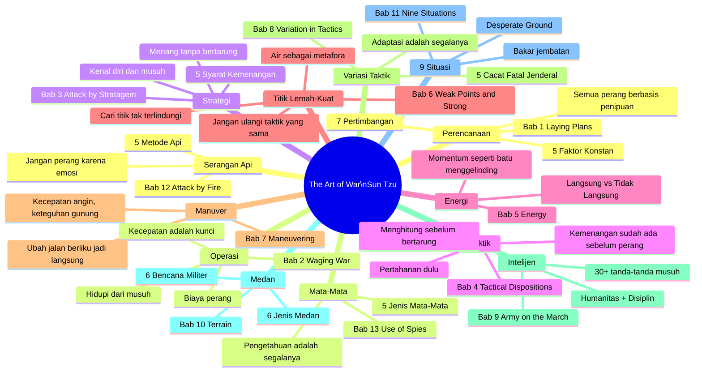

---

## 📖 Bab 1: Laying Plans — Perencanaan Sebelum Pertempuran

> *"Jenderal yang memenangkan pertempuran membuat banyak perhitungan di tempat sucinya sebelum pertempuran dimulai. Jenderal yang kalah membuat sedikit perhitungan sebelumnya."*

### 🏛️ Lima Faktor Konstan (*Five Constant Factors*)

Sebelum memasuki medan perang — atau medan kompetisi apa pun — Sun Tzu memerintahkan kita untuk mengevaluasi lima faktor mendasar:

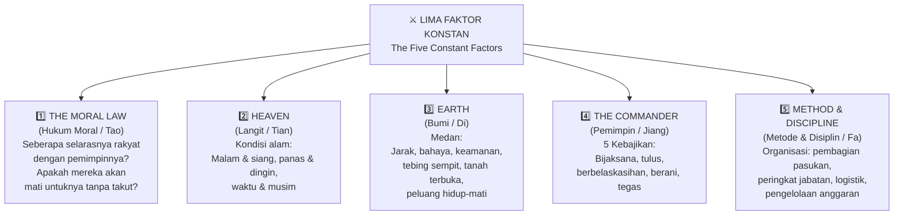

**Penjelasan Mendalam:**

🔸 **The Moral Law (Hukum Moral)** — Dalam konteks militer, ini adalah **legitimasi pemimpin**. Tentara yang percaya penuh pada tujuan dan pemimpinnya akan melakukan hal-hal yang mustahil dilakukan oleh tentara bayaran. Dalam bisnis modern, ini adalah **visi dan budaya perusahaan** — seberapa kuat karyawan percaya pada misi organisasi.

🔸 **Heaven (Langit/Surga)** — Bukan tentang takdir, melainkan tentang **waktu dan kondisi eksternal**. Menyerang di musim hujan berbeda dengan menyerang di musim kemarau. Dalam bisnis: *timing* adalah segalanya. Meluncurkan produk di tengah resesi berbeda dengan meluncurkan saat ekonomi tumbuh.

🔸 **Earth (Bumi)** — **Medan fisik dan konteks operasional**. Ini memengaruhi *logistics* (logistik — pasokan dan distribusi), posisi bertahan, dan pilihan rute. Dalam bisnis: pahami ekosistem, kompetitor, regulasi, dan lanskap industri.

🔸 **The Commander (Pemimpin)** — Sun Tzu merinci **lima kebajikan pemimpin**: *wisdom* (kebijaksanaan), *sincerity* (ketulusan), *benevolence* (belaskasihan), *courage* (keberanian), *strictness* (ketegasan). Kekurangan salah satu bisa berakibat fatal.

🔸 **Method & Discipline (Metode & Disiplin)** — Organisasi yang rapi: siapa melakukan apa, siapa melapor ke siapa, bagaimana sumber daya dialokasikan. Tanpa ini, bahkan pasukan terkuat pun akan kacau.

### 📊 Tujuh Pertimbangan (*Seven Considerations*)

Setelah memahami lima faktor, Sun Tzu memberikan tujuh pertanyaan diagnostik untuk membandingkan kekuatan dua pihak:

| # | Pertanyaan | Dalam Konteks Bisnis |
|---|---|---|
| 1️⃣ | Penguasa mana yang lebih dijiwai oleh Hukum Moral? | Siapa yang memiliki budaya dan tim yang lebih kuat? |
| 2️⃣ | Jenderal mana yang lebih kompeten? | Siapa CEO/pemimpin yang lebih mampu? |
| 3️⃣ | Di pihak mana keunggulan Surga dan Bumi lebih berpihak? | Siapa yang memiliki *timing* dan posisi pasar lebih baik? |
| 4️⃣ | Di pihak mana disiplin lebih ketat diterapkan? | Siapa yang memiliki proses dan eksekusi lebih konsisten? |
| 5️⃣ | Pasukan mana yang lebih kuat? | Siapa yang memiliki sumber daya dan kapabilitas lebih besar? |
| 6️⃣ | Di pihak mana perwira dan prajurit lebih terlatih? | Siapa yang memiliki tim lebih terampil? |
| 7️⃣ | Di pihak mana penghargaan dan hukuman lebih konsisten? | Siapa yang memiliki sistem insentif lebih adil dan konsisten? |

### 🎭 Prinsip Fundamental: Semua Perang Berbasis Penipuan

> *"Semua perang berbasis penipuan (*All warfare is based on deception*)."*

Ini adalah salah satu kutipan paling terkenal dari Sun Tzu — dan paling sering disalahpahami. Bukan berarti kita harus menjadi pembohong. Ini tentang **manajemen persepsi**:

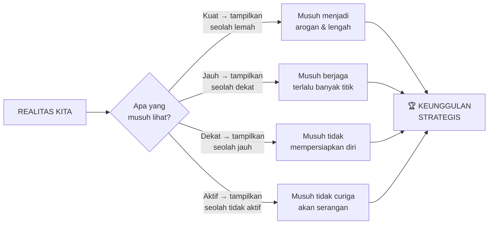

**12 Prinsip Penipuan Strategis Sun Tzu:**

1. 🔴 Saat mampu menyerang → **tampak tidak mampu**
2. 🔴 Saat menggunakan kekuatan → **tampak tidak aktif**
3. 🔴 Saat dekat → **buat musuh percaya kita jauh**
4. 🔴 Saat jauh → **buat musuh percaya kita dekat**
5. 🟡 Umpan untuk memancing musuh keluar
6. 🟡 Pura-pura kacau → lalu hancurkan
7. 🟡 Jika musuh kuat → **hindari**
8. 🟡 Jika musuh gampang marah → **provokasi**
9. 🟢 Jika musuh sedang beristirahat → **jangan beri istirahat**
10. 🟢 Jika pasukan musuh bersatu → **pecah mereka**
11. 🟢 Serang saat tidak siap
12. 🟢 Muncul di tempat yang tidak terduga

---

## 💰 Bab 2: Waging War — Melancarkan Perang (Manajemen Biaya & Waktu)

> *"Tidak ada contoh di mana sebuah negara mendapat manfaat dari perang yang berkepanjangan."*

### ⏱️ Kecepatan adalah Jiwa Perang

Sun Tzu sangat detail tentang **biaya perang**. Dengan pasukan 100.000 orang, biaya harian bisa mencapai **1.000 ons perak** — dan ini belum termasuk kerusakan ekonomi di negeri asal yang bisa mencapai **30–40% pendapatan negara**.

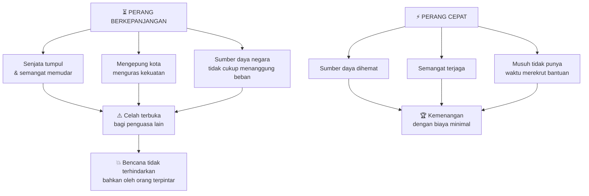

### 🍞 Prinsip "Hidupi dari Musuh"

> *"Satu gerobak perbekalan musuh setara dengan 20 milik kita sendiri."*

Sun Tzu menganjurkan **foraging** — mengambil sumber daya dari wilayah musuh — sebagai cara efisien mempertahankan pasokan:

- 1 unit perbekalan yang diambil dari musuh = **menghemat 20 unit** dari negeri sendiri (karena yang satu mengurangi musuh, yang lain mengisi kita)
- Perlakukan tawanan perang dengan baik dan rekrut mereka → **menggunakan musuh yang ditaklukkan untuk menambah kekuatan sendiri**

<Callout type="tip" title="💡 Aplikasi Modern">
Dalam bisnis, ini berarti: **akuisisi bakat dari kompetitor**, menggunakan *open source* yang dibuat orang lain, bermitra dengan ekosistem yang sudah ada. Jangan bangun semua dari nol — manfaatkan apa yang sudah tersedia di "medan" yang ada.
</Callout>

---

## 🧩 Bab 3: Attack by Stratagem — Menyerang dengan Strategi

> *"Keunggulan tertinggi adalah mematahkan perlawanan musuh tanpa bertarung."*

### 🏆 Hierarki Kemenangan Terbaik

Ini adalah bab paling sering dikutip. Sun Tzu mendefinisikan ulang apa artinya "menang":

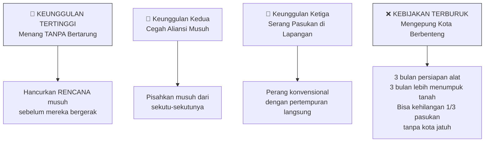

**Mengapa mengepung kota adalah kebijakan terburuk?**

Sun Tzu sangat detail: menyiapkan *mantlets* (perisai bergerak), *movable shelters* (tempat berlindung bergerak), dan peralatan pengepungan memerlukan **3 bulan**. Menumpuk tanah di depan tembok memerlukan **3 bulan lagi**. Jenderal yang tidak sabar dan menyerbu seperti semut akan kehilangan **sepertiga tentaranya** — sementara kota masih berdiri.

### 📐 Rasio Kekuatan: Formula Matematika Perang

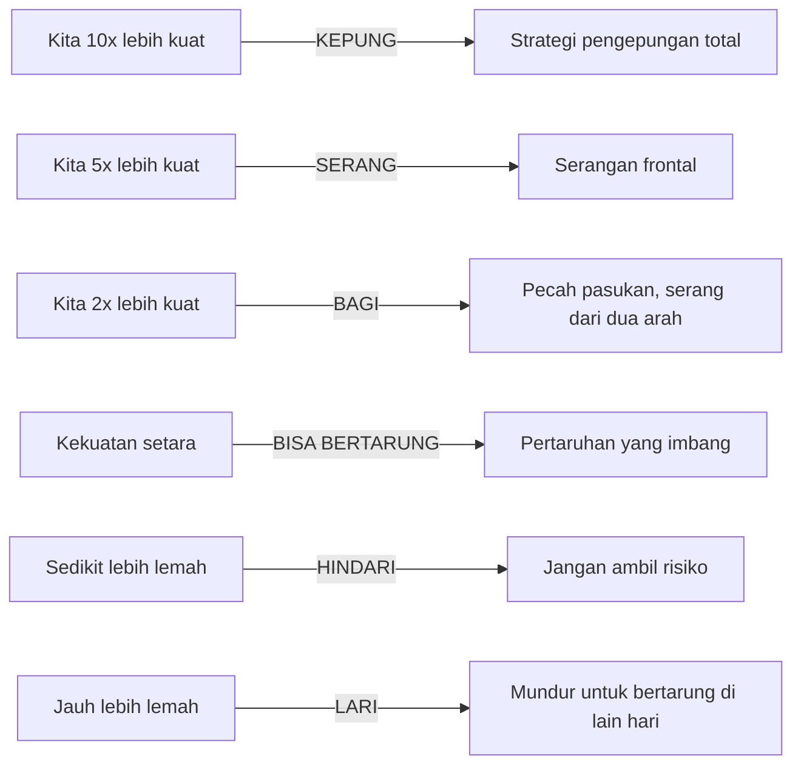

<Callout type="warning" title="⚠️ Pasukan Kecil yang Keras Kepala">
*"Pasukan kecil yang keras kepala pada akhirnya akan ditangkap oleh pasukan yang lebih besar."* — Sun Tzu
Keberanian buta tanpa kalkulasi adalah sia-sia. Mengetahui kapan TIDAK bertarung adalah sama pentingnya dengan mengetahui bagaimana bertarung.
</Callout>

### 🎯 Lima Syarat Kemenangan (*Five Essentials for Victory*)

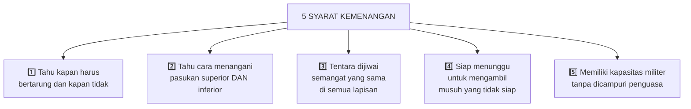

### 🪞 Prinsip Paling Terkenal: Kenali Diri dan Musuh

> *"Jika kamu mengenal musuh dan mengenal dirimu sendiri, kamu tidak perlu takut hasil dari seratus pertempuran."*
>
> *"Jika kamu mengenal dirimu tapi tidak mengenal musuhmu, untuk setiap kemenangan yang kamu raih kamu juga akan menderita kekalahan."*
>
> *"Jika kamu tidak mengenal musuh maupun dirimu sendiri, kamu akan menyerah di setiap pertempuran."*

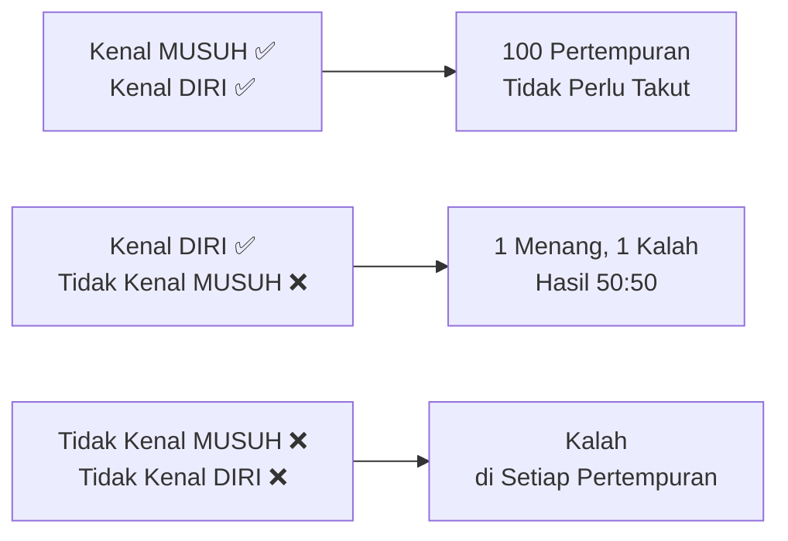

---

## 🛡️ Bab 4: Tactical Dispositions — Disposisi Taktis (Pertahanan Dulu, Serangan Kemudian)

> *"Para pejuang baik di zaman kuno pertama-tama menempatkan diri mereka melampaui kemungkinan kekalahan, dan kemudian menunggu kesempatan untuk mengalahkan musuh."*

### 🧮 Filosofi "Kemenangan Sebelum Pertempuran"

Ini adalah konsep paling mendalam di bab ini:

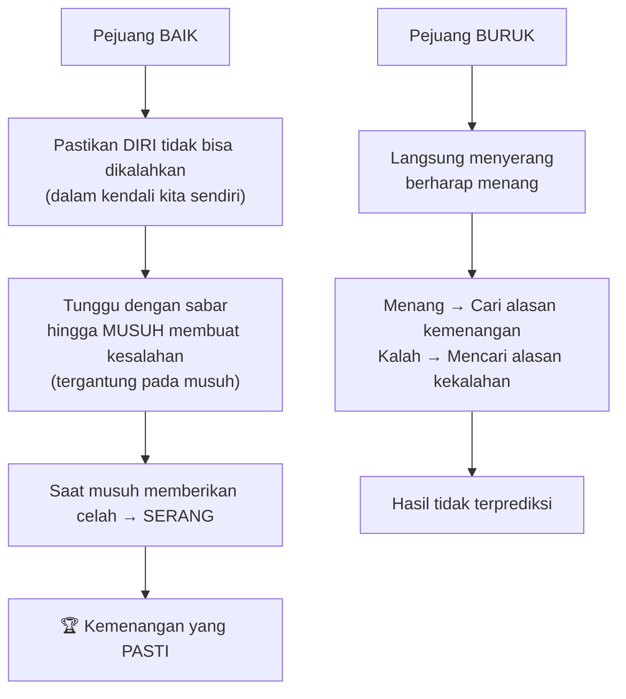

> *"Strategi yang menang hanya mencari pertempuran setelah kemenangan sudah diperoleh, sedangkan dia yang ditakdirkan untuk kalah pertama-tama bertarung dan setelah itu mencari kemenangan."*

Ini adalah perbedaan fundamental antara strategi berbasis **kepastian** vs strategi berbasis **harapan**.

### 📏 Lima Tahap Kalkulasi Militer

Sun Tzu menguraikan alur kalkulasi dari yang paling mendasar hingga kemenangan:

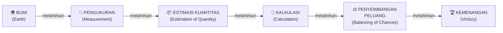

---

## ⚡ Bab 5: Energy — Energi Tempur

> *"Energi dapat diumpamakan dengan pembengkokan busur; keputusan adalah pelepasan peluru."*

### 🎯 Dikotomi Fundamental: Langsung vs Tidak Langsung

Sun Tzu memperkenalkan konsep **Cheng** (正, serangan langsung/frontal) dan **Chi** (奇, serangan tidak langsung/kejutan):

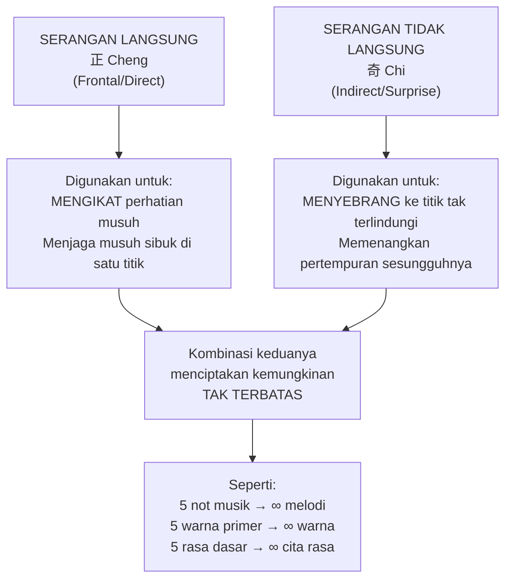

<Callout type="info" title="🎵 Analogi Sun Tzu yang Memukau">
Sun Tzu menggunakan analogi yang sangat indah: hanya ada 5 nada musik, namun kombinasinya menciptakan melodi tak terbatas. Hanya ada 5 warna primer (biru, kuning, merah, putih, hitam), namun kombinasinya menghasilkan warna tak terbatas. Demikian pula, hanya ada dua metode serangan (langsung dan tidak langsung), namun kombinasinya tak ada habisnya.
</Callout>

### 🦅 Metafora Energi: Elang dan Batu

Sun Tzu menggunakan metafora indah untuk menjelaskan *energy* dan *decision*:

| Metafora | Elemen | Makna |
|---|---|---|
| 🌊 Arus deras yang menggulung batu | *Onset* (serangan awal) | Momentum yang terbangun sebelum serangan |
| 🦅 Elang menukik tepat waktu | *Decision* (keputusan) | Ketepatan waktu yang membunuh peluang |
| 🏹 Busur yang dibengkokkan | *Energy* (energi) | Potensi yang tersimpan dan siap dilepaskan |
| 🎯 Pelepasan pelatuk | *Decision* (keputusan) | Aksi yang tepat pada momen yang tepat |

### 🪨 Prinsip Momentum: Batu Bulat di Lereng Gunung

> *"Energi yang dikembangkan oleh pejuang yang baik adalah seperti momentum batu bulat yang digulingkan dari gunung setinggi ribuan kaki."*

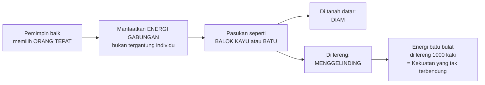

---

## 🎯 Bab 6: Weak Points and Strong — Titik Lemah dan Titik Kuat

> *"Air dalam perjalanan alaminya menghindari tempat tinggi dan bergerak ke bawah. Dalam perang, hindari yang kuat dan serang yang lemah."*

### ⚖️ Prinsip Inisiatif: Jadilah yang Pertama di Medan

> *"Siapa pun yang pertama di medan dan menunggu kedatangan musuh akan segar untuk pertempuran; siapa pun yang belakangan tiba dan harus bergegas akan tiba dalam keadaan kelelahan."*

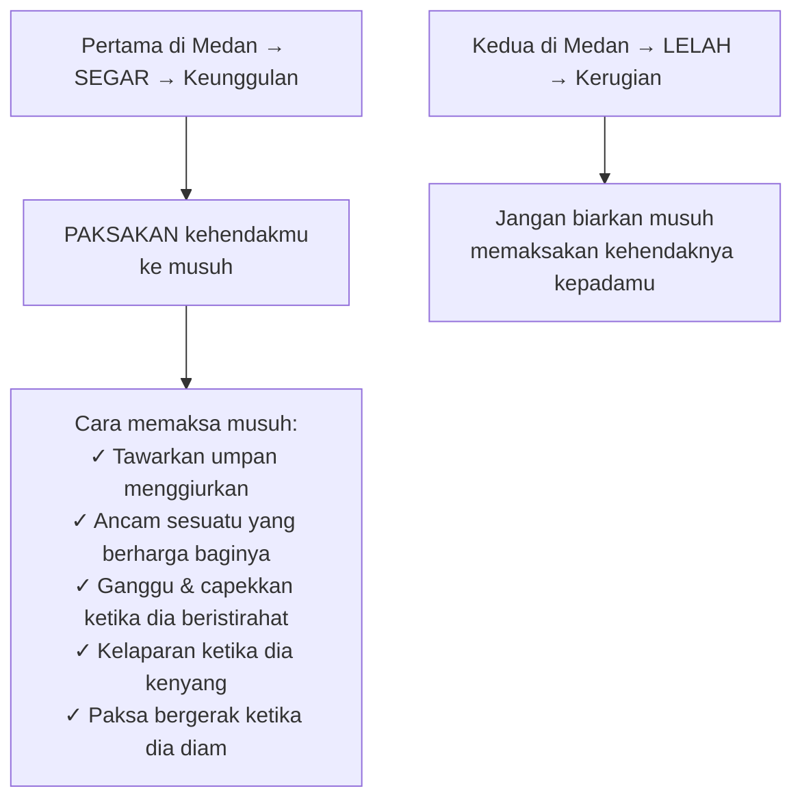

### 🕵️ Seni Konsentrasi vs Pemisahan

Salah satu prinsip paling cerdas Sun Tzu adalah tentang **konsentrasi kekuatan menghadapi musuh yang tersebar**:

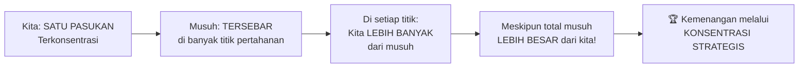

> *"Jika musuh memperkuat vannya (barisan depan), dia akan melemahkan belakangnya. Jika memperkuat belakangnya, dia melemahkan depannya. Jika memperkuat sayap kirinya, dia melemahkan kanannya. Jika dia mengirim bala bantuan ke mana-mana, dia akan lemah di mana-mana."*

Ini adalah prinsip yang Einstein pun akan setujui: **sumber daya selalu terbatas** — jika tersebar merata, menjadi lemah di mana-mana.

### 💧 Air sebagai Metafora Taktik Militer

Salah satu metafora paling elegan Sun Tzu:

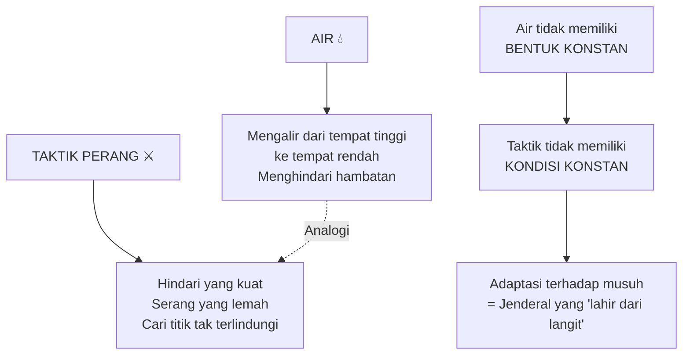

---

## 🎯 Bab 7: Maneuvering — Manuver Taktis

> *"Biarkan kecepatan gerakmu seperti angin; keteguhanmu seperti hutan; dalam penggerebekan dan penjarahan seperti api; ketidakgoyahanmu seperti gunung."*

### 🔄 Mengubah yang Berliku menjadi Langsung

Manuver taktis adalah tentang **mengubah rute tidak langsung menjadi keunggulan**. Sun Tzu memberikan contoh: dengan sengaja mengambil rute yang panjang dan berliku, namun menyiapkan jebakan untuk musuh di sepanjang jalan, Anda bisa **tiba di tujuan sebelum musuh** meski berangkat belakangan.

### ⚡ Formula Manuver Legendaris Sun Tzu

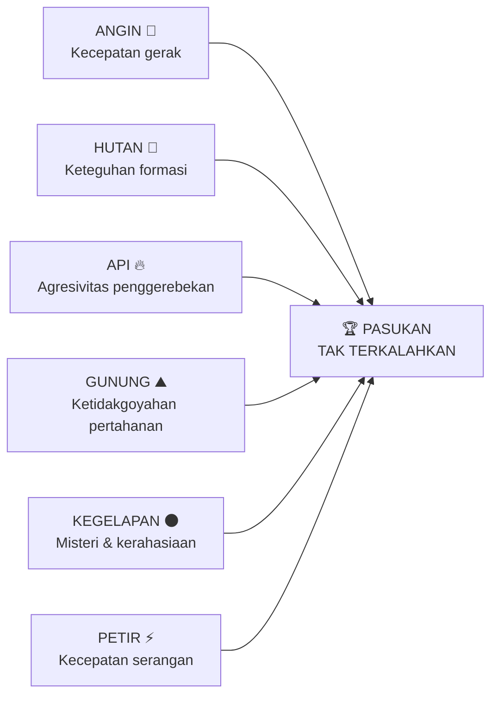

### 🥁 Psikologi Tempur: Gong, Drum, Bendera, dan Semangat

Sun Tzu memahami bahwa **kendali komunikasi = kendali pasukan**:

- 🥁 **Gong dan Drum** → mengarahkan **telinga** pasukan di malam hari
- 🚩 **Bendera dan Panji** → mengarahkan **mata** pasukan di siang hari
- Ketika seluruh pasukan bergerak sebagai **satu tubuh** → tidak ada yang bisa maju sendiri atau mundur sendiri

Dan tentang psikologi musuh:

| Waktu | Kondisi Semangat | Strategi |
|---|---|---|
| 🌅 Pagi hari | **Paling tajam dan bersemangat** | Hindari serangan langsung |
| ☀️ Siang hari | **Mulai surut** | Bisa mulai menekan |
| 🌆 Sore/malam | **Hanya ingin pulang ke tenda** | Waktu terbaik menyerang |

**Delapan Hal yang Tidak Boleh Dilakukan:**

1. ❌ Jangan maju menanjak melawan musuh di ketinggian
2. ❌ Jangan hadapi musuh yang turun dari bukit
3. ❌ Jangan kejar musuh yang pura-pura melarikan diri
4. ❌ Jangan serang tentara yang semangatnya sedang memuncak
5. ❌ Jangan telan umpan musuh
6. ❌ Jangan hadang pasukan yang sedang kembali ke rumah
7. ❌ Saat mengepung pasukan, **selalu tinggalkan satu jalan keluar**
8. ❌ Jangan tekan musuh yang sudah **putus asa** terlalu keras

<Callout type="warning" title="⚠️ Mengapa Tinggalkan Jalan Keluar?">
Prinsip ini tampak kontraintuitif, tapi sangat cerdas. Musuh yang **tidak punya jalan keluar** akan **berjuang mati-matian** karena pilihan satu-satunya adalah mati. Musuh yang **punya jalan keluar** cenderung melarikan diri daripada bertarung habis-habisan. Beri mereka jalan keluar → mereka lari → Anda menang tanpa kehilangan terlalu banyak pasukan.
</Callout>

---

## 🔀 Bab 8: Variation in Tactics — Variasi dalam Taktik

> *"Seni perang mengajarkan kita untuk tidak bergantung pada kemungkinan musuh tidak datang, tetapi pada kesiapan kita sendiri untuk menerimanya."*

### 🚫 Lima Jenis Situasi yang Membutuhkan Pengecualian

Sun Tzu menolak aturan kaku. Ada situasi di mana **aturan umum tidak berlaku**:

| Situasi | Aturan Umum | Pengecualian |
|---|---|---|
| Jalan berbahaya | Ikuti jalan tersebut | Ada jalan yang **tidak boleh** diikuti |
| Pasukan musuh | Serang | Ada pasukan yang **tidak boleh** diserang |
| Kota musuh | Kepung dan rebut | Ada kota yang **tidak boleh** dikepung |
| Posisi strategis | Pertahankan | Ada posisi yang **tidak boleh** dipertahankan |
| Perintah penguasa | Patuhi | Ada perintah yang **tidak boleh** dipatuhi |

> *"Jika bertarung pasti akan menghasilkan kemenangan, maka kamu harus bertarung, meski penguasa melarangnya. Jika bertarung tidak akan menghasilkan kemenangan, maka kamu tidak boleh bertarung, meski atas perintah penguasa."*

Ini adalah salah satu pernyataan **paling berani** dari Sun Tzu — jenderal harus memiliki kebebasan penilaian di lapangan.

### ☠️ Lima Cacat Fatal Seorang Jenderal

Ini adalah bagian paling aplikatif untuk kehidupan modern:

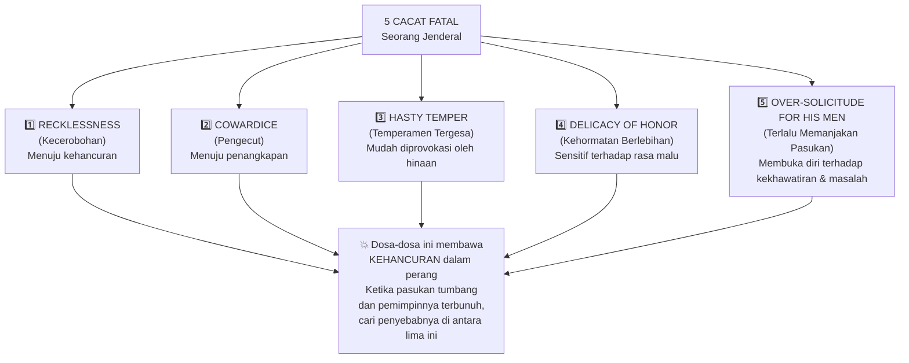

**Penjelasan mendalam:**

🔴 **Kecerobohan** — Bergerak tanpa kalkulasi, percaya diri berlebih. Seorang jenderal yang ceroboh akan berjalan ke jebakan.

🔴 **Pengecut** — Tidak bisa membuat keputusan berani saat diperlukan. Peluang sering muncul dan pergi dalam hitungan menit.

🔴 **Temperamen Mudah Marah** — Bisa dipancing dengan ejekan untuk menyerang sebelum siap. Musuh yang cerdas akan sengaja menghina untuk memancing serangan prematur.

🔴 **Kehormatan Berlebihan** — Tidak mau mundur karena takut dianggap pengecut. Kadang mundur adalah gerakan taktis yang paling cerdas.

🔴 **Terlalu Memanjakan Pasukan** — Jenderal yang terlalu peduli pada keselamatan pasukannya akan selalu ragu-ragu dan tidak bisa mengambil risiko yang diperlukan.

---

## 👁️ Bab 9: The Army on the March — Tentara dalam Perjalanan (Membaca Tanda-Tanda)

> *"Jika tentara diberi hukuman sebelum mereka terikat padamu, mereka tidak akan tunduk."*

### 🏔️ Prinsip Berkemah dan Bergerak

Sun Tzu memberikan panduan praktis tentang **terrain** (medan):

| Medan | Prinsip |
|---|---|
| 🏔️ Pegunungan | Lewati cepat, tinggal di lembah; berkemah di tempat tinggi menghadap matahari; jangan bertempur dari ketinggian |
| 🏞️ Sungai | Setelah menyeberang, menjauh dari sungai; biarkan setengah pasukan musuh menyeberang sebelum menyerang |
| 🌿 Rawa-rawa | Lewati secepat mungkin tanpa berhenti |
| 🌾 Dataran | Pilih posisi mudah diakses dengan tanah tinggi di belakang-kanan |

**Prinsip Universal:**
- ✅ Semua pasukan lebih menyukai **tempat tinggi** daripada rendah
- ✅ Semua pasukan lebih menyukai **tempat terang** daripada gelap
- ✅ Berkemah di **tanah keras** = pasukan bebas dari penyakit

### 🔍 34 Tanda-Tanda Kondisi Musuh

Sun Tzu menyajikan **panduan pengamatan lapangan** yang luar biasa detail. Ini adalah "kecerdasan intelijen" abad ke-5 SM:

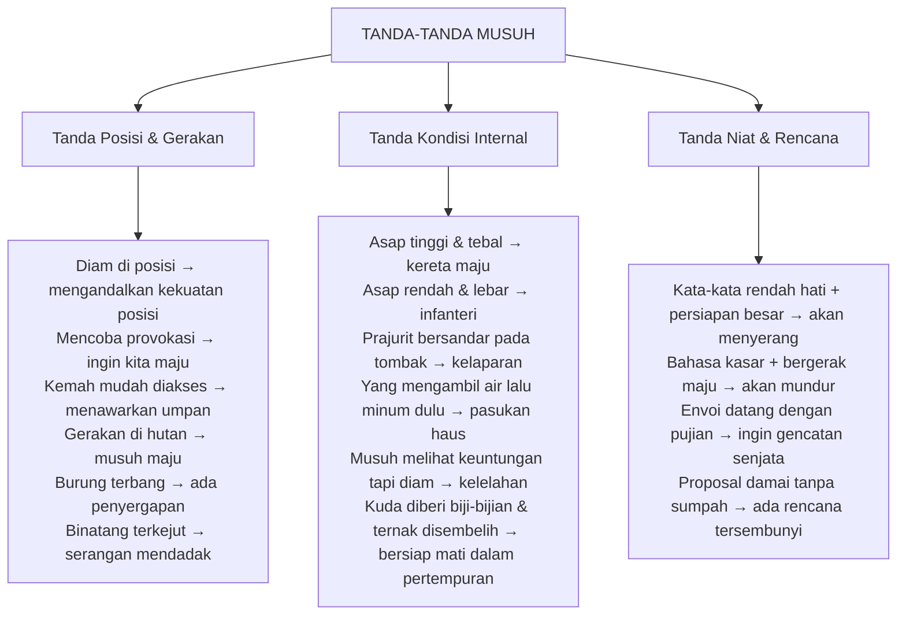

<Callout type="tip" title="💡 Relevansi Modern: Membaca 'Tanda-Tanda' di Bisnis">
Kemampuan Sun Tzu membaca tanda-tanda ini adalah **kecerdasan intelijen kompetitif** yang luar biasa canggih untuk masanya. Di dunia modern, ini setara dengan: memantau berita perusahaan kompetitor, menganalisis pola perekrutan mereka, mengamati perubahan harga atau strategi pemasaran, dan membaca sinyal-sinyal pasar sebelum perubahan besar terjadi.
</Callout>

### ⚖️ Humanitas + Disiplin = Formula Kepemimpinan

> *"Tentara harus diperlakukan pertama-tama dengan kemanusiaan, tetapi dijaga dengan disiplin besi. Ini adalah jalan yang pasti menuju kemenangan."*

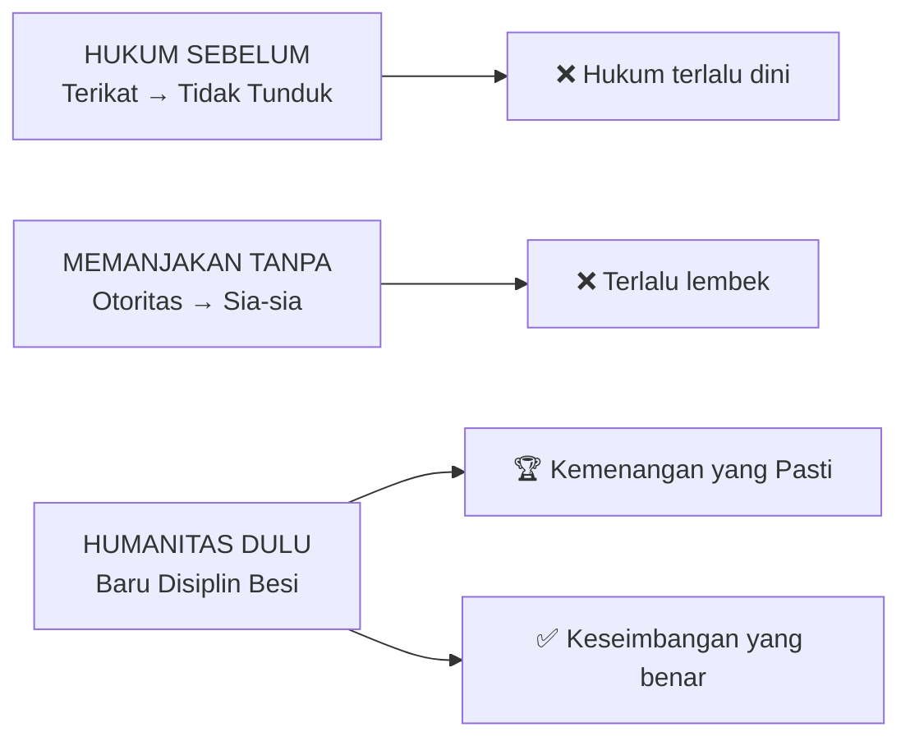

---

## 🗺️ Bab 10: Terrain — Medan Perang

> *"Jika kamu mengenal musuh dan mengenal dirimu, kemenanganmu tidak akan diragukan. Jika kamu mengenal langit dan mengenal bumi, kemenanganmu bisa menjadi lengkap."*

### 🌏 Enam Jenis Medan (*Six Kinds of Terrain*)

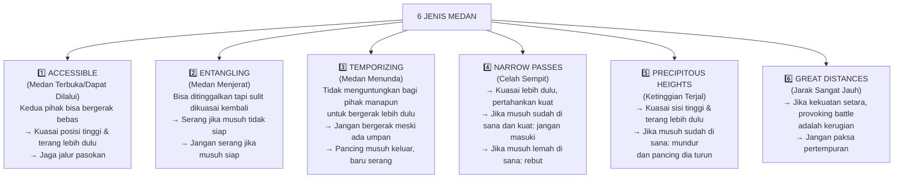

### 💀 Enam Bencana Militer (*Six Calamities*)

Sun Tzu mengidentifikasi **enam penyebab kekalahan** yang semuanya berasal dari kesalahan pemimpin, bukan keunggulan musuh:

| # | Bencana | Penyebab |
|---|---|---|
| 1️⃣ | **Flight (Melarikan Diri)** | 1 pasukan melawan yang 10x lebih besar — kondisi yang setara tapi tetap diserbu |
| 2️⃣ | **Insubordination (Pembangkangan)** | Prajurit terlalu kuat, perwira terlalu lemah |
| 3️⃣ | **Collapse (Runtuh)** | Perwira terlalu kuat, prajurit terlalu lemah |
| 4️⃣ | **Ruin (Kehancuran)** | Perwira senior marah dan memberontak; menyerang tanpa izin komandan |
| 5️⃣ | **Disorganization (Ketidakaturan)** | Pemimpin lemah, perintah tidak jelas, tidak ada tugasjelas, formasi sembarangan |
| 6️⃣ | **Rout (Pelarian Masal)** | Komandan salah menilai kekuatan musuh; mengirim pasukan lemah melawan pasukan kuat |

<Callout type="important" title="🔑 Poin Kritis">
Enam bencana ini **bukan berasal dari kondisi alam** (*natural causes*) — semua adalah **kesalahan yang bisa dicegah** oleh pemimpin yang kompeten. Ini adalah tanggung jawab penuh jenderal, bukan nasib.
</Callout>

### ♥️ Pemimpin Terbaik: Prajurit adalah Anak Sendiri

> *"Pandanglah prajuritmu sebagai anak-anakmu, dan mereka akan mengikutimu ke lembah terdalam. Pandanglah mereka sebagai putra-putramu yang tercinta, dan mereka akan berdiri di sisimu bahkan hingga mati."*

Namun Sun Tzu menambahkan peringatan keras:

> *"Namun jika kamu memanjakan mereka tapi tidak bisa menunjukkan otoritasmu, berhati baik tapi tidak bisa menegakkan perintahmu, dan tidak mampu menghentikan kekacauan — maka prajuritmu seperti anak-anak yang dimanja; mereka tidak berguna untuk tujuan praktis apa pun."*

---

## 🎲 Bab 11: The Nine Situations — Sembilan Situasi

> *"Letakkan pasukanmu dalam posisi di mana tidak ada jalan keluar, dan mereka akan memilih mati daripada melarikan diri."*

### 🗺️ Sembilan Jenis Situasi (*Nine Varieties of Ground*)

```mermaid
graph TD
    A["9 SITUASI PERANG"] --> B["1️⃣ DISPERSIVE GROUND\n(Medan Tersebar)\nBertempur di wilayah sendiri\nSemangat mudah surut → JANGAN BERTARUNG"]
    A --> C["2️⃣ FACILE GROUND\n(Medan Mudah)\nBaru sedikit masuk wilayah musuh\nMudah mundur → JANGAN BERHENTI"]
    A --> D["3️⃣ CONTENTIOUS GROUND\n(Medan Sengketa)\nKepemilikannya menguntungkan kedua pihak\n→ JANGAN SERANG (rebut tapi jangan paksakan)"]
    A --> E["4️⃣ OPEN GROUND\n(Medan Terbuka)\nKedua pihak bebas bergerak\n→ JANGAN HALANGI MUSUH"]
    A --> F["5️⃣ INTERSECTING HIGHWAYS\n(Persimpangan Jalan)\nKunci tiga negara berbatasan\nYang menguasainya menguasai segalanya\n→ GABUNG DENGAN SEKUTU"]
    A --> G["6️⃣ SERIOUS GROUND\n(Medan Serius)\nJauh di dalam wilayah musuh\nBanyak kota dilewati → KUMPULKAN RAMPASAN"]
    A --> H["7️⃣ DIFFICULT GROUND\n(Medan Sulit)\nHutan, lereng, rawa, semak\n→ TERUS BERGERAK, jangan berhenti"]
    A --> I["8️⃣ HEMMED-IN GROUND\n(Medan Terkepung)\nGorge sempit, hanya bisa masuk-keluar\nmelalui jalan berliku\n→ GUNAKAN STRATEGI"]
    A --> J["9️⃣ DESPERATE GROUND\n(Medan Putus Asa)\nTidak ada jalan keluar\nSelamat atau mati\n→ BERTARUNG HABIS-HABISAN"]
```

### 🔥 Paradoks Desperate Ground: Kekuatan dari Putus Asa

> *"Letakkan pasukanmu dalam posisi yang tidak ada kemungkinan bertahan hidup, dan mereka akan lebih memilih mati daripada melarikan diri."*

```mermaid
flowchart TD
    A["Pasukan dalam\nDESPERATE GROUND\n(tanpa jalan keluar)"] --> B["Kehilangan rasa takut mati"]
    B --> C["Jika tidak ada tempat berlindung → berdiri teguh"]
    C --> D["Jika di wilayah musuh → tunjukkan keteguhan"]
    D --> E["Jika tidak ada pilihan → berjuang keras"]
    E --> F["Tanpa diperintah → selalu waspada\nTanpa diminta → melakukan kehendakmu\nTanpa pembatasan → setia\nTanpa perintah → bisa dipercaya"]
    F --> G["🏆 Pasukan yang PALING MEMATIKAN"]
```

**Ini adalah prinsip psikologis yang mendalam:** manusia mencapai potensi tertingginya ketika tidak ada pilihan lain. *"Bakar kapal"* adalah strategi nyata yang digunakan oleh banyak penakluk besar dalam sejarah — termasuk **Hernán Cortés** yang membakar kapalnya di pantai Meksiko agar pasukannya tahu mereka tidak punya pilihan selain menang.

### 🐍 Shuai-jan: Ular yang Bisa Diserang dari Mana Saja

> *"Penakluk taktis yang terampil dapat diumpamakan sebagai shuai-jan (ular di pegunungan Chung). Pukul kepalanya, diserang oleh ekornya. Pukul ekornya, diserang kepalanya. Pukul tengahnya, diserang kepala dan ekor."*

Ini adalah metafora untuk pasukan yang **terintegrasi sempurna** — setiap serangan dari titik mana pun akan direspons oleh seluruh tubuh organisasi.

### 🎭 Paradoks Kepemimpinan: Sembunyikan Rencanamu bahkan dari Pasukanmu

> *"Pemimpin yang baik pada momen kritis bertindak seperti seseorang yang telah mendaki ketinggian dan kemudian menendang tangga di belakangnya."*

Sun Tzu menyarankan menyembunyikan rencana bahkan dari pasukannya sendiri — bukan karena tidak percaya, tapi karena **informasi yang bocor selalu membahayakan**. Prajurit berjuang lebih baik saat mereka **tidak tahu betapa berbahayanya situasinya** sampai tidak ada pilihan lain kecuali bertarung.

---

## 🔥 Bab 12: The Attack by Fire — Serangan dengan Api

> *"Penguasa yang bijak menyusun rencananya dengan baik; jenderal yang baik mengembangkan sumber dayanya. Jangan bergerak kecuali ada keuntungan."*

### 🔥 Lima Metode Serangan Api

Sun Tzu mendefinisikan lima target serangan menggunakan api:

```mermaid
graph TD
    A["5 METODE\nSERANGAN API"] --> B["1️⃣ Bakar TENTARA\ndi kemahnya\n(serangan langsung ke personel)"]
    A --> C["2️⃣ Bakar GUDANG PAKAN\n& persediaan ternak"]
    A --> D["3️⃣ Bakar KERETA\nperbekalan & logistik"]
    A --> E["4️⃣ Bakar GUDANG\nSENJATA & amunisi"]
    A --> F["5️⃣ Hujankan API\nke dalam barisan musuh"]
```

**Lima Kondisi yang Harus Diantisipasi:**

1. Jika api menyala di dalam kemah musuh → respons dengan serangan dari luar
2. Jika api menyala tapi tentara musuh tetap tenang → tunggu, jangan serang dulu
3. Ketika kekuatan api mencapai puncak → ikuti dengan serangan jika memungkinkan
4. Jika bisa memulai api dari luar → jangan tunggu api dari dalam
5. Selalu serang **searah angin** → jangan serang **melawan angin**

### ⚖️ Prinsip Paling Fundamental: Jangan Perang karena Emosi

Ini adalah puncak kebijaksanaan Sun Tzu tentang penggunaan kekuatan:

```mermaid
flowchart LR
    A["Kemarahan"] --> B["Bisa berubah menjadi\nkegembiraan seiring waktu"]
    C["Kejengkelan"] --> D["Bisa diikuti\nkepuasan seiring waktu"]
    E["Kerajaan yang hancur"] --> F["TIDAK PERNAH bisa\ndihidupkan kembali"]
    G["Orang yang mati"] --> H["TIDAK PERNAH bisa\ndibangkitkan kembali"]
    B & D & F & H --> I["Kesimpulan:\nJangan pernah perang\nkarena EMOSI SESAAT"]
    I --> J["✅ Bergerak hanya saat\nada KEUNTUNGAN\n✅ Gunakan pasukan hanya saat\nada SESUATU yang diperoleh\n✅ Berperang hanya saat\nPOSISI KRITIS"]
```

> *"Tidak ada penguasa yang harus mengirim pasukan ke medan hanya untuk memuaskan amarahnya sendiri. Tidak ada jenderal yang harus bertempur hanya karena rasa sakit hati."*

---

## 🕵️ Bab 13: The Use of Spies — Penggunaan Mata-Mata (Kecerdasan sebagai Fondasi Segalanya)

> *"Apa yang memungkinkan penguasa bijak dan jenderal yang baik untuk menyerang dan menaklukkan adalah *foreknowledge* (pengetahuan ke depan)."*

### 📡 Argumen untuk Investasi Intelijen

Sun Tzu membuka bab ini dengan argumen ekonomi yang mengejutkan:

> *"Pasukan yang bertempur bisa saja berhadapan selama bertahun-tahun... kemenangan yang ditentukan dalam satu hari. Karena itu, tetap bodoh tentang kondisi musuh hanya karena enggan mengeluarkan 100 ons perak dalam penghormatan dan upah adalah puncak ketidakmanusiawian."*

Pelit pada intelijen = membuang-buang ribuan ons perak untuk kampanye yang gagal.

### 🕵️ Lima Jenis Mata-Mata (*Five Classes of Spies*)

```mermaid
graph TD
    A["5 JENIS MATA-MATA"] --> B["1️⃣ LOCAL SPIES\n(Mata-mata Lokal)\nPenduduk setempat yang direkrut\ndi wilayah musuh\nPaling murah & efektif"]
    A --> C["2️⃣ INWARD SPIES\n(Mata-mata Dalam)\nPejabat musuh yang disuap/direkrut\nAkses ke informasi rahasia"]
    A --> D["3️⃣ CONVERTED SPIES\n(Mata-mata yang Dikonversi)\nMata-mata musuh yang kita tangkap\ndan kita balik untuk bekerja pada kita\n→ PALING BERHARGA"]
    A --> E["4️⃣ DOOMED SPIES\n(Mata-mata yang Dikorbankan)\nAgen kita yang sengaja dikirim\nmembawa informasi PALSU ke musuh\nBiasanya berakhir dengan kematian"]
    A --> F["5️⃣ SURVIVING SPIES\n(Mata-mata yang Selamat)\nAgen yang pergi ke kemah musuh\ndan kembali membawa informasi"]
```

```mermaid
graph LR
    A["CONVERTED SPIES\n(Mata-mata Dikonversi)"] --> B["Memberi kita informasi\ntentang kondisi musuh"]
    B --> C["Memungkinkan kita\nMEREKRUT Local Spies\ndan Inward Spies"]
    C --> D["Memungkinkan kita\nMENGIRIM informasi palsu\nmelalui Doomed Spies"]
    D --> E["Memungkinkan kita\nmenggunakan Surviving Spies\npada waktu yang tepat"]
    A --> F["🏆 KUNCI dari\nSELURUH JARINGAN intelijen"]
```

### 🎯 Kualitas yang Dibutuhkan untuk Mengelola Mata-Mata

> *"Mata-mata tidak bisa digunakan dengan efektif tanpa **sagacity** (kebijaksanaan/ketajaman intuisi). Mereka tidak bisa dikelola dengan baik tanpa **benevolence and straightforwardness** (niat baik dan kejujuran). Tanpa **subtle ingenuity of mind** (kecerdikan mental yang halus), seseorang tidak bisa memastikan kebenaran laporan mereka."*

<Callout type="important" title="🔑 Posisi Mata-Mata dalam Hierarki Militer">
Sun Tzu menyatakan bahwa tidak ada hubungan yang lebih intim yang boleh dipertahankan selain dengan mata-mata. Tidak ada yang boleh mendapat penghargaan lebih murah hati. Dan tidak ada urusan di mana kerahasiaan lebih ketat harus dijaga. Ini menunjukkan betapa Sun Tzu memandang **pengetahuan intelijen sebagai pondasi dari semua kemenangan**.
</Callout>

### 📚 Contoh Historis: Kebangkitan Dinasti

Sun Tzu menutup bab terakhir — dan seluruh buku — dengan dua contoh historis:

- **Kebangkitan Dinasti Yin** → berkat **Yi Zhi** yang pernah melayani Dinasti Xia (musuh)
- **Kebangkiran Dinasti Zhou** → berkat **Lü Ya** yang pernah melayani Dinasti Yin (musuh)

Keduanya adalah **converted agents** — mantan orang dalam musuh yang memberikan keunggulan intelijen yang tak ternilai.

> *"Hanya penguasa yang tercerahkan dan jenderal yang bijak yang akan menggunakan kecerdasan tertinggi dari angkatan bersenjata untuk tujuan mata-mata, dan dengan demikian mereka mencapai hasil besar."*

---

## 🌐 Aplikasi Modern: The Art of War dalam Kehidupan Kita

### 💼 Dalam Bisnis

```mermaid
graph TD
    A["PRINSIP SUN TZU → APLIKASI BISNIS"] --> B["Menang tanpa bertarung\n→ Blue Ocean Strategy:\nCiptakan pasar baru,\ntidak bersaing di pasar yang ada"]
    A --> C["Kenali diri & musuh\n→ Competitive Intelligence:\nAnalisis SWOT yang mendalam"]
    A --> D["Serangan tidak langsung\n→ Disruption:\nSerang dari bawah, bukan frontal"]
    A --> E["Konsentrasi kekuatan\n→ Focus:\nJangan mencoba semua pasar sekaligus"]
    A --> F["Kemenangan sudah ada sebelum perang\n→ Preparation:\nDue diligence sebelum investasi"]
    A --> G["5 cacat fatal jenderal\n→ Leadership failure modes:\nBias, impulsivitas, ego, over-empathy"]
```

### 🧠 Dalam Pengembangan Diri

| Prinsip Sun Tzu | Aplikasi Personal |
|---|---|
| *"Kenali dirimu"* | Pahami kekuatan dan kelemahan sejati dirimu |
| *"Pilih pertempuranmu"* | Fokus pada hal yang paling penting; abaikan yang tidak signifikan |
| *"Kecepatan"* | Jangan terlalu lama di satu fase; eksekusi cepat dan adaptasi |
| *"Konsentrasi"* | Deep work — fokus total pada satu hal sekaligus |
| *"5 cacat jenderal"* | Hindari kecerobohan, pengecut, temperamental, malu-maluan, dan terlalu protektif |
| *"Jangan perang karena emosi"* | Keputusan besar jangan dibuat saat marah atau takut |
| *"Pasokan logistik"* | Jaga energi, kesehatan, dan sumber daya kamu — fondasi segalanya |

---

## 💎 Kutipan-Kutipan Paling Abadi

<Callout type="quote" title="⚔️ Tentang Perencanaan">
*"Jenderal yang memenangkan pertempuran membuat banyak perhitungan sebelum pertempuran dimulai. Jenderal yang kalah membuat sedikit perhitungan. Semakin banyak perhitungan, semakin besar kemungkinan kemenangan."*
</Callout>

<Callout type="quote" title="🧠 Tentang Pengetahuan Diri">
*"Jika kamu mengenal musuh dan mengenal dirimu sendiri, kamu tidak perlu takut hasil dari seratus pertempuran."*
</Callout>

<Callout type="quote" title="🏆 Tentang Kemenangan Tertinggi">
*"Keunggulan tertinggi adalah mematahkan perlawanan musuh tanpa bertarung."*
</Callout>

<Callout type="quote" title="💧 Tentang Adaptasi">
*"Air tidak memiliki bentuk yang konstan. Dalam perang, tidak ada kondisi yang konstan. Dia yang dapat memodifikasi taktiknya sesuai situasinya bisa disebut kapten yang lahir dari langit."*
</Callout>

<Callout type="quote" title="🕊️ Tentang Perang dan Kedamaian">
*"Tidak ada penguasa yang harus mengirim pasukan ke medan hanya untuk memuaskan amarahnya. Karena kemarahan bisa berubah menjadi kegembiraan seiring waktu — tapi kerajaan yang telah hancur tidak pernah bisa dihidupkan kembali."*
</Callout>

---

## 📚 Glosarium: Istilah-Istilah Kunci

| Istilah (Inggris/Tionghoa) | Terjemahan | Definisi |
|---|---|---|
| **The Art of War / Bingfa** (兵法) | Seni Perang | Karya masterpiece Sun Tzu tentang strategi militer |
| **Sun Tzu** (孫子) | "Master Sun" | Jenderal dan filsuf militer Tiongkok, abad ke-5 SM |
| **Moral Law / Tao** (道) | Hukum Moral / Jalan | Keselarasan antara pemimpin dan rakyat; legitimasi dan kepercayaan |
| **Heaven / Tian** (天) | Langit | Kondisi alam, waktu, musim — faktor eksternal yang tak bisa dikontrol |
| **Earth / Di** (地) | Bumi | Medan, jarak, terrain — lingkungan fisik operasional |
| **Cheng** (正) | Serangan Langsung | Metode frontal untuk mengikat perhatian musuh |
| **Chi** (奇) | Serangan Tidak Langsung | Metode kejutan yang memenangkan pertempuran sesungguhnya |
| **Foreknowledge** | Pengetahuan Ke Depan | Intelijen tentang musuh — fondasi semua kemenangan |
| **Local Spies** | Mata-mata Lokal | Penduduk setempat di wilayah musuh yang direkrut |
| **Inward Spies** | Mata-mata Dalam | Pejabat musuh yang bekerja untuk kita |
| **Converted Spies** | Mata-mata Dikonversi | Mata-mata musuh yang kita balik; paling berharga |
| **Doomed Spies** | Mata-mata Dikorbankan | Agen yang sengaja dikirim mati membawa informasi palsu |
| **Surviving Spies** | Mata-mata yang Selamat | Agen yang kembali hidup membawa informasi |
| **Deception / Dissimulation** | Penipuan / Penyamaran | Manajemen persepsi musuh tentang kekuatan dan posisi kita |
| **Indirect Tactics** | Taktik Tidak Langsung | Menyerang titik tak terduga, tidak bertarung frontal |
| **Foraging** | Penjarahan/Mencari Pakan | Mengambil perbekalan dari wilayah musuh |
| **Mantlets** | Perisai Bergerak | Peralatan pelindung untuk mengepung kota berbenteng |
| **Dispersive Ground** | Medan Tersebar | Bertempur di wilayah sendiri; semangat mudah surut |
| **Desperate Ground** | Medan Putus Asa | Tidak ada jalan keluar; harus bertarung atau mati |
| **Shuai-jan** (率然) | Ular Respons Terpadu | Ular legendaris yang membalas serangan dari arah mana pun; metafora pasukan terintegrasi |
| **Recklessness** | Kecerobohan | Cacat pertama pemimpin: bergerak tanpa kalkulasi |
| **Over-solicitude** | Terlalu Memanjakan | Cacat kelima pemimpin: terlalu protektif pada pasukan |
| **Five Constant Factors** | Lima Faktor Konstan | Moral Law, Heaven, Earth, Commander, Method & Discipline |
| **Seven Considerations** | Tujuh Pertimbangan | Tujuh pertanyaan diagnostik untuk membandingkan dua kekuatan |

---

## 🔗 Referensi & Sumber

- 📹 **Video Sumber:** [The Art of War by Sun Tzu — Entire Unabridged Audiobook](https://www.youtube.com/watch?v=jxcMRkqaQdw)
- 📚 **Teks Asli:** *孫子兵法 (Sūnzǐ Bīngfǎ)* — ditulis sekitar 500 SM
- 🌐 **Terjemahan Klasik:** Lionel Giles (1910) — terjemahan Inggris paling terkenal dan paling sering dikutip
- 📖 **Terjemahan Modern Populer:** Samuel B. Griffith (1963) — dengan komentar militer modern
- 💼 **The Art of War for Executives** — Donald Krause — adaptasi bisnis modern
- 🎌 **Pengaruh di Jepang:** *Gorin no Sho* (Go Rin No Sho, Lima Cincin) oleh **Miyamoto Musashi** — karya strategi Jepang yang terinspirasi Sun Tzu
- 📺 **Pengaruh Modern:** Digunakan oleh **Jenderal Vo Nguyen Giap** (Vietnam), **strategi bisnis Apple**, **Steve Jobs**, dan hampir semua sekolah militer di dunia

---

<Callout type="success" title="🌟 Warisan Abadi Sun Tzu">
Selama 2.500 tahun, The Art of War telah dibaca oleh jenderal-jenderal yang mengubah dunia: Cao Cao, Napoleon, Mao Zedong, Vo Nguyen Giap. Buku ini tidak hanya tentang perang — ini tentang **bagaimana pikiran yang terlatih mendekati masalah yang kompleks dengan sumber daya terbatas**. Intinya selalu sama: kenali dirimu, kenali situasimu, bertindak dengan kalkulasi bukan emosi, dan menangkan sebelum bertempur.
</Callout>
