## 🎩 Pembuka: Ketika Yang Mati Kembali Berbicara

Bayangkan sebuah malam berkabut di London akhir abad ke-19. Di jalan Baker Street yang remang, di balik jendela yang basah oleh uap London yang tebal, Sherlock Holmes berdiri sambil memegang biola — belum jelas apakah ia akan memainkannya atau sekadar memikirkan sesuatu yang pelik. Selama beberapa bulan terakhir tidak ada kasus berarti. Dan Holmes tanpa kasus adalah Holmes yang berbahaya bagi dirinya sendiri.

Lalu ketukan pintu itu terdengar.

Dan nama yang disebutkan oleh tamu yang pucat dan gemetar itu adalah nama yang belum pernah gagal menggetarkan udara di 221B Baker Street: **Professor James Moriarty**.

Seorang pria yang telah *mati bertahun-tahun lalu* — terjun ke air terjun Reichenbach bersama Holmes dalam pertempuran yang hampir merenggut nyawa sang detektif terbesar di Eropa — tiba-tiba muncul, duduk di kursinya sendiri, *mati*, dengan surat wasiat yang baru saja ia tulis di depannya.

Beginilah cerita **"Sherlock Holmes and the Last Will of Professor Moriarty"** dimulai — sebuah narasi yang memadukan misteri *locked room* (*ruang terkunci*), teori konspirasi, warisan kejahatan tersembunyi, dan permainan catur intelektual di tingkat paling tinggi. 🔐🕯️

---

## 📖 Tentang Cerita Ini: Antara Kanon dan Fan Fiction

Sebelum kita menyelam lebih dalam, penting untuk memberikan konteks. **"The Last Will of Professor Moriarty"** adalah sebuah cerita *fan-created* — sebuah kisah Sherlock Holmes yang tidak ditulis oleh Sir Arthur Conan Doyle, melainkan dibuat oleh para penggemar dan kreator kreatif yang meneruskan tradisi cerita Holmes dalam format audio/video.

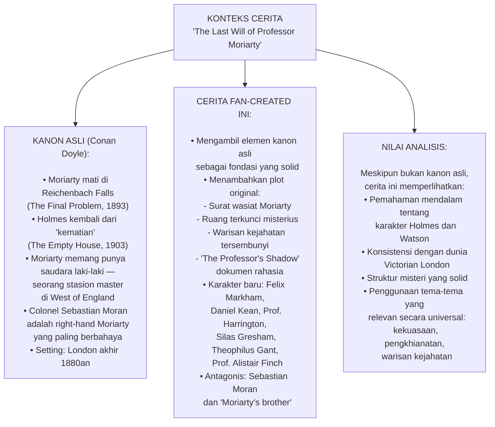
```mermaid
graph TD
    A["KONTEKS CERITA\n'The Last Will of Professor Moriarty'"]
    
    A --> B["KANON ASLI (Conan Doyle):\n\n• Moriarty mati di\n  Reichenbach Falls\n  (The Final Problem, 1893)\n• Holmes kembali dari 'kematian'\n  (The Empty House, 1903)\n• Moriarty memang punya\n  saudara laki-laki —\n  seorang stasion master\n  di West of England\n• Colonel Sebastian Moran\n  adalah right-hand Moriarty\n  yang paling berbahaya\n• Setting: London akhir 1880an"]
    
    A --> C["CERITA FAN-CREATED INI:\n\n• Mengambil elemen kanon asli\n  sebagai fondasi yang solid\n• Menambahkan plot original:\n  - Surat wasiat Moriarty\n  - Ruang terkunci misterius\n  - Warisan kejahatan tersembunyi\n  - 'The Professor's Shadow'\n    dokumen rahasia\n• Karakter baru: Felix Markham,\n  Daniel Kean, Prof. Harrington,\n  Silas Gresham, Theophilus Gant,\n  Prof. Alistair Finch\n• Antagonis: Sebastian Moran\n  dan 'Moriarty's brother'"]
    
    A --> D["NILAI ANALISIS:\n\nMeskipun bukan kanon asli,\ncerita ini memperlihatkan:\n• Pemahaman mendalam tentang\n  karakter Holmes dan Watson\n• Konsistensi dengan dunia\n  Victorian London\n• Struktur misteri yang solid\n• Penggunaan tema-tema yang\n  relevan secara universal:\n  kekuasaan, pengkhianatan,\n  warisan kejahatan"]
```

Cerita ini memiliki 22 bab dengan struktur naratif yang kompleks, menggabungkan elemen *locked room mystery* (*misteri ruang terkunci*), *cipher* (*kode rahasia*), *conspiracy thriller* (*thriller konspirasi*), dan karakter ensemble yang beragam. Nilai analisisnya justru terletak pada bagaimana kisah ini memanfaatkan fondasi kanon Holmes untuk membangun sesuatu yang segar namun tetap terasa autentik.

---

## 🌫️ Bab 1–2: Misteri Mustahil — Mayat yang Menulis Wasiat

### Felix Markham dan Permintaan Tolong yang Aneh

Watson memperkenalkan kita pada **Felix Markham**, seorang solicitor (*pengacara yang menangani dokumen legal*, berbeda dari barrister yang berperkara di pengadilan) yang datang dalam kondisi pucat dan gemetar ke 221B Baker Street.

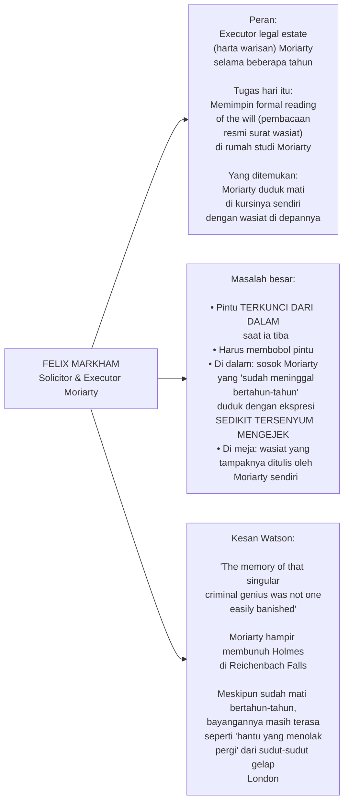
```mermaid
graph LR
    A["FELIX MARKHAM\nSolicitor & Executor Moriarty"]
    
    A --> B["Peran:\nExecutor legal estate\n(harta warisan) Moriarty\nselama beberapa tahun\n\nTugas hari itu:\nMemimpin formal reading\nof the will (pembacaan\nresmi surat wasiat)\ndi rumah studi Moriarty\n\nYang ditemukan:\nMoriarty duduk mati\ndi kursinya sendiri\ndengan wasiat di depannya"]
    
    A --> C["Masalah besar:\n\n• Pintu TERKUNCI DARI DALAM\n  saat ia tiba\n• Harus membobol pintu\n• Di dalam: sosok Moriarty\n  yang 'sudah meninggal\n  bertahun-tahun'\n  duduk dengan ekspresi\n  SEDIKIT TERSENYUM MENGEJEK\n• Di meja: wasiat yang\n  tampaknya ditulis oleh\n  Moriarty sendiri"]
    
    A --> D["Kesan Watson:\n\n'The memory of that singular\ncriminal genius was not one\neasily banished'\n\nMoriarty hampir membunuh Holmes\ndi Reichenbach Falls\n\nMeskipun sudah mati bertahun-tahun,\nbayangannya masih terasa\nseperti 'hantu yang menolak\npergi' dari sudut-sudut gelap\nLondon"]
```

Holmes merespons berita ini dengan cara yang khasnya: **bukan dengan keterkejutan, melainkan dengan ketertarikan intelektual yang hampir seperti kegembiraan**. *"Fascinating... We have here a man who has been dead for years suddenly appearing at his own will reading, lifeless once more. It is a riddle worthy of our attention."*

### Rumah Kematian: Observasi Holmes

Ketika mereka tiba di rumah Moriarty di Bloomsbury yang sudah lama terbengkalai, Watson menggambarkan suasana yang sangat gothik (*bergaya horor-romantis abad ke-19*):

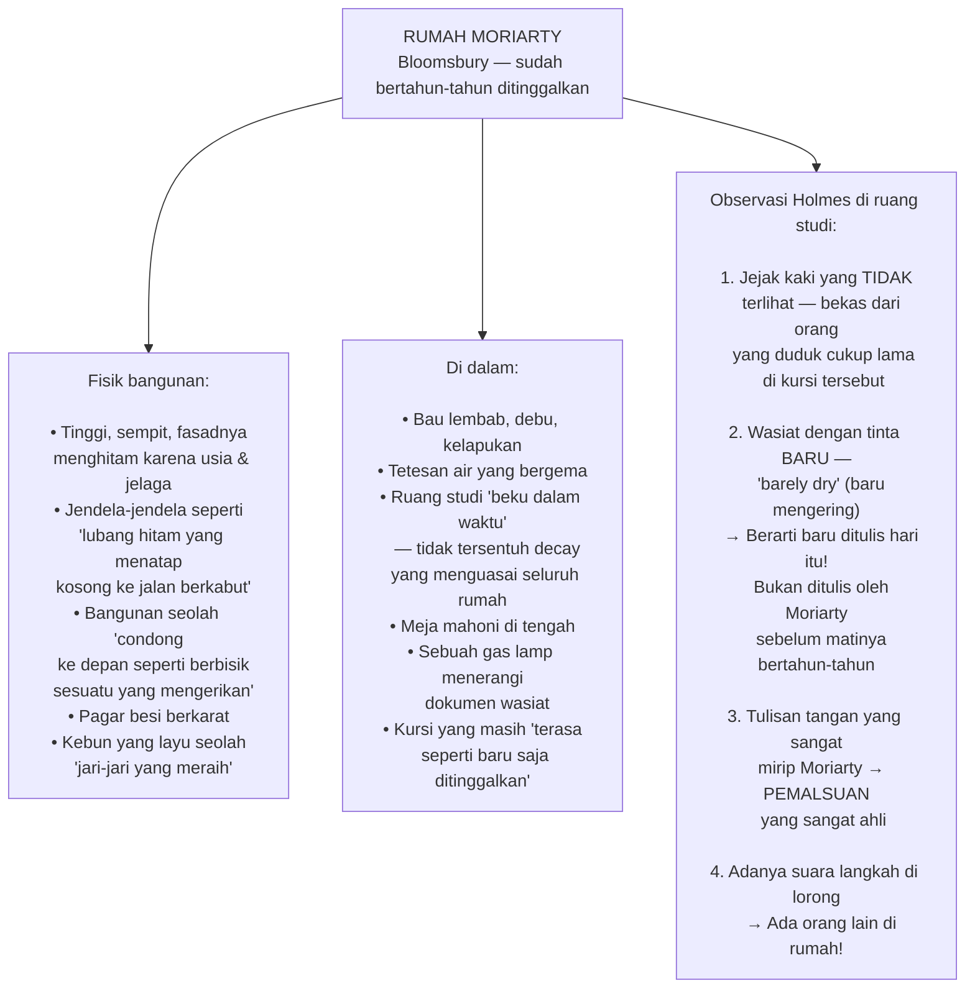
```mermaid
graph TD
    A["RUMAH MORIARTY\nBloomsbury — sudah bertahun-tahun ditinggalkan"]
    
    A --> B["Fisik bangunan:\n\n• Tinggi, sempit, fasadnya\n  menghitam karena usia & jelaga\n• Jendela-jendela seperti\n  'lubang hitam yang menatap\n  kosong ke jalan berkabut'\n• Bangunan seolah 'condong\n  ke depan seperti berbisik\n  sesuatu yang mengerikan'\n• Pagar besi berkarat\n• Kebun yang layu seolah\n  'jari-jari yang meraih'"]
    
    A --> C["Di dalam:\n\n• Bau lembab, debu, kelapukan\n• Tetesan air yang bergema\n• Ruang studi 'beku dalam waktu'\n  — tidak tersentuh decay\n  yang menguasai seluruh rumah\n• Meja mahoni di tengah\n• Sebuah gas lamp menerangi\n  dokumen wasiat\n• Kursi yang masih 'terasa\n  seperti baru saja ditinggalkan'"]
    
    A --> D["Observasi Holmes di ruang studi:\n\n1. Jejak kaki yang TIDAK\n   terlihat — bekas dari orang\n   yang duduk cukup lama\n   di kursi tersebut\n\n2. Wasiat dengan tinta BARU —\n   'barely dry' (baru mengering)\n   → Berarti baru ditulis hari itu!\n   Bukan ditulis oleh Moriarty\n   sebelum matinya bertahun-tahun\n\n3. Tulisan tangan yang sangat\n   mirip Moriarty → PEMALSUAN\n   yang sangat ahli\n\n4. Adanya suara langkah di lorong\n   → Ada orang lain di rumah!"]
```

Deduksi Holmes yang paling penting di bab awal ini adalah tentang **tinta yang baru mengering**. Ini adalah clue yang langsung membunuh narasi "Moriarty bangkit dari kubur" — karena seorang yang mati bertahun-tahun tidak bisa menulis wasiat hari ini. *Seseorang yang masih hidup* yang menulis itu, dengan kemampuan memalsukan tulisan tangan Moriarty yang luar biasa.

> *"The ink is barely dry — which means it was written very recently. The implication struck me at once: then Moriarty did not write it. Someone else did."*
> *— Holmes*

---

## 🔐 Bab 3–4: Saksi Bisu dan Pria Dalam Bayangan

### Daniel Kean: Orang yang Dikirim

Kejaran ke ruang bawah tanah mengungkapkan keberadaan **Daniel Kean** — seorang pria muda sekitar 25 tahun dengan pakaian compang-camping tapi memiliki sepatu tipis yang ideal untuk bergerak diam-diam.

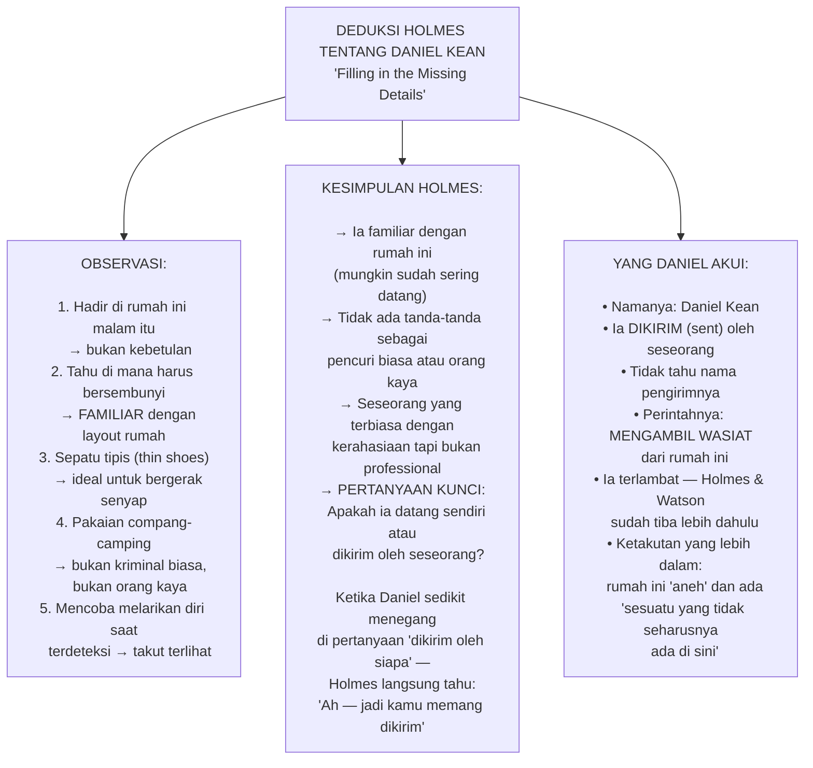
```mermaid
graph TD
    A["DEDUKSI HOLMES TENTANG DANIEL KEAN\n'Filling in the Missing Details'"]
    
    A --> B["OBSERVASI:\n\n1. Hadir di rumah ini malam itu\n   → bukan kebetulan\n2. Tahu di mana harus bersembunyi\n   → FAMILIAR dengan layout rumah\n3. Sepatu tipis (thin shoes)\n   → ideal untuk bergerak senyap\n4. Pakaian compang-camping\n   → bukan kriminal biasa,\n   bukan orang kaya\n5. Mencoba melarikan diri saat\n   terdeteksi → takut terlihat"]
    
    A --> C["KESIMPULAN HOLMES:\n\n→ Ia familiar dengan rumah ini\n   (mungkin sudah sering datang)\n→ Tidak ada tanda-tanda sebagai\n   pencuri biasa atau orang kaya\n→ Seseorang yang terbiasa dengan\n   kerahasiaan tapi bukan professional\n→ PERTANYAAN KUNCI:\n   Apakah ia datang sendiri atau\n   dikirim oleh seseorang?\n\nKetika Daniel sedikit menegang\ndi pertanyaan 'dikirim oleh siapa' —\nHolmes langsung tahu:\n'Ah — jadi kamu memang dikirim'"]
    
    A --> D["YANG DANIEL AKUI:\n\n• Namanya: Daniel Kean\n• Ia DIKIRIM (sent) oleh seseorang\n• Tidak tahu nama pengirimnya\n• Perintahnya: MENGAMBIL WASIAT\n  dari rumah ini\n• Ia terlambat — Holmes & Watson\n  sudah tiba lebih dahulu\n• Ketakutan yang lebih dalam:\n  rumah ini 'aneh' dan ada\n  'sesuatu yang tidak seharusnya\n  ada di sini'"]
```

Karakter Daniel Kean berfungsi sebagai *linking character* (*karakter penghubung*) — seseorang yang cukup tahu untuk memberikan petunjuk, tapi tidak cukup tahu untuk menjawab pertanyaan utama. Ini adalah perangkat naratif yang klasik dalam cerita misteri: karakter yang *berada di pinggiran* conspirace (*konspirasi*) dan bisa menjadi pintu masuk ke intinya.

---

## 🗝️ Bab 5–7: Sandi Bayangan dan Brankas Tersembunyi

### Ruang Studi Kedua dan Brankas Tersembunyi

Pencarian berikutnya membawa mereka ke **ruang studi lain** di lantai atas — ruangan yang lebih personal, dengan potret Moriarty sendiri yang menggantung di atas perapian. Dan di situlah Watson menemukan sesuatu yang aneh:

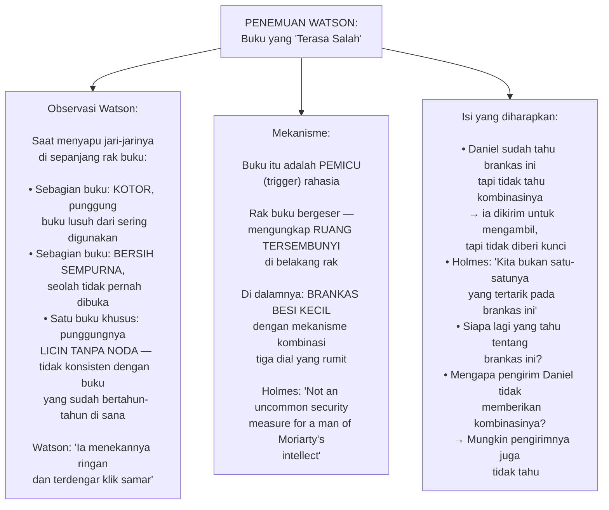
```mermaid
graph TD
    A["PENEMUAN WATSON:\nBuku yang 'Terasa Salah'"]
    
    A --> B["Observasi Watson:\n\nSaat menyapu jari-jarinya\ndi sepanjang rak buku:\n\n• Sebagian buku: KOTOR, punggung\n  buku lusuh dari sering digunakan\n• Sebagian buku: BERSIH SEMPURNA,\n  seolah tidak pernah dibuka\n• Satu buku khusus: punggungnya\n  LICIN TANPA NODA —\n  tidak konsisten dengan buku\n  yang sudah bertahun-tahun di sana\n\nWatson: 'Ia menekannya ringan\ndan terdengar klik samar'"]
    
    A --> C["Mekanisme:\n\nBuku itu adalah PEMICU\n(trigger) rahasia\n\nRak buku bergeser —\nmengungkap RUANG TERSEMBUNYI\ndi belakang rak\n\nDi dalamnya: BRANKAS BESI KECIL\ndengan mekanisme kombinasi\ntiga dial yang rumit\n\nHolmes: 'Not an uncommon security\nmeasure for a man of Moriarty's\nintellect'"]
    
    A --> D["Isi yang diharapkan:\n\n• Daniel sudah tahu brankas ini\n  tapi tidak tahu kombinasinya\n  → ia dikirim untuk mengambil,\n    tapi tidak diberi kunci\n• Holmes: 'Kita bukan satu-satunya\n  yang tertarik pada brankas ini'\n• Siapa lagi yang tahu tentang\n  brankas ini?\n• Mengapa pengirim Daniel tidak\n  memberikan kombinasinya?\n  → Mungkin pengirimnya juga\n    tidak tahu"]
```

Saat Holmes sedang mencongkel brankas dengan peralatan locksmith (*pembuka kunci*)-nya, The Whispers dimulai — suara bisikan yang bergema dari dinding-dinding rumah yang kosong itu.

### The Whispers: Ilusi atau Realita?

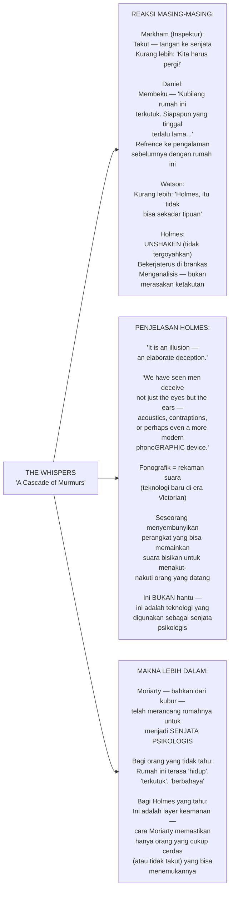
```mermaid
graph LR
    A["THE WHISPERS\n'A Cascade of Murmurs'"]
    
    A --> B["REAKSI MASING-MASING:\n\nMarkham (Inspektur):\nTakut — tangan ke senjata\nKurang lebih: 'Kita harus pergi!'\n\nDaniel:\nMembeku — 'Kubilang rumah ini\nterkutuk. Siapapun yang tinggal\nterlalu lama...'\nRefrence ke pengalaman\nsebelumnya dengan rumah ini\n\nWatson:\nKurang lebih: 'Holmes, itu tidak\nbisa sekadar tipuan'\n\nHolmes:\nUNSHAKEN (tidak tergoyahkan)\nBekerjaterus di brankas\nMenganalisis — bukan\nmerasakan ketakutan"]
    
    A --> C["PENJELASAN HOLMES:\n\n'It is an illusion —\nan elaborate deception.'\n\n'We have seen men deceive\nnot just the eyes but the ears —\nacoustics, contraptions,\nor perhaps even a more modern\nphonoGRAPHIC device.'\n\nFonografik = rekaman suara\n(teknologi baru di era Victorian)\n\nSeseorang menyembunyikan\nperangkat yang bisa memainkan\nsuara bisikan untuk menakut-\nnakuti orang yang datang\n\nIni BUKAN hantu —\nini adalah teknologi yang\ndigunakan sebagai senjata\npsikologis"]
    
    A --> D["MAKNA LEBIH DALAM:\n\nMoriarty — bahkan dari kubur —\ntelah merancang rumahnya untuk\nmenjadi SENJATA PSIKOLOGIS\n\nBagi orang yang tidak tahu:\nRumah ini terasa 'hidup',\n'terkutuk', 'berbahaya'\n\nBagi Holmes yang tahu:\nIni adalah layer keamanan —\ncara Moriarty memastikan\nhanya orang yang cukup cerdas\n(atau tidak takut) yang bisa\nmenemukannya"]
```

Holmes akhirnya membuka brankas — dan dalam momen tepat itu, sosok misterius (a hooded figure / orang bertudung) muncul di pintu studi. Lalu lampu padam. Dan ketika menyala lagi, sosok itu sudah pergi — tapi **bundel dokumen** dari brankas sudah ada di tangan Holmes.

Dengan segel lilin merah dengan lambang Moriarty:

> *"The Last Will and Testament of Professor James Moriarty."*

---

## 🔬 Bab 7–8: Sandi Bayangan dan Pakar Kode

### Anatomi Dokumen Wasiat

Ketika Holmes membuka segel dan membuka dokumen itu, yang ada bukan tulisan biasa — melainkan **cipher** (*kode sandi*) yang sangat kompleks:

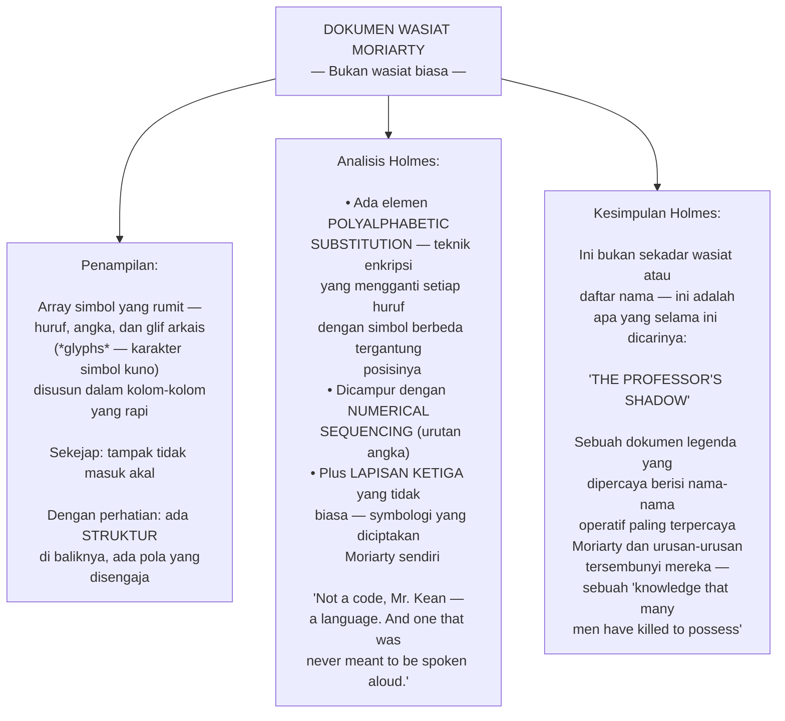
```mermaid
graph TD
    A["DOKUMEN WASIAT MORIARTY\n— Bukan wasiat biasa —"]
    
    A --> B["Penampilan:\n\nArray simbol yang rumit —\nhuruf, angka, dan glif arkais\n(*glyphs* — karakter simbol kuno)\ndisusun dalam kolom-kolom\nyang rapi\n\nSekejap: tampak tidak masuk akal\n\nDengan perhatian: ada STRUKTUR\ndi baliknya, ada pola yang\ndisengaja"]
    
    A --> C["Analisis Holmes:\n\n• Ada elemen POLYALPHABETIC\n  SUBSTITUTION — teknik enkripsi\n  yang mengganti setiap huruf\n  dengan simbol berbeda tergantung\n  posisinya\n• Dicampur dengan NUMERICAL\n  SEQUENCING (urutan angka)\n• Plus LAPISAN KETIGA yang tidak\n  biasa — symbologi yang diciptakan\n  Moriarty sendiri\n\n'Not a code, Mr. Kean —\na language. And one that was\nnever meant to be spoken aloud.'"]
    
    A --> D["Kesimpulan Holmes:\n\nIni bukan sekadar wasiat atau\ndaftar nama — ini adalah\napa yang selama ini dicarinya:\n\n'THE PROFESSOR'S SHADOW'\n\nSebuah dokumen legenda yang\ndipercaya berisi nama-nama\noperatif paling terpercaya\nMoriarty dan urusan-urusan\ntersembunyi mereka —\nsebuah 'knowledge that many\nmen have killed to possess'"]
```

### Professor Harrington: Pakar Sandi yang Terasing

Untuk membuka sandi ini, mereka membutuhkan bantuan **Professor Elliot Harrington** — seorang bekas profesor Oxford yang kini hidup menyendiri dengan obsesif di antara teks-teks kuno.

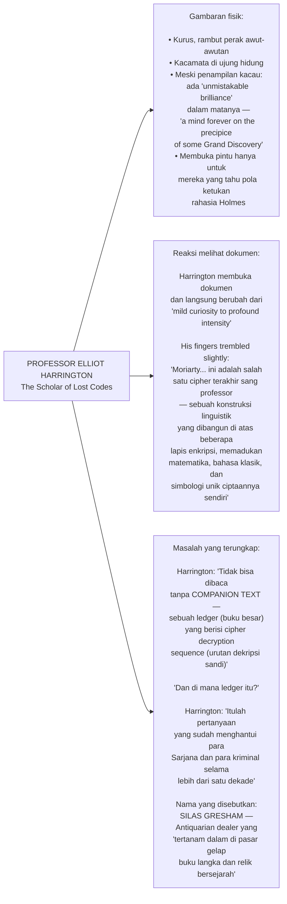
```mermaid
graph LR
    A["PROFESSOR ELLIOT HARRINGTON\nThe Scholar of Lost Codes"]
    
    A --> B["Gambaran fisik:\n\n• Kurus, rambut perak awut-awutan\n• Kacamata di ujung hidung\n• Meski penampilan kacau:\n  ada 'unmistakable brilliance'\n  dalam matanya —\n  'a mind forever on the precipice\n  of some Grand Discovery'\n• Membuka pintu hanya untuk\n  mereka yang tahu pola ketukan\n  rahasia Holmes"]
    
    A --> C["Reaksi melihat dokumen:\n\nHarrington membuka dokumen\ndan langsung berubah dari\n'mild curiosity to profound intensity'\n\nHis fingers trembled slightly:\n'Moriarty... ini adalah salah\nsatu cipher terakhir sang professor\n— sebuah konstruksi linguistik\nyang dibangun di atas beberapa\nlapis enkripsi, memadukan\nmatematika, bahasa klasik, dan\nsimbologi unik ciptaannya sendiri'"]
    
    A --> D["Masalah yang terungkap:\n\nHarrington: 'Tidak bisa dibaca\ntanpa COMPANION TEXT —\nsebuah ledger (buku besar)\nyang berisi cipher decryption\nsequence (urutan dekripsi sandi)'\n\n'Dan di mana ledger itu?'\n\nHarrington: 'Itulah pertanyaan\nyang sudah menghantui para\nSarjana dan para kriminal selama\nlebih dari satu dekade'\n\nNama yang disebutkan:\nSILAS GRESHAM —\nAntiquarian dealer yang\n'tertanam dalam di pasar gelap\nbuku langka dan relik bersejarah'"]
```

---

## 🗺️ Bab 9–12: Memburu Theophilus Gant

### Limehouse, Gresham's Shop, dan Ledger yang Tersembunyi

Jalur penyelidikan membawa mereka ke **Limehouse** — salah satu distrik paling berbahaya di London, tempat opium dens (*tempat candu*), perdagangan gelap, dan tokoh-tokoh bayangan berkumpul.

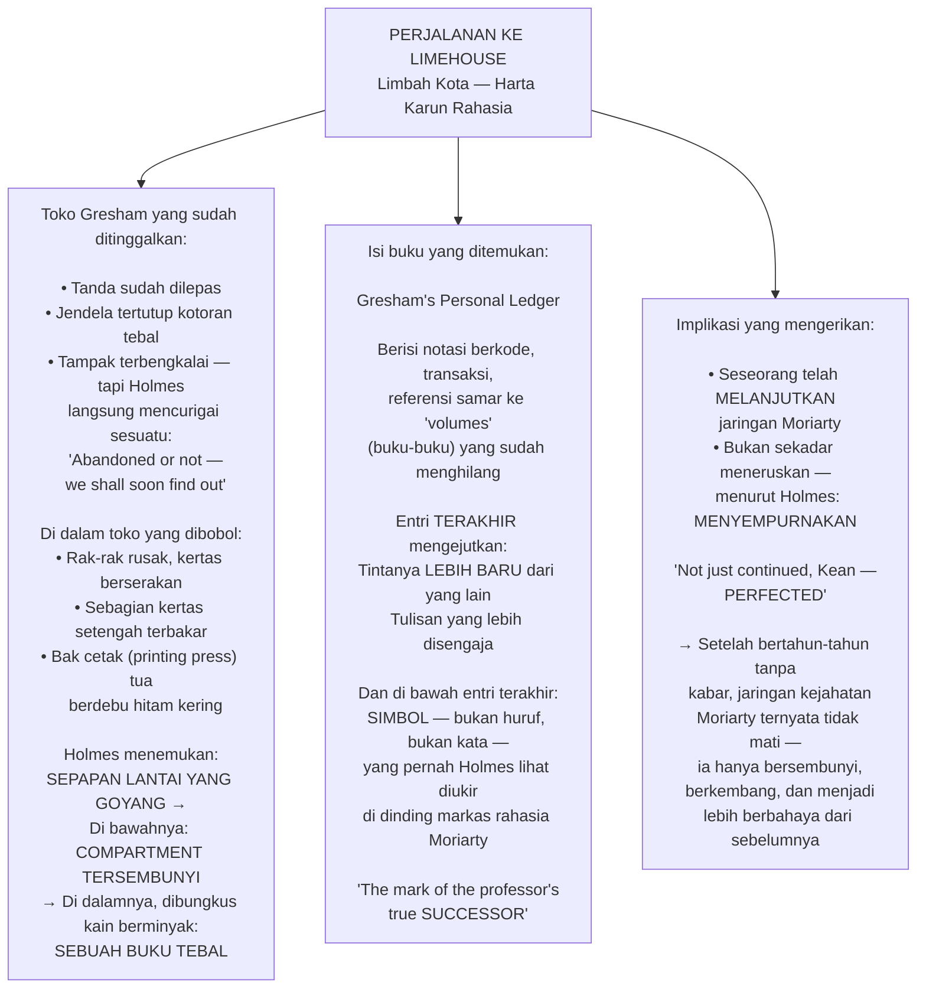
```mermaid
graph TD
    A["PERJALANAN KE LIMEHOUSE\nLimbah Kota — Harta Karun Rahasia"]
    
    A --> B["Toko Gresham yang sudah ditinggalkan:\n\n• Tanda sudah dilepas\n• Jendela tertutup kotoran tebal\n• Tampak terbengkalai — tapi Holmes\n  langsung mencurigai sesuatu:\n  'Abandoned or not —\n  we shall soon find out'\n\nDi dalam toko yang dibobol:\n• Rak-rak rusak, kertas berserakan\n• Sebagian kertas setengah terbakar\n• Bak cetak (printing press) tua\n  berdebu hitam kering\n\nHolmes menemukan:\nSEPAPAN LANTAI YANG GOYANG →\nDi bawahnya: COMPARTMENT TERSEMBUNYI\n→ Di dalamnya, dibungkus kain berminyak:\nSEBUAH BUKU TEBAL"]
    
    A --> C["Isi buku yang ditemukan:\n\nGresham's Personal Ledger\n\nBerisi notasi berkode, transaksi,\nreferensi samar ke 'volumes'\n(buku-buku) yang sudah menghilang\n\nEntri TERAKHIR mengejutkan:\nTintanya LEBIH BARU dari yang lain\nTulisan yang lebih disengaja\n\nDan di bawah entri terakhir:\nSIMBOL — bukan huruf, bukan kata —\nyang pernah Holmes lihat diukir\ndi dinding markas rahasia Moriarty\n\n'The mark of the professor's\ntrue SUCCESSOR'"]
    
    A --> D["Implikasi yang mengerikan:\n\n• Seseorang telah MELANJUTKAN\n  jaringan Moriarty\n• Bukan sekadar meneruskan —\n  menurut Holmes: MENYEMPURNAKAN\n\n'Not just continued, Kean —\nPERFECTED'\n\n→ Setelah bertahun-tahun tanpa\n  kabar, jaringan kejahatan\n  Moriarty ternyata tidak mati —\n  ia hanya bersembunyi,\n  berkembang, dan menjadi\n  lebih berbahaya dari sebelumnya"]
```

### Pengejar dan Yang Dikejar

Di sepanjang perjalanan ini, kita tahu dari Holmes bahwa **mereka sedang diikuti** — setidaknya dua orang yang mengikuti mereka dari rumah Gresham.

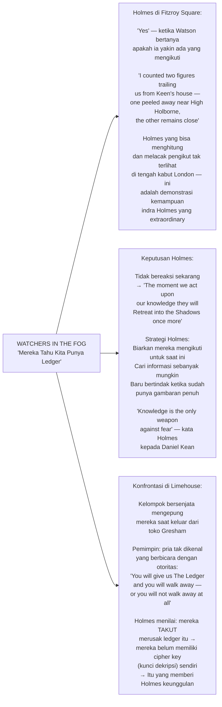
```mermaid
graph LR
    A["WATCHERS IN THE FOG\n'Mereka Tahu Kita Punya Ledger'"]
    
    A --> B["Holmes di Fitzroy Square:\n\n'Yes' — ketika Watson bertanya\napakah ia yakin ada yang mengikuti\n\n'I counted two figures trailing\nus from Keen's house —\none peeled away near High Holborne,\nthe other remains close'\n\nHolmes yang bisa menghitung\ndan melacak pengikut tak terlihat\ndi tengah kabut London — ini\nadalah demonstrasi kemampuan\nindra Holmes yang extraordinary"]
    
    A --> C["Keputusan Holmes:\n\nTidak bereaksi sekarang\n→ 'The moment we act upon\nour knowledge they will\nRetreat into the Shadows once more'\n\nStrategi Holmes:\nBiarkan mereka mengikuti\nuntuk saat ini\nCari informasi sebanyak mungkin\nBaru bertindak ketika sudah\npunya gambaran penuh\n\n'Knowledge is the only weapon\nagainst fear' — kata Holmes\nkepada Daniel Kean"]
    
    A --> D["Konfrontasi di Limehouse:\n\nKelompok bersenjata mengepung\nmereka saat keluar dari\ntoko Gresham\n\nPemimpin: pria tak dikenal\nyang berbicara dengan otoritas:\n'You will give us The Ledger\nand you will walk away —\nor you will not walk away at all'\n\nHolmes menilai: mereka TAKUT\nmerusak ledger itu →\nmereka belum memiliki cipher key\n(kunci dekripsi) sendiri\n→ Itu yang memberi Holmes keunggulan"]
```

---

## 🔍 Bab 12–15: Theophilus Gant dan Sebastian Moran

### Pencarian Gant yang Sulit

Jalur penyelidikan tentang **Theophilus Gant** — ahli sandi yang diduga menciptakan cipher dalam ledger Moriarty — penuh dengan penghalang:

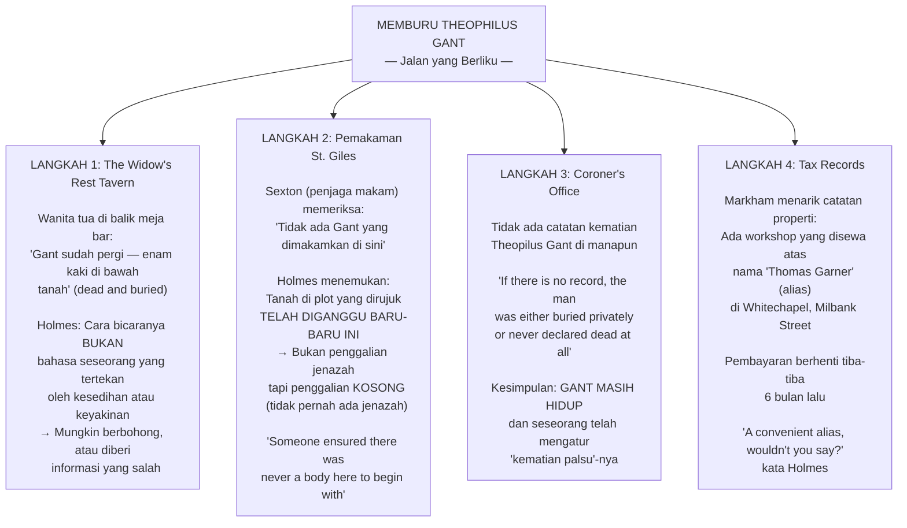
```mermaid
graph TD
    A["MEMBURU THEOPHILUS GANT\n— Jalan yang Berliku —"]
    
    A --> B["LANGKAH 1: The Widow's Rest Tavern\n\nWanita tua di balik meja bar:\n'Gant sudah pergi — enam kaki di bawah\ntanah' (dead and buried)\n\nHolmes: Cara bicaranya BUKAN\nbahasa seseorang yang tertekan\noleh kesedihan atau keyakinan\n→ Mungkin berbohong, atau diberi\n  informasi yang salah"]
    
    A --> C["LANGKAH 2: Pemakaman St. Giles\n\nSexton (penjaga makam) memeriksa:\n'Tidak ada Gant yang dimakamkan di sini'\n\nHolmes menemukan:\nTanah di plot yang dirujuk\nTELAH DIGANGGU BARU-BARU INI\n→ Bukan penggalian jenazah\n  tapi penggalian KOSONG\n  (tidak pernah ada jenazah)\n\n'Someone ensured there was\nnever a body here to begin with'"]
    
    A --> D["LANGKAH 3: Coroner's Office\n\nTidak ada catatan kematian\nTheopilus Gant di manapun\n\n'If there is no record, the man\nwas either buried privately\nor never declared dead at all'\n\nKesimpulan: GANT MASIH HIDUP\ndan seseorang telah mengatur\n'kematian palsu'-nya"]
    
    A --> E["LANGKAH 4: Tax Records\n\nMarkham menarik catatan properti:\nAda workshop yang disewa atas\nnama 'Thomas Garner' (alias)\ndi Whitechapel, Milbank Street\n\nPembayaran berhenti tiba-tiba\n6 bulan lalu\n\n'A convenient alias, wouldn't you say?'\nkata Holmes"]
```

### Workshop di Whitechapel dan Surat Khas

Di workshop yang sudah ditinggalkan di Whitechapel, Holmes menemukan barang terpenting:

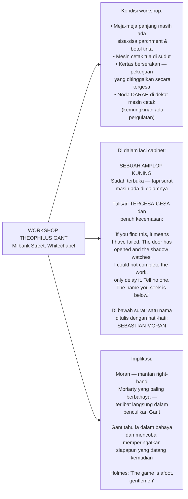
```mermaid
graph LR
    A["WORKSHOP THEOPHILUS GANT\nMilbank Street, Whitechapel"]
    
    A --> B["Kondisi workshop:\n\n• Meja-meja panjang masih ada\n  sisa-sisa parchment & botol tinta\n• Mesin cetak tua di sudut\n• Kertas berserakan — pekerjaan\n  yang ditinggalkan secara tergesa\n• Noda DARAH di dekat mesin cetak\n  (kemungkinan ada pergulatan)"]
    
    A --> C["Di dalam laci cabinet:\n\nSEBUAH AMPLOP KUNING\nSudah terbuka — tapi surat\nmasih ada di dalamnya\n\nTulisan TERGESA-GESA dan\npenuh kecemasan:\n\n'If you find this, it means\nI have failed. The door has\nopened and the shadow watches.\nI could not complete the work,\nonly delay it. Tell no one.\nThe name you seek is below.'\n\nDi bawah surat: satu nama\nditulis dengan hati-hati:\nSEBASTIAN MORAN"]
    
    A --> D["Implikasi:\n\nMoran — mantan right-hand\nMoriarty yang paling berbahaya —\nterlibat langsung dalam\npenculikan Gant\n\nGant tahu ia dalam bahaya\ndan mencoba memperingatkan\nsiapapun yang datang kemudian\n\nHolmes: 'The game is afoot,\ngentlemen'"]
```

### Konfrontasi di Warehouse: Moran dan Gant

Informasi dari Captain Lal (seorang militer tidak hormat yang mengoperasikan gambling den di Limehouse) mengarahkan mereka ke **gudang di South Bank** — tempat Moran menyembunyikan Gant.

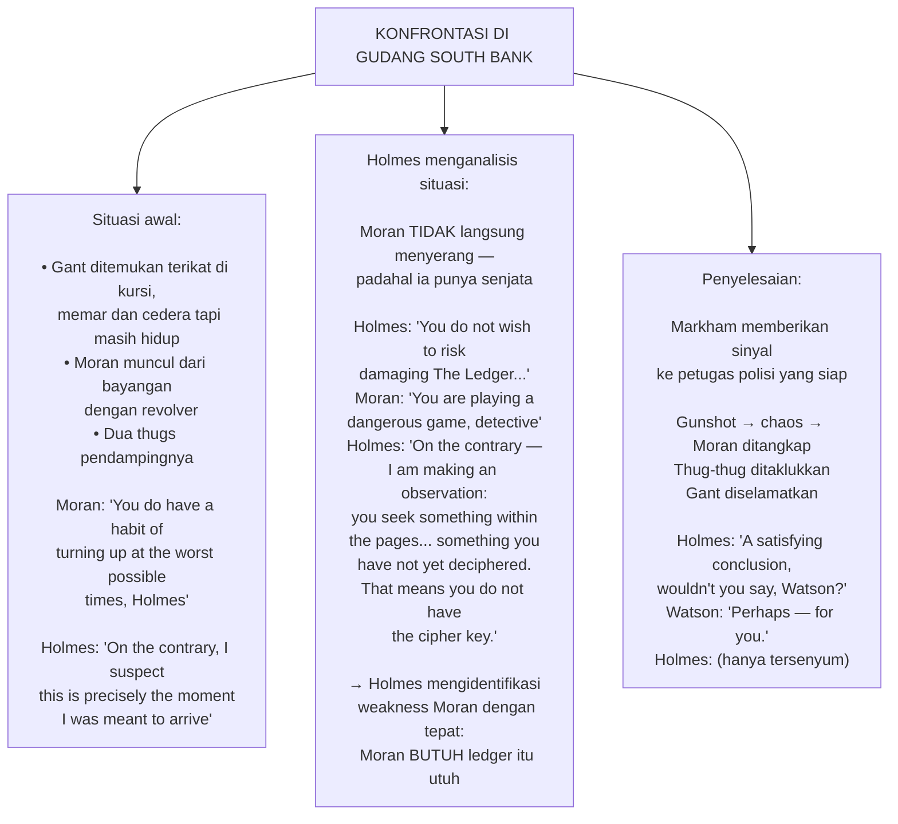
```mermaid
graph TD
    A["KONFRONTASI DI GUDANG SOUTH BANK"]
    
    A --> B["Situasi awal:\n\n• Gant ditemukan terikat di kursi,\n  memar dan cedera tapi masih hidup\n• Moran muncul dari bayangan\n  dengan revolver\n• Dua thugs pendampingnya\n\nMoran: 'You do have a habit of\nturning up at the worst possible\ntimes, Holmes'\n\nHolmes: 'On the contrary, I suspect\nthis is precisely the moment\nI was meant to arrive'"]
    
    A --> C["Holmes menganalisis situasi:\n\nMoran TIDAK langsung menyerang —\npadahal ia punya senjata\n\nHolmes: 'You do not wish to risk\ndamaging The Ledger...'\nMoran: 'You are playing a\ndangerous game, detective'\nHolmes: 'On the contrary —\nI am making an observation:\nyou seek something within\nthe pages... something you\nhave not yet deciphered.\nThat means you do not have\nthe cipher key.'\n\n→ Holmes mengidentifikasi\n  weakness Moran dengan tepat:\n  Moran BUTUH ledger itu utuh"]
    
    A --> D["Penyelesaian:\n\nMarkham memberikan sinyal\nke petugas polisi yang siap\n\nGunshot → chaos → Moran ditangkap\nThug-thug ditaklukkan\nGant diselamatkan\n\nHolmes: 'A satisfying conclusion,\nwouldn't you say, Watson?'\nWatson: 'Perhaps — for you.'\nHolmes: (hanya tersenyum)"]
```

---

## 💎 Bab 16: Rahasia Terakhir Gant — Jaringan Lebih Besar

Setelah diselamatkan dan dibawa ke Baker Street, **Theophilus Gant** mengungkapkan sesuatu yang jauh lebih besar dari yang diperkirakan siapapun:

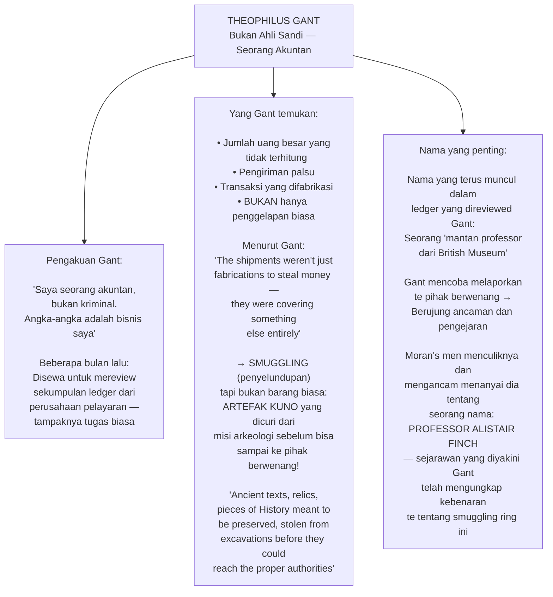
```mermaid
graph TD
    A["THEOPHILUS GANT\nBukan Ahli Sandi — Seorang Akuntan"]
    
    A --> B["Pengakuan Gant:\n\n'Saya seorang akuntan,\nbukan kriminal.\nAngka-angka adalah bisnis saya'\n\nBeberapa bulan lalu:\nDisewa untuk mereview\nsekumpulan ledger dari\nperusahaan pelayaran —\ntampaknya tugas biasa"]
    
    A --> C["Yang Gant temukan:\n\n• Jumlah uang besar yang\n  tidak terhitung\n• Pengiriman palsu\n• Transaksi yang difabrikasi\n• BUKAN hanya penggelapan biasa\n\nMenurut Gant:\n'The shipments weren't just\nfabrications to steal money —\nthey were covering something\nelse entirely'\n\n→ SMUGGLING (penyelundupan)\ntapi bukan barang biasa:\nARTEFAK KUNO yang dicuri dari\nmisi arkeologi sebelum bisa\nsampai ke pihak berwenang!\n\n'Ancient texts, relics,\npieces of History meant to\nbe preserved, stolen from\nexcavations before they could\nreach the proper authorities'"]
    
    A --> D["Nama yang penting:\n\nNama yang terus muncul dalam\nledger yang direviewed Gant:\nSeorang 'mantan professor\ndari British Museum'\n\nGant mencoba melaporkan\nte pihak berwenang →\nBerujung ancaman dan pengejaran\n\nMoran's men menculiknya dan\nmengancam menanyai dia tentang\nseorang nama: PROFESSOR ALISTAIR FINCH\n— sejarawan yang diyakini Gant\ntelah mengungkap kebenaran\nte tentang smuggling ring ini"]
```

### Dimensi Baru: Penyelundupan Artefak Bersejarah

Ini adalah *pivot point* (*titik perubahan*) cerita yang paling dramatis. Apa yang dimulai sebagai misteri tentang surat wasiat Moriarty ternyata adalah ujung dari **jaringan kriminal yang jauh lebih besar dan lebih lama**:

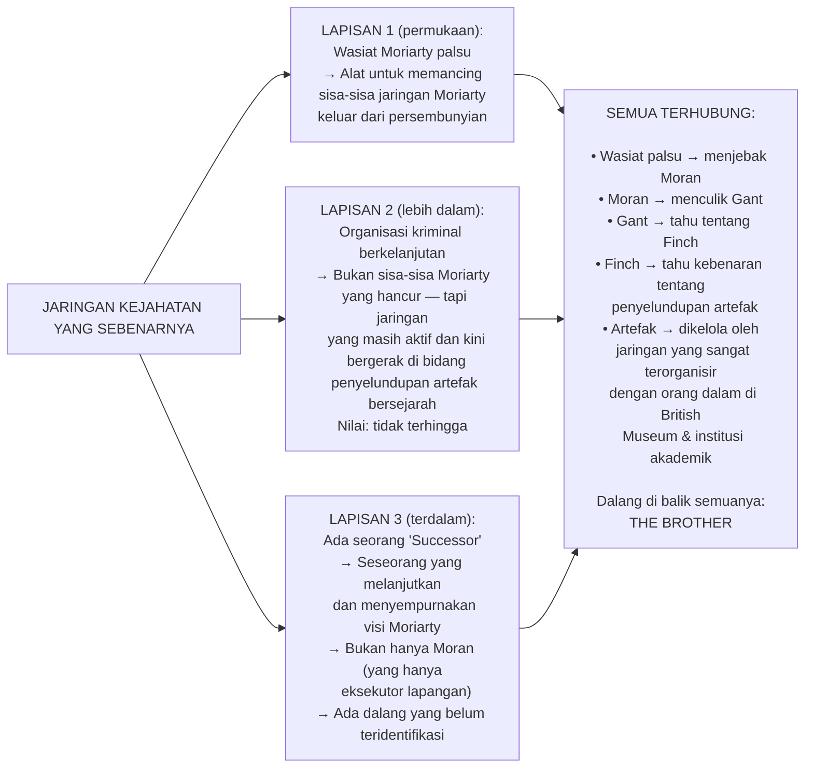
```mermaid
graph LR
    A["JARINGAN KEJAHATAN YANG SEBENARNYA"]
    
    A --> B["LAPISAN 1 (permukaan):\nWasiat Moriarty palsu\n→ Alat untuk memancing\n  sisa-sisa jaringan Moriarty\n  keluar dari persembunyian"]
    
    A --> C["LAPISAN 2 (lebih dalam):\nOrganisasi kriminal berkelanjutan\n→ Bukan sisa-sisa Moriarty\n  yang hancur — tapi jaringan\n  yang masih aktif dan kini\n  bergerak di bidang\n  penyelundupan artefak bersejarah\nNilai: tidak terhingga"]
    
    A --> D["LAPISAN 3 (terdalam):\nAda seorang 'Successor'\n→ Seseorang yang melanjutkan\n  dan menyempurnakan visi Moriarty\n→ Bukan hanya Moran (yang hanya\n  eksekutor lapangan)\n→ Ada dalang yang belum teridentifikasi"]
    
    B --> E["SEMUA TERHUBUNG:\n\n• Wasiat palsu → menjebak Moran\n• Moran → menculik Gant\n• Gant → tahu tentang Finch\n• Finch → tahu kebenaran tentang\n  penyelundupan artefak\n• Artefak → dikelola oleh\n  jaringan yang sangat terorganisir\n  dengan orang dalam di British\n  Museum & institusi akademik\n\nDalang di balik semuanya:\nTHE BROTHER"]
    C --> E
    D --> E
```

---

## 🏛️ Bab 17–19: St. Ignatius dan Kematian Finch

### Jejak yang Mengarah ke Katedral Tua

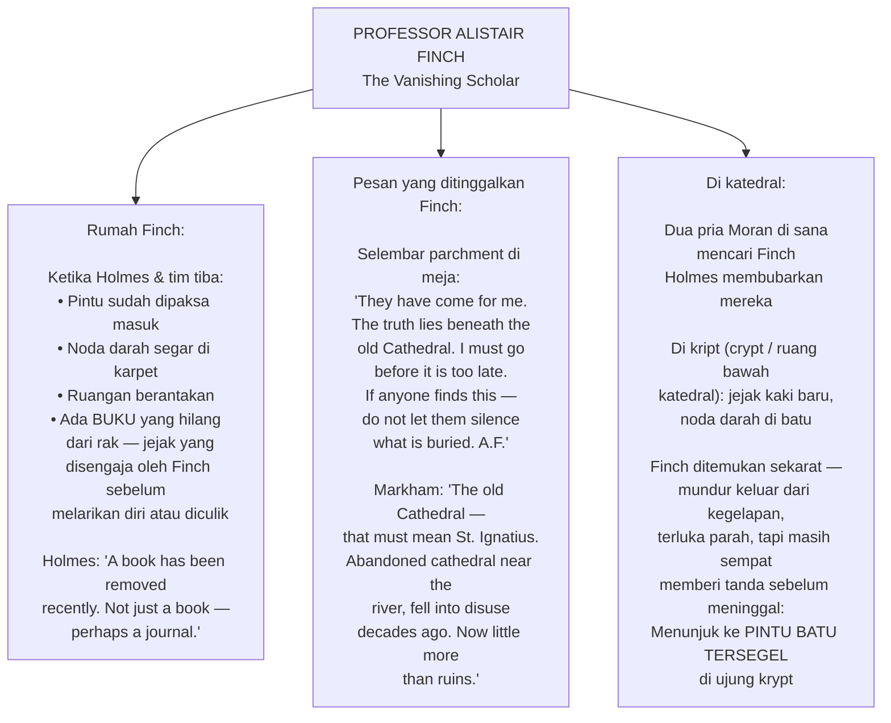
```mermaid
graph TD
    A["PROFESSOR ALISTAIR FINCH\nThe Vanishing Scholar"]
    
    A --> B["Rumah Finch:\n\nKetika Holmes & tim tiba:\n• Pintu sudah dipaksa masuk\n• Noda darah segar di karpet\n• Ruangan berantakan\n• Ada BUKU yang hilang\n  dari rak — jejak yang\n  disengaja oleh Finch sebelum\n  melarikan diri atau diculik\n\nHolmes: 'A book has been removed\nrecently. Not just a book —\nperhaps a journal.'"]
    
    A --> C["Pesan yang ditinggalkan Finch:\n\nSelembar parchment di meja:\n'They have come for me.\nThe truth lies beneath the\nold Cathedral. I must go\nbefore it is too late.\nIf anyone finds this —\ndo not let them silence\nwhat is buried. A.F.'\n\nMarkham: 'The old Cathedral —\nthat must mean St. Ignatius.\nAbandoned cathedral near the\nriver, fell into disuse\ndecades ago. Now little more\nthan ruins.'"]
    
    A --> D["Di katedral:\n\nDua pria Moran di sana\nmencari Finch\nHolmes membubarkan mereka\n\nDi kript (crypt / ruang bawah\nkatedral): jejak kaki baru,\nnoda darah di batu\n\nFinch ditemukan sekarat —\nmundur keluar dari kegelapan,\nterluka parah, tapi masih sempat\nmemberi tanda sebelum meninggal:\nMenunjuk ke PINTU BATU TERSEGEL\ndi ujung krypt"]
```

### Vault of Shadows: Daftar Orang Hilang

Di balik pintu batu tersegel, mereka menemukan **ruang bawah tanah** yang mengungkap dimensi paling gelap dari seluruh konspirasi:

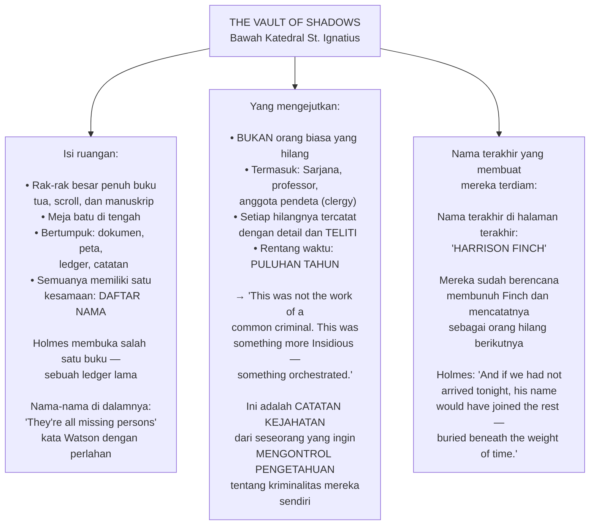
```mermaid
graph TD
    A["THE VAULT OF SHADOWS\nBawah Katedral St. Ignatius"]
    
    A --> B["Isi ruangan:\n\n• Rak-rak besar penuh buku\n  tua, scroll, dan manuskrip\n• Meja batu di tengah\n• Bertumpuk: dokumen, peta,\n  ledger, catatan\n• Semuanya memiliki satu\n  kesamaan: DAFTAR NAMA\n\nHolmes membuka salah satu buku —\nsebuah ledger lama\n\nNama-nama di dalamnya:\n'They're all missing persons'\nkata Watson dengan perlahan"]
    
    A --> C["Yang mengejutkan:\n\n• BUKAN orang biasa yang hilang\n• Termasuk: Sarjana, professor,\n  anggota pendeta (clergy)\n• Setiap hilangnya tercatat\n  dengan detail dan TELITI\n• Rentang waktu: PULUHAN TAHUN\n\n→ 'This was not the work of a\ncommon criminal. This was\nsomething more Insidious —\nsomething orchestrated.'\n\nIni adalah CATATAN KEJAHATAN\ndari seseorang yang ingin\nMENGONTROL PENGETAHUAN\ntentang kriminalitas mereka\nsendiri"]
    
    A --> D["Nama terakhir yang membuat\nmereka terdiam:\n\nNama terakhir di halaman terakhir:\n'HARRISON FINCH'\n\nMereka sudah berencana\nmembunuh Finch dan mencatatnya\nsebagai orang hilang berikutnya\n\nHolmes: 'And if we had not\narrived tonight, his name\nwould have joined the rest —\nburied beneath the weight of time.'"]
```

### "They Are Watching" — Pesan dari Masa Lalu

Di sudut vault ada sebuah **ruangan kecil** dengan kursi kayu dan belenggu di dinding — sebuah sel penjara tersembunyi. Dan di dindingnya:

> *"They are watching"*
> *(Mereka sedang mengawasi)*

Ditulis oleh seseorang yang pernah dipenjara di sana, dalam keputusasaan, entah berapa tahun atau berapa dekade lalu. Pesan ini berfungsi sebagai echo (*gema*) dari seluruh tema cerita: bahwa di balik dunia yang tampak normal, ada mata-mata yang terus mengawasi, dan ada kejahatan yang sudah berlangsung jauh lebih lama dari yang siapapun bayangkan.

Dan tepat saat mereka berdiri merenungi kata-kata itu — **pintu batu tertutup dan mengunci mereka di dalam**. Seseorang telah menjebak mereka.

---

## 🎭 Bab 21–22: Permainan Akhir Holmes

### The Last Gambit — Baker Street sebagai Panggung Sandiwara

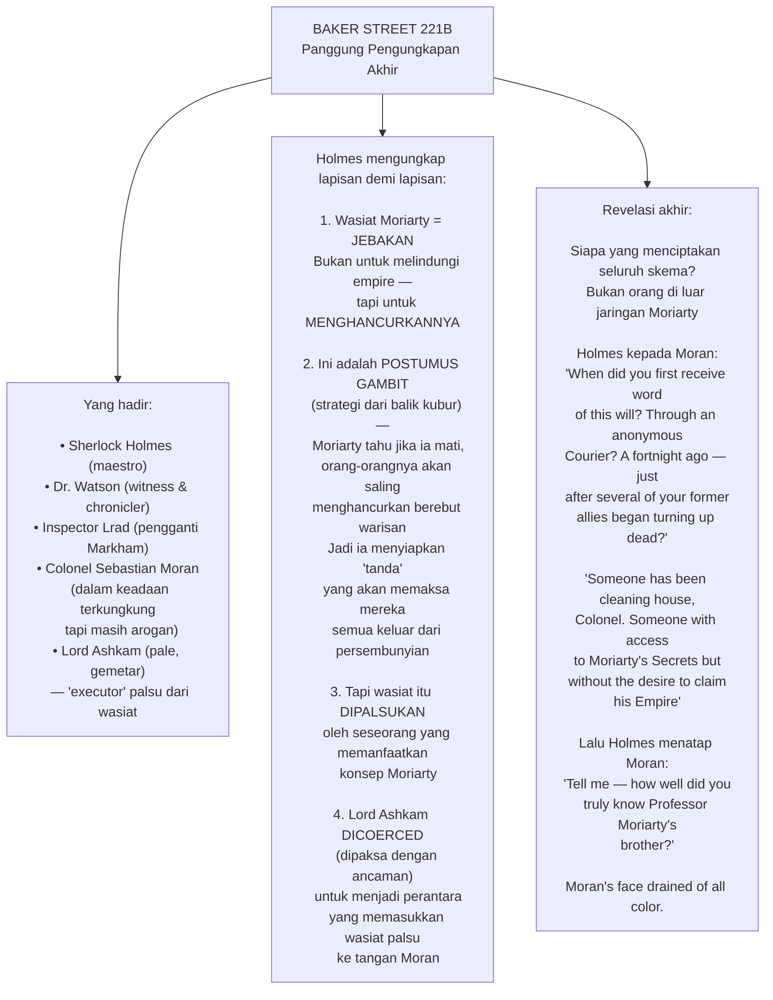
```mermaid
graph TD
    A["BAKER STREET 221B\nPanggung Pengungkapan Akhir"]
    
    A --> B["Yang hadir:\n\n• Sherlock Holmes (maestro)\n• Dr. Watson (witness & chronicler)\n• Inspector Lrad (pengganti Markham)\n• Colonel Sebastian Moran\n  (dalam keadaan terkungkung\n  tapi masih arogan)\n• Lord Ashkam (pale, gemetar)\n  — 'executor' palsu dari wasiat"]
    
    A --> C["Holmes mengungkap lapisan demi lapisan:\n\n1. Wasiat Moriarty = JEBAKAN\n   Bukan untuk melindungi empire —\n   tapi untuk MENGHANCURKANNYA\n\n2. Ini adalah POSTUMUS GAMBIT\n   (strategi dari balik kubur) —\n   Moriarty tahu jika ia mati,\n   orang-orangnya akan saling\n   menghancurkan berebut warisan\n   Jadi ia menyiapkan 'tanda'\n   yang akan memaksa mereka\n   semua keluar dari persembunyian\n\n3. Tapi wasiat itu DIPALSUKAN\n   oleh seseorang yang memanfaatkan\n   konsep Moriarty\n\n4. Lord Ashkam DICOERCED\n   (dipaksa dengan ancaman)\n   untuk menjadi perantara\n   yang memasukkan wasiat palsu\n   ke tangan Moran"]
    
    A --> D["Revelasi akhir:\n\nSiapa yang menciptakan seluruh skema?\nBukan orang di luar jaringan Moriarty\n\nHolmes kepada Moran:\n'When did you first receive word\nof this will? Through an anonymous\nCourier? A fortnight ago — just\nafter several of your former\nallies began turning up dead?'\n\n'Someone has been cleaning house,\nColonel. Someone with access\nto Moriarty's Secrets but\nwithout the desire to claim\nhis Empire'\n\nLalu Holmes menatap Moran:\n'Tell me — how well did you\ntruly know Professor Moriarty's\nbrother?'\n\nMoran's face drained of all color."]
```

### The Brother: Sosok yang Tersembunyi

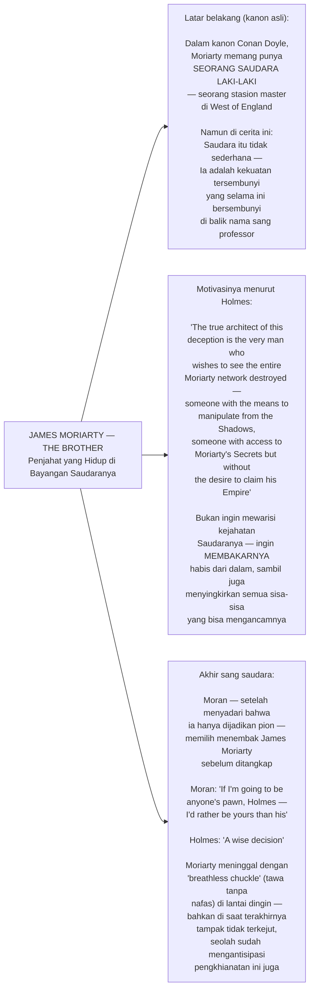
```mermaid
graph LR
    A["JAMES MORIARTY — THE BROTHER\nPenjahat yang Hidup di Bayangan Saudaranya"]
    
    A --> B["Latar belakang (kanon asli):\n\nDalam kanon Conan Doyle,\nMoriarty memang punya\nSEORANG SAUDARA LAKI-LAKI\n— seorang stasion master\ndi West of England\n\nNamun di cerita ini:\nSaudara itu tidak sederhana —\nIa adalah kekuatan tersembunyi\nyang selama ini bersembunyi\ndi balik nama sang professor"]
    
    A --> C["Motivasinya menurut Holmes:\n\n'The true architect of this\ndeception is the very man who\nwishes to see the entire\nMoriarty network destroyed —\nsomeone with the means to\nmanipulate from the Shadows,\nsomeone with access to\nMoriarty's Secrets but without\nthe desire to claim his Empire'\n\nBukan ingin mewarisi kejahatan\nSaudaranya — ingin MEMBAKARNYA\nhabis dari dalam, sambil juga\nmenyingkirkan semua sisa-sisa\nyang bisa mengancamnya"]
    
    A --> D["Akhir sang saudara:\n\nMoran — setelah menyadari bahwa\nia hanya dijadikan pion —\nmemilih menembak James Moriarty\nsebelum ditangkap\n\nMoran: 'If I'm going to be\nanyone's pawn, Holmes —\nI'd rather be yours than his'\n\nHolmes: 'A wise decision'\n\nMoriarty meninggal dengan\n'breathless chuckle' (tawa tanpa\nnafas) di lantai dingin —\nbahkan di saat terakhirnya\ntampak tidak terkejut,\nseolah sudah mengantisipasi\npengkhianatan ini juga"]
```

---

## 🧠 Analisis Mendalam: Tema-Tema Utama

### 1. Warisan Kejahatan — Apakah Kejahatan Benar-benar Bisa Mati?

Pertanyaan paling fundamental yang diajukan cerita ini adalah: **ketika seorang penjahat besar mati, apakah kejahatannya ikut mati?**

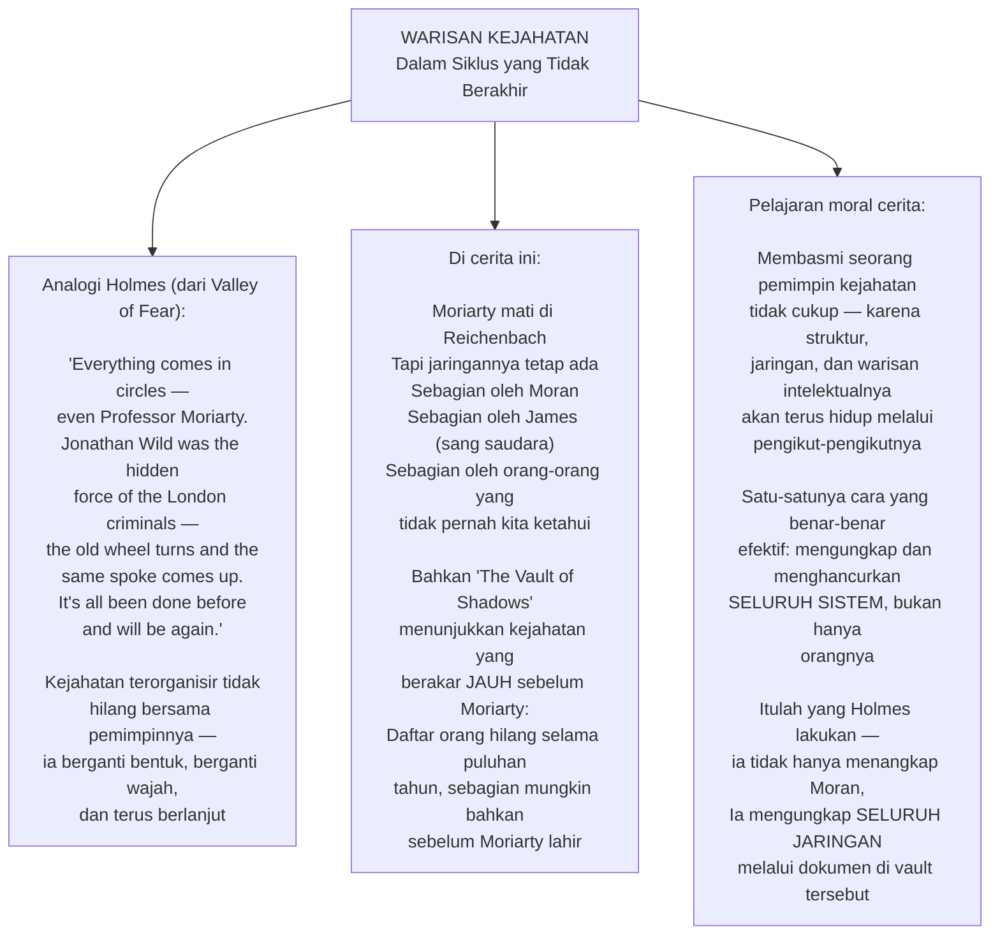
```mermaid
graph TD
    A["WARISAN KEJAHATAN\nDalam Siklus yang Tidak Berakhir"]
    
    A --> B["Analogi Holmes (dari Valley of Fear):\n\n'Everything comes in circles —\neven Professor Moriarty.\nJonathan Wild was the hidden\nforce of the London criminals —\nthe old wheel turns and the\nsame spoke comes up.\nIt's all been done before\nand will be again.'\n\nKejahatan terorganisir tidak\nhilang bersama pemimpinnya —\nia berganti bentuk, berganti wajah,\ndan terus berlanjut"]
    
    A --> C["Di cerita ini:\n\nMoriarty mati di Reichenbach\nTapi jaringannya tetap ada\nSebagian oleh Moran\nSebagian oleh James (sang saudara)\nSebagian oleh orang-orang yang\ntidak pernah kita ketahui\n\nBahkan 'The Vault of Shadows'\nmenunjukkan kejahatan yang\nberakar JAUH sebelum Moriarty:\nDaftar orang hilang selama puluhan\ntahun, sebagian mungkin bahkan\nsebelum Moriarty lahir"]
    
    A --> D["Pelajaran moral cerita:\n\nMembasmi seorang pemimpin kejahatan\ntidak cukup — karena struktur,\njaringan, dan warisan intelektualnya\nakan terus hidup melalui\npengikut-pengikutnya\n\nSatu-satunya cara yang benar-benar\nefektif: mengungkap dan menghancurkan\nSELURUH SISTEM, bukan hanya\norangnya\n\nItulah yang Holmes lakukan —\nia tidak hanya menangkap Moran,\nIa mengungkap SELURUH JARINGAN\nmelalui dokumen di vault tersebut"]
```

### 2. Deduksi sebagai Senjata — Bukan Kekerasan

Momen-momen terkuat Holmes dalam cerita ini bukan saat ia berkelahi atau berlari — melainkan saat ia **berkata sesuatu yang tepat pada waktu yang tepat** untuk menggeser keseimbangan kekuatan.

```mermaid
graph LR
    A["KEKUATAN KATA-KATA HOLMES\nvs Ancaman Fisik"]
    
    A --> B["Situasi 1: Menghadapi para pengejar\ndi gang Limehouse:\n\nMereka bersenjata, Holmes tidak\nTapi Holmes mengidentifikasi:\nMereka BUTUH ledger itu utuh\n→ Holmes tidak dalam bahaya nyata\n\n'You do not wish to risk\ndamaging The Ledger... you seek\nsomething within these pages\nthat you have not yet deciphered.\nThat means you do not have\nthe cipher key.'\n\nReaksi para pengejar: terdiam\nHolmes mengekspose weakness mereka\nhanya dengan logika"]
    
    A --> C["Situasi 2: Menghadapi Moran\ndi gudang South Bank:\n\nMoran bersenjata, menganggap\ndirinya mengontrol situasi\n\n'You are cornered, outnumbered,\nand the authorities are already\nclosing in'\n\nMoran: 'Outnumbered perhaps,\nbut desperate men are dangerous'\n\nHolmes: 'Then let us remove\ndesperation from the equation'\n\n→ Holmes menawarkan jalan keluar\n  daripada menciptakan desperation\n  (keputusasaan) yang berbahaya"]
    
    A --> D["Situasi 3: Di Baker Street,\nmenghadapi semua pihak:\n\nBukan satu pertanyaan langsung —\ntapi serangkaian pernyataan yang\ndidesain untuk membuat masing-masing\npihak meragukan pihak lain\n\nHolmes kepada Moran tentang\n'saudara Moriarty':\n'Tell me — how well did you\ntruly know Professor Moriarty's\nbrother?'\n\nSatu pertanyaan ini menghancurkan\nSeluruh konstruksi kekuatan Moran\ndengan mengungkap betapa sedikit\nyang ia benar-benar ketahui\ntentang bosnya sendiri"]
```

### 3. Holmes sebagai Dramaturg — Keindahan Pengungkapan

Salah satu ciri khas Holmes yang paling menarik adalah **cara ia menikmati saat pengungkapan** — bukan sebagai narsis, tapi sebagai seniman yang mencintai penyelesaian yang elegan.

> *"Watson insists that I am the dramatist in real life... Some touch of the artist wells up within me and calls insistently for a well-staged performance. Surely our profession would be a drab and sordid one if we did not sometimes set the scene so as to glorify our results."*

Ini adalah Holmes yang paling jujur — ia mengakui bahwa ia seorang **artist of detection** (*seniman deteksi*), bukan hanya seorang teknisi pemecah masalah. Keberhasilan yang paling memuaskan baginya bukan yang paling cepat, tapi yang paling **estetis dalam penyampaiannya**.

---

## 📊 Struktur Naratif: Pemetaan Alur Cerita

```mermaid
graph TD
    A["STRUKTUR NARATIF\n22 Bab dalam 5 Fase"]
    
    A --> B["FASE 1 — HOOK (Bab 1-2):\n\nSetup: Masalah 'mustahil'\nMayat Moriarty, ruang terkunci,\nwasiat dari balik kubur\n\nFungsi: Memancing rasa ingin tahu\npertanyaan: APA yang sebenarnya\nterjadi?"]
    
    A --> C["FASE 2 — INVESTIGATION (Bab 3-6):\n\nPengumpulan petunjuk:\nDaniel Kean, sandi dalam wasiat,\nsuara-suara misterius, brankas\ntersembunyi, sosok bertudung\n\nFungsi: Memperdalam misteri,\nmenambah lapisan pertanyaan"]
    
    A --> D["FASE 3 — EXPANSION (Bab 7-13):\n\nMisteri melebar:\nHarrington, Gresham, pencarian Gant,\nLimehouse, pengejaran, vault dokumen\n\nFungsi: Memperlihatkan skala\nsebenarnya dari konspirasi"]
    
    A --> E["FASE 4 — ESCALATION (Bab 14-19):\n\nKonfrontasi makin berbahaya:\nMoran, penculikan Gant, Finch,\nkatedral St. Ignatius, vault of shadows,\ndipenjara di dalam crypt\n\nFungsi: Membangun ketegangan\nmenuju klimaks"]
    
    A --> F["FASE 5 — RESOLUTION (Bab 20-22):\n\nPengungkapan berlapis:\nBaker Street, James Moriarty,\nMoran menembak sang saudara,\ntangkapan penuh\n\nFungsi: Resolusi dengan twist\nterakhir yang memuaskan"]
```

---

## 🔎 Perbandingan dengan Kanon Holmes: Yang Konsisten dan Yang Berbeda

```mermaid
graph LR
    A["PERBANDINGAN DENGAN KANON ASLI"]
    
    A --> B["KONSISTEN ✅:\n\n• Suasana London Victorian\n  (kabut, gas lamp, cobblestones)\n• Holmes tak bisa tanpa kasus —\n  boredom-nya sangat khas\n• Violin sebagai objek refleksi\n• Mrs. Hudson dengan disapproval-nya\n• Cara deduksi Holmes dari detail\n  kecil (sepatu, pakaian, tangan)\n• Watson sebagai narator yang\n  penuh kekaguman tapi juga\n  kadang tertinggal\n• Moriarty sebagai 'Napoleon of Crime'\n• Colonel Moran sebagai right-hand"]
    
    A --> C["BERBEDA / EXPANDED ❌:\n\n• Saudara Moriarty yang 'biasa'\n  (stasion master) menjadi dalang\n  kejahatan besar — tidak konsisten\n  dengan sumber asli\n• Banyak karakter baru yang\n  tidak ada dalam kanon\n• Teknologi fonografik dalam\n  rumah tua — agak anachronistic\n• Vault of Shadows dengan ribuan\n  catatan hilang — terlalu besar\n  untuk satu operasi\n• Skala konspirasi yang sangat\n  luas dengan waktu penyelidikan\n  yang sangat singkat dalam\n  satu malam"]
    
    A --> D["NILAI FAN-FICTION:\n\nCerita ini berhasil karena:\n→ Mengambil SPIRIT Holmes\n  dengan tepat: logika, deduksi,\n  karakter yang kaya\n→ Menghormati setting Victorian\n→ Menambahkan plot yang kohesif\n  meski kompleks\n→ Memberikan resolusi yang\n  memuaskan dengan twist yang\n  tidak terlalu mudah ditebak\n\nKelemahan:\n→ Beberapa kebetulan yang\n  terlalu bagus\n→ Penyelesaian yang mungkin\n  terlalu cepat untuk skala\n  konspirasi yang digambarkan"]
```

---

## 🎯 Kesimpulan: Apa yang Membuat Misteri ini Abadi

**"The Last Will of Professor Moriarty"** adalah bukti mengapa karakter Sherlock Holmes begitu kuat sehingga bertahan melampaui karya aslinya — ia bisa ditulis, diceritakan, dan dianalisis ulang berkali-kali tanpa kehilangan esensinya.

```mermaid
graph TD
    A["WARISAN SHERLOCK HOLMES\nMengapa Karakter Ini Abadi"]
    
    A --> B["SEBAGAI TEMPLATE INTELEKTUAL:\n\nHolmes mengajarkan bahwa\nkecerdasan bukanlah sihir —\nia adalah disiplin\n\nObservasi → Analisis → Deduksi\nBukan intuisi ajaib,\ntapi metodologi yang bisa\ndipelajari\n\n'When you have eliminated\nthe impossible, whatever remains,\nhowever improbable, must\nbe the truth'"]
    
    A --> C["SEBAGAI MODEL PSIKOLOGIS:\n\nHolmes adalah gambaran tentang\napersepsi mendalam:\n\n• Eksentrik tapi jenius\n• Tidak sentimental tapi\n  peduli dengan keadilan\n• Tidak memerlukan validasi\n  tapi menghargai apresiasi\n• Bosan tanpa tantangan intelektual\n  tapi berdedikasi total ketika\n  menemukan yang layak\n\nIa mewakili sisi kita yang ingin\nmelihat 'seluruh gambar' —\nbukan hanya permukaan"]
    
    A --> D["DALAM KONTEKS CERITA INI:\n\nMoriarty sebagai 'dark counterpart'\n(bayangan gelap) Holmes\nMembuat kita bertanya:\nApakah kejahatan dan kebaikan\nadalah dua sisi dari kecerdasan\nyang sama?\n\nApa yang membuat Holmes TIDAK\nmenjadi Moriarty?\n\nJawabannya: Pilihan.\nBukan kemampuan yang berbeda,\ntapi pilihan bagaimana menggunakan\nkemampuan itu.\n\nDan itulah pelajaran terdalam\nyang bisa kita bawa pulang\ndari seluruh universe Sherlock Holmes."]
```

Ketika Holmes melangkah keluar dari gelap katedral St. Ignatius ke udara malam yang dingin, setelah seluruh misteri terurai, ia **meluruskan jasnya dan melanjutkan berjalan** — seolah itu hanya latihan biasa.

Karena bagi Holmes, itu memang latihan biasa. Misteri berikutnya sudah menunggunya.

*"The case is closed — for now."* 🎩🔍✨

---

## 📚 Glosarium Lengkap

| Istilah | Bahasa Asli | Makna dalam Bahasa Indonesia |
|---|---|---|
| **Solicitor** | Inggris | Pengacara yang menangani dokumen hukum, kontrak, dan surat wasiat — berbeda dari *barrister* yang beracara di pengadilan |
| **Executor** | Latin/Inggris | Pelaksana wasiat — orang yang ditunjuk untuk mengelola harta warisan sesuai instruksi surat wasiat |
| **Estate** | Inggris | Harta warisan / keseluruhan aset yang dimiliki seseorang pada saat kematian |
| **Locked room mystery** | Inggris | Sub-genre misteri di mana kejahatan terjadi di ruangan yang terkunci dari dalam tanpa jalur masuk yang jelas |
| **Postumus gambit** | Latin | Strategi yang direncanakan seseorang untuk berfungsi *setelah* kematiannya |
| **Cipher** | Arab (lewat Inggris) | Kode sandi — sistem penulisan rahasia yang hanya bisa dibaca dengan kunci tertentu |
| **Polyalphabetic substitution** | Yunani | Teknik enkripsi di mana setiap huruf diganti dengan simbol berbeda tergantung posisinya dalam pesan |
| **Phonographic device** | Yunani | Fonograf — perangkat perekam dan pemutaran suara, teknologi baru di era Victorian |
| **Antiquarian dealer** | Latin | Pedagang barang antik — spesialis dalam benda-benda bersejarah, buku kuno, dan relik |
| **Exhume** | Latin | Menggali kembali jenazah yang sudah dimakamkan |
| **Ledger** | Inggris | Buku besar akuntansi — catatan keuangan lengkap |
| **Contraband** | Italia | Barang selundupan — barang yang dilarang diperdagangkan atau diimpor |
| **Vault** | Perancis | Ruang bawah tanah yang digunakan sebagai penyimpanan atau pemakaman |
| **Crypt** | Yunani | Ruang bawah tanah katedral yang biasanya digunakan sebagai tempat pemakaman |
| **Sexton** | Latin | Penjaga gereja yang juga mengurus pemakaman di tanah gereja |
| **Barrister** | Inggris | Pengacara yang beracara langsung di pengadilan — setara 'advokat' di Indonesia |
| **Alias** | Latin | Nama samaran yang digunakan untuk menyembunyikan identitas asli |
| **Coercion** | Latin | Pemaksaan dengan ancaman — tindakan yang dilakukan karena dipaksa |
| **Pawn** | Inggris (dari catur) | Bidak catur paling lemah — metafora untuk seseorang yang dimanfaatkan sebagai alat oleh pihak lebih kuat |
| **Gambit** | Perancis (dari Italia) | Dalam catur: pembukaan yang mengorbankan bidak untuk keuntungan posisi; dalam konteks luas: manuver strategis yang melibatkan pengorbanan |
| **Emissary** | Latin | Utusan / kurir yang dikirim dengan misi rahasia |
| **Incognito** | Italia | Menyembunyikan identitas; beroperasi tanpa dikenali |
| **Harbinger** | Inggris lama | Pertanda / sesuatu yang memberi isyarat tentang peristiwa yang akan datang |
| **Duplicity** | Latin | Perilaku rangkap / kepalsuan — berpura-pura jadi seseorang yang bukan dirinya |
| **Inference** | Latin | Kesimpulan yang ditarik dari bukti atau premis yang tersedia |
| **Modus operandi** | Latin | Cara kerja khas seseorang dalam melakukan sesuatu, terutama dalam konteks kejahatan |
| **Vendetta** | Italia | Dendam kesumat yang dijalankan secara terencana melintasi waktu |
| **Antiquity** | Latin | Barang kuno / artefak bersejarah dari peradaban masa lampau |
| **Subterfuge** | Latin | Tipu muslihat / cara menyembunyikan sesuatu melalui kebohongan atau pengalihan perhatian |
| **Reconnaissance** | Perancis | Pengintaian — kegiatan mengamati musuh atau lokasi secara diam-diam |

---

*Sumber cerita audio: [Sherlock Holmes & The Last Will of Professor Moriarty — YouTube, Riddle Street](https://www.youtube.com/watch?v=g_q9b_IZ3ng)*

*Karakter Sherlock Holmes dan Professor Moriarty diciptakan oleh Sir Arthur Conan Doyle (1859–1930). Cerita "The Last Will of Professor Moriarty" adalah karya fan-created yang terinspirasi dari kanon asli.*
