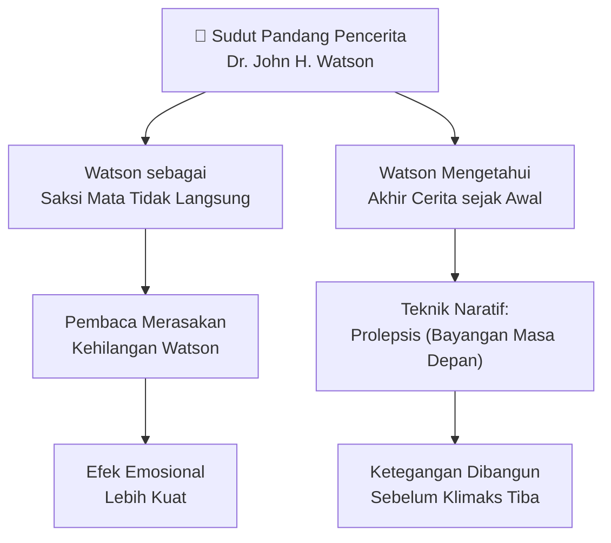
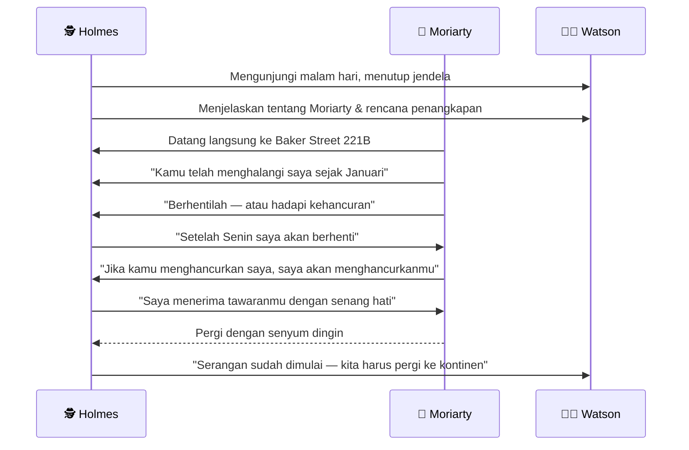
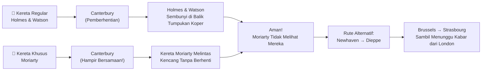
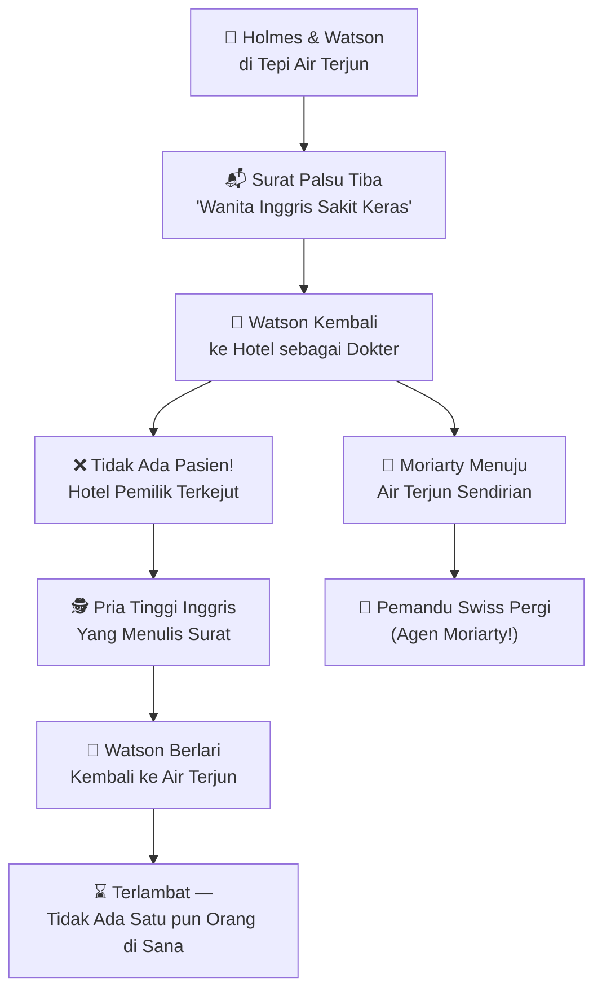
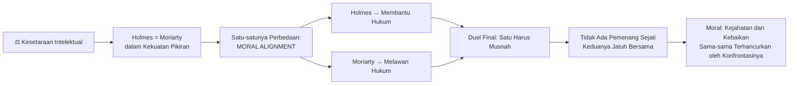
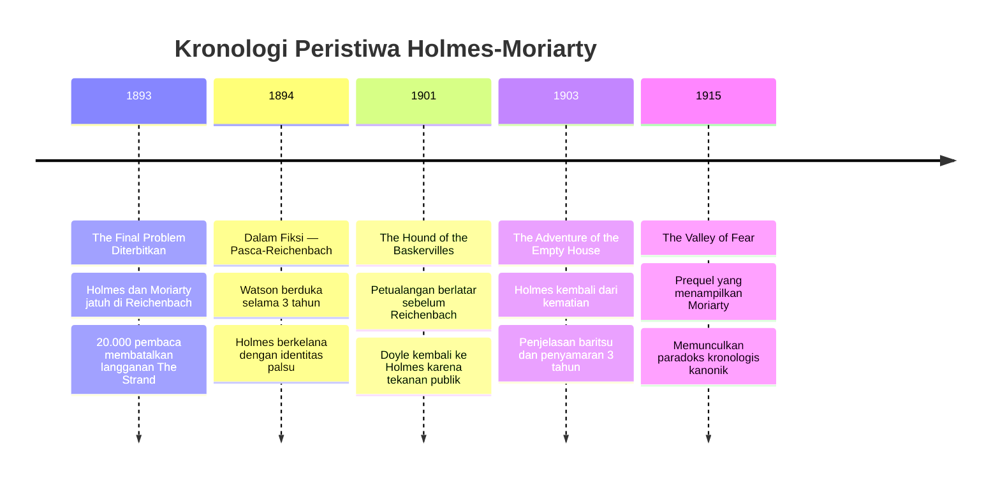
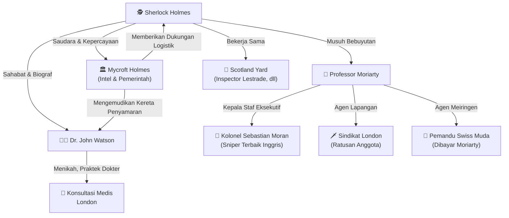

## 🕯️ Pendahuluan: Surat Perpisahan untuk Dunia

Pada bulan Desember 1893, majalah *The Strand Magazine* menerbitkan sebuah cerpen (*short story* = cerita pendek) yang mengguncang seluruh Inggris Raya. Pembacanya — yang sudah bertahun-tahun mengikuti petualangan detektif paling terkenal di dunia — menangis, marah, dan bahkan ada yang mengenakan **ban lengan hitam** sebagai tanda berkabung. Beberapa orang melayangkan surat penuh kemarahan kepada pengarangnya.

Cerpen itu berjudul **"The Adventure of the Final Problem"** (Petualangan Masalah Terakhir), dan di dalamnya Sir Arthur Conan Doyle "membunuh" ciptaannya sendiri: **Sherlock Holmes**.

Namun ini bukan sekadar cerita kematian. Ini adalah puncak dari sebuah permainan catur intelektual paling megah dalam sejarah sastra detektif — pertarungan antara dua pikiran terbesar di dunia: **Holmes**, sang penjaga hukum, dan **Professor James Moriarty**, sang arsitek kejahatan.

Artikel ini akan membedah setiap lapisan cerpen ini: dari konteks historis penulisannya, analisis setiap babak narasi, motivasi psikologis para karakter, hingga makna filosofis di balik *duel* (duel = pertarungan satu lawan satu) final mereka di tepian Air Terjun Reichenbach. 🔍

---

## 📜 Konteks Historis: Mengapa Doyle "Membunuh" Holmes?

Untuk memahami cerpen ini secara utuh, kita harus memahami niat pengarangnya. Pada awal 1890-an, Sir Arthur Conan Doyle merasa **terjebak** oleh popularitas ciptaannya sendiri.

Holmes sudah menjadi fenomena budaya yang luar biasa. Setiap edisi *The Strand Magazine* dengan cerita Holmes terjual habis. Tetapi Doyle punya ambisi sastra yang lebih besar — ia ingin menulis novel historis, drama, dan karya-karya yang ia anggap lebih "bermartabat" secara sastra. Holmes, menurutnya, sudah terlalu mendominasi hidupnya.

Doyle pernah menulis kepada ibunya:
> *"Saya harus membunuh Holmes. Ia menguras perhatian saya dari hal-hal yang lebih penting."*

Maka, dengan tekad bulat, ia merancang sebuah akhir yang spektakuler — bukan sekadar kematian biasa, tetapi kematian yang **heroik** dan **bermakna**: Holmes gugur tidak oleh tangan penjahat sembarangan, melainkan dalam duel intelektual dan fisik melawan musuh terbesarnya, sambil menyelamatkan masyarakat dari kejahatan yang paling berbahaya. 💀🎭

---

## 🧭 Struktur Narasi: Siapa yang Bercerita?

Cerpen ini diceritakan dari sudut pandang orang pertama oleh **Dr. John H. Watson** — sahabat, rekan, dan "biograf" (*biographer* = penulis riwayat hidup seseorang) Holmes. Ini bukan kebetulan.

Dengan menempatkan Watson sebagai pencerita, Conan Doyle menciptakan efek emosional yang sangat kuat. Pembaca tidak menyaksikan kematian Holmes secara langsung — mereka menyaksikannya melalui kesedihan Watson yang mendalam. Teknik naratif (*narrative technique* = cara bercerita) ini disebut **unreliable proximity** (kedekatan yang tidak dapat memverifikasi — pencerita dekat dengan kejadian tapi tidak menyaksikan akhirnya secara langsung).

Cerpen dibuka dengan kalimat yang sangat emosional:

<Callout type="quote" title="Pembuka Cerpen">
*"It is with a heavy heart that I take up my pen to write these, the last words in which I shall ever record the singular gifts by which my friend Mr. Sherlock Holmes was distinguished."*

**Terjemahan:** "Dengan hati yang berat, saya mengambil pena saya untuk menulis kata-kata terakhir ini, di mana saya akan selamanya mencatat bakat-bakat luar biasa yang dimiliki sahabat saya, Mr. Sherlock Holmes."
</Callout>

Kata **"heavy heart"** (hati yang berat) dan **"last words"** (kata-kata terakhir) langsung menciptakan *tone* (nada) berkabung yang akan menyelimuti seluruh cerita. 😢

---

## 🏙️ Babak Pertama: Malam Mencekam di London

### Kedatangan Holmes yang Tidak Terduga

Kisah dimulai pada **malam 24 April**, ketika Watson sedang membaca di rumahnya. Holmes tiba-tiba muncul — lebih kurus, lebih pucat dari biasanya. Ia langsung melakukan sesuatu yang mengejutkan: meminta izin untuk **menutup semua jendela dan kisi-kisi** (*shutters* = daun jendela kayu yang bisa dikunci dari dalam).

> *"Apakah kamu takut akan sesuatu?"*
> *"Well, saya takut... pada air gun."* (senapan angin bertekanan tinggi)

Ini adalah momen yang luar biasa. Holmes — yang selama ini digambarkan sebagai manusia yang tidak kenal takut — mengaku takut. Tapi perhatikan kata-kata berikutnya:

> *"Saya pikir kamu cukup mengenal saya, Watson, untuk memahami bahwa saya sama sekali bukan manusia yang penakut. Namun tetap saja, adalah kebodohan — bukan keberanian — untuk menolak mengakui bahaya ketika bahaya itu sudah dekat."*

Holmes tidak takut — ia **realistis**. Ada perbedaan besar antara keduanya. Ini mencerminkan kematangan karakter dan kecerdasan emosional (*emotional intelligence* = kemampuan membaca dan mengelola emosi) yang jarang disorot dalam pembacaan kasual cerpen ini. 🧠

### Pengenalan Professor Moriarty

Kemudian datanglah momen ikonik yang telah sering dikutip:

<Callout type="important" title="Deskripsi Moriarty oleh Holmes">
*"You have probably never heard of Professor Moriarty?"*
*"Never."*
*"Ay, there's the genius and the wonder of the thing! The man pervades London and no one has heard of him. That's what puts him on a pinnacle in the records of crime."*

**Terjemahan:** "Kamu mungkin tidak pernah mendengar tentang Professor Moriarty?" / "Tidak pernah." / "Nah, itulah kejeniusan dan keajaiban dari semuanya! Pria itu memenuhi seluruh London dan tidak ada yang pernah mendengar tentangnya. Itulah yang menempatkannya di puncak dalam catatan kejahatan."
</Callout>

Holmes kemudian memberikan deskripsi paling lengkap dan paling terkenal tentang Moriarty dalam seluruh kanon (*canon* = kumpulan karya resmi yang diakui dari seorang penulis atau karakter fiksi):

- Lahir dari keluarga baik dengan pendidikan sangat baik
- Dianugerahi bakat matematika yang **fenomenal** (*phenomenal* = luar biasa, melampaui batas normal)
- Pada usia 21 tahun menulis *Treatise on the Binomial Theorem* (Risalah tentang Teorema Binomial)
- Memenangkan **kursi profesor matematika** (*Mathematical Chair* = jabatan akademis tertinggi dalam bidang matematika) di salah satu universitas Inggris
- Namun memiliki **"criminal strain"** (*criminal strain* = kecenderungan kriminal yang mengalir dalam darahnya secara herediter/turun-temurun)
- Terpaksa mengundurkan diri dari universitas karena "rumor-rumor gelap"
- Pindah ke London, berprofesi sebagai *army coach* (pelatih persiapan ujian militer) sebagai **kedok** (*cover* = identitas palsu untuk menyembunyikan kegiatan sebenarnya)

---

## 🕸️ Babak Kedua: Tiga Hari yang Mengubah Segalanya

### Rencana Besar Holmes

Holmes mengungkapkan bahwa ia sudah bekerja berbulan-bulan untuk menjerat Moriarty. Dalam tiga hari, pada hari Senin, seluruh sindikat (*syndicate* = jaringan organisasi kejahatan terorganisir) Moriarty — termasuk sang profesor sendiri — akan ditangkap polisi.

Ini adalah momen yang sangat penting untuk dipahami secara taktis (*tactically* = dari sisi strategi dan perencanaan):

<Callout type="info" title="Dilema Strategis Holmes">
Holmes **tidak bisa** menangkap Moriarty terlalu dini. Jika ia menangkap sang profesor sebelum Senin, anggota-anggota sindikat yang lebih kecil akan melarikan diri dan tidak bisa dijerat. Holmes membutuhkan semua bukti lengkap sebelum polisi bergerak. Ini adalah pilihan strategis yang sangat berisiko — dan Moriarty tahu persis permainan apa yang sedang dimainkan.
</Callout>

### Konfrontasi Langsung di Baker Street 221B

Kemudian terjadilah sesuatu yang hampir tidak pernah terjadi dalam seluruh kanon Holmes: **Moriarty datang langsung ke Holmes**. Bukan melalui perantara, bukan melalui ancaman tertulis — ia datang secara pribadi ke Baker Street.

Deskripsi fisik Moriarty yang diberikan Holmes dalam cerpen ini sangat rinci dan penuh simbolisme (*symbolism* = penggunaan objek/ciri fisik untuk mewakili konsep abstrak):

> *"Penampilannya sudah sangat familiar bagi saya. Ia sangat tinggi dan kurus, dahinya membentuk kubah putih, dan kedua matanya sangat cekung ke dalam kepalanya. Ia bercukur bersih, pucat, dan terlihat seperti seorang estet (*aesthetic* = orang yang sangat memperhatikan keindahan dan seni). Bahunya membungkuk akibat terlalu banyak belajar, dan wajahnya menonjol ke depan, senantiasa berayun perlahan dari satu sisi ke sisi lain dengan cara yang sangat reptilian."*

Kata **"reptilian"** (menyerupai reptil) bukan kebetulan — ini adalah referensi langsung ke teori kriminologi (*criminology* = ilmu yang mempelajari kejahatan dan pelaku kejahatan) Cesare Lombroso tentang **atavisme** (*atavism* = kemunculan kembali sifat-sifat leluhur primitif dalam individu modern) yang menandai penjahat bawaan. 🦎

Dialog antara keduanya adalah salah satu yang paling cemerlang dalam seluruh literatur detektif:

<Callout type="quote" title="Dialog Holmes-Moriarty di Baker Street">
**Moriarty:** *"Kamu melintasi jalanku pada 4 Januari. Pada 23 Januari kamu mengganggu saya. Pada pertengahan Februari saya sangat direpotkan olehmu. Akhir Maret, rencanaku benar-benar terhambat. Dan sekarang, akhir April, aku menemukan diriku dalam posisi sedemikian rupa karena pengejaranmu yang terus-menerus sehingga aku dalam bahaya kehilangan kebebasanku."*

**Holmes:** *"Memiliki saran?"*

**Moriarty:** *"Kamu harus berhenti, Mr. Holmes."*

**Holmes:** *"Setelah Senin."*
</Callout>

Momen yang paling mengungkapkan karakter keduanya adalah ketika Moriarty berkata:

> *"Ini bukan bahaya. Ini adalah kehancuran yang tidak terhindarkan. Kamu berdiri menghalangi bukan sekadar seorang individu, tetapi sebuah organisasi yang maha-dahsyat."*

Dan Holmes menjawab dengan tenang:

> *"Saya takut bahwa dalam kesenangan percakapan ini, saya mengabaikan urusan penting yang menunggu saya di tempat lain."*

Ini adalah **phlegm** (ketenangan mutlak di hadapan bahaya — sifat yang sangat dikagumi budaya Victorian) Holmes yang paling murni. 🎩

### Tiga Serangan dalam Satu Hari

Setelah konfrontasi di Baker Street, Holmes langsung mengalami **tiga percobaan pembunuhan** dalam satu hari:

1. 🚗 **Sebuah delman dua kuda** (*two-horse van* = kereta kuda besar) dipacu dengan kecepatan penuh ke arahnya di persimpangan Oxford Street. Holmes melompat ke trotoar selamat dalam hitungan detik.

2. 🧱 **Sebongkah bata** jatuh dari atap salah satu rumah di Vere Street dan hancur berkeping-keping tepat di depan kaki Holmes. Polisi dipanggil — ada tumpukan bata yang "siap dipasang untuk renovasi" dan "diterbangkan angin." Holmes tahu itu bohong, tapi tak bisa membuktikannya.

3. 🏏 **Seorang preman bersenjata pentungan** (*bludgeon* = senjata pukul kayu berat) menyerangnya di jalan. Holmes berhasil menjatuhkannya dan menyerahkannya ke polisi — tapi tetap tidak bisa membuktikan koneksi dengan Moriarty.

Inilah kecanggihan sindikat Moriarty: setiap serangan dilakukan oleh agen yang **tidak dapat dilacak** (*untraceable* = tidak bisa dibuktikan koneksinya) kembali ke sang profesor. Moriarty, pada saat yang sama, bisa dengan santai "mengerjakan soal matematika di papan tulis di rumahnya sepuluh mil jauhnya." 🎭

---

## 🚂 Babak Ketiga: Pelarian ke Kontinen

### Rencana Pelarian yang Brilian

Holmes merancang rencana pelarian ke kontinen Eropa (*Continent* = istilah orang Inggris untuk daratan Eropa di seberang Selat Inggris) yang sangat detail dan kompleks:

1. Kirim semua koper ke Stasiun Victoria malam ini, **tanpa nama pengirim**
2. Besok pagi, panggil *hansom cab* (taksi kuda berpenumpang dua) — tapi **jangan naiki dua yang pertama**
3. Minta kusir mengantar ke ujung Strand dari Lowther Arcade, berikan alamat di kertas kecil, dan minta si kusir **tidak membuangnya**
4. Lari cepat melewati arkade (*arcade* = lorong bertepi toko) dan di ujung sisi lain ada *brougham* (kereta tertutup mewah) dengan kusir berkelebat hitam berkerah merah
5. Kereta itu akan mengantar ke Stasiun Victoria tepat waktu untuk kereta *Continental Express* (kereta ekspres ke Eropa)
6. Gerbong kedua kelas satu dari depan sudah dipesan untuk mereka

Ketika Watson tiba di stasiun dan mencari Holmes, ia tidak menemukannya. Yang ia temukan hanyalah seorang **pendeta Italia tua** (*Italian priest* = pendeta dari Italia) yang lemah, giginya ompong, berbicara Inggris dengan logat Italia patah-patah. Watson membantu si pendeta dengan kopernya. Lalu, pada detik terakhir sebelum kereta berangkat:

> *"My dear Watson, you have not even condescended to say good morning!"*
> ("Sahabatku Watson, kamu bahkan tidak sudi mengucapkan selamat pagi!")

Watson terpana — wajah pendeta itu berubah sedetik: keriput menghilang, hidung kembali ke posisi normal, bibir berhenti gemetar, mata sayu kembali bercahaya... lalu menjadi pendeta tua lagi. **Holmes dalam penyamaran sempurna**. 🎭

### Moriarty Muncul di Peron

Tepat ketika kereta mulai bergerak, Holmes menunjuk ke arah keramaian di peron:

> *"Ah, there is Moriarty himself!"*

Seorang pria tinggi mendorong-dorong kerumunan dan melambaikan tangan, mencoba menghentikan kereta. **Terlambat** — kereta sudah melaju kencang meninggalkan stasiun.

Namun Holmes tidak merasa menang. Ia justru menjelaskan kepada Watson:

> *"Kamu tidak berpikir bahwa jika saya yang mengejar, saya akan membiarkan diri saya digagalkan oleh hambatan sekecil itu, bukan? Mengapa kamu berpikir dia tidak sekaliber saya?"*

Artinya: Moriarty akan melakukan hal yang **sama persis** dengan yang akan dilakukan Holmes — menyewa kereta khusus (*special train* = kereta yang disewa secara pribadi untuk tujuan darurat, bukan jadwal reguler).

Holmes dan Watson turun di Canterbury, bersembunyi di balik tumpukan koper, dan menyaksikan kereta khusus Moriarty melintas kencang — tepat seperti yang diprediksi Holmes.

---

## 📰 Babak Keempat: Kabar Buruk dari London

Di Strasbourg, mereka menerima telegram dari polisi London. Holmes membukanya... lalu dengan **kata kutukan yang pahit** melemparkannya ke dalam perapian.

> *"He has escaped. Moriarty. They have secured the whole gang with the exception of him."*
> (Ia lolos. Moriarty. Mereka menangkap seluruh sindikat kecuali dirinya.)

Sindikat sudah hancur. Seluruh anggota utama sudah dijaring. **Tapi kepala ular itu lolos**. Dan Holmes tahu persis apa artinya ini:

> *"If I read his character right, he will devote his whole energies to revenging himself upon me. He said as much in our short interview."*
> (Jika saya membaca karakternya dengan benar, ia akan mengerahkan seluruh energinya untuk membalas dendam kepada saya.)

Holmes menyarankan Watson untuk kembali ke Inggris — demi keselamatannya sendiri. Watson menolak. Mereka terus melanjutkan perjalanan ke Geneva, lalu menelusuri Lembah Rhône, melewati Gemmi Pass yang masih tertutup salju tebal, Interlaken, hingga tiba di desa kecil **Meiringen**, Swiss, pada tanggal 3 Mei. 🏔️

---

## 🌊 Babak Kelima: Air Terjun Reichenbach — Hari Terakhir

### Deskripsi Air Terjun: Simbol Kematian yang Indah

Pada 4 Mei, Holmes dan Watson berangkat dengan rencana menyeberangi perbukitan dan bermalam di Rosenlaui. Dalam perjalanan, mereka diperintahkan untuk **tidak melewatkan** Air Terjun Reichenbach (*Reichenbach Falls* = air terjun terkenal di dekat Meiringen, Swiss).

Deskripsi Watson tentang air terjun ini adalah salah satu prosa (*prose* = tulisan non-puisi) terbaik dalam seluruh kanon Holmes:

<Callout type="quote" title="Deskripsi Air Terjun Reichenbach">
*"It is indeed a fearful place. The torrent, swollen by the melting snow, plunges into a tremendous abyss, from which the spray rolls up like the smoke from a burning house. The shaft into which the river hurls itself is an immense chasm, lined by glistening coal-black rock, and narrowing into a seething, boiling pit of incalculable depth, which brims over and shoots the stream onward over its jagged lip."*

**Terjemahan:** "Ini memang tempat yang menakutkan. Arus deras yang membengkak karena salju yang mencair, terjun ke dalam jurang yang dahsyat, dari mana percikan air berguling naik seperti asap dari rumah yang terbakar. Lubang tempat sungai menerjunkan dirinya adalah jurang besar yang dilapisi batuan hitam seperti batu bara yang berkilau, dan menyempit menjadi lubang mendidih yang dalam tak terukur, yang meluap dan menembakkan aliran air ke atas tepinya yang bergerigi."
</Callout>

Setiap kata dalam deskripsi ini memiliki bobot (*weight* = berat makna): **"fearful place"** (tempat yang menakutkan), **"tremendous abyss"** (jurang yang dahsyat), **"incalculable depth"** (kedalaman tak terukur), **"jagged lip"** (tepi bergerigi) — ini adalah *foreshadowing* (bayangan kejadian yang akan datang) dari kematian yang akan terjadi. 🌑

### Surat Palsu: Muslihat Moriarty

Watson dan Holmes sedang berdiri di tepi air terjun ketika seorang anak Swiss datang berlari membawa surat. Isi surat: seorang wanita Inggris sakit keras di hotel Englischer Hof, dalam stadium akhir penyakit (*consumption* = tuberkulosis, penyakit paru-paru mematikan yang sangat umum di era Victoria), membutuhkan dokter Inggris segera.

Watson — sebagai dokter — merasa **wajib** kembali. Ia meninggalkan Holmes dengan pemandu muda Swiss.

Ketika Watson tiba di hotel... tidak ada wanita Inggris yang sakit. Sang pemilik hotel mengaku: **seorang pria Inggris bertubuh tinggi** yang menulis surat itu setelah Watson dan Holmes pergi.

Watson langsung berlari balik ke air terjun. Terlambat.

<Callout type="warning" title="Analisis Muslihat Moriarty">
Surat palsu ini adalah **karya manipulasi psikologis yang sempurna**. Moriarty tidak menyerang Holmes secara langsung — ia pertama-tama mengisolasi Holmes dari Watson, satu-satunya saksi dan pelindungnya. Surat itu memanfaatkan **kewajiban moral** Watson sebagai dokter — sesuatu yang tidak bisa Watson abaikan tanpa mengkhianati sumpah profesinya sendiri.

Bahkan lebih jauh: Holmes **mengetahui** surat itu palsu. Ia menulis ini dalam surat perpisahannya kepada Watson. Holmes *membiarkan* Watson pergi, karena ia tahu konfrontasi itu *harus* terjadi.
</Callout>

---

## 📝 Surat Terakhir: Pesan dari Tepi Jurang

Di atas batu yang bersandar *Alpine stock* (tongkat mendaki khas pegunungan Alpen) milik Holmes, Watson menemukan **kotak rokok perak** (*silver cigarette case* = kotak rokok mewah yang biasa dibawa pria kelas atas Victorian). Di bawahnya, terlipat rapi, tiga halaman yang dirobek dari buku catatan Holmes.

Tulisannya sama tegasnya, sama rapinya, seolah ditulis di meja kerja Baker Street:

<Callout type="quote" title="Surat Terakhir Sherlock Holmes kepada Watson">
*"My dear Watson, I write these few lines through the courtesy of Mr. Moriarty, who awaits my convenience for the final discussion of those questions which lie between us. He has been giving me a sketch of the methods by which he avoided the English police and kept himself informed of our movements. They certainly confirm the very high opinion which I had formed of his abilities.*

*I am pleased to think that I shall be able to free Society from any further effects of his presence, though I fear that it is at a cost which will give pain to my friends, and especially, my dear Watson, to you.*

*Indeed, if I may make a full confession to you, I was quite convinced that the letter from Meiringen was a hoax, and I allowed you to depart on that errand under the persuasion that it would be in your interest to do so."*

**Terjemahan ringkas:** "Sahabatku Watson, saya menulis baris-baris singkat ini atas kebaikan Mr. Moriarty, yang menunggu waktu saya untuk diskusi terakhir antara kami berdua. Saya senang mengetahui bahwa saya akan dapat membebaskan masyarakat dari efek kehadirannya lebih jauh... Saya harus mengakui, saya sudah sangat yakin bahwa surat dari Meiringen adalah tipuan, dan saya membiarkan kamu pergi dalam keyakinan bahwa itu akan lebih baik bagimu."
</Callout>

Ini adalah salah satu momen paling mengharukan dalam seluruh sastra detektif. Beberapa hal yang perlu dicermati dari surat ini:

1. **Holmes tahu sejak awal** bahwa surat itu palsu — tapi ia membiarkan Watson pergi. Ini adalah tindakan **pengorbanan** (*sacrifice* = rela kehilangan sesuatu demi kebaikan orang lain atau tujuan yang lebih besar) yang terencana.

2. Holmes menyebut pertemuannya dengan Moriarty sebagai **"final discussion"** (diskusi terakhir) — bahkan dalam menghadapi kematian, ia mempertahankan *framing* (cara membingkai realitas) intelektual, bukan emosional.

3. Ia sudah **mengatur semua urusan perwarisannya** (*property disposition* = proses mengatur kepemilikan harta sebelum meninggal) sebelum meninggalkan Inggris.

---

## 👣 Babak Terakhir: Jejak Kaki yang Tidak Kembali

Watson melakukan apa yang dilakukan Holmes: **mengamati jejaknya sendiri**. Ia berbaring di tepi jurang dan membaca tanda-tanda yang ada:

- **Dua jalur jejak kaki** — keduanya menuju ke ujung jalur, tidak ada yang kembali
- **Tanah berlumpur** di ujung jalur bekas pergulatan
- **Semak-semak** di tepi jurang yang robek dan terkoyak-koyak

Kesimpulannya tidak terbantahkan: **dua orang bergulat dan jatuh bersama ke dalam jurang**. Tidak ada yang selamat.

Watson menutup cerpennya dengan kalimat yang kemudian menjadi salah satu *epitaph* (prasasti kematian) paling terkenal dalam sastra:

<Callout type="quote" title="Penutup Cerpen">
*"...and there, deep down in that dreadful cauldron of swirling water and seething foam, will lie for all time the most dangerous criminal and the foremost champion of the law of their generation."*

**Terjemahan:** "...dan di sana, jauh di dalam kuali mengerikan dari air yang berputar dan buih mendidih itu, akan terbaring untuk selamanya penjahat paling berbahaya dan penegak hukum paling terkemuka dari generasi mereka."
</Callout>

**"For all time"** — untuk selamanya. Watson tidak berharap — atau mencari — kemungkinan keselamatan. Baginya, keduanya sudah mati. 🌊💀

---

## 🔍 Analisis Mendalam: Makna Filosofis di Balik Reichenbach

### Kesetaraan Intelektual sebagai Prasyarat Duel

Cerpen ini adalah tentang satu pertanyaan fundamental: **Apa yang terjadi ketika dua kekuatan yang benar-benar setara bertemu?**

Holmes sendiri mengakui kepada Watson:

> *"Pada akhir berbulan-bulan [penyelidikan], saya terpaksa mengakui bahwa saya akhirnya bertemu dengan lawan yang merupakan setara intelektual saya. Kengerian saya atas kejahatannya hilang dalam kekaguman saya atas keterampilannya."*

Ini adalah pengakuan yang luar biasa langka dari Holmes. Ia pernah menyelesaikan ratusan kasus, tapi ini pertama kalinya ia mengakui bahwa seseorang **benar-benar sekaliber dirinya**. 🧩

### Pilihan Sadar Holmes: Pengorbanan Heroik

Detail terpenting dalam cerpen ini adalah pengakuan Holmes dalam surat terakhirnya: **ia tahu surat Watson itu palsu**.

Ini berarti Holmes **secara sadar** memilih untuk menghadapi Moriarty sendirian. Mengapa?

1. **Perlindungan Watson**: Jika Watson ada di sana, ia mungkin ikut jatuh, atau lebih buruk — Moriarty mungkin menggunakan Watson sebagai sandera.

2. **Kepastian hasil**: Holmes tahu bahwa satu-satunya cara memastikan Moriarty tidak pernah kembali mengancam masyarakat adalah **dengan tangannya sendiri**.

3. **Kepenuhan karier**: Holmes menulis dalam surat itu, *"My Memoirs will draw to an end, Watson, upon the day that I crown my career by the capture or extinction of the most dangerous and capable criminal in Europe."* — karier Holmes mencapai puncaknya dan selesai dengan sempurna.

Ini bukan kematian sia-sia — ini adalah **pengorbanan yang terencana dan disadari sepenuhnya**. 🕯️

### Respons Masyarakat Victorian: Berduka untuk Fiksi

Ketika cerpen ini terbit pada Desember 1893, respons publik Inggris sungguh luar biasa. Sekitar **20.000 orang membatalkan langganan** mereka ke *The Strand Magazine*. Orang-orang berjalan di jalan-jalan London dengan ban lengan hitam (*black armband* = tanda berkabung yang diikat di lengan atas) seolah kehilangan orang sungguhan.

Seorang wanita bahkan menulis surat kepada Doyle dengan awalan: *"Anda adalah monster jahat."*

Fenomena ini mencerminkan sesuatu yang sangat penting: **Holmes sudah berhenti menjadi karakter fiksi bagi pembacanya**. Ia sudah menjadi orang nyata, sahabat nyata, bagian dari kehidupan mereka. Ini adalah bukti tertinggi dari kekuatan naratif (*narrative power* = kemampuan sebuah cerita untuk menciptakan realitas dalam benak pembaca). 📚

---

## 🎭 Warisan Cerpen dan Kebangkitan Holmes

Doyle akhirnya tidak tahan dengan tekanan publik. Delapan tahun kemudian, pada 1901, ia menulis *The Hound of the Baskervilles* — kisah petualangan Holmes yang berlatar **sebelum** Reichenbach. Lalu pada 1903, ia menerbitkan **"The Adventure of the Empty House"** (*Petualangan Rumah Kosong*), di mana Holmes kembali dari kematian.

Penjelasan Holmes tentang bagaimana ia selamat: ia menggunakan teknik **baritsu** (kadang ditulis *bartitsu* = seni bela diri Jepang-Eropa yang sebenarnya ada, dikembangkan oleh Edward Barton-Wright pada 1899, menggabungkan jiu-jitsu dengan tinju dan lainnya) untuk melepaskan cengkeraman Moriarty dan mendorongnya ke jurang, sementara Holmes sendiri memanjat dinding jurang dan bersembunyi selama tiga tahun dengan identitas palsu.

---

## 📊 Peta Karakter dan Hubungan

---

## 🧩 Glosarium Istilah

| Istilah Asing | Terjemahan & Penjelasan |
|:---|:---|
| **Short Story** | Cerita pendek — karya fiksi naratif yang lebih singkat dari novel |
| **Canon** | Kanon — kumpulan karya resmi yang diakui dari seorang penulis atau karakter fiksi |
| **Biographer** | Penulis riwayat hidup seseorang |
| **Unreliable Proximity** | Kedekatan yang tidak dapat memverifikasi — pencerita dekat dengan kejadian tapi tidak menyaksikan akhirnya langsung |
| **Prolepsis** | Bayangan masa depan dalam narasi — menceritakan akhir di awal |
| **Foreshadowing** | Teknik sastra di mana petunjuk tentang kejadian mendatang disisipkan lebih awal |
| **Criminal Strain** | Kecenderungan kriminal herediter — yang mengalir dalam darah secara turun-temurun |
| **Mathematical Chair** | Jabatan akademis tertinggi dalam bidang matematika di universitas |
| **Army Coach** | Tutor/pelatih persiapan ujian untuk karir militer |
| **Special Train** | Kereta yang disewa secara pribadi, bukan jadwal reguler |
| **Alpine Stock** | Tongkat mendaki tradisional dari kayu keras yang khas untuk pendakian gunung Alpen |
| **Consumption** | Nama lama untuk tuberkulosis — penyakit paru-paru mematikan era Victorian |
| **Phlegm** | Ketenangan mutlak di hadapan bahaya — sifat yang sangat dihargai budaya Victorian |
| **Atavism** | Kemunculan kembali sifat-sifat leluhur primitif dalam individu modern |
| **Bartitsu/Baritsu** | Seni bela diri Jepang-Eropa yang benar-benar ada, dikembangkan oleh Edward Barton-Wright (1899) |
| **Sacrifice** | Pengorbanan — rela kehilangan sesuatu demi kebaikan orang lain atau tujuan lebih besar |
| **Property Disposition** | Proses mengatur kepemilikan harta sebelum meninggal |
| **Narrative Power** | Kekuatan naratif — kemampuan sebuah cerita untuk menciptakan realitas dalam benak pembaca |
| **Epitaph** | Prasasti atau kalimat yang dituliskan untuk mengenang orang yang telah meninggal |
| **Emotional Intelligence** | Kecerdasan emosional — kemampuan membaca dan mengelola emosi diri sendiri dan orang lain |

---

## 🏆 Kesimpulan: Lebih dari Sekadar Kematian

"The Adventure of the Final Problem" bukan sekadar cerpen tentang kematian seorang detektif. Ia adalah meditasi (*meditation* = perenungan mendalam) tentang beberapa tema besar:

1. **Keberanian vs Ketakutan**: Holmes menakuti bahaya tapi tidak melarikan darinya. Ia mengakui ancaman nyata (ketakutan realistis) sambil tetap bergerak maju.

2. **Pengorbanan vs Kemenangan**: Holmes tidak "menang" di Reichenbach dalam arti konvensional. Ia mengorbankan hidupnya untuk memastikan kemenangan masyarakat.

3. **Intelektualitas vs Moralitas**: Moriarty dan Holmes secara intelektual setara. Yang membedakan mereka hanya pilihan moral. Cerpen ini menegaskan bahwa **pikiran tanpa moral adalah ancaman terbesar bagi peradaban**.

4. **Ketenaran vs Keabadian**: Doyle bermaksud mematikan Holmes untuk "membebaskan" dirinya. Ironisnya, justru kematian Holmes di Reichenbach yang menjadikan Holmes **abadi**. Kematian heroik menciptakan legenda.

5. **Kesedihan Watson**: Di balik semua aksi dan strategi, inti emosional cerpen ini adalah kesedihan Watson yang tak terbendung. Ia kehilangan sahabat terbaiknya — dan cerita ini, pada akhirnya, adalah surat cintanya untuk Holmes. 💙

<Callout type="tip" title="Untuk Dibaca Selanjutnya">
Jika artikel ini menarik minat Anda, baca juga analisis mendalam tentang **"The Empty House"** (bagaimana Holmes kembali dari kematian), serta **"The Valley of Fear"** (prequel yang mengungkap operasi sindikat Moriarty secara lebih rinci). Keduanya melengkapi kisah yang dimulai di tepian Air Terjun Reichenbach ini.
</Callout>

---

*Artikel ini didasarkan pada teks asli "The Adventure of the Final Problem" karya Sir Arthur Conan Doyle (1893), dari koleksi "The Memoirs of Sherlock Holmes". Kutipan diterjemahkan dan dianalisis untuk konteks pembaca Indonesia.* 🛠️
