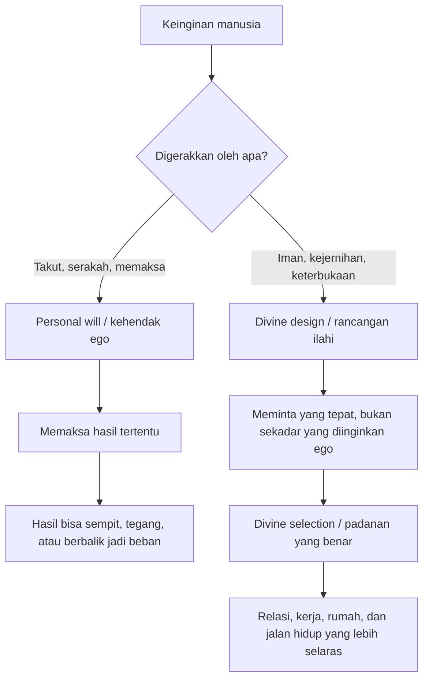
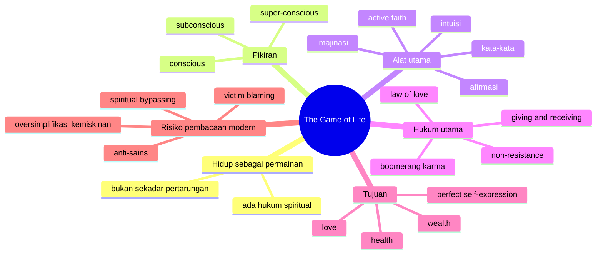

## ✨ Pendahuluan: Ketika Hidup Disebut Bukan Pertempuran, Melainkan Permainan

Ada buku-buku yang tidak terlalu tebal, tidak terlalu akademik, tidak terlalu filosofis dalam pengertian kampus, tetapi punya daya hidup yang aneh: ia terus dibaca lintas generasi, terus dikutip, terus dihidupkan ulang oleh video-video YouTube, motivator, pembicara spiritual, dan orang-orang yang sedang mencari cara baru untuk memaknai hidup. Salah satu buku seperti itu adalah *The Game of Life and How to Play It* karya **Florence Scovel Shinn**, pertama kali diterbitkan pada tahun 1925. ✨

Kalimat pembukanya sangat terkenal karena ia langsung membalik cara banyak orang memandang hidup:

> **“Most people consider life a battle, but it is not a battle, it is a game.”**

Dalam bahasa Indonesia kira-kira:

> **“Kebanyakan orang menganggap hidup sebagai pertempuran, padahal bukan; hidup adalah sebuah permainan.”**

Kalimat ini terdengar ringan, bahkan mungkin sedikit terlalu sederhana. Tetapi justru di sanalah kekuatan Shinn. Ia menulis bukan sebagai filsuf sistematis, bukan sebagai teolog akademik, dan bukan sebagai ilmuwan psikologi. Ia menulis sebagai pengajar spiritual populer dari tradisi **New Thought** *(gerakan spiritual modern yang menekankan kekuatan pikiran, kata-kata, keyakinan, dan keselarasan mental sebagai penentu pengalaman hidup)*. Maka gaya bukunya juga bukan gaya argumen berat, melainkan gaya deklaratif, meyakinkan, dan penuh contoh-contoh hidup sehari-hari.

Bagi banyak pembaca, buku ini terasa seperti:
- suntikan harapan,
- panduan afirmasi,
- ajakan untuk berpikir positif,
- dan cara spiritual untuk merapikan relasi antara pikiran, kata-kata, emosi, dan nasib.

Tetapi bagi pembaca yang lebih kritis, buku ini juga menimbulkan banyak pertanyaan:
- apakah Shinn sedang menawarkan psikologi yang sahih, atau metafisika yang sangat spekulatif?
- apakah “hukum spiritual” yang ia bicarakan bisa dibuktikan, atau hanya dipercaya?
- ketika ia mengaitkan penyakit, kemiskinan, atau kegagalan dengan pikiran dan emosi negatif, apakah itu memberi kuasa pada manusia — atau justru berbahaya karena cenderung menyalahkan korban?
- mengapa gagasan-gagasannya terdengar begitu akrab dengan konsep modern seperti *law of attraction* *(hukum tarik-menarik / keyakinan bahwa pikiran dan getaran batin menarik realitas sejenis)*, afirmasi, visualisasi, dan manifestasi?

Esai ini akan mencoba membaca *The Game of Life and How to Play It* secara **lengkap, mendalam, dan jernih**. Saya tidak akan memperlakukan buku ini sekadar sebagai kitab motivasi yang harus diamini mentah-mentah, tetapi juga tidak akan menolaknya secara sinis. Sebaliknya, saya ingin membedahnya sebagai:

- dokumen penting dari tradisi New Thought,
- karya spiritual populer yang sangat berpengaruh,
- peta metafisik tentang kata, imajinasi, cinta, intuisi, dan kemakmuran,
- sekaligus teks yang harus dibaca dengan kewaspadaan intelektual di zaman sekarang.

Karena sesungguhnya daya tarik buku ini tidak hanya datang dari isinya, tetapi dari janji dasarnya yang sangat menggoda:

> **bahwa hidup tidak sepenuhnya acak, dan bahwa melalui pikiran, kata-kata, iman, dan sikap batin yang tepat, manusia bisa ikut membentuk realitasnya.**

Itu janji yang sangat indah. Tetapi pertanyaannya selalu sama: **seberapa jauh janji itu benar, seberapa jauh ia simbolik, dan seberapa jauh ia berbahaya jika dibaca tanpa kritik?** 🌿

Artikel ini akan menjawabnya dengan menelusuri:
- siapa Florence Scovel Shinn,
- apa itu New Thought,
- bagaimana struktur ide bukunya bekerja,
- mengapa kata-kata dan imajinasi ditempatkan begitu sentral,
- apa yang ia maksud dengan intuisi, non-resistance, cinta, karma, dan divine design,
- apa nilai praktis bukunya,
- dan apa kritik paling penting terhadap cara berpikir semacam ini.

Kalau harus diringkas dalam satu tesis besar, maka tesis artikel ini adalah:

> **The Game of Life and How to Play It tetap memikat karena ia memberi rasa agensi spiritual—rasa bahwa manusia tidak sepenuhnya korban keadaan—tetapi ia perlu dibaca secara matang agar inspirasi tentang disiplin mental dan tanggung jawab batin tidak berubah menjadi penyederhanaan berbahaya tentang realitas, penyakit, kemiskinan, dan ketidakadilan.**

---

<Callout type="important" title="Tesis utama artikel ini">
Buku Florence Scovel Shinn tetap kuat karena ia mengajarkan bahwa kata-kata, imajinasi, iman, dan disposisi batin memengaruhi hidup. Namun, pembacaan yang sehat harus membedakan antara nilai praktisnya sebagai disiplin mental-spiritual dan klaim-klaim metafisisnya yang tidak semuanya bisa diterima begitu saja secara psikologis, etis, atau ilmiah.
</Callout>

---

## 🌸 1. Siapa Florence Scovel Shinn dan Mengapa Bukunya Masih Hidup Sampai Sekarang?

**Florence Scovel Shinn** bukan nama yang biasanya muncul dalam daftar filsuf besar, teolog besar, atau psikolog klasik. Namun ia punya pengaruh budaya yang sangat luas, terutama di wilayah spiritualitas populer. 🌸

Ia hidup pada awal abad ke-20, bekerja sebagai ilustrator, seniman, dan kemudian dikenal sebagai guru spiritual. Karyanya lahir dari lingkungan **New Thought**, sebuah arus spiritual Amerika yang berkembang dari akhir abad ke-19 hingga awal abad ke-20. Tradisi ini menekankan bahwa:

- pikiran punya kekuatan kreatif,
- kata-kata membentuk kondisi hidup,
- keyakinan batin memengaruhi peristiwa lahiriah,
- dan manusia dapat hidup selaras dengan “hukum spiritual” tertentu untuk menarik kesehatan, kelimpahan, relasi yang tepat, dan ekspresi diri yang lebih utuh.

Mengapa bukunya masih populer?

### A. Bahasanya sederhana dan langsung
Shinn tidak menulis seperti akademisi. Ia menulis seperti seseorang yang ingin membuat orang segera bertindak.

### B. Isinya sangat mudah dipetik menjadi kutipan
Hampir setiap beberapa halaman ada kalimat yang bisa dijadikan afirmasi, status, caption, atau bahan video motivasi.

### C. Ia berbicara langsung kepada rasa takut manusia modern
Takut miskin, takut gagal, takut ditolak, takut kehilangan cinta, takut sakit, takut salah jalan—semuanya disentuh oleh buku ini.

### D. Ia menawarkan rasa kontrol
Di dunia yang sering terasa acak, buku seperti ini memberi harapan bahwa pikiran, kata, dan sikap batin tidak sia-sia.

### E. Ia menjadi nenek moyang budaya manifestasi modern
Banyak gagasan kontemporer tentang *manifesting*, afirmasi, visualisasi, energi, dan *law of attraction* punya kemiripan sangat jelas dengan formulasi Shinn.

Jadi buku ini hidup bukan karena ketat secara ilmiah, tetapi karena **ia memuaskan kebutuhan eksistensial manusia untuk merasa bahwa hidup masih bisa diarahkan**.

---

## 🧠 2. Akar Pemikirannya: Apa Itu New Thought dan Mengapa Penting untuk Memahami Konteksnya?

Kalau kita membaca buku ini tanpa tahu konteks New Thought, kita mudah mengira Shinn sekadar sedang mendorong “berpikir positif”. Padahal sistem berpikirnya lebih luas dari itu. 🧠

**New Thought** adalah tradisi spiritual-metafisik yang menggabungkan:
- pembacaan metaforis atas Alkitab,
- idealisme spiritual,
- psikologi sugesti,
- kepercayaan pada kekuatan afirmasi,
- dan keyakinan bahwa kesadaran manusia punya peran kreatif dalam realitas.

Beberapa gagasan pokok tradisi ini antara lain:

1. **God as supply** — Tuhan sebagai sumber tak terbatas bagi hidup manusia.  
2. **Mind as causative** — pikiran bukan sekadar reaksi, tetapi penyebab.  
3. **Spoken word as creative force** — kata-kata punya daya membentuk pengalaman.  
4. **Right thinking** — berpikir benar atau selaras adalah syarat perubahan hidup.  
5. **Disease, lack, and disharmony as mental-spiritual distortion** — penyakit, kekurangan, dan kekacauan dipahami sebagai ekspresi dari kesadaran yang salah arah.  
6. **Divine design** — ada rancangan ilahi untuk hidup tiap orang.

Dari sini terlihat bahwa Shinn bukan penulis *self-help* biasa. Ia berbicara dari suatu kosmologi: dunia dianggap punya hukum spiritual seteratur hukum fisika, dan manusia bisa belajar “memainkan” hidup dengan mengenali hukum-hukum itu.

Inilah sebabnya judul bukunya memakai kata **game** *(permainan)*. Hidup bukan perang tanpa makna, melainkan permainan dengan aturan. Masalah manusia, menurut Shinn, adalah bukan kurang kuat, tetapi **tidak tahu aturan permainannya**.

---

## 🎲 3. “Hidup adalah Permainan”: Apa Maksud Metafora Ini Sebenarnya?

Metafora utama buku ini adalah bahwa **hidup adalah permainan**. 🎲

Ini bukan berarti hidup remeh, santai, atau dangkal. Maksudnya lebih seperti ini: dalam hidup ada hukum tertentu yang bekerja, dan kalau kita tidak memahaminya, kita terus kalah tanpa mengerti kenapa.

Bagi Shinn, hukum dasar permainan hidup adalah:

- apa yang kita kirim keluar akan kembali,
- apa yang kita tanam akan kita tuai,
- apa yang kita bayangkan cenderung mengambil bentuk,
- apa yang kita ucapkan terus-menerus akan menata jalan hidup kita,
- dan apa yang kita takutkan bisa justru kita tarik.

Dengan kata lain, kehidupan menurut Shinn bukan terutama arena benturan brutal, melainkan arena **resonansi** *(gema timbal balik antara batin dan dunia luar)*.

Ini sangat menarik karena ia menggabungkan bahasa agama dan bahasa psikologis. Ketika ia mengutip “apa yang ditabur, itu juga yang dituai”, ia membacanya bukan hanya sebagai hukum moral, tetapi juga sebagai hukum mental-spiritual.

Di titik inilah pembaca modern perlu hati-hati. Sebab metafora “hidup adalah permainan” bisa sangat memberdayakan—tetapi juga bisa terdengar kejam jika dipakai untuk menjelaskan setiap penderitaan seolah-olah semua semata hasil pikiran seseorang.

Jadi sejak awal, kita harus membedakan dua pembacaan:

### Pembacaan yang sehat
Manusia memang perlu melatih perhatian, ucapan, imajinasi, dan sikap batin karena semua itu membentuk tindakan, pilihan, relasi, dan kualitas hidup.

### Pembacaan yang berlebihan
Segala sesuatu yang terjadi dianggap murni hasil pikiran pribadi, seolah struktur sosial, penyakit biologis, kecelakaan, sejarah keluarga, ketimpangan kelas, dan kekerasan politik tidak punya peran.

Buku Shinn sering berjalan di antara dua wilayah itu.

---

## 🪞 4. Imajinasi sebagai Mesin Realitas: Mengapa Shinn Sangat Menekankan Gambar Mental?

Salah satu gagasan sentral Shinn adalah bahwa **imajinasi** bukan alat hiburan batin, melainkan alat pencetak kenyataan. 🪞

Ia berulang kali menegaskan bahwa apa yang dibayangkan secara kuat dan terus-menerus akan “tereksternalisasi” *(mengambil bentuk di luar diri / menjadi nyata dalam urusan hidup)*. Ia memberi banyak contoh:
- orang yang terlalu takut penyakit lalu sakit,
- anak kecil yang membayangkan diri sebagai janda lalu betulan menjanda saat dewasa,
- orang yang terus memvisualisasikan kekurangan lalu hidup dalam kekurangan.

Bagi Shinn, imajinasi adalah semacam gunting pikiran yang terus memotong pola pengalaman kita.

Apa yang menarik dari ide ini?

Dalam versi lunaknya, ide ini masuk akal secara psikologis. Mengapa?

Karena imajinasi memang memengaruhi:
- perhatian,
- emosi,
- keputusan,
- perilaku,
- dan relasi.

Orang yang terus membayangkan kegagalan cenderung:
- lebih cemas,
- lebih ragu,
- lebih defensif,
- lebih mudah salah langkah,
- dan lebih sering menciptakan kondisi yang membuat kegagalan itu jadi mungkin.

Jadi, dalam level psikologis, ada kebenaran penting di sini.

Tetapi Shinn melangkah lebih jauh. Ia tidak hanya bilang imajinasi memengaruhi perilaku; ia sering terdengar mengatakan bahwa imajinasi hampir secara langsung mencetak realitas eksternal. Di sini buku ini masuk ke wilayah metafisika, bukan sekadar psikologi.

Dan di sinilah pembaca modern perlu membedakan antara:
- **nilai praktis** dari melatih imajinasi yang sehat,
- dan **klaim ontologis** *(klaim tentang bagaimana realitas bekerja secara paling dasar)* yang mungkin tidak bisa dibuktikan begitu saja.

---

## 🗣️ 5. Kuasa Kata-Kata: Mengapa Shinn Menganggap Ucapan Kita Hampir Seperti Doa yang Terus Menulis Nasib?

Jika ada satu gagasan yang membuat buku ini sangat berpengaruh di dunia motivasi modern, itu adalah keyakinan Shinn tentang **spoken word** *(kata-kata yang diucapkan)*. 🗣️

Menurut Shinn, manusia “terus membuat hukum untuk dirinya sendiri” melalui ucapan. Contohnya:
- orang yang selalu bilang dirinya selalu terlambat akan terus terlambat,
- orang yang selalu bilang hidupnya sempit akan terus mengalami sempit,
- orang yang bercanda terus tentang kebangkrutan atau kesialan justru sedang memprogram alam bawah sadarnya ke arah itu.

Ia bahkan berkata bahwa *subconscious mind has no sense of humor* — alam bawah sadar tidak punya selera humor. Jadi lelucon negatif, bagi Shinn, tetap direkam sebagai perintah.

Sekali lagi, ini bisa dibaca dalam dua level:

### Level psikologis
Kata-kata memang membentuk kebiasaan berpikir. Bahasa yang kita pakai pada diri sendiri memengaruhi identitas, emosi, ekspektasi, dan tindakan. Orang yang terus merendahkan diri akan kesulitan bertindak dengan tenang dan penuh daya.

### Level metafisis-spiritual
Ucapan dianggap punya getaran yang langsung mengundang bentuk pengalaman yang sepadan. Di sinilah ia beririsan dengan budaya afirmasi dan manifestasi modern.

Yang penting di sini bukan sekadar menerima atau menolak mentah-mentah, tetapi memahami kenapa gagasan ini begitu kuat. Sebab hampir semua orang punya pengalaman bahwa kalimat-kalimat yang diulang terus:
- lama-lama menjadi keyakinan,
- keyakinan menjadi sikap,
- sikap menjadi pilihan,
- dan pilihan menjadi nasib.

Shinn memberi bentuk spiritual pada rantai ini.

---

## 🧬 6. Tiga Tingkat Pikiran: Subconscious, Conscious, dan Super-conscious

Shinn membagi pikiran manusia ke dalam tiga wilayah utama:

- **conscious mind** *(pikiran sadar)*
- **subconscious mind** *(alam bawah sadar / pikiran bawah sadar)*
- **super-conscious mind** *(pikiran adisadar / kesadaran ilahi di dalam manusia)*

Pembagian ini penting karena hampir seluruh sistem Shinn bergantung padanya. 🧬

### A. Conscious mind
Ini adalah pikiran manusia sehari-hari: pikiran yang melihat keadaan luar, memikirkan masalah, membandingkan, takut, menilai, dan sering kali terjebak pada penampakan lahiriah.

### B. Subconscious mind
Ini wilayah kekuatan yang mengeksekusi. Ia tidak punya arah sendiri, tetapi menjalankan apa yang ditanamkan kepadanya lewat emosi mendalam, gambar mental, dan kata-kata berulang.

### C. Super-conscious mind
Ini wilayah ide sempurna, desain ilahi, inspirasi, dan bimbingan yang lebih tinggi. Di sini Shinn memadukan spiritualitas Kristen, Platonisme, dan mistisisme New Thought.

Bagi Shinn, hidup manusia menjadi kacau ketika:
- pikiran sadar dipenuhi takut dan penampakan buruk,
- lalu kesan itu dicetak ke alam bawah sadar,
- lalu alam bawah sadar mewujudkannya.

Sebaliknya, hidup menjadi lurus ketika:
- manusia menghubungkan diri ke super-conscious,
- menerima *divine pattern* *(pola ilahi / rancangan sempurna)*,
- lalu menanamkannya ke bawah sadar lewat afirmasi, keyakinan, visualisasi, dan sikap nonresistan.

Ini adalah mesin metafisik bukunya.

---

## 🧭 7. Divine Selection dan Divine Design: Mengapa Shinn Berkata Kita Tak Perlu Memaksa Orang Tertentu atau Hidup Tertentu?

Salah satu bagian terbaik dari buku ini justru muncul ketika Shinn memperingatkan agar kita **tidak memaksa kehendak pribadi secara buta**. 🧭

Ia memberi contoh perempuan yang ingin menikahi seorang pria tertentu. Alih-alih mengafirmasikan “aku harus mendapatkan orang itu”, Shinn menyarankan agar yang diminta adalah **the right man** *(pria yang tepat)* atau **divine selection** *(pilihan ilahi)*.

Mengapa ini penting?

Karena di sini Shinn sebenarnya lebih halus daripada banyak guru manifestasi modern. Ia tidak sekadar bilang “visualisasikan siapa yang kamu mau lalu tarik dia.” Ia malah berkata:

- kalau orang itu memang tepat, ia tak akan hilang,
- kalau bukan, yang akan datang adalah padanan yang lebih sesuai.

Ini menyentuh satu kebijaksanaan penting: **tidak semua keinginan kita adalah takdir terbaik kita**.

Konsep ini lalu meluas ke pekerjaan, rumah, relasi, dan ekspresi diri. Shinn percaya tiap orang punya **divine design** *(rancangan ilahi)* yang unik:
- ada tempat yang harus diisi olehmu dan tak bisa diisi orang lain,
- ada kerja yang memang milikmu,
- ada bentuk ekspresi diri yang sungguh sesuai dengan pola terdalam hidupmu.

Di sini buku ini punya nada yang indah. Ia tidak mendorong manusia sekadar menjadi rakus secara spiritual, tetapi menemukan kecocokan batin antara diri, panggilan, dan jalan hidup.

---

---

## 💰 8. Hukum Kemakmuran: Mengapa Buku Ini Sangat Disukai Dunia Self-Help dan Law of Attraction?

Bagian paling populer—dan paling kontroversial—dari buku ini tentu adalah soal **prosperity** *(kemakmuran)*. 💰

Shinn secara terbuka mengajarkan bahwa:
- Tuhan adalah sumber kelimpahan manusia,
- ada “supply for every demand” *(persediaan untuk setiap kebutuhan yang sungguh diminta)*,
- kekurangan sering dipertahankan oleh kesadaran sempit,
- dan manusia perlu bertindak seolah-olah sudah menerima apa yang dimintanya.

Ia memberi banyak cerita yang sekarang terdengar sangat akrab dengan budaya *manifesting*:
- wanita dengan sisa 8 dolar yang mengikuti “hunch” *(firasat / dorongan intuisi)* lalu mendapatkan uang besar,
- orang yang membeli sesuatu sebagai tanda iman lalu “jalur uang” terbuka,
- seseorang yang menggali “ditches” *(parit / persiapan simbolik)* sebagai bentuk *active faith* *(iman aktif)* sebelum hasil muncul.

Ini jelas merupakan nenek moyang ide-ide modern seperti:
- *act as if* *(bertindak seolah sudah terjadi)*,
- *abundance mindset* *(mentalitas kelimpahan)*,
- visualisasi kemakmuran,
- dan keberanian melepaskan rasa takut kekurangan.

Sekali lagi, dalam versi paling sehat, ada kebenaran praktis yang bisa dipetik:
- orang yang terus hidup dalam mentalitas sempit sering gagal melihat peluang,
- keberanian dan sikap siap memang membuka tindakan yang lebih kreatif,
- ketakutan berlebihan pada kekurangan bisa membuat orang makin lumpuh.

Tetapi dalam versi ekstrem, gagasan ini bisa meluncur ke wilayah yang problematik: seolah kemiskinan selalu terutama masalah kesadaran, bukan juga soal struktur sosial, kelas, kebijakan, pendidikan, warisan ketimpangan, dan akses riil.

Di sinilah kita perlu membaca Shinn sebagai inspirasi tentang **psikologi kelapangan**, bukan sebagai penjelasan tunggal atas ekonomi manusia.

---

## 🙏 9. Active Faith: Mengapa Shinn Berkali-Kali Menekankan Tindakan Kecil Sebagai Jembatan Manifestasi?

Salah satu hal paling menarik dari buku ini adalah bahwa Shinn tidak hanya menyuruh orang “berpikir positif”. Ia juga menekankan sesuatu yang ia sebut **active faith** *(iman aktif / keyakinan yang diwujudkan dalam tindakan kecil namun konkret)*. 🙏

Misalnya:
- membeli selimut karena percaya apartemen akan datang,
- menyiapkan meja bagi suami yang belum pulang,
- membeli kertas pembungkus hadiah sebelum uang hadiah Natal ada,
- memakai alat pembuka surat karena percaya cek besar akan datang.

Bagi Shinn, tindakan simbolik ini penting karena ia menanamkan ekspektasi ke bawah sadar. Seseorang bukan hanya berharap, tetapi mulai **hidup dari keyakinan itu**.

Secara psikologis, ini sangat menarik. Mengapa?

Karena tindakan kecil memang bisa menggeser identitas. Ketika seseorang menata rumah, berpakaian dengan rapi, menyiapkan alat kerja, atau mulai membiasakan dirinya hidup dari visi yang lebih tinggi, sering kali yang berubah lebih dulu bukan dunia luar—tetapi postur batin.

Dan postur batin itu punya akibat nyata:
- lebih siap,
- lebih tenang,
- lebih berani,
- lebih peka terhadap peluang,
- lebih konsisten.

Jadi ide *active faith* bisa dibaca sebagai jembatan antara spiritualitas dan kebiasaan.

---

## 🕊️ 10. Non-resistance: Apa Arti “Jangan Melawan Kejahatan” dalam Sistem Shinn?

Bab tentang **non-resistance** *(nonresistansi / tidak melawan secara reaktif dan emosional)* adalah salah satu bagian paling menarik sekaligus paling mudah disalahpahami. 🕊️

Sekilas, ini bisa terdengar seperti ajakan pasif: terima saja semuanya, jangan lawan apa pun. Tetapi maksud Shinn lebih spesifik. Ia percaya bahwa resistensi emosional yang panik justru mengikat kita pada masalah.

Bagi Shinn:
- ketakutan memberi energi pada sesuatu yang ditakuti,
- kebencian mengikat kita pada objek kebencian,
- kepanikan membuat kita kehilangan kejernihan,
- dan perlawanan yang lahir dari ego sering memperkuat masalah.

Karena itu, ia mengajarkan bahwa banyak situasi diselesaikan bukan dengan ketegangan, tetapi dengan:
- ketenangan,
- pembaptisan ulang situasi (“ini sukses, bukan gagal”),
- rest in the Lord *(berdiam dalam kepercayaan)*,
- dan kesiapan membiarkan situasi disusun ulang oleh kebijaksanaan yang lebih tinggi.

Dalam bahasa modern, ini bisa dibaca sebagai kritik terhadap *overcontrol* *(obsesi mengendalikan segala hal)*. Ada banyak hal yang memang menjadi lebih buruk karena kita terlalu tegang, terlalu reaktif, terlalu ingin memaksa hasil tertentu.

Namun tentu saja, kita juga harus berhati-hati. Kalau konsep non-resistance dibaca mentah, ia bisa berubah menjadi pasivisme berbahaya terhadap ketidakadilan nyata. Maka pembacaan yang sehat adalah:

- **jangan reaktif secara batin**,
- tetapi bukan berarti **jangan bertindak sama sekali secara etis dan sosial**.

---

## ❤️ 11. Cinta sebagai Hukum Tertinggi: Bukan Sekadar Romansa, tetapi Keadaan Kesadaran

Bab tentang **love** *(cinta)* menunjukkan bahwa bagi Shinn, hukum tertinggi bukan kemakmuran, melainkan cinta. ❤️

Tetapi cinta di sini bukan hanya cinta romantis. Ia adalah:
- goodwill *(itikad baik)*,
- ketiadaan rasa takut,
- kelapangan terhadap orang lain,
- dan kebebasan dari cemburu, kebencian, dan kepemilikan yang sempit.

Shinn sangat keras terhadap:
- kecemburuan,
- kepahitan,
- dendam,
- dan cinta yang menuntut balasan.

Menurutnya, cinta sejati tidak memaksa. Cinta sejati tidak memegang dengan panik. Cinta sejati mengalir, memberkati, dan percaya bahwa yang tepat akan datang dalam bentuk yang tepat.

Di sini buku ini terasa indah. Ia mengingatkan bahwa banyak orang sebenarnya tidak sedang mencinta, tetapi sedang:
- takut kehilangan,
- ingin memiliki,
- ingin dikonfirmasi,
- atau ingin menundukkan orang lain pada kebutuhan emosionalnya.

Dalam bahasa psikologi modern, kita bisa bilang Shinn sedang membedakan antara:
- keterikatan yang penuh ketakutan,
- dan kehadiran afektif yang lebih dewasa.

Bahkan ketika ia terdengar sangat spiritual, intuisi dasarnya cukup tajam: bahwa cinta yang dipenuhi kecemasan mudah berubah menjadi mesin penderitaan.

---

## 🔁 12. Karma, Boomerang, dan Hukum Balik: Mengapa Shinn Menganggap Hidup Sangat Presisi dalam Mengembalikan Energi yang Kita Lepas?

Shinn memakai istilah **karma** bukan secara ketat seperti dalam tradisi Hindu-Buddha yang kompleks, tetapi secara populer sebagai **hukum boomerang**—apa yang kita kirim akan kembali. 🔁

Ini berlaku, menurutnya, pada:
- pikiran,
- kata-kata,
- tindakan,
- niat,
- dan bahkan kualitas emosi kita.

Kalau kita mengutuk orang lain, kutukan itu akan pulang.
Kalau kita iri, iri itu akan membangun medan penderitaan kita sendiri.
Kalau kita berbohong, kebohongan akan balik datang melalui orang lain.
Kalau kita memberkati, keberkatan juga akan berputar kembali.

Ada daya tarik besar dalam ide ini, karena ia memberi struktur moral pada dunia. Dunia menjadi terasa tidak acak. Ada korespondensi, ada gema, ada presisi.

Secara etis, gagasan ini punya sisi kuat:
- ia mendorong tanggung jawab pribadi,
- ia mengingatkan bahwa karakter batin tidak netral,
- dan ia menolak pandangan bahwa pikiran dan kata-kata hanyalah asap tak berarti.

Tetapi lagi-lagi, bila didorong terlalu jauh, ia bisa menjadi penyederhanaan yang keras. Tidak semua tragedi bisa dibaca sebagai “balasan tepat” atas isi batin seseorang. Hidup nyata jauh lebih rumit. Ada relasi kuasa, kebetulan, tubuh, sejarah, dan struktur yang tidak bisa direduksi menjadi aritmetika karma pribadi.

---

## 🧹 13. Forgiveness: Mengapa Pengampunan Bagi Shinn Bukan Moralitas Manis, tetapi Teknologi Pembebasan Batin?

Kalau ada satu tema yang berulang terus dalam buku ini, itu adalah **forgiveness** *(pengampunan)*. 🧹

Bagi Shinn, pengampunan bukan sekadar ajaran moral “jadilah orang baik.” Ia adalah cara untuk menghentikan rantai mental yang mengikat seseorang pada:
- kebencian,
- luka lama,
- rasa diperlakukan tidak adil,
- dan pola penderitaan yang berulang.

Dalam banyak contoh, ia mengatakan bahwa penyakit, kesialan, atau kesulitan yang lama bertahan sering terkait dengan:
- unforgiveness *(ketidakmauan mengampuni)*,
- resentment *(kedongkolan / kepahitan terpendam)*,
- atau kritik berkepanjangan.

Apakah ini terlalu jauh jika dibaca secara literal? Ya, bisa terlalu jauh. Tetapi sebagai wawasan praktis, ada kebenaran kuat di sini. Orang yang hidup bertahun-tahun dalam kepahitan memang cenderung:
- lebih tegang,
- lebih pahit terhadap dunia,
- lebih mudah mengulang narasi luka,
- dan lebih sulit mengalami kelonggaran batin.

Jadi, pengampunan dalam pembacaan sehat bukan berarti membenarkan pelaku, tetapi melepaskan diri dari bentuk keterikatan batin yang terus merusak diri sendiri.

---

## 💓 14. Penyakit, Jiwa, dan Titik Paling Problematis dalam Buku Ini

Salah satu wilayah paling problematis dalam buku Shinn adalah ketika ia berkali-kali menghubungkan penyakit dengan kondisi batin secara sangat langsung. 💓

Ia membuat klaim-klaim seperti:
- kebencian dan kecemburuan menimbulkan pertumbuhan palsu,
- kritik menghasilkan rematik,
- rasa tidak mengampuni merusak tubuh,
- dan hampir semua penyakit punya korespondensi mental yang jelas.

Di sini kita harus sangat hati-hati.

Ada dua hal yang perlu dibedakan:

### Yang benar dan masuk akal
- stres memengaruhi tubuh,
- emosi kronis memengaruhi hormon, imun, tidur, dan kualitas hidup,
- kondisi psikis bisa memperberat atau meringankan pengalaman sakit,
- hidup dalam ketegangan, kebencian, dan kecemasan memang merusak kesehatan secara luas.

### Yang problematik bila dibaca mentah
- semua penyakit dianggap terutama hasil pikiran salah,
- penderita sakit seolah bertanggung jawab secara mental atas penyakitnya,
- faktor biologis, genetik, lingkungan, medis, sosial, dan kebetulan diabaikan,
- orang sakit bisa merasa dipersalahkan secara spiritual.

Maka, pembacaan dewasa terhadap buku ini harus mengatakan dengan jujur: **di sinilah Shinn paling berisiko disalahgunakan.**

Kita bisa mengambil hikmah bahwa kesehatan jiwa dan cara berpikir penting bagi tubuh, tanpa menerima klaim keras bahwa semua penyakit adalah ekspresi sederhana dari kesadaran yang salah.

---

## 🌊 15. Fear vs Faith: Mengapa Musuh Terbesar dalam Buku Ini Selalu Ketakutan?

Kalau kita ingin merangkum musuh utama dalam sistem Shinn, jawabannya adalah: **fear** *(ketakutan)*. 🌊

Ia menganggap takut sebagai:
- iman yang terbalik,
- kepercayaan kepada yang buruk alih-alih yang baik,
- energi yang menarik hal yang ditakuti,
- dan sumber hampir semua penguncian hidup.

Karena itu, hampir semua babnya pada akhirnya kembali ke tugas yang sama:
- hapus rasa takut,
- gantikan dengan iman,
- ucapkan yang baik,
- bayangkan yang selaras,
- dan bertindak dari keyakinan, bukan panik.

Ini salah satu bagian paling abadi dari bukunya. Sebab memang benar bahwa banyak manusia gagal bukan karena tak punya kemampuan, tetapi karena:
- terlalu takut melangkah,
- terlalu takut ditolak,
- terlalu takut kehilangan,
- terlalu takut keluar dari citra lama dirinya.

Namun Shinn tidak sekadar berkata “jangan takut.” Ia berkata: takut dikalahkan dengan **bergerak ke arah yang ditakuti**, bukan menjauhinya. Ini cukup dekat dengan banyak teknik modern dalam psikologi, terutama gagasan bahwa penghindaran memperkuat ketakutan.

---

## 🪙 16. Soal Uang: Di Mana Buku Ini Menarik, dan Di Mana Ia Bisa Tergelincir Menjadi Spiritualitas Kelimpahan yang Naif?

Bagian tentang uang membuat Shinn sangat populer, tetapi juga sangat kontroversial. 🪙

Ia berkata:
- uang tidak boleh dibenci,
- uang adalah bentuk kelimpahan ilahi bila dipahami dengan benar,
- menahan terlalu keras, menimbun, atau menghina uang justru memutus aliran kelimpahan,
- dan memberi dengan sukacita membuka jalan menerima.

Ada unsur yang sehat di sini:
- banyak orang memang punya relasi kacau dengan uang,
- rasa malu, takut, jijik, atau rasa bersalah soal uang bisa membuat seseorang merusak peluangnya sendiri,
- dan kemurahan hati sering membuat hidup lebih terbuka serta tidak sempit secara mental.

Tetapi di sisi lain, spiritualitas kemakmuran semacam ini bisa menjadi naif jika melupakan:
- struktur ekonomi,
- kelas sosial,
- upah yang tidak adil,
- eksploitasi kerja,
- kolonialitas ekonomi,
- dan kenyataan bahwa tidak semua orang bisa “berkelimpahan” hanya dengan mengubah afirmasi.

Karena itu, pembacaan yang dewasa harus memegang dua kebenaran sekaligus:

1. **cara kita memaknai uang memang memengaruhi hidup kita**,  
2. **tetapi uang juga bergerak dalam sistem material yang tidak bisa dihapus hanya dengan spiritualisasi kesadaran.**

---

---

## 🧭 17. Intuition or Guidance: Mengapa Bagi Shinn, Jalan Hidup Tidak Dirancang terutama oleh Analisis, tetapi oleh Tuntunan dari Dalam?

Bab tentang **intuition** *(intuisi / tuntunan dari dalam)* adalah salah satu bagian terkuat dalam buku ini. 🧭

Shinn percaya bahwa setelah seseorang:
- mengucapkan kata yang tepat,
- menyatakan permintaan dengan benar,
- dan melepaskan ketegangan,

maka jawabannya akan datang dalam bentuk:
- firasat,
- kalimat dari orang lain,
- petunjuk dari buku,
- dorongan untuk pergi ke suatu tempat,
- atau kejelasan mendadak tentang langkah berikutnya.

Di sini saya kira Shinn menyentuh sesuatu yang tetap relevan sampai sekarang. Banyak keputusan hidup terbaik memang tidak lahir dari logika kering semata. Kadang ia lahir dari perpaduan antara:
- perhatian batin,
- keheningan,
- sensitivitas terhadap pola,
- dan kesiapan melihat tanda kecil.

Tentu ini bukan berarti semua firasat harus dipercaya mentah. Tetapi Shinn mengingatkan kita pada hal yang benar: hidup sering tidak hanya dijalani lewat analisis, tetapi juga lewat *attunement* *(penyelarasan batin)*.

Di zaman yang sangat bising, intuisi sering mati bukan karena tak ada, tetapi karena kita tak pernah cukup tenang untuk mendengarnya.

---

## 🏗️ 18. Perfect Self-Expression: Salah Satu Gagasan Paling Indah dalam Seluruh Buku

Dari semua gagasan Shinn, menurut saya yang paling indah adalah **perfect self-expression** *(ekspresi diri yang tepat, utuh, dan sesuai rancangan terdalam hidup)*. 🏗️

Ia percaya bahwa tiap manusia punya tempat unik di dunia:
- ada kerja yang memang miliknya,
- ada bentuk hidup yang sungguh sesuai dengannya,
- ada bakat yang harus dikeluarkan,
- dan hidup akan terasa paling penuh bukan ketika kita memaksa meniru orang lain, tetapi ketika kita menemukan pola asli kita sendiri.

Ini sangat penting, karena buku ini jadi tidak semata bicara soal uang atau relasi. Di titik terdalamnya, ia bicara tentang **keselarasan antara diri dan panggilan**.

Dalam bahasa modern, ini dekat dengan gagasan:
- vocation *(panggilan)*,
- deep fit *(kecocokan mendalam)*,
- alignment *(keselarasan)*,
- atau zone of genius *(wilayah kejeniusannya sendiri)*.

Dan ini salah satu warisan terbaik buku Shinn. Bahwa hidup yang baik bukan hanya hidup yang penuh uang, tetapi hidup di mana:
- bakat menemukan bentuk,
- keberanian menemukan jalur,
- dan jiwa tidak terus hidup dalam kehidupan yang salah ukuran baginya.

---

## 🧨 19. Kritik Besar terhadap Buku Ini: Di Mana Ia Menginspirasi, dan Di Mana Ia Berbahaya?

Sekarang kita masuk ke pembacaan kritis yang penting. 🧨

Ada beberapa kritik besar terhadap *The Game of Life and How to Play It*:

### A. Cenderung menyalahkan korban
Kalau kemiskinan, penyakit, dan kegagalan terlalu cepat dikaitkan dengan pikiran negatif, maka orang yang sedang menderita bisa merasa bersalah bukan hanya secara sosial, tetapi juga secara spiritual.

### B. Mengabaikan struktur
Buku ini hampir tidak membicarakan:
- kelas,
- kolonialisme,
- ras,
- patriarki,
- buruh,
- negara,
- sistem kesehatan,
- dan struktur ekonomi.

Padahal hidup manusia tidak dibentuk oleh kesadaran pribadi saja.

### C. Rentan jatuh ke magical thinking
Beberapa kisahnya membuat seolah realitas bergerak hampir secara otomatis mengikuti ucapan tertentu. Ini bisa memberi harapan, tetapi juga bisa membuat orang menunda tindakan nyata atau menolak kompleksitas hidup.

### D. Potensi anti-sains
Bila dibaca ekstrem, buku ini bisa membuat orang menyepelekan pengobatan, diagnosis, konseling, dan penjelasan ilmiah tentang tubuh dan masyarakat.

### E. Menyederhanakan luka menjadi soal vibrasi
Tidak semua luka sembuh lewat afirmasi. Kadang orang butuh:
- terapi,
- obat,
- keadilan sosial,
- relasi aman,
- pendapatan yang layak,
- dan sistem yang tidak menindas.

Maka kritik terpenting adalah: **buku ini baik sebagai bahasa pembenahan batin, tetapi berbahaya bila dijadikan teori total tentang segala hal.**

---

## 🌿 20. Lalu Mengapa Buku Ini Tetap Layak Dibaca Hari Ini?

Sesudah semua kritik itu, apakah buku ini masih layak dibaca? Menurut saya: **ya, sangat layak — asalkan dibaca dengan kepala dingin.** 🌿

Mengapa layak?

### 1. Karena ia menegur bahasa batin kita
Banyak orang hidup dalam kata-kata yang terus-menerus melemahkan dirinya sendiri.

### 2. Karena ia mengajarkan perhatian pada kualitas pikiran
Tidak semua pikiran pantas dipelihara. Ini pelajaran penting.

### 3. Karena ia menekankan pentingnya iman yang aktif
Bukan menunggu pasif, tetapi menata diri seolah hidup layak disambut.

### 4. Karena ia menekankan cinta, nonresistansi, dan pengampunan
Tiga hal ini tetap sangat kuat secara eksistensial.

### 5. Karena ia bicara tentang panggilan hidup
Tidak semua buku motivasi bicara tentang kecocokan terdalam hidup. Shinn berbicara tentang itu.

### 6. Karena ia menunjukkan bahwa banyak penderitaan memang diperparah oleh kebiasaan mental yang salah
Meskipun tidak menjelaskan semuanya, ia benar dalam hal ini.

Yang perlu kita lakukan hanyalah membacanya tidak sebagai sains final, tetapi sebagai **manual spiritual-psikologis yang puitis, sugestif, dan kadang berlebihan**.

---

## 📚 21. Cara Terbaik Membaca Florence Scovel Shinn Hari Ini

Kalau Mas Hendra atau pembaca lain ingin mengambil manfaat terbesar dari buku ini, saya kira cara terbaik membacanya adalah begini: 📚

### Ambil yang bernilai praktis:
- jaga kata-kata,
- latih imajinasi sehat,
- jangan hidup dari ketakutan terus-menerus,
- bedakan kehendak ego dan jalan yang tepat,
- belajar memberi dan menerima dengan lapang,
- rawat intuisi,
- jangan ikat diri pada kepahitan.

### Tahan bagian yang terlalu literal:
- tidak semua penyakit berasal dari pikiran salah,
- tidak semua kemiskinan adalah vibrasi kekurangan,
- tidak semua tragedi adalah karma personal yang presisi,
- dan tidak semua manifestasi bisa disederhanakan menjadi afirmasi.

### Bacalah sebagai teks zaman tertentu:
Buku ini lahir dari spiritualitas Amerika awal abad ke-20, dengan optimisme metafisik yang besar. Ia bukan kitab universal tanpa konteks.

### Gunakan sebagai cermin, bukan palu
Buku ini baik untuk memeriksa diri, tetapi buruk jika dipakai untuk menghakimi orang lain yang sedang sakit, miskin, gagal, atau berduka.

---

## ✨ Kesimpulan: Antara Mantra Harapan dan Kebutuhan Akan Kematangan

*The Game of Life and How to Play It* bertahan hampir satu abad bukan karena ia sangat ketat secara teoritis, tetapi karena ia menyentuh sesuatu yang sangat dalam dalam diri manusia: kebutuhan untuk percaya bahwa hidup masih bisa ditata, bahwa pikiran dan kata-kata tidak sia-sia, dan bahwa nasib tidak sepenuhnya tertutup. ✨

Florence Scovel Shinn memberi manusia modern sebuah liturgi harapan:
- jaga ucapanmu,
- latih imajinasimu,
- jangan diperintah rasa takut,
- cintai tanpa cengkeraman,
- maafkan,
- dengarkan intuisi,
- dan mintalah bukan yang sembarang, tetapi yang sungguh tepat bagimu.

Itu semua indah. Bahkan dalam banyak hal, tetap berguna.

Tetapi kematangan menuntut kita melangkah satu tahap lebih jauh. Kita harus bisa membedakan:
- inspirasi dari simplifikasi,
- tanggung jawab batin dari menyalahkan korban,
- disiplin mental dari penolakan terhadap realitas material,
- dan spiritualitas harapan dari fantasi total tentang kendali.

Maka posisi terbaik terhadap buku ini bukan percaya buta dan bukan sinis membuangnya, melainkan membaca dengan cerdas. Ambil kebijaksanaannya tentang:
- bahasa,
- perhatian,
- cinta,
- ketakutan,
- intuisi,
- dan ekspresi diri.

Tetapi tetap sadari bahwa manusia hidup bukan hanya di dalam pikirannya. Ia hidup juga dalam tubuh, masyarakat, sejarah, struktur, dan relasi kuasa.

Dengan begitu, buku ini tetap bisa menjadi teman yang berguna—bukan sebagai nabi terakhir tentang realitas, tetapi sebagai pengingat kuat bahwa hidup memang sering dibentuk oleh cara kita melihat, menyebut, menunggu, dan menanggapi dunia. Dan mungkin itu inti paling awet dari Florence Scovel Shinn:

> **bahwa sebelum hidup berubah di luar, sering kali manusia harus belajar berbicara, membayangkan, dan menunggu dengan cara yang berbeda di dalam.** 🌷

---

<Callout type="quote" title="Kalimat inti artikel ini">
The Game of Life and How to Play It tetap memikat karena ia memberi manusia rasa bahwa batin bukan wilayah pasif; bahwa kata, imajinasi, cinta, dan iman punya akibat. Tetapi justru karena itu, buku ini harus dibaca dengan kedewasaan agar harapan tidak berubah menjadi penyederhanaan yang kejam.
</Callout>

<Callout type="warning" title="Catatan penting pembacaan modern">
Buku ini tidak sebaiknya dibaca sebagai pengganti psikologi klinis, ilmu kedokteran, atau analisis sosial-ekonomi. Nilainya terutama ada pada disiplin batin, bahasa, perhatian, dan keberanian eksistensial — bukan sebagai penjelasan tunggal atas semua penyakit, kemiskinan, atau ketidakadilan.
</Callout>

<Callout type="tip" title="Yang paling berguna diambil dari Florence Scovel Shinn">
Jaga bahasa yang Anda pakai pada diri sendiri. Rawat imajinasi yang tidak dipimpin ketakutan. Bedakan keinginan ego dengan jalan yang lebih tepat. Belajar memberi, menerima, memaafkan, dan bertindak dari kejernihan, bukan dari panik. Di situ buku ini tetap sangat kuat.
</Callout>

<Callout type="cite" title="Sumber pengembangan artikel">
Artikel ini dikembangkan dari transcript pembacaan *The Game of Life and How to Play It* karya Florence Scovel Shinn, lalu diperluas menjadi esai tentang tradisi New Thought, law of attraction, afirmasi, visualisasi, intuisi, cinta, kemakmuran, kritik terhadap spiritualitas manifestasi, dan relevansinya bagi pembaca modern.
</Callout>
