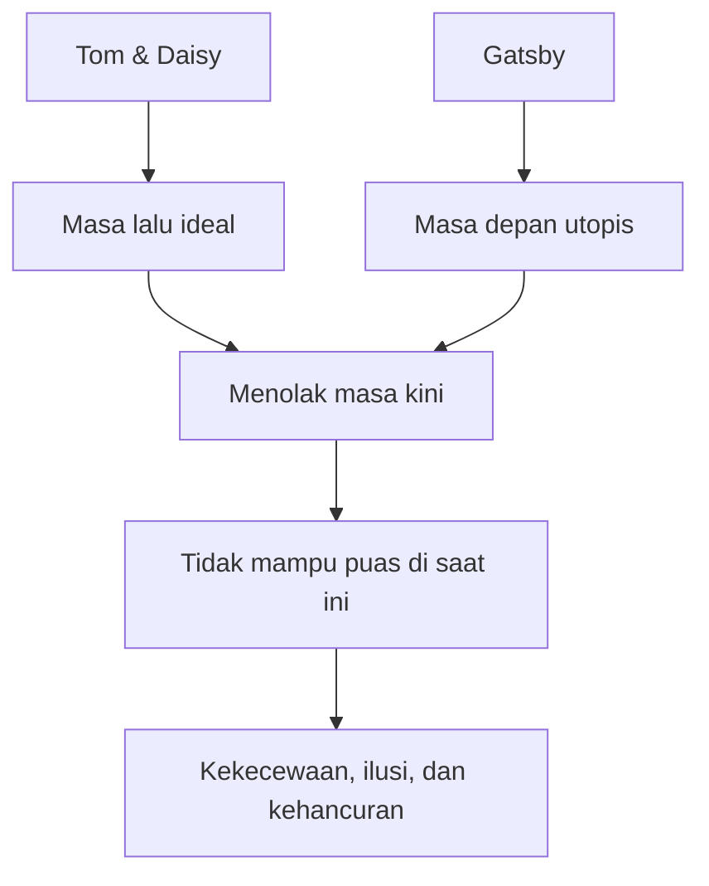
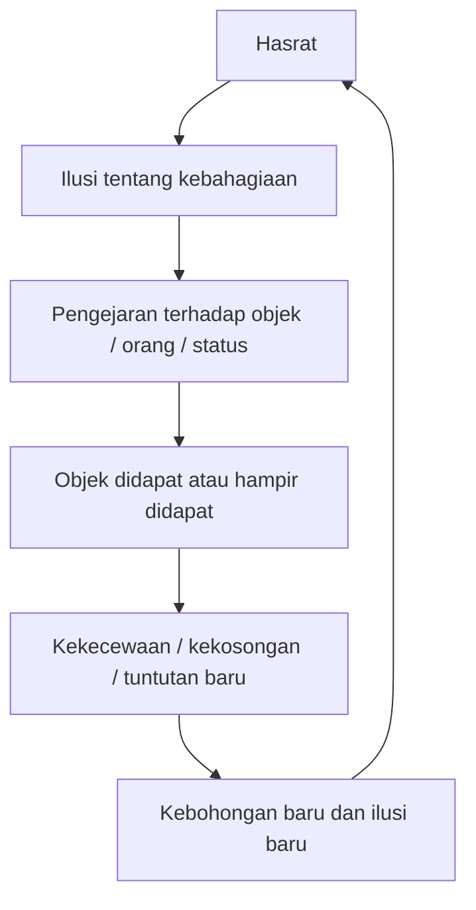

## 🥂 Pendahuluan: *The Great Gatsby* Jauh Lebih Gelap dan Lebih Dalam daripada yang Biasanya Kita Bayangkan

**The Great Gatsby** karya **F. Scott Fitzgerald** adalah salah satu novel paling terkenal di dunia. Ia diajarkan di sekolah-sekolah, dianalisis di kampus-kampus, dan terus hidup di budaya populer, apalagi setelah adaptasi film yang membuat sosok Gatsby semakin melekat di imajinasi publik sebagai pria misterius, kaya raya, romantis, dan tragis. 🥂

Biasanya, novel ini dibaca lewat beberapa lensa utama:
- kritik terhadap **American Dream** *(mimpi Amerika / keyakinan bahwa siapa pun bisa naik lewat kerja keras dan ambisi)*,
- ketegangan antara **old money** *(kekayaan lama turun-temurun)* dan **new money** *(kekayaan baru)*,
- trauma sosial pasca Perang Dunia I,
- serta gaya hidup mewah, pesta, alkohol, perselingkuhan, dan kehancuran moral era Roaring Twenties.

Semua itu benar. Semua itu penting. Tetapi ada satu pembacaan yang menurut saya jauh lebih menggigit dan justru menyatukan semua tema tadi ke dalam kerangka yang lebih besar:

> **The Great Gatsby adalah salah satu novel paling tajam tentang kegagalan yang pernah ditulis.**

Bukan kegagalan dalam arti sempit seperti “gagal dapat pasangan”, “gagal naik kelas sosial”, atau “gagal menang melawan lawan.” Lebih dalam dari itu, Gatsby adalah novel tentang:
- kegagalan menjadi puas,
- kegagalan memahami apa yang sungguh kita inginkan,
- kegagalan hidup di saat kini,
- kegagalan melihat orang lain dengan jernih,
- kegagalan membedakan cinta dari proyeksi,
- dan kegagalan menghadapi kenyataan tanpa bersembunyi di balik ilusi, uang, kecantikan, status, atau moralitas pura-pura.

Novel ini tidak hanya memperlihatkan orang-orang yang kalah. Ia memperlihatkan orang-orang yang **bahkan tidak benar-benar memahami apa bentuk kekalahannya**. Mereka mengejar sesuatu, meraih sebagian darinya, lalu tetap kosong. Mereka berdusta, lalu berdusta lagi untuk menopang dusta sebelumnya. Mereka membangun citra, mengejar masa lalu, atau memuja masa depan, tetapi tidak satu pun sungguh bisa hidup di masa kini.

Dalam artikel ini, saya akan membedah *The Great Gatsby* secara **sangat detail, mendalam, dan lengkap** dalam Bahasa Indonesia. Kita akan membahas:

- plot dasarnya,
- struktur hasrat dan ilusi setiap karakter,
- tema **craving** *(nafsu-keinginan yang terus menggerakkan)*,
- cara novel ini memperlakukan waktu,
- kebohongan sebagai bentuk pelarian diri,
- estetika sebagai alat kekuasaan,
- peran Nick Carraway sebagai narator yang sangat tidak netral,
- hingga kaitannya dengan kehidupan Fitzgerald sendiri.

Dan kalau harus diringkas sejak awal, tesis artikel ini adalah:

> **The Great Gatsby bukan hanya cerita tentang orang kaya yang rusak, melainkan tragedi tentang manusia yang terus menjanjikan kebahagiaan kepada dirinya sendiri melalui benda, status, cinta, masa lalu, atau masa depan—lalu mendapati bahwa semuanya tidak pernah cukup.**

---

<Callout type="important" title="Tesis utama artikel ini">
Pembacaan terdalam atas *The Great Gatsby* bukan hanya soal kelas sosial atau kematian American Dream, tetapi tentang bagaimana manusia gagal mencapai kepuasan karena terus mengejar ilusi yang tidak sepenuhnya ia pahami sendiri.
</Callout>

---

## 📖 1. Ringkasan Plot: Siapa Sebenarnya Gatsby dan Apa yang Terjadi dalam Novel Ini?

Novel ini dibuka oleh **Nick Carraway**, seorang pria muda yang baru kembali dari Perang Dunia I dan pindah ke wilayah pinggiran New York untuk bekerja. Ia tinggal di **West Egg**, sebuah kawasan yang diasosiasikan dengan kekayaan baru—ramai, mencolok, agak vulgar, dan kurang “terhormat” menurut kelas lama. Di seberangnya ada **East Egg**, rumah bagi elite lama yang mapan, halus, dan penuh kepercayaan diri kelas. 📖

Nick tinggal sederhana, tetapi tetangganya luar biasa mencolok: **Jay Gatsby**, pemilik rumah besar, penuh kemewahan, dan terkenal karena pesta-pesta raksasa yang dihadiri banyak orang yang bahkan sering tidak diundang secara pribadi. Semua orang membicarakan Gatsby, tetapi hampir tidak ada yang benar-benar mengenalnya. Gosip tentangnya liar:
- ia membunuh seseorang,
- ia mata-mata Jerman,
- ia keturunan bangsawan,
- ia kaya dari sumber misterius.

Nick juga terhubung dengan pasangan **Tom Buchanan** dan **Daisy Buchanan**. Tom adalah pria kaya, kasar, dan penuh rasa superioritas lama; Daisy adalah sepupu Nick, cantik, lembut, tetapi rapuh dan tidak bahagia. Di rumah mereka, Nick bertemu **Jordan Baker**, mantan atlet golf yang dingin, cerdas, licin, dan kemudian menjalin kedekatan romantis samar dengan Nick.

Sejak awal kita tahu Tom berselingkuh dengan **Myrtle Wilson**, istri dari **George Wilson**, pemilik bengkel / pom bensin yang lemah, miskin, dan tak menyadari pengkhianatan istrinya. Tom memperlakukan Wilson seperti bawahan; Myrtle, sebaliknya, melihat Tom sebagai jalan keluar dari hidupnya yang kusam dan memalukan.

Nick akhirnya mengenal Gatsby, dan pelan-pelan terungkap bahwa seluruh pertunjukan kekayaan Gatsby—rumah, pesta, mobil, gaya hidup—berpusat pada satu tujuan: **Daisy**. Lima tahun sebelumnya, Gatsby dan Daisy pernah jatuh cinta, tetapi Gatsby kala itu miskin. Kini ia kaya, dan ia membeli rumah tepat di seberang teluk dari rumah Daisy. Harapannya sederhana sekaligus mustahil: ia ingin mengulang masa lalu dan memenangkan Daisy seutuhnya.

Nick membantu mempertemukan kembali Daisy dan Gatsby. Mereka berselingkuh. Untuk sesaat, tampak seolah mimpi Gatsby akan menjadi nyata. Tetapi kemudian Tom mengetahui perselingkuhan itu. Ketegangan meledak di hotel. Tom menelanjangi sumber kekayaan Gatsby: **bootlegging** *(penyelundupan / perdagangan alkohol ilegal di era pelarangan alkohol)*. Daisy goyah. Dalam perjalanan pulang, Daisy yang mengemudi mobil Gatsby menabrak Myrtle dan kabur. George Wilson, yang putus asa dan percaya pemilik mobil itulah juga kekasih Myrtle, akhirnya menembak Gatsby lalu bunuh diri.

Setelah semua kemewahan dan pesta itu, hanya sedikit orang datang ke pemakaman Gatsby. Bahkan hampir tidak ada. Dan dari sana kita sadar: dunia yang berputar di sekeliling Gatsby ternyata tidak pernah benar-benar mencintainya.

---

## 💔 2. Gatsby sebagai Novel tentang Kegagalan, Bukan Sekadar Kemewahan

Banyak pembaca memusatkan perhatian pada simbol-simbol kemewahan dalam novel ini—rumah besar, pesta, gaun, mobil, alkohol, kota, kelas sosial. Tetapi semua itu, menurut saya, hanya lapisan luar. Di bawah permukaan kemewahan ini, yang sedang dipertontonkan Fitzgerald adalah **arsip kegagalan manusia**. 💔

Kita melihat berbagai bentuk kegagalan:
- Tom gagal merasa aman meski kaya dan dominan.
- Daisy gagal bahagia meski cantik, kaya, dan “berhasil” menikah bagus.
- Myrtle gagal keluar dari hidupnya melalui affair.
- Gatsby gagal mencapai fantasi yang selama ini mengorganisir hidupnya.
- Nick gagal sungguh-sungguh netral, jujur, dan bermoral seperti yang ia bayangkan.

Yang menarik, semua tokoh ini sebenarnya **tidak gagal total secara duniawi**. Banyak dari mereka justru mendapatkan banyak hal yang diinginkan manusia biasa:
- uang,
- status,
- pasangan menarik,
- relasi sosial,
- akses ke elite,
- kebebasan bergerak.

Tetapi justru itulah poin Fitzgerald. Novel ini bukan terutama bertanya, *“Bagaimana rasanya gagal mendapatkan yang Anda mau?”* Novel ini bertanya sesuatu yang jauh lebih pahit:

> **Bagaimana jika Anda hampir mendapatkan apa yang Anda kira Anda inginkan—atau bahkan sudah mendapatkannya—dan ternyata Anda tetap tidak bisa menjadi utuh?**

Itulah yang membuat Gatsby terasa begitu modern. Ia bukan tragedi orang yang tidak punya apa-apa. Ia tragedi orang-orang yang punya cukup banyak, tetapi tetap kosong.

---

## 🔥 3. Hasrat sebagai Janji Palsu: Mengapa Keinginan Selalu Menjanjikan Lebih dari yang Bisa Diberikan?

Salah satu ide paling penting dari video sumber adalah bahwa ketika kita menginginkan sesuatu dengan sangat kuat, kita biasanya melakukan dua hal sekaligus:

1. kita menjanjikan pada diri sendiri bahwa objek itu akan memberi hadiah emosional besar;
2. kita juga lari dari rasa kurang, rasa gagal, atau rasa hampa yang muncul ketika objek itu belum kita miliki. 🔥

Ini sangat penting untuk memahami *The Great Gatsby*.

Tokoh-tokohnya terus hidup dalam struktur seperti ini:
- **“Kalau saja saya mendapatkan X, saya akan utuh.”**
- **“Kalau saja hidup saya jadi seperti Y, semuanya akan selesai.”**

Tetapi yang terjadi hampir selalu sama:
- objek itu didapat atau hampir didapat,
- ada euforia sesaat,
- lalu rasa umum hidup datang kembali,
- lalu lahirlah objek hasrat baru.

Ini berlaku untuk karier, uang, pasangan, status, citra sosial, bahkan moralitas.

Novel ini sangat cerdas karena tidak menggambarkan hasrat sebagai sesuatu yang murni bodoh. Fitzgerald tahu bahwa keinginan memang terasa sangat meyakinkan dari dalam. Ketika kita menginginkan sesuatu, kita sungguh percaya bahwa benda atau orang itu membawa jawaban. Dan itulah yang membuat manusia sangat mudah ditipu oleh hasratnya sendiri.

---

## 💎 4. Daisy, Tom, Myrtle, Wilson: Semua Menginginkan, Semua Salah Membaca Keinginannya Sendiri

Untuk melihat bagaimana novel ini bekerja, kita perlu memperhatikan bahwa hampir semua tokohnya salah memahami hasratnya sendiri. 💎

### Daisy dan Tom
Daisy dulu benar-benar mencintai Tom. Jordan bahkan mengatakan ia belum pernah melihat seorang perempuan segila itu pada suaminya. Jadi pernikahan mereka tidak dimulai sebagai sekadar kontrak dingin. Namun sekarang? Hubungan itu busuk. Tom berselingkuh. Daisy tidak bahagia. 

Artinya, bahkan cinta yang pernah sungguh ada tidak otomatis menjamin kebahagiaan jangka panjang. Yang dulu tampak sebagai puncak bisa berubah menjadi rutinitas dingin dan penjara batin.

### Myrtle dan Wilson
Myrtle mengaku menikahi Wilson karena mengira ia lelaki berkelas—*gentleman* *(pria terhormat / beradab)*—tetapi ternyata baginya Wilson kini hanyalah lelaki lemah yang tak layak. Ia lalu mengejar Tom. Tetapi apakah ia mencintai Tom sebagai pribadi? Atau Tom hanya simbol:
- maskulinitas kasar,
- status sosial lebih tinggi,
- jalan keluar dari hidup miskin,
- akses ke dunia yang lebih glamor?

### Gatsby dan Daisy
Ini yang paling penting. Gatsby menginginkan Daisy seolah-olah Daisy adalah pusat semesta. Tetapi apakah yang ia inginkan benar-benar Daisy sebagai manusia nyata? Atau Daisy sebagai:
- lambang kemenangan atas kelas lama,
- bukti bahwa ia telah berhasil menjadi “orang yang pantas”,
- dan jembatan menuju masa depan utopis yang ia bangun dalam imajinasi?

Saya kira jawaban yang jujur adalah: **dua-duanya**, tetapi yang kedua mungkin bahkan lebih besar.

---

## ❄️ 5. *Crystallization*: Ketika Kita Tidak Menginginkan Orang Nyata, tetapi Versi Ideal yang Kita Ciptakan Sendiri

Video sumber menggunakan konsep **Stendhal** yang sangat membantu di sini: **crystallization** *(kristalisasi / proses mengidealkan seseorang sampai jauh melebihi kenyataan)*. ❄️

Saat seseorang jatuh cinta atau menginginkan sesuatu dengan sangat kuat, ia sering tidak lagi melihat objek itu secara netral. Imajinasi bekerja. Segala kualitas baik dibesar-besarkan. Segala celah diisi. Harapan diproyeksikan. Masa depan dipoles. Akhirnya, orang itu tidak lagi menginginkan realitas, melainkan konstruksi yang ia bangun sendiri.

Ini tepat sekali untuk Gatsby.

Nick mengatakan bahwa ada saat-saat ketika Daisy “jatuh pendek” dari mimpi Gatsby—bukan karena Daisy bersalah, tetapi karena ilusi Gatsby sudah tumbuh terlalu besar, terlalu hidup, terlalu penuh energi untuk bisa ditampung oleh manusia nyata mana pun. Ini kalimat yang luar biasa penting. Gatsby bukan gagal karena Daisy jelek, jahat, atau tidak cukup romantis. Ia gagal karena **tak ada manusia nyata yang bisa memadai bagi fantasi sebesar itu.**

Myrtle juga demikian. Ia tidak menginginkan Wilson yang nyata; ia menginginkan versi Wilson yang seharusnya jadi pria berkelas. Lalu ia menginginkan Tom sebagai simbol keluar. Daisy sendiri menginginkan Gatsby partly sebagai jalan kembali ke versi dirinya yang lebih muda dan lebih hidup.

Dengan kata lain, novel ini tidak sekadar bicara tentang cinta. Ia bicara tentang **proyeksi**.

---

## 🪞 6. Hasrat Tidak Pernah Murni: Kita Menginginkan Orang, Tapi Juga Menginginkan Apa yang Mereka Wakili

Salah satu lapisan paling penting dalam pembacaan ini adalah bahwa hasrat dalam *The Great Gatsby* bukan hanya bersifat personal, tetapi juga **simbolik** dan **mimetic** *(mimetik / terbentuk melalui keinginan orang lain dan struktur sosial)*. 🪞

Tentang Gatsby, novel memberi petunjuk sangat terang: Daisy bukan sekadar perempuan pertama yang ia cintai. Daisy adalah perempuan kaya pertama yang benar-benar dekat dengannya. Selain itu, fakta bahwa “banyak pria” sudah menginginkan Daisy justru menambah nilainya di mata Gatsby.

Ini sangat penting.

Gatsby tidak hanya menginginkan Daisy karena Daisy itu Daisy. Ia juga menginginkannya karena:
- Daisy diinginkan orang-orang elite lain,
- Daisy mewakili dunia kelas lama,
- dan memenangkan Daisy berarti mengalahkan semua pria yang lebih mapan darinya.

Ini yang membuat sangat penting bagi Gatsby bahwa Daisy “tidak pernah mencintai Tom.” Kalau Daisy pernah sungguh mencintai Tom, maka kemenangan Gatsby tidak murni. Ia tidak menaklukkan dunia lama sepenuhnya.

Jadi, Daisy bagi Gatsby adalah sekaligus:
- perempuan,
- trofi simbolik,
- gerbang sosial,
- bukti keberhasilan,
- dan konfirmasi bahwa masa depan utopisnya memang nyata.

Ini sangat manusiawi dan sangat tragis. Karena banyak dari kita juga melakukan hal yang sama:
- kita menginginkan pasangan, tapi diam-diam juga menginginkan pengakuan dari lingkungan;
- kita mengejar jabatan, tapi diam-diam juga mengejar pembuktian diri;
- kita memburu keberhasilan, tapi juga ingin mengalahkan bayangan masa lalu yang mempermalukan kita.

---

## ⏳ 7. Novel Ini juga tentang Waktu: Tokoh-Tokohnya Tidak Mampu Hidup di Masa Kini

Salah satu gagasan paling indah dalam video adalah bahwa para tokoh *The Great Gatsby* punya hubungan yang sangat rusak dengan waktu. Mereka semua, dengan cara berbeda, gagal hidup di saat kini. ⏳

### Tom dan Daisy: pengungsi dari masa kini ke masa lalu
Tom terobsesi pada kemerosotan dunia. Ia terus mengeluh bahwa semuanya memburuk, bahwa tatanan lama runtuh, bahwa posisi orang-orang seperti dirinya terancam. Ia bahkan bicara ngawur tentang matahari memanas atau mendingin selama narasi akhirnya tetap satu: dunia menuju kehancuran.

Yang menarik, isi faktanya tidak penting bagi Tom. Yang penting baginya adalah perasaan bahwa **masa kini buruk dan masa lalu lebih aman**.

Daisy juga terjebak nostalgia. Gatsby baginya adalah pintu kembali ke versi dirinya yang muda, berpotensi, penuh daya hidup, belum hancur oleh kompromi pernikahan dan rutinitas kelas.

### Gatsby: pengungsi dari masa kini ke masa depan
Sekilas Gatsby tampak ingin kembali ke masa lalu. Ia ingin “mengulang” lima tahun lalu. Tetapi kalau dipikir-pikir, itu tidak mungkin benar secara literal. Kalau semua kembali seperti lima tahun lalu, ia tetap miskin. Yang Gatsby sungguh-sungguh inginkan sebenarnya adalah **masa depan**—secepat mungkin—di mana hasil dari seluruh usaha simboliknya menjadi nyata. Daisy adalah nama lain untuk masa depan itu.

Maka Tom dan Gatsby tampak berlawanan, tetapi sebenarnya simetris:
- Tom memuja masa lalu yang receding *(terus menjauh)*,
- Gatsby memuja masa depan yang receding.

Keduanya sama-sama kehilangan masa kini.

---

---

## 🌊 8. Green Light: Simbol Harapan, Tetapi Juga Simbol Ketidakpuasan yang Tak Pernah Selesai

Simbol paling terkenal dalam novel ini tentu saja **lampu hijau** di ujung dermaga Daisy. Biasanya ia dibaca sebagai lambang harapan Gatsby. Itu benar. Tapi harapan ini perlu dipahami lebih tajam. 🌊

Lampu hijau bukan sekadar tanda bahwa “Gatsby optimistis.” Ia adalah simbol dari satu struktur hidup yang sangat manusiawi:

> **sesuatu yang tampak dekat, tampak mungkin, tampak hampir bisa disentuh—tetapi terus bergeser saat didekati.**

Inilah struktur hasrat itu sendiri.

Kita berkata:
- kalau saya dapat dia, saya akan tenang;
- kalau saya dapat posisi itu, saya akan lega;
- kalau saya punya rumah itu, saya akan aman;
- kalau saya diakui orang-orang itu, saya akan selesai.

Tetapi begitu mendekat, standar bergeser. Hasrat menemukan bentuk baru. Kepuasan tidak stabil. Maka kita mendayung lagi.

Itulah sebabnya lampu hijau Gatsby jauh lebih dalam daripada sekadar simbol romantik. Ia adalah gambar dari kehidupan manusia yang terus diarahkan ke depan oleh janji yang tidak pernah sepenuhnya lunas.

---

## 🧘 9. Epicurus, Schopenhauer, dan Kebenaran Pahit Gatsby: Kita Tidak Dibuat Mudah untuk Puas

Video dengan sangat tepat mengaitkan novel ini dengan gagasan filosofis lama: manusia tidak mudah puas karena hasrat kita cenderung naik bersama pencapaian kita. 🧘

**Epicurus**—yang sering disalahpahami sebagai filsuf pesta pora—sebenarnya sangat peka pada kenyataan bahwa keinginan manusia sering salah arah. Banyak penderitaan muncul karena kita mengejar kebutuhan semu dan membiarkan ekspektasi tumbuh lebih cepat daripada ketenangan.

**Schopenhauer** juga berkata sesuatu yang serupa dalam versi lebih gelap: hidup manusia bergerak antara kekurangan dan kebosanan. Saat belum mendapat sesuatu, kita menderita karena kurang. Saat sudah mendapatkannya, kita cepat bosan dan butuh sasaran baru.

Gatsby adalah ilustrasi brilian dari logika ini.

Gatsby muda pasti akan terharu membayangkan situasi Gatsby sekarang:
- ia punya rumah besar,
- kaya raya,
- dekat dengan Daisy,
- bahkan berhasil menjalin affair dengannya.

Tetapi Gatsby sekarang tidak bisa menikmatinya. Karena sekali kita hidup hanya untuk “sedikit lagi”, apa pun yang ada di tangan kita akan selalu terasa sementara dan belum final.

Itulah tragedi Gatsby. Ia bukan miskin. Ia bukan tak punya peluang. Ia justru hampir menyentuh objek impiannya. Dan justru karena itu ketidakpuasannya makin tragis.

---

## 🤥 10. Gatsby adalah Novel tentang Kebohongan—Tetapi Kebohongan Terdalam adalah Kebohongan kepada Diri Sendiri

Judul bagian dalam video sangat tepat: **you can’t handle the truth** *(kamu tidak sanggup menanggung kebenaran)*. *The Great Gatsby* memang dipenuhi kebohongan, tetapi bukan hanya kebohongan sosial biasa. Yang lebih penting adalah **self-deception** *(penipuan diri / berdusta pada diri sendiri)*. 🤥

Di sini menarik sekali membandingkan novel ini dengan gagasan **Elder Zosima** dari *The Brothers Karamazov*: orang yang terus berbohong pada dirinya sendiri lama-lama kehilangan kemampuan membedakan yang benar dari yang palsu, lalu kehilangan rasa hormat pada diri dan orang lain.

Itu persis terjadi di Gatsby.

### Gatsby berdusta tentang latar belakangnya
Ia mengarang keluarga kaya, Oxford, garis keturunan, dan semua ornamen kelas lama. Sebagian ini praktis—ia perlu menutupi sumber uangnya. Tetapi detail kebohongannya menunjukkan rasa malu dan rasa kurang yang sangat spesifik. Ia malu tidak punya **pedigree** *(garis keturunan terhormat)*. Ia malu kaya baru. Ia malu tidak inheren cocok dengan dunia Daisy.

### Jordan menyembunyikan banyak hal
Ia tampak licin, suka manipulasi kecil, bahkan disinyalir curang di golf. Ia hidup dalam jaringan setengah-kebenaran.

### Tom dan Daisy berbohong bukan hanya pada dunia, tapi juga pada pernikahannya sendiri
Mereka membangun citra pasangan mapan, tetapi dari dalam semuanya busuk. Mereka tetap bersama bukan karena cinta yang sehat, tetapi karena citra, perlindungan timbal balik, kelas, uang, dan rasa takut terhadap kerentanan.

### Nick mungkin yang paling berbahaya
Karena kebohongannya dibungkus narasi moral. Ia meyakinkan dirinya bahwa ia jujur, tidak menghakimi, dan relatif lebih baik dari semua orang. Padahal tindakannya sering tidak sejalan dengan citra itu.

---

## 🎭 11. Nick Carraway: Narator yang Jauh Lebih Tidak Jujur daripada yang Ingin Ia Akui

Ini salah satu lapisan terpenting dalam novel: **Nick Carraway bukan narator netral.** Bahkan saya akan bilang, ia sangat licik dalam cara yang halus. 🎭

Di awal, ia mengklaim dirinya tidak suka menghakimi. Tetapi sepanjang novel, Nick justru hampir terus-menerus menghakimi orang. Ia bilang dirinya jujur, peduli, dan bermoral. Tetapi mari lihat tindakannya:

- ia tidak memberitahu Daisy tentang affair Tom,
- ia tidak mencegah Tom memukul Myrtle,
- ia tampak tidak terlalu terusik secara aktif oleh banyak keburukan yang disaksikannya,
- ia sering merendahkan banyak orang sambil tetap merasa dirinya lebih bersih,
- dan ia menulis seluruh narasi ini dari posisi orang yang ingin sekaligus ikut terlibat dan sekaligus berdiri di atas semuanya.

Yang lebih rumit, Nick juga tidak sungguh adil pada Gatsby. Ia mengaguminya, tetapi sebagian kekaguman itu bukan murni pertemanan. Gatsby baginya adalah:
- misteri,
- lambang harapan,
- antitesis simbolik terhadap Tom,
- dan mungkin juga bentuk mimpi yang Nick sendiri tidak berani jalani.

Jadi, Nick juga memproyeksikan makna simbolik ke Gatsby. Ia tidak sepenuhnya melihat Gatsby sebagai manusia biasa. Ia melihatnya sebagai figur naratif.

Ini sangat penting karena berarti **The Great Gatsby sendiri adalah novel tentang kekuasaan perspektif.** Kita menerima semua ini melalui mata seorang pria yang berbohong pada dirinya tentang siapa dirinya sebenarnya.

---

## 💄 12. Aesthetic Power: Kecantikan, Gaya, dan Status sebagai Pengganti Kekerasan Telanjang

Salah satu bagian paling menarik dari video adalah ide bahwa dalam *The Great Gatsby*, **aesthetic power** *(kekuasaan estetis / kekuasaan melalui penampilan, gaya, citra, selera, dan reputasi)* berfungsi sebagai pengganti kekerasan fisik langsung. 💄

Ini sangat tajam.

Novel ini berlangsung di masyarakat “beradab”, bukan Wild West. Orang tidak setiap saat saling tembak di ruang tamu elite. Tetapi pertarungan kekuasaan tetap ada. Hanya medianya berubah:
- gaya,
- selera,
- status,
- reputasi,
- cara bicara,
- kelas,
- kepantasan,
- dan kemampuan mempermalukan orang secara sosial.

### Tom memakai kekuasaan estetis sekaligus fisik
Ketika bisa, ia langsung pakai kekerasan fisik—misalnya memukul Myrtle. Tetapi saat berhadapan dengan Gatsby, ia lebih banyak memakai alat sosial:
- menyebut Gatsby vulgar,
- membeberkan bahwa uang Gatsby dari bootlegging,
- dan memanggil opini sosial East Egg untuk menyingkirkan Gatsby.

### Gatsby memakai kemewahan sebagai senjata
Pestanya, rumahnya, mobilnya, perpustakaannya, semua adalah serangan estetis terhadap tatanan lama. Ia tidak hanya kaya; ia ingin **terlihat** kaya sampai tak mungkin diabaikan.

### Daisy memakai pesona dan citra
Ia mungkin tidak punya daya fisik seperti Tom, tetapi ia punya kekuasaan melalui kecantikan, kelas, dan nilai simbolik yang dilekatkan pria-pria pada dirinya.

### Nick memakai estetika naratif
Ini yang paling meta. Ia mengendalikan bagaimana pembaca melihat semua orang. Jadi ia juga memakai kekuasaan estetis—melalui bahasa dan penataan cerita.

---

## 🔫 13. Tetapi Fitzgerald Tidak Romantis: Ia Juga Menunjukkan Batas dari Kekuasaan Estetis Itu

Yang membuat novel ini hebat adalah Fitzgerald tidak berhenti pada pengamatan bahwa penampilan dan status sangat berkuasa. Ia juga menunjukkan **batasnya**. 🔫

Saat realitas keras datang, seluruh bangunan citra itu tiba-tiba rapuh sekali.

- Myrtle yang mengira Tom akan datang menyelamatkan justru mati tertabrak mobil.
- Gatsby yang punya rumah, uang, pesona, dan nama besar ternyata tidak punya pertahanan berarti terhadap peluru George Wilson.
- Tom yang biasanya dominan ternyata ketakutan dan bisa didikte pria miskin yang selama ini ia remehkan.

Ini sangat penting. Fitzgerald membangun dunia di mana estetika tampak seperti segalanya, lalu pada momen-momen tertentu ia merobek tirai itu dan memperlihatkan:

> **uang, gaya, dan reputasi tidak membuat manusia kebal terhadap waktu, tubuh, kematian, rasa malu, atau kebetulan brutal.**

Jadi, *The Great Gatsby* bukan hanya kritik terhadap materialisme. Ia juga kritik terhadap ilusi bahwa citra bisa memberi keamanan eksistensial.

---

## 🌫️ 14. Dr. T. J. Eckleburg, Ekonomi, dan Pandangan yang Tidak Pernah Benar-Benar Menyelamatkan

Walau video hanya menyinggung sekilas, simbol **mata Dr. T. J. Eckleburg** penting karena menunjukkan bahwa dunia ini seolah diawasi oleh tatapan besar—tetapi tatapan itu bukan Tuhan penyelamat. Lebih mirip sisa iklan, ekonomi, kapitalisme, dan kekosongan makna yang menjadi semacam dewa palsu modern. 🌫️

Karakter-karakter bergerak di bawah mata besar itu, tetapi pengawasan tidak melahirkan moralitas. Yang ada justru:
- transaksi,
- rasa malu,
- citra,
- dan perasaan terus dilihat tanpa benar-benar dipahami.

Dalam konteks pembacaan kegagalan, billboard itu seperti mengingatkan bahwa dunia modern menyediakan sangat banyak tanda, sangat banyak simbol, tetapi tidak serta-merta menyediakan pengampunan, arah, atau pemenuhan.

---

## 🧩 15. Semua Orang Gagal, tetapi Tidak Semua Orang Sadar Sedalam Apa Mereka Gagal

Ini titik paling penting. Fitzgerald tidak hanya menunjukkan bahwa tokoh-tokohnya gagal. Ia menunjukkan bahwa mereka gagal **tanpa mampu sepenuhnya menanggung makna kegagalannya**. 🧩

### Tom
Ia tahu posisinya rapuh, tetapi alih-alih menghadapi kenyataan itu, ia memelihara sinisme dan nostalgia.

### Daisy
Ia tahu hidupnya hampa, tetapi tidak punya kekuatan moral maupun eksistensial untuk memilih jalan yang jujur.

### Gatsby
Ia melihat sebagian retakan dalam mimpinya, tetapi tetap berjaga di luar rumah Daisy, seolah kebiasaan berharap lebih kuat daripada realitas.

### Nick
Ia menyaksikan semuanya, tetapi melindungi dirinya dengan keyakinan bahwa ia “berbeda” secara moral.

Semua tokoh ini, dengan cara masing-masing, hidup dalam ruang antara:
- lucidity *(kelucidan / kejernihan pahit terhadap realitas)*,
- dan sleep *(tidur / ketidaksadaran yang nyaman)*.

Mereka tidak bisa kembali sepenuhnya ke ketidaktahuan yang damai. Tetapi juga tidak cukup jujur atau cukup berani untuk mengolah kegagalan itu menjadi kebijaksanaan baru.

Dan justru di situlah kekuatan novel ini. Ia tidak menawarkan solusi rapi.

---

## 🧑‍💼 16. Fitzgerald Sendiri: Mengapa Gatsby Juga Bisa Dibaca sebagai Pengakuan Diri Penulisnya?

Bagian akhir video yang menghubungkan novel ini dengan kehidupan **F. Scott Fitzgerald** sangat menarik dan menurut saya sangat kuat. Fitzgerald sendiri adalah pria yang mengejar:
- ketenaran,
- uang,
- status,
- gaya hidup glamor,
- pengakuan sastra,
- dan citra kehidupan yang cemerlang.

Dengan kata lain, sebagian besar yang sedang dikritik novel ini juga hidup dalam diri penulisnya sendiri. 🧑‍💼

Inilah yang membuat *The Great Gatsby* terasa bukan hanya sebagai kritik sosial, tetapi juga sebagai **self-critique** *(kritik diri)* yang sangat tajam.

Fitzgerald menulis cerita tentang:
- orang yang mengejar mimpi sampai jadi hampa,
- orang yang mengira kekayaan dan prestise akan menambal lubang batin,
- dan orang yang hidup dari ilusi besar,

sementara ia sendiri masih bergerak dalam orbit hasrat yang sama.

Itu luar biasa. Seolah-olah ia sudah menulis diagnosisnya sebelum benar-benar sanggup menyembuhkan atau bahkan menerima penyakitnya sendiri.

Maka saya sangat setuju dengan garis besar akhir video: *The Great Gatsby* bisa dibaca sebagai salah satu karya **self-critique** paling tajam dalam sastra modern. Bukan karena Fitzgerald sudah sepenuhnya keluar dari jebakan yang ia gambarkan, tetapi justru karena ia cukup jernih untuk melihatnya, walau belum cukup bebas untuk lolos darinya.

---

## 🚣 17. “So We Beat On…”: Mengapa Kalimat Penutup Ini Begitu Besar?

Kalimat penutup novel ini sangat terkenal:

> *So we beat on, boats against the current, borne back ceaselessly into the past.*

Kalimat ini sangat kaya dan bisa dibaca setidaknya dua arah. 🚣

### Untuk Gatsby
Ia seperti orang yang mendayung ke masa depan, ke lampu hijau, ke Daisy, ke dunia di mana ia diakui penuh. Tetapi arus struktur sosial dan waktu terus menyeretnya ke belakang.

### Untuk Tom dan Daisy
Mereka justru mendayung ke belakang, berusaha mempertahankan masa lalu, status lama, keamanan lama, citra lama. Tetapi arus sejarah bergerak ke depan dan mereka tidak bisa benar-benar menahannya.

Dalam kedua kasus, manusia tampak berada dalam konflik dengan waktu itu sendiri.

Maka kalimat akhir ini bukan sekadar penutup puitis. Ia adalah ringkasan dari seluruh kondisi manusia dalam novel:
- kita berharap,
- kita mendayung,
- kita membangun narasi,
- kita mengejar,
- kita mengulang,
- tetapi waktu dan realitas tidak pernah tunduk penuh pada desain batin kita.

---

---

## 🕯️ 18. Jadi, Apa yang Sebenarnya Diajarkan The Great Gatsby?

Yang indah sekaligus brutal dari *The Great Gatsby* adalah novel ini tidak memberi moral final yang rapi. Ia tidak berkata:
- “Jadilah miskin saja.”
- “Jangan jatuh cinta.”
- “Hindari ambisi.”
- “Semua kelas atas jahat.”
- “Cukup jadilah sederhana maka semua beres.”

Tidak sesederhana itu. 🕯️

Yang justru diajarkan novel ini lebih pahit dan lebih manusiawi:

### 1. Hasrat sering membohongi kita
Kita melebih-lebihkan apa yang akan diberikan suatu objek pada hidup kita.

### 2. Kita sering tidak tahu apa yang sungguh kita cari
Kita berkata mencari cinta, padahal mungkin kita mencari pembenaran diri, kemenangan simbolik, atau pelarian dari rasa kurang.

### 3. Masa kini sering kita korbankan demi fantasi masa lalu atau masa depan
Dan di sanalah banyak kebahagiaan nyata habis.

### 4. Kebohongan kepada diri sendiri lebih berbahaya daripada kebohongan sosial biasa
Karena ia memutus kemampuan kita melihat diri dan orang lain secara jernih.

### 5. Uang, kecantikan, gaya, dan status sangat berkuasa—tetapi tidak mutlak
Pada titik tertentu, tubuh, waktu, kebetulan, dan kematian akan mematahkan ilusi keamanan itu.

### 6. Kegagalan paling dalam bukan gagal mendapatkan sesuatu
Melainkan gagal memahami mengapa kita terus mengejar sesuatu yang tidak pernah cukup.

---

## ✨ 19. Kesimpulan: Gatsby adalah Novel Besar tentang Kegagalan yang Sangat Manusiawi

Pada akhirnya, saya kira *The Great Gatsby* adalah novel besar bukan karena ia sekadar mengkritik orang kaya atau membongkar kemunafikan elite. Banyak karya bisa melakukan itu. Gatsby menjadi klasik karena ia menembus lebih jauh, ke inti pengalaman manusia yang sangat tua:

- kita ingin sesuatu,
- kita membayangkannya akan menyelamatkan kita,
- kita mendekatinya atau bahkan mendapatkannya,
- lalu kita mendapati bahwa rasa kurang itu tetap ada. ✨

Tom, Daisy, Myrtle, Gatsby, bahkan Nick—semua bergerak di sekitar lubang batin yang tidak pernah benar-benar tertutup oleh:
- cinta,
- status,
- estetika,
- nostalgia,
- sinisme,
- atau harapan besar.

Itulah sebabnya novel ini terasa begitu menyesakkan. Karena ia tidak hanya berbicara tentang dunia 1920-an. Ia berbicara tentang kita. Tentang cara kita menjanjikan keselamatan kepada diri sendiri melalui versi-versi baru dari lampu hijau:
- jabatan berikutnya,
- pasangan ideal,
- pengakuan sosial,
- rumah impian,
- tubuh impian,
- masa depan impian.

Dan mungkin itu sebabnya novel ini tetap terasa hidup. Karena selama manusia masih berharap bahwa “sedikit lagi” akan menyelesaikan semuanya, selama itu pula Gatsby akan tetap relevan.

Kalau harus diringkas dalam satu kalimat, maka inti novel ini mungkin adalah:

> **The Great Gatsby menunjukkan bahwa manusia tidak hanya menderita karena gagal meraih impian, tetapi juga karena sering tidak sadar bahwa impiannya sendiri sudah dibangun di atas ilusi yang tidak akan pernah sanggup memuaskannya.**

Dan itulah yang membuat Gatsby begitu indah, begitu pahit, dan begitu dalam. 🥀

---

<Callout type="quote" title="Kalimat inti artikel ini">
The Great Gatsby bukan sekadar novel tentang pesta, uang, dan cinta tragis, melainkan tragedi tentang manusia yang terus mengejar sosok, status, atau masa depan yang diyakininya akan menyelamatkan dirinya—padahal yang dikejar itu sejak awal sudah bercampur dengan ilusi.
</Callout>

<Callout type="cite" title="Sumber dan fokus pembahasan">
Artikel ini dikembangkan dari transcript video *The Great Gatsby is Deeper Than You Think* dan diperluas menjadi esai sastra-filosofis tentang kegagalan, hasrat, waktu, kebohongan, kekuasaan estetis, narator tidak andal, dan hubungan novel ini dengan kehidupan F. Scott Fitzgerald sendiri.
</Callout>
