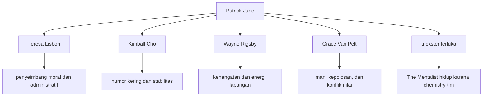
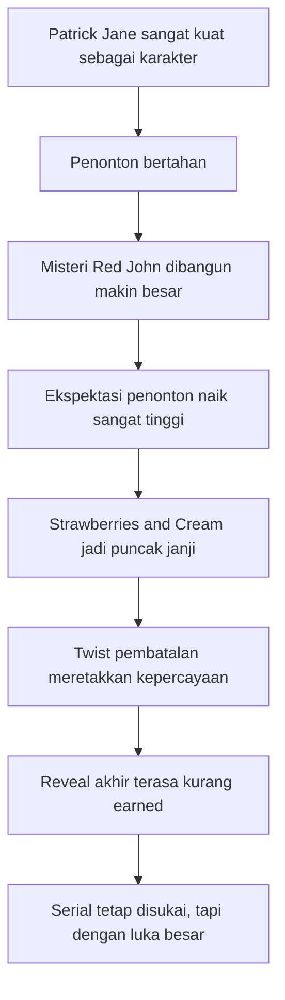

## 🫖 Pendahuluan: *The Mentalist* Adalah Serial yang Sangat Mudah Disukai, tetapi Sulit Dibela Sepenuhnya

Ada serial televisi yang dari awal sampai akhir hampir tak bercela. Ada juga serial yang ambisinya besar, tetapi eksekusinya tidak pernah benar-benar hidup. Lalu ada kategori ketiga yang justru sangat menarik: serial yang **sangat memikat, sangat mudah dicintai, penuh kualitas nyata**, tetapi pada saat yang sama menyisakan frustrasi mendalam karena kita tahu ia *bisa* menjadi lebih besar daripada yang akhirnya ia capai. *The Mentalist* berada tepat di wilayah itu. 🫖

Bagi banyak orang, *The Mentalist* adalah serial kriminal yang nyaman ditonton. Ia punya:
- pemeran utama yang sangat karismatik,
- format kasus mingguan yang mudah diikuti,
- tim investigasi yang akrab seperti keluarga kerja,
- humor yang ringan tapi tidak murahan,
- dan benang merah antagonis besar yang membuat penonton terus kembali.

Namun, bagi penonton yang mengikuti serial ini secara serius, terutama pada masa tayangnya, *The Mentalist* juga merupakan pelajaran tentang betapa sulitnya menjaga misteri besar agar tetap memuaskan sampai garis akhir.

Serial ini tayang di CBS dari 2008 sampai 2015, berjalan selama **7 musim** dan **151 episode**. Premisnya sangat kuat sejak awal. **Patrick Jane**, mantan paranormal palsu yang dulu mencari uang dengan menipu orang melalui teknik *cold reading* *(membaca orang lewat observasi, isyarat, dan dugaan psikologis, bukan lewat kekuatan gaib)*, kini bekerja sebagai konsultan untuk **California Bureau of Investigation** atau **CBI**. Ia membantu memecahkan pembunuhan dengan kemampuan observasi dan manipulasi yang sama yang dulu ia gunakan untuk menipu orang. Tetapi hidupnya digerakkan oleh luka yang jauh lebih besar: istrinya dan anaknya dibunuh oleh pembunuh berantai bernama **Red John**, dan Jane hidup dengan satu misi utama—menemukan dan membunuhnya.

Sejak titik itu, *The Mentalist* bukan hanya serial prosedural polisi biasa. Ia menjadi dua serial sekaligus:

1. **serial kriminal episodik** tentang pembunuhan minggu ini, dan  
2. **serial obsesi balas dendam** tentang seorang pria yang hidupnya berhenti di hari keluarganya dibunuh.

Kombinasi ini membuat *The Mentalist* lebih kuat daripada banyak procedural show *(serial prosedural)* lain di zamannya. Tetapi kombinasi itu juga menjadi sumber masalah terbesarnya. Karena selama bertahun-tahun, serial ini menjual kepada penonton satu janji besar:

> **bahwa di ujung semua permainan ini, ada pertemuan yang pantas antara Patrick Jane dan Red John.**

Dan begitu penonton diberi janji sebesar itu, standar ekspektasi otomatis naik sangat tinggi.

Esai ini akan membahas *The Mentalist* secara lengkap dan mendalam, bukan sekadar sebagai nostalgia serial detektif populer, tetapi sebagai karya televisi yang berhasil dalam banyak hal sekaligus gagal pada satu titik yang sangat krusial. Kita akan melihat:

- mengapa Patrick Jane adalah karakter yang begitu efektif,
- mengapa Simon Baker nyaris tak tergantikan dalam peran ini,
- bagaimana dinamika tim CBI membuat serial ini sangat mudah ditonton,
- bagaimana hubungan Jane dan Lisbon berkembang,
- mengapa Red John awalnya sangat efektif sebagai antagonis,
- mengapa misteri identitas Red John akhirnya menjadi masalah,
- dan mengapa meskipun ending arc utamanya mengecewakan banyak orang, *The Mentalist* tetap layak dibaca sebagai serial yang benar-benar punya pesona dan kualitas khas.

Kalau harus dirumuskan dalam satu tesis utama, maka tesis artikel ini adalah:

> **The Mentalist berhasil karena Patrick Jane, Teresa Lisbon, dan tim CBI memberi jantung emosional yang kuat pada struktur procedural yang akrab; tetapi serial ini juga merusak sebagian kejayaannya sendiri ketika misteri Red John—yang semestinya menjadi mahkota naratifnya—ditarik terlalu lama dan akhirnya ditutup dengan cara yang terasa kurang terencana dan kurang pantas bagi skala mitos yang sudah dibangunnya.**

Itulah sebabnya *The Mentalist* begitu menarik dibahas. Ia bukan karya gagal. Ia juga bukan karya sempurna. Ia adalah serial yang berisi banyak keunggulan nyata dan satu luka struktural besar. Dan sering kali, justru karya seperti inilah yang paling seru dianalisis, karena di sana kita bisa melihat dengan jelas **apa yang membuat televisi begitu hidup ketika ia berhasil—dan apa yang membuatnya begitu mengecewakan ketika ia terlalu percaya diri pada misteri yang belum benar-benar ia siapkan jawabannya.**

---

<Callout type="important" title="Tesis utama artikel ini">
*The Mentalist* hidup terutama karena pesona Patrick Jane, kualitas Simon Baker, dinamika tim CBI, dan keseimbangan antara humor, trauma, dan deteksi. Tetapi serial ini juga membebani dirinya sendiri dengan misteri Red John yang dibangun terlalu besar, terlalu lama, dan pada akhirnya tidak diselesaikan sekuat janji yang sudah ia tanam.
</Callout>

---

## 🎩 1. Patrick Jane: Detektif, Penipu, Showman, dan Pria yang Hidup dari Luka yang Tidak Pernah Sembuh

Hampir mustahil membahas *The Mentalist* tanpa langsung mengakui satu hal: **Patrick Jane adalah jantung serial ini**. 🎩

Dalam banyak procedural show, protagonis utama sering dibangun sebagai mesin kecerdasan. Mereka tajam, nyentrik, dan sangat berguna bagi plot. Tetapi Patrick Jane lebih dari itu. Ia bukan hanya cerdas. Ia **menyenangkan untuk ditonton**.

Ini terdengar sederhana, tetapi justru itulah kekuatannya. Patrick Jane adalah karakter yang nyaris seketika memikat karena ia menggabungkan begitu banyak kualitas yang secara teoritis bisa saling bertabrakan, tetapi pada dirinya justru menghasilkan pesona:

- ia manipulatif, tetapi juga hangat,
- ia sombong, tetapi juga terluka,
- ia sangat pintar, tetapi sering tampil santai seperti orang yang tidak peduli,
- ia melanggar aturan, tetapi penonton paham mengapa ia melakukannya,
- ia mantan penipu, tetapi sekarang justru memakai trik-trik itu untuk membantu mengungkap kebenaran.

Patrick Jane pada dasarnya adalah **trickster** *(figur penipu cerdas / pembuat ulah yang memakai kecerdikan untuk mengganggu aturan biasa)* yang dipaksa hidup di dunia prosedural polisi. Itu kombinasi yang sangat kuat. Ia bukan detektif yang mengikuti protokol dengan rapi. Ia lebih seperti ilusionis moral-ambigu yang kebetulan bekerja bersama lembaga penegak hukum.

Namun, yang membuat Jane lebih dari sekadar karakter “jenius eksentrik” adalah masa lalunya. Dulu ia adalah paranormal palsu. Ia menghasilkan uang dengan mengeksploitasi duka orang lain, memberi harapan palsu, membaca gerak tubuh, menebak motif, dan menjual ilusi kedekatan dengan dunia gaib. Lalu karena kesombongan dan narsismenya, ia mempermalukan Red John di televisi—dan akibatnya, Red John membunuh istri dan anaknya.

Dari titik itu, Jane menjadi karakter yang dibangun di atas kontradiksi sangat kuat:

- ia ingin menolong, tetapi punya masa lalu menipu,
- ia menyukai permainan psikologis, tetapi membenci dirinya yang dulu,
- ia tampak ringan dan lucu, tetapi membawa duka permanen,
- ia menghindari kekerasan langsung, tetapi hidup dengan tujuan membunuh seseorang.

Dan justru kontradiksi-kontradiksi inilah yang membuatnya hidup.

---

## 🧠 2. “Mentalist” Itu Bukan Psikis: Mengapa Premis Serial Ini Menarik Sejak Judulnya?

Judul *The Mentalist* sendiri sudah menarik, karena ia bermain di wilayah yang sering disalahpahami. 🧠

Patrick Jane bukan penyihir. Ia bukan benar-benar paranormal. Ia bukan orang yang punya kekuatan supranatural. Ia adalah ahli observasi, pembacaan perilaku, sugesti, manipulasi perhatian, dan inferensi psikologis. Dalam bahasa populer, ia menggunakan apa yang sering diasosiasikan dengan:

- *cold reading* *(membaca orang dari petunjuk kecil)*,
- *suggestion* *(sugesti)*,
- *misdirection* *(pengalihan perhatian)*,
- *micro-observation* *(pengamatan sangat detail)*,
- dan intuisi yang sebenarnya adalah pengolahan cepat atas banyak detail sosial.

Premis ini efektif karena memberi warna berbeda pada genre detektif televisi. Dalam banyak serial lain, kejeniusan tokoh utama tampak melalui laboratorium forensik, logika analitik, atau keahlian teknis. Pada Jane, kejeniusan itu lebih sosial dan teatrikal. Ia seperti berdiri di antara:

- Sherlock Holmes,
- pesulap panggung,
- penipu ulung,
- dan psikolog amat berbahaya.

Ini membuat penyelidikan dalam *The Mentalist* tidak terasa kaku. Jane sering menyelesaikan kasus bukan dengan “teknologi ajaib”, tetapi dengan memahami:
- siapa yang berbohong,
- siapa yang takut,
- siapa yang haus pengakuan,
- siapa yang mudah dipancing,
- dan siapa yang tak mampu menahan dorongan untuk mengoreksi narasi.

Itu sebabnya serial ini terasa sangat “manusiawi” dalam desain misterinya. Fokusnya bukan hanya *what happened* *(apa yang terjadi)*, tetapi *how people reveal themselves* *(bagaimana manusia membocorkan diri mereka sendiri)*.

---

## ☕ 3. Patrick Jane sebagai Kumpulan Kontradiksi yang Justru Membuatnya Sangat Menarik

Salah satu alasan Patrick Jane sangat efektif adalah karena ia ditulis sebagai karakter yang penuh kontradiksi, dan kontradiksi itu tidak terasa palsu. ☕

Ia misalnya:
- sangat percaya diri, tetapi juga dipenuhi rasa bersalah,
- sangat pandai membaca orang, tetapi kadang gagal menghadapi dirinya sendiri,
- suka mengendalikan ruangan, tetapi hidupnya sebenarnya dikendalikan oleh luka lama,
- tampak santai, ringan, dan bahkan genit, tetapi sebenarnya tidak pernah benar-benar lepas dari bayang-bayang Red John.

Patrick Jane juga sangat **old-fashioned** *(bergaya lama / klasik)* dalam beberapa aspek:
- ia memakai *three-piece suit* *(setelan tiga bagian)*,
- membawa diri seperti pria dari era lain,
- minum teh terus-menerus,
- dan punya aura sopan santun yang berbeda dari banyak tokoh detektif TV modern.

Tetapi pada saat yang sama, ia juga sangat kekanak-kanakan dalam artian baik:
- usil,
- bermain-main,
- senang memancing reaksi,
- suka membuat orang bingung,
- dan kadang bergerak dengan energi yang hampir seperti anak laki-laki cerdas yang bosan di kelas.

Kombinasi ini menghasilkan pesona unik. Ia bukan maskulinitas keras yang dingin. Ia juga bukan pria rapuh yang sepenuhnya runtuh. Ia berada di antara keduanya. Dan di situlah karakter ini terasa hidup.

Salah satu contoh kecil tapi sangat efektif adalah **kecintaannya pada teh**. Secara plot, ini memang kadang berguna—teh menjadi alasan masuk ke rumah orang, menenangkan suasana, atau memperhalus interogasi. Tetapi pada level karakter, teh juga berfungsi sebagai detail kecil yang memperkaya citra Jane. Di televisi Amerika, terutama pada masa itu, ini memberi rasa berbeda. Patrick Jane bukan “cop macho” dengan kopi hitam dan rahang kaku. Ia pria cerdas, lembut, teratur, elegan, tetapi tetap tajam. Detail kecil seperti ini justru sangat penting dalam membangun karakter yang berkesan.

---

## 🎭 4. Simon Baker: Mengapa Peran Ini Terasa Nyaris Mustahil Dibayangkan Dimainkan Orang Lain?

Kalau Patrick Jane adalah jantung *The Mentalist*, maka **Simon Baker** adalah orang yang membuat jantung itu berdetak dengan ritme yang tepat. 🎭

Ada peran-peran tertentu dalam televisi yang pada akhirnya begitu lekat dengan aktornya sehingga penonton hampir tak bisa membayangkan versi lain. Menurut saya, Patrick Jane adalah salah satu contohnya.

Simon Baker membawa kombinasi yang sangat sulit dicari:
- karisma klasik,
- kelincahan fisik,
- senyum yang bisa hangat sekaligus menyembunyikan luka,
- dan kemampuan berpindah dari lucu ke menghantui dalam hitungan detik.

Yang paling penting, Baker tidak memainkan Jane sebagai “jenius ajaib”. Ia memainkan Jane sebagai orang yang **menikmati performa sosial**. Cara ia berjalan, memiringkan kepala, mengangkat alis, tersenyum, memegang cangkir teh, merebahkan diri di sofa CBI, atau masuk ke ruangan dengan rasa kepemilikan yang tidak resmi—semua itu membangun karakter.

Ini penting sekali. Banyak aktor bisa memainkan kecerdasan dengan dialog cepat. Tetapi tidak semua aktor bisa membuat kecerdasan itu terasa sebagai **gaya hidup tubuh**.

Baker juga berhasil menampilkan dua Jane sekaligus:

### Jane sang trickster
Ringan, jenaka, menipu, menggoda, bermain dengan asumsi orang lain.

### Jane sang pria berduka
Sunyi, letih, menyimpan rasa bersalah, dan digerakkan oleh dendam yang sangat personal.

Tanpa keseimbangan ini, Patrick Jane bisa sangat mudah jatuh menjadi satu dari dua hal:
- tokoh eksentrik yang terlalu dibuat-buat,
- atau tokoh trauma yang terlalu murung dan membosankan.

Baker menghindari dua jebakan itu sekaligus.

---

## 👥 5. Tim CBI: Mengapa The Mentalist Tidak Akan Berfungsi Kalau Hanya Mengandalkan Jane Saja?

Meskipun Jane adalah pusat gravitasi serial ini, *The Mentalist* tidak akan berhasil kalau sekelilingnya kosong. Serial ini tetap enak ditonton selama bertahun-tahun karena **tim CBI** memberi stabilitas emosional dan ritme sosial yang sangat penting. 👥

### Teresa Lisbon
**Teresa Lisbon** adalah jangkar moral dan administratif serial ini. Ia adalah bos tim, tetapi lebih dari itu, ia adalah orang yang terus-menerus menjaga agar energi liar Patrick Jane tidak menghancurkan semuanya. Lisbon kuat, tegas, kompeten, dan punya integritas kerja yang tinggi. Namun yang membuatnya menarik bukan hanya kekuatan itu, melainkan fakta bahwa ia tidak ditulis sebagai “wanita kuat” dalam bentuk slogan kosong. Ia benar-benar terasa seperti orang yang:
- cakap memimpin,
- realistis,
- bisa menahan emosi,
- tetapi juga sangat peduli pada timnya.

Relasinya dengan Jane sangat penting karena ia menjadi semacam pagar listrik dan tempat pulang sekaligus. Ia marah pada Jane, memarahi Jane, mengawasi Jane, melindungi Jane, dan pada saat yang sama menikmati kehadiran Jane lebih daripada yang mau ia akui.

### Kimball Cho
**Cho** mungkin adalah karakter paling *deadpan* *(ekspresi datar / humor kering)* dalam tim, dan justru itu yang membuatnya sangat efektif. Ia serius, kering, sinis secukupnya, dan sering memberi kalimat satu baris yang menghantam tepat. Cho memberi serial ini unsur ketenangan. Dalam tim yang diwarnai keanehan Jane, romantika Rigsby–Van Pelt, dan ketegangan Lisbon, Cho adalah figur stabil yang hampir seperti dinding penahan.

### Wayne Rigsby
**Rigsby** memberi unsur kehangatan, energi fisik, dan kelembutan yang agak canggung. Ia bukan otak utama tim, tetapi jelas bukan tokoh bodoh. Ia menghadirkan kualitas “cowok baik hati” yang mudah disukai. Dinamikanya dengan Cho adalah salah satu bromance yang membuat serial ini terasa nyaman.

### Grace Van Pelt
**Grace Van Pelt** sering direduksi menjadi tokoh religius dan pasangan romantis Rigsby, padahal ia punya fungsi lebih dari itu. Ia membawa kepolosan awal, etika yang relatif lebih lurus, dan keyakinan yang kadang berbenturan dengan sinisme Jane. Kehadirannya membuka ruang dialog tentang:
- iman,
- kehilangan,
- harapan,
- dan betapa berbeda cara orang memproses dunia.

Secara keseluruhan, tim CBI penting karena mereka membuat *The Mentalist* tidak terasa seperti one-man show sepenuhnya. Mereka memberi respons berbeda terhadap Jane, dan dari respons itulah banyak humor, ketegangan, dan rasa akrab serial ini lahir.

---

---

## ❤️ 6. Patrick Jane dan Teresa Lisbon: Salah Satu Slow Burn yang Bekerja Karena Dibangun di Atas Kepercayaan, Bukan Sekadar Daya Tarik

Hubungan Jane dan Lisbon adalah salah satu elemen yang membuat *The Mentalist* terus punya kedalaman bahkan ketika formula kasus mingguan mulai terasa akrab. ❤️

Banyak serial kriminal memakai *will-they-won’t-they* *(apakah mereka akan jadian atau tidak)* sebagai umpan penonton. Kadang itu terasa murahan. Pada Jane dan Lisbon, untungnya tidak sesederhana itu.

Yang membuat relasi mereka menarik adalah bahwa sejak awal, bahkan sebelum romantis secara eksplisit, hubungan mereka sudah dibangun di atas:
- kebiasaan saling membaca,
- toleransi terhadap keanehan masing-masing,
- perlindungan timbal balik,
- dan bentuk kepercayaan yang tumbuh pelan.

Jane sering mendorong batas. Lisbon sering harus menariknya kembali. Jane menggoda. Lisbon menahan. Jane memancing emosi. Lisbon mengatur kerusakan. Tetapi semua itu secara perlahan berubah menjadi hubungan yang jauh lebih intim daripada sekadar kolega.

Yang saya kira penting adalah ini: relasi mereka terasa masuk akal karena **mereka saling mengisi kekurangan yang lain**.

- Jane memberi Lisbon ruang untuk sedikit lebih lentur, spontan, dan hidup di luar kekakuan aturan.
- Lisbon memberi Jane struktur, kepercayaan, dan bentuk kedewasaan emosional yang sangat ia butuhkan.

Memang, bagi sebagian penonton, romantisasi relasi ini terasa terlambat atau terlalu dipanjangkan. Namun kalau dibaca dengan sabar, hubungan Jane–Lisbon punya fondasi yang cukup kuat. Ia bukan sekadar daya tarik fisik. Ia lebih seperti dua orang yang selama bertahun-tahun menjadi rumah emosional satu sama lain sebelum berani memberi nama pada hubungan itu.

---

## 🩸 7. Red John: Mengapa Ia Awalnya Begitu Efektif sebagai Antagonis?

Semua serial yang berputar pada antagonis besar harus punya satu hal: **alasan yang cukup kuat mengapa penonton takut, penasaran, dan ingin terus mengikuti jejaknya**. Pada musim-musim awal, *The Mentalist* melakukan ini dengan sangat baik melalui **Red John**. 🩸

Red John efektif karena beberapa alasan.

### Pertama, ia pribadi bagi Jane
Ia bukan pembunuh umum yang kebetulan sedang diburu protagonis. Ia adalah orang yang membunuh istri dan anak Jane. Artinya, seluruh konflik utama serial ini berangkat dari luka personal, bukan semata kewajiban profesional.

### Kedua, ia cerdas dan tak terlihat
Pada awalnya, Red John hampir seperti hantu. Ia ada di mana-mana dan di mana pun. Ia punya jaringan. Ia tahu sesuatu sebelum orang lain tahu. Ia bisa menyentuh hidup Jane dari jauh. Ini membuatnya terasa besar.

### Ketiga, ia simbolik
Smiley face berdarah yang ia tinggalkan membuatnya punya ikonografi yang langsung dikenali. Simbol bahagia yang dibuat dari darah korban adalah kontradiksi yang sangat kuat dan mengganggu.

### Keempat, ia punya aura “cultured villain”
Red John dihubungkan dengan:
- puisi William Blake,
- Bach,
- teh,
- dan tanda-tanda kecanggihan selera.

Ini membuatnya terasa seperti bagian dari tradisi penjahat elegan, berbudaya, dan sangat sadar diri. Dalam fiksi, tipe antagonis seperti ini sering lebih menakutkan daripada pembunuh brutal biasa karena ia memberi kesan bahwa kejahatannya tidak liar, tetapi terkurasi.

### Kelima, ia adalah cermin gelap Jane
Ini sangat penting. Jane dan Red John sama-sama:
- manipulatif,
- sangat peka membaca orang,
- suka bermain pikiran,
- punya ego,
- dan mampu mengendalikan ruangan lewat kata-kata.

Karena itu, konflik mereka terasa seperti duel antara dua bentuk kecerdasan sosial—satu dipakai untuk mengungkap, satu dipakai untuk menghancurkan.

Pada titik ini, *The Mentalist* hampir seperti serial tentang Sherlock Holmes versi televisi Amerika modern, tetapi dengan satu luka batin yang jauh lebih personal.

---

## 🧩 8. Mengapa Arc Red John Menjadi Motor Sekaligus Masalah Terbesar The Mentalist?

Yang membuat *The Mentalist* berbeda dari banyak procedural lain adalah juga hal yang akhirnya paling membebaninya: **misteri Red John**. 🧩

Pada awalnya, arc ini bekerja sangat baik. Ia memberi serial alasan untuk terasa lebih besar daripada sekadar “murder of the week” *(pembunuhan mingguan)*. Setiap kali episode Red John muncul, penonton merasa sedang menonton sesuatu yang lebih penting. Taruhannya lebih tinggi. Jane lebih rapuh. Ceritanya lebih tegang. Penonton mendapat petunjuk baru, calon tersangka baru, dan rasa bahwa suatu hari nanti semuanya akan mengarah ke satu ledakan besar.

Masalahnya adalah: **misteri seperti ini harus tahu ke mana ia akan pergi**.

Dan di sinilah *The Mentalist* mulai goyah. Arc Red John ditarik sangat panjang. Bukan satu atau dua musim, tetapi cukup lama sampai penonton menyadari bahwa serial ini hidup dari menunda jawaban. Penundaan pada awalnya adalah suspense *(ketegangan karena menunggu)*. Tetapi kalau terlalu lama, suspense berubah menjadi strategi bertahan hidup serial.

Ini bukan masalah kecil. Karena ketika misteri menjadi terlalu penting, penonton mulai menonton bukan hanya untuk karakter atau suasana, melainkan untuk **jawaban finalnya**. Kalau jawaban itu tidak memuaskan, seluruh bangunan sebelumnya ikut goyah.

---

## 🍓 9. “Strawberries and Cream”: Puncak Hype, Puncak Janji, dan Awal Retaknya Kepercayaan Penonton

Bagi banyak penonton lama, terutama yang mengikuti serial ini saat tayang, finale musim ketiga **“Strawberries and Cream”** adalah momen yang luar biasa besar. 🍓

Secara atmosfer, episode ini bekerja sangat kuat. Jane akhirnya tampak berhadapan dengan seseorang yang mengklaim dirinya Red John. Percakapan mereka tegang, personal, dan terasa seperti jawaban yang telah dibangun selama bertahun-tahun. Kalimat tentang istri dan anak Jane—tentang bau sabun, lavender, keringat, stroberi, dan krim—adalah salah satu momen paling mengguncang dalam serial ini.

Lalu Jane menembaknya.

Secara dramatik, ini luar biasa. Seandainya serial memilih menjadikan momen itu sebagai penutupan sah dari arc Red John, *The Mentalist* mungkin akan punya sejarah berbeda. Karena di titik itu, secara emosi, secara ritme, dan secara simbolik, serial telah mencapai puncak yang sangat layak.

Tetapi kemudian serial membatalkan kepenuhan momen itu dengan mengatakan bahwa orang tersebut ternyata **bukan** Red John yang sesungguhnya.

Inilah titik di mana banyak penonton merasa kepercayaan mereka retak. Bukan karena twist semacam itu mustahil, tetapi karena ia terasa seperti serial sedang berkata:

> “Momen yang baru saja kami bangun sebesar mungkin itu, ternyata belum. Kami masih ingin menunda lagi.”

Dalam drama misteri, penonton rela menunggu lama kalau mereka percaya penulis tahu arah akhirnya. Begitu rasa percaya itu goyah, seluruh permainan jadi lebih sulit dipertahankan.

---

## 🧱 10. Masalah Dasarnya: Ketika Misteri Besar Tidak Tampak Direncanakan Sejak Awal dengan Cukup Tegas

Salah satu kritik paling penting pada penanganan Red John adalah kesan bahwa identitas akhirnya **tidak tumbuh secara organik dari rencana yang benar-benar mantap sejak awal**. 🧱

Di sini kita masuk ke persoalan struktural. Dalam misteri yang sangat kuat, penonton idealnya bisa menonton ulang dan berkata:
- “oh, ternyata petunjuk itu sudah ada,”
- “jadi tatapan itu memang berarti,”
- “ternyata semua ini sengaja ditanam dari awal.”

Kepuasan semacam ini lahir dari **deliberate planning** *(perencanaan yang disengaja dan rapi)*. Masalah pada *The Mentalist* adalah, banyak penonton justru merasa setelah identitas Red John dibuka, tidak ada cukup banyak bukti bahwa serial benar-benar sedang menuju ke sana dengan mantap sejak awal.

Akibatnya, banyak petunjuk yang tadinya tampak penuh bobot mulai terasa seperti placeholder *(penanda sementara)*—sesuatu yang fungsinya lebih untuk menjaga ketegangan daripada benar-benar membangun solusi yang solid.

Dan di situlah perasaan frustrasi muncul. Bukan hanya “saya tidak suka orang yang dipilih.” Tetapi lebih dalam:

> **apakah semua petunjuk ini memang berarti, atau kita hanya diajak bermain di labirin yang dinding akhirnya masih digambar sambil jalan?**

---

## 👮 11. Sheriff McAllister dan Identitas Red John: Mengapa Banyak Penonton Merasa “Ini Siapa Sebenarnya?”

Pada akhirnya, Red John diungkap sebagai **Sheriff Thomas McAllister**. Secara teori, ini bisa saja bekerja. Ia adalah figur yang pernah muncul, bukan karakter baru dari udara kosong. Ia punya kehadiran yang bisa diputar ulang dan dibaca ulang. Namun secara emosional dan naratif, bagi banyak penonton, pilihan ini terasa datar. 👮

Mengapa?

Karena selama bertahun-tahun Red John dibangun hampir seperti sosok mitologis:
- supercerdas,
- sangat peka terhadap Jane,
- berjejaring luas,
- punya aura elegan dan menyeramkan,
- nyaris seperti Moriarty versi serial ini.

Lalu ketika topengnya dibuka, banyak penonton merasa mereka tidak melihat figur yang memiliki bobot emosional setara dengan janji mitologis itu. Bukan berarti aktornya buruk. Bahkan justru banyak yang mengakui **Xander Berkeley** melakukan yang terbaik dengan materi yang diberikan. Tetapi masalahnya bukan terutama akting. Masalahnya adalah **rasa keterhubungan naratif**.

Penonton ingin merasa:
- “ya, tentu, masuk akal, ini orangnya,”
- atau “saya tidak menebaknya, tapi sekarang semuanya klik.”

Pada *The Mentalist*, banyak yang justru merasa:
- “oh, jadi dia?”
- lalu diikuti oleh,
- “tapi kenapa rasanya tidak besar?”

Itulah perbedaan antara twist yang mengejutkan dan twist yang *earned* *(terasa didapatkan / pantas)*. Tidak semua kejutan memuaskan. Kadang kejutan justru terasa kecil kalau pondasi emosinya kurang kuat.

---

## 🧨 12. Cara Jane Membunuh Red John: Secara Emosional Kuat, Secara Naratif Tetap Menyisakan Kekosongan

Menariknya, meskipun banyak penonton kecewa pada identitas Red John, tidak sedikit yang mengakui bahwa **cara Jane akhirnya membunuh Red John tetap punya kekuatan emosional**. 🧨

Jane tidak diselamatkan dari dirinya sendiri dengan pelajaran moral murah. Ia tidak tiba-tiba memilih menjadi suci dan memaafkan. Tidak. Ia memang sejak awal ingin membunuh Red John, dan pada akhirnya ia melakukannya.

Di satu sisi, ini sangat memuaskan. Ada kejujuran di sini. Serial tidak berpura-pura bahwa dendam Jane hanyalah hiasan dramatis. Ia adalah mesin batin tokoh utama. Dan ketika waktunya tiba, Jane tidak mundur.

Tetapi kepuasan emosional itu tetap tidak sepenuhnya menutup masalah struktural yang mendahuluinya. Karena penonton tidak hanya butuh “Jane akhirnya membunuh Red John.” Mereka juga butuh merasa bahwa **orang yang dibunuh itu memang Red John yang pantas secara naratif**.

Dengan kata lain, adegan pembunuhannya bisa kuat, tetapi kalau fondasi identitas antagonisnya goyah, maka kemenangan itu terasa sebagian, bukan utuh.

---

---

## 📺 13. The Mentalist sebagai Procedural Show: Mengapa Ia Tetap Enak Ditonton Bahkan Ketika Arc Utamanya Bermasalah?

Di sinilah kita harus adil. Mudah sekali mengingat *The Mentalist* hanya dari kekecewaan Red John. Tetapi kalau begitu, kita meremehkan banyak kualitas riil serial ini. 📺

Sebab faktanya, bahkan setelah arc Red John mulai melelahkan, serial ini tetap punya banyak episode yang sangat menyenangkan dan efektif. Mengapa?

### Karena formatnya nyaman
Ada pola yang akrab: pembunuhan, penyelidikan, wawancara, pengalihan, jebakan Jane, pengakuan, penutupan. Formula ini tidak revolusioner, tetapi dieksekusi dengan cukup luwes.

### Karena karakter-karakternya punya chemistry
Penonton kembali bukan semata untuk kasus, tetapi untuk melihat:
- Jane mengacaukan suasana,
- Lisbon memarahinya,
- Cho melempar humor datar,
- Rigsby berlari atau salah tingkah,
- Van Pelt bereaksi dengan nilai-nilainya sendiri.

### Karena serial ini tahu cara menjadi ringan tanpa kehilangan luka dasarnya
Ini penting sekali. *The Mentalist* tidak menekan penonton terus-menerus dengan kesuraman total. Ia membiarkan Jane menjadi lucu, nakal, dan absurd. Tetapi di bawah semua itu, kita selalu tahu ada luka besar yang tidak pernah hilang. Keseimbangan inilah yang membuat serial terasa enak ditonton dalam jangka panjang.

### Karena beberapa episode spesial benar-benar menonjol
Episode-episode seperti kilas balik bagaimana Jane mulai bekerja dengan CBI atau episode yang memberi ruang pada kesedihan pribadinya menunjukkan bahwa serial ini bisa lebih dari formula mingguan biasa ketika ia mau fokus pada karakter.

---

## 🌗 14. Patrick Jane sebagai Trickster-Hero: Mengapa Ia Tidak Pernah Jadi Tokoh Gelap Penuh Meski Punya Alasan untuk Itu?

Salah satu keputusan paling cerdas dari pencipta serial ini adalah tidak menjadikan Patrick Jane tokoh muram penuh dari awal sampai akhir. 🌗

Secara teori, itu sangat mudah dilakukan. Ia kehilangan istri dan anak. Ia hidup untuk balas dendam. Ia mantan penipu yang membenci masa lalunya. Kalau mau, serial ini bisa menulis Jane sebagai pria rusak yang sinis dan gelap sepanjang waktu.

Tetapi tidak. Jane tetap:
- suka bercanda,
- suka bermain,
- suka mempermalukan orang sombong,
- suka membantu korban,
- dan sering menunjukkan kelembutan yang tulus.

Ini penting sekali. Karena membuat Jane lebih manusiawi dan lebih heroik. **Keringanan** pada dirinya bukan tanda ia tidak sungguh berduka. Justru itu adalah bentuk keberanian moral. Ia tetap memilih menjadi ringan di dunia yang sudah memberinya alasan cukup untuk menjadi pahit total.

Dengan kata lain, Patrick Jane bekerja bukan hanya sebagai pemburu Red John, tetapi juga sebagai contoh bahwa seseorang bisa:
- sangat terluka,
- sangat marah,
- sangat berdosa di masa lalu,
- namun masih terus memilih kehangatan, kepedulian, dan permainan hidup.

Dan itulah yang membuatnya sangat disukai.

---

## 🧑‍⚖️ 15. Teresa Lisbon: Mengapa Ia Sangat Penting dan Tidak Boleh Direduksi Menjadi Love Interest Saja?

Lisbon sering dikenang sebagai pasangan Jane, dan tentu relasi itu penting. Tetapi kalau Lisbon hanya dibaca sebagai *love interest* *(tokoh cinta / pasangan romantis)*, kita kehilangan banyak hal. 🧑‍⚖️

Lisbon adalah salah satu tokoh yang membuat *The Mentalist* tetap berpijak di bumi. Jane hidup lewat improvisasi. Lisbon hidup lewat tanggung jawab. Jane menyeberangi garis. Lisbon harus menghitung akibatnya. Jane suka merusak adegan untuk mengungkap kebenaran. Lisbon yang harus memastikan institusi masih bisa berdiri setelah itu.

Ia juga penting karena serial memperlakukannya dengan cukup hormat. Meski bertubuh kecil dan tidak ditulis dengan gaya hiper-maskulin, Lisbon berkali-kali menjadi sosok yang:
- melindungi Jane secara fisik,
- mengambil alih situasi berbahaya,
- memimpin tim,
- dan tetap menjadi pusat otoritas tanpa harus diumumkan terus-menerus sebagai “perempuan kuat”.

Itu membuatnya terasa lebih natural daripada banyak representasi serupa di televisi era itu.

Secara emosional, Lisbon adalah orang yang paling lama melihat Jane dalam versi paling utuhnya:
- penipu,
- genius,
- anak kecil yang usil,
- pria yang hancur,
- dan orang baik yang berbahaya kalau didorong terlalu jauh.

Karenanya hubungan mereka terasa pantas. Bukan karena mereka “lucu bersama”, tetapi karena Lisbon benar-benar memahami biaya menjadi Patrick Jane.

---

## 😈 16. Red John sebagai Konsep Lebih Kuat daripada Red John sebagai Orang

Ini mungkin cara paling ringkas menjelaskan problem utama serial ini: **Red John sebagai konsep jauh lebih kuat daripada Red John sebagai orang**. 😈

Sebagai konsep, Red John sempurna:
- ia luka personal Jane,
- ia bayangan dari permainan psikologis yang lebih gelap,
- ia simbol ego dan kekerasan yang memantul kembali pada Jane,
- ia lawan intelektual sekaligus moral.

Sebagai konsep, ia sangat memikat. Penonton bisa membayangkan apa saja. Ketakutannya tumbuh dari ketidakjelasan.

Tetapi begitu konsep ini harus diwujudkan dalam satu identitas konkret, serial mengalami masalah. Karena untuk memenuhi semua bobot simbolik itu, orang konkretnya harus terasa sangat kuat dan sangat terhubung. Dan itulah yang, bagi banyak penonton, tidak sepenuhnya tercapai.

Pelajaran penting dari sini adalah bahwa misteri besar tidak cukup hanya ditunda lama-lama. Ia harus punya pendaratan. Kalau tidak, imajinasi penonton tentang antagonis bisa menjadi jauh lebih besar daripada kenyataan yang akhirnya diberikan serial.

---

## 💍 17. Musim Akhir dan Jane–Lisbon: Apakah Bagian Ini Menyelamatkan Sesuatu?

Setelah Red John selesai, serial bergeser. Ada penonton yang kehilangan minat. Itu bisa dimengerti, karena mesin utama yang dijual bertahun-tahun telah berhenti. Namun ada juga yang justru menikmati bagian akhir serial karena fokusnya berpindah ke konsekuensi hidup sesudah obsesi selesai. 💍

Pertanyaannya menjadi: **apa yang terjadi ketika tujuan hidup yang selama ini menopangmu akhirnya tercapai?**

Bagi Patrick Jane, ini pertanyaan besar. Selama bertahun-tahun, hidupnya terikat pada satu garis lurus: temukan dan bunuh Red John. Begitu itu selesai, kekosongan pasti datang. Maka serial mencoba mengisinya dengan:
- relasi yang lebih jujur dengan Lisbon,
- bentuk kehidupan yang lebih tenang,
- dan semacam epilog emosional bagi tokoh-tokohnya.

Apakah semua ini sama kuatnya dengan musim awal? Belum tentu. Tetapi ada sesuatu yang tetap berharga di sana. Kita melihat Jane tidak hanya sebagai mesin dendam, tetapi sebagai orang yang mungkin akhirnya bisa hidup.

Dan untuk karakter seperti Jane, itu bukan hal kecil.

---

## 📚 18. Apa yang Bisa Dipelajari Penulis dari The Mentalist?

Sebagai karya televisi, *The Mentalist* memberi banyak pelajaran menarik bagi penulis. 📚

### Pelajaran positif
- **Karakter utama yang sangat kuat bisa menopang serial sangat lama.**
- **Chemistry tim lebih penting dari plot rumit kalau ingin serial bertahan.**
- **Kontradiksi karakter membuat tokoh terasa hidup.**
- **Humor yang konsisten bisa membuat cerita kriminal jadi jauh lebih mudah dicintai.**
- **Luka personal protagonis bisa memberi tenaga moral pada struktur procedural yang familiar.**

### Pelajaran peringatan
- **Jangan membangun misteri lebih besar daripada jawaban yang siap kamu berikan.**
- **Jangan terlalu lama menunda payoff sampai suspense berubah jadi kelelahan.**
- **Kalau identitas antagonis adalah pusat cerita, sebaiknya itu sungguh direncanakan.**
- **Penonton bisa menerima kejutan, tetapi mereka lebih menghargai kepuasan yang terasa pantas.**

Dalam arti tertentu, *The Mentalist* adalah contoh serial yang sangat bagus untuk dipelajari justru karena ia berisi keberhasilan besar dan kesalahan besar sekaligus.

---

## ✨ Kesimpulan: The Mentalist Tetap Berharga, Bukan Karena Ia Sempurna, tetapi Karena Ia Tahu Bagaimana Membuat Kita Peduli

Pada akhirnya, *The Mentalist* tetap menjadi serial yang penting dan layak diingat bukan karena ia tanpa cela, tetapi karena ia berhasil melakukan sesuatu yang tidak mudah: **membuat penonton peduli sangat dalam pada tokoh utamanya**. ✨

Patrick Jane bukan sekadar detektif jenius. Ia adalah pria yang:
- hidup dari luka,
- menyembunyikan duka dengan senyum,
- mengubah alat-alat tipu daya menjadi alat pembongkar kebenaran,
- dan tetap memilih membantu orang meskipun ia sendiri dibangun di atas kehilangan yang tidak pernah benar-benar sembuh.

Teresa Lisbon, Cho, Rigsby, dan Van Pelt memberi dunia bagi Jane untuk tetap bergerak. Simon Baker memberi bentuk tubuh dan suara bagi karakter yang bisa saja jatuh menjadi gimmick, tetapi justru menjadi ikonik. Dan selama banyak musim, serial ini benar-benar tahu cara membuat penonton ingin terus tinggal bersama dunia itu.

Ya, Red John adalah luka besar dalam evaluasi serial ini. Tidak ada gunanya pura-pura tidak. Misteri yang dibangun sebagai pusat mitologinya pada akhirnya tidak mendarat sekuat yang dijanjikan. Dan itu akan selalu menjadi bagian dari warisan *The Mentalist*.

Tetapi saya juga tidak setuju kalau kekecewaan itu menghapus seluruh nilai serial ini. Karena pada momen-momen terbaiknya, *The Mentalist* benar-benar:
- lucu,
- hangat,
- cerdas,
- romantis dengan cara yang sabar,
- dan menyentuh dalam cara yang tidak berisik.

Kalau harus diringkas sependek mungkin, mungkin saya akan mengatakan begini:

> **The Mentalist adalah serial yang puncak misterinya gagal memenuhi seluruh mitos yang dibangunnya, tetapi tokoh utamanya begitu hidup, begitu memikat, dan begitu manusiawi sehingga serial ini tetap layak dicintai bahkan sambil dikritik keras.**

Dan mungkin justru itu alasan ia terus diingat. Bukan karena ia yang paling sempurna dalam genrenya, tetapi karena ia punya sesuatu yang lebih sulit diciptakan daripada misteri rumit: ia punya **jiwa**. Ia punya tokoh utama yang membuat kita betah duduk, menonton, tersenyum, kesal, berharap, dan kembali lagi.

Di televisi, itu bukan pencapaian kecil. Itu justru sering kali yang paling susah. 🌙

---

<Callout type="quote" title="Kalimat inti artikel ini">
*The Mentalist* memikat bukan terutama karena teka-teki Red John, melainkan karena Patrick Jane adalah salah satu protagonis televisi paling menyenangkan untuk diikuti: licik, hangat, terluka, lucu, elegan, dan terus bergerak di antara pertunjukan, penyesalan, dan pencarian keadilan.
</Callout>

<Callout type="warning" title="Masalah terbesar serial ini">
Ketika sebuah serial membangun antagonis utama sebagai figur hampir mitologis, ia wajib memiliki payoff yang terasa direncanakan, layak, dan emosional. *The Mentalist* terlalu lama menunda identitas Red John, sehingga ketika jawabannya datang, banyak penonton merasa ketegangannya lebih besar daripada kepuasannya.
</Callout>

<Callout type="tip" title="Cara terbaik menikmati The Mentalist">
Nikmati serial ini bukan hanya sebagai misteri “siapa Red John”, tetapi sebagai studi karakter Patrick Jane, dinamika tim CBI, chemistry Jane–Lisbon, dan contoh bagaimana procedural show bisa menjadi sangat hidup ketika ditopang protagonis yang benar-benar karismatik.
</Callout>

<Callout type="cite" title="Sumber pengembangan artikel">
Artikel ini dikembangkan dari transcript retrospektif tentang *The Mentalist*, lalu diperluas menjadi esai analitis mengenai karakter Patrick Jane, performa Simon Baker, struktur procedural, relasi tim CBI, arc Red John, dan problem naratif ketika misteri besar dibangun terlalu lama tanpa payoff yang cukup kuat.
</Callout>
