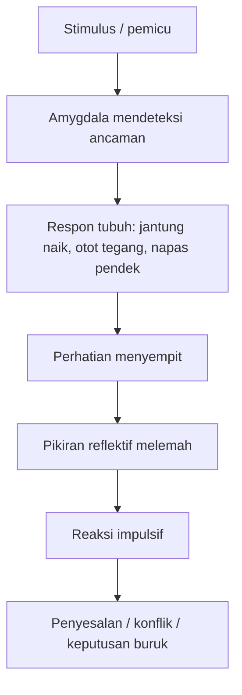
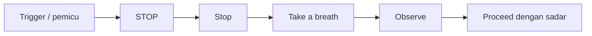
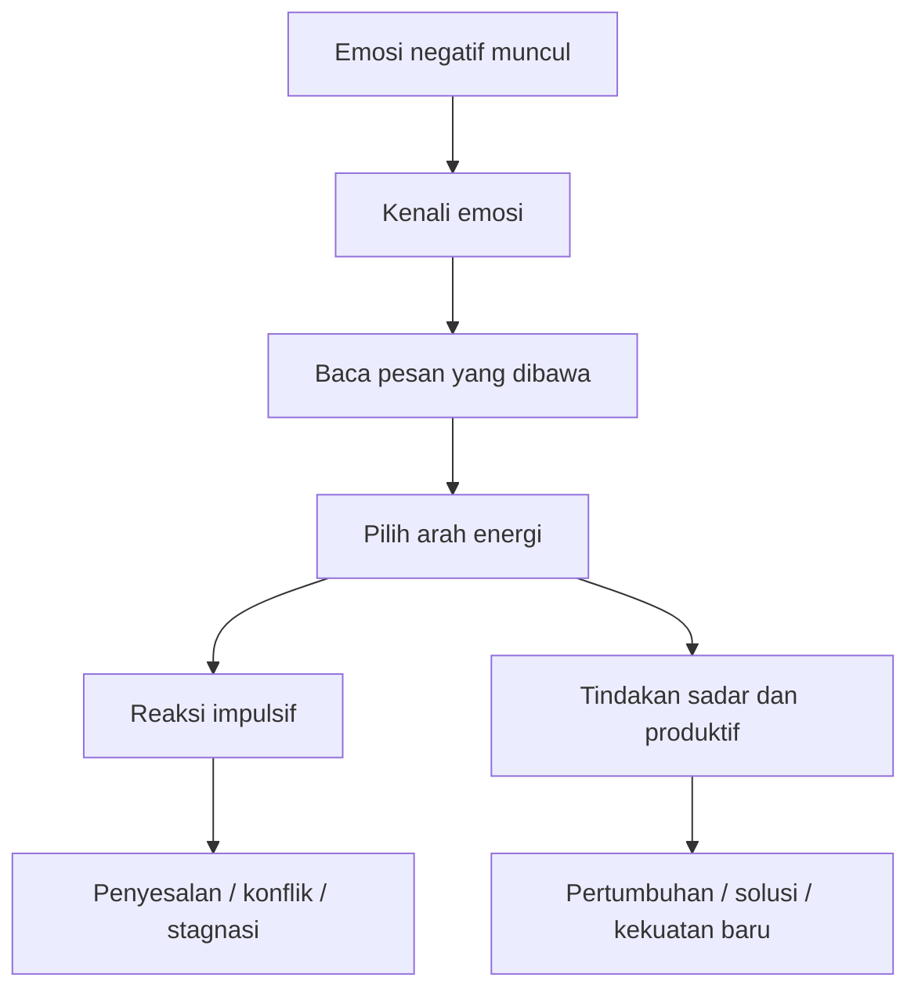

## 🧠 Pendahuluan: Bukan Semua yang Kita Rasakan Harus Langsung Diikuti

Salah satu pelajaran paling sulit dalam hidup adalah ini: **apa yang kita rasakan tidak selalu harus langsung menjadi apa yang kita lakukan**. Kedengarannya sederhana, tetapi justru di sanalah seluruh kualitas hidup sering ditentukan. Banyak masalah besar lahir bukan dari niat jahat, bukan dari kurangnya kecerdasan, bahkan bukan dari kurangnya pengetahuan. Banyak masalah lahir dari momen-momen kecil ketika seseorang tidak mampu memberi jarak antara dorongan emosi dan tindakan. 💥

Satu komentar memicu balasan tajam. Satu rasa malu memicu penarikan diri. Satu rasa takut memicu penghindaran. Satu rasa marah memicu keputusan yang menghanguskan relasi bertahun-tahun. Satu kecemasan memicu mundur dari peluang yang mungkin mengubah hidup.

Audiobook *The Power of Not Reacting: How to Control Your Emotions* dibangun di atas gagasan besar bahwa kekuatan manusia tidak terletak pada tidak punya emosi, tetapi pada kemampuan untuk **tidak langsung bereaksi secara otomatis**. Ini bukan ajakan menjadi dingin, mati rasa, atau kebal total. Dan di sinilah pentingnya membaca materi semacam ini secara matang. Sebab bila dibaca secara mentah, ia bisa terdengar seolah emosi adalah musuh yang harus dibunuh. Padahal itu tidak sehat. Emosi bukan musuh. Emosi adalah sinyal. Yang berbahaya adalah ketika sinyal itu langsung mengambil alih kemudi hidup kita. 🚦

Maka artikel ini akan mengolah isi audiobook tersebut menjadi uraian yang lebih seimbang, mendalam, dan praktis. Fokusnya bukan anti-emosi, melainkan **membangun kapasitas untuk merasakan emosi tanpa diperbudak olehnya**. Kita akan membahas:

- harga mahal dari reaktivitas emosional,
- cara kerja otak saat terpicu,
- empat level penguasaan emosi,
- metode STOP,
- teknik pengaturan emosi yang lebih maju,
- ketahanan emosional jangka panjang,
- peran emosi dalam relasi dan kepemimpinan,
- sampai bagaimana kendali emosi memberi efek majemuk (*compound effect* / efek berlipat) dalam hidup.

Tesis besarnya sederhana tetapi sangat kuat:

> **hidup tidak terutama rusak oleh emosi, tetapi oleh keputusan-keputusan yang dibuat ketika emosi mengambil alih tanpa kesadaran.**

Dan karena itu, kemampuan untuk tidak langsung bereaksi adalah salah satu bentuk kekuatan batin yang paling mahal nilainya. ✨

<Callout type="important" title="Titik tekan artikel ini">
Artikel ini tidak mengajarkan penekanan emosi secara kaku. Fokusnya adalah membangun ruang antara stimulus dan respons, agar manusia dapat memilih tindakan yang lebih selaras dengan nilai, tujuan jangka panjang, dan martabat dirinya.
</Callout>

---

## ⚠️ 1. Harga Mahal dari Emotional Reactivity: Kerusakan Besar Sering Dimulai dari Momen Kecil

Salah satu bagian terkuat dari audiobook ini adalah penegasan bahwa **emotional reactivity** atau *reaktivitas emosional* punya biaya yang jauh lebih mahal daripada yang disadari banyak orang. Masalahnya, biaya itu sering tersembunyi. Ia tidak selalu muncul sebagai ledakan besar di satu hari. Kadang ia muncul sebagai akumulasi kecil yang terus menggerus kualitas hidup. ⚠️

Bayangkan beberapa contoh yang sangat umum:

- di rapat kerja, seseorang mengkritik ide kita dan kita membalas dengan nada defensif,
- di rumah, pasangan mengatakan sesuatu yang menyinggung dan kita membalas dengan kalimat yang sengaja melukai,
- ada email yang bikin kesal dan kita langsung merespons dalam keadaan panas,
- ada kecemasan sebelum presentasi dan kita memilih menghindar daripada bertumbuh,
- ada rasa kecewa terhadap satu hambatan lalu kita menyerah pada tujuan besar.

Semua ini terlihat seperti kejadian terpisah. Padahal bila dilihat lebih dalam, ada pola yang sama: **emosi sesaat mengambil alih pilihan jangka panjang**.

Di sinilah biaya reaktivitas menjadi besar. Satu ledakan emosi bisa:

- merusak reputasi profesional,
- mengikis kepercayaan dalam hubungan,
- membuat orang lain merasa tidak aman di sekitar kita,
- menanam benih penyesalan yang terus hidup di dalam diri,
- dan memperkuat kebiasaan mental bahwa dorongan sesaat lebih berkuasa daripada nilai hidup yang kita klaim penting.

Ini sangat penting untuk dipahami: tiap reaksi impulsif bukan hanya merusak situasi saat itu. Ia juga sedang **melatih otak** untuk mengulang pola yang sama di masa depan. Jadi setiap kali kita bereaksi tanpa sadar, kita bukan hanya gagal sekali. Kita sedang memperkuat sistem internal yang membuat kegagalan serupa lebih mungkin terjadi lagi. 🧠

---

## 🧬 2. Mengapa Otak Terasa Seolah Menjebak Kita? Karena Ia Dirancang untuk Bertahan, Bukan Selalu Bertindak Bijak

Audiobook ini menjelaskan peran **amygdala** — bagian otak yang berfungsi seperti sistem alarm. Secara populer ini sangat berguna untuk dipahami, walau tentu penjelasannya perlu dibaca sebagai penyederhanaan, bukan peta neurosains yang lengkap. Intinya benar: manusia punya sistem deteksi ancaman yang sangat cepat. Masalahnya, sistem ini lahir di dunia lama. Dunia saat ancaman fisik bisa datang tiba-tiba dan respons cepat menentukan hidup atau mati. 🧬

Di dunia modern, ancaman fisik itu jauh lebih jarang dibanding ancaman sosial atau psikologis:

- kritik,
- penolakan,
- rasa malu,
- konflik,
- evaluasi negatif,
- kehilangan status,
- atau ketidakpastian.

Namun tubuh sering merespons semuanya dengan pola yang mirip:

- jantung berdebar,
- napas memendek,
- otot menegang,
- perhatian menyempit,
- dan kemampuan berpikir kompleks menurun.

Inilah yang sering disebut **amygdala hijack** — *pembajakan oleh sistem alarm emosi*. Pada momen itu, bagian otak yang lebih reflektif dan strategis menjadi kurang dominan. Kita menjadi lebih cepat, tetapi tidak selalu lebih bijak.

Ini menjelaskan kenapa orang bisa berkata, “Saya nggak tahu kenapa saya bereaksi seperti itu.” Bukan karena ia tidak punya akal, tetapi karena pada momen itu sistem ancamannya bergerak lebih cepat daripada sistem refleksinya.

Diagram ini penting bukan untuk menakut-nakuti, tetapi untuk membuat kita lebih lembut sekaligus lebih bertanggung jawab terhadap diri sendiri. Kita jadi paham bahwa kehilangan kendali punya mekanisme. Dan karena ada mekanisme, ada pula cara melatih ulang respons tersebut.

---

## 🌊 3. Emosi Itu Nyata, tetapi Tidak Selalu Harus Dijadikan Kompas Tindakan

Audiobook ini dibuka dengan kalimat provokatif: “your emotions are not your friend.” Kalau dibaca mentah, kalimat ini terlalu ekstrem. Saya tidak setuju bila emosi dianggap musuh atau sesuatu yang harus didiskreditkan sepenuhnya. Emosi tetap punya fungsi penting:

- memberi sinyal,
- menunjukkan apa yang bernilai bagi kita,
- menandai ancaman,
- membantu koneksi dengan orang lain,
- dan memberi energi untuk bertindak.

Tetapi ada inti kebenaran yang perlu diambil dari provokasi itu: **emosi bukan selalu panduan tindakan yang dapat dipercaya secara langsung**. 🌊

Merasa marah tidak otomatis berarti kita harus melawan.  
Merasa takut tidak otomatis berarti kita harus mundur.  
Merasa malu tidak otomatis berarti kita memang tidak layak.  
Merasa cemas tidak otomatis berarti keadaan benar-benar berbahaya.

Jadi sikap yang sehat bukan:
- menolak emosi,
- atau menuhankan emosi,

melainkan:
- **mendengar emosi, memeriksanya, lalu memutuskan dengan sadar apa yang akan dilakukan.**

Ini adalah pergeseran yang sangat besar. Dari “saya merasa ini, maka saya harus bertindak begini” menjadi “saya merasa ini, tetapi saya akan memilih tindakan yang paling sesuai dengan nilai dan tujuan saya.”

---

## 🪜 4. Empat Level Penguasaan Emosi: Dari Reaktif Sampai Transformasional

Salah satu kerangka paling berguna dalam audiobook ini adalah pembagian **empat level emotional mastery** atau empat tingkat penguasaan emosi. Ini sangat membantu karena membuat kita sadar bahwa kendali emosi bukan saklar hitam-putih. Bukan sekadar “bisa” atau “tidak bisa”. Ada spektrum perkembangan. 🪜

### Level 1 — Unconscious Reactivity / reaktivitas tak sadar
Di level ini, seseorang langsung bertindak mengikuti emosi. Ia marah, lalu meledak. Ia cemas, lalu menghindar. Ia malu, lalu menutup diri. Ia bahkan tidak sadar ada ruang untuk memilih.

### Level 2 — Conscious Reactivity / reaktivitas sadar
Di level ini, orang mulai sadar bahwa ia sedang tersulut, tetapi tetap mengikuti dorongan itu. Ia tahu sedang marah, tahu balasan ini mungkin buruk, tetapi tetap mengirimkannya. Kesadaran ada, kendali belum cukup kuat.

### Level 3 — Conscious Response / respons sadar
Di level ini, emosi tetap dirasakan, tetapi tidak langsung memimpin tindakan. Orang bisa marah tetapi memilih bicara tenang. Bisa cemas tetapi tetap maju. Bisa kecewa tetapi fokus pada langkah berikutnya.

### Level 4 — Emotional Alchemy / alkimia emosi
Di level tertinggi ini, seseorang tidak hanya menahan reaksi, tetapi mampu **mengubah energi emosi** menjadi sesuatu yang berguna. Marah diubah jadi ketegasan, takut diubah jadi persiapan, frustrasi diubah jadi bahan pemecahan masalah, malu diubah jadi dorongan belajar.

Kerangka ini sangat bagus karena menunjukkan bahwa tujuan kita bukan menjadi batu. Tujuannya adalah bertumbuh dari makhluk yang otomatis menjadi manusia yang mampu memilih.

---

## 🛑 5. Metode STOP: Intervensi Sederhana Saat Emosi Sedang Naik

Bagian yang sangat praktis dari audiobook ini adalah **STOP method**. Ini penting karena dalam situasi emosional tinggi, kita tidak bisa bergantung pada teori yang rumit. Kita butuh sesuatu yang sederhana, cepat, dan bisa dijalankan bahkan ketika pikiran jernih belum sepenuhnya kembali. 🛑

### S — Stop
Hentikan tindakan yang sedang berlangsung. Lepaskan tangan dari keyboard. Tutup mulut sejenak. Jangan kirim pesan. Jangan langsung membalas. Berhenti secara fisik.

### T — Take a breath
Tarik napas secara sadar. Bernapas teratur, lambat, dan lebih panjang pada hembusan membantu sistem saraf keluar dari mode ancaman.

### O — Observe
Amati apa yang sebenarnya sedang terjadi:
- emosi apa yang muncul,
- pikiran apa yang sedang aktif,
- sensasi tubuh apa yang terasa,
- fakta objektif apa yang benar-benar terjadi,
- dan asumsi apa yang sedang ditambahkan pikiran.

### P — Proceed
Lanjutkan dengan respons yang dipilih secara sadar, bukan otomatis. Kadang respons terbaik adalah bicara. Kadang diam dulu. Kadang bertanya. Kadang menunda. Kadang mundur dari situasi untuk sementara.

Yang membuat metode ini kuat adalah ia mengubah momen panas dari mode otomatis menjadi momen pilihan.

Metode ini sederhana, tetapi kekuatannya justru di situ. Dalam keadaan terpicu, kesederhanaan lebih berguna daripada teori yang terlalu canggih.

---

## 🔍 6. Observe: Memisahkan Fakta dari Cerita yang Diciptakan Pikiran

Langkah **observe** dalam metode STOP layak mendapat perhatian khusus, karena di sinilah banyak orang mulai benar-benar bertemu dengan sumber masalahnya. Sering kali kita marah bukan pada fakta murni, melainkan pada **cerita** yang pikiran kita bangun di sekitar fakta itu. 🔍

Misalnya:

- fakta: pesan saya belum dibalas,
- cerita: dia mengabaikan saya.

- fakta: atasan mengkritik ide saya,
- cerita: dia ingin mempermalukan saya.

- fakta: pasangan diam,
- cerita: dia sudah tidak peduli lagi.

Cerita-cerita ini bisa benar, tetapi bisa juga tidak. Masalahnya, pikiran sering memperlakukan cerita sebagai fakta. Dari sana emosi naik, lalu tindakan mengikuti.

Maka kemampuan untuk membedakan:

- **apa yang sungguh terjadi**, dan
- **apa tafsir otomatis saya**,

adalah keterampilan yang sangat penting.

Orang yang bisa melakukan ini tidak menjadi dingin. Ia justru menjadi lebih akurat. Dan akurasi adalah bentuk kasih sayang terhadap diri sendiri dan orang lain, karena banyak konflik lahir dari tafsir yang tidak pernah diuji.

---

## 🧠 7. Cognitive Reframing: Mengubah Makna, Mengubah Emosi, Mengubah Tindakan

Bagian lanjutan dari audiobook ini membahas **cognitive reframing** atau *membingkai ulang secara kognitif*. Ini salah satu teknik paling berguna untuk kehidupan nyata. Intinya sederhana: emosi kita sering dipengaruhi bukan hanya oleh kejadian, tetapi oleh makna yang kita berikan pada kejadian itu. 🧠

Kalau maknanya berubah, respons emosional juga bisa bergeser.

Contoh:

- presentasi yang tegang bisa dibingkai sebagai ancaman, atau sebagai kesempatan bertumbuh,
- kritik bisa dibingkai sebagai penghinaan, atau sebagai data untuk memperbaiki kualitas,
- penolakan bisa dibingkai sebagai bukti ketidaklayakan, atau sebagai proses penyaringan menuju tempat yang lebih pas.

Reframing bukan berarti membohongi diri atau berpikir positif secara dangkal. Ia berarti membuka kemungkinan tafsir lain yang lebih akurat, lebih berguna, atau lebih selaras dengan arah hidup yang ingin dibangun.

Ini penting karena banyak emosi yang menghancurkan lahir dari framing yang terlalu sempit, terlalu personal, atau terlalu katastrofik.

---

## 🏷️ 8. Emotional Labeling: Semakin Tepat Nama Emosi, Semakin Mudah Diatur

Audiobook ini juga menekankan **emotional labeling** atau penamaan emosi secara lebih presisi. Banyak orang hanya punya kosakata emosional yang sangat miskin:

- enak,
- nggak enak,
- marah,
- sedih,
- stres.

Padahal pengalaman batin manusia jauh lebih kaya dari itu. Dan justru semakin kita bisa memberi nama yang tepat, semakin besar peluang kita merespons dengan tepat. 🏷️

Misalnya:

- apakah saya benar-benar marah, atau sebenarnya terluka?
- apakah saya cemas, atau sebenarnya malu?
- apakah saya frustrasi, atau sebenarnya merasa kehilangan kendali?
- apakah saya kecewa, atau sebenarnya merasa tidak dihargai?

Penamaan yang tepat membantu otak berpindah dari kabut menjadi kejelasan. Dan kejelasan mengurangi dorongan bertindak membabi buta.

Ini sangat penting dalam relasi. Orang yang bisa bilang, “saya sebenarnya merasa diremehkan dan itu membuat saya defensif,” jauh lebih mungkin membangun percakapan sehat daripada orang yang hanya tahu meledak.

---

## 🫁 9. Somatic Regulation: Tubuh Bisa Menolong Pikiran Kembali Waras

Salah satu kekuatan besar audiobook ini adalah pengingat bahwa regulasi emosi tidak hanya terjadi di kepala. Ia juga terjadi lewat tubuh. **Somatic regulation** atau pengaturan berbasis tubuh sangat penting karena banyak reaksi emosional memang punya jejak fisik yang jelas. 🫁

Saat marah atau takut, tubuh sering lebih dulu berubah:

- napas jadi dangkal,
- dada sesak,
- rahang mengeras,
- bahu naik,
- tangan gelisah,
- fokus menguncup.

Kalau kita hanya mencoba “berpikir lebih baik” tanpa membantu tubuh keluar dari mode ancaman, sering kali itu sulit. Karena itu intervensi fisik seperti:

- napas lambat dan dalam,
- relaksasi otot progresif,
- bergerak sejenak,
- membasuh wajah dengan air dingin,
- atau sekadar berjalan pelan,

bisa membantu menurunkan intensitas reaksi dan membuka kembali akses pada pikiran yang lebih rasional.

Ini poin yang penting: **akal tidak bekerja di ruang hampa**. Tubuh adalah bagian dari proses berpikir yang jernih.

---

## ⏳ 10. Timeline Reframing: Tidak Semua yang Berat Hari Ini Akan Tetap Berat Selamanya

Salah satu teknik yang sangat berguna dan sering diremehkan adalah **timeline reframing**. Saat emosi tinggi, pikiran cenderung memperbesar keadaan seolah situasi saat ini akan menentukan segalanya untuk selamanya. Kita menjadi sempit secara waktu. ⏳

Padahal banyak hal yang terasa seperti kiamat hari ini, beberapa minggu atau bulan kemudian tampak jauh lebih kecil.

Karena itu, bertanya:

- bagaimana saya akan melihat ini satu minggu lagi?
- satu bulan lagi?
- satu tahun lagi?
- apa nasihat dari versi diri saya lima tahun ke depan?

bisa sangat menurunkan tekanan emosional dan membantu menempatkan masalah pada skala yang lebih realistis.

Ini bukan meremehkan rasa sakit hari ini. Ini mengembalikan perspektif. Dan perspektif adalah salah satu obat terbaik untuk kepanikan.

---

## 🔋 11. Energy Management: Kendali Emosi Bukan Sumber Daya Tak Terbatas

Audiobook ini juga mengingatkan hal yang sangat realistis: kemampuan mengatur emosi punya kaitan erat dengan **energi**. Kita bukan mesin tanpa batas. Saat lelah, lapar, kurang tidur, stres kronis, atau terlalu banyak beban, kemampuan untuk tetap tenang turun. 🔋

Maka penguasaan emosi tidak bisa dipisahkan dari hal-hal yang sangat mendasar:

- tidur cukup,
- nutrisi yang baik,
- gerak tubuh,
- ritme kerja yang wajar,
- ruang pemulihan,
- dan batasan terhadap overstimulasi.

Ini penting karena banyak orang merasa dirinya “kurang dewasa secara emosional”, padahal sebagian masalahnya sangat biologis: tubuhnya kelelahan, sistem sarafnya jenuh, dan pikirannya tidak punya cadangan energi untuk menahan impuls.

Dengan kata lain, self-control sering bukan hanya masalah moral, tetapi juga masalah pemeliharaan sistem diri.

---

## 🧱 12. Emotional Resilience: Ketahanan Tidak Dibangun Saat Krisis, tetapi Sebelumnya

Salah satu pelajaran penting dari audiobook ini adalah bahwa **emotional resilience** atau ketahanan emosional tidak dibangun di tengah badai, melainkan sebelum badai datang. Ini benar sekali. 🧱

Banyak orang baru belajar mengatur emosi ketika hidupnya sudah keburu kacau. Padahal seperti kebugaran fisik, ketahanan batin dibangun lewat latihan yang konsisten di masa tenang.

Audiobook ini menekankan beberapa fondasi:

- tidur yang baik,
- nutrisi yang stabil,
- olahraga,
- fleksibilitas kognitif,
- makna hidup,
- relasi yang sehat,
- paparan terhadap stres yang terukur,
- dan pemulihan yang cukup.

Ini mungkin terdengar membosankan dibanding janji-janji “hack emosi instan”. Tetapi justru karena ini fundamental, dampaknya besar. Orang yang sistem dasarnya kuat akan jauh lebih mampu menghadapi konflik, tekanan, dan ketidakpastian tanpa runtuh.

---

## 🌱 13. Negative Emotions Bukan Sampah, tetapi Energi yang Bisa Diolah

Bagian yang sangat menarik dari audiobook ini adalah ide **transforming negative emotions into fuel** — mengubah emosi negatif menjadi bahan bakar. Gagasan ini perlu dibaca dengan hati-hati, tetapi sangat berguna. 🌱

Emosi negatif seperti marah, takut, kecewa, frustrasi, atau malu memang menyakitkan. Tetapi mereka juga membawa:

- energi,
- fokus,
- informasi,
- dan kadang petunjuk yang sangat penting.

### Marah
Bisa menjadi sinyal bahwa ada nilai atau batas yang sedang dilanggar.

### Takut
Bisa menandai area yang penting dan menuntut persiapan lebih baik.

### Kecewa
Bisa menunjukkan apa yang sungguh kita harapkan atau hargai.

### Frustrasi
Bisa memberitahu bahwa strategi lama tidak lagi cukup.

### Malu atau bersalah
Bisa memberi sinyal adanya ketidakselarasan antara tindakan dan nilai diri.

Yang merusak bukan emosi itu sendiri, tetapi saat energinya dibuang dalam:

- ledakan,
- penghindaran,
- menyalahkan,
- menyerah,
- atau kebencian yang dipelihara.

Sedangkan yang membangun adalah saat energinya diolah menjadi:

- tindakan korektif,
- latihan lebih serius,
- komunikasi yang lebih jujur,
- persiapan yang lebih baik,
- atau komitmen yang lebih matang.

---

## 🏛️ 14. Confidence yang Sejati Datang dari Bukti Bahwa Kita Bisa Menangani Diri Sendiri

Audiobook ini punya bagian sangat kuat tentang **confidence** atau kepercayaan diri. Dan poinnya sangat tepat: kepercayaan diri sejati bukan rasa “saya hebat”, melainkan keyakinan bahwa **saya mampu menangani apa pun yang datang dengan cukup baik**. 🏛️

Ini bentuk confidence yang jauh lebih stabil daripada sekadar rasa “saya pasti berhasil”. Sebab hidup tidak menjamin keberhasilan total. Tetapi hidup bisa menjadi jauh lebih tenang bila kita tahu bahwa sekalipun gagal, kita tidak akan hancur begitu saja.

Kepercayaan diri semacam ini dibangun dari beberapa hal:

- emotional self-reliance — kemandirian emosi,
- competence — kompetensi nyata,
- integrity alignment — keselarasan nilai, kata, dan tindakan,
- resilience — rekam jejak bangkit,
- future orientation — hidup dari identitas yang sedang dibangun,
- contribution focus — fokus memberi nilai,
- dan evidence awareness — sadar atas kemajuan nyata yang telah dicapai.

Jadi confidence bukan mantra kosong. Ia adalah hasil dari pengalaman bahwa kita bisa menghadapi tekanan tanpa kehilangan diri.

---

## ❤️ 15. Strategic Non-Reaction dalam Relasi: Memilih Koneksi, Bukan Sekadar Menang

Salah satu bagian paling penting dari audiobook ini adalah pembahasan tentang **non-reaction in relationships**. Dan ini sangat relevan, karena justru di relasi paling dekatlah kita sering paling reaktif. Dengan orang asing kita masih bisa menahan diri. Dengan orang terdekat, pertahanan itu sering runtuh. ❤️

Di sini muncul prinsip penting:

> dalam banyak konflik relasi, kita sedang memilih antara **koneksi** dan **kontrol**.

Saat kita terpancing, sering kali kita lebih ingin:

- membuktikan diri benar,
- menunjukkan bahwa dia salah,
- memenangkan momen,
- atau memulihkan ego,

ketimbang menjaga kualitas hubungan.

Non-reaction yang strategis dalam relasi bukan berarti diam terus atau jadi keset. Bukan itu. Ini berarti:

- tidak langsung menaikkan eskalasi,
- tidak memperlakukan pasangan/teman/anak sebagai musuh,
- tidak mengglobalisasi satu perilaku menjadi identitas total orang itu,
- dan tidak menambah panas ketika yang dibutuhkan justru pendinginan.

Kemampuan ini sangat langka. Tetapi ketika dimiliki, ia mengubah kualitas rumah, pertemanan, tim kerja, dan kepercayaan jangka panjang.

---

## 🤝 16. Dalam Kepemimpinan, Emosi Kita Menular Lebih Cepat daripada Instruksi Kita

Bagian tentang **emotional leadership** juga sangat penting. Pemimpin sering mengira pengaruh utamanya datang dari kecerdasan, posisi, atau instruksi. Padahal dalam praktik, pengaruh besar justru datang dari kondisi emosi yang ia pancarkan. 🤝

Kalau pemimpin:

- mudah panik,
- cepat tersinggung,
- mempermalukan orang,
- reaktif saat ada kesalahan,

maka budaya tim akan menjadi:

- penuh rasa takut,
- defensif,
- menutup-nutupi masalah,
- dan miskin kejujuran.

Sebaliknya, jika pemimpin:

- tenang saat ada masalah,
- jelas saat memberi arah,
- tegas tanpa meledak-ledak,
- dan mampu menjaga *psychological safety* atau rasa aman psikologis,

maka orang lain juga lebih mungkin tetap waras, berani berpikir, dan berani jujur.

Ini penting: pemimpin tidak hanya mengelola tugas. Ia mengatur suhu emosional sistem di sekitarnya.

---

## 🛠️ 17. Personal Emotional Operating System: Kendali Emosi Harus Dibangun sebagai Sistem, Bukan Niat Sesaat

Salah satu gagasan paling praktis dari audiobook ini adalah perlunya membangun **personal emotional operating system** — semacam sistem operasi emosi pribadi. Gagasan ini sangat bagus, karena mengingatkan bahwa penguasaan emosi tidak bisa bergantung pada niat spontan setiap kali masalah muncul. Ia harus menjadi sistem. 🛠️

Sistem itu bisa berisi:

- rutinitas harian untuk menjaga baseline mental,
- desain lingkungan yang tidak terus memancing stres,
- daftar pemicu emosional pribadi,
- protokol saat trigger muncul,
- ritual pemulihan setelah hari berat,
- dan evaluasi berkala terhadap pola emosional kita.

Contohnya:

- tahu bahwa saya paling mudah meledak saat lapar dan lelah,
- tahu bahwa saya perlu jeda sebelum membalas pesan penting,
- tahu bahwa setelah konflik saya perlu berjalan dan menulis dulu,
- tahu bahwa media tertentu membuat sistem saraf saya tegang,
- tahu bahwa beberapa orang selalu menguras regulasi emosi saya sehingga perlu batas yang jelas.

Semua ini membuat emotional mastery lebih realistis, karena ia ditopang sistem, bukan heroisme sesaat.

---

## 🚀 18. High-Stakes Situations: Di Saat Genting, Proses Lebih Penting daripada Drama Batin

Audiobook ini juga menyoroti situasi bertekanan tinggi: krisis, negosiasi, presentasi penting, konflik sulit, evaluasi besar. Dalam momen seperti ini, orang sering merasa bahwa tekanan datang dari luar. Padahal sebagian besar tekanan dibentuk oleh narasi internal tentang apa arti situasi itu. 🚀

Kalau situasi dibingkai sebagai:

- “kalau saya gagal, habis hidup saya,”
- “semua orang sedang menilai saya,”
- “ini harus sempurna,”

maka tekanan makin besar. Tetapi bila dibingkai sebagai:

- “ini serius, tapi saya bisa menanganinya langkah demi langkah,”
- “saya fokus pada proses, bukan drama,”
- “saya tidak harus sempurna, saya harus hadir dengan baik,”

maka sistem saraf lebih mungkin tetap cukup stabil untuk berpikir.

Salah satu pelajaran terpenting di sini adalah **process focus**. Saat tekanan tinggi, fokus pada proses lebih menolong daripada obsesi pada hasil. Kita tidak bisa sepenuhnya mengendalikan hasil, tetapi kita bisa mengendalikan:

- napas,
- persiapan,
- urutan langkah,
- kualitas perhatian,
- dan cara kita hadir.

---

## 🧮 19. Compound Effect: Satu Respons Baik Mungkin Kecil, tetapi Seribu Respons Baik Mengubah Hidup

Bagian penutup audiobook ini sangat kuat saat membahas **compound effect**. Ini ide yang sangat penting: kendali emosi bekerja seperti bunga majemuk. Satu keputusan untuk tetap tenang mungkin terlihat kecil. Tetapi bila dikumpulkan terus-menerus, dampaknya luar biasa. 🧮

Setiap kali kita memilih respons sadar daripada reaksi impulsif, ada efek jangka panjang:

- relasi jadi lebih aman,
- reputasi makin stabil,
- keputusan makin berkualitas,
- kepercayaan diri makin nyata,
- stres kronis menurun,
- peluang bertambah,
- dan rasa damai batin menguat.

Sebaliknya, reaktivitas juga punya efek majemuk:

- satu ledakan memicu jarak,
- satu email emosional memicu reputasi buruk,
- satu penghindaran memicu rasa takut yang lebih besar,
- satu keputusan impulsif memicu masalah turunan.

Jadi, yang sedang kita bangun sebenarnya bukan hanya “hari ini saya berhasil menahan diri”. Yang sedang dibangun adalah arsitektur hidup. Sedikit demi sedikit.

---

## ✨ 20. Kesimpulan: Kekuatan Sejati Ada pada Jeda antara Rasa dan Tindakan

Kalau seluruh isi audiobook ini diringkas ke inti terdalamnya, saya kira pesannya adalah ini: **kekuatan manusia bukan terletak pada tidak punya emosi, tetapi pada kemampuan untuk tidak menyerahkan kemudi hidup sepenuhnya kepada emosi yang datang sesaat.** ✨

Ini perubahan besar. Dari hidup yang otomatis menjadi hidup yang sadar. Dari “saya merasa ini maka saya harus bertindak” menjadi “saya merasa ini, saya menghormati sinyalnya, tetapi saya akan memilih tindakan yang lebih selaras dengan siapa saya ingin menjadi.”

Di situlah kebebasan batin lahir.

Bukan kebebasan karena dunia jadi ringan. Bukan karena tidak ada pemicu. Bukan karena semua orang jadi menyenangkan. Tetapi karena di tengah semua itu, kita pelan-pelan menjadi orang yang:

- tidak mudah dipancing,
- tidak cepat hanyut,
- tidak murah menyerahkan martabat pada impuls sesaat,
- dan tidak membiarkan momen panas menghancurkan arah hidup jangka panjang.

Emosi tetap ada. Tangis tetap ada. Marah tetap ada. Takut tetap ada. Tetapi kita tidak lagi harus menjadi budaknya.

Dan mungkin itulah arti paling dalam dari *the power of not reacting*: bukan menjadi dingin, tetapi menjadi cukup kuat untuk tetap manusiawi tanpa kehilangan kendali. 🌤️

---

## 🔖 Catatan Penutup

Artikel ini diolah dari transkrip audiobook *The Power of Not Reacting: How to Control Your Emotions* dan ditulis ulang dalam bentuk esai reflektif-praktis agar relevan untuk pembaca Indonesia yang ingin membangun regulasi emosi, ketahanan mental, dan kejernihan respons di tengah tekanan hidup modern.

## 📚 Sumber Dasar

- Transkrip audiobook: *The Power of Not Reacting: How to Control Your Emotions*
- Sumber video: YouTube (`https://www.youtube.com/watch?v=GPVPFp2AHrY`)
