## 📖 Pendahuluan: Novel Terakhir dari Legenda Terbesar

*The Valley of Fear* (*Lembah Ketakutan*) adalah novel keempat dan terakhir Sherlock Holmes yang ditulis oleh **Sir Arthur Conan Doyle**, pertama kali diterbitkan secara bersambung di majalah *The Strand* pada tahun 1914–1915. Bersama *A Study in Scarlet* (Kajian dalam Warna Merah), *The Sign of Four* (Tanda Empat), dan *The Hound of the Baskervilles* (Anjing Baskerville), novel ini menutup tetralogi panjang perjalanan Holmes dan Watson.

Yang membuat *The Valley of Fear* istimewa adalah **strukturnya yang tidak biasa** — novel ini terbagi dalam dua bagian yang sepenuhnya berbeda dalam setting, waktu, dan sudut pandang, namun saling terhubung secara mendalam dalam tema dan karakter. Bagian pertama (*The Tragedy of Birlstone* — Tragedi Birlstone) adalah misteri klasik di pedesaan Inggris abad ke-19. Bagian kedua (*The Scowrers* — Para Penghasut) adalah thriller gelap di tambang batu bara Amerika yang kasar dan keras.

Artikel ini berfokus pada **Bagian Pertama** — tujuh bab yang membawa kita dari sandi rahasia di Baker Street hingga pengungkapan identitas yang mengejutkan di balik moat (*parit*) bersejarah Birlstone Manor. 🏰

---

## 🕵️ Struktur Cerita: Dua Dunia dalam Satu Novel

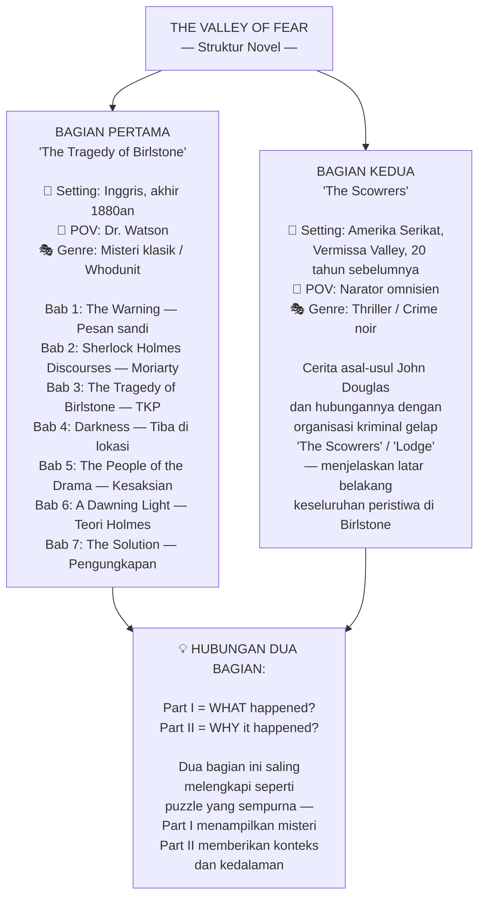

Struktur dua-bagian ini adalah inovasi naratif (*narrative innovation* — inovasi dalam cara bercerita) yang berani. Conan Doyle sebelumnya melakukan hal serupa dalam *A Study in Scarlet*, di mana bagian kedua mundur ke Amerika dan Utah untuk menjelaskan latar belakang villain-nya. Namun dalam *The Valley of Fear*, teknik ini jauh lebih halus dan efektif secara emosional.

---

## 🔐 Bab 1 — The Warning: Sandi Rahasia dan Bayangan Moriarty

### Pesan Sandi yang Misterius

Cerita dimulai dengan suasana yang familiar namun segera menegangkan. Kita bertemu Holmes dan Watson di Baker Street, di mana Holmes sedang merenungi selembar kertas yang baru tiba. Ini adalah **surat dari Porlock** — seorang informan misterius yang menggunakan nama samaran (*pseudonym* — nama palsu yang digunakan untuk menyembunyikan identitas asli).

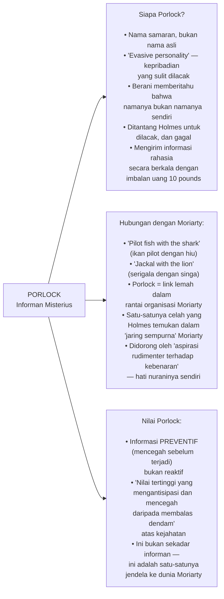

Surat Porlock berisi dua hal yang dikirim terpisah (sebagai ukuran keamanan): **pesan sandi** dan **kunci untuk membacanya**. Namun surat kedua — yang seharusnya berisi kunci — berisi pengakuan mengejutkan:

> *"Saya tidak akan melanjutkan urusan ini. Terlalu berbahaya. Ia mencurigai saya. Saya bisa melihat bahwa ia mencurigai saya..."*

Sang informan ditandatangani sebagai "Fred Porlock" — nama yang jelas juga merupakan nama samaran, tapi setidaknya lebih personal dari sebelumnya. Tulisannya pun berubah drastis: **jelas dan mantap sebelum kunjungan tak terduga Moriarty, menjadi hampir tak terbaca setelahnya**. Detail kecil ini adalah contoh sempurna observasi Holmes yang menjadikan cerita Conan Doyle begitu memuaskan.

### Deduksi Sandi Tanpa Kunci

Bagian paling menarik dari bab pertama adalah **cara Holmes mendekati sandi yang tampaknya mustahil dipecahkan** tanpa kunci. Ini adalah demonstrasi murni dari *pure reason* (*penalaran murni*) — cara berpikir sistematis yang bisa mempersempit kemungkinan dari tak terhingga menjadi satu jawaban.

```mermaid
graph TD
    A["PROSES DEDUKSI HOLMES\nMemecahkan Sandi Tanpa Kunci"]
    
    A --> B["LANGKAH 1: Angka pertama = 534\n\n→ Kemungkinan besar nomor halaman\n→ Buku yang digunakan harus\n   memiliki minimal 534 halaman\n→ Kesimpulan: Buku TEBAL\n\nInformasi: Buku itu besar/tebal"]
    
    B --> C["LANGKAH 2: Tanda 'C2'\n\n→ Watson tebak: Chapter II (Bab 2)\n→ Holmes koreksi: TIDAK MUNGKIN\n   Kalau halaman 534 baru di bab 2,\n   bab pertamanya tidak mungkin\n   dibaca oleh manusia waras\n→ 'C' harus berarti COLUMN (kolom)\n→ Kesimpulan: Buku berkolom GANDA\n   (double column)\n\nInformasi: Format double-column"]
    
    C --> D["LANGKAH 3: Kata ke-293 ada\n\n→ Ini buku yang sangat PANJANG\n   per kolomnya\n→ Dikombinasikan dengan halaman\n   534 dan format double-column:\n   Buku ini SANGAT umum dan standar\n\nInformasi: Buku umum, standar"]
    
    D --> E["LANGKAH 4: Porlock tidak kirim buku\n\n→ Porlock BERENCANA kirim buku tapi gagal\n→ Ia YAKIN Holmes punya buku yang sama\n→ Buku yang Porlock yakin dimiliki Holmes:\n   BUKU YANG SANGAT UMUM DI INGGRIS\n\nInformasi: Buku yang semua orang punya"]
    
    E --> F["ELIMINASI:\n\nAlkitab? Tidak — terlalu banyak edisi,\nhalaman berbeda-beda per edisi\n\nKamus? Tidak — kosakata terbatas,\ntidak cocok untuk pesan kompleks\n\nBradshaw (jadwal kereta)? Tidak —\nkosakata 'saraf dan padat tapi terbatas'\n\nWhitaker's Almanac!\n→ Sangat umum di Inggris\n→ Double column\n→ 534+ halaman\n→ Dicetak standar (halaman sama setiap edisi)\n→ Kosakata cukup beragam di bagian belakang"]
```

**Komplikasi brilian**: Holmes mengambil Almanac edisi terbaru (tahun baru baru saja lewat, January 7) dan mencoba — gagal total: kata ke-13 adalah kata aneh yang tidak masuk akal dalam konteks pesan.

Kemudian menyadari: **mereka masih memakai almanac lama karena ini baru awal Januari**. Porlock pasti menggunakan almanac tahun lalu. Solusinya sederhana, elegan, dan terasa seperti kemenangan kecil yang menyenangkan.

Pesan yang terkuak:

> *"Bahaya. Mungkin datang sangat segera. Satu... Douglas... kaya... sekarang di Birlstone... rumah... Birlstone... keyakinan mendesak."*

Terjemahan lengkap: Ada bahaya yang mendesak bagi seseorang bernama **Douglas**, tinggal di **Birlstone**, yang kaya dan percaya diri bahwa ia aman.

---

## 🎭 Bab 2 — Sherlock Holmes Discourses: Anatomi Moriarty

Bab kedua tidak memajukan misteri Birlstone — melainkan **membangun kita pemahaman tentang musuh terbesar Holmes: Professor Moriarty**. Ini adalah salah satu penggambaran Moriarty terbaik dan paling lengkap dalam seluruh kanon Holmes.

### Moriarty: Napoleon Kejahatan

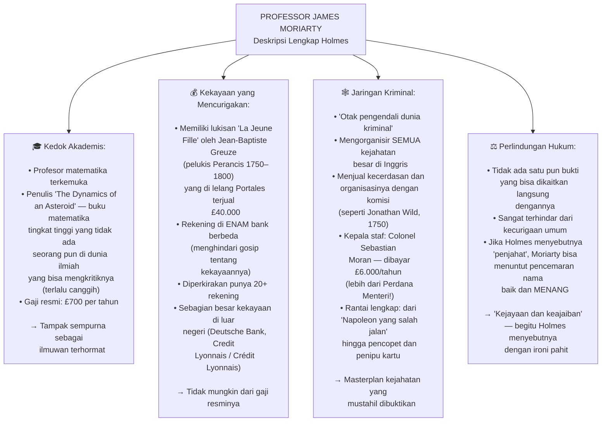

Salah satu momen paling kuat bab ini adalah ketika Inspektur MacDonald — seorang detektif Scotland Yard yang cerdas dan berpengalaman — mengakui bahwa ia sudah menemui Moriarty langsung dan merasa terkesan:

> *"Ia akan membuat menteri yang agung dengan wajah tipisnya, rambut abu-abu, dan cara berbicaranya yang sungguh-sungguh... Ketika ia meletakkan tangannya di bahu saya saat kami berpisah, rasanya seperti berkat seorang ayah sebelum kamu keluar ke dunia yang dingin dan kejam."*

Holmes *tertawa terbahak-bahak* saat mendengar ini — bukan dengan kegembiraan, tapi dengan apresiasi pahit atas betapa sempurnanya Moriarty dalam memakai topengnya. Kemudian Holmes mengajukan pertanyaan yang tepat:

> *"Pernahkah kamu memperhatikan lukisan di atas kepala profesor?"*

Dan dari lukisan £40.000 itu — yang tidak mungkin dimiliki oleh seorang profesor bergaji £700 — Holmes membangun argumen tentang **pendapatan ilegal Moriarty** dengan cara yang elegan dan tidak langsung namun tak terbantahkan.

### Jonathan Wild — Sejarah Berulang

Holmes mengutip **Jonathan Wild** (1682–1725), seorang kriminal nyata di London yang menjadi *"kekuatan tersembunyi di balik para kriminal London... yang menjual otaknya dan organisasinya dengan komisi 15 persen."*

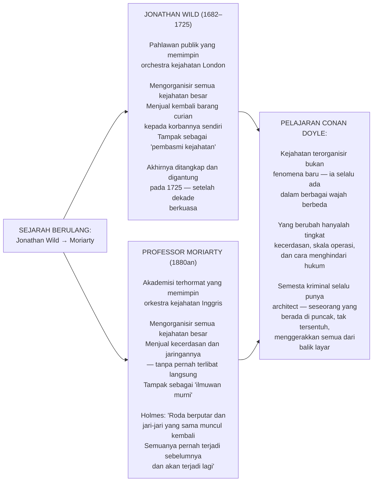

---

## 🏰 Bab 3 — The Tragedy of Birlstone: Setting yang Hidup

Bab ketiga adalah interlude (*jeda narasi*) yang sepenuhnya berfokus pada **deskripsi fisik Birlstone** sebelum Holmes dan Watson tiba. Watson mengambil alih narasi untuk menggambarkan tempat dan karakter-karakter yang terlibat — sebuah teknik yang memberi kita konteks yang lebih kaya daripada yang bisa diberikan melalui dialog saja.

### Birlstone Manor: Rumah dengan Moat

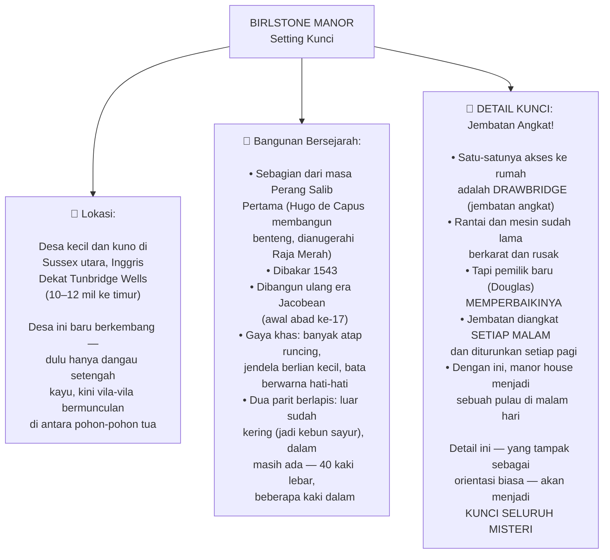

### Karakter-Karakter Kunci

**John Douglas** — tuan rumah yang ditemukan terbunuh:
- Sekitar 50 tahun, fisik kuat, mandibula (*rahang*) keras, kumis abu-abu
- Cheery (*ceria*) dan ramah, tapi agak kasar dalam tata krama
- Terlihat seperti seseorang dari lapisan sosial yang berbeda dari tetangga Sussex-nya
- Kekayaannya diklaim dari ladang emas California
- Pernah tinggal di Amerika — jelas dari cara bicaranya dan cara hidupnya
- **Tanda khusus**: cap segitiga dalam lingkaran di lengan bawahnya — seperti ternak yang diberi cap panas

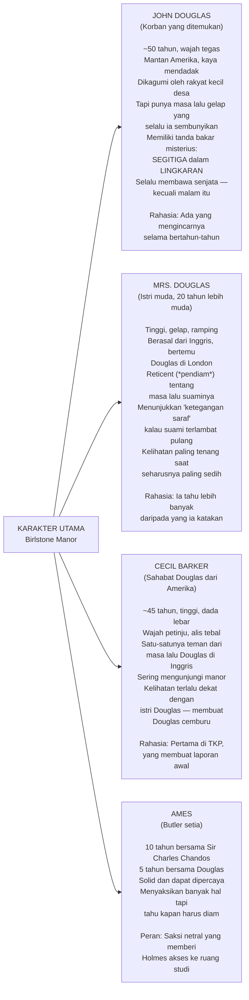

### Adegan TKP: Kematian yang Membingungkan

Ketika kepolisian tiba di Birlstone Manor tengah malam, mereka menemukan adegan yang penuh pertanyaan:

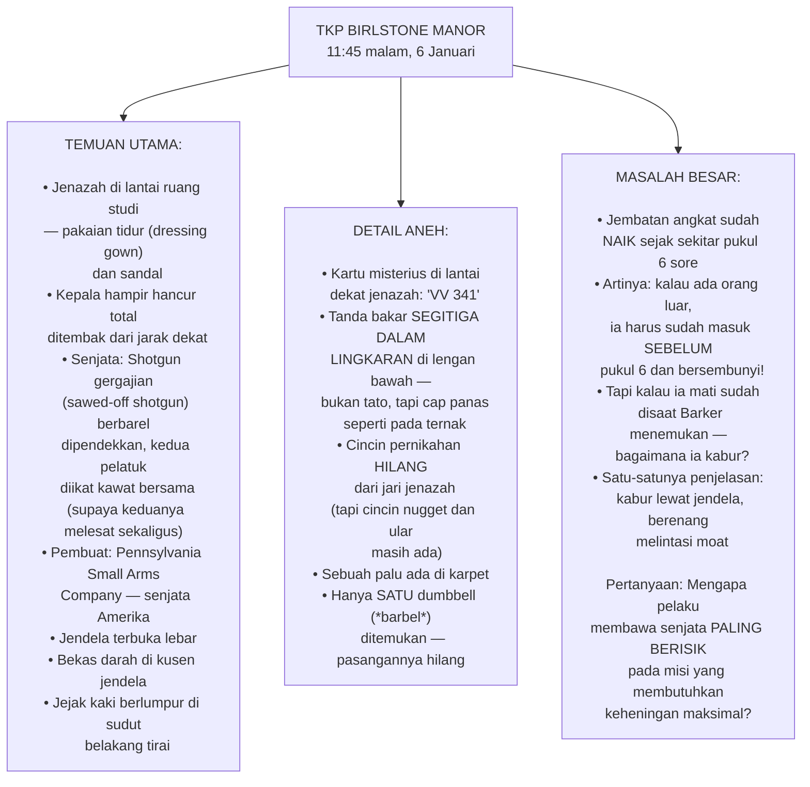

---

## 🔍 Bab 4 & 5 — Arriving at Birlstone: Detektif di Lapangan

Holmes, Watson, dan Inspektur MacDonald tiba di Birlstone keesokan harinya, disambut oleh **White Mason** — detektif lokal Sussex yang ternyata sangat kompeten dan rendah hati.

### Teori Awal White Mason

White Mason menyajikan rekonstruksi peristiwa yang logis:

1. Pembunuh masuk antara pukul 4:30–6:00 sore ketika jembatan masih turun dan ada tamu
2. Ia bersembunyi di balik tirai ruang studi
3. Ketika Douglas melakukan *nightly round* (ronde malam) sekitar pukul 11, pembunuh keluar
4. Terjadi konfrontasi singkat — Douglas mungkin sempat meraih palu tapi kalah
5. Pembunuh melarikan diri melalui jendela dan berenang menyebrangi moat
6. Kartu VV 341 dan cap segitiga menunjuk ke **organisasi rahasia** (*secret society*)

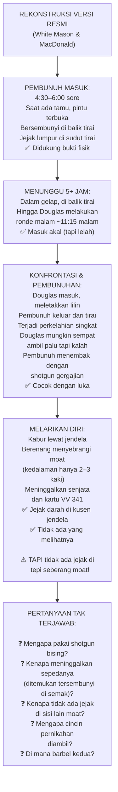

### Holmes Mengajukan Pertanyaan Yang Tepat

Sementara MacDonald dan White Mason puas dengan rekonstruksi mereka, Holmes diam-diam mengamati detail-detail kecil yang orang lain lewatkan:

**1. Barbel yang hilang** — Mengapa hanya ada satu barbel? Atlet tidak memakai satu barbel kecuali memang kehilangan yang satu.

**2. Sepatu Barker** — Holmes meminta melihat sandal *bedroom* yang Barker pakai malam itu. Solnya berlumuran darah. Tapi kenapa darahnya bukan hanya di bagian ujung kaki, melainkan di seluruh sol — termasuk bagian tengah dan tumit?

**3. Cahaya yang berubah** — Ketika Barker "pertama masuk" ke ruang studi, *hanya ada lilin*. Tapi ketika polisi tiba, *lampu minyak sudah menyala dan lilin sudah dimatikan*. Barker berdalih ia menyalakan lampu untuk cahaya lebih baik. Tapi mengapa ada waktu untuk itu jika ia langsung berteriak minta tolong?

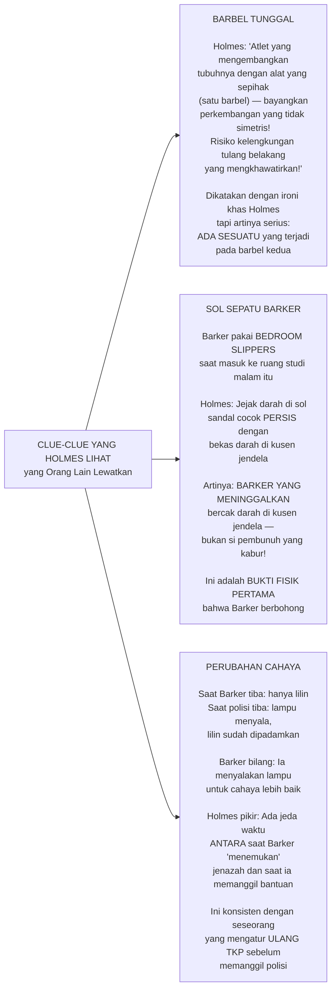

---

## 💡 Bab 6 — A Dawning Light: Holmes Membangun Teorinya

Ini adalah bab yang paling filosofis dan paling menunjukkan cara kerja pikiran Holmes. Setelah seharian mengumpulkan observasi, Holmes duduk bersama Watson di penginapan dan mulai **berpikir keras sambil bersuara** (*thinking aloud*).

### Kebohongan yang Besar

> *"Sebuah kebohongan, Watson. Kebohongan besar, besar, menonjol, tidak konsisten. Itulah yang kita temukan di ambang pintu. Di situlah titik awal kita."*

Holmes menyimpulkan bahwa **seluruh versi Barker adalah kebohongan** — dan karena kesaksian Mrs. Douglas mendukungnya, maka **mereka berdua berbohong bersama-sama**.

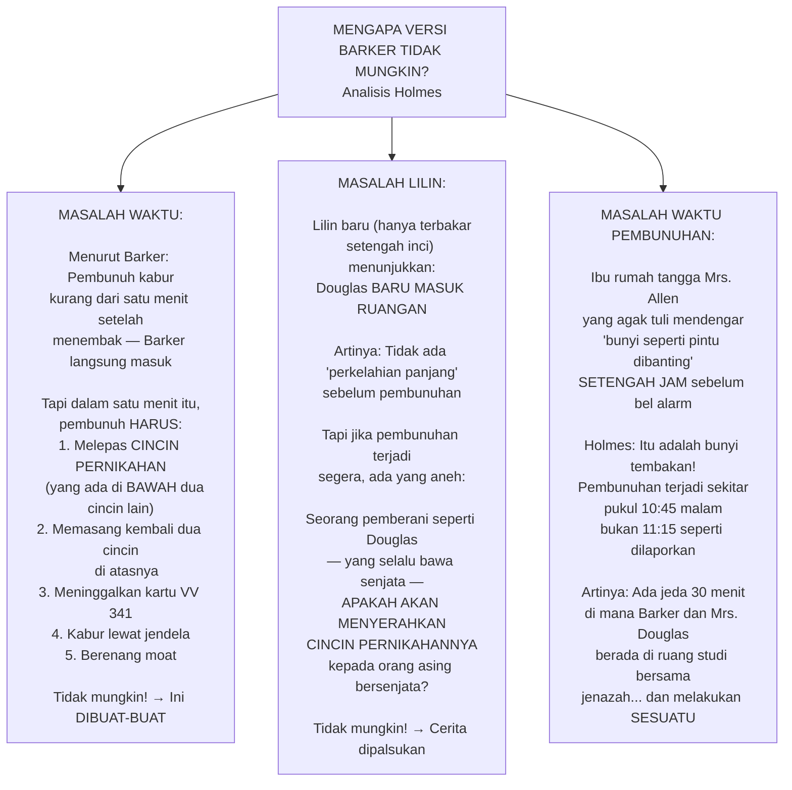

### Dua Skenario: Pelaku Dalam atau Luar?

Holmes menolak terburu-buru menyimpulkan. Ia menyajikan kepada Watson **dua kemungkinan** yang masing-masing punya kelemahan dan kekuatan:

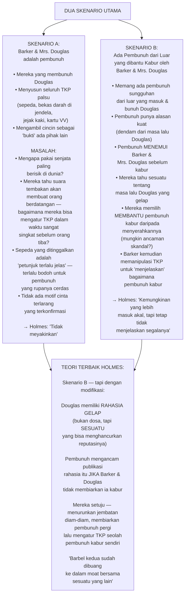

---

## 🎭 Bab 7 — The Solution: Pengungkapan yang Mengejutkan

Ini adalah bab paling dramatis dalam seluruh novel — dan salah satu twist (*pembalikan cerita*) terbaik dalam seluruh kanon Sherlock Holmes.

### Rencana Perangkap Holmes

Holmes mengumumkan bahwa ia akan "menguras moat (*parit*)." Tentu saja ini adalah bluff (*gertakan/tipu daya*) — ia tidak punya wewenang untuk itu. Tapi efeknya adalah:

**Siapapun yang menyembunyikan sesuatu di moat akan PANIK dan berusaha mengambilnya sebelum parit dikuras esok hari.**

Holmes kemudian mengatur penyergapan — meminta semua orang bersembunyi di balik semak-semak menghadap jendela ruang studi. Di kegelapan malam yang dingin, mereka menunggu.

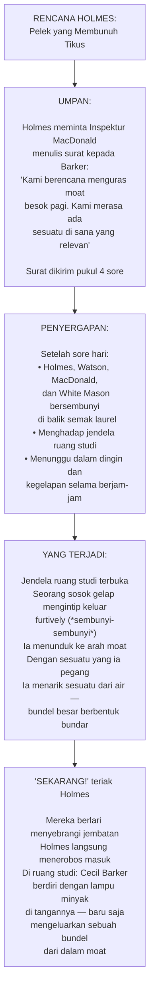

### Bundel yang Menjawab Segalanya

Isi bundel yang diangkat dari moat:

1. **Satu barbel** — pasangan dari yang ada di ruang studi
2. **Sepasang sepatu** — *"American, as you perceive"* kata Holmes, menunjuk ke ujung sepatu bergaya Amerika
3. **Pisau panjang** (*long deadly sheathed knife*)
4. **Satu set lengkap pakaian**: pakaian dalam, kaus kaki, jas wol abu-abu, mantel kuning pendek, dan topi lunak

Tetapi yang paling penting: di label mantel kuning itu tertulis — **"Neal, Outfitter, Vermissa, USA."**

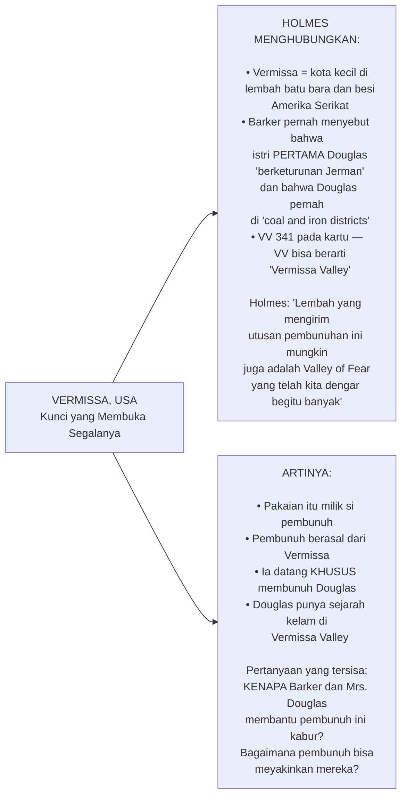

### Twist Terbesar: Douglas Masih Hidup!

Saat Barker sudah terpojok, saat semua tampak sudah jelas — Mrs. Douglas datang dari balik pintu setengah terbuka.

> *"Sudah cukup, Cecil. Apapun yang terjadi nanti, kamu sudah cukup berbuat."*

Holmes: *"Saya sangat berterima kasih kepada Anda, Nyonya, dan sangat mendesak Anda untuk mempercayakan diri sepenuhnya kepada hukum kita... Ada banyak yang belum dijelaskan, dan saya pikir paling baik jika Anda meminta Mr. Douglas untuk menceritakan kisahnya sendiri."*

**MRS. DOUGLAS TIDAK TERKEJUT.**

Dan kemudian — dari sudut ruangan, dari kegelapan yang dalam — **seorang pria muncul**.

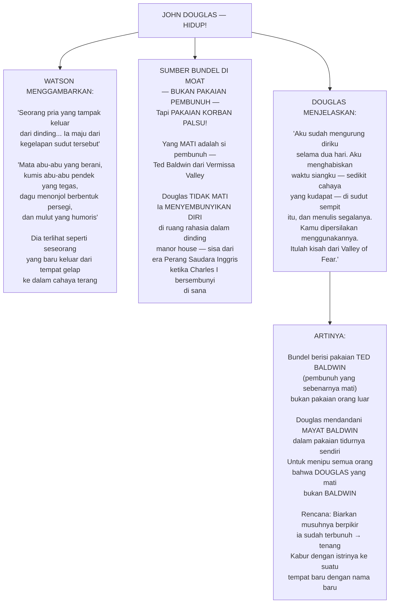

---

## 🧩 Rekonstruksi Peristiwa Sebenarnya

Sekarang kita bisa merekonstruksi apa yang **benar-benar terjadi** malam itu:

```mermaid
graph TD
    A["YANG SEBENARNYA TERJADI\n6 Januari, Birlstone Manor"]
    
    A --> B["~10:45 malam:\n\nDouglas memasuki ruang studi\nuntuk ronde malam\nIa 'merasakan bahaya' —\ninsting yang diasah selama\nbertahun-tahun diburu\nIa melihat ujung sepatu di\nbalik tirai jendela"]
    
    B --> C["KONFRONTASI:\n\nDouglas meletakkan lilin\ndi meja sebelum diserang\n(itulah mengapa lilin belum\nbanyak terbakar)\n\nTed Baldwin — musuh lama\ndari Vermissa Valley — melompat\nkeluar dengan pisau\nDouglas meraih palu dari rak\nIa memukul Baldwin, pisau jatuh\nBaldwin meraih shotgun dari mantel\nMereka bergulat\nKedua tangan di senjata\nSenapan meletus — dan Baldwin\nyang mati dengan dua peluru\ndi wajahnya"]
    
    C --> D["INSPEKSI SETELAH PERTEMPURAN:\n\nDouglas melihat tanda bakar\nyang sama di lengan Baldwin —\nmark dari 'The Lodge'\nOrganisasi yang mengejarnya\n\nTanda itu memberinya IDE CEMERLANG:\n'Sosok dengan tinggi, rambut,\ndan fisik yang mirip denganku'\n→ Siapa pun tidak bisa\n   mengenali wajah setelah\n   ditembak shotgun dari dekat"]
    
    D --> E["RENCANA DALAM HITUNGAN MENIT:\n\nDouglas memanggil Barker\nBarker memahami semuanya sekilas\nBersama mereka:\n1. Memasangkan pakaian tidur\n   (dressing gown) Douglas\n   pada mayat Baldwin\n2. Memasang cincin nugget dan\n   cincin ular di jari Baldwin\n3. Mencoba memasang cincin\n   pernikahan — TAPI TIDAK BISA\n   (terlalu ketat setelah bertahun-tahun)\n4. Membungkus semua pakaian Baldwin,\n   barbel sebagai pemberat,\n   memasukkan ke moat lewat jendela\n5. Barker membuat bekas darah\n   di kusen jendela (menggunakan\n   sandal berdarahnya)\n6. Memanggil Douglas:\n   bersembunyi di ruang rahasia\n7. Barker membunyikan bel alarm\n   30 menit setelah pembunuhan sebenarnya"]
    
    E --> F["SETELAHNYA:\n\nMrs. Douglas tidak melihat jenazah\n(Barker mencegahnya di tangga)\nMereka berbohong kepada polisi\n\nRencana Douglas:\nBiarkan dunia mengira ia mati\nKabur bersama istri ketika\nsituasi tenang\nMulai hidup baru dengan nama baru\ndan tenang dari ancaman 'The Lodge'"]
```

---

## 🗝️ Pesan Tersembunyi dari Conan Doyle

### 1. Tema Identitas dan Pelarian dari Masa Lalu

*The Valley of Fear* pada dasarnya adalah cerita tentang **seseorang yang tidak bisa lari dari siapa ia sebenarnya**. Douglas mengira dengan pindah ke Inggris, dengan membeli manor yang terisolasi, dengan mengangkat jembatan setiap malam — ia bisa memutus rantai masa lalunya.

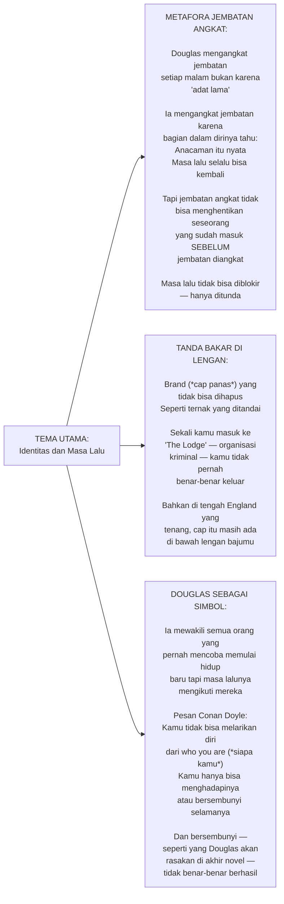

### 2. Tema Loyalitas dan Pengorbanan

Cecil Barker rela mengambil risiko dituduh sebagai pembunuh demi melindungi sahabatnya. Mrs. Douglas rela terlihat "tidak berduka" — bahkan tertangkap sedang tertawa di taman — demi menjalankan rencana suaminya.

> *"Ia terus bersamaku saat aku butuhkan. Aku berani berkata pada kalian: tidak ada seorang pun yang punya istri seloyal dan setia itu... tidak ada seorang pun yang punya teman lebih loyal dariku."*

### 3. Holmes dan Keadilan — Bukan Sekadar Hukum

Salah satu momen paling mengharukan adalah ketika Douglas bertanya langsung: *"Bagaimana posisi saya di bawah hukum Inggris?"*

Holmes menjawab dengan kelembutan yang tidak biasa:

> *"Hukum Inggris pada dasarnya adalah hukum yang adil. Kamu tidak akan mendapat lebih buruk dari apa yang kamu layak dapatkan, Mr. Douglas."*

Tapi kemudian Holmes menambahkan sesuatu yang lebih menakutkan:

> *"Tapi saya melihat masalah yang lebih besar di depan kamu, Mr. Douglas. Kamu mungkin menemukan bahaya yang lebih besar daripada hukum Inggris atau bahkan musuh-musuhmu dari Amerika. Saya melihat kesulitan di depanmu."*

Holmes sedang menyebut Moriarty. Dan ia benar.

---

## 📊 Analisis: Mengapa Novel Ini Berbeda dari Holmes Lainnya

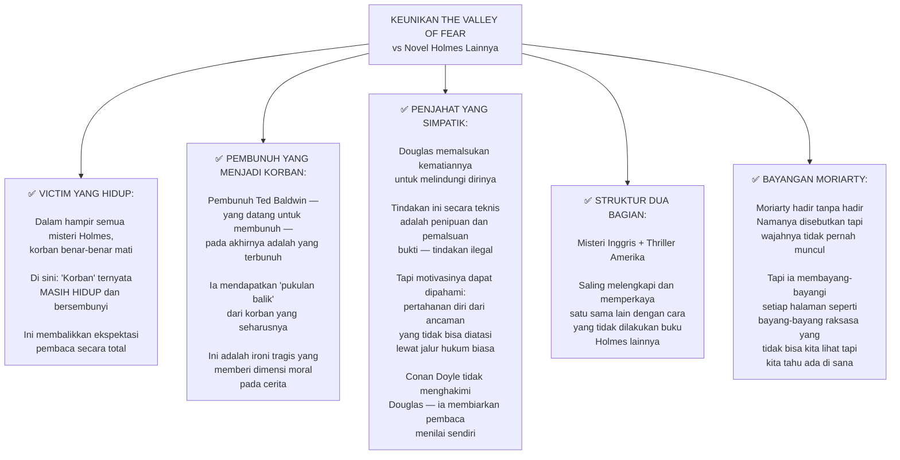

---

## 🎭 Holmes dan Watson: Dinamika yang Berkembang

*The Valley of Fear* menunjukkan **kematangan hubungan Holmes-Watson** yang menjadi salah satu daya tarik utama serial ini.

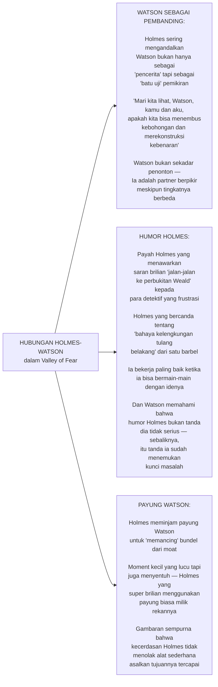

---

## 🔚 Kesimpulan: Lembah Ketakutan yang Abadi

*The Valley of Fear* adalah **puncak teknis penulisan misteri Conan Doyle** — sebuah novel yang membuktikan bahwa cerita Sherlock Holmes bukan hanya tentang deduksi brilliant, tapi tentang manusia yang kompleks, tentang pilihan moral yang sulit, dan tentang masa lalu yang selalu kita bawa kemana kita pergi.

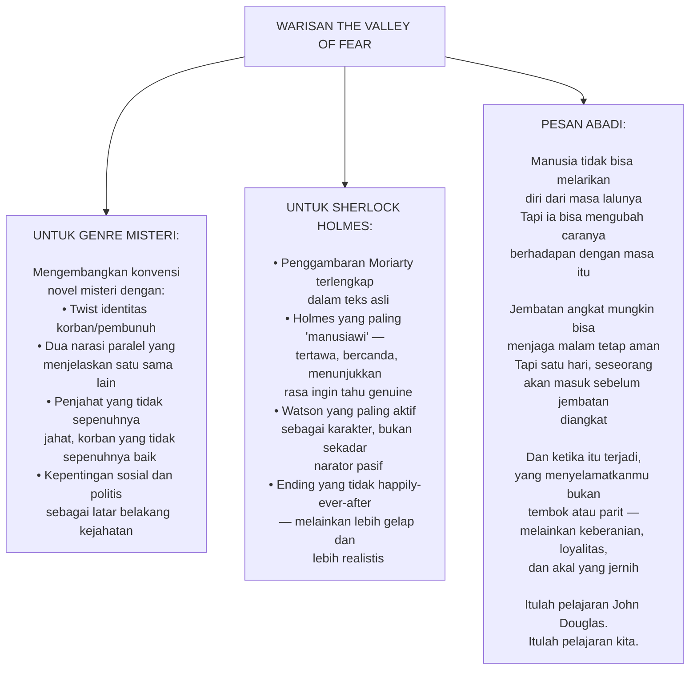

Kisah ini tidak berakhir di sini. Bagian kedua — **The Scowrers** — akan membawa kita ke Vermissa Valley, Amerika, 20 tahun sebelumnya, untuk memahami mengapa seorang pria rela menyeberangi Atlantik hanya untuk mencari dan membunuh seseorang yang telah membangun kehidupan baru di pedesaan Inggris yang tenang.

*"Saya meminta kamu untuk pergi jauh bersamaku untuk sementara dari manor house Sussex di Birlstone... dan jauh juga dari tahun anugerah di mana kita membuat perjalanan luar biasa kita yang berakhir dengan kisah aneh tentang pria yang dikenal sebagai John Douglas. Saya ingin kamu kembali sekitar 20 tahun dalam waktu dan ke barat beberapa ribu mil dalam ruang, sehingga saya dapat meletakkan di hadapanmu sebuah narasi yang luar biasa dan mengerikan."*

🎩🔍✨

---

## 📚 Glosarium Lengkap

| Istilah | Bahasa Asli | Makna |
|---|---|---|
| **Nom de plume** | Perancis | Nama pena / nama samaran yang digunakan seseorang untuk menyembunyikan identitas aslinya |
| **Cipher** | Inggris | Sandi / kode rahasia yang hanya bisa dibaca dengan kunci tertentu |
| **Pure reason** | Inggris | Penalaran murni — metode berpikir berdasarkan logika saja tanpa data empiris |
| **Double column** | Inggris | Format teks dengan dua kolom per halaman, umum pada buku-buku referensi besar |
| **Drawbridge** | Inggris | Jembatan angkat — jembatan yang bisa dinaikkan untuk memutus akses |
| **Moat** | Inggris | Parit berair yang mengelilingi bangunan bersejarah sebagai pertahanan |
| **Whodunit** | Inggris | Genre misteri di mana pembaca/tokoh harus mengidentifikasi siapa pelakunya |
| **In media res** | Latin | Teknik bercerita yang langsung masuk ke tengah peristiwa |
| **Sawed-off shotgun** | Inggris | Senapan berbarel dipendekkan — ilegal di banyak negara karena lebih mematikan dalam jarak dekat |
| **Red herring** | Inggris | Petunjuk palsu yang sengaja dimasukkan untuk menyesatkan investigasi |
| **Alibi** | Latin | Bukti bahwa seseorang berada di tempat lain saat kejahatan berlangsung |
| **Motive** | Inggris | Alasan/motivasi seseorang melakukan tindakan kriminal |
| **Furtively** | Inggris | Secara sembunyi-sembunyi, seolah tidak ingin terlihat |
| **Corroborate** | Inggris | Menguatkan/mendukung keterangan saksi lain dengan kesaksian yang konsisten |
| **Premeditated** | Inggris | Direncanakan terlebih dahulu sebelum dilakukan |
| **Pseudonym** | Yunani | Nama samaran / nama palsu |
| **Omniscient narrator** | Inggris | Narator serba tahu yang menceritakan peristiwa dari sudut pandang luar |
| **Inference** | Inggris | Kesimpulan logis yang ditarik dari bukti atau premis yang ada |
| **Vendetta** | Italia | Dendam kesumat yang berlanjut lintas waktu dan kadang lintas generasi |
| **Connivance** | Inggris | Pembiaran secara diam-diam terhadap tindakan yang seharusnya dilawan |
| **Fabricate** | Inggris | Memalsukan / menyusun sesuatu yang tidak nyata |
| **Drawback** | Inggris | Kelemahan / kerugian dari suatu rencana atau situasi |
| **Blackmail** | Inggris | Pemerasan dengan ancaman mengungkap informasi memalukan |
| **Bluff** | Inggris | Gertakan / pura-pura memiliki posisi lebih kuat dari kenyataan |
| **Jacobean** | Inggris | Berkaitan dengan era Raja James I Inggris (1603–1625), terkenal dengan arsitektur khasnya |
| **In media res** | Latin | Teknik bercerita yang dimulai dari tengah kejadian |
| **Scent** | Inggris | Dalam konteks investigasi: jejak yang bisa diikuti |
| **Dumbbell** | Inggris | Barbel — alat olahraga berbentuk besi dengan dua ujung bulat |
| **Peerage** | Inggris | Sistem gelar bangsawan di Inggris |
| **Inspector** | Inggris | Inspektur — pangkat polisi di atas detektif, di bawah superintendent |

---

*Sumber audiobook: [The Valley of Fear (Part One) by Sir Arthur Conan Doyle — YouTube](https://www.youtube.com/watch?v=TQe7t7eCQ8o)*

*The Valley of Fear pertama kali diterbitkan bersambung di The Strand Magazine, September 1914 – May 1915.*
