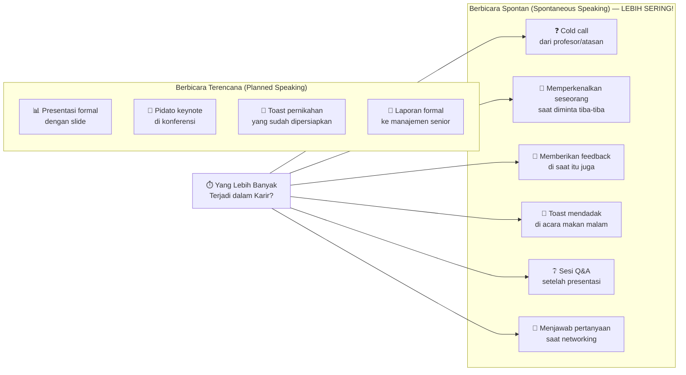
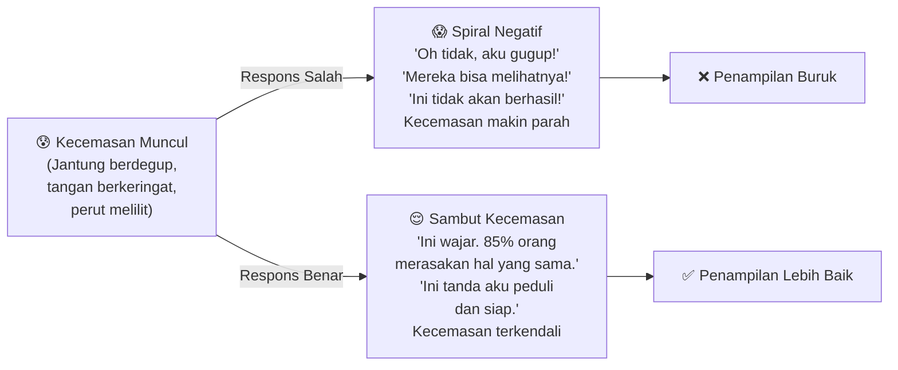
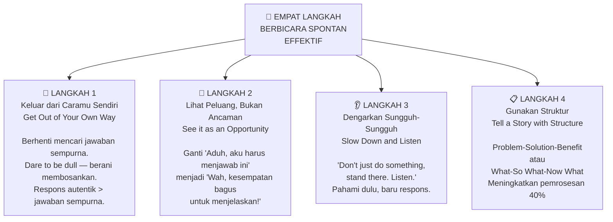
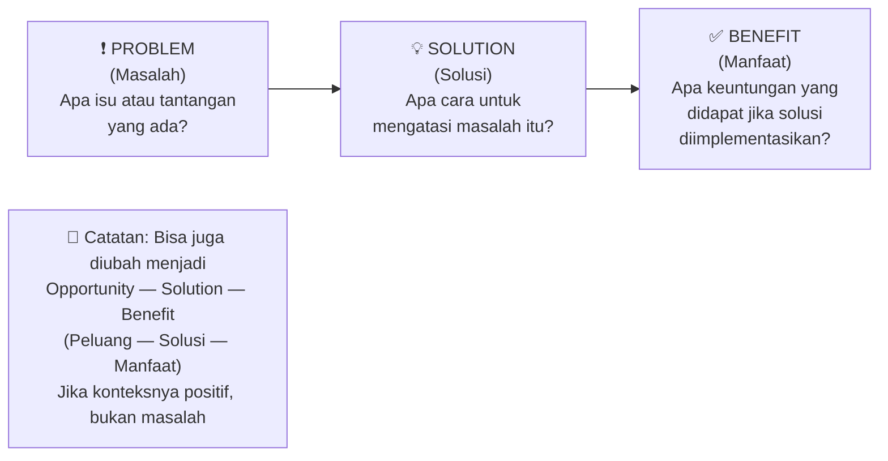
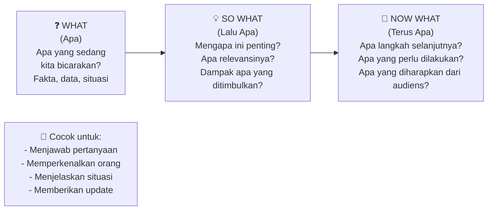
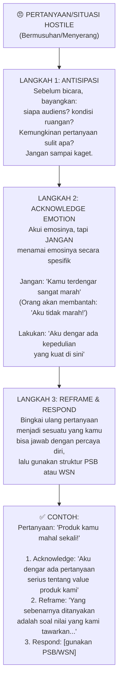
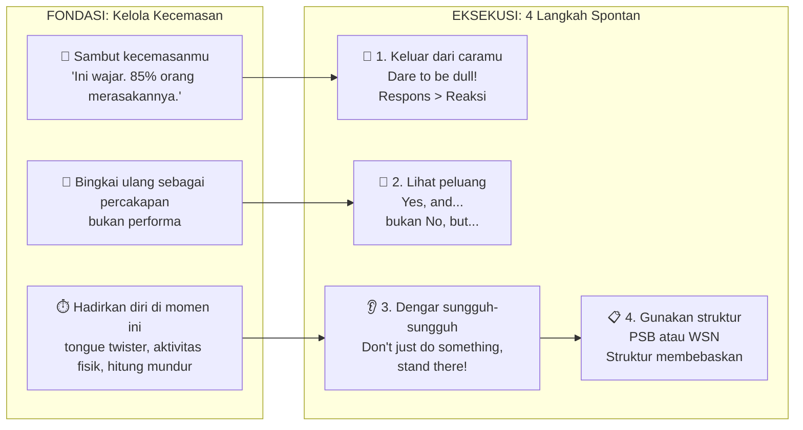

## 🎤 Pembuka: Ketika Kita Dipaksa Berbicara Tanpa Persiapan

Bayangkan situasi ini:

Kamu sedang dalam rapat besar. Tiba-tiba, manajer senior menoleh ke arahmu dan berkata: *"Kamu kan yang paling tahu soal ini — bisa jelaskan ke semua orang?"*

Atau kamu sedang di acara makan malam perusahaan, dan seseorang meminta kamu untuk **memperkenalkan rekan kerja yang baru saja mendapat penghargaan** — tanpa persiapan sebelumnya.

Atau dalam sesi tanya-jawab setelah presentasimu, seseorang mengajukan pertanyaan yang sama sekali tidak kamu antisipasi.

Di momen-momen seperti inilah, sebagian besar dari kita **membeku** 🥶 — pikiran berputar, kata-kata tersangkut, jantung berdegup kencang, dan kita mengeluarkan kalimat-kalimat yang tidak mencerminkan betapa cerdasnya kita sebenarnya.

Ini bukan masalah kecerdasan. Ini masalah **keterampilan yang tidak pernah diajarkan** — seni berbicara secara spontan (*spontaneous speaking*).

Dan kabar baiknya? Ini bisa dipelajari. Ini bisa dilatih. Dan **Matt Abrahams** dari **Stanford Graduate School of Business** (*Sekolah Bisnis Pascasarjana Stanford*) telah mendedikasikan kariernya untuk mengajarkan tepat itu.

---

## 📚 Bagian I: Mengapa Berbicara Spontan Lebih Penting dari Pidato Formal

### Dua Jenis Berbicara di Depan Umum

Ketika kita bicara soal *public speaking* (*berbicara di depan publik*), sebagian besar pikiran kita langsung terbang ke:

- 🎤 Pidato keynote di konferensi besar
- 📊 Presentasi formal dengan slide yang sudah dipersiapkan berhari-hari
- 🥂 Toast (*ucapan selamat*) pernikahan yang sudah dilatih berkali-kali

Ini adalah **berbicara terencana** (*planned speaking*) — kamu tahu jauh hari sebelumnya, kamu punya waktu untuk mempersiapkan, mungkin kamu bahkan membuat slide.

Tapi ada jenis berbicara lain yang jauh lebih sering kita temui dalam kehidupan sehari-hari:

**Berbicara Spontan** (*Spontaneous Speaking*) — ketika kamu diminta berbicara *off the cuff* (tanpa persiapan), dalam momen itu juga.

### Mengapa Spontan Lebih Menantang?

Dalam berbicara terencana, kamu hanya perlu menyampaikan apa yang sudah kamu siapkan. Dalam berbicara spontan, kamu harus melakukan **dua hal sekaligus secara bersamaan**:

1. 🧠 **Memikirkan APA yang akan kamu katakan** (konten)
2. 🗣️ **Memikirkan BAGAIMANA cara mengatakannya** (struktur dan penyampaian)

Tekanan ganda ini adalah yang membuat kebanyakan orang — bahkan orang-orang yang sangat cerdas — menjadi gugup dan tidak efektif dalam situasi spontan.

<Callout type="important" title="📊 Fakta yang Mengejutkan">
**85% orang** mengaku merasa gugup saat berbicara di depan umum.

Dan dalam survei Chapman University, berbicara di depan orang lain masuk dalam **5 ketakutan terbesar orang Amerika** — bersama dengan serangan teroris mendadak dan pencurian identitas.

Abrahams menambahkan: *"Dan 15% sisanya mungkin berbohong."*
</Callout>

---

## 😰 Bagian II: Mengelola Kecemasan — Bukan Menghilangkannya

### Mengapa Kecemasan Bukan Musuhmu

Satu kesalahan besar yang sering dilakukan banyak orang adalah **berusaha menghilangkan kecemasan sepenuhnya** sebelum berbicara. Ini bukan hanya tidak mungkin — ini juga tidak diinginkan.

Kecemasan, dalam dosis yang tepat, adalah **sekutu kita**:

- ⚡ Memberikan energi ekstra
- 🎯 Meningkatkan fokus dan ketajaman
- 🚨 Memberi sinyal bahwa apa yang sedang kita lakukan itu penting

Tujuannya bukan **menghilangkan** kecemasan, melainkan **mengelolanya** (*manage*, bukan *overcome*).

### Tiga Teknik Mengelola Kecemasan

**Teknik 1: 👋 Sambut Kecemasanmu (*Greet Your Anxiety*)**

Ketika gejala kecemasan mulai muncul — perut bergejolak, kaki gemetar, keringat dingin — jangan panik dan mulai berpikir negatif. Sebaliknya, secara sadar **akui kecemasanmu**:

> *"Ini aku merasa gugup. Aku akan melakukan sesuatu yang penting."*

Penelitian tentang **mindful attention** (*perhatian penuh*) menunjukkan bahwa sekadar mengakui dan memberi nama pada apa yang kita rasakan dapat **menghentikan spiral kecemasan** sebelum ia berputar keluar kendali. Ini tidak akan mengurangi kecemasannya, tapi mencegahnya mengembang menjadi kepanikan total.

**Teknik 2: 💬 Bingkai Ulang sebagai Percakapan (*Reframe as Conversation*)**

Masalah terbesar banyak pembicara adalah mereka melihat berbicara sebagai **performa** (*performance*) — seperti pertunjukan teater yang ada cara yang benar dan cara yang salah.

Dalam performa, jika kamu tidak menyanyikan nada yang tepat atau mengucapkan kalimat yang salah di waktu yang salah, itu adalah **kesalahan**. Ini menciptakan tekanan yang luar biasa.

Berbicara **bukan performa**. Tidak ada satu cara yang benar. Yang ada hanyalah cara yang lebih baik dan kurang baik.

Abrahams menyarankan kita untuk **melihat berbicara sebagai percakapan**:

*"Saat ini, aku sedang bercakap-cakap dengan 100+ orang — bukan tampil untuk mereka."*

Cara konkret untuk membuat ini terasa nyata:

| Strategi | Contoh |
|---|---|
| 🙋 **Gunakan pertanyaan** (*Questions*) | Pertanyaan secara alami bersifat dua arah — langsung melibatkan audiens |
| 🗓️ **Buat outline dengan pertanyaan** | Alih-alih poin-poin, tulis pertanyaan yang akan kamu jawab |
| 🤝 **Gunakan bahasa percakapan** (*Conversational language*) | Ganti "seseorang harus mempertimbangkan..." dengan "kita semua perlu memikirkan..." |
| 👥 **Gunakan kata ganti inklusif** | "aku", "kamu", "kita" — bukan "seseorang", "orang-orang", "langkah pertama" |

Perhatikan perbedaan ini:

**❌ Bahasa yang Menjauh (*Distancing Language*):**
> *"Tidak jarang seseorang mempertimbangkan implikasi dari hal ini..."*

**✅ Bahasa Percakapan (*Conversational Language*):**
> *"Kita semua perlu memikirkan ini bersama-sama..."*

**Teknik 3: ⏱️ Hadirkan Diri di Momen Ini (*Get Present-Oriented*)**

Sebagian besar kecemasan saat berbicara berasal dari **kekhawatiran tentang masa depan** — *"Apakah aku akan mendapat nilai bagus?"* atau *"Apakah mereka akan mendanai proposalku?"* atau *"Apakah mereka akan menertawakan leluconku?"*

Semua itu adalah **kondisi masa depan** yang belum terjadi. Jika kita bisa membawa diri ke **momen saat ini**, kecemasan terhadap hal-hal masa depan itu otomatis berkurang.

Cara-cara untuk hadir di momen ini:

- 🏃 **Aktivitas fisik** sebelum berbicara — jalan keliling gedung, push-up (seperti yang dilakukan pembicara profesional bayaran $10.000/jam sebelum naik panggung)
- 🎵 **Musik** yang membantu kamu fokus dan termotivasi (seperti yang dilakukan atlet)
- 🧮 **Hitung mundur dari 100** dengan kelipatan angka sulit seperti 17 (83, 66, 49, 32...) — otak terlalu sibuk untuk memikirkan kecemasan
- 👅 **Tongue twister** (*pelontaran lidah*) — memaksamu fokus dan sekaligus memanaskan suara

<Callout type="tip" title="🗣️ Tongue Twister Favorit Abrahams">
*"I slit a sheet, a sheet I slit, and on that slitted sheet I sit."*

*(Aku membelah selembar kain, selembar kain aku belah, dan di atas kain yang terbelah itu aku duduk.)*

Coba ucapkan dengan cepat — kamu akan segera menyadari kenapa ini efektif! Otak kamu **100% fokus** pada pengucapan kata yang benar, sehingga tidak ada ruang untuk kecemasan. Plus, ini memanaskan suaramu sekaligus. 😄
</Callout>

---

## 🏃 Bagian III: Empat Langkah Berbicara Spontan yang Efektif

Setelah kecemasan terkendali, ada **empat langkah** yang perlu dipraktikkan untuk menjadi pembicara spontan yang efektif. Keempatnya berasal dari prinsip-prinsip **improvisasi** (*improvisation* — seni pertunjukan tanpa naskah):

### 🚪 Langkah 1: Keluar dari Caramu Sendiri (*Get Out of Your Own Way*)

Ini adalah hambatan terbesar dalam berbicara spontan. **Otak kita terlalu ingin sempurna.**

Ketika kamu tahu kamu akan diminta berbicara, otakmu langsung bekerja: *"Apa jawaban terbaik? Bagaimana kalimat pembukaannya? Bagaimana penutupannya yang berkesan?"*

Ini adalah masalah, bukan solusi. Dengan mencoba merencanakan jawaban sempurna, kamu justru:
- 🔒 Membekukan diri sendiri
- ⏰ Kehilangan momen untuk merespons secara genuine (*tulus/otentik*)
- 😰 Menambah tekanan pada dirimu sendiri

**Perbedaan Merespons vs. Bereaksi:**

- **Bereaksi** (*React*) = bertindak ulang atas sesuatu yang sudah kamu pikirkan sebelumnya → terlalu lambat, terlalu artifisial
- **Merespons** (*Respond*) = merespons dengan genuine dan autentik di momen itu juga → lebih hidup, lebih nyata

**Mantra dari dunia improvisasi: *"Dare to be dull!"*** 

*"Beranilah untuk membosankan!"*

Ini terdengar paradoks — bukankah kita ingin menjadi pembicara yang brillian? Tapi justru inilah kuncinya:

Ketika kamu **menarget kebrillian**, kamu over-evaluate (*terlalu mengevaluasi*), over-analyze (*terlalu menganalisis*), dan akhirnya **membeku**. Kebrillian menjadi musuh dari "cukup baik."

Ketika kamu **berani untuk membosankan** — menerima bahwa jawaban yang biasa-biasa saja pun oke — kamu justru melepaskan tekanan, mengalir lebih natural, dan sering kali menghasilkan **sesuatu yang jauh lebih menarik** dari yang pernah kamu rencanakan.

<Callout type="info" title="🎮 Latihan: Shout The Wrong Name (Teriak Nama Salah)">
Ini adalah latihan improv (*improvisasi*) untuk melatih otak keluar dari pola:

1. Berdirilah dan tunjuk berbagai objek di sekitarmu
2. Saat menunjuk, **teriak nama yang SALAH** untuk objek tersebut
3. Saat menunjuk kursi, katakan "lemari es". Saat menunjuk lampu, katakan "gajah"
4. Lakukan selama 30-60 detik

**Kuncinya:** Jangan siapkan daftar kata sebelumnya! Kalau kamu sudah menyiapkan 5-6 kata, otakmu masih "bekerja untuk sempurna."

Latihan ini mengajari otak untuk berhenti mencari "kata yang tepat" dan mulai mengalir. Lakukan di kemacetan, di shower, kapan saja! 😄
</Callout>

### 🎁 Langkah 2: Lihat Peluang, Bukan Ancaman (*See it as an Opportunity*)

Kebanyakan orang melihat situasi berbicara spontan — terutama Q&A atau cold call — sebagai **pertarungan adversarial** (*adversarial*: antara dua pihak yang berhadapan/berlawanan):

*"Aku vs. audiens yang ingin menjebakku."*

Ini adalah *framing* (*bingkai perspektif*) yang salah dan kontraproduktif.

**Ganti cara pandangmu:**

| Situasi | Framing Lama (Buruk) | Framing Baru (Lebih Baik) |
|---|---|---|
| 🙋 Pertanyaan dari audiens | "Mereka menantangku" | "Kesempatan untuk menjelaskan lebih dalam" |
| 👔 Atasan meminta komentarmu | "Aku harus menjawab dengan benar" | "Kesempatan untuk menunjukkan perspektifku" |
| 👋 Diminta memperkenalkan seseorang | "Aduh, aku harus ingat semua fakta tentang dia" | "Kesempatan untuk merayakan orang keren ini" |
| 🥂 Toast mendadak | "Aku tidak siap" | "Kesempatan untuk berbagi kegembiraan bersama" |

Ketika kamu melihat situasi sebagai ancaman, kamu akan **memberikan respons minimal untuk melindungi dirimu**. Ketika kamu melihatnya sebagai peluang, kamu **berinteraksi lebih kaya, lebih terbuka, dan lebih efektif**.

**Mantra dari dunia improvisasi: *"Yes, and..."***

*"Ya, dan..."*

Dalam improvisasi, prinsip "Yes, and" berarti: **terima apa yang diberikan oleh pasanganmu, dan tambahkan sesuatu di atasnya**. Jangan tolak, jangan blokir.

Dalam konteks komunikasi:
- **"No, but..."** = defensif, menutup percakapan
- **"Yes, and..."** = terbuka, mengembangkan percakapan, menciptakan peluang

Ini bukan berarti kamu harus selalu setuju dengan apa yang dikatakan orang lain. Ini berarti **pendekatanmu** terhadap situasi adalah terbuka dan afirmatif (*positif/mendukung*), bukan defensif.

<Callout type="tip" title="🎁 Latihan: The Gift Exchange (Pertukaran Hadiah)">
Latihan improv untuk melatih "see it as an opportunity":

1. Cari pasangan
2. Salah satu memberi hadiah **imajiner** (pura-pura memegang kotak hadiah dan menyerahkannya)
3. Penerima membuka kotak dan **menyebut apa pun yang pertama terlintas di pikiran** sebagai isi hadiahnya
4. Pemberi hadiah kemudian berkata: *"Aku senang kamu suka! Aku membelikannya karena..."* dan memberi alasan yang spontan dan kreatif

Latihan ini mengajarkan untuk melihat setiap situasi — bahkan yang tidak terduga — sebagai peluang untuk berkreasi, bukan ancaman yang harus dihindari. 🎁
</Callout>

### 👂 Langkah 3: Dengarkan Sungguh-Sungguh (*Slow Down and Listen*)

Ini adalah langkah yang paling sering diabaikan — dan paling krusial.

Masalah umum: ketika seseorang mulai mengajukan pertanyaan atau permintaan kepada kita, kita **mendengar secukupnya untuk mengira kita sudah mengerti**, lalu pikiran kita langsung loncat ke: *"Oke, aku akan menjawab begini... dimulai dengan poin pertama..."*

Kita berhenti mendengar sebelum orang lain selesai bicara. Dan akibatnya, jawaban kita tidak sungguh-sungguh menjawab apa yang ditanyakan.

**Tanggung jawab fundamentalmu sebagai komunikator** adalah melayani audiens (*be in service of your audience*). Kamu tidak bisa memenuhi kewajiban itu jika kamu tidak benar-benar memahami apa yang audiens minta atau butuhkan.

**Mantra dari dunia improvisasi: *"Don't just do something — stand there!"***

*"Jangan hanya bertindak — berdiri saja dulu!"*

Ini adalah kebalikan dari nasihat umum *"Don't just stand there, do something!"* (*Jangan hanya berdiri, lakukan sesuatu!*). Dalam konteks komunikasi spontan, **mendengar dulu** sebelum merespons adalah tindakan yang paling produktif.

**Cara Mendengar yang Sesungguhnya:**

1. 🛑 **Tahan dorongan untuk langsung merespons** — beri jeda sejenak setelah orang selesai bicara
2. 👀 **Fokus penuh pada pembicara** — matikan chatter internal (*obrolan dalam kepala*)
3. 🔄 **Paraphrase** (*parafrase* — ungkapkan kembali dengan kata-katamu sendiri) — ini memastikan kamu memahami dengan benar dan memberi waktu untuk berpikir
4. 🎯 **Respons berdasarkan apa yang benar-benar ditanyakan**, bukan apa yang kamu *pikir* ditanyakan

**Mengapa Parafrase adalah Senjata Rahasia?**

> *"Parafrase adalah Swiss Army Knife (*pisau serba guna*) dari komunikasi. Ia memberikanmu waktu untuk berpikir, kesempatan untuk mem-frame ulang pertanyaan, dan memastikan kamu menjawab hal yang tepat."*

Contoh penggunaan parafrase:

Seseorang bertanya: *"Mengapa produk kamu mahal sekali?"*

Daripada langsung bereaksi defensif, kamu bisa berkata:
> *"Jadi yang Anda tanyakan sebenarnya adalah soal nilai (*value*) yang ditawarkan produk kami..."*

Dengan satu kalimat itu, kamu telah:
- ✅ Menunjukkan bahwa kamu mendengar
- ✅ Mem-frame ulang pertanyaan (*reframe*) dari "mahal" menjadi "nilai"
- ✅ Memberi dirimu beberapa detik ekstra untuk berpikir
- ✅ Mengurangi eskalasi emosi jika pertanyaannya bersifat hostile

<Callout type="info" title="🔡 Latihan: Spell Everything (Eja Semuanya)">
Latihan mendengar yang mengasyikkan:

1. Temukan pasangan
2. Ceritakan kepada pasanganmu tentang sesuatu yang menyenangkan yang akan kamu lakukan hari ini
3. **Tapi eja setiap kata yang kamu ucapkan!**
4. Contoh: "A-K-U A-K-A-N P-E-R-G-I K-E B-I-O-S-K-O-P..."

Mengapa ini efektif? Karena ketika kamu mengeja, kamu **tidak bisa memikirkan hal lain** — kamu harus 100% hadir dalam momen itu. Dan pendengarmu juga harus fokus penuh untuk bisa mengikutinya.

Ini melatih keduanya untuk fokus, memperlambat diri, dan sungguh-sungguh memproses apa yang disampaikan — persis seperti yang dibutuhkan dalam mendengar aktif. 😊
</Callout>

### 📋 Langkah 4: Gunakan Struktur (*Tell a Story with Structure*)

Ini adalah langkah terakhir — tapi bisa dibilang yang paling **praktis dan langsung bisa dipakai**.

**Mengapa Struktur Itu Penting?**

Otak manusia memproses informasi yang terstruktur **40% lebih efektif dan efisien** dibandingkan informasi yang tidak terstruktur. Ini bukan sekadar teori — ini adalah prinsip yang sama yang membuat kamu lebih mudah mengingat nomor telepon ketika diformat sebagai `0812-3456-7890` dibandingkan `081234567890`.

Dalam situasi spontan, struktur **menyelesaikan salah satu dari dua masalah besar**:

Ingat, dalam berbicara spontan kamu harus memikirkan dua hal sekaligus: **apa yang dikatakan** dan **bagaimana mengatakannya**. Struktur mengurus yang kedua — sehingga kamu bisa fokus penuh pada yang pertama.

> *"Structure sets you free."*  
> *"Struktur membebaskanmu."*

Abrahams memperkenalkan dua struktur yang paling berguna:

#### Struktur 1: Problem — Solution — Benefit (PSB)

*Masalah — Solusi — Manfaat*

**Contoh penggunaan PSB:**

Pertanyaan mendadak: *"Mengapa kita perlu mengubah sistem CRM perusahaan?"*

> **Masalah:** *"Saat ini, tim sales menghabiskan rata-rata 2 jam sehari hanya untuk memasukkan data ke dalam sistem yang tidak terintegrasi satu sama lain."*
> 
> **Solusi:** *"Dengan beralih ke CRM terintegrasi, proses ini bisa diotomatisasi dan terpusat dalam satu platform."*
> 
> **Manfaat:** *"Hasilnya, tim sales bisa mengembalikan 2 jam itu untuk aktivitas yang lebih bernilai — menghasilkan konversi yang lebih tinggi dan revenue yang lebih besar."*

Dalam 3 kalimat, kamu sudah menyampaikan argumen yang lengkap, terstruktur, dan mudah diingat.

#### Struktur 2: What — So What — Now What (WSN)

*Apa — Lalu Apa — Terus Apa*

**Contoh penggunaan WSN:**

Diminta memperkenalkan seseorang secara mendadak:

> **What (Siapa):** *"Ini adalah Pak Budi Santoso, Head of Product di perusahaan kami selama 8 tahun terakhir."*
>
> **So What (Mengapa Penting):** *"Beliau adalah sosok di balik tiga peluncuran produk terbesar kita tahun ini — yang secara kumulatif berkontribusi 40% dari total revenue."*
>
> **Now What (Apa Selanjutnya):** *"Malam ini beliau akan berbagi tentang roadmap produk 2027 yang sangat kami tunggu-tunggu."*

Pengenalan yang singkat, substantif, dan berakhir dengan "hook" (kail perhatian) yang membuat audiens antusias.

---

## 🔥 Bagian IV: Menghadapi Situasi Hostile (*Bermusuhan/Penuh Tekanan*)

Tidak semua situasi spontan adalah percakapan ramah. Kadang kita menghadapi pertanyaan yang tajam, audiens yang skeptis, atau cross-examination (*pemeriksaan silang*, seperti dalam kesaksian ahli di pengadilan).

Bagaimana menghadapinya?

**Kunci:** Ketika mendengar pertanyaan hostile, **jangan langsung reaktif**. Gunakan parafrase untuk membeli waktu dan mem-frame ulang konteks pertanyaan.

---

## 😄 Bagian V: Soal Humor — Alat yang Kuat tapi Berisiko

Humor adalah **koneksi yang luar biasa** dalam komunikasi. Humor membangun kedekatan, mencairkan suasana, dan membuat pesan lebih mudah diingat.

Tapi humor juga **sangat berisiko**. Apa yang lucu bagimu mungkin tidak lucu bagi orang lain — karena alasan budaya, generasional, atau personal.

**Pedoman Menggunakan Humor:**

1. 🤔 **Tanya dulu: Apakah ini benar-benar lucu?** — Uji ke beberapa orang tepercaya sebelumnya
2. 🎭 **Humor *self-deprecating* adalah yang paling aman** — Menertawakan diri sendiri tidak menyinggung siapapun
3. 📋 **Siapkan backup plan** — Apa yang akan kamu lakukan jika jokemu tidak ditangkap audiens?
4. ❓ **Jika ragu, jangan** — Tidak ada lelucon jauh lebih baik daripada lelucon yang gagal total, karena lelucon gagal **justru membuat kamu terlihat lebih tidak meyakinkan** daripada kalau kamu tidak mencoba sama sekali

---

## 🌐 Bagian VI: Berkomunikasi dengan Audiens dari Berbagai Latar Budaya

Satu catatan penting yang sering terlupakan: prinsip-prinsip yang sudah kita bahas **perlu diadaptasi** sesuai dengan ekspektasi budaya audiens.

Apa yang dianggap sebagai "percakapan yang natural" di Amerika mungkin terlihat terlalu kasual atau kurang hormat di budaya Asia atau Timur Tengah. Cara mengekspresikan perbedaan pendapat, tingkat keterbukaan, ekspektasi terhadap bahasa formal vs informal — semua ini bervariasi antar budaya.

Ini adalah bagian dari **mendengar** (Langkah 3) yang lebih dalam: bukan hanya mendengar apa yang dikatakan orang, tapi juga memahami **konteks budaya di mana komunikasi itu terjadi**.

---

## 🎯 Bagian VII: Aplikasi Khusus — Menjawab Pertanyaan di Setting Berbeda

### Pertanyaan dari Wartawan atau Investigator

Ketika menghadapi wawancara yang menekan (wartawan, cross-examination), dua teknik tambahan sangat berguna:

**1. Power of "Why?"** (*Kekuatan "Mengapa?"*)

Cukup tanyakan "mengapa?" beberapa kali secara berturut-turut. Ini menembus lapisan jawaban terlatih (*media-trained answers*) dan mendorong orang untuk masuk ke substansi sesungguhnya.

**2. Minta Saran (*Ask for Advice*)**

Ganti pertanyaan langsung dengan: *"Apa saran yang akan Anda berikan kepada seseorang yang menghadapi situasi ini?"*

Dengan menempatkan seseorang dalam posisi penasihat, kamu mengubah dinamika hubungan — mereka cenderung memberikan informasi yang lebih kaya, lebih otentik, dan lebih jujur.

### Berbicara ke Audiens Jarak Jauh (*Remote Audiences*)

Di era Zoom dan meeting virtual, tantangan bertambah: kamu tidak bisa melihat ekspresi wajah audiens, energi ruangan tidak terasa sama.

Strategi untuk audiens remote:

- 🙋 **Gunakan polling dan pertanyaan** yang mengharuskan audiens merespons secara aktif
- 💭 **Gunakan framing "bayangkan..."** — *"Bayangkan jika kamu bisa..."* — ini mendorong keterlibatan mental
- 📝 **Manfaatkan collaborative tools** (*alat kolaborasi*) — Google Docs, Miro, Mentimeter — agar audiens bisa berpartisipasi secara nyata
- ⏰ **Beri jeda setiap 10-15 menit** untuk sesi aktivitas atau diskusi kecil

---

## 🧩 Bagian VIII: Sintesis — Menyatukan Semua Potongan

### Gambaran Besar: Perjalanan dari Gugup ke Efektif

### Jadwal Latihan yang Bisa Dimulai Hari Ini

Keempat langkah ini tidak bekerja seperti saklar lampu — tidak bisa langsung mahir setelah membaca artikel ini. Mereka membutuhkan **latihan berulang** sebelum menjadi respons otomatis.

| Waktu | Latihan |
|---|---|
| 🚗 Di kemacetan | Tunjuk benda dan teriak nama salah (*Shout the Wrong Name*) |
| 🍽️ Makan malam keluarga | Jawab pertanyaan anak/keluarga menggunakan WSN tanpa mereka sadari |
| 📱 Meeting virtual | Gunakan parafrase sebelum menjawab pertanyaan sulit |
| 📖 Membaca artikel | Coba rangkum artikel dalam 3 kalimat PSB setelah selesai |
| 🤝 Networking event | Lihat setiap pertanyaan asing sebagai "hadiah" yang perlu kamu buka |

---

## 💎 Epilog: Kamu Sudah Punya Alat-Alatnya

Pada akhirnya, pesan terpenting Abrahams bukan tentang teknik-teknik itu sendiri. Ini tentang sesuatu yang lebih mendasar:

> *"Kamu, semua orang dalam ruangan ini, sudah memiliki dalam dirimu kapasitas untuk menjadi komunikator yang lebih compelling (*menarik*), lebih confident (*percaya diri*), dan lebih connected (*terhubung*). Yang diperlukan adalah menggunakan alat yang tepat."*

Berbicara spontan yang efektif bukan tentang menjadi orang yang berbeda. Ini tentang **menghilangkan hal-hal yang menghalangi versi terbaikmu** dari muncul ke permukaan — kecemasan yang tidak terkendali, perfeksionisme yang membekukan, pola reaktif yang menggantikan respons genuine.

Ketika hambatan-hambatan itu minggir, yang tersisa adalah **kamu yang sesungguhnya** — dan itu sudah lebih dari cukup.

🎤 **Dare to be dull. Yes, and. Don't just do something — stand there. Then respond.**

*"Beranilah untuk membosankan. Ya, dan. Jangan hanya bertindak — berdiri dulu. Lalu respons."*

---

## 📚 Glosarium Lengkap

| Istilah | Bahasa Indonesia | Penjelasan |
|---|---|---|
| **Spontaneous Speaking** | Berbicara Spontan | Berbicara tanpa persiapan, dalam momen itu juga, merespons situasi yang tidak terduga |
| **Planned Speaking** | Berbicara Terencana | Presentasi, pidato, atau ceramah yang sudah dipersiapkan sebelumnya |
| **Off the Cuff** | Tanpa Persiapan | Ungkapan untuk menggambarkan respons spontan tanpa waktu persiapan |
| **Cold Call** | Panggilan Mendadak | Saat profesor/atasan tiba-tiba meminta seseorang bicara tanpa pemberitahuan sebelumnya |
| **Anxiety Management** | Manajemen Kecemasan | Teknik-teknik untuk mengelola (bukan menghilangkan) rasa gugup saat berbicara |
| **Mindful Attention** | Perhatian Penuh | Praktik kesadaran penuh pada momen saat ini; digunakan untuk menyambut kecemasan tanpa menghakimi |
| **Performance** | Performa/Pertunjukan | Cara pandang salah tentang berbicara — seolah ada satu cara "benar" seperti di panggung teater |
| **Conversation** | Percakapan | Cara pandang yang lebih sehat tentang berbicara — dialogis, dua arah, tidak ada yang "benar/salah" |
| **Reframe** | Bingkai Ulang | Mengubah cara pandang/perspektif terhadap situasi yang sama |
| **Present-Oriented** | Berorientasi Saat Ini | Fokus pada momen sekarang, bukan khawatir tentang konsekuensi masa depan |
| **Tongue Twister** | Pelontaran Lidah | Frasa yang sulit diucapkan dengan cepat; digunakan untuk hadir di momen ini dan memanaskan suara |
| **Improvisation (Improv)** | Improvisasi | Seni pertunjukan tanpa naskah; banyak prinsipnya dapat diaplikasikan ke komunikasi |
| **Dare to be Dull** | Beranilah Membosankan | Prinsip improv: jangan kejar kesempurnaan, karena justru itu yang membekukan |
| **Stockpile** | Stok/Timbun | Kecenderungan otak untuk menyiapkan jawaban sebelumnya, bukan merespons di momen itu |
| **React vs. Respond** | Bereaksi vs. Merespons | React = bertindak berdasarkan pikiran sebelumnya (terlambat, artifisial); Respond = respons genuine di momen ini |
| **Yes, And** | Ya, dan | Prinsip improv: terima apa yang diberikan dan tambahkan sesuatu, jangan tolak/blokir |
| **Processing Fluency** | Kelancaran Pemrosesan | Efisiensi otak dalam memproses informasi; meningkat 40% dengan informasi berstruktur |
| **Problem-Solution-Benefit (PSB)** | Masalah-Solusi-Manfaat | Struktur komunikasi pertama: jelaskan masalah, tawarkan solusi, sampaikan manfaatnya |
| **What-So What-Now What (WSN)** | Apa-Lalu Apa-Terus Apa | Struktur komunikasi kedua: jelaskan apa, kenapa penting, dan langkah selanjutnya |
| **Paraphrase** | Parafrase | Mengungkapkan kembali pernyataan/pertanyaan orang lain dengan kata-katamu sendiri; "Swiss Army Knife of communication" |
| **Adversarial** | Berhadapan/Berlawanan | Cara pandang bahwa situasi komunikasi adalah pertarungan antara dua pihak |
| **Cognitive Load** | Beban Kognitif | Jumlah kapasitas mental yang digunakan untuk memproses informasi; struktur menguranginya |
| **Self-Deprecating Humor** | Humor Merendahkan Diri | Menertawakan dirimu sendiri — jenis humor paling aman karena tidak menyinggung siapapun |
| **Cross-Examination** | Pemeriksaan Silang | Proses pengujian keterangan saksi/ahli oleh pihak lawan dalam persidangan; situasi hostile yang terstruktur |
| **Media Training** | Pelatihan Media | Pelatihan yang diberikan kepada tokoh publik tentang cara menjawab pertanyaan wartawan |
| **Remote Audience** | Audiens Jarak Jauh | Penonton/peserta yang hadir secara virtual/online, bukan fisik |
| **Hot call / Cold call** | — | Cold call = dipanggil tanpa tanda; hot call = sudah tahu akan dipanggil dan bisa mempersiapkan |
| **Conversational Language** | Bahasa Percakapan | Penggunaan kata-kata yang inklusif dan langsung (aku, kamu, kita) vs bahasa formal yang menjauh |
| **Distancing Language** | Bahasa yang Menjauh | Penggunaan kata ganti orang ketiga dan bahasa formal yang menciptakan jarak emosional |
| **Toast** | Ucapan Selamat (Sambutan Pesta) | Pidato/ucapan pendek yang diberi sebelum minum di acara perayaan |
| **Q&A Session** | Sesi Tanya Jawab | Bagian dari presentasi/kuliah di mana audiens bisa mengajukan pertanyaan |

---

*Sumber video: [Think Fast, Talk Smart: Communication Techniques](https://www.youtube.com/watch?v=HAnw168huqA)*  
*Pembicara: Matt Abrahams, Dosen Komunikasi Strategis, Stanford Graduate School of Business*
