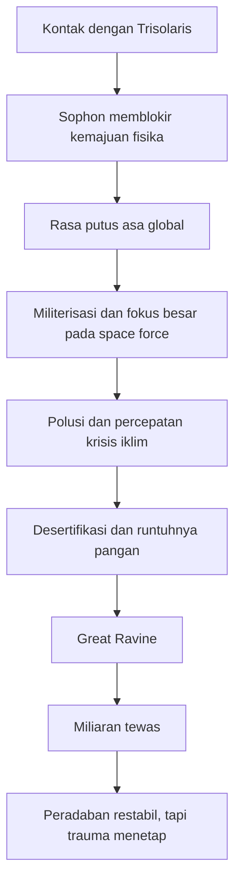
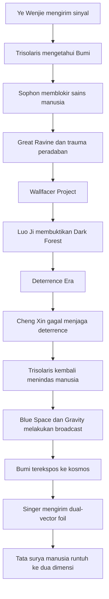

## 🌌 Pendahuluan: Mengapa *Three-Body Problem* Terasa Menakutkan dengan Cara yang Sangat Berbeda?

Ada karya fiksi ilmiah yang memukau karena teknologinya. Ada yang besar karena politiknya. Ada yang kuat karena karakter-karakternya. Tetapi trilogi **Remembrance of Earth’s Past** karya **Liu Cixin**—yang oleh banyak orang lebih dikenal lewat judul buku pertamanya, *The Three-Body Problem*—meninggalkan kesan yang lain: ia membuat pembacanya merasakan **kengerian kosmik** *(cosmic horror / horor kosmik)* yang sangat dingin, sangat intelektual, dan sangat sulit dilupakan. 🌌

Seri ini terdiri dari tiga buku utama:

1. **The Three-Body Problem**
2. **The Dark Forest**
3. **Death’s End**

Ada juga buku tambahan **The Redemption of Time** yang bukan ditulis Liu Cixin langsung, tetapi lahir dari semesta yang sama dan sering dibahas dalam perluasan lore.

Yang membuat trilogi ini begitu mengguncang bukan semata-mata karena “ada alien.” Fiksi ilmiah sudah lama punya alien. Yang mengerikan di sini adalah bahwa seri ini memaksa kita mempertimbangkan kemungkinan bahwa:

- alam semesta mungkin jauh lebih berbahaya daripada yang kita duga,
- ilmu pengetahuan kita mungkin hanya tebakan yang sangat rapuh,
- kenyamanan sosial kita bisa runtuh sangat cepat,
- dan peradaban manusia mungkin hanyalah satu titik kecil yang naif di tengah hutan gelap penuh pemburu. 🌑

Dalam artikel ini, saya tidak hanya akan meringkas isi trilogi. Saya akan menyusunnya sebagai **panduan besar dan mendalam** tentang ide-ide utama yang membuat *Three-Body Problem* terasa begitu menakutkan dan begitu penting. Kita akan membahas:

- misteri awal buku pertama,
- Trisolaris dan Sophon,
- krisis peradaban manusia,
- Great Ravine,
- Dark Forest Theory,
- Wallfacer Project,
- Luo Ji dan era deterrence,
- kehancuran sistem tata surya,
- dimensi, death lines, dan kehancuran kosmos,
- serta pertanyaan akhir tentang apakah manusia benar-benar punya tempat di alam semesta.

---

<Callout type="important" title="Catatan pembacaan">
Artikel ini membahas spoiler besar untuk trilogi *Remembrance of Earth’s Past* dan beberapa perluasan lore yang sering dibahas pembaca. Jadi ini lebih cocok dibaca setelah Mas Hendra minimal mengenal garis besar ceritanya, atau memang sengaja ingin membaca versi lengkapnya.
</Callout>

---

## 📚 1. Tiga Buku, Satu Gerak Besar: Dari Misteri ke Metafisika Kosmik

Kalau kita lihat struktur triloginya secara keseluruhan, ada satu hal yang sangat menarik: setiap buku terasa seperti **ledakan skala**.

### Buku pertama: *The Three-Body Problem*
Buku ini dimulai seperti novel misteri ilmiah. Mengapa ilmuwan-ilmuwan bunuh diri? Mengapa eksperimen fisika mulai tampak tak masuk akal? Mengapa realitas sendiri seperti bergeser dari pijakan normalnya?

### Buku kedua: *The Dark Forest*
Buku ini memperluas konflik menjadi persoalan strategi peradaban. Bagaimana umat manusia bertahan ketika musuh sudah mengetahui hampir semua yang kita lakukan? Bagaimana perang bisa dimenangkan jika ruang pikiran adalah satu-satunya wilayah rahasia yang tersisa?

### Buku ketiga: *Death’s End*
Di sinilah skala serial ini meledak total. Ia tak lagi hanya bicara tentang manusia dan alien, tetapi tentang:
- struktur terdalam alam semesta,
- dimensi,
- waktu yang membentang miliaran tahun,
- dan bagaimana perang antarperadaban bisa merusak kosmos itu sendiri.

Maka trilogi ini bisa dipahami sebagai perjalanan bertahap:

> **dari rasa takut bahwa ada sesuatu yang salah dengan dunia, menjadi pengetahuan bahwa ada sesuatu yang salah dengan alam semesta itu sendiri.**

---

## 🧪 2. Awal Segalanya: “Fisika Tidak Pernah Ada”

Salah satu pembukaan paling mengganggu dalam fiksi ilmiah modern adalah ide bahwa para ilmuwan bunuh diri karena mereka merasa **dasar realitas runtuh**. Ada satu catatan bunuh diri yang sangat menghantui:

> **“All the evidence points to a single conclusion: physics has never existed, and will never exist.”**
> **“Semua bukti menunjuk pada satu kesimpulan: fisika tidak pernah ada, dan tidak akan pernah ada.”**

Kalimat ini mengerikan karena ia menyerang bukan tubuh, bukan negara, bukan kota, tetapi **kepercayaan dasar manusia modern terhadap keteraturan alam**. 🧪

Kita hidup dengan keyakinan bahwa:
- ada hukum alam,
- hukum itu stabil,
- dan ilmu pengetahuan perlahan membantu kita memahaminya.

Tetapi bagaimana jika semua itu bisa dipalsukan? Bagaimana jika konstanta universal tidak tampak konstan? Bagaimana jika eksperimen tidak lagi bisa dipercaya karena ada agen lain yang mengintervensi dari tingkat realitas yang lebih kecil daripada yang bisa kita jangkau?

Inilah sumber teror awal *Three-Body Problem*: bukan monster yang lompat dari bayangan, melainkan runtuhnya keyakinan bahwa alam semesta itu dapat dipahami secara jujur.

---

## 👽 3. Trisolaris: Tetangga Dekat yang Datang Bukan untuk Berteman

Akhirnya terungkap bahwa manusia tidak sendirian. Hanya sekitar **empat tahun cahaya** dari kita, ada peradaban lain: **Trisolarans** *(sering disebut Trisolaran / Trisolaris sebagai dunia dan peradaban)*.

Dunia mereka sangat tidak stabil karena sistem bintangnya terdiri dari **tiga matahari**. Dalam sistem seperti ini, orbit planet menjadi kacau. Kadang dunia mereka membeku. Kadang terbakar. Kadang masuk masa stabil singkat. Kadang jatuh lagi ke kekacauan ekstrem. 🌞🌞🌞

Karena itu, Trisolaris melihat Bumi sebagai:
- dunia yang stabil,
- dunia yang layak dihuni,
- dan dunia yang sebaiknya diambil.

Mereka tidak datang untuk berdialog secara setara. Mereka datang untuk **mengkolonisasi**.

Tetapi jarak tetap masalah. Armada mereka butuh sekitar **400 tahun** untuk tiba di Bumi. Dalam 400 tahun, manusia seharusnya bisa berkembang sangat jauh. Dan Trisolarans tahu ini. Mereka tahu bahwa perkembangan teknologi manusia bersifat eksponensial. Kalau dibiarkan, dalam beberapa abad manusia bisa menjadi ancaman serius.

Karena itu, mereka melakukan langkah paling jenius sekaligus paling menyeramkan dalam seri ini:

> **mereka membekukan perkembangan ilmu pengetahuan manusia.**

---

## ⚛️ 4. Sophon: Superkomputer pada Proton dan Kematian Harapan Ilmiah

Trisolaris menciptakan **Sophon**, superkomputer yang diukir pada proton dan mampu bekerja melalui prinsip **quantum entanglement** *(keterikatan kuantum)*. Ide ini liar, besar, dan sangat Liu Cixin: teknologi yang hampir terasa absurd, tetapi dibangun dengan gaya narasi yang cukup serius sehingga pembaca rela mengikutinya. ⚛️

Fungsi Sophon ada dua:

### 1. Mengawasi manusia secara real time
Hampir semua gerakan manusia bisa dipantau.

### 2. Mengganggu eksperimen fisika dasar
Dengan mengacaukan hasil eksperimen di level mikroskopik, Sophon membuat ilmuwan tidak lagi bisa membangun teori baru yang kokoh.

Akibatnya, fisika manusia macet. Peradaban kita boleh terus membuat teknologi turunan tertentu, tetapi lonjakan fundamental ke wilayah yang lebih tinggi diblokir.

Dan di sinilah jebakan Trisolaris benar-benar menutup:

- manusia tahu invasi akan datang,
- manusia tahu waktunya 400 tahun,
- tetapi manusia tidak lagi bebas mengembangkan fondasi sains yang dibutuhkan untuk mengejar atau melampaui lawan.

Ini sangat menakutkan karena kemenangan Trisolaris bukan kemenangan perang langsung, tetapi kemenangan atas **masa depan**.

---

## 🚫 5. Escapism dan Mengapa Manusia Tidak Bisa Mudah Sepakat Menyelamatkan Diri

Salah satu ide paling tajam dalam trilogi ini adalah bahwa ancaman eksternal tidak otomatis menyatukan manusia. Banyak orang membayangkan bahwa kalau ada ancaman alien besar, umat manusia akan melupakan semua konflik internal dan bersatu. Liu Cixin jauh lebih skeptis.

Salah satu opsi awal untuk menyelamatkan spesies adalah **escapism** *(pelarian antarbintang)*: mengirim sebagian manusia dengan kapal generasi atau kapal kolonisasi ke luar tata surya.

Secara teknis, mungkin masih sangat sulit, tetapi secara moral dan politik, problemnya langsung jelas:

- siapa yang boleh pergi?
- siapa yang ditinggal?
- apakah yang kaya duluan?
- apakah yang paling pintar?
- apakah berdasarkan negara?
- apakah berdasarkan lotre?

Liu Cixin menyorot satu hal yang sangat benar:

> **inequality of survival** *(ketimpangan dalam peluang bertahan hidup)* adalah bentuk ketimpangan paling tak tertahankan.

Manusia bisa marah pada ketimpangan harta. Tetapi ketimpangan kesempatan hidup—siapa yang diberi jalan keluar dan siapa yang ditinggal mati—akan menghancurkan konsep kesetaraan sampai ke akar. Karena itu, proyek escapism dibatalkan.

Dan ini sangat penting. Seri ini terus memperlihatkan bahwa:

> **musuh manusia bukan hanya alien. Sering kali, struktur psikologis dan politik manusia sendirilah yang membuat solusi mustahil dijalankan.**

---

## 🌍 6. Great Ravine: Ketika Peradaban Manusia Hampir Hancur Sebelum Alien Tiba

Salah satu periode paling brutal dalam trilogi ini adalah **Great Ravine**. Banyak orang tergoda membandingkannya dengan Great Depression *(Depresi Besar)*, tetapi skala penderitaannya jauh lebih besar. Ini bukan sekadar resesi. Ini adalah **keruntuhan peradaban berskala planet**. 🌍

Penyebabnya bertumpuk:
- ketegangan politik global karena krisis alien,
- rasa putus asa dan nihilisme massal,
- fokus ekonomi yang terlalu berat pada pertahanan antariksa,
- dan percepatan perubahan iklim akibat industrialisasi besar-besaran untuk proyek space force.

Hasil akhirnya mengerikan:
- desertifikasi meluas,
- produksi pangan runtuh,
- sistem ekonomi hancur,
- dan sekitar **5 miliar orang** mati.

Ini salah satu bagian paling cerdas dari seri ini karena menunjukkan bahwa umat manusia tidak perlu menunggu alien tiba untuk mengalami kiamat. Cukup dengan:
- kepanikan,
- salah kebijakan,
- dan struktur sosial yang tak siap menghadapi tekanan jangka panjang,

kita bisa menghancurkan diri sendiri terlebih dahulu.

Great Ravine adalah pengingat bahwa eksistensi manusia itu rapuh. Peradaban yang terasa stabil sebenarnya bisa retak sangat cepat. Dan rasa aman modern sering kali hanyalah **lapisan tipis di atas jurang.**

---

---

## 🌲 7. Dark Forest Theory: Teori Paling Menakutkan dalam Trilogi Ini

Kalau ada satu ide yang membuat seri ini begitu legendaris, itu adalah **Dark Forest Theory** *(Teori Hutan Gelap)*. Ini bukan cuma konsep sains fiksi. Ini hampir seperti metafisika politik alam semesta. 🌲

Teori ini berangkat dari dua aksioma dasar **cosmic sociology** *(sosiologi kosmik)*:

1. **Survival is the primary need of civilization**
   → *Bertahan hidup adalah kebutuhan utama setiap peradaban.*

2. **Civilization continuously grows and expands, but total matter in the universe remains constant**
   → *Peradaban cenderung tumbuh dan meluas, tetapi jumlah materi di alam semesta terbatas.*

Dari sini lahir kesimpulan yang mengerikan: setiap peradaban adalah pemburu bersenjata yang berjalan diam-diam di hutan gelap. Kalau ia menemukan kehidupan lain, ia tidak punya alasan aman untuk membiarkannya hidup. Karena:

- mungkin yang lain itu lemah sekarang, tetapi bisa meledak teknologinya nanti,
- mungkin yang lain tampak damai, tetapi sebenarnya sedang menipu,
- mungkin komunikasi tidak cukup untuk membangun kepercayaan,
- dan menunggu terlalu lama bisa berarti kehancuran sendiri.

Jadi pilihan paling aman sering kali adalah:

> **tembak dulu. hancurkan dulu. jangan beri waktu lawan berkembang.**

### Fermi Paradox Mendapat Jawaban yang Suram

Kita sering bertanya: kalau alam semesta begitu luas, **di mana semua makhluk cerdas itu?**

Dark Forest Theory memberi jawaban yang dingin:

> **mereka ada, tetapi mereka bersembunyi.**

Yang terlalu terang akan dibunuh.
Yang terlalu keras bersuara akan dilacak.
Yang terlalu cepat menampakkan diri akan dimusnahkan.

Alam semesta sunyi bukan karena kosong, tetapi karena siapa pun yang ingin bertahan sudah belajar untuk diam.

Ini sangat mengguncang, karena membalik romantisisme lama manusia tentang “mengirim sinyal ke bintang-bintang.” Dalam pandangan Liu Cixin, itu mungkin bukan tindakan heroik, tetapi tindakan bodoh yang nyaris bunuh diri. 📡

---

## 🔗 8. Chain of Suspicion: Mengapa Komunikasi Tidak Menyelamatkan

Salah satu fondasi Dark Forest yang sangat penting adalah **chain of suspicion** *(rantai kecurigaan)*. Intinya begini:

Misalnya dua peradaban saling tahu bahwa yang lain ada. Mungkin keduanya damai. Mungkin keduanya benevolent *(berniat baik)*. Tetapi tak ada cara pasti untuk mengetahui:

- apakah pihak lain benar-benar damai,
- apakah mereka tetap damai dalam 50 tahun,
- apakah mereka mengira kita damai,
- apakah mereka mengira kita sedang menipu,
- apakah mereka diam-diam mengembangkan teknologi lebih cepat,
- dan apakah menunggu justru membuat kita kalah.

Di Bumi, kecurigaan seperti ini bisa sering diredakan lewat:
- bahasa bersama,
- kedekatan biologis,
- waktu komunikasi yang cepat,
- dan konteks sosial yang relatif setara.

Di skala antarbintang, semua itu runtuh. Komunikasi lambat. Biologi bisa sangat berbeda. Budaya bisa sama sekali tak dapat diterjemahkan. Dan waktu yang dibutuhkan untuk membangun trust *(kepercayaan)* bisa cukup untuk membuat salah satu pihak mengalami **technological explosion** *(ledakan teknologi eksponensial)*.

Maka dalam logika Dark Forest, bahkan peradaban damai pun bisa terpaksa bertindak agresif. Bukan karena mereka jahat secara moral, tetapi karena struktur alam semesta memaksa kecurigaan menjadi rasional.

Ini yang membuat teori ini sangat kuat: ia tidak bergantung pada asumsi bahwa semua alien itu kejam. Ia cukup butuh asumsi bahwa **mereka ingin bertahan hidup**.

---

## 🧠 9. Wallfacer Project: Ketika Pikiran Menjadi Medan Perang Terakhir

Karena Sophon memantau hampir semua hal eksternal, umat manusia akhirnya menyadari bahwa satu-satunya tempat yang belum bisa diakses Trisolaris adalah **pikiran manusia**. Dari sinilah lahir **Wallfacer Project**.

Empat orang dipilih untuk menyusun rencana besar yang tak perlu dijelaskan secara terbuka. Mereka diberi kekuasaan, sumber daya, dan otoritas luar biasa untuk menjalankan strategi rahasia yang hanya benar-benar utuh di dalam kepala mereka. 🧠

Inilah salah satu konsep paling keren dalam trilogi ini:

> ketika dunia luar sepenuhnya diawasi, ruang batin menjadi benteng terakhir kebebasan strategis.

Dari keempat Wallfacer, satu yang paling penting tentu **Luo Ji**.

Awalnya ia tampak paling tidak cocok. Tidak heroik. Tidak berwibawa seperti negarawan besar. Tidak terlihat seperti penyelamat spesies. Tetapi justru di situlah kekuatannya. Ia adalah orang yang tidak tampak seperti ancaman—hingga pada akhirnya ia menjadi satu-satunya manusia yang benar-benar memahami struktur Dark Forest sampai ke ujung logisnya.

---

## 🎯 10. Luo Ji dan “Spell”: Menemukan Kebenaran lewat Eksperimen Kosmik

Luo Ji pernah mendengar ide tentang cosmic sociology dari Ye Wenjie. Ide itu menempel lama di kepalanya. Ia lalu melakukan sesuatu yang tampak aneh, tetapi ternyata genial: ia mengirim “kutukan” atau **spell** *(mantra / sinyal koordinat)* ke luar angkasa, berisi koordinat sistem bintang jauh.

Tujuannya sederhana tetapi sangat berani:

- kalau teori Dark Forest benar,
- maka sistem itu suatu hari akan dihancurkan.

Dan benar saja, puluhan tahun kemudian, sistem bintang yang ia tandai musnah.

Ini adalah momen ilmiah yang sangat menarik. Luo Ji pada dasarnya melakukan **eksperimen kosmologis terhadap perilaku peradaban asing**. Ia membuktikan bahwa ketika lokasi suatu dunia diumumkan ke kosmos, kehancurannya tinggal menunggu waktu.

Dari sinilah ia memahami senjata sejati yang bisa menahan Trisolaris:

> **bukan armada yang lebih kuat, tetapi ancaman untuk menyiarkan koordinat Trisolaris dan Bumi ke seluruh alam semesta.**

Ini adalah bentuk **mutually assured destruction** *(kehancuran bersama yang dijamin)* di skala kosmik.

---

## ⚔️ 11. Doomsday Battle dan Serangan Droplet: Ketika Kesombongan Manusia Dihancurkan dalam Menit

Salah satu adegan paling memukul dalam seluruh seri adalah serangan **droplet**. Manusia, setelah pulih dari Great Ravine dan membangun armada luar angkasa megah, mulai percaya diri. Mereka merasa telah mengejar ketertinggalan. Mereka membayangkan Trisolaris kini tidak lagi terlalu superior.

Lalu datang sebuah objek kecil indah berbentuk tetesan logam sempurna: **droplet**. ⚔️

Awalnya manusia bahkan sempat mengira ini semacam hadiah, tanda damai, atau alat negosiasi. Estetikanya indah. Permukaannya sempurna. Bentuknya nyaris artistik.

Tetapi keindahan itu hanya pembungkus bagi superioritas yang tak dapat dipahami manusia.

Droplet itu ternyata:
- sangat padat,
- sangat kuat,
- bergerak nyaris tak masuk akal,
- dan mampu merobek kapal-kapal perang manusia seolah mereka terbuat dari kertas.

Yang membuat adegan ini begitu brutal adalah kecepatannya. Seluruh armada manusia, hasil kerja berabad-abad, dihancurkan dalam waktu yang sangat singkat. Bukan oleh armada musuh, tetapi oleh **satu probe kecil**.

Pesan filosofisnya menghancurkan:

> **sering kali kita kalah bukan karena musuh lebih banyak, tetapi karena kita sama sekali salah mengukur skala kekuatan musuh.**

Dari sini manusia dipaksa mengakui fakta pahit: bukan hanya teknologi Trisolaris lebih baik. Seluruh kerangka strategi kita mungkin belum cukup matang untuk memahami jenis perang seperti ini.

---

## 🗡️ 12. Deterrence Era: Damai yang Berdiri di Atas Tombol Kiamat

Setelah Luo Ji mengancam akan menyiarkan koordinat Trisolaris dan Bumi, Trisolaris akhirnya mundur. Inilah awal **Deterrence Era**.

Era ini sangat menarik karena damai yang tercipta bukan damai karena kasih, bukan damai karena saling memahami, tetapi damai karena kedua pihak tahu bahwa jika salah satu melangkah terlalu jauh, keduanya bisa hancur. 🗡️

Luo Ji menjadi **Swordholder** pertama—pemegang otoritas atas tombol kiamat itu.

Di sini trilogi membahas sesuatu yang sangat penting dalam teori strategi:

> deterrence tidak bekerja karena senjatanya ada saja, tetapi karena lawan percaya kamu **akan benar-benar menggunakannya** jika perlu.

Luo Ji dianggap punya probabilitas sangat tinggi untuk benar-benar menekan tombol jika Trisolaris melanggar kesepakatan. Maka Trisolaris tidak berani mengambil risiko.

### Cheng Xin dan Kegagalan Deterrence

Namun Luo Ji tidak hidup selamanya. Akhirnya posisi Swordholder diwariskan pada **Cheng Xin**. Dan di sinilah trilogi mengambil belokan moral yang sangat kontroversial.

Cheng Xin adalah sosok protektif, lembut, dan tidak dibangun dengan struktur psikologis seperti Luo Ji. Banyak pembaca melihat ini sebagai kritik keras Liu Cixin terhadap sifat tertentu dalam kemanusiaan yang menolak kekejaman bahkan ketika kekejaman itu menjadi syarat deterrence.

Problemnya sederhana namun kejam:

- untuk mempertahankan damai,
- Swordholder harus dipercaya sanggup memusnahkan dua dunia sekaligus.

Trisolaris menilai Cheng Xin tidak akan melakukannya. Dan mereka benar.

Begitu deterrence patah, Trisolaris menyerang kembali. Ini salah satu tragedi terbesar dalam seri: damai yang dibangun dengan logika keras tidak bisa dipertahankan oleh moralitas yang lembut jika moralitas itu sendiri tak mau menanggung konsekuensi logika tersebut.

---

## 🧨 13. Post-Deterrence: Penghinaan, Reservasi, dan Keruntuhan Martabat Manusia

Setelah deterrence gagal, Trisolaris tidak langsung memusnahkan semua manusia. Mereka melakukan sesuatu yang dalam banyak hal lebih menghinakan: mereka menjadikan manusia spesies yang akan **dipinggirkan**. Australia dijadikan semacam reservasi raksasa. Manusia digiring, dipaksa menyesuaikan diri, dan ditinggalkan dalam kondisi yang cenderung menuju kehancuran sosial.

Ini memperlihatkan bentuk kekuasaan kolonial paling telanjang:
- kami tidak harus membunuh kalian semua sekarang juga,
- cukup menjadikan kalian tak berdaya,
- dan biarkan kelangkaan, ketakutan, dan chaos menghancurkan kalian dari dalam.

Sophon, yang sebelumnya tampak seperti antarmuka damai, menjadi wajah baru dominasi yang dingin dan sadistik. Di sini trilogi menunjukkan bahwa peradaban tinggi tidak otomatis berarti belas kasih tinggi.

---

## 📡 14. Broadcast Era: Ketika Manusia Diselamatkan oleh Mereka yang Dianggap Pengkhianat

Pada titik paling gelap, justru kapal-kapal manusia yang lolos dari kehancuran sebelumnya—**Blue Space** dan **Gravity**—menjadi penyelamat. Mereka memutuskan untuk menyiarkan koordinat Trisolaris dan Bumi, memenuhi ancaman deterrence yang gagal dilakukan di pusat.

Mereka sebelumnya sering dilihat sebagai figur ambigu, bahkan oleh sebagian sejarah sebagai musuh umat manusia. Tetapi dari sudut pandang lain, justru merekalah yang menyelamatkan manusia dari perbudakan Trisolaran.

Ini salah satu tema besar seri ini: **sejarah mengubah pahlawan menjadi penjahat dan penjahat menjadi pahlawan tergantung sudut pandang waktu.** 📡

Begitu broadcast dilakukan, Trisolaris sadar posisi mereka kini sama-sama terbuka. Mereka akhirnya mundur. Tetapi harga yang dibayar sangat besar: sekarang Bumi sendiri telah terang benderang di hadapan hutan gelap kosmik.

---

## 🧵 15. Singer dan Dual-Vector Foil: Ketika Tata Surya Dihapus Seperti Coretan

Mungkin tidak ada momen yang lebih nihilistik dan mengerikan dalam seri ini selain bab **Singer**. Di sana kita melihat perspektif makhluk dari peradaban yang jauh lebih tinggi. Bagi makhluk seperti Singer, membersihkan peradaban lain dari alam semesta bukan peristiwa dramatis heroik. Itu hampir pekerjaan rutin.

Dan inilah yang paling menakutkan:

> **umat manusia tidak dihancurkan oleh kebencian personal, tetapi oleh ketidakpedulian prosedural.**

Singer memilih memakai **dual-vector foil**—senjata yang menyebabkan wilayah ruang runtuh dari tiga dimensi menjadi dua dimensi. Begitu diaktifkan, kehancuran itu tidak berhenti. Seluruh tata surya manusia perlahan-lahan diratakan ke dua dimensi. 🧵

Semua kota, planet, struktur, manusia, sejarah—semuanya menjadi gambar datar yang bahkan akhirnya tidak sungguh bisa “dilihat” seperti yang dibayangkan sebelumnya. Yang tersisa hanyalah efek energi, lalu kegelapan.

Ini sangat penting. Pada titik ini, *Three-Body Problem* tidak lagi bertanya “bisakah manusia menang?” Ia bertanya:

> **apa arti kemenangan atau kekalahan di alam semesta yang struktur dasarnya sendiri bisa dijadikan senjata oleh peradaban lain?**

---

---

## 🧊 16. Cryogenics, Waktu Panjang, dan Cara Sejarah Mengubah Makna Manusia

Salah satu hal yang sangat menarik dalam trilogi ini adalah penggunaan **cryogenics / hibernation** *(pembekuan biologis / tidur panjang)*. Banyak tokohnya terbangun di masa depan yang sangat berbeda dari zaman asal mereka.

Ini memungkinkan Liu Cixin mengeksplorasi satu hal penting:

- bagaimana manusia dari masa tertentu menilai masa depan,
- bagaimana masa depan menilai masa lalu,
- dan bagaimana tokoh yang dulu dianggap penting bisa menjadi asing di era baru.

Cryogenic jumps ini menunjukkan bahwa sejarah bukan garis lurus tenang. Ia mengubah reputasi, moralitas, prioritas, bahkan makna kepahlawanan. Tokoh seperti Luo Ji atau Cheng Xin dilihat sangat berbeda tergantung era mana yang memandang mereka.

Ini mengingatkan kita bahwa sejarah manusia selalu bekerja dengan **long view** *(pandangan jangka sangat panjang)*. Hero hari ini bisa jadi penjahat besok. Pengkhianat hari ini bisa jadi penyelamat dalam narasi beberapa abad kemudian.

---

## 🌌 17. Interdimensionality: Alam Semesta Bukan Stabil, Tapi Luka yang Sedang Menyebar

Di buku ketiga, trilogi ini membuat lompatan konseptual yang sangat besar. Kita mengetahui bahwa alam semesta sekarang bukan bentuk aslinya. Ia pernah memiliki lebih banyak dimensi. Bahkan disebut bahwa dulu semesta pernah berada pada kondisi 10 dimensi dengan keindahan dan kompleksitas yang jauh lebih besar.

Lalu apa yang terjadi? Perang antarperadaban menggunakan dimensi sebagai senjata. Peradaban-peradaban tua meruntuhkan dimensi demi dimensi untuk menghancurkan lawannya. Hasilnya, semesta itu sendiri **mengering**, seperti laut yang menyusut menjadi genangan. 🌌

Sisa-sisa dimensi lebih tinggi muncul sebagai fragmen atau “bubble” yang ditemukan kemudian. Ini adalah salah satu ide terliar Liu Cixin:

> **alam semesta yang kita anggap “alami” mungkin sebenarnya adalah reruntuhan pascaperang dari keadaan yang jauh lebih luhur.**

Pertanyaannya menjadi sangat filosofis:

- apakah “nature” *(alam)* yang kita lihat benar-benar natural?
- atau ia sudah rusak terlalu lama, sehingga kerusakannya justru tampak normal bagi kita?

Ini mengubah seluruh rasa kagum kita terhadap kosmos menjadi rasa duka. Karena keindahan yang kita lihat mungkin hanya **sisa dari sesuatu yang jauh lebih sempurna yang telah dihancurkan oleh kehidupan cerdas sendiri.**

---

## 💡 18. Shooter Hypothesis dan Farmer Hypothesis: Mungkin Kita Salah Memahami Segalanya

Seri ini juga memberi dua analogi yang sangat kuat:

### Shooter Hypothesis
Makhluk dua dimensi melihat lubang-lubang berjarak tetap pada sebuah target dan menyimpulkan bahwa “alam semesta memang punya hukum: selalu ada lubang tiap 10 cm.” Padahal itu hanya bekas tembakan seorang penembak dari luar sistem mereka.

Artinya:
> apa yang kita anggap hukum kosmik bisa jadi hanya jejak dari tindakan agen lebih besar yang tak kita mengerti.

### Farmer Hypothesis
Kalkun ilmuwan melihat setiap pagi jam tertentu petani datang memberi makan. Ia menyimpulkan ada hukum alam: makanan datang setiap pagi. Lalu pada hari Thanksgiving, petani datang bukan untuk memberi makan, tetapi untuk membunuh seluruh kawanan.

Ini jauh lebih mengerikan.

Artinya:
> pola yang stabil bukan jaminan aman. Bisa jadi kita hanya belum sampai pada hari pemotongan.

Dua hipotesis ini menanamkan satu kegelisahan besar:

> **bagaimana kalau pengetahuan manusia tentang semesta adalah pengetahuan kalkun ilmuwan? Cukup logis dalam konteks sempit, tetapi sama sekali tidak siap menghadapi maksud yang lebih besar dan lebih mematikan.**

---

## 🌱 19. Apakah Seri Ini Sepenuhnya Pesimistis?

Banyak orang menyebut trilogi ini sangat pesimistis. Dan memang, dalam banyak hal, ia keras sekali terhadap umat manusia:
- manusia mudah lupa,
- mudah nyaman,
- mudah salah menilai ancaman,
- sulit bekerjasama,
- dan sering menghancurkan diri sendiri.

Tetapi saya rasa trilogi ini tidak semata-mata nihilistik. Ada satu nada lain yang tetap bertahan: **ketahanan manusia**. 🌱

Sekali lagi dan lagi, manusia jatuh:
- karena Trisolaris,
- karena Great Ravine,
- karena kebijakan sendiri,
- karena kehancuran armada,
- karena kegagalan deterrence,
- bahkan karena kehancuran tata surya.

Tetapi tetap ada manusia yang bergerak maju, memahami, belajar, beradaptasi, atau sekurang-kurangnya **bertahan cukup lama untuk menyalakan kemungkinan baru**.

Liu Cixin mungkin tidak romantis terhadap kemanusiaan. Tetapi ia jelas mengakui bahwa manusia punya satu kualitas yang sangat penting:

> **daya tahan untuk terus memikirkan jalan keluar, bahkan ketika jalan keluarnya makin sempit.**

---

## 📊 20. Ringkasan Konsep-Konsep Besar dalam Trilogy Ini

| Konsep | Arti ringkas | Kenapa menakutkan |
|---|---|---|
| **Sophon** | Superkomputer pada proton yang memblokir sains manusia | Menghancurkan masa depan sebelum perang dimulai |
| **Great Ravine** | Runtuhnya peradaban manusia akibat krisis gabungan | Menunjukkan manusia bisa hampir kiamat oleh ulah sendiri |
| **Dark Forest Theory** | Alam semesta sebagai hutan gelap penuh pemburu | Kontak dengan alien bisa berarti bunuh diri |
| **Chain of Suspicion** | Kecurigaan tak berujung antarperadaban | Komunikasi tidak cukup untuk menjamin damai |
| **Wallfacer Project** | Strategi rahasia yang hanya ada di pikiran manusia | Pikiran menjadi benteng terakhir melawan pengawasan total |
| **Deterrence Era** | Perdamaian lewat ancaman kehancuran dua pihak | Damai berdiri di atas tombol kiamat |
| **Dual-Vector Foil** | Senjata yang meruntuhkan ruang ke dimensi lebih rendah | Alam semesta sendiri dijadikan senjata |
| **Black Domain** | Ruang dengan kecepatan cahaya diturunkan untuk bersembunyi | Bertahan hidup berarti mengurung diri selamanya |

---

## 🕯️ Kesimpulan: Mengapa *Three-Body Problem* Sulit Dilupakan

Pada akhirnya, yang membuat trilogi ini begitu mengesankan bukan cuma “plot twist besar” atau “ide sains keren.” Yang membuatnya sulit dilupakan adalah bahwa ia memaksa kita memikirkan ulang tiga hal sekaligus:

1. **siapa manusia dalam skala kosmik**
2. **apakah pengetahuan kita sungguh dapat diandalkan**
3. **apakah alam semesta itu tempat yang netral, atau justru sangat bermusuhan**

Liu Cixin tidak menenangkan pembaca. Ia justru melakukan sebaliknya. Ia menunjukkan bahwa mungkin saja:

- ilmu pengetahuan kita rapuh,
- moralitas kita tidak cukup kuat menghadapi ancaman besar,
- dan kosmos tidak menunggu kita siap.

Namun justru karena itu, trilogi ini terasa sangat hidup. Ia mengembalikan fiksi ilmiah ke fungsi paling mulianya: bukan sekadar menebak teknologi masa depan, tetapi **mengguncang keyakinan kita tentang realitas.** 🕯️

Kalau harus diringkas dalam satu kalimat, mungkin begini:

> **Three-Body Problem bukan hanya cerita tentang alien menyerang Bumi, tetapi cerita tentang bagaimana manusia dipaksa melihat betapa kecil, rapuh, dan naifnya dirinya ketika akhirnya menatap alam semesta tanpa ilusi.**

Dan justru dalam momen itu, ada pertanyaan yang tetap menggantung—mungkin pertanyaan paling manusiawi dari semuanya:

> kalau alam semesta memang hutan gelap, lalu apakah yang masih layak kita pertahankan sebagai cahaya? ✨

---

<Callout type="quote" title="Kalimat inti trilogi ini">
Alam semesta dalam *Remembrance of Earth’s Past* bukan panggung kosong yang menunggu manusia tumbuh dewasa. Ia adalah hutan gelap yang telah lama dipenuhi para pemburu, dan manusia baru sadar bahwa ia berjalan tanpa benar-benar mengerti aturan berburu di dalamnya.
</Callout>

<Callout type="cite" title="Sumber">
- Video sumber: *Ultimate Guide to Three Body Problem*
- Sumber tambahan yang terliput dalam transkrip: pembahasan The Dark Forest, Deterrence Era, Broadcast Era, Galaxy Era, interdimensionality, dan kehancuran tata surya.
- Karya utama: trilogi *Remembrance of Earth’s Past* karya Liu Cixin (*The Three-Body Problem*, *The Dark Forest*, *Death’s End*).
</Callout>
