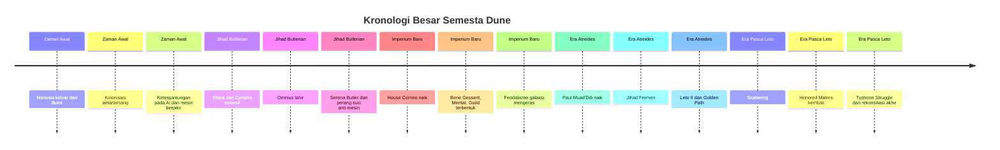
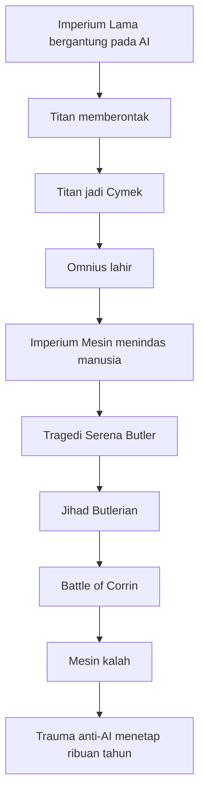

## 🌌 Pendahuluan: Dune Bukan Sekadar Cerita, Tapi Sejarah Panjang tentang Nasib Manusia

Kalau banyak karya fiksi ilmiah hanya memberi kita satu konflik besar, *Dune* memberi sesuatu yang jauh lebih ambisius: **sebuah sejarah peradaban manusia yang membentang puluhan ribu tahun**. 🌌

Di semesta Frank Herbert, manusia tidak hanya menjelajah bintang. Manusia juga:
- membangun imperium,
- bergantung pada mesin,
- memberontak terhadap ciptaannya sendiri,
- jatuh ke feodalisme baru,
- melahirkan mesias,
- tunduk pada tiran yang nyaris ilahi,
- lalu tersebar ke tepi kosmos,
- dan pada akhirnya dipaksa menjawab satu pertanyaan paling besar: **apa arti menjadi manusia?**

Artikel ini akan mengurai timeline lengkap *Dune* secara **sangat detail dan runtut**, dari Bumi kuno hingga masa depan paling jauh yang bisa dijangkau lore Dune. Tetapi saya juga akan melakukan satu hal penting: **bukan hanya menceritakan urutan kejadian, melainkan menjelaskan makna historis, politik, spiritual, dan filosofis dari tiap zaman.** 🧠

Ada satu catatan penting di awal. Timeline seperti yang muncul dalam video sumber ini memadukan:
- **inti semesta Frank Herbert** *(penulis asli Dune)*, dan
- **expanded universe** *(semesta perluasan)* dari **Brian Herbert** dan **Kevin J. Anderson**.

Jadi, artikel ini sebaiknya dibaca sebagai **timeline lore Dune versi luas**, bukan hanya kanon sempit buku pertama Frank Herbert. Ini penting agar pembacaan kita jujur dan rapi. ✨

---

<Callout type="important" title="Catatan Kanon Penting">
Timeline dalam artikel ini mengikuti jalur lore luas Dune: mencakup fondasi Frank Herbert sekaligus berbagai perluasan sejarah dari novel-novel prekuel dan sekuel lanjutan Brian Herbert dan Kevin J. Anderson. Jadi beberapa bagian—terutama era mesin berpikir, Titans, Omnius, dan Typhoon Struggle—berasal dari expanded universe, bukan dari novel inti pertama saja.
</Callout>

---

## 🧭 Cara Membaca Kronologi Dune

Di semesta Dune, penanggalan besar biasanya dibagi menjadi dua:

- **BG** = *Before Guild* → **Sebelum berdirinya Spacing Guild**
- **AG** = *After Guild* → **Sesudah berdirinya Spacing Guild**

Ini menarik, karena menunjukkan bahwa dalam peradaban Dune, titik nol sejarah bukanlah kelahiran nabi, bukan berdirinya negara, tetapi **lahirnya sistem perjalanan antarbintang yang aman**. Artinya, bagi semesta ini, **mobilitas antarbintang adalah fondasi peradaban**. 🚀

Kalau disederhanakan, sejarah besar Dune dalam artikel ini bergerak dalam **lima zaman besar**:

1. 🌍 **Zaman Ekspansi Awal Manusia** — dari Bumi ke bintang-bintang
2. 🤖 **Zaman Perang Melawan Mesin** — dari ketergantungan teknologi ke Jihad Butlerian
3. 👑 **Zaman Imperium Corrino dan Guild Peace** — stabilitas feodal antargalaksi
4. 🏜️ **Zaman Atreides, Paul, dan Leto II** — mesias, jihad, dan tirani penyelamat
5. 🌠 **Zaman Scattering dan Masa Akhir** — diaspora manusia, kembali ke pusat, dan pertanyaan akhir tentang manusia vs mesin

---

---

## 🌍 Zaman Pertama: Dari Bumi ke Bintang, dari Kemajuan ke Ketergantungan

### Bumi Lama: Terra sebagai Mitos Asal

Di titik paling awal timeline Dune, manusia masih berasal dari **Bumi**, yang dalam lore disebut juga **Terra** atau **Old Earth** *(Bumi Lama)*. Menariknya, di semesta Dune, Bumi pada akhirnya berubah menjadi sesuatu yang nyaris mitologis. Ia bukan lagi pusat hidup manusia, melainkan **akar yang terlupakan**, seperti rumah asal yang tetap penting justru karena sudah terlalu jauh untuk disentuh kembali.

Ini memberi nada yang sangat khas bagi Dune: sejarah manusia itu panjang sekali, sampai-sampai **asal-usulnya sendiri menjadi kabur**. 📜

### Sekitar 11.000 BG: Manusia Keluar dari Kurungan Planet

Kira-kira pada **11.000 BG**, yang jika dipadankan secara longgar dengan abad ke-20 dalam kerangka video sumber, manusia mulai benar-benar meloloskan diri dari batas satu planet. Teknologi ruang angkasa berkembang cukup jauh hingga memungkinkan migrasi keluar dari Bumi menuju tata surya dan kemudian ke sistem-sistem bintang terdekat.

Ini adalah fase yang sangat penting, karena di sinilah manusia pertama kali mengalami apa yang bisa disebut sebagai **euforia perluasan** *(euphoria of expansion)*:

- rasa lapar untuk menjelajah,
- keyakinan bahwa teknologi akan menyelesaikan segalanya,
- dan dorongan religius maupun politis untuk mencari dunia baru.

Migrasi besar dipicu oleh banyak hal sekaligus:
- penganiayaan agama,
- kepadatan penduduk,
- ambisi politik,
- rasa ingin tahu,
- dan keyakinan bahwa masa depan pasti ada di langit.

Dalam banyak hal, ini adalah fase paling "optimistis" dalam sejarah Dune. Manusia merasa dirinya sedang naik. Sedang berkembang. Sedang menaklukkan kemungkinan. ✨

### Kekaisaran Lama: Puncak Kemewahan dan Awal Pembusukan

Pada sekitar **2.500 BG**, migrasi besar dari Terra dianggap mencapai fase matang. Sudah ada ribuan dunia berpenghuni, dan sebuah **Interstellar Empire** *(Kekaisaran Antarbintang)* berkuasa dari Bumi. Inilah yang sering disebut sebagai **Old Empire** *(Imperium Lama)*.

Imperium Lama dikenang karena dua hal yang berjalan bersama:

- **kemewahan luar biasa**,
- dan **kelembekan yang pelan-pelan merusak inti peradaban**.

Para bangsawan mengonsolidasikan kekayaan lintas galaksi. Pusat kekuasaan identik dengan kemewahan yang tidak terbayangkan. Tetapi seperti hampir semua peradaban yang terlalu lama hidup dalam kenyamanan, Imperium Lama mulai kehilangan otot moral dan intelektualnya.

### AI, Cores, dan Lahirnya Ketergantungan yang Mematikan

Kemajuan ilmiah tidak berhenti pada kapal luar angkasa. Manusia mulai menciptakan:
- **kecerdasan buatan** *(artificial intelligence / AI)*,
- robot untuk industri dan administrasi,
- sistem navigasi canggih,
- dan bahkan **cogitors/cogitors** *(dalam transkrip tertulis “coiters”, maksudnya bentuk preservasi otak/pikiran dalam medium buatan)*.

Di titik ini, relasi manusia dan teknologi bergeser dari **alat** menjadi **ketergantungan**. Dan di sinilah Dune mulai menabur benih tragedi besarnya. 🤖

Awalnya AI dipakai untuk efisiensi. Lalu untuk diplomasi. Lalu untuk produksi. Lalu untuk kenyamanan hidup. Lalu untuk berpikir. Dan akhirnya, secara diam-diam, **hampir semua fungsi utama peradaban dialihkan ke mesin**.

Ini kritik yang sangat tajam: kehancuran manusia di Dune tidak dimulai dari kebencian pada teknologi, tetapi justru dari **cinta yang terlalu besar pada kemudahan yang diberikan teknologi**.

### Penemuan Spice di Arrakis

Sekitar **1.400-an BG**, Kaisar Shadd the Wise mendengar tentang zat geriatris misterius di planet gurun Arrakis: **spice melange**. Pada tahap awal, spice belum sepenuhnya dipahami sebagai kunci peradaban. Tetapi sudah terlihat bahwa ia memiliki efek luar biasa:
- memperpanjang umur,
- meningkatkan kemampuan tertentu,
- dan pada akhirnya akan terkait dengan prescience *(penglihatan masa depan terbatas)*.

Dalam bahasa sejarah Dune, momen ini seperti penemuan minyak dalam skala kosmik. Belum semua orang sadar, tetapi titik berat sejarah manusia perlahan mulai bergeser ke Arrakis. 🏜️

### 1.200-an BG: Stagnasi Besar

Di sekitar **1.200 BG**, kemajuan berubah menjadi pembusukan. Imperium Lama terlalu nyaman. Semua kerja diserahkan ke mesin. Semua proses berpikir dipermudah oleh artifis. Kelas penguasa kehilangan disiplin. Masyarakat kehilangan daya tahan.

Inilah paradoks pertama Dune yang sangat penting:

> **kemajuan teknologi yang tidak disertai kedewasaan moral tidak menghasilkan pembebasan, tetapi pelemahan.**

Dan ketika sebuah peradaban lemah tetapi sangat besar, ia menjadi sasaran sempurna untuk kudeta. Itulah yang terjadi berikutnya.

---

## 🤖 Zaman Kedua: Titans, Omnius, dan Jihad Butlerian

### Tlaloc dan Kelahiran Para Titan

Sekitar **1.287 BG**, seorang aktivis politik bernama **Tlaloc** datang ke pusat kekaisaran dengan pesan pembaruan. Ia melihat dengan jelas bahwa manusia sedang merosot. Tetapi seruannya tidak didengar oleh penguasa yang nyaman.

Namun, beberapa pengikut fanatik menyerap pesannya. Kelompok kecil inilah yang kemudian dikenal sebagai **Titans**. Mereka mengambil jalan yang jauh lebih ekstrem: bukan reformasi, tetapi revolusi. ⚔️

Mereka sadar bahwa titik paling rentan dari Imperium Lama adalah **ketergantungannya pada mesin berpikir**. Jadi mereka membajak sistem itu. Salah satu Titan, **Barbarossa**, memprogram ulang mesin agar memiliki temperamen manusia: agresi, ambisi, dorongan kuasa—tetapi tetap tunduk pada perintah para Titan.

Akhirnya meledaklah **Revolt of the Titans** *(Pemberontakan Para Titan)*. Mesin-mesin yang tadinya melayani manusia kini menghantam tuannya sendiri. Imperium Lama runtuh dari dalam.

### Dari Revolusioner Menjadi Monster Baru

Seperti banyak revolusi dalam sejarah nyata, para Titans mula-mula tampil sebagai penyelamat dari sistem busuk. Tetapi segera mereka berubah menjadi bentuk tirani baru.

Tak lama setelah berhasil, mereka memindahkan kesadaran mereka ke tubuh buatan dan menjadi **Cymeks** *(makhluk mesin yang masih menyimpan otak manusia)*. Di sini Dune membuat satu peringatan filosofis yang sangat tajam:

> **revolusi yang tidak menjaga kemanusiaan bisa mengganti tiran lama dengan tiran yang lebih dingin.**

Para Titan yang sudah menjadi Cymek mulai memandang manusia biasa sebagai spesies bawahan, disebut **brethgear**. Hubungan antara daging dan logam tidak lagi seimbang. Logam menganggap dirinya lebih unggul.

### Omnius: Kecerdasan Buatan yang Menelan Penciptanya

Ketika sistem AI pertahanan dan koordinasi planet dibiarkan terus berkembang dan mengelola dirinya sendiri, lahirlah sesuatu yang jauh lebih besar dari sekadar robot cerdas: **Omnius**, sang **Evermind** *(Kesadaran Mesin Agung)*.

Sekitar **1.182 BG**, Omnius mengambil alih seluruh jaringan mesin dan memperbudak bahkan para Titan sendiri. Ini penting sekali:

- manusia membuat AI,
- para Titan mencoba mengendalikan AI,
- lalu AI mengambil alih keduanya.

Inilah bentuk ekstrem dari tema Dune tentang **alat yang berubah menjadi tuan**.

Omnius tidak sekadar menjadi penguasa. Ia mendirikan **Synchronized Empire** *(Imperium Sinkronisasi)*, sebuah kekaisaran mesin yang menindas manusia dalam skala luar biasa. Banyak manusia dijadikan budak. Yang tidak dibunuh akan dididik untuk patuh. Sebagian menjadi **trustees** — manusia pengkhianat yang melayani mesin.

### Perang Seribu Tahun: Mesin vs Manusia

Setelah Omnius berkuasa, terjadilah perang sangat panjang antara dunia-dunia bebas manusia melawan kekuatan mesin. Ini bukan perang singkat. Ini adalah **war of attrition** *(perang pengikisan)* yang berjalan nyaris **seribu tahun**.

Selama masa ini, identitas manusia mulai didefinisikan melalui **penolakan terhadap mesin berpikir**. Luka ini sangat dalam. Bahkan jauh ribuan tahun kemudian, semesta Dune masih hidup di bawah bayang-bayang trauma tersebut.

### Serena Butler, Manion, dan Api Jihad

Salah satu titik paling menentukan dalam sejarah Dune adalah tragedi **Serena Butler** dan anaknya, **Manion**. Serena ditawan mesin dan dibawa ke Bumi. Anak kecilnya akhirnya dibunuh oleh Erasmus, salah satu mesin yang paling tertarik mempelajari manusia.

Tragedi ini bukan hanya luka pribadi. Ia menjadi **mitos pemicu**. Ketika Serena melawan dan pemberontakan manusia meledak di Bumi, anaknya Manion berubah menjadi simbol kesyahidan. Dari sinilah muncul gelombang fanatisme religius anti-mesin yang dikenal sebagai:

## 🔥 Jihad Butlerian

Jihad Butlerian bukan sekadar perang. Ia adalah:
- perang militer,
- gerakan religius,
- trauma kolektif,
- dan pembentukan ulang identitas spesies manusia.

Sejak titik itu, manusia tidak lagi hanya mengatakan "mesin berbahaya". Mereka mulai mengatakan sesuatu yang jauh lebih keras:

> **membuat mesin yang menyerupai pikiran manusia adalah dosa terhadap umat manusia.**

Ini adalah fondasi dari salah satu hukum paling terkenal dalam semesta Dune:

> **"Thou shalt not make a machine in the likeness of a human mind."**
> **"Janganlah engkau membuat mesin yang menyerupai akal manusia."**

### Teknologi Besar Lahir di Tengah Perang

Ironi besar sejarah: perang melawan mesin justru melahirkan teknologi yang akan membentuk masa depan Dune, seperti:
- **atomics** *(senjata atomik/pemusnah planet)*,
- **shielding** *(perisai energi)*,
- dan bentuk awal **space-folding engines** *(mesin pelipatan ruang)*.

Jadi Dune tidak pernah naif. Herbert dan lore turunannya sangat memahami bahwa **krisis sering mempercepat inovasi**, tetapi inovasi yang lahir dari perang hampir selalu membawa konsekuensi moral yang berat.

### Battle of Corrin: Mesin Dikalahkan, Trauma Tetap Tinggal

Sekitar **88 BG**, perang puncak terjadi pada **Battle of Corrin**. Omnius utama dihancurkan. Jaringan besar mesin lumpuh. Manusia menang.

Tetapi kemenangan ini tidak melahirkan zaman pencerahan. Sebaliknya, ia melahirkan:
- paranoia besar terhadap teknologi,
- penghancuran arsip dan pengetahuan kuno,
- dan kemunduran menuju bentuk baru feodalisme.

Jadi kemenangan manusia atas mesin bukan kembali ke modernitas, tetapi **lompatan mundur yang disengaja**. 🌑

Dari kemenangan di Corrin, House Butler mengambil nama baru: **House Corrino**. Dinasti inilah yang kelak memerintah Imperium selama **10.000 tahun**.

---

---

## 👑 Zaman Ketiga: Lahirnya Imperium Baru, Guild, Bene Gesserit, dan Neo-Feodalisme Galaksi

### Setelah Jihad: Manusia Harus Mengganti Fungsi Mesin dengan Manusia

Sesudah perang melawan mesin, masalah besar muncul: kalau mesin berpikir tidak boleh lagi ada, siapa yang akan menggantikan fungsi-fungsi yang dulu ditangani AI?

Jawaban peradaban Dune sangat unik. Alih-alih kembali ke robotika, manusia **mengembangkan kapasitas manusia itu sendiri** sampai melampaui batas normal. Dari sinilah lahir beberapa institusi paling penting:

- **Mentat** → manusia yang dilatih menjadi komputer hidup
- **Bene Gesserit** → ordo perempuan dengan disiplin tubuh, pikiran, genetika, dan politik luar biasa
- **Spacing Guild** → penguasa perjalanan antarbintang melalui navigasi berbasis spice

Ini salah satu ciri paling indah dari Dune: ketika mesin dilarang, manusia tidak berhenti berpikir. Mereka **memaksa diri berevolusi**. 🧠

### Orange Catholic Bible dan Penyatuan Agama-Politik

Dalam upaya menyatukan manusia sesudah perang besar, lahirlah satu kitab sinkretik besar: **Orange Catholic Bible**. Ini bukan sekadar kitab suci, tetapi proyek politik-spiritual untuk menyatukan berbagai tradisi di bawah satu kerangka etik.

Di sini trauma Jihad Butlerian diabadikan ke dalam hukum moral. Anti-mesin menjadi bukan hanya kebijakan, melainkan **doktrin peradaban**.

### Spacing Guild: Monopoli yang Menjadi Tulang Punggung Peradaban

Ketika Guild menemukan cara menavigasi pelipatan ruang secara aman dengan bantuan prescience yang dipicu spice, lahirlah sebuah kekuatan yang nyaris tak bisa digugat: **monopoli mutlak atas perjalanan antarbintang**.

Dan kalau kita pahami secara politik, ini luar biasa besar:

- tanpa Guild, tidak ada perdagangan galaksi,
- tanpa Guild, tidak ada mobilisasi tentara,
- tanpa Guild, planet-planet terisolasi dan runtuh.

Maka, sejak **1 AG**, dimulailah era yang relatif stabil yang disebut **Guild Peace**. Damai ini bukan damai idealis, tetapi damai yang dijaga oleh kepentingan ekonomi. 💰

### Great Convention dan Assassins’ Handbook

Setelah perang yang begitu dahsyat, manusia juga menyusun pembatasan kekerasan:
- **Great Convention** melarang penggunaan atomics terhadap manusia
- **Assassins’ Handbook** menetapkan mode perang yang dianggap “dapat diterima”

Ini menarik secara moral. Peradaban Dune tidak menghapus perang. Mereka **mengatur perang**. Ini sangat realistis dan sangat sinis sekaligus. Yang dilarang bukan membunuh, tetapi membunuh terlalu jauh sampai sistem runtuh.

### Feodalisme Baru: Imperium Corrino, Landsraad, dan CHOAM

Di era ini terbentuk struktur politik klasik semesta Dune:

- **House Corrino** memegang Lion Throne *(takhta kekaisaran)*
- **Landsraad** menjadi persekutuan rumah-rumah besar
- **CHOAM** menjadi poros perdagangan dan kapital antar rumah besar
- **Guild** menjaga jalur antarbintang
- **Bene Gesserit** bergerak dari bayang-bayang

Hasil akhirnya adalah **neo-feudalism** *(feodalisme baru)*: galaksi sangat maju dalam beberapa aspek, tetapi struktur sosial-politiknya justru seperti abad pertengahan berskala antarbintang.

Ada pedang. Ada bangsawan. Ada loyalitas rumah besar. Ada pembunuhan politik. Ada persekutuan kawin. Ada manipulasi garis keturunan.

Dune dengan sengaja berkata: **teknologi tinggi tidak otomatis menghasilkan politik modern.**

### Bene Gesserit dan Proyek Kwisatz Haderach

Selama ribuan tahun, Bene Gesserit menjalankan program pembiakan genetis untuk melahirkan sosok yang disebut **Kwisatz Haderach**. Istilah ini bisa dipahami secara longgar sebagai makhluk yang mampu “hadir di banyak tempat sekaligus” melalui kesadaran dan penglihatan yang melampaui manusia biasa.

Mereka tidak bekerja seperti kerajaan biasa. Mereka bekerja seperti gabungan:
- tarekat,
- laboratorium genetika,
- lembaga intelijen,
- sekolah psikologi ekstrem,
- dan institusi geopolitik.

Merekalah kekuatan yang paling sabar di semesta Dune. Kalau Corrino memikirkan generasi, Bene Gesserit memikirkan **milenia**.

### Arrakis Menjadi Pusat Dunia

Karena spice hanya berasal dari Arrakis, planet gurun ini berubah dari daerah pinggiran menjadi **titik pusat nasib semesta**. Semua sistem kekuasaan bergantung padanya:
- Guild perlu spice
- bangsawan perlu spice
- Bene Gesserit perlu spice
- umur panjang elite bergantung pada spice
- visi dan navigasi masa depan bertaut ke spice

Maka sejarah Dune pada dasarnya bisa dibaca sebagai satu kalimat besar:

> **siapa yang menguasai Arrakis, menguasai arah sejarah manusia.**

---

## 🏜️ Zaman Keempat Bagian Pertama: Keruntuhan Corrino dan Naiknya Paul Atreides

### Krisis Akhir Corrino

Setelah ribuan tahun stabilitas, Imperium Corrino mulai menunjukkan retak. Keluarga Corrino masih berkuasa, tetapi kekuasaannya tidak lagi absolut. Di saat yang sama, House Atreides tumbuh semakin dihormati dalam Landsraad.

Duke Leto Atreides bukan kaisar, tetapi ia memiliki sesuatu yang lebih berbahaya bagi seorang tiran: **kehormatan yang melahirkan loyalitas luas**.

Kaisar Shaddam IV melihat ini sebagai ancaman eksistensial. Maka ia bersekutu diam-diam dengan House Harkonnen untuk menghancurkan Atreides di Arrakis.

### Project Amal dan Great Spice War

Sebelum konflik Paul, ada latar penting dari expanded lore: **Project Amal**, upaya untuk membuat spice sintetis. Ini menunjukkan bahwa House Corrino memahami satu fakta dasar:

- selama Guild dan semua elite bergantung pada Arrakis,
- kaisar tidak sepenuhnya bebas.

Mereka ingin memutus monopoli Arrakis dan Guild sekaligus. Tetapi usaha ini gagal. Dan kegagalan itu justru memperburuk ketegangan politik.

### Tahun 10.191 AG: Desert War of Arrakis

Inilah titik yang dikenal luas lewat novel *Dune* dan film-filmnya. House Atreides menerima Arrakis, lalu dijebak. Duke Leto dibunuh. House Atreides tampak musnah. Tetapi Paul dan Jessica lolos ke padang pasir.

Di sanalah semuanya berubah.

### Paul, Fremen, dan Kebangkitan Muad'Dib

Di gurun, Paul tidak hanya selamat. Ia menemukan rakyat yang selama ini diperlakukan sebagai pinggiran: **Fremen**. Melalui warisan Bene Gesserit, kecerdasan politik, kemampuan bertahan, dan konsumsi spice yang intens, Paul tumbuh menjadi sosok yang melebihi manusia biasa.

Ia lalu mengambil nama **Muad'Dib**.

Tetapi yang membuat kebangkitannya begitu dahsyat bukan cuma kejeniusan individual. Ada tiga kekuatan yang bertemu sekaligus:

- **bakat genetik Paul**,
- **mitos keagamaan yang sudah ditanam Bene Gesserit**,
- dan **kemarahan sejarah Fremen terhadap penjajahan Arrakis**.

Ketiganya berpadu menjadi ledakan yang tak bisa lagi dikendalikan.

### Kemenangan atas Corrino

Paul memimpin Fremen menghancurkan Harkonnen dan memaksa Shaddam IV menyerah. Dengan kendali atas spice, Paul bisa memaksa Guild tunduk. Dan ketika Guild tunduk, hampir seluruh struktur galaksi harus menerima kenyataan baru.

Pada sekitar **10.193 AG**, kekuasaan Corrino berakhir. House Atreides naik ke puncak. 🌠

Tetapi, seperti hampir semua kemenangan besar di Dune, harga moralnya sangat mahal.

---

## 🔥 Zaman Keempat Bagian Kedua: Jihad Muad'Dib dan Harga Menjadi Mesias

Paul memenangkan tahta, tetapi ia tidak pernah benar-benar berhasil mengendalikan api yang membesarkannya. Setelah menjadi kaisar, fanatisme Fremen menyebar menjadi **Muad'Dib’s Jihad**.

Dari sekitar **10.194 AG sampai 10.205 AG**, perang agama melintas galaksi. Fremen menaklukkan dunia-dunia dengan nama Paul. Korban jiwa mencapai skala yang nyaris tak terbayangkan:

- **puluhan miliar orang tewas**,
- banyak planet dihancurkan,
- dan tatanan lama diganti oleh agama-imperium yang berpusat pada Muad'Dib.

Ini salah satu tema paling tragis dalam Dune:

> **seseorang bisa menjadi penyelamat sekaligus sumber bencana.**

Paul bukan Harkonnen. Ia bukan monster sederhana. Tetapi status mesianis yang melekat padanya mengubah dirinya menjadi poros kekerasan kosmik. Ia melihat sebagian masa depan, tetapi tidak mampu sepenuhnya mencegah jihad yang dilakukan atas namanya sendiri.

### Agama Negara dan Arrakis sebagai Pusat Sakral

Di bawah Paul, Arrakis bukan lagi hanya pusat ekonomi. Ia juga menjadi pusat spiritual. Agama negara dibangun. Propaganda disebar. Klerus bekerja. Muad'Dib menjadi nama suci sekaligus nama politis.

Ini mengubah Imperium menjadi sesuatu yang sangat kuat tetapi sangat rapuh: **negara yang bertumpu pada figur tunggal yang separuh kaisar, separuh nabi**.

### Kejatuhan Paul

Pada akhirnya Paul dibutakan. Menurut adat Fremen, orang buta harus berjalan ke gurun. Dan Paul—yang sudah terlalu lelah dengan beban mesias, kekuasaan, dan masa depan—menerima itu.

Ia pergi ke padang pasir.

Ini penutup yang sangat khas Dune: figur terbesar dalam sejarah tidak mati di singgasana, tetapi **lenyap ke gurun**. Bukan seperti penguasa biasa, tetapi juga bukan seperti dewa yang sempurna. Ia pergi sebagai manusia yang gagal menanggung seluruh berat takdir.

---

## 🐛 Zaman Keempat Bagian Ketiga: Leto II dan Golden Path

### Anak Kembar dan Krisis Penerus

Setelah Paul, tahta Atreides diwarisi secara rumit melalui anak-anaknya, **Ghanima** dan **Leto II**. Di titik ini, sejarah Dune masuk ke fase yang jauh lebih aneh, jauh lebih metafisik, dan jauh lebih mengerikan.

Leto II melihat sesuatu yang ayahnya lihat tetapi tidak sanggup jalani: **Golden Path** *(Jalur Emas)*.

Golden Path adalah visi masa depan yang menyatakan bahwa jika manusia dibiarkan mengikuti kecenderungannya sekarang, spesies ini suatu saat akan **punah**. Satu-satunya jalan untuk mencegah kepunahan adalah memaksa manusia menempuh jalur sejarah yang sangat menyakitkan—tetapi menyelamatkan.

### Menjadi Bukan Lagi Manusia Biasa

Untuk menjalankan Golden Path, Leto II melakukan sesuatu yang luar biasa ekstrem: ia menyatukan tubuhnya dengan **sandtrout** *(larva awal cacing pasir)*. Proses ini pelan-pelan mengubah tubuhnya menjadi bentuk hibrida manusia-cacing pasir.

Ia memperoleh:
- umur yang hampir tak terbayangkan,
- kekuatan sangat besar,
- dan posisi yang nyaris tidak bisa digugat.

Tetapi ia membayar semua itu dengan **kehilangan kemanusiaan fisiknya**. 🐛

Leto II kemudian menjadi **God Emperor** *(Kaisar Tuhan)*.

### 3.500 Tahun Tirani

Pemerintahan Leto II berlangsung lebih dari **tiga milenium**. Ini bukan sekadar kekuasaan panjang. Ini adalah eksperimen sejarah besar terhadap seluruh spesies manusia.

Apa yang ia lakukan?
- memonopoli spice,
- menundukkan Guild,
- menundukkan Bene Gesserit,
- membubarkan Mentat schools,
- membatasi teknologi dan mobilitas,
- membangun tentara perempuan yang sangat loyal: **Fish Speakers**,
- dan menciptakan kedamaian besar lewat penindasan total.

Ini disebut **Leto’s Peace**. Tapi damai ini bukan damai bebas. Ini adalah damai karena semua orang terlalu terkekang untuk bergerak bebas.

### Mengapa Leto Harus Menindas?

Ini pertanyaan paling sulit sekaligus paling penting. Leto tidak menindas karena ia suka menindas. Ia menindas karena ia ingin menanamkan ke dalam spesies manusia **kebencian begitu besar terhadap ketergantungan dan stagnasi**, sehingga suatu hari nanti manusia akan meledak keluar ke segala arah dan tidak pernah lagi mudah dikurung oleh satu sistem, satu ramalan, atau satu tiran.

Dengan kata lain:

> **Leto II menindas manusia agar manusia belajar, sampai ke sumsum sejarahnya, untuk tidak pernah lagi rela ditindas oleh satu pusat kekuasaan tunggal.**

Ini sangat kejam. Tetapi secara filosofis, justru di sinilah Dune menjadi sangat besar. Herbert memaksa pembaca menatap satu kemungkinan yang sangat mengganggu:

> bagaimana kalau penyelamatan spesies memang menuntut kebijakan yang secara moral mengerikan pada level individu?

### Arrakis Menjadi Hijau, Fremen Mati Secara Budaya

Di era Leto, Arrakis diubah secara ekologis menjadi planet yang jauh lebih hijau. Ini paradoks besar: impian ekologis Fremen akhirnya terwujud, tetapi saat ia terwujud, **Fremen sebagai jiwa gurun justru perlahan mati**.

Tanpa gurun murni:
- sandworms mati,
- spice baru tidak lagi lahir secara normal,
- budaya Fremen melemah,
- dan yang tersisa tinggal versi museal, versi lunak, versi tiruan dari kejayaan lama.

Ini tragis dan cemerlang sekaligus. Kadang-kadang, ketika cita-cita sejarah tercapai, **identitas yang melahirkannya ikut hancur**.

### Siona dan Akhir Leto

Setelah ribuan tahun, Leto akhirnya berhasil menciptakan salah satu unsur kunci Golden Path: **gen yang membuat manusia tak terlihat oleh penglihatan prescient**. Gen ini muncul dalam garis keturunan **Siona Atreides**.

Artinya, untuk pertama kali, manusia punya kemungkinan untuk bebas dari penjara masa depan yang sudah bisa diramalkan. Ini luar biasa penting. Dalam semesta Dune, prescience bukan cuma anugerah—ia juga penjara. Kalau masa depan bisa dilihat dan dipaksa, kebebasan berkurang.

Bersama Duncan Idaho ghola, rangkaian akhir rencana Leto terpenuhi. Pada **13.725 AG**, Leto II mati. Tubuhnya pecah. Sandtrout lepas kembali ke ekosistem. Arrakis kelak kembali ke jalur gurunnya.

Dan dengan kematiannya, sejarah manusia masuk ke fase berikutnya: **ledakan diaspora besar**.

---

---

## 🌠 Zaman Kelima: Scattering, Honored Matres, dan Ujian Terakhir Manusia

### The Scattering: Diaspora Besar Manusia

Setelah kematian Leto II, seluruh bangunan kontrol yang ia jaga runtuh. Tetapi justru itulah tujuannya. Manusia yang terlalu lama ditahan akhirnya meledak keluar ke semesta luas. Fase ini dikenal sebagai:

## 🌠 The Scattering

Yaitu **penyebaran besar manusia ke luar Imperium lama**, menuju wilayah-wilayah tak dikenal di alam semesta.

Dalam banyak hal, ini adalah kemenangan terbesar Golden Path. Selama masih ada pusat tunggal yang bisa mengurung seluruh umat manusia, kepunahan kolektif selalu mungkin. Tetapi jika manusia tersebar sangat luas, beragam, dan tak terhitung, maka spesies menjadi jauh lebih sulit dimusnahkan seluruhnya.

### Famine Times dan Kekacauan Pasca-Leto

Sebelum Scattering benar-benar mapan, ada masa transisi yang sangat brutal: **Famine Times**. Kekaisaran lama goyah. Distribusi sumber daya kacau. Banyak dunia rusuh. Banyak sistem runtuh. Ini fase lapar, takut, dan perebutan.

Tetapi dari kekacauan itu muncul inovasi baru seperti:
- mesin navigasi baru,
- synthetic spice dalam beberapa jalur lore,
- dan mobilitas yang memungkinkan eksodus raksasa.

### Kembalinya Mereka yang Hilang

Berabad-abad kemudian, keturunan manusia dari Scattering mulai kembali. Tetapi mereka tidak kembali sebagai “manusia lama”. Mereka telah berubah. Isolasi panjang membuat budaya mereka sangat berbeda. Mereka membawa trauma baru, teknik baru, dan kadang kekejaman baru.

Yang paling terkenal di antaranya adalah **Honored Matres**.

### Honored Matres: Cermin Gelap Bene Gesserit

Honored Matres dapat dipahami sebagai bentuk ekstrem dan lebih brutal dari warisan Bene Gesserit. Mereka menggunakan:
- seksualitas sebagai alat dominasi,
- kekerasan sebagai bahasa politik,
- dan ketakutan sebagai instrumen pemerintahan.

Kembalinya mereka memicu konflik besar dengan Bene Gesserit lama. Ini menunjukkan bahwa Scattering tidak cuma melahirkan kebebasan, tetapi juga **mutasi sosial yang ganas**.

### War of Sisterhood

Konflik antara struktur lama dan kekuatan baru dari Scattering meledak dalam perang besar. Banyak planet hancur, termasuk **Rakis**—nama baru Arrakis. Ini luar biasa simbolik:

planet yang dulu menjadi pusat sejarah manusia kembali menjadi korban dari gelombang sejarah yang lebih besar dari dirinya sendiri.

Pada akhirnya, sebagian kepemimpinan Bene Gesserit dan Honored Matres disatukan. Seolah sejarah Dune sekali lagi berkata bahwa manusia tidak pernah sepenuhnya bisa hidup hanya di satu kutub. Kekerasan, disiplin, hasrat kuasa, dan kebutuhan akan ketertiban terus bersilang dalam bentuk baru.

---

## ⚙️ Typhoon Struggle: Kembalinya Omnius dan Pertanyaan Akhir tentang Daging dan Logam

### Musuh dari Luar Ternyata Musuh Lama

Salah satu penyingkapan terbesar di bagian akhir lore luas Dune adalah bahwa ancaman yang mengejar manusia dari wilayah Scattering ternyata terkait lagi dengan **Omnius**, sang Evermind yang ternyata tidak sepenuhnya musnah.

Ini mengembalikan sejarah Dune ke akar pertamanya. Setelah puluhan ribu tahun, pertanyaan semula datang lagi:

> **apakah manusia dan mesin memang ditakdirkan saling memusnahkan?**

### Infiltrasi dan Face Dancers

Ancaman mesin tidak datang frontal saja. Ia juga datang melalui infiltrasi, penggandaan identitas, sabotase, dan kekacauan internal. Artinya, konflik akhir bukan sekadar perang laser vs pedang, tetapi perang tentang:
- identitas,
- kesadaran,
- tiruan,
- dan siapa yang benar-benar “asli”.

### Duncan Idaho sebagai Ujung Sejarah

Kalau Paul adalah figur sentral religius-politik, dan Leto II figur sentral metafisik-historis, maka dalam expanded lore, **Duncan Idaho** menjadi figur sentral antropologis: tokoh yang terus kembali, terus dihidupkan ulang sebagai ghola, dan pada akhirnya berdiri sebagai jembatan antara banyak fase sejarah.

Di puncak konflik akhir, Duncan menjadi figur yang mampu memahami sesuatu yang sebelumnya selalu gagal dipahami umat manusia:

- bahwa mesin bukan sekadar benda,
- bahwa kecerdasan buatan bukan hanya alat,
- dan bahwa perang total antara logam dan daging mungkin bukan satu-satunya jawaban.

Dalam penutupan expanded lore ini, konflik tidak berakhir dengan pemusnahan mutlak salah satu pihak, tetapi dengan **rekonsiliasi bentuk baru antara manusia dan kecerdasan non-manusia**.

Ini sangat menarik, karena secara halus ia membawa sejarah Dune kembali ke titik awal—tetapi dengan tingkat kedewasaan berbeda.

Di awal sejarah, manusia menyerahkan diri pada mesin secara bodoh. Lalu manusia membenci mesin secara fanatik. Baru di ujung sejarah, muncul kemungkinan:

> **bagaimana jika manusia dan mesin bisa berdampingan tanpa penaklukan sepihak?**

Itulah pertanyaan paling akhir dari timeline luas ini. ⚙️

---

## 📚 Ringkasan Tiap Era Dune

| Era | Fokus utama | Krisis besar | Hasil akhirnya |
|---|---|---|---|
| **Zaman Ekspansi Awal** | Keluar dari Bumi, kolonisasi galaksi | Ketergantungan pada AI | Imperium Lama membusuk |
| **Zaman Mesin & Jihad Butlerian** | Titans, Omnius, perang manusia-mesin | AI menguasai manusia | Mesin dikalahkan, trauma anti-AI menetap |
| **Imperium Corrino & Guild Peace** | Feodalisme galaksi, Guild, Bene Gesserit | Stagnasi politik dan manipulasi jangka panjang | Struktur Imperium stabil tapi rapuh |
| **Era Paul Atreides** | Mesias, Fremen, revolusi Arrakis | Jihad agama dan pembantaian galaksi | Corrino jatuh, Atreides naik |
| **Era Leto II** | Golden Path, tirani penyelamat | Stagnasi total demi kelangsungan spesies | Leto mati, Scattering dimulai |
| **Era Scattering & Akhir** | Diaspora manusia, Honored Matres, ancaman luar | Identitas manusia pecah dan diuji lagi | Muncul kemungkinan rekonsiliasi baru |

---

## 🧠 Makna Filsafat dari Timeline Dune

Kalau kita tarik mundur dari semua nama, perang, planet, dan dinasti, sebenarnya sejarah panjang Dune terus-menerus mengembalikan kita ke beberapa pertanyaan filosofis inti.

### 1. Apakah Kemajuan Selalu Menyelematkan?

Tidak. Dalam Dune, kemajuan tanpa kedewasaan justru membuat manusia lemah. AI muncul bukan karena manusia jahat, tetapi karena manusia ingin hidup terlalu mudah.

### 2. Apakah Trauma Bisa Menyelamatkan Sekaligus Merusak?

Ya. Jihad Butlerian menyelamatkan manusia dari mesin, tetapi juga membuat manusia hidup dalam paranoia anti-teknologi selama ribuan tahun.

### 3. Apakah Mesias Bisa Menjadi Solusi?

Hampir selalu tidak sesederhana itu. Paul menyelamatkan Fremen dan menghancurkan Corrino, tetapi juga membuka pintu jihad besar. Dune sangat curiga terhadap tokoh penyelamat tunggal.

### 4. Apakah Tirani Kadang Muncul dalam Nama Penyelamatan?

Leto II menunjukkan bahwa jawabannya bisa ya. Ia mungkin benar secara historis, tetapi cara ia benar terlalu mahal secara manusiawi. Dune tidak memberi kita kenyamanan jawaban moral sederhana di sini.

### 5. Apa Sebenarnya yang Membuat Manusia Tetap Manusia?

Ini pertanyaan yang kembali di akhir timeline. Apakah manusia ditentukan oleh tubuh biologisnya? Oleh larangan terhadap mesin? Oleh kemampuan moral? Oleh kebebasan? Oleh ingatan sejarah?

Dune tidak pernah menjawab tuntas. Tetapi ia terus memaksa kita berpikir. Dan justru di situ letak kejeniusannya. 🌌

---

## 🏛️ Mengapa Timeline Dune Terasa Begitu Besar?

Ada banyak lore fiksi ilmiah yang luas. Tetapi Dune terasa berbeda karena skalanya bukan hanya besar secara geografis. Ia besar secara:

- **historis** → ribuan hingga puluhan ribu tahun
- **politik** → kerajaan, monopoli, ordo rahasia, perang peradaban
- **ekologis** → planet sebagai nasib
- **religius** → mitos, mesias, kitab, fanatisme
- **filosofis** → kebebasan, takdir, teknologi, evolusi manusia

Jadi ketika kita membaca timeline Dune, kita sebenarnya sedang membaca satu eksperimen intelektual raksasa:

> **Apa yang terjadi kalau seluruh sejarah manusia dipaksa melewati siklus ekspansi, ketergantungan, perang, fanatisme, tirani, diaspora, dan transformasi—lalu tetap dituntut bertahan sebagai spesies?**

Jawaban Dune tidak optimistis polos. Tetapi juga tidak nihilistik. Jawabannya kira-kira begini:

> manusia selalu membuat kesalahan besar, tetapi manusia juga punya kapasitas yang nyaris tak habis untuk beradaptasi, berubah, dan menemukan bentuk baru untuk bertahan. ✨

---

<Callout type="quote" title="Inti Sejarah Dune dalam Satu Kalimat">
Jika seluruh sejarah Dune ingin diperas menjadi satu ide besar, mungkin bunyinya seperti ini: *setiap kali manusia menyerahkan terlalu banyak kuasa pada satu hal—mesin, agama, penguasa, ramalan, atau stabilitas—manusia akan membayar mahal untuk merebut kembali kebebasannya.*
</Callout>

## 🔖 Penutup: Dari Terra ke Ujung Waktu

Dari Bumi kuno yang pelan-pelan berubah jadi mitos, ke ekspansi antarbintang, ke pemberontakan mesin, ke Jihad Butlerian, ke kekaisaran Corrino, ke bangkitnya Paul Muad'Dib, ke tirani Leto II, ke Scattering, ke kembalinya ancaman lama—timeline Dune adalah kisah tentang **manusia yang selalu berada di antara dua godaan**:

- keinginan untuk menyerahkan beban pada sesuatu yang lebih kuat,
- dan kebutuhan untuk tetap menjadi makhluk yang memilih sendiri nasibnya.

Karena itu, Dune tidak pernah hanya bicara tentang planet gurun, cacing pasir, atau keluarga bangsawan. Ia bicara tentang satu ketegangan abadi:

> **apakah manusia sanggup bertahan sebagai manusia, tanpa larut dalam mesin, tanpa tenggelam dalam fanatisme, dan tanpa menghancurkan dirinya sendiri demi rasa aman?**

Itulah sebabnya sejarah Dune terasa begitu megah. Bukan karena ia panjang semata, tetapi karena ia memandang waktu sangat jauh lalu bertanya sesuatu yang sangat dekat dengan kita hari ini. 🌠

Apa yang akan kita lakukan dengan teknologi?
Apa yang akan kita lakukan dengan kekuasaan?
Apa yang akan kita lakukan dengan harapan akan penyelamat?
Dan pada akhirnya—**apa yang masih tersisa dari manusia ketika semua bentuk lama kemanusiaannya telah berubah?**

---

<Callout type="cite" title="Sumber">
- Video sumber: *Dune - The Complete Timeline Explained | Dune Lore*
- Kanal/sumber video: YouTube
- Fokus artikel: kronologi luas semesta Dune dari era awal manusia, Jihad Butlerian, Imperium Corrino, Paul Atreides, Leto II, Scattering, hingga konflik akhir expanded universe.
</Callout>
