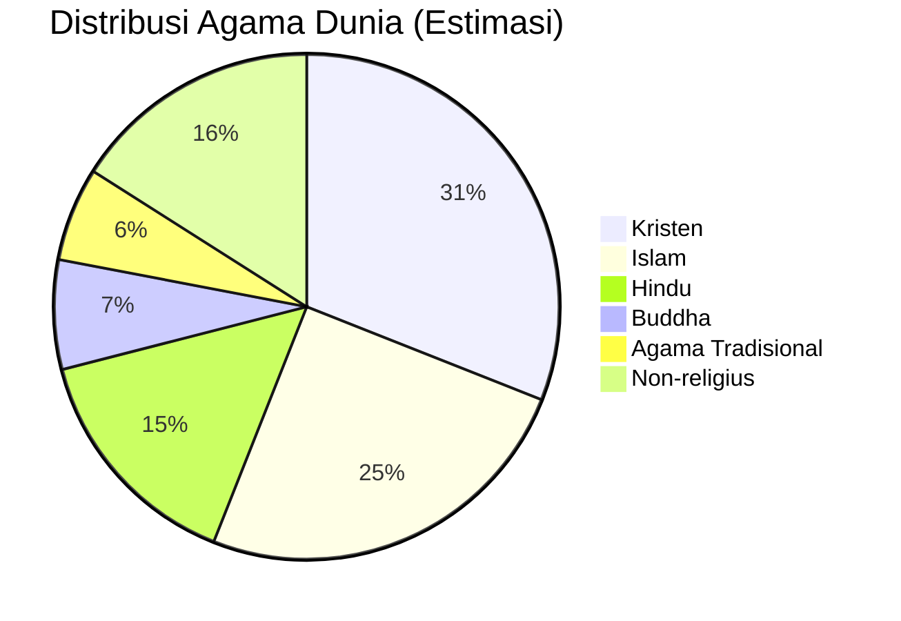

## Introduction: Pertanyaan yang Melampaui Zaman

Sepanjang sejarah peradaban manusia, tiga pertanyaan fundamental terus muncul dalam berbagai bentuk dan konteks: **"Apakah Tuhan benar-benar ada?"**, **"Jika Tuhan ada, siapa yang menciptakan-Nya?"**, dan **"Mengapa ada begitu banyak agama jika kebenaran itu satu?"**

Pertanyaan-pertanyaan ini bukan sekadar latihan intelektual abstrak. Mereka menyentuh ==inti dari apa artinya menjadi manusia==—makna hidup kita, dasar moralitas kita, harapan kita akan kehidupan setelah kematian, dan identitas kita sebagai individu dan masyarakat. Dari filsuf Yunani kuno hingga fisikawan kuantum modern, dari petani di desa terpencil hingga profesor di universitas terkemuka, hampir semua manusia pada suatu titik dalam hidupnya bergulat dengan pertanyaan-pertanyaan ini.

Artikel ini tidak bertujuan memberikan jawaban definitif yang menutup debat—karena pertanyaan-pertanyaan ini telah diperdebatkan selama ribuan tahun dan akan terus diperdebatkan. Sebaliknya, tujuan kita adalah **memetakan medan intelektual** di mana pertanyaan-pertanyaan ini berada, memahami argumen-argumen utama dari berbagai sudut pandang, dan mengeksplorasi bagaimana manusia sampai pada kesimpulan yang sangat berbeda tentang hal yang paling fundamental ini.

<Callout type="quote" title="Kata Bijak">
"Pertanyaan tentang Tuhan bukan hanya pertanyaan intelektual, tetapi pertanyaan eksistensial yang menyentuh makna hidup, moralitas, dan harapan." — Karen Armstrong, sejarawan agama
</Callout>

---

## Bagian I: Apakah Tuhan Ada? — Pemetaan Argumen Klasik dan Modern

### 1.1 Konteks Historis: Universalitas Keyakinan Religius

Sebelum kita masuk ke argumen-argumen filosofis yang kompleks, mari kita mulai dengan sebuah observasi empiris yang tidak terbantahkan: ==hampir setiap peradaban manusia yang pernah ada telah mengembangkan bentuk kepercayaan kepada realitas yang transenden==.

Dari suku-suku pemburu-pengumpul di Afrika yang melakukan ritual pemujaan leluhur, peradaban lembah sungai Mesopotamia dengan pantheon dewa-dewa mereka, hingga masyarakat teknologi maju abad ke-21 yang masih membangun tempat ibadah dan berdoa, dorongan untuk menghubungkan diri dengan sesuatu yang lebih tinggi dari realitas material sehari-hari tampaknya merupakan karakteristik universal manusia.

**Pertanyaan kunci:** Mengapa kecenderungan ini begitu universal? Ada tiga penjelasan utama:

1. **Penjelasan Teistik:** Ada realitas objektif (Tuhan) yang direspons oleh manusia di berbagai tempat dan waktu
2. **Penjelasan Evolusioner:** Struktur kognitif manusia secara alamiah menghasilkan keyakinan religius sebagai produk sampingan evolusi
3. **Penjelasan Sosio-Psikologis:** Kebutuhan psikologis dan sosial manusia mendorong penciptaan sistem kepercayaan transenden

Ketiga penjelasan ini tidak saling meniadakan secara mutlak, dan masing-masing telah dipertahankan oleh cendekiawan dari berbagai disiplin ilmu.

<Callout type="info" title="Catatan Metodologis">
Observasi universalitas agama **bukan argumen** bahwa Tuhan pasti ada (itu adalah *argumentum ad populum*, kesalahan logika). Namun, ini mengajukan pertanyaan menarik yang memerlukan penjelasan—dan berbagai penjelasan yang diusulkan membawa implikasi filosofis yang berbeda.
</Callout>

### 1.2 Argumen Kosmologis: Penyebab Pertama yang Tidak Disebabkan

Argumen kosmologis adalah salah satu argumen tertua dan paling berpengaruh untuk eksistensi Tuhan. Dalam berbagai formulasinya, argumen ini telah dikembangkan oleh filsuf dari tradisi yang sangat berbeda—dari Aristoteles di Yunani kuno, Al-Ghazali dalam tradisi Islam, hingga Thomas Aquinas dalam tradisi Katolik.

#### Struktur Dasar Argumen

1. **Premis 1:** Segala sesuatu yang mulai ada memiliki penyebab
2. **Premis 2:** Alam semesta mulai ada
3. **Kesimpulan 1:** Oleh karena itu, alam semesta memiliki penyebab
4. **Premis 3:** Penyebab ini harus berada di luar alam semesta itu sendiri dan tidak disebabkan (jika tidak, kita akan menghadapi regresi tak terbatas yang bermasalah)
5. **Kesimpulan 2:** Penyebab yang tidak disebabkan ini memiliki atribut-atribut yang kita sebut "Tuhan"

#### Dukungan dari Kosmologi Modern

Penemuan fisika kosmologi abad ke-20, terutama **teori Big Bang**, memberikan dukungan empiris untuk premis bahwa alam semesta memiliki awal. Sebelum abad ke-20, banyak pemikir (termasuk beberapa ateis) percaya bahwa alam semesta adalah abadi, yang akan menghilangkan kebutuhan akan penyebab pertama.

Model standar kosmologi modern menunjukkan bahwa **ruang, waktu, dan materi sendiri mulai ada sekitar 13,8 miliar tahun yang lalu**. Ini berarti pertanyaan "apa yang ada sebelum Big Bang?" mungkin tidak masuk akal—karena "sebelum" mengasumsikan waktu, dan waktu itu sendiri dimulai dengan Big Bang.

<Callout type="example" title="Ilustrasi Sederhana">
Bayangkan rantai domino yang jatuh. Setiap domino jatuh karena domino sebelumnya mengenainya. Tetapi rantai ini tidak bisa mundur tanpa batas—harus ada domino **pertama** yang dijatuhkan oleh sesuatu yang bukan domino (misalnya, tangan manusia). Dalam analogi ini, Big Bang adalah domino pertama, dan pertanyaannya adalah: apa yang "mendorong" domino pertama itu?
</Callout>

#### Kritik Utama

**Keberatan 1: Mengapa tidak bisa ada regresi kausal tak terbatas?**
- Respons Teistik: Bahkan dengan rantai tak terbatas, pertanyaan tetap: "Mengapa rantai ini eksis sama sekali, daripada tidak ada rantai?" Rantai itu sendiri (sebagai keseluruhan) adalah kontingen—bisa ada atau tidak ada.

**Keberatan 2: Bahkan jika ada "penyebab pertama", mengapa harus memiliki atribut-atribut Tuhan personal?**
- Respons Teistik: Analisis lebih lanjut tentang apa yang diperlukan untuk menjadi penyebab alam semesta mengarah pada atribut seperti kekuasaan, kehendak, dan kecerdasan (argumen dikembangkan secara panjang lebar dalam teologi natural).

**Keberatan 3: Jika segala sesuatu memerlukan penyebab, mengapa Tuhan dikecualikan?**
- Respons Teistik: Premis sebenarnya adalah "*segala sesuatu yang mulai ada* memerlukan penyebab." Tuhan, secara definisi, adalah *necessarily existent* (eksistensi niscaya), bukan *contingent* (kontingen).

### 1.3 Argumen Teleologis: Desain, Keteraturan, dan Fine-Tuning

Argumen teleologis, atau argumen dari desain, mengamati bahwa alam semesta menunjukkan **keteraturan yang luar biasa** dan "penyetelan halus" yang memungkinkan kehidupan ada.

#### Observasi Fine-Tuning

Konstanta fundamental fisika berada dalam rentang yang sangat sempit yang memungkinkan kehidupan:

| Konstanta | Fine-Tuning | Konsekuensi Perubahan |
|-----------|-------------|----------------------|
| **Kekuatan gravitasi** | Jika 1 bagian dalam $10^{40}$ lebih kuat/lemah | Bintang tidak bisa terbentuk atau langsung runtuh |
| **Konstanta kosmologis** | Jika sedikit berbeda | Alam semesta mengembang terlalu cepat atau runtuh |
| **Rasio elektron-proton** | Presisi ekstrem | Kimia tidak bisa ada |
| **Muatan elektron** | Harus tepat | Atom tidak stabil |

**Argumen:** Probabilitas bahwa semua konstanta ini "kebetulan" jatuh dalam rentang yang tepat untuk kehidupan adalah sangat, sangat kecil. Ini mengisyaratkan ==desain yang disengaja==.

#### Formulasi Modern: Argumen Fine-Tuning

Argumen fine-tuning tidak mengatakan bahwa kehidupan dirancang (yang akan menghadapi keberatan Darwinian), tetapi bahwa **kondisi awal dan hukum-hukum alam semesta itu sendiri tampak "disetel" dengan presisi yang tidak mungkin** untuk memungkinkan kehidupan muncul.

<Callout type="tip" title="Kutipan Fisikawan">
"Alam semesta tampaknya tahu bahwa kita akan datang." — Freeman Dyson, fisikawan teoretis
</Callout>

#### Respon Skeptis: Hipotesis Multiverse

**Hipotesis multiverse** mengusulkan bahwa mungkin ada **triliunan alam semesta** dengan konstanta yang berbeda, dan kita secara alami menemukan diri kita di alam semesta yang mendukung pengamat (*prinsip antropik*). Jika ada cukup banyak alam semesta, tidak mengherankan bahwa setidaknya satu memiliki parameter yang tepat untuk kehidupan.

**Kritik terhadap multiverse:**
1. Tidak ada bukti empiris langsung untuk multiverse
2. Multiverse sendiri memerlukan penjelasan—mengapa ada multiverse daripada tidak ada?
3. Ini mungkin hanya memindahkan masalah, bukan menyelesaikannya

### 1.4 Argumen Moral: Fondasi Objektivitas Etis

Argumen moral dimulai dengan observasi bahwa manusia memiliki **intuisi moral yang kuat**—kita percaya bahwa tindakan tertentu (seperti genosida, penyiksaan anak-anak) adalah ==benar-benar salah==, bukan hanya tidak disukai atau tidak disetujui oleh masyarakat tertentu.

#### Struktur Argumen

1. **Premis 1:** Jika Tuhan tidak ada, nilai-nilai moral objektif tidak ada (moralitas hanya konstruksi sosial atau preferensi subjektif)
2. **Premis 2:** Nilai-nilai moral objektif ada
3. **Kesimpulan:** Oleh karena itu, Tuhan ada

#### Penjelasan Lebih Dalam

Argumen ini **tidak** mengatakan bahwa ateis tidak bisa bermoral. Sebaliknya, argumen ini mengatakan bahwa tanpa fondasi transenden, tidak ada dasar untuk mengatakan bahwa Holocaust adalah *secara objektif* salah—hanya bahwa kita (secara kebetulan) tidak menyukainya, atau masyarakat kita telah berevolusi untuk menolaknya.

**Pertanyaan kunci:** Apakah moralitas adalah:
- **Subjektif:** "Saya pikir pembunuhan itu salah" (seperti "Saya suka es krim cokelat")
- **Intersubjektif:** "Masyarakat kita setuju pembunuhan itu salah" (konvensi sosial)
- **Objektif:** "Pembunuhan itu salah terlepas dari siapa yang percaya apa" (kebenaran moral absolut)

Teisme berpendapat bahwa hanya dengan Tuhan sebagai sumber moral kita bisa memiliki **moralitas objektif**.

<Callout type="warning" title="Dilema Euthyphro">
Kritik klasik: Apakah sesuatu baik karena Tuhan memerintahkannya (yang membuat moralitas sewenang-wenang), atau Tuhan memerintahkannya karena itu baik (yang berarti standar kebaikan ada independen dari Tuhan)? Teolog telah mengusulkan berbagai resolusi, termasuk bahwa sifat Tuhan *adalah* standar kebaikan.
</Callout>

### 1.5 Argumen Ontologis: Eksistensi dari Konsep Kesempurnaan

Argumen ontologis, pertama kali dirumuskan oleh **Anselm dari Canterbury** (1033-1109), adalah argumen yang paling kontroversial dan paling filosofis karena mencoba membuktikan eksistensi Tuhan dari **definisi Tuhan itu sendiri**, tanpa referensi ke pengalaman empiris.

#### Versi Anselm (Disederhanakan)

1. Tuhan didefinisikan sebagai "sesuatu yang tidak ada yang lebih besar dapat dibayangkan"
2. Sesuatu yang eksis dalam realitas lebih besar daripada sesuatu yang hanya eksis dalam pikiran
3. Jika Tuhan hanya eksis dalam pikiran, maka kita bisa membayangkan sesuatu yang lebih besar (Tuhan yang eksis dalam realitas)
4. Ini kontradiksi dengan definisi
5. Oleh karena itu, Tuhan harus eksis dalam realitas

#### Formulasi Modal Modern (Alvin Plantinga)

Jika **mungkin** ada Wujud yang Niscaya (*necessarily existent being*), maka Wujud itu **pasti eksis**—karena jika eksis dalam satu dunia yang mungkin, eksis dalam semua dunia yang mungkin (itulah arti "niscaya").

#### Kritik Klasik: Kant

Immanuel Kant berpendapat bahwa argumen ini membuat kesalahan dengan memperlakukan "eksistensi" sebagai properti atau predikat. Mengatakan "X eksis" bukan menambahkan properti baru ke X—itu mengatakan bahwa konsep X ter-instantiasi dalam realitas.

**Analogi:** Saya bisa mendefinisikan "koin emas di saku saya yang memiliki nilai $1 juta," tetapi definisi itu tidak membuat koin itu benar-benar ada di saku saya.

---

## Bagian II: "Siapa yang Menciptakan Tuhan?" — Memahami Paradoks yang Sering Disalahpahami

### 2.1 Mengapa Pertanyaan Ini Penting—dan Mengapa Sering Keliru

Pertanyaan "Siapa yang menciptakan Tuhan?" adalah salah satu keberatan paling umum terhadap teisme, dan sering diajukan sebagai *reductio ad absurdum* (bukti melalui reduksi ke absurditas) dari argumen kosmologis.

**Logika yang tampak sederhana:**
> "Jika segala sesuatu memerlukan penyebab, maka Tuhan juga memerlukan penyebab. Jika Tuhan tidak memerlukan penyebab, mengapa alam semesta memerlukan penyebab?"

Namun, dari perspektif **teisme klasik** (Islam, Kristen ortodoks, Yahudi Maimonidean), pertanyaan ini melibatkan ==kesalahan kategori== (*category error*)—mencoba menerapkan aturan untuk satu jenis entitas (hal-hal kontingen dalam ruang dan waktu) kepada jenis entitas yang secara fundamental berbeda (Wujud yang Niscaya yang melampaui ruang dan waktu).

### 2.2 Perbedaan Kritis: Kontingen vs. Niscaya

Untuk memahami respons teistik, kita perlu memahami perbedaan filosofis mendasar antara dua jenis eksistensi:

#### Eksistensi Kontingen (*Contingent Existence*)

- Sesuatu yang **mungkin ada atau mungkin tidak ada**
- Eksistensinya **tergantung pada kondisi dan sebab-sebab eksternal**
- Semua hal fisik dalam alam semesta (planet, bintang, makhluk hidup, bahkan alam semesta sebagai keseluruhan) adalah kontingen
- Setiap hal kontingen memerlukan penjelasan eksternal untuk eksistensinya

**Contoh konkret:** Anda dan saya adalah kontingen. Kita tidak *harus* eksis. Eksistensi kita bergantung pada rantai panjang sebab-akibat: orang tua kita bertemu, sel sperma tertentu membuahi sel telur tertentu, kondisi lingkungan memungkinkan kehamilan dan kelahiran, dan seterusnya. Jika satu saja kondisi awal berbeda, kita tidak akan pernah ada.

#### Eksistensi Niscaya (*Necessary Existence*)

- Sesuatu yang **harus ada**—tidak mungkin tidak eksis
- Eksistensinya **tidak tergantung pada apa pun di luar dirinya sendiri**
- Tidak memiliki penyebab eksternal, karena **sifatnya itu sendiri menjamin eksistensinya**
- Jika ada entitas niscaya, entitas itu ada di **semua kemungkinan dunia**

**Analogi matematis:** Kebenaran matematis seperti "2 + 2 = 4" atau hukum logika seperti "A = A" (hukum identitas) sering dianggap memiliki eksistensi niscaya. Tidak masuk akal untuk bertanya, "Siapa yang menciptakan fakta bahwa 2 + 2 = 4?" karena itu bukan jenis hal yang bisa diciptakan atau dihancurkan—itu niscaya.

### 2.3 Argumen Teistik: Mengapa Harus Ada Wujud yang Niscaya

Teisme klasik berpendapat bahwa ==jika hanya ada entitas-entitas kontingen, tidak akan ada yang eksis==. Inilah alasannya:

#### Prinsip Penjelasan Sufisien

Untuk setiap fakta atau keadaan, harus ada **penjelasan tentang mengapa itu demikian** (dan bukan sebaliknya). Penjelasan ini bisa **intrinsik** (dalam sifat hal itu sendiri) atau **ekstrinsik** (dalam sesuatu yang lain).

#### Masalah Regresi Tak Terbatas

Bayangkan rantai sebab-akibat yang mundur tanpa batas:
- A disebabkan oleh B
- B disebabkan oleh C  
- C disebabkan oleh D  
- Dan seterusnya tanpa akhir...

Bahkan dengan rantai tak terbatas seperti itu, pertanyaan tetap: **"Mengapa rantai ini eksis sama sekali, daripada tidak ada rantai?"**

Rantai itu sendiri (sebagai keseluruhan) adalah **kontingen**—bisa ada atau tidak ada. Jadi kita masih memerlukan penjelasan *di luar* rantai kontingen tersebut.

<Callout type="example" title="Ilustrasi: Rangkaian Gerbong Kereta">
Bayangkan rangkaian gerbong kereta yang tak terbatas panjangnya. Setiap gerbong ditarik oleh gerbong di depannya. Tetapi jika tidak ada lokomotif (sumber gerakan yang tidak ditarik oleh yang lain), seluruh rangkaian tidak akan bergerak sama sekali—tidak peduli berapa panjangnya. Dalam analogi ini, Wujud yang Niscaya adalah "lokomotif" yang membuat seluruh rantai kausal mungkin.
</Callout>

#### Kesimpulan

Harus ada ==setidaknya satu entitas yang eksistensinya tidak kontingen, tetapi niscaya==—sesuatu yang ada bukan karena sesuatu yang lain, tetapi karena **sifat alaminya sendiri**.

### 2.4 Atribut-atribut Wujud yang Niscaya

Jika analisis di atas benar, apa yang bisa kita simpulkan tentang Wujud yang Niscaya ini?

| Atribut | Penjelasan |
|---------|------------|
| **Tidak disebabkan** | Tidak memiliki penyebab eksternal atau asal temporal |
| **Kekal** | Tidak mulai ada dan tidak akan berhenti ada |
| **Tidak bergantung** | Eksistensinya tidak tergantung pada apa pun |
| **Tidak berubah (dalam esensi)** | Perubahan memerlukan potensi yang belum terealisasi, tetapi Wujud Niscaya harus sudah dalam keadaan penuh-realisasi (*actus purus*) |
| **Tidak material** | Materi terbuat dari bagian-bagian dan tunduk pada perubahan, jadi harus imaterial |
| **Tunggal** | Tidak bisa ada dua Wujud yang Niscaya (argumen panjang dalam filsafat Islam dan skolastik) |
| **Berkuasa** | Harus memiliki kuasa untuk menyebabkan alam semesta eksis |
| **Berkehendak** | Harus memilih untuk menciptakan (karena eksistensi alam adalah kontingen, bukan niscaya) |

Teisme kemudian berpendang bahwa entitas dengan atribut-atribut ini adalah ==apa yang dimaksud dengan "Tuhan" dalam tradisi monoteis==.

### 2.5 Kritik Atheistik: Apakah Ini Sekadar Permainan Kata?

Kritikus teisme berpendapat bahwa ini adalah permainan definisi yang tidak menyelesaikan masalah:

#### Keberatan 1: Mengapa tidak berhenti pada alam semesta?

**Kritik:** Jika teisme mengklaim Tuhan tidak memerlukan penjelasan lebih lanjut, mengapa tidak berhenti pada alam semesta itu sendiri sebagai "brute fact" (fakta dasar yang tidak perlu penjelasan)?

**Respons Teistik:** Alam semesta menunjukkan semua tanda-tanda kontingensi:
- Bisa berbeda (konstanta fisika bisa memiliki nilai lain)
- Memiliki bagian-bagian (materi, energi, ruang, waktu)
- Tunduk pada perubahan (ekspansi, evolusi)
- Memiliki awal (Big Bang)

Jika alam semesta adalah niscaya, ia akan eksis dengan kebutuhan yang sama seperti hukum logika—tetapi itu tidak tampak benar.

#### Keberatan 2: Kesalahan Komposisi

**Kritik:** Hanya karena setiap *bagian* alam semesta kontingen, tidak berarti *alam semesta sebagai keseluruhan* kontingen.

**Respons Teistik:** Tetapi alam semesta itu sendiri (sebagai keseluruhan konfigurasi materi-energi-ruang-waktu) tampaknya bisa berbeda atau tidak eksis sama sekali. Ini adalah definisi kontingensi.

#### Keberatan 3: Konsep "Eksistensi Niscaya" Mungkin Tidak Koheren

**Kritik:** Mungkin tidak ada entitas yang benar-benar "harus" eksis. Mungkin eksistensi selalu kontingen.

**Respons Teistik:** Jika tidak ada eksistensi niscaya, maka semua eksistensi adalah kontingen, yang mengarah pada regress problem yang disebutkan di atas. Jika segala sesuatu kontingen, tidak ada yang eksis.

---

## Bagian III: Mengapa Ada Banyak Agama? — Sejarah, Penyebab, dan Interpretasi

### 3.1 Observasi Dasar: Fakta Keragaman Religius

Jika Tuhan eksis dan telah mewahyukan kebenaran kepada umat manusia, mengapa ada begitu banyak tradisi religius yang berbeda dan sering bertentangan? Ini adalah ==salah satu keberatan paling kuat terhadap klaim kebenaran eksklusif agama tertentu==.

**Statistik keragaman:**
- Saat ini ada **ribuan tradisi religius** yang dapat diidentifikasi di dunia
- Lima agama besar (Kristen, Islam, Hindu, Buddha, Yahudi) mencakup sekitar 75% populasi dunia, tetapi masing-masing terbagi menjadi denominasi, sekte, dan aliran yang tak terhitung jumlahnya
- Agama-agama suku dan tradisi lokal menambahkan ribuan lagi variasi

### 3.2 Penjelasan Historis: Bagaimana Agama Muncul dan Berkembang

#### A. Faktor Geografis dan Temporal

Agama-agama besar dunia muncul di tempat dan waktu yang berbeda:

| Agama | Wilayah Asal | Periode | Konteks Kunci |
|-------|--------------|---------|---------------|
| **Hinduisme** | Anak benua India | ~1500 SM - 500 M | Berkembang organik dari tradisi Veda |
| **Yahudi** | Levant (Palestina kuno) | ~1200-500 SM | Monoteis dalam konteks politeisme kuno |
| **Buddha** | India (Nepal/Bihar) | ~500 SM | Reaksi terhadap ritualisme dan sistem kasta |
| **Kristen** | Palestina Romawi | Abad ke-1 M | Muncul dari Yahudi, dipengaruhi Helenisme |
| **Islam** | Arabia | Abad ke-7 M | Reformasi tauhid dalam konteks Arab |

Setiap agama membawa **jejak konteks historis dan budayanya**. Misalnya:
- Ajaran Buddha tentang *dukkha* (penderitaan) dan keinginan untuk membebaskan diri darinya sangat sesuai dengan konteks India kuno dengan sistem samsara yang sudah ada
- Islam muncul di masyarakat Arab abad ke-7 dan membawa reformasi terhadap praktik-praktik tribal seperti pembunuhan bayi perempuan dan penyembahan berhala

<Callout type="info" title="Insight Antropologis">
Agama tidak muncul dalam vakum. Mereka adalah respons terhadap pertanyaan eksistensial manusia *dalam konteks tertentu*—geografis, budaya, politik, dan intelektual.
</Callout>

#### B. Bahasa dan Transmisi

Agama ditransmisikan melalui bahasa manusia, dan bahasa membawa **bias, nuansa, dan keterbatasan**:

- **Terjemahan bermasalah:** Kata Ibrani *almah* diterjemahkan sebagai "perawan" dalam tradisi Kristen tetapi "perempuan muda" dalam tradisi Yahudi
- **Istilah tak terterjemahkan:** Konsep seperti *Logos* (Yunani), *Dharma* (Sanskerta), *Tawhid* (Arab) tidak memiliki ekuivalen langsung lintas bahasa
- **Tradisi oral:** Sebelum penulisan, transmisi oral memungkinkan variasi dan elaborasi

#### C. Faktor Politik dan Kekuasaan

Sejarah agama tidak bisa dipisahkan dari sejarah kekuasaan politik:

**Contoh transformatif:**
1. **Constantine dan Kristenisasi Kekaisaran Romawi** (abad ke-4) — mengubah Kristen dari agama yang dianiaya menjadi agama negara
2. **Ekspansi Islam awal** (7-8 M) — membawa agama baru ini dari Arabia ke Spanyol hingga Asia Tengah dalam satu abad
3. **Reformasi Protestan** (abad ke-16) — dipicu tidak hanya oleh keberatan teologis tetapi juga oleh politik Eropa dan korupsi institusional
4. **Kolonialisme Eropa** — menyebarkan Kristen tetapi juga memicu gerakan reformasi dan revivalisme dalam agama-agama lokal

#### D. Evolusi Doktrin dan Teologi

Agama bukan entitas statis—mereka **berevolusi seiring waktu**:

- **Kristen awal** sangat berbeda dari Kristen abad ke-4 (pra-Nicaea vs. post-Nicaea)
- **Islam** berkembang dari komunitas kecil di Mekah menjadi kekhalifahan besar, yang memerlukan pengembangan fiqh (hukum) dan teologi sistematis
- **Buddha** pecah menjadi Theravada, Mahayana, dan Vajrayana, masing-masing dengan doktrin dan praktik yang sangat berbeda
- **Hindu** lebih merupakan keluarga tradisi daripada agama tunggal—dari monoteisme Vaishnava hingga non-dualisme Advaita Vedanta

### 3.3 Penjelasan Teologis: Respons dari Dalam Tradisi Religius

Bagaimana tradisi religius itu sendiri menjelaskan keragaman?

#### Perspektif Pluralis Religius (John Hick)

**Tesis:** Semua agama besar adalah respons yang berbeda tetapi legitimate terhadap **Realitas Ultima yang sama**.

**Analogi:** "Orang buta dan gajah"—setiap tradisi menyentuh aspek berbeda dari kebenaran yang sama. Yang satu menyentuh belalai dan berkata "seperti ular," yang lain menyentuh kaki dan berkata "seperti pilar," dll.

**Kritik terhadap pluralisme:**
- Menyederhanakan perbedaan doktrin yang nyata dan penting (misalnya, Islam dan Kristen memiliki pandangan yang sangat berbeda tentang Yesus—apakah dia Tuhan atau nabi?)
- Sering dibuat dari perspektif Barat yang memaksakan kategori-kategori asing pada tradisi lain

#### Perspektif Inklusivisme

**Tesis:** Satu agama memiliki kebenaran penuh, tetapi agama lain mengandung **elemen-elemen kebenaran**.

**Contoh Kristen (Karl Rahner):** "Kristen anonim"—orang-orang yang tidak secara formal Kristen tetapi hidup sesuai dengan nilai-nilai Kristiani dapat diselamatkan.

**Contoh Islam:** "Ahli Kitab" (Yahudi dan Kristen) memiliki status khusus dalam hukum Islam karena menerima wahyu sebelumnya, meskipun dianggap telah dikorupsi.

#### Perspektif Eksklusivisme

**Tesis:** Hanya satu agama yang benar; yang lain adalah ==salah atau disesatkan==.

**Penjelasan perbedaan:**
- Wahyu sebelumnya yang telah dikorupsi (pandangan Islam terhadap Taurat dan Injil)
- Pengaruh setan atau kekuatan jahat
- Kekerasan hati manusia dan penolakan terhadap kebenaran

### 3.4 Penjelasan Naturalistik: Agama sebagai Fenomena Sosial-Psikologis

Dari perspektif naturalistik (antropologi, psikologi evolusioner, sosiologi agama), keragaman agama dijelaskan **tanpa referensi ke wahyu ilahi**:

#### A. Teori Evolusi Agama

**Agama sebagai produk sampingan kognitif:**
- Kecenderungan manusia untuk mendeteksi "agen" (intensionalitas) di balik kejadian alam—berguna untuk bertahan hidup (lebih baik menganggap gerakan di semak-semak adalah predator daripada mengabaikannya)
- Ini dapat menghasilkan keyakinan pada agen supernatural

**Fungsi sosial:**
- Agama mempromosikan kerjasama kelompok, kepercayaan, dan pengorbanan altruistik
- Kelompok dengan keyakinan religius yang kuat mungkin memiliki keunggulan kompetitif dalam sejarah evolusioner

#### B. Teori Proyeksi (Feuerbach, Freud)

**Tesis:** Tuhan adalah **proyeksi keinginan dan kebutuhan manusia**:
- Keinginan akan ayah yang melindungi (Freud)
- Idealisasi sifat-sifat manusia (Feuerbach)
- Agama muncul sebagai mekanisme koping terhadap kematian, ketidakadilan, dan ketidakpastian

#### C. Teori Fungsi Sosial (Durkheim, Geertz)

**Tesis:** Agama berfungsi untuk:
- Memelihara **kohesi sosial**
- Melegitimasi tatanan sosial
- Menyediakan **sistem makna bersama**
- Ritual religius memperkuat identitas kelompok dan nilai-nilai komunal

<Callout type="warning" title="Respons Teistik">
Bahkan jika sains dapat menjelaskan **bagaimana** agama muncul (mekanisme kognitif dan sosial), ini tidak menjawab pertanyaan **apakah** keyakinan religius benar. Analogi: kita bisa menjelaskan mekanisme neurologis penglihatan, tetapi ini tidak berarti bahwa dunia eksternal yang kita lihat tidak nyata.
</Callout>

---

## Bagian IV: Sintesis dan Refleksi Kritis

### 4.1 Apa yang Kita Pelajari?

Setelah menjelajahi argumen untuk eksistensi Tuhan, paradoks "siapa menciptakan Tuhan", dan asal-usul keragaman agama, beberapa kesimpulan dapat ditarik:

#### 1. Pertanyaan Ini Kompleks dan Multidimensi

- Tidak ada "bukti sederhana" yang akan memuaskan semua orang
- Filsafat, sains, sejarah, dan pengalaman personal semuanya relevan
- **Orang yang cerdas dan jujur secara intelektual bisa sampai pada kesimpulan yang berbeda**

#### 2. Konteks Sangat Penting

- "Tuhan" dalam teisme klasik adalah konsep yang sangat spesifik (Wujud yang Niscaya, transenden, imaterial)—bukan "orang tua super" atau "alien luar angkasa"
- Pertanyaan "siapa menciptakan Tuhan" sering didasarkan pada **kesalahpahaman** tentang apa yang diklaim teisme

#### 3. Keragaman Agama Tidak Otomatis Mendiskualifikasi Semua Klaim Kebenaran

- Fakta bahwa ada banyak teori dalam fisika tidak berarti tidak ada kebenaran objektif tentang alam
- Namun, keragaman memang menimbulkan pertanyaan serius tentang **bagaimana kita mengevaluasi klaim kebenaran yang bersaing**

### 4.2 Kriteria untuk Mengevaluasi Klaim Religius

Jika seseorang ingin mengevaluasi agama-agama secara serius, kriteria apa yang harus digunakan?

| Kriteria | Pertanyaan Kunci |
|----------|------------------|
| **Koherensi Internal** | Apakah ajaran agama itu logis dan konsisten? |
| **Korespondensi dengan Realitas** | Apakah klaim faktual agama konsisten dengan apa yang kita ketahui dari sumber lain? |
| **Buah Moral dan Spiritual** | Apakah agama menghasilkan kebajikan, keadilan, kasih, dan pertumbuhan manusia? |
| **Preservasi dan Transmisi** | Bagaimana agama mempertahankan ajarannya dari generasi ke generasi? |
| **Pengalaman dan Kesaksian** | Apakah ada kesaksian yang dapat dipercaya tentang pengalaman transformatif? |

<Callout type="tip" title="Catatan Penting">
Kriteria-kriteria ini sendiri bisa diperdebatkan—orang dari tradisi yang berbeda mungkin memberi bobot yang berbeda pada masing-masing kriteria.
</Callout>

### 4.3 Menghindari Ekstrem: Jalan Tengah Intelektual

Dalam menghadapi pertanyaan-pertanyaan ini, ada beberapa ekstrem yang harus dihindari:

**❌ Ekstrem 1: Fideisme Buta**
- Percaya tanpa alasan sama sekali
- "Saya percaya karena saya diberitahu untuk percaya"
- Menolak untuk mempertimbangkan bukti atau argumen

**❌ Ekstrem 2: Skeptisisme Radikal**
- Menolak semua keyakinan religius sebagai irasional tanpa pemeriksaan
- Mengabaikan argumen filosofis yang canggih sebagai "omong kosong"
- Menganggap semua orang beriman sebagai bodoh atau ditipu

**✅ Jalan Tengah:**
- **Iman yang diperjuangkan secara intelektual** (*faith seeking understanding* — Anselm)
- Kesediaan untuk mempertanyakan keyakinan sendiri
- Rasa hormat terhadap argumen dari posisi yang berlawanan
- Pengakuan terhadap **keterbatasan pengetahuan manusia**

---

## Kesimpulan: Hidup dengan Pertanyaan Besar

Pertanyaan "Apakah Tuhan ada?", "Siapa menciptakan Tuhan?", dan "Mengapa ada banyak agama?" mungkin ==tidak akan pernah dijawab dengan kepastian absolut== di dunia ini. Tetapi ini tidak berarti pertanyaan-pertanyaan ini tidak penting atau bahwa upaya untuk menjawabnya sia-sia.

Sepanjang sejarah manusia, pertanyaan-pertanyaan ini telah:
- **Membentuk peradaban**
- **Menginspirasi seni dan filsafat terbesar**
- **Memotivasi tindakan altruisme yang luar biasa**
- Dan sayangnya, juga **memicu konflik dan perpecahan**

Bagaimana kita mendekati pertanyaan-pertanyaan ini—dengan **kerendahan hati dan keterbukaan intelektual** atau dengan **kesombongan dan kebencian**—mungkin sama pentingnya dengan kesimpulan yang kita capai.

<Callout type="quote" title="Penutup Reflektif">
"Hidup berarti memiliki pertanyaan; hidup berarti berjalan menuju jawaban." — Rainer Maria Rilke

"Pertanyaan yang diajukan dengan jujur lebih berharga daripada jawaban yang diterima tanpa pemikiran." — Wisdom tradisional
</Callout>

Bagi beberapa orang, jawaban akan ditemukan dalam **keyakinan religius yang kokoh**. Bagi yang lain, dalam **keraguan yang jujur** atau **pencarian yang terus berlanjut**. Yang penting adalah bahwa kita terlibat dengan pertanyaan-pertanyaan ini dengan ==kejujuran, ketelitian intelektual, dan keterbukaan untuk ditantang==.

---

## Referensi dan Bacaan Lanjutan

### Argumen untuk Eksistensi Tuhan
- Craig, William Lane. *The Kalam Cosmological Argument* (1979)
- Plantinga, Alvin. *The Nature of Necessity* (1974)
- Swinburne, Richard. *The Existence of God* (2004)

### Respons Atheistik
- Mackie, J.L. *The Miracle of Theism* (1982)
- Dawkins, Richard. *The God Delusion* (2006)
- Oppy, Graham. *Arguing About Gods* (2006)

### Keragaman Agama
- Hick, John. *An Interpretation of Religion* (1989)
- Smith, Huston. *The World's Religions* (1991)
- Armstrong, Karen. *A History of God* (1993)

### Filsafat Agama Islam
- Al-Ghazali. *The Incoherence of the Philosophers* (abad ke-11)
- Ibn Sina (Avicenna). *The Metaphysics of The Healing* (abad ke-11)
- Al-Farabi. *The Political Regime* (abad ke-10)

### Filsafat Pikiran & Kesadaran
- Chalmers, David. *The Conscious Mind* (1996)
- Searle, John. "Minds, Brains, and Programs" (1980)

---

*Artikel ini ditulis sebagai eksplorasi intelektual yang jujur terhadap pertanyaan-pertanyaan fundamental tentang Tuhan dan agama. Penulis berharap pembaca dari berbagai latar belakang keyakinan dapat menemukan sesuatu yang berharga dalam analisis ini, dan bahwa artikel ini dapat berkontribusi pada dialog yang lebih berpengetahuan dan hormat tentang topik-topik penting ini.*
