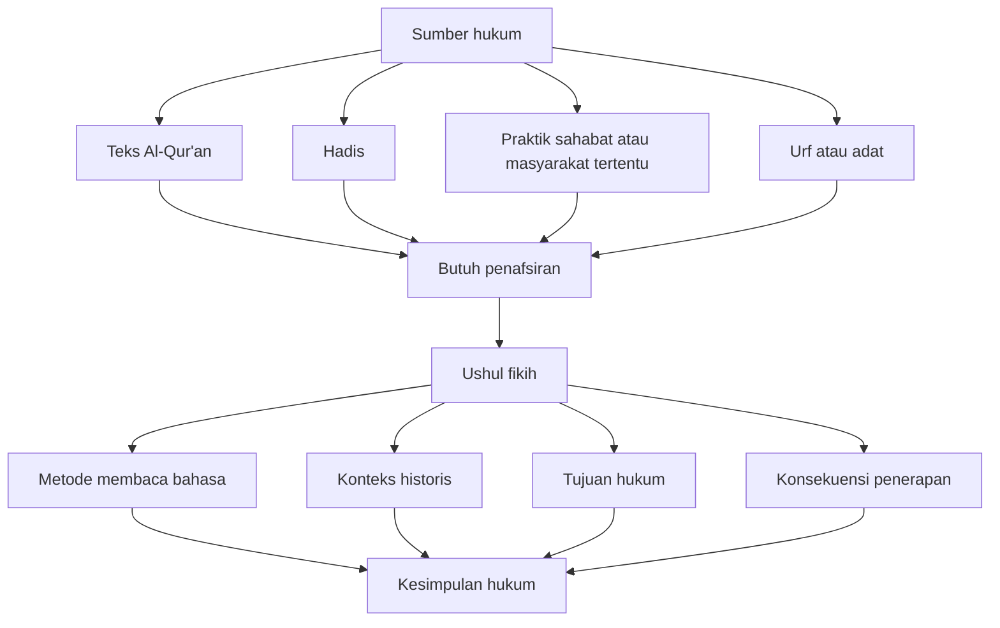
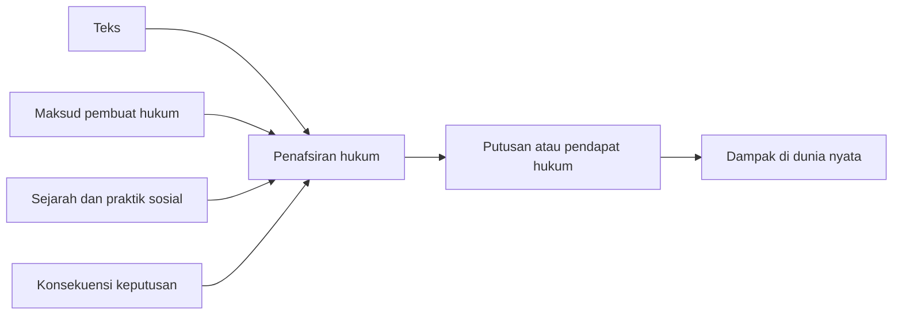
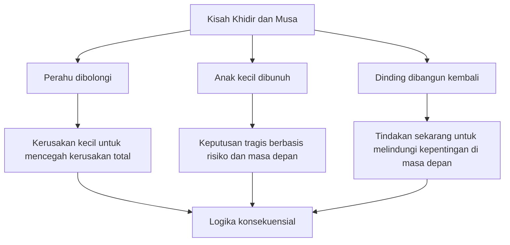
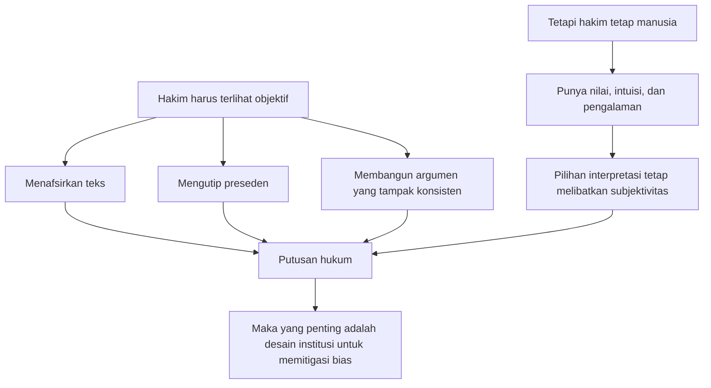

## 📚 Pengantar: Ketika Hukum Islam Bertemu Chicago School, dan Pertanyaannya Menjadi Sangat Mengganggu

Judul episode ini provokatif sekali: **What if God is an Economist?** — *bagaimana jika Tuhan adalah seorang ekonom?* 😄📈

Sekilas, pertanyaan seperti ini terdengar nyeleneh, bahkan bisa dianggap terlalu berani. Tetapi justru karena keberaniannya itu, pertanyaan ini membuka satu ruang berpikir yang sangat kaya: bagaimana kalau hukum, termasuk **hukum Islam**, tidak hanya dibaca sebagai kumpulan aturan yang statis, melainkan juga sebagai sistem yang sangat sadar terhadap **konsekuensi**, **insentif**, **manfaat**, **kerugian**, dan **pengelolaan kehidupan sosial**?

Episode ini sebenarnya tidak sedang mengatakan bahwa Tuhan “adalah ekonom” dalam arti profesi literal. Tentu bukan. Yang sedang diuji adalah satu kemungkinan intelektual: **bagaimana kalau banyak struktur hukum Islam justru bisa dipahami dengan sangat baik melalui kacamata law and economics** *(analisis hukum dan ekonomi)*, yaitu cara berpikir yang melihat hukum bukan hanya dari teks, tapi juga dari **hasil nyata**, **dampak kebijakan**, dan **konsekuensi pilihan**. ⚖️💰

Yang membuat episode ini menarik bukan hanya topiknya, tetapi juga jalur intelektual yang dipakai. Ia berangkat dari pengalaman belajar **ushul fikih** *(ilmu dasar-dasar penarikan hukum Islam)*, lalu bergerak ke **filsafat hukum**, kemudian ke **interpretasi hukum**, **Richard Posner**, **Gary Becker**, **valuing life** *(menilai nilai nyawa/manfaat hidup dalam kebijakan publik)*, dan akhirnya sampai pada satu tesis yang sangat penting: 

> **bahwa hukum yang baik tidak cukup hanya “benar menurut teks”, tetapi juga harus dipikirkan akibatnya secara serius.**

Ini adalah artikel tentang kegelisahan intelektual yang sangat sehat. Dan kalau dibaca dengan tenang, ia sebenarnya sedang mengajak kita melakukan sesuatu yang sangat langka di ruang publik kita hari ini: **berpikir kompleks tanpa panik, bertanya tanpa takut, dan menyadari bahwa satu masalah hukum bisa punya lebih dari satu jawaban yang sama-sama serius.** 🧠✨

---

## 🧭 Bagian 1: Awal Mulanya Sangat Sederhana — “Lu Enggak Bisa Bedain Air Wudu”

Yang membuat cerita ini hidup adalah titik mulanya yang sangat manusiawi, bahkan lucu 😂. Semuanya bermula dari tantangan personal. Bukan dari seminar besar, bukan dari disertasi, bukan dari proyek akademik mahal, tetapi dari ejekan yang memancing rasa penasaran: *“lu enggak bisa bedain air buat wudu.”*

Bagi banyak orang, ini mungkin cuma candaan. Tapi dalam cerita ini, tantangan itu berubah menjadi **challenge accepted** yang kemudian membuka pintu ke dunia ushul fikih, perbandingan mazhab, filsafat hukum, hingga ekonomi hukum. 🚪

Di sinilah ada pelajaran penting: kadang jalan menuju pemikiran besar justru tidak dimulai dari ambisi menjadi besar, tetapi dari **rasa malu intelektual yang produktif**. Kita merasa belum tahu, lalu kita terdorong untuk benar-benar belajar. Dan begitu masuk, ternyata yang dibuka bukan satu pintu kecil, tetapi satu **labirin pengetahuan**. 🌀

Cerita ini juga mengingatkan bahwa belajar agama secara serius tidak harus berujung pada fanatisme sempit. Justru bisa sebaliknya: semakin belajar, semakin sadar bahwa banyak hal yang dulu kita kira sederhana ternyata sangat rumit, sangat historis, dan sangat terbuka untuk diperdebatkan. 📖

<Callout type="info" title="Pelajaran Pertama dari Episode Ini">
Kadang satu tantangan kecil bisa mengubah arah hidup intelektual seseorang. Bukan karena tantangan itu sendiri besar, tetapi karena ia memaksa seseorang mengakui: **'saya belum tahu, dan saya perlu belajar sungguh-sungguh.'** 🎯
</Callout>

---

## ⚖️ Bagian 2: Apa Itu Hukum? — Pertanyaan yang Tidak Pernah Selesai Dijawab

Salah satu pernyataan paling penting dalam episode ini adalah: **bahkan setelah ribuan tahun, manusia masih belum punya jawaban final tentang apa itu hukum**. Dan ini benar. 

Bagi sebagian orang, fakta ini mungkin terdengar membuat frustrasi. “Lho, masa ilmu hukum dipelajari puluhan tahun tapi definisi hukumnya sendiri belum tuntas?” Tetapi justru di situlah keindahan intelektualnya. Hukum adalah salah satu disiplin yang tidak pernah selesai, karena ia berdiri di persimpangan:

- **norma** *(apa yang seharusnya)*,
- **kekuasaan** *(siapa yang boleh memerintah)*,
- **masyarakat** *(apa yang hidup dan berlaku)*,
- **bahasa** *(apa arti teks hukum)*,
- dan **akibat nyata** *(apa dampak keputusan itu di dunia).* 🌍

Maka ketika seseorang berkata “hukum itu ya begini”, sebenarnya ia sedang menyederhanakan sesuatu yang memang dari sananya tidak sederhana. Bahkan dalam filsafat hukum modern, selalu ada perdebatan:

- apakah hukum itu perintah otoritas? 🏛️
- apakah hukum itu cerminan moral? 🌿
- apakah hukum itu praktik sosial yang hidup? 👥
- ataukah hukum itu sistem teks yang harus diinterpretasi? 📜

Episode ini dengan sangat bagus menunjukkan bahwa kesadaran seperti itu membuat kita tidak **jumud**. Kita tidak merasa ada satu jawaban final yang menutup semua ruang diskusi. Ini sangat penting terutama dalam pembahasan hukum Islam, karena banyak orang mengira bahwa sejak sebuah pendapat terdengar “agama”, maka debat selesai. Padahal justru dalam sejarah pemikiran Islam, **perbedaan pendapat adalah bagian dari tradisi intelektual itu sendiri**. 🕌

---

## 📖 Bagian 3: Ushul Fikih — Seni Membaca, Menafsirkan, dan Menarik Hukum

Untuk memahami inti episode ini, kita harus berhenti sejenak pada konsep **ushul fikih**. Secara sederhana, ushul fikih adalah ilmu yang membahas **bagaimana cara memahami sumber hukum dan bagaimana cara menarik kesimpulan hukum dari sumber-sumber itu**. 

Jadi, ushul fikih bukan sekadar “hukum ini halal atau haram.” Ia lebih mendasar. Ia bertanya:

- dari mana hukumnya diambil?
- bagaimana cara membaca teksnya?
- mana yang umum, mana yang khusus?
- kapan sebuah perintah bermakna wajib, kapan bermakna anjuran?
- bagaimana jika ada benturan dalil?
- bagaimana jika teksnya terbatas tetapi kasusnya baru? 🤯

Kalau kita mau jujur, ushul fikih sebenarnya adalah bentuk **legal theory** *(teori hukum)* dan **legal interpretation** *(teori penafsiran hukum)* versi peradaban Islam. Dan karena itu, ia sangat dekat dengan problem-problem modern dalam filsafat hukum. 

Episode ini bagus karena menolak melihat hukum Islam sebagai benda mati yang hanya tinggal dipindahkan begitu saja dari kitab ke realitas. Ia justru menunjukkan bahwa di balik setiap kesimpulan fikih, ada **metodologi**, ada **epistemologi**, dan ada **politik penafsiran**. 🧠

Dengan cara ini, hukum Islam tidak dipahami sebagai daftar jawaban, tetapi sebagai **mesin berpikir**. Dan mesin berpikir yang sehat selalu membuka kemungkinan berbeda pendapat. 🛠️

---

## 🧱 Bagian 4: Bidayatul Mujtahid — Ketika Ibn Rushd Mengajarkan Bahwa Perbedaan Pendapat Itu Normal

Episode ini menyebut **Bidayatul Mujtahid** karya **Ibn Rushd** *(Averroes)* sebagai salah satu sumber awal kesadaran bahwa hukum Islam tidak pernah sesederhana “satu pendapat, selesai.” Ini sangat penting. Karena buku itu adalah salah satu karya klasik yang memperlihatkan dengan sangat terang bahwa para ulama besar pun **berbeda pendapat**, dan perbedaan itu bukan kecelakaan, tetapi konsekuensi logis dari cara kerja hukum itu sendiri. 📚

Apa yang dilakukan Ibn Rushd luar biasa: ia tidak hanya mencatat “siapa bilang apa”, tetapi berusaha menunjukkan **mengapa** para ulama bisa sampai pada kesimpulan yang berbeda. Jadi bukan sekadar daftar mazhab, tetapi **anatomi perbedaan penafsiran**. 🩻

Ini penting sekali untuk membebaskan kita dari mentalitas sempit yang mengira bahwa bila ada dua jawaban, salah satunya pasti sesat. Padahal bisa jadi dua-duanya punya dasar, cuma memakai pendekatan berbeda. Dan di situlah keindahan intelektual fikih: ia tidak selalu berbentuk kepastian tunggal, melainkan sering berupa **persaingan argumentasi**. ⚔️

Episode ini juga menyentil satu penyakit intelektual yang sangat umum: kebiasaan menuduh orang lain kafir, sesat, atau menyesatkan hanya karena berbeda pendapat. Ini bukan gejala baru, tetapi hari ini diperparah oleh budaya potong-klip, potong-teks, dan potong-konteks di media sosial. 📱

Padahal semakin kita masuk ke sumber-sumber klasik, justru semakin terlihat bahwa dunia hukum Islam jauh lebih kaya dan jauh lebih penuh perbedaan daripada yang sering diajarkan secara populer. 🌊

---

## 🗣️ Bagian 5: Masalah Bahasa — Tidak Ada Teks yang Bisa Dipahami Tanpa Konteks

Salah satu inti episode ini adalah soal **interpretasi**. Ini mungkin terdengar teknis, tetapi sebenarnya sangat mendasar. Bahkan contoh yang dipakai sangat sederhana dan bagus: tulisan pada pintu mal seperti **“pintu yang sudah dibuka dilarang untuk dibuka”** atau contoh filsafat hukum klasik: **“no vehicles in the park”** *(tidak boleh ada kendaraan di taman)*. 🚪🚗

Secara tekstual, contoh-contoh itu tampak jelas. Tetapi begitu diuji, masalah langsung muncul:

- apakah sepeda termasuk kendaraan? 🚲
- bagaimana dengan ambulans? 🚑
- bagaimana dengan skateboard? 🛹
- bagaimana kalau ada orang sekarat dan satu-satunya cara menolongnya adalah membawa kendaraan masuk taman? 

Di sini terlihat bahwa **bahasa hukum tidak pernah bisa berjalan sendirian**. Ia selalu butuh konteks, tujuan, dan penalaran. Kalau tidak, kita akan terjebak dalam absurditas. 

Episode ini sangat tepat ketika mengaitkan hal ini dengan filsafat bahasa: makna tidak lahir hanya dari kata-kata, tetapi dari **penggunaan**, **situasi**, dan **tujuan sosialnya**. Itu sebabnya membaca teks hukum secara kaku seolah ia transparan sempurna adalah ilusi. 📜

<Callout type="warning" title="Bahaya Tekstualisme Mentah">
Teks memang penting. Tetapi kalau teks diperlakukan seolah bisa berdiri tanpa konteks, kita akan menghasilkan hukum yang secara bahasa terlihat rapi tetapi secara sosial absurd. Dan hukum yang absurd cepat atau lambat akan merusak dirinya sendiri. ⚠️
</Callout>

---

## 🧭 Bagian 6: Empat Jalur Penafsiran — Teks, Maksud, Sejarah, dan Konsekuensi

Episode ini secara implisit menunjukkan bahwa penafsiran hukum bisa bergerak setidaknya lewat empat jalur besar:

1. **Teks** — membaca langsung bunyi aturan.
2. **Maksud pembuat hukum** — apa niat di balik aturan itu.
3. **Sejarah dan praktik** — bagaimana aturan itu dipahami dan dijalankan oleh generasi sebelumnya.
4. **Konsekuensi** — apa akibat nyata dari keputusan hukum yang kita ambil. 🧭

Dalam tradisi hukum modern, ini mirip dengan perdebatan antara:
- *textualism* *(tekstualisme)*,
- *intentionalism* *(penafsiran berdasarkan niat pembuat hukum)*,
- *historical/original meaning* *(makna historis atau asal)*,
- dan *pragmatism/consequentialism* *(pragmatisme atau konsekuensialisme)*.

Yang menarik, episode ini berargumen bahwa hukum Islam juga mengenal ketegangan-ketegangan semacam ini. Ada pendekatan yang sangat bertumpu pada bahasa teks, ada yang melihat praktik masyarakat seperti **amal ahl al-Madinah** *(praktik penduduk Madinah)* dalam mazhab Maliki, ada yang memperhatikan `urf` *(adat kebiasaan yang hidup)*, dan ada yang menilai dampak serta tujuan hukum. 🌿

Dengan kata lain, hukum Islam sejak awal tidak lahir dalam ruang hampa. Ia hidup dalam pergulatan antara **teks**, **masyarakat**, dan **kebutuhan mengelola kehidupan nyata**.

Masalahnya, banyak orang ingin menutup salah satu jalur ini dan berkata, “cukup ini saja.” Padahal hukum yang matang justru lahir ketika semua jalur itu dipertimbangkan secara jujur. 🧠

---

## 📈 Bagian 7: Law and Economics — Mengapa Hukum Perlu Bicara dengan Ekonomi?

Di sinilah episode ini menjadi sangat menarik. Ia membawa kita dari ushul fikih ke **law and economics** *(analisis hukum dan ekonomi)*, terutama tokoh-tokoh seperti **Richard Posner** dan **Gary Becker**. 

Bagi banyak orang, ini mungkin terasa aneh. “Apa hubungan hukum Islam dengan ekonomi hukum Chicago School?” Ternyata hubungannya sangat kuat bila kita melihat hukum sebagai sistem yang tidak hanya memberi perintah, tetapi juga **membentuk insentif**. 💰

Setiap aturan hukum selalu menghasilkan konsekuensi:
- ada yang jadi lebih aman,
- ada yang dirugikan,
- ada yang berubah perilakunya,
- ada biaya penegakan,
- ada biaya sosial,
- ada manfaat jangka panjang,
- ada juga korban tak terlihat. 

Law and economics memaksa kita melihat bahwa hukum bukan sekadar benar-salah secara normatif, tetapi juga **alat yang menghasilkan dampak dunia nyata**. Maka, untuk menilai hukum secara matang, kita harus bertanya:

- siapa yang diuntungkan?
- siapa yang dirugikan?
- apa insentif yang diciptakan?
- apa perilaku yang akan terdorong?
- apa biaya yang timbul?
- dan adakah dampak tak terduga? 📊

Di titik ini, pertanyaan “bagaimana jika Tuhan adalah ekonom?” mulai terasa lebih masuk akal sebagai metafora. Karena banyak struktur hukum yang tampaknya sangat teologis bisa juga dibaca sebagai **sistem pengelolaan risiko, insentif, manfaat, dan pencegahan kerusakan**. 🧮

---

## 🧒 Bagian 8: Kisah Khidir dan Musa — Salah Satu Laboratorium Konsekuensialisme yang Paling Mengganggu

Bagian paling mengguncang dalam episode ini tentu adalah pembahasan kisah **Khidir dan Musa**. Mengapa? Karena kisah ini memuat tindakan-tindakan yang dari sudut pandang moral biasa tampak sangat sulit diterima:

- merusak perahu orang miskin,
- membunuh seorang anak kecil,
- dan membangun kembali dinding rumah untuk orang yang bahkan tidak ramah.

Bila dibaca secara deontologis murni — yaitu pendekatan yang berkata bahwa tindakan benar atau salah ditentukan oleh sifat tindakan itu sendiri — maka kisah ini menimbulkan guncangan besar. Bagaimana mungkin merusak properti orang? Bagaimana mungkin membunuh anak? Bagaimana mungkin berbuat baik pada orang yang tidak baik kepada kita? 😳

Tetapi episode ini mengajukan pembacaan yang sangat kuat: bahwa kisah ini justru menampilkan **cara berpikir konsekuensialis**. Tindakan tidak dilihat hanya dari bentuk lahiriahnya, tetapi dari **kerugian dan manfaat jangka panjang**, dari **pilihan antara dua keburukan**, dan dari **upaya mencegah kerusakan yang lebih besar**. ⚖️

### Perahu yang dibolongi 🚣
Secara lahiriah: salah. Merusak properti orang miskin. 

Secara konsekuensial: justru menyelamatkan perahu itu dari perampasan total oleh raja zalim. Jadi kerusakan kecil diterima demi menghindari kerusakan besar.

### Anak kecil yang dibunuh 👦
Ini bagian paling mengganggu. Dan justru karena paling mengganggu, bagian ini paling filosofis. Episode ini menekankan bahwa bahasa yang dipakai Qur'an dalam kisah itu mengandung nuansa **kekhawatiran / risiko**, bukan kepastian mekanis. Artinya, ini bukan pembacaan yang sederhana sama sekali. 

### Dinding yang dibangun kembali 🧱
Di sini terlihat bahwa keputusan moral tidak selalu berbentuk penghukuman langsung. Ada juga tindakan yang tampak “tidak masuk akal” pada saat itu, tetapi masuk akal bila dilihat dari perlindungan masa depan bagi pihak yang lemah.

Episode ini sangat berani karena membaca kisah Khidir bukan sekadar sebagai mukjizat misterius, tetapi sebagai pelajaran tentang **bagaimana hukum dan moral kadang menuntut kita berpikir dalam horizon akibat**, bukan hanya dalam horizon bentuk tindakan. 🌌

---

## 🧨 Bagian 9: Deontologi vs Konsekuensialisme — Dua Cara Besar Menilai Tindakan

Untuk memahami keberanian episode ini, kita perlu membedakan dua model etika besar.

### Deontologi *(etika kewajiban)*
Sesuatu dianggap benar atau salah karena sifat tindakannya sendiri. Misalnya, berbohong ya salah. Membunuh ya salah. Mencuri ya salah. Titik. 🚫

### Konsekuensialisme *(etika akibat)*
Sesuatu dinilai dari akibatnya. Tindakan yang tampak negatif bisa dibenarkan bila mencegah kerusakan lebih besar atau menghasilkan maslahat yang jauh lebih besar. 📈

Episode ini secara kuat mengarah ke tesis bahwa hukum Islam, setidaknya dalam banyak lapisan penerapannya, tidak bisa dibaca murni secara deontologis. Ia justru sangat kaya dengan pertimbangan konsekuensial. Dan di sinilah law and economics menjadi relevan. 

Apakah itu berarti semua hal boleh asal hasil akhirnya bagus? Tentu tidak. Bahayanya justru di sana. Kalau konsekuensialisme dibaca secara liar, orang bisa membenarkan apa saja. Karena itu hukum tetap perlu batas, prinsip, struktur, dan otoritas. Tetapi yang sedang ditekankan episode ini adalah bahwa **mengabaikan akibat sama sekali juga berbahaya**. ⚠️

Jadi, ketegangan terbesar bukan antara teks vs akal semata, melainkan antara:
- **prinsip yang harus dijaga**, dan
- **akibat yang tidak boleh diabaikan**.

---

## 🧮 Bagian 10: Valuing Life — Benarkah Hukum Selalu Menilai Nyawa, Hanya Saja Kita Sering Tidak Jujur Mengakuinya?

Salah satu bagian paling tajam dari episode ini adalah pembahasan tentang **valuing life** *(penilaian nilai hidup/nyawa dalam kebijakan)*. Ini topik yang sangat sensitif, karena banyak orang ingin percaya bahwa hidup manusia tidak bisa dinilai. Secara moral, tentu kita ingin berkata begitu. Tetapi dalam kebijakan publik, kenyataannya kita **selalu** melakukan penilaian seperti itu, entah kita mau mengakuinya atau tidak. 💔

Misalnya:
- ketika anggaran kesehatan dipotong,
- ketika sekolah ditutup saat pandemi,
- ketika standar keselamatan ditetapkan lebih longgar atau lebih ketat,
- ketika negara memutuskan apakah sebuah regulasi lingkungan terlalu mahal atau tidak.

Di semua titik itu, sebenarnya kita sedang membuat keputusan yang berimplikasi pada **siapa yang hidup lebih aman**, **siapa yang lebih berisiko**, dan **nilai apa yang dianggap lebih penting**. 

Episode ini menyebutnya sebagai **black elephant in the room** — gajah hitam di ruangan yang semua orang tahu ada, tetapi banyak yang tidak nyaman membicarakannya. 🐘

Dan memang benar. Kita sering hidup seolah kebijakan itu netral. Padahal tidak. Setiap kebijakan adalah distribusi manfaat dan beban. Setiap keputusan publik mengandung pilihan moral yang dalam. 

<Callout type="important" title="Pelajaran Besar dari Valuing Life">
Kita mungkin tidak suka mengakuinya, tetapi negara dan hukum **setiap hari** membuat keputusan yang memengaruhi siapa yang lebih terlindungi dan siapa yang lebih dibiarkan menanggung risiko. Jadi pertanyaannya bukan apakah valuing life itu terjadi atau tidak. Pertanyaannya adalah: **siapa yang melakukannya, dengan metode apa, dan apakah kita cukup jujur soal itu?** 🧠
</Callout>

---

## 🦠 Bagian 11: Pandemi, Sekolah, dan Trolley Problem dalam Kehidupan Nyata

Episode ini dengan sangat bagus menghubungkan pembahasan abstrak ke situasi nyata seperti **pandemi COVID**. 

Apakah sekolah harus ditutup untuk menyelamatkan nyawa? 

Kalau iya, berapa besar **learning loss** *(kehilangan pembelajaran)* yang harus kita terima? 

Kalau tidak ditutup, berapa banyak anak, guru, atau keluarga yang akan lebih berisiko sakit atau mati? 📉

Di titik ini, hukum, kebijakan publik, dan moral bertemu dalam bentuk paling tragis: **tidak ada pilihan tanpa biaya**. Dan ini mirip dengan **trolley problem** *(dilema moral troli)* — masalah klasik dalam etika tentang memilih korban lebih kecil untuk menghindari korban lebih besar. 🚋

Episode ini menekankan satu hal penting: keputusan seperti ini bukan keputusan mekanis. Ia dipenuhi emosi, kedekatan, politik, dan nilai yang tidak selalu bisa dihitung secara rapi. Kalau yang ada di rel kereta itu orang asing semua, mungkin kita berpikir lain. Tapi bagaimana kalau yang di sana adalah ibu kita, istri kita, anak kita? ❤️

Di sinilah episode ini sangat jujur: **tidak ada moralitas objektif yang bekerja di ruang hampa tanpa emosi dan hubungan manusia**. Orang selalu memberi nilai lebih besar pada yang dekat dengannya. Dan itu bukan semata irasional; sering kali justru itu bentuk rasionalitas manusiawi yang paling dasar. 

---

## 🏛️ Bagian 12: Hakim, Objektivitas, dan Ilusi Bahwa Putusan Bisa Sepenuhnya Netral

Episode ini lalu masuk ke dunia hakim dan penafsiran. Salah satu tesis yang sangat penting adalah bahwa hakim akan selalu berusaha **terlihat objektif, konsisten, dan imparsial**, karena memang itulah tuntutan institusional pada jabatan mereka. Tetapi kenyataannya, hakim tetap manusia. 👨‍⚖️

Artinya mereka punya:
- ideologi,
- intuisi moral,
- preferensi kebijakan,
- pengalaman hidup,
- bahkan mungkin kepentingan reputasional.

Mereka tentu tidak akan mengaku terang-terangan bahwa semua itu ikut bekerja dalam putusannya. Mereka akan membangun argumentasi dari teks, preseden, teori, dan struktur hukum. Tetapi di balik itu, selalu ada pilihan. Dan pilihan itu lahir dari manusia, bukan mesin. 🧾

Ini bukan tuduhan sinis. Ini justru realisme hukum. Dan episode ini sangat tepat ketika menyebut bahwa memahami keterbatasan ini bukan untuk menghancurkan kepercayaan pada hukum, tetapi agar kita bisa **membangun sistem yang memitigasi bias**. 

Jadi pertanyaannya bukan lagi: “bagaimana membuat hakim benar-benar netral?” — karena itu mustahil. Pertanyaan yang lebih masuk akal adalah: **bagaimana mendesain institusi agar subjektivitas yang tak terhindarkan itu tidak berubah menjadi kekuasaan yang liar?** 🏗️

---

## 🧩 Bagian 13: Apakah Hukum Islam Bisa Berubah? — Pertanyaan yang Sering Membuat Orang Panik, Padahal Harusnya Membuat Orang Berpikir

Salah satu bagian paling berani dari episode ini adalah ketika ia menyentuh isu-isu yang membuat orang sering panik, seperti **perbudakan**, **zina**, **usia nikah**, atau perubahan nilai moral dari masa ke masa. 😵

Di sini episode ini tidak sedang berkata bahwa semua hal bisa diubah sesuka hati. Ia juga tidak sedang berkata bahwa semua yang dulu ada otomatis harus dihapus begitu saja. Yang sedang diangkat adalah pertanyaan metodologis: **bagaimana kita memahami aturan yang lahir di konteks tertentu ketika konteks sosial dan moral manusia berubah?**

Itu pertanyaan serius. Dan tidak bisa dijawab dengan teriakan. Butuh metode, sejarah, akal, dan keberanian intelektual. 

Episode ini memaksa kita menerima satu kenyataan: banyak nilai moral dalam masyarakat memang berubah. Apa yang dulu dianggap lumrah, hari ini bisa dianggap tak bermoral. Apa yang dulu tidak terpikir, hari ini jadi hak dasar. Maka pertanyaan hukum selalu menjadi hidup: 

- mana yang esensial dan tidak berubah?
- mana yang terkait konteks sosial?
- mana yang prinsip?
- mana yang bentuk implementasinya? 🧠

Kalau kita menolak semua pertanyaan ini hanya karena takut dianggap sesat, maka yang sebenarnya kita lindungi bukan agama, tetapi **kemalasan berpikir**. 😶

---

## 🌐 Bagian 14: Mengapa Politik Tidak Bisa Dipisahkan dari Hukum dan Ekonomi?

Episode ini sangat tepat ketika menegaskan bahwa pada akhirnya **politiklah** yang harus menjawab banyak pertanyaan tentang prioritas sosial. Ekonomi bisa membantu menghitung insentif. Hukum bisa memberi kerangka normatif. Tetapi siapa yang menentukan apakah kita lebih menekankan:

- keamanan, 🔐
- kebebasan, 🕊️
- kemakmuran, 💵
- kesetaraan, ⚖️
- atau stabilitas? 🏛️

Itu pertanyaan politik. 

Jadi ketika orang membayangkan hukum bisa berdiri netral di luar politik, itu ilusi. Dan ketika orang membayangkan ekonomi bisa menjawab segalanya sendiri, itu juga ilusi. Kita butuh politik karena masyarakat harus **memilih nilai mana yang diutamakan**. 

Masalahnya, pilihan itu tidak pernah steril. Ia selalu melibatkan konflik kepentingan, ideologi, dan kekuasaan. Karena itu, episode ini secara diam-diam sedang mengajarkan satu bentuk kedewasaan: **bahwa hidup sosial tidak pernah diselesaikan oleh satu disiplin saja**. Hukum perlu ekonomi. Ekonomi perlu politik. Politik perlu etika. Etika perlu sejarah. Dan semuanya perlu kerendahan hati. 🌿

---

## 🔍 Bagian 15: Apa Kekuatan Terbesar Episode Ini?

Menurut saya, kekuatan terbesar episode ini adalah keberaniannya merobohkan tiga ilusi sekaligus:

### Ilusi pertama: hukum punya satu jawaban final 🧱
Episode ini menunjukkan bahwa bahkan hukum Islam yang sering dianggap pasti sekalipun memiliki tradisi tafsir yang luas dan beragam.

### Ilusi kedua: teks bisa bicara sendiri 📜
Episode ini menunjukkan bahwa tanpa konteks, sejarah, tujuan, dan akibat, teks hukum sangat mudah melahirkan absurditas.

### Ilusi ketiga: moral selalu hitam-putih ⚫⚪
Episode ini menunjukkan bahwa keputusan nyata sering berada di wilayah tragis, di mana kita memilih bukan antara baik vs jahat, tetapi antara **kerugian kecil vs kerugian besar**, atau antara **dua hal yang sama-sama punya harga moral**.

Karena itu, episode ini penting bukan hanya untuk orang yang belajar hukum Islam, tetapi untuk siapa pun yang ingin memahami bahwa berpikir serius selalu berarti bersedia menghadapi ketidaknyamanan. 💥

---

## 📊 Tabel Ringkasan Gagasan Utama

| Tema | Gagasan Utama | Implikasi |
| :--- | :--- | :--- |
| **Apa itu hukum** | Definisi hukum tidak pernah selesai dijawab secara final | Hukum adalah disiplin yang selalu terbuka untuk debat |
| **Ushul fikih** | Ilmu tentang dasar, metode, dan logika penarikan hukum | Hukum Islam bukan sekadar daftar fatwa |
| **Bidayatul Mujtahid** | Perbedaan pendapat itu normal dan metodologis | Fanatisme satu jawaban adalah penyempitan tradisi |
| **Interpretasi hukum** | Teks selalu perlu konteks, tujuan, dan sejarah | Tekstualisme mentah berbahaya |
| **Law and economics** | Hukum menciptakan insentif dan dampak nyata | Konsekuensi kebijakan harus dihitung |
| **Kisah Khidir-Musa** | Mengajarkan logika pencegahan kerusakan lebih besar dan tindakan yang dilihat dari akibatnya | Etika dan hukum sering bersifat konsekuensial |
| **Valuing life** | Negara dan hukum selalu membuat keputusan yang berpengaruh pada hidup dan mati | Kebijakan publik tidak pernah benar-benar netral |
| **Hakim dan objektivitas** | Hakim harus tampak objektif, tapi tetap manusia | Institusi harus dirancang untuk mengurangi bias |
| **Perubahan nilai moral** | Masyarakat berubah, dan hukum harus terus dipikirkan ulang | Butuh keberanian intelektual, bukan slogan |
| **Politik** | Politik menentukan prioritas nilai dalam masyarakat | Hukum dan ekonomi tidak cukup tanpa politik |

---

## 🧾 Glosarium Istilah Penting

- **Bidayatul Mujtahid:** Karya Ibn Rushd tentang perbandingan mazhab dan alasan di balik perbedaan fikih.
- **Consequentialism / Konsekuensialisme:** Teori etika yang menilai tindakan dari akibat atau hasilnya.
- **Deontology / Deontologi:** Teori etika yang menilai tindakan dari kewajiban atau sifat tindakannya sendiri.
- **Fiqh / Fikih:** Pemahaman hukum Islam yang diturunkan dari sumber-sumber syariah melalui proses ijtihad.
- **Gary Becker:** Ekonom yang banyak mengembangkan analisis rasional atas perilaku manusia, termasuk kejahatan dan keluarga.
- **Law and Economics:** Pendekatan yang menganalisis hukum dengan alat-alat ekonomi, terutama insentif, biaya, manfaat, dan efisiensi.
- **Maqasid:** Tujuan-tujuan umum hukum Islam, biasanya terkait perlindungan agama, jiwa, akal, keturunan, dan harta.
- **Posner, Richard:** Hakim dan sarjana hukum Amerika yang sangat berpengaruh dalam law and economics serta pragmatisme hukum.
- **Regulatory Impact Assessment:** Penilaian dampak kebijakan atau regulasi sebelum dan sesudah diterapkan.
- **Taqiyyah:** Konsep menyembunyikan keyakinan atau menyatakan hal yang tidak sepenuhnya literal demi menghindari bahaya serius dalam konteks tertentu.
- **Textualism / Tekstualisme:** Pendekatan yang menekankan bunyi teks sebagai dasar utama penafsiran.
- **Urf:** Adat atau kebiasaan sosial yang hidup dan dapat dipertimbangkan dalam penarikan hukum.
- **Usul Fikih:** Ilmu metodologi penarikan dan penafsiran hukum Islam.
- **Utility / Utilitas:** Konsep ekonomi tentang kegunaan, kepuasan, atau nilai manfaat, meskipun definisinya sendiri juga diperdebatkan.
- **Valuing Life:** Upaya menilai nilai hidup atau nyawa dalam konteks kebijakan dan pengambilan keputusan publik.

---

## 🌿 Kesimpulan: Hukum yang Hidup Adalah Hukum yang Berani Memikirkan Akibat

Kalau saya harus merangkum seluruh episode ini dalam satu kalimat, mungkin begini:

> **Hukum yang matang bukan hukum yang hanya hafal teks, tetapi hukum yang berani memikirkan akibat tanpa kehilangan prinsip.**

Dan itu berlaku bukan hanya untuk hukum negara, tetapi juga untuk hukum Islam. 🌿

Episode ini sangat penting karena menolak dua ekstrem. Di satu sisi, ia menolak anggapan bahwa hukum agama hanyalah kumpulan formula beku yang tinggal dikutip. Di sisi lain, ia juga tidak jatuh ke relativisme murahan yang berkata semua bebas berubah sesuka hati. Yang ditawarkan justru sesuatu yang lebih sulit dan lebih dewasa: **membaca hukum sebagai ruang perjumpaan antara teks, konteks, sejarah, tujuan, dan konsekuensi.** 🧠

Dari sini kita belajar bahwa berpikir kompleks bukan tanda sesat. Justru sering kali itu tanda bahwa seseorang mulai sungguh-sungguh menghormati kenyataan. Kenyataan hidup manusia memang tidak sesederhana slogan. Dan karena itu, hukum yang benar-benar ingin mengatur manusia dengan baik harus sanggup menatap manusia sebagaimana adanya: emosional, rasional, terikat relasi, dikelilingi risiko, dan hidup dalam dunia yang penuh trade-off *(pertukaran atau benturan kepentingan)*. 🔄

Mungkin itulah sebabnya episode ini terasa begitu segar. Ia tidak mengajak kita berhenti percaya pada hukum. Ia justru mengajak kita lebih serius mencintai hukum — dengan cara tidak memperlakukannya seperti benda mati. ❤️⚖️

Dan jika benar ada satu pelajaran besar dari kisah Musa dan Khidir, dari ushul fikih, dari Posner, dari valuing life, dan dari seluruh episode ini, maka pelajaran itu adalah ini:

**bahwa menjadi dewasa dalam hukum berarti berani mengakui bahwa keputusan yang baik sering lahir bukan dari jawaban yang paling sederhana, tetapi dari keberanian menimbang akibat, memahami konteks, dan menerima bahwa dunia nyata selalu lebih kompleks daripada yang ingin kita akui.**

---

<Callout type="cite" title="Referensi Sumber">
- Episode podcast: *Ep. 5 - What if God is an Economist? | Exploring The Wonders of Islamic Law Through Law & Economics*
- Sumber transkrip: [YouTube — What if God is an Economist?](https://www.youtube.com/watch?v=NT5s5Fuz1LQ)
- Tema utama: ushul fikih, interpretasi hukum, law and economics, valuing life, konsekuensialisme, kisah Khidir dan Musa, serta hubungan hukum, politik, dan ekonomi.
</Callout>
