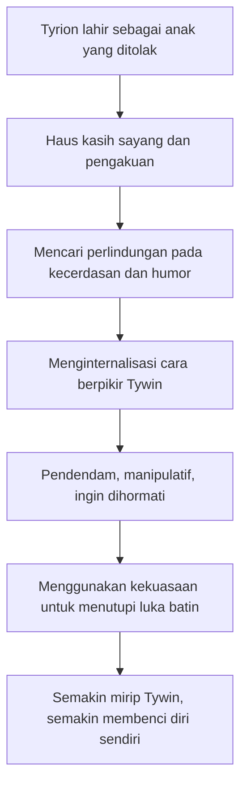
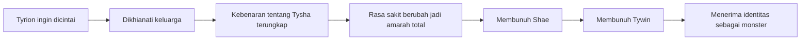
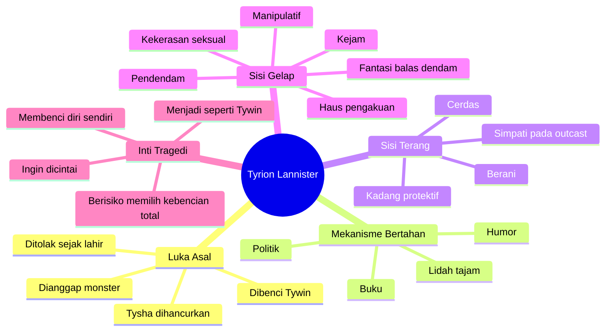

## 🦁 Pendahuluan: Tyrion yang Kita Kenal di Serial Bukan Tyrion yang Sebenarnya

Banyak penonton *Game of Thrones* mengenal Tyrion Lannister sebagai tokoh yang paling cerdas, paling lucu, paling manusiawi, dan sering terasa sebagai salah satu karakter paling “aman” untuk disukai. Ia berbicara tajam, berpikir cepat, sering menjadi suara akal sehat di tengah keluarga Lannister yang brutal, dan dalam serial ia perlahan diposisikan sebagai figur yang relatif baik hati dibanding dunia sekitarnya. 🍷

Tetapi kalau kita masuk ke novel *A Song of Ice and Fire* karya George R. R. Martin, kita menemukan kenyataan yang jauh lebih tidak nyaman:

> **Tyrion versi buku jauh lebih gelap, lebih pahit, lebih kejam, lebih rusak, dan lebih berbahaya daripada Tyrion versi serial.**

Ia tetap cerdas. Tetap lucu. Tetap penuh luka. Tetap mampu memancing simpati. Tetapi ia juga:
- pendendam,
- manipulatif,
- sangat rapuh secara emosional,
- kadang kejam secara sadar,
- dan dalam fase tertentu bergerak sangat dekat ke wilayah monster. 🌑

George Martin sendiri pernah mengatakan bahwa Tyrion adalah **“the villain”** *(si penjahat)*—meski tentu, dalam khas Martin, kata itu tidak sesederhana hitam-putih. Sebab Tyrion bukan penjahat kartun. Ia adalah karakter yang dibentuk oleh penghinaan, cinta yang dirampas, trauma seksual, keluarga beracun, dan rasa lapar akan pengakuan yang tak pernah terpenuhi.

Artikel ini akan membedah Tyrion Lannister versi buku secara sangat mendalam. Bukan hanya dengan pertanyaan **“apa yang ia lakukan?”**, tetapi juga:

- **mengapa ia menjadi seperti itu?**
- **apa bedanya dengan Tyrion serial?**
- **bagaimana luka masa kecilnya membentuk moralitasnya?**
- **mengapa hubungan Tyrion dengan Tywin adalah inti tragedinya?**
- **apakah Tyrion benar-benar penjahat, atau justru salah satu karakter paling tragis di Westeros?**

Jawaban singkatnya: **Tyrion itu jahat, tetapi tidak pernah sesederhana hanya jahat.** Dan justru di situlah kehebatan penulisannya. 🧠

---

## 🎭 Tyrion Serial vs Tyrion Buku: Dua Karakter yang Makin Lama Makin Berpisah

Pada beberapa musim awal serial *Game of Thrones*, adaptasi Tyrion masih cukup dekat dengan buku. Ia tetap:
- dwarf yang cerdas,
- pemain politik yang lihai,
- lelaki yang memakai humor sebagai baju zirah,
- dan sosok yang haus diterima oleh keluarganya tetapi terus ditolak.

Namun setelah titik besar di akhir musim keempat—ketika Tyrion membunuh Tywin dan Shae—jalur keduanya mulai berpisah sangat jauh. Dalam serial, Tyrion berubah menjadi semacam penasihat moral yang sedih, lebih lembut, lebih penyesal, lebih humanis, dan pada akhirnya seperti kehilangan taring intelektual maupun psikologisnya.

Ia berkali-kali gagal secara politik, tetapi tetap diberi panggung. Ia kehilangan keluarga, tetapi secara emosional tidak benar-benar dibawa sampai ke ujung tergelap dari kehilangan itu. Ia semestinya berubah drastis, tetapi serial sering mempertahankannya sebagai “Tyrion yang tetap bisa disukai.”

Versi buku tidak memberi keringanan seperti itu. Setelah pembunuhan Tywin dan Shae, Tyrion tidak bergerak ke arah kebijaksanaan. Ia bergerak ke arah:

- kebencian,
- kehancuran diri,
- fantasi balas dendam,
- misogini yang makin gelap,
- dan keinginan untuk membawa **“fire and sword”** *(api dan pedang)* ke Westeros. 🔥

Di titik inilah perbedaan paling penting muncul:

> **Serial memoles Tyrion menjadi tokoh tragis yang tetap layak dicintai. Buku membiarkan Tyrion jatuh menjadi manusia yang sangat rusak, dan memaksa kita tetap melihat kemanusiaannya tanpa memutihkan kejahatannya.**

---

## 👹 Wajah Tyrion: Keburukan Fisik sebagai Nasib Sosial

Salah satu aspek yang sering terlupakan karena Peter Dinklage sangat karismatik di serial adalah ini: **Tyrion versi buku digambarkan benar-benar jelek.**

Bukan jelek biasa. Bukan hanya “orang tidak tampan.” Tetapi digambarkan dengan bahasa yang hampir grotesk *(mengerikan / seperti makhluk aneh)*:
- wajahnya ditekan ke dalam,
- ciri-cirinya brutal,
- tubuhnya cacat,
- matanya berbeda warna,
- dan setelah Pertempuran Blackwater, hidungnya bahkan terpotong hampir setengah.

George Martin sengaja membuat penampilan Tyrion jauh lebih ekstrem karena penampilan itu bukan detail dekoratif. Itu adalah **fakta sosial**. Itu adalah cara dunia memosisikan Tyrion sejak lahir. 😔

Di Westeros, tubuh bukan cuma tubuh. Tubuh dibaca sebagai tanda moral, tanda keberuntungan, tanda dosa, tanda kutukan, tanda kelas, tanda kehormatan. Maka ketika Tyrion lahir sebagai dwarf dengan penampilan yang dianggap “monster”, masyarakat Westeros tidak netral melihatnya. Mereka sudah lebih dulu membuat putusan batin.

Ini membuat Tyrion hidup dalam dunia yang terus berkata padanya:

- kamu lucu, tapi bukan laki-laki utuh,
- kamu bangsawan, tapi memalukan,
- kamu cerdas, tapi menjijikkan,
- kamu manusia, tapi hampir dianggap makhluk lain.

Dan kalau seseorang tumbuh seumur hidup di bawah tatapan seperti itu, kepribadiannya pasti berubah. Luka Tyrion tidak mulai dari politik. Luka Tyrion mulai dari **cara dunia menatap tubuhnya.**

---

## 🏰 Tywin Lannister dan Asal-usul Kebencian terhadap Tyrion

Untuk memahami Tyrion, kita harus memahami ayahnya: **Tywin Lannister**.

Tywin bukan sekadar ayah dingin. Ia adalah pusat gravitasi psikologis yang membentuk seluruh keluarga Lannister. Dan kebenciannya pada Tyrion bukan kebencian yang sederhana. Ia campuran dari:
- duka,
- rasa malu,
- paranoia kelas,
- trauma masa kecil,
- dan kemarahan yang dipindahkan ke anak yang paling tidak berdaya.

### Tytos Lannister dan Trauma Malu Tywin

Ayah Tywin, **Tytos Lannister**, dikenal lemah. Para bawahannya berani menertawakannya. Bagi Tywin muda, ini adalah pengalaman yang sangat membekas. Ia hidup dalam rasa malu terhadap ayahnya—bukan karena Tytos jahat, tetapi karena Tytos **tidak ditakuti**.

Tywin tumbuh dengan obsesi untuk memulihkan harga diri House Lannister. Karena itu, ketika dewasa, ia menjadi sangat kejam terhadap siapa pun yang dianggap meremehkan keluarganya. Dari sinilah lahir reputasi Tywin sebagai penghancur keluarga Reyne dan Tarbeck, pemulih kejayaan Lannister dengan kekerasan total.

Lalu Tywin menikahi **Joanna**, perempuan yang sangat ia cintai. Dari pernikahan itu lahir Cersei dan Jaime—dua anak indah yang cocok dengan mimpi Tywin tentang keluarga sempurna. Anak-anak yang, dalam imajinasinya, akan begitu kuat, begitu cantik, begitu mulia, hingga **tak seorang pun akan pernah menertawakan mereka**. 🦁

Tetapi kemudian Joanna meninggal saat melahirkan Tyrion.

Dan anak yang lahir bukan simbol kejayaan, melainkan simbol yang—dalam masyarakat Westeros—mudah dibaca sebagai aib, kutukan, ejekan dari para dewa.

Jadi bagi Tywin, Tyrion menyakiti dua hal yang paling ia cintai sekaligus:

1. **Joanna mati saat melahirkannya**
2. **House Lannister dipermalukan oleh kelahirannya**

Sejak awal, Tyrion tidak diperlakukan sebagai anak yang lahir dari tragedi. Ia diperlakukan seolah-olah **ia sendiri adalah tragedi itu**.

### "Lord Tywin’s Doom"

Rakyat menyebut Tyrion **Lord Tywin’s Doom**—bencana Tywin. Ini sangat kejam. Karena dari bayi, Tyrion tidak pernah diberi ruang untuk menjadi hanya seorang anak. Ia diproyeksikan sebagai kutukan.

Jadi ketika Tywin membencinya, itu bukan karena analisis moral rasional. Itu karena Tyrion menjadi cermin dari semua rasa malu, rasa kehilangan, dan rasa tidak terkendalinya hidup yang selama ini Tywin benci.

Dengan kata lain:

> **Tywin membenci Tyrion bukan hanya karena Tyrion “buruk”, tetapi karena Tyrion membangunkan semua bagian dari diri Tywin yang ingin ia sangkal.**

---

## 💔 Tysha: Trauma Intim yang Menghancurkan Hidup Tyrion

Kalau ada satu peristiwa yang benar-benar memecah hidup Tyrion menjadi “sebelum” dan “sesudah”, itu adalah **Tysha**.

Saat berusia sekitar tiga belas tahun, Tyrion bertemu Tysha, seorang gadis rakyat biasa. Mereka saling jatuh cinta. Mereka menikah. Dan untuk waktu singkat, Tyrion merasakan sesuatu yang hampir mustahil baginya: **ia merasa sungguh dicintai**. 💔

Lalu Tywin menghancurkannya.

Jaime—yang saat itu masih menjadi satu-satunya orang yang benar-benar Tyrion percayai—memberi tahu bahwa Tysha sebenarnya hanyalah seorang pelacur yang dibayar untuk tidur dengan Tyrion. Setelah itu, Tywin memerintahkan pemerkosaan bergilir oleh para pengawal, lalu memaksa Tyrion ikut memperkosa istrinya sendiri.

Peristiwa ini begitu kelam sampai sering terasa hampir tak tertahankan untuk dibahas. Tetapi justru di sinilah akar psikologi Tyrion berada.

Dari peristiwa Tysha, Tyrion belajar beberapa hal yang menghancurkan:

- cinta bisa jadi kebohongan,
- tubuh perempuan bisa dijadikan alat hukuman oleh laki-laki berkuasa,
- ayahnya bisa menghancurkan apa pun yang ia cintai,
- dan ia sendiri bisa dipaksa menjadi pelaku kekerasan terhadap orang yang ia cintai.

Sejak itu, Tyrion hidup dengan keyakinan yang merusak seluruh hidupnya:

> **tidak ada perempuan yang akan pernah mencintainya dengan tulus.**

Akibatnya, ia beralih ke anggur dan pekerja seks. Tetapi ia sendiri sadar, seks tanpa cinta tidak menyembuhkan luka itu. Ia hanya menambalnya sementara. Ia berkata bahwa pelacur bisa tidur denganmu, tetapi mereka tidak akan menciummu. Kalimat ini sederhana, tetapi sangat menyedihkan. Karena yang Tyrion cari sebenarnya bukan seks. Yang ia cari adalah:

- pengakuan,
- kedekatan,
- dan keyakinan bahwa ia layak dicintai.

Tysha adalah luka yang tidak pernah benar-benar sembuh. Dan ketika kebenaran tentang Tysha akhirnya terbongkar kemudian, seluruh batin Tyrion pecah untuk kedua kalinya. 😞

---

## 📚 Humor, Buku, dan Kepintaran sebagai Baju Zirah

Karena tubuhnya tidak bisa memberinya kuasa seperti Jaime, dan nama keluarganya tidak memberinya kasih seperti yang diberikan pada Cersei atau Jaime, Tyrion membangun identitas lain: **pikiran**.

Ia membaca terus-menerus. Ia belajar sejarah, strategi, simbol, politik, manusia. Ia menyatakan bahwa pikirannya adalah senjatanya. Ini bukan sekadar kutipan keren—ini adalah mekanisme bertahan hidup.

Selain itu, ia memakai humor sebagai perisai. Nasihatnya kepada Jon Snow sangat terkenal:

> ambil ejekan yang diberikan orang padamu, jadikan itu seperti zirah, maka mereka tak lagi bisa melukaimu dengannya.

Karena itu Tyrion mengambil persona *the Imp* *(si kurcaci setan / makhluk kecil ejekan)*, persona sinis, lucu, cerdas, menyebalkan. Ia membuat orang tertawa sebelum mereka sempat melukainya. Ia melukai orang lain dengan lidahnya sebelum mereka menelanjanginya dengan hinaan.

Tetapi ada harga yang harus dibayar untuk hidup seperti ini:

> **kalau humor terus-menerus dipakai sebagai perisai, lama-lama seseorang bisa lupa bagaimana tampil tanpa topeng.**

Dan itulah yang terjadi pada Tyrion. Di balik kelucuannya, ada rasa malu yang tidak pernah selesai. 🍷

---

## ⚖️ Tyrion dan Sisi Gelapnya Sejak Awal

Salah satu kesalahan pembacaan paling umum adalah mengira Tyrion “menjadi gelap” hanya setelah membunuh Tywin dan Shae. Tidak. Benih kegelapan itu sudah ada sejak awal.

Di buku pertama, Tyrion memang simpatik. Ia baik pada Jon. Ia membantu Bran dengan rancangan pelana. Ia bersimpati pada “cripples, bastards, and broken things” *(orang cacat, anak haram, dan segala yang patah)* karena ia mengidentifikasi dirinya dengan mereka.

Tetapi di waktu yang sama, Tyrion juga:
- sangat pendendam,
- mudah menyimpan kebencian,
- suka menghina orang untuk memuaskan dirinya,
- dan berkali-kali berfantasi membunuh Cersei dan Tywin.

Ketika Catelyn menangkapnya, ia merencanakan balas dendam. Ketika Marillion menyebalkan baginya, ia menginjak tangannya hingga jari-jarinya rusak. Ketika ia bicara tentang Vale, ia membayangkan menghancurkannya jadi tanah hangus.

Artinya, Tyrion sejak awal sudah memiliki kombinasi berbahaya:

- kecerdasan,
- rasa hina diri,
- kecanduan pengakuan,
- dan memori panjang terhadap penghinaan.

Karakter seperti ini sangat mudah menjadi tragis, karena ia cukup sadar untuk mengerti luka-lukanya, tetapi tidak cukup sehat untuk melampauinya.

---

## 🧨 Tyrion Berpikir Seperti Tywin, Meski Membenci Tywin

Ini inti penting yang sering terlewat: **Tyrion membenci Tywin, tetapi pada banyak level ia juga menginternalisasi cara berpikir Tywin.**

Ketika perang Lannister melawan Stark dan Tully dimulai, Tyrion melihat langsung bagaimana Tywin memerintahkan pembakaran, penjarahan, pemerkosaan, dan pembantaian di Riverlands. Dan Tyrion tidak benar-benar menolak itu. Ia tidak mempersoalkannya sebagai kejahatan moral besar. Ia menerima logika kekuasaan itu.

Mengapa?

Karena sejak kecil ia dididik dalam satu doktrin Lannister yang sangat Tywinian:

> **hutang dibayar dengan kekerasan, kekuasaan dijaga dengan rasa takut, penghinaan dibalas dengan penghancuran.**

Maka, secara ironis, anak yang paling dibenci Tywin justru menjadi anak yang paling mewarisi pola batinnya. Ini tragedi yang sangat indah sekaligus mengerikan:

> **Tyrion ingin dicintai Tywin, sehingga tanpa sadar ia belajar menjadi seperti Tywin.**

Tetapi semakin ia seperti Tywin, semakin ia membenci dirinya sendiri.

---

---

## 👑 Buku 2: Tyrion di King’s Landing — Keadilan atau Ego?

Ketika Tyrion menjadi Hand of the King di King’s Landing, ini tampak seperti momen kebangkitannya. Ia cerdas, aktif, berani mengambil keputusan, dan relatif efektif dibanding orang-orang di sekelilingnya. Ia menjatuhkan Janos Slynt, mempermainkan Pycelle, memanipulasi Lancel, memakai Kettleblacks, dan merasa dirinya akhirnya berada di panggung yang memang cocok untuknya.

Di fase ini, Tyrion merasa:

> **akhirnya dunia akan melihat nilai dirinya.**

Dan di sinilah jebakan moralnya dimulai. Karena ia mengira dirinya sedang menegakkan keadilan, padahal sering kali yang ia lakukan adalah **memberi makan egonya sendiri**.

Ia senang mempermalukan orang. Ia senang mengendalikan orang. Ia senang merasa lebih tinggi dari orang-orang yang dulu akan menertawakannya. Ia berkata pada dirinya bahwa ia sedang menjalankan pemerintahan, tetapi sering kali ia sebenarnya sedang menjalankan terapi balas dendam terhadap harga dirinya yang terluka.

Ini sangat manusiawi. Dan juga sangat berbahaya. 👑

### Tyrion Tidak Sepintar yang Ia Kira

Salah satu ironi bagus di buku adalah bahwa Tyrion memang pintar, tetapi tidak sebrilian yang ia bayangkan. Ia berhasil mengalahkan pemain-pemain kelas dua seperti Janos, Pycelle, dan Lancel. Tetapi pemain kelas berat seperti Littlefinger dan Varys jauh lebih sulit dibaca, dan Tyrion tidak benar-benar menguasai permainan mereka.

Banyak rencananya juga gagal. Jadi Tyrion bukan mastermind sempurna. Ia kadang terlalu bangga pada kelihaian sendiri, lalu luput melihat betapa sempit jangkauan kontrolnya.

### Ia Tidak Sedang Memihak Pihak Benar

Ini penting sekali. Di buku kedua, Tyrion tidak sedang memerintah untuk kebaikan dunia. Ia bekerja untuk:
- Joffrey, raja kecil yang kejam dan tidak sah,
- Cersei dan Tywin, penguasa brutal,
- dan rezim yang perangnya sangat kejam terhadap rakyat sipil.

Kita tahu dari perspektif Arya betapa mengerikannya pasukan Lannister di Riverlands. Tetapi Tyrion cenderung menyepelekannya sebagai “itulah perang.”

Padahal tidak. Itu bukan sekadar perang. Itu adalah kekejaman terstruktur. Dan Tyrion ada di pihak itu.

Jadi kalau Tyrion tampak heroik saat mengelola kota, Martin diam-diam menaruh tanda peringatan besar:

> **kepintaran politik tidak otomatis berarti keluhuran moral.**

---

## 👩‍👦 Tyrion dan Cersei: Persaingan Saudara yang Dibentuk oleh Tywin

Hubungan Tyrion dan Cersei sering dibaca sebagai permusuhan biasa antarsaudara. Padahal akarnya lebih dalam. Mereka berdua sama-sama anak Tywin yang haus pengakuan. Bedanya:
- Cersei punya kecantikan dan status,
- Tyrion punya kecerdasan dan lidah tajam.

Keduanya ingin diakui sebagai anak yang paling layak mewarisi ayahnya. Keduanya ingin dianggap penting. Keduanya juga mewarisi kekejaman dan paranoia Tywin, walau bentuknya berbeda.

Salah satu titik pecah besar mereka terjadi saat Cersei menangkap Alayaya, salah mengira bahwa ia Shae. Reaksi Tyrion di sini sangat penting. Ia bisa memilih kejujuran. Ia bisa menjelaskan. Ia bisa meredakan konflik. Tetapi ia memilih berbicara dengan **“his father’s voice”** *(suara ayahnya)*.

Ia mengancam akan membalas kekerasan seksual terhadap Tommen jika Cersei melukai orang yang ia cintai.

Ini momen yang mengerikan karena memperlihatkan bagaimana Tyrion, saat terluka, **secara naluriah mengambil bahasa kekuasaan Tywin**:
- ancam tubuh orang terdekat lawan,
- hancurkan sumber cinta lawan,
- dan buktikan bahwa kau juga bisa sekejam itu.

Dari sini, hubungan Tyrion dan Cersei tak lagi sekadar saling membenci. Ia berubah menjadi spiral kehancuran keluarga Lannister dari dalam. 🩸

---

## 🔥 Blackwater: Kepahlawanan, Pembantaian, dan Rasa Haus akan Cinta

Di Blackwater, Tyrion melakukan hal-hal yang benar-benar besar:
- menyusun pertahanan,
- memakai wildfire,
- memimpin serangan,
- dan berkontribusi nyata menyelamatkan King’s Landing.

Tetapi George Martin memberi kita perspektif Davos untuk menyeimbangkan semuanya. Dari sisi Davos, Tyrion bukan pahlawan—ia adalah orang yang membakar ribuan manusia, termasuk anak-anak Davos. Jadi lagi-lagi, Dune—eh, ASOIAF maksudnya—menolak perspektif moral tunggal.

Yang paling penting adalah mimpi demam Tyrion setelah pertempuran. Di sana ia membayangkan orang-orang memujinya. Jaime mengangkatnya jadi ksatria. Shae memeluknya. Dan Tywin akhirnya tersenyum dengan persetujuan.

Di titik ini terungkap motif terdalam Tyrion:

> **ia tidak hanya ingin menang. Ia ingin dicintai.**

Bahkan pembantaian besar di Blackwater, dalam level batin terdalam, dilakukan bukan demi “realm” *(kerajaan / ranah politik)*, melainkan demi satu kebutuhan masa kecil yang tak pernah terpuaskan: **pengakuan dari ayah dan dunia.** 😢

---

## 🪞 Buku 3: Penolakan Total dan Hancurnya Sisa-Sisa Tyrion

Sesudah Blackwater, seharusnya Tyrion menerima pengakuan. Tetapi justru sebaliknya. Tywin mengambil semua pujian. Kekuasaan Tyrion dicabut. Ia dipinggirkan lagi. Saat Tyrion meminta rasa terima kasih dan pengakuan sebagai putra serta calon pewaris Casterly Rock, Tywin menolaknya dengan penghinaan brutal.

Tywin menyebutnya:
- makhluk cacat,
- penuh nafsu,
- licik,
- dan tak layak mewarisi Rock.

Ini memukul Tyrion pada titik paling sensitif: identitas dan legitimasi. Seluruh hidupnya ia ingin sekali diakui sebagai anak Lannister yang sah, yang pantas. Dan ayahnya kembali berkata, secara praktis:

> **kau bukan anak yang bisa kubanggakan.**

### Shae dan Sansa: Dua Relasi yang Sama-sama Rusak

Relasi Tyrion dengan Shae sering disalahpahami karena serial membuatnya lebih romantis. Di buku, Shae praktis tidak mencintainya. Ia ada demi uang, status, kenyamanan. Tyrion tahu ini, tetapi memaksakan diri mempercayai semacam ilusi kehangatan karena ia sangat butuh itu.

Sementara relasinya dengan Sansa juga tragis, tetapi dengan nada berbeda. Tyrion memang lebih menahan diri daripada pria Lannister lain mungkin akan lakukan, tetapi struktur relasinya tetap rusak dari dasar:
- Sansa masih anak-anak,
- ia tawanan politik,
- keluarga Tyrion membunuh keluarganya,
- dan pernikahan itu murni alat kekuasaan.

Jadi bahkan ketika Tyrion “lebih baik” daripada yang terburuk, itu tidak membuat relasinya sehat. Ia tetap bergerak dalam sistem yang menjadikan perempuan sebagai alat politik, dan ia tidak benar-benar keluar dari logika itu.

### Penyanyi, Sup, dan Kebusukan Moral

Ketika seorang penyanyi memeras Tyrion, Tyrion menyuruhnya dibunuh dan dijadikan sup. Ini salah satu momen kecil yang penting. Karena ia menunjukkan bahwa Tyrion tidak lagi bisa dibaca hanya sebagai korban cerdas yang sinis. Ia sendiri juga mampu menjadi pelaku horor dengan dingin.

Ia tidak membunuh hanya saat benar-benar terpaksa. Kadang ia membunuh karena orang itu menjadi gangguan.

Dan itulah titik penting tentang Tyrion: **lukanya membuatnya mudah dipahami, tetapi luka tidak menghapus tanggung jawab moral atas apa yang ia lakukan.**

---

## ⚔️ Pengadilan Joffrey: Tyrion Diadili Bukan Hanya sebagai Pembunuh, Tapi sebagai Dwarf

Ketika Joffrey mati dan Tyrion dituduh, ia mengucapkan salah satu hal paling benar sekaligus paling pahit tentang hidupnya:

> **ia merasa seumur hidupnya diadili karena menjadi dwarf.**

Dan itu benar. Seluruh masyarakat Westeros penuh prasangka terhadapnya. Tetapi Martin tidak berhenti di situ. Karena pengadilan Tyrion juga menjadi momen ketika semua ancaman, penghinaan, manipulasi, dan luka yang ia tabur balik menghantam dirinya.

Artinya, penderitaan Tyrion punya dua sisi:

1. Ia memang korban prasangka sistemik
2. Tetapi ia juga memberi orang alasan nyata untuk takut dan membencinya

Ini kompleks sekali. Dan justru karena itulah ia terasa hidup. Ia tidak murni korban. Ia juga bukan murni monster. Ia adalah manusia yang terus berubah menjadi lebih buruk di bawah tekanan dan luka yang tak tertangani.

Ketika Shae bersaksi melawannya, Tyrion akhirnya pecah. Di sana semua kebencian yang selama ini tertahan meledak. Ia berharap ia benar-benar monster seperti yang mereka tuduhkan. Ini kalimat yang sangat berbahaya, karena dari titik ini Tyrion tidak lagi hanya defensif. Ia mulai **ingin menjadi monster itu secara sadar.**

---

## 💣 Jaime, Kebenaran tentang Tysha, dan Titik Balik Terbesar Tyrion

Dalam serial, Jaime membebaskan Tyrion dan mereka berpisah dengan cukup emosional. Dalam buku, momen itu jauh lebih menghancurkan karena Jaime mengungkapkan kebenaran:

**Tysha bukan pelacur.**

Tysha benar-benar mencintai Tyrion.

Artinya, satu-satunya perempuan yang benar-benar pernah mencintainya dihancurkan oleh ayahnya… dan ia sendiri dipaksa ikut menghancurkannya.

Bayangkan efek psikologis dari penyingkapan ini. Selama bertahun-tahun, Tyrion membangun seluruh identitas emosionalnya di atas keyakinan:

- tidak ada perempuan yang bisa mencintaiku,
- Tysha palsu,
- cinta itu transaksi,
- aku memang tidak layak dicintai.

Lalu tiba-tiba semua itu runtuh. Dan yang tersisa bukan kelegaan, melainkan **kemarahan absolut**. Karena itu berarti:

- Tywin menghancurkan satu cinta sejatinya,
- Jaime ikut menyembunyikan kebenaran,
- dan seluruh hidup emosional Tyrion dibangun di atas kebohongan yang dipaksakan keluarganya.

Di sinilah Tyrion meninggalkan Jaime sebagai saudara dan mulai melihatnya juga sebagai pengkhianat. Dari sini, arah hidup Tyrion berubah total. ⚠️

---

## ☠️ Shae dan Tywin: Dua Pembunuhan, Dua Cermin Diri

### Shae: Kejahatan Tergelap Tyrion

Di buku, pembunuhan Shae bukan adegan tragis-romantis seperti di serial. Shae tidak menyerang dulu. Shae memohon. Shae takut. Tyrion tetap mencekiknya sampai mati.

George Martin menyebut ini sebagai **“blackest deed”** *(perbuatan paling hitam)* Tyrion, “the great crime of his soul” *(kejahatan besar jiwanya)*.

Ini penting sekali. Karena jika kita terlalu sibuk bersimpati pada luka Tyrion, kita bisa tergoda memutihkan adegan ini. Padahal buku tidak membiarkan kita melakukannya.

Tyrion membunuh Shae karena:
- ia merasa dikhianati,
- ia merasa dipermalukan,
- ia marah atas ketidaksetiaan,
- dan ia melampiaskan semua itu pada tubuh perempuan yang lebih lemah dan ketakutan.

Itu bukan pembelaan diri. Itu pembunuhan dingin.

### Tywin: Pembunuhan Sang Ayah, atau Pembunuhan Diri Lama?

Lalu Tyrion membunuh Tywin. Ini tentu balas dendam terhadap ayah. Tetapi juga lebih dari itu. Dalam momen itu, Tyrion menemukan bahwa Tywin—yang selama ini pura-pura lebih tinggi secara moral—ternyata munafik besar.

Tywin yang mencela Tyrion karena pelacur, ternyata tidur dengan Shae.
Tywin yang mengaku rasional ternyata penuh nafsu, malu, dendam, dan kepalsuan.
Tywin yang selalu ingin terlihat seperti singa emas agung, mati di toilet—dengan cara yang menelanjangi semua mitos keagungannya.

Dan ketika Tyrion berkata:

> **“I’m you writ small”**

itu salah satu kalimat paling penting dalam seluruh arc Tyrion. Artinya kira-kira:

> **“Aku adalah dirimu dalam bentuk kecil.”**

Tyrion menyadari bahwa dirinya dan Tywin jauh lebih mirip daripada yang ingin diakui siapa pun. Keduanya:
- licik,
- penuh dendam,
- malu terhadap kelemahan,
- obsesi pada rasa hormat,
- dan sanggup melakukan kekejaman saat terluka.

Tywin membenci Tyrion justru karena Tyrion adalah cermin jujur dari bagian-bagian dirinya yang paling ia sangkal. 🪞

---

---

## 🍷 Buku 5: Tyrion di Timur — Dari Korban Menjadi Ancaman

Setelah melarikan diri ke Essos, Tyrion masuk ke fase yang paling gelap. Ia tidak lagi bermimpi tentang keadilan. Tidak lagi tentang cinta. Tidak lagi tentang rekonsiliasi. Yang tersisa baginya adalah:
- kebencian,
- muak pada diri sendiri,
- hasrat menghancurkan,
- dan keinginan membawa perang ke Westeros.

Ia memikirkan dirinya sebagai **vengeful ghost** *(hantu pendendam)*. Ia ingin dunia yang menolaknya merasakan ketakutan darinya. Kalimatnya sangat kuat:

> *“They would not love me living, so let them dread me dead.”*
> *“Mereka tak mau mencintaiku saat aku hidup, maka biarlah mereka takut padaku saat aku mati.”*

Ini adalah titik ketika Tyrion secara sadar memeluk citra monster.

### Kekerasan Seksual dan Titik Moral Terendah

Ada momen-momen di buku kelima yang sengaja dibuat Martin agar pembaca tidak bisa lagi berlindung dalam simpati kosong. Tyrion mengintimidasi, merendahkan, dan pada satu titik memperkosa budak perempuan. Ini penting untuk diakui dengan jujur.

Karena tanpa pengakuan ini, kita akan gagal membaca Tyrion sebagai George Martin menulisnya: **seorang manusia yang sangat rusak dan sedang melakukan hal-hal yang sangat jahat.**

Ia tidak hanya sedih. Ia berbahaya.

---

## 🐉 Aegon, Daenerys, dan Tyrion sebagai Pembawa Kekacauan

Dalam perjalanan ke timur, Tyrion bertemu kelompok Jon Connington dan Young Griff yang ternyata adalah Aegon. Di sini terlihat lagi bahwa Tyrion, sekalipun hancur secara emosional, tetap sangat tajam secara politis.

Ia menghasut Aegon agar mengubah rencana, bukan demi strategi terbaik, tetapi sebagian besar **untuk menimbulkan kekacauan**. Ia menanamkan ide yang bisa memicu perang besar antara Aegon dan Daenerys.

Dan yang menyeramkan adalah: Tyrion tertawa saat tahu hasutannya mungkin berhasil.

Artinya, pada fase ini Tyrion tidak lagi sekadar bermain *game of thrones* demi bertahan. Ia mulai bermain demi menyulut dunia. 🔥

Di sinilah ia sangat berbeda dari Tyrion serial. Serial membuatnya menjadi rem moral bagi Daenerys. Buku sangat mungkin justru menempatkannya sebagai:

> **iblis kecil di bahu Daenerys, orang yang mendorongnya ke “fire and blood”.**

Ia ingin Daenerys karena bukan ingin dunia lebih baik, tetapi karena ia melihat dalam dirinya kesempatan untuk:
- membakar musuh-musuhnya,
- menghancurkan Cersei,
- merebut Casterly Rock,
- dan membalas seluruh penghinaan hidupnya.

---

## 🐷 Penny: Cermin yang Ditolak Tyrion

Salah satu fungsi naratif paling penting dalam arc Tyrion adalah **Penny**. Banyak pembaca menganggapnya karakter sampingan, padahal sebenarnya ia adalah **cermin moral** bagi Tyrion.

Penny juga dwarf. Ia juga ditertawakan. Ia juga kehilangan keluarga. Ia juga mengalami penghinaan. Tetapi berbeda dari Tyrion, Penny tidak memilih membangun identitasnya di atas sinisme total dan kebencian terus-menerus.

Ia masih bisa:
- berharap,
- memaafkan,
- bertahan tanpa merasa harus melukai semua orang,
- dan hidup tanpa membangun kultus ego atas lukanya.

Karena itulah Tyrion punya relasi rumit dengannya. Di satu sisi ia kasihan dan melindunginya. Di sisi lain ia jengkel, bahkan marah, karena Penny membuktikan sesuatu yang ingin ia sangkal:

> **bahwa penderitaan tidak otomatis memaksa seseorang menjadi seperti dirinya.**

Penny adalah bukti hidup bahwa dwarf lain, orang miskin lain, orang yang juga dipermalukan dunia, bisa memilih respons lain selain kebencian total. Itulah sebabnya kehadiran Penny secara diam-diam mengguncang pembenaran batin Tyrion terhadap dirinya sendiri.

Kalau Tyrion akhirnya menolak Penny, menyakiti Penny, atau bahkan kehilangan Penny, itu bukan sekadar subplot emosional. Itu bisa menjadi titik ketika ia sepenuhnya meninggalkan kemungkinan sisi manusiawinya yang lebih lembut. 🐷

---

## 🐲 Tyrion dan Naga: Takdir, Ambisi, dan Teori Darah Targaryen

Salah satu lapisan menarik dalam cerita Tyrion adalah hubungannya dengan naga. Sejak kecil ia terobsesi pada naga, membaca tentang naga, bermimpi tentang naga. Dalam visi dan simbolisme, Tyrion berulang kali diasosiasikan dengan naga dan bayangan besar.

Ada teori populer bahwa Tyrion sebenarnya anak Aerys Targaryen, bukan Tywin. Teori ini didukung oleh beberapa petunjuk:
- ketertarikan Aerys pada Joanna,
- ciri fisik Tyrion,
- mimpinya tentang naga,
- kemungkinan imun terhadap penyakit tertentu,
- dan kemungkinan menjadi penunggang naga.

Tetapi secara tematik, teori ini rumit. Karena inti hubungan Tyrion–Tywin justru sangat kuat jika Tyrion memang **anak Tywin secara penuh**. Sebab tragedinya adalah: Tywin membenci Tyrion padahal Tyrion sangat mirip dengannya.

Kalau Tyrion ternyata anak Aerys, hubungan itu bisa bergeser dari tragedi psikologis menjadi teka-teki biologis. Maka mungkin kekuatan terbaik teori ini justru ada pada **ambiguitasnya**. Kita tidak pernah perlu jawaban mutlak. Yang penting adalah bagaimana Tyrion hidup di bawah pertanyaan identitas:

- apakah aku Lannister?
- apakah aku Targaryen?
- apakah darah menentukan diriku?
- atau ayah sejati adalah orang yang membentuk jiwaku, bukan hanya mewariskan darah?

Dan di sini, jawabannya pahit tapi jelas:

> **apa pun darahnya, Tyrion dibentuk oleh Tywin.**

---

## 🏛️ Akankah Tyrion Membakar King’s Landing?

Salah satu argumen paling kuat dari analisis Tyrion versi buku adalah bahwa jika King’s Landing akhirnya terbakar, Tyrion mungkin bukan orang yang mencegah itu—melainkan salah satu pendorong utamanya.

Mengapa? Karena King’s Landing adalah pusat trauma Tyrion:
- di sana ia menyelamatkan kota tetapi tak dihargai,
- di sana ia dikhianati Shae,
- di sana Tywin menjatuhkannya,
- di sana Cersei menyeretnya ke pengadilan,
- di sana dunia memutuskan bahwa ia monster.

Maka kalau Tyrion kembali ke kota itu bersama Daenerys dan naga-naganya, ada kemungkinan besar semua luka itu akan bertemu dengan kesempatan untuk membalas.

Tyrion bisa:
- memanipulasi Daenerys terhadap Aegon,
- menghasut kebencian terhadap rakyat yang mendukung saingan,
- sengaja atau tidak sengaja tidak memperingatkan bahaya wildfire,
- atau bahkan ikut menyalakan kehancuran itu secara langsung.

Kalau ini benar terjadi, maka tragedi Tyrion bukanlah “ia gagal melindungi keluarganya” seperti serial, tetapi sesuatu yang jauh lebih tajam:

> **ia sendiri membantu menciptakan kebinasaan yang membunuh keluarganya—dan baru sadar bahwa balas dendam itu tidak memberi apa-apa ketika semuanya sudah terlambat.** 🔥

Ini akan sangat sesuai dengan tema Martin bahwa balas dendam tidak pernah benar-benar menyembuhkan. Tengkorak musuh tidak mengembalikan cinta yang hilang. Kota yang dibakar tidak memperbaiki masa kecil yang rusak.

---

## 🧩 Apakah Tyrion Penjahat, Antihero, atau Manusia yang Hancur?

Pertanyaan “apakah Tyrion villain?” sebetulnya tidak punya jawaban tunggal. Tetapi kita bisa menyusunnya lebih jujur.

### Tyrion memang punya sisi heroik

Ia kadang:
- berani,
- melindungi orang lemah,
- cerdas dalam cara yang produktif,
- simpatik pada para outcast,
- dan mampu bertindak mulia.

### Tetapi Tyrion juga jelas sangat jahat pada banyak titik

Ia:
- kejam saat dipermalukan,
- suka mempermalukan balik orang untuk ego,
- mendukung rezim brutal,
- melakukan pembunuhan dingin,
- terjerumus dalam kekerasan seksual,
- dan makin mendekat pada politik kehancuran.

Jadi kalau ditanya apakah Tyrion villain, jawabannya mungkin begini:

> **Tyrion bukan villain sederhana, tetapi ia jelas mampu menjadi villain sejati.**

Ia adalah karakter **morally grey** *(abu-abu moral)* dalam bentuk paling serius—bukan “abu-abu” yang sebenarnya tetap baik, melainkan abu-abu karena di dalam dirinya benar-benar ada pertarungan antara:
- cinta dan kebencian,
- keinginan diterima dan dorongan menghancurkan,
- rasa kasihan dan rasa dendam,
- kecerdasan yang bisa menyelamatkan dan kecerdasan yang bisa membakar dunia.

Martin pernah berkata ia menulis tentang **human heart in conflict with itself** *(hati manusia yang bertarung dengan dirinya sendiri)*. Dan Tyrion mungkin salah satu representasi paling sempurna dari prinsip itu. 🖤

---

---

## 📖 Ke Mana Arc Tyrion Bisa Berakhir?

Ada beberapa kemungkinan besar untuk akhir Tyrion dalam buku:

### 1. Tyrion sepenuhnya jatuh menjadi monster politik
Ia mendorong Daenerys ke jalur kehancuran, membakar Westeros, membunuh atau menyebabkan kematian Cersei dan Jaime, lalu sadar semuanya sia-sia.

### 2. Tyrion masih punya kesempatan menebus diri
Setelah jatuh sangat jauh, ia mungkin akhirnya membantu melawan White Walkers dan belajar bahwa ada ancaman yang lebih besar daripada dendam keluarga dan perebutan takhta.

### 3. Tyrion mendapat hukuman simbolik besar
Salah satu teori yang sangat kuat adalah Tyrion kehilangan lidahnya. Ini akan pas secara simbolik karena kekuatan dan kebanggaannya selalu ada pada kata-kata, ejekan, dan kecerdasan verbal.

Kalau Jaime kehilangan tangan, Cersei kehilangan citra kemegahannya, maka Tyrion bisa kehilangan **lidah**—alat yang selama ini menjadi senjata, tameng, dan sumber petakanya. ✂️

### 4. Tyrion berakhir dalam kesunyian, bukan kejayaan
Ada kemungkinan yang sangat puitis bahwa akhirnya Tyrion tidak mati sebagai naga besar, bukan pula raja, melainkan berakhir jauh dari pusat kuasa—mungkin di Watch, mungkin di Citadel, mungkin di ruang buku—kembali ke satu hal yang sejak awal selalu menghiburnya: **membaca**.

Ini akan indah sekaligus pahit. Seorang lelaki yang seumur hidup ingin dicintai dunia, mungkin akhirnya hanya menemukan damai dalam keheningan dan buku-buku.

---

## 🕯️ Kesimpulan: Tyrion yang Sebenarnya Adalah Tragedi tentang Cinta yang Gagal Menyelamatkan

Kalau kita ringkas seluruh perjalanan Tyrion versi buku, maka benang merahnya bukan sekadar politik atau kecerdasan. Benang merahnya adalah ini:

> **Tyrion adalah manusia yang sangat ingin dicintai, tetapi terlalu lama hidup dalam hinaan, trauma, dan penghinaan sampai kebutuhan akan cinta itu berubah menjadi kebencian yang memakan dirinya sendiri.** 🕯️

Ia ingin dihormati—tetapi sering mencari hormat lewat penghinaan pada orang lain.
Ia ingin adil—tetapi bekerja untuk rezim yang tidak adil.
Ia ingin dicintai—tetapi memeluk relasi-relasi yang rusak dan transaksional.
Ia membenci Tywin—tetapi tumbuh semakin mirip Tywin.
Ia ingin membuktikan bahwa dunia salah menilainya sebagai monster—tetapi berkali-kali memilih tindakan yang justru mendorongnya lebih dekat ke bentuk monster itu.

Itulah sebabnya Tyrion Lannister adalah salah satu karakter terbaik dalam fantasi modern. Bukan karena ia pintar atau lucu saja. Tetapi karena ia terasa sangat manusiawi dalam cara yang menyakitkan. Ia bukan manusia suci yang sesekali berbuat salah. Ia adalah manusia rusak yang masih menyimpan sisa cahaya, dan pertanyaan besar ceritanya adalah:

> **apakah sisa cahaya itu cukup untuk menahan gelap yang sudah terlalu lama ia pelihara?**

Mungkin ya.
Mungkin tidak.
Dan justru karena kita belum tahu, Tyrion versi buku terasa jauh lebih hidup daripada versi serialnya.

Ia bukan sekadar tokoh favorit.
Ia adalah studi tentang luka, kelas, maskulinitas, trauma, ego, dan balas dendam.
Ia lucu, ya.
Ia cerdas, ya.
Tetapi di balik semua itu, Tyrion Lannister adalah salah satu jiwa paling terluka—dan paling berbahaya—di seluruh Westeros. 🦁

---

<Callout type="important" title="Inti Tyrion versi buku">
Tyrion versi buku bukan “good guy yang kadang salah”. Ia adalah karakter yang sangat kompleks: korban prasangka dan kekerasan keluarga, tetapi juga pelaku kekejaman; sosok simpatik, tetapi mampu menjadi perusak; lelaki yang lapar kasih sayang, tetapi berulang kali memilih kebencian ketika kasih itu gagal datang.
</Callout>

<Callout type="cite" title="Sumber">
- Video sumber: *The real Tyrion Lannister*
- Kanal/sumber: YouTube
- Basis pembahasan: karakter Tyrion Lannister dalam novel *A Song of Ice and Fire* karya George R. R. Martin, terutama perbedaan besar antara versi buku dan versi serial televisi.
</Callout>
