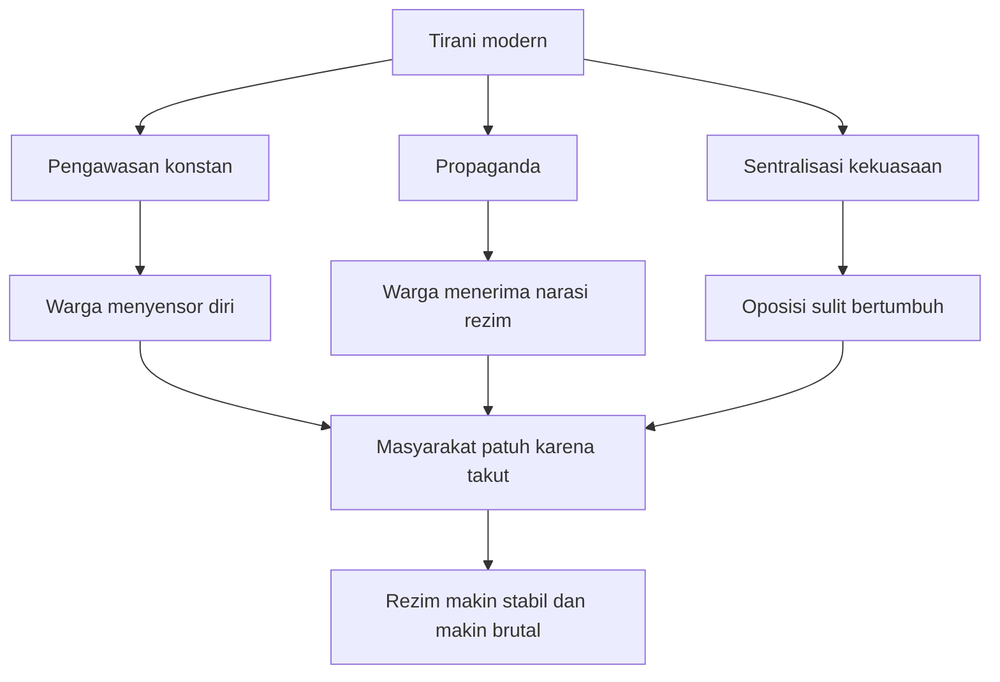
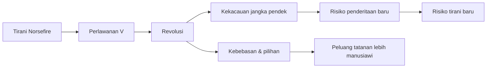
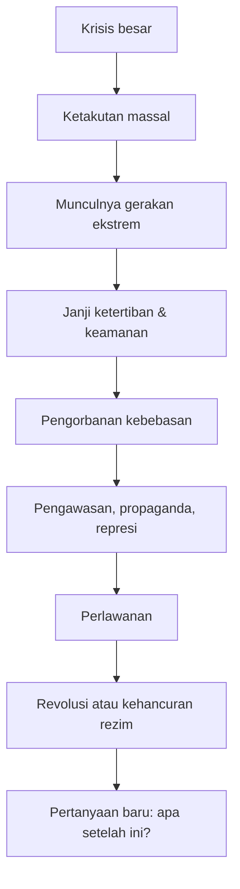

## 🎭 Pendahuluan: *V for Vendetta* Bukan Sekadar Kisah Topeng, Melainkan Bedah Radikal tentang Bagaimana Kejahatan Politik Dilahirkan oleh Ketakutan

Ada karya-karya yang tidak menua karena mereka tidak berbicara tentang satu zaman saja, melainkan tentang pola yang berulang dalam sejarah manusia. *V for Vendetta* adalah salah satunya. Di permukaan, kisah ini tampak seperti narasi yang sangat mudah dikenali: ada rezim otoriter, ada tokoh misterius bertopeng yang melawan, ada negara yang menindas, ada rakyat yang takut, ada ledakan-ledakan simbolik, dan ada bahasa perlawanan yang terasa puitis sekaligus mengerikan. Namun kalau dibedah lebih dalam, cerita ini sebenarnya tidak sedang menawarkan hiburan tentang pemberontakan semata. Ia sedang mengajak kita masuk ke pertanyaan yang jauh lebih sulit: **bagaimana kejahatan politik lahir, mengapa masyarakat bisa menyerahkannya kekuasaan, dan apakah kejahatan bisa dilawan tanpa turut menyerap sebagian wajahnya?**

Inilah mengapa *V for Vendetta* begitu penting. Ia bukan hanya kritik atas fasisme sebagai ideologi. Ia adalah peringatan terhadap seluruh mekanisme sosial yang memungkinkan kekuasaan jahat tampil sebagai penyelamat. Cerita ini menunjukkan bahwa tirani jarang datang sambil mengumumkan dirinya sebagai tirani. Ia datang membawa janji ketertiban, stabilitas, keamanan, pemulihan martabat bangsa, perlindungan tradisi, dan pembebasan rakyat dari kekacauan. Ia datang bukan dengan bahasa “aku akan menjadi monster,” tetapi dengan bahasa “aku akan melindungi kalian.” Dan justru di situlah bahayanya. 🧨

Materi yang Mas Hendra kirim membedah aspek “evil” atau kejahatan dalam *V for Vendetta* dengan sangat menarik, terutama melalui novel grafisnya, sambil sesekali mengaitkannya dengan versi film. Fokus utamanya bukan sekadar menilai siapa baik dan siapa jahat secara dangkal, tetapi memeriksa **struktur moral** dari dunia cerita itu: bagaimana Norsefire bisa naik, mengapa rakyat menerimanya, apa yang membuat Adam Susan mengerikan, mengapa V dapat disebut pahlawan sekaligus tetap problematis, dan apa harga yang harus dibayar ketika revolusi dipilih sebagai jalan keluar.

Artikel ini akan menjelaskan semuanya secara runtut, detail, dan mendalam dalam bahasa Indonesia. Saya juga akan menerjemahkan istilah-istilah penting bahasa Inggris ke padanan Indonesia agar maknanya tidak menggantung. Kita akan membahas:

- bagaimana kehancuran sosial menciptakan ruang lahirnya tirani,
- bagaimana rezim seperti Norsefire membangun legitimasi lewat ketakutan dan kambing hitam,
- bagaimana propaganda, pengawasan, kekerasan, dan sentralisasi kuasa mengunci masyarakat,
- siapa Adam Susan sebenarnya secara moral,
- mengapa V adalah figur yang heroik tetapi tidak suci,
- dan mengapa revolusi dalam cerita ini adalah obat yang juga membawa racun.

Kalau diringkas dalam satu kalimat: *V for Vendetta* adalah kisah tentang **bagaimana manusia, ketika dilanda takut, bisa menyerahkan kebebasan kepada monster; dan bagaimana monster itu kadang hanya bisa dihancurkan oleh orang yang juga telah dibentuk oleh kegelapan.** 🎭

<Callout type="important" title="Tesis utama artikel ini">
*V for Vendetta* memperlihatkan bahwa kejahatan politik tidak lahir dari kekuatan brutal saja, tetapi dari ketakutan kolektif, kebutuhan akan keteraturan, propaganda yang cerdas, dehumanisasi terhadap kelompok tertentu, dan kesediaan rakyat untuk menukar kebebasan dengan rasa aman. Pada saat yang sama, cerita ini juga menunjukkan bahwa perlawanan terhadap tirani bisa menjadi bermoral sekaligus tetap membawa luka, ambigu, dan biaya kemanusiaan yang besar.
</Callout>

---

## 🌩️ 1. Dunia *V for Vendetta*: Ketika Peradaban Runtuh, Ketertiban Mendadak Terasa Lebih Penting daripada Kebebasan

Salah satu fondasi utama cerita ini adalah latar dunianya. Dalam novel grafis *V for Vendetta*, Inggris berada dalam semesta alternatif pasca perang nuklir global. Britania tidak terkena bom secara langsung, tetapi tetap hancur oleh dampak iklim, keruntuhan ekonomi global, banjir, gagal panen, penyakit, krisis pangan, dan kehancuran institusi sosial. Ini penting sekali, karena cerita ini tidak memunculkan fasisme dari ruang kosong. Ia memunculkannya dari **rasa putus asa massal**.

Di sini kita melihat prinsip sejarah yang sangat tua: ketika institusi biasa runtuh, manusia tidak pertama-tama mencari kebebasan abstrak. Mereka mencari **kepastian**. Mereka ingin makanan, perlindungan, arah, struktur, dan seseorang yang tampak mampu menghentikan kekacauan. Dalam masa damai, wacana ekstrem sering tampak berlebihan, tidak masuk akal, atau menjijikkan. Tetapi ketika masyarakat lapar, sakit, kehilangan anggota keluarga, tidak bisa percaya pada pemerintah lama, dan hidup di tengah kekerasan serta penjarahan, maka sesuatu yang dulu tak terpikirkan bisa tiba-tiba terasa masuk akal.

Inilah pelajaran pertama yang sangat besar dari cerita ini: **tirani sering tumbuh subur bukan pada saat masyarakat terlalu kuat, tetapi pada saat masyarakat terlalu lelah untuk menolak.** 🌩️

Dalam situasi kacau, orang tidak bertanya, “apakah kelompok ini menjunjung nilai-nilai liberal yang sehat?” Mereka lebih mungkin bertanya, “siapa yang bisa membuat saya dan keluarga saya selamat besok pagi?” Dan dari pertanyaan semacam itu, lahirlah kesediaan untuk menerima hukum yang keras, tindakan represif, bahkan kekejaman—asal semua itu tampak menjanjikan berakhirnya penderitaan.

---

## 🕳️ 2. Dari Kekacauan ke Kekuasaan: Mengapa Masyarakat yang Terluka Mudah Memberi Mandat kepada Kelompok Paling Organisatoris dan Paling Kejam

Materi ini menjelaskan satu urutan yang sangat penting dalam keruntuhan masyarakat. Pertama, ada **utter chaos** — *kekacauan total*. Struktur negara gagal. Ekonomi runtuh. Orang sakit. Makanan langka. Kekerasan merebak. Lalu muncul **power vacuum** — *kekosongan kekuasaan*. Ketika negara lama tidak lagi berfungsi, ruang itu diisi oleh kelompok-kelompok baru: geng, faksi militan, jaringan proteksi, korporasi yang masih bertahan, kelompok ideologis, dan aktor-aktor oportunis lain.

Pada fase ini, kekerasan bukan lagi deviasi, tetapi menjadi salah satu mata uang sosial. Siapa yang paling terorganisir, paling militan, paling siap bicara tegas, dan paling mampu menjanjikan arah, akan punya peluang besar mengambil alih. Itulah yang dilakukan Norsefire.

Pelajaran pentingnya di sini adalah bahwa **kekuasaan otoriter tidak selalu lahir hanya karena rakyat bodoh atau jahat**. Kadang ia lahir karena struktur masyarakat begitu hancur sampai kekejaman tampak lebih praktis daripada kerumitan demokrasi. Orang yang lapar dan ketakutan sering tidak sedang mencari sistem terbaik secara filsafat. Mereka sedang mencari sistem tercepat secara operasional.

Dan ini menjelaskan mengapa pesan yang keras, sederhana, dan hitam-putih sering menang dalam masa krisis. Demokrasi, kompromi, hak asasi, dan pluralisme menuntut kesabaran, prosedur, serta penghormatan pada kompleksitas. Tapi populasi yang hancur sering tidak punya sisa energi untuk kompleksitas. Mereka ingin dunia disederhanakan: **siapa musuhnya, siapa pelindungnya, dan kapan ini semua berhenti?** 🕳️

---

## 🧱 3. Norsefire: Rezim yang Menjual Ketertiban dengan Harga Kemanusiaan

Norsefire adalah pusat kejahatan struktural dalam *V for Vendetta*. Ia bukan sekadar partai politik jahat, tetapi **mesin ideologis** yang menggabungkan nasionalisme etnis, religiusitas yang dipersenjatai, politik identitas eksklusif, propaganda, kekerasan negara, dan logika pemurnian sosial.

Mereka menawarkan versi keteraturan yang tampak menggoda bagi masyarakat yang trauma. Namun keteraturan itu dibangun melalui:

- penyingkiran orang-orang non-kulit putih,
- penganiayaan terhadap lawan politik dan agama,
- kriminalisasi terhadap homoseksual,
- penghancuran kebebasan sipil,
- dan penataan masyarakat berdasarkan definisi sempit tentang siapa yang dianggap “manusia yang sah.”

Ini penting sekali: Norsefire tidak sekadar mengatakan “kami akan membangun negara.” Mereka berkata, secara implisit maupun eksplisit, **“kami akan membangun negara dengan menyingkirkan mereka yang dianggap mengganggu kemurnian dan kestabilannya.”**

Maka inti moral kejahatan Norsefire bukan hanya represinya, tetapi **scapegoating** — *pengambinghitaman / menjadikan pihak lain sebagai sumber segala masalah*. Di sini kita melihat mekanisme yang sangat sering muncul dalam sejarah: masyarakat yang terluka diajari bahwa penderitaan mereka berasal dari “mereka”—orang asing, minoritas, kaum radikal, kelompok seksual tertentu, orang yang berbeda keyakinan, atau siapa pun yang bisa dipisahkan dari “kita.” 🧱

Begitu “mereka” berhasil didefinisikan sebagai sumber penyakit sosial, maka kekerasan terhadap mereka mulai tampak seperti terapi. Dan itulah momen ketika kejahatan paling berbahaya lahir: **saat kebencian diberi nama moralitas.**

---

## 🧪 4. Mengapa Kambing Hitam Selalu Efektif? Karena Ia Memberi Penjelasan Sederhana untuk Luka yang Sebenarnya Rumit

Materi ini sangat tepat ketika menekankan bahwa penunjukan kambing hitam bekerja karena ia memberi **jalur kognitif yang sederhana**. Dalam dunia yang hancur, orang tidak tahan pada penjelasan yang terlalu rumit. Mereka ingin tahu siapa penyebab semua ini. Dan kalau ada pihak yang berkata:

- “orang asing biang masalah,”
- “minoritas merusak tatanan,”
- “kaum menyimpang penyebab kehancuran moral,”
- “musuh internal merusak bangsa,”

maka banyak orang akan merasa seperti baru menemukan peta dari penderitaan mereka.

Padahal tentu kenyataannya jauh lebih kompleks. Perang, keruntuhan ekonomi, perubahan iklim, disfungsi negara, konflik kelas, krisis kesehatan, dan kekacauan sosial tidak bisa direduksi pada satu kelompok. Tetapi pikiran manusia yang terluka sering lebih tertarik pada jawaban yang memberikan target, bukan kedalaman.

Begitu penyebab sudah “ditemukan,” solusi juga menjadi tampak sederhana: singkirkan mereka. Maka lahirlah logika genosidal, logika pembersihan, logika penyisiran sosial. Inilah yang membuat cerita *V for Vendetta* terasa sangat nyata, karena ia mengerti bahwa kejahatan politik besar hampir selalu dimulai dari **penyederhanaan moral yang brutal**. 🧪

---

## 🏛️ 5. Hukum, Ketertiban, dan Keamanan Bisa Menjadi Pilar Peradaban—Tetapi Bisa Juga Menjadi Topeng Paling Elegan bagi Kekejaman

Salah satu gagasan paling kuat dalam materi ini adalah bahwa konsep seperti **justice, law, and order** — *keadilan, hukum, dan ketertiban* — tidak otomatis baik. Mereka bisa menjadi benteng peradaban. Namun mereka juga bisa dipelintir menjadi alat kekuasaan yang sangat jahat.

Ini penting sekali. Banyak orang cenderung berpikir kalau sesuatu dilakukan atas nama hukum, maka ia otomatis sah secara moral. Padahal sejarah penuh dengan hukum yang sah secara administratif tetapi busuk secara etis. Rezim seperti Norsefire memahami ini dengan sangat baik. Mereka tidak memerintah semata-mata dengan kekerasan telanjang. Mereka memerintah dengan **kekerasan yang dipulas sebagai legalitas**.

Mereka menciptakan kesan bahwa semua tindakan keras itu diperlukan demi keamanan, demi keselamatan publik, demi tradisi, demi pemulihan bangsa. Maka masyarakat tidak hanya takut pada negara. Sebagian dari mereka juga percaya negara sedang melakukan hal benar. Di sinilah propaganda bertemu institusi, dan dari pertemuan itu lahir kekuasaan yang jauh lebih sulit digulingkan daripada sekadar kediktatoran brutal yang tak punya narasi legitimasi.

Kejahatan menjadi paling stabil ketika ia tidak lagi tampak seperti kejahatan, melainkan seperti **tugas administratif yang menyedihkan tetapi perlu.** 🏛️

---

## 📡 6. Tiga Pilar Tirani: Pengawasan, Propaganda, dan Sentralisasi Kekuasaan

Setelah kekuasaan didapat, masalah berikutnya adalah bagaimana menjaganya. Materi ini menggarisbawahi tiga hambatan besar yang membuat rezim seperti Norsefire sulit dijatuhkan.

### a. Constant Surveillance — Pengawasan konstan
Masyarakat terus diawasi. Ketika orang tahu bahwa mereka bisa dilihat, didengar, dicatat, dan dilaporkan, maka kontrol tidak lagi memerlukan kekerasan terus-menerus. Orang akan mulai menyensor dirinya sendiri. Ketakutan berpindah dari luar ke dalam.

### b. Propaganda — Pembasuhan pikiran melalui narasi negara
Lewat propaganda, rezim menciptakan dunia makna. Mereka tidak hanya mengatur apa yang dilakukan warga, tetapi juga bagaimana warga **menafsirkan realitas**. Mereka memproduksi statistik palsu, retorika “kami lawan mereka”, dogma religius, dan mitos nasional yang menenangkan pendukung sambil mendemonisasi musuh.

### c. Centralized Power — Kekuasaan terpusat
Ketika keputusan, informasi, dan kekuatan koersif berkumpul di sedikit tangan, koreksi menjadi sangat sulit. Semakin terpusat suatu sistem, semakin besar kemampuan penguasa untuk bertindak tanpa akuntabilitas.

Tiga unsur ini membentuk ekosistem tirani yang matang. Pengawasan mencegah keberanian, propaganda membentuk persetujuan, dan sentralisasi memastikan bahwa keberatan apa pun tidak punya cukup kanal untuk berubah menjadi perubahan politik. 📡

---

## 👁️ 7. Adam Susan: Monster yang Tidak Selalu Rakus, tetapi Justru Lebih Menakutkan Karena Ia Percaya Dirinya Benar

Salah satu pembahasan paling menarik dalam materi ini adalah tentang Adam Susan. Ia digambarkan bukan sekadar sebagai politisi licik yang haus kekuasaan, tetapi sebagai manusia yang benar-benar **percaya** pada ideologinya. Dan justru karena itu ia lebih menakutkan.

Orang yang hanya mencintai kekuasaan memang berbahaya. Tetapi orang yang mencintai ideologi penindasannya dan merasa dirinya penyelamat bangsa sering jauh lebih sulit dihentikan. Mengapa? Karena ia tidak merasa sedang jahat. Ia merasa sedang melakukan pengorbanan yang perlu. Ia merasa sedang memikul beban sejarah. Ia merasa bahwa rasa takut, kebencian, penyisiran sosial, dan pemaksaan keseragaman adalah harga yang pantas demi keselamatan komunitas yang ia cintai.

Adam Susan berkata, secara esensial, bahwa kebebasan adalah kemewahan yang tidak lagi dapat dibiarkan. Dalam logikanya, jika dunia sedang kacau, maka **uniformity of thought, word, and deed** — *keseragaman pikiran, kata, dan tindakan* — bisa dibenarkan. Dan inilah inti fasisme: keyakinan bahwa pluralitas itu ancaman, kebebasan itu kelemahan, dan kekerasan demi persatuan adalah tindakan moral.

Ia bahkan melihat dirinya sebagai pelayan, bukan penikmat. Ini penting. Banyak tiran tidak tampil seperti penjahat flamboyan. Mereka tampil seperti penjaga yang rela dicintai atau tidak, asal tatanan berdiri. Justru dari pose “aku melakukan ini demi kalian” itulah lahir salah satu bentuk kejahatan politik paling stabil. 👁️

---

## ⚖️ 8. V: Pahlawan, Teroris, Korban, Algojo—Mengapa Ia Tidak Bisa Dimasukkan ke Kotak Moral yang Sederhana

Sekarang kita masuk ke tokoh utama paling kompleks dalam cerita ini: V. Ia adalah korban eksperimen mengerikan di kamp konsentrasi Larkhill, satu-satunya yang selamat, dan sosok yang lahir kembali dari luka serta kegilaan menjadi figur revolusioner. Rezim Norsefire menghancurkan hidupnya, tubuhnya, mungkin identitas lamanya, dan mengubahnya menjadi makhluk yang seluruh hidupnya diarahkan pada pembalasan dan pembongkaran sistem.

Jadi apakah V pahlawan? Ya. Tetapi apakah ia bersih? Tidak.

Materi ini sangat adil dalam melihat V. Dari sudut pandang Norsefire, ia adalah teroris. Dari sudut pandang moral yang lebih luas, ia adalah lawan sah dari rezim jahat. Namun metode-metodenya memang keras: pembunuhan terarah, sabotase, pengeboman simbol-simbol negara, manipulasi psikologis, dan penggunaan kekacauan sebagai alat politik. Ia tidak mengorganisasi revolusi melalui debat publik atau gerakan massa terbuka sejak awal, karena kondisi sosial memang tidak memungkinkan. Ia bergerak lewat subterfuge — *tipu siasat rahasia*, espionage — *spionase*, dan targeted violence — *kekerasan terarah*.

Di sini *V for Vendetta* menolak romantisme murahan. Cerita ini tidak menyajikan pahlawan yang suci bersih dari kotoran sejarah. Ia memberi kita seorang pembebas yang telah dibentuk oleh neraka, dan karena itu membawa sebagian neraka tersebut ke dalam caranya melawan. ⚖️

---

## 🔥 9. Apakah Kekerasan V Dapat Dibenarkan? Antara Keadilan, Balas Dendam, dan Keterpaksaan dalam Rezim Totaliter

Pertanyaan besar yang selalu muncul adalah: apakah tindakan V bisa dibenarkan? Jawaban mudahnya tentu tidak memadai. Kita harus membedakan beberapa lapis.

Pertama, ada tindakan V yang jelas bertujuan menjatuhkan rezim tiran. Dalam konteks negara totaliter yang menutup semua jalur oposisi damai, tindakan rahasia dan kekerasan terarah memang sering menjadi satu-satunya opsi efektif. Di sini, V bisa dipahami sebagai figur revolusioner dalam tradisi perlawanan terhadap kekuasaan mutlak.

Kedua, ada tindakan V yang jauh lebih personal, yakni pembunuhan terhadap mereka yang terkait dengan Larkhill. Sebagian besar pembaca dan penonton akan merasa simpati besar, karena kamp itu memang mesin kebiadaban. Namun tetap saja, secara moral kita sedang melihat seseorang yang menjadikan dirinya alat penghukuman akhir. Itu bukan hal ringan.

Ketiga, ada tindakan yang paling problematis secara etis, terutama perlakuannya terhadap Evey. Ia mengurung, memanipulasi, dan secara psikologis “menghancurkan” Evey agar ia lahir kembali dalam kesadaran baru. Hasilnya memang membentuk Evey menjadi pribadi yang lebih bebas dari rasa takut. Tetapi apakah metode seperti itu boleh? Di sinilah V paling dekat dengan bayangan monster yang sedang ia lawan. 🔥

Artinya, V tidak sekadar “sedikit kasar demi tujuan mulia.” Ia benar-benar menyeberangi batas moral tertentu. Dan justru karena itu ia menarik. Ia memaksa kita bertanya: **jika dunia sudah sebegitu busuk, seberapa jauh seseorang boleh menjadi kejam demi menghancurkan kekejaman?**

---

## 🧬 10. Siapa yang Paling Bertanggung Jawab atas Kekerasan V: V Sendiri atau Rezim yang Menciptakannya?

Materi ini mengambil posisi yang sangat kuat: untuk menyalahkan V secara penuh atas apa yang ia lakukan, kita harus melupakan fakta bahwa **V adalah produk dari kejahatan Norsefire itu sendiri**. Sebelum menjadi V, ia adalah manusia biasa yang dijadikan kelinci percobaan, dihancurkan, lalu dilahirkan kembali oleh mesin penyiksaan negara.

Ini bukan berarti V bebas dari tanggung jawab. Tetapi cerita ini mendorong kita melihat bahwa kekerasan revolusioner sering bukan muncul ex nihilo—*dari ketiadaan*—melainkan dari luka yang dibuat oleh kekuasaan. Negara menciptakan monster yang lalu berbalik menggigitnya. Dan ketika itu terjadi, negara sering mengklaim diri sebagai korban “teror”, padahal teror tersebut adalah **pantulan terlambat dari teror yang lebih dulu ia institusikan.**

Di sini ada ironi moral yang sangat tajam. Norsefire menyebut V penjahat, tetapi V adalah hasil paling murni dari logika Norsefire sendiri: bahwa tubuh manusia bisa dijadikan bahan eksperimen, bahwa individu boleh dihancurkan demi ideologi, dan bahwa penderitaan orang lain hanyalah sarana menuju tatanan yang lebih besar. Maka V secara tragis adalah sekaligus musuh Norsefire dan salah satu produk terdalamnya. 🧬

---

## 🌀 11. Revolusi V: Membebaskan, tetapi Juga Membuka Risiko Kekacauan Baru

Materi ini juga sangat fair dalam menilai revolusi V. Ia mengakui bahwa revolusi tersebut memberi rakyat sesuatu yang tak pernah mau diberikan Norsefire: **choice** — *pilihan*, kebebasan menentukan diri sendiri. Ini nilai yang sangat besar. Karena inti rezim totaliter adalah menolak hak rakyat untuk memilih bentuk hidup mereka sendiri.

Namun ada masalah penting: revolusi V dirancang untuk menghancurkan struktur, bukan untuk merancang secara rinci apa yang akan menggantikannya. Ia membebaskan lewat **anarchy** — *anarki*, dalam arti penghancuran hierarki koersif dan pembukaan kemungkinan baru. Secara filosofis, itu bisa dibaca sebagai pengembalian hak menentukan nasib sendiri. Tetapi secara praktis, ada risiko besar: ketika struktur lama runtuh, kekacauan jangka pendek bisa memakan korban baru, dan kekosongan kekuasaan bisa saja diisi oleh tirani berikutnya.

Inilah salah satu tragedi terbesar dari semua revolusi: **rezim jahat kadang memang harus dihancurkan, tetapi penghancurannya tidak otomatis melahirkan dunia baik.** Dunia baru masih harus dibangun. Dan pembangunan itu membutuhkan kesadaran politik, institusi, kewargaan, serta kewaspadaan terhadap siklus lama.

Materi ini tidak memaksakan posisi apakah anarki adalah solusi ideal atau tidak. Tetapi ia jujur mengingatkan bahwa obat revolusioner sering bekerja seperti operasi besar: tumor mungkin harus diangkat, tetapi tubuh pasien juga akan berdarah. 🌀

---

## 🫀 12. Innocent Casualties: Mengapa Revolusi yang Benar Sekalipun Tidak Pernah Sepenuhnya Bersih dari Korban Tak Bersalah

Ini bagian yang sangat penting dan sering dihindari dalam romantisasi revolusi. Materi ini mengakui bahwa ketika V bergerak, akan ada **innocents** — *orang-orang tak bersalah* — yang bisa ikut menjadi korban. Ada orang yang bekerja di dalam sistem tetapi mungkin tidak sepenuhnya jahat. Ada warga sipil yang bisa tersapu oleh kekacauan. Ada mereka yang tidak pernah memilih Norsefire secara sadar, tetapi hidup mereka tetap retak ketika sistem runtuh.

Apakah itu membuat revolusi otomatis salah? Tidak. Tetapi itu membuat revolusi tidak pernah boleh dibicarakan seperti pesta moral tanpa darah. Setiap revolusi membawa pertanyaan tragis: berapa harga yang bisa diterima untuk menjatuhkan sistem yang lebih besar keburukannya?

Materi ini berargumen bahwa sumber awal kesalahan tetap berada pada Norsefire, karena merekalah yang menciptakan kondisi penindasan yang pada akhirnya hampir pasti akan melahirkan perlawanan radikal. Ini argumen yang kuat. Tetapi argumen itu tidak menghapus kenyataan pahit bahwa jalan menuju pembebasan sering melewati penderitaan yang tidak bisa dibagikan secara rapi antara “yang sepenuhnya pantas” dan “yang sama sekali tak terlibat.” 🫀

Dan justru di sinilah *V for Vendetta* dewasa: ia tidak menjanjikan pembebasan yang steril.

---

## 🗽 13. Justice vs Freedom: Mengapa V Memilih Anarchy setelah Melihat Justice Diperkosa oleh Negara

Salah satu kutipan paling kuat dalam materi ini adalah saat V berbicara tentang Lady Justice dan menyatakan bahwa ia telah belajar dari Anarchy bahwa **justice is meaningless without freedom** — *keadilan tidak berarti tanpa kebebasan*.

Ini adalah inti filsafat politik yang sangat penting. Negara otoriter sering mengklaim sedang menegakkan keadilan. Tetapi keadilan seperti apa yang memenjarakan perbedaan, menghukum identitas, menyiksa oposisi, dan membungkam pilihan individu? Dalam konteks itu, “keadilan” hanya menjadi nama indah bagi dominasi.

V melihat bahwa Justice yang telah dipelintir rezim tidak lagi layak disembah. Ia memilih Anarchy bukan sekadar karena suka chaos, tetapi karena baginya kebebasan adalah syarat agar keadilan tidak berubah menjadi alat pemukulan. Ini bukan poin kecil. Cerita ini sedang berkata bahwa **keadilan tanpa kebebasan sangat mudah jatuh menjadi tirani administratif**.

Namun lagi-lagi, *V for Vendetta* tidak menyederhanakan. Anarki di sini juga bukan jaminan keselamatan. Ia adalah pembukaan ruang, bukan hasil akhir. Maka pertarungan sejati bukan antara chaos dan order secara kasar, tetapi antara:

- keteraturan yang menelan kemanusiaan, dan
- kebebasan yang harus belajar menciptakan bentuk tanpa mengulangi penindasan.

Itulah dilema besar politik modern yang diletakkan cerita ini di hadapan kita. 🗽

---

## 🧠 14. Kejahatan Bukan Hanya Ulah Elite: Ia Juga Hidup dari Persetujuan Orang-Orang Biasa yang Membiarkan Ketakutan Menggantikan Nurani

Salah satu bagian paling menggetarkan dari materi ini adalah penegasannya bahwa kejahatan Norsefire tidak hanya milik inti partai. Ia juga milik semua orang yang ketika ditanya “bolehkah kami?” menjawab, “ya, tentu, silakan.” Ini sangat penting. Karena banyak rezim jahat bertahan bukan hanya karena para pemimpinnya kejam, tetapi karena cukup banyak orang biasa:

- memilih diam,
- memilih nyaman,
- memilih ikut narasi resmi,
- memilih percaya bahwa korban memang pantas,
- atau memilih tidak ingin tahu.

Cerita ini mengingatkan bahwa kejahatan politik besar hampir selalu memerlukan **ordinary complicity** — *keterlibatan biasa-biasa saja*. Bukan semua orang harus jadi penyiksa. Cukup banyak orang menjadi penonton patuh, administrator taat, tetangga yang pura-pura tidak tahu, warga yang takut bicara, atau orang yang merasa selama dirinya aman maka harga yang dibayar orang lain bukan urusannya.

Di sinilah *V for Vendetta* sangat relevan untuk zaman apa pun. Karena ia menunjukkan bahwa monster politik tidak selalu turun dari langit. Sering kali ia dibesarkan perlahan oleh masyarakat yang membiarkan rasa takut mengungguli imajinasi moralnya. 🧠

---

## 🧭 15. Pelajaran Besar dari *V for Vendetta*: Ketakutan yang Tidak Diawasi Akan Melahirkan Penguasa yang Mengaku Menyelamatkan Kita dari Ketakutan Itu

Kalau semua lapisan cerita ini dirangkum, kita akan melihat pola yang sangat jelas. Pertama, masyarakat mengalami krisis besar. Kedua, mereka ketakutan. Ketiga, muncullah kekuatan yang pandai membaca luka mereka. Keempat, kekuatan itu memberi nama pada musuh. Kelima, ia menjanjikan ketertiban. Keenam, demi ketertiban itu, rakyat menyerahkan kebebasan. Ketujuh, setelah kuasa terkonsolidasi, negara mulai memantau, mempropagandakan, menghukum, dan memurnikan. Kedelapan, perlawanan akhirnya lahir dari luka yang dibuat negara sendiri.

Itulah siklus yang coba diperingatkan cerita ini. Dan justru karena ia sebuah siklus, ia terasa timeless — *tak lekang waktu*. Ia bukan hanya tentang Inggris fiktif. Ia tentang setiap masyarakat yang terlalu takut untuk mempertahankan kebebasannya dan terlalu lelah untuk melawan narasi simplistik.

---

## 🌹 Kesimpulan: *V for Vendetta* Adalah Peringatan bahwa Tirani Tidak Sekadar Datang dengan Sepatu Bot, tetapi dengan Narasi Keselamatan—dan Perlawanan Pun Tidak Pernah Datang Tanpa Luka

Pada akhirnya, *V for Vendetta* adalah karya yang sangat dewasa secara moral. Ia tidak hanya menunjukkan bahwa fasisme itu jahat—itu relatif mudah. Yang lebih penting, ia menunjukkan **mengapa fasisme bisa tampak masuk akal bagi masyarakat yang hancur**. Ia menunjukkan bahwa kejahatan politik paling efektif bukan yang hanya brutal, tetapi yang pandai berbicara dalam bahasa ketertiban, perlindungan, tradisi, hukum, dan keselamatan publik. Ia menunjukkan bagaimana propaganda mengubah ketakutan menjadi kebencian, bagaimana hukum dipakai untuk meresmikan kekejaman, bagaimana pengawasan membuat warga ikut menjaga penjara mereka sendiri, dan bagaimana seorang pemimpin yang merasa dirinya benar bisa lebih berbahaya daripada pemimpin yang sekadar serakah.

Namun cerita ini juga tidak jatuh pada kemalasan moral dengan menggambarkan lawannya—V—sebagai malaikat. V adalah korban, pembebas, simbol, seniman kekacauan, dan sekaligus manusia yang metodenya sering menakutkan. Ia adalah figur yang memaksa kita menerima kenyataan bahwa dalam dunia yang sangat rusak, kadang orang yang melawan monster akan tampak seperti monster juga dari beberapa sudut. Bukan karena perjuangannya otomatis salah, tetapi karena sejarah yang brutal jarang memberi alat yang bersih kepada mereka yang lahir dari ruang penyiksaan.

Dan mungkin inilah pelajaran paling besar dari semuanya: **masyarakat yang baik tidak cukup hanya berhasil menggulingkan tirani; ia juga harus cukup dewasa untuk tidak memanggil tirani baru ketika rasa takut datang lagi.** Karena kebebasan tidak selesai dimenangkan sekali. Ia harus terus dijaga dari dua arah sekaligus: dari penguasa yang ingin menukarnya dengan ketertiban palsu, dan dari warga yang terlalu lelah untuk membela kemanusiaan orang lain.

Jadi *V for Vendetta* bukan semata cerita tentang topeng Guy Fawkes, kembang api revolusi, atau estetika perlawanan. Ia adalah cermin gelap tentang apa yang terjadi ketika manusia lupa bahwa orang yang berbeda tetap manusia, ketika rasa aman dibangun di atas tenggorokan orang lain, dan ketika kita membiarkan ketakutan memilihkan masa depan kita. 🌹

Kalau harus ditutup dengan satu kebijaksanaan dari cerita ini, saya akan menaruhnya seperti ini: **kejahatan politik paling berbahaya adalah kejahatan yang berhasil membuat dirinya tampak seperti obat, dan perlawanan paling mulia adalah perlawanan yang berani menghancurkan penjara tanpa lupa bahwa setelah tembok roboh, manusia tetap harus belajar hidup bersama sebagai manusia.**

<Callout type="cite" title="Sumber utama artikel">
Artikel ini disusun berdasarkan materi *Analyzing Evil: V For Vendetta* yang membahas dunia distopia *V for Vendetta*, rezim Norsefire, Adam Susan, dilema moral V, propaganda, surveillance, scapegoating, anarki, revolusi, dan hubungan antara kebebasan, keadilan, serta tirani.
</Callout>
