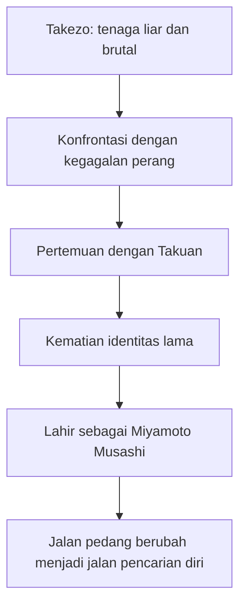
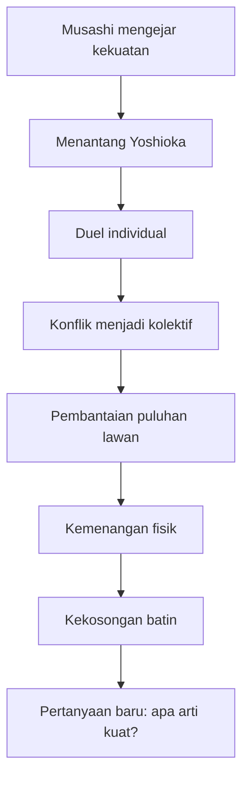
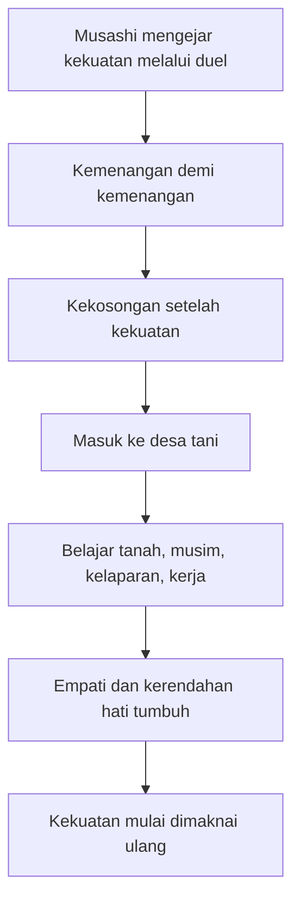
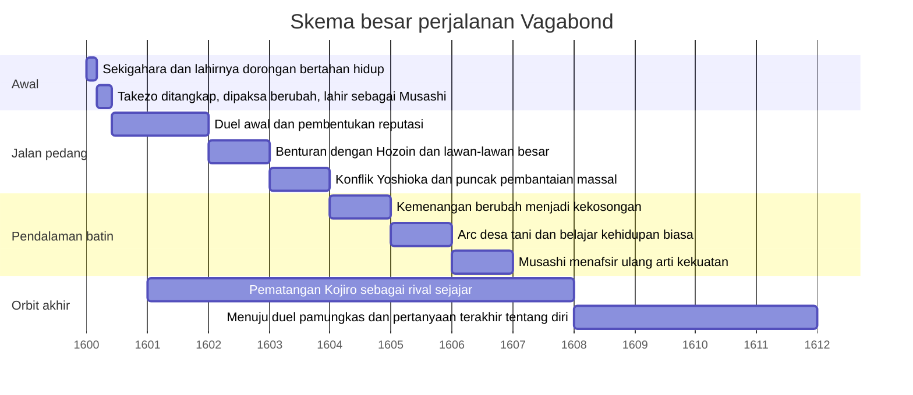

## 🗡️ Pendahuluan: Vagabond Bukan Sekadar Cerita Samurai, tetapi Kisah tentang Manusia yang Mencari Bentuk Jiwa Terkuatnya

Kalau kita membaca **Vagabond** hanya sebagai cerita duel, kita akan kehilangan hampir seluruh jantungnya. Memang di permukaan ia tampak seperti kisah klasik samurai: ada pedang, ada nama besar, ada pertarungan, ada lawan-lawan kuat, ada reputasi, ada jalan menjadi pendekar tak tertandingi. Tetapi semakin jauh kita masuk, semakin jelas bahwa Vagabond bukan pertama-tama kisah tentang menang atas orang lain. Ia adalah kisah tentang seseorang yang perlahan-lahan dipaksa memahami bahwa kemenangan terbesar tidak pernah sesederhana menjatuhkan lawan di tanah. 🗡️

Takehiko Inoue mengambil sosok **Miyamoto Musashi**—figur legendaris dalam sejarah dan sastra Jepang—lalu menulisnya bukan sebagai pahlawan siap jadi, melainkan sebagai manusia yang mentah, liar, impulsif, penuh energi brutal, dan hampir sepenuhnya digerakkan oleh nafsu untuk menjadi “tak terkalahkan”. Dari titik awal itulah Vagabond mendapatkan tenaganya: kita tidak langsung melihat seorang master *(mahir agung)*, tetapi seorang anak muda yang keras, bingung, keras kepala, dan belum tahu apa arti kekuatan yang ia kejar. 🔥

Justru karena itu, alur Vagabond begitu memikat. Ia bukan perjalanan naik lurus dari lemah menjadi kuat. Ia lebih mirip spiral panjang: Musashi menang, lalu kosong; bergerak, lalu tersesat; menjadi lebih kuat, tetapi juga lebih sepi; semakin dekat dengan cita-cita pedang, tetapi semakin sadar bahwa pedang saja tidak cukup menjawab hidup. Dalam proses itu, tokoh-tokoh lain seperti **Matahachi**, **Otsu**, **Takuan Soho**, **Inshun**, **Baiken**, **Seijuro Yoshioka**, **Denshichiro Yoshioka**, dan terutama **Sasaki Kojiro** bukan sekadar karakter sampingan, melainkan cermin-cermin yang memantulkan kemungkinan hidup yang berbeda-beda. 🌿

Itulah sebabnya, ketika orang meminta “alur lengkap” Vagabond, jawaban yang sungguh memadai tidak cukup berupa daftar kejadian. Vagabond harus dijelaskan sebagai gabungan antara:

- alur peristiwa,
- perkembangan psikologis,
- pendalaman spiritual,
- perubahan makna pedang,
- dan transformasi cara Musashi memandang dunia.

Kalau harus dirumuskan sebagai tesis utama, maka artikel ini berdiri di atas tesis berikut:

> **Vagabond adalah kisah panjang tentang transformasi Miyamoto Musashi dari hasrat kasar untuk menjadi yang terkuat menjadi pemahaman yang jauh lebih matang bahwa kekuatan sejati tidak bisa dipisahkan dari kesadaran diri, kesunyian, belas kasih, keterhubungan dengan hidup, dan kemampuan menanggung kekosongan tanpa lari kembali ke kekerasan.**

Karena itu, tulisan ini tidak akan sekadar merangkum plot dari awal sampai akhir. Saya akan membawanya sebagai pembacaan lengkap dan mendalam: dari Sekigahara sampai desa tani, dari duel sampai keheningan, dari ambisi sampai pencerahan yang belum tuntas. Dan seperti Vagabond sendiri, kita akan melihat bahwa semakin jauh perjalanan Musashi berjalan, semakin jelas bahwa pertanyaan paling penting bukan “siapa yang bisa ia kalahkan?”, melainkan:

> **“Apa sebenarnya arti menjadi manusia yang kuat?”**

---

<Callout type="important" title="Tesis utama artikel ini">
Vagabond adalah kisah pertumbuhan eksistensial. Pedang di dalamnya bukan hanya senjata, tetapi jalan untuk memperlihatkan bagaimana ambisi, kesepian, cinta, ego, ketakutan, dan pencarian makna membentuk seseorang menjadi lebih tajam—lalu memaksanya belajar bahwa ketajaman tanpa kejernihan jiwa hanya akan berakhir dalam kekosongan.
</Callout>

---

## 🌊 1. Titik Awal: Sekigahara, Takezo, dan Lahirnya Binatang yang Ingin Menjadi Tak Terkalahkan

Perjalanan Vagabond dimulai di bayang-bayang **Pertempuran Sekigahara**, salah satu titik balik besar dalam sejarah Jepang. Di tengah kekacauan perang itu, kita bertemu dua pemuda dari desa Miyamoto: **Shinmen Takezo** dan sahabatnya **Matahachi Honiden**. 🌊

Keduanya berangkat ke perang dengan dorongan yang berbeda tetapi sama-sama mentah. Matahachi lebih lemah, lebih mudah terbawa arus, dan banyak digerakkan oleh fantasi tentang kejayaan dan status. Takezo, yang kelak menjadi Miyamoto Musashi, jauh lebih liar. Ia bukan sekadar berani, tetapi seperti makhluk yang seluruh tubuh dan jiwanya dipenuhi tenaga mentah. Ia ingin hidup di batas, ingin membuktikan dirinya melalui kekuatan, dan sejak awal tampak seperti seseorang yang tidak cocok tinggal dalam dunia kecil dan tertata.

Setelah pihak yang mereka dukung kalah, medan perang berubah jadi ruang kekacauan, ketakutan, dan perebutan hidup. Di sinilah sejak awal Vagabond menegaskan satu hal: jalan Musashi lahir bukan dari sekolah yang nyaman, tetapi dari pengalaman langsung bersentuhan dengan kematian. Hidup baginya sejak awal bukan abstraksi. Hidup adalah soal bertahan, bergerak, menebas, dan tidak jatuh.

Namun bahkan di sini, Inoue sudah menanam benih perbedaan antara Takezo dan Matahachi. Dua orang ini sama-sama masuk perang sebagai pemuda desa, tetapi medan kekalahan memperlihatkan isi batin mereka yang berbeda. Matahachi lebih mudah mencari tempat aman, pengakuan, dan pelarian. Takezo justru seperti dikeluarkan dari kandang: kalah perang tidak membuatnya berhenti, malah membuat energinya makin tidak tertampung. ⚔️

---

## 🌿 2. Matahachi dan Musashi: Dua Jalan Hidup yang Selalu Saling Membayang-bayangi

Salah satu kekuatan terbesar Vagabond adalah keberanian Inoue untuk tidak menjadikan **Matahachi** sekadar karakter gagal yang fungsinya menonjolkan Musashi. Justru sebaliknya: Matahachi adalah salah satu kunci terdalam untuk memahami Musashi. 🌿

Musashi dan Matahachi berasal dari tempat yang sama, tumbuh bersama, dan sama-sama melihat perang serta dunia luar sebagai jalan keluar dari desa. Tetapi setelah itu, keduanya bergerak ke arah yang nyaris berlawanan.

### Matahachi mewakili apa?
Matahachi mewakili manusia yang ingin besar, tetapi tidak sanggup memikul harga dari kebesaran. Ia ingin nama, tetapi tidak sanggup menanggung disiplin. Ia ingin dikenang, tetapi tidak tahan menghadapi kehampaan dan rasa takut. Karena itu, hidup Matahachi dipenuhi oleh:

- lari dari kenyataan,
- kebohongan terhadap diri sendiri,
- pencarian identitas lewat orang lain,
- dan rasa malu yang makin lama makin menumpuk.

Musashi, sebaliknya, memang brutal dan sering buta, tetapi ia tidak lari dari ujian. Ia justru berkali-kali melempar dirinya ke situasi yang bisa menghancurkannya. Maka kalau Musashi adalah figur yang *menjadi* melalui benturan, Matahachi adalah figur yang berkali-kali tertahan dalam rasa takut, penyesalan, dan imitasi.

Dari sisi alur, keberadaan Matahachi sangat penting karena ia menunjukkan bahwa jalan Musashi bukan satu-satunya kemungkinan. Orang bisa lahir dari tempat yang sama, bermimpi hal yang mirip, tetapi hidupnya pecah ke arah yang sama sekali berbeda. Dengan begitu, Vagabond menjadi jauh lebih manusiawi: ia bukan dongeng “pahlawan besar vs orang lemah”, melainkan pembacaan terhadap dua bentuk kegagalan dan pertumbuhan yang sama-sama nyata. 🧠

---

## 🙏 3. Takuan Soho: Saat Kekuatan Liar Pertama Kali Dipaksa Menatap Dirinya Sendiri

Sesudah fase awal kekacauan, salah satu tokoh paling menentukan memasuki hidup Takezo: **Takuan Soho**, biksu Zen yang cerdas, tenang, sinis, tetapi juga sangat tajam membaca manusia. 🙏

Takuan adalah salah satu poros filsafat Vagabond. Kalau Takezo mewakili tenaga hidup yang mentah, Takuan mewakili kesadaran yang mampu menamai, menahan, dan membalikkan tenaga itu. Ia melihat bahwa Takezo bukan sekadar kriminal liar. Di balik kebrutalannya, ada potensi besar—tetapi potensi itu akan menjadi monster kalau tidak diubah bentuknya.

Melalui intervensi Takuan, Takezo pada dasarnya “mati” dan lahir ulang sebagai **Miyamoto Musashi**. Pergantian nama ini sangat penting. Ia bukan cuma perubahan label, tetapi simbol bahwa manusia bisa dipaksa memulai lagi, keluar dari diri lama, dan memasuki jalan baru.

### Mengapa Takuan penting?
Karena tanpa Takuan, Musashi mungkin hanya menjadi pembunuh besar. Dengan Takuan, tenaga brutal itu diarahkan ke jalan pencarian. Takuan bukan menjinakkan Musashi menjadi lembut, tetapi memaksa Musashi melihat bahwa:

- kekuatan tanpa kesadaran hanya liar,
- kemenangan tanpa arah hanya kosong,
- dan hidup yang hanya diisi oleh benturan akan berakhir sebagai kebinatangan yang tidak selesai.

Takuan adalah tokoh yang menanamkan pertanyaan. Dan dalam Vagabond, pertanyaan sering lebih penting daripada jawaban. 🌱

---

## 🌸 4. Otsu: Cinta, Rumah, dan Kemungkinan Hidup yang Tidak Dipilih Musashi

Kalau Takuan memberi arah intelektual dan spiritual, maka **Otsu** memberi dimensi afektif yang sangat penting. 🌸

Otsu bukan sekadar “love interest” *(tokoh cinta)*. Ia adalah gambaran tentang kehidupan lain yang mungkin. Dalam banyak bagian Vagabond, Otsu mewakili:

- kelembutan,
- kehangatan,
- keterikatan antarmanusia,
- dan bentuk hidup yang tidak dibangun di atas pembantaian dan pembuktian diri.

Musashi tidak pernah sepenuhnya bebas dari Otsu. Bahkan ketika ia pergi jauh, mengejar duel, reputasi, dan kesempurnaan pedang, keberadaan Otsu terus bekerja sebagai pengingat bahwa manusia tidak bisa hidup dari ambisi saja. Ada sisi dalam dirinya yang rindu pada rumah, kedekatan, dan ketenangan—meskipun ia belum bisa memilih itu.

Inilah tragedi halus dalam hubungan mereka. Musashi mencintai Otsu, tetapi pada fase-fase penting ia tidak mampu berhenti menjadi orang yang berjalan. Ia masih terlalu dikuasai panggilan pedang, terlalu terikat pada pencarian kekuatan, terlalu belum selesai dengan dirinya sendiri. Otsu, karena itu, bukan hanya orang yang ia cintai, tetapi juga simbol dari kehidupan yang terus ia tunda. 💧

---

## 🥋 5. Fase Awal Duel: Musashi Mengira Jalan Menjadi Tak Terkalahkan Adalah Jalan Melawan Semua Orang

Setelah identitas barunya terbentuk, Musashi mulai melangkah sebagai pengembara pedang. Pada tahap ini, pola pikirnya masih cukup sederhana, meski sangat intens: **untuk menjadi yang terkuat, aku harus menantang yang kuat**. 🥋

Karena itu, alur awal Vagabond dipenuhi rangkaian duel dan benturan yang membentuk reputasi Musashi. Tetapi penting dipahami: duel-duel ini bukan sekadar aksi. Setiap pertemuan adalah pelajaran tentang batas diri. Musashi mulai melihat bahwa kekuatan bukan hanya soal tenaga dan keberanian, melainkan juga:

- ritme,
- kesadaran tubuh,
- ketenangan batin,
- pemahaman lawan,
- dan kemampuan menghadapi maut tanpa kehilangan pusat diri.

Awalnya ia masih didorong oleh logika yang keras: tebas, menang, maju. Namun semakin banyak duel dijalani, semakin jelas bahwa jalan ini juga memakan bagian dari jiwanya. Semakin banyak ia menang, semakin banyak pula kehampaan muncul sesudahnya. Ini sangat penting, karena di sinilah Vagabond mulai menggeser definisi kekuatan. 🧩

---

## 🌲 6. Hozoin Inshun: Pertemuan dengan Dinding Besar yang Memaksa Musashi Mengakui Bahwa Semangat Saja Tidak Cukup

Salah satu langkah penting dalam pertumbuhan Musashi adalah pertemuannya dengan **Hozoin Inshun**, petarung tombak dari lingkungan biara Hozoin. 🌲

Di sini Musashi bertemu lawan yang bukan cuma kuat secara teknik, tetapi juga membawa struktur latihan, disiplin, dan pengalaman yang berbeda dari dirinya. Inshun menjadi seperti tembok pertama yang benar-benar memaksa Musashi menyadari bahwa keberanian telanjang tidak cukup.

### Apa pelajaran dari fase ini?
- Musashi belajar bahwa kebuasan harus dipadukan dengan kejernihan.
- Ia mulai melihat bahwa rasa takut bukan musuh yang bisa dihapus begitu saja, melainkan sesuatu yang harus dipahami.
- Ia mulai mengerti bahwa tubuh dan jiwa dalam duel tidak bisa dipisahkan.

Dalam banyak karya samurai, duel dipakai untuk menunjukkan siapa lebih jago. Dalam Vagabond, duel dengan Inshun lebih penting dari itu: ia memperlihatkan bahwa **kekuatan sejati menuntut transformasi batin, bukan sekadar penambahan teknik**. 🌿

---

## ⚒️ 7. Baiken dan Dunia yang Lebih Kotor: Pedang Bukan Selalu Ruang Kehormatan, Kadang Juga Kubangan Dendam dan Keterdesakan

Vagabond juga cerdas karena tidak romantis terhadap duel. Tidak semua lawan Musashi adalah figur agung. Beberapa membawa dimensi dunia yang lebih kasar, lebih penuh dendam, lebih dekat dengan kemelaratan dan kekerasan telanjang. Tokoh seperti **Shishido Baiken** memperluas dunia Vagabond ke arah itu. ⚒️

Melalui benturan dengan orang-orang seperti ini, Musashi dihadapkan pada kenyataan bahwa jalan pedang bukan ruang suci yang steril. Ia juga bersentuhan dengan:

- dunia kriminal,
- insting bertahan,
- dendam keluarga,
- kelicikan,
- dan hidup yang dibentuk oleh kekurangan.

Itu penting karena membuat pencarian Musashi tidak jatuh menjadi romantisme elitis. Pedang bisa agung, tetapi bisa juga kotor. Manusia bisa berbicara tentang jalan, prinsip, dan kehormatan, tetapi di bawah semua itu ada kenyataan hidup yang brutal. Vagabond selalu menjaga ketegangan ini. ⚠️

---

## 🏯 8. Yoshioka: Ketika Ambisi Pribadi Berhadapan dengan Sistem, Reputasi, dan Tradisi yang Membeku

Puncak awal yang sangat penting dalam alur Vagabond adalah konflik Musashi dengan **sekolah Yoshioka** di Kyoto. Ini bukan lagi soal duel perorangan sederhana. Ini sudah menyentuh:

- reputasi publik,
- struktur sekolah bela diri,
- harga diri kolektif,
- politik nama besar,
- dan benturan antara individu radikal melawan institusi mapan. 🏯

Musashi, dengan seluruh kebrutalan dan keberaniannya, seperti badai yang masuk ke dalam dunia Yoshioka yang formal, ternama, tetapi juga sudah rapuh di bagian tertentu. Pertemuannya dengan **Seijuro Yoshioka** dan **Denshichiro Yoshioka** menjadi sangat penting karena keduanya bukan sekadar lawan. Mereka mewakili bentuk dunia pedang yang berbeda:

- ada kehormatan,
- ada beban nama,
- ada ekspektasi sosial,
- tetapi juga ada stagnasi dan ilusi kebesaran.

Musashi menantang bukan hanya tubuh mereka, tetapi seluruh sistem makna yang menopang mereka. Dan tentu saja, ketika seorang pengembara liar mulai mengguncang institusi besar, responsnya bukan hanya duel adil. Dunia akan membalas dengan kolektivitas, amarah, dan rencana pembunuhan yang jauh lebih besar. 💢

---

## ⚔️ 9. Duel-Duel Yoshioka dan Pembantaian 70 Lawan: Kemenangan yang Justru Membuka Kekosongan Paling Dalam

Salah satu bagian paling legendaris dalam alur Vagabond adalah benturan Musashi dengan Yoshioka yang berujung pada pembantaian puluhan lawan. Secara permukaan, ini tampak seperti momen di mana Musashi benar-benar menjadi monster tempur: ia menghadapi jumlah yang luar biasa besar dan tetap bertahan. ⚔️

Tetapi justru di sinilah Vagabond melakukan sesuatu yang lebih besar daripada fantasi kekuatan. Inoue tidak memperlakukan momen ini sebagai pemenuhan heroik biasa. Ia memperlihatkan harga psikologisnya. Musashi memang bisa menang, tetapi kemenangan seperti ini tidak meninggalkan rasa kemenangan yang murni. Yang tertinggal justru:

- kelelahan eksistensial,
- kesadaran akan banyaknya nyawa yang hilang,
- tubuh yang nyaris runtuh,
- dan pertanyaan yang makin keras: **jika ini adalah puncak kekuatan, kenapa rasanya begitu sepi?**

Inilah salah satu titik balik terbesar dalam perjalanan Musashi. Ia mulai melihat bahwa menjadi “kuat” dalam arti menebas semua lawan ternyata tidak otomatis memberi kedamaian. Bahkan bisa sebaliknya: makin banyak yang ia kalahkan, makin jelas bahwa jalan lama yang ia tempuh tidak cukup untuk memberi jawaban. ☁️

---

## 🌾 10. Sesudah Darah dan Nama Besar: Musashi Mulai Paham bahwa Pedang Saja Tidak Menyelesaikan Hidup

Sesudah fase Yoshioka, salah satu hal paling penting dalam Vagabond adalah perubahan ritme. Inoue tidak buru-buru menaikkan Musashi ke duel besar berikutnya. Sebaliknya, ia perlahan memindahkan perhatian kita dari eksternal ke internal. 🌾

Musashi mulai mengalami benturan dengan kenyataan bahwa:

- reputasi tidak sama dengan kebijaksanaan,
- kemenangan tidak sama dengan kejernihan,
- dan jalan pedang tidak bisa dipahami hanya sebagai teknik membunuh.

Di sinilah cerita mulai bergerak ke arah yang jauh lebih filosofis. Musashi tidak berhenti menjadi petarung, tetapi energi pencariannya berubah. Ia tidak lagi semata ingin tahu bagaimana menebas lebih cepat. Ia mulai ingin tahu bagaimana manusia hidup, bagaimana ketakutan bekerja, bagaimana tanah ditanam, bagaimana musim bergerak, dan bagaimana orang biasa menanggung hidup sehari-hari.

Perubahan ini sangat penting. Sebab di titik ini Vagabond menegaskan bahwa **puncak pertumbuhan tidak terjadi ketika seseorang menjadi lebih mematikan, tetapi ketika ia mulai melihat kehidupan di luar dirinya sendiri.** 🌱

---

## 🐚 11. Sasaki Kojiro: Cermin Lain dari Kejeniusan, Kebebasan, dan Takdir yang Berbeda Sama Sekali

Kalau Musashi adalah pusat utama, maka **Sasaki Kojiro** adalah orbit besar yang membuat seluruh kosmos Vagabond terasa utuh. 🐚

Kojiro dalam Vagabond bukan sekadar rival terakhir. Ia dibangun sebagai dunia tandingan. Dalam banyak versi populer, Kojiro hanya diingat sebagai lawan pamungkas Musashi. Tetapi Inoue memberinya kedalaman luar biasa:

- ia tuli, sehingga berhubungan dengan dunia secara berbeda,
- ia seperti jenius alamiah pedang,
- ia lebih cair, lebih spontan, lebih musikal dalam tubuhnya,
- dan banyak bergerak seolah pedang baginya bukan beban filsafat, tetapi bahasa hidup itu sendiri.

Di sini Musashi dan Kojiro bukan sekadar dua petarung kuat. Mereka seperti dua mode eksistensi:

- Musashi dibentuk oleh benturan, luka, dan refleksi keras.
- Kojiro tampak seperti makhluk yang menyatu dengan gerak, laut, dan insting hidup yang lebih bebas.

Karena itu, kehadiran Kojiro memperluas makna Vagabond. Ia membuat kita sadar bahwa jalan menuju puncak tidak satu. Orang bisa sampai pada kedalaman yang besar melalui penderitaan dan disiplin, tetapi juga bisa melalui kepekaan, spontanitas, dan hubungan yang lain dengan dunia. 🌊

---

## 🫧 12. Kojiro dan Musashi: Persaingan yang Sebenarnya Adalah Dialog tentang Bentuk Kehidupan

Semakin jauh cerita bergerak, semakin jelas bahwa Musashi vs Kojiro bukan sekadar “siapa menang di akhir”. Itu terlalu dangkal. Yang dipertaruhkan sebenarnya adalah dua cara menjadi manusia. 🫧

### Musashi:
- keras,
- sadar diri,
- membawa luka dan refleksi,
- membangun kekuatan melalui perjuangan panjang.

### Kojiro:
- intuitif,
- bebas,
- seperti bermain dengan pedang,
- memancarkan kejeniusan yang lebih organik.

Dengan demikian, duel pamungkas di antara mereka bukan hanya duel tubuh. Ia adalah benturan dua bentuk eksistensi. Dan karena Inoue menulis keduanya dengan penuh hormat, pembaca tidak bisa sekadar memilih “yang baik” dan “yang jahat”, atau “yang benar” dan “yang salah”. Kita dipaksa menyaksikan dua intensitas hidup yang sama-sama besar, tetapi berbeda arah. 🪞

---

## 🌾 13. Arc Desa Tani: Ketika Musashi Belajar bahwa Menumbuhkan Padi Bisa Lebih Sulit daripada Menebas Lawan

Salah satu fase paling penting, dan bagi banyak pembaca juga paling mengejutkan, adalah ketika Vagabond masuk ke **arc pertanian** atau fase desa tani. Ini adalah momen di mana banyak pembaca yang mencari duel cepat mungkin justru tidak siap, padahal secara filosofis inilah salah satu puncak karya. 🌾

Mengapa?
Karena untuk pertama kalinya Musashi dipaksa keluar dari logika langsung dunia pedang. Di desa, ia berhadapan dengan:

- tanah,
- musim,
- kelaparan,
- kegagalan panen,
- penderitaan orang biasa,
- dan kerja yang tidak bisa diselesaikan dengan tebasan.

Ini luar biasa penting. Selama ini Musashi mengukur kekuatan melalui tubuh dan duel. Tetapi di sini ia belajar bahwa hidup juga ditentukan oleh kemampuan:

- merawat,
- menunggu,
- memahami ritme alam,
- menanggung keterbatasan,
- dan bekerja bersama realitas yang tidak tunduk pada ego kita.

Dengan kata lain, desa tani adalah sekolah kerendahan hati terbesar bagi Musashi. Ia belajar bahwa hidup tidak berputar di sekeliling dirinya. Bahkan mungkin untuk pertama kalinya ia mulai sungguh melihat manusia lain bukan sebagai lawan, penonton, atau cermin reputasi, tetapi sebagai sesama makhluk yang menanggung beban eksistensi. 🌧️

---

## 🪵 14. Pedang yang Semula Alat Dominasi Perlahan Menjadi Jalan Pengenalan Diri

Di sinilah transformasi paling indah dari Vagabond terjadi. Pada awal cerita, pedang bagi Musashi adalah alat untuk:

- bertahan hidup,
- membuktikan diri,
- mengalahkan lawan,
- dan menegakkan keberadaan.

Tetapi semakin ia berjalan, pedang perlahan berubah makna. Ia menjadi:

- cermin ego,
- cermin ketakutan,
- cermin kesombongan,
- lalu akhirnya jalan untuk memahami keheningan dan keterhubungan. 🪵

Ini sangat khas karya besar. Simbol utama tidak tetap pada satu fungsi. Ia ikut bertumbuh bersama protagonis. Maka “jalan pedang” di Vagabond bukan sekadar teknik berkelahi, tetapi semacam askese batin yang keras: manusia memotong ilusi-ilusinya sendiri melalui benturan dengan dunia.

Dan ketika Musashi mulai memahami bahwa pedang tidak bisa dipisahkan dari cara ia memandang hidup, kita pun sebagai pembaca dipaksa mengubah cara membaca duel. Duel tidak lagi hanya “siapa lebih jago”, tetapi “siapa sedang berada di kondisi batin seperti apa”. 🧠

---

## 🌕 15. Apa Sebenarnya yang Dicari Musashi? Ketenaran, Keabadian, atau Pembebasan dari Takut?

Semakin dewasa pembacaan kita terhadap Vagabond, semakin jelas bahwa pertanyaan sentralnya bukan “bisakah Musashi menjadi samurai terhebat?”, tetapi “apa sebenarnya isi dari hasrat menjadi yang terkuat itu?” 🌕

Apakah Musashi ingin:

- ditakuti?
- diakui?
- diabadikan dalam nama?
- melampaui semua manusia lain?
- atau sebenarnya ia sedang mencoba membebaskan diri dari rasa kecil, rasa takut, dan rasa tidak utuh yang telah lama menghantuinya?

Vagabond perlahan memberi jawaban yang makin kompleks. Pada awalnya, ya, Musashi memang ingin menjadi besar secara sederhana. Tetapi sesudah perjalanan panjang, semakin tampak bahwa akar pencariannya jauh lebih dalam: ia ingin menyatu dengan hidup tanpa didikte oleh ketakutan. Ia ingin mencapai keadaan di mana tubuh, pedang, pikiran, dan dunia tidak saling terputus.

Dengan begitu, jalan menjadi “invincible under the sun” *(tak terkalahkan di bawah langit)* berubah. Yang tadinya tampak seperti obsesi kemenangan lahiriah, lama-lama bergerak ke arah kejernihan batin. ☀️

---

## 💔 16. Otsu, Matahachi, dan Musashi: Tiga Wajah Cinta, Kegagalan, dan Penundaan Hidup

Hubungan antara Musashi, Otsu, dan Matahachi juga sangat penting secara emosional. 💔

- **Otsu** mewakili kesetiaan, kehangatan, dan kehidupan yang bisa menyejukkan.
- **Matahachi** mewakili kegagalan, ketakutan, dan kebohongan terhadap diri sendiri.
- **Musashi** mewakili hasrat tumbuh yang begitu besar sampai sulit berhenti dan berdiam.

Di antara ketiganya, Inoue membangun drama yang tidak melodramatis, tetapi sangat pedih. Otsu mencintai Musashi, tetapi Musashi terus bergerak. Matahachi juga terhubung dengan Otsu, tetapi kehidupannya terlalu kacau dan terlalu dikuasai kelemahan sendiri. Ketiganya tidak pernah berada di tempat batin yang sama. Karena itu, relasi mereka penuh keterlambatan, salah waktu, dan luka halus.

Di sini Vagabond menunjukkan bahwa pertumbuhan sering menuntut harga emosional. Tidak semua orang bisa ikut bertumbuh bersama kita pada kecepatan yang sama. Dan tidak semua cinta dapat langsung menemukan bentuk hidupnya. 💧

---

## 🧘 17. Vagabond sebagai Jalan Zen: Dari Ego Menuju Kekosongan yang Bukan Hampa, tetapi Ruang Kejernihan

Vagabond sangat dipengaruhi oleh sensibilitas **Zen** meski tidak selalu mengajarkannya secara literal. 🧘

Yang dimaksud di sini bukan Zen sebagai ornamen spiritual, tetapi sebagai pengalaman:

- keheningan,
- perhatian penuh,
- kesadaran akan momen,
- pelepasan ego,
- dan kemampuan melihat hidup tanpa terlalu banyak kabut konsep.

Musashi tidak belajar Zen hanya lewat ceramah. Ia belajar melalui:

- duel,
- luka,
- kelaparan,
- kelelahan,
- perjumpaan dengan orang lain,
- dan akhirnya melalui kehidupan yang sangat sederhana.

Itulah yang membuat Vagabond terasa begitu matang. Pencerahan di sini bukan lampu yang tiba-tiba menyala. Ia adalah hasil panjang dari dibanting hidup berkali-kali sampai ego pelan-pelan kehilangan klaimnya sebagai pusat dunia. 🌫️

---

## 🔚 Kesimpulan: Vagabond Adalah Kisah tentang Manusia yang Semula Ingin Menaklukkan Dunia, lalu Belajar Menjadi Cukup Luas untuk Menampung Dunia

Kalau seluruh alur Vagabond diperas sampai ke inti terdalamnya, maka hasilnya bukan “Musashi menjadi pendekar terhebat”. Itu terlalu kecil. Yang sebenarnya terjadi adalah ini: **Musashi berangkat sebagai manusia yang ingin menaklukkan dunia melalui pedang, tetapi perlahan dipaksa belajar bahwa untuk menjadi benar-benar kuat, ia harus menjadi cukup hening, cukup luas, dan cukup jujur untuk menampung kehidupan itu sendiri.** 🔚

Dari Sekigahara sampai desa tani, dari Takezo sampai Musashi, dari kebrutalan sampai kejernihan, Vagabond memperlihatkan bahwa:

- kekuatan tanpa kesadaran adalah kebisingan,
- kemenangan tanpa makna adalah kekosongan,
- cinta tanpa kesiapan menjadi penundaan,
- dan pedang tanpa pemahaman hidup hanya akan menambah kuburan.

Musashi tidak langsung menjadi bijak. Ia justru harus berkali-kali tersesat untuk sampai pada kemungkinan kebijaksanaan. Itulah yang membuatnya besar. Ia bukan tokoh yang sejak awal suci, tetapi tokoh yang tumbuh melalui benturan dengan realitas sampai akhirnya bisa melihat bahwa manusia terkuat mungkin bukan yang paling banyak membunuh, melainkan yang paling sedikit ditipu oleh egonya sendiri.

Dan karena itu, mungkin satu kalimat terbaik untuk mengingat seluruh Vagabond adalah ini:

> **Vagabond adalah kisah tentang bagaimana pedang, jika dijalani sampai ke akar terdalamnya, tidak berakhir pada pembunuhan, melainkan pada pertanyaan yang paling sunyi: siapakah diriku ketika semua yang ingin kubuktikan akhirnya tidak lagi cukup?**

Itulah sebabnya Vagabond begitu sulit dilupakan. Ia bukan cuma membuat kita kagum pada Musashi. Ia membuat kita memikirkan hidup kita sendiri—tentang ambisi, jalan, kesepian, cinta, kerja, luka, dan arti menjadi kuat. 🌾

---

## Glosarium istilah asing + padanan Indonesia

| Istilah | Padanan / Penjelasan |
|---|---|
| vagabond | pengembara; orang yang hidup berpindah-pindah tanpa tempat tetap |
| samurai | ksatria Jepang feodal; kelas pejuang dengan etos kehormatan dan disiplin |
| master | mahir agung; orang yang mencapai tingkat penguasaan sangat tinggi |
| dark intensity | intensitas gelap; daya emosional yang keras dan tidak nyaman tetapi kuat |
| self-mastery | penguasaan diri; kemampuan menata tubuh, pikiran, dan dorongan batin |
| discipline | disiplin; ketekunan terarah dan pengendalian diri |
| ego | aku-psikologis; pusat identitas, hasrat, ambisi, dan klaim diri |
| Zen | tradisi Buddhisme yang menekankan keheningan, kesadaran langsung, dan kejernihan |
| the struggler | sang pejuang; sosok yang terus bergerak meskipun jalannya keras |
| invincible | tak terkalahkan; tidak mudah dijatuhkan oleh lawan |
| existential | eksistensial; berkaitan dengan makna hidup, diri, pilihan, dan keberadaan |
| reflection | refleksi; perenungan mendalam atas diri dan pengalaman |
| transformation | transformasi; perubahan mendasar dalam bentuk diri |
| rivalry | rivalitas; persaingan yang membentuk kedua pihak |
| fatal flaw | cacat tragis; kelemahan mendasar yang ikut membentuk jatuh-bangunnya tokoh |

---

---

<Callout type="quote" title="Satu kalimat untuk mengingat seluruh artikel ini">
Vagabond adalah kisah tentang manusia yang mula-mula mengejar kemenangan atas orang lain, lalu perlahan mengerti bahwa kemenangan tertinggi adalah kejernihan atas dirinya sendiri.
</Callout>

---

<YouTube url="https://www.youtube.com/watch?v=zDXezGxuj4o" title="Vagabond The COMPLETE Storyline" />

---

<Callout type="cite" title="Referensi">
Sumber utama: transkrip video *Vagabond The COMPLETE Storyline* dari YouTube, dibaca ulang dan disusun ulang secara analitis dengan fokus pada alur besar serta tema filosofis Vagabond.
</Callout>
