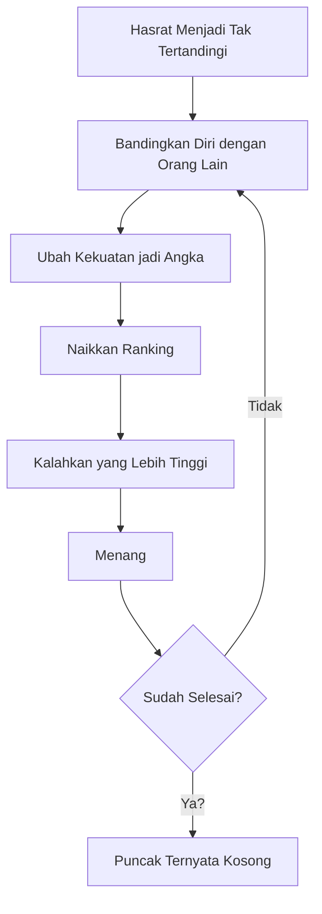
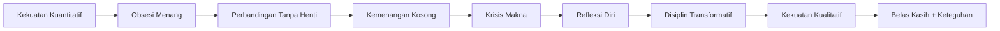

## Pendahuluan: Ketika "Menang" Ternyata Bukan Tujuan Akhir ⚔️🧠

Ada karya yang dibaca untuk hiburan.
Ada karya yang dibaca untuk pelarian.
Dan ada karya seperti **_Vagabond_**, yang justru memaksa kita menatap diri sendiri dengan jujur. ✨

Tulisan Naoki Yamamoto, *From Quantitative Strength to Transformative Discipline: Reflections on Vagabond*, menawarkan pembacaan yang sangat tajam: bahwa perjalanan Musashi bukan sekadar kisah duel, melainkan kritik terhadap cara modern manusia menilai dirinya sendiri—melalui angka, ranking, status, dan superioritas.

Dalam bahasa sederhana: kita pikir hidup adalah lomba naik peringkat. Tapi mungkin, seperti Musashi, kita sedang mengejar puncak yang sebenarnya kosong.

<Callout type="important" title="Tesis Utama">
**Kekuatan kuantitatif** (siapa lebih kuat, lebih tinggi, lebih besar) pada akhirnya rapuh karena bersifat relatif dan dibatasi kematian.

Sebaliknya, **disiplin transformatif** menggeser fokus dari menaklukkan orang lain ke menaklukkan diri sendiri.
</Callout>

---

## 1) Vagabond Bukan Sekadar Manga Duel 🎴

Yamamoto menekankan bahwa _Vagabond_ lebih dekat ke **seinen** daripada shōnen. Artinya, karya ini tidak menawarkan fantasi kemenangan remaja semata, melainkan refleksi bagi orang yang sudah bertemu kompleksitas hidup nyata: kontradiksi sosial, ambisi pribadi, luka ego, dan krisis makna.

Jadi, ini bukan cerita "siapa paling jago pedang".
Ini adalah pertanyaan filosofis:

- Apa itu kuat?
- Apa itu unggul?
- Apa arti "tak tertandingi di bawah langit" (_tenka musō_)?

---

## 2) Musashi Awal: Logika Angka, Logika Peringkat 📈

Di fase awal, Musashi bergerak dengan pola pikir yang sangat modern:

- lawan bisa diperingkat,
- kekuatan bisa diukur,
- supremasi bisa dihitung,
- dan puncak bisa dicapai jika semua di atasmu dikalahkan.

Ketika ia menantang murid-murid Yoshioka, obsesinya bukan hanya menang, tapi **"mereka rank berapa?"**.

Ini sangat relevan dengan zaman sekarang:

- followers,
- engagement,
- IPK,
- jabatan,
- penghasilan,
- produktivitas per hari.

Semua seolah berkata: "Nilaimu = angkamu." 📊

*Panel ini menegaskan fase awal Musashi: kekuatan dipahami sebagai angka, urutan, dan posisi.*

---

## 3) Sekishūsai vs Ittōsai: Retaknya Logika Supremasi 🌊🐻

Salah satu momen paling penting dalam refleksi Yamamoto adalah dialog antara Yagyū Sekishūsai dan Itō Ittōsai.

Ittōsai, dengan logika duel yang brutal, menempelkan pedang ke leher Sekishūsai dan menyiratkan: "Jika kita bertarung, aku menang. Berarti aku yang tak tertandingi."

Namun Sekishūsai menjawab dengan tenang: kemenangan seperti itu tetap relatif.

Maknanya dalam: jika manusia A bisa membunuh manusia B, apakah itu bukti supremasi absolut? Tidak.

Karena:
- beruang bisa membunuh A,
- banjir bisa menyeret beruang,
- alam bisa menelan semuanya,
- dan kematian menutup semua perbandingan.

<Callout type="quote" title="Inti Filsafatnya">
Kekuatan yang didefinisikan secara angka akan selalu runtuh di hadapan **relativitas** dan **mortalitas**.
</Callout>

*Kedua panel ini memperlihatkan titik retak narasi “aku paling kuat”: menang bukan berarti mutlak, hanya relatif pada kondisi.*

---

## 4) Titik Balik Musashi: Dari Menang ke Menjadi 🌱

Musashi tetap menang berkali-kali. Ia mengalahkan lawan besar. Ia membuktikan kapasitasnya.

Tetapi anehnya, kemenangan itu tidak memberi ketenangan eksistensial.

Di sinilah transformasi dimulai.

Ia tidak lagi berkeliling hanya mencari lawan baru. Ia mulai:
- bereksperimen dengan pedangnya,
- mempertanyakan dirinya,
- merevisi cara pandang,
- belajar dari kegagalan,
- dan melihat orang lain bukan semata musuh, tetapi cermin.

Takuan melihat perubahan ini dan mengucap: yang kuat itu lembut.

Kalimat ini penting: **kekuatan sejati tidak harus bising, tidak harus kasar, tidak harus pamer dominasi.** 💠

*Ini momen “positif” yang penting: pertumbuhan Musashi tidak lagi ditandai oleh siapa yang ia kalahkan, tapi oleh bagaimana batinnya melunak tanpa kehilangan keteguhan.*

---

## 5) Kritik untuk Budaya Prestasi Modern 🏁

Refleksi ini terasa tajam karena menampar kebiasaan kita hari ini.

Kita hidup dalam sistem yang terus mendorong kuantifikasi:
- siapa paling produktif,
- siapa paling cepat,
- siapa paling viral,
- siapa paling berpengaruh.

Tidak salah mengukur. Ukuran berguna.
Yang berbahaya adalah ketika **seluruh nilai diri direduksi menjadi metrik**.

Ketika itu terjadi, hidup berubah jadi treadmill:

- capai target,
- kosong,
- naik target lagi,
- kosong lagi.

Tidak ada akhir, karena horizon pembanding selalu bergeser.

<Callout type="warning" title="Tanda Kita Terjebak Logika Kuantitatif">
1. Sulit bahagia tanpa validasi eksternal 😵‍💫
2. Merasa gagal meski sudah jauh berkembang
3. Menganggap orang lain terutama sebagai kompetitor
4. Istirahat terasa seperti dosa
5. Takut "kalah" bahkan dalam hal yang seharusnya bisa dinikmati
</Callout>

---

## 6) Dari Aritmetika ke Kebangkitan Batin: Apa Artinya? 🔥

Yamamoto menutup refleksinya dengan frasa yang sangat kuat: dari **aritmetika** menuju **awakening**.

Artinya:

- dari "berapa aku dibanding dia" 
  → ke "siapa aku sedang bertumbuh menjadi"

- dari "bagaimana aku menundukkan lawan" 
  → ke "bagaimana aku menata diriku"

- dari "aku harus nomor satu" 
  → ke "aku harus jujur, tajam, dan matang"

Inilah makna baru _tenka musō_: bukan nihilnya rival, melainkan nihilnya permusuhan dalam batin.

---

## 7) Relevansi Praktis untuk Hidup Kita Hari Ini 🧭

Supaya tidak berhenti jadi teori, ini terjemahan praktisnya:

### A. Dalam Karier
Fokus pada **kedalaman kompetensi** dan **integritas kerja**, bukan hanya posisi jabatan.

### B. Dalam Belajar
Kejar **pemahaman** bukan sekadar nilai.

### C. Dalam Berkarya
Bangun kualitas yang tahan waktu, bukan hanya viral sesaat.

### D. Dalam Relasi
Lihat orang lain bukan hanya pesaing, tapi rekan perjalanan pertumbuhan.

### E. Dalam Spiritualitas
Latih disiplin diri: sabar, jujur, rendah hati, konsisten.

---

## 8) Catatan Kritis: Membaca Vagabond dengan Jujur 🪞

Sebagian pembaca merasa perkembangan moral Musashi terlalu lambat, bahkan kontradiktif. Kritik ini valid.

Tetapi justru di situ kekuatan _Vagabond_: transformasi manusia tidak linear.

Pertumbuhan sering maju-mundur:
- sadar,
- jatuh lagi,
- sadar lagi,
- revisi lagi.

Karya ini tidak menyajikan pencerahan instan, melainkan proses panjang yang tidak nyaman. Dan mungkin, justru karena itu ia terasa manusiawi.

<Callout type="question" title="Pertanyaan untuk Diri Sendiri">
Saat ini, saya sedang mengejar apa?

- kemenangan eksternal,
- atau kematangan internal?

- ranking,
- atau kedalaman?
</Callout>

---

## Penutup: Menjadi Tak Tertandingi, Tanpa Harus Menaklukkan Semua Orang 🌤️

Refleksi Yamamoto mengingatkan kita bahwa puncak prestasi bukan selalu tempat tertinggi dalam hierarki.

Kadang puncak itu adalah kondisi batin:
- tetap tegas tanpa kasar,
- tetap kuat tanpa pamer,
- tetap tajam tanpa membenci,
- tetap disiplin tanpa kehilangan kasih.

Di titik itu, kompetisi tidak lagi menguasai hidup kita.
Bukan karena dunia berhenti menilai, tapi karena kita tidak lagi mendefinisikan diri hanya dari penilaian itu.

Dan mungkin, di sanalah makna "tak tertandingi di bawah langit" lahir kembali—lebih hening, lebih dewasa, lebih manusiawi. ✨

---

## Catatan Visual 🖼️

Panel-panel dari sumber asli sudah ditampilkan sebagai **embedded image** di bagian yang relevan agar alur baca lebih natural dan konteksnya tepat.

## Sumber 📚

- Naoki Yamamoto, *From Quantitative Strength to Transformative Discipline: Reflections on Vagabond*  
  https://naokiyamamoto.substack.com/p/from-quantitative-strength-to-transformative
