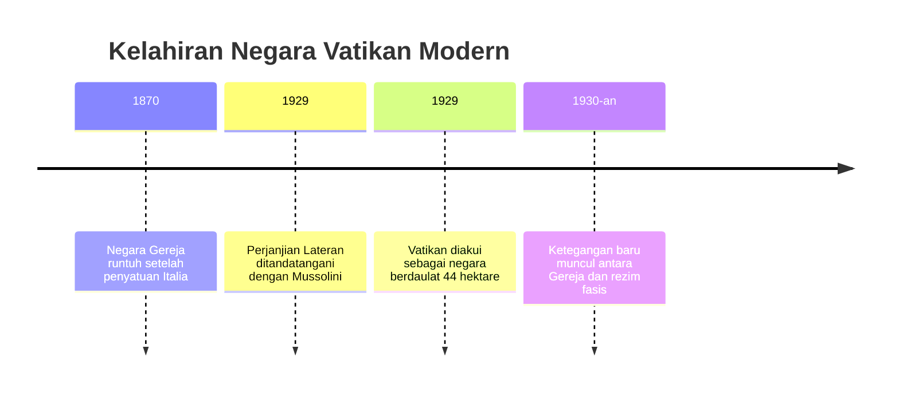
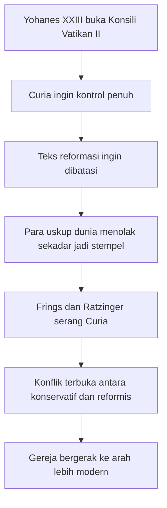
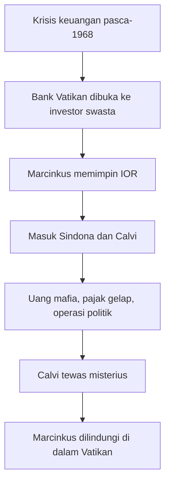
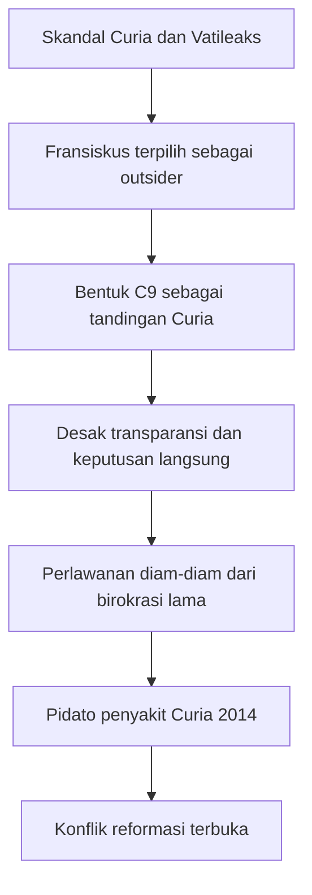

## 🎯 Pendahuluan: Vatikan Bukan Hanya Gereja, tetapi Juga Negara, Mesin Kekuasaan, dan Panggung Intrik

Banyak orang memandang Vatikan hanya sebagai pusat spiritual Gereja Katolik, tempat paus tinggal, misa besar diadakan, dan keputusan-keputusan iman diumumkan kepada dunia. Gambaran itu benar, tetapi hanya sebagian. Vatikan juga adalah **negara** — sangat kecil secara wilayah, tetapi besar secara simbolik, diplomatik, finansial, dan politik. Ia memiliki pemerintahan, birokrasi, diplomasi, bank, arsip, hierarki, dan tentu saja konflik internal yang tidak kalah rumit dibanding negara-negara besar. 🕍

Dokumenter *Vatican : Histoires secrètes* sangat menarik karena membongkar satu hal yang sering terlupakan: sejarah modern Vatikan bukan sekadar sejarah kekudusan, melainkan juga sejarah **kompromi, intrik, perebutan pengaruh, jaringan keuangan, konflik ideologis, dan perlawanan terhadap reformasi**. Kita melihat bagaimana para paus tidak hanya berhadapan dengan pertanyaan teologis, tetapi juga dengan fasisme, Nazisme, komunisme, mafia, korupsi birokrasi, bank gelap, skandal seksual, perang opini publik, dan perlawanan dari dalam tubuh Curia Romana — *Roman Curia*, yaitu pemerintahan administratif Takhta Suci.

Dalam dokumenter ini, Vatikan tampak sebagai institusi yang terus-menerus terbelah antara dua dorongan besar. Di satu sisi, ia ingin menjaga kontinuitas tradisi, kewibawaan, ritus, dan otoritas berusia dua milenium. Di sisi lain, ia berulang kali dipaksa sejarah untuk berubah: menghadapi totalitarianisme, perang dunia, modernitas, demokrasi, media massa, tuntutan transparansi, dan opini publik global. Setiap kali perubahan dicoba, selalu muncul kelompok yang merasa bahwa perubahan itu mengancam bukan hanya kebiasaan lama, tetapi juga struktur kenyamanan, privilese, dan kuasa yang sudah berurat akar.

Itulah sebabnya kisah Vatikan modern begitu dramatis. Di satu masa, kita melihat seorang paus menegosiasikan status negara dengan Mussolini. Di masa lain, kita melihat ambigu terhadap Holocaust. Lalu datang Konsili Vatikan II yang mengguncang gereja dari dalam. Setelah itu, Bank Vatikan menjalin hubungan berbahaya dengan dunia uang gelap. Lalu Yohanes Paulus II menjadikan kepausan sebagai kekuatan geopolitik global melawan komunisme, tetapi pada saat yang sama membiarkan Curia kembali menguat dan skandal internal mengendap. Sesudah itu, Benediktus XVI mencoba membersihkan sebagian kerusakan, namun malah terjebak oleh sistem yang terlalu opak. Dan akhirnya, Fransiskus datang sebagai paus non-Eropa dengan mandat reformasi, hanya untuk mendapati bahwa musuh terberatnya bukanlah dunia luar, melainkan **penyakit-penyakit internal Gereja sendiri**. ⚠️

Artikel ini akan mengurai sejarah itu secara panjang, runtut, dan mendalam. Kita akan membaca Vatikan sebagai lembaga iman sekaligus lembaga kekuasaan. Kita akan melihat bagaimana sejarahnya dibentuk oleh negosiasi dengan diktator, pembungkaman, moralitas, uang, skandal, dan upaya-upaya reformasi yang selalu memicu reaksi keras. Jika ada istilah asing, saya beri padanan Indonesia. Jika ada peristiwa besar, saya beri konteks historisnya. Dan jika ada sosok paus yang tampak suci dari jauh, kita akan lihat bagaimana mereka harus bergulat dengan birokrasi dan dosa-dosa institusi yang tidak kalah nyata dari dosa pribadi manusia. 🧠

<Callout type="important" title="Tesis utama artikel ini">
Sejarah modern Vatikan adalah sejarah benturan terus-menerus antara Injil dan institusi, antara pesan rohani dan logika negara, antara ideal kemiskinan dan godaan uang, antara reformasi dan birokrasi yang mempertahankan diri. Karena itu, memahami Vatikan berarti memahami bahwa salah satu pusat agama terbesar di dunia juga adalah salah satu pusat kekuasaan paling rumit di dunia.
</Callout>

---

## 🏛️ 1. 1929: Perjanjian Lateran, Mussolini, dan Kelahiran Vatikan sebagai Negara Modern

Kisah modern Vatikan dalam dokumenter ini dimulai pada **1929**, ketika Kota Vatikan resmi menjadi negara berdaulat lewat **Lateran Accords** — *Perjanjian Lateran*, kesepakatan antara Takhta Suci dan Kerajaan Italia. Di atas kertas, ini tampak seperti penyelesaian elegan atas “masalah Romawi” yang sudah lama menggantung sejak penyatuan Italia. Tetapi dokumenter ini menekankan bahwa penyelesaian itu terjadi melalui aliansi yang sangat problematik: dengan rezim **fasis** Benito Mussolini.

Mengapa Mussolini mau? Bukan karena ia sangat mencintai Gereja. Justru dokumenter menegaskan bahwa Mussolini tidak sungguh punya Gereja di hatinya. Tetapi ia tahu satu hal sederhana: kalau ia ingin memerintah Italia secara utuh, ia harus mendamaikan diri dengan kekuatan Katolik. Di Italia, mustahil menjadi penguasa total tanpa setidaknya memperoleh bentuk pengakuan dari Gereja.

Sebaliknya, dari sudut pandang Vatikan, kesepakatan itu memberi sesuatu yang sangat penting: **pengakuan internasional sebagai subjek berdaulat**. Bagi Gereja yang mengklaim dirinya universal, status ini fundamental. Wilayahnya hanya 44 hektare, sangat kecil, tetapi status hukumnya sangat besar. Sejak hari itu, paus bukan hanya pemimpin rohani, tetapi juga kepala negara.

Namun kemenangan ini bukan tanpa harga. Segera setelah perjanjian ditandatangani, ketegangan muncul. Salah satu isu terbesar adalah **pendidikan kaum muda**. Gereja ingin membentuk kaum muda secara moral dan religius. Mussolini ingin membentuk mereka sebagai kader negara fasis. Dalam rezim totaliter, anak muda bukan sekadar generasi penerus, tetapi objek perebutan jiwa. Di titik inilah terlihat bahwa aliansi itu bukan harmoni sejati, melainkan **arm wrestling** — tarik-menarik kekuasaan.

Jadi, kelahiran negara Vatikan modern terjadi melalui kompromi dengan kekuatan yang secara moral sangat problematik. Ini penting karena sejak awal, dokumenter ini ingin kita melihat satu pola: Vatikan kerap bertahan dan memperluas ruang geraknya lewat **negosiasi dengan kekuasaan duniawi yang keras**, lalu membayar harga moral dan politik dari negosiasi itu selama puluhan tahun setelahnya.

---

## ⚔️ 2. Dari Fasisme ke Nazisme: Mengapa Vatikan Memilih Bernegosiasi dengan Monster Sejarah?

Setelah urusan dengan Mussolini, problem yang lebih besar segera muncul: **Nazisme di Jerman**. Dokumenter menjelaskan bahwa sejak 1933, problem Jerman bahkan lebih serius daripada problem Italia. Hitler bukan hanya ancaman politik, tetapi juga ancaman ideologis dan spiritual. Jika Nazisme ingin menjadi agama sipil baru, lalu di mana tempat Gereja? Jika Hitler menempatkan “kehendak” dan “bangsa” di puncak, apa arti iman Kristen di bawah Reich Ketiga?

Paus **Pius XI** memutuskan untuk bernegosiasi. Hasilnya adalah **concordat** — *konkordat*, perjanjian formal antara Takhta Suci dan suatu negara — yang ditandatangani dengan Nazi Jerman pada Juli 1933 melalui Kardinal Pacelli. Dari sudut pandang Vatikan, ini dipandang sebagai upaya menjaga ruang hidup Gereja di Jerman dan melindungi umat Katolik. Dari sudut pandang pengkritik, ini adalah konsesi besar yang memberi legitimasi internasional kepada Hitler.

Dokumenter menilai perjanjian itu tidak seimbang. Hitler mendapatkan apa yang ia inginkan, sementara Vatikan tidak mampu benar-benar melindungi otonomi politik Gereja. Bahkan partai Kristen segera dibubarkan. Rezim Nazi tidak mau ada kekuatan moral-organisasional lain yang bisa berdiri sejajar dengan negara.

Lalu muncullah pertanyaan besar: apakah Pius XI naif? Atau realistis? Jawabannya rumit. Sepertinya ia sadar ancamannya serius, tetapi memilih strategi containment — *penahanan / pembatasan dampak* — lewat diplomasi. Problemnya, totalitarianisme tidak bermain dalam kerangka perjanjian yang seimbang. Ia menggunakan kesepakatan hanya selama berguna.

Pada titik ini, dokumenter menunjukkan dilema klasik Vatikan: ketika berhadapan dengan rezim brutal, apakah lebih baik menentang mereka terbuka dan berisiko menghancurkan umat Katolik di dalam negeri, atau bernegosiasi diam-diam dan berisiko tercemar oleh kompromi? Tidak ada jawaban yang benar-benar bersih. Tetapi sejarah akhirnya tetap menghakimi hasil akhirnya. 😔

---

## ✡️ 3. Pius XI, Anti-Semitisme, dan Encyclical yang Tak Pernah Terbit

Dokumenter memperlihatkan bahwa Pius XI sebenarnya bergerak lebih jauh daripada yang sering dibayangkan banyak orang. Ia menulis **encyclical** — *ensiklik*, surat ajaran resmi paus — yang mengecam anti-Semitisme dan rasisme Nazi. Ia bahkan mengucapkan kalimat yang sangat terkenal: **“Kami secara rohani adalah orang Semit.”** Ini bukan pernyataan kecil. Di tengah Eropa yang dipenuhi anti-Semitisme, kalimat seperti itu punya bobot moral besar.

Masalahnya, teks itu **tidak pernah dipublikasikan**. Pius XI meninggal pada Februari 1939 sebelum sempat menandatanganinya. Karena tradisi gereja menuntut dokumen resmi harus ditandatangani paus yang sedang menjabat, naskah itu pun tidak menjadi dokumen final. Di sinilah muncul salah satu tema tragis dokumenter ini: sejarah kadang berubah bukan hanya oleh keputusan, tetapi juga oleh **waktu yang habis terlalu cepat**.

Apakah jika ensiklik itu terbit, jalannya sejarah akan berubah? Dokumenter jujur: kita tidak akan pernah tahu. Tetapi setidaknya, suaranya akan menjadi salah satu kecaman paling dini dan paling tegas dari seorang kepala negara terhadap Nazisme.

Ketiadaan dokumen itu lalu membuka jalan bagi arah baru di bawah penerusnya, **Pius XII**, yang akan mengambil strategi berbeda — jauh lebih berhati-hati, jauh lebih diam, dan jauh lebih kontroversial.

---

## 🤐 4. Pius XII dan Perang Dunia II: Netralitas, Keheningan, dan Pertanyaan Moral yang Tak Pernah Hilang

Kalau ada satu tokoh dalam sejarah Vatikan modern yang paling diperdebatkan, itu adalah **Pius XII**. Dokumenter ini menyoroti dengan sangat jelas ambiguitasnya selama Perang Dunia II.

Ketika perang dimulai, Takhta Suci memproklamasikan **neutrality** — *netralitas*. Alasan formalnya masuk akal: pihak-pihak yang bertikai adalah bangsa-bangsa Kristen atau Katolik juga, dan seorang paus sulit mengutuk satu tanpa terasa mengutuk yang lain. Tetapi masalah menjadi jauh lebih berat ketika Holocaust berjalan dan jelas-jelas bukan sekadar “peristiwa perang biasa”, melainkan upaya pemusnahan sistematis orang Yahudi Eropa.

Dokumenter memperlihatkan dua sisi Pius XII:

### Sisi pertama: tindakan diam-diam
- Ia membiarkan banyak biara, paroki, dan institusi Katolik menyembunyikan orang Yahudi.
- Ia akhirnya membuka pintu Vatikan dan jaringan perlindungan di sekitar Roma ketika deportasi Yahudi Roma terjadi pada 1943.
- Ribuan orang Yahudi berhasil diselamatkan melalui perlindungan gerejawi.

### Sisi kedua: keheningan publik yang problematik
- Ia tidak pernah mengutuk kejahatan Nazi dengan bahasa seterang yang diharapkan banyak orang.
- Pidato Natalnya sangat hati-hati, nyaris setengah suara.
- Ketika truk deportasi berdiri hanya beberapa ratus meter dari apartemennya, ia mengirim utusan ke Gestapo, tetapi tidak memaksa konfrontasi terbuka yang lebih keras.

Di sinilah dilema moral besar itu terus hidup: apakah kehati-hatian Pius XII menyelamatkan lebih banyak jiwa secara diam-diam? Ataukah justru keheningannya melemahkan kekuatan moral Gereja pada momen paling gelap abad ke-20?

Dokumenter tidak memberi jawaban hitam-putih, tetapi jelas menunjukkan bahwa ambiguitas ini menandai Gereja untuk waktu yang lama. Setelah perang, ditemukan pula bahwa jaringan tertentu dari dalam lingkungan Katolik ikut membantu eksfiltrasi penjahat perang Nazi ke Amerika Selatan. Bagi banyak orang, ini memperparah kesan bahwa Gereja “terlalu banyak diam” di saat sejarah menuntut suara yang jernih.

---

## 🌍 5. Krisis Otoritas Pasca-Perang: Mengapa Gereja Harus Diubah dari Dalam?

Setelah perang, Gereja memasuki apa yang oleh dokumenter disebut sebagai **crisis of authority** — *krisis otoritas*. Kata-kata paus tidak lagi diterima secara otomatis. Bukan hanya orang luar yang mempertanyakannya, tetapi juga umat Katolik sendiri. Jika Gereja gagal memberi jawaban moral yang cukup tegas pada tragedi abad itu, lalu atas dasar apa ia menuntut ketaatan mutlak?

Karena itu, ketika **Yohanes XXIII** terpilih pada 1958, sedikit orang mengira ia akan melakukan sesuatu yang revolusioner. Umurnya 72 tahun, banyak yang menganggapnya paus transisi. Tetapi justru dari paus inilah lahir salah satu proyek terbesar abad ke-20: **Konsili Vatikan II**.

---

## 🕯️ 6. Konsili Vatikan II: Ketika Gereja Tua Dipaksa Berbicara dengan Dunia Modern

**Second Vatican Council** — *Konsili Vatikan II* — adalah semacam “sidang raya akbar” Gereja Katolik sedunia. Dokumen menggambarkannya nyaris seperti **Estates General** dalam sejarah Prancis: pertemuan raksasa yang berpotensi mengguncang struktur lama dari dalam. Sekitar 2.500 uskup, uskup agung, dan kardinal dari seluruh dunia berkumpul di Roma. Untuk pertama kalinya dalam skala seperti ini, tampak jelas bahwa Gereja bukan hanya milik elit Italia dan Curia Romana, tetapi benar-benar universal.

Paus Yohanes XXIII memahami satu problem mendasar: bahasa Gereja sudah terlalu jauh dari bahasa dunia modern. Maka dibutuhkan **aggiornamento** — *pembaruan / updating*, penyesuaian agar Injil dapat terdengar kembali dengan jernih di dunia modern.

Tetapi Curia tidak tinggal diam. Dokumen ini sangat menarik ketika menggambarkan kubu konservatif sebagai “partai Italia”, yang ingin konsili hanya menjadi seremoni. Rencananya sederhana: teks sudah disiapkan oleh teolog-teolog pilihan mereka, para uskup tinggal datang, membuka map, lalu menandatangani. Dengan kata lain, mereka ingin konsili menjadi legitimasi, bukan deliberasi sungguhan.

Tokoh utama kubu ini adalah **Kardinal Ottaviani**, kepala Holy Office — lembaga penjaga ortodoksi, pewaris fungsi Inkuisisi. Ia melihat reformasi sebagai ancaman terhadap kemurnian dan otoritas gerejawi. Tetapi dinamika konsili membalik semuanya. Opini publik global, media, para uskup non-Eropa, dan para reformis seperti Kardinal Frings dan asistennya yang masih muda, **Joseph Ratzinger**, membuka perlawanan terhadap dominasi Curia.

Puncaknya sangat dramatis: Frings, dengan teks yang ditulis Ratzinger, menyerang Curia secara terbuka, menyebut praktiknya skandal terhadap Injil. Ottaviani marah besar, tetapi bahkan mikrofonnya dimatikan untuk mencegah benturan yang lebih eksplosif. Momen ini seperti memperlihatkan kepada dunia bahwa konflik internal Gereja bukan imajinasi, tetapi kenyataan hidup. 😮

Hasil konsili tidak merevolusi semuanya. Imam tetap tidak menikah. Struktur dasar tetap ada. Tetapi perubahan simbolik dan pastoralnya besar:

- misa dalam bahasa lokal,
- peran lebih besar gereja-gereja lokal,
- relasi baru dengan dunia modern,
- dan otonomi lebih besar di luar Roma.

Namun justru karena ia mengubah arah, ia juga menimbulkan reaksi yang tidak pernah benar-benar reda sampai hari ini.

---

## 💸 7. Sesudah 1968: Krisis Vokasi, Uang Menipis, dan Godaan Dunia Keuangan

Setelah Konsili, datang gelombang besar perubahan budaya: **Mei 1968**, liberalisasi moral, penurunan otoritas tradisional, krisis panggilan imamat, dan berkurangnya sumbangan. Dokumenter menekankan bahwa salah satu akibat paling konkret bagi Vatikan adalah **kekosongan kas**. Gereja bukan hanya lembaga spiritual; ia juga punya struktur, properti, pegawai, diplomasi, dan operasi global yang memerlukan dana.

Di sinilah muncul masalah besar: bagaimana lembaga religius yang berbicara tentang kemiskinan, kesederhanaan, dan keselamatan jiwa tiba-tiba harus berpikir seperti aktor finansial modern? Jawaban yang diambil sangat berbahaya. **IOR** — *Istituto per le Opere di Religione*, biasa dikenal sebagai Bank Vatikan — dibuka lebih jauh untuk modal dan investor swasta.

Secara prinsip, mungkin ini tampak pragmatis. Tetapi dokumenter menunjukkan bahwa begitu Gereja masuk ke dunia uang modern tanpa kesiapan etis dan teknis yang memadai, ia sangat mudah menjadi alat pihak-pihak yang jauh lebih lihai, lebih licin, dan lebih amoral.

---

## 💼 8. Marcinkus, Sindona, Calvi: Bank Vatikan, Mafia, dan Uang Kotor di Balik Dinding Suci

Ini salah satu bagian paling gelap dan paling memikat dalam dokumenter. Setelah Paus Paulus VI diselamatkan dari percobaan penusukan di Filipina oleh uskup Amerika **Paul Marcinkus**, tokoh raksasa bertubuh tinggi ini mendapatkan kepercayaan besar dan akhirnya memegang kendali Bank Vatikan. Ironinya luar biasa: orang yang awalnya terkenal sebagai penjaga tubuh paus justru kemudian mengelola jantung keuangan Takhta Suci.

Masalahnya, Marcinkus tidak benar-benar memahami finansial. Maka ia mencari mitra. Dan di sinilah ia bertemu dua nama penting:

- **Michele Sindona**, bankir Sisilia dengan hubungan ke mafia,
- **Roberto Calvi**, bos Banco Ambrosiano, salah satu tokoh besar finansial Italia.

Dokumenter secara gamblang menyebut bahwa sistem ini melibatkan:

- pencucian uang mafia,
- penghindaran pajak,
- pengaliran uang partai politik,
- dan penggunaan Bank Vatikan sebagai semacam **offshore bank** — bank lepas pantai / wilayah keuangan yang sangat sulit diaudit negara biasa.

Karena status khusus Vatikan, uang bisa masuk dan keluar dengan tingkat pemeriksaan yang sangat terbatas. Dan setiap kali uang mengalir lewat Bank Vatikan, lembaga itu menerima komisi. Dalam beberapa tahun, kas gereja kembali terisi.

Yang membuat ini tragis adalah kalimat terkenal Marcinkus: **“Anda tidak bisa menjalankan Gereja hanya dengan Salam Maria.”** Maksudnya jelas: doa tidak cukup, gereja perlu uang. Kalimat ini terdengar realistis, tetapi juga membuka jurang mengerikan. Begitu logika institusi sepenuhnya tunduk pada logika finansial, batas moral bisa mulai larut. 💰

---

## ⚰️ 9. Yohanes Paulus I: Paus 33 Hari dan Misteri yang Tak Pernah Benar-Benar Mati

Ketika Paulus VI wafat, penggantinya **Yohanes Paulus I** dikabarkan ingin membersihkan masalah Bank Vatikan. Dokumenter sangat tegas menyebut bahwa paus baru ini mengerti betapa besar ancaman reputasional dan moral dari keterlibatan Vatikan dalam jejaring uang kotor. Ia ingin melihat rekening, memahami sistem, dan membersihkannya.

Tetapi ia hanya menjadi paus selama **33 hari**. Ia meninggal mendadak. Versi resminya serangan jantung. Tetapi seperti banyak kematian mendadak di lingkungan penuh intrik, dokumenter menunjukkan bahwa peristiwa ini terus dikelilingi kecurigaan. Apakah ia benar-benar wafat alami? Ataukah ada yang “membantu” kematiannya?

Dokumenter tidak mengklaim bukti final. Tetapi ia menyoroti dua hal yang tak bisa diabaikan:

1. kematiannya sangat menguntungkan mereka yang tidak ingin Bank Vatikan dibongkar,
2. tidak ada investigasi yang benar-benar dibuka secara memadai.

Jadi, sekali lagi kita melihat pola yang sama: ketika kerusakan sistem terlalu besar, perubahan sering terhenti sebelum sempat benar-benar mulai.

---

## 🌐 10. Yohanes Paulus II: Paus Global, Anti-Komunis, dan Pemain Geopolitik Besar

Terpilihnya **Karol Wojtyła** sebagai **Yohanes Paulus II** adalah titik balik besar. Ia paus non-Italia pertama dalam lima abad, berasal dari Polandia, dari balik **Iron Curtain** — *Tirai Besi*, batas geopolitik antara blok Soviet dan Barat. Ini sendiri sudah merupakan gempa simbolik.

Yang langsung terlihat dari dokumenter adalah bahwa Yohanes Paulus II bukan hanya pemimpin rohani. Ia adalah komunikator massa yang sangat kuat. Ia memahami kerumunan, media, simbol, dan perjalanan internasional. Dan tidak seperti pendahulunya yang lebih terfokus pada persoalan internal teologis atau birokratis, Yohanes Paulus II melihat kepausan sebagai panggung global.

Tetapi arah globalnya sangat spesifik: **melawan komunisme**. Bagi Wojtyła, komunisme bukan sekadar ideologi salah. Itu adalah sistem yang meremukkan martabat manusia, iman, dan kebebasan batin. Karena itu, seluruh sumber daya Vatikan — diplomasi, retorika, jaringan finansial, dan legitimasi moral — diarahkan ke pertarungan ini.

Kunjungannya ke Polandia tahun 1979 adalah salah satu peristiwa paling menentukan abad ke-20. Di sana, ia tidak sekadar datang sebagai tokoh agama. Ia datang sebagai **peledak moral** yang menanam gagasan bahwa manusia punya martabat yang lebih tinggi daripada peran sebagai roda gigi mesin komunis. Kalimat “jangan takut” (*Do not be afraid*) dalam konteks Eropa Timur saat itu punya daya politis yang sangat dahsyat.

Satu tahun kemudian, lahirlah **Solidarność** — *Solidarity*, serikat pekerja independen pertama di Polandia komunis. Dokumenter menegaskan bahwa kunjungan paus menabur benih keberanian itu. Dalam kerangka ini, Yohanes Paulus II bukan panglima militer, tetapi **arsitek keruntuhan moral blok Soviet**.

---

## 🔫 11. Upaya Pembunuhan 1981, Reagan, dan Aliansi Rahasia Melawan Uni Soviet

Pada 1981, Yohanes Paulus II ditembak di Lapangan Santo Petrus oleh **Mehmet Ali Ağca**. Dokumenter menunjukkan bahwa serangan ini segera dikaitkan banyak orang dengan Uni Soviet, meski kepastian final tentang siapa dalang utamanya tidak pernah betul-betul tuntas. Tetapi bagi paus sendiri, keyakinannya jelas: Soviet berada di balik upaya itu.

Akibatnya, ia bergerak semakin terbuka mendekat ke Amerika Serikat, khususnya **Ronald Reagan**. Di sinilah Vatikan tampil bukan hanya sebagai otoritas moral, tetapi sebagai **aktor intelijen-politik tidak langsung**. Amerika ingin membantu Solidaritas Polandia. Vatikan punya jaringan, legitimasi, dan jalur keuangan yang bisa dipakai. Dan Bank Vatikan, dengan segala kebusukannya, justru menjadi alat yang sangat berguna untuk memindahkan dana secara rahasia.

Ini bagian yang sangat ironis dan sangat penting. Yohanes Paulus II mengutuk komunisme demi martabat manusia, tetapi dalam praktiknya ia bersedia memakai sistem keuangan gelap yang opak demi tujuan geopolitik itu. Dokumenter menyebutnya dengan gamblang: paus melindungi Marcinkus karena ia butuh uang terus mengalir untuk menopang perlawanan Polandia. Di sinilah Gereja sekali lagi menunjukkan wajah gandanya: **ideal rohani dan pragmatisme kekuasaan** berjalan berdampingan.

---

## 🌉 12. Roberto Calvi, Jembatan Blackfriars, dan Bayangan Mafia di Atas Bank Vatikan

Pada Juni 1982, Roberto Calvi ditemukan tergantung di bawah jembatan Blackfriars di London. Kematian ini menjadi salah satu simbol paling gelap dalam sejarah Bank Vatikan. Dokumenter bahkan menyebut dengan nada sinis: jika ini bunuh diri, mungkin ada yang membantu dia bunuh diri.

Investigasi kematian Calvi membuka jaringan rumit yang menghubungkan:

- Banco Ambrosiano,
- Bank Vatikan,
- mafia,
- politik Italia,
- dan uang gelap.

Peradilan Italia ingin menangkap Marcinkus. Tetapi begitu ia berlindung di balik tembok Vatikan, ia hampir tak tersentuh. Paus tidak menyerahkannya. Pengadilan pun pada akhirnya gagal menembus tembok perlindungan itu.

Ini satu pola yang berulang dalam dokumenter: **Vatikan dapat menuntut moralitas tinggi dari dunia, tetapi ketika institusinya sendiri terseret skandal, ia sering menggunakan kedaulatan dan kerahasiaan sebagai tameng**. Bagi publik modern, kontradiksi ini sangat merusak wibawa.

---

## 📉 13. Warisan Yohanes Paulus II: Menang Melawan Komunisme, Kalah Mengendalikan Curia

Dokumenter memberi penilaian yang sangat tajam tentang Yohanes Paulus II. Di satu sisi, ia benar-benar figur besar sejarah dunia. Ia membantu mengguncang blok Soviet, menjadikan kepausan ikon global, dan memberi wajah media baru kepada Gereja. Dalam arti tertentu, ia membuat paus kembali menjadi tokoh dunia, bukan hanya uskup Roma.

Tetapi di sisi lain, justru karena fokus pada panggung global, ia **mengabaikan urusan internal Gereja**. Curia kembali sangat kuat. Bank Vatikan tetap problematik. Budaya tutup mulut berakar. Masalah pelecehan seksual oleh klerus tidak ditangani dengan keberanian yang cukup sejak dini. Jadi, ketika Yohanes Paulus II wafat, ia meninggalkan warisan yang megah sekaligus berat: Vatikan sangat besar secara simbolik, tetapi rapuh secara institusional.

Ini pelajaran penting: seorang pemimpin yang sangat efektif di luar belum tentu efektif membersihkan dalam. Kadang justru karena terlalu besar secara karisma, ia membiarkan mesin di belakang layar bekerja tanpa cukup pengawasan.

---

## 📂 14. Benediktus XVI: Paus Cendekiawan yang Mencoba Membersihkan Luka, tetapi Malah Terjebak Sistem

Setelah Yohanes Paulus II, terpilihlah **Joseph Ratzinger** sebagai **Benediktus XVI**. Ironinya sangat dalam. Orang yang dulu, sebagai teolog muda, ikut mendorong reformasi Konsili Vatikan II, kini menjadi paus konservatif yang mewarisi institusi yang penuh masalah. Dokumenter menampilkan Benediktus sebagai sosok cendekia, halus, dan serius secara moral, tetapi tidak dibekali naluri kekuasaan yang cukup keras untuk menaklukkan Curia.

Di bidang pelecehan seksual, ia justru melakukan sesuatu yang relatif revolusioner untuk ukuran Vatikan: mengakui perlunya kerja sama dengan peradilan sipil dan mengupayakan agar hukum gerejawi tidak lagi menjadi satu-satunya forum. Tetapi publik tidak banyak mengingat sisi ini, karena komunikasi Vatikan berantakan.

Dan salah satu sumber kekacauan itu adalah **Tarcisio Bertone**, Sekretaris Negara yang menurut dokumenter bukan hanya buruk secara komunikasi, tetapi juga membangun kekuasaan sedemikian rupa sehingga paus justru dijauhkan dari banyak realitas pengambilan keputusan. Bertone digambarkan sebagai orang yang masuk ke ruang paus, keluar dengan dokumen bertanda tangan, dan hampir selalu memperoleh apa yang ia inginkan.

Dengan kata lain, Benediktus bukan hanya berhadapan dengan skandal. Ia berhadapan dengan **struktur informasi yang sudah dimediasi, dimanipulasi, dan dipersempit** oleh orang-orang dekatnya sendiri.

---

## 🕳️ 15. Vatileaks: Butler, Dokumen Bocor, dan Paus yang Menyadari Ia Terjebak

Salah satu puncak drama dokumenter ini adalah **Vatileaks**. Pada 2012, butler paus, **Paolo Gabriele**, membocorkan ratusan dokumen rahasia kepada jurnalis Gianluigi Nuzzi. Dokumen-dokumen itu mengungkap jaringan luas korupsi, penggelembungan tagihan, pengeluaran liar, dan permainan kotor di dalam Vatikan. Lebih mengejutkan lagi, banyak materi itu mengarah ke orang-orang sangat dekat dengan pusat kekuasaan, termasuk Bertone.

Motif Gabriele, menurut dokumenter, bukan sekadar pengkhianatan murahan. Ia mengaku marah pada **omertà** — budaya tutup mulut — yang mencegah kebenaran diketahui. Ia hidup dekat dengan paus, mendengar banyak hal, dan tampaknya merasa bahwa kalau sistem internal tidak bisa membersihkan diri, maka media harus dipakai sebagai jalan terakhir.

Yang sangat ironis adalah reaksi Vatikan. Alih-alih mengejar jantung korupsi yang dibongkar dokumen, institusi itu lebih cepat dan lebih tegas menghukum **pembocornya**. Gabriele diadili. Tetapi tokoh-tokoh kuat Curia tidak benar-benar diproses serius. Dokumenter menyampaikan kritik yang sangat telak: di Vatikan, yang paling cepat diadili sering justru orang yang berbicara kepada jurnalis — bukan pelaku pencucian uang, bukan penutup pelecehan, bukan arsitek korupsi.

Bagi Benediktus, inilah momen ketika ia tampaknya menyadari betapa kecil ruang geraknya. Ia bahkan memerintahkan investigasi rahasia sendiri, dan laporan itu sangat memberatkan. Lalu ia menyimpulkan bahwa satu-satunya cara memaksa reset besar adalah **mengundurkan diri**.

---

## 👋 16. Pengunduran Diri Benediktus XVI: Ketika Paus Memakai “Senjata Nuklir Konstitusional” yang Sudah 600 Tahun Tak Dipakai

Pengunduran diri Benediktus XVI pada 2013 adalah salah satu peristiwa paling mengejutkan dalam sejarah Gereja modern. Selama enam abad, hampir tidak ada paus yang benar-benar melepaskan jabatan secara sukarela seperti itu. Dokumenter menafsirkan langkah ini bukan sekadar karena usia atau kelemahan fisik, tetapi sebagai **tindakan ekstrem untuk menyelamatkan institusi**.

Mengapa? Karena jika paus mundur, seluruh Curia pada dasarnya harus dikonfigurasi ulang. Dalam arti tertentu, ia menciptakan kekosongan paksa agar sistem yang terlalu beku bisa diguncang dari fondasinya. Ia tidak mampu membersihkan semua kerusakan dari dalam sambil tetap duduk di takhta. Maka ia memilih “menghilang dan membuat mereka menghilang bersama dia”, setidaknya secara formal.

Di sini, dokumenter memberi wajah tragis pada Benediktus. Ia bukan reformis perkasa. Ia adalah seorang intelektual yang sadar ia kalah menghadapi sistem yang terlalu politis, terlalu gelap, dan terlalu licin. Maka satu-satunya tindakan terakhir yang tersisa adalah **renunciation** — *renunsiasi / pelepasan jabatan secara bebas*.

---

## 🌎 17. Fransiskus: Paus dari “Ujung Dunia” yang Datang Membawa Reformasi dan Politik Belas Kasih

Masuknya **Jorge Mario Bergoglio** sebagai **Paus Fransiskus** adalah titik belok lain. Ia bukan Italia, bukan Eropa, melainkan seorang Argentina, Jesuit, dan outsider relatif terhadap struktur kekuasaan tua Curia. Dokumenter menekankan bahwa banyak kardinal sudah lelah dengan skandal demi skandal Curia dan ingin sosok yang tidak berasal dari permainan lama Roma.

Pidato Bergoglio sebelum konklaf tentang Gereja yang terlalu **self-referential** — *terlalu berputar pada dirinya sendiri* — membuka jalan besar baginya. Ia menawarkan bayangan Gereja yang kurang narcissistic — *kurang menatap pusarnya sendiri* — dan lebih keluar kepada dunia.

Setelah terpilih, ia segera memakai simbol-simbol kuat:

- nama **Francis** dari Fransiskus Assisi, lambang kemiskinan,
- gaya komunikasi langsung,
- bahasa yang sederhana,
- keberpihakan pada migran,
- dan kedekatan dengan rakyat.

Fransiskus paham bahwa popularitas publik bukan aksesori, tetapi **modal politik gerejawi**. Ini sangat cerdas. Ia tahu lawan terberatnya ada di dalam Vatikan. Maka dukungan opini publik global menjadi semacam tameng sekaligus sumber legitimasi untuk mendorong reformasi.

---

## 🚢 18. Migran, Lampedusa, dan Diplomasi Global: Fransiskus Menjadikan Moralitas sebagai Geopolitik

Salah satu langkah awal penting Fransiskus adalah kunjungan ke **Lampedusa**, pulau Italia yang berada di garis depan krisis migran. Di sana ia berbicara tentang **globalization of indifference** — *globalisasi ketidakpedulian*. Ini bukan hanya homili pastoral, tetapi juga pernyataan geopolitik. Fransiskus ingin menegaskan bahwa Vatikan bukan sekadar komentator pasif, melainkan aktor moral di panggung dunia.

Dokumenter lalu menunjukkan bahwa ia juga memainkan peran penting dalam mendekatkan **Amerika Serikat dan Kuba**. Di sini tampak satu hal penting: Fransiskus bukan hanya paus komunikatif, tetapi juga sangat politis dalam arti tinggi — ia percaya seorang Kristen harus mencintai politik, bukan menjauhinya. Dengan jaringan Amerika Latin, reputasi moral, dan posisi unik Vatikan, ia berhasil membantu membuka ruang diplomatik yang selama puluhan tahun macet.

Ini mengingatkan kita bahwa Vatikan, di tangan paus yang tepat, bisa menjadi sangat efektif bukan meski kecil, tetapi justru **karena kecil**: ia tidak terlihat seperti ancaman imperial, tetapi memiliki legitimasi simbolik dan kepercayaan lintas blok.

---

## 🧾 19. Curia Melawan Balik: C9, Bertone, dan Penyakit Spiritual yang Disebutkan Fransiskus di Depan Wajah Mereka

Setelah memperkuat legitimasi publiknya, Fransiskus bergerak ke dalam. Ia membentuk **C9** — dewan sembilan kardinal independen — sebagai penyeimbang Curia. Ini langkah yang sangat signifikan karena pada dasarnya ia sedang menciptakan **counter-power** — *kekuatan tandingan* — terhadap birokrasi tradisional Vatikan.

Tentu saja ini memicu kemarahan. Orang-orang seperti Bertone, walau sudah tak lagi memegang seluruh kuasa, masih punya jaringan, pengaruh, dan dendam. Dokumenter menggambarkan bahwa mayoritas staf Curia bukan benar-benar mendukung Fransiskus. Banyak yang hanya menunggu paus berikutnya. Statistik informal yang beredar di Vatikan bahkan menyebut sebagian besar hanya menunggu waktu.

Salah satu momen paling eksplosif adalah pidato Natal 2014 di mana Fransiskus menyebut “penyakit-penyakit Curia”, antara lain:

- merasa diri abadi,
- birokratisme,
- rivalitas,
- gosip,
- **spiritual Alzheimer’s** — *Alzheimer rohani*, metafora untuk kehilangan ingatan akan panggilan spiritual,
- pengkultusan atasan,
- karierisme,
- oportunisme.

Ini adalah salah satu teguran paling keras yang pernah dilontarkan paus kepada aparat tertinggi Vatikan secara langsung. Dokumen ini menegaskan bahwa bahkan para pendukung Fransiskus pun ada yang kaget oleh tingkat kekerasan moral dalam pidato itu.

---

## ⛪ 20. Jadi, Mengapa Reformasi Vatikan Selalu Sulit? Karena Musuhnya Bukan Hanya Dosa, tapi Struktur

Dokumenter ini pada akhirnya mengajarkan satu hal besar: reformasi Vatikan selalu sulit bukan hanya karena orang berdosa, tetapi karena dosa-dosa itu **terstruktur**. Masalahnya bukan satu-dua imam jahat, satu bankir licik, atau satu kardinal korup. Masalahnya adalah jaringan budaya dan institusi yang membuat:

- kerahasiaan lebih dihargai daripada kejujuran,
- loyalitas lebih kuat daripada akuntabilitas,
- reputasi lembaga lebih penting daripada luka korban,
- dan kedekatan dengan pusat kuasa lebih menentukan daripada kualitas rohani.

Dalam kerangka seperti itu, bahkan paus pun tidak selalu benar-benar bebas. Secara teologis ia pemimpin tertinggi. Secara praktis ia berhadapan dengan birokrasi berusia berabad-abad, penuh pengetahuan prosedural, jaringan informal, dan kepentingan mapan.

Inilah sebabnya paus yang saleh belum tentu paus yang efektif. Paus yang kuat di panggung dunia belum tentu kuat di koridor Curia. Paus yang ingin reformasi bisa terjebak dalam minimnya informasi, manipulasi bawahan, dan kebiasaan budaya yang sudah menua tetapi belum mati.

---

## 🧩 Kesimpulan: Sejarah Rahasia Vatikan adalah Sejarah Pertarungan antara Kekudusan, Kekuasaan, dan Ketakutan akan Perubahan

Jika kita tarik garis panjang dari 1929 sampai masa Fransiskus, kita melihat bahwa Vatikan modern terus hidup di antara tiga kutub besar.

### Pertama, kutub **kekudusan dan misi rohani**
Di sinilah Gereja berbicara tentang Injil, belas kasih, martabat manusia, perlindungan korban, kemiskinan, dan kedekatan dengan mereka yang tersingkir.

### Kedua, kutub **kekuasaan dan institusi**
Di sinilah Vatikan tampil sebagai negara, birokrasi, diplomasi, bank, jaringan pengaruh, dan arena perebutan kendali.

### Ketiga, kutub **ketakutan akan perubahan**
Di sinilah Curia, tradisi birokratis, dan para pemegang privilese lama menahan, menghambat, memperlambat, dan kadang membalikkan reformasi.

Dokumenter ini memperlihatkan bahwa sejarah Vatikan bukan perjalanan lurus menuju kemurnian. Ia penuh kompromi dengan rezim duniawi, ambigu moral di masa perang, pertarungan internal antar-kardinal, godaan uang haram, perlindungan terhadap orang-orang yang salah, dan upaya-upaya pembaruan yang selalu memicu reaksi keras. Tetapi justru karena itu, kisah Vatikan modern begitu penting. Ia memperlihatkan bahwa lembaga yang mengajarkan keselamatan jiwa pun tidak kebal dari penyakit yang sangat manusiawi: takut kehilangan kuasa, takut pada transparansi, takut pada modernitas, dan takut pada perubahan yang bisa mengguncang kenyamanan lama. 🌫️

Paus Fransiskus mungkin datang dengan energi reformasi, legitimasi publik, dan keberanian simbolik. Tetapi dokumenter ini dengan jujur mengingatkan bahwa musuh-musuhnya “tak terlihat” bukan karena mereka lemah, melainkan karena mereka hidup di dalam struktur. Mereka tidak selalu muncul dalam bentuk pemberontakan terbuka. Kadang mereka hadir sebagai kelambanan, bisik-bisik, jaringan pengaruh, penundaan keputusan, statistik kesetiaan palsu, dan tradisi yang digunakan sebagai alasan untuk melindungi privilese.

Maka, pertanyaan terbesar bagi Vatikan bukan sekadar apakah seorang paus saleh atau populer. Pertanyaan yang jauh lebih besar adalah: **bisakah sebuah institusi yang berusia dua ribu tahun sungguh-sungguh membersihkan dirinya tanpa kehilangan jiwanya?**

Dan mungkin di situlah inti dari semua “sejarah rahasia” Vatikan: bukan sekadar siapa yang berkhianat, siapa yang mencuci uang, siapa yang menutup skandal, atau siapa yang menahan reformasi. Intinya adalah pertarungan abadi antara Injil yang memanggil pertobatan dengan institusi yang sangat sering tergoda untuk lebih dulu menyelamatkan dirinya sendiri. 🕯️

<Callout type="cite" title="Sumber utama artikel">
Artikel ini disusun berdasarkan dokumenter *Vatican : Histoires secrètes* dengan fokus pada sejarah modern Vatikan sebagai Gereja sekaligus negara: hubungan dengan fasisme dan Nazisme, dilema moral masa perang, Konsili Vatikan II, skandal Bank Vatikan, diplomasi Yohanes Paulus II, Vatileaks, serta reformasi Benediktus XVI dan Fransiskus.
</Callout>
